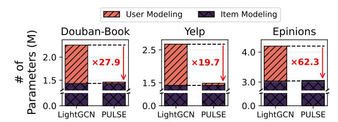
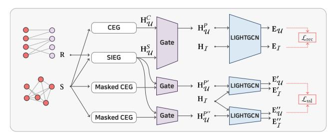
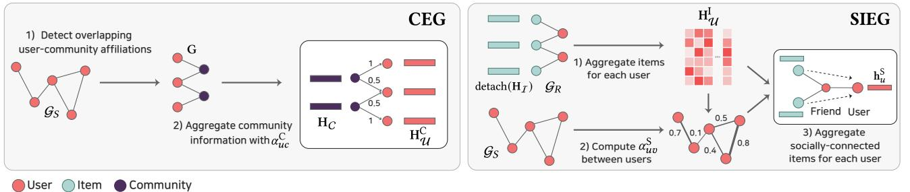
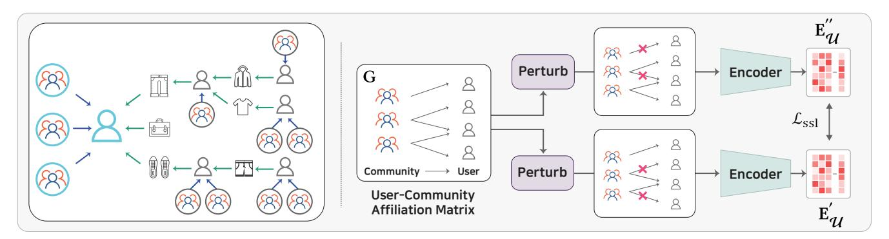
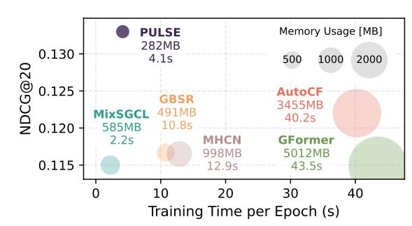
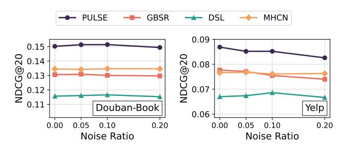
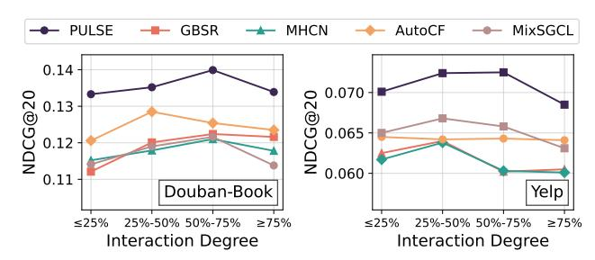
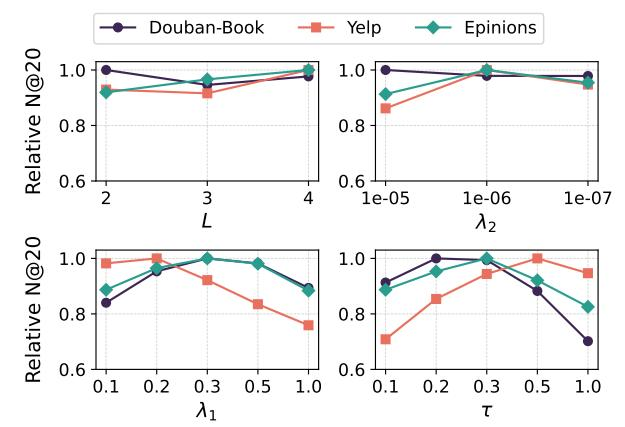

# PULSE: Socially-Aware User Representation Modeling Toward Parameter-Efficient Graph Collaborative Filtering

Doyun Choi∗ Korea Advanced Institute of Science and Technology Daejeon, South Korea doyun.choi@kaist.ac.kr

Cheonwoo Lee∗ Korea Advanced Institute of Science and Technology Daejeon, South Korea cheonwoo.lee@kaist.ac.kr

Biniyam Aschalew Tolera Korea Advanced Institute of Science and Technology Daejeon, South Korea binasc@kaist.ac.kr

Taewook Ham Korea Advanced Institute of Science and Technology Daejeon, South Korea htw0618@kaist.ac.kr

Chanyoung Park Korea Advanced Institute of Science and Technology Daejeon, South Korea cy.park@kaist.ac.kr

Jaemin Yoo Korea Advanced Institute of Science and Technology Daejeon, South Korea jaemin@kaist.ac.kr

#### Abstract

Graph-based social recommendation (SocialRec) has emerged as a powerful extension of graph collaborative filtering (GCF), which leverages graph neural networks (GNNs) to capture multi-hop collaborative signals from user-item interactions. These methods enrich user representations by incorporating social network information into GCF, thereby integrating additional collaborative signals from social relations. However, existing GCF and graph-based SocialRec approaches face significant challenges: they incur high computational costs and suffer from limited scalability due to the large number of parameters required to assign explicit embeddings to all users and items. In this work, we propose PULSE (Parameterefficient User representation Learning with Social Knowledge), a framework that addresses this limitation by constructing user representations from socially meaningful signals without creating an explicit learnable embedding for each user. PULSE reduces the parameter size by up to 50% compared to the most lightweight GCF baseline. Beyond parameter efficiency, our method achieves stateof-the-art performance, outperforming 13 GCF and graph-based social recommendation baselines across varying levels of interaction sparsity, from cold-start to highly active users, through a timeand memory-efficient modeling process. Our implementation is available at [https://github.com/cdy9777/PULSE.](https://github.com/cdy9777/PULSE)

# CCS Concepts

# • Information systems → Collaborative filtering.

# Keywords

Graph Collaborative Filtering; Social Recommendation; Parameter-Efficient User Representation Modeling; Scalable Recommendation

∗Both authors contributed equally to this research.

[This work is licensed under a Creative Commons Attribution 4.0 International License.](https://creativecommons.org/licenses/by/4.0)

WWW '26, Dubai, United Arab Emirates © 2026 Copyright held by the owner/author(s). ACM ISBN 979-8-4007-2307-0/2026/04 <https://doi.org/10.1145/3774904.3792228>

#### ACM Reference Format:

Doyun Choi, Cheonwoo Lee, Biniyam Aschalew Tolera, Taewook Ham, Chanyoung Park, and Jaemin Yoo. 2026. PULSE: Socially-Aware User Representation Modeling Toward Parameter-Efficient Graph Collaborative Filtering. In Proceedings of the ACM Web Conference 2026 (WWW '26), April 13–17, 2026, Dubai, United Arab Emirates. ACM, New York, NY, USA, [12](#page-11-0) pages. <https://doi.org/10.1145/3774904.3792228>

#### Resource Availability:

The source code of this paper has been made publicly available at [https:](https://doi.org/10.5281/zenodo.18295272) [//doi.org/10.5281/zenodo.18295272.](https://doi.org/10.5281/zenodo.18295272)

#### 1 Introduction

Recommender systems have become indispensable tools for providing personalized experiences across various domains, such as e-commerce [\[35,](#page-8-0) [53\]](#page-8-1), online streaming [\[10,](#page-8-2) [14\]](#page-8-3), and social networking platforms [\[1,](#page-8-4) [2\]](#page-8-5). Traditional systems rely on interaction histories between users and items to model user preferences. However, in real-world scenarios, most interactions are observed implicitly through behaviors such as clicks or views [\[19\]](#page-8-6). This implicit setting introduces ambiguity, making it difficult to reliably capture user intent. Social recommendation (SocialRec) [\[13,](#page-8-7) [43\]](#page-8-8) has emerged as a promising alternative by incorporating social relationships between users as auxiliary signals. It utilizes the social network for more accurate modeling of user behavior, based on social theories such as social homophily [\[22,](#page-8-9) [45\]](#page-8-10) and social influence [\[17,](#page-8-11) [44\]](#page-8-12).

Evolving from early approaches primarily based on matrix factorization [\[24,](#page-8-13) [43\]](#page-8-8), the field has advanced significantly with the advent of graph collaborative filtering (GCF) [\[6,](#page-8-14) [15,](#page-8-15) [61\]](#page-8-16). GCF leverages the power of graph neural networks (GNNs) to detect collaborative signals in user-item interactions, which can be naturally represented as a bipartite graph. This enables user and item representations to incorporate higher-order neighbor information during the GCF encoding process. Similarly, social networks can also be represented as graphs, allowing GNN-based models to capture higher-order relationships among users, as well as between users and items [\[34,](#page-8-17) [63\]](#page-8-18). These graphs are fed into GCF models [\[4,](#page-8-19) [15,](#page-8-15) [42,](#page-8-20) [61\]](#page-8-16), either independently or in combination with user-item interactions, to generate enriched user representations and yield improved recommendation. We refer to this class of methods as graph-based SocialRec.

Figure 1: Comparison of the number of parameters between LightGCN and PULSE. PULSE reduces parameters by millions compared to LightGCN, the most lightweight GCF model.

In both GCF and graph-based SocialRec approaches, each user is assigned a parameterized embedding that is updated during training, since explicit user information is often unavailable. However, this architecture implies that the number of learnable parameters grows linearly with the number of users. Such growth becomes a major bottleneck in these approaches, leading to extremely high computational costs for datasets with large user sets and raising scalability concerns [\[38,](#page-8-21) [72\]](#page-9-0). Furthermore, given the sparsity of interaction data, it is difficult to train all user embeddings effectively, which intensifies overfitting issues [\[3,](#page-8-22) [61\]](#page-8-16). This limitation remains unresolved in existing graph-based SocialRec methods and, even worse, is often exacerbated by the introduction of additional parameters for social information refinement [\[67,](#page-9-1) [68,](#page-9-2) [70\]](#page-9-3).

In this work, we specifically highlight this limitation and propose PULSE (Parameter-efficient User representation Learning with Social Knowledge), a new way for generating user representations in a highly parameter-efficient manner. Unlike prior graph-based SocialRec approaches, which focus on improving recommendation accuracy at the expense of additional computational costs, we aim to achieve both high accuracy and parameter-efficiency at the same time by leveraging social information as additional user features.

Specifically, from the perspective of user modeling, we use social information to construct socially aware user representations without relying on explicit learnable user embeddings. We propose two modules to this end: community-aware user embedding generation (CEG) and socially-connected item-aware user embedding generation (SIEG). These modules incorporate different types of social signals into user modeling: community structures to which users belong and items with which their social neighbors have interacted. We further integrate these distinct signals in a user-adaptive manner and train all components through recommendation and self-supervised objectives to reduce potential noise that may occur from our novel user modeling architecture. Figure [1](#page-1-0) shows that our approach saves the majority of parameters that would otherwise be required for assigning learnable embeddings to all users, reducing millions of parameters compared to the most lightweight GCF baseline.

We conduct extensive experiments to evaluate the effectiveness of PULSE across diverse recommendation scenarios. PULSE consistently outperforms 13 GCF and graph-based SocialRec baselines across three datasets, with clear performance margins. Moreover, it remains robust under varying levels of interaction sparsity, from cold-start to highly active users, as well as under noisy social networks. All these results are achieved with highly efficient computational cost. Our main contributions are summarized as follows:

- Novelty: To the best of our knowledge, PULSE is the first trial to propose a new type of socially-aware embedding generation as an alternative to conventional graph-based user modeling. This is even achieved in a highly parameter-efficient manner.
- Efficiency: PULSE significantly reduces the parameter size of graph-based recommendation by up to 50% compared to Light-GCN [\[15\]](#page-8-15). It also exhibits linear time complexity with respect to the size of user-item interactions and the social network.
- Performance: Our method achieves substantial performance gains in recommendation, with NDCG@20 increasing by 9.0%, 8.1%, and 8.5% over the best competitors across three datasets. It also demonstrates robustness for users with sparse interactions as well as under noisy social network conditions.

#### 2 Problem and Related Works

#### 2.1 Problem Definition

Let U = {���� } ��=1 be the set of users and I = {���� } ��=1 be the set of items, where �� is the number of users and �� is the number of items. Let R ∈ {0, 1} ��×�� be the interaction matrix between users and items, where ����,�� = 1 if user �� has interacted with item �� and ����,�� = 0 otherwise. In addition, let S ∈ {0, 1} ��×�� be an (undirected) social relation matrix between users, where ����,�� = 1 if user �� is socially connected to user �� and ����,�� = 0 otherwise. The goal of SocialRec is to predict user behavior toward items, i.e., recommendation, by utilizing the given R in conjunction with S.

Graph-based SocialRec models the data as graphs to generate better representations of users and items. For R, we construct a bipartite graph G�� = (V��, E��), where the node set is V�� = U ∪ I and the edge set is E�� = {(��,��) | �� ∈ U,�� ∈ I, ����,�� = 1}. This graph can be represented by the following adjacency matrix:

A�� = 0 R R ⊤ 0 . (1)

Similarly, we construct a social graph G�� = (V��, E�� ), with the node set V�� = U and the edge set E�� = {(��, ��) | ��, �� ∈ U, ����,�� = 1}. The social relation matrix S itself serves as the adjacency matrix A�� .

# 2.2 Graph-Based Social Recommendation

SocialRec methods have emerged as powerful tools for enhancing user modeling in recommender systems by integrating social trust information into user embeddings, enabling them to capture dependencies between users [\[13,](#page-8-7) [24\]](#page-8-13). With the advent of graph collaborative filtering (GCF), which leverages graph neural networks (GNNs) to incorporate multi-hop collaborative signals from user-item interaction histories via message propagation, a variety of methods have been proposed to exploit social network structures as graphs and integrate them into recommender systems, such as DiffNet [\[63\]](#page-8-18), RecoGNN [\[65\]](#page-9-4), and SocialLGN [\[34\]](#page-8-17).

Recent work in graph-based SocialRec has incorporated the principles of social networks into user modeling. For example, LSIR [\[37\]](#page-8-23) leverages the theory of social homophily, where users form groups with similar preferences when modeling user representations. In contrast, CGCL [\[20\]](#page-8-24) focuses on social influence, capturing how highly influential individuals shape the preferences of others. DISGCN [\[31\]](#page-8-25) combines both perspectives.

Figure 2: The overall framework of PULSE. CEG incorporates community information for each user, while SIEG integrates item information from social neighbors. These distinct signals are fused adaptively for each user through a gating network. The resulting user embeddings are passed to LightGCN with item embeddings, and optimized using a recommendation and an additional self-supervised loss. Refer to Figure [3](#page-3-0) and [4](#page-4-0) for more detailed illustration of the components.

However, real-world social networks are often incomplete and contain unreliable links. Many approaches have increasingly focused on denoising techniques to improve the robustness of recommendations. Preference-driven mechanisms remove weak or noisy edges to enhance the social network structure [\[21,](#page-8-26) [25,](#page-8-27) [49,](#page-8-28) [68\]](#page-9-2), while diffusion-based approaches suppress noise by propagating signals in latent spaces to preserve meaningful relations [\[32,](#page-8-29) [55\]](#page-8-30). Alongside these, self-supervised learning (SSL) has emerged as a powerful tool for enhancing embedding quality by improving the discriminability of learned representations [\[60,](#page-8-31) [69,](#page-9-5) [70\]](#page-9-3).

However, these methods still follow the conventional GCF paradigm, relying on learnable embedding parameters for users and items to generate their representations. Even worse, the introduction of additional parameters for refining social network information further deteriorates storage efficiency and poses scalability challenges when applied to large-scale datasets. In this work, we propose a new way of leveraging social information that shifts the focus toward improving parameter efficiency and generalizability, while generating robust user representations well-suited for recommendation tasks.

# 3 Proposed Method

We introduce PULSE, our framework for incorporating social information into user representations in a parameter-efficient manner; our goal is to avoid having dedicated parameters for each individual user by leveraging social signals in a principled manner.

Figure [2](#page-2-0) illustrates the overall structure of PULSE, which comprises three key components for incorporating disentangled social information into user representations: (a) community-aware user embedding generation (CEG), (b) socially-connected item-aware user embedding generation (SIEG), and (c) an adaptive fusion module for disentangled social information. Beyond the architectural design, we further introduce a self-supervised learning objective that mitigates the impact of misleading biases in user modeling.

#### 3.1 Overview

At its core, PULSE generates user embeddings using CEG and SIEG, which incorporate socially meaningful signals into user representations from distinct perspectives: higher-order community structures

and items interacted with by social neighbors, respectively. The outputs of these modules, h C and h S , are combined to form the socially informed representation of each user ��:

h P �� = ����h C �� + (1 − ����)h S , (2)

where h C and h S �� denote the user representations from CEG and SIEG, respectively. The parameter ���� adaptively balances the contributions of the two signals for user ��. Details on ���� are provided in Section [3.4.](#page-4-1)

Encoding and Prediction. After generating socially-aware user embeddings H P U ∈ R ��×�� , we provide them to a graph collaborative filtering (GCF) encoder, along with the learnable item embeddings HI ∈ R ��×�� and the adjacency matrix A��:

EU, EI = GCF( [H P U ; HI], A��). (3)

In this work, we adopt LightGCN [\[15\]](#page-8-15) as the backbone encoder, which is parameter-efficient yet achieves strong recommendation performance. It updates user and item embeddings as follows:

E (��) = D −1/2 A��D −1/2 �� E (��−1) , �� = 1, 2, . . . , ��, (4)

where E (��) ∈ R (��+��)×�� contains both item and user embeddings at layer ��, D�� is the degree matrix of A��, and the initial embeddings are E (0) = [H P U ; HI]. Then, the representations are merged as:

EU = �� ��=0 E (��) U , EI = �� ��=0 E I . (5)

The resulting EU and EI serve as the final representations of users and items for predictions. The prediction for user �� and item �� is done by computing the dot product: ��ˆ��,�� = e ⊤ e�� .

Training. The training of PULSE is done as multi-task learning that integrates the recommendation task with self-supervised regularization. The objective function is given as:

L (��) = Lrec (��) + ��1Lssl(��) + ��2 ||�� ||2 2 , (6)

where �� is the set of all trainable parameters, Lrec is the loss for the recommendation task, Lssl is the self-supervised loss, and the L2 regularization term is applied. The coefficients ��1 and ��2 control the balance between the three terms during training.

We adopt the Bayesian Personalized Ranking (BPR) [\[51\]](#page-8-32) as the recommendation loss Lrec as follows:

Lrec (��) = − Í (��,��,��) ∈D log ��(��ˆ��,�� − ��ˆ��,��), (7)

where D = {(��,��, ��) : ����,�� = 1, ����,�� = 0} contains both positive and negative samples, and �� is the sigmoid function. Lrec encourages the model to assign higher predicted scores to positive interactions compared to negative ones, as done in typical GCF models.

The detailed formulation of the self-supervised loss Lssl will be provided in Section [3.5,](#page-4-2) after introducing our main components.

# 3.2 Community-Aware User Embedding Generation (CEG)

Community structures provide a high-level abstraction of social relationships that shape users' preferences [\[28\]](#page-8-33). Identifying these structures helps reveal patterns in collective user behavior, as users with similar interests tend to belong to the same community across various domains [\[8\]](#page-8-34). The role of community information in social recommendation has been extensively explored [\[11,](#page-8-35) [30,](#page-8-36) [36,](#page-8-37) [46,](#page-8-38) [47,](#page-8-39)

Figure 3: Visualization of the key modules. (Left) CEG leverages overlapping user-community affiliation information obtained through a community detection algorithm. It generates H C U by aggregating community embeddings with weights �� C ���� , determined by social user degrees in G. (Right) SIEG incorporates socially-connected item information; it computes �� ���� based on behavioral similarity between users, which is then applied in the aggregation of socially-connected items into H S U .

[52,](#page-8-40) [56\]](#page-8-41). Building on this insight, we propose community-aware user embedding generation (CEG) for integrating community signals into user modeling in a simple and efficient manner. An overview of CEG is shown on the left side of Figure [3.](#page-3-0)

Community Detection. Our first stage is to detect user communities inherent in the structure of the social network G�� , while we have two main points to consider. First, we aim to detect overlapping communities, allowing each user to be associated with multiple social groups, as users often belong to multiple social groups with diverse semantics (e.g., friends, family, and colleagues). Second, given the massive scale of social networks, we require community detection techniques that are both scalable and effective. Among various design choices for overlapping community detection, we adopt a lightweight two-step procedure inspired by a recent approach [\[16\]](#page-8-42). While end-to-end community detection methods (e.g., differentiable clustering) are viable alternatives, they typically rely on additional learnable embeddings and costly iterative updates, which conflict with our efficiency objective.

First, we apply the Leiden algorithm [\[58\]](#page-8-43), a method well known for its scalability and effectiveness in community detection, to obtain an initial non-overlapping partition. Second, we convert this partition into an overlapping affiliation by iteratively adding a user to neighboring communities whenever the inclusion of that user increases the modularity of those communities beyond a fixed threshold. Details of this algorithm are provided in Appendix [A.](#page-9-6)

Based on the user communities, we obtain a user-community affiliation matrix G ∈ R ��× | C |, where ����,�� = 1 indicates that user �� belongs to community �� ∈ C. Here, �� and |C| denote the number of users and detected communities, respectively. For those communities, we assign learnable community embeddings HC ∈ R | C |×�� , which are optimized end-to-end during training. By learning them jointly with the recommendation objective, users within the same community effectively share community-level information.

User Representations. To effectively incorporate community signals into each user, we adopt a message propagation mechanism widely used in GNNs [\[27,](#page-8-44) [66\]](#page-9-7). The user-community affiliation matrix G is interpreted as the adjacency matrix of a bipartite graph G�� = (V��, E�� ) between users and communities, where the node set is V�� = U ∪ C and the edge set is E�� = {(��, ��) | �� ∈ U, �� ∈ C, ����,�� = 1}. Using this graph, we generate user embeddings that

incorporate their associated community signals as follows:

h C �� = Í ��∈N�� (��) �� C ����h�� , (8)

where N�� (��) denotes the set of communities to which user �� belongs, and �� C ���� controls the influence of each community �� on user ��. For simplicity, we set �� C ���� = |N�� (��)|−1 such that each community signal contributes equally to modeling user representations.

# 3.3 Socially-Connected Item-Aware User Embedding Generation (SIEG)

The core idea of socially-connected item-aware user embedding generation (SIEG) is to enrich user representations by incorporating signals from items beyond those directly connected, using social connections as an auxiliary information source. According to the theory of social influence, individuals' interaction behaviors often affect one another, and the items they purchase tend to be similar [\[7,](#page-8-45) [44\]](#page-8-12). From this perspective, we propose that items interacted with by a user's friends serve as valuable signals for modeling the target user's preferences [\[74\]](#page-9-8). We incorporate this information into the user modeling process alongside directly connected item information and denote these items as socially connected items. The right side of Figure [3](#page-3-0) provides an overview of SIEG.

Social Item Aggregation. We first aggregate item signals for each user based on the items with which they have interacted:

h I �� = ∑︁ ��∈N�� (��) 1 √︁ ���� (��) √︁ ���� (��) detach(h��), (9)

where N�� (��) denotes the set of items that user �� has interacted with, and ���� (·) is the degree of a node in the interaction matrix R. The detached embedding detach(h��) prevents the gradient from flowing to the learnable parameter h�� during this process. This is to ensure that the item embeddings are learned only through the GCF encoding process and are not affected by the social signals.

We then aggregate these signals using a message propagation mechanism in the social graph G�� as follows:

h S �� = ∑︁ ��∈N�� (��) S √︁ ���� (��) √︁ ���� (��) h I , (10)

where N�� (��) denotes the set of neighbors of user �� in S, ���� (·) is the degree of a user in the social network G�� , and �� S ���� is the attention weight that controls the influence of each neighbor on user ��.

Figure 4: Illustration of self-supervised learning in PULSE. (Left) While generating community-aware user representations H C , the large receptive field from stacked GNN layers can introduce irrelevant community signals, potentially degrading the quality of representations. (Right) To address this, we create augmented views by randomly masking affiliation information in G and apply a self-supervised loss Lssl that encourages the retained signals to align with the user's most relevant communities.

Social Attention. As demonstrated by many existing SocialRec approaches [\[25,](#page-8-27) [32\]](#page-8-29), social connections do not exert the same level of influence on the target user. This highlights the need to account for user influence when aggregating item information. We propose a mechanism to control the attention to aggregate item signals.

The user representations H I obtained by integrating item interaction signals represent users' behavioral characteristics. From this perspective, we compute the behavioral similarity for each socially connected pair of users (��, ��) ∈ E�� as follows:

S ���� = 1 2 (1 + sim(h I , h I )) exp − 1 2�� 2 ∥h I �� − h I , (11)

where sim(h I , h I ) denotes the cosine similarity between the embeddings of users �� and ��. This combines the normalized cosine similarity between h I and h I �� with a radial basis function (RBF) kernel, thereby capturing both angular alignment and magnitude consistency, as suggested by [\[5\]](#page-8-46). We then normalize each similarity �� S ���� based on the degrees of users �� and �� in the social network as �� S ����/ √︁ ���� (��)���� (��). This mitigates the risk that high-degree nodes dominate representations by mixing excessive information, while low-degree nodes remain under-represented.

With the social attention technique, we effectively incorporate information from socially connected items, with weights controlled by both users' behavioral similarity and their structural properties in the social network. This approach provides more reliable signals for user modeling in addition to the community signals of CEG.

# 3.4 User-Adaptive Social Information Fusion

We integrate the distinct social information captured by our two modules, CEG and SIEG, in a user-adaptive manner. For each user ��, we combine the two embeddings h C and h S �� with learnable weights, which are learned jointly with the recommendation objective. Inspired by the gating network [\[23,](#page-8-47) [41\]](#page-8-48), which takes disentangled embeddings as input and generates weights through a lightweight MLP, we define the adaptive weight ���� as follows:

���� = ��1 (��2 ( [h C ; h S ]W1)W2), (12)

where W1 and W2 are the learnable weights of the two-layer MLP, while ��1 and ��2 denote activation functions set to the sigmoid and

LeakyReLU functions, respectively. Using ����, we integrate the two social signals adaptively for each user, as described in Equation [\(2\)](#page-2-1). This step ensures that the social information most relevant to the recommendation task—varying across users and datasets—exerts stronger influence in the final representation.

# 3.5 Self-Supervised Learning for Regularizing Community Signals

Our CEG module creates a user embedding H C as a weighted average of community embeddings HC containing the user ��, based on the user-community membership G identified by our overlapping community detection algorithm. As depicted by the blue and green paths on the left side of Figure [4,](#page-4-0) the design of PULSE allows us to effectively combine those community-level signals and user–item interaction information in the final user representations, but introduces two notable limitations that we aim to address through self-supervised learning.

First, for each user ��, the information from communities that are irrelevant to �� is largely included in their final representation e�� as a result of subsequent message passing on the user-item interaction graph. This can make user representations overly smooth compared to previous approaches that have explicit learnable embeddings for users. Second, the community memberships may contain structural or statistical biases as they are extracted from our detection algorithm without ground-truth labels. If such biased assignments are not aligned with the users' actual preferences, the user embeddings may incorporate conflicting community signals.

To address these limitations, we adopt contrastive learning that regularizes community-aware user representations by promoting consistency across perturbed views. The right side of Figure [4](#page-4-0) illustrates the self-supervised learning process. We first create two augmented views for each user by randomly masking a proportion of the non-zero entries in the user-community matrix G. Then, we use InfoNCE [\[59\]](#page-8-49) as the objective function, which is defined as:

Lssl(��) = − ∑︁ ��∈U log exp(sim(e ′ , e ′′ )/��) Í ��∈U exp(sim(e ′ ��, e )/��) , (13)

Table 1: Performance comparison between PULSE and GCF and graph-based SocialRec models on cold-start users. PULSE generates effective user representations for these users and maintains strong recommendation performance.

| Method       | R@10  | R@20  | Douban-Book N@10 | N@20  | R@10  | R@20  | Yelp N@10 | N@20  |
|--------------|-------|-------|------------------|-------|-------|-------|-----------|-------|
| LightGCN     | .0247 | .0307 | .0275            | .0274 | .0277 | .0393 | .0184     | .0219 |
| GBSR         | .0161 | .0279 | .0236            | .0265 | .0613 | .0933 | .0382     | .0477 |
| PULSE (ours) | .0387 | .0617 | .0499            | .0542 | .0666 | .0922 | .0426     | .0507 |

where sim() is the cosine similarity, and �� is a temperature hyperparameter. Here, e ′ and e ′′ represent two independently perturbed views of user ��'s representation. We control the ratio of masking for creating each view as a hyperparameter 0 &lt; �� &lt; 1.

By incorporating this objective, we effectively address both limitations. First, we control the influence of communities that are less relevant to each target user. The InfoNCE loss maximizes the mutual information between two augmented views for each user [\[57\]](#page-8-50). By jointly optimizing this term alongside the main recommendation loss, the model is guided to produce consistent representations centered around the user's most relevant communities. Second, we mitigate potential bias in G by exposing the model to diverse, perturbed versions of it. This encourages the model to produce consistent outputs across varying views, thereby improving its robustness to noise and instability in community memberships.

# 4 Analysis and Discussion

In this section, we analyze the effectiveness of PULSE in terms of storage efficiency (i.e., the number of parameters). For time efficiency, we provide a detailed time-complexity analysis in Appendix [B.](#page-9-9) Furthermore, we present toy experimental results demonstrating the robustness of our user modeling for cold-start users.

Parameter-Efficient User Modeling. PULSE drastically reduces the number of learnable parameters required for user modeling and eliminates the linear parameter growth with respect to the number of users. In our design, user modeling requires only the embeddings of communities, which are far fewer in number than actual users, along with the weight parameters of the gating network.

To validate the parameter efficiency of PULSE, in Figure [1,](#page-1-0) we compare the number of parameters against LightGCN [\[15\]](#page-8-15), the most lightweight GCF model. PULSE substantially reduces the number of parameters required for modeling user representations, decreasing the overall parameter size by millions. Specifically, it achieves reductions of approximately 36% on Douban-Book, 45% on Yelp, and 28% on Epinions in terms of total parameters. This significantly lowers computational costs and improves the scalability of recommender systems especially when the number of users is large.

Generalizable User Modeling for Cold-Start Users. Providing accurate recommendations for cold-start users, who have not interacted with any items in the training data, is a critical yet highly challenging problem in GCF [\[33,](#page-8-51) [39,](#page-8-52) [48\]](#page-8-53). By incorporating recommendationspecific community signals and socially connected item signals from their friends, we generalize our model to these users.

We design a dedicated experiment to validate this point. From the original dataset, we randomly sample 500 users as the cold-start

Table 2: Dataset statistics.

| Dataset     |    |                  | Douban-Book | Yelp    | Epinions |
|-------------|----|------------------|-------------|---------|----------|
| #           | of | Users            | 13,024      | 19,539  | 18,202   |
| #           | of | Items            | 22,347      | 22,228  | 47,449   |
| #           | of | Interactions     | 598,420     | 450,884 | 338,400  |
| Interaction |    | Density (%)      | 0.206       | 0.104   | 0.039    |
| #           | of | Social Relations | 169,150     | 727,384 | 595,259  |
| Social      |    | Relation Density | (%) 0.100   | 0.191   | 0.180    |

set and remove their interaction histories from the training data. During inference, we evaluate the recommendation performance on the 500 held-out cold-start users. We compare our method against LightGCN [\[15\]](#page-8-15) and GBSR [\[68\]](#page-9-2) under the same conditions on two datasets (Douban-Book and Yelp). GBSR is chosen as a representative graph-based SocialRec method due to its strong performance in the original setting (as shown in Section [5.2\)](#page-6-0).

As shown in Table [1,](#page-5-0) PULSE achieves strong performance for cold-start users compared to the baselines. LightGCN, which relies solely on user-item interaction histories, fails to provide effective recommendations for cold-start users across both datasets. GBSR performs well on Yelp, which contains abundant social information, but falls below LightGCN on Douban-Book, where social information is relatively sparse. This suggests that its effectiveness is highly dependent on the characteristics of social information in each dataset. By contrast, our approach leverages community information and socially-connected item embeddings, aggregated through an adaptive gating network, to generate strong and generalizable representations for cold-start users.

## 5 Experiments

We conduct comprehensive experiments to empirically validate the effectiveness of PULSE. In addition to the results presented in this section ([§5.2](#page-6-0) - [§5.5\)](#page-7-0), we provide ablation studies, hyperparameter sensitivity analyses, comparisons with parameter-efficient Light-GCN variants, and robustness to adversarial noise in Appendix [D.](#page-10-0)

# 5.1 Experimental Settings

We run all experiments using SSLRec [\[50\]](#page-8-54), a popular framework that provides implementations of diverse baselines and datasets.

Datasets. We use three popular datasets for social recommendation: Douban-Book[1](#page-5-1) , Yelp[2](#page-5-2) , and Epinions[3](#page-5-3) , following [\[68\]](#page-9-2). Each dataset is divided into training, validation, and test sets in a 6:2:2 ratio. Their statistics are given in Table [2.](#page-5-4)

Baselines. We compare PULSE against six state-of-the-art graphbased SocialRec models and seven advanced GCF approaches.

For GCF baselines, LightGCN [\[15\]](#page-8-15) simplifies graph convolution by removing feature transformation and nonlinear activation. SGL [\[62\]](#page-8-55) introduces contrastive learning with randomly perturbed graph views, while SimGCL [\[71\]](#page-9-10) performs lightweight contrastive

1[https://github.com/librahu/HIN-Datasets-for-Recommendation-and-Network-](https://github.com/librahu/HIN-Datasets-for-Recommendation-and-Network-Embedding)[Embedding](https://github.com/librahu/HIN-Datasets-for-Recommendation-and-Network-Embedding)

2<https://github.com/Coder-Yu/QRec>

3[http://www.trustlet.org/downloadedepinions.html](http://www.trustlet.org/downloaded epinions.html)

Table 3: Performance comparison between PULSE and baselines. PULSE consistently outperforms all baselines across different datasets and evaluation metrics, demonstrating its effectiveness. Bold values indicate the best performance, while underlined values represent the second-best (R = Recall, N = NDCG). We also report the improvement of PULSE over the best competitor.

| Method       | R@10   | R@20   | R@40  | Douban-Book N@10 | N@20  | N@40  | R@10  | R@20  | R@40  | Yelp N@10 | N@20  | N@40  | R@10  | R@20  | R@40  | Epinions N@10 | N@20  | N@40  |
|--------------|--------|--------|-------|------------------|-------|-------|-------|-------|-------|-----------|-------|-------|-------|-------|-------|---------------|-------|-------|
| LightGCN     | .0866  | .1311  | .1915 | .0959            | .1058 | .1244 | .0618 | .1012 | .1566 | .0448     | .0568 | .0718 | .0403 | .0619 | .0938 | .0288         | .0352 | .0437 |
| SGL          | .0894  | .1328  | .1882 | .1010            | .1104 | .1277 | .0691 | .1093 | .1660 | .0500     | .0622 | .0777 | .0412 | .0640 | .0933 | .0293         | .0362 | .0441 |
| SimGCL       | .0890  | .1321  | .1896 | .1015            | .1107 | .1286 | .0688 | .1092 | .1664 | .0501     | .0625 | .0780 | .0414 | .0653 | .0962 | .0294         | .0366 | .0449 |
| LightGCL     | .0800  | .1198  | .1654 | .0937            | .1020 | .1159 | .0667 | .1042 | .1581 | .0490     | .0605 | .0753 | .0420 | .0634 | .0945 | .0305         | .0369 | .0452 |
| Gformer      | .0930  | .1349  | .1905 | .1064            | .1149 | .1321 | .0651 | .1046 | .1597 | .0471     | .0592 | .0742 | .0386 | .0604 | .0890 | .0277         | .0343 | .0420 |
| AutoCF       | .0963  | .1389  | .1927 | .1142            | .1220 | .1382 | .0707 | .1097 | .1668 | .0523     | .0643 | .0800 | .0386 | .0601 | .0895 | .0272         | .0337 | .0416 |
| MixSGCL      | .0956  | .1399  | .1941 | .1063            | .1155 | .1319 | .0711 | .1124 | .1680 | .0527     | .0653 | .0803 | .0419 | .0640 | .0913 | .0303         | .0369 | .0443 |
| MHCN         | .0948  | .1412  | .2001 | .1069            | .1165 | .1345 | .0678 | .1052 | .1605 | .0499     | .0615 | .0766 | .0420 | .0649 | .0978 | .0304         | .0373 | .0461 |
| DSL ∗        |        |        |       |                  |       |       |       |       |       |           |       |       |       |       |       |               |       |       |
|              | .0808  | .1227  | .1776 | .0897            | .0987 | .1157 | .0576 | .0950 | .1450 | .0418     | .0534 | .0670 | .0392 | .0606 | .0900 | .0279         | .0343 | .0421 |
| GDMSR ∗      |        |        |       |                  |       |       |       |       |       |           |       |       |       |       |       |               |       |       |
|              | .0580  | .0903  | .1406 | .0652            | .0724 | .0875 | .0501 | .0824 | .1312 | .0353     | .0453 | .0584 | .0308 | .0499 | .0768 | .0218         | .0275 | .0345 |
| GBSR         | .0935  | .1352  | .1840 | .1092            | .1167 | .1306 | .0690 | .1094 | .1684 | .0494     | .0618 | .0777 | .0446 | .0671 | .1001 | .0320         | .0388 | .0476 |
| RecDiff ∗    |        |        |       |                  |       |       |       |       |       |           |       |       |       |       |       |               |       |       |
|              | .0736  | .1165  | .1724 | .0830            | .0933 | .1107 | .0557 | .0924 | .1457 | .0398     | .0510 | .0655 | .0315 | .0507 | .0800 | .0220         | .0279 | .0358 |
| SGIL         | .0917  | .1350  | .1885 | .1067            | .1146 | .1303 | .0628 | .0977 | .1491 | .0468     | .0576 | .0717 | .0408 | .0633 | .0939 | .0288         | .0355 | .0438 |
| PULSE (ours) | .1079  | .1562  | .2146 | .1238            | .1330 | .1502 | .0773 | .1214 | .1818 | .0572     | .0706 | .0869 | .0478 | .0727 | .1061 | .0347         | .0421 | .0510 |
|              | +12.0% | +10.6% | +7.2% | +8.4%            | +9.0% | +8.7% | +8.7% | +8.0% | +8.0% | +8.5%     | +8.1% | +8.2% | +7.2% | +8.3% | +6.0% | +8.4%         | +8.5% | +7.1% |

∗ The experimental settings differ from those in the original papers, including the use of validation data for better reproducibility. See Appendix [C](#page-9-11) for details.

regularization through stochastic embedding perturbations. Light-GCL [\[3\]](#page-8-22) constructs augmentation-free spectral views via singular value decomposition for global structural refinement. AutoCF [\[64\]](#page-8-56) and GFormer [\[29\]](#page-8-57) extend the masked autoencoder paradigm to graph recommendation: the former introduces structure-adaptive augmentation, whereas the latter captures invariant collaborative rationales inspired by graph transformers. MixSGCL [\[73\]](#page-9-12) further performs node- and edge-level mixup to synthesize informative contrastive views and alleviate gradient inconsistency.

For SocialRec models, MHCN [\[70\]](#page-9-3) captures higher-order social ties via hypergraph convolution coupled with self-supervision, and DSL [\[60\]](#page-8-31) aligns interaction- and socially driven semantics through contrastive learning. GDMSR [\[49\]](#page-8-28) introduces a preferenceguided denoising mechanism with a self-correcting curriculum, while GBSR [\[68\]](#page-9-2) employs the information bottleneck principle to obtain a minimal yet sufficient denoised social graph. RecDiff [\[32\]](#page-8-29) reconstructs reliable social signals via a hidden-space diffusion process, and SGIL [\[67\]](#page-9-1) further refines this idea by introducing latent diffusion for iterative noise propagation and relation recovery.

Hyperparameters. All learnable parameters are initialized using Xavier initialization [\[9\]](#page-8-58). We train all models using the Adam optimizer [\[26\]](#page-8-59) with a fixed learning rate of 10−3 and a batch size of 4096. For fair and rigorous evaluation, hyperparameter configurations for all models, including PULSE, are determined through extensive grid search, with reference to the original papers of each method.

Evaluation Metrics. We evaluate model performance using two popular ranking-based metrics: Recall@�� and NDCG@�� [\[12,](#page-8-60) [54\]](#page-8-61), where �� is set to 10, 20, and 40. Each model is trained for up to 500 epochs with early stopping (patience = 15) based on NDCG@20, and results are reported from a single evaluation run. For evaluation, we consider all non-interacted items in the training set for each user as test candidates for a fair evaluation [\[75\]](#page-9-13).

Figure 5: Training efficiency analysis on the Douban-Book dataset. PULSE achieves both minimal memory usage and fast training, outperforming baselines in overall efficiency.

#### 5.2 Overall Performance

Table [3](#page-6-1) shows the performance of PULSE against state-of-the-art baseline models on the three benchmark datasets. PULSE consistently outperforms all baselines, including advanced GCF and graphbased SocialRec methods. Specifically, PULSE achieves improvements of 9.0%, 8.1%, and 8.5% in NDCG@20 over the second-best competitors across all datasets.

Notably, PULSE effectively mitigates the sparsity of user-item interactions by leveraging the relatively denser structure of the social network. This effect is particularly evident on the Epinions dataset, where user-item interactions are highly sparse while the social network is comparatively dense. In such settings, PULSE is able to capture robust social community signals and diverse socially connected item signals, leading to more informative user representations and, consequently, improved recommendation accuracy.

# 5.3 Training Efficiency of PULSE

To evaluate the computational efficiency of PULSE, we measure per-epoch training time and maximum GPU memory usage during training on the Douban-Book dataset. As shown in Figure [5,](#page-6-2) PULSE achieves minimal resource consumption while maintaining fast

Figure 6: Performance under varying levels of social noise on Douban-Book and Yelp. PULSE consistently demonstrates strong robustness to increasing noise.

Figure 7: Performance across different interaction degree groups on Douban-Book and Yelp. PULSE consistently outperforms baselines across all groups in both datasets.

training. Specifically, it requires only 4.1 seconds per epoch with a memory footprint of 282 MB, making it the most memory-efficient method among all baselines. In contrast, advanced GCF methods such as AutoCF (40.2s, 3455 MB) and GFormer (43.5s, 5012 MB) incur substantial computational overhead, while MixSGCL (2.2s, 585 MB), despite faster training, consumes significantly more memory. Graph-based SocialRec baselines, including GBSR (10.8s, 491 MB) and MHCN (12.9s, 998 MB), also lag behind PULSE in both training efficiency and memory usage. Furthermore, in terms of convergence speed, PULSE reaches its best performance in an average of 349 seconds across three datasets, which is comparable to MixSGCL (213s) and MHCN (316s), and substantially faster than GBSR (608s), AutoCF (2507s), and GFormer (1461s). These results demonstrate that PULSE enables cost-effective user representation learning, highlighting its practicality for large-scale recommendation.

#### 5.4 Robustness to Social Noise

PULSE exhibits strong resilience to noise in the social network. To evaluate this, we design an experiment in which noise is artificially injected into the social network. Specifically, for the Douban-Book and Yelp datasets, we randomly remove 5%, 10%, and 20% of the original social edges and replace them with randomly generated ones. We then compare the performance against the three strong baselines, GBSR, DSL, and MHCN. As shown in Figure [6,](#page-7-1) PULSE consistently maintains the strongest performance as the noise level increases. We attribute this resilience to its design: community-level signals, which are less sensitive to noisy connections, and socially connected items, whose influence is modulated by behavioral similarity between users, thereby ignoring spurious links.

#### 5.5 Robustness to Interaction Degrees

The superior performance of PULSE is observed not only for users with certain interaction degrees, but consistently across all users. To assess the robustness of the social signals leveraged by PULSE under varying interaction degrees, we conduct experiments by dividing users into four groups based on their interaction degree percentiles: 0–25%, 25–50%, 50–75%, and 75–100%. Performance is evaluated on Douban-Book and Yelp, as shown in Figure [7.](#page-7-2) PULSE consistently outperforms the strongest baselines across all interaction degree levels. Notably, even in the lowest interaction-degree group where user interactions are highly limited (Douban-Book: fewer than 8 interactions; Yelp: fewer than 4 interactions), PULSE maintains stable and strong performance on both datasets. This shows that the user representations generated by our approach capture meaningful social signals for recommendation more effectively than other methods that incorporate social information do.

#### 6 Conclusion

In this paper, we introduced PULSE, a novel approach enhancing the efficiency of graph collaborative filtering by reducing the reliance on explicit user embeddings through the use of socially derived information. PULSE leverages two types of meaningful social signals, communities to which users belong and items interacted with by their social neighbors, and integrates them effectively and adaptively via a gating network for user representation modeling. This design achieves superior performance, while requiring only a small fraction of the parameters used for user modeling in standard GCF settings. For future work, we plan to further improve the efficiency of GCF by extending our approach to reduce the cost of item embeddings. Beyond efficiency, we further extend the self-supervised objective to enable more robust representation learning under diverse noisy conditions in both interaction and social relations, beyond community-level structures. Additionally, we aim to broaden our parameter-efficient modeling framework by incorporating diverse meta features beyond social recommendation.

# Acknowledgments

This work was supported by the National Research Foundation of Korea (NRF) grant funded by the Korea government (MSIT) (RS-2024-00341425 and RS-2024-00406985). Jaemin Yoo is the corresponding author.

#### References

[1] Fabian Abel, Qi Gao, Geert-Jan Houben, and Ke Tao. 2011. Analyzing temporal dynamics in twitter profiles for personalized recommendations in the social web. In WebSci. [2] Fabian Abel, Qi Gao, Geert-Jan Houben, and Ke Tao. 2013. Twitter-Based User Modeling for News Recommendations.. In IJCAI. [3] Xuheng Cai, Chao Huang, Lianghao Xia, and Xubin Ren. 2023. LightGCL: Simple Yet Effective Graph Contrastive Learning for Recommendation. arXiv[:2302.08191](https://arxiv.org/abs/2302.08191) [4] Rui Chen, Jialu Chen, and Xianghua Gan. 2024. Multi-view graph contrastive learning for social recommendation. Scientific reports 14, 1 (2024), 22643. [5] Wenjie Chen, Yi Zhang, Honghao Li, Lei Sang, and Yiwen Zhang. 2025. Dual-Domain Collaborative Denoising for Social Recommendation. IEEE Transactions on Computational Social Systems (2025). [6] Doyun Choi, Cheonwoo Lee, and Jaemin Yoo. 2025. Simple and Behavior-Driven Augmentation for Recommendation with Rich Collaborative Signals. arXiv preprint arXiv:2511.00436 (2025). [7] Robert B. Cialdini and Noah J. Goldstein. 2004. Social Influence: Compliance and Conformity. Annual Review of Psychology 55, Volume 55, 2004 (2004), 591–621. [8] Fabio Gasparetti, Giuseppe Sansonetti, and Alessandro Micarelli. 2021. Community detection in social recommender systems: a survey. Applied Intelligence (2021), 3975–3995. [9] Xavier Glorot and Yoshua Bengio. 2010. Understanding the difficulty of training deep feedforward neural networks. In AISTATS. [10] Carlos A Gomez-Uribe and Neil Hunt. 2015. The netflix recommender system: Algorithms, business value, and innovation. ACM Transactions on Management Information Systems 6, 4 (2015), 1–19. [11] Jiewen Guan, Xin Huang, and Bilian Chen. 2021. Community-aware social recommendation: A unified SCSVD framework. IEEE Transactions on Knowledge and Data Engineering (2021), 2379–2393. [12] Asela Gunawardana and Guy Shani. 2009. A survey of accuracy evaluation metrics of recommendation tasks. Journal of Machine Learning Research (2009), 2935–2962. [13] Guibing Guo, Jie Zhang, and Neil Yorke-Smith. 2015. Trustsvd: Collaborative Filtering with Both the Explicit and Implicit Influence of User Trust and of Item Ratings. In AAAI. [14] F Maxwell Harper and Joseph A Konstan. 2015. The movielens datasets: History and context. Acm transactions on interactive intelligent systems (2015), 1–19. [15] Xiangnan He, Kuan Deng, Xiang Wang, Yan Li, YongDong Zhang, and Meng Wang. 2020. Lightgcn: Simplifying and Powering Graph Convolution Network for Recommendation. In SIGIR. [16] Do Duy Hieu and Phan Thi Ha Duong. 2024. Overlapping community detection algorithms using Modularity and the cosine. arXiv[:2403.08000](https://arxiv.org/abs/2403.08000) [17] Tad Hogg and Lada Adamic. 2004. Enhancing reputation mechanisms via online social networks. In EC. [18] Edward J Hu, Yelong Shen, Phillip Wallis, Zeyuan Allen-Zhu, Yuanzhi Li, Shean Wang, Lu Wang, Weizhu Chen, et al. 2022. Lora: Low-rank adaptation of large language models.. In ICLR. [19] Yifan Hu, Yehuda Koren, and Chris Volinsky. 2008. Collaborative filtering for implicit feedback datasets. In ICDM. [20] Zheng Hu, Satoshi Nakagawa, Liang Luo, Yu Gu, and Fuji Ren. 2023. Celebrityaware Graph Contrastive Learning Framework for Social Recommendation. In CIKM. [21] Zheng Hu, Satoshi Nakagawa, Yan Zhuang, Jiawen Deng, Shimin Cai, Tao Zhou, and Fuji Ren. 2025. Hierarchical Denoising for Robust Social Recommendation. IEEE Transactions on Knowledge and Data Engineering (2025), 739–753. [22] Roshni G. Iyer, Yewen Wang, Wei Wang, and Yizhou Sun. 2024. Non-Euclidean Mixture Model for Social Network Embedding. In NeurIPS. [23] Robert A Jacobs, Michael I Jordan, Steven J Nowlan, and Geoffrey E Hinton. 1991. Adaptive mixtures of local experts. Neural computation 3, 1 (1991), 79–87. [24] Mohsen Jamali and Martin Ester. 2010. A matrix factorization technique with trust propagation for recommendation in social networks. In RecSys. [25] Wei Jiang, Xinyi Gao, Guandong Xu, Tong Chen, and Hongzhi Yin. 2024. Challenging Low Homophily in Social Recommendation. In WWW. [26] Diederik P. Kingma and Jimmy Ba. 2015. Adam: A Method for Stochastic Optimization. In ICLR. [27] TN Kipf. 2016. Semi-supervised classification with graph convolutional networks. arXiv preprint arXiv:1609.02907 (2016). [28] Andrea Lancichinetti, Mikko Kivelä, Jari Saramäki, and Santo Fortunato. 2010. Characterizing the community structure of complex networks. PloS one 5, 8 (2010), e11976. [29] Chaoliu Li, Lianghao Xia, Xubin Ren, Yaowen Ye, Yong Xu, and Chao Huang. 2023. Graph Transformer for Recommendation. In SIGIR. [30] Hui Li, Dingming Wu, Wenbin Tang, and Nikos Mamoulis. 2015. Overlapping community regularization for rating prediction in social recommender systems. In RecSys. [31] Nian Li, Chen Gao, Depeng Jin, and Qingmin Liao. 2022. Disentangled modeling of social homophily and influence for social recommendation. IEEE Transactions on Knowledge and Data Engineering (2022), 5738–5751. [32] Zongwei Li, Lianghao Xia, and Chao Huang. 2024. Recdiff: Diffusion Model for Social Recommendation. In CIKM. [33] Tingting Liang, Congying Xia, Yuyu Yin, and Philip S Yu. 2020. Joint training capsule network for cold start recommendation. In SIGIR. [34] Jie Liao, Wei Zhou, Fengji Luo, Junhao Wen, Min Gao, Xiuhua Li, and Jun Zeng. 2022. Sociallgn: Light graph convolution network for social recommendation. Information Sciences (2022), 595–607. [35] Greg Linden, Brent Smith, and Jeremy York. 2003. Amazon.com recommendations: Item-to-item collaborative filtering. IEEE Internet computing (2003), 76–80. [36] Huafeng Liu, Liping Jing, Jian Yu, and Michael K Ng. 2019. Social recommendation with learning personal and social latent factors. IEEE Transactions on Knowledge and Data Engineering (2019), 2956–2970. [37] Nian Liu, Shen Fan, Ting Bai, Peng Wang, Mingwei Sun, Yanhu Mo, Xiaoxiao Xu, Hong Liu, and Chuan Shi. 2024. Learning Social Graph for Inactive User Recommendation. In DASFAA. [38] Siyi Liu, Chen Gao, Yihong Chen, Depeng Jin, and Yong Li. 2021. Learnable Embedding sizes for Recommender Systems. In ICLR. [39] Siwei Liu, Iadh Ounis, Craig Macdonald, and Zaiqiao Meng. 2020. A heterogeneous graph neural model for cold-start recommendation. In SIGIR. [40] Yiwei Liu, Jiamou Liu, Zijian Zhang, Liehuang Zhu, and Angsheng Li. 2019. REM: From structural entropy to community structure deception. In NeurIPS. [41] Chen Ma, Peng Kang, and Xue Liu. 2019. Hierarchical gating networks for sequential recommendation. In KDD. [42] Gang-Feng Ma, Xu-Hua Yang, Haixia Long, Yanbo Zhou, and Xin-Li Xu. 2024. Robust social recommendation based on contrastive learning and dual-stage graph neural network. Neurocomputing 584 (2024), 127597. [43] Hao Ma, Haixuan Yang, Michael R. Lyu, and Irwin King. 2008. Sorec: social recommendation using probabilistic matrix factorization. In CIKM. [44] PETER V. MARSDEN and NOAH E. FRIEDKIN. 1993. Network Studies of Social Influence. Sociological Methods & Research (1993), 127–151. [45] Miller McPherson, Lynn Smith-Lovin, and James M Cook. 2001. Birds of a Feather: Homophily in Social Networks. Annual Review of Sociology 27, Volume 27, 2001 (2001), 415–444. [46] Xuelian Ni, Fei Xiong, Shirui Pan, Jia Wu, Liang Wang, and Hongshu Chen. 2023. Community preserving social recommendation with Cyclic Transfer Learning. ACM Transactions on Information Systems (2023), 1–36. [47] Xuelian Ni, Fei Xiong, Yu Zheng, and Liang Wang. 2024. Graph Contrastive Learning with Kernel Dependence Maximization for Social Recommendation. In WWW. [48] Antiopi Panteli and Basilis Boutsinas. 2023. Addressing the cold-start problem in recommender systems based on frequent patterns. In Algorithms. 182. [49] Yuhan Quan, Jingtao Ding, Chen Gao, Lingling Yi, Depeng Jin, and Yong Li. 2023. Robust preference-guided denoising for graph based social recommendation. In WWW. [50] Xubin Ren, Lianghao Xia, Yuhao Yang, Wei Wei, Tianle Wang, Xuheng Cai, and Chao Huang. 2024. Sslrec: A self-supervised learning framework for recommendation. In WSDM. [51] Steffen Rendle, Christoph Freudenthaler, Zeno Gantner, and Lars Schmidt-Thieme. 2012. BPR: Bayesian Personalized Ranking from Implicit Feedback. arXiv preprint arXiv:1205.2618. [52] Shaghayegh Sahebi and William W Cohen. 2011. Community-based recommendations: a solution to the cold start problem. In RSWEB. [53] J Ben Schafer, Joseph Konstan, and John Riedl. 1999. Recommender systems in e-commerce. In EC. [54] Harald Steck. 2013. Evaluation of recommendations: rating-prediction and ranking. In RecSys. [55] Youchen Sun, Zhu Sun, Yingpeng Du, Jie Zhang, and Yew Soon Ong. 2024. Selfsupervised Denoising through Independent Cascade Graph Augmentation for Robust Social Recommendation. In KDD. [56] Jiliang Tang, Suhang Wang, Xia Hu, Dawei Yin, Yingzhou Bi, Yi Chang, and Huan Liu. 2016. Recommendation with social dimensions. In AAAI. [57] Yonglong Tian, Dilip Krishnan, and Phillip Isola. 2020. Contrastive Multiview Coding. In ECCV. [58] V. A. Traag, L. Waltman, and N. J. van Eck. 2019. From Louvain to Leiden: guaranteeing well-connected communities. Scientific Reports 9, 1 (2019). [59] Aaron van den Oord, Yazhe Li, and Oriol Vinyals. 2018. Representation learning with contrastive predictive coding. arXiv preprint arXiv:1807.03748. [60] Tianle Wang, Lianghao Xia, and Chao Huang. 2023. Denoised Self-Augmented Learning for Social Recommendation. In IJCAI. [61] Xiang Wang, Xiangnan He, Meng Wang, Fuli Feng, and Tat-Seng Chua. 2019. Neural Graph Collaborative Filtering. In SIGIR. [62] Jiancan Wu, Xiang Wang, Fuli Feng, Xiangnan He, Liang Chen, Jianxun Lian, and Xing Xie. 2021. Self-supervised graph learning for recommendation. In SIGIR. [63] Le Wu, Peijie Sun, Yanjie Fu, Richang Hong, Xiting Wang, and Meng Wang. 2019. A Neural Influence Diffusion Model for Social Recommendation. In SIGIR. [64] Lianghao Xia, Chao Huang, Chunzhen Huang, Kangyi Lin, Tao Yu, and Ben Kao. 2023. Automated Self-Supervised Learning for Recommendation. In WWW.

[65] Fengli Xu, Jianxun Lian, Zhenyu Han, Yong Li, Yujian Xu, and Xing Xie. 2019. Relation-aware Graph Convolutional Networks for Agent-Initiated Social E-Commerce Recommendation. In CIKM. [66] Keyulu Xu, Weihua Hu, Jure Leskovec, and Stefanie Jegelka. 2018. How powerful are graph neural networks? arXiv preprint arXiv:1810.00826 (2018). [67] Yonghui Yang, Le Wu, Yuxin Liao, Zhuangzhuang He, Pengyang Shao, Richang Hong, and Meng Wang. 2025. Invariance Matters: Empowering Social Recommendation via Graph Invariant Learning. In SIGIR. [68] Yonghui Yang, Le Wu, Zihan Wang, Zhuangzhuang He, Richang Hong, and Meng Wang. 2024. Graph Bottlenecked Social Recommendation. In KDD. [69] Junliang Yu, Hongzhi Yin, Min Gao, Xin Xia, Xiangliang Zhang, and Nguyen Quoc Viet Hung. 2021. Socially-aware Self-Supervised Tri-Training for Recommendation. In KDD. [70] Junliang Yu, Hongzhi Yin, Jundong Li, Qinyong Wang, Nguyen Quoc Viet Hung, and Xiangliang Zhang. 2021. Self-supervised Multi-Channel Hypergraph Convolutional Network for Social Recommendation. In WWW. [71] Junliang Yu, Hongzhi Yin, Xin Xia, Tong Chen, Lizhen Cui, and Quoc Viet Hung Nguyen. 2022. Are graph augmentations necessary? simple graph contrastive learning for recommendation. In SIGIR. [72] Beichuan Zhang, Chenggen Sun, Jianchao Tan, Xinjun Cai, Jun Zhao, Mengqi Miao, Kang Yin, Chengru Song, Na Mou, and Yang Song. 2023. SHARK: A Lightweight Model Compression Approach for Large-scale Recommender Systems. arXiv[:2308.09395](https://arxiv.org/abs/2308.09395) [73] Weizhi Zhang, Liangwei Yang, Zihe Song, Henry Peng Zou, Ke Xu, Yuanjie Zhu, and Philip S. Yu. 2024. Mixed Supervised Graph Contrastive Learning for Recommendation. arXiv preprint arXiv:2404.15954. [74] Tong Zhao, Julian McAuley, and Irwin King. 2014. Leveraging social connections to improve personalized ranking for collaborative filtering. In CIKM. [75] Wayne Xin Zhao, Junhua Chen, Pengfei Wang, Qi Gu, and Ji-Rong Wen. 2020. Revisiting alternative experimental settings for evaluating top-n item recommendation algorithms. In CIKM.

# A Overlapping Community Detection

Algorithm [1](#page-9-14) outlines our overlapping community detection process. In brief, we first detect structural non-overlapping communities in the social network using the Leiden algorithm [\[58\]](#page-8-43), a scalable and effective method for non-overlapping community detection. To prevent unassigned users during this process, we ensure that all users belong to at least one community by assigning a self-node community to those who would otherwise remain unassigned. Finally, we convert the resulting non-overlapping user-community affiliation matrix into an overlapping version by applying the modularitybased conversion approach proposed in [\[16\]](#page-8-42). During this step, an additional hyperparameter �� is introduced to determine whether a specific user should be included in a new community. To obtain robust overlapping results, we set �� = 1.5.

# B Time Complexity Analysis

The main computational cost of PULSE can be divided into three parts: (1) pre-calculation for community detection, (2) forward propagation, and (3) the self-supervised loss.

For generating the user-community matrix G, we adopt a twostep algorithm with complexity ��(|E�� | log(��) + |C|��), where |E�� |, |C|, and �� denote the numbers of edges in the social network, communities, and users, respectively. Empirically, this step takes about 4 seconds on Douban-Book, 13 seconds on Yelp, and 9 seconds on Epinions, which is negligible compared to the total training time.

During training, PULSE generates user and item representations to compute the main recommendation loss. This step has a time complexity of ��( ( (�� + 1)|E�� | + |E�� | + |E�� |)�� + ����2 ), where |E�� |, |E�� |, and |E�� | are the numbers of edges in the user-item interaction graph, the social network, and the user-community affiliation graph, respectively, and �� is the embedding dimension. Most of the computational costs arise from LightGCN propagation (��(��|E�� |��)). This

forward operation is also required to generate contrastive views for the self-supervised objective, which involves masking random edges in G, introducing only negligible additional overhead.

Finally, computing the InfoNCE loss for self-supervised learning requires processing batch representations and computing similarity scores, with complexity ��(���� + ������), where �� is the batch size, �� is the number of users, and �� is the embedding dimension.

# C Experimental Details

To ensure fair comparison, we adopt a unified evaluation pipeline with shared data splits and evaluation metrics, modifying baseline settings only when strictly necessary. However, this framework differs from the original experimental setups of several baselines reported in the official source code, which may lead to variations in the results. The specific variants are described below.

- DSL: The official implementation uses test data for early stopping. We modified it to use validation data.
- RecDiff: The official implementation uses test data for early stopping. We modified it to use validation data.
- GDMSR: The official implementation performs negative sampling using the entire dataset, including both validation and test data, while we use only the training data. The original code also uses leave-one-out splitting [\[75\]](#page-9-13) to define the test set, which is an easier setting than our 6:2:2 split.

Algorithm 1 Two-Step Overlapping Community Detection

Figure 8: Hyperparameter analysis of PULSE. The model shows robustness with respect to the number of layers �� and the regularization weight ��2, while requiring dataset-specific tuning for the SSL weight ��1 and the temperature ��.

Table 4: Ablation study on removing or replacing components in PULSE. PULSE achieves the lowest average rank, highlighting the benefit of all components.

| Method       | R@20  | Douban-Book N@20 | R@20  | Yelp N@20 | R@20  | Epinions N@20 | Avg. Rank |
|--------------|-------|------------------|-------|-----------|-------|---------------|-----------|
| PULSE (ours) | .1562 | .1330            | .1214 | .0706     | .0727 | .0421         | 2.33      |
| ①            | .1590 | .1344            | .1167 | .0682     | .0668 | .0384         | 3.67      |
| ②            | .1557 | .1317            | .1211 | .0709     | .0748 | .0427         | 2.67      |
| ③            | .1567 | .1330            | .1216 | .0704     | .0692 | .0401         | 2.83      |
| ④            | .1568 | .1328            | .1155 | .0670     | .0697 | .0402         | 3.33      |
| ⑤            | .0738 | .0589            | .0908 | .0505     | .0499 | .0284         | 6.00      |

Table 5: Performance under adversarial social-noise settings. PULSE consistently outperforms baselines across datasets, demonstrating robustness to adversarial corruption.

| Method       | R@20  | Douban-Book N@20 | R@20  | Yelp N@20 | R@20  | Epinions N@20 |
|--------------|-------|------------------|-------|-----------|-------|---------------|
| MHCN         | .1402 | .1159            | .1056 | .0617     | .0660 | .0381         |
| DSL          | .1217 | .0993            | .0952 | .0537     | .0600 | .0339         |
| GBSR         | .1355 | .1170            | .1099 | .0622     | .0679 | .0391         |
| PULSE (ours) | .1573 | .1335            | .1209 | .0710     | .0700 | .0410         |

# D Additional Experiments

# D.1 Ablation Study on Components of PULSE

To evaluate the effectiveness of each component in PULSE, we conduct an ablation study by removing or replacing individual modules: ① removes the SIEG module; ② replaces the community-based representation with a LightGCN-based one and adopts a SimGCL-style self-supervised objective [\[71\]](#page-9-10); ③ replaces the adaptive fusion with simple summation; ④ replaces the gating mechanism with an MLP; and ⑤ removes the SSL regularization. Results on all datasets are reported in Table [4.](#page-10-1)

We observe that PULSE with all components achieves the most robust performance across all datasets. For ①, excluding SIEG yields better performance on Douban-Book but leads to performance drops on Yelp and Epinions. Conversely, for ②, removing CEG reduces performance on Douban-Book but improves it on Epinions. We attribute these differences to dataset characteristics. Yelp and Epinions have relatively large social networks, where behavior embeddings between users are more reliable, allowing socially connected item information to provide robust and diverse signals to the target user. In contrast, Douban-Book has a smaller social network, where community-level signals are more effective than individual item signals. For ③ and ④, replacing the adaptive gating mechanism with simple summation or an MLP results in inconsistent performance across datasets. In particular, on the Epinions dataset, which exhibits denser social relations, dynamic fusion is more effective than static summation. Moreover, although the MLP-based fusion is more expressive, the lack of explicit regularization leads to unstable representations and overall performance degradation, highlighting the importance of properly regularized fusion mechanisms. These results indicate that adaptively fusing heterogeneous social information is critical to the effectiveness of our method. Finally, for ⑤, removing the SSL regularization component causes the most severe performance degradation across all datasets, demonstrating that self-supervised regularization is essential for stabilizing community signals and maintaining consistent and robust user representations.

# D.2 Hyperparameter Sensitivity

To investigate the sensitivity of PULSE to its key hyperparameters, we conduct experiments by varying four parameters: the number of layer ��, the regularization weight ��2, the SSL weight ��1, and the temperature �� in the SSL objective. For each setting, we report the relative N@20, normalized by the best-performing configuration.

Figure [8](#page-10-2) presents the results. The SSL-related parameters, ��1 and ��, exhibit clear dataset-dependent sensitivity. On Douban-Book and Epinions, PULSE achieves the highest relative N@20 when ��1 = 0.3, whereas the optimal performance on Yelp is obtained with ��1 = 0.2. A similar trend is observed for the temperature parameter: the best results occur at �� = 0.2 for Douban-Book, �� = 0.3 for Epinions, and �� = 0.4 for Yelp. This suggests that dataset-specific tuning is required to fully leverage the benefits of contrastive learning.

In contrast, the structural and regularization-related hyperparameters demonstrate stronger robustness across datasets. PULSE maintains stable performance across a wide range of layer depths, showing that its effectiveness is not heavily dependent on finegrained adjustments to ��. Likewise, the regularization weight ��2 exhibits consistent results regardless of the dataset. These observations indicate that while PULSE requires careful tuning of SSLrelated parameters for optimal performance, it remains inherently stable with respect to architectural depth and regularization strength.

#### D.3 Robustness to Adversarial Social Noise

To further examine the robustness of PULSE in social noise in Section [5.4,](#page-7-3) we evaluate PULSE under adversarial social-noise settings. This adversarial setup is specifically designed to deliberately disrupt community structures in social networks [\[40\]](#page-8-62), rather than introducing random perturbations.

As shown in Table [5,](#page-10-3) PULSE consistently outperforms SocialRec baselines across all three datasets, highlighting the advantage of

Table 6: Performance comparison with general-purpose compression methods. PULSE consistently outperforms compression-based variants across all datasets.

| Method       | R@20  | Douban-Book N@20 | R@20  | Yelp N@20 | R@20  | Epinions N@20 |
|--------------|-------|------------------|-------|-----------|-------|---------------|
| ①            | .1218 | .0975            | .0950 | .0532     | .0595 | .0339         |
| ②            | .0852 | .0680            | .0761 | .0414     | .0435 | .0238         |
| ③            | .1095 | .0855            | .0890 | .0497     | .0562 | .0313         |
| PULSE (ours) | .1562 | .1330            | .1214 | .0706     | .0727 | .0421         |

Table 7: Cold-start performance comparison between PULSE and compression-based baselines. PULSE consistently outperforms compressed variants in cold-start settings.

| Method       | R@10  | R@20  | Douban-Book N@10 | N@20  | R@10  | R@20  | Yelp N@10 | N@20  |
|--------------|-------|-------|------------------|-------|-------|-------|-----------|-------|
| ①            | .0191 | .0371 | .0202            | .0259 | .0205 | .0267 | .0128     | .0150 |
| ②            | .0203 | .0296 | .0231            | .0254 | .0212 | .0330 | .0142     | .0180 |
| ③            | .0345 | .0526 | .0354            | .0397 | .0008 | .0016 | .0016     | .0018 |
| PULSE (ours) | .0387 | .0617 | .0499            | .0542 | .0666 | .0922 | .0426     | .0507 |

PULSE's design. On average, PULSE achieves an 11.0% improvement in NDCG@20 over the strongest competitor. This robustness can be attributed to two key components: (i) the adaptive integration of diverse social signals via a gating network, and (ii) community-aware self-supervised learning. Even when community structures are perturbed, the proposed self-supervised objective

enables meaningful user-related signals to be preserved in user representations, while the gating network effectively regulates the influence of noisy signals.

#### D.4 Comparison with Compression-based Methods

To demonstrate that the benefits of PULSE extend beyond parameter efficiency in graph collaborative filtering, we compare PULSE with general-purpose model compression techniques applied to LightGCN: ① embedding dimension reduction to match the number of parameters of PULSE, ② Low-Rank Adaptation (LoRA) [\[18\]](#page-8-63), and ③ PEP [\[38\]](#page-8-21). These methods aim to reduce parameter storage without modifying the underlying user modeling paradigm.

As shown in Table [6,](#page-11-1) compression-based baselines suffer substantial performance degradation across all datasets. The degradation becomes even more pronounced in the cold-start setting (Table [7\)](#page-11-2). These results indicate that naively compressing existing user embeddings is insufficient for effective recommendation, especially when user interaction data are sparse. In contrast, PULSE achieves parameter efficiency by rethinking how user representations are constructed through socially derived signals, including communitylevel information, rather than compressing trainable user embeddings. By generating user representations via a lightweight and socially informed mechanism, PULSE maintains strong recommendation performance while dramatically reducing the number of parameters required for user modeling.