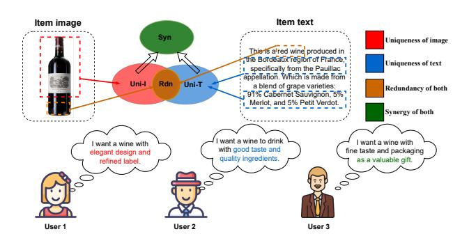
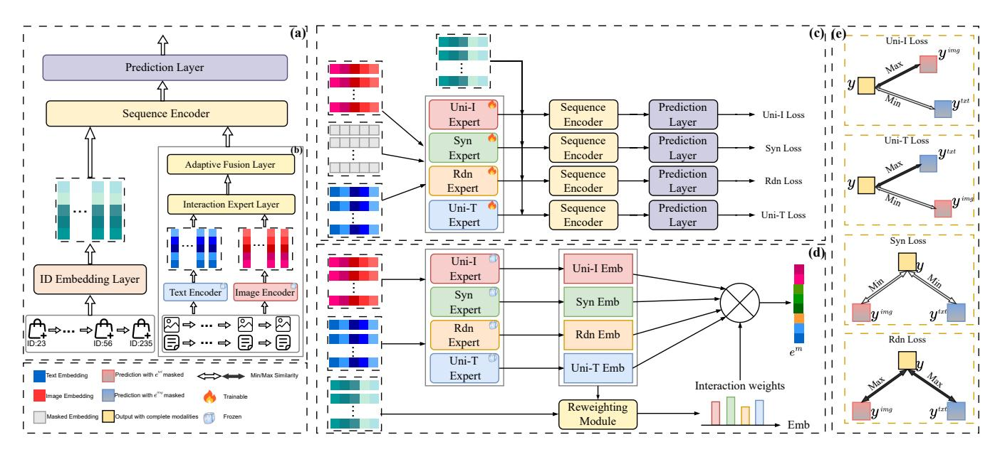
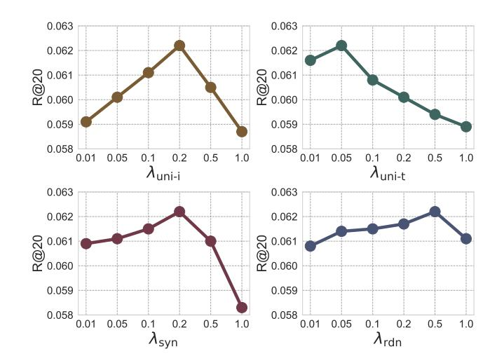
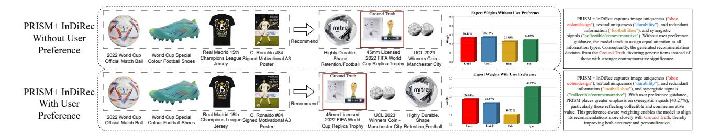
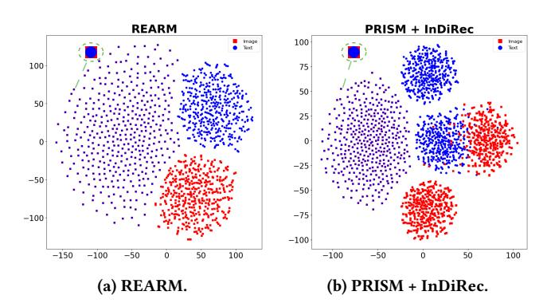

# PRISM: Personalized Recommendation via Information Synergy Module

[Xinyi Zhang](https://orcid.org/0009-0008-1950-3034)∗ Imperial College London London, UK zxyzxy090588@163.com

[Yutong Li](https://orcid.org/0009-0008-6496-8850)∗ University College London London, UK lyt3612671@163.com

[Peijie Sun](https://orcid.org/0000-0001-9733-0521)† Nanjing University of Posts and Telecommunications Nanjing, China sun.hfut@gmail.com

[Letian Sha](https://orcid.org/0009-0007-5547-3728) Nanjing University of Posts and Telecommunications Nanjing, China ltsha@njupt.edu.cn

[Zhongxuan Han](https://orcid.org/0000-0001-9957-7325) Zhejiang University Hangzhou, China zxhan@zju.edu.cn

# Abstract

Multimodal sequential recommendation (MSR) leverages diverse item modalities to improve recommendation accuracy, while achieving effective and adaptive fusion remains challenging. Existing MSR models often overlook synergistic information that emerges only through modality combinations. Moreover, they typically assume a fixed importance for different modality interactions across users. To address these limitations, we propose Personalized Recommendation via Information Synergy Module (PRISM), a plug-and-play framework for sequential recommendation (SR). PRISM explicitly decomposes multimodal information into unique, redundant, and synergistic components through an Interaction Expert Layer and dynamically weights them via an Adaptive Fusion Layer guided by user preferences. This information-theoretic design enables finegrained disentanglement and personalized fusion of multimodal signals. Extensive experiments on four datasets and three SR backbones demonstrate its effectiveness and versatility. The code is available at [https://github.com/YutongLi2024/PRISM.](https://github.com/YutongLi2024/PRISM)

# CCS Concepts

• Information systems → Recommender systems.

# Keywords

Sequential Recommendation, Multimodal Recommendation, Modality Interaction, Interpretability

### ACM Reference Format:

Xinyi Zhang, Yutong Li, Peijie Sun, Letian Sha, and Zhongxuan Han. 2026. PRISM: Personalized Recommendation via Information Synergy Module. In Proceedings of the ACM Web Conference 2026 (WWW '26), April 13–17, 2026, Dubai, United Arab Emirates. ACM, New York, NY, USA, [12](#page-11-0) pages. <https://doi.org/10.1145/XXXXXX.XXXXXX>

© 2026 Copyright held by the owner/author(s). ACM ISBN 979-8-4007-2307-0/2026/04 <https://doi.org/10.1145/XXXXXX.XXXXXX>

# 1 Introduction

Sequential recommendation (SR) is a cornerstone technology for modern Web platforms, designed to tackle information overload by predicting the next item a user will interact with based on their historical behavior sequence [\[8,](#page-8-0) [18,](#page-8-1) [19\]](#page-8-2). With the rapid proliferation of multimodal data across the Web, multimodal information is increasingly incorporated into SR to alleviate data sparsity and cold start issues inherent in traditional ID-based models [\[10\]](#page-8-3). Multimodal sequential recommendation (MSR) leverages diverse data sources, such as text, images, and audio, to comprehensively model user preferences and item characteristics, thereby enhancing recommendation performance [\[16,](#page-8-4) [17,](#page-8-5) [23\]](#page-8-6).

A core challenge in MSR is modality fusion, which integrates information from heterogeneous modalities into unified representations, critically impacting recommendation effectiveness [\[44\]](#page-9-0). Existing methods for learning fused representations primarily focus on aligning modality-shared features or preserving modalityspecific features. Most studies [\[14,](#page-8-7) [27\]](#page-9-1) adopt self-supervised learning (SSL) [\[40\]](#page-9-2), particularly contrastive learning, to align representations of the same item across different modalities. As full alignment may dilute the unique information each modality provides, more recent work [\[1,](#page-8-8) [11,](#page-8-9) [20,](#page-8-10) [26,](#page-8-11) [29,](#page-9-3) [48\]](#page-9-4) introduces dedicated encoders or orthogonal learning techniques to decompose features into modality-specific and modality-shared components [\[49\]](#page-9-5). To match varying user preferences across modalities, adaptive fusion methods [\[17,](#page-8-5) [45,](#page-9-6) [50\]](#page-9-7) leverage attention or perceptual gating mechanisms to dynamically adjust the contribution of each modality, enabling personalized fusion. Despite these advances, MSR methods still face limitations in multimodal fusion, struggling to finely and adaptively disentangle complex multimodal interactions.

Limitation 1: Existing methods fail to capture synergistic information that emerges only from the combination of modalities due to the lack of systematic modeling of multimodal interactions. Multimodal information can be disentangled into three components: uniqueness (information specific to one modality), redundancy (shared information across modalities), and synergy (incremental information that emerges from the complementary interaction of modalities) [\[1,](#page-8-8) [24,](#page-8-12) [25,](#page-8-13) [41,](#page-9-8) [42\]](#page-9-9). Figure [1](#page-1-0) illustrates the importance of synergistic information in capturing the complex characteristics of items for accurate recommendation.

∗Both authors contributed equally to this research.

†Corresponding author.

[This work is licensed under a Creative Commons Attribution 4.0 International License.](https://creativecommons.org/licenses/by/4.0) WWW '26, Dubai, United Arab Emirates.

Figure 1: Illustration of multimodal interactions using a red wine example. Higher-level properties, such as the wine's giftability and collectibility, can only be inferred by synergistically integrating both modalities. The impact of each modality interaction type depends on both user intent and task context.

Specifically, the image modality provides unique cues such as bottle shape, label design, and vintage, while the text modality conveys unique details like production region and grape composition. Information such as color and type appears in both modalities and thus constitutes redundancy. However, to recommend the item as a gift or collectible, the model must leverage the synergy between modalities. Only those wines that exhibit a luxurious appearance as well as a premium origin and composition are suitable for gifting or collection. Existing MSR methods [\[20,](#page-8-10) [29\]](#page-9-3) struggle to capture such synergistic signals, as most rely on rigid disentanglement paradigms that either overlook synergy or mistake it for noise. This underscores the urgent need for an information-theoretic approach to model modality interactions and achieve fine-grained disentanglement.

Limitation 2: Existing methods typically assume that the relative importance of modality interactions remains consistent across all users and recommendation scenarios, thereby overlooking user-specific preferences in utilizing multimodal information. In practice, users differ markedly in how they prioritize information [\[26\]](#page-8-11). As shown in Figure [1,](#page-1-0) some users emphasize unique image cues, valuing aesthetic appeal and product design, while others attend more to unique textual details such as wine quality, taste, and background. Users concerned with giftability or collectibility often rely on higher-level synergistic information. These examples indicate that the influence of each interaction type is highly dependent on user intent and task context. However, existing fusion methods cannot dynamically adjust the weights of different interaction types in a user-aware manner. Although recent approaches [\[43,](#page-9-10) [47\]](#page-9-11) recognize that users attend to modalities differently, they typically assign adaptive weights only at a coarse level, treating each modality as an indivisible whole. Such designs obscure which specific information types drive the recommendation outcome, leading to reduced transparency, interpretability, and ultimately user trust. This limitation underscores the need for a dynamic mechanism that captures user interests within the current sequence and adaptively weights information generated from modality interactions.

To overcome these limitations, we propose a general plugin module, Personalized Recommendation via Information Synergy Module (PRISM). PRISM enables fine-grained disentanglement and personalized fusion of multimodal interaction signals. Designed as a plug-and-play component, PRISM can be seamlessly integrated into existing SR models, guiding parameter optimization through information-theoretic constraints and a reweighting mechanism. (1) To address the first limitation, PRISM introduces an interaction expert layer that leverages interaction-specific losses to train a Mixture-of-Experts (MoE) framework for capturing intricate cross-modal relationships. The uniqueness-preserving loss ensures modality-specific information is retained within fused representations. The redundancy-minimization loss reduces shared information between modalities to yield compact representations. The synergy-capturing loss encourages the model to learn the complementary interplay between modalities. (2) To address the second limitation, PRISM incorporates an adaptive fusion layer, which dynamically assigns importance scores to each interaction expert based on user preferences inferred from historical behavior via an interest-aware mechanism. By explicitly quantifying the contribution of each information component, PRISM enhances transparency and provides interpretable insights into the decision-making process. Extensive experiments across multiple datasets show that PRISM consistently enhances the performance of diverse SR backbones, and when integrated into these backbones, the resulting MSR models can surpass several recently proposed MSR methods, highlighting its effectiveness and flexibility.

Our contributions are summarized as follows:

(1) We propose a novel MoE framework, PRISM, which enables fine-grained decomposition of complex multimodal information. By systematically modeling diverse modality interactions, it addresses the key limitation of MSR, namely the neglect of synergistic information.

(2) We introduce a reweighting mechanism that dynamically assigns personalized importance scores to different interaction types according to user interests, thereby achieving user-aware and interpretable fusion of interaction information.

(3) Extensive experiments across four datasets and three representative backbones demonstrate the effectiveness and generalizability of PRISM.

### 2 Methodology

# 2.1 Problem Definition

MSR aims to exploit multimodal information and users' historical behaviors to generate personalized recommendations for their next interactions. Given a set of users U and a set of items I, historical interactions can be chronologically organized into sequences. For each user �� ∈ U, we denote the interaction sequence as S �� = [�� 1 , ���� , . . . , ���� |S�� | ], where each item �� ∈ I denotes the item that the user interacted with at the ��-th time step. Following most prior studies [\[20,](#page-8-10) [29,](#page-9-3) [50\]](#page-9-7), we focus on image and text modalities in our derivations, while the framework can be readily extended to accommodate additional modalities. Formally, each item is represented as ���� = {�� ���� , �� ������ , �������� }, which incorporates the item ID, image, and textual description. The goal of MSR is to jointly model

Figure 2: The overall architecture of the proposed PRISM.

the sequential dependencies within S and the multimodal features of items to predict the next item a user will interact with.

### 2.2 Overview Framework

In this section, we first introduce the standard MSR pipeline to clearly illustrate how the proposed Personalized Recommendation via Information Synergy Module (PRISM) can be seamlessly integrated into existing SR models. We then elaborate on the technical details of PRISM.

As illustrated in Figure [2\(](#page-2-0)a), the interaction sequence of a user is first processed by the ID embedding layer to capture collaborative signals, producing e ���� for the sequence [\[7,](#page-8-14) [19,](#page-8-2) [37\]](#page-9-12). A positional embedding is then assigned to each item to indicate its relative or absolute position in the sequence. To incorporate multimodal information of items, modality-specific encoders are employed to process �� ������ and �� ������ , and the corresponding latent embeddings are computed as e ������ = imgEmb(�� ������), e ������ = textEmb(�� ������ ), where imgEmb(·) and textEmb(·) are pre-trained CLIP encoders[1](#page-2-1) . Naïve approaches [\[11,](#page-8-9) [12\]](#page-8-15) typically fuse e ������ and e ������ using simple concatenation or element-wise operations (e.g., summation or averaging). However, such methods fail to explicitly model the heterogeneous interactions between modalities. The resulting fused item representation, which integrates the ID embedding with multimodal signals, is subsequently fed into a sequence encoder, following the architectures of models such as SASRec [\[19\]](#page-8-2) and STOSA [\[7\]](#page-8-14), to capture sequential dependencies and user interests.

By replacing rigid multimodal fusion strategies, PRISM enhances the standard SR pipeline with a fine-grained decomposition and personalized fusion of multimodal information. As shown in Figure [2\(](#page-2-0)b), PRISM consists of two key components: (1) To address the first limitation, the Interaction Expert Layer adopts a MoE

framework [\[3,](#page-8-16) [28\]](#page-9-13) to explicitly disentangle multimodal interactions, where dedicated experts model uniqueness, redundancy, and synergy across modalities. The core innovation of our work lies in the design of tailored loss functions that effectively guide each expert to specialize in its designated type of interaction. (2) To address the second limitation, the Adaptive Fusion Layer integrates an interest-aware mechanism to dynamically reweight different interaction types according to user preferences, thereby producing personalized item representations and enhancing interpretability. The optimization of this reweighting module is supervised by the recommendation loss. Through this robust dual-objective optimization, PRISM achieves precise disentanglement of multimodal features while generating fused representations that better align with user preferences. For a clearer understanding of how PRISM is integrated into existing SR backbones, the full pseudocode is provided in Appendix [A.1.](#page-9-14)

# 2.3 Interaction Expert Layer

2.3.1 Expert Outputs and Training Strategy. As illustrated in Figures [2\(](#page-2-0)c) and (d), the Interaction Expert Layer adopts a MoE framework consisting of four fusion models, each specialized in capturing a specific type of interaction: (1) ��uni-i focuses on unique image information, (2) ��uni-t captures unique textual information, (3) ��syn models synergistic information that emerges from the combination of both modalities, and (4) ��rdn extracts redundant information shared between modalities. Consistent with most existing studies [\[2,](#page-8-17) [50\]](#page-9-7), each fusion model is constructed based on a multilayer perceptron (MLP) [\[35\]](#page-9-15) architecture. This design choice facilitates seamless integration of PRISM into different SR backbones while minimizing additional computational cost and preserving the model's usability. Each expert functions as an independent fusion model that produces a fused embedding specialized for its

1<https://huggingface.co/sentence-transformers/clip-ViT-B-32>

STOSA [\[7\]](#page-8-14). The concatenated embeddings are then passed through a reweighting module W. We instantiate W as a MLP [\[35\]](#page-9-15), which offers a lightweight yet expressive means of modeling non-linear dependencies among embeddings, without the added complexity and overhead of attention-based architectures [\[39\]](#page-9-20):

�� �� = W e uni-i , e uni-t , e syn , e rdn , e ���� , �� ∈ {uni-i, uni-t,syn,rdn}, (10)

where �� �� denotes the importance score assigned to a specific interaction type, indicating its contribution to the preference representation of the user within the current sequence. In contrast to existing fusion strategies that treat each modality as a whole and only adjust modality-level weights, our reweighting module allows the model to flexibly prioritize modality-unique, synergistic, or redundant information based on the recommendation context.

The final multimodal representation is obtained by weighting each interaction embedding with its corresponding learned coefficient and aggregating the results:

e �� = ∑︁ �� �� e �� , �� ∈ {uni-i, uni-t, syn, rdn}. (11)

This reweighted fusion mechanism offers two key advantages. First, it enables personalized fusion by adaptively emphasizing the most relevant interaction types for each user, thereby enhancing recommendation accuracy. Second, the explicit weights �� �� provide interpretability by quantifying the relative contributions of uniqueness, synergy, and redundancy, allowing direct analysis of which aspects of multimodal information influence user preferences. We further demonstrate this interpretability in Section [3.5,](#page-6-0) where visualizations of the learned weight distributions reveal how the model dynamically adapts to varying recommendation contexts.

# 2.5 Prediction and Optimization

As a plug-and-play module, PRISM is designed for seamless integration with a wide range of SR backbones. Its overall training objective comprises two components: the native recommendation loss of the backbone, Lrec, and the multimodal interaction loss, Lexp. To ensure maximum compatibility, PRISM directly inherits the original loss of the backbone, Lrec, allowing it to adapt to the diverse training objectives used in existing SR models. For instance, Lrec can be the Binary Cross-Entropy (BCE) [\[53\]](#page-9-21), which is widely adopted in models such as SASRec [\[19\]](#page-8-2). Alternatively, it can be the Bayesian Personalized Ranking (BPR) [\[33\]](#page-9-22), which serves as the core objective in models like STOSA [\[7\]](#page-8-14).

By adopting the native objective of the SR backbone without modification, PRISM can be readily applied to a wide spectrum of current and future architectures. The final training objective integrates both loss components as follows:

L = Lrec + Lexp. (12)

# 3 Experiment

In this section, we investigate the following research questions: RQ1: How does PRISM perform relative to the baseline methods? RQ2: What is the contribution of each component to the overall PRISM architecture? RQ3: How sensitive is PRISM to different hyperparameter settings? RQ4: Can PRISM effectively capture

synergistic interactions and user-guided fusion to improve recommendation quality? RQ5: What are the time and space complexities of PRISM?

### 3.1 Experimental Setup

Datasets. We evaluate PRISM on four real-world datasets: Amazon[2](#page-4-0) Home, Beauty, and Sports, as well as Yelp[3](#page-4-1) . The Amazon datasets capture users' purchasing behaviors and product reviews across diverse domains, and are widely used benchmarks for SR [\[2,](#page-8-17) [7,](#page-8-14) [19,](#page-8-2) [50\]](#page-9-7). The Yelp dataset, collected from a local business review platform, focuses on user feedback for restaurants and other services, and is commonly adopted in recommendation research [\[21,](#page-8-19) [52\]](#page-9-23). All datasets are preprocessed using the standard 5-core setting [\[7,](#page-8-14) [19,](#page-8-2) [21,](#page-8-19) [52\]](#page-9-23), ensuring that each user and item has at least five interactions. Detailed statistics are summarized in Table [1.](#page-4-2)

Table 1: Datasets Statistics

| Dataset | #users  | #items  | #interactions | density | avg.length |
|---------|---------|---------|---------------|---------|------------|
| Home    | 66,519  | 28,238  | 551,682       | 0.03%   | 8.3        |
| Beauty  | 22,363  | 12,102  | 198,502       | 0.07%   | 8.9        |
| Sports  | 35,598  | 18,358  | 296,337       | 0.05%   | 8.3        |
| Yelp    | 287,116 | 148,523 | 4,392,169     | 0.01%   | 15.1       |

Evaluation Settings. To ensure fair and rigorous evaluation, we follow the standard leave-one-out protocol for dataset splitting [\[7,](#page-8-14) [19\]](#page-8-2). For each user sequence, the last item is held out for testing, the second-to-last for validation, and all preceding items are used for training. We report two widely used metrics, Recall@K (R@K) [\[7,](#page-8-14) [13,](#page-8-20) [20,](#page-8-10) [45\]](#page-9-6) and NDCG@K (N@K) [\[19,](#page-8-2) [23,](#page-8-6) [37,](#page-9-12) [50\]](#page-9-7), with �� ∈ {10, 20}. Higher values of R@K and N@K indicate more accurate recommendation results.

Baseline Methods. To evaluate the effectiveness and versatility of PRISM, we compare it against representative and competitive baselines from three categories: (1) Traditional Recommendation: Methods relying on item co-occurrence patterns, including SASRec [\[19\]](#page-8-2), BERT4Rec [\[37\]](#page-9-12), LightGCN [\[13\]](#page-8-20), STOSA [\[7\]](#page-8-14), DiffuRec [\[22\]](#page-8-21), and InDiRec [\[32\]](#page-9-24); (2) Multimodal Recommendation: Methods that integrate additional modalities such as images and texts, including VBPR [\[12\]](#page-8-15), UniSRec [\[16\]](#page-8-4), MMMLP [\[23\]](#page-8-6), MMSBR [\[51\]](#page-9-25), TedRec [\[45\]](#page-9-6), and HM4SR [\[50\]](#page-9-7); (3) Multimodal Recommendation (Focused on Uniqueness and Redundancy): Methods that disentangle modality-unique and modality-shared information via contrastive learning, orthogonality, or graph modeling, but do not model synergistic information. Representative examples include PAMD [\[11\]](#page-8-9), DGMRec [\[20\]](#page-8-10), and REARM [\[29\]](#page-9-3).

Implementation Details. All models are implemented in Py-Torch, building upon the widely used open-source libraries named RecBole[4](#page-4-3) [\[54\]](#page-9-26). To ensure fair comparison, baseline models are either configured with the best hyperparameters reported in their original papers or tuned via grid search for datasets not covered previously. For PRISM, hyperparameters are optimized on the validation set using grid search. Four interaction-related coefficients,

2<https://snap.stanford.edu/data/amazon/productGraph>

3<https://business.yelp.com/data/resources/open-dataset>

4<https://github.com/RUCAIBox/RecBole2.0>

which are ��uni-i, ��uni-t, ��syn, and ��rdn, control the relative importance of image/text uniqueness, synergy, and redundancy, each searched over {0.01, 0.05, 0.1, 0.2, 0.5, 1.0}. The final values are reported in Section [3.4.](#page-5-0) All experiments are repeated five times with different random seeds, and the average performance is reported. Statistical significance is verified via paired t-tests with �� &lt; 0.05. All experiments are conducted on an NVIDIA RTX 4090 GPU.

### 3.2 Overall Performance Comparison (RQ1)

This subsection presents a comprehensive comparison to evaluate the performance of PRISM. As shown in Table [2,](#page-6-1) PRISM consistently improves the performance of SR models across all datasets and evaluation metrics. (1) Compared with ID-based SR models, PRISM-equipped variants achieve substantial performance gains. This clear margin demonstrates the advantage of incorporating multimodal information into sequential modeling. (2) Compared with representative multimodal baselines such as TedRec [\[45\]](#page-9-6) and HM4SR [\[50\]](#page-9-7), PRISM-equipped models, particularly PRISM+InDiRec, achieve superior results on all datasets. For instance, on the Home dataset, PRISM+InDiRec attains 0.0364 in R@10 and 0.0235 in N@10, surpassing HM4SR (0.0333 and 0.0191, respectively). These improvements highlight the effectiveness of the user-guided fusion in PRISM, which dynamically adjusts the importance of different modality interactions based on user preferences, overcoming the rigidity of fixed-weight fusion strategies. (3) Compared with disentanglement approaches such as DGMRec [\[20\]](#page-8-10) and REARM [\[29\]](#page-9-3), PRISM also demonstrates clear superiority. On the Yelp dataset, PRISM+InDiRec outperforms REARM, which is the strongest baseline in this group, by 10.91% in N@10 and 11.04% in N@20. This confirms that explicitly modeling modality synergy yields additional performance gains. (4) PRISM serves as a plug-and-play module compatible with various SR backbones, including SASRec [\[19\]](#page-8-2), STOSA [\[7\]](#page-8-14), and InDiRec [\[32\]](#page-9-24). The consistent improvements over the vanilla counterparts, such as the 71.43% increase in N@10 when integrated with STOSA on the Home dataset, further validate PRISM's versatility and broad applicability across architectures.

# 3.3 Ablation Study (RQ2)

To evaluate the contribution of each component in PRISM, we conduct ablation experiments on the Yelp dataset using PRISM+InDiRec as the target model. Specifically, we compare PRISM+InDiRec with the following variants: (i) w/o ��uni-i, which removes the image uniqueness expert; (ii) w/o ��uni-t, which discards the textual uniqueness expert; (iii) w/o ��syn, which eliminates the synergy expert; (iv) w/o ��rdn, which excludes the redundancy expert; and (v) w/o ���� ��, which disables the Adaptive Fusion Layer while keeping all other components intact. As shown in Table [3,](#page-6-2) the full PRISM+InDiRec model achieves the best performance across all evaluation metrics, demonstrating the effectiveness of jointly modeling uniqueness, redundancy, and synergy interactions with adaptive fusion. Among all variants, removing the textual uniqueness expert (w/o ��uni-t) leads to the largest performance drop, indicating that text-specific cues play a crucial role in capturing user intent in the Yelp dataset. The degradation caused by removing the image uniqueness expert (w/o ��uni-i) further confirms the importance of preserving modalityspecific image signals. Comparing these two variants suggests that

Figure 3: Performance comparison of PRISM+InDiRec with different hyperparameter settings on the Yelp dataset.

textual information is generally more informative than visual features, as text more directly conveys item semantics. The removal of the synergy expert (w/o ��syn) also results in a notable decline, highlighting that emergent cross-modal interactions cannot be replaced by unimodal signals alone and are indispensable for capturing higher-level semantics. In contrast, excluding the redundancy expert (w/o ��rdn) causes the smallest degradation, implying that shared redundant information contributes less to modeling user preferences. Finally, disabling the Adaptive Fusion Layer (w/o ���� ��) consistently reduces performance across all metrics, underscoring the necessity of dynamically weighting interaction types according to user behavior. Overall, although the degree of degradation varies across ablations, the consistent performance decline demonstrates that each component of PRISM contributes complementary benefits, and their joint integration is essential for achieving robust multimodal recommendation performance.

# 3.4 Hyperparameter Analysis (RQ3)

This subsection examines the sensitivity of PRISM to the four interaction-loss coefficients, ��uni-i, ��uni-t, ��syn, and ��rdn, using the PRISM+InDiRec model on the Yelp dataset, as illustrated in Figure [3.](#page-5-1) We vary each coefficient within {0.01, 0.05, 0.1, 0.2, 0.5, 1.0} while keeping the others fixed at their default values. Overall, the coefficients for uniqueness and synergy losses require careful calibration, whereas the redundancy coefficient exhibits greater tolerance to variation. For the image uniqueness coefficient ��uni-i, performance gradually improves as the coefficient increases from 0.01 to 0.2, peaking at 0.0622. This indicates that moderate emphasis on image-specific cues, such as object shape or packaging, enhances user-intent modeling; however, excessive weighting causes a sharp decline due to the suppression of textual uniqueness and synergistic information. The textual uniqueness coefficient ��uni-t achieves the best result at 0.05, beyond which R@20 declines steadily to 0.0589 at 1.0. This pattern suggests that while moderate textual emphasis strengthens semantic grounding, overemphasis leads to modality dominance, overshadowing other signals. For the synergy

Table 2: Performance comparison with three groups of baselines. The best results are highlighted in bold, and the secondbest results are underlined. vs. Vanilla denotes the relative improvement over the vanilla model, while vs. Best indicates the relative improvement over the strongest baseline (in percentage). All results are averaged over 5 runs per dataset for statistical robustness and are statistically significant at �� &lt; 0.05.

|               | Datasets Metric | R@10   | R@20   | Home N@10 | N@20   | R@10   | R@20   | Beauty N@10 | N@20   | R@10   | R@20   | Sports N@10 | N@20   | R@10   | R@20   | Yelp N@10 | N@20   |
|---------------|-----------------|--------|--------|-----------|--------|--------|--------|-------------|--------|--------|--------|-------------|--------|--------|--------|-----------|--------|
| SASRec        | (ICDM’18)       | 0.0168 | 0.0249 | 0.0081    | 0.0099 | 0.0534 | 0.0839 | 0.0247      | 0.0332 | 0.0336 | 0.0505 | 0.0175      | 0.0218 | 0.0233 | 0.0391 | 0.0123    | 0.0152 |
| BERT4Rec      | (CIKM’19)       | 0.0156 | 0.0238 | 0.0073    | 0.0101 | 0.0545 | 0.0852 | 0.0254      | 0.0351 | 0.0342 | 0.0512 | 0.0172      | 0.0216 | 0.0245 | 0.0411 | 0.0119    | 0.0162 |
| LightGCN      | (SIGIR’20)      | 0.0161 | 0.0243 | 0.0077    | 0.0103 | 0.0549 | 0.0861 | 0.0258      | 0.0355 | 0.0366 | 0.0535 | 0.0203      | 0.0242 | 0.0236 | 0.0414 | 0.0123    | 0.0166 |
| STOSA         | (WWW’22)        | 0.0169 | 0.0264 | 0.0098    | 0.0113 | 0.0648 | 0.0941 | 0.0339      | 0.0385 | 0.0389 | 0.0560 | 0.0220      | 0.0264 | 0.0238 | 0.0424 | 0.0128    | 0.0161 |
| DiffuRec      | (TOIS’23)       | 0.0278 | 0.0369 | 0.0185    | 0.0208 | 0.0854 | 0.1061 | 0.0548      | 0.0642 | 0.0481 | 0.0721 | 0.0305      | 0.0361 | 0.0324 | 0.0499 | 0.0221    | 0.0265 |
| InDiRec       | (SIGIR’25)      | 0.0330 | 0.0452 | 0.0202    | 0.0232 | 0.0941 | 0.1286 | 0.0573      | 0.0660 | 0.0522 | 0.0752 | 0.0309      | 0.0367 | 0.0372 | 0.0551 | 0.0262    | 0.0301 |
| VBPR          | (AAAI’16)       | 0.0159 | 0.0256 | 0.0074    | 0.0095 | 0.0551 | 0.0842 | 0.0252      | 0.0337 | 0.0321 | 0.0492 | 0.0159      | 0.0195 | 0.0237 | 0.0434 | 0.0123    | 0.0163 |
| UniSRec       | (KDD’22)        | 0.0198 | 0.0286 | 0.0121    | 0.0129 | 0.0661 | 0.0988 | 0.0386      | 0.0439 | 0.0361 | 0.0544 | 0.0199      | 0.0223 | 0.0246 | 0.0442 | 0.0137    | 0.0167 |
| MMMLP         | (WWW’23)        | 0.0237 | 0.0327 | 0.0145    | 0.0149 | 0.0725 | 0.1056 | 0.0422      | 0.0501 | 0.0381 | 0.0567 | 0.0214      | 0.0233 | 0.0279 | 0.0483 | 0.0146    | 0.0161 |
| MMSBR         | (TKDE’23)       | 0.0238 | 0.0331 | 0.0142    | 0.0152 | 0.0719 | 0.1062 | 0.0406      | 0.0474 | 0.0393 | 0.0579 | 0.0235      | 0.0245 | 0.0255 | 0.0464 | 0.0139    | 0.0166 |
| TedRec        | (CIKM’24)       | 0.0305 | 0.0431 | 0.0174    | 0.0208 | 0.0927 | 0.1188 | 0.0527      | 0.0631 | 0.0501 | 0.0725 | 0.0308      | 0.0369 | 0.0351 | 0.0504 | 0.0215    | 0.0261 |
| HM4SR         | (WWW’25)        | 0.0333 | 0.0461 | 0.0191    | 0.0227 | 0.0930 | 0.1299 | 0.0565      | 0.0651 | 0.0528 | 0.0761 | 0.0301      | 0.0359 | 0.0381 | 0.0573 | 0.0249    | 0.0296 |
| PAMD          | (WWW’22)        | 0.0245 | 0.0340 | 0.0148    | 0.0156 | 0.0733 | 0.1071 | 0.0418      | 0.0485 | 0.0390 | 0.0574 | 0.0221      | 0.0241 | 0.0267 | 0.0471 | 0.0142    | 0.0164 |
| DGMRec        | (SIGIR’25)      | 0.0327 | 0.0455 | 0.0210    | 0.0243 | 0.0943 | 0.1301 | 0.0579      | 0.0665 | 0.0513 | 0.0748 | 0.0312      | 0.0371 | 0.0371 | 0.0548 | 0.0269    | 0.0310 |
| REARM         | (MM’25)         | 0.0331 | 0.0458 | 0.0206    | 0.0231 | 0.0954 | 0.1311 | 0.0574      | 0.0659 | 0.0520 | 0.0755 | 0.0319      | 0.0382 | 0.0380 | 0.0560 | 0.0275    | 0.0317 |
| PRISM+SASRec  |                 | 0.0221 | 0.0309 | 0.0116    | 0.0139 | 0.0681 | 0.1051 | 0.0343      | 0.0457 | 0.0406 | 0.0613 | 0.0227      | 0.0291 | 0.0271 | 0.0448 | 0.0141    | 0.0173 |
|               | vs. Vanilla     | 25.60% | 24.10% | 43.21%    | 40.40% | 27.53% | 25.27% | 38.87%      | 37.65% | 20.83% | 21.39% | 29.71%      | 33.49% | 16.31% | 14.58% | 14.63%    | 13.82% |
| PRISM+STOSA   |                 | 0.0261 | 0.0398 | 0.0168    | 0.0193 | 0.0762 | 0.1083 | 0.0481      | 0.0549 | 0.0433 | 0.0621 | 0.0258      | 0.0301 | 0.0285 | 0.0511 | 0.0161    | 0.0195 |
|               | vs. Vanilla     | 54.44% | 50.76% | 71.43%    | 70.80% | 17.59% | 15.09% | 41.89%      | 42.60% | 11.31% | 10.89% | 17.27%      | 14.02% | 19.75% | 20.52% | 25.78%    | 21.12% |
| PRISM+InDiRec |                 | 0.0364 | 0.0501 | 0.0235    | 0.0272 | 0.1012 | 0.1388 | 0.0618      | 0.0711 | 0.0557 | 0.0809 | 0.0337      | 0.0401 | 0.0422 | 0.0622 | 0.0305    | 0.0352 |
|               | vs. Vanilla     | 10.30% | 10.84% | 16.34%    | 17.24% | 7.55%  | 7.93%  | 7.85%       | 7.73%  | 6.70%  | 7.58%  | 9.06%       | 9.26%  | 13.44% | 12.89% | 16.41%    | 16.94% |
|               | vs. Best        | 9.31%  | 8.68%  | 11.90%    | 11.93% | 6.08%  | 5.87%  | 6.74%       | 6.92%  | 5.49%  | 6.31%  | 5.64%       | 4.97%  | 10.76% | 8.55%  | 10.91%    | 11.04% |

Table 3: Ablation results of different PRISM+InDiRec variants. "w/o" denotes "without." All results are averaged over five runs on the Yelp dataset for statistical robustness and are statistically significant with �� &lt; 0.05.

coefficient ��syn, the performance curve exhibits a convex shape and reaches its maximum of 0.0622 at 0.2, confirming that synergy is crucial for capturing high-level semantics inaccessible to single modalities. Nevertheless, overly large values destabilize training by excessively penalizing unimodal predictions. In contrast, the redundancy coefficient ��rdn shows a relatively flat trend, with the best performance of 0.0622 at 0.5 and only marginal degradation beyond that point. This implies that redundancy primarily acts as a stabilizer in multimodal representation learning and is less sensitive to hyperparameter variation. In summary, uniqueness and synergy require moderate weighting (0.05–0.2) to achieve optimal balance, while redundancy remains robust across a broader range of values.

# 3.5 Case Study (RQ4)

We take PRISM+InDiRec as a case study to illustrate how user preference guidance affects recommendation outcomes. As shown in Figure [4,](#page-7-0) the model effectively captures image uniqueness (e.g., shoe color/design, jersey appearance), textual uniqueness (e.g., durability, speed property), redundant information (e.g., football shoe, official jersey), and synergistic signals that convey collectible or commemorative value. These diverse cues contribute to a more comprehensive understanding of items. However, without user preference guidance, the model assigns nearly equal attention to all information types, leading to recommendations that deviate from the ground truth and prioritize generic items. In contrast, with user preference guidance, PRISM places greater emphasis on synergistic signals (40.27%), particularly those reflecting collectible and commemorative value. This adaptive weighting enables the model to better reproduce the ground-truth ranking, thereby generating more accurate and personalized recommendations.

### 3.6 Visual Analysis (RQ4)

We employ t-SNE to visually verify PRISM can disentangle modality interactions into uniqueness, redundancy, and synergy, in contrast to REARM [\[29\]](#page-9-3), which fails to capture synergistic information. We randomly sample 200 items from the Yelp dataset and project their learned embeddings into a two-dimensional space, where blue circles denote text embeddings and red squares represent image embeddings. As shown in Figure [5a,](#page-7-1) REARM produces three distinct clusters: a blue cluster representing text-unique information, a red cluster corresponding to image-unique information, and an overlapping mixed region where blue and red points coincide, indicating redundancy. Notably, no separate cluster corresponding to synergy is observed. In contrast, PRISM+InDiRec (Figure [5b\)](#page-7-1) exhibits four clear clusters: a text-unique cluster (blue), an image-unique cluster

parameter-efficient fine-tuning. Building on these advances, DGM-Rec [\[20\]](#page-8-10) separates shared and modality-specific features using dedicated encoders and introduces a generative pathway to address missing modalities. REARM [\[29\]](#page-9-3) refines multimodal contrastive learning by modeling higher-order user–item relations through graphs and employing a meta-network with orthogonal constraints to denoise shared features while preserving modality-specific signals. However, by focusing primarily on shared and modality-specific representations without systematically modeling multimodal interactions, existing methods often overlook synergistic information, which is the emergent knowledge arising from the joint presence of multiple modalities, limiting their ability to adaptively fuse shared, specific, and synergistic signals. 5 Conclusion In this paper, we proposed PRISM, a novel information-theoretic framework that addresses the challenges of fine-grained information disentanglement and user-adaptive fusion in MSR. PRISM is a plug-and-play module that decomposes multimodal information into unique, redundant, and synergistic components through an Interaction Expert Layer, and adaptively fuses them via an Adaptive Fusion Layer guided by user preferences. Extensive experiments demonstrate that PRISM consistently improves both performance and interpretability across diverse backbones, providing a unified and effective solution for multimodal fusion. Future work will explore extending PRISM to large-scale recommendation scenarios with diverse modality types and further enhancing adaptability by incorporating temporal dynamics of user preferences. 6 Acknowledgments This work was supported by the Basic Research Program of Jiangsu (Grant No. BK20250668), Jiangsu Provincial Young Science and Technology Talent Support Program (Grants No. JSTJ-2025-944), Science and Technology Major Special Program of Jiangsu (Grants No. BG2024028), Basic Science (Natural Science) Research Project of Jiangsu Province Higher Education Institutions (Grants No. 25KJB-520039). References [1] Tadas Baltrusaitis, Chaitanya Ahuja, and Louis-Philippe Morency. 2019. Multimodal Machine Learning: A Survey and Taxonomy. IEEE Trans. Pattern Anal. Mach. Intell. 41, 2 (2019), 423–443. [2] Shuqing Bian, Xingyu Pan, Wayne Xin Zhao, Jinpeng Wang, Chuyuan Wang, and Ji-Rong Wen. 2023. Multi-modal Mixture of Experts Represetation Learning for Sequential Recommendation. In Proceedings of the 32nd ACM International Conference on Information and Knowledge Management (CIKM '23). Association for Computing Machinery, New York, NY, USA, 110–119. [3] Weilin Cai, Juyong Jiang, Fan Wang, Jing Tang, Sunghun Kim, and Jiayi Huang. 2025. A Survey on Mixture of Experts in Large Language Models. IEEE Transactions on Knowledge and Data Engineering 37, 7 (2025), 3896–3915. [4] Jianxin Chang, Chen Gao, Yu Zheng, Yiqun Hui, Yanan Niu, Yang Song, Depeng Jin, and Yong Li. 2021. Sequential Recommendation with Graph Neural Networks. In Proceedings of the 44th International ACM SIGIR Conference on Research and Development in Information Retrieval (SIGIR '21). Association for Computing Machinery, New York, NY, USA, 378–387. [5] Yongjun Chen, Zhiwei Liu, Jia Li, Julian McAuley, and Caiming Xiong. 2022. Intent Contrastive Learning for Sequential Recommendation. In Proceedings of the ACM Web Conference 2022 (WWW '22). Association for Computing Machinery, New York, NY, USA, 2172–2182. [6] Benoit Dufumier, Javiera Castillo Navarro, Devis Tuia, and Jean-Philippe Thiran. 2025. What to align in multimodal contrastive learning?. In The Thirteenth International Conference on Learning Representations (ICLR). ICLR, Singapore. [7] Ziwei Fan, Zhiwei Liu, Yu Wang, Alice Wang, Zahra Nazari, Lei Zheng, Hao Peng, and Philip S. Yu. 2022. Sequential Recommendation via Stochastic Self-Attention. In Proceedings of the ACM Web Conference 2022 (WWW '22). Association for Computing Machinery, New York, NY, USA, 2036–2047. [8] Hui Fang, Danning Zhang, Yiheng Shu, and Guibing Guo. 2020. Deep Learning for Sequential Recommendation: Algorithms, Influential Factors, and Evaluations. ACM Trans. Inf. Syst. 39, 1 (2020), 42 pages. [9] Junchen Fu, Xuri Ge, Xin Xin, Alexandros Karatzoglou, Ioannis Arapakis, Jie Wang, and Joemon M. Jose. 2024. IISAN: Efficiently Adapting Multimodal Representation for Sequential Recommendation with Decoupled PEFT. In Proceedings of the 47th International ACM SIGIR Conference on Research and Development in Information Retrieval (SIGIR '24). Association for Computing Machinery, New York, NY, USA, 687–697. [10] Guibing Guo, Jie Zhang, and Neil Yorke-Smith. 2015. TrustSVD: collaborative filtering with both the explicit and implicit influence of user trust and of item ratings. In Proceedings of the Twenty-Ninth AAAI Conference on Artificial Intelligence (AAAI'15). AAAI Press, New York, NY, USA, 123–129. [11] Tengyue Han, Pengfei Wang, Shaozhang Niu, and Chenliang Li. 2022. Modality Matches Modality: Pretraining Modality-Disentangled Item Representations for Recommendation. In Proceedings of the ACM Web Conference 2022 (WWW '22). Association for Computing Machinery, New York, NY, USA, 2058–2066. [12] Ruining He and Julian McAuley. 2016. VBPR: visual Bayesian Personalized Ranking from implicit feedback. In Proceedings of the Thirtieth AAAI Conference on Artificial Intelligence (AAAI'16). AAAI Press, Phoenix, Arizona, 144–150. [13] Xiangnan He, Kuan Deng, Xiang Wang, Yan Li, YongDong Zhang, and Meng Wang. 2020. LightGCN: Simplifying and Powering Graph Convolution Network for Recommendation. In Proceedings of the 43rd International ACM SIGIR Conference on Research and Development in Information Retrieval (SIGIR '20). Association for Computing Machinery, New York, NY, USA, 639–648. [14] Zhuangzhuang He, Zihan Wang, Yonghui Yang, Haoyue Bai, and Le Wu. 2024. It is Never Too Late to Mend: Separate Learning for Multimedia Recommendation. arXiv[:2406.08270](https://arxiv.org/abs/2406.08270) [cs.IR] [15] Balázs Hidasi, Alexandros Karatzoglou, Linas Baltrunas, and Domonkos Tikk. 2016. Session-based Recommendations with Recurrent Neural Networks. In 4th International Conference on Learning Representations, ICLR 2016, San Juan, Puerto Rico, May 2-4, 2016, Conference Track Proceedings, Yoshua Bengio and Yann LeCun (Eds.). ICLR, San Juan, Puerto Rico. [16] Yupeng Hou, Shanlei Mu, Wayne Xin Zhao, Yaliang Li, Bolin Ding, and Ji-Rong Wen. 2022. Towards Universal Sequence Representation Learning for Recommender Systems. In Proceedings of the 28th ACM SIGKDD Conference on Knowledge Discovery and Data Mining (KDD '22). Association for Computing Machinery, New York, NY, USA, 585–593. [17] Hengchang Hu, Wei Guo, Yong Liu, and Min-Yen Kan. 2023. Adaptive Multi-Modalities Fusion in Sequential Recommendation Systems. In Proceedings of the 32nd ACM International Conference on Information and Knowledge Management (CIKM '23). Association for Computing Machinery, New York, NY, USA, 843–853. [18] Mengyuan Jing, Yanmin Zhu, Tianzi Zang, and Ke Wang. 2023. Contrastive Self-supervised Learning in Recommender Systems: A Survey. ACM Trans. Inf. Syst. 42, 2 (2023), 39 pages. [19] Wang-Cheng Kang and Julian J. McAuley. 2018. Self-Attentive Sequential Recommendation. In IEEE International Conference on Data Mining, ICDM 2018, Singapore, November 17-20, 2018. IEEE Computer Society, Singapore, 197–206. [20] Jiwan Kim, Hongseok Kang, Sein Kim, Kibum Kim, and Chanyoung Park. 2025. Disentangling and Generating Modalities for Recommendation in Missing Modality Scenarios. In Proceedings of the 48th International ACM SIGIR Conference on Research and Development in Information Retrieval (SIGIR '25). Association for Computing Machinery, New York, NY, USA, 1820–1829. [21] Xuewei Li, Aitong Sun, Mankun Zhao, Jian Yu, Kun Zhu, Di Jin, Mei Yu, and Ruiguo Yu. 2023. Multi-Intention Oriented Contrastive Learning for Sequential Recommendation. In Proceedings of the Sixteenth ACM International Conference on Web Search and Data Mining (WSDM '23). Association for Computing Machinery, New York, NY, USA, 411–419. [22] Zihao Li, Aixin Sun, and Chenliang Li. 2023. DiffuRec: A Diffusion Model for Sequential Recommendation. ACM Trans. Inf. Syst. 42, 3 (2023), 28 pages. [23] Jiahao Liang, Xiangyu Zhao, Muyang Li, Zijian Zhang, Wanyu Wang, Haochen Liu, and Zitao Liu. 2023. Mmmlp: Multi-modal multilayer perceptron for sequential recommendations. In Proceedings of the ACM Web Conference 2023 (WWW '23). Association for Computing Machinery, New York, NY, USA, 1109–1117. [24] Paul Pu Liang, Yun Cheng, Xiang Fan, et al. 2023. Quantifying & modeling multimodal interactions: an information decomposition framework. In Proceedings of the 37th International Conference on Neural Information Processing Systems (NIPS '23). Curran Associates Inc., Red Hook, NY, USA, 43 pages. [25] Paul Pu Liang, Amir Zadeh, and Louis-Philippe Morency. 2024. Foundations & Trends in Multimodal Machine Learning: Principles, Challenges, and Open Questions. ACM Comput. Surv. 56, 10 (2024), 42 pages. [26] Fan Liu, Huilin Chen, Zhiyong Cheng, Anan Liu, Liqiang Nie, and Mohan Kankanhalli. 2023. Disentangled Multimodal Representation Learning for Recommendation. Trans. Multi. 25 (2023), 7149–7159.

[27] Yifan Liu, Kangning Zhang, Xiangyuan Ren, Yanhua Huang, Jiarui Jin, Yingjie Qin, Ruilong Su, Ruiwen Xu, Yong Yu, and Weinan Zhang. 2024. AlignRec: Aligning and Training in Multimodal Recommendations. In Proceedings of the 33rd ACM International Conference on Information and Knowledge Management (CIKM '24). Association for Computing Machinery, New York, NY, USA, 1503–1512. [28] Jiaqi Ma, Zhe Zhao, Xinyang Yi, Jilin Chen, Lichan Hong, and Ed H. Chi. 2018. Modeling Task Relationships in Multi-task Learning with Multi-gate Mixtureof-Experts. In Proceedings of the 24th ACM SIGKDD International Conference on Knowledge Discovery & Data Mining (KDD '18). Association for Computing Machinery, New York, NY, USA, 1930–1939. [29] Shouxing Ma, Yawen Zeng, Shiqing Wu, and Guandong Xu. 2025. Refining Contrastive Learning and Homography Relations for Multi-Modal Recommendation. In Proceedings of the 33th ACM International Conference on Multimedia. Association for Computing Machinery, Dublin, Ireland. [30] Hieu V. Nguyen and Li Bai. 2010. Cosine similarity metric learning for face verification. In Proceedings of the 10th Asian Conference on Computer Vision - Volume Part II (ACCV'10). Springer-Verlag, Berlin, Heidelberg, 709–720. [31] Ruihong Qiu, Zi Huang, Hongzhi Yin, and Zijian Wang. 2022. Contrastive Learning for Representation Degeneration Problem in Sequential Recommendation. In Proceedings of the Fifteenth ACM International Conference on Web Search and Data Mining (WSDM '22). Association for Computing Machinery, New York, NY, USA, 813–823. [32] Yuanpeng Qu and Hajime Nobuhara. 2025. Intent-aware Diffusion with Contrastive Learning for Sequential Recommendation. In Proceedings of the 48th International ACM SIGIR Conference on Research and Development in Information Retrieval (SIGIR '25). Association for Computing Machinery, New York, NY, USA, 1552–1561. [33] Steffen Rendle, Christoph Freudenthaler, Zeno Gantner, and Lars Schmidt-Thieme. 2009. BPR: Bayesian personalized ranking from implicit feedback. In Proceedings of the Twenty-Fifth Conference on Uncertainty in Artificial Intelligence (UAI '09). AUAI Press, Arlington, Virginia, USA, 452–461. [34] Steffen Rendle, Christoph Freudenthaler, and Lars Schmidt-Thieme. 2010. Factorizing personalized Markov chains for next-basket recommendation. In Proceedings of the 19th International Conference on World Wide Web (WWW '10). Association for Computing Machinery, New York, NY, USA, 811–820. [35] Frank Rosenblatt. 1958. The perceptron: a probabilistic model for information storage and organization in the brain. Psychological review 65, 6 (1958), 386. [36] Florian Schroff, Dmitry Kalenichenko, and James Philbin. 2015. FaceNet: A unified embedding for face recognition and clustering. In IEEE Conference on Computer Vision and Pattern Recognition, CVPR 2015, Boston, MA, USA, June 7-12, 2015. IEEE Computer Society, USA, 815–823. [37] Fei Sun, Jun Liu, Jian Wu, Changhua Pei, Xiao Lin, Wenwu Ou, and Peng Jiang. 2019. BERT4Rec: Sequential Recommendation with Bidirectional Encoder Representations from Transformer. In Proceedings of the 28th ACM International Conference on Information and Knowledge Management (CIKM '19). Association for Computing Machinery, New York, NY, USA, 1441–1450. [38] Jiaxi Tang and Ke Wang. 2018. Personalized Top-N Sequential Recommendation via Convolutional Sequence Embedding. In Proceedings of the Eleventh ACM International Conference on Web Search and Data Mining (WSDM '18). Association for Computing Machinery, New York, NY, USA, 565–573. [39] Ashish Vaswani, Noam Shazeer, Niki Parmar, Jakob Uszkoreit, Llion Jones, Aidan N Gomez, Ł ukasz Kaiser, and Illia Polosukhin. 2017. Attention is All you Need. In Advances in Neural Information Processing Systems, Vol. 30. Curran Associates, Inc., San Diego, CA, USA. [40] Wei Wei, Chao Huang, Lianghao Xia, and Chuxu Zhang. 2023. Multi-Modal Self-Supervised Learning for Recommendation. In Proceedings of the ACM Web Conference 2023 (WWW '23). Association for Computing Machinery, New York, NY, USA, 790–800. [41] Patricia Wollstadt, Sebastian Schmitt, and Michael Wibral. 2023. A rigorous information-theoretic definition of redundancy and relevancy in feature selection based on (partial) information decomposition. J. Mach. Learn. Res. 24, 1 (2023), 44 pages. [42] Jiayi Xin, Sukwon Yun, Jie Peng, Inyoung Choi, Jenna L. Ballard, Tianlong Chen, and Qi Long. 2025. I2MoE: Interpretable Multimodal Interaction-aware Mixtureof-Experts. In International conference on machine learning. PMLR, USA. [43] Jinfeng Xu, Zheyu Chen, Shuo Yang, Jinze Li, Hewei Wang, and Edith C. H. Ngai. 2025. MENTOR: multi-level self-supervised learning for multimodal recommendation. In Proceedings of the Thirty-Ninth AAAI Conference on Artificial Intelligence (AAAI'25). AAAI Press, New York, NY, USA, 10 pages. [44] Jinfeng Xu, Zheyu Chen, Shuo Yang, Jinze Li, Wei Wang, Xiping Hu, Steven Hoi, and Edith Ngai. 2025. A Survey on Multimodal Recommender Systems: Recent Advances and Future Directions. arXiv[:2502.15711](https://arxiv.org/abs/2502.15711) [cs.IR] [https://arxiv.org/abs/](https://arxiv.org/abs/2502.15711) [2502.15711](https://arxiv.org/abs/2502.15711) [45] Lanling Xu, Zhen Tian, Bingqian Li, et al. 2024. Sequence-level Semantic Representation Fusion for Recommender Systems. In Proceedings of the 33rd ACM International Conference on Information and Knowledge Management (CIKM '24). Association for Computing Machinery, New York, NY, USA, 5015–5022. [46] Haofei Yu, Zhengyang Qi, Lawrence Keunho Jang, Russ Salakhutdinov, Louis-Philippe Morency, and Paul Pu Liang. 2024. MMoE: Enhancing Multimodal Models with Mixtures of Multimodal Interaction Experts. In Proceedings of the 2024 Conference on Empirical Methods in Natural Language Processing, Yaser Al-Onaizan, Mohit Bansal, and Yun-Nung Chen (Eds.). Association for Computational Linguistics, Miami, Florida, USA, 10006–10030. [doi:10.18653/v1/2024.](https://doi.org/10.18653/v1/2024.emnlp-main.558) [emnlp-main.558](https://doi.org/10.18653/v1/2024.emnlp-main.558) [47] Penghang Yu, Zhiyi Tan, Guanming Lu, and Bing-Kun Bao. 2023. Multi-View Graph Convolutional Network for Multimedia Recommendation. In Proceedings of the 31st ACM International Conference on Multimedia (MM '23). Association for Computing Machinery, New York, NY, USA, 6576–6585. [48] Wenmeng Yu, Hua Xu, Ziqi Yuan, and Jiele Wu. 2021. Learning Modality-Specific Representations with Self-Supervised Multi-Task Learning for Multimodal Sentiment Analysis. In Proceedings of the Thirty-Fifth AAAI Conference on Artificial Intelligence. AAAI Press, New York, NY, USA, 10790–10797. [49] Jinghao Zhang, Yanqiao Zhu, Qiang Liu, Mengqi Zhang, Shu Wu, and Liang Wang. 2023. Latent Structure Mining With Contrastive Modality Fusion for Multimedia Recommendation. IEEE Trans. on Knowl. and Data Eng. 35, 9 (2023), 9154–9167. [50] Shengzhe Zhang, Liyi Chen, Dazhong Shen, Chao Wang, and Hui Xiong. 2025. Hierarchical Time-Aware Mixture of Experts for Multi-Modal Sequential Recommendation. In Proceedings of the ACM on Web Conference 2025 (WWW '25). Association for Computing Machinery, New York, NY, USA, 3672–3682. [51] Xiaokun Zhang, Bo Xu, Fenglong Ma, Chenliang Li, Liang Yang, and Hongfei Lin. 2024. Beyond Co-Occurrence: Multi-Modal Session-Based Recommendation. IEEE Transactions on Knowledge and Data Engineering 36, 4 (2024), 1450–1462. [52] Xiaokun Zhang, Bo Xu, Youlin Wu, Yuan Zhong, Hongfei Lin, and Fenglong Ma. 2024. FineRec: Exploring Fine-grained Sequential Recommendation. In Proceedings of the 47th International ACM SIGIR Conference on Research and Development in Information Retrieval (SIGIR '24). Association for Computing Machinery, New York, NY, USA, 1599–1608. [53] Zhilu Zhang and Mert R. Sabuncu. 2018. Generalized cross entropy loss for training deep neural networks with noisy labels. In Proceedings of the 32nd International Conference on Neural Information Processing Systems (NIPS'18). Curran Associates Inc., Red Hook, NY, USA, 8792–8802. [54] Wayne Xin Zhao, Yupeng Hou, et al. 2022. RecBole 2.0: Towards a More Upto-Date Recommendation Library. In Proceedings of the 31st ACM International Conference on Information & Knowledge Management (CIKM '22). Association for Computing Machinery, New York, NY, USA, 4722–4726. [55] Kun Zhou, Hui Wang, Wayne Xin Zhao, Yutao Zhu, Sirui Wang, Fuzheng Zhang, Zhongyuan Wang, and Ji-Rong Wen. 2020. S3-Rec: Self-Supervised Learning for Sequential Recommendation with Mutual Information Maximization. In Proceedings of the 29th ACM International Conference on Information & Knowledge Management (CIKM '20). Association for Computing Machinery, New York, NY, USA, 1893–1902. A Appendix A.1 Algorithm Algorithm [1](#page-10-1) details how PRISM plugs into a standard SR backbone. A.2 Random Vector Justification To empirically validate our masking design, we conducted an ablation study that compared three common strategies, namely random, mean, and zero-vector replacements, across four benchmark datasets (Home, Beauty, Sports, and Yelp). As summarized in Table [4,](#page-10-2) random vector masking consistently delivers the strongest performance on most metrics. For example, in the Beauty and Yelp datasets, the random strategy yields clear improvements in both Recall and NDCG over mean and zero replacements. While mean masking occasionally achieves competitive results on isolated metrics (e.g., N@20 on Sports), these gains are neither stable nor consistent across datasets. Empirical evidence demonstrates that the random masking strategy achieves stable superiority across different multimodal recommendation scenarios, thereby validating its

selection as the mechanism in our framework.

| Dataset Strategy | R@10   | R@20   | N@10   | N@20   |
|------------------|--------|--------|--------|--------|
| Random           | 0.0364 | 0.0501 | 0.0235 | 0.0272 |
| Mean Home        | 0.0358 | 0.0495 | 0.0240 | 0.0267 |
| Zero             | 0.0349 | 0.0483 | 0.0227 | 0.0262 |
| Random           | 0.1012 | 0.1388 | 0.0618 | 0.0711 |
| Mean Beauty      | 0.0997 | 0.1375 | 0.0602 | 0.0705 |
| Zero             | 0.1005 | 0.1369 | 0.0598 | 0.0690 |
| Random           | 0.0557 | 0.0809 | 0.0337 | 0.0401 |
| Mean Sports      | 0.0548 | 0.0802 | 0.0329 | 0.0403 |
| Zero             | 0.0532 | 0.0785 | 0.0318 | 0.0390 |
| Random Yelp      | 0.0422 | 0.0622 | 0.0305 | 0.0352 |
| Mean             | 0.0376 | 0.0582 | 0.0271 | 0.0320 |
| Zero             | 0.0361 | 0.0572 | 0.0257 | 0.0302 |

Table 5: Efficiency analysis of PRISM-enhanced models. We report the average training time per epoch and peak GPU memory consumption for SASRec, STOSA, and InDiRec, both with and without PRISM. w/o denotes the model without PRISM, and w/ denotes the model with PRISM. All results are averaged over 5 runs to ensure robustness and are statistically significant with �� &lt; 0.05.

| Dataset |        | Metric    | w/o PRISM | SASRec w / PRISM | w/o PRISM | STOSA w/ PRISM | w/o PRISM | InDiRec w/ PRISM |
|---------|--------|-----------|-----------|------------------|-----------|----------------|-----------|------------------|
| Home    | Time   | (s/epoch) | 20.35     | 30.11            | 26.99     | 40.98          | 201.41    | 220.82           |
|         | Memory | (GB)      | 1.16      | 1.75             | 2.37      | 2.75           | 3.77      | 4.54             |
| Beauty  | Time   | (s/epoch) | 5.75      | 9.67             | 7.40      | 11.88          | 36.29     | 40.55            |
|         | Memory | (GB)      | 1.14      | 1.41             | 2.27      | 2.60           | 3.40      | 4.56             |
| Sports  | Time   | (s/epoch) | 7.19      | 20.81            | 17.11     | 28.81          | 123.51    | 141.44           |
|         | Memory | (GB)      | 1.33      | 1.51             | 2.33      | 2.66           | 3.55      | 4.12             |
| Yelp    | Time   | (s/epoch) | 742.67    | 799.44           | 778.21    | 834.69         | 1375.49   | 1439.11          |
|         | Memory | (GB)      | 1.45      | 4.61             | 2.56      | 7.51           | 3.96      | 10.47            |

Synergy. Synergistic information emerges only when both modalities are jointly observed, and disappears when either modality is masked. To isolate this effect, the synergy expert penalizes agreement between �� and the masked predictions:

Lsyn = h CosSim(��, ��������) + CosSim(��, �������� ) . (19)

This design ensures that ��syn emphasizes complementary crossmodal signals, approximating

Lsyn ∝ Syn(�� ;�� ������, �������� ). (20)

# A.4 Time and Space Complexity

We analyze the computational overhead introduced by integrating PRISM into different SR backbones, as reported in Table [5.](#page-11-2) Across all datasets, PRISM consistently increases training time and GPU memory consumption due to the additional computation from its interaction experts and reweighting module. On the Beauty dataset, the per-epoch training time increases moderately, while on Sports, the overhead varies with backbone complexity. Lighter models such as SASRec experience a more noticeable slowdown compared to the heavier InDiRec. On the large-scale Yelp dataset, the additional cost remains marginal since attention operations dominate the runtime, demonstrating PRISM's scalability.

In terms of memory, PRISM introduces a moderate increase caused by the extra parameters of the experts and multimodal activations, with small growth on medium-scale datasets and more visible growth on Yelp. Overall, PRISM adds stable and predictable overhead that remains within a manageable range. The total runtime is mainly determined by the underlying SR backbone, and the relative overhead decreases as the model size or dataset scale grows, making the trade-off acceptable given the consistent performance improvements.