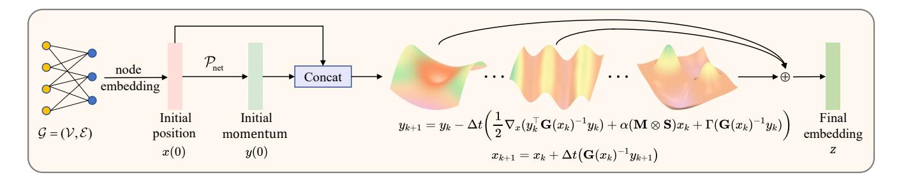
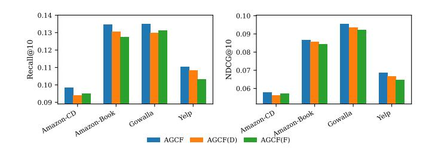
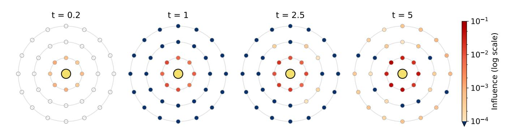
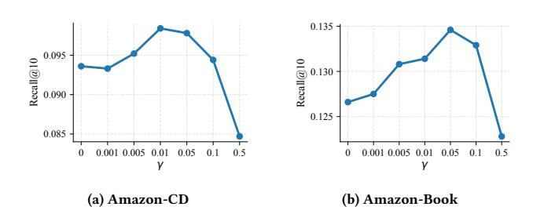

# Learning on Adaptive Manifolds for Graph Collaborative Filtering

[Guangzhi Qi](https://orcid.org/0009-0003-2717-3147) 21s103133@stu.hit.edu.cn Harbin Institute of Technology Harbin, China

[Guojun Liu](https://orcid.org/0000-0002-5174-0944)∗ hitliu@hit.edu.cn Harbin Institute of Technology Harbin, China

[Qi Zhou](https://orcid.org/0000-0001-6716-9263) 24b903002@stu.hit.edu.cn Harbin Institute of Technology Harbin, China

### Abstract

Graph-based collaborative filtering has advanced by modeling higherorder interactions, yet performance remains constrained by underlying geometric assumptions and propagation schemes. User-item interaction graphs typically exhibit pronounced topological heterogeneity, whereas existing methods rely on a fixed, homogeneous geometry and employ tangent space aggregation. To address these fundamental limitations, this paper introduces Adaptive Geometric Collaborative Filtering (AGCF), a novel method rooted in Hamiltonian dynamics, which reframes representation learning as a physical process evolving on a time-varying manifold. AGCF is distinguished by an integrated design comprising: (1) a learnable, node-dependent Riemannian metric that construct a continuous heterogeneous manifold aligned with local topology; (2) unified dynamic trajectories that achieve intrinsic propagation without tangent space approximations; (3) a channel-wise metric that captures semantic anisotropy in the feature space. We rigorously prove global existence and uniqueness of the induced dynamics and explain the mechanism enabling long-range information propagation. Extensive experiments on five benchmark datasets show consistent gains over representative baselines.

# CCS Concepts

• Information systems → Recommender systems.

### Keywords

Recommender System; Graph Collaborative Filtering; Riemannian Manifold

### ACM Reference Format:

Guangzhi Qi, Guojun Liu, and Qi Zhou. 2026. Learning on Adaptive Manifolds for Graph Collaborative Filtering. In Proceedings of the ACM Web Conference 2026 (WWW '26), April 13–17, 2026, Dubai, United Arab Emirates. ACM, New York, NY, USA, [12](#page-11-0) pages.<https://doi.org/10.1145/3774904.3792239>

# 1 Introduction

In the vast landscape of information, recommender systems [\[7,](#page-8-0) [9,](#page-8-1) [11,](#page-8-2) [29,](#page-8-3) [35,](#page-8-4) [40,](#page-8-5) [51,](#page-9-0) [55\]](#page-9-1) have become critical infrastructure connecting users with content, products, and services. The core task

∗Corresponding author.

© 2026 Copyright held by the owner/author(s). ACM ISBN 979-8-4007-2307-0/2026/04 <https://doi.org/10.1145/3774904.3792239>

Table 1: Comparison of AGCF with relevant methods. Our model is the first to simultaneously address all three fundamental limitations.

| Method   |      | Heterogeneous |   |   |
|----------|------|---------------|---|---|
| LightGCN | [22] | X             | ✓ | X |
| HGCF     | [41] | X             | X | X |
| HICF     | [49] | X             | X | X |
| GDCF     | [56] | X             |   | X |
| HamGNN   | [25] | ✓             | X | ✓ |
| AGCF     |      | ✓             | ✓ | ✓ |

is to learn generalizable preference patterns from historical useritem interactions, enabling efficient retrieval and ranking. As the most representative technical approach, Collaborative Filtering (CF) [\[23,](#page-8-10) [24,](#page-8-11) [27,](#page-8-12) [28,](#page-8-13) [30,](#page-8-14) [34\]](#page-8-15) has recently been advanced by Graph Neural Networks (GNNs) [\[12,](#page-8-16) [21,](#page-8-17) [26,](#page-8-18) [33,](#page-8-19) [42,](#page-8-20) [43,](#page-8-21) [46,](#page-8-22) [48,](#page-8-23) [52\]](#page-9-3), which explicitly model user-item relationships as bipartite graphs. By aggregating information from multi-hop neighbors, GNNs have significantly improved recommendation performance [\[13,](#page-8-24) [22,](#page-8-6) [36,](#page-8-25) [37,](#page-8-26) [44,](#page-8-27) [45\]](#page-8-28). Yet, despite increasing sophistication, the performance ceiling remains limited by assumptions about geometry and by the chosen propagation schemes.

This paper aims to challenge and overcome three of the most critical limitations. The first and most fundamental is geometric homogeneity. Existing methods, from classic Euclidean models to more advanced non-Euclidean approaches, typically learn representations within a geometrically homogeneous space. The flat geometry of Euclidean space struggles to embed the hierarchical structures prevalent in user-item interaction graphs with low distortion [\[3,](#page-8-29) [5,](#page-8-30) [31,](#page-8-31) [38\]](#page-8-32). To address this, hyperbolic spaces are introduced and have demonstrated superior performance in capturing such hierarchies [\[41,](#page-8-7) [47,](#page-8-33) [49,](#page-8-8) [50,](#page-8-34) [54\]](#page-9-4). However, enforcing a single global curvature remains inadequate for graphs with complex topological heterogeneity. A typical user-item network is rarely a pure tree; it often intertwines multiple topological patterns, such as treelike structures radiating from popular entities, dense communities formed by users with highly consistent interests, and cycles of substitutability composed of functionally similar items. Subsequent solutions like product manifolds [\[56\]](#page-9-2), while acknowledging the existence of multiple topologies, still apply a fixed, globally shared set of geometric rules to all nodes. This overlooks a key fact: the geometry of a user-item interaction graph is local and spatially varying, rather than globally uniform. Thus, an effective model should be capable of constructing an adaptive heterogeneous manifold.

[This work is licensed under a Creative Commons Attribution 4.0 International License.](https://creativecommons.org/licenses/by/4.0) WWW '26, Dubai, United Arab Emirates

The second critical limitation stems from the reliance on tangent space for aggregation. To perform neighbor aggregation on Riemannian manifolds, common practice follows a three-step paradigm: neighbor representations are projected from the manifold to a tangent space at a reference point via the logarithmic map; aggregation is performed within this temporary, flat Euclidean space; the result is mapped back to the manifold using the exponential map. This routine introduces a conceptual decoupling and approximation distortion between the geometry and the propagation process. Each mapping may incur information loss, and the aggregation is confined to a universal tangent space that ignores the local context of the node. A more unified design should realize intrinsic propagation directly on the manifold so that every step of information flow is guided by local geometry.

The third, widely overlooked limitation is semantic isotropy. In the feature space, many models implicitly assume all semantic directions are equivalent. This appears in the use of inner products or Euclidean distances, which weigh dimensions equally and overlook inter-dimensional correlations. A stronger formulation should not only understand which users and items are close on the graph but also along which meaningful semantic directions they should be oriented to achieve a more precise and discriminative alignment.

The landscape of representative methods, summarized in Table [1,](#page-0-0) reveals a systemic bottleneck. Although advanced concepts like heterogeneous manifolds have appeared in general graph learning (e.g., HamGNN [\[25\]](#page-8-9)), to the best of our knowledge, no collaborative filtering model simultaneously offers a continuously adaptive geometry, a fully intrinsic propagation mechanism, and the capacity to model semantic anisotropy. This highlights a clear and significant gap in the literature.

To break through this impasse, we propose Adaptive Geometric Collaborative Filtering (AGCF), a novel approach that couples adaptive geometric modeling with semantic-aware intrinsic propagation under a unified dynamical perspective. Instead of viewing nodes as static points, we model them as particles moving on a dynamically evolving manifold, governed by Hamiltonian mechanics. AGCF systematically addresses the three challenges with an integrated design. First, a node-level learnable matrix elevates local geometry from a global constant to a position-dependent Riemannian metric, breaking geometric homogeneity. Second, unified dynamic trajectories enable information to propagate entirely within the manifold, avoiding decoupling from tangent space projections; theoretical analysis further shows that this dynamic process let higher-order neighborhoods naturally influence the central node over successive updates, enabling long-range collaborative effects. Third, a channel-wise metric defines anisotropy in the feature space, learning correlations and relative importance across dimensions to guide more meaningful interactions.

A theoretical foundation supports the system: global existence, uniqueness, and energy boundedness of the solutions are established, ensuring stability during training.

The main contributions are as follows:

- Heterogeneous Manifold Framework for Collaborative Filtering. Through a node-dependent learnable Riemannian

metric, AGCF constructs a heterogeneous manifold that adaptively aligns with local interaction topologies, overcoming geometric homogeneity in prior methods.

- Unified Intrinsic Propagation Mechanism. Dynamic trajectories realize direct propagation on the manifold, avoiding tangent space approximations and capturing long-range collaborative signals continuously.
- Semantic Anisotropy. A channel-wise metric models correlations and importance among feature dimensions, yielding more precise and semantically discriminative representation alignment.
- Theoretical Guarantees and Empirical Validation. Global existence and uniqueness of the proposed dynamics system are proved, and the long-range propagation mechanism is explained. Extensive experiments on multiple benchmark datasets validate the consistent improvements.

### 2 Related Work

### 2.1 Graph Collaborative Filtering

Graph Neural Networks (GNNs) have become the dominant paradigm in modern Collaborative Filtering (CF). NGCF [\[44\]](#page-8-27) first introduces graph convolutions to CF, while LightGCN [\[22\]](#page-8-6) is an exceptionally strong Euclidean baseline by simplifying the GCN architecture. Motivated by the hierarchical structure of user-item interaction graphs, recent works attempt to extend CF models to hyperbolic space, with HGCF [\[41\]](#page-8-7) being a pioneering effort. Building upon it, subsequent research has introduced various improvements: HICF [\[49\]](#page-8-8) proposes an adaptive margin loss to better balance head and tail items; HGCH [\[54\]](#page-9-4) employs an intrinsic gyromidpoint for aggregation and explored the fusion of side information. Furthermore, GDCF [\[47\]](#page-8-33) captures diverse user intents in a mixed-curvature space.

### 2.2 Riemannian Graph Neural Networks

Hyperbolic GNNs [\[4](#page-8-35)[–6,](#page-8-36) [8,](#page-8-37) [10,](#page-8-38) [14,](#page-8-39) [32,](#page-8-40) [53,](#page-9-5) [57,](#page-9-6) [59\]](#page-9-7) have achieved great success in modeling hierarchical structures due to the exponential growth of their volume with radius. To handle more complex topological patterns, subsequent works begin to explore mixedcurvature spaces, typically by constructing a global product manifold from the Cartesian product of multiple constant-curvature spaces (Euclidean, hyperbolic, spherical) [\[1,](#page-8-41) [17\]](#page-8-42). Nonetheless, the aforementioned methods mostly rely on a homogeneous geometric background, where all nodes are subject to the same globally fixed geometric rules. To address the topological heterogeneity of graphs, more advanced works have started to explore adaptive geometries. For instance, GraphMoRE [\[18\]](#page-8-43) employs a Mixture-of-Experts architecture to select from a predefined, discrete set of expert geometries for each node. HamGNN [\[25\]](#page-8-9) makes the attempt at constructing a continuously adaptive geometry for general graph tasks through a dynamical framework.

### 2.3 Hamiltonian Neural Networks

Hamiltonian Neural Networks (HamNNs) are an emerging research area that aims to incorporate principles from Hamiltonian mechanics as an inductive bias into deep learning. Foundational work [\[19\]](#page-8-44)

Table 2: Statistics of the five experimental datasets.

| Dataset     | User    | Item    | Interactions | Density |
|-------------|---------|---------|--------------|---------|
| MovieLens   | 6,039   | 3,308   | 835,789      | 4.183%  |
| Amazon-CD   | 113,303 | 82,910  | 1,397,717    | 0.015%  |
| Amazon-Book | 118,039 | 98,793  | 2,836,041    | 0.024%  |
| Gowalla     | 64,115  | 164,532 | 2,018,421    | 0.019%  |
| Yelp        | 202,012 | 86,880  | 3,022,685    | 0.017%  |

During inference, the preference score of a user �� for a candidate item �� is given by the negative of their distance, ensuring that closer items receive higher preference scores:

score(��,��) = −��S (����, ����) . (22)

The time complexity of our model is O (����2ℎ + |E |��).

### 5 Experiments

In this section, we conduct extensive experiments to evaluate the effectiveness of AGCF. The experiments are designed to answer the following research questions (RQs):

RQ1: How does AGCF perform compared to a range of representative baseline models? RQ2: Does each proposed component of AGCF make a necessary contribution to its final performance? RQ3: How do different formulations of kinetic energy function �� affect the performance of AGCF? RQ4: How does AGCF capture long-range collaborative signals as the dynamics evolve? RQ5: How does the damping coefficient �� influence the effectiveness of AGCF?

### 5.1 Experimental Setup

Datasets and Evaluation Metrics. Our experimental evaluation is conducted on five widely-used public benchmark datasets that vary in domain, scale, and sparsity: MovieLens[1](#page-5-0) , Amazon-CD[2](#page-5-1) , Amazon-Book, Gowalla[3](#page-5-2) , and Yelp[4](#page-5-3) (statistics in Table [2\)](#page-5-4). Experiments are implemented via RecBole [\[58\]](#page-9-9) using a random 8:1:1 peruser split. We adopt the all-ranking protocol and report Recall@�� and NDCG@�� for �� ∈ {10, 20}.

Baselines. To ensure a comprehensive evaluation, we compare AGCF against a suite of representative baselines. These include the classic latent factor model: BPRMF [\[39\]](#page-8-49); mainstream Euclidean graph collaborative filtering models: NGCF [\[44\]](#page-8-27) and LightGCN [\[22\]](#page-8-6); and a variety of advanced non-Euclidean methods, including hyperbolic models: HGCF [\[41\]](#page-8-7), HRCF [\[50\]](#page-8-34), HICF [\[49\]](#page-8-8), and HGCH [\[54\]](#page-9-4); a mixed-curvature model: GDCF [\[56\]](#page-9-2); and general graph neural networks designed for topological heterogeneity: HamGNN [\[25\]](#page-8-9) and GraphMoRE [\[18\]](#page-8-43).

Hyperparameter Settings. All methods are optimized with Adam using an embedding dimension of 64. We train for a maximum of 500 epochs, employing early stopping based on Recall@10 with a patience of 30 epochs. Hyperparameters, including the learning rate, L2 regularization weight decay, margin ��, and dynamics-related parameters (output time steps ��, integration steps ��, potential energy strength ��, and damping coefficient ��), are tuned via grid search on the validation set, while the evolution time �� is fixed at 1.0.

# 5.2 Overall Performance Comparison (RQ1)

Table [3](#page-6-0) reports the detailed performance comparison of AGCF against a suite of representative baselines across five benchmark datasets. The main observations are as follows:

- AGCF consistently attains the best performance across all datasets and metrics, and this uniform lead spans domains, scales, and sparsity regimes, which together indicate strong effectiveness and broad generality.
- Adaptive heterogeneous geometry confers clear advantages. After adaptation to the recommendation setting, GraphMoRE and HamGNN outperform methods that assume homogeneous geometry, including Euclidean, single curvature hyperbolic, and mixed curvature models, across all tested scenarios, suggesting that modeling topological heterogeneity improves representation quality.
- Within the demonstrably superior paradigm of adaptive geometries, AGCF further emerges as the clear leader, consistently surpassing both GraphMoRE and HamGNN. This suggests that the unified dynamical design that combines a node-dependent Riemannian metric, intrinsic propagation, and a channel wise metric in one coherent formulation yields a more fundamental advantage for collaborative filtering than approaches that address only a subset of these challenges.

# 5.3 Ablation Study (RQ2)

To answer RQ2 and quantify the contribution of each core component, three variants of AGCF are evaluated, each removing one element to isolate its effect:

- AGCF w/o G: replaces the node-dependent metric G(��) with a learnable, but globally shared, metric matrix Gglobal.
- AGCF w/o M: removes the intrinsic propagation mechanism, instead performing a single GNN-style neighbor aggregation after the terminal time �� .
- AGCF w/o S: fixes the channel-wise metric S to be the identity matrix I.

Table [4](#page-6-1) shows that removing any of the three components leads to a consistent decrease in performance across all datasets and metrics, which indicates that each element is beneficial and necessary for strong results. Among the three, eliminating the adaptive metric produces the largest decline, and this observation supports the view that geometric homogeneity is a primary bottleneck while a node-level heterogeneous manifold is critical to overcoming it. Furthermore, removing intrinsic propagation and the channel wise metric also yields substantial losses, which validates their roles in fusing collaborative signals and achieving fine grained semantic alignment, respectively.

1https://grouplens.org/datasets/movielens/1m/

2https://jmcauley.ucsd.edu/data/amazon/

3http://snap.stanford.edu/data/loc-gowalla.html

4https://www.yelp.com/dataset

Table 3: Overview of performance. The best performing model on each dataset and metric is highlighted in bold, and the second-best model is underlined. The asterisk (\*) represents the significance level p-value < 0.05. Δ represents the difference in performance between AGCF and the second-best model.

| Dataset Metric        | BPRMF  | NGCF   | LightGCN | HGCF   | HRCF   | HICF   | HGCH   | GDCF   | GraphMoRE | HamGNN | AGCF    | Δ (%) |
|-----------------------|--------|--------|----------|--------|--------|--------|--------|--------|-----------|--------|---------|-------|
| Recall@10             | 0.1711 | 0.1753 | 0.1835   | 0.1865 | 0.1857 | 0.1861 | 0.1878 | 0.1957 | 0.2043    | 0.2025 | 0.2086* | 2.10% |
| Recall@20 MovieLens   | 0.2627 | 0.2663 | 0.2776   | 0.2848 | 0.2829 | 0.2825 | 0.2854 | 0.2965 | 0.3115    | 0.3089 | 0.3193* | 2.50% |
| NDCG@10               | 0.2343 | 0.2386 | 0.2458   | 0.2486 | 0.2471 | 0.2477 | 0.2503 | 0.2628 | 0.2732    | 0.2721 | 0.2808* | 2.78% |
| NDCG@20               | 0.2461 | 0.2511 | 0.2572   | 0.2597 | 0.2578 | 0.2589 | 0.2602 | 0.2720 | 0.2831    | 0.2814 | 0.2922* | 3.21% |
| Recall@10             | 0.0595 | 0.0742 | 0.0756   | 0.0783 | 0.0812 | 0.0824 | 0.0864 | 0.0871 | 0.0915    | 0.0929 | 0.0984* | 5.92% |
| Recall@20 Amazon-CD   | 0.0868 | 0.1066 | 0.1084   | 0.1098 | 0.1113 | 0.1136 | 0.1172 | 0.1187 | 0.1241    | 0.1272 | 0.1356* | 6.60% |
| NDCG@10               | 0.0338 | 0.0421 | 0.0436   | 0.0442 | 0.0466 | 0.0480 | 0.0495 | 0.0503 | 0.0532    | 0.0546 | 0.0579* | 6.04% |
| NDCG@20               | 0.0409 | 0.0512 | 0.0521   | 0.0535 | 0.0561 | 0.0569 | 0.0587 | 0.0596 | 0.0628    | 0.0641 | 0.0672* | 4.99% |
| Recall@10             | 0.0606 | 0.0721 | 0.0932   | 0.1037 | 0.1045 | 0.1140 | 0.1172 | 0.1209 | 0.1261    | 0.1294 | 0.1346* | 4.02% |
| Recall@20 Amazon-Book | 0.0876 | 0.1129 | 0.1362   | 0.1438 | 0.1427 | 0.1551 | 0.1604 | 0.1647 | 0.1738    | 0.1772 | 0.1851* | 4.46% |
| NDCG@10               | 0.0337 | 0.0384 | 0.0569   | 0.0634 | 0.0652 | 0.0713 | 0.0735 | 0.0759 | 0.0802    | 0.0821 | 0.0866* | 5.48% |
| NDCG@20               | 0.0405 | 0.0491 | 0.0689   | 0.0750 | 0.0773 | 0.0826 | 0.0841 | 0.0865 | 0.0911    | 0.0934 | 0.0976* | 4.49% |
| Recall@10             | 0.0854 | 0.0868 | 0.1096   | 0.1106 | 0.1114 | 0.1148 | 0.1217 | 0.1189 | 0.1297    | 0.1275 | 0.1351* | 4.16% |
| Recall@20 Gowalla     | 0.1257 | 0.1279 | 0.1588   | 0.1643 | 0.1641 | 0.1646 | 0.1722 | 0.1694 | 0.1813    | 0.1782 | 0.1865* | 2.87% |
| NDCG@10               | 0.0571 | 0.0579 | 0.0749   | 0.0762 | 0.0769 | 0.0793 | 0.0843 | 0.0818 | 0.0912    | 0.0886 | 0.0956* | 4.82% |
| NDCG@20               | 0.0683 | 0.0692 | 0.0886   | 0.0891 | 0.0895 | 0.0921 | 0.0978 | 0.0947 | 0.1046    | 0.1030 | 0.1098* | 4.97% |
| Recall@10             | 0.0745 | 0.0783 | 0.0849   | 0.0865 | 0.0930 | 0.0945 | 0.0976 | 0.1026 | 0.1054    | 0.1063 | 0.1105* | 3.95% |
| Recall@20 Yelp        | 0.1113 | 0.1116 | 0.1227   | 0.1278 | 0.1362 | 0.1379 | 0.1425 | 0.1471 | 0.1497    | 0.1519 | 0.1588* | 4.54% |
| NDCG@10               | 0.0446 | 0.0456 | 0.0523   | 0.0526 | 0.0564 | 0.0578 | 0.0593 | 0.0616 | 0.0638    | 0.0657 | 0.0685* | 4.26% |
| NDCG@20               | 0.0543 | 0.0554 | 0.0623   | 0.0634 | 0.0661 | 0.0672 | 0.0701 | 0.0732 | 0.0744    | 0.0762 | 0.0809* | 6.17% |

Table 4: Results of ablation study. The bold numbers denote the most significant performance drop for each metric caused by an ablation.

| Model |     |   | R@10   | N@10   | MovieLens R@20 | N@20   | R@10   | N@10   | Amazon-Book R@20 | N@20   | R@10   | N@10   | Gowalla R@20 | N@20   |
|-------|-----|---|--------|--------|----------------|--------|--------|--------|------------------|--------|--------|--------|--------------|--------|
| AGCF  |     |   | 0.2086 | 0.2808 | 0.3193         | 0.2922 | 0.1346 | 0.0866 | 0.1851           | 0.0976 | 0.1351 | 0.0956 | 0.1865       | 0.1098 |
| AGCF  | w/o | G | 0.1866 | 0.2462 | 0.2793         | 0.2587 | 0.1158 | 0.0724 | 0.1542           | 0.0829 | 0.1186 | 0.0835 | 0.1694       | 0.0959 |
| AGCF  | w/o | M | 0.2046 | 0.2751 | 0.3122         | 0.2847 | 0.1318 | 0.0832 | 0.1804           | 0.0945 | 0.1308 | 0.0925 | 0.1826       | 0.1050 |
| AGCF  | w/o | S | 0.2043 | 0.2764 | 0.3049         | 0.2865 | 0.1328 | 0.0855 | 0.1832           | 0.0969 | 0.1320 | 0.0924 | 0.1837       | 0.1066 |

Figure 2: Comparison of the different kinetic energy functions. We compare AGCF against two variants, AGCF(D) and AGCF(F).

### 5.4 Analysis of the Kinetic Energy Design (RQ3)

To gain a deeper understanding of the rationale behind the structural design of the kinetic energy term ��, we conduct an additional comparative analysis. The comparison considers the full AGCF

model, whose kinetic term is induced by a full Riemannian metric, against the following two key variants:

- AGCF(D) (Diagonal Metric): In this variant, the Riemannian metric G(��) is constrained to be a diagonal matrix to examine the necessity of the off-diagonal elements in the metric.
- AGCF(F) (Geometry-free Kinetic): In this variant, we replace the kinetic energy term �� with a generic black-box function, ��net(��, ��), implemented by an MLP. This variant completely discards the structure from Riemannian geometry and is designed to test the necessity of the inductive bias itself.

The experimental results in Figure [2](#page-6-2) indicate that the performance of AGCF is significantly superior to both variants. The drop observed for AGCF(D) suggests that retaining off-diagonal entries in the adaptive metric is crucial for expressing local geometry and for improving representation quality. Furthermore, the inferior results of AGCF(F) validate that the structured design of the kinetic energy term, derived from Riemannian geometry, is not an unnecessary constraint; on the contrary, this inductive bias, which

Figure 3: Visualization of influence propagation. The central node is marked in yellow. Nodes in the inner, middle, and outer rings correspond to 1-hop, 2-hop, and 3-hop neighbors, respectively. For visual clarity, only a subset of neighbors is displayed, and the edges between them are omitted. The color of each node, from blue (low) to red (high), represents its influence on the central node at different time snapshots ��. Hollow white nodes indicate a numerically negligible influence (close to zero). To highlight significantly activated nodes, all influence values below an activation threshold (10−4 ) but non-zero are uniformly mapped to dark blue.

Figure 4: Recall@10 vs. damping coefficient ��. The x-axis shows the tested values of ��, which are arranged at uniform intervals for visual clarity.

determines the geodesic flow, provides a marked performance boost for the model.

### 5.5 Case Study: Long-Range Influence Propagation (RQ4)

To visually validate the intrinsic mechanism of AGCF for capturing long-range collaborative signals, we design a simulation experiment. This experiment quantifies how the influence of neighbors at different distances from a central node changes over the dynamical evolution time ��. We use the MovieLens dataset and select a user as the central node for observation. The influence of a neighbor node �� on the central node �� at time �� is defined as the norm of the Jacobian matrix, ∥������ (��)/������ (0) ∥. We compute the influence of each neighbor at several time snapshots. Figure [3](#page-7-0) clearly illustrates the propagation of influence over time:

- At an early stage (�� = 0.2), only the 1-hop neighbors (inner ring) show an initial influence on the central node (yellow).
- As the system evolves to �� = 1.0, the influence from 1-hop neighbors intensifies, and the influence wave begins to reach the farther neighbors (middle and outer rings), causing them to show a weak signal.

- At �� = 2.5, the influence has significantly propagated to the 2-hop neighbors, and many of them are lit up as the signal strengthens.
- By �� = 5.0, the propagation has deepened further: the influence of the 3-hop neighbors (outer ring) is now also enhanced, with many of them being lit up in light red.

This experiment provides visual and quantitative evidence for the theoretical analysis. The observations show that the proposed dynamical formulation naturally propagates information from immediate to distant neighborhoods over time, aligning with the mechanism predicted by the analysis and reinforcing the interpretation of long range effects.

### 5.6 Impact of the Damping Coefficient (RQ5)

Figure [4](#page-7-1) presents the sensitivity analysis of ��, showing a consistent pattern where performance peaks under light damping (�� ∈ [0.01, 0.05]). Both purely conservative settings (�� = 0) and strong damping (e.g., �� = 0.5) lead to sub-optimal results, indicating that appropriate damping is vital for converging to effective embedding states.

### 6 Conclusion

This work addresses three fundamental limitations in graph collaborative filtering: geometric homogeneity, tangent space aggregation, and semantic isotropy. To this end, AGCF is introduced as a novel approach based on Hamiltonian dynamics that casts representation learning as a unified physical process evolving on an adaptive geometry. Theoretical analysis and experiments on multiple benchmarks jointly show consistent gains, indicating that the approach is both principled and effective.

### Acknowledgments

This work was supported by the National Natural Science Foundation of China (61976071), and the Natural Science Foundation of Heilongjiang Province of China (LH2020F012).

References [1] Gregor Bachmann, Gary Bécigneul, and Octavian Ganea. 2020. Constant Curvature Graph Convolutional Networks. In International Conference on Machine Learning. 486–496. [2] S Bishnoi, R Bhattoo, S Ranu, and N Krishnan. [n. d.]. Enhancing the inductive biases of graph neural ODE for modeling dynamical systems (2022). arXiv preprint arXiv:2209.10740 ([n. d.]). [3] Michael M Bronstein, Joan Bruna, Yann LeCun, Arthur Szlam, and Pierre Vandergheynst. 2017. Geometric Deep Learning: Going Beyond Euclidean Data. IEEE Signal Processing Magazine 34, 4 (2017), 18–42. [4] Haifang Cao, Yu Wang, Jialu Li, Pengfei Zhu, and Qinghua Hu. 2025. Hyperbolic-Euclidean Deep Mutual Learning. In Proceedings of the ACM on Web Conference. 3073–3083. [5] Ines Chami, Zhitao Ying, Christopher Ré, and Jure Leskovec. 2019. Hyperbolic Graph Convolutional Neural Networks. In Advances in Neural Information Processing Systems. 4869–4880. [6] Weize Chen, Xu Han, Yankai Lin, Hexu Zhao, Zhiyuan Liu, Peng Li, Maosong Sun, and Jie Zhou. 2021. Fully Hyperbolic Neural Networks. arXiv[:2105.14686](https://arxiv.org/abs/2105.14686) [7] Xu Chen, Hanxiong Chen, Hongteng Xu, Yongfeng Zhang, Yixin Cao, Zheng Qin, and Hongyuan Zha. 2019. Personalized fashion recommendation with visual explanations based on multimodal attention network: Towards visually explainable recommendation. In Proceedings of the 42nd International ACM SIGIR Conference on Research and Development in Information Retrieval. 765–774. [8] Nurendra Choudhary and Chandan K Reddy. 2022. Towards Scalable Hyperbolic Neural Networks using Taylor Series Approximations. arXiv[:2206.03610](https://arxiv.org/abs/2206.03610) [9] Evangelia Christakopoulou and George Karypis. 2016. Local item-item models for top-n recommendation. In Proceedings of the 10th ACM Conference on Recommender Systems. 67–74. [10] Jindou Dai, Yuwei Wu, Zhi Gao, and Yunde Jia. 2021. A Hyperbolic-to-Hyperbolic Graph Convolutional Network. In Proceedings of the IEEE/CVF Conference on Computer Vision and Pattern Recognition. 154–163. [11] James Davidson, Benjamin Liebald, Junning Liu, Palash Nandy, Taylor Van Vleet, Ullas Gargi, Sujoy Gupta, Yu He, Mike Lambert, Blake Livingston, et al. 2010. The YouTube Video Recommendation System. In Proceedings of the fourth ACM Conference on Recommender Systems. 293–296. [12] Michaël Defferrard, Xavier Bresson, and Pierre Vandergheynst. 2016. Convolutional Neural Networks on Graphs with Fast Localized Spectral Filtering. In Advances in Neural Information Processing Systems. 3844–3852. [13] Ziwei Fan, Ke Xu, Zhang Dong, Hao Peng, Jiawei Zhang, and Philip S Yu. 2023. Graph Collaborative Signals Denoising and Augmentation for Recommendation. In Proceedings of the 46th International ACM SIGIR Conference on Research and Development in Information Retrieval. 2037–2041. [14] Xingcheng Fu, Jianxin Li, Jia Wu, Qingyun Sun, Cheng Ji, Senzhang Wang, Jiajun Tan, Hao Peng, and S Yu Philip. 2021. ACE-HGNN: Adaptive Curvature Exploration Hyperbolic Graph Neural Network. In IEEE International Conference on Data Mining. 111–120. [15] Clara Lucía Galimberti, Luca Furieri, Liang Xu, and Giancarlo Ferrari-Trecate. 2023. Hamiltonian Deep Neural Networks Guaranteeing Nonvanishing Gradients by Design. IEEE Trans. Automat. Control 68, 5 (2023), 3155–3162. [16] Samuel Greydanus, Misko Dzamba, and Jason Yosinski. 2019. Hamiltonian Neural Networks. Advances in Neural Information Processing Systems 32 (2019). [17] Albert Gu, Frederic Sala, Beliz Gunel, and Christopher Ré. 2019. Learning Mixed-Curvature Representations in Product Spaces. In International Conference on Learning Representations.<https://openreview.net/forum?id=HJxeWnCcF7> [18] Zihao Guo, Qingyun Sun, Haonan Yuan, Xingcheng Fu, Min Zhou, Yisen Gao, and Jianxin Li. 2025. GraphMoRE: Mitigating Topological Heterogeneity via Mixture of Riemannian Experts. In Proceedings of the AAAI Conference on Artificial Intelligence. 11754–11762. [19] Eldad Haber and Lars Ruthotto. 2017. Stable Architectures for Deep Neural Networks. Inverse Problems 34, 1 (2017), 014004. [20] Ernst Hairer, Marlis Hochbruck, Arieh Iserles, and Christian Lubich. 2006. Geometric Numerical Integration. Oberwolfach Reports 3, 1 (2006), 805–882. [21] William L. Hamilton, Zhitao Ying, and Jure Leskovec. 2017. Inductive Representation Learning on Large Graphs. In Advances in Neural Information Processing Systems. 1024–1034. [22] Xiangnan He, Kuan Deng, Xiang Wang, Yan Li, Yongdong Zhang, and Meng Wang. 2020. LightGCN: Simplifying and Powering Graph Convolution Network for Recommendation. In Proceedings of the 43rd International ACM SIGIR Conference on Research and Development in Information Retrieval. 639–648. [23] Xiangnan He, Hanwang Zhang, Min-Yen Kan, and Tat-Seng Chua. 2016. Fast Matrix Factorization for Online Recommendation with Implicit Feedback. In Proceedings of the 39th International ACM SIGIR conference on Research and Development in Information Retrieval. 549–558. [24] Cheng-Kang Hsieh, Longqi Yang, Yin Cui, Tsung-Yi Lin, Serge Belongie, and Deborah Estrin. 2017. Collaborative Metric Learning. In Proceedings of the ACM on Web Conference. 193–201. [25] Qiyu Kang, Kai Zhao, Yang Song, Sijie Wang, and Wee Peng Tay. 2023. Node Embedding from Neural Hamiltonian Orbits in Graph Neural Networks. In International Conference on Machine Learning. 15786–15808. [26] Thomas N. Kipf and Max Welling. 2017. Semi-Supervised Classification with Graph Convolutional Networks. In International Conference on Learning Representations. [27] Yehuda Koren. 2008. Factorization Meets the Neighborhood: a Multifaceted Collaborative Filtering Model. In Proceedings of the ACM SIGKDD International Conference on Knowledge Discovery and Data Mining. 426–434. [28] Yehuda Koren, Robert Bell, and Chris Volinsky. 2009. Matrix Factorization Techniques for Recommender Systems. Computer 42, 8 (2009), 30–37. [29] Defu Lian, Qi Liu, and Enhong Chen. 2020. Personalized Ranking with Importance Sampling. In Proceedings of the ACM on Web Conference. 1093–1103. [30] Dawen Liang, Rahul G Krishnan, Matthew D Hoffman, and Tony Jebara. 2018. Variational Autoencoders for Collaborative Filtering. In Proceedings of the ACM on Web Conference. 689–698. [31] Nathan Linial, Eran London, and Yuri Rabinovich. 1995. The geometry of graphs and some of its algorithmic applications. Combinatorica 15 (1995), 215–245. [32] Jiahong Liu, Menglin Yang, Min Zhou, Shanshan Feng, and Philippe Fournier-Viger. 2022. Enhancing Hyperbolic Graph Embeddings via Contrastive Learning. arXiv[:2201.08554](https://arxiv.org/abs/2201.08554) [33] Zemin Liu, Xingtong Yu, Yuan Fang, and Xinming Zhang. 2023. Graphprompt: Unifying Pre-training and Downstream Tasks for Graph Neural Networks. In Proceedings of the ACM on Web Conference. 417–428. [34] Xin Luo, Mengchu Zhou, Yunni Xia, and Qingsheng Zhu. 2014. An Efficient Non-Negative Matrix-Factorization-Based Approach to Collaborative Filtering for Recommender Systems. IEEE Transactions on Industrial informatics 10, 2 (2014), 1273–1284. [35] Hao Ma, Irwin King, and Michael R Lyu. 2009. Learning to Recommend with Social Trust Ensemble. In Proceedings of the 32nd international ACM SIGIR conference on Research and development in information retrieval. 203–210. [36] Kelong Mao, Jieming Zhu, Jinpeng Wang, Quanyu Dai, Zhenhua Dong, Xi Xiao, and Xiuqiang He. 2021. SimpleX: A Simple and Strong Baseline for Collaborative Filtering. In The 30th ACM International Conference on Information and Knowledge Management. 1243–1252. [37] Kelong Mao, Jieming Zhu, Xi Xiao, Biao Lu, Zhaowei Wang, and Xiuqiang He. 2021. UltraGCN: Ultra Simplification of Graph Convolutional Networks for Recommendation. In The 30th ACM International Conference on Information and Knowledge Management. 1253–1262. [38] Maximillian Nickel and Douwe Kiela. 2018. Learning Continuous Hierarchies in the Lorentz Model of Hyperbolic Geometry. In International Conference on Machine Learning. 3779–3788. [39] Steffen Rendle, Christoph Freudenthaler, Zeno Gantner, and Lars Schmidt-Thieme. 2012. BPR: Bayesian Personalized Ranking from Implicit Feedback. arXiv preprint arXiv:1205.2618 (2012). [40] Sumit Sidana, Mikhail Trofimov, Oleh Horodnytskyi, Charlotte Laclau, Yury Maximov, and Massih-Reza Amini. 2021. User Preference and Embedding Learning with Implicit Feedback for Recommender Systems. Data Mining and Knowledge Discovery 35 (2021), 568–592. [41] Jianing Sun, Zhaoyue Cheng, Saba Zuberi, Felipe Pérez, and Maksims Volkovs. 2021. HGCF: Hyperbolic Graph Convolution Networks for Collaborative Filtering. In Proceedings of the ACM on Web Conference. 593–601. [42] Li Sun, Zhenhao Huang, Zixi Wang, Feiyang Wang, Hao Peng, and Philip S Yu. 2024. Motif-aware Riemannian Graph Neural Network with Generativecontrastive Learning. In Proceedings of the AAAI Conference on Artificial Intelligence, Vol. 38. 9044–9052. [43] Petar Velickovic, Guillem Cucurull, Arantxa Casanova, Adriana Romero, Pietro Liò, and Yoshua Bengio. 2018. Graph Attention Networks. In International Conference on Learning Representations. [44] Xiang Wang, Xiangnan He, Meng Wang, Fuli Feng, and Tat-Seng Chua. 2019. Neural Graph Collaborative Filtering. In Proceedings of the 42nd International ACM SIGIR Conference on Research and Development in Information Retrieval. 165–174. [45] Xiang Wang, Hongye Jin, An Zhang, Xiangnan He, Tong Xu, and Tat-Seng Chua. 2020. Disentangled Graph Collaborative Filtering. In Proceedings of the 43rd International ACM SIGIR Conference on Research and Development in Information Retrieval. 1001–1010. [46] Felix Wu, Amauri Souza, Tianyi Zhang, Christopher Fifty, Tao Yu, and Kilian Weinberger. 2019. Simplifying Graph Convolutional Networks. In International Conference on Machine Learning. 6861–6871. [47] Jie Xu and Chaozhuo Li. 2023. Geometry Interaction Augmented Graph Collaborative Filtering. In Proceedings of the 32nd ACM International Conference on Information and Knowledge Management. 4375–4379. [48] Keyulu Xu, Weihua Hu, Jure Leskovec, and Stefanie Jegelka. 2018. How Powerful Are Graph Neural Networks? arXiv preprint arXiv:1810.00826 (2018). [49] Menglin Yang, Zhihao Li, Min Zhou, Jiahong Liu, and Irwin King. 2022. HICF: Hyperbolic Informative Collaborative Filtering. In Proceedings of the ACM SIGKDD International Conference on Knowledge Discovery and Data Mining. 2212–2221. [50] Menglin Yang, Min Zhou, Jiahong Liu, Defu Lian, and Irwin King. 2022. HRCF: Enhancing Collaborative Filtering via Hyperbolic Geometric Regularization. In

