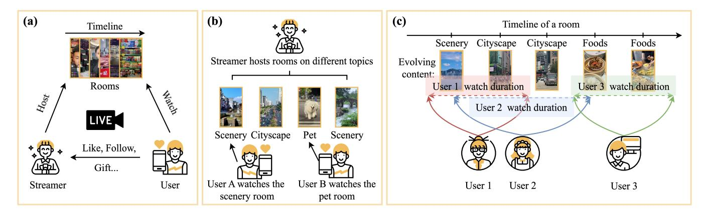
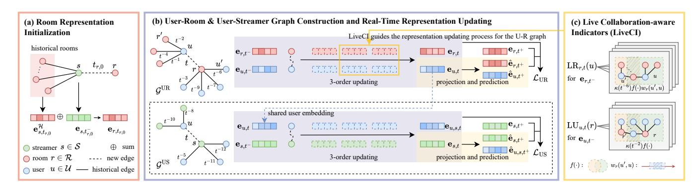
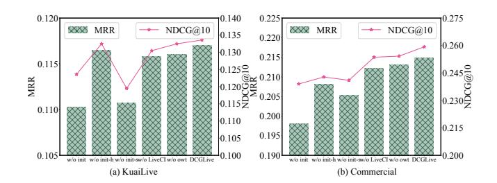
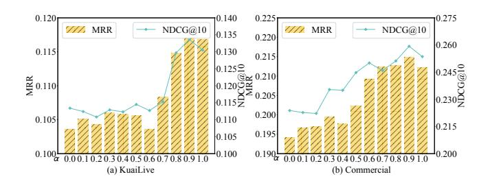

# Room Matters: Dynamic Room-level Collaboration Information Modeling for Live Streaming Recommendation

Ke Guo Gaoling School of Artificial Intelligence Renmin University of China Beijing, China imgkkk2004@ruc.edu.cn

Changle Qu Gaoling School of Artificial Intelligence Renmin University of China Beijing, China changlequ@ruc.edu.cn

Xiao Zhang∗ Gaoling School of Artificial Intelligence Renmin University of China Beijing, China zhangx89@ruc.edu.cn

Liqin Zhao Shijun Wang Kuaishou Technology

Beijing, China {zhaoliqin,wangshijun03}@kuaishou.com

Yanan Niu Kuaishou Technology Beijing, China niuyanan@kuaishou.com

Jun Xu Gaoling School of Artificial Intelligence Renmin University of China Beijing, China junxu@ruc.edu.cn

### Abstract

Live streaming platforms have recently gained popularity due to their immediacy and entertainment value, highlighting the need for streaming recommender systems that can adapt to the dynamic nature of evolving content, real-time interactions, and changing user interests. The "live room" plays a central role in modeling this dynamic environment, as it not only connects users with streamers but also serves as a key channel for collecting fine-grained user feedback. More specifically, the frequent interactions of users within a live room provide detailed dynamic collaboration information, reflecting the streamer's real-time topic and users' dynamic interests. However, existing studies have not thoroughly investigated the dynamics of room-level collaborative information. In this paper, we address this gap by emphasizing two perspectives: the evolving tripartite interaction information among rooms, streamers, and users, and the real-time intra-room collaboration information. We propose DCGLive, a Dynamic Collaboration-aware Graph learning approach for Live streaming recommendation. Specifically, we first construct two dynamic bipartite graphs to perceive the evolving tripartite interaction and generate real-time representations of streamers, rooms, and users. To account for the dynamic nature of live streaming, we design a set of non-parametric, collaborationaware indicators that weight intra-room interactions based on both temporal recency and frequency, while guiding the embedding updating process for both users and rooms. Additionally, to address the cold-start challenge of newly created live rooms in real time, we propose a room representation initialization mechanism that balances both the relevance and the dynamics among different rooms hosted by the same streamer. Experiments conducted on both commercial and public datasets demonstrate that DCGLive consistently outperforms the baseline models. Our code is available at [https://github.com/imgkkk574/DCGLive.](https://github.com/imgkkk574/DCGLive)

∗Corresponding author: Xiao Zhang (e-mail: zhangx89@ruc.edu.cn).

[This work is licensed under a Creative Commons Attribution 4.0 International License.](https://creativecommons.org/licenses/by/4.0) WWW '26, Dubai, United Arab Emirates

© 2026 Copyright held by the owner/author(s). ACM ISBN 979-8-4007-2307-0/2026/04 <https://doi.org/10.1145/3774904.3792241>

### CCS Concepts

• Information systems → Recommender systems.

### Keywords

Live Streaming Recommendation, Dynamic Graph, Intra-room Collaboration

### ACM Reference Format:

Ke Guo, Changle Qu, Xiao Zhang, Liqin Zhao, Shijun Wang, Yanan Niu, and Jun Xu. 2026. Room Matters: Dynamic Room-level Collaboration Information Modeling for Live Streaming Recommendation. In Proceedings of the ACM Web Conference 2026 (WWW '26), April 13–17, 2026, Dubai, United Arab Emirates. ACM, New York, NY, USA, [12](#page-11-0) pages. [https://doi.org/10.1145/](https://doi.org/10.1145/3774904.3792241) [3774904.3792241](https://doi.org/10.1145/3774904.3792241)

### 1 Introduction

With the rapid development of mobile internet technology, live streaming has rapidly risen to prominence in recent years [\[5\]](#page-8-0), profoundly reshaping how people consume and interact with online content. A defining characteristic of live streaming is the central role of the live room, where streamers broadcast and interact with users in real time, and where users engage through diverse activities such as liking and gifting. Unlike traditional media such as movies, books, or pre-recorded videos, live streaming is inherently dynamic and real-time [\[1,](#page-8-1) [10,](#page-8-2) [20,](#page-8-3) [26\]](#page-8-4). Content is simultaneously produced and consumed within a room, enabling immediate and reciprocal interaction between streamers and users. This dynamic setting causes user interests to fluctuate rapidly across different live rooms, often reflected in behavioral signals such as varying watch durations. Consequently, recommender systems for live streaming must address the highly dynamic evolution of user preferences to more effectively model and predict engagement.

Existing efforts to capture the dynamics of live streaming primarily focus on data timeliness and content modeling. For instance, Sliver [\[20\]](#page-8-3) optimizes label accuracy via a 30-second sliding window, while ContentCTR [\[8\]](#page-8-5) and MMBee [\[10\]](#page-8-2) leverage multi-modal features to predict stream highlights. LARM [\[21\]](#page-8-6) utilizes multi-modal large language models (LLMs) to interpret the real-time semantics of live content and align them with user preferences.

Figure 1: The dynamics of room-level collaboration information. (a): Example of the live streaming scenario with the tripartite interactions among streamers, rooms, and users. (b): As the streamer can cover various topics in different rooms, neglecting the interaction between users and rooms may result in missing the users' detailed interests. (c): Even within a room, its content changes over time. Some users' interests may not overlap, even though they are watching the same room. This highlights the importance of considering real-time intra-room collaboration information.

However, the dynamics of room-level collaborative information have not been thoroughly investigated in prior research. These dynamics manifest in two complementary aspects: (1) The evolving tripartite interaction among streamers, rooms, and users. As illustrated in Figure [1\(](#page-1-0)a), streamers host live rooms on different topics at various times, while users frequently switch between rooms and engage with multiple streamers. Such interactions reflect distinct facets of user interests: long-term preferences are often captured by enduring behaviors such as gifting from users to streamers, whereas short-term, real-time preferences are revealed through immediate interactions with rooms, such as liking and chatting. Moreover, as shown in Figure [1\(](#page-1-0)b), users may exhibit different interests when consuming content from the same streamer but across different rooms, since each room represents unique contextualized content. This highlights the necessity of modeling the tripartite relationship at the room level to preserve fine-grained collaboration signals. (2) The real-time intra-room collaboration information. As depicted in Figure [1\(](#page-1-0)c), even within the same live room, the content evolves continuously, leading to shifts in user interests over time. Users whose watch durations substantially overlap are likely to share similar real-time preferences, while those with little overlap may diverge in their interests. Neglecting such intra-room collaboration overlooks critical signals that are essential for representing user dynamics and the evolving semantics of live rooms. Overall, the "live room" serves as the pivotal unit for capturing the dynamics mentioned above, as it acts as a bridge between users and streamers while providing rich and fine-grained feedback signals. By explicitly incorporating room-level collaborative information, recommender systems can better capture subtle shifts in user preferences and the characteristics of real-time live content.

In this paper, we propose DCGLive, a Dynamic Collaborationaware Graph learning approach for Live streaming recommendation, which leverages room-level collaboration information to better capture dynamic evolving user preferences and enhance recommendation performance. Specifically, DCGLive captures the evolving representations of streamers, rooms, and users by constructing two

dynamic bipartite graphs: user-room and user-streamer. These representations are updated with each new interaction through a thirdorder updating mechanism, effectively capturing both collaborative and sequential relationships inherent in real-time interactions. To address the cold-start issue faced by newly created live rooms, we propose a room representation initialization mechanism that effectively incorporates both relevance and dynamics across various rooms hosted by the same streamer. This mechanism implicitly leverages the relationships between streamers and rooms, thereby enhancing the representation learning for rooms within a limited timeframe. Furthermore, to evaluate and leverage the impact of intra-room collaboration information on representation learning, we develop the Live Collaboration-aware Indicator (LiveCI). This non-parametric module assesses the effectiveness of collaboration within a room based on both temporal recency and interaction frequency, subsequently guiding the representation updating for both users and rooms. In this manner, DCGLive can effectively capture fine-grained, dynamic intra-room collaborative signals.

To verify the effectiveness of DCGLive, we conduct experiments on the next room prediction task and compare it with nine baseline methods. In summary, the contributions of this work are as follows:

• We identify the dynamics of room-level collaboration information in live streaming from two perspectives: the evolving tripartite relationships among streamers, rooms, and users, and the real-time intra-room collaboration information.

• We propose DCGLive, a dynamic collaboration-aware dualgraph learning approach that incorporates a room initialization mechanism and LiveCI to capture both evolving tripartite relationships and fine-grained intra-room collaborative information.

• Experimental results demonstrate that DCGLive outperforms baseline methods on both commercial and public datasets.

### 2 Related Work

Live Streaming Recommendation. Early studies focus on modeling the relationship between users and streamers [\[3,](#page-8-7) [26\]](#page-8-4). For example, the pioneering work LiveRec [\[26\]](#page-8-4) employs a self-attention

mechanism to capture repeated consumption patterns between users and streamers. Another line of research incorporates short video data into live streaming recommendation to alleviate data sparsity [\[1,](#page-8-1) [18,](#page-8-8) [25\]](#page-8-9). More recently, researchers have emphasized the dynamic nature of live streaming. Several studies approach dynamics from the perspective of live content [\[8](#page-8-5)[–10,](#page-8-2) [21,](#page-8-6) [22,](#page-8-10) [49\]](#page-9-0). From a collaborative perspective, DRIVER [\[11\]](#page-8-11) introduces a dynamic learning approach that models inter-room relationships based on users' behavioral paths after leaving a room. In addition, LSEC-GNN [\[43\]](#page-8-12) explores the tripartite interaction among users, streamers, and products in live streaming e-commerce. Despite these advancements, the dynamic nature of room-level collaborative information remains largely overlooked, presenting a significant research gap that requires further exploration.

Dynamic Modeling in Recommendation. In streaming recommendation, capturing dynamics is crucial as user interests evolve over time [\[2,](#page-8-13) [28,](#page-8-14) [45,](#page-8-15) [46\]](#page-9-1). Some efforts have been made to address this challenge [\[4,](#page-8-16) [7,](#page-8-17) [29,](#page-8-18) [33,](#page-8-19) [35,](#page-8-20) [47\]](#page-9-2). To incorporate temporal dynamics into graph-based collaborative filtering, dynamic graph neural networks (DGNNs) have been proposed [\[13,](#page-8-21) [17,](#page-8-22) [34,](#page-8-23) [38,](#page-8-24) [39,](#page-8-25) [41,](#page-8-26) [42,](#page-8-27) [44,](#page-8-28) [48,](#page-9-3) [52\]](#page-9-4). DGNNs can be categorized into discrete-time dynamic graphs (DTDGs) and continuous-time dynamic graphs (CTDGs) based on time granularity. DTDGs, such as EvolveGCN [\[23\]](#page-8-29), update GNN parameters across snapshots but face challenges in selecting appropriate intervals and capturing intra-span dynamics. In contrast, CTDGs model temporal events continuously, enabling finer-grained dynamic representation. Several DGNN-based methods have been applied to recommendation [\[19,](#page-8-30) [30,](#page-8-31) [32,](#page-8-32) [50,](#page-9-5) [51\]](#page-9-6). DGCF [\[19\]](#page-8-30) introduces embedding updating mechanisms to capture collaborative and sequential relations, while DGEL [\[32\]](#page-8-32) enhances these mechanisms with re-scaling networks for consistent dynamic embeddings. Despite DGNNs' suitability for dynamic scenarios, their application in live streaming recommendation remains unexplored. We address this gap by constructing bipartite CTDGs to model tripartite relationships and maintaining real-time representations.

### 3 Problem Formulation

Formally, a CTDG G evolves sequentially through a series of graph events, where each event represents possible modifications to the graph, such as node/edge additions or deletions, or updates to node features. These modifications result in changes to the structure or attributes of the graph. In the context of live streaming recommendation, we consider user watching behavior in live rooms and their gifting behavior towards streamers, focusing exclusively on edge addition events. Let S, R, and U denote the sets of streamers, live rooms, and users, respectively. An interaction ���� = (���� , ���� , ���� ,���� , ���� , ��) represents a user engagement event at timestamp �� ∈ T, where user ���� ∈ U enters live room ���� ∈ R hosted by streamer ���� ∈ S. ���� represents the watch duration, while ���� denotes the number of gifts that user ���� sends to streamer ���� during this interaction. If no gifts are sent, then ���� = 0. Here, T denotes the set of timestamps belonging to R + . Based on this formulation, we define two CTDGs: user-room and user-streamer graphs.

Definition 1. User-Room (U-R) Graph. The user-room graph is denoted as G UR = (U ∪ R, E UR), where U ∪ R represents the node set and E UR denotes the edge set constructed based on watching behaviors between users and rooms. The initial graph G UR ��0 at timestamp ��0 consists of isolated nodes with no edges. For each interaction at timestamp ��, the corresponding event in G UR is represented as (���� , ���� ,���� , ��), indicating that a new edge is established between nodes ���� and ���� with edge feature ���� .

Definition 2. User-Streamer (U-S) Graph. The user-streamer graph is denoted as G US = (U ∪ S, E US), where U ∪ S represents the node set and E US denotes the edge set constructed based on gifting behaviors between users and streamers. The initial graph G US ��0 at timestamp ��0 consists of isolated nodes with no edges. For each interaction at timestamp ��, if ���� ≠ 0, the corresponding event in G US is represented as (���� , ���� , ���� , ��), indicating that a new edge is established between nodes ���� and ���� with edge feature ���� .

Given the dynamic graphs constructed from interactions among streamers, rooms, and users, the objective of live room recommendation is to learn and update tripartite representations based on historical interactions and current events, and then leverage these learned representations to predict the live room with which a user is most likely to interact at the next timestamp. Formally, this objective can be expressed as follows:

G UR �� , G US �� = P G UR �� − , G US �� − , ���� , ��predict,��+ = F G UR , G US �� ,

where �� − and �� + denote the nearest preceding and succeeding timestamps relative to timestamp ��, respectively. P represents the graph updating mechanism, while F denotes the prediction function.

### 4 The Proposed Approach: DCGLive

We propose DCGLive (Dynamic Collaboration-aware Graph learning approach for Live streaming recommendation), which captures both evolving tripartite relationship and real-time intra-room collaboration information to enhance live streaming recommendation.

### 4.1 Overview of DCGLive

The overall idea of DCGLive is to model dynamic room-level collaboration in a structured and adaptive manner. As shown in Figure [2,](#page-3-0) DCGLive operates in three key steps. First, it constructs dynamic user–room and user–streamer graphs to capture the evolving tripartite interactions. Second, to mitigate the cold-start issue of newly created rooms, a room initialization mechanism is designed by incorporating both relevance and dynamics across various rooms hosted by the same streamer. Finally, a set of non-parametric collaborationaware indicators (LiveCI) is introduced to weight the fine-grained intra-room collaborative effects and then guide real-time representation updating for both users and rooms. Through this workflow, DCGLive maintains real-time and collaboration-sensitive representations that are used for accurate next-room prediction.

### 4.2 Dynamic User-Room & User-Streamer Graph Construction

As discussed in Section [1,](#page-0-0) streamers can host different live rooms on various topics, and users can frequently switch between rooms and interact with different streamers. This evolving tripartite interaction among streamers, rooms, and users contains crucial collaboration information. To perceive this relationship, we first construct two

Table 2: Performance comparison between DCGLive and the baselines on both commercial and public datasets. The best and second-best performance methods are highlighted in bold and underlined fonts, respectively. \* indicates p-value < 0.05 from t-test between DCGLive and the best baseline.

| Category | Datasets Methods | NDCG@5   | NDCG@10  | KuaiLive Recall@5 | Recall@10 | MRR    | NDCG@5   | NDCG@10  | Commercial Recall@5 | Recall@10 | MRR      |
|----------|------------------|----------|----------|-------------------|-----------|--------|----------|----------|---------------------|-----------|----------|
|          | BPRMF            | 0.0009   | 0.0013   | 0.0016            | 0.0028    | 0.0027 | 0.0011   | 0.0019   | 0.0016              | 0.0042    | 0.0020   |
| General  | NGCF             | 7.7e-5   | 0.0002   | 0.0001            | 0.0004    | 0.0018 | 0.0008   | 0.0012   | 0.0013              | 0.0025    | 0.0018   |
|          | LightGCN         | 0.0004   | 0.0006   | 0.0007            | 0.0014    | 0.0020 | 0.0011   | 0.0014   | 0.0019              | 0.0028    | 0.0019   |
|          | CAGCN            | 0.0008   | 0.0010   | 0.0014            | 0.0020    | 0.0024 | 0.0008   | 0.0015   | 0.0015              | 0.0039    | 0.0016   |
|          | DeepCoevolve     | 0.0559   | 0.0744   | 0.0910            | 0.1485    | 0.0675 | 0.0820   | 0.1017   | 0.1223              | 0.1838    | 0.0921   |
|          | JODIE            | 0.0838   | 0.1074   | 0.1292            | 0.2028    | 0.0974 | 0.1650   | 0.1973   | 0.2488              | 0.3493    | 0.1683   |
| Dynamic  | DGCF             | 0.0816   | 0.1118   | 0.1261            | 0.2210    | 0.1081 | 0.2071   | 0.2412   | 0.2926              | 0.3985    | 0.2091   |
|          | DGEL             | 0.0017   | 0.0035   | 0.0037            | 0.0092    | 0.0071 | 0.0121   | 0.0189   | 0.0210              | 0.0423    | 0.0212   |
|          | NeuFilter        | 0.0738   | 0.0970   | 0.1154            | 0.1875    | 0.0891 | 0.1467   | 0.1748   | 0.2247              | 0.3116    | 0.1468   |
| Ours     | DCGLive          | 0 0996 ∗ | 0 1336 ∗ | 0 1561 ∗          | 0 2614 ∗  | 0 1170 | 0 2219 ∗ | 0 2593 ∗ | 0 3304 ∗            | 0 4463 ∗  | 0 2149 ∗ |

NGCF [\[36\]](#page-8-38), LightGCN [\[14\]](#page-8-39), and CAGCN [\[37\]](#page-8-35). The dynamic methods include DeepCoevolve [\[6\]](#page-8-40), JODIE [\[17\]](#page-8-22), DGCF [\[19\]](#page-8-30), DGEL [\[32\]](#page-8-32), and NeuFilter [\[40\]](#page-8-36). For more details, please refer to Appendix [E.1.](#page-10-0)

5.1.4 Implementation Details. We use the Adam optimizer [\[16\]](#page-8-41) to train DCGLive. The learning rates for optimizing the parameters of the U-R and U-S graphs are meticulously chosen from {1e-3, 5e-4, 1e-4, 5e-4, 1e-5}, respectively. The hyperparameter �� is selected from the range {0.0, 0.1, 0.2, . . . , 1.0}. The dimensions of dynamic embedding are selected from {16, 32, 64, 128, 256}, and to ensure a fair comparison, we set the embedding size of all methods to 128. All experiments are conducted on NVIDIA Tesla V100 32G GPUs. More details about the implementation can be found in Appendix [E.2.](#page-10-1)

### 5.2 Experimental Results

We compare our proposed DCGLive with the aforementioned baselines on both commercial and public datasets, as shown in Table [2.](#page-6-0) Overall, DCGLive significantly outperforms all other methods, underscoring the benefits of integrating dynamic room-level collaboration in live streaming recommendations. From the experimental results, we observe that: (1) Dynamic methods significantly outperform static baselines, as the latter fail to capture the rapidly evolving nature of live rooms and user preferences. (2) DGCF emerges as the strongest baseline in most cases, particularly on the commercial dataset where it consistently achieves the second-best performance, underscoring the importance of collaborative relationships in live streaming recommendation. (3) By adeptly modeling tripartite relationships and fine-grained intra-room collaboration, DCGLive outperforms all baselines, achieving improvements of 17.14% and 8.47% on the KuaiLive and Commercial datasets, respectively.

## 5.3 Ablation Study

We conduct ablation studies by systematically removing each component from DCGLive one at a time. The results, presented in Table [3,](#page-6-1) demonstrate that each component plays a crucial role in modeling the dynamics of room-level collaborative information. "w/o U-S" denotes the exclusion of the U-S graph. Under this configuration, the model's performance is comparable to DGCF but inferior to the full DCGLive model. This indicates that integrating the U-S

Table 3: Ablation study of the proposed DCGLive on both commercial and public datasets. "w/o" represents "without".

| Datasets     | Settings | NDCG@5 | NDCG@10 | Recall@5 | Recall@10 | MRR    |
|--------------|----------|--------|---------|----------|-----------|--------|
| w/o          | U-S      | 0.2068 | 0.2364  | 0.2989   | 0.3903    | 0.2041 |
| w/o Comm.    | Init     | 0.2025 | 0.2390  | 0.3033   | 0.4161    | 0.1980 |
| w/o          | LiveCI   | 0.2165 | 0.2536  | 0.3173   | 0.4321    | 0.2122 |
| DCGLive      |          | 0.2219 | 0.2593  | 0.3304   | 0.4463    | 0.2149 |
| w/o          | U-S      | 0.0922 | 0.1204  | 0.1406   | 0.2282    | 0.1051 |
| w/o KuaiLive | Init     | 0.0893 | 0.1236  | 0.1396   | 0.2468    | 0.1103 |
| w/o          | LiveCI   | 0.0977 | 0.1305  | 0.1525   | 0.2550    | 0.1158 |
| DCGLive      |          | 0.0996 | 0.1336  | 0.1561   | 0.2614    | 0.1170 |

graph offers valuable tripartite collaborative information, which serves as a foundation for subsequent workflows. "w/o Init" signifies the removal of the room representation initialization mechanism. The subsequent performance degradation demonstrates that this mechanism effectively mitigates the cold-start problem for newly created rooms by leveraging both historical room characteristics and the streamer's current representation. "w/o LiveCI" indicates the exclusion of LiveCI. The decline in performance under this setting confirms that LiveCI enables the model to capture fine-grained collaborative effects among co-watching users, thereby facilitating more effective learning of user and room representations.

### 5.4 Further Analysis

5.4.1 Analysis on Cold-Start Rooms. To evaluate the performance of DCGLive in cold-start rooms, we conduct an assessment during the testing phase. Specifically, we track all subsequent predictions for rooms that appeared for the first time during this phase. The results are presented in Table [4.](#page-7-0) DCGLive achieves substantial improvements over both DGCF and the variant "w/o Init" on cold-start rooms across both datasets. These results confirm that our initialization mechanism effectively addresses the cold-start challenge. By leveraging both the streamer's historical room characteristics and the current state, it enables the generation of meaningful recommendations for newly created rooms, even with limited interaction history. Notably, even the "w/o Init" variant outperforms DGCF, demonstrating that our dual-graph architecture provides benefits beyond the initialization mechanism alone.

Table 4: Performance on cold-start rooms. N@10 denotes NDCG@10, R@10 denotes Recall@10.

| Datasets Methods | N@10   | KuaiLive R@10 | MRR    | N@10   | Commercial R@10 | MRR    |
|------------------|--------|---------------|--------|--------|-----------------|--------|
| DGCF             | 0.0968 | 0.2109        | 0.0921 | 0.2397 | 0.3858          | 0.2095 |
| w/o init         | 0.1165 | 0.2432        | 0.1032 | 0.2487 | 0.4307          | 0.2062 |
| DCGLive          | 0.1368 | 0.2854        | 0.1169 | 0.2671 | 0.4569          | 0.2219 |

5.4.2 Analysis on Variants of Room Representation Initialization Mechanism and LiveCI. To further investigate the effectiveness of DCGLive, we conduct comprehensive experiments on variants of the room representation initialization mechanism and LiveCI. The experimental results are presented in Figure [3.](#page-7-1) Specifically, "w/o init-h" and "w/o init-s" denote the exclusion of historical room characteristics and the streamer's latest representation, respectively. The removal of either component results in performance degradation, with the exclusion of the streamer's latest representation causing a more substantial decline. Notably, even this degraded variant still outperforms the "w/o Init" baseline, which removes the entire representation initialization mechanism. These results demonstrate that the room representation initialization mechanism effectively alleviates the cold-start problem for newly created rooms by jointly incorporating relevance and temporal dynamics across rooms hosted by the same streamer. Moreover, the more pronounced impact of removing the streamer's latest representation suggests that temporal dynamics play a more critical role than historical patterns for next-room recommendation. Regarding LiveCI, "w/o owt" denotes the removal of the overlapping watching weight. This variant yields performance inferior to the full DCGLive but superior to "w/o LiveCI", which excludes the entire LiveCI. This observation validates the effectiveness of incorporating overlapping watching weight to better capture intra-room collaborative effect. embedding dimension. The primary computational cost arises from w/o init w/o init-h w/o init-sw/o LiveCI w/o owt DCGLive 0.105

5.4.3 Hyper-Parameter Analysis. We conduct experiments to examine the hyper-parameter �� in Eq. [\(6\)](#page-4-1). In our scenarios, we observe that excessively low LiveCI values can adversely affect representation updating. To mitigate this issue, we employ a linear mapping that transforms the LiveCI range to better balance the model's learning capability with its sensitivity to collaborative effects. Specifically, the hyper-parameter �� is used to linearly map the LiveCI values to the interval [��, 1]. We evaluate �� across the set {0.1, 0.2, . . . , 1.0}, where �� = 1.0 corresponds to the baseline without LiveCI incorporation. As shown in Figure [4,](#page-7-2) optimal performance is achieved when �� is set to 0.9, which outperforms the baseline. These findings provide valuable insights into how collaborative effects influence representation updating in DGNNs and guide the selection of appropriate hyper-parameter values for balancing representation learning and collaborative information.

5.4.4 Complexity Analysis. During the training phase, optimization for DCGLive is executed using the T-Batch gradient descent method. The complexity of forming the batches is O (|��tr|), where |��tr| = |E�� �� tr | denotes the size of the training dataset. For each interaction involving two nodes in either the U-R or U-S graphs, the complexity of a single updating and prediction session is O (2��max��), where ��max represents the maximum node degree and �� is the

Figure 3: Analysis on variants of room representation initialization mechanism and LiveCI.

Figure 4: Hyper-parameter analysis w.r.t. ��.

the second-order aggregation. Consequently, the worst-case training complexity per epoch is O (2��max�� (|EUR tr | + |EUS tr |)). Compared to DGCF, DCGLive introduces additional computational overhead due to the incorporation of the U-S graph. However, since the U-S graph is considerably sparser than the U-R graph, the number of edges |EUS tr | is significantly smaller than |EUR tr |, i.e., |EUS tr | ≪ |EUR tr |. Therefore, the overall model complexity remains acceptable and satisfies the efficiency requirements of our application scenario. Furthermore, the computation of LiveCI can be performed during the data preprocessing phase, thereby reducing the training cost.

### 6 Conclusion

In this paper, we introduce DCGLive, a dynamic collaborationaware dual-graph learning approach for live streaming recommendation. This approach effectively leverages the dynamics of room-level collaboration information from two perspectives: the evolving tripartite relationships among streamers, rooms, and users, and the real-time intra-room collaboration information. Specifically, DCGLive integrates a room initialization mechanism alongside LiveCI to address the room cold-start issue and to capture the finegrained intra-room collaborative effects. Extensive experimental results demonstrate the effectiveness of DCGLive.

### 7 Acknowledgments

This work was partially supported by the National Natural Science Foundation of China (No. 62376275, 62472426). Work partially done at Beijing Key Laboratory of Research on Large Models and Intelligent Governance, and Engineering Research Center of Next-Generation Intelligent Search and Recommendation, MOE. Supported by fund for building world-class universities (disciplines) of Renmin University of China. Supported by Kuaishou Technology.

References [1] Jiangxia Cao, Shen Wang, Yue Li, Shenghui Wang, Jian Tang, Shiyao Wang, Shuang Yang, Zhaojie Liu, and Guorui Zhou. 2024. Moment&Cross: Next-Generation Real-Time Cross-Domain CTR Prediction for Live-Streaming Recommendation at Kuaishou. arXiv preprint arXiv:2408.05709 (2024). [2] Shiyu Chang, Yang Zhang, Jiliang Tang, Dawei Yin, Yi Chang, Mark A Hasegawa-Johnson, and Thomas S Huang. 2017. Streaming Recommender Systems. In Proceedings of the 26th International Conference on World Wide Web. 381–389. [3] Edgar Chen, Mark Ally, Eder Santana, and Saad Ali. 2022. Weighing dynamic availability and consumption for Twitch recommendations. (2022). [4] Wanyu Chen, Fei Cai, Honghui Chen, and Maarten De Rijke. 2019. A dynamic co-attention network for session-based recommendation. In Proceedings of the 28th ACM international conference on information and knowledge management. 1461–1470. [5] Xinyue Chen, Si Chen, Xu Wang, and Yun Huang. 2021. " I was afraid, but now I enjoy being a streamer!" Understanding the Challenges and Prospects of Using Live Streaming for Online Education. Proceedings of the ACM on Human-Computer Interaction 4, CSCW3 (2021), 1–32. [6] Hanjun Dai, Yichen Wang, Rakshit Trivedi, and Le Song. 2016. Deep coevolutionary network: Embedding user and item features for recommendation. arXiv preprint arXiv:1609.03675 (2016). [7] Sunhao Dai, Changle Qu, Sirui Chen, Xiao Zhang, and Jun Xu. 2024. ReCODE: Modeling Repeat Consumption with Neural ODE. In Proceedings of the 47th International ACM SIGIR Conference on Research and Development in Information Retrieval. [8] Jiaxin Deng, Dong Shen, Shiyao Wang, Xiangyu Wu, Fan Yang, Guorui Zhou, and Gaofeng Meng. 2023. ContentCTR: Frame-level Live Streaming Click-Through Rate Prediction with Multimodal Transformer. arXiv preprint arXiv:2306.14392 (2023). [9] Jiaxin Deng, Shiyao Wang, Dong Shen, Liqin Zhao, Fan Yang, Guorui Zhou, and Gaofeng Meng. 2024. A Multimodal Transformer for Live Streaming Highlight Prediction. In 2024 IEEE International Conference on Multimedia and Expo (ICME). IEEE, 1–6. [10] Jiaxin Deng, Shiyao Wang, Yuchen Wang, Jiansong Qi, Liqin Zhao, Guorui Zhou, and Gaofeng Meng. 2024. MMBee: Live Streaming Gift-Sending Recommendations via Multi-Modal Fusion and Behaviour Expansion. In Proceedings of the 30th ACM SIGKDD Conference on Knowledge Discovery and Data Mining. 4896–4905. [11] Ge Gao, Hongyan Liu, and Kang Zhao. 2023. Live streaming recommendations based on dynamic representation learning. Decision Support Systems 169 (2023), 113957. [12] Will Hamilton, Zhitao Ying, and Jure Leskovec. 2017. Inductive representation learning on large graphs. Advances in neural information processing systems 30 (2017). [13] Bowei He, Xu He, Yingxue Zhang, Ruiming Tang, and Chen Ma. 2023. Dynamically expandable graph convolution for streaming recommendation. In Proceedings of the ACM Web Conference 2023. 1457–1467. [14] Xiangnan He, Kuan Deng, Xiang Wang, Yan Li, Yongdong Zhang, and Meng Wang. 2020. Lightgcn: Simplifying and powering graph convolution network for recommendation. In Proceedings of the 43rd International ACM SIGIR conference on research and development in Information Retrieval. 639–648. [15] Sepp Hochreiter and Jürgen Schmidhuber. 1997. Long Short-Term Memory. Neural Computation 9, 8 (1997), 1735–1780. [doi:10.1162/neco.1997.9.8.1735](https://doi.org/10.1162/neco.1997.9.8.1735) [16] Diederik P Kingma. 2014. Adam: A method for stochastic optimization. arXiv preprint arXiv:1412.6980 (2014). [17] Srijan Kumar, Xikun Zhang, and Jure Leskovec. 2019. Predicting dynamic embedding trajectory in temporal interaction networks. In Proceedings of the 25th ACM SIGKDD international conference on knowledge discovery & data mining. 1269–1278. [18] Xiaodong Li, Ruochen Yang, Shuang Wen, Shen Wang, Yueyang Liu, Guoquan Wang, Weisong Hu, Qiang Luo, Jiawei Sheng, Tingwen Liu, et al. 2025. FARM: Frequency-Aware Model for Cross-Domain Live-Streaming Recommendation. arXiv preprint arXiv:2502.09375 (2025). [19] Xiaohan Li, Mengqi Zhang, Shu Wu, Zheng Liu, Liang Wang, and Philip S Yu. 2020. Dynamic graph collaborative filtering. In 2020 IEEE international conference on data mining (ICDM). IEEE, 322–331. [20] Fengqi Liang, Baigong Zheng, Liqin Zhao, Guorui Zhou, Qian Wang, and Yanan Niu. 2024. Ensure Timeliness and Accuracy: A Novel Sliding Window Data Stream Paradigm for Live Streaming Recommendation. arXiv preprint arXiv:2402.14399 (2024). [21] Yueyang Liu, Jiangxia Cao, Shen Wang, Shuang Wen, Xiang Chen, Xiangyu Wu, Shuang Yang, Zhaojie Liu, Kun Gai, and Guorui Zhou. 2025. LLM-Alignment Live-Streaming Recommendation. arXiv preprint arXiv:2504.05217 (2025). [22] Yucheng Lu, Jiangxia Cao, Xu Kuan, Wei Cheng, Wei Jiang, Jiaming Zhang, Yang Shuang, Liu Zhaojie, and Liyin Hong. 2025. LiveForesighter: Generating Future Information for Live-Streaming Recommendations at Kuaishou. arXiv preprint arXiv:2502.06557 (2025). [23] Aldo Pareja, Giacomo Domeniconi, Jie Chen, Tengfei Ma, Toyotaro Suzumura, Hiroki Kanezashi, Tim Kaler, Tao Schardl, and Charles Leiserson. 2020. Evolvegcn: Evolving graph convolutional networks for dynamic graphs. In Proceedings of the AAAI conference on artificial intelligence, Vol. 34. 5363–5370. [24] Changle Qu, Sunhao Dai, Ke Guo, Liqin Zhao, Yanan Niu, Xiao Zhang, and Jun Xu. 2025. KuaiLive: A Real-time Interactive Dataset for Live Streaming Recommendation. arXiv preprint arXiv:2508.05633 (2025). [25] Changle Qu, Liqin Zhao, Yanan Niu, Xiao Zhang, and Jun Xu. 2025. Bridging Short Videos and Streamers with Multi-Graph Contrastive Learning for Live Streaming Recommendation. In Proceedings of the 48th International ACM SIGIR Conference on Research and Development in Information Retrieval. 2059–2069. [26] Jérémie Rappaz, Julian McAuley, and Karl Aberer. 2021. Recommendation on live-streaming platforms: Dynamic availability and repeat consumption. In Proceedings of the 15th ACM Conference on Recommender Systems. 390–399. [27] Steffen Rendle, Christoph Freudenthaler, Zeno Gantner, and Lars Schmidt-Thieme. 2009. BPR: Bayesian personalized ranking from implicit feedback. In Proceedings of the Twenty-Fifth Conference on Uncertainty in Artificial Intelligence (Montreal, Quebec, Canada) (UAI '09). AUAI Press, Arlington, Virginia, USA, 452–461. [28] Chenglei Shen, Xiao Zhang, Wei Wei, and Jun Xu. 2023. HyperBandit: Contextual bandit with hypernetwork for time-varying user preferences in streaming recommendation. In Proceedings of the 32nd ACM International Conference on Information and Knowledge Management (CIKM 2023). 2239–2248. [29] Liqiang Song, Ye Bi, Mengqiu Yao, Zhenyu Wu, Jianming Wang, and Jing Xiao. 2020. Dream: A dynamic relation-aware model for social recommendation. In Proceedings of the 29th ACM international conference on information & knowledge management. 2225–2228. [30] Weiping Song, Zhiping Xiao, Yifan Wang, Laurent Charlin, Ming Zhang, and Jian Tang. 2019. Session-based social recommendation via dynamic graph attention networks. In Proceedings of the Twelfth ACM international conference on web search and data mining. 555–563. [31] Haoran Tang, Shiqing Wu, Xueyao Sun, Jun Zeng, Guandong Xu, and Qing Li. 2025. TCGC: Temporal collaboration-aware graph co-evolution learning for dynamic recommendation. ACM Transactions on Information Systems 43, 1 (2025), 1–27. [32] Haoran Tang, Shiqing Wu, Guandong Xu, and Qing Li. 2023. Dynamic graph evolution learning for recommendation. In Proceedings of the 46th international acm sigir conference on research and development in information retrieval. 1589– 1598. [33] Md Mehrab Tanjim, Hammad A Ayuubi, and Garrison W Cottrell. 2020. DynamicRec: a dynamic convolutional network for next item recommendation. In Proceedings of the 29th ACM international conference on information & knowledge management. 2237–2240. [34] Junshan Wang, Guojie Song, Yi Wu, and Liang Wang. 2020. Streaming graph neural networks via continual learning. In Proceedings of the 29th ACM international conference on information & knowledge management. 1515–1524. [35] Lu Wang, Wei Zhang, Xiaofeng He, and Hongyuan Zha. 2018. Supervised reinforcement learning with recurrent neural network for dynamic treatment recommendation. In Proceedings of the 24th ACM SIGKDD international conference on knowledge discovery & data mining. 2447–2456. [36] Xiang Wang, Xiangnan He, Meng Wang, Fuli Feng, and Tat-Seng Chua. 2019. Neural graph collaborative filtering. In Proceedings of the 42nd international ACM SIGIR conference on Research and development in Information Retrieval. 165–174. [37] Yu Wang, Yuying Zhao, Yi Zhang, and Tyler Derr. 2023. Collaboration-aware graph convolutional network for recommender systems. In Proceedings of the ACM web conference 2023. 91–101. [38] Zhihao Wen and Yuan Fang. 2022. Trend: Temporal event and node dynamics for graph representation learning. In Proceedings of the ACM web conference 2022. 1159–1169. [39] Jiafeng Xia, Dongsheng Li, Hansu Gu, Jiahao Liu, Tun Lu, and Ning Gu. 2022. FIRE: Fast incremental recommendation with graph signal processing. In Proceedings of the ACM Web Conference 2022. 2360–2369. [40] Jiafeng Xia, Dongsheng Li, Hansu Gu, Tun Lu, Peng Zhang, Li Shang, and Ning Gu. 2024. Neural Kalman filtering for robust temporal recommendation. In Proceedings of the 17th ACM International Conference on Web Search and Data Mining. 836–845. [41] Da Xu, Chuanwei Ruan, Evren Korpeoglu, Sushant Kumar, and Kannan Achan. 2020. Inductive representation learning on temporal graphs. arXiv preprint arXiv:2002.07962 (2020). [42] Jiaxuan You, Yichen Wang, Aditya Pal, Pong Eksombatchai, Chuck Rosenburg, and Jure Leskovec. 2019. Hierarchical temporal convolutional networks for dynamic recommender systems. In The world wide web conference. 2236–2246. [43] Sanshi Yu, Zhuoxuan Jiang, Dong-Dong Chen, Shanshan Feng, Dongsheng Li, Qi Liu, and Jinfeng Yi. 2021. Leveraging tripartite interaction information from live stream e-commerce for improving product recommendation. In Proceedings of the 27th ACM SIGKDD conference on knowledge discovery & data mining. 3886–3894. [44] Mengqi Zhang, Shu Wu, Xueli Yu, Qiang Liu, and Liang Wang. 2022. Dynamic graph neural networks for sequential recommendation. IEEE Transactions on Knowledge and Data Engineering 35, 5 (2022), 4741–4753. [45] Xiao Zhang, Sunhao Dai, Jun Xu, Zhenhua Dong, Quanyu Dai, and Ji-Rong Wen. 2022. Counteracting user attention bias in music streaming recommendation

• CAGCN. Similarity metrics: Jaccard Similarity (to maintain consistency with our DCGLive); Propagation layers: �� = 3; Learning rate: 1e-3 on commercial dataset, 1e-7 on KuaiLive dataset.

• DeepCoevolve. Learning rate: 1e-3; Negative rooms: 100; Negative users: 100.

• JODIE[2](#page-11-1) . Learning rate: 1e-3; State change: False.

• DGCF[3](#page-11-2) . Learning rate: 1e-3; State change: False; Time span number: 500; Aggregate function: attention (to maintain consistency with our DCGLive).

• DGEL[4](#page-11-3) . Learning rate: 1e-5 on commercial dataset, 1e-4 on KuaiLive dataset; Time span number: 500; Sample length: 100.

• NeuFilter[5](#page-11-4) . Learning rate: 1e-3; Propagation layers: �� = 3; State change: False.

• DCGLive: Learning rate: 5e-4 for optimizing both the U-R and U-S graphs on commercial dataset, 1e-3 for optimizing the U-R graph and 5e-4 for optimizing the U-S graph on KuaiLive dataset; Max neighbors for computing LiveCI: 50 on commercial dataset and 30 on KuaiLive dataset; �� = 0.9; Time span number: 500.

2https://github.com/claws-lab/jodie

3https://github.com/CRIPAC-DIG/DGCF

4https://github.com/henrictang/DGEL 5https://github.com/Yaveng/NeuFilter