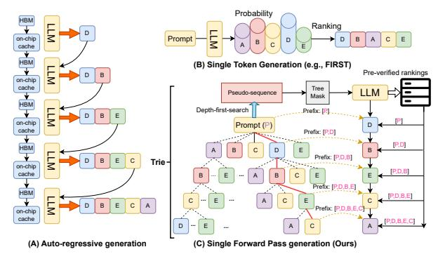
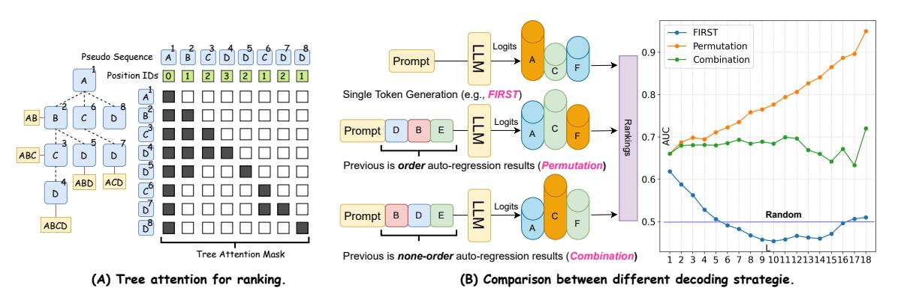
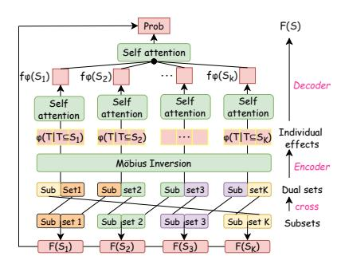
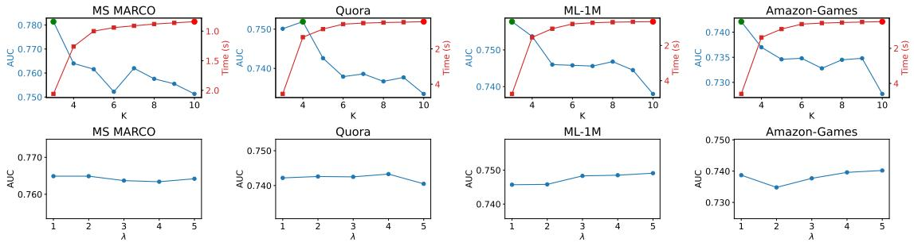
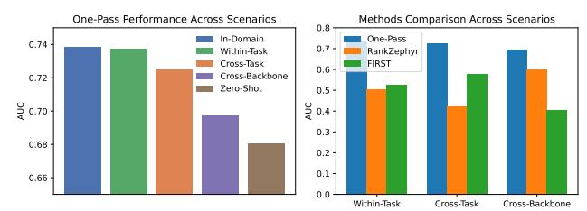

# ONE-PASS: Single Forward Pass Decoding for Listwise Reranking

Yingpeng Du Nanyang Technological University Singapore yingpeng.du@ntu.edu.sg

Zhu Sun∗ Singapore University of Technology and Design Singapore zhu\_sun@sutd.edu.sg

Tianjun Wei Nanyang Technological University Singapore tjwei2-c@my.cityu.edu.hk

Jie Zhang Nanyang Technological University Singapore zhangj@ntu.edu.sg

# Abstract

Large Language Models (LLMs) have been widely adopted in ranking systems, specifically for reranking tasks. Despite the effectiveness, the auto-regressive decoding of LLMs leads to inference latency due to the memory-bandwidth-bound. To alleviate this bottleneck, prior studies have explored single token decoding as an approximation, but they suffer from performance degradation at the tail positions of ranking. In this paper, we propose a Single Forward Pass (SFP)-based method to pre-verify multiple rankings using tree attention, approximating auto-regressive decoding by relevant sub-rankings at each step. However, verifying all possible ranking permutations will lead to factorial-level token computation (��!), making it intractable within SFP. To this end, we first reduce item ranking permutations to combinations (2 �� ), based on the empirical observation that the LLM's next-item generation is less sensitive to the exact ordering of preceding items. Furthermore, we divide the full ranking into �� sub-rankings and aggregate their individual probabilities, which further decreases the verification space to 2 ⌈�� /��⌉ · �� ≪ 2 �� . However, naïvely aggregating sub-ranking probabilities leads to inaccurate estimates in listwise ranking. To overcome this, we introduce a Möbius inversion model that explicitly decompose the individual contribution of subsets within a complete lattice, as verified by tree attention. Then, we learn their higher-order effects with a hierarchical self-attention model to reconstruct the full ranking probability. Experiments on both information retrieval and recommendation tasks show the effectiveness of our proposed method.

# CCS Concepts

• Information systems → Information systems applications.

# Keywords

Ranking task, Large language model, Möbius inversion.

### ACM Reference Format:

Yingpeng Du, Zhu Sun, Tianjun Wei, and Jie Zhang. 2026. ONE-PASS: Single Forward Pass Decoding for Listwise Reranking. In Proceedings of the

∗Corresponding author.

© 2026 Copyright held by the owner/author(s). ACM ISBN 979-8-4007-2307-0/2026/04 <https://doi.org/10.1145/3774904.3792243>

ACM Web Conference 2026 (WWW '26), April 13–17, 2026, Dubai, United Arab Emirates. ACM, New York, NY, USA, [10](#page-9-0) pages. [https://doi.org/10.1145/](https://doi.org/10.1145/3774904.3792243) [3774904.3792243](https://doi.org/10.1145/3774904.3792243)

### Resource Availability:

The source code of this paper has been made publicly available at [https:](https://doi.org/10.5281/zenodo.18297818) [//doi.org/10.5281/zenodo.18297818.](https://doi.org/10.5281/zenodo.18297818)

# 1 Introduction

Large Language Models (LLMs) [\[37\]](#page-8-0) have recently achieved remarkable success in ranking systems, including information retrieval (IR) and recommender systems (RS), especially for reranking tasks [\[7,](#page-8-1) [22,](#page-8-2) [27,](#page-8-3) [38\]](#page-8-4). Given a query (e.g., a user profile in RSs), ranking systems aim to order a set of candidate items according to their relevance or preference [\[6\]](#page-8-5). The integration of LLMs has significantly improved ranking effectiveness, but their practical deployment is hindered by the high inference latency of auto-regressive decoding. As shown in [Figure 1](#page-1-0) (A), each decoding round necessitates loading the billion-parameter LLM from high-bandwidth memory (HBM) into the on-chip cache of modern accelerators (e.g., GPUs), resulting in inefficient and time-consuming generation.

To this end, speculative decoding (SD) accelerates text generation by parallel verification of multiple tokens [\[16\]](#page-8-6), reducing the decoding round for efficient inference of LLMs. While effective in preserving position-wise accuracy, SD relies on the multi-round decoding, still bounded by the HBM and making the rounds of verification agnostic, hindering the latency guarantees required by ranking systems in real-world applications. To this end, prior studies investigate the Single Token Decoding (STD) strategy for ranking tasks, where the ranking score of each candidate is approximated using only the logits of the first generated token from a single forward pass [\[22–](#page-8-2)[24\]](#page-8-7), as shown in Figure [1](#page-1-0) (B). However, these methods, such as FIRST [\[24\]](#page-8-7), can approximate top-ranked items well, but they suffer from severe degradation in the tail rankings (as shown in [Figure 2](#page-2-0) (B)).

Inspired by the tree attention mechanism [\[2\]](#page-8-8), it enables the processing of multiple rankings in parallel within Single Forward-Pass (SFP) for LLMs, where the encoding of a certain node relies solely on its parent nodes. As shown in Figure [1](#page-1-0) (C), the common prefix of trie can pre-verify several sub-rankings, demonstrating its potential for conducting auto-regressive decoding by verified rankings within an SFP. Specifically, suppose we have �� candidate items D for reranking, for ��-th step in auto-regressive decoding, we need to select the item with maximum possibility based on

[This work is licensed under a Creative Commons Attribution 4.0 International License.](https://creativecommons.org/licenses/by/4.0) WWW '26, Dubai, United Arab Emirates

Figure 1: Different schemes of decoding for reranking tasks. (A) Auto-regressive decoding shows high communication between HBM and on-chip; (B) Single token decoding shows low accuracy; (C) Our single forward pass generation shows low communication and high accuracy, showing potential for LLM-based reranking.

the forward-passing �� − 1 preceding items by LLMs. Therefore, it requires pre-verifying (forward-pass) all permutations of subsets of these items by LLMs, i.e., ∪��⊆DPerm(��). Although the trie encoding can estimate all these permutations by encoding ��! tokens with common prefixes, it is intractable to encode these extremely largescale tokens for LLMs within an SFP.

In this paper, we present two reductions to approximate autoregressive decoding by pre-verifying multiple sub-rankings, making SFP tractable and effective (��! → 2 �� → �� · 2 ⌈�� /��⌉ ) as shown in [Table 1.](#page-1-1) (i) Permutations → Combinations. Our empirical finding shows that the LLM's next-item generation is not extremely sensitive to the ordering of already ranked items, where detailed analysis can be found in Section [4.1.](#page-2-1) To this end, we estimate P(��|I�� ) conditioned on an unordered set S�� = set(I�� ), where P(·) denotes the probability of the next item selection in LLMs and I�� denotes the ranking of preceding items. Therefore, it can collapse permutation families (��!) into a less computationally intensive combination of families (2 �� ). (ii) Full ranking → sub-rankings. To further reduce the computational cost, we partition the candidate set D into �� disjoint subsets D1, · · · , D�� and verify them in parallel, shrinking the space from 2 �� to �� · 2 ⌈�� /��⌉ ≪ 2 �� . Although such a strategy can drastically reduce the computational cost, naïvely aggregating sub-ranking probabilities may lead to inaccurate estimation for listwise probability, i.e., P(��|∪�� S�� ) ≠ Í�� ��=1 P(��|S�� ) where S�� ⊆ D�� , as it ignores cross-subset contribution to full ranking. To tackle this problem, we introduce a Möbius inversion model [\[4\]](#page-8-9) that learns from dual sub-rankings containing partial cross-subset information, modeling the overall cross-subset contributions for full ranking approximation [\[1\]](#page-8-10). Specifically, we first encode dual sub-rankings (D′ , · · · , D′ �� ) containing partial cross-subset information (e.g., �� ′ �� ∩ ���� ≠ ∅ and �� ′ �� ∩ ���� ≠ ∅ with some ��, ��, ��) w.r.t. the existing sub-rankings (D1, · · · , D��), Then, the availability of complete Boolean lattices of combinations (⊆, 2 D�� ) makes it possible to decouple listwise probability into individual effects. To this end, we employ the Möbius inversion to bridge the overall listwise probability and the individual effects through reverse-engineering, which can be viewed as an encoder-decoder framework. For the encoding phase, the Möbius transform on the Boolean lattice explores

Table 1: Required #tokens for SFP among different strategies. Permutation (�� !) vs. Combination (2 �� ) vs. Sub-rankings (�� · 2 ⌈�� /��⌉ )

| N (item size) | 1 | 5   | 10       | 15       | 20       | 25       |
|---------------|---|-----|----------|----------|----------|----------|
| Permutation   | 1 | 120 | 3.60e+06 | 1.30e+12 | 2.40e+18 | 1.60e+25 |
| Combination   | 1 | 32  | 1024     | 32768    | 1048576  | 3.40e+07 |
| K=2 sub      | 1 | 16  | 64       | 512      | 2048     | 16384    |
| K=3 rankings  | 1 | 12  | 48       | 96       | 384      | 1536     |
| K=4           | 1 | 16  | 32       | 64       | 128      | 512      |
| K=5           | 1 | 10  | 20       | 40       | 80       | 160      |

the unique individual effects of different subsets. For the decoding phase, we adopt the hierarchical self-attention model for the inverse transform, recomposing to recover the listwise probability.

In summary, we propose an SFP-based method, named ONE-PASS, approximating auto-regressive decoding by pre-verifying multiple sub-rankings with the tree attention. To alleviate the intensive tokens within SFP, we reduce item ranking permutations to combinations and divide the full ranking into sub-rankings, making it efficient for listwise reranking. To alleviate accuracy degradation, we employ the Möbius inversion to decouple into individual effects of each subset, approximating the probability of full ranking with a hierarchical self-attention model. Experiments on both IR and RS tasks show the effectiveness of our proposed method.

### 2 Related Work

Typically, ranking systems commonly employ a multi-stage pipeline for serving: first selecting several candidates from the large-scale item corpus [\[3\]](#page-8-11), and then ranking them by dedicated models. Recently, LLMs have been widely used in ranking systems such as IR systems [\[22,](#page-8-2) [23,](#page-8-12) [38\]](#page-8-4) and RSs [\[13,](#page-8-13) [27](#page-8-3)[–29\]](#page-8-14) for reranking.

Despite effectiveness, the nature of auto-regressive decoding in LLMs makes LLM-based ranking come at the expense of increased latency [\[8,](#page-8-15) [19,](#page-8-16) [21,](#page-8-17) [24\]](#page-8-7). Among these methods, FIRST [\[24\]](#page-8-7) is the effective method to speed up the LLM decoding for ranking tasks. Specifically, it first employs a learning-to-rank loss to fine-tune the target LLMs, and then leverages the output logits of the first generated identifier to directly produce a ranked ordering of the candidates. Therefore, such a reranking process can be completed within SPF, largely reducing the communication between HBM and on-chip. However, these methods suffer from severe degradation in tail position due to they only rely on the logit of the first generated token, leaving a huge gap between the first token and the tail tokens.

Besides these methods, speculative decoding can accelerate the decoding of LLMs by drafting and verifying multi-token sequences based on the LLM encoding, ensuring output consistency with autoregressive decoding [\[9,](#page-8-18) [16,](#page-8-6) [26,](#page-8-19) [32,](#page-8-20) [33\]](#page-8-21). Specifically, they speculate multiple potential future tokens (i.e., draft phase [\[2,](#page-8-8) [5,](#page-8-22) [10,](#page-8-23) [12,](#page-8-24) [25,](#page-8-25) [26\]](#page-8-19)) and then subsequently confirm the correctness of these tokens within a one-time LLM forward pass (i.e., verification phase [\[10,](#page-8-23) [12,](#page-8-24) [14,](#page-8-26) [25,](#page-8-25) [26,](#page-8-19) [26,](#page-8-19) [32,](#page-8-20) [35,](#page-8-27) [36\]](#page-8-28)). We notice the work of [\[31\]](#page-8-29) employs tree attention for speculative decoding in RS tasks, but its focus on accelerating the chain-of-thought process [\[18,](#page-8-30) [30\]](#page-8-31), rather than reranking, makes its task distinct from ours. In addition, these speculative decoding methods also rely on the multi-round decoding bounded by the communication between HBM and on-chip cache, and making the latency in real-world applications.

Figure 2: (A) Tree attention for parallel ranking verification. (B) Comparison between different decoding strategies.

# 3 Preliminary

This section first introduces the background of the auto-regressive decoding and the tree mask for decoding. Then, we formulate the problem of ranking systems.

Auto-regressive decoding in LLMs. LLMs take discrete token sequences as input, which is denoted as ��1:�� ∈ T�� of length ��, where T denotes the token corpus. The output of LLMs characterizes the probability distribution of the next token based on input tokens. Specifically, the probability of the ��-th token is determined by all previous (including generated) tokens, represented as P(��|��1:��−1) ∈ R T. Then, the next input token ���� is obtained by sampling from P(��|��1:��−1) using different methods such as greedy, top-�� sampling [\[15\]](#page-8-32). Finally, the generated token ���� is added to the input ��1:�� ← ��1:��−1 + {���� }, and LLM will iteratively generate tokens until meeting the token [EOS]. We define �� as the query or prompt tokens. In this paper, we adopt the greedy auto-regressive decoding strategy for reproducibility, which can be formulated as ���� = argmax LLM(��|�� , ��1:��−1).

Tree attention. Tree attention [\[2\]](#page-8-8) can validate multiple potential draft sequences in parallel, as illustrated in [Figure 2](#page-2-0) (A). Firstly, we construct a token tree based on several draft sequences with shared common preceding nodes. Then, we adopt a depthfirst search algorithm to represent this tree into a pseudo-sequence ��˜ = (��˜1, ��˜2, . . . , ��˜ℓ), where ℓ denotes the total number of nodes in this tree. Finally, we adjust the attention mask M ∈ {0, 1} ℓ×ℓ and position IDs P ∈ N so that each tree node ��˜�� can only attend to its preceding nodes along the same branch, ensuring that draft sequences from different branches do not interfere with each other. Specifically, the tree attention makes the nodes in the tree only "see" their preceding nodes, where each path from root to leaf can represent an individual draft sentence for LLMs due to the causality of LLMs. Therefore, the multiple potential draft sequences can be verified within SFP.

Problem formulation. For a query (or user) �� ∈ Q, the role of LLMs is to rerank �� candidate items D = {��1, . . . , ���� } (e.g., documents in IRs and products in RSs) based on their reasoning (see detailed prompts �� 0 in Section [8.2](#page-9-1) of the Appendix). Specifically, these candidate items can be noted by different single-token identifiers, e.g., |A| ∼ |Z|, which can be used for ranking by LLMs (e.g., |B| > |A| ... > |E|). In this paper, we aim to approximate the

ranking sequence �� generated by auto-regressive decoding of the target LLM within SFP.

### 4 Methodology

We first reduce item ranking permutations to combinations based on the empirical observation (Section [4.1\)](#page-2-1). Furthermore, we divide the full ranking into �� sub-rankings, and introduce a Möbius inversion method with a hierarchical self-attention model to approximate the full ranking probability (Section [4.2\)](#page-3-0).

### 4.1 Permutations → Combinations with Tree Attention

The tree attention can simultaneously validate multiple potential draft sequences, showing its potential to pre-verify multiple rankings that are required in the auto-regressive decoding within an SFP. Ideally, the lossless auto-regression decoding needs to preverify all permutations of subsets of given item candidates, i.e., P = Ð D′⊆D Perm(D′ ), whose cardinality is Í�� ��=0 ��! �� ! in order of growth of ��. Although these permutations can be organized into a trie where different orders share common prefixes, the trie still expands to ��! nodes in total, and this factorial growth makes the SPF intractable.

To mitigate this, we explore relaxing permutations to combinations, i.e., approximating the ordered prefixes with unordered prefixes for auto-regression decoding. To validate this hypothesis, we conduct an experiment to measure the performance degradation when moving from auto-regressive decoding to different strategies. Our experimental setup is as follows: from a pool of 20 candidates, we first identify the top-�� candidates using auto-regressive decoding. We then evaluate three distinct strategies for ranking the remaining 20 − �� candidates:

- FIRST: This strategy ranks candidates solely based on the logit of the first token.
- Permutation: This method ranks the remaining 20 − �� candidates based on logits conditioned on the exact ordered prefix (one of permutations) of �� candidates obtained by autoregressive decoding.
- Combination: This method ranks the remaining 20 − �� candidates based on logits conditioned on the shuffled set (one of combinations) of the same �� candidates.

Table 2: Performance of different methods on IR tasks and RS tasks with different LLM backbones. \* indicates statistically significant improvement of ONE-PASS to baselines on t-test (p < 0.05).

| Datasets                                               | Backbones Methods | AUC              | SP               | Llama-3.2-3B-Instruct KD ↓ | Recall@10 |      | NDCG@10          | AUC       | SP      | Qwen2.5-7B-Instruct KD ↓ | Recall@10                | NDCG@10        |
|--------------------------------------------------------|-------------------|------------------|------------------|----------------------------|-----------|------|------------------|-----------|---------|--------------------------|--------------------------|----------------|
| MS MARCO                                               |                   |                  |                  |                            |           |      |                  |           |         |                          |                          |                |
|                                                        | Rankzephyr        | 0.6350           | 0.3653           | 69.34                      | 0.6180    |      | 0.6706           | 0.6758    | 0.4709  | 61.60                    | 0.6872                   | 0.7460         |
|                                                        | First             | 0.6835           | 0.4823           | 60.14                      | 0.6708    |      | 0.7143           | 0.5837    | 0.2057  | 79.09                    | 0.5862                   | 0.6136         |
|                                                        | Blockwise         | 0.7303           | 0.5906           | 51.24                      | 0.7194    |      | 0.7718           | 0.7704    | 0.6805  | 43.63                    | 0.7718                   | 0.8267         |
|                                                        | Medusa            | 0.6797           | 0.4742           | 60.85                      | 0.6524    |      | 0.7237           | 0.7365    | 0.6094  | 50.06                    | 0.7182                   | 0.7901         |
|                                                        | PDM               | 0.7472           | 0.6063           | 48.04                      | 0.7346    |      | 0.8029           | 0.7412    | 0.5858  | 49.16                    | 0.7230                   | 0.8000         |
|                                                        | SDM               | 0.6959           | 0.5131           | 57.79                      | 0.6698    |      | 0.7387           | 0.7427    | 0.6215  | 48.89                    | 0.7374                   | 0.8014         |
|                                                        | ONE-PASS          | 0.7649*          | 0.6555*          | 44.66*                     | 0.7392    |      | 0.7998           | 0.7871*   | 0.7067* | 40.46*                   | 0.7742                   | 0.8346*        |
|                                                        | Rankzephyr        | 0.4849           | -0.0360          | 154.52                     | 0.4042    |      | 0.4442           | 0.6501    | 0.4143  | 104.96                   | 0.6390                   | 0.7161         |
|                                                        | First             | 0.6627           | 0.4463           | 101.19                     | 0.6268    |      | 0.7031           | 0.5551    | 0.1616  | 133.48                   | 0.5012                   | 0.5569         |
|                                                        | Blockwise         | 0.7060           | 0.5391           | 88.20                      | 0.6778    |      | 0.7486           | 0.7205    | 0.5796  | 83.85                    | 0.7324                   | 0.7951         |
| Quora                                                  | Medusa            | 0.6672           | 0.4490           | 99.84                      | 0.6032    |      | 0.6909           | 0.7061    | 0.5404  | 88.18                    | 0.6644                   | 0.7518         |
|                                                        | PDM               | 0.7334           | 0.5847           | 79.97                      | 0.7008    |      | 0.7781           | 0.6861    | 0.4842  | 94.16                    | 0.6528                   | 0.7463         |
|                                                        | SDM               | 0.6578           | 0.4269           | 102.66                     | 0.6244    |      | 0.7078           | 0.7035    | 0.5391  | 88.94                    | 0.6938                   | 0.7713         |
|                                                        | ONE-PASS          | 0.7414*          | 0.6110*          | 77.57*                     | 0.7088    |      | 0.7795           | 0.7379*   | 0.6119* | 78.63*                   | 0.7296                   | 0.8021*        |
|                                                        | Rankzephyr        | 0.5249           | 0.0752           | 142.53                     | 0.4602    |      | 0.5184           | 0.5456    | 0.1289  | 136.31                   | 0.4580                   | 0.4821         |
|                                                        | First             | 0.5365           | 0.1084           | 139.06                     | 0.4628    |      | 0.5367           | 0.5435    | 0.1245  | 136.94                   | 0.4620                   | 0.4839         |
|                                                        | Blockwise         | 0.6832           | 0.4565           | 95.03                      | 0.6270    |      | 0.6995           | 0.7256    | 0.5927  | 82.33                    | 0.6986                   | 0.7637         |
| ML-1M                                                  | Medusa            | 0.6651           | 0.4113           | 100.46                     | 0.5972    |      | 0.6682           | 0.6757    | 0.4735  | 97.29                    | 0.6274                   | 0.6995         |
|                                                        | PDM               | 0.7113           | 0.5433           | 86.60                      | 0.6314    |      | 0.7135           | 0.6997    | 0.5088  | 90.10                    | 0.6704                   | 0.7519         |
|                                                        | SDM               | 0.6237           | 0.3397           | 112.89                     | 0.5776    |      | 0.6506           | 0.7126    | 0.5618  | 86.21                    | 0.6802                   | 0.7451         |
|                                                        | ONE-PASS          | 0.7486*          | 0.6189*          | 75.42*                     | 0.6830*   |      | 0.7484*          | 0.7485*   | 0.6316* | 75.45*                   | 0.7162*                  | 0.7828*        |
|                                                        | Rankzephyr        | 0.4691           | -0.0694          | 159.28                     | 0.3830    |      | 0.4486           | 0.5977    | 0.2829  | 120.69                   | 0.5680                   | 0.6441         |
|                                                        | First             | 0.5822           | 0.2293           | 125.33                     | 0.5176    |      | 0.5822           | 0.5465    | 0.1428  | 136.05                   | 0.4820                   | 0.5482         |
|                                                        | Blockwise         | 0.6939           | 0.4834           | 91.82                      | 0.6536    |      | 0.7173           | 0.7391    | 0.6163  | 78.28                    | 0.7230                   | 0.7820         |
| Amazon-Games                                           | Medusa            | 0.6737           | 0.4201           | 97.88                      | 0.6276    |      | 0.6899           | 0.7041    | 0.5430  | 88.76                    | 0.6474                   | 0.7298         |
|                                                        | PDM               | 0.7198           | 0.5639           | 84.06                      | 0.6444    |      | 0.7205           | 0.7286    | 0.5761  | 81.41                    | 0.6984                   | 0.7764         |
|                                                        | SDM               | 0.6145           | 0.3167           | 115.65                     | 0.5626    |      | 0.6452           | 0.7095    | 0.5472  | 87.14                    | 0.6770                   | 0.7460         |
| MS MARCO Time (second per query) Time (bar) AUC (line) | ONE-PASS AUC      | 0.7383*          | 0.5981*          | 78.50*                     | 0.6498    |      | 0.7244*          | 0.7794*   | 0.6940* | 66.17*                   | 0.7484*                  | 0.8094*        |
| Rankzephyr First                                       |                   |                  |                  |                            |           |      |                  |           |         |                          |                          |                |
| Blockwise Medusa                                       |                   |                  |                  |                            |           |      |                  |           |         |                          |                          |                |
|                                                        | ONE-PASS PDM SDM  | Rankzephyr First |                  |                            |           |      |                  |           |         |                          |                          |                |
| Auto-Reg                                               |                   |                  | Blockwise Medusa |                            |           |      |                  |           |         |                          |                          |                |
|                                                        |                   |                  |                  |                            | 0.68      | 0.70 | 0.72 0.74        | 0.76 0.78 |         |                          |                          |                |
|                                                        |                   |                  |                  |                            |           |      |                  |           | 0.62    | 0.64 0.66                | 0.68 0.70 0.72           | 0.74 0.76 0.78 |
|                                                        |                   |                  |                  |                            |           |      | Blockwise Medusa | PDM       | SDM     | ONE-PASS                 | ONE-PASS Pareto Frontier |                |

Figure 4: (A) The statistics of practical wall-clock inference time for different models, where the orange bars indicate the time cost (sec/query) and the blue lines indicate approximation accuracy measured by AUC. (B) Accuracy–Latency Pareto Frontier analysis.

paired with 25 candidate passages previously retrieved using the BM25 model. For the RS task, which focuses on recommending preferred items to users, we adopt two widely used datasets ML-1M and Amazon-Game. The ML-1M dataset[3](#page-5-0) contains 1,000,000 interactions from 6,040 users, while the Amazon-Game dataset[4](#page-5-1) includes 231,780 interactions from 9,512 users. For every user in both datasets, we construct a reranking list of 25 candidate items, consisting of 8 items the user has positively engaged with and 17 items with which the user has not interacted.

5.1.2 Backbone models and baselines. In this paper, we select two representative LLM backbones with different sizes and series, namely Llama-3.2-3B(-Instruct) [\[11\]](#page-8-34) and Qwen2.5-7B(-Instruct) [\[34\]](#page-8-35). For baseline methods, we take the following state-of-the-art methods with STD strategy, i.e., Rankzephyr [\[23\]](#page-8-12) (2023), FIRST [\[24\]](#page-8-7) (2024), and SD-based methods, i.e., Speculative Decoding Method (SDM,

2023) [\[16\]](#page-8-6), Blockwise [\[26\]](#page-8-19) (2018), Medusa [\[2\]](#page-8-8) (2024), and Parallel Decoding Method (PDM) [\[25\]](#page-8-25) (2023). For fair comparison, we directly rank the unaccepted items based on the logits of the last pass forward when SD-based methods reach a comparable latency to ours (usually 2-times pass forward of LLMs).

5.1.3 Evaluation Protocol and Metrics. For all datasets, we reserve the last 500 queries are reserved for the validation set, and the 500 queries immediately preceding them are designated as the test set. All remaining data points are utilized for training. During the evaluation, we measure performance using two categories of metrics [\[20\]](#page-8-36). To evaluate the similarity between the entire predicted ranking and the target ranking, we use the AUC, Spearman's Rho (SR), and Kemeny Distance (KD). To assess the accuracy of the top-ranked items, we use Recall@10 and NDCG@10. Since our goal is to approximate the ranking produced by the target LLM's auto-regressive generation, we consider the top 10 items from that output as the ground truth for our Top-k evaluations. Experimental results are reported as the average over five runs.

3<https://grouplens.org/datasets/movielens/>

4<https://jmcauley.ucsd.edu/data/amazon/>

Table 3: Ablation studies on IR and RS tasks on Llama-3.2- 3B-Instruct.

| Datasets          | Methods  | AUC    | SP     | KD    | R@10   | N@10   |
|-------------------|----------|--------|--------|-------|--------|--------|
| MARCO             | STD      | 0.6502 | 0.4002 | 66.47 | 0.6300 | 0.6940 |
| Permutation       |          | 0.7351 | 0.6027 | 50.32 | 0.7044 | 0.7805 |
| Naïve             | add      | 0.7448 | 0.6179 | 48.48 | 0.7080 | 0.7772 |
| wo                | Möbius-1 | 0.7479 | 0.6251 | 47.90 | 0.7128 | 0.7810 |
| wo MS             | Möbius-2 | 0.7486 | 0.6263 | 47.76 | 0.7140 | 0.7814 |
| wo                | HAS      | 0.7475 | 0.6243 | 47.97 | 0.7124 | 0.7807 |
| ONE-PASS          |          | 0.7649 | 0.6555 | 44.66 | 0.7392 | 0.7998 |
|                   | STD      | 0.6189 | 0.3323 | 114.3 | 0.5802 | 0.6648 |
| Permutation       |          | 0.6974 | 0.5203 | 90.79 | 0.6628 | 0.7531 |
| Naïve Quora       | add      | 0.7246 | 0.5758 | 82.62 | 0.6826 | 0.7598 |
| wo                | Möbius-1 | 0.7262 | 0.5780 | 82.13 | 0.6834 | 0.7603 |
| wo                | Möbius-2 | 0.7263 | 0.5778 | 82.12 | 0.6852 | 0.7598 |
| wo                | HAS      | 0.7262 | 0.5780 | 82.14 | 0.6834 | 0.7603 |
| ONE-PASS          |          | 0.7414 | 0.6110 | 77.57 | 0.7088 | 0.7795 |
|                   | STD      | 0.5336 | 0.1049 | 139.9 | 0.4712 | 0.5540 |
| Permutation ML-1M |          | 0.6858 | 0.4952 | 94.25 | 0.6566 | 0.7381 |
| Naïve             | add      | 0.7127 | 0.5490 | 86.17 | 0.6482 | 0.7251 |
| wo                | Möbius-1 | 0.7108 | 0.5437 | 86.76 | 0.6396 | 0.7169 |
| wo                | Möbius-2 | 0.7089 | 0.5404 | 87.32 | 0.6396 | 0.7180 |
| wo                | HAS      | 0.7063 | 0.5339 | 88.10 | 0.6376 | 0.7156 |
| ONE-PASS          |          | 0.7486 | 0.6189 | 75.42 | 0.6830 | 0.7484 |
| Amazon-Games      | STD      | 0.5437 | 0.1324 | 136.8 | 0.4780 | 0.5654 |
| Permutation       |          | 0.6682 | 0.4464 | 99.53 | 0.6278 | 0.7163 |
| Naïve             | add      | 0.6900 | 0.4975 | 93.00 | 0.6100 | 0.6960 |
| wo                | Möbius-1 | 0.6898 | 0.4981 | 93.04 | 0.6062 | 0.6930 |
| wo                | Möbius-2 | 0.6877 | 0.4940 | 93.68 | 0.6068 | 0.6940 |
| wo                | HAS      | 0.6870 | 0.4911 | 93.88 | 0.6040 | 0.6915 |
| ONE-PASS          |          | 0.7383 | 0.5981 | 78.49 | 0.6498 | 0.7244 |

5.1.4 Implementation Details. For implementation details, we set the learning rate to 1e−3 using the Adam optimizer and a batch size of 16 for all methods. For our method, we divide the full ranking into �� = 5 sub-rankings for IR tasks and �� = 6 sub-rankings for IR tasks. For baseline methods, we use the parameter settings provided by the authors when available; otherwise, we tune them for optimal performance under the constrained budget and fair computational complexity.

# 5.2 Model Comparison (RQ1).

We examine whether the proposed ONE-PASS framework surpasses state-of-the-art methods in both IR and RS tasks. [Table 2](#page-5-2) reports the performance of representative approaches, including STD-based methods and several speculative decoding variants, across IR and RS tasks under different LLM backbones. The experimental findings yield the following observations: First, ONE-PASS consistently achieves superior performance over all baselines in most cases, underscoring its effectiveness. Its relative gains, however, are less pronounced on top-�� metrics (i.e., Recall@10 and NDCG@10). This limitation is primarily attributable to speculative decoding techniques are tailored for precise decoding and thus exhibit strong accuracy in predicting top-ranked items. Second, although STD methods (Rankzephyr and FIRST) are capable of decoding all items within a single forward pass using only the original prompt, they underperform compared to other approaches due to pronounced degradation in tail rankings. Third, the FIRST method surpasses Rankzephyr under fine-tuned LLMs, a result that can be ascribed to its adoption of RankNet loss, which emphasizes ranking accuracy for highly relevant passages.

Furthermore, [Figure 4](#page-5-3) (A) illustrates the practical wall-clock inference time across models. First, ONE-PASS attains markedly higher accuracy (measured by AUC) relative to other SD-based models while maintaining comparable latency, highlighting its practical utility for efficient and accurate inference. Second, in comparison with auto-regressive decoding enhanced by KV caching, ONE-PASS achieves an acceleration of approximately 2× ∼ 5×. Third, although FIRST and Rankzephyr exhibit the fastest decoding speed within SPF with only the original prompt, this advantage comes at the expense of substantial accuracy loss. In addition, [Figure 4](#page-5-3) (B) illustrates the practical wall-clock inference time across models under different time budgets (i.e., different �� for ONE-PASS and various steps for speculative decoding methods). It shows that ONE-PASS achieves the Pareto frontier among these methods. In conclusion, ONE-PASS effectively accelerates LLM decoding without compromising accuracy, demonstrating its efficiency and superiority.

# 5.3 Ablation Studies (RQ2).

To validate the contributions of each critical component in our ONE-PASS method, we conducted comprehensive ablation studies Specifically, we examined the following variants:

STD (Single Token Decoding): A baseline variant that relies solely on single-token decoding on the Villina backbone without fine-tuning.Permutation: Instead of using combinations, it directly pre-verify all possible prefix permutations. As it is also an SPF method, we pre-verify permutations of the first 3 prefixes (�� · (�� − 1) · (�� − 2) tokens, which are more than ours), and choose the ground truth one to rerank for the remaining items. Naïve add: We naïvely aggregate sub-ranking probabilities for estimation, i.e., P(��| ∪�� S�� ) = Í�� ��=1 P(��|S�� ). wo Möbius: We remove the Möbius Inversion in ONE-PASS. As the Möbius Inversion is highly coupled into ONE-PASS, we adopt two strategies for comprehensive studies. First, we only adopt the attention mechanism that learn to aggregate the sub-ranking as well as dual sub-ranking probabilities {P(��|S1) · · · , P(��|S1)} ∪ {P(��|S′ ) · · · , P(��|S′ )}, denoted as wo Möbius-1. Second, we replace the individual effect �� (�� ) with the coupled probability �� (�� ), denoted as wo Möbius-2. wo HAS: We remove the proposed hierarchical self-attention model. Instead, we directly aggregate the individual effects of each subset, i.e., ���� (S��) = Í �� ⊆S�� �� (�� ).

[Table 3](#page-6-0) reports the detailed results of these ablation experiments on both IR and RS tasks using Llama-3.2-3B backbone. From these results, we draw the following observations: First, the variant STD shows the worst performance among all methods, underscoring the gap between the logits of the first token and the rankings produced by full auto-regressive decoding. This highlights the necessity of more expressive approximations. Second, the Permutation variant performs better than STD by explicitly verifying several prefix permutations, but the computational overhead grows quickly, making it perform worse than the combination-based methods within a limited token budget. This confirms the benefit of replacing permutations with combinations to balance efficiency and effectiveness. Third, the Naïve add baseline improves upon Permutation but still lags behind the proposed ONE-PASS, demonstrating that simply aggregating sub-ranking probabilities cannot capture the interdependencies across subsets, leading to inaccurate estimation in

Figure 5: Hyper-parameters analysis on (a) subset number �� and (b) relaxation number ��.

Figure 6: Generalization and robustness analysis.

listwise ranking. This validates the need for a more principled aggregation scheme. Fourth, the wo Möbius-1/2 variants also show degradation even with some cross-subsets information provided by dual sub-ranking. Specifically, the wo Möbius-1 variant adopts an attention mechanism that learn to aggregate the sub-ranking (as well as dual sub-ranking) probabilities. However, it fails to capture the individual effect of different subsets, making it hard to model the higher-order effects among cross-subsets. Although the wo Möbius-2 variant attempts to explicitly model conditional probabilities for all subsets, these probabilities are essentially the decoupled effects of different subsets, making it hard to effectively approximate full ranking probabilities. Finally, the wo HAS variant also underperforms compared to ONE-PASS, showing that hierarchical self-attention is effective in modeling high-order cross-subset interactions. In fact, ONE-PASS will degrade into Naïve add of dual sub-ranking without a hierarchical self-attention model.

### 5.4 Generalization Analysis (RQ3)

To evaluate the practical utility of ONE-PASS, we conduct extensive Out-of-Distribution (OOD) evaluations on the Amazon-Games dataset with the Llama-3.2-3B backbone. We examine four levels of distribution shift to assess how our model generalizes compared to in-domain baselines: Within-Task is trained on a different dataset within the recommendation task (i.e., ML-1M). Cross-Task (IR → RS) is trained on an IR dataset (i.e., Quora) to evaluate cross-domain transferability. Cross-Backbone is trained on Qwen2.5-7B while being tested on Llama-3.2-3B to measure architecture sensitivity. The Experiment results are shown as follows:

We highlight that ours performs better than all in-domain-trained baselines in Within- and Cross-Task scenarios, validating its generalization. Furthermore, generalization scales with the similarity between training and testing environments. For instance, the Within-Task scenario achieves the highest performance, while the Cross-Task scenario shows a slight drop. While baselines like Rankzephyr and FIRST exhibit severe degradation in OOD settings, ONE-PASS

remains effective because it explicitly approximates the LLM's autoregressive decoding process.

### 5.5 Hyper-parameter Analysis (RQ4).

In this part, we investigate how hyper-parameters influence the effectiveness and efficiency of the proposed ONE-PASS framework, focusing on the number of subsets �� and the relaxation parameter ��. Intuitively, increasing the number of subsets �� reduces the token cost required for parallel ranking verification, but simultaneously makes probability estimation more difficult. As depicted in [Figure 6,](#page-7-0) when �� increases, the inference time consistently decreases across all datasets. However, this efficiency gain comes at the cost of ranking quality. The AUC curves exhibit a gradual decline as �� increases, with the best performance typically achieved around �� = 3 or �� = 4, after which the AUC starts to decline steadily. This reveals a clear trade-off between efficiency and effectiveness. In realworld scenarios, the �� can be flexibly selected based on the needs of ranking systems. For the relaxation parameter ��, it is observed that the performance of ONE-PASS remains stable (slightly improved in most cases) with the increase of ������������. We suggest implementing �� using a grid search strategy.

### 6 Conclusion

In this paper, we introduce an SFP-based method to pre-verify multiple sub-rankings using tree attention, approximating autoregressive decoding by relevant sub-rankings at each step. To alleviate the intensive tokens within SFP, we reduce item ranking permutations to combinations and divide the full ranking into subrankings, making it efficient for listwise reranking. In addition, we employ the Möbius inversion to decouple into individual effects of each subset, accurately approximating the probability of full ranking. The proposed ONE-PASS is a backbone tuning-free method, which can be utilized as a plugin to accelerate the inference for LLM-based reranking. Experiments on IR and RS tasks demonstrate that our method significantly reduces latency while maintaining high-quality performance.

## 7 Acknowledgement

This research is supported by the National Research Foundation, Singapore under its AI Singapore Programme (AISG Award No: AISG3-RP-2022-031), and A\*STAR under its MTC Programmatic (Award M23L9b0052). This research is supported in part by the Singapore MOE AcRF Tier 1 funding (RG16/25).

References [1] Edward A Bender and Jay R Goldman. 1975. On the applications of Möbius inversion in combinatorial analysis. The American Mathematical Monthly 82, 8 (1975), 789–803. [2] Tianle Cai, Yuhong Li, Zhengyang Geng, Hongwu Peng, Jason D Lee, Deming Chen, and Tri Dao. 2024. MEDUSA: Simple LLM inference acceleration framework with multiple decoding heads. In Proceedings of the 41st International Conference on Machine Learning. 5209–5235. [3] Paul Covington, Jay Adams, and Emre Sargin. 2016. Deep neural networks for youtube recommendations. In Proceedings of the 10th ACM conference on recommender systems. 191–198. [4] Henry H Crapo. 1969. Möbius inversion in lattices. Archiv der Mathematik 19, 6 (1969), 595–607. [5] Cunxiao Du, Jing Jiang, Xu Yuanchen, Jiawei Wu, Sicheng Yu, Yongqi Li, Shenggui Li, Kai Xu, Liqiang Nie, Zhaopeng Tu, et al. 2024. GLIDE with a CAPE: a low-hassle method to accelerate speculative decoding. In Proceedings of the 41st International Conference on Machine Learning. 11704–11720. [6] Yingpeng Du, Hongzhi Liu, Hengshu Zhu, Yang Song, Zhi Zheng, and Zhonghai Wu. 2025. Quasi-Metric Learning for Bilateral Person-Job Fit. IEEE Transactions on Pattern Analysis and Machine Intelligence (2025). [7] Yingpeng Du, Di Luo, Rui Yan, Xiaopei Wang, Hongzhi Liu, Hengshu Zhu, Yang Song, and Jie Zhang. 2024. Enhancing job recommendation through llm-based generative adversarial networks. In Proceedings of the AAAI Conference on Artificial Intelligence, Vol. 38. 8363–8371. [8] Yingpeng Du, Zhu Sun, Ziyan Wang, Haoyan Chua, Jie Zhang, and Yew-Soon Ong. 2025. Active Large Language Model-based Knowledge Distillation for Session-based Recommendation. In Proceedings of the AAAI Conference on Artificial Intelligence, Vol. 39. 11607–11615. [9] Yingpeng Du, Tianjun Wei, Zhu Sun, and Jie Zhang. 2025. Reinforcement Speculative Decoding for Fast Ranking. arXiv preprint arXiv:2505.20316 (2025). [10] Yichao Fu, Peter Bailis, Ion Stoica, and Hao Zhang. 2024. Break the Sequential Dependency of LLM Inference Using Lookahead Decoding. In International Conference on Machine Learning. PMLR, 14060–14079. [11] Aaron Grattafiori, Abhimanyu Dubey, Abhinav Jauhri, Abhinav Pandey, Abhishek Kadian, Ahmad Al-Dahle, Aiesha Letman, Akhil Mathur, Alan Schelten, Alex Vaughan, et al. 2024. The llama 3 herd of models. arXiv preprint arXiv:2407.21783 (2024). [12] Coleman Hooper, Sehoon Kim, Hiva Mohammadzadeh, Hasan Genc, Kurt Keutzer, Amir Gholami, and Sophia Shao. 2023. Speed: Speculative pipelined execution for efficient decoding. arXiv preprint arXiv:2310.12072 (2023). [13] Yupeng Hou, Junjie Zhang, Zihan Lin, Hongyu Lu, Ruobing Xie, Julian McAuley, and Wayne Xin Zhao. 2024. Large language models are zero-shot rankers for recommender systems. In European Conference on Information Retrieval. Springer, 364–381. [14] Sehoon Kim, Karttikeya Mangalam, Suhong Moon, Jitendra Malik, Michael W Mahoney, Amir Gholami, and Kurt Keutzer. 2023. Speculative decoding with big little decoder. Advances in Neural Information Processing Systems 36 (2023), 39236–39256. [15] Wouter Kool, Herke Van Hoof, and Max Welling. 2020. Ancestral gumbel-topk sampling for sampling without replacement. Journal of Machine Learning Research 21, 47 (2020), 1–36. [16] Yaniv Leviathan, Matan Kalman, and Yossi Matias. 2023. Fast inference from transformers via speculative decoding. In International Conference on Machine Learning. PMLR, 19274–19286. [17] Hongzhi Liu, Yingpeng Du, and Zhonghai Wu. 2022. Generalized ambiguity decomposition for ranking ensemble learning. Journal of Machine Learning Research 23, 88 (2022), 1–36. [18] Qijiong Liu, Nuo Chen, Tetsuya Sakai, and Xiao-Ming Wu. 2024. Once: Boosting content-based recommendation with both open-and closed-source large language models. In Proceedings of the 17th ACM International Conference on Web Search and Data Mining. 452–461. [19] Chuan Meng, Negar Arabzadeh, Arian Askari, Mohammad Aliannejadi, and Maarten de Rijke. 2024. Ranked list truncation for large language model-based re-ranking. In Proceedings of the 47th International ACM SIGIR Conference on Research and Development in Information Retrieval. 141–151. [20] Kevin P Murphy. 2012. Machine learning: a probabilistic perspective. MIT press. [21] Andrew Parry, Sean MacAvaney, and Debasis Ganguly. 2024. Top-down partitioning for efficient list-wise ranking. arXiv preprint arXiv:2405.14589 (2024). [22] Ronak Pradeep, Sahel Sharifymoghaddam, and Jimmy Lin. 2023. Rankvicuna: Zero-shot listwise document reranking with open-source large language models. arXiv preprint arXiv:2309.15088 (2023). [23] Ronak Pradeep, Sahel Sharifymoghaddam, and Jimmy Lin. 2023. RankZephyr: Effective and Robust Zero-Shot Listwise Reranking is a Breeze! arXiv preprint arXiv:2312.02724 (2023). [24] Revanth Gangi Reddy, JaeHyeok Doo, Yifei Xu, Md Arafat Sultan, Deevya Swain, Avirup Sil, and Heng Ji. 2024. FIRST: Faster Improved Listwise Reranking with Single Token Decoding. In Proceedings of the 2024 Conference on Empirical Methods in Natural Language Processing. 8642–8652. [25] Andrea Santilli, Silvio Severino, Emilian Postolache, Valentino Maiorca, Michele Mancusi, Riccardo Marin, Emanuele Rodola, et al. 2023. Accelerating Transformer Inference for Translation via Parallel Decoding. In Proceedings of the 61st Annual Meeting of the Association for Computational Linguistics (Volume 1: Long Papers), Vol. 1. Association for Computational Linguistics, 12336–12355. [26] Mitchell Stern, Noam Shazeer, and Jakob Uszkoreit. 2018. Blockwise parallel decoding for deep autoregressive models. Advances in Neural Information Processing Systems 31 (2018). [27] Ziyan Wang, Yingpeng Du, Zhu Sun, Haoyan Chua, Kaidong Feng, Wenya Wang, and Jie Zhang. 2025. Re2llm: Reflective reinforcement large language model for session-based recommendation. In Proceedings of the AAAI Conference on Artificial Intelligence, Vol. 39. 12827–12835. [28] Tianjun Wei, Huizhong Guo, Yingpeng Du, Zhu Sun, Huang Chen, Dongxia Wang, and Jie Zhang. 2025. Mirroring Users: Towards Building Preferencealigned User Simulator with User Feedback in Recommendation. arXiv preprint arXiv:2508.18142 (2025). [29] Likang Wu, Zhi Zheng, Zhaopeng Qiu, Hao Wang, Hongchao Gu, Tingjia Shen, Chuan Qin, Chen Zhu, Hengshu Zhu, Qi Liu, et al. 2024. A survey on large language models for recommendation. World Wide Web 27, 5 (2024), 60. [30] Yunjia Xi, Weiwen Liu, Jianghao Lin, Xiaoling Cai, Hong Zhu, Jieming Zhu, Bo Chen, Ruiming Tang, Weinan Zhang, and Yong Yu. 2024. Towards open-world recommendation with knowledge augmentation from large language models. In Proceedings of the 18th ACM Conference on Recommender Systems. 12–22. [31] Yunjia Xi, Hangyu Wang, Bo Chen, Jianghao Lin, Menghui Zhu, Weiwen Liu, Ruiming Tang, Zhewei Wei, Weinan Zhang, and Yong Yu. 2025. Efficiency unleashed: Inference acceleration for LLM-based recommender systems with speculative decoding. In Proceedings of the 48th International ACM SIGIR Conference on Research and Development in Information Retrieval. 1891–1901. [32] Heming Xia, Tao Ge, Peiyi Wang, Si-Qing Chen, Furu Wei, and Zhifang Sui. 2023. Speculative Decoding: Exploiting Speculative Execution for Accelerating Seq2seq Generation. In Findings of the Association for Computational Linguistics: EMNLP 2023. 3909–3925. [33] Heming Xia, Zhe Yang, Qingxiu Dong, Peiyi Wang, Yongqi Li, Tao Ge, Tianyu Liu, Wenjie Li, and Zhifang Sui. 2024. Unlocking Efficiency in Large Language Model Inference: A Comprehensive Survey of Speculative Decoding. In ACL (Findings). [34] An Yang, Baosong Yang, Beichen Zhang, Binyuan Hui, Bo Zheng, Bowen Yu, Chengyuan Li, Dayiheng Liu, Fei Huang, Haoran Wei, et al. 2024. Qwen2. 5 technical report. arXiv preprint arXiv:2412.15115 (2024). [35] Seongjun Yang, Gibbeum Lee, Jaewoong Cho, Dimitris Papailiopoulos, and Kangwook Lee. [n. d.]. Predictive Pipelined Decoding: A Compute-Latency Trade-off for Exact LLM Decoding. Transactions on Machine Learning Research ([n. d.]). [36] Jun Zhang, Jue Wang, Huan Li, Lidan Shou, Ke Chen, Gang Chen, and Sharad Mehrotra. 2024. Draft& Verify: Lossless Large Language Model Acceleration via Self-Speculative Decoding. In Proceedings of the 62nd Annual Meeting of the Association for Computational Linguistics (Volume 1: Long Papers). 11263–11282. [37] Wayne Xin Zhao, Kun Zhou, Junyi Li, Tianyi Tang, Xiaolei Wang, Yupeng Hou, Yingqian Min, Beichen Zhang, Junjie Zhang, Zican Dong, et al. 2023. A survey of large language models. arXiv preprint arXiv:2303.18223 1, 2 (2023). [38] Yutao Zhu, Huaying Yuan, Shuting Wang, Jiongnan Liu, Wenhan Liu, Chenlong Deng, Haonan Chen, Zheng Liu, Zhicheng Dou, and Ji-Rong Wen. 2023. Large language models for information retrieval: A survey. arXiv preprint arXiv:2308.07107 (2023). 8 Appendix 8.1 Detailed Proof of Theorems Theorem 1 (Lower bound of combination-trie complexity). Let D be a candidate set with |D | = ��. When representing all possible subsets S ⊆ D in a prefix tree (trie) such that every subset corresponds to a unique root-to-node path, the number of nodes in the trie satisfies |�� | ≥ 2 �� . Moreover, this lower bound is tight: there exists a construction of the trie with exactly 2 �� nodes. Proof. Every distinct subset S ⊆ D must appear as a unique node to satisfy the prefix property. Since there are 2 �� subsets, at least 2 �� nodes are required. To show tightness, we fix an arbitrary total order on D, e.g., ��1 ≺ ��2 ≺ · · · ≺ ���� . For each subset S = {����1 , . . . , ������ } with ��1 &lt; ��2 &lt; · · · &lt; ���� , we can encode S as the increasing sequence (����1 , ����2 , . . . , ������ ) and insert this path into the trie. This construction produces exactly 2 �� distinct nodes (each

corresponding to a unique subset, with the empty set as root) and 2 �� − 1 edges. Hence, the lower bound is attained. □

# 8.2 Prompt for LLMs in IR and RS tasks

Prompt for LLMs in IR task.

System: You are RankLLM, an intelligent assistant that can rank passages based on their relevancy to the query. User: I will provide you with 20 passages, each indicated by an identifier |?|. Rank the passages based on their relevance to the search query: [can you use paints on leather].

|A| In order to remove these and allow the paint to bind, ... strip away the majority of the protective layers.

|T| Most solutions used to remove paint will also remove the pigment from your leather furniture... Dark drinks will need specific care methods.

Search Query: [can you use paints on leather].

Rank the 20 passages above based on their relevance to the search query. All the passages should be included and listed using identifiers, in descending order of relevance. The output format should be formulated with |?|>|?| , e.g., |C| > |B| > |A| > |D|, Only respond with the ranking results, do not say any word or explain.

### Prompt for LLMs in RS task.

System: You are a Recommender expert, an intelligent assistant that can rank candidate items (e.g., movies) by analyzing user history behaviors.

User: I will first provide you with user's historical behaviors (watching movies). The title of this user watched movie are <Princess Bride, The (1987)>, ..., <Dick Tracy (1990)>. Now, I will provide you with 25 movies, each indicated by an identifier |?|. Please rank these movies based on user preference and her historical behaviors:

|A| Honey, I Shrunk the Kids (1989) |B| Back to the Future Part II (1989) |C| Who Framed Roger Rabbit (1988) |D| The Mask (1994)

... |Y| Perez Family, The (1995)

Rank these 25 candidate movies above based on user preference and her historical behaviors. All the items should be included and listed using identifiers, in descending order of relevance. The output format should be formulated with |?|>|?|, e.g., |C| > |B| > |A| > |D|, Only respond with the ranking results, do not say any words or explain.