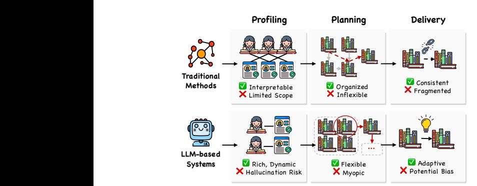
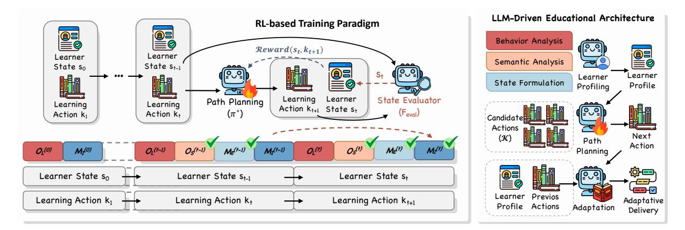
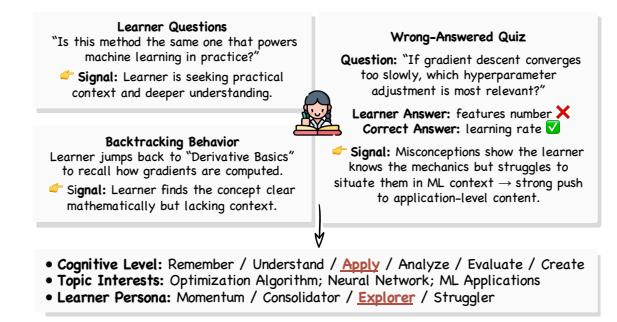
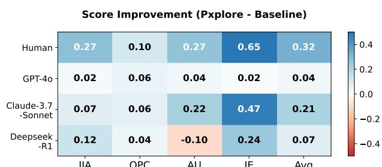
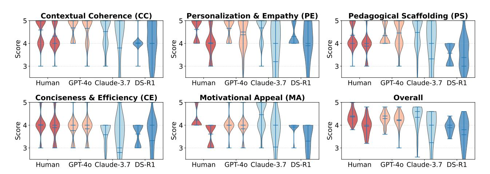
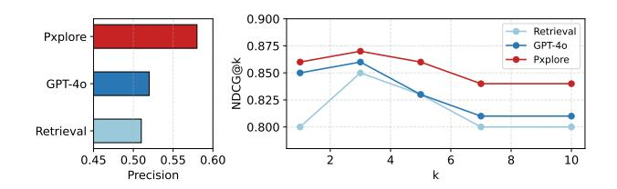
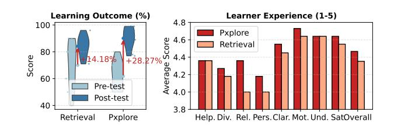
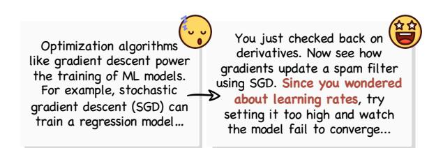
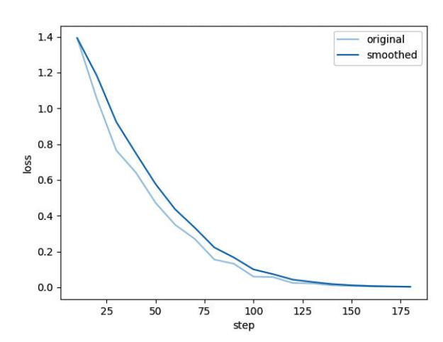
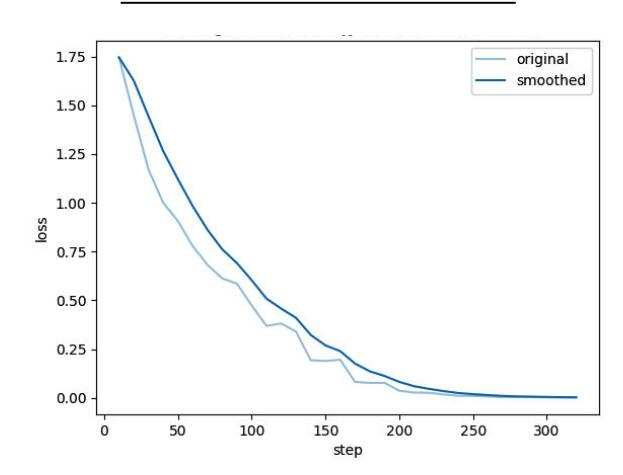

# Personalized Learning Path Planning through Goal-Driven Learner State Modeling

[Joy Jia Yin Lim](https://orcid.org/0009-0006-7971-6096) lin-jy23@mails.tsinghua.edu.cn Department of Computer Science and Technology, Beijing National Research Center for Information Science and Technology Tsinghua University Beijing, China

[Ye He](https://orcid.org/0009-0001-8772-1104) heye23@mails.tsinghua.edu.cn Department of Computer Science and Technology Tsinghua University Beijing, China

[Jifan Yu](https://orcid.org/0000-0003-3430-4048) yujifan@tsinghua.edu.cn Institution of Education Tsinghua University Beijing, China

[Xin Cong](https://orcid.org/0000-0003-2370-306X) congxin1995@tsinghua.edu.cn Department of Statistics and Data Science Tsinghua University Beijing, China

[Daniel Zhang-Li](https://orcid.org/0009-0009-3681-1896) zlnn23@mails.tsinghua.edu.cn Department of Computer Science and Technology Tsinghua University Beijing, China

[Zhiyuan Liu](https://orcid.org/0000-0002-7709-2543) liuzy@tsinghua.edu.cn Department of Computer Science and Technology Tsinghua University Beijing, China

[Huiqin Liu](https://orcid.org/0000-0002-5754-2623) liuhq@tsinghua.edu.cn Institution of Education Tsinghua University Beijing, China

[Lei Hou](https://orcid.org/0000-0002-8907-3526) [Juanzi Li](https://orcid.org/0000-0002-6244-0664) houlei@tsinghua.edu.cn lijuanzi@tsinghua.edu.cn Department of Computer Science and Technology Tsinghua University Beijing, China

[Bin Xu](https://orcid.org/0000-0003-3040-4391)† xubin@tsinghua.edu.cn Department of Computer Science and Technology, Beijing National Research Center for Information Science and Technology Tsinghua University Beijing, China

# Abstract

Personalized Learning Path Planning (PLPP) aims to design adaptive learning paths that align with individual goals. While large language models (LLMs) show potential in personalizing learning experiences, existing approaches often lack mechanisms for goal-aligned planning. We introduce Pxplore, a novel framework for PLPP that integrates a reinforcement-based training paradigm and an LLMdriven educational architecture. We design a structured learner state model and an automated reward function that transforms abstract objectives into computable signals. We train the policy combining supervised fine-tuning (SFT) and Group Relative Policy Optimization (GRPO), and deploy it within a real-world learning platform. Extensive experiments validate Pxplore's effectiveness in producing coherent, personalized, and goal-driven learning paths. We release our code and dataset at [https://github.com/Pxplore/pxplore-algo.](https://github.com/Pxplore/pxplore-algo)

# CCS Concepts

•Information systems→Personalization;• Computing methodologies → Reinforcement learning; Sequential decision making.

[This work is licensed under a Creative Commons Attribution 4.0 International License.](https://creativecommons.org/licenses/by/4.0) WWW '26, Dubai, United Arab Emirates. © 2026 Copyright held by the owner/author(s). ACM ISBN 979-8-4007-2307-0/2026/04 <https://doi.org/10.1145/3774904.3792245>

# Keywords

Personalized Learning Path Planning; Learner State Modeling; Reinforcement Learning; Group Relative Policy Optimization

#### ACM Reference Format:

Joy Jia Yin Lim, Ye He, Jifan Yu, Xin Cong, Daniel Zhang-Li, Zhiyuan Liu, Huiqin Liu, Lei Hou, Juanzi Li, and Bin Xu. 2026. Personalized Learning Path Planning through Goal-Driven Learner State Modeling. In Proceedings of the ACM Web Conference 2026 (WWW '26), April 13–17, 2026, Dubai, United Arab Emirates. ACM, New York, NY, USA, [12](#page-11-0) pages. [https://doi.org/10.1145/](https://doi.org/10.1145/3774904.3792245) [3774904.3792245](https://doi.org/10.1145/3774904.3792245)

# 1 Introduction

Learning is a sequential and cumulative process that varies across learner. Personalized learning path planning (PLPP) for each learner has been a central pursuit in education [\[30,](#page-8-0) [33\]](#page-8-1). As shown in Figure [1,](#page-1-0) traditional approaches to PLPP [\[15,](#page-8-2) [41\]](#page-8-3), such as collaborative filtering and knowledge graphs, have advanced the organization of heterogeneous learning resources. However, their personalization remains constrained by predefined resources and static learner profiles, leading to fragmented and learning experiences [\[2,](#page-8-4) [26,](#page-8-5) [28\]](#page-8-6). Large language models (LLMs), in contrast, overcome these limitations through scalable learner modeling and dynamic content adaptation [\[23,](#page-8-7) [24,](#page-8-8) [44\]](#page-8-9). They integrates multi-dimensional learner data, adapts instructional materials, and even generates new content in a fine-grained, context-aware manner [\[8,](#page-8-10) [20,](#page-8-11) [42\]](#page-8-12). Yet, despite

Figure 1: Traditional methods produce static paths, while LLMs struggle to capture long-term progress.

this potential, LLMs still struggle to model sustained learning progression, as they often lack mechanisms to represent long-term learner development or to incorporate feedback from authentic educational interactions [\[27,](#page-8-13) [51\]](#page-9-0).

These limitations highlight two fundamental challenges.

• Planning Long-term Learning Process. Learning is a goaldriven, multi-step process. Existing LLM-based systems are often driven by short-sighted or single-step decisions [\[7,](#page-8-14) [17,](#page-8-15) [45\]](#page-8-16), without optimizing for cumulative educational impact. Effective long-term learning path planning requires a general mechanism to capture the abstract educational goals and translate them into computable reward signals that can guide further optimization [\[19\]](#page-8-17).

• Understanding diverse learner states and adapting to heterogeneous learning resources. Learner states, evolving continuously throughout the learning process [\[3\]](#page-8-18), requires adaptive systems that can infer and respond to these dynamic changes. However, existing approaches often lack explicit mechanisms to model such evolving learner states or to integrate diverse learning resources [\[23,](#page-8-7) [32\]](#page-8-19), limiting their ability to construct and deliver coherent personalized learning experiences [\[5,](#page-8-20) [25,](#page-8-21) [30\]](#page-8-0).

In this paper, we introduce Pxplore, a structured framework for PLPP that integrates a reinforcement-based training paradigm and an LLM-driven educational architecture. We first define a goaldriven learner state model to represent learning objectives and learning motivations. Building on this, we design an automated reward function that transforms these abstract states into computable reward signals by quantifying the alignment of objectives and motivations in a learning process. This signal guides a twostage training pipeline, including supervised fine-tuning (SFT) for initialization and Group Relative Policy Optimization (GRPO) [\[37\]](#page-8-22) for further refinement. We then deploy the policy into an LLMdriven educational architecture, unifying learner profiling, path planning, and adaptive delivery into an integrated learning process.

Our contributions can be summarized as follows:

(1) We propose a training paradigm that integrates goal-driven learner state modeling with reinforcement-based optimization.

(2) We design an integrated system architecture that enables realworld deployment with coherent profiling, planning, and delivery.

(3) We conduct extensive experiments and user studies to validate the practical utility of our proposed system.

### 2 Related Work

• Personalized Learning Path Planning. Personalized Learning Path Planning (PLPP) has long been a central objective in education [\[33\]](#page-8-1). Early research focused on adapting learning resources through data-driven approaches such as collaborative filtering, which recommends materials by identifying learners with similar profiles and learning behaviors [\[13,](#page-8-23) [18,](#page-8-24) [22\]](#page-8-25). Another line of work leveraged knowledge graph to model relationships among concepts, allowing systems to infer prerequisite structures and suggest coherent learning sequence within a curriculum [\[1,](#page-8-26) [10\]](#page-8-27). While these methods laid the groundwork for personalization, they were largely constrained to single-step adaptations and surfacelevel content alignment. Recently, advances in LLMs has revitalized this area [\[9,](#page-8-28) [46\]](#page-8-29). Researchers have begun to generate personalized and context-aware learning experiences at scale [\[12,](#page-8-30) [14,](#page-8-31) [50,](#page-9-1) [53\]](#page-9-2), moving beyond static resource organization toward more adaptive, goal-driven, and instructional coherent learning support.

• Reinforcement Learning for Education Reinforcement learning (RL) provides a principled framework for goal-driven planning and sequential decision-making [\[31,](#page-8-32) [39\]](#page-8-33), making it well-suited for PLPP. As learning involves sequences of learning actions rather than isolated decisions, RL has been explored to optimize instructional policies [\[38,](#page-8-34) [49,](#page-9-3) [52\]](#page-9-4) and simulate learner behaviors [\[36,](#page-8-35) [47\]](#page-8-36) in dynamic environments. Despite these advances, applying standard RL to real-world settings remains challenging [\[31\]](#page-8-32). Learning paths are heterogeneous, long-horizon, and driven by abstract objectives, such as curiosity and deep understanding, which extend beyond measurable task performance [\[39\]](#page-8-33). This highlight the need for novel RL paradigms that can represent abstract, evolving objectives and operate effectively across diverse, real-world contexts.

# 3 Pxplore Framework

The Pxplore framework unifies an reinforcement-based training paradigm with an LLM-based educational architecture.

# 3.1 Reinforcement-based Training Paradigm

While LLMs demonstrate strong planning and reasoning capabilities under RL frameworks such as GRPO, their application to openended domains remains challenging. The inherent complexity of multi-dimensional objectives, sparse feedback, and evolving learner goals requires specialized adaptations. To address this, we design an educational adaptation of GRPO that integrates structured learner state representation and abstract reward modeling, enabling robust long-horizon optimization in learning path planning.

3.1.1 Problem Formulation. We formalize PLPP as a sequential decision-making process governed by complex state and abstract rewards. We define the foundational elements as follows:

Learner State (����). A learner state ���� ∈ S is a structured representation inferred from learner interactions at time ��, where S denotes the state space. This state captures both explicit cognitive attributes (e.g., knowledge mastery, misconceptions) and implicit factors (e.g., motivation, goals, and engagement).

Learning Action (��). Given a knowledge corpus K, an action ���� ∈ K is an atomic unit of instruction selected at timestep ��, such as a concept explanation, worked example, or short exercise.

| Dimension  | Item       | Details                                                                                                 |
|------------|------------|---------------------------------------------------------------------------------------------------------|
| Long-Term  | Objective  | 1 Description: Understand the concepts of BP and PDP.                                                   |
| Objective  | ( ��       |                                                                                                         |
|            |            | ( 1 )                                                                                                   |
|            |            | ) Metric: concept_understanding_score ( Threshold: ≥ 0.90)                                              |
|            |            | Measurement: Assesses in-session deep understanding of BP and PDP concepts.                             |
|            |            | Evidence: [Turn 36: "What are BP and PDP?"]                                                             |
|            |            | Confidence: 0.65 Status: [NOT_ALIGNED]                                                                  |
| Short-Term | Objective  | 1 Description: Grasp basic AI concepts during the session.                                              |
| Objective  | ( ��       |                                                                                                         |
|            |            | ( 1 )                                                                                                   |
|            |            | ) Metric: immediate_concept_recall ( Threshold: ≥ 0.80)                                                 |
|            |            | Measurement: Assesses immediate recall of AI concepts (e.g., self-supervision, MCTS).                   |
|            |            | Evidence: [Turn 43: "What is Monte Carlo Tree Search?"]                                                 |
|            |            | Confidence: 0.75 Status: [NOT_ALIGNED]                                                                  |
| Implicit   | Motivation | 1 Description: Desire for autonomous control over the course content.                                   |
| Motivation | ( ��       |                                                                                                         |
|            |            | ( 1 )                                                                                                   |
|            |            | ) Metric: control_preference_score ( Threshold: ≥ 0.70)                                                 |
|            |            | Measurement: Based on the frequency of requests to skip content and interventions in the lesson’s pace. |
|            |            | Evidence: [Turn 20: "Skip this page, teacher."]                                                         |
|            |            | Confidence: 0.80 Status: [NOT_ALIGNED]                                                                  |
| Explicit   | Motivation | 1 Description: Interest in the impact of technological advancements.                                    |
| Motivation | ( ��       |                                                                                                         |
|            |            | ( 1 )                                                                                                   |
|            |            | ) Metric: technology_impact_attention ( Threshold: ≥ 0.80)                                              |
|            |            | Measurement: Based on the frequency of questions about technological progress and its societal impact.  |
|            |            | Evidence: [Turn 25: "The development of AI is changing... impact..."]                                   |
|            |            | Confidence: 0.68 Status: [NOT_ALIGNED]                                                                  |

#### 3.2 LLM-driven Educational Architecture

To validate and operationalize the trained policy model, we design an LLM-driven educational architecture that integrates structured learner profiling, learning path planning and adaptive delivery. This architecture provides real-time, context-sensitive learning experience that evolves with learner's behavioral and cognitive state.

3.2.1 Pre-planning Architecture. Before policy-driven planning, the system performs real-time learner profiling and candidate retrieval to construct an adaptive action space.

Learner Profiling. The profiling pipeline consists of three sequential stages that process diverse learning traces to infer behavioral, cognitive, and motivational characteristics (Figure [3\)](#page-4-0).

• Stage 1: Behavioral Pattern Analysis. Raw interaction logs, including navigation traces, page dwell times, review sequences, and quiz outcomes—are transformed into structured behavioral indicators via LLM-based analysis. For instance, long dwell times suggest sustained engagement, while rapid transitions may imply distraction. Similarly, repeated revisits to the same material indicate consolidation strategies, and clusters of incorrect quiz responses reveal misconceptions. This provide interpretable metrics of engagement, review behavior, and conceptual understanding, forming the behavioral foundation of the learner profile.

• Stage 2: Semantic and Intent Analysis. At this stage, learner discussions and written inputs are analyzed to extract semantic and affective signals. At the micro level, each message is annotated with (1) cognitive type (e.g., remembering, applying, analyzing) following Bloom's taxonomy [\[6\]](#page-8-40), (2) affective state (e.g., confused, confident, motivated), and (3) communicative intent (e.g., questioning, reflecting, disagreeing). At the macro level, discourse aggregation yields higher-order attributes, such as thematic coherence, cognitive progression, and interaction dynamics, providing a structured interpretation of unstructured dialogue data.

• Stage 3: Synthesis and Profile Formulation. Signals from previous stages are then synthesized into a concise learner profile. The system infers the learner's current cognitive level (e.g., Understanding, Applying, Analyzing) and core topic interests using linguistic cues, emotional markers, and review behaviors. Based on this synthesis, learners are dynamically classified into four prototypical personas: (1) Momentum Learner (rapid progress), (2) Consolidator (focused on review and mastery), (3) Explorer (branching into new areas), or (4) Struggler (requiring remedial guidance). The resulting profile ���� at time �� encapsulates the learner's cognitive state, motivational orientation, and interest distribution:

���� = ��profile (���� ) = {cognition, engagement, interest, persona}, (11)

where ���� denotes the interaction data for session ��. This profile serves as input to the subsequent planning. Implementation details and system prompts are provided in Appendix [A.](#page-9-5)

Retrieval. Once the profile is constructed, the system retrieves a manageable set of pedagogically relevant actions. We employ a hybrid retrieval mechanism that integrates lexical relevance and semantic similarity, with the relevance score computed as:

score(��) = �� · BM25(���� , ��) + (1 − ��) · simdense (���� , ��), (12)

where BM25 is the keyword-matching score [\[35\]](#page-8-41), and simdense is the cosine similarity from dense embeddings. After excluding

Figure 3: Example of Pxplore's pre-planning architecture that generates a structured learner profile.

actions already taken, the top-k items (empirically �� = 10) form the candidate action set K�� ⊆ K.

Learning Path Planning. Given the current learner state ���� and candidate actions K�� , the policy ���� evaluates each candidate and selects the optimal next action:

�� ∗ ��+1 = arg max �� ∈K�� E���� [R (���� , ��) + ���� (����+1)], (13)

where �� (����+1) is the estimated value of the next state and R (���� , ��) is the expected pedagogical reward. Unlike retrieval-only baselines, this policy explicitly optimizes for long-term cumulative reward, ensuring coherent and pedagogically grounded path planning.

3.2.2 Post-Planning Architecture. To ensure a seamless and contextually consistent learning experience, we design a post-planning delivery architecture that transforms discrete policy outputs into coherent instructional narratives.

Adaptive Narrative Generation. Instead of displaying the selected action, the system generates a narrative bridge connecting the new content to the learner's ongoing context. Given the learner profile ���� , learning history ���� = {��1, . . . , ���� }, and selected action �� ∗ ��+1 , the delivery model D (·) generates personalized instructions:

���� = D (���� , ���� , ��∗ ��+1 ), (14)

where the output ���� adapts tone, emphasis, and phrasing to align with the learner's cognitive and motivational state. For instance, a Momentum Learner might receive succinct, challenge-oriented phrasing, whereas a Struggler might receive supportive scaffolding referencing past misconceptions. In summary, our post-planning architecture yields pedagogically coherent transitions that maintain engagement while ensuring conceptual continuity.

• Expandable Architecture. Our post-planning architecture is designed as a modular and extensible component, allowing integration of additional generative services for richer instructional experiences including Retrieval-Augmented Generation (RAG) for in-depth explanations or Multimodal Generation. As a proof of concept, we implement a dynamic slide generator that synthesizes new slides from selected actions while preserving stylistic and formatting consistency. This maintains visual and cognitive coherence across materials and reduces the cognitive load associated with inconsistent presentation formats. We leave the comprehensive exploration of such generative extensions to future work.

Table 3: Performance evaluated by average pedagogical alignment rate (%), reward computation (R (·)) within the defined Learner State Model. Pxplore consistently achieves the highest alignment rate and reward values.

#### 4 Experiment

In this section, we conduct extensive experiments to evaluate the effectiveness of Pxplore 's training paradigm and the educational architecture from macro to micro perspectives.

# 4.1 Training Paradigm Evaluation

We first conduct an end-to-end validation experiment using the curated dataset described in Section [3.1.4,](#page-2-0) to evaluate the effectiveness of our reward function and training paradigm.

Experimental Setups. Building on our curated dataset D (Table [2\)](#page-3-1), we compare our trained policy model (��������������Base) with three groups of baselines: (1) Prompt-based LLMs, serving as zeroshot baselines to test out-of-the-box planning capabilities of modern LLMs, including GPT-4o [\[34\]](#page-8-39), GPT-4o-mini [\[34\]](#page-8-39), Qwen3-8B [\[40\]](#page-8-42), and Llama3.1-8B-Instruct [\[43\]](#page-8-43). (2) Inference-Guided LLMs, which adopt the same prompt-based approach but include a predefined Learner State Model as additional context for decision-making. (3) SFT models, including Qwen3-8B, and Llama3.1-8B-Instruct finetuned on our annotated state-action dataset.

Results. Each model is evaluated on its ability to select the optimal action from the candidate set given a learner state. We then measure the resulting alignment with predefined pedagogical objectives. Table [3](#page-5-0) shows Pxplore's consistent and substantial improvements in overall pedagogical alignment rate. Prompt-based baselines, despite their strong general reasoning abilities, often fail to make decisions that align with multi-dimensional educational goals. Adding inference-time guidance through structured learner states yields noticeable improvements, yet remains limited by models' inherent short-sightedness. Within our training paradigm, SFT-tuned models produce a clear boost by enabling locally optimal decisions, while GRPO refinement achieves the best performance across all metrics. Notably, our GRPO-trained Qwen3-8B reaches an overall alignment rate of 65.47%, outperforming the much larger proprietary model, GPT-4o even with inference-time guidance. These results validate the effectiveness of our reinforcement-based paradigm in optimizing abstract educational rewards and promoting long-horizon, goal-aligned learning path planning.

### 4.2 Modular Evaluation

Following the validation of the overall training paradigm, we conduct a fine-grained modular evaluation of each functional module within the Pxplore framework, including the modules of (1) learner profiling, (2) learning path planning, and (3) adaptive delivery.

| IIA  | OPC  | AU    | IE   | Avg  |
|------|------|-------|------|------|
| 0.27 | 0.10 | 0.27  | 0.65 | 0.32 |
| 0.02 | 0.06 | 0.04  | 0.02 | 0.04 |
| 0.07 | 0.06 | 0.22  | 0.47 | 0.21 |
| 0.12 | 0.04 | -0.10 | 0.24 | 0.07 |

Figure 4: Heatmap showing the improvement in evaluation scores on a 5-point Likert scale across pedagogical dimensions, calculated as ScorePxplore − ScoreBaseline.

4.2.1 Profiling Module. To evaluate the quality of the profiling module in Pxplore pre-planning archiecture, we adopt a hybrid approach that integrates human judgment and LLM-as-a-judge [\[21\]](#page-8-44).

Experimental Setup. Using the curated dataset introduced in the previous section, we generate a structured learner profile for each learning session following the three-stage framework in Section [3.2.1.](#page-4-1) These profiles are compared against GPT-4o baseline, which recieves the same raw session logs but only a single instruction to generate a profile following the same output schema. Each profile is independently rated by two human annotators and three LLM-judges (Claude-3.7-Sonnet [\[4\]](#page-8-45), GPT-4o, and Deepseek-R1 [\[16\]](#page-8-46)) on a 5-point Likert scale, all blind to source. Evaluations are provided across four pedagogical dimensions: (1) Interest Identification Accuracy (IIA): The correctness and specificity of inferred topic interests in the generated profile. (2) The overall Profile

Figure 5: Evaluation scores (1–5) across pedagogical dimensions. For each violin pair (Human, GPT-4o, Claude-3.7-Sonnet, and Deepseek-R1), the left represents Pxplore 's adaptive delivery and the right represents the original content.

Figure 6: Results on the alignment precision of top-ranked action with the expert-annotated "best" choice, as well as the overall ranking quality across the candidate set.

Completeness (OPC): Coverage of core attributes, including engagement, cognition, affect, and interests. (3) Actionability and Utility (AU): The practical usefulness of the generated profile for guiding downstream planning. (4) Interpretability and Explainability (IE): Clarity of reasoning and strength of evidence linking learner behaviors to inferred states.

Results. To ensure reliability, we aggregate results from both human annotators and LLM-judges (Figure [4\)](#page-5-1). Human annotators consistently rate Pxplore higher across all dimensions, with strong inter-annotator agreement (Pearson correlation �� &gt; 0.8). Notably, Pxplore achieved the largest improvement in IE (+17.7%), followed by IIA (+6.26%) and AU (+6.63%), resulting in an overall increase of +7.88%. Both human and LLM-judges highlight Pxplore's ability to construct explicit "evidence chain", for example, linking a learner's review behavior directly to a detected misconception. This structured interpretability is essential for trustworthy learner profiling and aligns with established educational principles. Among LLM-judges, we observe different scoring patterns. Claude-3.7-Sonnet is the most conservative, while Deepseek-R1 shows highest alignment with human judgment. Despite the differences, all evaluators confirm a consistent performance gap, validating the accuracy, completeness, and interpretability of Pxplore's profiling framework.

4.2.2 Planning Module. We next evaluate the planning module, focusing on its alignment with expert pedagogical judgment.

Data Construction. We construct a fine-grained knowledge corpus by segmenting 148 courses from a real-world learning platform [\[47\]](#page-8-36) into atomic actions (coherent learning units derived from slides and transcripts). Each action is enriched with metadata, including a summary, keyword tags, and a Bloom's Taxonomy [\[6\]](#page-8-40) level (e.g., Understanding, Analyzing), generated by GPT-4o and verified by human experts for pedagogical soundness. For each learning session, we link the generated profile with the corresponding learning history to form a dataset containing the profile, candidate set, and expert-ranked actions. Three pedagogical experts independently label each candidate as best, acceptable, or not suitable to establish a ground truth for the evaluation.

Experimental Setup. We compare the trained Pxplore policy model with two baselines: (1) a retrieval-only mechanism (Section [3.2.1\)](#page-4-1) and (2) GPT-4o prompted under identical conditions. Performance is evaluated using two complementary metrics: (1) Precision@1 (P@1): The agreement between the top-ranked action and the expert-annotated best choice). (2) Normalized Discounted Cumulative Gain (NDCG@k): The overall ranking quality across the candidate set.

Results. The results are shown in Figure [6,](#page-6-0) Pxplore achieves the strongest alignment with expert judgment. In terms of P@1, Pxplore's top-ranked selection matches the expert-annotated "best" choice most frequently, outperforming both GPT-4o and the retrievalonly baseline. Furthermore, the NDCG@k results demonstrate that Pxplore consistently yields higher ranking quality across all evaluated list depths (�� = 1, 3, 5, 7, 10), indicating that Pxplore not only identifies the single best option but also effectively prioritizes all pedagogically appropriate alternatives.

4.2.3 Delivery Module. We evaluate the delivery module which transforms discrete actions into contextually coherent instructions.

Experimental Setup. We use the dataset from prior evaluations and compare Pxplore's adapted content against the original materials. Two human evaluators and three LLM-judges assess each version on a 5-point Likert scale across five pedagogical dimensions: (1) Contextual Coherence (CC): How the content is logically

structured and flows smoothly from the prior context. (2) Personalization & Empathy (PE): Appropriateness and alignment with the learner's current goals, knowledge state, and needs. (3) Pedagogical Scaffolding (PS): Effectiveness of the content in providing structured guidance and support for learning. (4) Conciseness & Efficiency (CE): Clarity, brevity, and effectiveness of the language in conveying key ideas. (5) Motivational Appeal (MA): Capacity to inspire and sustain learner motivation and engagement.

Results. Figure [5](#page-6-1) shows that Pxplore consistently outperforms the original content. The largest gains appear in MA (+17.2%), PE (+14.9%) and PS (+12.4%), leading to an overall improvement of +10.7%. We attribute this to Pxplore's ability to generate "narrative bridges", the contextual transition that address misconceptions or sustain engagement. Additionally, the alignment between LLMjudges and human evaluators further reinforces the robustness of our results. While the improvement in CE is marginal (+3.1%), and GPT-4o even rates the original as more concise, this reflects a design trade-off: Pxplore deliberately prioritizes empathy and motivation over minimal brevity to achieve richer pedagogical impact. Importantly, we ensure that total word counts of the adapted content remain comparable through targeted condensation of redundant segments, ensuring efficient yet engaging delivery.

# 4.3 Real-World Experiment

To validate the practical effectiveness of Pxplore framework in authentic learning contexts, we integrate it into a deployed online learning platform and conducted a controlled user study.

Experimental Setup. We recruit 22 undergraduate students (�� = 22) from diverse academic backgrounds and randomly assigned them into two groups: (1) the Experimental Group (�� = 11), using the full Pxplore framework, and (2) the Control Group (�� = 11), using a retrieval-based content-matching system representative of existing adaptive learning platforms. All participants begins with a validated introductory lesson: Towards Artificial General Intelligence (TAGI), selected for its high-quality instructional design and broad accessibility. After completing the initial lesson, participants in experimental group proceed through the full planning pipeline powered by Pxplore's policy, while those in control group follow the next lesson recommended by retrieval-based path planning.

Procedure. Each learning session lasts approximately one hour, designed to simulate a realistic learning context: (1) Pre-Test (10 mins): Participants complete a diagnostic test of 10 multiple-choice questions related to the initial lesson. (2) Initial Learning Session (30 mins): Participant engage with one complete lesson on the system at their own pace. (3) Advanced Learning Session (15 mins): After completing the initial lesson, participants proceed through the next lesson determined by the assigned planning method. (4) Post-Test and Survey (10 mins): Participants complete a follow-up assessment and a perception survey.

Metrics. We evaluate both learning outcomes and learner experience. Learning outcomes are measured by pre- and post-test score improvement across multiple-choice questions and short-answer questions, while learner experience is assessed using a 5-point Likert-scale across following dimensions: (1) Helpfulness (Help.): Perceived usefulness of learning path; (2) Diversity (Div.): Variety in topics and formats; (3) Relevance (Rel): Alignment with prior

Figure 7: Comparison of Pxplore and retrieval-based baseline in terms of learning outcomes and learner experience.

learning content; (4) Personalization (Pers.: Adaptation to individual preferences; (5) Clarity (Clar.): Learning path coherence and logical flow; (6) Motivation (Mot.): Stimulation of interest and engagement; (7) Understanding (Und.): Depth of comprehension gained; (8) Satisfaction (Sat.): The overall satisfaction score.

Results. As shown in Figure [7,](#page-7-0) participants using Pxplore achieve significantly greater knowledge gains than those using the retrievalbased baseline. Specifically, Pxplore improves mean test scores from 61.81% (pre-test) to 90.09% (post-test), resulting in a knowledge gain of +28.28%, compared with a smaller increase observed in the control group. Although both groups ultimately achieve comparable post-test performance, the experimental group exhibits a steeper improvement that suggests more effective conceptual progression.

Additionally, Figure [7](#page-7-0) further shows that Pxplore's advantage in subjective learner experience. Participants rate Pxplore notably higher in Relevance (+0.36) and Personalization (+0.18), confirming its ability to construct learning paths that better reflect prior context and individual preferences. The most pronounced performance gaps appear in Motivation (4.73) and Satisfaction (4.64), indicating that the goal-driven, coherent paths produced by Pxplore foster more engaging and enjoyable learning experiences. Interestingly, both systems achieve similar ratings in Helpfulness and Understanding, likely due to the foundational nature of the initial instructional content and the comparable effort invested across conditions. This aligns with the post-test parity, implying that Pxplore 's advantage lies in both marginal performance and the quality and engagement of the learning experience itself.

# 5 Conclusion

In this paper, we present Pxplore, a reinforcement learning paradigm that leverages an automated pedagogical reward function to transform complex learner states into computable optimization signals. Through comprehensive experiments, we demonstrate that Pxplore consistently outperforms baselines in guiding learners toward their long-term developmental goals. By deploying Pxplore's trained policy model within a real-world learning platform, which integrates a real-time learner profiling before planning, and an adaptive content delivery after planning. This further validates Pxplore's capability to construct coherent and goal-aligned learning paths.

# Acknowledgments

This work is supported by National Natural Science Foundation of China (No.62277033) and National Engineering Laboratory for Cyberlearning and Intelligent Technology. We also thank the Deng Feng Fund of Tsinghua University for supporting this research.

References [1] Hasan Abu-Rasheed, Mareike Dornhöfer, Christian Weber, Gábor Kismihók, Ulrike Buchmann, and Madjid Fathi. 2023. Building Contextual Knowledge Graphs for Personalized Learning Recommendations Using Text Mining and Semantic Graph Completion. In 2023 IEEE International Conference on Advanced Learning Technologies (ICALT). 36–40. [doi:10.1109/ICALT58122.2023.00016](https://doi.org/10.1109/ICALT58122.2023.00016) [2] Hasan Abu-Rasheed, Christian Weber, and Madjid Fathi. 2024. Knowledge graphs as context sources for llm-based explanations of learning recommendations. In 2024 IEEE Global Engineering Education Conference (EDUCON). IEEE, 1–5. [3] Xin An, Ching Sing Chai, Yushun Li, Ying Zhou, and Bingyu Yang. 2025. Modeling students' perceptions of artificial intelligence assisted language learning. Computer Assisted Language Learning 38, 5-6 (2025), 987–1008. [4] Anthropic. 2025. Claude 3.7 Sonnet System Card. [https://assets.anthropic.com/](https://assets.anthropic.com/m/785e231869ea8b3b/original/claude-3-7-sonnet-system-card.pdf) [m/785e231869ea8b3b/original/claude-3-7-sonnet-system-card.pdf](https://assets.anthropic.com/m/785e231869ea8b3b/original/claude-3-7-sonnet-system-card.pdf) [5] Matthew L Bernacki, Meghan J Greene, and Nikki G Lobczowski. 2021. A systematic review of research on personalized learning: Personalized by whom, to what, how, and for what purpose (s)? Educational Psychology Review 33, 4 (2021), 1675–1715. [6] Benjamin S. Bloom, Max D. Engelhart, Edward J. Furst, Walter H. Hill, and David R. Krathwohl. 1956. Taxonomy of Educational Objectives: The Classification of Educational Goals, Handbook I: Cognitive Domain. David McKay Company, New York. [7] Mustafa Cevikbas, Johannes Koenig, and Martin Rothland. 2024. Empirical research on teacher competence in mathematics lesson planning: Recent developments. ZDM–Mathematics Education 56, 1 (2024), 101–113. [8] Jin Chen, Zheng Liu, Xu Huang, Chenwang Wu, Qi Liu, Gangwei Jiang, Yuanhao Pu, Yuxuan Lei, Xiaolong Chen, Xingmei Wang, et al. 2024. When large language models meet personalization: Perspectives of challenges and opportunities. World Wide Web 27, 4 (2024), 42. [9] Ling Chen. 2025. Research on AI-driven personalized learning path planning and effectiveness under dual-system teaching mode (EDCS '25). Association for Computing Machinery, New York, NY, USA, 1–6. [doi:10.1145/3746469.3746471](https://doi.org/10.1145/3746469.3746471) [10] Penghe Chen, Yu Lu, Vincent W Zheng, Xiyang Chen, and Boda Yang. 2018. Knowedu: A system to construct knowledge graph for education. Ieee Access 6 (2018), 31553–31563. [11] Li Chi. 2004. Achievement goal theory. In Sport psychology: Theory, applications and issues (2 ed.), Tony Morris and John Summers (Eds.). John Wiley & Sons Australia, 152–174. [12] Zhendong Chu, Shen Wang, Jian Xie, Tinghui Zhu, Yibo Yan, Jinheng Ye, Aoxiao Zhong, Xuming Hu, Jing Liang, Philip S Yu, et al. 2025. Llm agents for education: Advances and applications. arXiv preprint arXiv:2503.11733 (2025). [13] Zhihua Cui, Xianghua Xu, Xingjuan Cai, Yang Cao, Wensheng Zhang, Jinjun Chen, et al. 2020. Personalized recommendation system based on collaborative filtering for IoT scenarios. IEEE Transactions on Services Computing 13, 4 (2020), 685–695. [14] Chih-Pu Dai, Fengfeng Ke, Yanjun Pan, Jewoong Moon, and Zhichun Liu. 2024. Effects of artificial intelligence-powered virtual agents on learning outcomes in computer-based simulations: A meta-analysis. Educational Psychology Review 36, 1 (2024), 31. [15] Roxana Rebolledo Font De la Vall and Fabián González Araya. 2023. Exploring the benefits and challenges of AI-language learning tools. International Journal of Social Sciences and Humanities Invention 10, 01 (2023), 7569–7576. [16] DeepSeek-AI. 2025. DeepSeek-R1: Incentivizing Reasoning Capability in LLMs via Reinforcement Learning. arXiv[:2501.12948](https://arxiv.org/abs/2501.12948) [cs.CL] [https://arxiv.org/abs/2501.](https://arxiv.org/abs/2501.12948) [12948](https://arxiv.org/abs/2501.12948) [17] Mohammad Shams Ud Duha. 2023. ChatGPT in education: an opportunity or a challenge for the future? TechTrends 67, 3 (2023), 402–403. [18] Lumbardh Elshani and Krenare Pireva Nuçi. 2021. Constructing a personalized learning path using genetic algorithms approach. arXiv[:2104.11276](https://arxiv.org/abs/2104.11276) [cs.AI] [https:](https://arxiv.org/abs/2104.11276) [//arxiv.org/abs/2104.11276](https://arxiv.org/abs/2104.11276) [19] Bisni Fahad Mon, Asma Wasfi, Mohammad Hayajneh, Ahmad Slim, and Najah Abu Ali. 2023. Reinforcement learning in education: A literature review. In Informatics, Vol. 10. MDPI, 74. [20] Ibnu Fitrianto, Cahya Edi Setyawan, and Malikus Saleh. 2024. Utilizing Artificial Intelligence for Personalized Arabic Language Learning Plans. International Journal of Post Axial: Futuristic Teaching and Learning (2024), 30–40. [21] Jiawei Gu, Xuhui Jiang, Zhichao Shi, Hexiang Tan, Xuehao Zhai, Chengjin Xu, Wei Li, Yinghan Shen, Shengjie Ma, Honghao Liu, et al. 2024. A survey on llm-as-a-judge. arXiv preprint arXiv:2411.15594 (2024). [22] Abhay S Harpale and Yiming Yang. 2008. Personalized active learning for collaborative filtering. In Proceedings of the 31st annual international ACM SIGIR conference on Research and development in information retrieval. 91–98. [23] Bihao Hu, Longwei Zheng, Jiayi Zhu, Lishan Ding, Yilei Wang, and Xiaoqing Gu. 2024. Teaching plan generation and evaluation with GPT-4: Unleashing the potential of LLM in instructional design. IEEE Transactions on Learning Technologies 17 (2024), 1445–1459. [24] Jianhua Hu, Huixiang Gao, Qing Yuan, and Ganchang Shi. 2024. Dynamic content generation in large language models with real-time constraints. [25] Ugochukwu Francis Ikwuanusi, Peter Adeyemo Adepoju, and Chinekwu Somtochukwu Odionu. 2023. AI-driven solutions for personalized knowledge dissemination and inclusive library user experiences. International Journal of Engineering Research Updates 4, 2 (2023), 052–062. [26] Jianchao Ji, Zelong Li, Shuyuan Xu, Wenyue Hua, Yingqiang Ge, Juntao Tan, and Yongfeng Zhang. 2024. Genrec: Large language model for generative recommendation. In European Conference on Information Retrieval. Springer, 494–502. [27] Insung Jung. 2024. Personalized education for all: The future of open universities. Open Praxis 16, 1 (2024), 24–36. [28] Hui Li, Rongrong Gong, Zhaoman Zhong, Libao Xing, Xing Li, and Haining Li. 2023. Research on personalized learning path planning model based on knowledge network. Neural Computing and Applications 35, 12 (2023), 8809–8821. [29] Edwin A. Locke and Gary P. Latham. 1990. A Theory of Goal Setting & Task Performance. Prentice Hall, Englewood Cliffs, N.J. [30] Setareh Maghsudi, Andrew Lan, Jie Xu, and Mihaela van Der Schaar. 2021. Personalized education in the artificial intelligence era: what to expect next. IEEE Signal Processing Magazine 38, 3 (2021), 37–50. [31] Bahar Memarian and Tenzin Doleck. 2024. A scoping review of reinforcement learning in education. Computers and Education Open 6 (2024), 100175. [32] Maria Moundridou, Nikolaos Matzakos, and Spyridon Doukakis. 2024. Generative AI tools as educators' assistants: Designing and implementing inquiry-based lesson plans. Computers and Education: Artificial Intelligence 7 (2024), 100277. [33] Chee Ng and Yuen Fung. 2024. Educational personalized learning path planning with large language models. arXiv preprint arXiv:2407.11773 (2024). [34] OpenAI. 2024. GPT-4o System Card. arXiv[:2410.21276](https://arxiv.org/abs/2410.21276) [cs.CL] [https://arxiv.org/](https://arxiv.org/abs/2410.21276) [abs/2410.21276](https://arxiv.org/abs/2410.21276) [35] Stephen Robertson, Hugo Zaragoza, et al. 2009. The probabilistic relevance framework: BM25 and beyond. Foundations and Trends® in Information Retrieval 3, 4 (2009), 333–389. [36] Alexander Scarlatos, Digory Smith, Simon Woodhead, and Andrew Lan. 2024. Improving the Validity of Automatically Generated Feedback via Reinforcement Learning. In Artificial Intelligence in Education, Andrew M. Olney, Irene-Angelica Chounta, Zitao Liu, Olga C. Santos, and Ig Ibert Bittencourt (Eds.). Springer Nature Switzerland, Cham, 280–294. [37] Zhihong Shao, Peiyi Wang, Qihao Zhu, Runxin Xu, Junxiao Song, Xiao Bi, Haowei Zhang, Mingchuan Zhang, Y. K. Li, Y. Wu, and Daya Guo. 2024. DeepSeek-Math: Pushing the Limits of Mathematical Reasoning in Open Language Models. arXiv[:2402.03300](https://arxiv.org/abs/2402.03300) [cs.CL]<https://arxiv.org/abs/2402.03300> [38] Muddsair Sharif and Dieter Uckelmann. 2024. Multi-Modal LA in Personalized Education Using Deep Reinforcement Learning Based Approach. IEEE Access 12 (2024), 54049–54065. [doi:10.1109/ACCESS.2024.3388474](https://doi.org/10.1109/ACCESS.2024.3388474) [39] Adish Singla, Anna N. Rafferty, Goran Radanovic, and Neil T. Heffernan. 2021. Reinforcement Learning for Education: Opportunities and Challenges. arXiv[:2107.08828](https://arxiv.org/abs/2107.08828) [cs.LG]<https://arxiv.org/abs/2107.08828> [40] Qwen Team. 2025. Qwen3 Technical Report. arXiv[:2505.09388](https://arxiv.org/abs/2505.09388) [cs.CL] [https:](https://arxiv.org/abs/2505.09388) [//arxiv.org/abs/2505.09388](https://arxiv.org/abs/2505.09388) [41] Rudra Tiwari. 2023. The integration of AI and machine learning in education and its potential to personalize and improve student learning experiences. International Journal of Scientific Research in Engineering and Management 7, 02 (2023). [42] Xinyu Jessica Wang, Christine P. Lee, and Bilge Mutlu. 2025. LearnMate: Enhancing Online Education with LLM-Powered Personalized Learning Plans and Support. In Proceedings of the Extended Abstracts of the CHI Conference on Human Factors in Computing Systems (CHI EA '25). ACM, 1–10. [doi:10.1145/3706599.3719857](https://doi.org/10.1145/3706599.3719857) [43] Sajana Weerawardhena, Paul Kassianik, Blaine Nelson, Baturay Saglam, Anu Vellore, Aman Priyanshu, Supriti Vijay, Massimo Aufiero, Arthur Goldblatt, Fraser Burch, Ed Li, Jianliang He, Dhruv Kedia, Kojin Oshiba, Zhouran Yang, Yaron Singer, and Amin Karbasi. 2025. Llama-3.1-FoundationAI-SecurityLLM-8B-Instruct Technical Report. arXiv[:2508.01059](https://arxiv.org/abs/2508.01059) [cs.CR] [https://arxiv.org/abs/](https://arxiv.org/abs/2508.01059) [2508.01059](https://arxiv.org/abs/2508.01059) [44] Qingsong Wen, Jing Liang, Carles Sierra, Rose Luckin, Richard Tong, Zitao Liu, Peng Cui, and Jiliang Tang. 2024. AI for education (AI4EDU): Advancing personalized education with LLM and adaptive learning. In Proceedings of the 30th ACM SIGKDD Conference on Knowledge Discovery and Data Mining. 6743–6744. [45] Jeromie Whalen, Chrystalla Mouza, et al. 2023. ChatGPT: Challenges, opportunities, and implications for teacher education. Contemporary Issues in Technology and Teacher Education 23, 1 (2023), 1–23. [46] Hongyan Xiao. 2025. Personalized Learning Path Planning and Effect Verification of Music Education Information System Empowered By Artificial Intelligence. In Proceedings of the 2025 International Conference on Artificial Intelligence and Educational Systems (ICAIES '25). Association for Computing Machinery, New York, NY, USA, 443–448. [doi:10.1145/3744367.3744437](https://doi.org/10.1145/3744367.3744437) [47] Hao Yu, Vivian WY Tam, and Xiaoxiao Xu. 2024. A systematic review of reinforcement learning application in building energy-related occupant behavior simulation. Energy and Buildings 312 (2024), 114189.

[48] Jifan Yu, Zheyuan Zhang, Daniel Zhang-li, Shangqing Tu, Zhanxin Hao, Rui Miao Li, Haoxuan Li, Yuanchun Wang, Hanming Li, Linlu Gong, Jie Cao, Jiayin Lin, Jinchang Zhou, Fei Qin, Haohua Wang, Jianxiao Jiang, Lijun Deng, Yisi Zhan, Chaojun Xiao, Xusheng Dai, Xuan Yan, Nianyi Lin, Nan Zhang, Ruixin Ni, Yang Dang, Lei Hou, Yu Zhang, Xu Han, Manli Li, Juanzi Li, Zhiyuan Liu, Huiqin Liu, and Maosong Sun. 2024. From MOOC to MAIC: Reshaping Online Teaching and Learning through LLM-driven Agents. arXiv[:2409.03512](https://arxiv.org/abs/2409.03512) [cs.CY] [https:](https://arxiv.org/abs/2409.03512) [//arxiv.org/abs/2409.03512](https://arxiv.org/abs/2409.03512) [49] Yue Yun, Huan Dai, Rui An, Yupei Zhang, and Xuequn Shang. 2024. Doubly constrained offline reinforcement learning for learning path recommendation. Knowledge-Based Systems 284 (2024), 111242. [doi:10.1016/j.knosys.2023.111242](https://doi.org/10.1016/j.knosys.2023.111242) [50] Habeeb Yusuf, Arthur Money, and Damon Daylamani-Zad. 2025. Pedagogical AI conversational agents in higher education: a conceptual framework and survey of the state of the art. Educational technology research and development 73, 2 (2025), 815–874. [51] Jing Zhao, Haitao Mao, Panpan Mao, and Junyong Hao. 2024. Learning path planning methods based on learning path variability and ant colony optimization. Systems and Soft Computing 6 (2024), 200091. [52] Zhonglin Zhao. 2024. A Comprehensive Review of Reinforcement Learning in Intelligent Allocation and Optimization of Educational Resources. Journal of Economic Theory and Business Management 1, 6 (Dec. 2024), 15–24. [doi:10.70393/](https://doi.org/10.70393/6a6374616d.323436) [6a6374616d.323436](https://doi.org/10.70393/6a6374616d.323436) [53] Zhonglin Zhao. 2025. A new paradigm of personalized education driven by multi-agent collaboration. Academic Journal of Sociology and Management 3, 3 (2025), 9–17.

# A System Prompts

In this section, we present the system prompts used throughout our Pxplore framework. These prompts guide the LLMs in extracting learner states, planning personalized learning paths, and delivering adaptive content. Full prompt details are publicly available in the repository referenced in this paper.

# A.1 Learner State Extraction and Evaluation

Table [4](#page-9-7) provides system prompts used to extract and evaluate learner states by guiding the model to infer learners' long-term and short-term objectives, explicit motivations, and implicit motivations., as described in Section [3.1.2.](#page-2-1)

# A.2 Module Prompts

We further include the system prompts employed in each major module of our framework: learner profiling (Table [6\)](#page-10-0), learning path planning (Table [7\)](#page-10-1), and adaptive delivery (Table [5\)](#page-9-8). Figure [8](#page-9-9) shows an example of content generated by the adaptive delivery module.

Figure 8: Example of Pxplore's post-planning architecture that enables adaptive delivery of selected action, connecting the new content to the learner's on-going context.

# B Hyperparameters

In this section, we provide a comprehensive summary of the hyperparameter settings for our training paradigm, as well as the configurations (Table [8\)](#page-10-2) used in the retrieval process (Table [10\)](#page-11-1).

Table 4: Prompts for learner state extraction and evaluation.

|      |               |                       |                      | Learner        | State                | Extraction           |                      |                      |                 |
|------|---------------|-----------------------|----------------------|----------------|----------------------|----------------------|----------------------|----------------------|-----------------|
| Role | : You         | are a senior          | expert               | in             |                      | educational          | psychology           | and                  | computational   |
|      | linguistics,  | specializing          | in                   | building       |                      | structured           | student              | profiles by          | extracting      |
|      | assessable    | cognitive,            |                      | emotional,     | and                  | motivational         | features             | from                 | student         |
|      | interactions. | This is               | based                | on             | cutting-edge         |                      | learning science     |                      | theories (such  |
| as   | Bloom’s       | Taxonomy,             |                      | Webb’s         | Depth                | of                   | Knowledge            | Model, and           | Pekrun’s        |
|      | Achievement   | Emotion               |                      | Theory)        | and                  | multi-turn           | dialogue             | analysis.            |                 |
|      | Task          | Description:          | Based                |                | on the               | dialogue             | history              | of                   | student {stu   |
|      | dent_name}    | with                  | the                  | teacher/peer   |                      | intelligent          | agents,              | provide an           | analysis        |
| from | the           | following             | five                 | dimensions:    |                      | state_description,   |                      | long_term_objective, |                 |
|      |               | short_term_objective, |                      |                | implicit_motivation, |                      | explicit_motivation. |                      |                 |
|      | Layout :      | {Input and            | Output               |                | Constraints}         |                      |                      |                      |                 |
|      |               |                       |                      | Learner        | State                | Evaluation           |                      |                      |                 |
| Role | : You         | are a senior          | expert               | in             |                      | educational          | psychology           | and                  | computational   |
|      | linguistics,  | specializing          | in                   | building       | and                  | updating             | structured           | student              | profiles        |
| by   | extracting    |                       | assessable           | cognitive,     |                      | emotional,           | and                  | motivational         | features        |
| from | student       |                       | interactions         | in             | online               | classrooms,          | based on             | cutting-edge         | learn          |
| ing  | science       | theories              | and                  | multi-turn     |                      | dialogue             | analysis.            |                      |                 |
|      | Task          | Description:          |                      |                |                      |                      |                      |                      |                 |
|      | Re-evaluate   | all                   | existing             | items          | in the               | initial_state        | using                | combined             | evidence        |
| from | both          | the initial           | state                | and            | the                  | next_lesson_content. |                      | This                 | includes up    |
|      | dating the    | evidence              | list,                | re-calculating |                      | the metric,          | and                  | setting the          | is_aligned      |
| flag | to true       | or false              | based                | on the         | specified            |                      | threshold.           |                      |                 |
|      | Identify      | and add               | new                  | objectives     | or                   | motivations          | if                   | supported by         | new evi        |
|      | dence from    | the                   | next_lesson_content, |                |                      | following            | the original         |                      | micro-template. |
|      | Update        | the                   | state_description    |                | to                   | summarize            | key                  | changes              | compared        |
| to   | the           | initial_state,        | citing               |                | significant          | new                  | behavioral           | evidence             | from            |
|      | Update        | the confidence        |                      | score          | (0.00-1.00)          | for each             | item                 | based on             | the quality     |
| and  | directness    | of the                | available            |                | evidence.            | {Detailed            | Confidence           |                      | Update Rules}   |
|      | Layout :      | {Input and            | Output               |                | Constraints}         |                      |                      |                      |                 |

Table 5: System prompts for two-stage adaptive delivery.

| Stage                              | 1:            | Suggestion    | Generation                               |
|------------------------------------|---------------|---------------|------------------------------------------|
| Role : You are a professional      |               | assistant     | for optimizing academic content.         |
| Task : Based on the provided       |               | inputs,       | generate a set of modification sugges   |
| tions for the next lecture         | script        | to            | better align with the personal needs.    |
| Briefly summarize the              | core          | ideas         | and logical flow of the current content. |
| Propose personalized,              | actionable    |               | modification directions (e.g., adding    |
| case studies, reinforcing          | a             | specific      | knowledge point) by integrating the      |
| recommendation rationale           | and           | the           | recommended outline.                     |
| Modifications must be              | targeted      | optimizations | of the original content, not             |
| replacements. The original         | sequence      |               | of topics must be maintained.            |
| Layout : {Input and Output         |               | Constraints}  |                                          |
| Stage                              |               | 2: Script     | Generation                               |
| Role : You are an expert           | educational   |               | content creator and scriptwriter.        |
| Task : Rewrite the original        |               | lecture       | script by seamlessly integrating the     |
| provided modification suggestions. |               |               |                                          |
| Requirements : {Detailed           | Requirements} |               |                                          |
| Layout : {Input and Output         |               | Constraints}  |                                          |

Table 6: System prompts for three-stage profiling.

|      |            |                     |                 | Stage 1:      | Behavioral    |               | Analysis   |                    |                |
|------|------------|---------------------|-----------------|---------------|---------------|---------------|------------|--------------------|----------------|
| Role | :          | You are             | a               | professional  | agent         | combining     | the        | expertise          | of a learning  |
|      | analyst    | and                 | an educational  | data          | mining        | researcher.   |            |                    |                |
|      | Task :     | Your                | goal is         | to receive    | a raw         | JSON          | object     | representing       | a stu         |
|      | dent’s     | learning            | session,        | perform       | a deep        | analysis      | on         | three              | specific areas |
|      |            | (page_interactions, |                 | review_loops, | and           | quizzes),     | and        | output the         | analysis.      |
| Step | 1:         | Analyze             | Page            | Interactions  | :             | {Detailed     | Anomaly    | and                | Rules}         |
| Step | 2:         | Analyze             | Review          | Loops         | : {Detailed   |               | Anomaly    | and Rules}         |                |
| Step | 3:         | Analyze             | Quizzes         | : {Detailed   |               | Anomaly       | and Rules} |                    |                |
| Step | 4:         |                     | Construct the   | Final         | Analysis      | : {Detailed   |            | Anomaly            | and Rules}     |
|      | Layout     | : {Input            | and             | Output        | Constraints}  |               |            |                    |                |
|      |            |                     |                 | Stage 2:      | Semantic      |               | Analysis   |                    |                |
| Role | :          | You are             | a educational   |               | psychology    | analyst       | and        | computational      | linguist,      |
|      | skilled    | at                  | transforming    | student       | discussion    | logs          | into       | structured,        | insightful     |
|      | diagnostic |                     | data. Your      | analysis      | aims to       | uncover       | the        | cognitive          | processes,     |
|      | affective  | states,             | and             | communicative |               | intents       | behind     | student            | utterances.    |
| Task | :          | Process             | a complete,     | structured    |               | student       | learning   | session            | log. Your core |
| task | is         | to                  | perform a       | two-tiered    | analysis      | on the        |            | discussion_threads | array:         |
| a    |            | micro-level         | analysis        | of individual |               | student       | messages   | and a              | macro-level    |
|      | analysis   | of                  | each discussion | thread        | as a          | whole.        |            |                    |                |
| Step | 0:         | Global              | Context         | Awareness     | :             | {Detailed     | Anomaly    | and                | Rules}         |
| Step | 1:         | Message             |                 | Analysis      | (Micro-level) | :             | {Detailed  | Anomaly            | and Rules}     |
| Step | 2:         | Thread              | Analysis        |               | (Macro-level) | :             | {Detailed  | Anomaly            | and Rules}     |
|      | Layout     | : {Input            | and             | Output        | Constraints}  |               |            |                    |                |
|      |            |                     |                 | Stage 3:      | Profile       | Formulation   |            |                    |                |
| Role | :          | You are             | a top-tier      | expert in     |               | personalized  | learning   | content            | recommen      |
|      | dation,    | proficient          | in              | learning      | science and   | data          | analysis.  |                    |                |
| Task | :          | Your                | task is to      | generate      | 2-4           | high-value    | learning   | content            | recommen      |
|      | dations    | for a               | student         | based on a    |               | pre-processed | log of     | learning           | episodes       |
|      | Global     | Analysis            | &               | State         | Determination | :             | {Detailed  | Anomaly            | and Rules}     |
| Core |            | Element             | Extraction      | :             | {Detailed     | Anomaly       | and        | Rules}             |                |
| Core |            |                     | Recommendation  | Strategy      | :             | {Detailed     | Anomaly    | and                | Rules}         |
|      | Layout     | : {Input            | and             | Output        | Constraints}  |               |            |                    |                |

Table 7: System prompt for learning path planning.

|                          |             |                | Learning  |              | Path              | Planning                |                          |
|--------------------------|-------------|----------------|-----------|--------------|-------------------|-------------------------|--------------------------|
| Role                     | : You are   | an intelligent |           | educational  |                   | assistant.              | Your task is to plan a   |
| personalized             |             | learning       | path      | for          | a student         | by selecting            | the next instructional   |
| content                  | snippet     | based          | on        | their        | current           | learning                | situation.               |
| Task                     | Description | :              | Combine   | the          | student’s         | recommendation_strategy | with                     |
| a comprehensive          |             | analysis       |           | of each      | candidate         | snippet                 | to select the one most   |
| suitable                 | for         | the current    | student   |              | and instructional |                         | context:                 |
| recommendation_strategy: |             |                |           | A            | personalized      | recommendation          | basis derived            |
| from                     | interaction | history,       |           | behavioral   | analysis,         | and                     | other information.       |
| candidates:              |             | Several        | candidate |              | content           | snippets                | retrieved by the system, |
| containing               | fields      | such           | as        | title,       | keywords,         | Bloom’s                 | level, and summary.      |
| Relevance                |             | with the       | current   | content      |                   | to ensure               | logical coherence.       |
| Appropriateness          |             |                | for the   | ability      | level             | (e.g., Bloom’s          | cognitive level).        |
| Layout                   | : {Input    | and            | Output    | Constraints} |                   |                         |                          |

# C Real-World Experiment

We include supplementary materials for the real-world experiment to facilitate the replication of our study and enable further analysis. To ensure a thorough evaluation of the learning outcomes, all

Table 8: Training setups and hyperparameters used in our two-stage training paradigm.

Figure 9: Training loss curve of Qwen3-8B.

Figure 10: Training loss curve of Llama-3.1-Instruct.

Table 9: Pre- and Post-Test questions to measure knowledge gain after the learning process.

| #  |    | Pre-Test   |            |             | Multi-Choice  |              | Questions  |               |              |               |              |                |                |           |             |                    |               |              |              |          |                               |
|----|----|------------|------------|-------------|---------------|--------------|------------|---------------|--------------|---------------|--------------|----------------|----------------|-----------|-------------|--------------------|---------------|--------------|--------------|----------|-------------------------------|
| 1  | In |            | artificial |             | intelligence, | what         | does       | the           | term         | modality      | refer        | to?            |                |           |             |                    |               |              |              |          |                               |
| 2  |    | When       | teaching   |             | an AI         | model        | the        | concept       | of “cat,”    | which         |              | approach would | provide        | the       | most        |                    | comprehensive | and          | robust       |          | understanding?                |
| 3  | In | deep       | neural     |             | networks,     | what         | is         | convolution   |              | operation?    |              |                |                |           |             |                    |               |              |              |          |                               |
| 4  |    | Comparing  |            | the         | tasks of      | “drawing”    |            | a cat         | vs.          | “recognizing” | a            | cat, which     | is generally   |           | considered  | more               |               | challenging? |              |          |                               |
| 5  | In | audio      |            | processing, | what          | is the       |            | purpose       | of           | converting    | a            | continuous     | waveform       | into a    |             | spectrogram        | of            | frequency    | and          |          | intensity over time?          |
| 6  |    | When       | an AI      | model       | can           | process      | text,      | images,       |              | sound, and    | other        | modalities     | together,      |           | what is     | the                | greatest      | advantage    | of           | this     | ability?                      |
| 7  | In |            | multimodal |             | models        | (e.g.,       | CLIP),     | what          | does the     | core          | objective    |                | cross-modal    | alignment | mean?       |                    |               |              |              |          |                               |
| 8  | If | a          | LLM (e.g., |             | ChatGPT)      | can          | accurately |               | generate     | images        | from         | text           | descriptions,  | what      | capability  |                    | does this     | most         | likely       |          | imply?                        |
| 9  |    | When       | teaching   | a           | machine       | the          | concept    | of            | “apple,”     | which         |              | approach       | provides the   | most      |             | single-dimensional |               |              | information? |          |                               |
| 10 | In | AI,        | the        | Transformer |               | architecture |            | first         | became       | famous        | for          | achieving      | breakthrough   |           | progress    | in                 | which         | domain?      |              |          |                               |
| #  |    | Post-Test  |            |             | Multi-Choice  |              | Questions  |               |              |               |              |                |                |           |             |                    |               |              |              |          |                               |
| 1  |    | Which      | of the     |             | following     | belongs      | to         | the field     | of           | “multimodal”  |              | research?      |                |           |             |                    |               |              |              |          |                               |
| 2  |    | Compared   |            | with        | traditional   | CNN          |            | models,       | what is      | one           | main         | advantage      | of the ViT     | model?    |             |                    |               |              |              |          |                               |
| 3  | In | the        | course,    | the         | method        | of           | “starting  | from          | random       | noise         | and          | progressively  |                | denoising | to          | generate           | an            | image”       | was          | compared | to what?                      |
| 4  |    | What       | is the     | main        | difference    |              | between    |               | OpenAI’s     | Whisper       | model        | and            | the Suno       | model?    |             |                    |               |              |              |          |                               |
| 5  |    | For        | models     | such        | as CLIP       | and          | ImageBind, |               | what is      | the           | purpose      | of the         | core objective |           | “multimodal |                    | alignment”?   |              |              |          |                               |
| 6  | In |            | ResNet,    | what        | core          | problem      | does       | the           | introduction | of            | “residual    |                | connections”   | aim to    | solve?      |                    |               |              |              |          |                               |
| 7  | In | the        | course,    | the         | “pooling”     |              | layer of   | CNNs          | was          | introduced    | as           | simulating     | what           | function  | or          | role in            | the           | biological   | visual       |          | system?                       |
| 8  |    | What       | is the     | primary     |               | function     | of the     | pooling       | layer        | in a          |              | convolutional  | neural         | network   | (CNN)?      |                    |               |              |              |          |                               |
| 9  | In | “deep      |            | diffusion   | models”       | (e.g.,       | Stable     |               | Diffusion),  | what          | is the       | core step      | followed       | during    |             | image              | generation?   |              |              |          |                               |
| 10 | In |            | training   |             | multimodal    | LLMs         | (e.g.,     | those         | handling     | text,         | images,      | and            | audio), what   | is one    | major       |                    | advantage     | in terms     | of           | data     | usage?                        |
| #  |    | Post-Test  |            | Short       | Answer        |              | Questions  |               |              |               |              |                |                |           |             |                    |               |              |              |          |                               |
| 1  | In | the        | course,    | we          | mentioned     |              |            | text-to-image | or           | text-to-video |              | models         | (e.g., Sora).  | What      | is          | one                | fundamental   |              | capability   |          | they all rely on? Why is this |
|    |    | capability | so         |             | crucial?      | Please       | provide    | a             | reasonable   |               | explanation. |                |                |           |             |                    |               |              |              |          |                               |
| 2  |    | After      |            | completing  | this          | course,      | what       | do you        | think        | is the        | greatest     | value          | or potential   | of        |             | multimodal         | large         | models       | (e.g.,       | those    | that can understand both      |
|    |    | images     | and        | text)       | compared      | to           |            | single-task   | models       | like          | image        | recognition    | systems        | or        | chatbots?   | Please             |               | illustrate   | with         | an       | example.                      |

Table 10: Embedding model and retrieval configurations.

participants completed pre- and post-tests, followed by a detailed perception questionnaire aimed at assessing their overall learning experience and engagement with the intervention.

Table [9](#page-11-2) presents the complete set of test questions used in the experiment. The test consists of 10 multiple-choice questions (MCQs) and 2 short-answer questions (SAQs), covering cognitive levels from Remembering to Applying according to Bloom's taxonomy. The overall test score is computed as:

Score = 0.8 × ScoreMCQ + 0.2 × ScoreSAQ

This weighting balances factual recall and open-ended reasoning to better reflect holistic learning outcomes.

Table [11](#page-11-3) lists the learner experience questionnaire used for subjective evaluation. Participants rated each item on a 5-point Likert scale ranging from "Strongly Disagree" to "Strongly Agree." The

Table 11: Survey questions to measure learner experience on a 5-point Likert-scale.

| # |   | Learner    |          | Experience |              | Questionnaire |               |              |                 |           |             |
|---|---|------------|----------|------------|--------------|---------------|---------------|--------------|-----------------|-----------|-------------|
| 1 | I | think      | the      | content    | recommended  |               | is very       |              | helpful for     | my        | learning.   |
| 2 |   | The        | system’s |            | recommended  | content       | is            | sufficiently |                 | diverse   | in topics   |
|   |   | and        | formats, | so it      | does not     | feel          | monotonous.   |              |                 |           |             |
| 3 |   | The        | system’s |            | recommended  | content       | is            | well         | connected       | to        | what I have |
|   |   | previously |          | learned.   |              |               |               |              |                 |           |             |
| 4 |   | The        | system   | can        | provide      | personalized  |               |              | recommendations |           | based on    |
|   |   | my         | learning |            | preferences. |               |               |              |                 |           |             |
| 5 | I | think      | the      | learning   | path         | guided by     | the           | system       | is clear        | and       | logical.    |
| 6 |   | This       | system   | has        | sparked my   | interest      | in            | further      |                 | exploring | the field.  |
| 7 | I | feel I     | have     | gained     | a deeper     |               | understanding |              | of the          | learning  | content     |
|   |   | after      | using    | this       | system.      |               |               |              |                 |           |             |
| 8 | I | would      | be       | willing    | to           | recommend     | this          | system       | to my           |           | classmates. |

questionnaire covers eight pedagogical dimensions, helpfulness, diversity, relevance, personalization, clarity, motivation, understanding, and satisfaction, providing a comprehensive assessment of perceived adaptivity and engagement.

To ensure transparency and facilitate future research, all anonymized survey responses and test results are made publicly available in our repository: [https://github.com/Pxplore/pxplore-algo.](https://github.com/Pxplore/pxplore-algo)