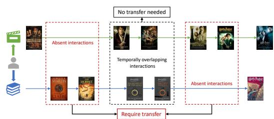
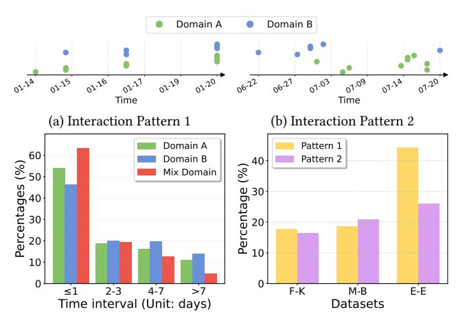
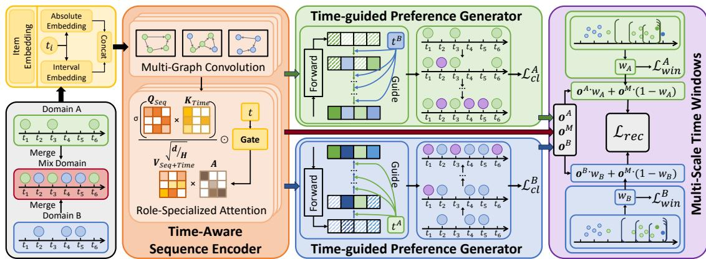
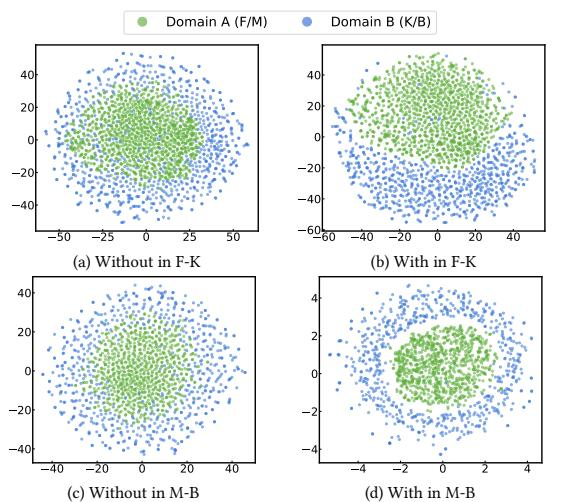
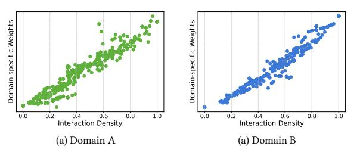
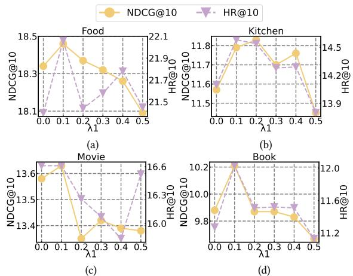
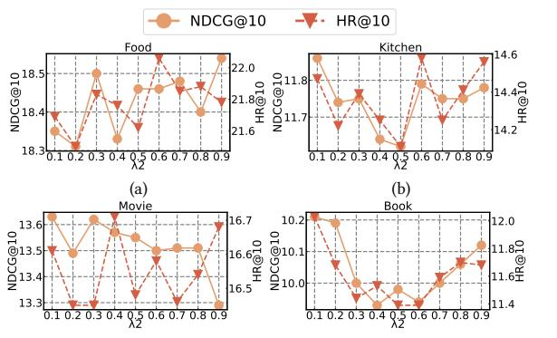
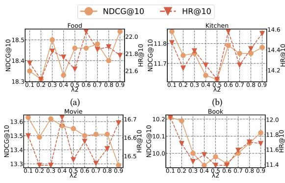
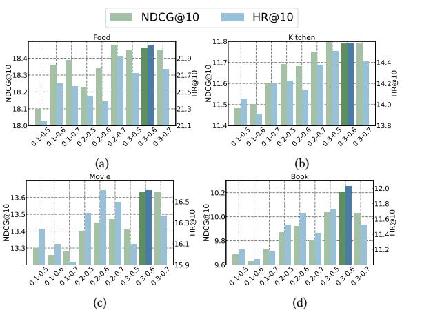
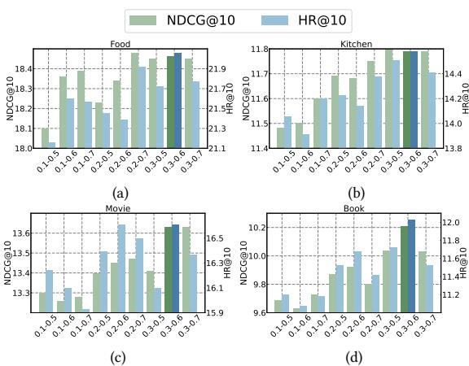

# Bridging Time and Domains: A Time-aware Framework for Cross-Domain Sequential Recommendation

[Zemu Liu](https://orcid.org/0009-0000-6480-3118) School of Computer Science, Beijing Institute of Technology Beijing, China zemu\_liu@bit.edu.cn

[Zhida Qin](https://orcid.org/0000-0002-9270-1810)∗ School of Computer Science, Beijing Institute of Technology Beijing, China zanderqin@bit.edu.cn

[Pengzhan Zhou](https://orcid.org/0000-0002-8796-5969) School of Computer Science, Chongqing University Chongqing, China pzzhou@cqu.edu.cn

[Tianyu Huang](https://orcid.org/0000-0003-2307-2261) School of Computer Science, Beijing Institute of Technology Beijing, China huangtianyu@bit.edu.cn

[Gangyi Ding](https://orcid.org/0009-0001-4185-4833) School of Computer Science, Beijing Institute of Technology Beijing, China dgy@bit.edu.cn

## Abstract

Cross-domain sequential recommendation (CDSR) aims to utilize users' interactions across multiple domains to alleviate the problem of interaction sparsity that is prevalent in web platforms, thereby providing more accurate personalized recommendations. Although current CDSR methods have made some progress, they suffer from two main limitations: (i) assuming uniformly distributed interactions over time; and (ii) neglecting temporal influences during cross-domain transfer. In order to address the above issues, we propose a novel Time-Aware Cross-Domain Sequential Recommendation framework (TA-CDSR). First, we design a time-sensitive attention which captures user preferences over time by decoupling interaction sequences and time sequences. Second, we propose a time-guided preference generator that can reconstruct the lacking interactions in the target domain by taking the source domain interactions time as guidance information. Finally, we design a multi-scale time windows based domain transfer module, which can dynamically identify the temporal interaction density and thus adaptively assign the weights of cross-domain information. Extensive experiments on three real-world datasets indicate that TA-CDSR achieves competitive time complexity while outperforming other baselines.

# CCS Concepts

• Information systems → Recommender systems.

### Keywords

Cross-Domain Sequential Recommendation; Attention Network; Diffusion Model; Recommender Systems

© 2026 Copyright held by the owner/author(s). ACM ISBN 979-8-4007-2307-0/2026/04 <https://doi.org/10.1145/3774904.3792249>

### ACM Reference Format:

Zemu Liu, Zhida Qin, Pengzhan Zhou, Tianyu Huang, and Gangyi Ding. 2026. Bridging Time and Domains: A Time-aware Framework for Cross-Domain Sequential Recommendation. In Proceedings of the ACM Web Conference 2026 (WWW '26), April 13–17, 2026, Dubai, United Arab Emirates. ACM, New York, NY, USA, [12](#page-11-0) pages.<https://doi.org/10.1145/3774904.3792249>

### 1 INTRODUCTION

With the exponential growth of information on the Internet, recommendation systems have been widely used in many web services such as news, e-commerce, entertainment, etc., effectively improving the users experience [\[8,](#page-8-0) [9,](#page-8-1) [13,](#page-8-2) [60\]](#page-9-0). However, the problem of interaction sparsity arises along with the huge amount of information in the web network, which limits the performance of recommendation[\[31,](#page-8-3) [38,](#page-9-1) [39,](#page-9-2) [55\]](#page-9-3). To address this problem, Crossdomain sequential recommendation (CDSR) is proposed and has been proven to be effective [\[47,](#page-9-4) [53,](#page-9-5) [57\]](#page-9-6). CDSR aims to learn more accurate users preferences by utilizing data from multiple domains, so as to improve recommendation performance.

Classical CDSR models rely on completely overlapping users to explicitly model inter-domain behavioral dependencies. Specifically, these methods separately model user preferences for each domain and transfer knowledge through cross-domain modules [\[34,](#page-8-4) [35,](#page-8-5) [59\]](#page-9-7). Benefiting from the effectiveness of Transformer in sequential recommendation [\[19,](#page-8-6) [51\]](#page-9-8), CDSR methods generally utilize self-attention for modeling, e.g., C 2DSR [\[6\]](#page-8-7), Tri-CDR [\[33\]](#page-8-8), MAN [\[28\]](#page-8-9). In addition, most existing approaches directly transfer complete cross-domain knowledge, ignoring the users heterogeneity. However, in real-world scenarios, the percentage of fully overlapping users is usually small, resulting in a low model coverage. Therefore, recent researches explore partially or non-overlapping user scenarios, such as IESRec [\[30\]](#page-8-10) with a joint multi-interest and domain alignment framework and AMID [\[52\]](#page-9-9) with a multi-interest module with doubly robust estimation for open-world recommendations.

Despite the advancements, these approaches ignore the temporal distribution of user preferences, thus hindering the models' ability to accurately capture user evolving preferences. Specifically, these methods suffer from two major limitations: (i) They rely on an

∗Corresponding author

[This work is licensed under a Creative Commons Attribution 4.0 International License.](https://creativecommons.org/licenses/by/4.0) WWW '26, Dubai, United Arab Emirates.

Figure 1: Illustrative example of a representative user interaction sequence.

oversimplified assumption that the interactions in sequences are uniformly distributed over time; and (ii) They ignore temporal influences in the process of cross-domain transfer. These limitations may result in a biased recommendation from the users true interest, as well as an inefficient cross-domain knowledge transfer. Therefore, it is important to incorporate temporal information into CDSR models to improve the accuracy of recommendations. However, effectively addressing both limitations faces the following two challenges.

- How to alleviate the highly irregular and sparse user interactions? As shown in Figure [1,](#page-1-0) user interactions are not uniformly distributed over time. Specifically, users frequently concentrate their interactions in short periods of time with long periods of lacking interactions, which further exacerbates the interaction sparsity. Previous researches [\[11,](#page-8-11) [14\]](#page-8-12) have shown that non-uniform distribution is not beneficial for capturing user preferences because of the preference drift problem, i.e., user preferences may drift over time. Most of the current approaches alleviate this problem by cross-domain knowledge transfer, but still fail to capture preferences for time periods when both domains lack interactions.
- How to model the impact of temporal information on crossdomain transfer? Due to the inherent user heterogeneity, it is not optimal to employ a consistent cross-domain transfer mechanism for all users. Specifically, when a user exhibits abundant interactions in both domains, the model should reduce crossdomain preference transfer during this period to mitigate potential interference from domain-specific information. Conversely, when interactions in the target domain are sparse, the model should actively transfer relevant preferences from the source domain to compensate for lacking interactions and assist the recommendation of the target domain. As shown in Figure [1,](#page-1-0) since the absence of recent interactions in the book domain, the model should mainly migrate the movie domain preferences during this period so as to correctly recommend Harry Potter for the user. Therefore, the model should be able to recognise users temporal patterns and adaptively regulate cross-domain preference transfer.

In order to address the above challenges, we propose a novel Time-Aware Cross-Domain Sequential Recommendation framework (TA-CDSR). First, we design a time-sensitive attention as a sequence encoder. In particular, we model users preferences over time by calculating the correlation of interaction sequences with time sequences. Then, we propose a time-guided preference generator to alleviate the problem of uneven sequences distribution by generating sparse interactions. Specifically, we take the user

source domain interactions time as guidance information to assist the diffusion model in generating the lacking target domain interactions. Furthermore, we align the preferences between the original and augmented sequences through contrastive learning to enhance representation consistency. In addition, we design a multi-scale time windows based domain transfer module, which enables the model to adaptively recognize interaction density and assign cross-domain information weights based on the temporal distribution of user interactions. Therefore, the model can perform effective cross-domain transfer. We conduct extensive experiments on three real-world datasets to demonstrate that TA-CDSR achieves competitive time complexity while outperforming other baselines.

The contributions of this paper are summarized as follows:

- We propose TA-CDSR, a novel CDSR framework that introduces temporal information in three complementary aspects: sequence encoding, preference generation, and cross-domain transfer for efficient recommendation.
- We propose a diffusion generator which employs source domain interactions time as guidance information to generate absent target domain user interactions, thereby mitigating the interaction sparsity.
- We employ multi-scale time windows to capture the temporal distribution of user interactions, enabling adaptive identification of interaction density and dynamic allocation of cross-domain weights.
- We perform extensive experiments on three real-world datasets that outperform all baselines, proving the effectiveness of TA-CDSR.

### 2 DATA ANALYSIS

In this section, we perform extensive data analysis to illustrate two issues that are prevalent but neglected in cross-domain sequential data: (i) temporally irregular and sparse interactions, and (ii) temporal heterogeneity of users during cross-domain transfer. For this study, we utilize three datasets, with the detailed information in the Appendix [A.1.](#page-9-10)

In order to better illustrate these issues, we visualize the results of data analysis, as shown in Figure [2:](#page-2-0) Figure [2\(](#page-2-0)a) and Figure [2\(](#page-2-0)b) show the interaction distributions of two representative users in the Movie-Book dataset; Figure [2\(](#page-2-0)c) displays the time intervals between neighboring interactions of the Movie-Book dataset; and Figure [2\(](#page-2-0)d) quantitatively presents the prevalence of the two interaction temporal patterns described above in the three datasets. From these data analysis figures, we can observe the following two issues:

Temporally irregular and sparse interactions. As shown in Figure [2\(](#page-2-0)a) and Figure [2\(](#page-2-0)b), the distribution of interactions for both users is highly irregular, i.e., a large number of interactions are concentrated in a very short period of time. Furthermore, Figure [2\(](#page-2-0)c) reflects the uniformity of the interaction distribution, with larger intervals indicating a more uneven distribution. In the single domain, while a large number of interaction intervals are within 1 day, half of the interactions still have longer time intervals. Notably, over 10% of interaction intervals exceed one week, suggesting these interactions may lack correlation. Mixing the interactions of both domains significantly mitigates the non-uniformity of the interactions, proving the effectiveness of our time-guided preference

| Datasets Metrics   | SASRec | Transformer TiSASRec | Method CL4SRec | IOCRec | DreamRec | Diffusion DiffuRec | Method ADRec | InDiRec | 2 DSR C | CDSR EA-GCL | Method Tri-CDR | ABXI   | TA-CDSR | impro. |
|--------------------|--------|----------------------|----------------|--------|----------|--------------------|--------------|---------|---------|-------------|----------------|--------|---------|--------|
| MRR                | 0.0917 | 0.0951               | 0.0949         | 0.1260 | 0.0185   | 0.1312             | 0.1376       | 0.1383  | 0.1246  | 0.1119      | 0.1195         | 0.1260 | 0.1789  | 29.36% |
| N@5                | 0.0915 | 0.0943               | 0.0928         | 0.1282 | 0.0123   | 0.1327             | 0.1387       | 0.1408  | 0.1250  | 0.0731      | 0.1141         | 0.1277 | 0.1779  | 26.35% |
| N@10 Food          | 0.1063 | 0.1080               | 0.1085         | 0.1375 | 0.0170   | 0.1400             | 0.1481       | 0.1503  | 0.1338  | 0.0748      | 0.1311         | 0.1390 | 0.1846  | 22.82% |
| H@1                | 0.0475 | 0.0546               | 0.0513         | 0.0902 | 0.0067   | 0.0981             | 0.1002       | 0.0981  | 0.0889  | 0.1055      | 0.0682         | 0.0836 | 0.1537  | 45.69% |
| H@5                | 0.1337 | 0.1319               | 0.1320         | 0.1614 | 0.0193   | 0.1626             | 0.1723       | 0.1783  | 0.1570  | 0.1199      | 0.1560         | 0.1673 | 0.1999  | 12.11% |
| H@10               | 0.1800 | 0.1744               | 0.1812         | 0.1901 | 0.0354   | 0.1852             | 0.2019       | 0.2078  | 0.1843  | 0.1255      | 0.2087         | 0.2027 | 0.2206  | 5.70%  |
| MRR                | 0.0588 | 0.0640               | 0.0661         | 0.0973 | 0.0152   | 0.0965             | 0.0907       | 0.0917  | 0.0830  | 0.0745      | 0.0713         | 0.0833 | 0.1153  | 18.50% |
| N@5                | 0.0541 | 0.0604               | 0.0614         | 0.0957 | 0.0088   | 0.0952             | 0.0883       | 0.0896  | 0.0794  | 0.0481      | 0.0662         | 0.0821 | 0.1121  | 17.14% |
| N@10 Kitchen       | 0.0670 | 0.0715               | 0.0738         | 0.1018 | 0.0142   | 0.1008             | 0.0970       | 0.0978  | 0.0880  | 0.0486      | 0.0782         | 0.0908 | 0.1179  | 15.82% |
| H@1                | 0.0269 | 0.0321               | 0.0341         | 0.0770 | 0.0041   | 0.0765             | 0.0627       | 0.0647  | 0.0569  | 0.0720      | 0.0320         | 0.0514 | 0.0954  | 23.90% |
| H@5                | 0.0805 | 0.0879               | 0.0877         | 0.1129 | 0.0147   | 0.1123             | 0.1116       | 0.1123  | 0.1008  | 0.0779      | 0.0993         | 0.1110 | 0.1275  | 12.93% |
| H@10               | 0.1210 | 0.1225               | 0.1262         | 0.1322 | 0.0316   | 0.1297             | 0.1383       | 0.1376  | 0.1276  | 0.0795      | 0.1367         | 0.1382 | 0.1458  | 5.42%  |
| MRR                | 0.0673 | 0.0744               | 0.0710         | 0.0889 | 0.0143   | 0.0968             | 0.0885       | 0.0971  | 0.0719  | 0.0786      | 0.0712         | 0.0923 | 0.1337  | 37.69% |
| N@5                | 0.0612 | 0.0690               | 0.0639         | 0.0863 | 0.0087   | 0.0930             | 0.0839       | 0.0932  | 0.0670  | 0.0506      | 0.0623         | 0.0880 | 0.1299  | 39.38% |
| N@10 Movie         | 0.0742 | 0.0822               | 0.0769         | 0.0950 | 0.0121   | 0.1018             | 0.0964       | 0.1041  | 0.0749  | 0.0516      | 0.0795         | 0.1007 | 0.1363  | 30.93% |
| H@1                | 0.0333 | 0.0387               | 0.0350         | 0.0581 | 0.0044   | 0.0704             | 0.0526       | 0.0650  | 0.0490  | 0.0756      | 0.0272         | 0.0563 | 0.1126  | 48.94% |
| H@5                | 0.0891 | 0.0983               | 0.0911         | 0.1130 | 0.0142   | 0.1147             | 0.1137       | 0.1193  | 0.0837  | 0.0820      | 0.0959         | 0.1186 | 0.1460  | 22.38% |
| H@10               | 0.1295 | 0.1393               | 0.1314         | 0.1400 | 0.0261   | 0.1421             | 0.1529       | 0.1530  | 0.1081  | 0.0851      | 0.1491         | 0.1580 | 0.1661  | 5.13%  |
| MRR                | 0.0457 | 0.0537               | 0.0561         | 0.0768 | 0.0101   | 0.0851             | 0.0806       | 0.0781  | 0.0673  | 0.0592      | 0.0617         | 0.0728 | 0.1012  | 18.92% |
| N@5                | 0.0433 | 0.0513               | 0.0523         | 0.0744 | 0.0059   | 0.0818             | 0.0789       | 0.0732  | 0.0649  | 0.0386      | 0.0545         | 0.0685 | 0.0978  | 19.56% |
| N@10 Book          | 0.0499 | 0.0577               | 0.0601         | 0.0784 | 0.0078   | 0.0844             | 0.0828       | 0.0766  | 0.0694  | 0.0389      | 0.0646         | 0.0747 | 0.1021  | 20.97% |
| H@1                | 0.0236 | 0.0320               | 0.0339         | 0.0634 | 0.0019   | 0.0738             | 0.0631       | 0.0643  | 0.0506  | 0.0564      | 0.0314         | 0.0490 | 0.0880  | 19.24% |
| H@5                | 0.0628 | 0.0694               | 0.0704         | 0.0845 | 0.0100   | 0.0889             | 0.0943       | 0.0809  | 0.0778  | 0.0629      | 0.0769         | 0.0864 | 0.1070  | 13.47% |
| H@10               | 0.0834 | 0.0890               | 0.0950         | 0.0970 | 0.0158   | 0.0967             | 0.1064       | 0.0918  | 0.0917  | 0.0638      | 0.1081         | 0.1056 | 0.1203  | 11.29% |
| MRR                | 0.4296 | 0.4348               | 0.3611         | 0.4717 | 0.0598   | 0.4469             | 0.4643       | 0.4265  | 0.5916  | 0.4036      | 0.5117         | 0.4398 | 0.7430  | 25.59% |
| N@5                | 0.4461 | 0.4484               | 0.3773         | 0.4882 | 0.0534   | 0.4666             | 0.4846       | 0.4477  | 0.6184  | 0.2991      | 0.5414         | 0.4583 | 0.7491  | 21.13% |
| N@10 Entertainment | 0.4878 | 0.4862               | 0.4196         | 0.5224 | 0.0631   | 0.5010             | 0.5188       | 0.4858  | 0.6437  | 0.3240      | 0.5788         | 0.4957 | 0.7619  | 18.36% |
| H@1                | 0.2950 | 0.3120               | 0.2250         | 0.3493 | 0.0339   | 0.3168             | 0.3326       | 0.2889  | 0.4682  | 0.2955      | 0.3583         | 0.3057 | 0.6974  | 48.95% |
| H@5                | 0.5848 | 0.5729               | 0.5173         | 0.6117 | 0.0718   | 0.6008             | 0.6178       | 0.5915  | 0.7500  | 0.5461      | 0.7010         | 0.5962 | 0.7950  | 6.00%  |
| H@10               | 0.7135 | 0.6895               | 0.6479         | 0.7168 | 0.1043   | 0.7140             | 0.7233       | 0.7091  | 0.8280  | 0.6267      | 0.8161         | 0.7117 | 0.8345  | 0.79%  |
| MRR                | 0.5522 | 0.5523               | 0.5052         | 0.7792 | 0.6916   | 0.7810             | 0.7937       | 0.7895  | 0.7188  | 0.6471      | 0.5870         | 0.6432 | 0.8439  | 6.32%  |
| N@5                | 0.5888 | 0.5898               | 0.5349         | 0.7898 | 0.6927   | 0.7899             | 0.8047       | 0.8002  | 0.7428  | 0.4488      | 0.6208         | 0.6735 | 0.8511  | 5.77%  |
| N@10 Education     | 0.6224 | 0.6214               | 0.5708         | 0.8028 | 0.6966   | 0.8033             | 0.8165       | 0.8127  | 0.7586  | 0.4600      | 0.6553         | 0.6959 | 0.8579  | 5.07%  |
| H@1                | 0.3976 | 0.3962               | 0.3547         | 0.7206 | 0.6735   | 0.7247             | 0.7358       | 0.7321  | 0.6184  | 0.5534      | 0.4367         | 0.5169 | 0.8094  | 10.00% |
| H@5                | 0.7569 | 0.7584               | 0.6935         | 0.8486 | 0.7082   | 0.8434             | 0.8615       | 0.8571  | 0.8436  | 0.7701      | 0.7817         | 0.8074 | 0.8865  | 2.90%  |
| H@10               | 0.8591 | 0.8544               | 0.8033         | 0.8885 | 0.7205   | 0.8848             | 0.8981       | 0.8957  | 0.8921  | 0.8065      | 0.8875         | 0.8762 | 0.9074  | 1.04%  |

Table 2: Ablation Study.

|          | Variants | MRR    | Food N@10 | H@10   | MRR    | Kitchen N@10 | H@10   |
|----------|----------|--------|-----------|--------|--------|--------------|--------|
| w/o      | Single   | 0.1433 | 0.1514    | 0.1971 | 0.0814 | 0.0850       | 0.1192 |
| w/o      | Cross    | 0.1644 | 0.1674    | 0.1937 | 0.1056 | 0.1058       | 0.1244 |
| w/o      | TASE     | 0.1748 | 0.1804    | 0.2167 | 0.1133 | 0.1145       | 0.1384 |
| w/o      | TGPG     | 0.1782 | 0.1835    | 0.2165 | 0.1149 | 0.1171       | 0.1443 |
| w/o      | MTDT     | 0.1750 | 0.1793    | 0.2108 | 0.1144 | 0.1165       | 0.1425 |
| TA-CDSR  |          | 0.1789 | 0.1846    | 0.2206 | 0.1153 | 0.1179       | 0.1458 |
| Variants |          |        | Movie     |        |        | Book         |        |
|          |          | MRR    | N@10      | H@10   | MRR    | N@10         | H@10   |
| w/o      | Single   | 0.0893 | 0.0925    | 0.1280 | 0.0679 | 0.0697       | 0.0921 |
| w/o      | Cross    | 0.1263 | 0.1271    | 0.1495 | 0.0927 | 0.0921       | 0.1040 |
| w/o      | TASE     | 0.1312 | 0.1334    | 0.1606 | 0.0955 | 0.0951       | 0.1073 |
| w/o      | TGPG     | 0.1325 | 0.1355    | 0.1644 | 0.1005 | 0.1005       | 0.1159 |
| w/o      | MTDT     | 0.1298 | 0.1330    | 0.1637 | 0.0968 | 0.0972       | 0.1129 |
| TA-CDSR  |          | 0.1337 | 0.1363    | 0.1661 | 0.1012 | 0.1021       | 0.1203 |

Food-Kitchen dataset. We set ��1 to 0.1 and ��2 are chosen from {0.1, . . . , 0.9}. More details are provided in Appendix [A.3.](#page-10-1)

### 5.2 Performance Comparison (RQ1)

In this section, we perform a comprehensive performance comparison with other baselines. Table [1](#page-5-0) shows the results of all models on the three datasets, yielding the following observations:

TA-CDSR achieves the best results in all domains. TA-CDSR achieves optimal performance in all six domains of the three datasets with high improvements. It is mainly attributed to the three temporal modules complementing each other: TASE accurately captures user preferences, TGPG fills in the users missing interactions, and MTDT properly assigns the weights of cross-domain transfer. It demonstrates that temporal information is important for crossdomain sequence recommendations.

Diffusion-based models outperform other baselines. Since the interactions are sparse, models are unable to capture accurate user preferences. As a generative approach, diffusion-based models can generate unobserved but plausible interaction sequences.TA-CDSR benefits from the powerful generation capability of diffusion models to mitigate interaction sparsity , therefore performing better than other CDSR methods.

Cross-domain information can enhance model performance. Single-domain SR methods cannot provide satisfactory results compared to TA-CDSR since they fail to utilize the auxiliary information in the source domain. It indicates that cross-domain information can effectively alleviate interaction sparsity and improve recommendation performance.

Transformer effectively captures sequential preferences. A lot of Diffusion and CDSR methods, such as DiffuRec, InDiRec, C 2DSR, TriCDR, also utilize Transformer as encoder and achieve competitive performances, highlighting the practicality and superiority of Transformer for modeling sequential problems.

# 5.3 Ablation Study (RQ2)

In this section, we design different variants to evaluate the impact of each module in TA-CDSR on performance:

- w/o Single: Remove domain-specific embeddings , only use domain-shared embeddings for prediction.
- w/o Cross: Remove domain-shared embeddings , only use domain-specific embeddings for prediction.

Figure 4: The visualization of TGPG module's effect.

- w/o TASE: Replace time-sensitive attention with standard self-attention.
- w/o TGPG: Remove time-guided preference generator.
- w/o MTDT: Remove multi-scale windows based domain transfer module.

Table [2](#page-6-0) displays the comparative results of TA-CDSR and all variants on the two datasets, which can be observed:

From the results of the variants "w/o Single" and "w/o Cross", lacking either single- or cross-domain information significantly decreases the model performance, which shows the importance of cross-domain information when recommending.

The results from the variant "w/o TASE" demonstrate the effectiveness of time-sensitive attention in capturing user preferences. By decoupling temporal and interaction features, the encoder effectively models the temporal distribution of user preferences.

The results from the variant "w/o TGPG" indicate the practicality of the diffusion model in generating user absent interactions. By utilizing our designed source domain time-guided strategy, the generator can successfully enrich user lacking interactions, thereby capturing user preferences more accurately.

The results from the variant "w/o MTDT" illustrate the usefulness of adaptively merging domain-specific and domain-shared embeddings according to different users. The multi-scale time windows accurately identify the interaction density over time, thus improving the efficiency of cross-domain transfer.

### 5.4 Visualization of TGPG module (RQ3)

In this section,we present a comparative visualization of the domainspecific embedding distributions obtained by TA-CDSR with and without the TGPG module on two datasets, as shown in Figure [4.](#page-6-1) It can be noticed that the two-domain point clouds are highly mixed and lack a clear demarcation without the TGPG module. While it can be observed that the two-domain point clouds form a notable separation and the boundary clarity is significantly improved with TGPG module. It indicates that due to the uneven distribution and interaction sparsity of the original sequences, the model struggles to learn accurate domain-specific features and is susceptible to noise. In contrast, the TGPG module notably mitigates these two

Table 3: Comparison of different scales of time window.

| Scales | MRR    | Food N@10 | H@10   | MRR    | Kitchen N@10 | H@10   |
|--------|--------|-----------|--------|--------|--------------|--------|
| fine   | 0.1795 | 0.1839    | 0.2163 | 0.1165 | 0.1181       | 0.1429 |
| middle | 0.1794 | 0.1831    | 0.2137 | 0.1159 | 0.1173       | 0.1437 |
| coarse | 0.1789 | 0.1836    | 0.2160 | 0.1147 | 0.1162       | 0.1411 |
| multi  | 0.1789 | 0.1846    | 0.2206 | 0.1153 | 0.1179       | 0.1458 |
| Scales |        | Movie     |        |        | Book         |        |
|        | MRR    | N@10      | H@10   | MRR    | N@10         | H@10   |
| fine   | 0.1308 | 0.1341    | 0.1670 | 0.1004 | 0.1007       | 0.1166 |
| middle | 0.1322 | 0.1353    | 0.1675 | 0.1005 | 0.1009       | 0.1165 |
| coarse | 0.1324 | 0.1358    | 0.1637 | 0.1007 | 0.1009       | 0.1162 |
| multi  | 0.1337 | 0.1363    | 0.1661 | 0.1012 | 0.1021       | 0.1203 |

problems by generating user lacking interactions, which improves the accuracy of capturing domain-specific features.

### 5.5 Multi-Scale Time Windows Study (RQ4)

In this section, we first compare the results of different scales of time windows to verify the superiority of multi-scale. Then, we visualize the relationship between domain-specific embeddings weights and interaction density to confirm the inference from the data analysis.

Table [3](#page-7-0) shows the results for different scales of time windows on the two datasets. We design three scales of time windows: coarsegrained, middle-grained, and fine-grained. It can be observed that multi-scale achieves the optimal results in most cases while worse than single-scale in a few cases. This is due to the fact that different datasets have different temporal patterns.

For example, in the Food-Kitchen dataset, the user sequences have an average interaction span of 6 months. Users interests may change over time, and recent interactions are more reflective of current preferences, thus fine-grained time windows perform better. Coarse-grained time windows may introduce excessive irrelevant historical interactions and dilute the key signals. While the average interaction span of the Movie-Book dataset is only half a month, which differs from the time patterns of the Food-Kitchen dataset, therefore presenting different results. In general, multi-scale time windows are able to quantify the users interaction density over time, adaptively adjusting the weights.

Next, we visualize the relationship between the domain-specific embedding weights and the interaction density of this domain. In Section 4.4, we consider that their relationship should be proportional, since a smaller interaction density indicates more lack of recent interactions in the target domain and more plentiful recent interactions in the source domain. Figure [5](#page-7-1) presents the results of the visualization, which are in line with our expectations. It suggests that the multi-scale time windows are able to identify low interaction density users in the target domain and adaptively take more account of source domain information, which is beneficial to improve the recommendation performance.

### 5.6 Time Complexity Analysis (RQ5)

Given that the efficiency bottleneck of TA-CDSR is predominantly associated with the TGPG module, we therefore compare the time complexity with other diffusion-based methods in this section, as shown in Table [4.](#page-7-2) Since the selected methods are single-domain sequential recommendation models, we sum their time for processing both domains to get the CDSR time. Because ADRec employs

Figure 5: The relationship between the domain-specific embedding weights and the interaction density.

Table 4: Training and inference time per epoch (Unit: seconds) and GPU memory occupation (Unit: GB) comparison.

| Datasets     | DreamRec | DiffuRec | InDiRec | TA-CDSR |
|--------------|----------|----------|---------|---------|
| Training F-K | 63.8     | 52.2     | 91.5    | 65.1    |
| Inference    | 63.7     | 24.2     | 7.0     | 3.9     |
| Memory       | 5.13     | 2.41     | 1.77    | 7.64    |
| Training M-B | 98.6     | 86.0     | 128.5   | 123.3   |
| Inference    | 58.5     | 22.5     | 8.4     | 4.3     |
| Memory       | 6.18     | 2.63     | 1.83    | 10.98   |
| Training E-E | 820.0    | 451.4    | 966.4   | 378.7   |
| Inference    | 51.8     | 19.7     | 3.2     | 3.5     |
| Memory       | 3.92     | 2.19     | 1.5     | 6.07    |

a pre-training method and the time complexity is related to the pre-trained model, we do not compare with it.

It can be observed that TA-CDSR consumes similar time as other models in training, even less on the larger dataset (E-E). When inferring, TA-CDSR takes almost the shortest time. In conclusion, TA-CDSR achieves the best results with similar time complexity as the other models. The time consumption of diffusion models mainly comes from the forward and reverse processes. Since there is inherent noise (e.g., false clicks) in the interactions, we set a small number of forward and backward steps. However, the time-guided preference generator has to perform multiple diffusion processes for a single sequence, which greatly increases the time consumption. In summary, the overall time efficiency of TA-CDSR is still acceptable. Additionally, as TA-CDSR is designed to handle Domain A, Domain B, and the mix domain simultaneously, it theoretically contains 2 to 3 times the parameters of a single-domain model. Consequently, TA-CDSR consumes more memory.

### 6 CONCLUSION

In conclusion, this paper proposes a new time-aware cross-domain sequential recommendation framework. Specifically, this paper considers three aspects of cross-domain temporal characterization. First, we design a time-sensitive attention to model the temporal features of user preferences. Then, we design a time-guided preference generator to generate the users lacking interactions. Finally, we adaptively transfer cross-domain information based on multi-scale time windows. Extensive experiments on three datasets prove that TA-CDSR has competitive time complexity while outperforming other baselines.

### Acknowledgments

This work is supported in part by the National Key R&D Program of China under Grant 2023YFC3305700, and in part by the National Natural Science Foundation of China U2441242.

### References

[1] Nawaf Alharbi and Doina Caragea. 2022. Cross-Domain Attentive Sequential Recommendations based on General and Current User Preferences (CD-ASR). In IEEE/WIC/ACM International Conference on Web Intelligence and Intelligent Agent Technology (Melbourne, VIC, Australia) (WI-IAT '21). Association for Computing Machinery, New York, NY, USA, 48–55. [2] Dmitry Baranchuk, Ivan Rubachev, Andrey Voynov, Valentin Khrulkov, and Artem Babenko. 2022. Label-Efficient Semantic Segmentation with Diffusion Models. arXiv[:2112.03126](https://arxiv.org/abs/2112.03126) [cs.CV] [3] Ye Bi, Liqiang Song, Mengqiu Yao, Zhenyu Wu, Jianming Wang, and Jing Xiao. 2020. DCDIR: A Deep Cross-Domain Recommendation System for Cold Start Users in Insurance Domain. In Proceedings of the 43rd International ACM SIGIR Conference on Research and Development in Information Retrieval (Virtual Event, China) (SIGIR '20). Association for Computing Machinery, New York, NY, USA, 1661–1664. [4] Qingtian Bian, Marcus Vin'icius de Carvalho, Tieying Li, Jiaxing Xu, Hui Fang, and Yiping Ke. 2025. ABXI: Invariant Interest Adaptation for Task-Guided Cross-Domain Sequential Recommendation. Proceedings of the ACM on Web Conference 2025 (2025). [5] Emmanuel Asiedu Brempong, Simon Kornblith, Ting Chen, Niki Parmar, Matthias Minderer, and Mohammad Norouzi. 2022. Denoising Pretraining for Semantic Segmentation. In 2022 IEEE/CVF Conference on Computer Vision and Pattern Recognition Workshops (CVPRW). 4174–4185. [6] Jiangxia Cao, Xin Cong, Jiawei Sheng, Tingwen Liu, and Bin Wang. 2022. Contrastive Cross-Domain Sequential Recommendation. In Proceedings of the 31st ACM International Conference on Information & Knowledge Management (Atlanta, GA, USA) (CIKM '22). Association for Computing Machinery, New York, NY, USA, 138–147. [7] Jialei Chen, Yuanbo Xu, and Yiheng Jiang. 2025. Unlocking the Power of Diffusion Models in Sequential Recommendation: A Simple and Effective Approach. In Proceedings of the 30th ACM SIGKDD Conference on Knowledge Discovery and Data Mining (KDD). ACM. [8] Wentao Cheng, Zhida Qin, Zexue Wu, Pengzhan Zhou, and Tianyu Huang. 2025. Large Language Models Enhanced Hyperbolic Space Recommender Systems. arXiv[:2504.05694](https://arxiv.org/abs/2504.05694) [cs.IR] [9] Wentao Cheng, Zhida Qin, Zexue Wu, Pengzhan Zhou, and Tianyu Huang. 2025. Large Language Models Enhanced Hyperbolic Space Recommender Systems. In Proceedings of the 48th International ACM SIGIR Conference on Research and Development in Information Retrieval (Padua, Italy) (SIGIR '25). Association for Computing Machinery, New York, NY, USA, 1944–1953. [10] Ziqiang Cui, Haolun Wu, Bowei He, Ji Cheng, and Chen Ma. 2024. Context Matters: Enhancing Sequential Recommendation with Context-aware Diffusionbased Contrastive Learning. In Proceedings of the 33rd ACM International Conference on Information and Knowledge Management (Boise, ID, USA) (CIKM '24). Association for Computing Machinery, New York, NY, USA, 404–414. [11] Yizhou Dang, Enneng Yang, Guibing Guo, Linying Jiang, Xingwei Wang, Xiaoxiao Xu, Qinghui Sun, and Hong Liu. 2023. Uniform sequence better: time interval aware data augmentation for sequential recommendation. In Proceedings of the Thirty-Seventh AAAI Conference on Artificial Intelligence and Thirty-Fifth Conference on Innovative Applications of Artificial Intelligence and Thirteenth Symposium on Educational Advances in Artificial Intelligence (AAAI'23/IAAI'23/EAAI'23). AAAI Press, Article 471, 8 pages. [12] Shibo Feng, Chunyan Miao, Zhong Zhang, and Peilin Zhao. 2024. Latent Diffusion Transformer for Probabilistic Time Series Forecasting. Proceedings of the AAAI Conference on Artificial Intelligence 38, 11 (Mar. 2024), 11979–11987. [13] Haoyan Fu, Zhida Qin, Wenhao Xue, and Gangyi Ding. 2025. Fusing temporal and semantic dependencies for session-based recommendation. Information Processing & Management 62, 1 (2025), 103896. [14] Haoyan Fu, Zhida Qin, Shixiao Yang, Haoyao Zhang, Bin Lu, Shuang Li, Tianyu Huang, and John C.S. Lui. 2025. Time Matters: Enhancing Sequential Recommendations with Time-Guided Graph Neural ODEs. In Proceedings of the 31st ACM SIGKDD Conference on Knowledge Discovery and Data Mining V.2 (Toronto ON, Canada) (KDD '25). Association for Computing Machinery, New York, NY, USA, 637–648. [15] Ian Goodfellow, Jean Pouget-Abadie, Mehdi Mirza, Bing Xu, David Warde-Farley, Sherjil Ozair, Aaron Courville, and Yoshua Bengio. 2020. Generative adversarial networks. Commun. ACM 63, 11 (Oct. 2020), 139–144. [16] Lei Guo, Hao Liu, Lei Zhu, Weili Guan, and Zhiyong Cheng. 2023. DA-DAN: A Dual Adversarial Domain Adaption Network for Unsupervised Non-overlapping Cross-domain Recommendation. ACM Trans. Inf. Syst. 42, 2, Article 48 (Nov. 2023), 27 pages. [17] Lei Guo, Li Tang, Tong Chen, Lei Zhu, Quoc Viet Hung Nguyen, and Hongzhi Yin. 2021. DA-GCN: A Domain-aware Attentive Graph Convolution Network for Shared-account Cross-domain Sequential Recommendation. In Proceedings of the Thirtieth International Joint Conference on Artificial Intelligence, IJCAI-21, Zhi-Hua Zhou (Ed.). International Joint Conferences on Artificial Intelligence Organization, 2483–2489. Main Track. [18] Lei Guo, Jinyu Zhang, Tong Chen, Xinhua Wang, and Hongzhi Yin. 2023. Reinforcement Learning-Enhanced Shared-Account Cross-Domain Sequential Recommendation. IEEE Transactions on Knowledge and Data Engineering 35, 7 (2023), 7397–7411. [19] Wang-Cheng Kang and Julian McAuley. 2018. Self-Attentive Sequential Recommendation. In 2018 IEEE International Conference on Data Mining (ICDM). 197–206. [20] Diederik P. Kingma and Max Welling. 2013. Auto-Encoding Variational Bayes. CoRR abs/1312.6114 (2013). [21] Hanyu Li, Weizhi Ma, Peijie Sun, Jiayu Li, Cunxiang Yin, Yancheng He, Guoqiang Xu, Min Zhang, and Shaoping Ma. 2024. Aiming at the Target: Filter Collaborative Information for Cross-Domain Recommendation. In Proceedings of the 47th International ACM SIGIR Conference on Research and Development in Information Retrieval (Washington DC, USA) (SIGIR '24). Association for Computing Machinery, New York, NY, USA, 2081–2090. [22] Jiacheng Li, Yujie Wang, and Julian McAuley. 2020. Time Interval Aware Self-Attention for Sequential Recommendation. In Proceedings of the 13th International Conference on Web Search and Data Mining (Houston, TX, USA) (WSDM '20). Association for Computing Machinery, New York, NY, USA, 322–330. [23] Wuchao Li, Rui Huang, Haijun Zhao, Chi Liu, Kai Zheng, Qi Liu, Na Mou, Guorui Zhou, Defu Lian, Yang Song, Wentian Bao, Enyun Yu, and Wenwu Ou. 2025. DimeRec: A Unified Framework for Enhanced Sequential Recommendation via Generative Diffusion Models. In Proceedings of the Eighteenth ACM International Conference on Web Search and Data Mining (Hannover, Germany) (WSDM '25). Association for Computing Machinery, New York, NY, USA, 726–734. [24] Xuewei Li, Aitong Sun, Mankun Zhao, Jian Yu, Kun Zhu, Di Jin, Mei Yu, and Ruiguo Yu. 2023. Multi-Intention Oriented Contrastive Learning for Sequential Recommendation. In Proceedings of the Sixteenth ACM International Conference on Web Search and Data Mining (Singapore, Singapore) (WSDM '23). Association for Computing Machinery, New York, NY, USA, 411–419. [25] Xiaodong Li, Hengzhu Tang, Jiawei Sheng, Xinghua Zhang, Li Gao, Suqi Cheng, Dawei Yin, and Tingwen Liu. 2025. Exploring Preference-Guided Diffusion Model for Cross-Domain Recommendation. In Proceedings of the 31st ACM SIGKDD Conference on Knowledge Discovery and Data Mining V.1 (Toronto ON, Canada) (KDD '25). Association for Computing Machinery, New York, NY, USA, 719–728. [26] Xiang Lisa Li, John Thickstun, Ishaan Gulrajani, Percy Liang, and Tatsunori B. Hashimoto. 2022. Diffusion-LM improves controllable text generation. In Proceedings of the 36th International Conference on Neural Information Processing Systems (New Orleans, LA, USA) (NIPS '22). Curran Associates Inc., Red Hook, NY, USA, Article 313, 16 pages. [27] Zihao Li, Aixin Sun, and Chenliang Li. 2023. DiffuRec: A Diffusion Model for Sequential Recommendation. ACM Trans. Inf. Syst. 42, 3, Article 66 (Dec. 2023), 28 pages. [28] Guanyu Lin, Chen Gao, Yu Zheng, Jianxin Chang, Yanan Niu, Yang Song, Kun Gai, Zhiheng Li, Depeng Jin, Yong Li, and Meng Wang. 2024. Mixed Attention Network for Cross-domain Sequential Recommendation. In Proceedings of the 17th ACM International Conference on Web Search and Data Mining (Merida, Mexico) (WSDM '24). Association for Computing Machinery, New York, NY, USA, 405–413. [29] Qidong Liu, Fan Yan, Xiangyu Zhao, Zhaocheng Du, Huifeng Guo, Ruiming Tang, and Feng Tian. 2023. Diffusion Augmentation for Sequential Recommendation. In Proceedings of the 32nd ACM International Conference on Information and Knowledge Management (Birmingham, United Kingdom) (CIKM '23). Association for Computing Machinery, New York, NY, USA, 1576–1586. [30] Weiming Liu, Xiaolin Zheng, Chaochao Chen, Jiajie Su, Xinting Liao, Mengling Hu, and Yanchao Tan. 2023. Joint Internal Multi-Interest Exploration and External Domain Alignment for Cross Domain Sequential Recommendation. In Proceedings of the ACM Web Conference 2023 (Austin, TX, USA) (WWW '23). Association for Computing Machinery, New York, NY, USA, 383–394. [31] Yuli Liu, Christian Walder, Lexing Xie, and Yiqun Liu. 2024. Probabilistic Attention for Sequential Recommendation. In Proceedings of the 30th ACM SIGKDD Conference on Knowledge Discovery and Data Mining (Barcelona, Spain) (KDD '24). Association for Computing Machinery, New York, NY, USA, 1956–1967. [32] Shitong Luo and Wei Hu. 2021. Score-Based Point Cloud Denoising. In 2021 IEEE/CVF International Conference on Computer Vision (ICCV). 4563–4572. [33] Haokai Ma, Ruobing Xie, Lei Meng, Xin Chen, Xu Zhang, Leyu Lin, and Jie Zhou. 2024. Triple Sequence Learning for Cross-domain Recommendation. ACM Trans. Inf. Syst. 42, 4, Article 91 (Feb. 2024), 29 pages. [34] Muyang Ma, Pengjie Ren, Zhumin Chen, Zhaochun Ren, Lifan Zhao, Peiyu Liu, Jun Ma, and Maarten de Rijke. 2022. Mixed Information Flow for Cross-Domain Sequential Recommendations. ACM Trans. Knowl. Discov. Data 16, 4, Article 64 (Jan. 2022), 32 pages. [35] Muyang Ma, Pengjie Ren, Yujie Lin, Zhumin Chen, Jun Ma, and Maarten de Rijke. 2019. -Net: A Parallel Information-sharing Network for Shared-account Crossdomain Sequential Recommendations. In Proceedings of the 42nd International ACM SIGIR Conference on Research and Development in Information Retrieval (Paris, France) (SIGIR'19). Association for Computing Machinery, New York, NY, USA, 685–694.

- [36] Chung Park, Taesan Kim, Taekyoon Choi, Junui Hong, Yelim Yu, Mincheol Cho, Kyunam Lee, Sungil Ryu, Hyungjun Yoon, Minsung Choi, and Jaegul Choo. 2023. Cracking the Code of Negative Transfer: A Cooperative Game Theoretic Approach for Cross-Domain Sequential Recommendation. In Proceedings of the 32nd ACM International Conference on Information and Knowledge Management (Birmingham, United Kingdom) (CIKM '23). Association for Computing Machinery, New York, NY, USA, 2024–2033. [37] Chung Park, Taesan Kim, Hyungjun Yoon, Junui Hong, Yelim Yu, Mincheol Cho, Minsung Choi, and Jaegul Choo. 2024. Pacer and Runner: Cooperative Learning Framework between Single- and Cross-Domain Sequential Recommendation. In Proceedings of the 47th International ACM SIGIR Conference on Research and Development in Information Retrieval (Washington DC, USA) (SIGIR '24). Association for Computing Machinery, New York, NY, USA, 2071–2080. [38] Zhida Qin, Wentao Cheng, Wenxing Ding, and Gangyi Ding. 2025. Hyperbolic Graph Contrastive Learning for Collaborative Filtering. IEEE Transactions on Knowledge and Data Engineering 37, 3 (2025), 1255–1267. [39] Zhida Qin, Wentao Cheng, Wenxing Ding, and Gangyi Ding. 2025. Hyperbolic Graph Contrastive Learning for Collaborative Filtering. IEEE Transactions on Knowledge and Data Engineering 37, 3 (2025), 1255–1267. [40] Yuanpeng Qu and Hajime Nobuhara. 2025. Intent-aware Diffusion with Contrastive Learning for Sequential Recommendation. In Proceedings of the 48th International ACM SIGIR Conference on Research and Development in Information Retrieval (Padua, Italy) (SIGIR '25). Association for Computing Machinery, New York, NY, USA, 1552–1561. [41] Chitwan Saharia, Jonathan Ho, William Chan, Tim Salimans, David J. Fleet, and Mohammad Norouzi. 2023. Image Super-Resolution via Iterative Refinement. IEEE Transactions on Pattern Analysis and Machine Intelligence 45, 4 (2023), 4713– 4726. [42] Nikolay Savinov, Junyoung Chung, Mikolaj Binkowski, Erich Elsen, and Aäron van den Oord. 2021. Step-unrolled Denoising Autoencoders for Text Generation. ArXiv abs/2112.06749 (2021). [43] Zineb Senane, Lele Cao, Valentin Leonhard Buchner, Yusuke Tashiro, Lei You, Pawel Andrzej Herman, Mats Nordahl, Ruibo Tu, and Vilhelm von Ehrenheim. 2024. Self-Supervised Learning of Time Series Representation via Diffusion Process and Imputation-Interpolation-Forecasting Mask. In Proceedings of the 30th ACM SIGKDD Conference on Knowledge Discovery and Data Mining (Barcelona, Spain) (KDD '24). Association for Computing Machinery, New York, NY, USA, 2560–2571. [44] Lifeng Shen and James T. Kwok. 2023. Non-autoregressive conditional diffusion models for time series prediction. In Proceedings of the 40th International Conference on Machine Learning (Honolulu, Hawaii, USA) (ICML'23). JMLR.org, Article 1284, 14 pages. [45] Zijian Song, Wenhan Zhang, Lifang Deng, Jiandong Zhang, Zhihua Wu, Kaigui Bian, and Bin Cui. 2024. Mitigating Negative Transfer in Cross-Domain Recommendation via Knowledge Transferability Enhancement. In Proceedings of the 30th ACM SIGKDD Conference on Knowledge Discovery and Data Mining (Barcelona, Spain) (KDD '24). Association for Computing Machinery, New York, NY, USA, 2745–2754. [46] Wenchao Sun, Muyang Ma, Pengjie Ren, Yujie Lin, Zhumin Chen, Zhaochun Ren, Jun Ma, and Maarten de Rijke. 2023. Parallel Split-Join Networks for Shared Account Cross-Domain Sequential Recommendations. IEEE Transactions on Knowledge and Data Engineering 35, 4 (2023), 4106–4123. [47] Shuliang Wang, Jiabao Zhu, Yi Wang, Chen Ma, Xin Zhao, Yansen Zhang, Ziqiang Yuan, and Sijie Ruan. 2025. Hierarchical Gating Network for Cross-Domain Sequential Recommendation. ACM Trans. Inf. Syst. 43, 4, Article 90 (May 2025), 32 pages. [48] Wenjie Wang, Yiyan Xu, Fuli Feng, Xinyu Lin, Xiangnan He, and Tat-Seng Chua. 2023. Diffusion Recommender Model. In Proceedings of the 46th International ACM SIGIR Conference on Research and Development in Information Retrieval (Taipei, Taiwan) (SIGIR '23). Association for Computing Machinery, New York, NY, USA, 832–841. [49] Xinhua Wang, Houping Yue, Zizheng Wang, Liancheng Xu, and Jinyu Zhang. 2023. Unbiased and Robust: External Attention-enhanced Graph Contrastive Learning for Cross-domain Sequential Recommendation. 2023 IEEE International Conference on Data Mining Workshops (ICDMW) (2023), 1526–1534. [50] Ruobing Xie, Qi Liu, Liangdong Wang, Shukai Liu, Bo Zhang, and Leyu Lin. 2022. Contrastive Cross-domain Recommendation in Matching. In Proceedings of the 28th ACM SIGKDD Conference on Knowledge Discovery and Data Mining (Washington DC, USA) (KDD '22). Association for Computing Machinery, New York, NY, USA, 4226–4236. [51] Xu Xie, Fei Sun, Zhaoyang Liu, Shiwen Wu, Jinyang Gao, Jiandong Zhang, Bolin Ding, and Bin Cui. 2022. Contrastive Learning for Sequential Recommendation. In 2022 IEEE 38th International Conference on Data Engineering (ICDE). 1259–1273. [52] Wujiang Xu, Qitian Wu, Runzhong Wang, Mingming Ha, Qiongxu Ma, Linxun Chen, Bing Han, and Junchi Yan. 2024. Rethinking Cross-Domain Sequential Recommendation under Open-World Assumptions. In Proceedings of the ACM Web Conference 2024 (Singapore, Singapore) (WWW '24). Association for Computing Machinery, New York, NY, USA, 3173–3184. [53] Zitao Xu, Xiaoqing Chen, Weike Pan, and Zhong Ming. 2025. Heterogeneous Graph Transfer Learning for Category-aware Cross-Domain Sequential Recommendation. In Proceedings of the ACM on Web Conference 2025 (Sydney NSW, Australia) (WWW '25). Association for Computing Machinery, New York, NY, USA, 1951–1962. [54] Yuner Xuan. 2024. Diffusion Cross-domain Recommendation. [55] Shixiao Yang, Zhida Qin, Enjun Du, Pengzhan Zhou, and Tianyu Huang. 2024. Dual Social View Enhanced Contrastive Learning for Social Recommendation. IEEE Transactions on Computational Social Systems (2024), 1–15. [56] Zhengyi Yang, Jiancan Wu, Zhicai Wang, Yancheng Yuan, Xiang Wang, and Xiangnan He. 2023. Generate what you prefer: reshaping sequential recommendation via guided diffusion. In Proceedings of the 37th International Conference on Neural Information Processing Systems (New Orleans, LA, USA) (NIPS '23). Curran Associates Inc., Red Hook, NY, USA, Article 1054, 15 pages. [57] Mingjia Yin, Hao Wang, Wei Guo, Yong Liu, Zhi Li, Sirui Zhao, Defu Lian, and Enhong Chen. 2024. Learning Partially Aligned Item Representation for Cross-Domain Sequential Recommendation. ArXiv abs/2405.12473 (2024). [58] Peiyu Yu, Sirui Xie, Xiaojian Ma, Baoxiong Jia, Bo Pang, Ruiqi Gao, Yixin Zhu, Song-Chun Zhu, and Ying Nian Wu. 2022. Latent Diffusion Energy-Based Model for Interpretable Text Modeling. In Proceedings of International Conference on Machine Learning (ICML). [59] Tianzi Zang, Yanmin Zhu, Ruohan Zhang, Chunyang Wang, Ke Wang, and Jiadi Yu. 2023. Contrastive Multi-view Interest Learning for Cross-domain Sequential Recommendation. ACM Trans. Inf. Syst. 42, 3, Article 76 (Dec. 2023), 30 pages. [60] Yipeng Zhang, Xin Wang, Hong Chen, and Wenwu Zhu. 2023. Adaptive Disentangled Transformer for Sequential Recommendation. In Proceedings of the 29th ACM SIGKDD Conference on Knowledge Discovery and Data Mining (Long Beach, CA, USA) (KDD '23). Association for Computing Machinery, New York, NY, USA, 3434–3445. [61] Chuang Zhao, Hongke Zhao, Ming HE, Jian Zhang, and Jianping Fan. 2023. Crossdomain recommendation via user interest alignment. In Proceedings of the ACM Web Conference 2023 (Austin, TX, USA) (WWW '23). Association for Computing Machinery, New York, NY, USA, 887–896. [62] Wei Zhao, Bo Li, and Xian Mo. 2025. Contrastive cross-domain sequential recommendation with attention-aware mechanism. Complex & Intelligent Systems (2025). A APPENDIX A.1 Dataset Description In this paper, we select three real-world datasets for our experiments, which are widely used in CDSR tasks. The details of the datasets are shown in Table [5.](#page-10-2) A.2 Details of Baselines In order to evaluate the performance of the model, we perform comparisons with some classical and state-of-the-art models. Specifically, baselines can be divided into the following three categories: The Transformer Methods:
  - SASRec [\[19\]](#page-8-6) utilizes self-attention to effectively capture sequential patterns and dependencies in user-item interactions.
  - TiSASRec [\[22\]](#page-8-13) enhances sequential recommendation by incorporating time interval information into self-attention.
  - CL4SRec [\[51\]](#page-9-8) uses SASRec as encoder and performs selfsupervised pre-training with three sequential-level contrastive learning to improve recommendation results.
  - IOCRec [\[24\]](#page-8-14) designs a contrastive learning framework based on multi-intention learning by using transformer encoding. The Diffusion Methods:
  - DreamRec [\[56\]](#page-9-11) reshapes sequential recommendation into a generative paradigm that directly portrays the user's real preferences via the Diffusion model.
  - DiffuRec [\[27\]](#page-8-15) models items and user interests as distributions , progressively restores target item representations for recommendation.

| Datasets      | #Users | #Items | #Train  | #Valid | #Test | Sparsity |
|---------------|--------|--------|---------|--------|-------|----------|
| Food          | 16,579 | 29,207 | 34,117  | 8,173  | 8,406 | 99.94%   |
| Kitchen       |        | 34,886 |         |        |       | 99.95%   |
| Movie         | 15,352 | 36,845 | 58,515  | 7,644  | 7,708 | 99.92%   |
| Book          |        | 63,937 |         |        |       | 99.96%   |
| Entertainment | 13,714 | 8,367  | 120,635 | 6,929  | 6,785 | 98.14%   |
| Education     |        | 11,404 |         |        |       | 98.79%   |

(c) (d) Figure 7: The effect of the hyper-parameter ��2.

Figure 8: The effect of the hyper-parameter [��, ��].

best result at ��2 = 0.6, and the Movie-Book dataset reaches the best result at ��2 = 0.1. This is due to the fact that various datasets have various time patterns, hence requiring different weights.

Figure [8](#page-11-2) demonstrates the results of the hyper-parameter [��, ��]. We can find that the model performs optimally when the truncation interval is set to [0.3, 0.6]. which is consistent with our consideration. It is consistent with our consideration that low-weights in source domain result in the lack of domain-specific information and high-weights result in the lack of domain-shared information.

### A.6 Related Work

In this section, we briefly review the related work, which primarily includes cross-domain sequential recommendation and diffusion models.

A.6.1 Cross-Domain Sequential Recommendation. Cross-domain recommendation (CDR) aims to utilize information from more than one domain to alleviate the interaction sparsity problem which is prevalent in recommendation tasks [\[21,](#page-8-18) [45,](#page-9-15) [50,](#page-9-16) [61\]](#page-9-17), thereby improving the accuracy of recommendations. Cross-domain sequential recommendation (CDSR) combines CDR and sequential recommendation with the objective of addressing the same problem [\[34,](#page-8-4) [36,](#page-9-18) [37\]](#page-9-19).

The classical CDSR models rely on completely overlapping users, i.e., users interacting in both domains, by modeling users preferences in each domain separately, and then transforming preferences by using a cross-domain transfer module [\[1,](#page-8-19) [3,](#page-8-20) [16,](#page-8-21) [62\]](#page-9-20). For example, ��-Net [\[35\]](#page-8-5) utilizes gated recurrent units to generate user preferences within each domain and extracts useful information between domains via cross-domain transfer units. PSJNet [\[46\]](#page-9-21) extends ��- Net by proposing a parallel split-join framework. DA-GCN [\[17\]](#page-8-22) introduces graph neural networks to model user preferences by constructing multiple graphs. RL-ISN [\[18\]](#page-8-23) converts the CDSR task into a layered reinforcement learning task.

Recent researches begin to explore utilizing partially overlapping users or non-overlapping users for recommendations. IESRec [\[30\]](#page-8-10) proposes a joint internal multi-interest exploration and external domain alignment framework by selecting typical anchors for domain alignment. MAN [\[28\]](#page-8-9) designs a multiple attention network that can recommend by utilizing non-overlapping users. AMID [\[52\]](#page-9-9) proposes a framework based on a multi-interest information module and a doubly robust estimator which is able to recommend in open-world environments.

All of the above methods present competitive results in crossdomain sequence recommendation tasks, but they all focus on modeling sequence preferences, ignoring the important users time patterns.

A.6.2 Diffusion Models. In recent years, diffusion models have performed outstandingly in tasks such as computer vision [\[2,](#page-8-24) [5,](#page-8-25) [32,](#page-8-26) [41\]](#page-9-22), natural language processing [\[26,](#page-8-27) [42,](#page-9-23) [58\]](#page-9-24), and time series prediction[\[12,](#page-8-28) [43,](#page-9-25) [44\]](#page-9-26), better than GAN [\[15\]](#page-8-29) and VAE [\[20\]](#page-8-30) networks. In recommendation tasks, diffusion models also gain a lot of attention from researchers due to the excellent denoising and generative capabilities. For example, DiffRec [\[48\]](#page-9-27) introduces diffusion modeling to collaborative filtering for the first time , which learns the generation process of user interactions through denoising. In sequential recommendation, DreamRec [\[56\]](#page-9-11) utilizes a diffusion model to generate target embeddings that are consistent with user preferences, removing negative samples. DiffuASR [\[29\]](#page-8-31) proposes a diffusion-based pseudo sequence generation framework and utilizes U-Net Network to adapt the discrete sequence generation task. CaDiRec [\[10\]](#page-8-32) employs a context-guided diffusion model to replace some of the items in sequences to generate augmented views for contrastive learning. DimeRec [\[23\]](#page-8-33) designs a new noise space that optimizes both the classification loss and the reconstruction loss, while introducing a separate guidance loss next to the diffusion module.

Recently, some researchers explore the potential of diffusion models in cross-domain recommendation (CDR). DiffCDR [\[54\]](#page-9-28) designs a diffusion module to generate user embeddings in the target domain, thereby mitigating the cold-start problem. DMCDR [\[25\]](#page-8-34) takes user interactions in the source domain as guiding signals to generate personalized user representations in the target domain. Different from existing approaches, we generate potential interactions for the target domain by utilizing source domain interactions time as guidance information to augment the users domain-specific representations.