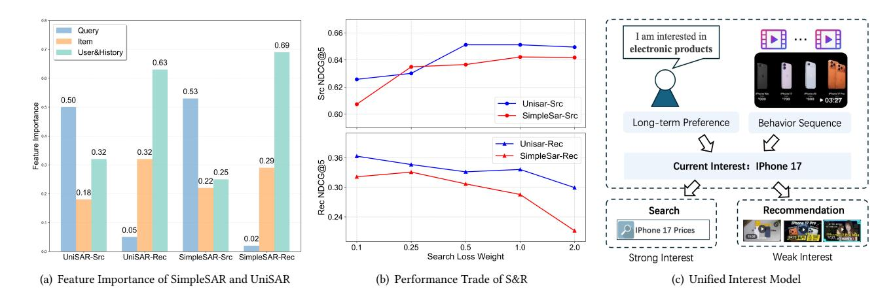
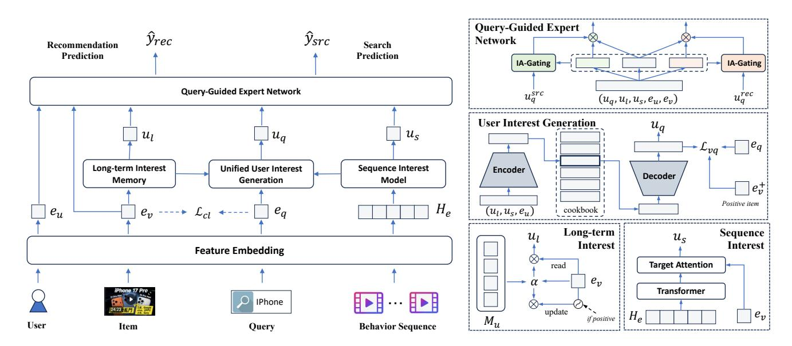
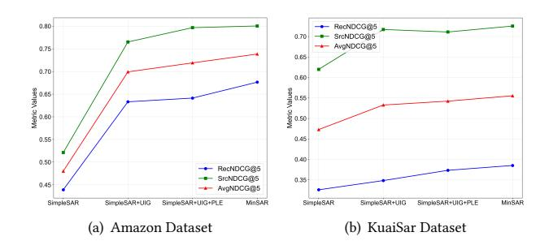
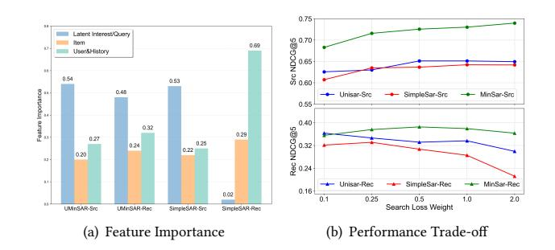
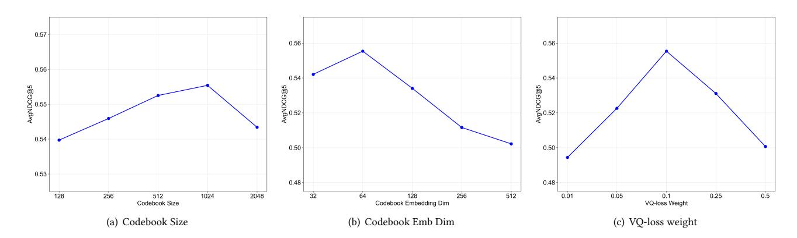

# Bridging Explicit and Implicit Intent: Unified Interest Generative Method for Joint Search-Recommendation Modeling

Dongliang Liao∗ liaodl@scut.edu.cn South China University of Technology Guangzhou, China

Chenxing Wang magnuswang@tencent.com Tencent Inc. Guangzhou, China

Yawen Zeng yawenzeng11@gmail.com South China University of Technology Guangzhou, China

# Abstract

Search and Recommendation (S&R) are core information access channels on modern multi-scenario platforms. Existing joint S&R models face two critical challenges: (1) cross-scenario interest inconsistency, failing to unify explicit search intent (queries) and implicit recommendation intent (behavioral interactions) into coherent user interest representations; (2) severe S&R trade-off, where enhancing one task degrades the other due to static knowledge sharing and unbalanced feature utilization. To address these issues, we propose MinSAR, , a novel framework focusing on cross-S&R user interest consistency. It integrates two key innovations: a Unified Interest Generation (UIG) module using Vector Quantized-Variational Autoencoder (VQ-VAE) to fuse long-term user preferences (via a userspecific memory network) and dynamic short-term contextual behaviors, generating compact cross-scenario latent representations that bridge explicit and implicit intents. Additionally, an Interest-Guided Attention Expert Network replaces static multi-task gating with intent-aware weight allocation. Guided by UIG's unified interest, it dynamically balances cross-S&R shared knowledge and task-specific expertise (semantic matching for search, collaborative filtering for recommendation), mitigating inter-task conflicts. Extensive experiments on two real-world datasets (KuaiSAR and Amazon Kindle Store) against 13 baselines show MinSAR outperforms state-of-the-art joint S&R models. Further analysis confirms its ability to eliminate the S&R performance trade-off.[1](#page-0-0)

# CCS Concepts

- Computing methodologies → Artificial intelligence.

# Keywords

Personalized Search, Sequential Recommendation, Joint Search-Recommendation Model

ACM Reference Format: Dongliang Liao, Chenxing Wang, and Yawen Zeng. 2026. Bridging Explicit and Implicit Intent: Unified Interest Generative Method for Joint Search-Recommendation Modeling. In Proceedings of the ACM Web Conference 2026 (WWW '26), April 13–17, 2026, Dubai, United Arab Emirates. ACM, New York, NY, USA, [11](#page-10-0) pages.<https://doi.org/10.1145/3774904.3792253>

© 2026 Copyright held by the owner/author(s). ACM ISBN 979-8-4007-2307-0/2026/04 <https://doi.org/10.1145/3774904.3792253>

# 1 Introduction

In modern e-commerce and content platforms, search and recommendation (S&R) have become two core information access channels that jointly satisfy user personalized needs. Users typically interact with products or content through both scenarios: they may browse recommended items to discover potential interests, or issue explicit queries to search for specific targets. For a long time, S&R were treated as independent research domains, with specialized models developed for each scenario. Recommendation systems leverage sequential behavior data to capture dynamic user interests[\[6,](#page-8-0) [8,](#page-8-1) [17\]](#page-8-2), while search engines prioritize query-item semantic matching[\[1,](#page-8-3) [3\]](#page-8-4). However, the isolation of these tasks limits their ability to fully exploit user behavior patterns, leading to challenges such as data sparsity and insufficient intent understanding. Recognizing this, recent studies have explored joint modeling of S&R, aiming to leverage cross-scenario information for mutual enhancement[\[13,](#page-8-5) [14,](#page-8-6) [22,](#page-8-7) [25\]](#page-8-8).

Existing joint S&R methods can be broadly categorized into two types. The first type simply combines scenario-specific models via joint loss functions, sharing partial parameters but ignoring intrinsic correlations between user behaviors across scenarios[\[22,](#page-8-7) [24,](#page-8-9) [25\]](#page-8-8). The second type treats recommendation as a special case of search with empty queries, overlooking the distinct behavioral patterns and intent expressions in the two scenarios[\[13,](#page-8-5) [23\]](#page-8-10). While these methods demonstrate certain improvements, they still suffer from two critical limitations: (1) They fail to fully capture the consistency of user underlying interests across S&R—search queries (explicit intent) and recommendation interactions (implicit intent) are two manifestations of the same interest, yet existing models lack effective mechanisms to unify these heterogeneous expressions. (2) They struggle with dynamic interest evolution and cross-scenario information imbalance, often leading to performance trade-offs where enhancing one task degrades the other[\[14\]](#page-8-6). Our preliminary analysis on public datasets confirms these issues. Specifically, we analyze SimpleSAR (the basic framework for joint search-recommendation training introduced in Section [4.1\)](#page-2-0) and the SOTA method UniSAR. Figure [1\(a\)](#page-1-0) presents the feature importance of query, item, and user personal feature in search and recommendation scenarios (based on SHAP analysis[\[11\]](#page-8-11)). It can be observed that the most impactful feature in each scenario (query for search, personal feature for recommendation) becomes the least important in the other scenario. This discrepancy leads to a trade-off in the joint training of the two tasks: as shown in Fig. [1\(b\),](#page-1-1) increasing the search loss weight in joint training continuously improves search metrics while simultaneously decreasing recommendation metrics.

In essence, search and recommendation are two complementary forms of user interest expression, sharing high relevance and

∗Corresponding author: Dongliang Liao

1 Source code is released on https://github.com/IRAgentLab/MinSAR.

[This work is licensed under a Creative Commons Attribution 4.0 International License.](https://creativecommons.org/licenses/by/4.0) WWW '26, Dubai, United Arab Emirates

Figure 1: Analysis of Search-Recommendation Trade-off and the Unified Interest Model. a) Feature importance of SimpleSAR and UniSAR, measuring by features' margin contribution. b) Performance variation through different search loss weight for joint modeling. c) A case diagram of Unified Interest Model.

consistency in interest evolution. To address the aforementioned gaps, we first propose a unified representation model of user current interest, which serves as the core cornerstone of our approach. This model posits that user interests are jointly shaped by two key dimensions: stable long-term preferences and context sequence influences, two fundamental paradigms widely adopted in recommendation systems. Building on this dual-dimensional foundation, we further clarify the relationship between S&R behaviors and user interests: user search behavior can be regarded as an explicit expression of latent interests, driven by clear and urgent needs; in contrast, user recommendation behavior constitutes an implicit expression of latent interests, reflecting exploratory or weak preference signals. Fig.1(c) illustrates this interest model with a concrete example: a user with a long-term preference for technology products, after encountering content about the iPhone 17 launch in the recommendation stream (contextual influence), will explicitly search for queries like "iPhone 17 new features" and "iPhone 17 reviews" (strong interest, explicit expression); simultaneously, before and after the launch event, the user will continuously browse related clips in the recommendation stream (weak interest, implicit expression). Both behaviors originate from the same core interest in the iPhone 17, differing only in expression intensity and form.

This intrinsic consistency suggests that unifying S&R modeling around user interest rather than task differences can fundamentally address the limitations of existing methods. To this end, we propose a Unified Multi-granular Interest Search and Recommendation (MinSAR) framework, which aims to model the consistency of user interests across S&R and achieve mutual enhancement of both tasks. Addressing this goal requires overcoming three key challenges:

- Challenge 1: Unification of heterogeneous interest expressions. How to bridge the gap between explicit query-based search intent and implicit behavior-based recommendation intent, modeling them as consistent manifestations of user current interest to eliminate task-specific biases.
- Challenge 2: Accurate modeling of multi-granular dynamic interests. Based on the proposed unified interest representation

model, how to effectively fuse stable long-term preferences and context-sensitive immediate needs to generate a cross-scenario unified interest representation that balances stability (from longterm preferences) and dynamism (from contextual influences).

- Challenge 3: Robust utilization of unified interests for dualtask enhancement. How to leverage the unified interest representation to guide S&R task modeling, mitigating issues such as query weight dilution and data imbalance, while avoiding performance trade-offs between tasks.

To tackle these challenges, MinSAR integrates two core innovations: (1) A multi-granular interest fusion module that models long-term preferences and contextual interests separately, then uses Vector Quantization Variational Autoencoder (VQ-VAE)[\[20\]](#page-8-12) to generate a compact, unified interest representation—this captures both cross-scenario commonalities and scenario-specific characteristics via shared and task-specific codebooks. (2) An interest-guided attention expert network that uses the unified interest representation to dynamically adjust attention weights between search and recommendation expert networks, ensuring that task-specific information needs are met while leveraging cross-scenario interest consistency. Experimental results on three public datasets demonstrate that Min-SAR consistently outperforms state-of-the-art joint S&R models in both scenarios—achieving. Further analysis confirms that MinSAR maintains robust performance under conditions of data sparsity and imbalance.

Our contributions are summarized as follows:

- We propose a novel unified representation model of user current interest, which formalizes S&R behaviors as explicit and implicit expressions of the same latent interest, and decomposes interest formation into long-term preference and contextual influence dimensions—filling the gap of ignoring interest consistency in existing joint S&R modeling.
- We design the MinSAR framework with two core modules: a multi-granular interest fusion module based on RQ-VAE that generates cross-scenario unified interest representations, and

an interest-guided attention expert network that adapts to taskspecific needs—effectively addressing the challenges of heterogeneous interest unification and dual-task enhancement.

- Comprehensive experiments verify our MinSAR outperforms baselines in both search and recommendation scenarios.

### 2 Related Work

# 2.1 Single-Scenario Modeling

Sequential Recommendation. Recommendation systems focus on mining historical interaction patterns to predict user preferences, with sequential modeling as a core direction. Early Collaborative Filtering [\[7\]](#page-8-13) relies on user-item similarity but fails to capture dynamic interest evolution. Deep learning advancements have led to models like GRU4Rec [\[6\]](#page-8-0), which models session-level sequential dependencies, and transformer-based approaches such as SASRec [\[8\]](#page-8-1), which uses multi-head self-attention to emphasize key historical behaviors. BERT4Rec [\[17\]](#page-8-2) further introduces bidirectional encoding to enhance context-aware preference capture. Intent-aware extensions include DIN [\[28\]](#page-8-14), which designs a local activation unit to adaptively weight historical behaviors based on target items, and KA-MemNN [\[30\]](#page-8-15), which uses item categories as intent proxies with memory networks. However, these methods solely rely on implicit recommendation behaviors, lacking calibration from explicit intent signals (e.g., search queries), leading to ambiguous inference under sparse behavior data [\[22,](#page-8-7) [26\]](#page-8-16).

Personalized Search. Personalized search integrates user preferences into query-item semantic matching to improve retrieval accuracy. Early models like QEM only consider query-item similarity, while HEM [\[2\]](#page-8-17) introduces user embeddings for hierarchical long-term preference modeling. AEM and ZAM [\[1\]](#page-8-3) use attention to aggregate historical items based on current queries and add a zero vector to control personalization degree, respectively. Recent transformer-based models such as TEM [\[3\]](#page-8-4) replace attention layers with transformers to capture sequential dependencies in search history. Category-aware methods like CAMI [\[9\]](#page-8-18) leverage knowledge graph embedding to disentangle multi-dimensional interests, and GraphSRRL [\[10\]](#page-8-19) exploits structural patterns in user-queryitem graphs. Despite advancements, these models ignore long-term preference signals from recommendation behaviors, limiting performance in sparse search scenarios [\[13,](#page-8-5) [14\]](#page-8-6).

# 2.2 Cross-Scenario Modeling

Search-Enhanced Recommendation. This line of work leverages explicit search signals. NRHUB [\[21\]](#page-8-20) uses a hierarchical attention encoder to learn unified user representations from heterogeneous behaviors. Query-SeqRec [\[5\]](#page-8-21) constructs query-aware heterogeneous sequences for next-interaction prediction. IV4Rec [\[15\]](#page-8-22) adopts a causal learning, treating search queries as instrumental variables to decompose embeddings and mitigate biases. SESRec [\[16\]](#page-8-23) employs contrastive learning to disentangle similar and dissimilar representations between search and recommendation. However, these methods only enable one-way information transfer from search to recommendation, failing to improve search performance [\[13,](#page-8-5) [26\]](#page-8-16).

Unified S&R Modeling. Unified modeling aims for mutual enhancement between S&R. Early works like JSR [\[24,](#page-8-9) [25\]](#page-8-8) train separate MLP-based models with a joint loss function, sharing item embeddings but ignoring cross-scenario behavioral correlations. JSR-Seq [\[22\]](#page-8-7) extends JSR with sequential encoders but retains separate parameters, limiting information sharing. Graph-based methods such as SRJGraph [\[27\]](#page-8-24) construct a unified user-item graph, incorporating search queries and empty padding queries (for recommendation) as edge attributes. USER [\[23\]](#page-8-10) mixes S&R behaviors into a single chronological sequence and uses a hierarchical transformer for encoding. UniSAR [\[13\]](#page-8-5) explicitly models four user transition types (s2s, r2r, r2s, s2r) via masked transformers, contrastive alignment, and cross-attention fusion. Recent generative approaches like GenSAR [\[14\]](#page-8-6) propose joint S&R identifiers via shared-specific codebooks (based on RQ-VAE) to balance semantic information (for search) and collaborative signals (for recommendation), alongside task-specific training to address information requirement differences. Despite progress, existing unified models either treat recommendation as an empty-query search case [\[23,](#page-8-10) [27\]](#page-8-24) or lack effective multi-granular interest unification, leading to performance tradeoffs under data imbalance [\[14,](#page-8-6) [26\]](#page-8-16).

# 3 Problem Definition

We formally define the joint search and recommendation (S&R) modeling task with core notations and objectives, aligned with unified S&R scenario settings [\[13,](#page-8-5) [14,](#page-8-6) [22,](#page-8-7) [26\]](#page-8-16).

Let U, V, and Q denote the sets of users, items, and search queries, respectively, where�� ∈ U,�� ∈ V, and �� ∈ Q. For each user ��, ���� = [(��1, ��1), (��2, ��2), ..., (���� , ���� )] represents the chronological interaction history sorted by timestep ��, where ���� denotes the ��-th behavior: ���� = (���� , ���� ) for search scenario (query-item interaction) and ���� = ���� for recommendation scenario (item interaction without explicit query).

The objective of the unified model is to learn a parameterized function ��Θ that predicts personalized item ranking scores for both scenarios. For the recommendation scenario, the model outputs the interaction likelihood of item �� for user �� as ��ˆ ��,�� = ��Θ (�� | ��, ����). For the search scenario, given an explicit query ��, the predicted interaction likelihood of item �� is ��ˆ ��,��,�� = ��Θ (�� | ��, ��, ����). The core goal is to optimize parameters Θ such that the generated item rankings maximize user interaction probability.

# 4 Methodology

In this section, we propose Unified Multi-granular Interest Search and Recommendation (MinSAR) framework, which builds on a representative backbone (dubbed SimpleSAR) and introduces two key optimizations: Cross-scenario Unified Interest Generate and Interestguided Attention Expert Network. The framework of MinSAR is shown in Fig [2.](#page-3-0) In this section, we first elaborate on the backbone structure, then detail our proposed optimization modules.

# 4.1 Backbone Structure: SimpleSAR

We first introduce the backbone structure, SimpleSAR, a widely adopted framework for joint search and recommendation (S&R) modeling. It consists of three core components: Input & Embedding Layer, Unified Behavior Encoder, and Multi-task Prediction Layer, as detailed below.

4.1.1 Input & Embedding Layer. This layer converts raw input features into low-dimensional dense embeddings.

Table 1: Statistics of the datasets.

measure expert relevance:

���� = exp ���������� ·����e�� (��)/�� Í �� exp ���������� ·����e�� (��)/�� 

where ���� ∈ R ��×�� is a learnable projection matrix, �� is a temperature hyperparameter controlling attention sharpness, and ���� ∈ [0, 1] is the weight for expert ��.

4.3.3 Task Output Integration. The final task-specific representation is a weighted sum of expert outputs, which is fed into a lightweight task tower (2-layer MLP) for click probability prediction:

���������� = ∑︁ �� ���� e�� (��) ��ˆ�������� = ��(MLP�������� (���������� ))

where ���������� ∈ R �� is the integrated expert representation, and ��(·) is the sigmoid activation function.

This design enables adaptive knowledge utilization: when the user's intent is ambiguous (e.g., exploratory recommendation), the model assigns higher weights to shared experts to leverage general patterns; when intent is explicit (e.g., precise search for "iPhone 17"), it prioritizes task-specific experts for fine-grained semantic modeling. This balances cross-scenario information sharing and task adaptation, addressing the limitations of static MTL frameworks.

#### 5 Experimental Evaluation

#### 5.1 Experimental Setup

5.1.1 Datasets. We evaluate MinSAR on two public cross-scenario datasets, covering both real-world content platforms and e-commerce scenarios, to verify its adaptability. Detailed statistics of the datasets are summarized in Table [1.](#page-5-0)

KuaiSAR: A real-world dataset collected from Kuaishou, a popular short-video platform in China. It contains authentic user S&R behaviors, including explicit search queries and implicit recommendation clicks. We follow the preprocessing protocol in [\[13,](#page-8-5) [16,](#page-8-23) [18\]](#page-8-27): filter users/items with fewer than 5 interactions, and split the data into training (first 7 days), validation (1 day), and test (last 2 days) sets.

Amazon Kindle Store: A widely used semi-synthetic crossscenario dataset derived from the Amazon review dataset. The search behaviors is generated by extracting keywords from product metadata and user reviews [\[1,](#page-8-3) [2,](#page-8-17) [13,](#page-8-5) [16,](#page-8-23) [24\]](#page-8-9), and split the data using a leave-one-out strategy: the most recent interaction for testing, the second most recent for validation, and the rest for training.

5.1.2 Baseline Methods. We compare MinSAR with 13 representative baseline methods, categorized into three groups to highlight its advantages in joint S&R modeling:

Sequential Recommendation Models: These methods only leverage recommendation behavior data and do not utilize search signals:(1) DIN: Uses a local activation unit to adaptively model user interests [\[28\]](#page-8-14). (2) GRU4Rec: Applies Gated Recurrent Units (GRUs) to model session-based sequential dependencies [\[6\]](#page-8-0). (3) SASRec: Adopts Transformer for sequential recommendation [\[8\]](#page-8-1). (4) BERT4Rec: Uses bidirectional Transformer with a cloze objective for sequential modeling [\[17\]](#page-8-2). (5) FMLP-Rec: An all-MLP architecture with frequency-domain filters for sequential recommendation [\[29\]](#page-8-28).

Personalized Search Models: These methods focus on search task optimization and do not incorporate recommendation data: (1) QEM: A query-item matching model that only considers semantic relevance [\[1\]](#page-8-3). (2) HEM: A hierarchical embedding model for personalized product search [\[2\]](#page-8-17). (3) AEM: Uses attention to aggregate user historical behaviors for search [\[1\]](#page-8-3). (4) ZAM: Enhances AEM with a zero vector to control personalization degree [\[1\]](#page-8-3). (5) TEM: Replaces the attention layer in AEM with a Transformer encoder [\[3\]](#page-8-4). (6) CoPPS: Applies contrastive learning to optimize user sequence representation for search [\[4\]](#page-8-29).

Joint S&R Models: These methods jointly model S&R behaviors to enhance both tasks: (1) JSR: Optimizes search and recommendation models with a joint loss function [\[25\]](#page-8-8). (2) USER: Integrates S&R behaviors into a single sequence and encodes it with a Transformer [\[23\]](#page-8-10). (3) UnifiedSSR: Proposes a dual-branch network for crossscenario and cross-view modeling [\[22\]](#page-8-7). (4) UniSAR: Effectively models the different types of fine grained behavior transitions for providing users a unified search and recommendation service. [\[13\]](#page-8-5). (5) SimpleSAR: Backbone structure of joint search and recommendation modeling (described in section [4.1\)](#page-2-0).

5.1.3 Evaluation Metrics. Following standard practices [\[13,](#page-8-5) [18\]](#page-8-27), we adopt two widely used ranking metrics to evaluate model performance: HR@K: Hit Ratio@K Measures whether the ground-truth item is present in the top-K ranked list, reflecting the model's recall capability. NDCG@K: Normalized Discounted Cumulative Gain@K evaluates both the presence and ranking position of the ground-truth item, assigning higher weights to hits at top ranks, thus reflecting the model's ranking quality.

#### 5.2 Experimental Details

5.2.1 Implementation and Environment. All models are implemented using PyTorch 2.0, with CUDA 11.7 for acceleration. Experiments are conducted on a single NVIDIA 3090 GPU with 24GB memory.

5.2.2 Hyperparameter Settings. Key hyperparameters are tuned on the validation set per dataset, with configurations tailored to data characteristics (partial critical ones are analyzed at A). For architecture: Transformer encoder uses 1 layer with 2 heads for Amazon dataset and 2 layers with 2 heads for KuaiSAR; the experts shares two layers with 200 and 80 hidden units; user memory network has 10 for Amazon and 5 for KuaiSAR slots; the hidden dim is 64 in VQ-VAE codebook and the codebook size is 1024 for both. For training, we use Adam optimizer, setting lr as 0.001, using lr decay with decay factor 0.5 (min lr is 1e-05); batch size is set as 256 for Amazon and 1024 for KuaiSAR; we use dropout 0.1, L2 3e-05 and early stop with patience = 5. For loss: we set rec task weights as 1.0 and search task weights is set as 0.25; VQ-VAE loss weights are set as 0.1; query-item contrast weights are set as 0.1 for Amazon, and 0.01 for KuaiSAR.

Table 2: Performance comparison of recommendation.

| Datasets Metric | DIN    | GRU4Rec | Sequential SASRec | Recommendation BERT4Rec | FMLP-Rec | JSR    | USER   | Joint Search UnifiedSSR | & UniSAR | Recommendation SimpleSAR | MinSAR |
|-----------------|--------|---------|-------------------|-------------------------|----------|--------|--------|-------------------------|----------|--------------------------|--------|
| HR@1            | 0.1629 | 0.1097  | 0.1249            | 0.1061                  | 0.1370   | 0.1754 | 0.1489 | 0.1225                  | 0.1990   | 0.1728                   | 0.2104 |
| HR@5            | 0.4509 | 0.3764  | 0.4065            | 0.3699                  | 0.4292   | 0.4791 | 0.4086 | 0.3981                  | 0.5169   | 0.4707                   | 0.5287 |
| HR@10 KuaiSAR   | 0.6179 | 0.5788  | 0.6007            | 0.5885                  | 0.6159   | 0.6453 | 0.5627 | 0.5939                  | 0.6792   | 0.6362                   | 0.6761 |
| NDCG@5          | 0.3104 | 0.2435  | 0.2671            | 0.2381                  | 0.2851   | 0.3315 | 0.2820 | 0.2617                  | 0.3632   | 0.3257                   | 0.3851 |
| NDCG@10         | 0.3643 | 0.3087  | 0.3298            | 0.3083                  | 0.3453   | 0.3853 | 0.3318 | 0.3249                  | 0.4158   | 0.3792                   | 0.4167 |
| HR@1            | 0.2159 | 0.1725  | 0.2059            | 0.2481                  | 0.1991   | 0.2346 | 0.2361 | 0.2013                  | 0.3010   | 0.2897                   | 0.5299 |
| HR@5            | 0.5170 | 0.4949  | 0.5295            | 0.5311                  | 0.5356   | 0.5467 | 0.5441 | 0.5196                  | 0.5874   | 0.5750                   | 0.8020 |
| HR@10 Amazon    | 0.6525 | 0.6548  | 0.6772            | 0.6658                  | 0.6879   | 0.6779 | 0.6854 | 0.6707                  | 0.7020   | 0.6952                   | 0.8794 |
| NDCG@5          | 0.3726 | 0.3388  | 0.3747            | 0.3954                  | 0.3739   | 0.3970 | 0.3964 | 0.3662                  | 0.4513   | 0.4389                   | 0.6763 |
| NDCG@10         | 0.4165 | 0.3907  | 0.4225            | 0.4390                  | 0.4232   | 0.4396 | 0.4422 | 0.4151                  | 0.4885   | 0.4779                   | 0.7015 |

Table 3: Performance comparison of search.

| Datasets Metric | QEM    | HEM    | Personalized AEM | ZAM    | Search TEM | CoPPS  | JSR    | USER   | Joint Search UnifiedSSR | & UniSAR | Recommendation SimpleSAR | MinSAR |
|-----------------|--------|--------|------------------|--------|------------|--------|--------|--------|-------------------------|----------|--------------------------|--------|
| HR@1            | 0.2944 | 0.3337 | 0.2703           | 0.2815 | 0.3045     | 0.3117 | 0.4543 | 0.4628 | 0.4389                  | 0.5282   | 0.4575                   | 0.5905 |
| HR@5            | 0.6020 | 0.6505 | 0.5956           | 0.6117 | 0.6502     | 0.6616 | 0.7162 | 0.7304 | 0.7377                  | 0.7476   | 0.7413                   | 0.8402 |
| HR@10 KuaiSAR   | 0.7182 | 0.7653 | 0.7182           | 0.7344 | 0.7632     | 0.7707 | 0.7961 | 0.8149 | 0.8320                  | 0.8369   | 0.8278                   | 0.9068 |
| NDCG@5          | 0.4575 | 0.5029 | 0.4415           | 0.4560 | 0.4887     | 0.4977 | 0.5962 | 0.6069 | 0.5991                  | 0.6417   | 0.6198                   | 0.7256 |
| NDCG@10         | 0.4953 | 0.5400 | 0.4812           | 0.4959 | 0.5254     | 0.5331 | 0.6221 | 0.6342 | 0.6297                  | 0.6708   | 0.6479                   | 0.7473 |
| HR@1            | 0.2772 | 0.2497 | 0.2916           | 0.2954 | 0.4090     | 0.4052 | 0.3176 | 0.4123 | 0.3663                  | 0.5343   | 0.3597                   | 0.6763 |
| HR@5            | 0.7100 | 0.6778 | 0.7095           | 0.7109 | 0.8185     | 0.8169 | 0.7038 | 0.7631 | 0.7744                  | 0.8190   | 0.6671                   | 0.9016 |
| HR@10 Amazon    | 0.8186 | 0.8267 | 0.8443           | 0.8468 | 0.9051     | 0.9051 | 0.8225 | 0.8697 | 0.8812                  | 0.8977   | 0.7889                   | 0.9508 |
| NDCG@5          | 0.5066 | 0.4736 | 0.5114           | 0.5147 | 0.6303     | 0.6281 | 0.5173 | 0.6000 | 0.5847                  | 0.6875   | 0.5211                   | 0.8003 |
| NDCG@10         | 0.5422 | 0.5221 | 0.5554           | 0.5590 | 0.6587     | 0.6570 | 0.5563 | 0.6348 | 0.6196                  | 0.7132   | 0.5606                   | 0.8163 |

### 5.3 Overall Comparison

This section analyzes MinSAR's performance against baselines across scenarios and datasets, verifying its superiority (RQ1).

As shown in Tables [2](#page-6-0) and [3,](#page-6-1) MinSAR achieves SOTA in both scenarios on both datasets. In recommendation tasks, MinSAR outperforms the second-best UniSAR by 5.7% (HR@1) and 5.8% (NDCG@5) on KuaiSAR, with gaps expanding to 76.0% (HR@1) and 50.0% (NDCG@5) on Amazon. This confirms its unified interest generation module effectively integrates search signals for implicit preference modeling. In search tasks, gains are more pronounced: MinSAR surpasses UniSAR by 11.8% (HR@1) and 13.1% (NDCG@5) on KuaiSAR, and 26.6% (HR@1) and 16.4% (NDCG@5) on Amazon. The larger improvements stem from its interest-guided expert network, which fuses user preferences with query semantics—addressing limitations of both traditional search models and simpler joint models like SimpleSAR.

Notably, MinSAR performs better on Amazon than KuaiSAR, driven by data characteristics and model design: (1) Sparsity impac: Amazon (dense e-book interactions) enables the memory network to accumulate precise long-term preferences, while KuaiSAR's sparse short-video interactions limit this advantage—explaining Amazon's 76.0% HR@1 gain vs. KuaiSAR's 15.8%. (2) Query coherence: Amazon's category-concentrated queries (e.g., "mystery novels") align with VQ-VAE's coherent intent modeling, while KuaiSAR's fragmented queries reduce this effect—resulting in Amazon's 16.4% NDCG@5 gain vs. KuaiSAR's 13.1%.

### 5.4 Ablation Study

To quantify the contribution of each core component in MinSAR(RQ2.), we design a series of ablation experiments based on the baseline model SimpleSAR. We gradually integrate key modules to analyze their individual and synergistic effects on performance. The experimental variants are defined as follows: SimpleSAR+UIG: SimpleSAR integrated with the Unified User Interest Generation (UIG) Model. SimpleSAR+UIG+PLE: SimpleSAR+UIG with the PLE framework replacing the share-bottom backbone. Simple-SAR+UIG+QGE: Our full model (MinSAR), where PLE's static gating is replaced with the Query-Guided Expert (QGE) Network. We evaluate all variants using NDCG@5 for both recommendation (Rec) and search (Src) scenarios, and compute the average NDCG@5 (Avg) to measure overall performance. Results on the KuaiSAR and Amazon datasets are visualized in Fig [3.](#page-7-0) [3\(b\)](#page-7-1) and [3\(a\),](#page-7-2) respectively.

The integration of the UIG module (SimpleSAR→SimpleSAR+UIG) yields significant performance improvements across both datasets, validating its effectiveness in unifying cross-scenario interest signals: On KuaiSAR dataset, the UIG module increases AvgNDCG@5 rising by 12.7%. On Amazon dataset, the UIG module drives more dramatic gains, pushing AvgNDCG@5 up by 45.6% (from 0.48 to 0.699). This is because we implement VQ-VAE to normalize and fuse fragmented cross-scenario behaviors into coherent interest representations, which bridges the gap between scenario-specific features and aligns with user intent modeling needs. Notably, the UIG module brings larger relative improvements in the search scenario than in the recommendation scenario. This is because search relies heavily on explicit intent matching. UIG's unified interest representations bridge the gap between user historical preferences and

Figure 3: Ablation Study of MinSAR.

Table 4: UIG Abation Analysis on Amazon

current query semantics, addressing the limitation of SimpleSAR's independent modeling of scenario-specific features.

To further dissect the UIG module's internal mechanisms, we conduct ablations on its key components: long-term memory (w/o mem), sequential behavior encoding (w/o seq), item-side interest alignment (w/o Item Align), and query-side interest alignment (w/o Query Align). Results in Table [4](#page-7-3) reveal component-wise impacts on Amazon datasets' performance. We can obverse that all the components benefit model's capability. Among these, removing the long-term memory module (UIG-w/o mem) causes the most severe performance degradation. This stark decline highlights longterm preferences critical role in joint S&R are inherently cumulative.

Comparing SimpleSAR+UIG with variants incorporating expert networks (PLE/QGE) reveals the value of adaptive knowledge utilization. SimpleSAR+UIG+PLE performs better than SimpleSAR+UIG, and SimpleSAR+UIG+QGE achieves the best metrics on both datasets. This indicates that PLE's static layered expert design enhances task-specific adaptation but fails to dynamically balance shared/task knowledge, resulting in limited and uneven gains. The superiority of QGE stems from its intent-aware attention gating: unlike PLE's fixed expert weighting, QGE uses UIGgenerated unified interest signals to dynamically allocate weights to shared/task-specific experts, aligning knowledge utilization with real-time user intent.

### 5.5 Further Analysis

To validate the adaptability of MinSAR, we conduct robustness analysis from two aspects: query feature importance and searchrecommendation trade-off, as outlined in the Introduction.

For query feature importance analysis, we draw on the SHAP method. By analyzing the marginal contribution of each feature to the final metric (NDCG@5), we perform feature importance

Figure 4: Further Study of S&R trade off.

analysis on the test sets of the search and recommendation scenarios of the KuaiSAR data, shown in Fig [4\(a\).](#page-7-4) It can be seen that MinSAR can maintain the importance of Query features in joint S&R modeling, which is conducive to improving the relevance of search tasks. Meanwhile, the feature weight distribution in search and recommendation scenarios is relatively stable. In contrast, for the SimpleSAR, the feature weight differences between search and recommendation scenarios are too large, resulting in a serious trade-off in the performance of the two tasks. This stable feature weight distribution across scenarios enables MinSAR to balance the needs of both search and recommendation tasks, avoiding the performance imbalance caused by excessive reliance on certain features in specific scenarios.

To further investigate the search-recommendation trade-off, we analyze the impact of varying the search loss weight on performance across the KuaiSAR dataset. The metrics for different models under different search loss weight values are presented in Fig [4\(b\).](#page-7-5) MinSAR demonstrates better stability in metrics for both search and recommendation scenarios when the search loss weight changes. Specifically, as the search loss weight increases from 0.1 to 0.5, the performance of both the search and recommendation tasks exhibits a consistent upward trend. The reason lies in our unified interest model, which makes the feature importance in the search and recommendation scenarios relatively consistent, and there is no longer an obvious conflict between the two tasks. This stable performance across tasks validates that the unified interest modeling mechanism effectively alleviates the inherent trade-off in joint search and recommendation tasks.

#### 6 Conclusions

This work addresses cross-scenario interest inconsistency and S&R performance trade-off by proposing MinSAR. MinSAR's UIG module unifies explicit and implicit intent via VQ-VAE and memory network, while its interest-guided expert network enables adaptive knowledge utilization. Experiments on two datasets validate MinSAR's superiority over state-of-the-art models, confirming its ability to enhance both S&R tasks.

# 7 Acknowledgments

This work is supported in part by the Tencent WeChat Research Program and the Fundamental Research Funds (K5252350) for the South China University of Technology.

#### References

[1] Qingyao Ai, Daniel N. Hill, S. V. N. Vishwanathan, and W. Bruce Croft. 2019. A zero attention model for personalized product search. In Proceedings of the 28th ACM International Conference on Information and Knowledge Management (CIKM '19). ACM, 379–388. [2] Qingyao Ai, Yongfeng Zhang, Keping Bi, Xu Chen, and W. Bruce Croft. 2017. Learning a hierarchical embedding model for personalized product search. In Proceedings of the 40th International ACM SIGIR Conference on Research and Development in Information Retrieval (SIGIR '17). ACM, 645–654. [3] Keping Bi, Qingyao Ai, and W. Bruce Croft. 2020. A transformer-based embedding model for personalized product search. In Proceedings of the 43rd International ACM SIGIR Conference on Research and Development in Information Retrieval (SIGIR '20). ACM, 1521–1524. [4] Shitong Dai, Jiongnan Liu, Zhicheng Dou, Haonan Wang, Lin Liu, Bo Long, and Ji-Rong Wen. 2023. Contrastive learning for user sequence representation in personalized product search. In Proceedings of the 29th ACM SIGKDD Conference on Knowledge Discovery and Data Mining. 380–389. [5] Zhankui He, Handong Zhao, Zhaowen Wang, Zhe Lin, Ajinkya Kale, and Julian McAuley. 2022. Query-Aware Sequential Recommendation. In Proceedings of the 31st ACM International Conference on Information & Knowledge Management (CIKM '22). ACM, 4019–4023. [6] Balázs Hidasi, Alexandros Karatzoglou, Linas Baltrunas, and Domonkos Tikk. 2016. Session-based Recommendations with Recurrent Neural Networks. In 4th International Conference on Learning Representations (ICLR '16). [7] Yifan Hu, Yehuda Koren, and Chris Volinsky. 2008. Collaborative filtering for implicit feedback datasets. In 2008 Eighth IEEE International Conference on Data Mining. IEEE, 263–272. [8] Wang-Cheng Kang and Julian J. McAuley. 2018. Self-attentive sequential recommendation. In 2018 IEEE International Conference on Data Mining (ICDM). IEEE, 197–206. [9] Jiongnan Liu, Zhicheng Dou, Qiannan Zhu, and Ji-Rong Wen. 2022. A categoryaware multi-interest model for personalized product search. In Proceedings of the ACM Web Conference 2022 (WWW '22). ACM, 360–368. [10] Shang Liu, Wanli Gu, Gao Cong, and Fuzheng Zhang. 2020. Structural relationship representation learning with graph embedding for personalized product search. In Proceedings of the 29th ACM International Conference on Information & Knowledge Management (CIKM '20). ACM, 915–924. [11] Scott M Lundberg and Su-In Lee. 2017. A unified approach to interpreting model predictions. Advances in neural information processing systems 30 (2017). [12] Jiaqi Ma, Zhe Zhao, Xinyang Yi, Jilin Chen, Lichan Hong, and Ed H Chi. 2018. Modeling task relationships in multi-task learning with multi-gate mixture-ofexperts. In Proceedings of the 24th ACM SIGKDD international conference on knowledge discovery & data mining. 1930–1939. [13] Teng Shi, Zihua Si, Jun Xu, Xiao Zhang, Xiaoxue Zang, Kai Zheng, Dewei Leng, Yanan Niu, and Yang Song. 2024. UniSAR: Modeling User Transition Behaviors between Search and Recommendation. arXiv preprint arXiv:2404.09520 (2024). arXiv:2404.09520v1 [cs.IR]. [14] Teng Shi, Jun Xu, Xiao Zhang, Xiaoxue Zang, Kai Zheng, Yang Song, and Enyun Yu. 2025. GenSAR: Unifying Balanced Search and Recommendation with Generative Retrieval. In Proceedings of the Nineteenth ACM Conference on Recommender Systems (RecSys '25) (Prague, Czech Republic). ACM. [doi:10.1145/3705328.3748071](https://doi.org/10.1145/3705328.3748071) [15] Zihua Si, Xueran Han, Xiao Zhang, Jun Xu, Yue Yin, Yang Song, and Ji-Rong Wen. 2022. A Model-Agnostic Causal Learning Framework for Recommendation Using Search Data. In Proceedings of the ACM Web Conference 2022 (WWW '22). ACM, 224–233. [16] Zihua Si, Zhongxiang Sun, Xiao Zhang, Jun Xu, Xiaoxue Zang, Yang Song, Kun Gai, and Ji-Rong Wen. 2023. When Search Meets Recommendation: Learning Disentangled Search Representation for Recommendation. In Proceedings of the 46th International ACM SIGIR Conference on Research and Development in Information Retrieval (SIGIR '23). ACM, 1313–1323. [17] Fei Sun, Jun Liu, Jian Wu, Changhua Pei, Xiao Lin, Wenwu Ou, and Peng Jiang. 2019. BERT4Rec: Sequential Recommendation with Bidirectional Encoder Representations from Transformer. In Proceedings of the 28th ACM International Conference on Information and Knowledge Management (CIKM '19). ACM, 1441– 1450. [18] Zhongxiang Sun, Zihua Si, Xiaoxue Zang, Dewei Leng, Yanan Niu, Yang Song, Xiao Zhang, and Jun Xu. 2023. KuaiSar: A unified search and recommendation dataset. In Proceedings of the 32nd ACM international conference on information and knowledge management. 5407–5411. [19] Hongyan Tang, Junning Liu, Ming Zhao, and Xudong Gong. 2020. Progressive layered extraction (ple): A novel multi-task learning (mtl) model for personalized recommendations. In Proceedings of the 14th ACM conference on recommender systems. 269–278. [20] Aaron Van Den Oord, Oriol Vinyals, et al. 2017. Neural discrete representation learning. Advances in neural information processing systems 30 (2017). [21] Chuhan Wu, Fangzhao Wu, Mingxiao An, Tao Qi, Jianqiang Huang, Yongfeng Huang, and Xing Xie. 2019. Neural news recommendation with heterogeneous user behavior. In Proceedings of the 2019 Conference on Empirical Methods in Natural Language Processing and the 9th International Joint Conference on Natural Language Processing (EMNLP-IJCNLP). Association for Computational Linguistics, 4873–4882. [22] Jiayi Xie, Shang Liu, Gao Cong, and Zhenzhong Chen. 2023. UnifiedSSR: A Unified Framework of Sequential Search and Recommendation. arXiv preprint arXiv:2310.13921 (2023). arXiv:2310.13921v1 [cs.IR]. [23] Jing Yao, Zhicheng Dou, Ruobing Xie, Yanxiong Lu, Zhiping Wang, and Ji-Rong Wen. 2021. USER: A Unified Information Search and Recommendation Model Based on Integrated Behavior Sequence. In Proceedings of the 30th ACM International Conference on Information & Knowledge Management (CIKM '21). ACM, 2373–2382. [24] Hamed Zamani and W. Bruce Croft. 2018. Joint Modeling and Optimization of Search and Recommendation. In Proceedings of the 1st Biennial Conference on Design of Experimental Search & Information Retrieval Systems (DESIRES '18). CEUR-WS.org, 36–41. [25] Hamed Zamani and W. Bruce Croft. 2020. Learning a Joint Search and Recommendation Model from User-Item Interactions. In Proceedings of the 13th International Conference on Web Search and Data Mining (WSDM '20). ACM, 717–725. [26] Yuting Zhang, Yiqing Wu, Ruidong Han, Ying Sun, Yongchun Zhu, Xiang Li, Wei Lin, Fuzhen Zhuang, Zhulin An, and Yongjun Xu. 2024. Unified Dual-Intent Translation for Joint Modeling of Search and Recommendation. arXiv preprint arXiv:2407.00912 (2024). arXiv:2407.00912v1 [cs.IR]. [27] Kai Zhao, Yukun Zheng, Tao Zhuang, Xiang Li, and Xiaoyi Zeng. 2022. Joint Learning of E-Commerce Search and Recommendation with a Unified Graph Neural Network. In Proceedings of the 15th ACM International Conference on Web Search and Data Mining (WSDM '22). ACM, 1461–1469. [28] Guorui Zhou, Xiaoqiang Zhu, Chenru Song, Ying Fan, Han Zhu, Xiao Ma, Yanghui Yan, Junqi Jin, Han Li, and Kun Gai. 2018. Deep Interest Network for Click-Through Rate Prediction. In Proceedings of the 24th ACM SIGKDD International Conference on Knowledge Discovery & Data Mining (KDD '18). ACM, 1059–1068. [29] Kun Zhou, Hui Yu, Wayne Xin Zhao, and Ji-Rong Wen. 2022. Filter-enhanced MLP is all you need for sequential recommendation. In Proceedings of the ACM web conference 2022. 2388–2399. [30] Nengjun Zhu, Jian Cao, Yanchi Liu, Yang Yang, Haochao Ying, and Hui Xiong. 2020. Sequential modeling of hierarchical user intention and preference for next-item recommendation. In Proceedings of the 13th International Conference on Web Search and Data Mining (WSDM '20). ACM, 807–815.

### 8 Appendix

### 8.1 Comparison of User Interest Generation Methods

Table 5: Experimental Results of Different UIG Variants

| Model                | RecHit@1 | SrcHit@1 | AvgHit@1 | RecNDCG@5 | SrcNDCG@5 | AvgNDCG@5 |
|----------------------|----------|----------|----------|-----------|-----------|-----------|
| w/o UIG              | 0.1891   | 0.5001   | 0.3446   | 0.3414    | 0.6385    | 0.4899    |
| UIG-AE               | 0.1848   | 0.5043   | 0.3445   | 0.3469    | 0.6366    | 0.4917    |
| UIG-VAE              | 0.1945   | 0.5002   | 0.3473   | 0.3551    | 0.6257    | 0.4904    |
| UIG-RQVAE-cn1-cs1024 | 0.2191   | 0.5887   | 0.4039   | 0.3838    | 0.7232    | 0.5535    |
| UIG-RQVAE-cn2-512    | 0.2102   | 0.5829   | 0.3965   | 0.3688    | 0.7118    | 0.5403    |
| UIG-RQVAE-cn2-cs1024 | 0.2096   | 0.5833   | 0.3964   | 0.3775    | 0.7233    | 0.5504    |
| UIG-RQVAE-cn3-cs1024 | 0.1997   | 0.5920   | 0.3958   | 0.3739    | 0.7280    | 0.5509    |
| UIG-VQVAE(MinSAR)    | 0.2194   | 0.5905   | 0.4049   | 0.3851    | 0.7256    | 0.5554    |

The core component of our model is the User Interest Generation (UIG) module. We have tried several generation methods: AutoEncoder, VAE, VQ-VAE, RQ-VAE and Diffusion. Table [5](#page-9-0) presents the experimental results of different variants of the UIG module in KuaiSAR dataset to validate the superiority of VQ-VAE in fitting the clustering characteristics of user interests. First, comparing the models without UIG (w/o UIG) and those with UIG integrated with different generative architectures, we observe that UIG variants consistently outperform the baseline in most metrics, confirming that unified interest modeling effectively bridges the gap between search and recommendation scenarios. However, significant performance gaps exist among different UIG variants. UIG-AE and UIG-VAE, which rely on continuous latent representations, show marginal improvements over w/o UIG (e.g., AvgNDCG5 of UIG-AE is 0.49175, only 0.37% higher than of w/o UIG). This is because their continuous latent spaces fail to capture the discrete clustering nature of user interests—they cannot effectively distinguish between fine-grained interest clusters and tend to blur the boundaries between heterogeneous behaviors, leading to unstable interest generation. In contrast, UIG variants based on discrete codebook models (RQ-VAE and VQ-VAE) achieve substantially better performance. This validates that discrete codebooks are inherently compatible with the clustering characteristics of user interests—each codeword acts as a "template" for a specific interest cluster, enabling the model to anchor user behaviors to corresponding clusters and avoid the ambiguity of continuous representations. Notably UIG-VQVAE (i.e. MinSAR) performs better than RQ-VAE variants. Among RQ-VAE variants, we adjust key hyperparameters of RQ-VAE (e.g., number of codebooks cn, codebook size cs). UIG-RQVAE with 1 codebook and 1024 codewords delivers the best results, and adjusting the number of RQ-VAE codebooks does not further improve performance. This suggests that excessive codebook partitioning may fragment interest clusters, undermining the stability of interest representation. RQ-VAE's multi-stage residual quantization, which may introduce cumulative errors in cluster mapping. VQ-VAE directly maps user behavior features to the nearest codeword, realizing precise clustering of user interests. This quantization process not only enhances the distinguishability of interest clusters but also ensures the stability of interest generation, making it the most suitable choice for the UIG module.

Beyond the UIG variants in Table [5,](#page-9-0) we also tested diffusion models for UIG (UIG-Diffusion), but it showed marked performance drops, even worse than w/o UIG. The core issue lies in diffusion models' inherent training instability. We tried separate training (diffusion vs. CTR), end-to-end joint training, and two-stage pre-training + fine-tuning, yet none worked. This further confirms VQ-VAE's superiority: its discrete codebook fits user interest clustering and ensures stable training, outperforming both continuous models (AE/VAE) and unstable complex generative models like diffusion for joint S&R tasks.

#### 8.2 Parameter Study

In this section, we conduct experimental analysis of our core parameters, including the codebook size, codebook embedding size of VQ-VAE and the weight of L����. The result is shown in Fig. [5.](#page-10-1)

For codebook size, performance first steadily improves as the number of codewords increases: AvgNDCG@5 rises from 0.5397 (128 codewords) to the peak of 0.5554 (1024 codewords). This is because more codewords enable the discrete codebook to capture finer-grained user interest clusters—for example, 1024 codewords can distinguish nuanced interests like "iPhone 17 camera features" and "iPhone 17 battery life," which aligns with the multi-granular clustering nature of user interests. However, when codebook size further expands to 2048, performance drops to 0.5434, as excessive codewords lead to sparse utilization (many codewords are rarely mapped to actual user behaviors), breaking the stability of interest clustering.

Regarding codebook embedding dimension, the optimal value is 64, achieving the highest AvgNDCG@5 of 0.5554. A 32-dimensional embedding is too low to encode sufficient interest semantics, resulting in blurry cluster boundaries (0.5421), while dimensions ≥ 128 introduce redundant information—for instance, 512-dimensional embeddings overcomplicate interest representations, leading to a significant drop to 0.5022. This indicates that 64 dimensions strike a balance between semantic richness and representation efficiency, perfectly matching the complexity of user interest clusters in joint S&R scenarios.

Figure 5: Parameters Study

For VQ loss weight, performance peaks at 0.5554 when the weight is set to 0.1. A weight of 0.01 or 0.05 is too small to effectively constrain the quantization process, leading to imprecise mapping between user behaviors and codewords (0.4944 and 0.5226, respectively). Conversely, weights ≥ 0.25 overemphasize quantization loss, conflicting with the CTR prediction objective and degrading overall performance (0.5311 for 0.25, 0.5007 for 0.5). This confirms that a moderate VQ loss weight (0.1) is critical to balancing the accuracy of interest quantization and the effectiveness of downstream S&R tasks. In conclusion, the optimal hyperparameters for the UIG module are codebook size = 1024, codebook embedding dimension = 64, and VQ loss weight = 0.1, these settings maximize the alignment between the discrete codebook and user interest clustering characteristics, ensuring stable and high-quality unified interest generation.