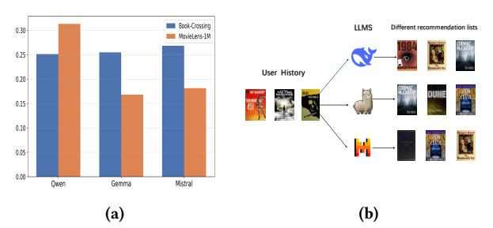
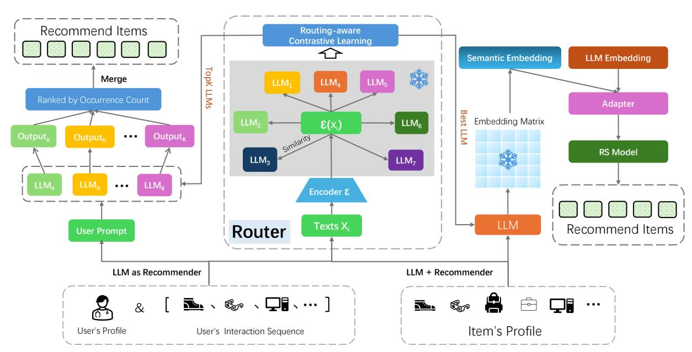
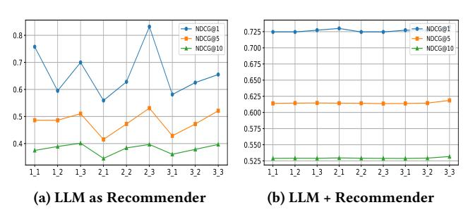
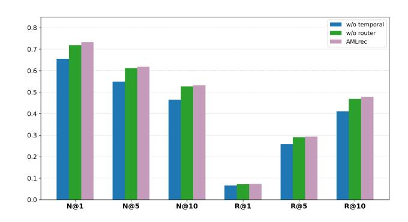
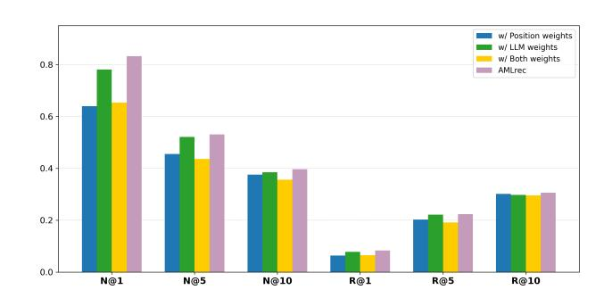
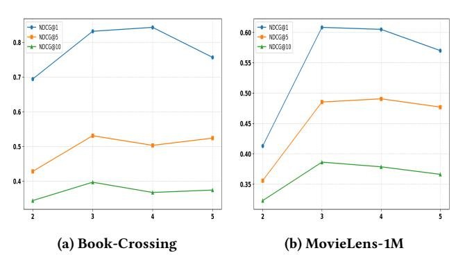

# Dynamic Routing-Based Adaptive Multi-LLM Collaboration: A Unified Recommendation Framework with Decision Knowledge Complementation

Jiale Huang Tianjin University of Technology Tianjin, China huangjiale0721@stud.tjut.edu.cn

Yingyuan Xiao∗ Tianjin University of Technology Tianjin, China yyxiao@tjut.edu.cn

Likang Wu† College of Management and Economics, Tianjin University Tianjin, China Tianjin University of Technology Tianjin, China wulk@tju.edu.cn

Xu Cheng Tianjin University of Technology Tianjin, China xu.cheng@ieee.org

Wengguang Zheng Tianjin University of Technology Tianjin, China wenguangz@tjut.edu.cn

Qingbo Hao Tianjin University of Technology Tianjin, China haoqingbo@email.tjut.edu.cn

Ming He Lenovo Research Beijing, China heming01@foxmail.com

Hongke Zhao College of Management and Economics, Tianjin University Tianjin, China Tianjin University of Technology Tianjin, China hongke@tju.edu.cn

# Abstract

Existing LLM-driven recommendation systems (RS) suffer from over-reliance on single pre-trained models, limiting adaptability across diverse scenarios due to varying LLM strengths in semantics, knowledge, and reasoning. To address this, we propose AMLrec (Adaptive Multi-LLM Recommendation), a dynamic routingbased adaptive multi-LLM collaboration framework that unifies two dominant paradigms (LLM as Recommender and LLM + Recommender) with decision knowledge complementation. For each user or item, a lightweight encoder generates embeddings, which are compared via cosine similarity with learnable LLM prototypes to select optimal models. In one paradigm, selected LLMs generate recommendations via structured prompts, with outputs aggregated to form the final list. In the other, chosen LLMs produce semantic embeddings, which are fused with learnable embeddings (after PCA dimensionality reduction) and aligned via a lightweight adapter to bridge distribution gaps. Notably, no fine-tuning of underlying LLMs is required, significantly reducing computational overhead. Experiments on real-world datasets show that the proposed approach consistently outperforms single-LLM baselines across all

© 2026 Copyright held by the owner/author(s). ACM ISBN 979-8-4007-2307-0/2026/04 <https://doi.org/10.1145/3774904.3792261>

evaluation metrics, validating its effectiveness. Our key contributions are threefold: the first integration of dynamic routing for multi-LLM recommendation system (RS) collaboration; a unified architecture that harmonizes both paradigms; and efficient adaptation without the need for LLM fine-tuning. Our code is available at [https://github.com/Jiale-12138/AMLrec.](https://github.com/Jiale-12138/AMLrec)

# CCS Concepts

• Information systems → Recommender systems.

# Keywords

Recommender Systems, Dynamic Routing, LLM-based Recommendation

#### ACM Reference Format:

Jiale Huang, Yingyuan Xiao, Likang Wu, Xu Cheng, Wengguang Zheng, Qingbo Hao, Ming He, and Hongke Zhao. 2026. Dynamic Routing-Based Adaptive Multi-LLM Collaboration: A Unified Recommendation Framework with Decision Knowledge Complementation. In Proceedings of the ACM Web Conference 2026 (WWW '26), April 13–17, 2026, Dubai, United Arab Emirates. ACM, New York, NY, USA, [11](#page-10-0) pages.<https://doi.org/10.1145/3774904.3792261>

# 1 Introduction

Recommendation systems (RS) aim to provide users with personalized suggestions based on their interaction history [\[22\]](#page-8-0), thereby improving user satisfaction and alleviating information overload. Generative large language models (LLMs) [\[6\]](#page-8-1), with their exceptional capacity to capture deep semantic representations and contextual dependencies in textual data, have garnered significant attention

∗Corresponding author

†Corresponding author

[This work is licensed under a Creative Commons Attribution 4.0 International License.](https://creativecommons.org/licenses/by/4.0) WWW '26, Dubai, United Arab Emirates

Figure 1: Comparison of different LLMs across distinct recommendation contexts. (a) shows quantitative performance differences on two datasets, while (b) presents qualitative variations in recommendations for the same user.

and interest across many fields—including recommendation systems.

Recent research [\[5,](#page-8-2) [26,](#page-8-3) [36\]](#page-8-4) on integrating LLMs into RS can be roughly divided into two widely used paradigms: (i). LLM as Recommender. This paradigm aims to directly transfer the pre-trained LLM to RS. The input sequence of the model typically integrates the user profile description, the historical interaction behavior sequence, and the specific recommendation task instructions. Its output sequence is designed to generate recommendation results that meet the task requirements directly. (ii). LLM + Recommender. This method positions the LLM as a feature extractor. User and item side information are fed into the LLM, which outputs corresponding embedding vectors. The resulting semantically rich embedding representation can be used by traditional recommendation models and adapted to a variety of downstream recommendation tasks.

Although the above two paradigms show potential in conventional recommendation tasks, they share a critical limitation: a strong dependence on the capabilities of a single pre-trained LLM. Pre-trained models vary in their semantic grasp, knowledge scope, and reasoning style, relying solely on one model makes it difficult to perform optimally across diverse recommendation scenarios. For instance, for the same task, using different foundation models can lead to significant performance gaps [\[2\]](#page-8-5). To further investigate the heterogeneity of LLMs in recommendation scenarios, we compare three representative models—Qwen, Mistral, and Gemma—across two datasets and a unified user case. As shown in Figure [1a,](#page-1-0) the three LLMs achieve comparable results on the Book-Crossing dataset, whereas Qwen significantly outperforms the others on MovieLens-1M, indicating that model performance is highly context-dependent. Furthermore, Figure [1b](#page-1-0) illustrates the recommendations generated by these LLMs for the same user given identical interaction histories. Despite facing the same task and input, the models produce remarkably diverse recommendation lists, revealing that different LLMs adopt distinct reasoning patterns and decision-making tendencies when performing recommendation.

Therefore, it naturally follows that having multiple LLMs that complement each other by leveraging their respective strengths is a highly valuable approach. However, there exist significant technical barriers to efficiently and stably implementing this strategy: (i). How to design an efficient learning mechanism that allows LLMs to perform adaptive screening and sample matching? (ii). Since computational resources need to be minimized as much as possible, it is necessary to ensure that the parameters of LLMs do not participate in training. (iii). How to make the designed collaborative framework adapt to two different LLM-driven recommendation modeling paradigms to ensure universality?

For the above challenges, we propose AMLrec, a dynamic routingbased multi-LLM collaboration framework. First, for each user or item, a lightweight encoder generates a low-dimensional representation, which is then compared with precomputed vectors of candidate LLMs to dynamically select the models that best match the current input features, achieving efficient model screening and adaptive sample–model matching. During training, all pretrained LLM parameters remain strictly frozen—only the lightweight encoder and the routing mechanism are optimized—thereby leveraging each LLM's inherent semantic understanding and reasoning capabilities while minimizing computational and storage overhead. Finally, the selected LLMs can be flexibly switched between two modes—LLM as Recommender or LLM + Recommender—to accommodate different LLM-driven recommendation paradigms and ensure broad applicability across various scenarios. The main contributions could be summarized as follows:

- To our best knowledge, this work is the first to integrate a dynamic routing mechanism into LLM-based recommender systems, enabling adaptive selection of the most appropriate LLM(s) for each user or item.
- Our approach requires no fine-tuning of the underlying LLMs, dramatically reducing both computational and storage overhead.
- We conduct extensive experiments on two public datasets, and the experimental results and visualization cases demonstrate the superiority of AMLrec.

# 2 Related Work

Regarding the modeling paradigms [\[19,](#page-8-6) [26\]](#page-8-3) that this paper focuses on—employing LLMs as generative recommenders or as feature extractors to enhance traditional models—we summarize related work.

# 2.1 LLM as Recommender

LLMs can generate recommendation results directly by processing input sequences that combine user profiles, behavioral histories, and task instructions. P5 [\[4\]](#page-8-7) unifies diverse recommendation tasks under a prompt-based framework. GANPrompt [\[14\]](#page-8-8) itigates prompt sensitivity via adversarial prompt augmentation, enhancing robustness without sacrificing recommendation performance. To address cold-start issues, studies [\[23,](#page-8-9) [35\]](#page-8-10) reformulate click prediction as natural language queries, enabling zero-shot recommendations. For conversational settings, [\[30\]](#page-8-11) departs from traditional reliance on knowledge graphs by introducing a hierarchical design with semantic alignment, thereby improving response relevance. When model adaptation is constrained by limited data, TALLRec [\[1\]](#page-8-12) offers a practical solution through a lightweight instruction tuning scheme that only requires two stages of fine-tuning. PromptRec [\[27\]](#page-8-13) reframes recommendation as sentiment classification, using RCMP and TPP for personalization in extreme cold-start settings. To incorporate collaborative filtering signals, E4SRec [\[13\]](#page-8-14) and LLaRA [\[15\]](#page-8-15) use adapters to align pre-trained item embeddings with LLMs, while

RA-Rec [\[32\]](#page-8-16) introduces soft alignment modules to bridge the gap between ID and text spaces. LLMRec [\[25\]](#page-8-17) further enhances user–item graphs with LLM-generated textual features for richer representations.

# 2.2 LLM + Recommender

This line treats LLM as a semantic feature extractor, where user and item side information is encoded through the LLM to produce corresponding embedding vectors. To mitigate latency bottlenecks in CTR prediction, CTR-BERT [\[20\]](#page-8-18) separates feature fusion into a lightweight two-stage encoding pipeline. TedRec [\[28\]](#page-8-19) takes a different route by fusing text and ID semantics in the frequency domain and enhancing them through expert modulation. To ensure domain adaptability without compromising pre-trained knowledge, methods like LEARN [\[11\]](#page-8-20) and LLM-ESR [\[18\]](#page-8-21) freeze the LLM while introducing external adaptation modules; the latter further improves performance on long-tail items via self-distillation. For sequential representation, SAID [\[9\]](#page-8-22) promotes consistency between textual and ID-based embeddings through projection alignment, whereas LRD [\[31\]](#page-8-23) mines implicit item relationships from LLM-generated features. LLMEmb [\[17\]](#page-8-24) enhances robustness by combining contrastive fine-tuning with adapter-based collaborative signal injection. On the user modeling side, P2Rec [\[16\]](#page-8-25) focuses on extracting preference signals when textual context is sparse. In contrast, LLM-CF [\[24\]](#page-8-26) leverages chain-of-thought prompting in-context to perform collaborative filtering. Other efforts, such as LoID [\[29\]](#page-8-27), enable cross-domain transfer via contrastive alignment between comment and ID spaces, while NoteLLM [\[33\]](#page-8-28) introduces virtual compressed word embeddings for social recommendation via multi-task training. Complementary to representation- and modeling-oriented approaches, optimization-based studies formulate multi-stakeholder recommendation as a multi-party multi-objective discrete problem, typically addressed by cooperative evolutionary frameworks such as MP-HCEA [\[34\]](#page-8-29).

# 3 Methodology

In this section, the technical details of AMLrec in Figure [2](#page-3-0) will be introduced progressively.

### 3.1 Preliminary

3.1.1 Problem Formulation. Consider a set of users U = {��1, ��2, . . . , ���� } and a set of items V = {��1, ��2, . . . , ���� }, where�� and �� represent the total number of users and items, respectively. Each user �� ∈ U is associated with attribute set ���� (e.g., age, occupation), and each item �� ∈ V is associated with attribute set ���� (e.g., title, description). The input interaction sequence of user �� can be represented as

�� (��) = {�� (��) 1 , �� (��) 2 , . . . , �� (��) ���� },

ordered chronologically, where ���� is the sequence length. For simplicity, we omit the user-specific superscript (��) in subsequent notations. The recommendation task is formulated as the following conditional probability optimization:

arg max ���� ∈V �� ���� +1 = ���� | ��, ����, {���� }��∈V , (1)

where {���� }��∈V denotes the collection of all item attributes.

### 3.2 LLM as Recommender

Large-scale pre-trained language models (LLMs) have demonstrated exceptional capability in capturing deep semantics and contextual dependencies of text, making them valuable for enhancing recommendation systems. With carefully designed prompt engineering, these models can generate personalized rankings over a candidate pool based on a user's profile and interaction history. However, a single LLM may not perform optimally for every user, and its outputs can exhibit variability and uncertainty. To address this limitation, we introduce a Routing-aware Contrastive Learning module that selects the most suitable subset of LLMs for each user and aggregates their outputs into a final recommendation list. To better align the routing decision with domain-specific user–item knowledge, we introduce a Decision Knowledge Complementation (DKC) mechanism, which complements the router's probabilistic decision with external knowledge about model performance and user preferences.

3.2.1 User Representation and Router Selection. We first represent each user by a unified textual template ����, defined as

���� = Concat(Static(��), Dynamic(��)), (2)

where Static(��) includes the user's stable attributes (e.g., demographic features and long-term preferences), and Dynamic(��) comprises up to 30 of the most recent interactions along with their metadata descriptions.

The Router encodes ���� into an embedding ���� and computes its cosine similarity against the learnable representations of all �� candidate LLMs, {k�� } �� ��=1.

���� = sim(e��, k�� ), �� = 1, 2, . . . ,�� .

Based on these similarity scores, the Router selects the top �� models to form a personalized ensemble M�� = {��1,��2, . . . ,���� }.

#### 3.2.2 Prompt generation and Output Merging. For each user ��, we design a standardized prompt ���� in the following format:

Task Instruction: You are an expert in the field of recommendation and your task is to sort candidates based on the following information and recommend what users are most interested in.

Based on the user's profile and interaction history, we generate a

personalized description for each user:

User Profile: Users' Personal Information: age: 25, location: XXX, gender: female. Books that the user has interacted with:Pride and Prejudice; The Great Gatsby; Prophet . . .

We also construct a candidate pool of 50 items for each user, presented as follows:

Candidate Pool: Candidate Pool (format: book Id; book\_title; Category):

101; To Kill a Mockingbird; Classic. 102; The Catcher in the Rye; Classic.

. . . Finally, we specify the expected content and format of the model's output:

Output: Please sort the items in the candidate pool according to the user's personal information and historical interaction data, and return the IDs of the top 10 recommended items, sorted by decreasing interest.

Figure 2: The framework of AMLrec.

After obtaining ����, we input it to ���� to obtain the output of the corresponding model. We then aggregate the items recommended by each model in ���� and rank them based on their frequency of occurrence to generate the final recommendation list.

3.2.3 Router Training and Inference. As illustrated in Figure [2,](#page-3-0) the Router consists of an encoder E(·) and �� learnable LLM vectors {k�� ∈ R �� } �� ��=1. For input ����, the Router outputs a selection probability distribution over all LLMs:

��(����; ��) = softmax-��1, ��2, . . . , ���� ] , (3)

where �� denotes the Router's trainable parameters, and softmax(·) is the normalization operator.

To learn the Router, we draw inspiration from contrastive learning [\[3,](#page-8-30) [10\]](#page-8-31). In addition, we design a scoring mechanism to assess the performance of each LLM on different users. Specifically, we input the prompt template described above into each candidate LLM, collect the output results for the users in the training set, and compute the corresponding NDCG@5 value. We directly use this value as the score for comparative learning: a higher score indicates better alignment between the LLM and the user, while a lower score suggests the opposite. For each user ��, we define the positive set I + as the indices of the top-��+ scoring LLMs and the negative set I − as the bottom-��− ones. The user–LLM contrastive loss is then formulated as

Lcon(����) = − ∑︁ + ∈�� + log exp(���� + ) exp(���� + ) + P ��− ∈�� �� exp(����− ). (4)

In this contrastive objective, the positive and negative LLM sets are derived from historical model performance, which realizes the DKC: Router's decisions are guided by both user representation and accumulated knowledge about LLM suitability. During training, we minimize Lcon to pull the user embedding closer to positive LLMs and push it away from negative ones. In inference, Equation [\(3\)](#page-3-1) generates the LLM selection distribution, and the aforementioned fusion process yields personalized recommendations.

#### 3.3 LLM + Recommender

In recent years, large language models have demonstrated remarkable capabilities in understanding semantics across natural language processing (NLP) tasks, highlighting their potential to enhance RS. This potential arises from the rich semantic information that LLMs can extract from the textual attributes of items. However, conventional approaches typically rely on a single LLM to generate semantic embeddings for all items, which has notable limitations. In particular, no single LLM can consistently produce optimal embeddings for all item types, resulting in limited adaptability. This lack of adaptability degrades embedding quality and, consequently, diminishes recommendation accuracy. To solve this problem, we designed a router that dynamically selects the most appropriate LLM for each item to generate the corresponding semantic embeddings.

3.3.1 Item Text Construction. Each item �� is associated with a set of metadata attributes that collectively define its characteristics. We represent these attributes as �� atomic prompts:

���� = (Attribute�� : Value�� ), �� = 1, 2, . . . , ��.

The atomic prompts are then concatenated in a fixed order to construct the item descriptor:

���� = [��1, ��2, . . . , ���� ], (5)

where [·] denotes textual concatenation. This structured text encapsulates all relevant side information—such as title, category, tags, and user-generated descriptions—providing a comprehensive representation for downstream semantic encoding.

3.3.2 Item Embedding Construction. To effectively leverage the rich semantics from large language models (LLMs) while maintaining adaptability in downstream recommendation tasks, we propose a novel item embedding construction pipeline. First, for each item ��, we construct its textual description ���� and feed it into a router module to identify the most suitable LLM. The router employs a lightweight encoder E(·) to embed ���� into a fixed-length vector e�� = E(���� ) ∈ R �� . To determine the most appropriate LLM for each item, the Router selects the index

�� ∗ = arg max ���� , (6)

where e�� is the item embedding encoded by the lightweight encoder and k�� are the learnable LLM prototype vectors. we designate ��∗ as the chosen model.

The chosen LLM��∗ then generates a semantic embedding e LLM �� ∈ ��raw , which is reduced by PCA to dimension ��:

e LLM−PCA �� = PCA�� (e LLM ). (7)

To enhance adaptability, we introduce a learnable item embedding matrix E trainable ∈ R ��×�� , initialized from projected LLaMA embeddings. The final representation is obtained by fusing frozen and trainable embeddings and mapping them into the target dimension ��low through a two-layer MLP adapter:

e out �� = MLP Pool(e LLM-PCA , e trainable ) . (8)

This design combines the advantages of semantically meaningful, context-aware LLM embeddings and flexible, task-adaptive learnable parameters, while maintaining computational efficiency through dimensionality reduction. It enables the recommendation backbone to benefit from LLM knowledge without sacrificing adaptability to user behavior dynamics.

3.3.3 Training and Inference. To train the Router, we adopt a contrastive learning objective that promotes alignment between each item and the most compatible LLM among a set of candidates. Specifically, for each item ��, let I + �� denote the indices of the top-��+ LLMs with the highest similarity scores, and I − the indices of the bottom-��− LLMs. We define the item–LLM contrastive loss as

Lcon(���� ) = − ∑︁ + ∈�� + log exp(���� + ) exp(���� + ) + P ��− ∈�� exp(����− ) . (9)

Minimizing Lcon pulls the item embedding e�� closer to the prototypes of positive LLMs while pushing it away from negative ones. To further guide the Router, we leverage a pretrained model as external knowledge. Specifically, we compute the similarity between each item's LLM-generated embedding and its corresponding embedding from the trained model. These similarity scores serve as additional supervision for the Router, encouraging it to select LLMs whose embeddings align well with historical user–item interaction patterns. This process realizes the Decision Knowledge Complementation (DKC) mechanism: the Router's probabilistic selection is informed not only by the item representation but also by accumulated knowledge about LLM suitability.

In addition to the contrastive objective, we also incorporate the loss from the downstream recommendation task to directly improve the end-task performance. This term measures how well the model predicts user preferences over items, and is optimized jointly with the contrastive loss.

Consequently, the overall training objective is formulated as a weighted combination of the two components.

Ltotal = Lcon + �� · Lrec, (10)

where �� is the hyperparameter that balance the two objectives.

During training, we determine the most compatible LLM for each item and update the LLM embedding matrix at the beginning

Table 1: The statistics of datasets.

of each epoch. The LLM matrix is then kept fixed during the epoch, while the remaining model parameters are optimized. At inference time, the user's interaction sequence is fed into the model to predict the items of greatest interest to the user.

#### 4 Experiments

To evaluate the motivation of AMLrec, we conduct experiments to answer the following questions:

- RQ1: How does our dynamic routing-based LLM collaboration perform compared to single-LLM baselines across different recommendation paradigms?
- RQ2: What is the impact of key hyperparameters on model performance?
- RQ3: Can the dynamic routing mechanism effectively leverage multiple LLMs for more accurate recommendations than individual models?

#### 4.1 Experimental Settings

4.1.1 Candidate LLMs: We choose seven open-source LLMs from HuggingFace: (i) Wizardlm2-7b is a general-purpose LLM fine-tuned for instruction-following tasks; (ii) Vicuna-7b is an instructiontuned LLM developed based on LLaMA-2 architecture; (iii) Mistral-7b is an aligned version of Mistral-7B optimized for dialogue and instruction tasks; (iv) Gemma-7b is a fine-tuned variant of Gemma-7B targeting instruction-based tasks; (v) Deepseek-r1-qwen3-8b is an 8B-parameter LLM based on Qwen3 architecture and optimized for alignment and reasoning; (vi) Qwen2.5-7b is a Chinese-English bilingual LLM fine-tuned on high-quality instruction datasets; (vii) Llama3.1-8b is a recent instruction-tuned version of Llama-3.1 with improved alignment capabilities. The first five LLMs are based on Mistral, Gemma, or Qwen architectures, while the last two LLMs are based on Qwen and Llama-3.1 architectures, respectively.

4.1.2 Datasets: We conduct experiments on two widely used benchmark datasets for recommendation: MovieLens-1M (ML-1M) and Book-Crossing (BX). The ML-1M dataset contains 1 million ratings across approximately 4,000 movies provided by about 6,000 users, where each rating is an integer between 1 and 5. In contrast, the Book-Crossing dataset is much larger and sparser, comprising more than 1 million user-book interactions from over 270,000 users on nearly 300,000 books. Table [1](#page-4-0) summarizes the key statistics of the two datasets. For preprocessing, we filter users based on their interaction counts to ensure sufficient activity for modeling. Specifically, for the ML-1M, we retain users whose number of interactions ranges from 20 to 100. For the BX, we keep users with interactions between 20 and 50. After filtering, we split both datasets into training, validation, and test sets following an 8:1:1 ratio.

4.1.3 Evaluation Metric: We adopt two widely used evaluation metrics in recommendation tasks: Recall and NDCG (Normalized

Table 2: LLM as Recommender performance. The best results are highlighted in bold.

| Dataset Metric    | N@1    | N@5    | N@10   | Book-Crossing R@1 | R@5    | R@10   | N@1    | N@5    | N@10   | MovieLens-1M R@1 | R@5    | R@10   |
|-------------------|--------|--------|--------|-------------------|--------|--------|--------|--------|--------|------------------|--------|--------|
| Deepseek LLMs     | 0.2946 | 0.2636 | 0.2496 | 0.0295            | 0.1282 | 0.2384 | 0.3280 | 0.3180 | 0.2766 | 0.0328           | 0.1538 | 0.2408 |
| Llama             | 0.3201 | 0.3321 | 0.2974 | 0.0329            | 0.1641 | 0.2799 | 0.3280 | 0.3023 | 0.2831 | 0.0328           | 0.1452 | 0.2682 |
| Mistral Candidate | 0.2865 | 0.3050 | 0.2755 | 0.0287            | 0.1512 | 0.2613 | 0.1465 | 0.1515 | 0.1756 | 0.0146           | 0.0774 | 0.1873 |
| Vicuna            | 0.2259 | 0.2043 | 0.1994 | 0.0226            | 0.1000 | 0.1959 | 0.0955 | 0.1303 | 0.1699 | 0.0096           | 0.0707 | 0.1904 |
| Qwen              | 0.3136 | 0.2965 | 0.2618 | 0.0320            | 0.1413 | 0.241  | 0.2898 | 0.3237 | 0.3141 | 0.0290           | 0.1653 | 0.3121 |
| Gemma             | 0.2810 | 0.2727 | 0.2592 | 0.0281            | 0.1344 | 0.2507 | 0.0834 | 0.1021 | 0.1542 | 0.0083           | 0.0561 | 0.1822 |
| Wizardlm2         | 0.3251 | 0.3187 | 0.298  | 0.0325            | 0.1579 | 0.2854 | 0.1879 | 0.2384 | 0.2584 | 0.0188           | 0.1261 | 0.2739 |
| AMLrec            | 0.8319 | 0.5304 | 0.3967 | 0.0832            | 0.2234 | 0.3061 | 0.6083 | 0.4853 | 0.3863 | 0.0608           | 0.2220 | 0.3229 |

Table 3: LLM + Recommender performance. The best results are highlighted in bold.

| Dataset Metric    | N@1    | N@5    | N@10   | Book-Crossing R@1 | R@5    | R@10   | N@1    | N@5    | N@10   | MovieLens-1M R@1 | R@5    | R@10   |
|-------------------|--------|--------|--------|-------------------|--------|--------|--------|--------|--------|------------------|--------|--------|
| Deepseek LLMs     | 0.6667 | 0.5698 | 0.4939 | 0.0667            | 0.2722 | 0.4477 | 0.7866 | 0.7543 | 0.6852 | 0.0787           | 0.3707 | 0.6468 |
| Llama             | 0.6860 | 0.6013 | 0.5222 | 0.0686            | 0.2865 | 0.4725 | 0.7994 | 0.7580 | 0.6910 | 0.0799           | 0.3726 | 0.6532 |
| Mistral Candidate | 0.7135 | 0.6035 | 0.5191 | 0.0713            | 0.2857 | 0.4656 | 0.7898 | 0.7541 | 0.6899 | 0.0790           | 0.3710 | 0.6545 |
| Vicuna            | 0.7025 | 0.6021 | 0.5223 | 0.0707            | 0.2857 | 0.4719 | 0.7325 | 0.7397 | 0.6817 | 0.0733           | 0.3678 | 0.6525 |
| Qwen              | 0.6997 | 0.6013 | 0.5183 | 0.0700            | 0.2854 | 0.4664 | 0.7866 | 0.7574 | 0.6905 | 0.0787           | 0.3729 | 0.6535 |
| Gemma             | 0.7107 | 0.5833 | 0.4975 | 0.0711            | 0.2738 | 0.4424 | 0.7866 | 0.7593 | 0.6944 | 0.0787           | 0.3729 | 0.6583 |
| Wizardlm2         | 0.6860 | 0.6062 | 0.5221 | 0.0686            | 0.2904 | 0.4722 | 0.7930 | 0.7641 | 0.6938 | 0.0793           | 0.3771 | 0.6570 |
| AMLrec            | 0.7327 | 0.6186 | 0.5317 | 0.0733            | 0.2933 | 0.4774 | 0.8153 | 0.7679 | 0.6973 | 0.0815           | 0.3774 | 0.6583 |

Discounted Cumulative Gain). Recall measures the proportion of relevant items successfully retrieved among the recommended items, reflecting the model's ability to cover as many relevant items as possible. NDCG additionally considers the ranking positions of the relevant items in the recommendation list, assigning higher scores when relevant items appear closer to the top of the list. Together, these metrics evaluate both the completeness and the ranking quality of the recommendations.

4.1.4 Implementation Details: We set the maximum sequence length of user interactions to 30 for all experiments to ensure consistency in input formatting. For the LLM as Recommender setting, the candidate pool size is fixed at 50 to evaluate the ranking capability of the large language model. For the LLM + Recommender setting, we adopt SASRec[\[12\]](#page-8-32) as the backbone recommendation model, which leverages self-attention mechanisms to capture sequential user preferences. The hyperparameter �� was selected based on empirical validation. Among the tested values {0.5, 1.0, 1.5}, we set �� = 1.0 as it achieved the best results. All LLM-related embedding components are randomly initialized to maintain consistency with the overall training procedure and to avoid introducing external priors. During training, the candidate set is constructed by combining ground-truth positive items with randomly sampled negative items, which provides sufficient discriminative signals for effective optimization. For the pooling operation, we adopt average pooling,

which effectively preserves overall semantic information during representation aggregation and contributes to more stable training.

# 4.2 Overall Performance

In this section, we evaluate the proposed method within two different paradigms.

4.2.1 LLM as Recommender: We set the maximum length of the user interaction history to 30 in order to balance the trade-off between capturing sufficient behavioral context and avoiding excessive noise or computational overhead. Simultaneously, the candidate pool size for the LLM was fixed at 50, ensuring a manageable yet representative set of recommendation candidates for evaluation. To account for variability and to obtain statistically reliable results, we conducted three independent experimental runs for each model and reported the arithmetic mean of their outcomes. Our experimental results are reported in Table [2.](#page-5-0) It can be seen that AMLrec achieved superior performance across both primary datasets, significantly outperforming all baseline models in terms of both NDCG and Recall metrics. Notably, our approach demonstrated consistent excellence not only within individual scenarios but also maintained its leading performance across heterogeneous datasets (Book-Crossing and MovieLens-1M), thereby validating the model's generalization capability and robustness. Additional examples are provided in Appendix [C.](#page-9-0)

Figure 3: Model performance under different positive/negative sample configurations (��, ��). Here, �� denotes the number of positive samples per training instance, and �� denotes the number of negative samples.

4.2.2 LLM + Recommender: Table [3](#page-5-1) compares the recommendation performance of various large language models on the Book-Crossing and MovieLens-1M datasets. The results demonstrate that embeddings generated by a single model are inherently limited in recommendation tasks. In contrast, AMLrec consistently achieves robust and statistically significant improvements across both datasets, outperforming all baseline methods. By dynamically selecting the most appropriate LLM embedding for each item, this mechanism effectively overcomes the representational constraints of single-model embeddings and substantially enhances cross-domain recommendation performance.

#### 4.3 Hyperparameter Experiments

Effects of ��+ and ��−: We conducted experiments on the number of positive and negative samples in contrastive learning under two paradigms. The results are shown in Figure [3.](#page-6-0)

Under the LLM as Recommender paradigm, Figure [3a](#page-6-0) shows that the ratio of positive to negative samples (��, ��) in contrastive learning significantly influences retrieval performance. Specifically, the NDCG@1 and NDCG@5 metrics reach their highest values under the configuration (�� = 2, �� = 3), significantly outperforming other combinations. The NDCG@10 metric, however, achieves its optimal performance at (�� = 1, �� = 3). Overall, increasing the number of negative samples ��—especially from 1 to 3—is crucial for improving NDCG@1, as demonstrated by a substantial gain when �� = 2. Meanwhile, NDCG@5 and NDCG@10 benefit more from increasing the number of positive samples ��, particularly at �� = 3. Notably, insufficient sample sizes, especially when �� = 1, result in a marked decline across all metrics. Therefore, we adopt the (2, 3) configuration for all subsequent experiments.

Under the LLM + Recommender paradigm, Figure [3b](#page-6-0) demonstrates that all three evaluation metrics exhibit relatively stable performance. Overall, the model maintained consistent retrieval effectiveness across various positive-to-negative sample configurations, indicating that the selected model architecture is robust to variations in sample proportions. Furthermore, as the number of both positive and negative samples increased, the model's performance improved measurably. Additional hyperparameter experiments are presented in Appendix [A.](#page-9-1)

Figure 4: Ablation study on key components of AMLrec. The figure compares the performance with and without temporal modeling or routing mechanism across six metrics.

#### 4.4 Ablation Experiment

4.4.1 Effect of Temporal and Routing Modules: To validate the functionality of each module within our proposed model under the LLM+Recommender paradigm, we conducted two ablation experiments with results presented in Figure [4.](#page-6-1) The first experiment employs only frozen semantic embedding matrices while removing the temporal module; the second replaces the routing mechanism with average pooling operations across embeddings generated by all candidate large language models. Through these experiments, we verify the contribution of each module within the LLM-as-Recommender paradigm.

The experimental results demonstrate that utilizing frozen embeddings alone severely constrains model performance, with all metrics underperforming compared to the subsequent two configurations, thereby confirming the critical importance of temporal information in recommendation tasks. Furthermore, the approach employing average pooling to fuse embeddings from multiple candidate models also underperforms our proposed model, indicating that AMLrec effectively selects the most appropriate large language model for different items rather than simply aggregating multi-model embeddings, thus validating the efficacy of the routing mechanism.

In summary, the experiments systematically validate the necessity of both the temporal module and routing mechanism in our proposed model, while highlighting the design advantages of dynamically and intelligently leveraging semantic information from large language models in recommendation systems.

4.4.2 Weighting Strategies: Figure [5](#page-7-0) shows an ablation study on different weighting strategies for combining recommendations from multiple LLMs under the LLM as Recommender paradigm . We test three variants: using position weights, LLM weights, or both. The results show that all weighted variants perform worse than our default AMLrec method, which uses a simple unweighted frequency-based aggregation. This shows that adding weights does not improve performance and that the simple unweighted method works well and is stable for all metrics. Additional ablation experiment are presented in Appendix [B.](#page-9-2)

Figure 5: Ablation study on different weighting strategies for multi-LLM recommendation fusion. The figure presents the performance comparison under different weighting schemes (position weights, LLM weights, both weights) and the proposed AMLrec model across six evaluation metrics.

Table 4: LLM as Recommender performance. The best results are highlighted in bold.

| Dataset Metric | N@1    | N@5    | N@10   | Book-Crossing R@1 | R@5    | R@10   |
|----------------|--------|--------|--------|-------------------|--------|--------|
| Qwen           | 0.3136 | 0.2965 | 0.2618 | 0.0320            | 0.1413 | 0.2410 |
| TallRec        | 0.7810 | 0.5403 | 0.4118 | 0.0781            | 0.2342 | 0.3155 |
| LLMRank        | 0.3906 | 0.3297 | 0.2955 | 0.0391            | 0.1571 | 0.273  |
| AMLrec         | 0.8319 | 0.5304 | 0.3967 | 0.0832            | 0.2234 | 0.3061 |

Table 5: LLM + Recommender performance. The best results are highlighted in bold.

| Dataset Metric | N@1    | N@5    | N@10   | Book-Crossing R@1 | R@5    | R@10   |
|----------------|--------|--------|--------|-------------------|--------|--------|
| Sasrec         | 0.4724 | 0.4201 | 0.4073 | 0.0472            | 0.2125 | 0.3360 |
| Qwen           | 0.6997 | 0.6013 | 0.5183 | 0.0700            | 0.2854 | 0.4664 |
| LLM2X          | 0.5399 | 0.5021 | 0.4547 | 0.054             | 0.2446 | 0.4267 |
| RLMrec         | 0.7238 | 0.6153 | 0.5410 | 0.0724            | 0.2865 | 0.4772 |
| AMLrec         | 0.7327 | 0.6186 | 0.5317 | 0.0733            | 0.2933 | 0.4774 |

# 4.5 ADDITIONAL COMPARISONS

To further validate the effectiveness of AMLrec, we provide additional comparisons with several baseline models under two paradigms. For consistency, the backbone LLM used in the models mentioned below is Qwen2.5-7b.

4.5.1 LLM as Recommender : To demonstrate the effectiveness of AMLrec, we introduce two representative LLM as Recommender methods: LLMRank [\[8\]](#page-8-33) and TALLRec [\[1\]](#page-8-12). LLMRank is a zero-shot ranking framework that leverages prompt engineering to enable large language models to directly rank candidate items based on user history, without requiring model fine-tuning. In contrast, TALL-Rec aligns LLMs with the recommendation task through a two-stage

optimization process, involving instruction tuning followed by efficient recommendation fine-tuning using LoRA.

As shown in Table [4,](#page-7-1)under the same model settings, LLMRank outperforms the original Qwen model without carefully designed prompts, indicating that well-crafted prompts can effectively enhance recommendation performance. However, LLMRank still falls significantly behind the fine-tuned TALLRec, demonstrating the effectiveness of model fine-tuning. Notably, AMLRec achieves comparable performance to TALLRec without any fine-tuning on the LLM, further validating the effectiveness and advantage of our approach.

4.5.2 LLM + Recommender: To evaluate our method, we compare against representative baselines from different recommendation paradigms. SASRec [\[12\]](#page-8-32) models sequential user–item interactions via a Transformer encoder with self-attention. LLM2X [\[7\]](#page-8-34) enhances recommendation by initializing sequential models with PCA-reduced LLM-generated semantic embeddings, while RLM-Rec [\[21\]](#page-8-35) further improves performance through cross-view alignment between LLM-based textual representations and interactionbased representations.

As shown in Table [5,](#page-7-2) LLM2X surpasses SASRec by exploiting semantically enriched item initialization, though its aggressive PCA-based dimensionality reduction may incur notable semantic loss. In contrast, our adapter employs a staged reduction strategy, combining intermediate PCA compression with an MLP-based projection to the target dimension, which better preserves semantic information. Moreover, RLMRec consistently outperforms the Qwen-based variant, highlighting the effectiveness of cross-view representation alignment. By dynamically selecting the most suitable LLM-generated embedding for each item, our method further achieves superior performance over single-model embeddings.

# 5 Conclusion

We propose AMLrec, a dynamic routing-based multi-LLM recommendation framework that unifies the paradigms of LLM as Recommender and LLM + Recommender. The core idea of AMLrec is to dynamically select the most suitable large language model for each user or item, enabling adaptive and personalized recommendation without any fine-tuning.

Extensive experiments on multiple datasets demonstrate that AMLrec effectively integrates the complementary strengths of diverse LLMs, leading to consistent improvements in both accuracy and robustness. Further analysis shows that different LLMs exhibit heterogeneous capabilities in semantic understanding, reasoning, and preference modeling, and that AMLrec's adaptive routing mechanism can successfully exploit this diversity.

Although maintaining multiple LLMs incurs additional computational cost, our results highlight multi-LLM collaboration as a promising direction for building flexible, generalizable, and contextaware recommendation systems.

# Acknowledgments

This study was partially funded by the National Natural Science Foundation of China (62502340,72471165), Beijing-Tianjin-Hebei Natural Science Foundation Cooperation Project(25JJJJC0045).

#### References

[1] Keqin Bao, Jizhi Zhang, Yang Zhang, Wenjie Wang, Fuli Feng, and Xiangnan He. 2023. Tallrec: An effective and efficient tuning framework to align large language model with recommendation. In Proceedings of the 17th ACM Conference on Recommender Systems. 1007–1014. [2] Tyler A Chang and Benjamin K Bergen. 2024. Language model behavior: A comprehensive survey. Computational Linguistics 50, 1 (2024), 293–350. [3] Shuhao Chen, Weisen Jiang, Baijiong Lin, James Kwok, and Yu Zhang. 2024. Routerdc: Query-based router by dual contrastive learning for assembling large language models. Advances in Neural Information Processing Systems 37 (2024), 66305–66328. [4] Shijie Geng, Shuchang Liu, Zuohui Fu, Yingqiang Ge, and Yongfeng Zhang. 2022. Recommendation as language processing (rlp): A unified pretrain, personalized prompt & predict paradigm (p5). In Proceedings of the 16th ACM conference on recommender systems. 299–315. [5] Zhong Guan, Likang Wu, Hongke Zhao, Ming He, and Jianpin Fan. 2025. Attention Mechanisms Perspective: Exploring LLM Processing of Graph-Structured Data. arXiv preprint arXiv:2505.02130 (2025). [6] Desta Haileselassie Hagos, Rick Battle, and Danda B Rawat. 2024. Recent advances in generative ai and large language models: Current status, challenges, and perspectives. IEEE transactions on artificial intelligence (2024). [7] Jesse Harte, Wouter Zorgdrager, Panos Louridas, Asterios Katsifodimos, Dietmar Jannach, and Marios Fragkoulis. 2023. Leveraging Large Language Models for Sequential Recommendation. In Proceedings of the 17th ACM Conference on Recommender Systems (Singapore, Singapore) (RecSys '23). Association for Computing Machinery, New York, NY, USA, 7 pages. [doi:10.1145/3604915.3610639](https://doi.org/10.1145/3604915.3610639) [8] Yupeng Hou, Junjie Zhang, Zihan Lin, Hongyu Lu, Ruobing Xie, Julian McAuley, and Wayne Xin Zhao. 2024. Large Language Models are Zero-Shot Rankers for Recommender Systems. arXiv[:2305.08845 \cs.IR]<https://arxiv.org/abs/2305.08845> [9] Jun Hu, Wenwen Xia, Xiaolu Zhang, Chilin Fu, Weichang Wu, Zhaoxin Huan, Ang Li, Zuoli Tang, and Jun Zhou. 2024. Enhancing sequential recommendation via llm-based semantic embedding learning. In Companion Proceedings of the ACM Web Conference 2024. 103–111. [10] Gautier Izacard, Mathilde Caron, Lucas Hosseini, Sebastian Riedel, Piotr Bojanowski, Armand Joulin, and Edouard Grave. 2021. Unsupervised dense information retrieval with contrastive learning. arXiv preprint arXiv:2112.09118 (2021). [11] Jian Jia, Yipei Wang, Yan Li, Honggang Chen, Xuehan Bai, Zhaocheng Liu, Jian Liang, Quan Chen, Han Li, Peng Jiang, et al. 2025. LEARN: Knowledge Adaptation from Large Language Model to Recommendation for Practical Industrial Application. In Proceedings of the AAAI Conference on Artificial Intelligence, Vol. 39. 11861–11869. [12] Wang-Cheng Kang and Julian McAuley. 2018. Self-attentive sequential recommendation. In 2018 IEEE international conference on data mining (ICDM). IEEE, 197–206. [13] Xinhang Li, Chong Chen, Xiangyu Zhao, Yong Zhang, and Chunxiao Xing. 2023. E4srec: An elegant effective efficient extensible solution of large language models for sequential recommendation. arXiv preprint arXiv:2312.02443 (2023). [14] Xinyu Li, Chuang Zhao, Hongke Zhao, Likang Wu, Ming He, and Jianping Fan. 2025. GANPrompt: Improving LLM-Based Recommendations with GAN-Enhanced Diversity Prompts. ACM Transactions on Information Systems 44, 1 (2025), 1–36. [15] Jiayi Liao, Sihang Li, Zhengyi Yang, Jiancan Wu, Yancheng Yuan, Xiang Wang, and Xiangnan He. 2024. Llara: Large language-recommendation assistant. In Proceedings of the 47th International ACM SIGIR Conference on Research and Development in Information Retrieval. 1785–1795. [16] Dugang Liu, Shenxian Xian, Xiaolin Lin, Xiaolian Zhang, Hong Zhu, Yuan Fang, Zhen Chen, and Zhong Ming. 2024. A Practice-Friendly LLM-Enhanced Paradigm with Preference Parsing for Sequential Recommendation. arXiv preprint arXiv:2406.00333 (2024). [17] Qidong Liu, Xian Wu, Wanyu Wang, Yejing Wang, Yuanshao Zhu, Xiangyu Zhao, Feng Tian, and Yefeng Zheng. 2025. Llmemb: Large language model can be a good embedding generator for sequential recommendation. In Proceedings of the AAAI Conference on Artificial Intelligence, Vol. 39. 12183–12191. [18] Qidong Liu, Xian Wu, Yejing Wang, Zijian Zhang, Feng Tian, Yefeng Zheng, and Xiangyu Zhao. 2024. Llm-esr: Large language models enhancement for longtailed sequential recommendation. Advances in Neural Information Processing Systems 37 (2024), 26701–26727. [19] Qidong Liu, Xiangyu Zhao, Yuhao Wang, Yejing Wang, Zijian Zhang, Yuqi Sun, Xiang Li, Maolin Wang, Pengyue Jia, Chong Chen, et al. 2024. Large language model enhanced recommender systems: Taxonomy, trend, application and future. arXiv preprint arXiv:2412.13432 (2024). [20] Aashiq Muhamed, Iman Keivanloo, Sujan Perera, James Mracek, Yi Xu, Qingjun Cui, Santosh Rajagopalan, Belinda Zeng, and Trishul Chilimbi. 2021. CTR-BERT: Cost-effective knowledge distillation for billion-parameter teacher models. In NeurIPS Efficient Natural Language and Speech Processing Workshop. [21] Xubin Ren, Wei Wei, Lianghao Xia, Lixin Su, Suqi Cheng, Junfeng Wang, Dawei Yin, and Chao Huang. 2024. Representation learning with large language models for recommendation. In Proceedings of the ACM web conference 2024. 3464–3475. [22] Badrul Sarwar, George Karypis, Joseph Konstan, and John Riedl. 2001. Item-based collaborative filtering recommendation algorithms. In Proceedings of the 10th international conference on World Wide Web. 285–295. [23] Damien Sileo, Wout Vossen, and Robbe Raymaekers. 2022. Zero-shot recommendation as language modeling. In European Conference on Information Retrieval. Springer, 223–230. [24] Zhongxiang Sun, Zihua Si, Xiaoxue Zang, Kai Zheng, Yang Song, Xiao Zhang, and Jun Xu. 2024. Large language models enhanced collaborative filtering. In Proceedings of the 33rd ACM International Conference on Information and Knowledge Management. 2178–2188. [25] Wei Wei, Xubin Ren, Jiabin Tang, Qinyong Wang, Lixin Su, Suqi Cheng, Junfeng Wang, Dawei Yin, and Chao Huang. 2024. Llmrec: Large language models with graph augmentation for recommendation. In Proceedings of the 17th ACM International Conference on Web Search and Data Mining. 806–815. [26] Likang Wu, Zhi Zheng, Zhaopeng Qiu, Hao Wang, Hongchao Gu, Tingjia Shen, Chuan Qin, Chen Zhu, Hengshu Zhu, Qi Liu, et al. 2024. A survey on large language models for recommendation. World Wide Web 27, 5 (2024), 60. [27] Xuansheng Wu, Huachi Zhou, Yucheng Shi, Wenlin Yao, Xiao Huang, and Ninghao Liu. 2024. Could small language models serve as recommenders? towards data-centric cold-start recommendation. In Proceedings of the ACM Web Conference 2024. 3566–3575. [28] Lanling Xu, Zhen Tian, Bingqian Li, Junjie Zhang, Daoyuan Wang, Hongyu Wang, Jinpeng Wang, Sheng Chen, and Wayne Xin Zhao. 2024. Sequence-level Semantic Representation Fusion for Recommender Systems. In Proceedings of the 33rd ACM International Conference on Information and Knowledge Management. 5015–5022. [29] Wentao Xu, Qianqian Xie, Shuo Yang, Jiangxia Cao, and Shuchao Pang. 2024. Enhancing content-based recommendation via large language model. In Proceedings of the 33rd ACM International Conference on Information and Knowledge Management. 4153–4157. [30] Bowen Yang, Cong Han, Yu Li, Lei Zuo, and Zhou Yu. 2021. Improving conversational recommendation systems' quality with context-aware item meta information. arXiv preprint arXiv:2112.08140 (2021). [31] Shenghao Yang, Weizhi Ma, Peijie Sun, Qingyao Ai, Yiqun Liu, Mingchen Cai, and Min Zhang. 2024. Sequential recommendation with latent relations based on large language model. In Proceedings of the 47th International ACM SIGIR Conference on Research and Development in Information Retrieval. 335–344. [32] Xiaohan Yu, Li Zhang, Xin Zhao, Yue Wang, and Zhongrui Ma. 2024. Ra-rec: An efficient id representation alignment framework for llm-based recommendation. arXiv preprint arXiv:2402.04527 (2024). [33] Chao Zhang, Shiwei Wu, Haoxin Zhang, Tong Xu, Yan Gao, Yao Hu, and Enhong Chen. 2024. Notellm: A retrievable large language model for note recommendation. In Companion Proceedings of the ACM Web Conference 2024. 170–179. [34] Lei Zhang, Meng Zhu, Yuanyuan Ge, Haipeng Yang, Likang Wu, and Hongke Zhao. 2025. Multi-Party Multi-Objective Optimization for Discrete Problems: A Case Study on Multi-Stakeholder Recommendation. IEEE Transactions on Evolutionary Computation (2025). [35] Zizhuo Zhang and Bang Wang. 2023. Prompt learning for news recommendation. In Proceedings of the 46th International ACM SIGIR Conference on Research and Development in Information Retrieval. 227–237. [36] Xiaoquan Zhi, Hongke Zhao, Likang Wu, Chuang Zhao, and Hengshu Zhu. 2025. Reinventing Clinical Dialogue: Agentic Paradigms for LLM Enabled Healthcare Communication. arXiv preprint arXiv:2512.01453 (2025).

Table 6: Ablation study on the effects of PCA dimensionality and the MLP module. The W/O MLP variant removes the MLP after PCA projection, while PCA3072 denotes increasing the PCA output dimensionality to 3072. The best results are highlighted in bold.

| Metric   | N@1    | N@5    | N@10   | R@1    | R@5    | R@10   |
|----------|--------|--------|--------|--------|--------|--------|
| W/O MLP  | 0.5724 | 0.5203 | 0.5361 | 0.0572 | 0.2781 | 0.5605 |
| PCA 3072 | 0.7827 | 0.7364 | 0.6703 | 0.0783 | 0.3630 | 0.6319 |
| AMLrec   | 0.8153 | 0.7679 | 0.6973 | 0.0815 | 0.3774 | 0.6583 |

Figure 6: Impact of the number of fused LLMs under the LLM as Recommender paradigm on performance metrics, where the x-axis denotes the count of integrated LLMs.

# A Additional hyperparameter experiments

Effects of ��: Figure [6](#page-9-3) presents a comprehensive analysis of the impact of ensemble size—specifically, the number of fused LLMs on recommendation performance within the LLM as Recommender paradigm. Reported on two distinct datasets, the empirical results exhibit a high degree of consistency, reinforcing the robustness of our findings.

Regarding the specific metrics, distinct behavioral patterns emerge as the fusion scale expands. For the most strict metric, NDCG@1, we observe a significant initial improvement with a small number of models, which subsequently hits a saturation point and begins to show a slight degradation as more models are incorporated. This trajectory suggests that while moderate fusion effectively boosts top-ranking precision by aggregating diverse reasoning, excessive fusion may introduce conflicting signals or noise that hampers the identification of the single best item.

In contrast, broader ranking metrics such as NDCG@5 and NDCG@10 demonstrate more asymptotic behaviors. NDCG@5 yields marginal gains initially before leveling off, whereas NDCG@10 remains largely stable throughout the process. This indicates that increasing the ensemble size offers diminishing returns for mid- to long-tail recommendation lists.

Collectively, the relationship between fusion size and performance is non-monotonic. Based on the empirical trade-off between

performance gains and computational overhead, fusing three LLMs appears to be the optimal equilibrium point for practical deployment.

# B Additional ablation experiments

Effect of PCA and MLP: Given the inherent heterogeneity in the native embedding dimensionalities of different LLMs (ranging, for instance, from 3072 to 4096), we leverage Principal Component Analysis (PCA) to project these diverse representations into a unified, low-dimensional latent space. This architectural design serves a dual purpose: it not only standardizes the input interface across varying models but also significantly alleviates memory usage and computational overhead.

To complement the linear projection of PCA, we incorporate a Multi-Layer Perceptron (MLP) to capture non-linear dependencies and further refine semantic alignment. To rigorously evaluate the contribution of each module, we conducted ablation studies by (1) excluding the MLP component and (2) relaxing the dimensionality reduction by increasing the PCA output to 3072.

The empirical results, summarized in Table [6,](#page-9-4) offer critical insights into the model architecture. Specifically, the removal of the MLP leads to a substantial deterioration in performance, indicating that relying solely on linear PCA projection results in a significant loss of semantic fidelity. Conversely, simply inflating the PCA dimensionality fails to yield consistent performance gains while incurring unnecessary computational and memory costs. These findings validate our design choices, underscoring the critical necessity of balancing aggressive dimensionality reduction with robust semantic preservation when integrating multi-source LLM embeddings.

# C Qualitative Comparison

Table [7](#page-10-1) illustrates the practical application of our approach through two real-world examples. We observe that even when presented with the same sequence of user interactions, different LLMs tend to focus on different underlying patterns. For instance, while one model might prioritize a user's most recent actions, another may place more weight on their long-term interests. These varying perspectives lead to the generation of markedly different Top-�� recommendation lists, resulting in a noticeable performance gap between the most and least effective individual models. Our ensemble method addresses this limitation by effectively combining the candidate lists from multiple base models. This strategy ensures that the final recommendations are not limited to the perspective of a single model; instead, they retain the top-ranked items from the best individual predictor while incorporating other high-quality suggestions that might have been overlooked. By integrating these diverse viewpoints, our method provides a more comprehensive reflection of user preferences, allowing it to consistently outperform the best standalone model across all key evaluation metrics.eby consistently outperforming the best individual model on key metrics.

Table 7: Case study: comparison of outputs from models with different performance levels. LLM1, LLM2, and LLM3 represent outputs from the best, medium, and worst performing models, respectively. True items are highlighted in blue.

| User Attributes &                           |            |                       |
|---------------------------------------------|------------|-----------------------|
| Interaction History                         |            |                       |
| Candidate Pool LLM1 Output LLM2 Output LLM3 | Output     | AMLrec Output         |
| Location: st albert, alberta; Age:          |            |                       |
| 61; Interaction books: The                  |            |                       |
| Celestine Prophecy; Garfield’s              |            |                       |
| Insults; Fit for Life II; Bill              |            |                       |
| Cosby; The Last Suppers; Under              |            |                       |
| Lock And Key; Hearse of a                   |            |                       |
| Different Color                             |            |                       |
| The Celestine Prophecy                      |            |                       |
| (Celestine Prophecy); Wild                  |            |                       |
| Animus; The Joy Luck Club;                  |            |                       |
| Like Water for Chocolate;                   |            |                       |
| Shadows of Steel; Friday;                   |            |                       |
| Summer Sisters; Love to Love                |            |                       |
| You Baby; Carnal Innocence;                 |            |                       |
| Open Season; Thursday’S At                  |            |                       |
| Wild Animus;                                |            |                       |
| Perfect Picnics;                            |            |                       |
| Like Water for                              |            |                       |
| Foundation and                              |            |                       |
| Earth; Open                                 |            |                       |
| Season; Shadows of                          |            |                       |
| Steel; Absolute                             |            |                       |
| The Celestine                               |            |                       |
| Prophecy); Isabel’s                         |            |                       |
| Bed; Shadows of                             |            |                       |
| Steel; Carnal                               |            |                       |
| Innocence; Open                             |            |                       |
| Season; Courtney’s                          |            |                       |
| Mortality;                                  |            | Perfect               |
| Picnics;                                    |            | The Vision;           |
| Like                                        | Water      | for                   |
| Foundation                                  |            | and                   |
| Earth;                                      | Inventing  |                       |
| the                                         | Victorians |                       |
|                                             |            | Wild Animus;          |
|                                             |            | Abschied von der      |
|                                             |            | Macht; Shadows of     |
|                                             |            | Steel; The Celestine  |
|                                             |            | Prophecy (Celestine   |
|                                             |            | Prophecy); Inventing  |
|                                             |            | the Victorians; Like  |
|                                             |            | Water for Chocolate;  |
|                                             |            | Open Season;          |
| location: cow capital, alberta,             |            |                       |
| canada; age: 23; Interaction                |            |                       |
| books: A Thin Dark Line;                    |            |                       |
| Without Pity; Regina’s Song;                |            |                       |
| Crimes of War; The Essential                |            |                       |
| Koran; Ghostly Matters:                     |            |                       |
| Haunting and the Sociological               |            |                       |
| Every Breath You Take : A                   |            |                       |
| True Story of Obsession,                    |            |                       |
| Revenge, and Murder; 2nd                    |            |                       |
| Chance; 1st to Die: A Novel;                |            |                       |
| Bitter Harvest; Fear Nothing;               |            |                       |
| Beach House; The                            |            |                       |
| Tommyknockers; Rose Madder;                 |            |                       |
| Blow Fly: A Scarpetta Novel;                |            |                       |
| Pop Goes the Weasel                         |            |                       |
| Fear Nothing;                               |            |                       |
| Every Breath You                            |            |                       |
| Take; Land of the                           |            |                       |
| Living; Paradise                            |            |                       |
| Alley: A Novel; 1st                         |            |                       |
| to Die; Blow Fly: A                         |            |                       |
| Scarpetta Novel;                            |            |                       |
| God Save the                                |            |                       |
| 1st to Die; Rose                            |            |                       |
| Madder; The                                 |            |                       |
| Notebook; Blow                              |            |                       |
| Fly: A Scarpetta                            |            |                       |
| Novel; Scandal in                           |            |                       |
| Fair Haven; Foreign                         |            |                       |
| Land                                        | of         | the Living;           |
| Paradise                                    |            | Alley: A              |
| Novel;                                      | Fear       |                       |
| Nothing;                                    |            | So Little             |
| Time:                                       | Essays     | on                    |
| Gay                                         | Life;      | Every                 |
| Breath                                      | You        | Take;                 |
| City                                        | of Djinns; |                       |
| Leaving                                     |            | Cheyenne              |
|                                             |            | Fear Nothing; Bitter  |
|                                             |            | Harvest; Every Breath |
|                                             |            | You Take; 1st to Die; |
|                                             |            | Kilgannon; Blow Fly:  |
|                                             |            | A Scarpetta Novel;    |
|                                             |            | Chekhov: The Major    |
|                                             |            | Plays; Rose Madder    |