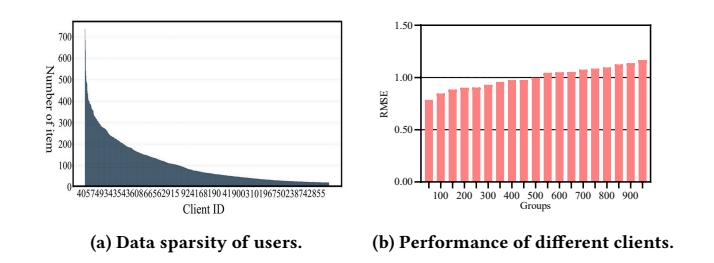
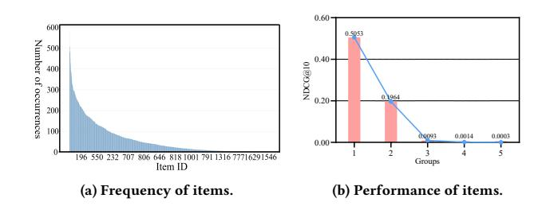
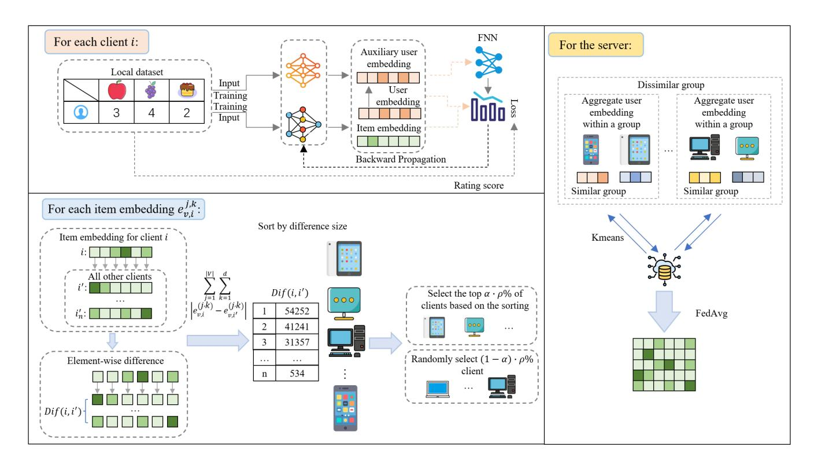
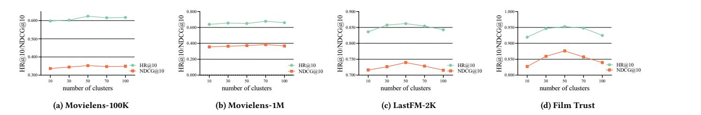
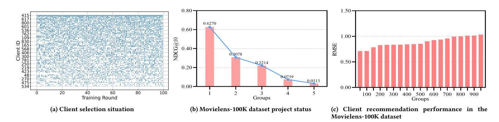

# KE-FedRS: Tackling Data Sparsity in Federated Recommendation via Knowledge Enhancement

[Jiayu Bao](https://orcid.org/0009-0004-6690-427X) School of Artificial Intelligence and Computer Science, Jiangnan University Wuxi, Jiangsu Province, China 7243115008@stu.jiangnan.edu.cn

[Hongjian Shi](https://orcid.org/0000-0003-0743-7806) School of Computer Science, Shanghai Jiao Tong University Shanghai, China shhjwu5@sjtu.edu.cn

[Guanyu Zhang](https://orcid.org/0009-0008-1684-3498) School of Artificial Intelligence and Computer Science, Jiangnan University Wuxi, Jiangsu Province, China guanyu.zhang.cs@outlook.com

[Rui Zhou](https://orcid.org/0009-0006-0406-8485) School of Artificial Intelligence and Computer Science, Jiangnan University Wuxi, Jiangsu Province, China zhourui@stu.jiangnan.edu.cn

[Haozhao Wang](https://orcid.org/0000-0002-7591-5315)∗ School of Computer Science and Technology, Huazhong University of Science and Technology Wuhan, Hubei Province, China hz\_wang@hust.edu.cn

[Yuan Liu](https://orcid.org/0000-0002-2576-1426) School of Artificial Intelligence and Computer Science, Jiangnan University Wuxi, Jiangsu Province, China lyuan1800@jiangnan.edu.cn

### Abstract

Federated recommendation systems (FRSs) have recently gained widespread attention due to their ability to train collaborative recommendation models without exchanging raw user data. However, existing FRSs face a severe challenge of data sparsity, which manifests at both the user and item levels. First, user data sparsity: some users may only have a small number of interactions with items, struggling to adequately train the personalized user embedding locally. Second, item data sparsity: some items may only receive a small number of user ratings, causing the global model to lack knowledge about them. Considering these, we propose the Knowledge Enhanced Federated Recommendation System named as KE-FedRS, of which the core idea is to enhance the knowledge of users with few interactions and items with few ratings at both the local and global levels. Specifically, at the local level, we introduce an auxiliary user embedding and average and aggregate this auxiliary embedding across similar users, thereby enriching the knowledge of the local user embedding. At the global level, we propose a hybrid client selection strategy based on item embedding discrepancies, prioritizing clients that exhibit greater divergence in item embeddings from others, thus enhancing the knowledge of items with fewer interactions in the global model. We conduct comprehensive experiments on four real-world datasets, and the results show that the proposed method consistently outperforms baseline approaches in terms of HR@10 and NDCG@10.

### CCS Concepts

### • Computing methodologies → Reasoning about belief and knowledge; Information extraction.

∗Haozhao Wang is the corresponding author.

[This work is licensed under a Creative Commons Attribution 4.0 International License.](https://creativecommons.org/licenses/by/4.0) WWW '26, Dubai, United Arab Emirates © 2026 Copyright held by the owner/author(s). ACM ISBN 979-8-4007-2307-0/2026/04 <https://doi.org/10.1145/3774904.3792267>

### Keywords

Federated learning, recommendation system, client selection.

### ACM Reference Format:

Jiayu Bao, Hongjian Shi, Guanyu Zhang, Rui Zhou, Haozhao Wang, and Yuan Liu. 2026. KE-FedRS: Tackling Data Sparsity in Federated Recommendation via Knowledge Enhancement. In Proceedings of the ACM Web Conference 2026 (WWW '26), April 13–17, 2026, Dubai, United Arab Emirates. ACM, New York, NY, USA, [10](#page-9-0) pages.<https://doi.org/10.1145/3774904.3792267>

### 1 Introduction

Federated Recommender Systems (FRSs) [\[42,](#page-8-0) [48\]](#page-9-1) combine traditional Recommender Systems [\[1\]](#page-8-1) with Federated Learning (FL) [\[17,](#page-8-2) [39,](#page-8-3) [40\]](#page-8-4), enabling multiple clients to collaboratively train recommendation models using local data, while keeping each client's data on-device and preventing it from being exposed to the central server or other clients. Due to the protection of user data privacy, FRS has received significant attention in recent years. Specifically, FRS typically treats each user as a client, which locally trains the rating model, user embedding, and item embedding using the user's interaction data with items. To protect the privacy of users, only the rating models and item embeddings are then aggregated on the server [\[16\]](#page-8-5). This paradigm can not only provide personalization through local user embeddings but also obtain collaborative generalization knowledge [\[13\]](#page-8-6) from multiple users by leveraging the global rating model and item embeddings.

In recent years, an increasing number of FRS methods have been proposed [\[2,](#page-8-7) [20,](#page-8-8) [44\]](#page-8-9). A fundamental approach is to use FedAvg [\[27\]](#page-8-10) to generate a global model and fine-tune it on the client side [\[47\]](#page-9-2), thereby training personalized recommendation models for each user. In practical federated recommendation scenarios, item interaction data across clients often exhibits non-IID characteristics due to differences in user preferences. Therefore, to enhance the personalization capability of the rating model, other studies have hypothesized that the overall user population can be partitioned into several clusters with similar preferences [\[9,](#page-8-11) [14,](#page-8-12) [31\]](#page-8-13), with a unique rating model trained for each user cluster. This method identifies similar users by clustering rating model parameters, thereby improving the

adaptability of the rating model when facing heterogeneous client data. Some recent methods have also been proposed to address the cold-start problem in FRS [\[19,](#page-8-14) [49\]](#page-9-3), that is, how to generalize the recommendation model to newly joined users, with the core idea being to leverage additional auxiliary information for item recommendation.

Although these methods have achieved significant progress in federated recommendation, they largely overlook the issue of data sparsity. In fact, FRSs face a severe challenge of data sparsity at both the user and item levels. First, user data is sparse, meaning that some users have only a small number of item interactions, making it difficult for these users with few interactions to adequately train the recommendation model locally. Meanwhile, due to the privacy-preserving requirement for user embeddings, they cannot be aggregated globally, leading to a lack of knowledge in user embeddings. Second, item data is also sparse, meaning that certain items are interacted with by only a small number of users, causing the global model to lack knowledge about these items. Specifically, federated recommendation systems typically select a subset of clients uniformly at random, which results in items with fewer user interactions being rarely selected, thereby making it difficult for the global model to learn knowledge about these items.

To address this issue, we propose the Knowledge Enhanced Federated Recommendation System, abbreviated as KE-FedRS, whose core idea is to enhance the knowledge of users with few interactions and items with few ratings at both local and global levels. Specifically, at the local level, we introduce an auxiliary user embedding and average and aggregate this auxiliary embedding across similar users, thereby enhancing and supplementing the knowledge of the local user embedding. At the global level, we propose a hybrid client selection strategy based on item embedding discrepancies, prioritizing clients that exhibit greater divergence in item embeddings from others—specifically, clients possessing rare items—thus enhancing the global model's knowledge of items with fewer interactions. We conduct comprehensive experiments on four real-world datasets, and the results show that the proposed method consistently outperforms baseline approaches in terms of HR@10 and NDCG@10. The contributions of this work are:

- We identify the challenge of data sparsity in FRS, where both certain users and items suffer from insufficient interactions, leading to the user embeddings and rating models being unable to learn adequate knowledge.
- We propose a novel method named KE-FedRS, which enhances and supplements knowledge at both the local and global levels through an auxiliary user embedding and an item-embedding-discrepancy-aware client selection strategy, respectively.
- We conduct comprehensive experiments on four benchmark datasets, showing consistent improvements over strong baselines in terms of both HR@10 and NDCG@10.

# 2 Related Work

# 2.1 Clustering Federated Learning

Federated Learning (FL) is a decentralized machine learning framework that allows numerous clients to jointly train a global model

while safeguarding the confidentiality of local data [\[24,](#page-8-15) [34\]](#page-8-16). Depending on the type of participating clients, FL can be categorized into cross-device FL [\[37\]](#page-8-17), which involves a large number of individual users, and cross-silo FL, where organizations are typically regarded as clients [\[15\]](#page-8-18). A wide range of studies has been devoted to addressing key challenges in FL, including communication efficiency [\[17\]](#page-8-2), privacy preservation [\[10\]](#page-8-19), data heterogeneity [\[51\]](#page-9-4), and the cold-start problem [\[38\]](#page-8-20). Clustered Federated Learning (CFL) [\[6,](#page-8-21) [52\]](#page-9-5) extends FL by clustering similar clients for joint training, thereby improving performance in scenarios with divergent data distributions or non-IID settings and reducing the adverse effects of heterogeneity across clients. To determine cluster partitions, Briggs et al. [\[6\]](#page-8-21) proposed a hierarchical clustering method that computes the similarity between client models and the global model. Sattler et al. [\[33\]](#page-8-22) proposed a bipartitioning method utilizing the cosine similarity of client gradients. Mansour et al. [\[26\]](#page-8-23) allocated each client to the cluster model that minimizes loss. Ruan et al. [\[32\]](#page-8-24) further observed that each client may also follow a mixture model of multiple data distributions and train both local and cluster models under this setting. Bao et al. [\[5\]](#page-8-25) apply clustered federated learning to federated recommendation by grouping clients based on learned representations to mitigate data heterogeneity in cross-device FL. However, these approaches have primarily targeted cross-silo FL, whereas research on cross-device CFL remains relatively limited, mainly due to the massive number of client models and the sparsity of local data.

### 2.2 Federal Recommendation

FRS leverage the advantages of FL to safeguard user privacy throughout the recommendation process [\[43,](#page-8-26) [45,](#page-8-27) [46\]](#page-9-6). FCF [\[2\]](#page-8-7) was the first framework to incorporate the principle of Collaborative Filtering into FRS. Building upon this, FedMF [\[8\]](#page-8-28) and FedNCF [\[30\]](#page-8-29) extended centralized recommendation techniques [\[13,](#page-8-6) [18\]](#page-8-30) to federated settings. FedRec [\[20\]](#page-8-8) investigated explicit feedback in federated recommendation. FedFast [\[29\]](#page-8-31) improved convergence speed by sampling participating users during each training round. FedeRank [\[3\]](#page-8-32) enabled users to control the proportion of data to be shared while training personalized factorization models. To further enhance personalization, PFedRec [\[47\]](#page-9-2) retained the rating prediction module locally and introduced a post-optimization procedure. Furthermore, advanced methodologies such as Graph Neural Networks (GNNs) [\[23\]](#page-8-33) and meta-learning [\[21\]](#page-8-34) have been investigated to enhance FRS performance across various subtasks. Many of the above research have employed a server-centric paradigm, in which a single global model is consolidated at the server and subsequently integrated into the clients' local training. However, when user data distributions exhibit substantial heterogeneity, this strategy may inject noise into the learning process. To mitigate this issue, recent research has shifted toward leveraging clustering methods to construct cluster-specific models, thereby better accommodating diverse user preferences [\[14\]](#page-8-12). For instance, PerFedRec [\[25\]](#page-8-35) clusters similar users based on embedding representations; FPPDM [\[22\]](#page-8-36) addresses multi-domain recommendation by aligning users through their attributes; and SemiDFEGL [\[31\]](#page-8-13) implements device-to-device cooperation to improve scalability, allowing users within the same

Figure 3: At the initial stage of training, the server randomly selects a subset of clients to participate in training. Subsequently, the server computes the discrepancies of item embeddings from each uploaded client and ranks them accordingly. The top �� · ��% of clients are selected for the next round of training, while an additional (1 − ��) · ��% of clients are randomly chosen to join the process. Each client generates an auxiliary user embedding and uploads it to the central server, where clustering is performed, followed by aggregation within each cluster.

### 4.1 The Framework and Workflow

Our approach comprises two main stages: (1) grouping clients based on auxiliary user embeddings, and (2) selecting clients for the next training round according to differences in item embeddings. In the client selection stage, the central server compares the item embeddings of each client with those of all other clients, and selects a subset of clients exhibiting the largest differences to participate in the subsequent training round. In the user partitioning stage, we introduce auxiliary user embeddings at each client, after which a portion of the auxiliary user embeddings is uploaded to the central server. The server subsequently categorizes the clients based on these embeddings, and clients perform intra-group aggregation. The process of the proposed framework is depicted in Algorithm [1,](#page-4-0) whereas Figure [3](#page-3-0) depicts the framework.

### 4.2 Auxiliary User Embedding

Previously, in Section [3,](#page-2-2) we described the traditional federated recommendation training model, where each client contributes local knowledge by uploading its embedding parameters. Inspired by the FedAvg method—which aggregates client models globally and subsequently allows each client to fine-tune locally on the global model—this framework enables collaborative model building. However, due to substantial differences in user preferences, the

distributions of items across clients may be inconsistent, resulting in potential imbalances. If such heterogeneity in user preferences is not accounted for during global aggregation, it may introduce unwanted noise into the recommendation outcomes.

Moreover, collaborative filtering has been widely demonstrated to be effective in recommender systems, as it leverages ratings or interaction data from neighboring users to capture patterns of similar preferences or behaviors with the target user. Consequently, introducing clustering methods to group clients and items prior to server-side aggregation becomes a natural choice, as it can help uncover and exploit latent patterns or similarities. A typical clustering algorithm is K-Means [\[28\]](#page-8-37), which partitions data points based on distance metrics. While K-Means demonstrates strong performance in centralized recommendation settings [\[4,](#page-8-38) [36,](#page-8-39) [50\]](#page-9-7), it faces notable challenges in federated recommendation environments.

In federated recommendation, to effectively capture user preference heterogeneity while preserving user privacy, we introduce an auxiliary user embedding, denoted as �� �� , which are then uploaded to the central server:

�� �� �� = [�� �� (1)||�� �� (2)] (2)

where �� �� (1) and �� �� (2) represent the first and second halves of the user embedding, respectively, where || denotes the vector concatenation operation. After the auxiliary user embeddings are uploaded

Table 1: Statistics of datasets.

| Dataset        | Users | Items  | Interactions | Sparisty |
|----------------|-------|--------|--------------|----------|
| MovieLens-100K | 943   | 1682   | 100,000      | 93.70%   |
| MovieLens-1M   | 6040  | 3706   | 1,000,209    | 95.53%   |
| Lastfm-2K      | 1,600 | 12,454 | 185,650      | 99.07%   |
| FilmTrust      | 1227  | 2059   | 34,888       | 98.62%   |

### 4.4 Discussion of Privacy

Our methods only uploads auxiliary user embeddings to the central server, with still keeping the user embeddings locally. Unlike directly transmitting complete user embeddings, our approach reduces the transmission of sensitive data, thereby minimizing the risk of privacy leakage. In the context of recommendation systems, when attackers attempt to obtain user representations through gradient inversion or statistical correlation methods, they typically seek to acquire the user's true ratings, which are computed based on the user and item embeddings obtained by the attackers. Since the attackers cannot access to the user embedding, the true ratings are thus protected.

### 5 Experiments

### 5.1 Datasets

We conduct experiments on three datasets: Movielens-100k[\[12\]](#page-8-40), Movielens-1M[1](#page-5-0) [\[12\]](#page-8-40), Lastfm-2K[2](#page-5-1) [\[7\]](#page-8-41) and FilmTrust[3](#page-5-2) [\[11\]](#page-8-42). We employ a manifold-based leave-one-out data splitting strategy, randomly partitioning the datasets into training, validation, and test sets with an 8:1:1 ratio. We set the learning rate to 0.01 and the number of local training epochs to 5.

### 5.2 Experimental setup

5.2.1 Baselines. We compare the proposed KE-FedRS model with both general and advanced baseline models, including centralized and federated learning approaches. The hyperparameters are set according to the specifications described in the baseline papers.

Cloud-based recommendation methods:

MF [\[18\]](#page-8-30): MF is a classical recommendation method, whose fundamental idea is to decompose the user–item interaction matrix into the product of low-dimensional user representations and item representations.

NCF [\[13\]](#page-8-6): NCF employs a multi-layer perceptron to perform a nonlinear combination of user embeddings and item embeddings, thereby enabling the modeling of more complex user–item interactions.

Federated recommendation methods:

FedMF [\[8\]](#page-8-28): This method uses matrix factorization in a federated setting to reduce information leakage by encrypting user and item embedding gradients.

FedNCF [\[30\]](#page-8-29): This is the federated adaptation of NCF. It allows local updates of user embeddings on each client while synchronizing item embeddings on the server for global aggregation.

FedRecon [\[35\]](#page-8-43): FedRecon combines globally shared representations with local parameter reconstruction, enabling clients to adapt the global model to personalized user preferences.

SemiDFEGL [\[31\]](#page-8-13): SemiDFEGL adopts a semi-decentralized selfgraph learning framework with partial cross-client connections to capture high-order collaboration while preserving privacy in federated recommendation.

CoFedRec [\[14\]](#page-8-12): CoFedRec employs joint clustering in federated training to aggregate only models from similar users, thereby reducing sparse-feature interference and enhancing personalized recommendation.

FREIB [\[41\]](#page-8-44): FREIB enhances federated NCF with item bias modeling, global distillation, and prototype alignment to mitigate labelskew–induced bias and improve cross-platform recommendation performance.

5.2.2 Evaluation metrics. We evaluate the model performance using Top-K evaluation metrics, including Hit Rate (HR) and Normalized Discounted Cumulative Gain (NDCG). Following the setup from previous work, we fix �� = 10 and employ an efficient sampling strategy: for each user, we randomly select 99 unobserved items, and then perform a ranking evaluation over the 100 items, which includes the test items.

### 5.3 Performance Overview

Main Results. This section evaluates the overall performance of the proposed KE-FedRS, with results summarized in Table [2.](#page-6-0) Several key observations can be drawn. (i) KE-FedRS consistently outperforms all baseline methods across all datasets, with particularly notable gains on the largest dataset, MovieLens-1M. For instance, HR@10 improves from 0.5831 to 0.6775, and NDCG@10 from 0.3216 to 0.3850, highlighting the effectiveness of KE-FedRS in modeling long-tail items and enhancing personalized recommendations. (ii) KE-FedRS achieves the best performance on all four datasets, including both large- and small-scale settings, demonstrating strong robustness and generalization ability. (iii) Compared with centralized approaches, KE-FedRS benefits from selectively involving clients rich in long-tail items and leveraging clustering based on auxiliary user embeddings, which enhances personalization. Moreover, the clustering mechanism effectively aggregates distributed user–item interactions, capturing cross-client user–user and item–item relationships, thereby narrowing the performance gap between federated and centralized recommendation methods.

Ablation Study. This section evaluates the contribution of each component in KE-FedRS. The method consists of two key modules: server-side clustering based on auxiliary user embeddings and client selection. In Table [3,](#page-6-1) we report the corresponding ablated variants as KE-FedRS-w/o cu and KE-FedRS-w/o se. As shown in the results, both components contribute substantially to overall performance. In particular, incorporating client selection yields notable improvements on the MovieLens-1M dataset, highlighting the importance of long-tail items. Meanwhile, server-side clustering effectively groups users with similar preferences, further enhancing personalized recommendation performance.

Analysis of the Number of User Clusters. As illustrated in Figure [4,](#page-7-0) we plot the performance variation of the proposed

1<https://grouplens.org/datasets/movielens/>

2<https://grouplens.org/datasets/hetrec-2011/>

3<https://guoguibing.github.io/librec/datasets.html>

Table 2: Performance on four datasets. (The experimental results are the average of five results.)

| Methods            | HR@10  | Movielens-100K NDCG@10 | HR@10  | Movielens-1M NDCG@10 | HR@10  | LastFM-2K NDCG@10 | Film HR@10 | Trust NDCG@10 |
|--------------------|--------|------------------------|--------|----------------------|--------|-------------------|------------|---------------|
| MF Centralized     | 0.1624 | 0.0262                 | 0.1058 | 0.0152               | 0.1420 | 0.0435            | 0.3179     | 0.0927        |
| NCF                | 0.5814 | 0.3055                 | 0.5199 | 0.2848               | 0.1789 | 0.0915            | 0.8138     | 0.6437        |
| FedMF              | 0.2486 | 0.1277                 | 0.2589 | 0.1235               | 0.2306 | 0.1149            | 0.3755     | 0.1849        |
| FedNCF             | 0.4353 | 0.2771                 | 0.4236 | 0.2790               | 0.7426 | 0.6614            | 0.8831     | 0.7429        |
| FedRecon Federated | 0.4670 | 0.2963                 | 0.4647 | 0.2894               | 0.7762 | 0.6597            | 0.8692     | 0.7404        |
| SemiDFEGL          | 0.5047 | 0.3080                 | 0.5168 | 0.2960               | 0.8058 | 0.6738            | 0.8752     | 0.7909        |
| CoFedRec           | 0.5423 | 0.3222                 | 0.5396 | 0.3208               | 0.8287 | 0.7019            | 0.8844     | 0.8013        |
| FREIB              | 0.5738 | 0.3164                 | 0.5683 | 0.3216               | 0.8341 | 0.7175            | 0.9052     | 0.8324        |
| KE-FedRS(Ours)     | 0.6244 | 0.3426                 | 0.6775 | 0.3850               | 0.8620 | 0.7452            | 0.9526     | 0.8662        |

Table 3: Ablation Study.

| Method          | Movielens-100K HR@10 | NDCG@10 | Movielens-1M HR@10 | NDCG@10 | LastFM-2K HR@10 | NDCG@10 | Film Trust HR@10 | NDCG@10 |
|-----------------|----------------------|---------|--------------------|---------|-----------------|---------|------------------|---------|
| KE-FedRS-w/o cu | 0.5793               | 0.3025  | 0.6169             | 0.3418  | 0.8327          | 0.7164  | 0.8947           | 0.8318  |
| KE-FedRS-w/o se | 0.5980               | 0.3223  | 0.6377             | 0.3615  | 0.8479          | 0.7195  | 0.9169           | 0.8412  |
| KE-FedRS        | 0.6244               | 0.3526  | 0.6775             | 0.3850  | 0.8620          | 0.7396  | 0.9526           | 0.8762  |

method under different numbers of user clusters on the MovieLens-100K and MovieLens-1M datasets. The results show that when the number of clusters is too small, the clustering becomes overly coarse. In this case, a large number of users with highly diverse preferences are grouped into only a few large clusters, which fails to capture fine-grained user preferences and consequently reduces the accuracy of personalized recommendations. In contrast, when the number of clusters is excessively large, users are over-partitioned, resulting in clusters that contain too few users. This leads to cluster centroids that lack representativeness and stability, thereby making it difficult to learn generalizable collaborative knowledge.

Analysis of the Number of Selected Clients. Performance results are presented in Table [4.](#page-6-2) We demonstrate the performance variations of the proposed method with respect to changes in the number of selected clients on the MovieLens-100K and MovieLens-1M datasets. It can be observed that when the number of selected clients is too small, the model is unable to adequately explore longtail items, limiting improvements in personalization and diversity. Conversely, when the number of selected clients is too large, the model fails to effectively learn the popular items, resulting in insufficient gradient updates, which in turn prevents the global model from rapidly learning the fundamental representations of universal user preferences.

Auxiliary User Embedding Analysis. Table [5](#page-7-1) reports two evaluation metrics under different dimensional settings of user embeddings. The results demonstrate that KE-FedRS achieves its best performance with 16-dimensional user embeddings, indicating that it can effectively preserve user-specific characteristics while mitigating aggregation bias caused by data heterogeneity. When

Table 4: The number of clients selected for analysis.

| Percent | HR@10  | Movielens-100K NDCG@10 | HR@10  | LastFM-2K NDCG@10 |
|---------|--------|------------------------|--------|-------------------|
| 1%      | 0.6072 | 0.3288                 | 0.8334 | 0.6980            |
| 5%      | 0.6105 | 0.3319                 | 0.8569 | 0.7166            |
| 10%     | 0.6244 | 0.3526                 | 0.8620 | 0.7396            |
| 15%     | 0.6179 | 0.3378                 | 0.8497 | 0.7103            |
| 20%     | 0.5962 | 0.3029                 | 0.8284 | 0.6838            |

the dimensionality is too low, the embeddings fail to provide sufficiently rich collaborative knowledge for the global model to learn, thereby constraining the accuracy of recommendations. In contrast, when the dimensionality is excessively high, the shared embeddings incorporate an excessive amount of personalized and even noisy features. During the aggregation process, such highly heterogeneous information from different clients tends to conflict, ultimately impairing the model's generalization ability.

Client Participation Analysis in Training. To analyze the dynamic behavior of the proposed hybrid client selection strategy, we examine the client selection process on the MovieLens-100K dataset. As shown in Figure [2b](#page-2-1), the selection exhibits clear nonuniformity and temporal dynamics. In the early training stages, client selection is relatively dispersed and partially random, reflecting the stochastic component for exploration. As training proceeds, the selection gradually concentrates on a subset of clients, forming distinct horizontal clusters. This indicates that the strategy effectively identifies and repeatedly selects clients with large model

Figure 4: Analysis of the Number of User Clusters.

Figure 5: Comparative contrast experiments of motivational experiments.

Table 5: Auxiliary user embedding scale analysis

| Size | HR@10  | Movielens-100K NDCG@10 | HR@10  | Movielens-1M NDCG@10 |
|------|--------|------------------------|--------|----------------------|
| 8    | 0.5470 | 0.2877                 | 0.5942 | 0.3236               |
| 16   | 0.6244 | 0.3526                 | 0.6775 | 0.3850               |
| 32   | 0.6031 | 0.3346                 | 0.6683 | 0.3826               |
| 64   | 0.6015 | 0.3315                 | 0.6561 | 0.3777               |

discrepancies and a higher proportion of long-tail items, validating its effectiveness.

Analysis of Items with Different Frequencies. To examine the effect of item popularity on federated recommendation performance, we group items into ten popularity levels based on their interaction frequency in the training data and evaluate the average NDCG@10 for each group. As shown in Figure [5b,](#page-7-2) KE-FedRS consistently outperforms FedNCF across all popularity levels, demonstrating its superior recommendation capability for both popular and long-tail items.

Performance Analysis under Different Levels of User Data Sparsity. Clients are ranked by the number of interacted items and partitioned into ten groups, with RMSE used as the evaluation metric. As shown in Figure [5c,](#page-7-3) KE-FedRS consistently outperforms FedNCF across all groups, especially for clients with fewer interactions. This demonstrates that KE-FedRS generalizes more effectively

under data sparsity and learns more robust user preference representations.

### 6 Conclusion

This paper addresses the challenge of user andd item data sparsity in existing federated recommendation systems. To tackle this challenge, we propose KE-FedRS, a novel framework designed to enrich the representation of users with limited interaction history and items with sparse ratings, operating at both local and global scales. At the local scale, we design an auxiliary user embedding module that captures collaborative signals from users with similar behavior patterns. By averaging and aggregating this auxiliary embedding across neighboring users, we effectively augment the representational capacity of the local user embedding. At the global scale, we develop a discrepancy-aware client selection mechanism that identifies and prioritizes participants whose item embeddings significantly deviate from the global consensus—typically those interacting with less common (rare) items. This strategy ensures that underrepresented items receive adequate attention during model aggregation, thereby improving the global model's understanding of rare items. We conduct comprehensive experimental evaluations on four real-world datasets. The experimental results demonstrate that the proposed method significantly outperforms existing baseline models in terms of both HR@10 and NDCG@10.

### Acknowledgments

This work is supported by the National Natural Science Foundation of China under grant number 62472200 and 62302184.

- References [1] Gediminas Adomavicius and Alexander Tuzhilin. 2005. Toward the next generation of recommender systems: A survey of the state-of-the-art and possible extensions. IEEE transactions on knowledge and data engineering 17, 6 (2005), 734–749. [2] Muhammad Ammad-Ud-Din, Elena Ivannikova, Suleiman A Khan, Were Oyomno, Qiang Fu, Kuan Eeik Tan, and Adrian Flanagan. 2019. Federated collaborative filtering for privacy-preserving personalized recommendation system. arXiv preprint arXiv:1901.09888 (2019). [3] Vito Walter Anelli, Yashar Deldjoo, Tommaso Di Noia, Antonio Ferrara, and Fedelucio Narducci. 2021. Federank: User controlled feedback with federated recommender systems. In European Conference on Information Retrieval. Springer, 32–47. [4] Tevfik Aytekin and Mahmut Özge Karakaya. 2014. Clustering-based diversity improvement in top-N recommendation. Journal of Intelligent Information Systems 42, 1 (2014), 1–18. [5] Jiayu Bao, Yicheng Di, Song Shen, Rongsheng Hu, and Yuan Liu. 2026. Personalized semi-decentralized federated recommender. Information Processing & Management 63, 2 (2026), 104360. [6] Christopher Briggs, Zhong Fan, and Peter Andras. 2020. Federated learning with hierarchical clustering of local updates to improve training on non-IID data. In 2020 international joint conference on neural networks (IJCNN). IEEE, 1–9. [7] Iván Cantador, Peter Brusilovsky, and Tsvi Kuflik. 2011. Second workshop on information heterogeneity and fusion in recommender systems (HetRec2011). In Proceedings of the fifth ACM conference on Recommender systems. 387–388. [8] Di Chai, Leye Wang, Kai Chen, and Qiang Yang. 2020. Secure federated matrix factorization. IEEE Intelligent Systems 36, 5 (2020), 11–20. [9] Gabriel Frisch, Jean-Benoist Leger, and Yves Grandvalet. 2021. Co-clustering for fair recommendation. In Joint European Conference on Machine Learning and Knowledge Discovery in Databases. Springer, 607–630. [10] Robin C Geyer, Tassilo Klein, and Moin Nabi. 2017. Differentially private federated learning: A client level perspective. arXiv preprint arXiv:1712.07557 (2017). [11] Guibing Guo, Jie Zhang, and Neil Yorke-Smith. 2013. A novel Bayesian similarity measure for recommender systems. In Proceedings of the Twenty-Third International Joint Conference on Artificial Intelligence (Beijing, China) (IJCAI '13). AAAI Press, 2619–2625. [12] F Maxwell Harper and Joseph A Konstan. 2015. The movielens datasets: History and context. Acm transactions on interactive intelligent systems (tiis) 5, 4 (2015), 1–19. [13] Xiangnan He, Lizi Liao, Hanwang Zhang, Liqiang Nie, Xia Hu, and Tat-Seng Chua. 2017. Neural collaborative filtering. In Proceedings of the 26th international conference on world wide web. 173–182. [14] Xinrui He, Shuo Liu, Jacky Keung, and Jingrui He. 2024. Co-clustering for federated recommender system. In Proceedings of the ACM Web Conference 2024. 3821–3832. [15] Chao Huang, Jianwei Huang, and Xin Liu. 2022. Cross-silo federated learning: Challenges and opportunities. arXiv preprint arXiv:2206.12949 (2022). [16] Sai Praneeth Karimireddy, Martin Jaggi, Satyen Kale, Mehryar Mohri, Sashank Reddi, Sebastian U Stich, and Ananda Theertha Suresh. 2021. Breaking the centralized barrier for cross-device federated learning. Advances in Neural Information Processing Systems 34 (2021), 28663–28676. [17] Jakub Konečny, H Brendan McMahan, Daniel Ramage, and Peter Richtárik. 2016. ` Federated optimization: Distributed machine learning for on-device intelligence. arXiv preprint arXiv:1610.02527 (2016). [18] Yehuda Koren, Robert Bell, and Chris Volinsky. 2009. Matrix factorization techniques for recommender systems. Computer 42, 8 (2009), 30–37. [19] Yichen Li, Yijing Shan, Yi Liu, Haozhao Wang, Wei Wang, Yi Wang, and Ruixuan
- Li. 2025. Personalized Federated Recommendation for Cold-Start Users via Adaptive Knowledge Fusion. In Proceedings of the ACM on Web Conference 2025, WWW 2025, Sydney, NSW, Australia, 28 April 2025- 2 May 2025. ACM, 2700–2709. [20] Guanyu Lin, Feng Liang, Weike Pan, and Zhong Ming. 2020. Fedrec: Federated recommendation with explicit feedback. IEEE Intelligent Systems 36, 5 (2020), 21–30. [21] Yujie Lin, Pengjie Ren, Zhumin Chen, Zhaochun Ren, Dongxiao Yu, Jun Ma, Maarten de Rijke, and Xiuzhen Cheng. 2020. Meta matrix factorization for federated rating predictions. In Proceedings of the 43rd International ACM SIGIR Conference on Research and Development in Information Retrieval. 981–990. [22] Weiming Liu, Chaochao Chen, Xinting Liao, Mengling Hu, Jianwei Yin, Yanchao Tan, and Longfei Zheng. 2023. Federated Probabilistic Preference Distribution Modelling with Compactness Co-Clustering for Privacy-Preserving Multi-Domain Recommendation.. In IJCAI. 2206–2214. [23] Zhiwei Liu, Liangwei Yang, Ziwei Fan, Hao Peng, and Philip S Yu. 2022. Federated social recommendation with graph neural network. ACM Transactions on Intelligent Systems and Technology (TIST) 13, 4 (2022), 1–24. [24] Guodong Long, Ming Xie, Tao Shen, Tianyi Zhou, Xianzhi Wang, and Jing Jiang. 2023. Multi-center federated learning: clients clustering for better personalization. World Wide Web 26, 1 (2023), 481–500. [25] Sichun Luo, Yuanzhang Xiao, and Linqi Song. 2022. Personalized federated recommendation via joint representation learning, user clustering, and model adaptation. In Proceedings of the 31st ACM international conference on information & knowledge management. 4289–4293. [26] Yishay Mansour, Mehryar Mohri, Jae Ro, and Ananda Theertha Suresh. 2020. Three approaches for personalization with applications to federated learning. arXiv preprint arXiv:2002.10619 (2020). [27] Brendan McMahan, Eider Moore, Daniel Ramage, Seth Hampson, and Blaise Aguera y Arcas. 2017. Communication-efficient learning of deep networks from decentralized data. In Artificial intelligence and statistics. PMLR, 1273–1282. [28] James B McQueen. 1967. Some methods of classification and analysis of multivariate observations. In Proc. of 5th Berkeley Symposium on Math. Stat. and Prob. 281–297. [29] Khalil Muhammad, Qinqin Wang, Diarmuid O'Reilly-Morgan, Elias Tragos, Barry Smyth, Neil Hurley, James Geraci, and Aonghus Lawlor. 2020. Fedfast: Going beyond average for faster training of federated recommender systems. In Proceedings of the 26th ACM SIGKDD international conference on knowledge discovery & data mining. 1234–1242. [30] Vasileios Perifanis and Pavlos S Efraimidis. 2022. Federated neural collaborative filtering. Knowledge-Based Systems 242 (2022), 108441. [31] Liang Qu, Ningzhi Tang, Ruiqi Zheng, Quoc Viet Hung Nguyen, Zi Huang, Yuhui Shi, and Hongzhi Yin. 2023. Semi-decentralized federated ego graph learning for recommendation. In Proceedings of the ACM web conference 2023. 339–348. [32] Yichen Ruan and Carlee Joe-Wong. 2022. Fedsoft: Soft clustered federated learning with proximal local updating. In Proceedings of the AAAI conference on artificial intelligence, Vol. 36. 8124–8131. [33] Felix Sattler, Klaus-Robert Müller, and Wojciech Samek. 2020. Clustered federated learning: Model-agnostic distributed multitask optimization under privacy constraints. IEEE transactions on neural networks and learning systems 32, 8 (2020), 3710–3722. [34] Hongjian Shi, Jianqing Zhang, Shuming Fan, Ruhui Ma, and Haibing Guan. 2023. PFedEff: an efficient and personalized federated cognitive learning framework in multiagent systems. IEEE Transactions on Cognitive and Developmental Systems 16, 1 (2023), 31–45. [35] Karan Singhal, Hakim Sidahmed, Zachary Garrett, Shanshan Wu, John Rush, and Sushant Prakash. 2021. Federated reconstruction: Partially local federated learning. Advances in Neural Information Processing Systems 34 (2021), 11220– 11232. [36] Yonghong Tian, Bing Zheng, Yanfang Wang, Yue Zhang, and Qi Wu. 2019. College library personalized recommendation system based on hybrid recommendation algorithm. Procedia cirp 83 (2019), 490–494. [37] Muhammad Habib ur Rehman, Ahmed Mukhtar Dirir, Khaled Salah, Ernesto Damiani, and Davor Svetinovic. 2021. TrustFed: A framework for fair and trustworthy cross-device federated learning in IIoT. IEEE Transactions on Industrial Informatics 17, 12 (2021), 8485–8494. [38] Omar Abdel Wahab, Gaith Rjoub, Jamal Bentahar, and Robin Cohen. 2022. Federated against the cold: A trust-based federated learning approach to counter the cold start problem in recommendation systems. Information Sciences 601 (2022), 189–206. [39] Haozhao Wang, Yabo Jia, Meng Zhang, Qinghao Hu, Hao Ren, Peng Sun, Yonggang Wen, and Tianwei Zhang. 2024. FedDSE: Distribution-aware Sub-model Extraction for Federated Learning over Resource-constrained Devices. In Proceedings of the ACM on Web Conference 2024, WWW 2024, Singapore, May 13-17, 2024, Tat-Seng Chua, Chong-Wah Ngo, Ravi Kumar, Hady W. Lauw, and Roy Ka-Wei Lee (Eds.). ACM, 2902–2913. [40] Haozhao Wang, Haoran Xu, Yichen Li, Yuan Xu, Ruixuan Li, and Tianwei Zhang. [n. d.]. FedCDA: Federated Learning with Cross-rounds Divergence-aware Aggregation. In The Twelfth International Conference on Learning Representations, ICLR 2024, Vienna, Austria, May 7-11, 2024. [41] Zhihao Wang, He Bai, Wenke Huang, Duantengchuan Li, Jian Wang, and Bing
  - Li. 2025. Federated recommendation with explicitly encoding item bias. In Proceedings of the AAAI Conference on Artificial Intelligence, Vol. 39. 12792–12800. [42] Chuhan Wu, Fangzhao Wu, Yang Cao, Yongfeng Huang, and Xing Xie. 2021. Fedgnn: Federated graph neural network for privacy-preserving recommendation. arXiv preprint arXiv:2102.04925 (2021). [43] Liu Yang, Ben Tan, Vincent W Zheng, Kai Chen, and Qiang Yang. 2020. Federated recommendation systems. In Federated Learning: Privacy and Incentive. Springer, 225–239. [44] Wei Yuan, Liang Qu, Lizhen Cui, Yongxin Tong, Xiaofang Zhou, and Hongzhi Yin. 2024. Hetefedrec: Federated recommender systems with model heterogeneity. In 2024 IEEE 40th International Conference on Data Engineering (ICDE). IEEE, 1324–1337. [45] Wei Yuan, Chaoqun Yang, Liang Qu, Quoc Viet Hung Nguyen, Jianxin Li, and Hongzhi Yin. 2024. Hide your model: A parameter transmission-free federated recommender system. In 2024 IEEE 40th International Conference on Data Engineering (ICDE). IEEE, 611–624.

[46] Wei Yuan, Hongzhi Yin, Fangzhao Wu, Shijie Zhang, Tieke He, and Hao Wang. 2023. Federated unlearning for on-device recommendation. In Proceedings of the sixteenth ACM international conference on web search and data mining. 393–401. [47] Chunxu Zhang, Guodong Long, Tianyi Zhou, Peng Yan, Zijian Zhang, Chengqi Zhang, and Bo Yang. 2023. Dual personalization on federated recommendation. arXiv preprint arXiv:2301.08143 (2023). [48] Chunxu Zhang, Guodong Long, Tianyi Zhou, Zijian Zhang, Peng Yan, and Bo Yang. 2024. GPFedRec: Graph-Guided Personalization for Federated Recommendation. In Proceedings of the 30th ACM SIGKDD Conference on Knowledge Discovery and Data Mining, KDD 2024, Barcelona, Spain, August 25-29, 2024, Ricardo Baeza-Yates and Francesco Bonchi (Eds.). ACM, 4131–4142. [49] Chunxu Zhang, Guodong Long, Tianyi Zhou, Zijian Zhang, Peng Yan, and Bo Yang. 2024. When Federated Recommendation Meets Cold-Start Problem: Separating Item Attributes and User Interactions. In Proceedings of the ACM on Web Conference 2024, WWW 2024, Singapore, May 13-17, 2024. ACM, 3632–3642. [50] Jia Zhang, Yaojin Lin, Menglei Lin, and Jinghua Liu. 2016. An effective collaborative filtering algorithm based on user preference clustering. Applied Intelligence 45, 2 (2016), 230–240. [51] Jianqing Zhang, Yang Liu, Yang Hua, and Jian Cao. 2024. Fedtgp: Trainable global prototypes with adaptive-margin-enhanced contrastive learning for data and model heterogeneity in federated learning. In Proceedings of the AAAI conference on artificial intelligence, Vol. 38. 16768–16776. [52] Yuxin Zhang, Haoyu Chen, Zheng Lin, Zhe Chen, and Jin Zhao. 2024. FedAC: An Adaptive Clustered Federated Learning Framework for Heterogeneous Data. arXiv preprint arXiv:2403.16460 (2024).