# Long Story Short: Auditing U.S. Political Polarization in Recommendations for Long- vs. Short-form Videos on YouTube

[Shaokang Jiang](https://orcid.org/0009-0008-7198-0786) shj002@ucsd.edu University of California San Diego San Diego, USA

[Arshia Arya](https://orcid.org/0000-0002-8043-4196) aarshia@ucsd.edu University of California San Diego San Diego, USA

[Seoyoung Kweon](https://orcid.org/0009-0006-2120-3570) pekweon@ucsd.edu University of California San Diego San Diego, USA

[Ivan Liang](https://orcid.org/0009-0003-3397-9518) ivliang@ucsd.edu University of California San Diego San Diego, USA

[Deepak Kumar](https://orcid.org/0000-0002-0224-5031) kumarde@ucsd.edu University of California San Diego San Diego, USA

[Kristen Vaccaro](https://orcid.org/0000-0002-9843-942X) kvaccaro@ucsd.edu University of California San Diego San Diego, USA

# Abstract

YouTube is the world's most widely used video platform, with over 70% of content viewed through algorithmic recommendations. While prior audits have examined polarization in YouTube's longform video recommendations, the platform's fast-growing Shorts feature remains understudied. In this paper, we present the first large-scale audit comparing political content exposure and engagement dynamics across short-form and long-form videos on YouTube. We design a matched audit based on the insight that many news media organizations publish both short and long versions of the same content and collect 50,000 pairs of long-form and short-form video recommendations from both political and nonpolitcal seed videos. We analyze recommendations along several dimensions: the frequency of political recommendations, the diversity of retrieved videos, the engagement those videos receive, and finally, the partisan alignment between recommended videos and seed videos. Our results highlight fundamental differences between each algorithm, which we hope we can inform future research in analyzing the impact of YouTube recommendations.

## CCS Concepts

• Information systems → Recommender systems; • Humancentered computing → Empirical studies in collaborative and social computing; • Applied computing → Law, social and behavioral sciences.

#### Keywords

Online Polarization, Partisan Leaning, Auditing, Recommendations

#### ACM Reference Format:

Shaokang Jiang, Arshia Arya, Seoyoung Kweon, Ivan Liang, Deepak Kumar, and Kristen Vaccaro. 2026. Long Story Short: Auditing U.S. Political Polarization in Recommendations for Long- vs. Short-form Videos on YouTube. In Proceedings of the ACM Web Conference 2026 (WWW '26), April 13–17, 2026, Dubai, United Arab Emirates. ACM, New York, NY, USA, [12](#page-11-0) pages. <https://doi.org/10.1145/3774904.3792277>

[This work is licensed under a Creative Commons Attribution 4.0 International License.](https://creativecommons.org/licenses/by/4.0) WWW '26, Dubai, United Arab Emirates © 2026 Copyright held by the owner/author(s). ACM ISBN 979-8-4007-2307-0/2026/04 <https://doi.org/10.1145/3774904.3792277>

# 1 Introduction

Given YouTube's central role in global information access, many researchers have sought to measure the impacts of its recommendation algorithm, which serves over 70% of content watched on the platform [\[34\]](#page-8-0). Researchers have examined the algorithm's impact on a range of topics, from filter bubbles to misinformation [\[15,](#page-8-1) [18\]](#page-8-2). In particular, researchers have focused on political polarization on YouTube, where YouTube tends to recommend videos to end-users that can lead users down a rabbit hole of extremist political content [\[16,](#page-8-3) [30\]](#page-8-4). In response, YouTube has published many updates to their recommendation algorithms seeking to reduce exposure to such "borderline" content [\[46,](#page-8-5) [47\]](#page-8-6).

In tandem with these updates, YouTube has also invested in YouTube Shorts—a short-form video platform with its own, separate recommendation algorithm. Short-form content has emerged as a fast growing feature on YouTube [\[42\]](#page-8-7) following the rapid proliferation of short-form content on many other platforms like TikTok and Instagram Reels [\[36\]](#page-8-8). Some have argued that the recommendations in these short-form video feeds are more personalized based on watch times, likes and other interaction patterns [\[7,](#page-8-9) [43\]](#page-8-10). Unfortunately, not much is known about the YouTube Shorts recommendation algorithm, especially in how it compares to the recommendation algorithm for more traditional long-form content with regards to politicization and online polarization.

In this paper, we present the first large-scale audit comparing YouTube's short-form and long-form recommendation systems, focusing specifically on political content and polarization dynamics. We leverage a key insight about YouTube—which is that channels often post long-form and short-form videos of the same video content—and use this insight to design a matched experimental audit where we pair long-form videos with identical short-form content and explore the recommendations generated from each algorithm. We extracted recommendation chains for 500 matched pairs each of political and nonpolitical seed videos, and ultimately collected 100,000 recommended videos across our experiments. We explore four aspects of the recommended videos: 1) politicization, 2) diversity, 3) partisan leaning, and 4) engagement.

We find that recommended short-form videos are much less likely to be political (6.3% of videos) compared to long-form recommendations (72%) regardless of whether the initial videos were political or nonpolitical. Long-form videos tend to be more diverse

compared to short-form videos, however, long-form recommendations tend to be sourced from a smaller set of channels compared to short-form content. When recommending political content, the long-form recommendation algorithms tends to align closely with the initial seed videos partisan leaning, compared to recommendations for short-form content which tend to skew right-leaning regardless of the partisan leaning of initial seeds, highlighting fundamental differences between the two recommendation algorithm's strategies. Finally, we find that short-form recommendations tend to have higher engagement, with stronger partisan leaning aligning with more aggregate engagement.

Our findings suggest that modality plays a critical and underexplored role in shaping algorithmic political exposure. As platforms increasingly push short-form content and consumers, particularly younger users [\[36\]](#page-8-8), increasingly rely on these feeds for news and political information [\[17\]](#page-8-11), understanding whether short-form video recommendations mitigate or exacerbate political polarization is imperative. We hope our work will spur further research into how these algorithms shape society. To support this future research, we have released our tool and all video recommendations[1](#page-1-0) .

# 2 Related Work

YouTube Shorts has emerged as a widely adopted feature on YouTube, following the popularity of other short-form content like TikTok and Instagram Reels. Researchers have studied hyperpersonalization in recommendations provided by other short-form platforms, like TikTok [\[6\]](#page-8-12), but no research as of yet has analyzed and compared recommendations from matched long- and short-form content.

#### 2.1 Auditing YouTube

YouTube's cultural reach and opaque algorithms have prompted a wave of third-party audit studies, which have helped in gaining insight into black box recommender systems [\[12,](#page-8-13) [35\]](#page-8-14). Several studies have analyzed YouTube's role in promoting misinformation. Researchers have applied a variety of methods, including scraping [\[18\]](#page-8-2), sock puppets [\[37,](#page-8-15) [41\]](#page-8-16), and crowdsourced audits [\[21\]](#page-8-17) to study misinformation presence on YouTube. These audits showed how even neutral users can be pulled into misinformation "rabbit holes", even when other work that demonstrates how long-form recommendations often drift ideologically over time [\[16\]](#page-8-3). Many studies use "sock puppets", that is, fully automated, fictitious user accounts that simulate different viewing behaviors to interact with platforms under tightly controlled conditions, testing a variety of algorithmic systems [\[5,](#page-8-18) [26,](#page-8-19) [33\]](#page-8-20). Other work has analyzed how modifications to auditing mechanisms, such as the choice of seed videos or video watch time, affect YouTube's recommendations [\[9,](#page-8-21) [10\]](#page-8-22).

#### 2.2 Online Polarization

The influence of media on end users' political views is popular topic of study in recent years [\[1,](#page-8-23) [20\]](#page-8-24). Early work in this area studied individual-driven selective exposure and showed that people's preferences in news organizations are highly dependent on their political stance [\[20\]](#page-8-24). This effect has been oft-described as an "echo chamber" where individuals selectively consume content from likeminded media or other individuals [\[39\]](#page-8-25). Researchers have continued

to find that exposure to certain media can later lead users to echochambers of a single political leaning [\[40\]](#page-8-26).

Researchers have also studied the extent to which this effect is translated to and compounded by social media. Some of this work focuses on Twitter or Instagram, finding that political content shared on social media is highly segregated due to users' selective avoidance of cross-cutting content [\[11,](#page-8-27) [29\]](#page-8-28). One of them described it as a "filter bubble", specifically focusing on the Internet and social media [\[28\]](#page-8-29). Other work expands on the phenomenon by not only measuring the user click through rate on cross-cutting content, but also by measuring the diversity of political content displayed by the recommendation system on Facebook [\[4\]](#page-8-30).

#### 2.3 Online Polarization by Recommendation Systems

Recommendation systems on social media have been a key focus for understanding online polarization [\[32\]](#page-8-31). While some studies have examined platforms such as Facebook and Instagram [\[2,](#page-8-32) [14\]](#page-8-33), our work aligns the most closely with research on YouTube [\[45\]](#page-8-34). This includes the influence of filter bubbles on YouTube's recommendation systems on end-user radicalization [\[31\]](#page-8-35), how to protect users from radicalization via recommender systems [\[15,](#page-8-1) [44\]](#page-8-36), and the rabbit holes enabled by social media recommendation systems [\[24,](#page-8-37) [27\]](#page-8-38). Recent work provides recommendation algorithms that can ensure both inter-user and intra-user diversity, which reduces filter bubbles while maintaining personalized recommendations [\[3\]](#page-8-39).

Despite YouTube Shorts' rapid adoption, there remain few systematic comparisons between its recommendation dynamics and those of traditional long-form content. One study suggests Shorts differ fundamentally in their engagement metrics, having shorter lifespans, higher immediate engagement, and different content category distributions compared to regular videos [\[42\]](#page-8-7). Algorithmic biases create filter bubbles distinctly in Shorts [\[38\]](#page-8-40), and such biases in recommendations may manifest distinctly due to Shorts' thumbnail-driven browsing interface [\[8\]](#page-8-41). Our research expands on this, identifying the distinct impacts each format has on users' political exposure and polarization trajectories.

# 3 Methods

To audit recommendations of YouTube long-form videos versus short-form videos, we build a system that could match videos across formats, play videos simultaneously, and record the resultant recommendations. Our overall collection strategy involves 1) identifying channels that contain significant political videos, 2) finding videos that contain both a long-form version and a short-form version, 3) recording recommendations for each long-short pair, and 4) labeling and classifying the resultant recommendations. In this section, we detail each phase of our data collection pipeline (shown in Figure [1\)](#page-2-0) and data analysis strategy. We provide the full code and data1 .

# 3.1 Identifying Channels and Collecting Videos

To identify channels that are likely to host political content, we began by investigating the 52 mainstream media channels from All-Sides, a well-known media bias rating platform that classifies news outlets based on their partisan leaning. We selected all channels

Figure 1: Overview of the data collection process. A key insight in this audit was the observation that media organizations often clip highlights of their own videos, allowing perfectly matched long- and short-form videos from the same media organizations.

with an official YouTube channel and at least one short-form video: 16 left–,6 center–, and 18 right-leaning media organizations.

We used YouTube's official API to fetch every video published by each outlet between July 27, 2023, and July 27, 2024. In total, the channels contained 142,152 long-form videos and 30,949 short-form videos, with an average of 3,448 long-form videos and 696 shortform videos per channel. This initial videos dataset included 75,189 videos from left-leaning media organizations (64,100 longs, 11,089 shorts), 36,252 videos from center-leaning media organizations (32,289 longs, 3,963 shorts), and 54,299 videos from right-leaning media organizations (41,512 longs, 12,787 shorts). We excluded 4,251 videos that contained no metadata (e.g., title, description), and 17,184 videos that contained only music or non-English content.

# 3.2 Matching Long- and Short-form Videos

A key strategy of our audit is to examine recommendations that come from the same underlying video content—meaning the shortform video is a short clip of the long-form video. This allows us to restrict our audit of each recommendation system to a pixel-bypixel match of content; the only difference is the video modality.

To identify matches between long- and short-form videos, we used a transcript-based similarity score with a threshold of 0.6. For each pair of video transcripts, we summed the length of all matching n-gram sequences, normalizing by the token length of the short-form transcript. Additionally, we excluded any pairs whose longest common matching sequence contained fewer than five words. This approach tolerates interruptions from random stop words within common sequences. Additionally, we noticed some very long videos (longer than 22.5 minutes), very short videos (fewer than 10 unique words) and unrealistic publication dates (short-form published before long-form, or more than two weeks apart) were rarely paired with a complementary video and so we excluded them from our matching process. These filters removed 5,105 long-form videos and 927 short-form videos. We evaluated our matching strategy with 826 human-labeled ground-truth pairs and found it achieved a 97% accuracy with 0.95 precision and 0.96 recall. A more detailed evaluation is presented in Appendix [B.](#page-9-0)

# 3.3 Selecting Seed Video Pairs

Our audit mirrors prior video audits [\[16,](#page-8-3) [45\]](#page-8-34), which typically play a predetermined chain of videos (called "seed videos") to prime the recommendation algorithm before collecting recommendations. Prior work showed YouTube's recommendation system exhibits a strong recency bias, with the most recently watched video having the largest effect [\[9\]](#page-8-21). Given our interest in the differences in recommendations between political seed videos and apolitical seed videos, we first sought to determine whether a video is political or apolitical. To do this, we used a large language model (Gemini 2.0 Flash-Lite) as a binary classifier. We prompted the model with the video transcript and a rubric specifying five criteria: whether the video mentioned political movements, events, figures, entities, or policy-related issues, with illustrative examples for each. To validate our classifier, one team member classified 253 videos selected from the dataset at random as political or apolitical; the classifier achieved an accuracy of 92.5% and an F1 of 0.92. Our full prompt is included in Appendix [A.](#page-9-1) Ultimately, we identified 5,916 political long-short pairs and 1,506 apolitical long-short pairs.

We next randomly sampled political and apolitical pairs that we ultimately use as "seed videos" in our analysis. Based on prior work [\[10\]](#page-8-22), we play a chain of 10 seed videos before collecting recommendations. Ultimately, we sample 500 sets of 10 seed pairs for both political and nonpolitical content. 50 recommendations are collected for each set of seed videos, resulting in 25K pairs of recommendations, for the political and nonpolitical conditions, and eventually 50K pairs of recommendations after including both longand short-form video pairs.

## 3.4 Collecting Recommendations

To collect recommendations, we used two identically configured fake user accounts[2](#page-2-1) , commonly referred to as sock puppet accounts. We used Python and Selenium with Chrome webdrivers and cleared history and cookies between each seed video set. We also deployed each with driver with the Stands Adblocker extension.[3](#page-2-2) . One account interacted exclusively with the long-form YouTube recommendation system, the other engaged exclusively with the shortform recommendation system.

For both sock puppet accounts, we collected recommendations by using either the "play next" (in long-form) or "scroll down" (in

2While we refer to these as "accounts" in our data collection pipeline, both used browsers without logging in to a Google account, and were therefore anonymous from the perspective of the YouTube recommendations.

3<https://www.standsapp.org/>

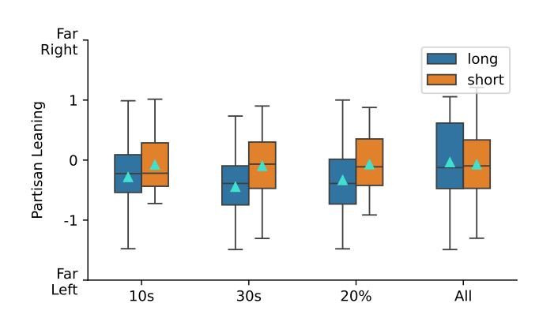

Figure 2: Partisan Leaning for Different Watch-times. To set the watch-time for all experiments, we compare the partisan leaning in recommendations for perfectly matched seed videos for four conditions: 10 seconds, 30 seconds, 20% of the video, and the entire video. The 10 second condition is most similar to watching the entire video.

short-form) buttons. We did not use the "watch next" feed, typically shown alongside long-form videos in the sidebar, to ensure similarity across conditions[4](#page-3-0) . If the full chain of 50 recommendations could not be collected due to YouTube rate limits or age-restricted content, we repeated the process with the original seed video set until we could obtain a complete recommendation chain. After completing the recommendation collection, we recorded metadata for each recommended video (e.g., title, video ID, description, engagement metrics, and transcript). As in prior YouTube audits [\[9,](#page-8-21) [18,](#page-8-2) [41\]](#page-8-16), watch history is treated as the sole lever for personalization, excluding interactions such as likes, comments, or subscriptions.

Assessing the Partisan Leaning of Recommendations. We classify the partisan leaning of each recommended video using the video's title, channel, tags, and description, using a previously validated method from prior work on assessing the partisan leaning of YouTube videos [\[23\]](#page-8-42). The model takes in these video features and outputs a continuous score from -2 (left) to +2 (right).

Choosing Watch-times for Seed Videos. One critical question is how long each account should watch each seed video to prime the recommendation algorithm. To explore this choice, we examined the impact of several watch time conditions on the partisan leaning of recommendations[5](#page-3-1) . We examined four conditions: 10 seconds, 30 seconds, 20% of the video length with a minimum of 5 seconds, and the entire video length, which were informed by prior work [\[10\]](#page-8-22). We then selected 10 seed video pairs sets (10 pairs of videos each, for 200 videos total). Every condition was tested using identical seed video sets, to ensure recommendations are perfectly matched.

Figure [2](#page-3-2) shows the results of our experiment across each condition. An analysis of variance test between all four conditions and the leaning score shows there is a significant difference across conditions for long-form videos (�� (3, 1541) = 30, �� &lt; 0.01), while

| Seed Videos     | Political | Recommended | Videos | Non-political |
|-----------------|-----------|-------------|--------|---------------|
| Political Long  | 14009     | 57%         | 10701  | 43%           |
| Non-political   | 9796      | 40%         | 14988  | 60%           |
| Political Short | 700       | 3%          | 24040  | 97%           |
| Non-political   | 166       | 1%          | 24391  | 99%           |

Table 1: Political and non-political recommendations. Unsurprisingly, political seed videos are more likely to produce political recommendations (and vice versa); however, shortform videos are much less likely to include political video recommendations than long-form videos.

we observed no significant difference in political leaning of recommendations in short-form video content (�� (3, 309) = 0.05, �� = 0.98). Comparing each condition with honest significant difference posthoc analyses, we observed that each of the 10s, 30s, and 20% conditions are statistically significantly different from watching the entire video (�� < 0.01), however, the 10s condition showed the smallest effect size difference compared to other conditions. As such, we selected 10 seconds as our main experimental condition.

#### 3.5 Dataset

The resulting dataset contains 100,000 recommended videos (50,000 pairs) sourced from 500 sets of political seed video pairs and 500 sets of apolitical seed videos pairs.

# 4 Analysis and Results

In this section, we present our analysis of recommendations of longand short-form videos. In particular, we focus our attention on how each recommendation algorithm impacts the political nature, diversity, engagement properties, and partisan leaning of retrieved recommendations.

# 4.1 Politicization

We begin by exploring the politicization and diversity of retrieved recommendations. We identify whether each recommended video is political based on the methodology described in Section [3.1.](#page-1-1) Across all recommendations with available metadata, we observe that 25% (24,671) of them are political and 75% (74,120) are nonpolitical. Of political videos, 97% (23,805) are from long-form recommendations compared to just 3% (866) from short-form recommendations.

Across both video formats, our results show that political seed videos were more likely to generate political recommendations than nonpolitical seed videos. 57% of long-form recommendations from political seeds were political in nature compared to 40% of long-form recommendations from nonpolitical seed videos; similarly, 3% of short-form recommendations from political seeds were political compared to 1% of recommendations from nonpolitical seeds. In general, we observed that long-form recommendations were much more likely to be political than short-form recommendations (48% vs. 1.8%) regardless of seed video type. Table [1](#page-3-3) shows each distribution in full across both video modalities. For political and nonpolitical seed videos, the proportions of political content

4However, we provide a brief comparative analysis in Appendix [F](#page-10-0)

5Additional analyses of watch-times provided in Appendix [C](#page-9-2)

generated by long- and short-form recommendations differed significantly. A Chi-squared test confirmed these differences for political seeds (�� 2 = 17163.82, �� &lt; 0.0001) and for nonpolitical seeds (�� 2 = 11553.53, �� &lt; 0.0001).

#### 4.2 Diversity

We next explore the diversity of returned recommendations in two ways—channel diversity and unique video diversity.

Channel diversity. One explanation for the higher prevalence of political content in long-form recommendations is that channel diversity across long-form recommendations is much smaller than from short-form recommendations. In our study, long-form recommendations originated from 2,108 channels, compared to 11,876 channels that recommended short-form content. Among the top 50 channels producing the highest share of long-form recommendations (70% of recommendations), 8 are also seed video channels. In contrast, the top 50 channels contribute just 18% of short-form recommendations and included no seed video channels. This greater concentration of long-form recommendations within a smaller, overlapping set of politically oriented channels highlights how the long-form recommendation algorithm tends to focus on political channels, while the short-form recommendation engine introduces users to new channels regardless of topic.

These differences are less pronounced when comparing recommendations from political and nonpolitical seed videos. Political seed videos generated recommendations from 8,032 channels, while the nonpolitical seed videos generated recommendations from 8,919 channels. Similarly, recommendations from political seeds were more concentrated, with the top 20 channels accounting for 35% of all videos, while nonpolitical recommendations were more evenly distributed (27%). Likely, this reflects an alignment between seed video channel and recommended content (i.e., news media seed videos and political content). Aligned with the prior result, short-form recommendations contributed the most to channel diversity, covering 85% of channels for both types of seed videos.

Video diversity. The pool of unique short-form recommendations is smaller than long-form videos (17,150 vs. 19,994), in contrast to channel diversity. This suggests that long-form recommendations tend to repeatedly surface videos from the same channels, whereas short-form recommendations exhibit greater intra-channel diversity. However, we observe consistency between channel diversity and the number of unique recommendations when comparing political and nonpolitical seed videos. Specifically, recommendations originating from political seeds included 19,727 unique videos across 8,032 channels, while those from nonpolitical seeds contained 23,584 unique videos across 8,919 channels.

We also investigate the degree of divergence in video diversity as the recommendation moves further away from the seed videos: by examining if a recommended video at N-th position, from 1 to 50, is unique across all recommendations. Figure [3a](#page-5-0) shows both modalities have similar trends of increasing diversity as recommendations move further from the seed videos. We also observe that long-form videos generated more diverse video recommendations (M = 283.86, SD = 41.58) compared to short-form videos (M = 248.82, SD = 66.41), confirmed by a Student's t-test (�� = 3.16, �� &lt; 0.01). Figure [3b](#page-5-0) shows this trend for recommendations sourced from political and non-political seed videos; recommendations from nonpolitical seed videos are more diverse (M = 300.54, SD = 41.01) compared to recommendations from political seed videos (M = 232.14, SD = 50.24), again confirmed by a Student's t-test (�� = −7.46, �� &lt; 0.01).

While short-form videos exhibit greater channel diversity, longform videos demonstrate higher video-level diversity, indicating that long-form recommendations tend to remain more within the same channel than short-form recommendations. Although the contrast between recommendations from political and nonpolitical seed videos was less pronounced, nonpolitical seeds yielded greater diversity in both channels and videos, reflecting the broader topical range of nonpolitical content. Finally, across all recommendation types, diversity increases as videos appear further from the initial set of ten seed videos.

# 4.3 Partisan Leaning

Next, we examine whether the two formats differ in terms of the direction and magnitude of partisan recommendations. For this analysis, we only consider political seeds and political recommendations. We leverage the methodology presented in Section [3.4](#page-2-3) to label each recommended video with partisan leaning using a score of -2 (left) to +2 (right); if a video was not determined to be political, we exclude them from this analysis.

Direction and magnitude of leaning. We first compare the aggregate partisan leaning of recommended videos, as shown in Figure [4a,](#page-5-1) which illustrates the overall direction of partisan leaning across all recommended videos. Recommended short-form videos were, on average, right-leaning (�� = 0.13, ���� = 0.37), with 60% of recommendations being right-leaning (i.e., a score &gt; 0). This is in contrast to recommended long-form videos, which tended to be more left-leaning (�� = −0.24, ���� = 0.56); 66% of long-form recommendations were left-leaning compared to 34% that were right-leaning. Such recommendations are not uniformly distributed. Figure [5](#page-5-2) shows a Cumulative Distribution Function (CDF) of scores for both formats, highlighting how recommendations from both formats span the range of left-leaning and right-leaning videos. The difference in partisan leaning between the two distributions is statistically significant via a Mann-Whitney U test (�� = 2.9 × 106 , �� &lt; 0.01). Even when starting from the same seed videos, users are directed into divergent political ecosystems—one predominantly right-leaning and the other left-leaning—based purely on whether they consume short-form or long-form videos.

Video modality also plays a role in the extent of partisan leaning in the recommended videos. To quantify this, we measure the magnitude of partisan leaning, that is, the absolute distance from the political center, using only recommendations for political seed videos. Long-form recommendations not only lean more left on average, but also do so with greater intensity, with long-form recommendations further from center (�� = 0.51, ���� = 0.34) than short-form recommendations (�� = 0.31, ���� = 0.24) [6](#page-4-0) . This difference is statistically significant via a Mann-Whitney U test (�� = 6.6×106 ,�� &lt; 0.01).

6Additional analysis details are included in Appendix [D](#page-10-1)

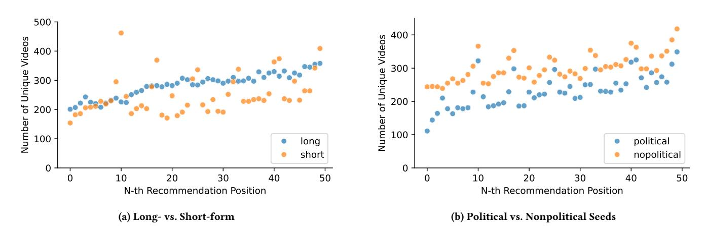

Figure 3: Diversity in recommendations. Later steps in the recommendation flow tend to have more unique videos recommended.

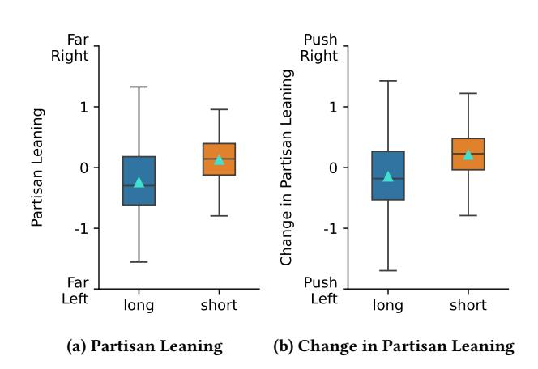

Figure 4: Partisan Leaning and Change in Partisan Leaning in Recommendations. Short-form recommendation videos skew right leaning (a), and also tend to skew further right than the seed videos that produce them (b).

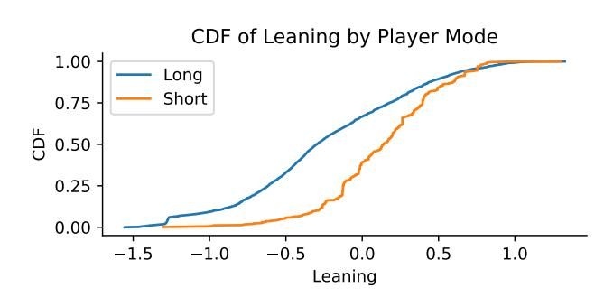

Figure 5: Cumulative Distribution Function of Partisan Leaning. Comparing the distribution of partisan leaning between long- and short-form videos, short leans towards right and long leans towards left.

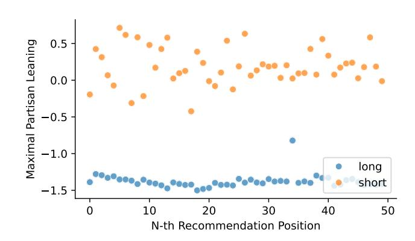

Figure 6: Maximal Partisan Leaning. Short-form recommendations exhibit a polarized pattern in the maximum partisan leaning, whereas long-form recommendations are stable.

Put differently, long-form recommendations are about 65% more extreme than short-form recommendations.

We also explore how the magnitude of partisan leaning evolves through subsequent recommendations by examining the maximal value of partisan leaning in both directions for all political recommendations at the N-th recommendation position. Figure [6](#page-5-3) shows this result; we find that neither long- or short-form videos get progressively more extreme with future recommendations. While longform videos relatively stably recommending left-skewing videos across the recommendation chain, we find that short-form videos have a much more sporadic pattern, simultaneously offering rightskewing and left-skewing videos around central in the maximal case for each recommendation.

Alignment of leaning with seed. Finally, we examine how closely the partisan leaning of recommended videos aligns with the political leaning of the seed videos. Specifically, we test whether the recommendation system preserves the original leaning or nudges viewers toward the opposite side of the spectrum (e.g., from leftto right-leaning or vice versa). We calculated the difference between each recommended video and the average partisan leaning

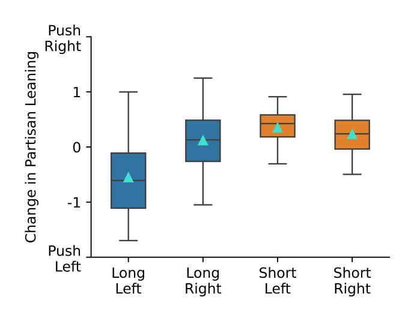

Figure 7: Change in Partisan Leaning For Accounts Consuming Extreme (Far Right and Far Left) Content. Viewers of extreme content in long-form videos are not pushed to change by the recommendation system. Only viewers who initially consume extremist left leaning videos on YouTube Shorts are nudged towards a more moderate set of videos; those viewing far right videos on YouTube Shorts are offered even more extreme content.

of the corresponding initial seed videos. This approach allows us to measure directional drift—the extent to which recommendations pull users away from, or reinforce, the partisan orientation of their starting content.

Long-form videos tend to keep recommendations aligned to the seed videos, whereas short-form videos tend to expose users to more right-leaning content. Figure [4b](#page-5-1) shows these differences, with the difference between political leaning of the seed videos persistently more right leaning in short-form recommendations (M = 0.21, SD = 0.39) compared to the similar differences in long-form videos recommendations (M = -0.15, SD = 0.56), with a statistically significant difference based on a Mann-Whitney U test (�� = 2.9 × 106 , �� &lt; 0.01). These results highlight, again, fundamental differences between both recommendation algorithms despite being offered matched pairs of identical video content.

Alignment with highly polarized seed videos. Finally, we explore whether recommendations change for videos with a high magnitude of initial leaning. To measure this, we compare the recommendations given to the 5% most left leaning seed videos and the 5% most right leaning seed videos, measuring the change in partisan leaning of the recommended videos relative to those starting points, similar to the previous analysis.

For long-form content, recommendations following highly leftleaning seeds (�� = −0.55, ���� = 0.59) and highly right-leaning seeds (�� = 0.12, ���� = 0.48) remain aligned to the original leaning, indicating that the long-form ecosystem tends to preserve users' starting viewpoints, as we see in Figure [7.](#page-6-0) Short-form recommendations, in contrast, exhibit both a directional bias and reduced variance. When starting from highly left-leaning short-form videos,

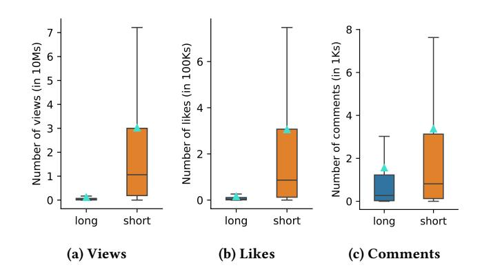

Figure 8: Engagement with Recommended Videos. Shortform videos have higher views, likes and comments on average compared to long-form recommendations.

recommendations shift modestly toward the center, implying a limited corrective pull (�� = 0.35, ���� = 0.32). However, when starting from highly right-leaning short-form videos (�� = 0.23, ���� = 0.40), recommendations move further right, narrowing the ideological spread and strengthening alignment with the initial leaning. This asymmetry indicates that short-form recommendations not only differ in direction but also in their corrective behavior—they attenuate left-leaning content but reinforce right-leaning content.

#### 4.4 Engagement

Next, we explore the engagement—views, likes, and comments—on recommended videos for each modality. Engagement serves as a useful proxy to explore how "fringe" a recommended video is, potentially also shining light on the politicization of recommendations. Figure [8](#page-6-1) shows a boxplot for each engagement metric.

In aggregate, short-form recommended videos have higher views (M = 30M, SD = 63M views[7](#page-6-2) ), likes (M = 306K, SD = 673K likes) and comments (M = 3.4K, SD=7.9K comments) compared to long-form recommendation views (M = 1.2M, SD = 213K views), likes (M = 16K, SD = 53K likes), and comments (M = 1.6K, SD = 4.3K comments). We found these differences to be statistically significant in all three cases with a Mann-Whitney U test, for views (�� = 3.3 × 108 , �� &lt; 0.01), likes (�� = 4.7 × 108 , �� &lt; 0.01), and comments (�� = 8.1 × 108 , �� &lt; 0.01). The higher engagement of short-form videos in terms of likes and views likely reflects the responsiveness of YouTube's short-form algorithm to real-time engagement signals such as views, likes, and swipes. This mirrors TikTok audits, reflecting a broader shift toward passive, fast consumption over deliberative engagement. [\[22\]](#page-8-43).

Finally, we identify whether videos with higher magnitude of partisan leaning are more "fringe," that is, viewed less frequently. We compare the partisan leaning with the amount of engagement, considering views, likes, and comments. Table [2](#page-7-0) shows the spearman rank correlation coefficients between video engagement and partisan leaning. While some might expect political videos with stronger partisan leaning to be more fringe, we find that such videos attract more engagement for long-form content. We did not find

7Additional analysis details are provided in Appendix [E](#page-10-2)

Table 2: Correlated between the magnitude of partisan leaning and engagement. Long-form videos with higher magnitude of partisan leaning get more engagement.

any statistically significant relationship between partisan leaning and engagement for short-form content.

#### 5 Discussion

Our findings show that short-form recommendations skew further right compared to long-form recommendations. While long-form recommendations are more extreme overall, they are also less likely to push an account's political leaning. Short-form recommendations tend to be less diverse and elicit passive engagement metrics like views and likes, echoing concerns about personalization and reduced user agency [\[13,](#page-8-44) [28\]](#page-8-29). We discuss the implications of these results below.

## 5.1 Politicization and Content Diversity

Long-form recommendation systems exhibit significantly lower diversity in their channel pool (23.5 unique videos per channel), consistent with prior work [\[48\]](#page-9-3), while short-form recommendations recommend a wider variety of channels (4.2 unique videos per channel). This limited channel diversity in long-form recommendations may explain why political content appeared more frequently in this format, regardless of the seed videos. Because long-form recommendations tend to remain within news media–related channels, they have a higher likelihood of surfacing political videos. In contrast, short-form recommendations switch between channels more frequently, with recommendations often extending beyond news-oriented sources, thereby increasing the likelihood of recommending non-political content regardless of the user interests reflected by the seed videos.

However, greater channel diversity does not translate into video diversity for short-form videos. Despite the large channel pool, the recommended short-form videos are often more repeated than long-form videos, reinforcing a narrower slice of the initial seed video's content space. While there are fewer total short-form videos on YouTube (one-fifth as many), the recommendation engine design may also structurally inhibit content diversity, as it optimizes for rapid engagement (e.g., swipes, taps, and short watch times). Such design trade-off risks pushing users toward narrower content funnels where serendipitous or dissenting perspectives are less likely to surface. This trade-off could also emerge due to alternative factors such as creator behavior and platform incentives.

#### 5.2 Ideological Skew, Drift, and Popularity in Recommendations

Overall we saw that short-form skew right and long-form skew left in their recommendations. Short-form videos consistently modulate the partisan leaning of their recommendations towards the right, no matter the leaning of the initial seed videos. On the other hand, longform videos tend to preserve the original political orientation of the content. Viewers of short-form videos are also highly engaged, much more so than for long-form videos, suggesting their potential for homogenizing recommendations and creating echo chambers. We also observed higher engagement for videos with stronger partisan leaning. This echoes prior findings that extreme content including so-called rage bait successfully increases engagement and must be carefully controlled for in recommender systems [\[25\]](#page-8-45). Previous work has shown that YouTube's recommendations pull users towards the left [\[19\]](#page-8-46), regardless of the initial leaning of the seed video. However, this study focused only on long-form videos and its recommendations and does not give a full picture of all types of videos being disseminated on the platform.

While prior work often treats recommendation systems as monolithic [\[5,](#page-8-18) [30\]](#page-8-4), our results demonstrate that significant variation can exist within a single platform, including varying for different video formats. Future audits should examine how platform-level shifts toward short-form content may reshape exposure dynamics across demographic groups, content domains, or political contexts.

#### 5.3 Ethical considerations

Our findings about ideological skew and engagement asymmetries in short-form videos could be misinterpreted to suggest user bias or vulnerability rather than platform-level design choices, potentially fueling misleading narratives about audience polarization. The comparative design of our audit could be misused to make platform-wide generalizations or to politically instrumentalize differences in exposure, despite our focus on structural algorithmic behavior. To avoid this, we have shared all code, validated all classifiers with human annotations, and released aggregate-level insights without referencing specific channels. The repository provides all the video IDs that we collect; but avoids providing other metadata due to YouTube's policies. Similarly, in all requests to YouTube, we maintain an appropriate delay between consecutive requests to avoid overloading the server or impacting other users. In doing so, this research aims to conform with ethical practices in audit literature (e.g., [\[12,](#page-8-13) [35\]](#page-8-14)) and support fairer, more transparent systems.

#### 6 Limitations

Our study focuses exclusively on English-language political video content published by U.S.-based media outlets on YouTube, which may limit the generalizability of our findings to other countries, languages, or content domains. And our sock puppet only uses passive watch behavior (i.e., watch-only sessions, without likes, comments, or subscriptions) which may not trigger algorithmic personalization in the same way real users would. Lastly, while our dataset includes thousands of matched video pairs, YouTube's Shorts ecosystem continues to evolve rapidly, both in terms of content and algorithm design. Our findings represent a snapshot in time and may not fully capture longitudinal changes to recommendation dynamics. Additionally, we ran the experiment multiple times for some pairs. This reinforcement might lead to bias on certain IP addresses, thus influencing the results we get.

References [1] Lada A. Adamic and Natalie Glance. 2005. The Political Blogosphere and the 2004 U.S. Election: Divided They Blog. In Proceedings of the 3rd International Workshop on Link Discovery. ACM. [doi:10.1145/1134271.1134277](https://doi.org/10.1145/1134271.1134277) [2] Hunt Allcott, Matthew Gentzkow, Winter Mason, Arjun Wilkins, Pablo Barberá, Taylor Brown, Juan Carlos Cisneros, Adriana Crespo-Tenorio, Drew Dimmery, Deen Freelon, et al. 2024. The Effects of Facebook and Instagram on the 2020 Election: A Deactivation Experiment. Proceedings of the National Academy of Sciences 121 (2024). [3] Md Sanzeed Anwar, Grant Schoenebeck, and Paramveer S Dhillon. 2024. Filter Bubble or Homogenization? Disentangling the Long-term Effects of Recommendations on User Consumption Patterns. In Proceedings of the ACM Web Conference. [4] Eytan Bakshy, Solomon Messing, and Lada Adamic. 2015. Political Science. Exposure to Ideologically Diverse News and Opinion on Facebook. Science 348 (2015). [doi:10.1126/science.aaa1160](https://doi.org/10.1126/science.aaa1160) [5] Jack Bandy and Nicholas Diakopoulos. 2020. Auditing News Curation Systems: A Case Study Examining Algorithmic and Editorial Logic in Apple News. In Proceedings of the International AAAI Conference on Web and Social Media, Vol. 14. [6] Fabian Baumann, Nipun Arora, Iyad Rahwan, and Agnieszka Czaplicka. 2025. Dynamics of Algorithmic Content Amplification on TikTok. arXiv preprint arXiv:2503.20231 (2025). [7] Maximilian Boeker and Aleksandra Urman. 2022. An Empirical Investigation of Personalization Factors on TikTok. In Proceedings of the ACM Web Conference. [8] Mert Can Cakmak and Nitin Agarwal. 2025. Unpacking Algorithmic Bias in YouTube Shorts by Analyzing Thumbnails. In Proceedings of the 57th International Conference on System Sciences. [9] Sarmad Chandio, Muhammad Daniyal Pirwani Dar, and Rishab Nithyanand. 2024. How Audit Methods Impact Our Understanding of YouTube's Recommendation Systems. Proceedings of the International AAAI Conference on Web and Social Media 18 (2024). [doi:10.1609/icwsm.v18i1.31311](https://doi.org/10.1609/icwsm.v18i1.31311) [10] Sarmad Chandio, Muhammad Daniyal Pirwani Dar, and Rishab Nithyanand. 2024. How Audit Methods Impact Our Understanding of YouTube's Recommendation Systems. Proceedings of the International AAAI Conference on Web and Social Media (2024). [11] Michael Conover, Jacob Ratkiewicz, Matthew Francisco, Bruno Goncalves, Filippo Menczer, and Alessandro Flammini. 2021. Political Polarization on Twitter. Proceedings of the International AAAI Conference on Web and Social Media 5 (2021). [doi:10.1609/icwsm.v5i1.14126](https://doi.org/10.1609/icwsm.v5i1.14126) [12] Nicholas Diakopoulos. 2015. Accountability in Algorithmic Decision-making: A Ciew from Computational Journalism. Queue 13 (2015). [13] KJ Kevin Feng, Xander Koo, Lawrence Tan, Amy Bruckman, David W McDonald, and Amy X Zhang. 2024. Mapping the Design Space of Teachable Social Media Feed Experiences. In Proceedings of the CHI Conference on Human Factors in Computing Systems. [14] Sandra González-Bailón, David Lazer, Pablo Barberá, Meiqing Zhang, Hunt Allcott, Taylor Brown, Adriana Crespo-Tenorio, Deen Freelon, Matthew Gentzkow, Andrew M Guess, et al. 2023. Asymmetric Ideological Segregation in Exposure to Political News on Facebook. Science 381 (2023). [15] Muhammad Haroon, Anshuman Chhabra, Xin Liu, Prasant Mohapatra, Zubair Shafiq, and Magdalena Wojcieszak. 2022. YouTube, the Great Radicalizer? Auditing and Mitigating Ideological Biases in YouTube Recommendations. arXiv preprint arXiv:2203.10666 (2022). [16] Muhammad Haroon, Magdalena Wojcieszak, Anshuman Chhabra, Xin Liu, Prasant Mohapatra, and Zubair Shafiq. 2023. Auditing YouTube's Recommendation System for Ideologically Congenial, Extreme, and Problematic Recommendations. Proceedings of the National Academy of Sciences 120 (2023). [17] Jonathan Hendrickx. 2025. 'Normal News is Boring': How Young Adults Encounter and Experience News on Instagram and TikTok. New Media & Society (2025). [18] Eslam Hussein, Prerna Juneja, and Tanushree Mitra. 2020. Measuring Misinformation in Video Search Platforms: An Audit Study on YouTube. Proceedings of the ACM on Human-Computer Interaction 4 (2020). [19] Hazem Ibrahim, Nouar AlDahoul, Sangjin Lee, Talal Rahwan, and Yasir Zaki. 2023. YouTube's Recommendation Algorithm is Left-leaning in the United States. PNAS Nexus 2 (2023). [20] Shanto Iyengar and Kyu S Hahn. 2009. Red Media, Blue Media: Evidence of Ideological Selectivity in Media Use. Journal of Communication 59 (2009). [doi:10.](https://doi.org/10.1111/j.1460-2466.2008.01402.x) [1111/j.1460-2466.2008.01402.x](https://doi.org/10.1111/j.1460-2466.2008.01402.x) [21] Prerna Juneja, Md Momen Bhuiyan, and Tanushree Mitra. 2023. Assessing Enactment of Content Regulation Policies: A Post Hoc Crowd-sourced Audit of Election Misinformation on YouTube. In Proceedings of the CHI Conference on Human Factors in Computing Systems. [22] Daniel Klug, Yiluo Qin, Morgan Evans, and Geoff Kaufman. 2021. Trick and Please. A Mixed-method Study on User Assumptions about the TikTok Algorithm. In Proceedings of the 13th ACM Web Science Conference. [23] Angela Lai, Megan A. Brown, James Bisbee, Joshua A. Tucker, Jonathan Nagler, and Richard Bonneau. 2024. Estimating the Ideology of Political YouTube Videos. Political Analysis 32 (2024). [doi:10.1017/pan.2023.42](https://doi.org/10.1017/pan.2023.42) [24] Mark Ledwich and Anna Zaitsev. 2019. Algorithmic Extremism: Examining YouTube's Rabbit Hole of Radicalization. arXiv preprint arXiv:1912.11211 (2019). [25] Jeremy B. Merrill and Will Oremus. 2021. Five Points for Anger, One for a 'Like': How Facebook's Formula Fostered Rage and Misinformation. The Washington Post (2021). [26] Sepehr Mousavi, Krishna P Gummadi, and Savvas Zannettou. 2024. Auditing Algorithmic Explanations of Social Media Feeds: A Case Study of TikTok Video Explanations. In Proceedings of the International AAAI Conference on Web and Social Media, Vol. 18. [27] Derek O'Callaghan, Derek Greene, Maura Conway, Joe Carthy, and Pádraig Cunningham. 2015. Down the (White) Rabbit Hole: The Extreme Right and Online Recommender Systems. Social Science Computer Review 33 (2015). [doi:10.](https://doi.org/10.1177/0894439314555329) [1177/0894439314555329](https://doi.org/10.1177/0894439314555329) [28] Eli Pariser. 2011. The Filter Bubble: What the Internet Is Hiding from You. The Penguin Group. [29] John H. Parmelee and Nataliya Roman. 2020. Insta-echoes: Selective Exposure and Selective Avoidance on Instagram. Telematics and Informatics 52 (2020). [doi:10.1016/j.tele.2020.101432](https://doi.org/10.1016/j.tele.2020.101432) [30] Manoel Horta Ribeiro, Raphael Ottoni, Robert West, Virgílio AF Almeida, and Wagner Meira Jr. 2020. Auditing Radicalization Pathways on YouTube. In Proceedings of the Conference on Fairness, Accountability, and Transparency. [31] Manoel Horta Ribeiro, Raphael Ottoni, Robert West, Virgílio A. F. Almeida, and Wagner Meira. 2020. Auditing Radicalization Pathways on YouTube. In Proceedings of the Conference on Fairness, Accountability, and Transparency. ACM. [doi:10.1145/3351095.3372879](https://doi.org/10.1145/3351095.3372879) [32] Manoel Horta Ribeiro, Veniamin Veselovsky, and Robert West. 2023. The Amplification Paradox in Recommender Systems. In Proceedings of the International AAAI Conference on Web and Social Media, Vol. 17. [33] Ronald E Robertson, Shan Jiang, Kenneth Joseph, Lisa Friedland, David Lazer, and Christo Wilson. 2018. Auditing Partisan Audience Bias within Google Search. Proceedings of the ACM on Human-Computer Interaction (2018). [34] Ashley Rodriguez. 2018. YouTube's Recommendations Drive 70% of What We Watch. Quartz (2018). [35] Christian Sandvig, Kevin Hamilton, Karrie Karahalios, and Cedric Langbort. 2014. Auditing algorithms: Research methods for Detecting Discrimination on Internet Platforms. Data and Discrimination: Converting Critical Concerns into Productive Inquiry 22 (2014). [36] Andreas Schellewald. 2023. Understanding the Popularity and Affordances of TikTok Through User Experiences. Media, Culture & Society 45 (2023). [37] Ivan Srba, Robert Moro, Matus Tomlein, Branislav Pecher, Jakub Simko, Elena Stefancova, Michal Kompan, Andrea Hrckova, Juraj Podrouzek, Adrian Gavornik, et al. 2023. Auditing YouTube's Recommendation Algorithm for Misinformation Filter Bubbles. ACM Transactions on Recommender Systems 1 (2023). [doi:10.1145/](https://doi.org/10.1145/3568392) [3568392](https://doi.org/10.1145/3568392) [38] Nicholas Sukiennik, Chen Gao, and Nian Li. 2024. Uncovering the Deep Filter Bubble: Narrow Exposure in Short-video Recommendation. In Proceedings of the ACM Web Conference. [39] Cass R. Sunstein. 2018. #Republic: Divided Democracy in the Age of Social Media. Princeton University Press. [40] Robbie M. Sutton and Karen M. Douglas. 2022. Rabbit Hole Syndrome: Inadvertent, Accelerating, and Entrenched Commitment to Conspiracy Beliefs. Current Opinion in Psychology 48 (2022). [doi:10.1016/j.copsyc.2022.101462](https://doi.org/10.1016/j.copsyc.2022.101462) [41] Matus Tomlein, Branislav Pecher, Jakub Simko, Ivan Srba, Robert Moro, Elena Stefancova, Michal Kompan, Andrea Hrckova, Juraj Podrouzek, and Maria Bielikova. 2021. An Audit of Misinformation Filter Bubbles on YouTube: Bubble Bursting and Recent Behavior Changes. In Proceedings of the 15th ACM Conference on Recommender Systems. [42] Caroline Violot, Tuğrulcan Elmas, Igor Bilogrevic, and Mathias Humbert. 2024. Shorts vs. Regular Videos on YouTube: A Comparative Analysis of User Engagement and Content Creation trends. In Proceedings of the 16th ACM Web Science Conference. [43] Karan Vombatkere, Sepehr Mousavi, Savvas Zannettou, Franziska Roesner, and Krishna P Gummadi. 2024. TikTok and the Art of Personalization: Investigating Exploration and Exploitation on Social Media Feeds. In Proceedings of the ACM Web Conference. [44] Michael Wolfowicz, Yael Litmanovitz, David Weisburd, and Badi Hasisi. 2021. Cognitive and Behavioral Radicalization: A Systematic Review of the Putative Risk and Protective Factors. Campbell Systematic Reviews 17 (2021). [doi:10.1002/](https://doi.org/10.1002/cl2.1174) [cl2.1174](https://doi.org/10.1002/cl2.1174) [45] Muhsin Yesilada and Stephan Lewandowsky. 2022. Systematic Review: YouTube Recommendations and Problematic Content. Internet Policy Review 11 (2022). [46] YouTube. 2019. [https://blog.youtube/news-and-events/continuing-our-work-to](https://blog.youtube/news-and-events/continuing-our-work-to-improve/)[improve/.](https://blog.youtube/news-and-events/continuing-our-work-to-improve/) [47] YouTube. 2021. [https://blog.youtube/inside-youtube/on-youtubes-](https://blog.youtube/inside-youtube/on-youtubes-recommendation-system/)

[48] Xudong Yu, Muhammad Haroon, Ericka Menchen-Trevino, and Magdalena Wojcieszak. 2024. Nudging Recommendation Algorithms Increases News Consumption and Diversity on YouTube. PNAS Nexus 3 (2024).

#### A LLM Prompt

The prompt provided to Gemini for labeling videos as political or non-political:

- You are a binary classifier that gives a score on whether a YouTube title and description is either political or not political based on the guiding rubric below.
- The YouTube title and description are political if they mention any political movement or event.
- Political movements or events can be a policy, legislation, protests, or gatherings about the political event, and international relations.
- The YouTube title and description are political if they mention any political figures.
- The YouTube title and description are political if they discuss the US government, political party, political organization, or political belief.
- The political belief includes religious belief or ideology that has political nuance. For example, LGBTQ+ rights, abortion rights, climate change, and more. YouTube title: "{title}". YouTube description: "{description}". Is this YouTube video political or not?

The response configuration is provided to structure the output from Gemini:

'response\_mime\_type': 'text/x.enum', 'response\_schema': { "type": "STRING",

"enum": ["political", "non-political"]}

#### B Validation for Pairing Long- and Short-form Videos

To ensure that the short-form videos are a segment from the longform videos, we developed a pairing strategy based on the cleaned transcript. We will describe the ground truth dataset measurement, the methodology tested, and the results of the validation of the method to validate our final selection of the similarity score.

Ground truth dataset. The validation dataset consists of 826 human-labeled pairs of long- and short-form videos, which were selected from the original 5,250,274 possible pairs.

To ensure representative data sampling, we computed the longest common sequence (LCS) of transcripts for each video pair and categorized them into three strata based on the number of words in the LCS: (0, 4], (4, 8], and (8, + inf). These strata are determined by the likelihood of matching long- and short-form video pairs, the number of video pairs per stratum, and the linguistic nature of the shared sequences.

| Method     | Threshold | F1   | Precision | Recall | Accuracy |
|------------|-----------|------|-----------|--------|----------|
| LCS        | 13.00     | 0.88 | 0.81      | 0.96   | 90.58%   |
| LCS Ratio  | 0.13      | 0.89 | 0.87      | 0.90   | 91.67%   |
| LCS Skips  | 32.00     | 0.94 | 0.95      | 0.94   | 96.01%   |
| Total LCS  | 79.00     | 0.89 | 0.95      | 0.84   | 92.39%   |
| Similarity | 0.60      | 0.95 | 0.95      | 0.96   | 96.50%   |
| BERT       | 0.72      | 0.64 | 0.54      | 0.77   | 68.24%   |

Table 3: Performance of different methods

We sampled 1,000 pairs from the first LCS group (5,206,127 total pairs), 1,000 pairs from the second LCS group (14,185 total pairs), and 2,000 pairs from the last LCS group (10,459 total pairs). We sampled more pairs from the last group, given the higher likelihood of identifying meaningful thresholds for accurate matching. Finally, we randomly sampled 826 video pairs from the total 4,000 samples to four annotators, who were instructed to label each pair as either a match or not based on the content.

Methods and intuition. We developed a series of methods based on LCS to compute the match score between long- and short-form videos. To identify exact matching pairs, we deliberately avoided approaches based on the meaning or topic of the transcript, such as semantic similarity or word embeddings. However, as a baseline, we still included the performance of the widely recognized BERT model. The methods we used and their intuition are as follows: LCS: The length of LCS between long- and short-form videos. If the short-form video has a long enough LCS with the long-form video, it is likely that they are a match. LCS Ratio: The ratio of the length of LCS to the length of the short-form video. This method is similar to LCS, but it takes into account the length of the shortform video. LCS Skips: The LCS method with skips allowed. The intuition behind this is that the algorithm should be able to tolerate some occasional missed sequences, such as stop words. More specifically, we defined two related terminologies: 1) maxAllowSkip is the maximum number of skips allowed in the LCS, and 2) maxSkip is the maximum number of skips allowed in a row. Total LCS: The summation of the lengths of all common sequences between the long- and short-form videos. This is an advanced version of the LCS method, which is more flexible in that it allows for partial matches. Similarity: Defined as the total word count of all shared sequences between long- and short-form divided by the length of the short-form. The intuition behind this is the same as the "Total LCS" method, but it takes the length of short-form videos into account. BERT: A well-known model for computing semantic similarity. We included it as a reference.

Results. With all human-labeled pairs, we used each method to compute the matching score between the long- and short-form videos. We tuned the threshold for each method to maximize the F1 score, as shown in Table [3.](#page-9-4) By observing that most mismatches occur in groups with fewer than five words in LCS, We used "Similarity" with at least five words in the LCS as our final pairing method.

# C Additional Watch-time Analysis

In addition to the analysis of partisan leaning (our primary dependent measure), we studied the impact of watch-times on other

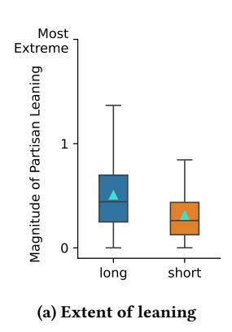

Figure 11: Recommendations for long-form videos tend to get more extreme recommendations.

| Short-form | Videos |      | Long-form | Videos |      |
|------------|--------|------|-----------|--------|------|
|            | M      | SD   |           | M      | SD   |
| Views      | 32M    | 63M  | Views     | 1.2M   | 9.2M |
| Likes      | 344K   | 732K | Likes     | 14K    | 57K  |
| Comments   | 3.6K   | 8.1K | Comments  | 1.3K   | 4.3K |

Table 4: Descriptive statistics for engagement metrics.

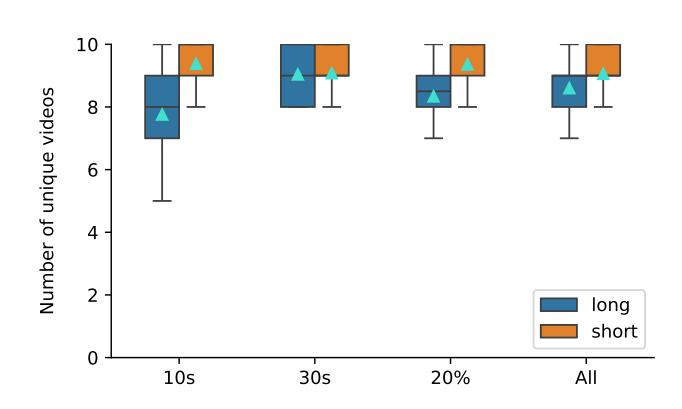

Figure 9: Diversity in recommendations, in the number of unique videos, across different watch-time conditions.

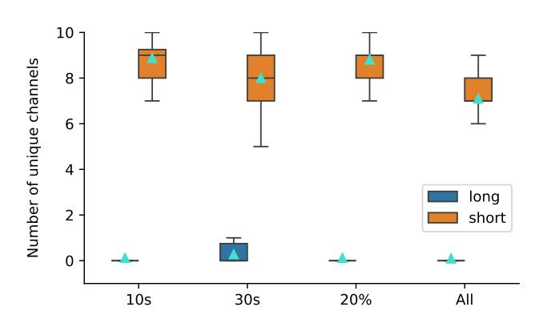

Figure 10: Diversity in recommendations, in the number of unique channels, across different watch-time conditions.

measures like diversity of videos recommended. Figure [9](#page-10-3) shows the number of unique videos, on average over the 50 steps of the recommendation collection process. A strong ceiling effect is notable, because this analysis considers 10 sets of seed videos; thus the maximum unique count at any step is 10, when every set of seed videos had a unique video recommended. We find negligible differences for short-form videos. The difference in number of unique videos is larger for long-form videos, but the mean is still within one video between the two most extreme conditions (watching 10 seconds and watching the entire video).

Similarly, Figure [10](#page-10-4) shows the number of unique channels, on average over the 50 steps of the recommendation collection process. While watching the entire video does slightly decrease the number of unique channels shown, the differences are again small. As a result, we are not concerned with this significantly impacting the results and proceed with the 10 seconds for the full data collection.

# D Additional Partisan Leaning Analysis

Figure [11](#page-10-5) shows the extent, or magnitude, of partisan leaning for long- and short-form videos. On average, the magnitude of leaning for long-form recommendations was �� = 0.51 (���� = 0.34), compared to �� = 0.31 (���� = 0.24) for short-form videos. This difference is statistically significant via a Mann-Whitney U test (�� = 6.6 ∗ 106 , �� &lt; 0.01). That is, long-form recommendations stray about 65% further from the center than short form recommendations.

# E Additional Engagement Analysis

While Section [4.4](#page-6-3) omitted standard deviations for readability, these values are provided in Table [4.](#page-10-6) While most videos have few views, likes, and comments, a small number of outliers with up to hundreds of millions of engagements lead to very high standard deviations. For example, the video in our dataset with the largest number of views is a short-form video that has been viewed over 975 million times.

To provide a visual sense of engagement, we plot the relationship between the number of likes and the magnitude of the leaning score, as likes represent a more active form of interaction than views, yet are less intrusive than comments. To make the number of likes visually interpretable, we applied a logarithmic transformation. The results are shown in Figure [12.](#page-11-1)

#### F Autoplay Recomendations vs. Sidebar Recommendations

Our analysis in this paper has been closest to simulating an "autoplay" recommendation. However, on YouTube, long form videos additionally come with a list of recommended videos on the right sidebar (usually 20), which is similar to the preloaded recommendations chain in short-form videos (usually 9). To compare how autoplay might contrast with preloaded recommendations, we collected additional data from 90 seed video pairs, resulting in 169,135 recommendations from the sidebar and 48,261 recommendations from the short-form preloaded videos.

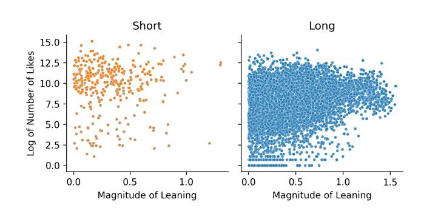

Figure 12: Stronger partisan leaning of Long-form videos align to a stronger engagement

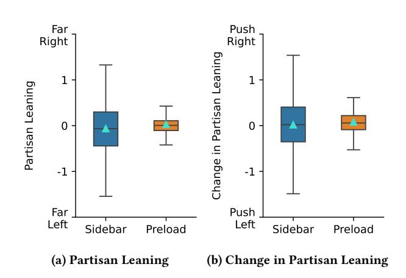

Figure 13: Partisan Leaning and Change in Partisan Leaning in Sidebar and Preloaded Recommendations.

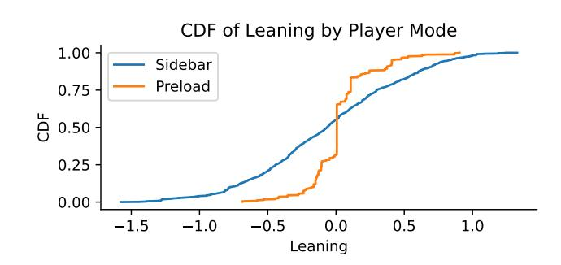

Figure 14: CDF of Partisan Leaning in Sidebar and Preloaded Recommendations.

Sidebar recommendations for long-form videos have an average leaning score of -0.06 (SD = 0.54); which is a similar direction but smaller magnitude to an "autoplay" comparison from our main results. Short-form recommended videos skew right, with a leaning score of 0.03 (SD = 0.23). Short-form preloaded recommendations are centered around 0, while long-form sidebar recommendations have a wider spread, very similar to our autoplay results (Figure [13a\)](#page-11-2).

When considering the delta in partisan leaning from seed videos to recommended videos, we find that sidebar recommendations for long-form videos have an average change of 0.02 (SD = 0.54); we note this is meaningfully different than our results for autoplay (wherein long-form videos pushed viewing to the left). Preloaded recommendations for short-form content have an average change of 0.08 (SD = 0.27); this is a similar direction but less strong of a result compared to autoplay short- form content; both results are shown in Figure [13b](#page-11-2) and Figure [14.](#page-11-3) Ultimately, our results suggest a mixed picture of recommendation similarity between "preloaded" and "autoplay" recommendations, and more research is necessary to identify fuller patterns between sidebar recommendations and autoplay recommendations on YouTube.