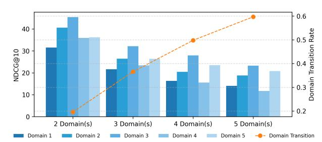
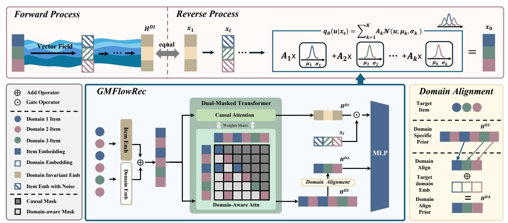
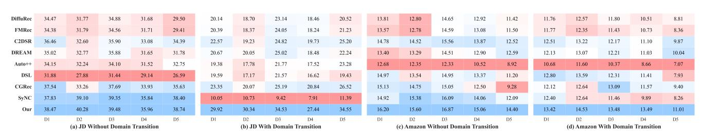
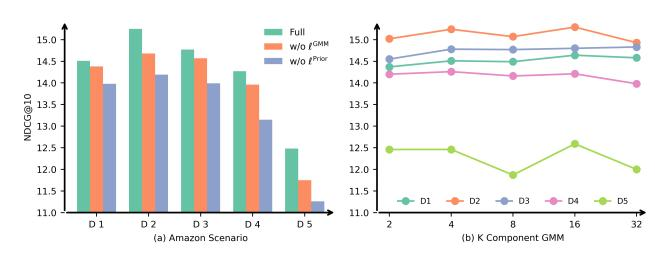
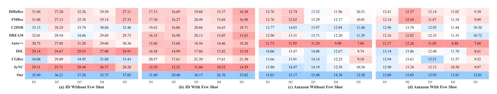
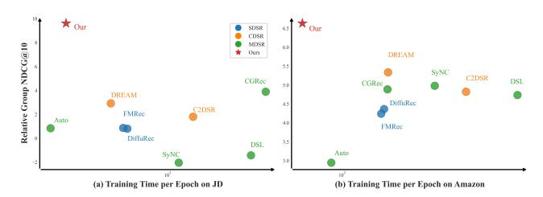
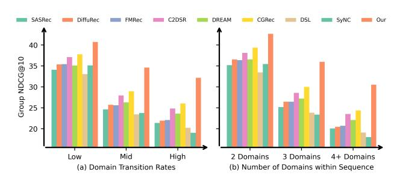

# Gaussian Mixture Flow Matching with Domain Alignment for Multi-Domain Sequential Recommendation

Xiaoxin Ye∗ University of New South Wales Sydney, Australia xiaoxin.ye@unsw.edu.au

Chengkai Huang∗

University of New South Wales & Macquarie University Sydney, Australia chengkai.huang1@unsw.edu.au

Hongtao Huang University of New South Wales Sydney, Australia hongtao.huang@unsw.edu.au

Lina Yao

University of New South Wales & CSIRO's Data61 Sydney, Australia lina.yao@unsw.edu.au

### ABSTRACT

Users increasingly interact with content across multiple domains, resulting in sequential behaviors marked by frequent and complex transitions. While Cross-Domain Sequential Recommendation (CDSR) models two-domain interactions, Multi-Domain Sequential Recommendation (MDSR) introduces significantly more domain transitions, compounded by challenges such as domain heterogeneity and imbalance. Existing approaches often overlook the intricacies of domain transitions, tend to overfit to dense domains while underfitting sparse ones, and struggle to scale effectively as the number of domains increases. We propose GMFlowRec, an efficient generative framework for MDSR that models domain-aware transition trajectories via Gaussian Mixture Flow Matching. GMFlowRec integrates: (1) a unified dual-masked Transformer to disentangle domain-invariant and domain-specific intents, (2) a Gaussian Mixture flow field to capture diverse behavioral patterns, and (3) a domain-aligned prior to support frequent and sparse transitions. Extensive experiments on JD and Amazon datasets demonstrate that GMFlowRec achieves state-of-the-art performance with up to 44% improvement in NDCG@5, while maintaining high efficiency via a single unified backbone, making it scalable for real-world multi-domain sequential recommendation.

### CCS CONCEPTS

• Information systems → Recommender systems.

# KEYWORDS

Recommender System, Multi-domain Recommendation, Flow Matching

# 1 INTRODUCTION

On modern e-commerce platforms (e.g., Amazon, Alibaba, JD), users often browse across multiple domains (e.g., books, electronics, and movies) [\[7,](#page-8-0) [10](#page-8-1)[–12,](#page-8-2) [30,](#page-8-3) [43\]](#page-9-0). These cross-domain transitions, shaped by dynamic user intents, give rise to behavioral sequences that are sparse, heterogeneous, and highly nonlinear, posing significant challenges to modeling user preferences in multi-domain recommendation [\[5\]](#page-8-4).

Traditional sequential recommenders typically operate within a single domain, capturing domain-specific temporal dependencies [\[8,](#page-8-5)

Figure 1: Performance of SASRec[\[16\]](#page-8-6) on the JD multi-domain dataset. Bars report NDCG@10 across domains grouped by the number of domains within a user sequence. The line chart represents the domain transition rate, illustrating the increasing complexity of crossdomain interactions as the number of domains increases.

[9\]](#page-8-7). Cross-Domain Sequential Recommendation (CDSR) methods extend this by modeling transitions between two domains, enabling limited cross-domain knowledge transfer. However, real-world platforms involve interactions across multiple domains, demanding a more generalized paradigm, Multi-Domain Sequential Recommendation (MDSR), where user behavior spans multiple domains and frequent transitions reflect complex intent evolution (e.g., browsing electronics before purchasing apparel). Scaling from CDSR to MDSR is far from trivial, introducing a profound scalability bottleneck and new forms of data sparsity.

Unlike CDSR, which considers only pairwise domain transitions, MDSR must capture holistic user preferences and a combinatorially richer space of domain transitions, shifts in user activity from one domain to another (e.g., moving from browsing electronics to purchasing apparel). Such transitions are pervasive in large-scale platforms like e-commerce marketplaces or streaming services, where users fluidly switch across diverse categories.

Our empirical study on the JD multi-domain dataset shows a sharp drop in NDCG@10 as domain transition rates increase—from 20% in two-domain sequences to over 60% in five-domain ones (Figure [1\)](#page-0-0). This trend underscores two key challenges:

Challenge 1: Exponential Domain Transitions. Expanding to multi-domain settings dramatically increases the number of possible transition paths. While CDSR involves only two bidirectional transitions (e.g., �� → ��, �� →��), MDSR must handle a transition space that grows quadratically with the number of domains. This explosion renders most transitions infrequent and unpredictable,

∗Corresponding author.

introducing a new sparsity form we call Transition Cold-Start, where shifts between rarely paired domains lack sufficient training examples. Existing CDSR methods (e.g., AutoCDSR [\[15\]](#page-8-8)) incorporate transition cues into attention mechanisms but fail to route knowledge effectively across this expanded transition space. This necessitates models capable of dynamically adapting to limited target-domain and transition-specific data [\[25–](#page-8-9)[27\]](#page-8-10).

Challenge 2: Domain Heterogeneity and Imbalance. Users interact with semantically distinct domains (e.g., health products for wellness, sports equipment for fitness, books for leisure) that vary in both purpose and interaction density. Modeling such heterogeneous behaviors with a single unified embedding, as in AutoCDSR [\[15\]](#page-8-8), risks conflating unrelated signals. Prior methods (e.g., DREAM [\[41\]](#page-9-1), MDSRDSL [\[14\]](#page-8-11)) either overlook multi-interest dynamics and rely on multiple encoders, which scale poorly and underfit sparse domains. Moreover, MDSR suffers from domain imbalance, where many dense and sparse domains coexist, resulting in few-shot sequences (e.g., frequent health-product interactions but few in sports). Addressing these challenges jointly and efficiently remains an open problem.

Diffusion models have recently demonstrated strong potential in capturing complex user preference distributions. However, a critical gap remains in multi-domain sequential recommendation (MDSR). Existing approaches such as DiffuRec [\[22\]](#page-8-12) and FMRec [\[20\]](#page-8-13) are confined to single-domain intents, while cross-domain variants (e.g., DMCDR, CDCDR) often neglect sequential dependencies. Moreover, these models typically adopt a uni-modal Gaussian prior, implicitly assuming user preferences follow a single continuous mode. This mirrors the limitations of unified embeddings in multiinterest models [\[37\]](#page-9-2), where diverse latent intents are collapsed into a single representation, restricting expressiveness and hindering generalization. As a result, uni-modal priors struggle to capture the coexisting, domain-sensitive interests in MDSR.

A further challenge arises from the training dynamics of diffusionbased recommenders. These models rely on slow, iterative denoising steps, which limit scalability. ADRec [\[4\]](#page-8-14) highlights a critical issue in this context: embedding collapse during end-to-end training. In recommendation, models initialize item embeddings randomly, with limited inherent meaning, making them vulnerable to collapse, severely degrades performance. Flow matching offers a promising alternative by learning deterministic mappings and supporting flexible prior distributions. However, without domain-aware conditioning, flow-based models still fall short in capturing multi-modal, domain-sensitive transitions, a core challenge in MDSR.

To bridge these gaps, we propose GMFlowRec, a domain-aware generative framework for MDSR. GMFlowRec integrates a dualmasking encoder that disentangles domain-invariant and domainspecific intents within a unified backbone, yielding domain-aware priors. These prior guide a Gaussian Mixture Flow Matching process to model multi-modal transition trajectories (e.g., books → electronics vs. books → movies), enabling scalable, transitionresilient recommendation. Our key contributions are:

- We present GMFlowRec, to our best knowledge, which is the first generative MDSR framework unifying Gaussian Mixture Flow Matching with domain-aware representation learning.

- We design a dual-masking encoder that disentangles domaininvariant and domain-specific intents in a shared backbone, providing efficient and adaptive generative guidance.
- Extensive experiments on large-scale Amazon and JD datasets show that GMFlowRec consistently outperforms state-of-theart baselines, particularly under high-transition and few-shot domain sequence conditions, while maintaining efficiency.

### 2 RELATED WORK

We review related literature in three areas: Cross-Domain Sequential Recommendation (CDSR), Multi-Domain Sequential Recommendation (MDSR), and recent Generative Models in Recommendation.

Cross-Domain Sequential Recommendation. CDSR aims to improve the accuracy of the recommendation by transferring patterns of user behavior between two domains while mitigating negative transfer. Early works like DA-GCN [\[42\]](#page-9-3), PSJNet [\[38\]](#page-9-4) and ��-Net [\[28\]](#page-8-15) used gating mechanisms for selective knowledge transfer. Graph-based models such as C2DSR [\[2\]](#page-8-16), and C2DREIF [\[29\]](#page-8-17) captured inter-domain dependencies via GNNs. Transformer-based approaches, including RecGURU [\[18\]](#page-8-18) and DREAM [\[41\]](#page-9-1), directly modeled sequential dynamics across domains, while ABXI [\[1\]](#page-8-19) introduced low-rank domain-invariant representations. However, these methods do not scale naturally to multiple domains.

Multi-Domain Sequential Recommendation. MDSR extends CDSR to three or more domains, introducing challenges such as increased domain heterogeneity, negative transfer, and scalability. AutoCDSR [\[15\]](#page-8-8) employs automated transfer control to suppress harmful influence, while MDSR-DSL [\[14\]](#page-8-11) embeds domains into a latent space to capture inter-domain similarity. CGRec [\[31\]](#page-8-20) frames knowledge sharing as a cooperative game, and SyNCRec[\[32\]](#page-8-21) coordinate single- and cross-domain models to preserve domain specialization. However, most MDSR models focus on reducing negative transfer and lack mechanisms to capture multi-modal user preferences. Moreover, their reliance on multiple domain-specific transformers raises scalability concerns in large-scale applications.

Generative Models in Recommendation. Generative models such as diffusion [\[6,](#page-8-22) [35\]](#page-9-5) and flow-based approaches [\[23,](#page-8-23) [36\]](#page-9-6) have recently gained traction for their expressive modeling capabilities by reversing noise processes [\[39\]](#page-9-7). In recommendation, diffusionbased methods like DiffuRec [\[22\]](#page-8-12), DCRec [\[13\]](#page-8-24), and DreamRec [\[40\]](#page-9-8) demonstrate strong performance in sequential tasks. Extensions to cross-domain recommendation, such as DMCDR [\[21\]](#page-8-25) and CD-CDR [\[19\]](#page-8-26), incorporate domain conditioning but largely neglect sequential dynamics. Moreover, most of these models rely on unimodal Gaussian assumptions, which constrain their ability to capture diverse user intents and transitions. Diffusion models also suffer from slow sampling and scalability limitations, making them less practical for large-scale multi-domain scenarios.

Flow matching [\[23,](#page-8-23) [36\]](#page-9-6) offers a more efficient alternative by learning deterministic mappings with fewer denoising steps. FMRec [\[20\]](#page-8-13) applies this to sequential recommendation, while FlowCF [\[24\]](#page-8-27) adapts it to collaborative filtering. However, these models remain limited by their uni-modal Gaussian flows and lack domain-aware mechanisms, restricting their capacity to model multi-modal, domainsensitive transitions essential for recommendation across domains.

Recommendation Objective. To ensure that the learned velocity �� contributes to accurate next-item prediction, we align it with the recommendation objective. Specifically, we reuse the prediction function defined in Eq. [5](#page-3-0) and optimize the following loss:

ℓ Rec ���� = − Í B���� log P (�� ∗ | ��, ���� ), (11)

This objective encourages the fused and domain-aware latent dynamics to generate representations that are both semantically meaningful and predictive of user behavior across domains.

### 4.4 Training and Inference

Overall Training Objective. We propose a unified generative framework for multi-domain sequential recommendation (MDSR), integrating recommendation, prior modeling, and flow-based generative guidance. The model learns domain-aware user trajectories via Gaussian Mixture Flow Matching (GMFlow), guided by informative priors and structured transitions. The overall objective is:

L = Í ���� ∈D ℓ Rec ���� + �� ℓPrior ���� + �� ℓGMM ���� . (12)

where �� and �� are hyperparameters controlling the contribution of each loss term. Specifically, ℓ Rec ���� aligns the predicted velocity with next-item prediction, ℓ Prior ���� regularizes domain-aligned priors derived from user history, and ℓ GMM ���� guides the reverse flow process via Gaussian mixture modeling. The detailed training procedure is described in Algorithm [1](#page-10-0) (Appendix).

Inference with ODE Solvers. During inference, we generate next-item embeddings by solving a learned flow trajectory from the user's current state to future preferences. Unlike traditional diffusion models, our framework leverages a GM-ODE-based solver for efficient and deterministic sampling [\[3\]](#page-8-28). Given a trained model, we begin by encoding the domain-invariant prior (�� DI �� ) and the domain-aligned prior (ℎ DA ���� ). We then simulate the reverse trajectory using a first-order GM-ODE solver [\[3\]](#page-8-28), which analytically derives the predicted velocity field (��) from the predicted Gaussian mixture, enabling accurate few-step sampling. The detailed inference procedure is Algorithm [2](#page-10-1) (Appendix).

To make domain-specific predictions, we compute relevance scores between �� and all candidate items�� ∈ I���� in domain ���� using inner product similarity. The top-�� items with the highest scores are returned as recommendations. This domain-aware scoring ensures that the generative trajectory aligns with the semantic space of the target domain, enabling accurate and efficient next-item prediction.

# 5 EXPERIMENTS

To evaluate the effectiveness and generalization capability of GM-FlowRec in MDSR, we conduct extensive experiments on two largescale datasets from Amazon and JD platforms. Specifically, we aim to answer the following research questions:

- RQ1: How does the performance of GMFlowRec compare with other SOTA baselines across different MDSR scenarios?
- RQ2: What is the impact of various components of our GM-FlowRec on its performance in MDSR tasks?
- RQ3: How effectively does GMFlowRec adapt to domain transitions and the increase in domains in a user sequence?

- RQ4: Can GMFlowRec handle few-shot recommendation with limited in-domain information?
- RQ5: How does GMFlowRec compare to baselines in terms of training efficiency, inference latency, and scalability with increasing domain count and sequence length?

### 5.1 Experiment Setting

Datasets We evaluateGMFlowRec on two large-scale multi-domain recommendation scenarios derived from Amazon and JD e-commerce platforms. Each scenario contains user interaction sequences spanning multiple domains. To ensure meaningful cross-domain learning, we retain users with at least 10 interactions and remove items with fewer than 15 interactions. Sequences are truncated to a maximum length of 50. We use the publicly available Amazon 5-core dataset[1](#page-4-0) and JD-ecommerce dataset [2](#page-4-1) . The dataset statistics are summarized in Table [3;](#page-9-9) details are provided in Appendix [A.](#page-9-10)

Evaluation Protocol We adopt a leave-one-out strategy: for each user, the last interaction is used for testing and the second-tolast for validation. Following previous works [\[34\]](#page-8-29), each evaluation case includes one positive item and 999 randomly sampled negatives from the same domain. Models rank the 1,000-item list, and we report Hit Ratio (H@K), and Normalized Discounted Cumulative Gain (N@K) �� = {5, 10}. For few-shot, domain transition, and efficiency analysis, we report Group NDCG@10, which is evaluated by averaging NDCG@10 over all domains.

Baselines GMFlowRec are compared against a diverse set of baselines spanning single-domain, cross-domain, and multi-domain sequential recommendation paradigms. For fair comparison, crossdomain models are adapted to the multi-domain setting.

SDSR (Single-Domain Sequential Recommender): SASRec [\[16\]](#page-8-6): Transformer-based model capturing intra-domain sequential dependencies. DiffuRec [\[22\]](#page-8-12): Models sequential interactions via a diffusion process. FMRec [\[20\]](#page-8-13): Uses flow matching to learn sequential patterns within a single domain.

CDSR�� (Cross-Domain Sequential Recommender): C2DSR�� [\[2\]](#page-8-16): GNN-based model with contrastive learning for cross-domain transfer. DREAM�� [\[41\]](#page-9-1): Learns domain-specific and invariant preferences via supervised contrastive learning and leverages focal loss to further address the class-imbalance problem.

MDSR (Multi-Domain Sequential Recommender): CGRec [\[31\]](#page-8-20): Mitigates negative transfer via cooperative game-theoretic modeling of domain interactions. DSL [\[14\]](#page-8-11): Learns domain-specific spaces to enhance cross-domain representation and generalization. Auto++ [\[15\]](#page-8-8): Revisits self-attention with Pareto-optimal design for balanced cross-domain learning. SyNC [\[32\]](#page-8-21): Introduces cooperative learning between single- and cross-domain recommenders.

Implementation Details GMFlowRec is implemented in Py-Torch [\[33\]](#page-8-30). We use Adam optimizer [\[17\]](#page-8-31) with a learning rate of 1 × 10−4 and a batch size of 256. Embedding dimensions are set to 64. All models are trained for 100 epochs with early stopping based on validation NDCG@10. Experiments are conducted on a machine equipped with an NVIDIA H200 GPU and 141GB RAM. Due to the space limitation, more details are included in the Appendix [C.](#page-10-2)

1[https://amazon-reviews-2023.github.io/data\\_processing/5core.html](https://amazon-reviews-2023.github.io/data_processing/5core.html) 2<https://github.com/rucliujn/JDsearch>

Table 1: Performance comparison across two multi-domain scenarios. Best results are in bold, second-best are underlined. Imp. denotes the relative improvement of GMFlowRec over the strongest baseline. All results are averaged over five runs with different seeds, reported as mean ± standard deviation. Improvements are statistically significant at the 0.01 confidence level.

|               | SASRec | DiffuRec | FMRec | DREAM  | 2 DSR �� C JD Dataset | �� Auto++ | DSL   | CGRec | SyNC  |       | GMFlowRec |       | Imp(%) |
|---------------|--------|----------|-------|--------|-----------------------|-----------|-------|-------|-------|-------|-----------|-------|--------|
| Domain 1      |        |          |       |        |                       |           |       |       |       |       |           |       |        |
| H@5           | 29.81  | 32.18    | 32.07 | 32.85  | 34.87                 | 31.38     | 30.43 | 35.67 | 29.37 | 39.70 | ± 0.02    | 11.30 | %      |
| H@10          | 36.23  | 39.43    | 39.44 | 40.45  | 42.45                 | 37.53     | 37.50 | 43.12 | 35.84 | 46.72 | ± 0.05    | 8.35  | %      |
| N@5           | 23.72  | 25.40    | 25.37 | 25.70  | 27.51                 | 25.18     | 23.76 | 28.37 | 23.12 | 32.12 | ± 0.05    | 13.23 | %      |
| N@10          | 25.79  | 27.74    | 27.76 | 28.16  | 29.96                 | 27.16     | 26.04 | 30.78 | 25.21 | 34.39 | ± 0.02    | 11.73 | %      |
| Domain 2      |        |          |       |        |                       |           |       |       |       |       |           |       |        |
| H@5           | 25.71  | 25.70    | 25.63 | 27.70  | 26.81                 | 24.84     | 22.97 | 27.65 | 21.02 | 37.73 | ± 0.13    | 36.20 | %      |
| H@10          | 31.93  | 32.15    | 31.87 | 34.69  | 33.77                 | 30.51     | 29.20 | 34.70 | 26.83 | 44.09 | ± 0.18    | 27.05 | %      |
| N@5           | 20.15  | 19.76    | 19.79 | 21.09  | 20.47                 | 19.58     | 17.58 | 21.35 | 15.92 | 30.82 | ± 0.02    | 44.37 | %      |
| N@10          | 22.15  | 21.85    | 21.79 | 23.34  | 22.71                 | 21.40     | 19.60 | 23.61 | 17.79 | 32.87 | ± 0.09    | 39.24 | %      |
| Domain 3      |        |          |       |        |                       |           |       |       |       |       |           |       |        |
| H@5           | 32.51  | 33.24    | 33.49 | 34.78  | 34.83                 | 31.47     | 30.07 | 35.87 | 28.31 | 41.57 | ± 0.20    | 15.90 | %      |
| H@10          | 37.99  | 39.05    | 40.09 | 41.68  | 41.50                 | 37.15     | 36.28 | 42.14 | 34.12 | 47.81 | ± 0.18    | 13.46 | %      |
| N@5           | 26.99  | 27.11    | 27.13 | 27.99  | 28.34                 | 26.17     | 24.29 | 29.27 | 23.03 | 35.03 | ± 0.09    | 19.69 | %      |
| N@10          | 28.76  | 28.97    | 29.26 | 30.21  | 30.49                 | 28.00     | 26.29 | 31.29 | 24.90 | 37.04 | ± 0.03    | 18.38 | %      |
| Domain 4      |        |          |       |        |                       |           |       |       |       |       |           |       |        |
| H@5           | 25.49  | 28.19    | 28.08 | 28.21  | 29.78                 | 26.96     | 25.55 | 31.08 | 23.41 | 35.78 | ± 0.07    | 15.11 | %      |
| H@10          | 31.59  | 34.76    | 34.88 | 35.43  | 36.83                 | 33.08     | 32.31 | 38.16 | 29.32 | 42.27 | ± 0.09    | 10.78 | %      |
| N@5           | 20.27  | 22.05    | 21.95 | 21.98  | 23.30                 | 21.69     | 19.61 | 24.48 | 18.45 | 29.16 | ± 0.03    | 19.13 | %      |
| N@10          | 22.23  | 24.17    | 24.13 | 24.31  | 25.57                 | 23.68     | 21.79 | 26.76 | 20.35 | 31.26 | ± 0.03    | 16.81 | %      |
| Domain 5      |        |          |       |        |                       |           |       |       |       |       |           |       |        |
| H@5           | 28.69  | 29.17    | 29.13 | 31.48  | 34.07                 | 31.86     | 27.04 | 35.47 | 29.27 | 41.47 | ± 0.09    | 16.90 | %      |
| H@10          | 34.67  | 35.53    | 35.87 | 38.56  | 40.93                 | 37.81     | 33.83 | 42.03 | 35.21 | 47.71 | ± 0.03    | 13.51 | %      |
| N@5           | 23.20  | 23.25    | 23.22 | 24.73  | 27.68                 | 26.05     | 21.00 | 28.93 | 23.67 | 34.67 | ± 0.05    | 19.85 | %      |
| N@10          | 25.13  | 25.31    | 25.39 | 27.02  | 29.90                 | 27.97     | 23.19 | 31.05 | 25.59 | 36.69 | ± 0.03    | 18.16 | %      |
|               |        |          |       | Amazon | Dataset               |           |       |       |       |       |           |       |        |
| H@5           | 10.30  | 15.20    | 15.19 | 15.47  | 16.39                 | 13.91     | 16.56 | 16.44 | 16.45 | 17.59 | ± 0.05    | 6.24  | %      |
| H@10 Health   | 15.59  | 22.37    | 22.19 | 22.52  | 23.63                 | 20.72     | 23.61 | 23.63 | 23.30 | 25.00 | ± 0.03    | 5.81  | %      |
| N@5           | 6.85   | 10.39    | 10.31 | 10.43  | 11.30                 | 9.48      | 11.30 | 11.20 | 11.39 | 12.14 | ± 0.03    | 6.60  | %      |
| N@10          | 8.54   | 12.70    | 12.57 | 12.70  | 13.63                 | 11.68     | 13.56 | 13.51 | 13.60 | 14.53 | ± 0.02    | 6.60  | %      |
| H@5           | 9.92   | 15.32    | 15.18 | 15.80  | 16.97                 | 14.14     | 16.18 | 16.40 | 16.92 | 18.28 | ± 0.07    | 7.74  | %      |
| H@10 Clothing | 14.66  | 21.74    | 21.55 | 22.96  | 23.80                 | 20.58     | 23.20 | 23.48 | 24.13 | 25.87 | ± 0.08    | 7.19  | %      |
| N@5           | 6.83   | 10.68    | 10.52 | 10.95  | 11.88                 | 9.90      | 11.36 | 11.47 | 11.95 | 12.85 | ± 0.04    | 7.55  | %      |
| N@10          | 8.35   | 12.75    | 12.57 | 13.26  | 14.07                 | 11.97     | 13.62 | 13.75 | 14.27 | 15.29 | ± 0.04    | 7.18  | %      |
| H@5           | 9.61   | 15.63    | 15.49 | 15.95  | 16.45                 | 13.81     | 16.12 | 16.47 | 16.16 | 17.78 | ± 0.07    | 7.93  | %      |
| H@10 Beauty   | 15.14  | 22.65    | 22.38 | 23.45  | 23.39                 | 20.38     | 23.55 | 24.17 | 23.35 | 25.28 | ± 0.08    | 4.61  | %      |
| N@5           | 6.36   | 10.65    | 10.50 | 10.85  | 11.39                 | 9.27      | 10.97 | 11.49 | 11.10 | 12.45 | ± 0.06    | 8.39  | %      |
| N@10          | 8.13   | 12.90    | 12.72 | 13.27  | 13.62                 | 11.38     | 13.36 | 13.97 | 13.42 | 14.86 | ± 0.07    | 6.39  | %      |
| H@5           | 9.02   | 14.22    | 14.36 | 14.45  | 15.14                 | 11.89     | 15.13 | 14.77 | 13.98 | 16.85 | ± 0.02    | 11.29 | %      |
| H@10 Grocery  | 13.56  | 20.39    | 20.50 | 21.21  | 21.40                 | 17.33     | 21.46 | 20.72 | 20.36 | 23.60 | ± 0.14    | 9.99  | %      |
| N@5           | 6.02   | 9.67     | 9.90  | 9.86   | 10.49                 | 7.97      | 10.33 | 10.15 | 9.76  | 11.97 | ± 0.08    | 14.13 | %      |
| N@10          | 7.47   | 11.66    | 11.87 | 12.02  | 12.50                 | 9.71      | 12.37 | 12.05 | 11.81 | 14.14 | ± 0.09    | 13.12 | %      |
| H@5           | 7.00   | 11.70    | 11.53 | 13.50  | 13.28                 | 10.05     | 10.43 | 11.66 | 11.81 | 14.87 | ± 0.11    | 10.16 | %      |
| H@10 Sports   | 10.85  | 17.87    | 17.67 | 20.24  | 19.74                 | 15.15     | 16.58 | 17.15 | 18.07 | 22.17 | ± 0.37    | 9.54  | %      |
| N@5           | 4.62   | 8.18     | 7.84  | 9.03   | 9.10                  | 6.69      | 7.12  | 7.71  | 8.12  | 10.16 | ± 0.08    | 11.65 | %      |
| N@10          | 5.85   | 10.15    | 9.81  | 11.20  | 11.19                 | 8.33      | 9.09  | 9.48  | 10.12 | 12.51 | ± 0.07    | 11.73 | %      |

# 5.2 Performance Comparison

Overall Performance (RQ1) We evaluate GMFlowRec against three groups of baselines across multiple domains in the JD and Amazon datasets (Table [1\)](#page-5-0). The results reveal several key findings:

(i) GMFlowRec consistently achieves state-of-the-art performance across all metrics and domains. Out of 40 metric-domain combinations, GMFlowRec ranks first in every case, with statistically

significant improvements under the 0.01 confidence level. The gains are especially pronounced in Domain 2 and Domain 5 of the JD dataset, where GMFlowRec surpasses the strongest baseline by up to 44.37% and 19.85%, respectively.

(ii) Multi-domain models outperform single-domain baselines. MDSR algorithms such as CGRec and SyNC generally outperform single-domain methods like SASRec and DiffuRec, highlighting the importance of modeling cross-domain dynamics. Interestingly,

Figure 3: Performance comparison under domain transition sequence conditions across JD and Amazon datasets. We report NDCG@10 for each method under four settings: JD (w/o and w/ transition) and Amazon (w/o and w/ transition). GMFlowRec (Our) consistently achieves top performance, especially under transition settings. Blue shading indicates higher performance, while red indicates lower performance.

Table 2: NDCG@10 performance comparison across two datasets.

|        | D1    | D2    | JD D3 | D4    | D5    | D1    | D2    | Amazon D3 | D4    | D5    |
|--------|-------|-------|-------|-------|-------|-------|-------|-----------|-------|-------|
| Flow   | 27.76 | 21.79 | 29.26 | 24.13 | 25.39 | 12.57 | 12.57 | 12.72     | 11.87 | 9.81  |
| GMFlow | 28.19 | 21.93 | 29.30 | 24.27 | 28.41 | 13.00 | 13.36 | 12.99     | 11.88 | 10.14 |
| v1     | 32.22 | 30.20 | 34.74 | 29.17 | 33.73 | 13.15 | 13.32 | 13.42     | 12.31 | 10.34 |
| v2     | 32.47 | 31.05 | 34.81 | 29.80 | 34.15 | 13.81 | 14.03 | 13.63     | 13.01 | 11.29 |
| Our    | 34.57 | 32.76 | 37.21 | 31.35 | 36.67 | 14.46 | 14.91 | 14.56     | 13.98 | 12.45 |

Figure 4: Ablation and Component Analysis: (a) Performance comparison under the Amazon scenario, showing the impact of removing ℓ GMM and ℓ Prior from the full model. (b) Effect of varying the number of Gaussian components �� in the GMM prior.

cross-domain adapted models like DREAM�� and �� 2DSR�� achieve competitive performance with MDSR methods, despite being originally designed for CDSR. Their use of global and local domain modules enables effective knowledge transfer across domains. In contrast, Auto++ performs poorly in this setting, likely due to its reliance on attention regularization, which limits its ability to capture cross-domain transitions. Similarly, DSL performs reasonably well on the Amazon dataset but struggles on JD, likely due to its over-reliance on domain adaptation.

(iii) Generative models show strong performance. Although designed for domain-isolated modeling, generative models such as DiffuRec and FMRec demonstrate robust performance compared to SASRec, highlighting the effectiveness of structured generative modeling. However, without domain-aware guidance, these models struggle to generalize across domains, unlike GMFlowRec, which explicitly captures multi-domain transitions and semantics.

Ablation Study (RQ2) To assess the contribution of each component in GMFlowRec, we perform an ablation study across five domains in the JD and Amazon datasets (Table [2\)](#page-6-0). Starting from the base Flow model, we incrementally add GMFlow, domain-aligned

prior �� DA (v1: w/o ��DS, v2: full), and the prior loss ℓ Prior, using �� = 4 Gaussian components. Each addition consistently improves performance, demonstrating the effectiveness of multi-modal modeling, domain-aware alignment, domain-specific, and prior alignment. Figure [4](#page-6-1) further confirms the importance of ℓ GMM and ℓ Prior , and shows stable performance across different values of ��.

To further understand the contribution of each loss in our model, we conduct an ablation study under the Amazon scenario. Figure [4\(](#page-6-1)a) shows that removing either component leads to a consistent drop in performance across all domain groups (D1–D5). Interestingly, removing the prior loss ℓ Prior results in a larger degradation than ℓ GMM, highlighting its critical role in aligning the generative process with domain-aware user history.

Figure [4\(](#page-6-1)b) shows the performance of our model with varying numbers of Gaussian components �� in the GMM prior. We observe that the model achieves strong results even with a small number of components (e.g., �� = 4), and performance stabilizes after. This indicates that our model is both efficient and robust, able to capture multi-modal user intents without requiring a large ��, and not sensitive to the choice of this hyperparameter.

RQ3: Domain Transition Adaptation. We investigate GM-FlowRec's ability to adapt to complex domain transitions in multidomain sequential recommendation. In realistic scenarios, users frequently switch between domains, resulting in sparse, heterogeneous, and semantically diverse behavioral patterns. To evaluate robustness under such conditions, we design three experiments simulating increasing transition complexity:

Target Domain Transition. As illustrated in Figure [3,](#page-6-2) we examine sequences where the target domain differs from the domain of the last item. This setting introduces semantic discontinuity, making prediction more challenging. GMFlowRec demonstrates strong generalization across domains, but SyNC suffers a notable drop when the target domain changes, indicating over-reliance on the last item and vulnerability to domain transitions.

Domain Transition Rate. Figure [7\(](#page-7-0)a) presents results under varying transition rates within sequences. Higher transition rates increase semantic heterogeneity and reduce intra-domain coherence. GMFlowRec maintains stable performance by leveraging transitionaware flow modeling, while aligned with SyNC, DSL also demonstrates a massive degradation of performance under both middle and high domain transition rates.

Number of Domains per Sequence. We group sequences by the number of distinct domains they contain (e.g., 2, 3, or 4+ domains).

Figure 5: Performance comparison under few-shot domain sequence conditions across JD and Amazon datasets. We report NDCG@10 for each method under four settings: JD (w/o and w/ few-shot) and Amazon (w/o and w/ few-shot). GMFlowRec (Our) consistently achieves top performance, especially in few-shot scenarios. Blue shading indicates higher performance, while red indicates lower performance.

Figure 6: Performance comparison under varying domain transition rates and sequence domain counts in the JD dataset. Left (a): Group NDCG@10 across low, mid, and high domain transition rates. Right (b): Group NDCG@10 for sequences containing 2, 3, and 4+ domains. GMFlowRec consistently outperforms baselines under both hightransition and multi-domain sequence conditions, demonstrating its robustness in capturing complex cross-domain behaviors.

As shown in Figure [7](#page-7-0) (b), performance typically drops with increasing domain diversity due to sparsity and cold start effects. GM-FlowRec consistently achieves top performance across all groups, confirming its scalability and resilience to domain complexity. Again, SyNC and DSL show a noticeable performance decline, reinforcing their sensitivity to domain heterogeneity.

Across all three settings on both JD and Amazon datasets, GM-FlowRec consistently outperforms strong baselines. GMFlowRec maintains high recommendation quality under frequent domain shifts and an increasing number of domains, highlighting the effectiveness of its domain-aware priors and flow-based trajectory modeling. These results validate GMFlowRec's robustness in capturing complex cross-domain user behaviors in MDSR.

RQ4: Few-Shot Recommendation We evaluate GMFlowRec's capability in few-shot recommendation scenarios, where user interactions within the target domain are extremely limited. This setting mirrors real-world cold-start challenges, particularly in sparse or emerging domains. To systematically assess robustness under data scarcity, we conduct few-shot domain prediction experiments on the JD and Amazon datasets. Specifically, we focus on sequences with fewer than five historical interactions in the target domain.

As illustrated in Figure [5,](#page-7-1) GMFlowRec consistently outperforms strong baselines across both datasets and domains. Its ability to preserve high recommendation quality under extreme data sparsity highlights the effectiveness of its domain-aligned priors and generative flow modeling. Notably, baseline models exhibit significantly degraded performance in the JD dataset under few-shot

Figure 7: Efficiency vs. effectiveness comparison on JD and Amazon datasets. Each point represents a model's training time per epoch (xaxis) and relative group NDCG@10 (y-axis), compared with SASRec. GMFlowRec achieves superior accuracy with competitive efficiency, outperforming baselines across both datasets.

conditions, further emphasizing GMFlowRec's advantage. These results validate GMFlowRec's robustness in addressing cold-start and sparse-domain challenges within the MDSR framework.

RQ5: Complexity Analysis. To evaluate the computational efficiency of GMFlowRec, we compare its training time per epoch against baseline models on the JD and Amazon datasets. As shown in Figure [7,](#page-7-0) GMFlowRec consistently achieves superior performance in terms of Relative Group NDCG@10 compared to SASRec, while maintaining competitive training efficiency. Across both datasets, GMFlowRec ranks among the top-performing models in recommendation quality, yet its training time per epoch remains lower than most baselines with inferior accuracy. This demonstrates that GMFlowRec's architecture is not only effective but also scalable for real-world deployment. These results confirm that GMFlowRec delivers high-quality recommendations in an efficient manner, making it particularly suitable for multi-domain sequential recommendation tasks, especially with a growing number of domains.

We analyze GMFlowRec's computational complexity with respect to the number of domains, denoted as ��. Many MDSR models, such as DSL and CGRec, as well as CDSR-adapted variants, scale with the number of domains, resulting in a complexity of O (�� + 1), where �� domain-specific transformers are used alongside one shared transformer. DSL introduces an additional O (�� 2 ) adapter mechanism, and CGRec applies O (�� 2 ) game-theoretic comparisons, both of which are computationally intensive and difficult to parallelize. Although Auto++ uses a single transformer, it introduces information bottlenecks (IB), leading to a complexity of O ( (�� + IB) 2 ), where the number of IBs increases with ��.

In contrast, GMFlowRec employs a single unified transformer that is independent of domain count, enabling efficient and scalable

training and inference across multiple domains. Detailed comparisons are provided in Appendix [D.](#page-10-3) 6 CONCLUSION In this paper, we introduced GMFlowRec, a generative framework for Multi-Domain Sequential Recommendation (MDSR) that combines domain-aware informative priors with Gaussian Mixture Flow Matching. GMFlowRec models user preference evolution as continuous trajectories in latent space, effectively capturing domainspecific and domain-invariant intents within a unified Transformer backbone. Extensive experiments on large-scale datasets demonstrate that GMFlowRec achieves state-of-the-art performance across diverse domains in an efficient and scalable manner. REFERENCES [1] Qingtian Bian, Marcus de Carvalho, Tieying Li, Jiaxing Xu, Hui Fang, and Yiping Ke. 2025. ABXI: Invariant Interest Adaptation for Task-Guided Cross-Domain Sequential Recommendation. In Proceedings of the ACM on Web Conference 2025 (Sydney NSW, Australia) (WWW '25). Association for Computing Machinery, New York, NY, USA, 3183–3192. [2] Jiangxia Cao, Xin Cong, Jiawei Sheng, Tingwen Liu, and Bin Wang. 2022. Contrastive Cross-Domain Sequential Recommendation. In Proceedings of the 31st ACM International Conference on Information & Knowledge Management (Atlanta, GA, USA) (CIKM '22). Association for Computing Machinery, New York, NY, USA, 138–147. [3] Hansheng Chen, Kai Zhang, Hao Tan, Zexiang Xu, Fujun Luan, Leonidas Guibas, Gordon Wetzstein, and Sai Bi. 2025. Gaussian Mixture Flow Matching Models. In ICML. [4] Jialei Chen, Yuanbo Xu, and Yiheng Jiang. 2025. Unlocking the Power of Diffusion Models in Sequential Recommendation: A Simple and Effective Approach. In Proceedings of the 31st ACM SIGKDD Conference on Knowledge Discovery and Data Mining V.2 (Toronto ON, Canada) (KDD '25). Association for Computing Machinery, New York, NY, USA, 155–166. [5] Shu Chen, Zitao Xu, Weike Pan, Qiang Yang, and Zhong Ming. 2024. A Survey on Cross-Domain Sequential Recommendation. In Proceedings of the Thirty-Third International Joint Conference on Artificial Intelligence, IJCAI 2024, Jeju, South Korea, August 3-9, 2024. ijcai.org, 7989–7998. [6] Prafulla Dhariwal and Alexander Quinn Nichol. 2021. Diffusion Models Beat GANs on Image Synthesis. In Advances in Neural Information Processing Systems 34: Annual Conference on Neural Information Processing Systems 2021, NeurIPS 2021, December 6-14, 2021, virtual. 8780–8794. [7] Chengkai Huang, Hongtao Huang, Tong Yu, Kaige Xie, Junda Wu, Shuai Zhang, Julian Mcauley, Dietmar Jannach, and Lina Yao. 2025. A Survey of Foundation Model-Powered Recommender Systems: From Feature-Based, Generative to Agentic Paradigms. arXiv preprint arXiv:2504.16420 (2025). [8] Chengkai Huang, Shoujin Wang, Xianzhi Wang, and Lina Yao. 2023. Dual contrastive transformer for hierarchical preference modeling in sequential recommendation. In Proceedings of the 46th international acm sigir conference on research and development in information retrieval. 99–109. [9] Chengkai Huang, Shoujin Wang, Xianzhi Wang, and Lina Yao. 2023. Modeling temporal positive and negative excitation for sequential recommendation. In Proceedings of the ACM Web Conference 2023. 1252–1263. [10] Chengkai Huang, Junda Wu, Yu Xia, Zixu Yu, Ruhan Wang, Tong Yu, Ruiyi Zhang, Ryan A Rossi, Branislav Kveton, Dongruo Zhou, et al. 2025. Towards agentic recommender systems in the era of multimodal large language models. arXiv preprint arXiv:2503.16734 (2025). [11] Chengkai Huang, Junda Wu, Zhouhang Xie, Yu Xia, Rui Wang, Tong Yu, Subrata Mitra, Julian McAuley, and Lina Yao. 2025. Pluralistic Off-policy Evaluation and Alignment. arXiv preprint arXiv:2509.19333 (2025). [12] Chengkai Huang, Tong Yu, Kaige Xie, Shuai Zhang, Lina Yao, and Julian McAuley. 2024. Foundation models for recommender systems: A survey and new perspectives. arXiv preprint arXiv:2402.11143 (2024). [13] Hongtao Huang, Chengkai Huang, Tong Yu, Xiaojun Chang, Wen Hu, Julian McAuley, and Lina Yao. 2024. Dual conditional diffusion models for sequential recommendation. arXiv preprint arXiv:2410.21967 (2024). [14] Junyoung Hwang, Hyunjun Ju, SeongKu Kang, Sanghwan Jang, and Hwanjo Yu. 2024. Multi-Domain Sequential Recommendation via Domain Space Learning. In Proceedings of the 47th International ACM SIGIR Conference on Research and Development in Information Retrieval (Washington DC, USA) (SIGIR '24). Association for Computing Machinery, New York, NY, USA, 2134–2144. [15] Clark Mingxuan Ju, Leonardo Neves, Bhuvesh Kumar, Liam Collins, Tong Zhao, Yuwei Qiu, Qing Dou, Sohail Nizam, Sen Yang, and Neil Shah. 2025. Revisiting Self-attention for Cross-domain Sequential Recommendation. In Proceedings of the 31st ACM SIGKDD Conference on Knowledge Discovery and Data Mining V.2 (Toronto ON, Canada) (KDD '25). Association for Computing Machinery, New York, NY, USA, 1094–1105. [16] Wang-Cheng Kang and Julian McAuley. 2018. Self-Attentive Sequential Recommendation . In 2018 IEEE International Conference on Data Mining (ICDM). IEEE Computer Society, Los Alamitos, CA, USA, 197–206. [17] Diederik P. Kingma and Jimmy Ba. 2015. Adam: A Method for Stochastic Optimization. In 3rd International Conference on Learning Representations, ICLR 2015, San Diego, CA, USA, May 7-9, 2015, Conference Track Proceedings. [18] Chenglin Li, Mingjun Zhao, Huanming Zhang, Chenyun Yu, Lei Cheng, Guoqiang Shu, BeiBei Kong, and Di Niu. 2022. RecGURU: Adversarial Learning of Generalized User Representations for Cross-Domain Recommendation. In Proceedings of the Fifteenth ACM International Conference on Web Search and Data Mining. ACM. [19] Hanyu Li, Jiayu Li, Weizhi Ma, Peijie Sun, Haiyang Wu, Jingwen Wang, Yuekui Yang, Min Zhang, and Shaoping Ma. 2025. CD-CDR: Conditional Diffusion-based Item Generation for Cross-Domain Recommendation. In Proceedings of the 48th International ACM SIGIR Conference on Research and Development in Information Retrieval (Padua, Italy) (SIGIR '25). Association for Computing Machinery, New York, NY, USA, 1789–1798. [20] Li Li, Mingyue Cheng, Yuyang Ye, Zhiding Liu, and Enhong Chen. 2025. Preference Trajectory Modeling via Flow Matching for Sequential Recommendation. arXiv[:2508.17618](https://arxiv.org/abs/2508.17618) [cs.IR] [21] Xiaodong Li, Hengzhu Tang, Jiawei Sheng, Xinghua Zhang, Li Gao, Suqi Cheng, Dawei Yin, and Tingwen Liu. 2025. Exploring Preference-Guided Diffusion Model for Cross-Domain Recommendation. In Proceedings of the 31st ACM SIGKDD Conference on Knowledge Discovery and Data Mining V.1 (Toronto ON, Canada) (KDD '25). Association for Computing Machinery, New York, NY, USA, 719–728. [22] Zihao Li, Aixin Sun, and Chenliang Li. 2024. DiffuRec: A Diffusion Model for Sequential Recommendation. ACM Trans. Inf. Syst. 42, 3 (2024), 66:1–66:28. [23] Yaron Lipman, Ricky T. Q. Chen, Heli Ben-Hamu, Maximilian Nickel, and Matt Le. 2023. Flow Matching for Generative Modeling. arXiv[:2210.02747](https://arxiv.org/abs/2210.02747) [cs.LG] [24] Chengkai Liu, Yangtian Zhang, Jianling Wang, Rex Ying, and James Caverlee. 2025. Flow Matching for Collaborative Filtering. In Proceedings of the 31st ACM SIGKDD Conference on Knowledge Discovery and Data Mining V.2 (Toronto ON, Canada) (KDD '25). Association for Computing Machinery, New York, NY, USA, 1765–1775. [25] Zhiqiang Liu, Chengkai Huang, and Yanxia Liu. 2021. Improved knowledge distillation via adversarial collaboration. arXiv preprint arXiv:2111.14356 (2021). [26] Zhiqiang Liu, Yuhong Li, Chengkai Huang, KunTing Luo, and Yanxia Liu. 2024. Boosting fine-tuning via Conditional Online Knowledge Transfer. Neural Networks 169 (2024), 325–333. [27] Zhiqiang Liu, Yanxia Liu, and Chengkai Huang. 2021. Semi-online knowledge distillation. arXiv preprint arXiv:2111.11747 (2021). [28] Muyang Ma, Pengjie Ren, Yujie Lin, Zhumin Chen, Jun Ma, and Maarten de Rijke. 2019. ��-Net: A Parallel Information-Sharing Network for Shared-Account Cross-Domain Sequential Recommendations. In Proceedings of the 42nd International ACM SIGIR Conference on Research and Development in Information Retrieval (Paris, France) (SIGIR'19). Association for Computing Machinery, New York, NY, USA, 685–694. [29] Ruoxin Ni, Weishan Cai, and Yuncheng Jiang. 2024. Contrastive cross-domain sequential recommendation via emphasized intention features. Neural Networks 179 (2024), 106488. [30] Le Pan, Yuanjiang Cao, Chengkai Huang, Wenjie Zhang, and Lina Yao. 2025. Counterfactual Inference for Eliminating Sentiment Bias in Recommender Systems. arXiv preprint arXiv:2505.03655 (2025). [31] Chung Park, Taesan Kim, Taekyoon Choi, Junui Hong, Yelim Yu, Mincheol Cho, Kyunam Lee, Sungil Ryu, Hyungjun Yoon, Minsung Choi, and Jaegul Choo. 2023. Cracking the Code of Negative Transfer: A Cooperative Game Theoretic Approach for Cross-Domain Sequential Recommendation. In Proceedings of the 32nd ACM International Conference on Information and Knowledge Management (Birmingham, United Kingdom) (CIKM '23). Association for Computing Machinery, New York, NY, USA, 2024–2033. [32] Chung Park, Taesan Kim, Hyungjun Yoon, Junui Hong, Yelim Yu, Mincheol Cho, Minsung Choi, and Jaegul Choo. 2024. Pacer and Runner: Cooperative Learning Framework between Single- and Cross-Domain Sequential Recommendation. In Proceedings of the 47th International ACM SIGIR Conference on Research and Development in Information Retrieval (Washington DC, USA) (SIGIR '24). Association for Computing Machinery, New York, NY, USA, 2071–2080. [33] Adam Paszke, Sam Gross, Francisco Massa, Adam Lerer, James Bradbury, Gregory Chanan, Trevor Killeen, Zeming Lin, Natalia Gimelshein, Luca Antiga, et al. 2019. Pytorch: An imperative style, high-performance deep learning library. Advances in neural information processing systems 32 (2019). [34] Steffen Rendle, Christoph Freudenthaler, Zeno Gantner, and Lars Schmidt-Thieme. 2009. BPR: Bayesian Personalized Ranking from Implicit Feedback. In Proceedings of the Conference on Uncertainty in Artificial Intelligence. 452–461.

[35] Robin Rombach, Andreas Blattmann, Dominik Lorenz, Patrick Esser, and Björn Ommer. 2022. High-Resolution Image Synthesis with Latent Diffusion Models. In IEEE/CVF Conference on Computer Vision and Pattern Recognition, CVPR 2022, New Orleans, LA, USA, June 18-24, 2022. IEEE, 10674–10685. [36] Johannes Schusterbauer, Ming Gui, Frank Fundel, and Björn Ommer. 2025. Diff2Flow: Training Flow Matching Models via Diffusion Model Alignment. arXiv[:2506.02221](https://arxiv.org/abs/2506.02221) [cs.CV] [37] Caiqi Sun, Jiewei Gu, Binbin Hu, Xin Dong, Hai Li, Lei Cheng, and Linjian Mo. 2023. REMIT: Reinforced Multi-Interest Transfer for Cross-Domain Recommendation. Proceedings of the AAAI Conference on Artificial Intelligence 37, 8 (Jun. 2023), 9900–9908.<https://doi.org/10.1609/aaai.v37i8.26181> [38] Wenchao Sun, Muyang Ma, Pengjie Ren, Yujie Lin, Zhumin Chen, Zhaochun Ren, Jun Ma, and Maarten de Rijke. 2023. Parallel Split-Join Networks for Shared Account Cross-Domain Sequential Recommendations. IEEE Trans. on Knowl. and Data Eng. 35, 4 (April 2023), 4106–4123. [39] Ling Yang, Zhilong Zhang, Yang Song, Shenda Hong, Runsheng Xu, Yue Zhao, Wentao Zhang, Bin Cui, and Ming-Hsuan Yang. 2024. Diffusion Models: A Comprehensive Survey of Methods and Applications. ACM Comput. Surv. 56, 4 (2024), 105:1–105:39. [40] Zhengyi Yang, Jiancan Wu, Zhicai Wang, Xiang Wang, Yancheng Yuan, and Xiangnan He. 2023. Generate What You Prefer: Reshaping Sequential Recommendation via Guided Diffusion. In Advances in Neural Information Processing Systems 36: Annual Conference on Neural Information Processing Systems 2023, NeurIPS 2023, New Orleans, LA, USA, December 10 - 16, 2023. [41] Xiaoxin Ye, Yun Li, and Lina Yao. 2023. DREAM: Decoupled Representation via Extraction Attention Module and Supervised Contrastive Learning for Cross-Domain Sequential Recommender. In Proceedings of the 17th ACM Conference on Recommender Systems (Singapore, Singapore) (RecSys '23). Association for Computing Machinery, New York, NY, USA, 479–490. [42] Donghao Zhang, Zhenyu Liu, Weiqiang Jia, Fei Wu, Hui Liu, and Jianrong Tan. 2024. Dual Attention Graph Convolutional Network for Relation Extraction. IEEE Transactions on Knowledge and Data Engineering 36, 2 (2024), 530–543. [43] Guanglin Zhou, Chengkai Huang, Xiaocong Chen, Xiwei Xu, Chen Wang, Liming Zhu, and Lina Yao. 2023. Contrastive counterfactual learning for causality-aware interpretable recommender systems. In Proceedings of the 32nd ACM International Conference on Information and Knowledge Management. 3564–3573.

# A DATASET DESCRIPTION

We evaluate GMFlowRec on two large-scale, multi-domain recommendation scenarios constructed from the [JD-ecommerce dataset](https://github.com/rucliujn/JDsearch)[3](#page-9-11) and the [Amazon e-commerce dataset](https://amazon-reviews-2023.github.io/data_processing/5core.html)[4](#page-9-12) . For the Amazon dataset, we select five semantically related categories to simulate realistic cross-domain settings. In the JD dataset, where category names are anonymized via hashing, we choose the top five most popular categories with non-overlapping product sets.

To ensure meaningful cross-domain learning, we apply several preprocessing steps. First, we retain users with at least 10 interactions to ensure sufficient behavioral signals and filter out items with fewer than 15 interactions to reduce sparsity. Second, we sort all interactions chronologically to construct user-specific sequences. To improve computational efficiency and focus on recent user preferences, each sequence is truncated to a maximum of 50 interactions.

Table 3: Statistics of the two multi-domain scenarios

| #Users         | Domain | #Items | #Interact | Sparsity |
|----------------|--------|--------|-----------|----------|
| JD 95,257      |        |        |           |          |
| Domain         | 1      | 25,846 | 1,601,465 | 99.93%   |
| Domain         | 2      | 8,331  | 669,209   | 99.92%   |
| Domain         | 3      | 14,709 | 810,006   | 99.94%   |
| Domain         | 4      | 19,717 | 1,325,183 | 99.93%   |
| Domain         | 5      | 29,667 | 2,129,416 | 99.92%   |
| Amazon 580,329 |        |        |           |          |
| Health         |        | 45,662 | 3,616,188 | 99.99%   |
| Clothing       |        | 81,229 | 5,083,612 | 99.99%   |
| Beauty         |        | 41,091 | 2,780,942 | 99.99%   |
| Grocery        |        | 30,786 | 1,899,959 | 99.99%   |
| Sports         |        | 20,078 | 928,236   | 99.99%   |

The datasets exhibit high sparsity while maintaining substantial diversity across domains. Specifically, the JD scenario comprises five domains, and similarly, the Amazon scenario spans five distinct domains: health, clothing, beauty, grocery, and sports. Detailed statistics are summarized in Table [3,](#page-9-9) including the number of users, items, and interactions, as well as sparsity for each domain.

### B MODEL TRAINING AND INFERENCE PROCEDURES

Algorithm [1](#page-10-0) outlines the training procedure of GMFlowRec. For each multi-domain sequence, we construct domain-invariant and domain-specific priors using dual-masked attention, derive a domainaligned prior, compute the fused latent representation, and calculate the expected velocity. The model is trained by minimizing a weighted sum of the recommendation loss, prior loss, and GMMbased flow matching loss.

Algorithm [2](#page-10-1) describes the inference process using a GM-ODE solver. Starting from the domain-invariant and domain-aligned priors, we simulate the reverse trajectory using a GM-ODE solver to generate the next-item embedding, followed by domain-specific scoring.

3<https://github.com/rucliujn/JDsearch>

4[https://amazon-reviews-2023.github.io/data\\_processing/5core.html](https://amazon-reviews-2023.github.io/data_processing/5core.html)

# C IMPLEMENTATION DETAILS

We implement all models in PyTorch and adopt consistent training settings across baselines for fair comparison:

Training Configuration: The embedding dimension is set to 64. For sequential models, we apply a sliding window with a maximum sequence length of 50. For graph-based models, the number of GNN layers is selected from {1, 2, 3} based on validation performance. All models are trained using the Adam optimizer [\[17\]](#page-8-31) with a batch size of 256, a dropout rate selected from {0.1, 0.2}, a learning rate of 0.001, and training steps of 100 with early stopping.

Model-Specific Settings:

- Single-domain sequential recommendation baselines are trained on all interactions without domain labels and evaluated on targetdomain candidates. For models with public implementations, we follow their default settings SASRec[5](#page-10-4) , DiffuRec[6](#page-10-5) , FMRec[7](#page-10-6) , CGRec[8](#page-10-7) , SyNCRec[9](#page-10-8) , Auto++[10](#page-10-9) .
- For MDSR-DSL, we tune ��1 from {0.0, 0.1, 0.5, 1} and ��2 from {0, 0.01, 0.1, 1, 10, 50, 100}.
- To adapt C 2DSR[11](#page-10-10) and DREAM to the MDSR setting, we expand the number of encoders: one shared encoder across domains and one encoder per domain. For DREAM, we replace the original sigmoid-based attention (designed for two domains) with a crossattention module and substitute the focal loss with cross-entropy loss.
- GMFlowRec (Ours): we tune �� from {0.0, 0.1, 0.5, 1}, �� from {0, 0,00001, 0.0001, 0.01, 0.1, 1}, and K from {2,4,6,8, 16, 32}. We carefully tuned the model parameters of all the baselines on the validation set. Besides, all the models are carried out five times to report the average results based on different seeds.

### Algorithm 1 Training Procedure for GMFlowRec.

Require: Multi-domain sequences S, domain set D, embedding function Emb(·), Transformer encoder Encoder(·), GMFlow model ���� , hyperparameter ��, ��

Ensure: Trained parameters ��

1: for each sequence �� in batch S do 2: Sample timestep �� ∼ U (0, 1) 3: Construct informative priors ��

DI , ��

DS via Equation [\(1\)](#page-2-0)[\(2\)](#page-2-1)

4: Construct domain-aligned prior ��

DA via Equation [\(3\)](#page-3-1)

5: Sample fused latent representation ��¯�� via Equation [\(6\)](#page-3-2)

6: Compute expected velocity ��ˆ =

Í

�� ���� ���� via Equation [\(8\)](#page-3-3)

7: Compute ℓ

Rec ���� , ℓ Prior ����

, and ℓ GMM ����

via Equation [\(5\)](#page-3-0)[\(4\)](#page-3-4)[\(10\)](#page-3-5)

8: Update parameters �� using Equation [\(12\)](#page-4-2)

9: end for

### Algorithm 2 Inference Procedure with GM-ODE Solver.

Require: Trained parameters ��, number of steps ��

Ensure: Predicted next-item �� ∗ in target domain ���� 1: Construct informative priors �� DI , �� DS via Equation [\(1\)](#page-2-0)[\(2\)](#page-2-1) 2: Construct domain-aligned prior ℎ DA ���� via Equation [\(3\)](#page-3-1) 3: Initial ��1 = �� �� and step size Δ�� = 1/�� 4: for �� = 1 to �� do 5: Compute fused representation ��¯�� via Equation [\(6\)](#page-3-2) 6: Compute expected velocity ��ˆ�� via Equation [\(8\)](#page-3-3) 7: Update latent state: ��ˆ��−1 ← ��ˆ�� + Δ�� · ��ˆ�� 8: end for 9: Return ��ˆ0

# D COMPUTATIONAL COMPLEXITY ANALYSIS D.1 Training Complexity Analysis

We compare the training complexity of multi-domain sequential recommendation (MDSR) and cross-domain sequential recommendation (CDSR) models by decomposing them into three components: pre-encoder, encoder, and post-encoder. For simplicity and consistency across models, we omit the embedding dimension �� in the encoder complexity expressions, focusing on the dominant structural factors such as the number of users ��, sequence length �� , and domain count ��.

For models incorporating graph neural networks (GNNs), such as C2DSR and DSL, we denote �� as the number of edges (i.e., useritem interactions), �� as the number of nodes (i.e., items), and �� as the number of GNN layers. The complexity of a GNN-based pre-encoder is approximated as O (��(���� + ����2 )).

Several MDSR models, including DSL and CGRec, scale linearly with the number of domains, using �� domain-specific encoders in addition to a shared encoder, resulting in encoder complexity of O ( (�� + 1)���� 2 ). DSL further introduces an adapter module with complexity O (�� 2 ), which also appears in the post-encoder stage. DREAM require �� domain encoder, one share encoder, and crossattention encoder, resulting O ( (�� + 2)���� 2 ). SyNC requires K encoder and generally K is 4 as original paper suggested, and it may increase as the number of domain number increase. Auto++ maintains a single encoder but introduces information bottlenecks (IB), leading to a complexity of O (�� (�� + IB) ), where the number of bottlenecks typically grows with ��.

In contrast, our proposed GMFlowRec maintains a fixed encoder complexity of O (2���� 2 ), independent of the number of domains. The only domain-aware component is the GMM-based prior in the post-encoder, which introduces a lightweight cost of O (����), where �� is the number of Gaussian components (generally small). This design ensures scalability and efficiency in multi-domain settings.

# D.2 Inference Complexity Analysis

We analyze the inference complexity of representative MDSR and CDSR models by decomposing them into three components: preencoder, encoder, and post-encoder. Table [6](#page-11-0) summarizes the theoretical inference complexity, while Table [5](#page-11-1) reports the empirical inference time per batch on the JD and Amazon datasets.

5<https://github.com/kang205/SASRec>

6<https://github.com/WHUIR/DiffuRec>

7<https://github.com/FengLiu-1/FMRec>

8<https://github.com/cpark88/CGRec>

9<https://github.com/cpark88/SyNCRec>

10<https://github.com/snap-research/AutoCDSR>

11<https://github.com/cjx96/C2DSR>

| Model            | JD (s) | Amazon (s) |
|------------------|--------|------------|
| DiffuRec         | 56.36  | 57.20      |
| FMRec            | 42.71  | 43.32      |
| 2 DSR C          | 1.04   | 1.11       |
| CGRec            | 0.74   | 0.74       |
| SyNCRec          | 4.35   | 4.35       |
| Auto++           | 1.39   | 1.09       |
| DREAM            | 1.52   | 1.32       |
| DSL              | 5.74   | 2.10       |
| GMFlowRec (Ours) | 1.4    | 1.35       |

