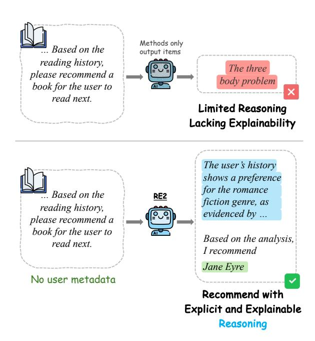
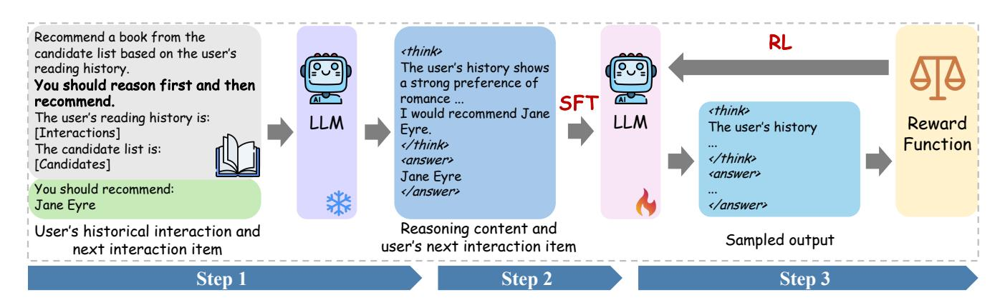
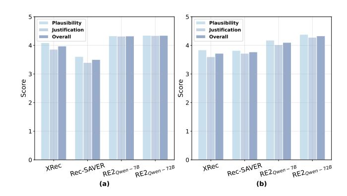

# From Prediction to Understanding: Leveraging Reasoning in Large Language Model-based Recommendations

Zhi-Yuan Chen∗ Gaoling School of Artificial Intelligence, Renmin University of China Beijing, China zhiyuan.chen2001@gmail.com

Siyu Lu Meituan Beijing, China lusiyu05@meituan.com

Qiang Liu Meituan Beijing, China liuqiang43@meituan.com

Xingxing Wang Meituan Beijing, China wangxingxing04@meituan.com

Yankai Lin† Gaoling School of Artificial Intelligence, Renmin University of China Beijing, China yankailin@ruc.edu.cn

# Abstract

Recently, large language models (LLMs) have shown great promise in sequential recommendation. Existing methods typically transform users' historical interactions into textual sequences and then feed these sequences into LLMs to generate recommended items. However, since the output of LLMs is limited to recommendations, the models must analyze user interactions and infer user preferences implicitly. This implicit approach constrains the expressive reasoning abilities of LLMs. Moreover, as the output of LLMs consists solely of recommended items, the resulting recommendations lack explainability. To address these issues, we propose RE2, which enables LLMs to explicitly generate reasoning content before providing recommendations. Making the reasoning process explicit helps elicit the reasoning abilities of LLMs and simultaneously enhances the explainability of recommendation results. RE2 consists of three steps: (1) Reasoning Collection, which collects reasoning data by guiding LLMs to generate both reasoning content and recommended items for each interaction sequence. (2) Pattern Imitation, which leverages the collected data to train LLMs via supervised finetuning to imitate the pattern of first generating reasoning content and then providing recommendations. (3) Pattern Internalization, which further internalizes this reasoning-and-recommendation pattern and enhances both recommendation performance and the rationality of the reasoning content through reinforcement learning. RE2 can be implemented under both the self-distillation and teacherdistillation frameworks, without requiring external user metadata such as user reviews. Experimental results demonstrate the effectiveness of RE2 in improving recommendation performance and in generating high-quality reasoning content. Furthermore, we show

[This work is licensed under a Creative Commons Attribution 4.0 International License.](https://creativecommons.org/licenses/by/4.0)

WWW '26, Dubai, United Arab Emirates © 2026 Copyright held by the owner/author(s). ACM ISBN 979-8-4007-2307-0/2026/04 <https://doi.org/10.1145/3774904.3792283>

that RE2 can mitigate popularity bias while maintaining recommendation accuracy to some extent. Our data and code are available at [https://github.com/zhiyuanc2001/RE2.](https://github.com/zhiyuanc2001/RE2)

# CCS Concepts

### • Information systems → Recommender systems.

# Keywords

Large Language Models, Reasoning, Sequential Recommendation, Explainable Recommendation

### ACM Reference Format:

Zhi-Yuan Chen, Siyu Lu, Qiang Liu, Xingxing Wang, and Yankai Lin. 2026. From Prediction to Understanding: Leveraging Reasoning in Large Language Model-based Recommendations. In Proceedings of the ACM Web Conference 2026 (WWW '26), April 13–17, 2026, Dubai, United Arab Emirates. ACM, New York, NY, USA, [12](#page-11-0) pages.<https://doi.org/10.1145/3774904.3792283>

# 1 Introduction

Large language models (LLMs) have demonstrated significant potential across numerous domains [\[9,](#page-8-0) [45,](#page-8-1) [50,](#page-9-0) [62,](#page-9-1) [65\]](#page-9-2). This has spurred growing interest in leveraging LLMs as the backbone for sequential recommendation systems [\[12,](#page-8-2) [13,](#page-8-3) [16,](#page-8-4) [33,](#page-8-5) [34\]](#page-8-6), a crucial and common application on the modern Web. The primary objective of sequential recommendation is to predict users' next interaction item based on their historical interactions. To achieve this, existing methods typically adopt supervised fine-tuning (SFT) to equip LLMs with domain-specific recommendation knowledge [\[3,](#page-8-7) [34,](#page-8-6) [66\]](#page-9-3). Additionally, researchers explore further optimizing LLMs using the Direct Preference Optimization (DPO) method [\[8,](#page-8-8) [33\]](#page-8-5). The DPO process enables LLMs to better capture user preferences by learning from both positive and negative samples, resulting in more personalized recommendations.

In spite of recent advancements, the output of current LLMbased recommendation systems only consists of recommended items [\[8,](#page-8-8) [16,](#page-8-4) [33,](#page-8-5) [34\]](#page-8-6). This recommendation paradigm introduces a fundamental issue: the reasoning process remains implicit, leading to negative consequences on two perspective. (1) From the model

∗This work was done when Zhi-Yuan Chen was doing an internship at Meituan.

†Yankai Lin is the corresponding author.

Figure 1: Comparison between current LLM-based sequential recommendation methods (top) and RE2 (bottom). RE2 enables LLMs to explicitly output reasoning content prior to providing final recommendations. This facilitates leveraging the reasoning abilities of LLMs to improve recommendation performance and enhances recommendation explainability.

perspective, an implicit reasoning process limits the model's ability to understand user preferences, ultimately resulting in suboptimal recommendation performance [\[38\]](#page-8-9). In the sequential recommendation task, directly mapping user historical interactions to the next interaction item is challenging. In contrast, explicitly generating reasoning steps to analyze user preferences and then producing the final recommendation based on these preferences can effectively decompose the complex recommendation task into two more intuitive and tractable subtasks. This decomposition encourages the model to solve the sequential recommendation task in a structured manner, allowing it to capture user preferences at a finer granularity and thereby improving the final recommendation performance [\[24,](#page-8-10) [60,](#page-9-4) [72\]](#page-9-5). This process is analogous to solving a math problem: explicitly writing down the reasoning steps before providing the final answer typically leads to more reliable results. (2) From the user perspective, an implicit reasoning process causes the recommendation results to lack explainability. Since the output of LLMs consists only of recommended items, the rationale behind the recommendation remains not transparent. This black-box approach undermines the transparency and reliability of the system, ultimately reducing user trust and satisfaction [\[29,](#page-8-11) [31,](#page-8-12) [41\]](#page-8-13).

To address the above issues, in this work, we propose REasoningand-REcommendation (RE2), which enables a recommendation LLM to first explicitly generate reasoning content and then provide the final recommendations. Explicitly generating reasoning content helps the LLM more accurately capture user preferences by

analyzing historical interactions, thereby improving recommendation performance. Additionally, the generated reasoning content enhances the explainability of the recommendation results produced by the LLM. Specifically, RE2 consists of three core steps: (1) Reasoning Collection. In this step, we prompt an LLM to generate reasoning content for each recommendation. To achieve this, we input each user's historical interaction and the associated next interaction item into the LLM. The model is guided to naturally generate reasoning content based on the interaction and then recommend the associated next interaction item. This approach ensures that the generated reasoning content is aligned with the user's interaction, while also guaranteeing that it effectively enables the model to recommend the next interaction item. In particular, reasoning collection can be performed either from the recommendation model itself or from a stronger model, following the self-distillation and teacher-distillation frameworks, respectively. (2) Pattern Imitation. In this step, we train the recommendation LLM to imitate the reasoning-and-recommendation pattern, i.e., to first generate reasoning content and then provide recommendations. Specifically, given a user's historical interaction as input, we construct the training target by concatenating the corresponding reasoning content (generated in the previous step) with the next interaction item. The model is then trained using an SFT approach. (3) Pattern Internalization. In this step, we further apply reinforcement learning (RL) [\[18\]](#page-8-14) to internalize the reasoning-and-recommendation pattern of the recommendation model. This step aims to encourage the model to generate reasoning that directly contributes to better recommendation performance, rather than superficial pattern imitation.

To validate the effectiveness of RE2, we conduct evaluations on three real-world datasets: Movielens-100K [\[19\]](#page-8-15), Steam [\[52\]](#page-9-6), and Goodreads [\[54\]](#page-9-7). Empirical results show that RE2 not only improves recommendation accuracy but also generates high-quality reasoning content for the recommendations. Specifically, on the Goodreads dataset, RE2 achieves a significant improvement over RosePO [\[33\]](#page-8-5) in terms of HitRatio@1 (0.3515 vs. 0.3095). Moreover, the reasoning content generated by RE2 surpasses that of XRec by 0.0364 in ROUGE-1 and 0.0106 in BERTScore. Both LLM-based and humanbased evaluations further show that the reasoning content produced by RE2 achieves higher scores in plausibility and justification compared to XRec and other methods. Further analysis demonstrates that, by designing an appropriate reward function in the RL step, RE2 can mitigate popularity bias while maintaining a comparable level of recommendation accuracy.

# 2 Related Work

# 2.1 LLMs in Sequential Recommendation

Due to the rich world knowledge and contextual understanding abilities of LLMs, they are able to accurately comprehend item information and uncover users' deep preferences [\[13,](#page-8-3) [44,](#page-8-16) [71\]](#page-9-8). This lead researchers to incorporate LLMs into sequential recommendation tasks [\[32,](#page-8-17) [34,](#page-8-6) [37,](#page-8-18) [73\]](#page-9-9). To achieve this, one prevalent approach is to apply LLMs as a backbone of recommendation systems [\[3,](#page-8-7) [8,](#page-8-8) [16,](#page-8-4) [34\]](#page-8-6). Several studies show that by designing appropriate prompts, LLMs can simulate the behavior of recommendation systems in a zeroshot or few-shot manner [\[13,](#page-8-3) [30,](#page-8-19) [52\]](#page-9-6). To enable LLMs to possess domain-specific knowledge in the recommendation field and more

Table 1: Comparison of related recommendation methods. User metadata indicates whether user profiles (such as age and gender) and user reviews of items are required. Reasoning indicates whether a method possesses an explicit reasoning process.

| Method       |        |          |               |                          | Task        |                | No User Metadata Reasoning | Explainability |
|--------------|--------|----------|---------------|--------------------------|-------------|----------------|----------------------------|----------------|
| ReaRec       | [46]   | ,        | STREAM-Rec    | [67]                     | Item        | Prediction     | ✔ ✔                        | ✘              |
| LLaRA        | [34]   | , RosePO |               | [33] , S-DPO [8] , SPRec | [16] Item   | Prediction     | ✔ ✘                        | ✘              |
| XRec         | [41] , | PEPLER   | [31]          |                          | Explanation | Generation     | ✘ ✘                        | ✔              |
| TALLRec      | [3]    |          |               |                          | Binary      | Classification | ✔ ✘                        | ✘              |
| ReasoningRec |        |          | [4] , CausalX | [29]                     | Item        | Prediction     | ✘ ✔                        | ✔              |
| EXP3RT       | [25]   | ,        | Reason4Rec    | [15]                     | Rating      | Prediction     | ✘ ✔                        | ✔              |
| RE2          | (ours) |          |               |                          | Item        | Prediction     | ✔ ✔                        | ✔              |

accurately analyze user preferences, some works further train LLMs using SFT and DPO methods [\[33,](#page-8-5) [34\]](#page-8-6). However, current methods restrict LLMs to only outputting the predicted item, resulting in the process of inferring user preferences from historical interactions being done implicitly. This approach limits the reasoning abilities of LLMs, leading to suboptimal recommendation performance [\[25\]](#page-8-22). In this work, we propose a method that allows LLMs to explicitly output reasoning content during the recommendation process, thereby enhancing recommendation performance.

# 2.2 LLMs for Explainable Recommendation

The goal of explainable recommendation is to provide explanations behind the behavior of recommendation systems [\[6,](#page-8-24) [40,](#page-8-25) [41,](#page-8-13) [70\]](#page-9-11), which can help researchers analyze the reliability of the system and increase user satisfaction. Thanks to the text understanding and generation capabilities of LLMs, some works propose to utilize LLMs to explain the outputs of other black-box recommendation models [\[28\]](#page-8-26). Specifically, by providing the inputs and outputs of the black-box recommendation models to LLMs, the LLMs can act as proxies for the recommendation models, generating text that explains the outputs of the models. Another line of work focuses on enhancing the explainability of LLM-based recommendation systems [\[17,](#page-8-27) [25,](#page-8-22) [29,](#page-8-11) [31,](#page-8-12) [41\]](#page-8-13). To achieve this, these studies typically incorporate user review metadata and user interest summaries into the input of LLMs to improve their understanding of user preferences [\[15,](#page-8-23) [25\]](#page-8-22), thereby enhancing the fidelity of the generated explanations. However, existing explainable recommendation works primarily focus on generating the explanation itself, treating the explanation generation as a separate downstream task. Our work is fundamentally different. We posit that the act of generating reasoning is not solely for explanation, but rather an instrumental step to improve the recommendation logic itself. Specifically, in this work, we frame explicit reasoning as an intermediate, performanceenhancing step within the core recommendation process, where explainability emerges as a valuable byproduct of the reasoning process.

# 2.3 Reasoning in LLMs

Research has shown that, through prompting techniques such as chain of thought (CoT) [\[5,](#page-8-28) [14,](#page-8-29) [57,](#page-9-12) [61\]](#page-9-13), LLMs are able to demonstrate a certain degree of reasoning ability, achieving remarkable performance in tasks like mathematics and code generation [\[1,](#page-8-30) [23,](#page-8-31) [59\]](#page-9-14). To further unlock the reasoning abilities of LLMs, recent works have

designed various post-training methods [\[18,](#page-8-14) [22\]](#page-8-32) to enable models to engage in more complex thinking processes, such as exploration and backtracking, which significantly increase the success rate of LLMs in solving complex problems. In recommendation systems, early studies aim to design prompts that elicit reasoning processes from LLMs [\[13,](#page-8-3) [52,](#page-9-6) [55\]](#page-9-15), thereby uncovering users' latent preferences and obtaining more accurate recommendations. Furthermore, some works propose LLM-based multi-agent frameworks to simulate recommendation scenarios [\[55,](#page-9-15) [56\]](#page-9-16). In this work, we propose a framework that enables the LLM-based recommendation model to explicitly output reasoning content during the recommendation process, thereby improving both its explainability and recommendation performance. Our framework represents a concrete application of large reasoning models in the recommendation domain, demonstrating the potential of large reasoning models in recommendation systems.

### 3 Preliminaries

Formulation of Sequential Recommendation. The goal of sequential recommendation is to select the next item ����+1 that a user �� will interact with from a list of candidate items, given the chronologically ordered sequence of their historical interactions I = (��1,��2, . . . ,����). To adapt LLMs for sequential recommendation, a prevalent approach is to frame the task as an autoregressive language modeling problem, in which a user's historical interactions I are represented in textual form and combined with prompts as input to LLMs. The models then predict the next item ����+1 based on the contextual information.

Supervised Fine-Tuning of LLMs. To augment LLMs with domain-specific knowledge or align them with human values, researchers often employ the SFT method. Specifically, given training data D = {(���� , ����)}��=1:�� , where ���� is the input to LLMs and ���� is the corresponding label, SFT trains the models ���� by maximizing the likelihood of generating ���� conditioned on the input ���� [\[51,](#page-9-17) [68\]](#page-9-18):

max ∑︁�� ��=1 log ���� (���� |����),

where �� represents the parameters of LLMs.

Group Relative Policy Optimization. Recently, a novel RL algorithm, called Group Relative Policy Optimization (GRPO) [\[18,](#page-8-14) [45\]](#page-8-1),

Figure 2: The workflow of RE2. RE2 enables an LLM to explicitly generate reasoning content prior to providing final recommendations. It comprises three key steps: (1) Reasoning Collection: The LLM is prompted with users' historical interactions and the associated next interaction items to generate reasoning content. (2) Pattern Imitation: The LLM is fine-tuned via SFT to imitate the pattern of generating reasoning content and then making recommendations. (3) Pattern Internalization: RL is applied to further internalize the reasoning-and-recommendation pattern and enhance the model's recommendation performance.

In the RL step, RE2 designs an outcome-based reward function to guide model updates. The reward consists of two components: a format reward and an item reward:

- Format Reward (��format). This reward checks whether the model's output follows the required format by ensuring that the reasoning content is enclosed by the <think> </think> tag and the recommended item is enclosed by the <answer> </answer> tag. If the model's output is correctly formatted, the reward is 1; otherwise, it is 0. This reward encourages the LLM to generate outputs that contain both reasoning content and recommended items, and the use of tags facilitates the extraction of each component from the model's output.
- Item Reward (��item). This reward verifies whether the item recommended by the model (i.e., the content within the <answer> </answer> tag) matches the user's actual next interaction item, based on exact string matching. If the model's recommended item matches the user's actual next interaction item, the reward is 1; otherwise, it is 0. The goal of this reward is to encourage the LLM to generate accurate recommendations derived from the reasoning process.

The final reward function ��final is defined as:

��final = ��item + ����format, (3)

where �� is a hyperparameter used to balance the contributions of the format and item rewards. Based on this reward, each output sampled by the LLM for a given question �� receives a corresponding reward ��, and the LLM is optimized by maximizing the objective defined in Equation [1.](#page-2-0)

Although our reward function does not directly supervise the reasoning content, we aim to indirectly encourage the model to generate effective reasoning content by supervising the accuracy of the final recommendation. Experimental results in Section [5.4](#page-6-0) demonstrate that our approach can produce high-quality reasoning content.

### 5 Experiments

In this section, we aim to conduct experiments to answer the following research questions (RQs):

- RQ1: How does RE2 perform compared to other sequential recommendation models?
- RQ2: How do different training steps affect the performance of RE2?
- RQ3: What is the quality of the reasoning content generated by RE2?
- RQ4: What is the performance of RE2 when aligned to mitigate popularity bias while simultaneously improving recommendation accuracy?

### 5.1 Experimental Setup

Datasets. We conduct experiments on three widely used recommendation datasets: Movielens-100k [\[19\]](#page-8-15), Steam [\[24\]](#page-8-10), and Goodreads [\[54\]](#page-9-7). The Movielens-100k dataset includes users' movie watching histories and corresponding ratings. The Steam dataset includes user reviews and metadata for video games on the Steam platform. The Goodreads dataset is sourced from a popular reading website, comprising users' book reading histories and ratings.

Since both the SFT and RL stages are computationally expensive, we build upon the data filtering strategy from [\[8,](#page-8-8) [33,](#page-8-5) [34\]](#page-8-6) to control the dataset size. We filter the dataset following these three steps: (1) For Movielens and Goodreads, we filter out interactions where the rating is less than 3 and 5, respectively. (2) We remove users and items that have fewer than 20 interactions for all datasets. (3) Finally, we randomly sample a proportion of the remaining sequences to construct the final dataset. Detailed statistics of the processed datasets are presented in Appendix [A.](#page-9-19) For data splitting, to prevent potential data leakage, all datasets are sorted chronologically and then split into training, validation, and test sets in an 8 : 1 : 1 ratio. We maintain item titles and genres to form textual user sequences for each dataset [\[8,](#page-8-8) [34\]](#page-8-6). For each user sequence, we retain the last 5 interactions as the historical context. Following the candidate

set generation strategy in [\[34\]](#page-8-6), we randomly sample 19 negative items (i.e., items the user did not interact with in this sequence) and combine them with the actual next interaction item to form the candidate set.

Evaluation Metrics. We evaluate the effectiveness of RE2 along two dimensions: recommendation performance and reasoning content quality. To evaluate the recommendation performance, following [\[8,](#page-8-8) [34\]](#page-8-6), we use two metrics: HitRatio@1 (HR@1) and Valid Ratio. HR@1 measures the proportion of interaction sequences where the recommended item matches the actual next interaction item, reflecting the accuracy of a model's recommendations. Valid Ratio is designed for LLM-based recommendation models and evaluates the proportion of generated items that fall within the candidate set. This metric reflects the model's ability to understand and follow the given instructions.

To evaluate the reasoning content quality, we adopt both metric-based and LLM-based evaluation methods. For the metricbased approach, since gold references are unavailable [\[29,](#page-8-11) [52\]](#page-9-6), we use the framework proposed in Rec-SAVER [\[52\]](#page-9-6), which has been shown to exhibit strong alignment with human judgment. Specifically, we use reasoning content generated by GPT-4o [\[21\]](#page-8-35) and verified through self-checking as the reference, and then measure the similarity between the model-generated reasoning content and the reference using BLEU [\[43\]](#page-8-36), ROUGE-1 [\[36\]](#page-8-37), METEOR [\[2\]](#page-8-38), and BERTScore [\[69\]](#page-9-20). BLEU and ROUGE-1 capture syntactic similarity, while METEOR and BERTScore emphasize semantic relevance.

For the LLM-based approach, we employ GPT-4o as the evaluator. To provide a comprehensive and fine-grained assessment of the quality of reasoning content, we consider two complementary dimensions: (1) Plausibility: the extent to which the reasoning is consistent with the user's historical interactions; and (2) Justification: the logical coherence with which the reasoning supports the recommended item. Following the evaluation method in [\[11\]](#page-8-39), for each interaction sequence, we present the reasoning content generated by all models to the LLM evaluator simultaneously, and instruct it to rate each reasoning on a scale of 1-5. In addition, we conduct a human evaluation and randomly sample 50 examples to reduce annotation overhead.

Baselines. For recommendation performance, we evaluate RE2 against both traditional recommendation models and LLMbased recommendation models. For traditional recommendation models, we include Caser [\[47\]](#page-9-21), GRU4Rec [\[20\]](#page-8-40), and SASRec [\[24\]](#page-8-10), which model sequential recommendation as a sequence prediction task using the CNN, the RNN, and the attention-based network, respectively. Additionally, we incorporate MoRec [\[64\]](#page-9-22), which introduces information from other modalities into the recommendation system. We also include ERL [\[46\]](#page-8-20), which is built upon SASRec and enables the model to generate hidden reasoning states before predicting final recommendations. For LLM-based recommendation models, we include following models: (1) LLMRec [\[39\]](#page-8-41) designs appropriate prompts to instruct general-purpose LLMs in generating recommendations. (2) IA-Reason[\[63\]](#page-9-23) constructs prompts to guide LLMs to conduct the reasoning process when generating recommendation items. (3) QwQ [\[49\]](#page-9-24) is a large reasoning model that exhibits strong reasoning abilities and is capable of solving challenging problems through complex, multi-step thinking. (4)

TALLRec [\[3\]](#page-8-7) trains LLMs on recommendation-specific data in an instruction-response format. (5) LLM-MLP[\[26\]](#page-8-42) incorporates user and item embedding information into the input of LLMs to enhance the understanding of users. (6) LLaRA [\[34\]](#page-8-6) uses both text-based and ID-based item representations as input for LLMs and trains the models via a curriculum learning strategy. (7) RosePO [\[33\]](#page-8-5) trains LLMs on preference data and utilizes a personalized optimization algorithm to enable LLMs to better capture individual user preferences. For reasoning content quality, we compare RE2 with XRec [\[41\]](#page-8-13) and Rec-SAVER [\[52\]](#page-9-6). XRec incorporates collaborative signals into LLMs to help models capture user preferences and provide recommendation explanations. Rec-SAVER trains LLMs with reasoning outputs to enhance their recommendation performance.

For LLM-based recommendation models, we adopt Qwen2.5- 7B-Instruct as the backbone. For RE2, in the reasoning collection step, we gather reasoning content from Qwen2.5-7B-Instruct (selfdistillation) and Qwen2.5-72B-Instruct (teacher-distillation). We refer to the trained models as RE2��������−7�� and RE2��������−72��, respectively.

# 5.2 Performance Comparison (RQ1)

Table [3](#page-6-1) presents the performance comparison between RE2 and all baselines. From the table, we observe the following key findings:

(1) The RE2 method consistently outperforms other baselines across all datasets. For example, on Movielens-100K, Steam, and Goodreads, RE2��������−72�� achieves HR@1 of 0.3894, 0.3536, and 0.3515, respectively. In comparison, the best-performing baselines reach HR@1 of 0.3646, 0.3243, and 0.3242 on those datasets, respectively. The results show that RE2 significantly improves recommendation performance by leveraging SFT and RL to guide the LLM learn and refine the reasoning-and-recommendation pattern.

(2) Reasoning content collected from stronger models helps improve the performance of RE2. From Table [3,](#page-6-1) we observe that although RE2��������−72�� performs slightly worse than RE2��������−7�� on the Steam dataset, it outperforms RE2��������−7�� on Movielens-100k and Goodreads by margins of 0.0106 and 0.0126, respectively. These results suggest that distilling reasoning content from stronger LLMs can significantly enhance the performance of RE2. A potential explanation is that stronger LLMs are better at analyzing user interaction sequences and inferring user preferences, thereby generating higher quality reasoning content. Nevertheless, RE2��������−7�� still demonstrates competitive performance under a more cost-efficient self-distillation setup, highlighting its practicality in scenarios with limited access to powerful teacher models.

(3) Both traditional and existing LLM-based recommendation models exhibit certain limitations. Traditional recommendation models primarily leverage co-occurrence signals between items and often lack a deep semantic understanding of item content. General-purpose models such as LLMRec and QwQ, despite being trained on large-scale open-domain corpora, lack adequate domainspecific knowledge for recommendation tasks, consequently failing to achieve satisfactory performance. Models like LLaRA, and RosePO attempt to enhance domain knowledge through various training strategies. However, these models typically rely on implicitly inferring user preferences from user history without explicitly modeling the reasoning process. The results highlight the potential

Figure 3: LLM-based (a) and human-based (b) evaluation results on the quality of reasoning content.

Table 6: Comparison of recommendation accuracy and popularity bias across different recommendation models.

|                | Movielens-100k | TALLRec | RosePO | RosePO-p | RE2-SFT | RE2    | RE2-p  |
|----------------|----------------|---------|--------|----------|---------|--------|--------|
| HR@1           | ↑              | 0.2832  | 0.3646 | 0.3788   | 0.2850  | 0.3788 | 0.3611 |
| Pop.diff Steam | ↓              | 1.2358  | 1.5343 | 1.3852   | 1.2764  | 1.4014 | 1.2331 |
| HR@1           | ↑              | 0.2695  | 0.3037 | 0.2960   | 0.2710  | 0.3660 | 0.3567 |
| Pop.diff       | ↓ Goodreads    | 1.8271  | 1.9676 | 1.8889   | 1.2424  | 1.8913 | 1.4123 |
| HR@1           | ↑              | 0.2970  | 0.3095 | 0.3001   | 0.2518  | 0.3389 | 0.3221 |
| Pop.diff       | ↓              | 0.9337  | 0.9668 | 0.9349   | 0.7117  | 0.8623 | 0.8091 |

outperforms RE2-SFT��������−7�� across all metrics, indicating that the RL step encourages the model to generate more rational reasoning content by supervising the accuracy of the final recommended item. (3) The reasoning content generated by RE2��������−72�� is of higher quality than that generated by RE2��������−7��. In particular, RE2��������−72�� improves over RE2��������−7�� by 0.0064 in BLEU and 0.0245 in METEOR, indicating that training on reasoning content collected from stronger models further enhances the quality of the reasoning generated by RE2.

The LLM-based and human-based evaluation results are presented in Figure [3.](#page-7-0) From the figure, we can see that both LLM-based and human-based evaluations demonstrate that RE2��������−72�� and RE2��������−7�� outperform XRec and Rec-SAVER in terms of both plausibility and justification. This indicates that our RE2 method is capable of generating reasoning content that is not only coherent and consistent with user historical interactions, but also effectively supports the final recommendations.

# 5.5 Popularity Bias Mitigation (RQ4)

Recent studies suggest that recommendation models often suffer from popularity bias [\[33,](#page-8-5) [42\]](#page-8-43), a phenomenon where models disproportionately favor items that appear frequently in the training data. In this section, we investigate whether RE2 can effectively mitigate

popularity bias while maintaining recommendation accuracy. To this end, we modify the reward function in the RL step of RE2 as follows:

��final = ��item + ����format − �� ��pop,

where ��pop denotes the frequency of the recommended item in the data, and �� is a hyperparameter that balances the popularity penalty against rewards. The reasoning content collected in this section follows the self-distillation framework. We refer to the model trained with this modified reward as RE2-p. For comparison, we include RosePO-p [\[33\]](#page-8-5), a variant of RosePO that effectively mitigates popularity bias by constructing negative samples in preference learning based on item popularity. To quantify popularity bias, we adopt the log popularity difference (Pop.diff) metric [\[35\]](#page-8-44), which is defined as:

Pop.diff = E��������∈R log ��pop (��������) − E��������∈U log ��pop (��������),

where R and U denote the sets of recommended items by the recommendation model and user-interacted items, respectively. Lower Pop.diff values suggest that the recommendation model is more inclined to recommend less frequently occurring (i.e., less popular) items, thus demonstrating a reduction in popularity bias.

Experimental results are presented in Table [6.](#page-7-1) From the table, we observe that: (1) RE2-p effectively mitigates popularity bias while maintaining recommendation accuracy. Across all three datasets, RE2-p consistently achieves lower Pop.diff scores compared to RE2, which focuses solely on improving recommendation accuracy. Furthermore, RE2-p outperforms RosePO-p on both the Steam and Goodreads datasets, achieving higher accuracy and lower popularity bias. These results demonstrate the potential of RE2-p to jointly optimize for multiple objectives in real-world recommendation scenarios. (2) Explicit reasoning helps reduce popularity bias. RE2-SFT, which introduces reasoning content in its recommendations, shows lower popularity bias than TALLRec on both Steam (1.2424 vs. 1.8271) and Goodreads (0.7117 vs. 0.9337). We hypothesize that by explicitly generating reasoning content, LLMs are encouraged to better analyze user preferences and tailor recommendations accordingly, thereby reducing the dominance of popular items.

### 6 Conclusion

This work introduces RE2, a framework that enables LLM-based recommendation systems to explicitly generate reasoning content prior to final recommendations. To achieve this, RE2 trains the recommendation LLM through three key steps: Reasoning Collection, Pattern Imitation, and Pattern Internalization. Empirical results demonstrate that RE2 achieves remarkable performance on sequential recommendation while generating high-quality reasoning content. Further analysis shows that RE2 can effectively mitigate popularity bias while maintaining a comparable level of recommendation accuracy.

# Acknowledgments

We sincerely thank all the anonymous reviewers and (S)ACs for their valuable comments and thoughtful suggestions. This work was supported by The National Natural Science Foundation of China (No. 62376273 and No.U2436209) and Beijing Natural Science Foundation (L253001).

### References

[1] Janice Ahn, Rishu Verma, Renze Lou, Di Liu, Rui Zhang, and Wenpeng Yin. 2024. Large language models for mathematical reasoning: Progresses and challenges. arXiv preprint arXiv:2402.00157 (2024). [2] Satanjeev Banerjee and Alon Lavie. 2005. METEOR: An automatic metric for MT evaluation with improved correlation with human judgments. In Proceedings of the acl workshop on intrinsic and extrinsic evaluation measures for machine translation and/or summarization. 65–72. [3] Keqin Bao, Jizhi Zhang, Yang Zhang, Wenjie Wang, Fuli Feng, and Xiangnan He. 2023. Tallrec: An effective and efficient tuning framework to align large language model with recommendation. In Proceedings of the 17th ACM Conference on Recommender Systems. 1007–1014. [4] Millennium Bismay, Xiangjue Dong, and James Caverlee. 2024. ReasoningRec: Bridging Personalized Recommendations and Human-Interpretable Explanations through LLM Reasoning. arXiv preprint arXiv:2410.23180 (2024). [5] Yihan Cao, Siyu Li, Yixin Liu, Zhiling Yan, Yutong Dai, Philip S Yu, and Lichao Sun. 2023. A comprehensive survey of ai-generated content (aigc): A history of generative ai from gan to chatgpt. arXiv preprint arXiv:2303.04226 (2023). [6] Jiawei Chen, Hande Dong, Xiang Wang, Fuli Feng, Meng Wang, and Xiangnan He. 2023. Bias and debias in recommender system: A survey and future directions. ACM Transactions on Information Systems 41, 3 (2023), 1–39. [7] Qiguang Chen, Libo Qin, Jinhao Liu, Dengyun Peng, Jiannan Guan, Peng Wang, Mengkang Hu, Yuhang Zhou, Te Gao, and Wanxiang Che. 2025. Towards reasoning era: A survey of long chain-of-thought for reasoning large language models. arXiv preprint arXiv:2503.09567 (2025). [8] Yuxin Chen, Junfei Tan, An Zhang, Zhengyi Yang, Leheng Sheng, Enzhi Zhang, Xiang Wang, and Tat-Seng Chua. 2024. On softmax direct preference optimization for recommendation. arXiv preprint arXiv:2406.09215 (2024). [9] Zhi-Yuan Chen, Shiqi Shen, Guangyao Shen, Gong Zhi, Xu Chen, and Yankai Lin. 2024. Towards Tool Use Alignment of Large Language Models. In Proceedings of the 2024 Conference on Empirical Methods in Natural Language Processing. 1382–1400. [10] Tianzhe Chu, Yuexiang Zhai, Jihan Yang, Shengbang Tong, Saining Xie, Dale Schuurmans, Quoc V Le, Sergey Levine, and Yi Ma. 2025. Sft memorizes, rl generalizes: A comparative study of foundation model post-training. arXiv preprint arXiv:2501.17161 (2025). [11] Ganqu Cui, Lifan Yuan, Ning Ding, Guanming Yao, Bingxiang He, Wei Zhu, Yuan Ni, Guotong Xie, Ruobing Xie, Yankai Lin, et al. 2023. Ultrafeedback: Boosting language models with scaled ai feedback. arXiv preprint arXiv:2310.01377 (2023). [12] Zeyu Cui, Jianxin Ma, Chang Zhou, Jingren Zhou, and Hongxia Yang. 2022. M6-rec: Generative pretrained language models are open-ended recommender systems. arXiv preprint arXiv:2205.08084 (2022). [13] Sunhao Dai, Ninglu Shao, Haiyuan Zhao, Weijie Yu, Zihua Si, Chen Xu, Zhongxiang Sun, Xiao Zhang, and Jun Xu. 2023. Uncovering chatgpt's capabilities in recommender systems. In Proceedings of the 17th ACM Conference on Recommender Systems. 1126–1132. [14] Jinyuan Fang, Yanwen Peng, Xi Zhang, Yingxu Wang, Xinhao Yi, Guibin Zhang, Yi Xu, Bin Wu, Siwei Liu, Zihao Li, et al. 2025. A Comprehensive Survey of Self-Evolving AI Agents: A New Paradigm Bridging Foundation Models and Lifelong Agentic Systems. arXiv preprint arXiv:2508.07407 (2025). [15] Yi Fang, Wenjie Wang, Yang Zhang, Fengbin Zhu, Qifan Wang, Fuli Feng, and Xiangnan He. 2025. Reason4Rec: Large Language Models for Recommendation with Deliberative User Preference Alignment. CoRR (2025). [16] Chongming Gao, Ruijun Chen, Shuai Yuan, Kexin Huang, Yuanqing Yu, and Xiangnan He. 2025. SPRec: Self-Play to Debias LLM-based Recommendation. In Proceedings of the ACM on Web Conference 2025. 5075–5084. [17] Shijie Geng, Shuchang Liu, Zuohui Fu, Yingqiang Ge, and Yongfeng Zhang. 2022. Recommendation as language processing (rlp): A unified pretrain, personalized prompt & predict paradigm (p5). In Proceedings of the 16th ACM conference on recommender systems. 299–315. [18] Daya Guo, Dejian Yang, Haowei Zhang, Junxiao Song, Ruoyu Zhang, Runxin Xu, Qihao Zhu, Shirong Ma, Peiyi Wang, Xiao Bi, et al. 2025. Deepseek-r1: Incentivizing reasoning capability in llms via reinforcement learning. arXiv preprint arXiv:2501.12948 (2025). [19] F Maxwell Harper and Joseph A Konstan. 2015. The movielens datasets: History and context. Acm transactions on interactive intelligent systems (tiis) 5, 4 (2015), 1–19. [20] Balázs Hidasi, Alexandros Karatzoglou, Linas Baltrunas, and Domonkos Tikk. 2015. Session-based recommendations with recurrent neural networks. arXiv preprint arXiv:1511.06939 (2015). [21] Aaron Hurst, Adam Lerer, Adam P Goucher, Adam Perelman, Aditya Ramesh, Aidan Clark, AJ Ostrow, Akila Welihinda, Alan Hayes, Alec Radford, et al. 2024. Gpt-4o system card. arXiv preprint arXiv:2410.21276 (2024). [22] Aaron Jaech, Adam Kalai, Adam Lerer, Adam Richardson, Ahmed El-Kishky, Aiden Low, Alec Helyar, Aleksander Madry, Alex Beutel, Alex Carney, et al. 2024. Openai o1 system card. arXiv preprint arXiv:2412.16720 (2024). [23] Carlos E Jimenez, John Yang, Alexander Wettig, Shunyu Yao, Kexin Pei, Ofir Press, and Karthik Narasimhan. 2023. Swe-bench: Can language models resolve real-world github issues? arXiv preprint arXiv:2310.06770 (2023). [24] Wang-Cheng Kang and Julian McAuley. 2018. Self-attentive sequential recommendation. In 2018 IEEE international conference on data mining (ICDM). IEEE, 197–206. [25] Jieyong Kim, Hyunseo Kim, Hyunjin Cho, SeongKu Kang, Buru Chang, Jinyoung Yeo, and Dongha Lee. 2024. Review-driven Personalized Preference Reasoning with Large Language Models for Recommendation. ArXiv abs/2408.06276 (2024). <https://api.semanticscholar.org/CorpusID:271855183> [26] Sein Kim, Hongseok Kang, Seungyoon Choi, Donghyun Kim, Minchul Yang, and Chanyoung Park. 2024. Large language models meet collaborative filtering: An efficient all-round llm-based recommender system. In Proceedings of the 30th ACM SIGKDD Conference on Knowledge Discovery and Data Mining. 1395–1406. [27] Woosuk Kwon, Zhuohan Li, Siyuan Zhuang, Ying Sheng, Lianmin Zheng, Cody Hao Yu, Joseph Gonzalez, Hao Zhang, and Ion Stoica. 2023. Efficient memory management for large language model serving with pagedattention. In Proceedings of the 29th symposium on operating systems principles. 611–626. [28] Yuxuan Lei, Jianxun Lian, Jing Yao, Xu Huang, Defu Lian, and Xing Xie. 2024. Recexplainer: Aligning large language models for explaining recommendation models. In Proceedings of the 30th ACM SIGKDD Conference on Knowledge Discovery and Data Mining. 1530–1541. [29] Guanrong Li, Haolin Yang, Xinyu Liu, Zhen Wu, and Xinyu Dai. 2025. Counterfactual Language Reasoning for Explainable Recommendation Systems. arXiv preprint arXiv:2503.08051 (2025). [30] Jinming Li, Wentao Zhang, Tian Wang, Guanglei Xiong, Alan Lu, and Gerard Medioni. 2023. GPT4Rec: A generative framework for personalized recommendation and user interests interpretation. arXiv preprint arXiv:2304.03879 (2023). [31] Lei Li, Yongfeng Zhang, and Li Chen. 2023. Personalized prompt learning for explainable recommendation. ACM Transactions on Information Systems 41, 4 (2023), 1–26. [32] Yongqi Li, Xinyu Lin, Wenjie Wang, Fuli Feng, Liang Pang, Wenjie Li, Liqiang Nie, Xiangnan He, and Tat-Seng Chua. 2024. A survey of generative search and recommendation in the era of large language models. arXiv preprint arXiv:2404.16924 (2024). [33] Jiayi Liao, Xiangnan He, Ruobing Xie, Jiancan Wu, Yancheng Yuan, Xingwu Sun, Zhanhui Kang, and Xiang Wang. 2024. RosePO: Aligning LLM-based Recommenders with Human Values. arXiv preprint arXiv:2410.12519 (2024). [34] Jiayi Liao, Sihang Li, Zhengyi Yang, Jiancan Wu, Yancheng Yuan, Xiang Wang, and Xiangnan He. 2024. Llara: Large language-recommendation assistant. In Proceedings of the 47th International ACM SIGIR Conference on Research and Development in Information Retrieval. 1785–1795. [35] Jan Malte Lichtenberg, Alexander Buchholz, and Pola Schwöbel. 2024. Large language models as recommender systems: A study of popularity bias. arXiv preprint arXiv:2406.01285 (2024). [36] Chin-Yew Lin. 2004. Rouge: A package for automatic evaluation of summaries. In Text summarization branches out. 74–81. [37] Jianghao Lin, Xinyi Dai, Yunjia Xi, Weiwen Liu, Bo Chen, Hao Zhang, Yong Liu, Chuhan Wu, Xiangyang Li, Chenxu Zhu, et al. 2025. How can recommender systems benefit from large language models: A survey. ACM Transactions on Information Systems 43, 2 (2025), 1–47. [38] Tianhe Lin, Jian Xie, Siyu Yuan, and Deqing Yang. 2025. Implicit reasoning in transformers is reasoning through shortcuts. arXiv preprint arXiv:2503.07604 (2025). [39] Junling Liu, Chao Liu, Peilin Zhou, Renjie Lv, Kang Zhou, and Yan Zhang. 2023. Is chatgpt a good recommender? a preliminary study. arXiv preprint arXiv:2304.10149 (2023). [40] Shijie Liu, Ruixin Ding, Weihai Lu, Jun Wang, Mo Yu, Xiaoming Shi, and Wei Zhang. 2025. Coherency Improved Explainable Recommendation via Large Language Model. In Proceedings of the AAAI Conference on Artificial Intelligence, Vol. 39. 12201–12209. [41] Qiyao Ma, Xubin Ren, and Chao Huang. 2024. Xrec: Large language models for explainable recommendation. arXiv preprint arXiv:2406.02377 (2024). [42] Masoud Mansoury, Himan Abdollahpouri, Mykola Pechenizkiy, Bamshad Mobasher, and Robin Burke. 2020. Feedback loop and bias amplification in recommender systems. In Proceedings of the 29th ACM international conference on information & knowledge management. 2145–2148. [43] Kishore Papineni, Salim Roukos, Todd Ward, and Wei-Jing Zhu. 2002. Bleu: a method for automatic evaluation of machine translation. In Proceedings of the 40th annual meeting of the Association for Computational Linguistics. 311–318. [44] Xubin Ren, Wei Wei, Lianghao Xia, and Chao Huang. 2024. A comprehensive survey on self-supervised learning for recommendation. Comput. Surveys (2024). [45] Zhihong Shao, Peiyi Wang, Qihao Zhu, Runxin Xu, Junxiao Song, Xiao Bi, Haowei Zhang, Mingchuan Zhang, YK Li, Y Wu, et al. 2024. Deepseekmath: Pushing the limits of mathematical reasoning in open language models. arXiv preprint arXiv:2402.03300 (2024). [46] Jiakai Tang, Sunhao Dai, Teng Shi, Jun Xu, Xu Chen, Wen Chen, Wu Jian, and Yuning Jiang. 2025. Think before recommend: Unleashing the latent reasoning power for sequential recommendation. arXiv preprint arXiv:2503.22675 (2025).

[47] Jiaxi Tang and Ke Wang. 2018. Personalized top-n sequential recommendation via convolutional sequence embedding. In Proceedings of the eleventh ACM international conference on web search and data mining. 565–573. [48] Qwen Team. 2024. Qwen2.5: A Party of Foundation Models. [https://qwenlm.](https://qwenlm.github.io/blog/qwen2.5/) [github.io/blog/qwen2.5/](https://qwenlm.github.io/blog/qwen2.5/) [49] Qwen Team. 2025. QwQ-32B: Embracing the Power of Reinforcement Learning. <https://qwenlm.github.io/blog/qwq-32b/> [50] Romal Thoppilan, Daniel De Freitas, Jamie Hall, Noam Shazeer, Apoorv Kulshreshtha, Heng-Tze Cheng, Alicia Jin, Taylor Bos, Leslie Baker, Yu Du, et al. 2022. Lamda: Language models for dialog applications. arXiv preprint arXiv:2201.08239 (2022). [51] Hugo Touvron, Louis Martin, Kevin Stone, Peter Albert, Amjad Almahairi, Yasmine Babaei, Nikolay Bashlykov, Soumya Batra, Prajjwal Bhargava, Shruti Bhosale, et al. 2023. Llama 2: Open foundation and fine-tuned chat models. arXiv preprint arXiv:2307.09288 (2023). [52] Alicia Y Tsai, Adam Kraft, Long Jin, Chenwei Cai, Anahita Hosseini, Taibai Xu, Zemin Zhang, Lichan Hong, Ed H Chi, and Xinyang Yi. 2024. Leveraging LLM Reasoning Enhances Personalized Recommender Systems. arXiv preprint arXiv:2408.00802 (2024). [53] Leandro von Werra, Younes Belkada, Lewis Tunstall, Edward Beeching, Tristan Thrush, Nathan Lambert, Shengyi Huang, Kashif Rasul, and Quentin Gallouédec. 2020. TRL: Transformer Reinforcement Learning. [https://github.com/](https://github.com/huggingface/trl) [huggingface/trl.](https://github.com/huggingface/trl) [54] Mengting Wan, Rishabh Misra, Ndapa Nakashole, and Julian McAuley. 2019. Fine-grained spoiler detection from large-scale review corpora. arXiv preprint arXiv:1905.13416 (2019). [55] Lei Wang, Jingsen Zhang, Hao Yang, Zhi-Yuan Chen, Jiakai Tang, Zeyu Zhang, Xu Chen, Yankai Lin, Hao Sun, Ruihua Song, et al. 2025. User behavior simulation with large language model-based agents. ACM Transactions on Information Systems 43, 2 (2025), 1–37. [56] Zhefan Wang, Yuanqing Yu, Wendi Zheng, Weizhi Ma, and Min Zhang. 2024. Macrec: A multi-agent collaboration framework for recommendation. In Proceedings of the 47th International ACM SIGIR Conference on Research and Development in Information Retrieval. 2760–2764. [57] Jason Wei, Xuezhi Wang, Dale Schuurmans, Maarten Bosma, Fei Xia, Ed Chi, Quoc V Le, Denny Zhou, et al. 2022. Chain-of-thought prompting elicits reasoning in large language models. Advances in neural information processing systems 35 (2022), 24824–24837. [58] Thomas Wolf, Lysandre Debut, Victor Sanh, Julien Chaumond, Clement Delangue, Anthony Moi, Pierric Cistac, Tim Rault, Rémi Louf, Morgan Funtowicz, Joe Davison, Sam Shleifer, Patrick von Platen, Clara Ma, Yacine Jernite, Julien Plu, Canwen Xu, Teven Le Scao, Sylvain Gugger, Mariama Drame, Quentin Lhoest, and Alexander M. Rush. 2020. Transformers: State-of-the-Art Natural Language Processing. In Proceedings of the 2020 Conference on Empirical Methods in Natural Language Processing: System Demonstrations. Association for Computational Linguistics, Online, 38–45. [https://www.aclweb.org/anthology/2020.emnlp](https://www.aclweb.org/anthology/2020.emnlp-demos.6)[demos.6](https://www.aclweb.org/anthology/2020.emnlp-demos.6) [59] Shijie Xia, Xuefeng Li, Yixin Liu, Tongshuang Wu, and Pengfei Liu. 2025. Evaluating mathematical reasoning beyond accuracy. In Proceedings of the AAAI Conference on Artificial Intelligence, Vol. 39. 27723–27730. [60] Yu Xie, Xingkai Ren, Ying Qi, Yao Hu, and Lianlei Shan. 2025. RecLLM-R1: A Two-Stage Training Paradigm with Reinforcement Learning and Chain-of-Thought v1. arXiv preprint arXiv:2506.19235 (2025). [61] Shunyu Yao, Dian Yu, Jeffrey Zhao, Izhak Shafran, Tom Griffiths, Yuan Cao, and Karthik Narasimhan. 2023. Tree of thoughts: Deliberate problem solving with large language models. Advances in neural information processing systems 36 (2023), 11809–11822. [62] Zihao Yi, Jiarui Ouyang, Yuwen Liu, Tianhao Liao, Zhe Xu, and Ying Shen. 2024. A survey on recent advances in llm-based multi-turn dialogue systems. arXiv preprint arXiv:2402.18013 (2024). [63] Yuanqing Yu, Zhefan Wang, Chumeng Jiang, Xinyi Li, Jiayin Wang, and Min Zhang. 2025. Intelligent Agents with Adaptive Knowledge Fusion for Personalized Recommendation. In Companion Proceedings of the ACM on Web Conference 2025. 2983–2987. [64] Zheng Yuan, Fajie Yuan, Yu Song, Youhua Li, Junchen Fu, Fei Yang, Yunzhu Pan, and Yongxin Ni. 2023. Where to go next for recommender systems? idvs. modality-based recommender models revisited. In Proceedings of the 46th International ACM SIGIR Conference on Research and Development in Information Retrieval. 2639–2649. [65] Xiang Yue, Xingwei Qu, Ge Zhang, Yao Fu, Wenhao Huang, Huan Sun, Yu Su, and Wenhu Chen. 2023. Mammoth: Building math generalist models through hybrid instruction tuning. arXiv preprint arXiv:2309.05653 (2023). [66] Junjie Zhang, Ruobing Xie, Yupeng Hou, Xin Zhao, Leyu Lin, and Ji-Rong Wen. 2023. Recommendation as instruction following: A large language model empowered recommendation approach. ACM Transactions on Information Systems (2023). [67] Junjie Zhang, Beichen Zhang, Wenqi Sun, Hongyu Lu, Wayne Xin Zhao, Yu Chen, and Ji-Rong Wen. 2025. Slow Thinking for Sequential Recommendation. arXiv preprint arXiv:2504.09627 (2025). [68] Shengyu Zhang, Linfeng Dong, Xiaoya Li, Sen Zhang, Xiaofei Sun, Shuhe Wang, Jiwei Li, Runyi Hu, Tianwei Zhang, Guoyin Wang, et al. 2026. Instruction tuning for large language models: A survey. Comput. Surveys 58, 7 (2026), 1–36. [69] Tianyi Zhang, Varsha Kishore, Felix Wu, Kilian Q Weinberger, and Yoav Artzi. 2019. Bertscore: Evaluating text generation with bert. arXiv preprint arXiv:1904.09675 (2019). [70] Yongfeng Zhang, Xu Chen, et al. 2020. Explainable recommendation: A survey and new perspectives. Foundations and Trends® in Information Retrieval 14, 1 (2020), 1–101. [71] Yang Zhang, Fuli Feng, Jizhi Zhang, Keqin Bao, Qifan Wang, and Xiangnan He. 2025. Collm: Integrating collaborative embeddings into large language models for recommendation. IEEE Transactions on Knowledge and Data Engineering (2025). [72] Keyu Zhao, Fengli Xu, and Yong Li. 2025. Reason-to-Recommend: Using Interaction-of-Thought Reasoning to Enhance LLM Recommendation. arXiv preprint arXiv:2506.05069 (2025). [73] Zhi Zheng, Wenshuo Chao, Zhaopeng Qiu, Hengshu Zhu, and Hui Xiong. 2024. Harnessing large language models for text-rich sequential recommendation. In Proceedings of the ACM Web Conference 2024. 3207–3216. A Implementation Details Table [7](#page-9-25) summarizes the detailed statistics of the processed datasets following the setup in [\[8,](#page-8-8) [34\]](#page-8-6), we set the embedding dimension to 64 and the training batch size to 256. All traditional recommendation models are trained using the Adam optimizer with a learning rate of 1�� − 3, and we search for the optimal weight decay coefficient domness, we report the average performance over five runs with 7B-Instruct [\[48\]](#page-9-26) as the backbone and implement the experiments based methods, we train models for a maximum of 5 epochs with a batch size of 128. For the RL step of RE2, we train the LLM for up to 8 epochs with a batch size of 224. During the RL training process, for each question, we generate 7 samples using a sampling temperature of 1.0. The hyperparameter �� in Equation [4.3,](#page-4-1) which balances the format reward and the item reward, is set to 0.5. After each training epoch, we evaluate the model's performance on the validation set. The final test set performance is then reported using the checkpoint that achieves the best results on the validation set. els leverage the instruction-following capabilities of LLMs to select dation. For traditional recommendation models, which output a probability distribution over the entire item space, we select the item with the highest probability from the candidate set as the recommendation. Table 7: Statistics of datasets. Dataset Movielens-100k Steam Goodreads # Sequence 943 2,438 2,468 # Item 1,682 1,930 4,596 # Interaction 5,645 6,414 11,065

used in our experiments. For traditional recommendation models, from the set {1�� − 7, 1�� − 6, 1�� − 5, 1�� − 4, 1�� − 3}. To reduce randifferent random seeds. For LLM-based models, we use Qwen2.5 using the Transformers [\[58\]](#page-9-27) and TRL [\[53\]](#page-9-28) libraries. For all SFT-

To generate recommendations, LLM-based recommendation modan appropriate item from the candidate set as the final recommen-

| Dataset       | Movielens-100k | Steam | Goodreads |
|---------------|----------------|-------|-----------|
| # Sequence    | 943            | 2,438 | 2,468     |
| # Item        | 1,682          | 1,930 | 4,596     |
| # Interaction | 5,645          | 6,414 | 11,065    |

Table 8: Performance comparison on HR@3 and NDCG@3.

| Model   | Movielens-100k | Steam         | Goodreads     |
|---------|----------------|---------------|---------------|
|         | HR@3/NDCG@3    | HR@3/NDCG@3   | HR@3/NDCG@3   |
| SASRec  | 0.5345/0.4258  | 0.5327/0.4447 | 0.3903/0.3254 |
| TALLRec | 0.5274/0.4232  | 0.4875/0.3944 | 0.5414/0.4393 |
| RosePO  | 0.6035/0.5063  | 0.5265/0.4312 | 0.5184/0.4311 |
| RE2     | 0.6513/0.5426  | 0.5919/0.4923 | 0.6107/0.5027 |

### B Results on Additional Evaluation Metrics

In this section, we report the performance of our RE2 method and the baseline approaches on HitRatio@3 (HR@3) and Normalized Discounted Cumulative Gain@3 (NDCG@3). The experimental results are summarized in Table [8.](#page-10-1) As shown in Table [8,](#page-10-1) RE2 consistently outperforms all competing methods on both HR@3 and NDCG@3. Specifically, on the Movielens-100K dataset, RE2 achieves an HR@3 of 0.6513 and an NDCG@3 of 0.5426, whereas RosePO attains 0.6035 and 0.5063 on HR@3 and NDCG@3, respectively. These results demonstrate that RE2 effectively enhances recommendation quality by leveraging SFT and RL to guide the LLM in learning and refining a reasoning-aware recommendation pattern.

### C Computation Cost Analysis

The proposed RE2 framework does not introduce any additional model components; therefore, its per-token inference latency remains essentially identical to that of the underlying LLM. For instance, when instantiated with LLaRA, the average inference latency is 29.53 ms per token, while RE2 achieves a latency of 29.08 ms per token.

Although RE2 requires the generation of explicit reasoning traces, its inference efficiency can be substantially improved by leveraging optimized inference backends such as vLLM [\[27\]](#page-8-45). Under the vLLM setting, TALLRec, which does not produce reasoning outputs, processes 45.34 sequences per second, whereas RE2 processes

15.67 sequences per second. Notably, with approximately a threefold increase in inference time, RE2 is able to generate around 200 additional tokens of reasoning content, providing enhanced transparency and explainability. In addition, RE2 can be further accelerated through advanced decoding techniques, such as speculative decoding, which can partially mitigate the overhead introduced by longer output sequences.

Regarding reinforcement learning (RL) training, the sequence rollout stage incurs a substantial increase in computational overhead due to the generation of extended reasoning trajectories. Nevertheless, considering that RE2 yields significant improvements in both recommendation performance and explainability, we argue that the additional training cost is a reasonable trade-off.

### D Reasoning Collection Prompt

In the reasoning collection step, to enable the LLMs to generate both reasoning content and the actual next interaction item, we input both the user's historical interactions and the actual next interaction item into the LLMs simultaneously. The specific prompt is shown in Table [9.](#page-11-1)

### E Case Study

In Table [10,](#page-11-2) we present a case study on the reasoning content generated by different models on the Goodreads dataset. From the table, we observe that RE2 can accurately analyze the user's reading preferences based on the interaction and explain the reason for the recommended item. In addition, RE2 also provides explanations for why certain items are not recommended, a feature absent in XRec and Rec-SAVER. For example, in RE2��������−72��, the model explains: Books like "Bad Boys Do" and "When a Beta Roars" also fit the user's interests, but "Tyrant" offers a bit more depth and a different flavor compared to the recent reads, while still staying within the romance genre. Overall, RE2 is capable of generating rational reasoning content to enhance the explainability of recommendation results.

Table 9: The prompt used in the reasoning collection step.

System Prompt You are a recommendation system that provides well-reasoned recommendations. You first conduct internal thinking to review the user's book reading history and determine which book to recommend. Then provide the book as your answer. I will provide you with the book to recommend, and you should naturally recommend the book based on analyzing the user's book reading history. Respond in the following format: <think>\n...\n</think>\n<answer>\n...\n</answer>, i.e., <think>\ninternal thinking here\n</think>\n<answer>\nthe recommended book\n</answer>

User Prompt Here are two examples: <example 1> {the first example} <example 2> {the second example} Now please follow the example and finish the task. [Instruction] The user's history (in chronological order) is: {user's historical interactions}. The candidate item list is as follows: {candidate items}. You should recommend the item: {the actual next interaction item} [Response]

Table 10: Case study on reasoning content generated by RE2 and baselines.

XRec: The user's reading history shows a strong preference for romance and young adult fiction, with a particular emphasis on the romantic aspects of the stories. They have recently read books like "Beautiful Disaster," "Fangirl," and "Grin and Beard It," all of which fall into this genre. Their most recent book, "Bossman," also has elements of romance. Given these preferences, the book "Tyrant" stands out as an intriguing choice because it combines romance with thriller and crime genres. This blend introduces a new dynamic to their reading experience, potentially adding suspense and depth to their usual romance-focused narratives. It aligns well with their existing taste for emotional storytelling while offering a fresh twist that could captivate them. Rec-SAVER: The user's reading history shows a clear preference for young adult and romance fiction, with a focus on the young adult genre. The most recent books read are "Beard Science" and "Grin and Beard It," both of which are in the romance and fiction category. Given this pattern, a book that continues to explore the young adult and romance genre, while potentially offering a slight variation, would be ideal. Among the candidate books, "Tyrant" stands out as it blends elements of romance and thriller/crime, which could introduce a new dynamic that the user might enjoy. RE2��������−7��: The user's reading history shows a strong preference for the romance and young-adult fiction genres, as evidenced by books such as "Beautiful Disaster," "Fangirl," "Bossman," "Grin and Beard It," and "Beard Science." These books are all in the romance and young-adult fiction categories, suggesting a continued interest in the romantic and emotional narratives found in these genres. Among the candidate book list, "Tyrant" stands out as a strong recommendation. It is a romance and fiction book, which aligns directly with the user's reading history. Additionally, it has a strong romantic element, which is a key component of the user's recent reading choices. Books like "Fire in His Kiss," "Orgoglio e pregiudizio," and "Bossman" are also romantic and fit well, but "Tyrant" is a more recent and direct recommendation, as it is a romance and fiction book that continues the theme of the user's recent reading. RE2��������−72��: The user's reading history shows a strong preference for romance and young adult fiction, with a recent trend towards more straightforward romance novels. The most recent books read are "Bossman," "Grin and Beard It," and "Beard Science," which are all romance fiction books with a focus on relationships and personal growth. Given this pattern, "Tyrant" stands out as a suitable recommendation. It is a romance novel with a thriller and crime element, which could add a new layer of excitement and complexity to the user's reading experience while still aligning with their established preferences. The book also has a strong reputation for its intense and compelling storyline, making it a good choice for someone who enjoys romance with a bit of a twist. Books like "Bad Boys Do" and "When a Beta Roars" also fit the user's interests, but "Tyrant" offers a bit more depth and a different flavor compared to the recent reads, while still staying within the romance genre.