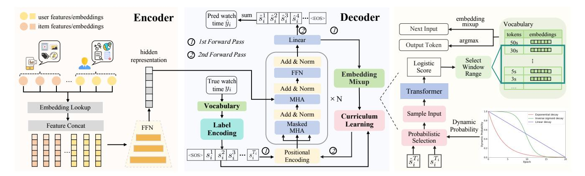
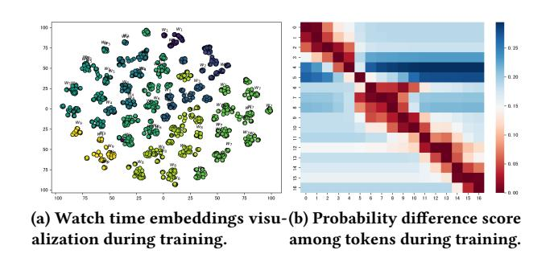
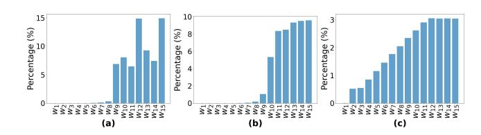
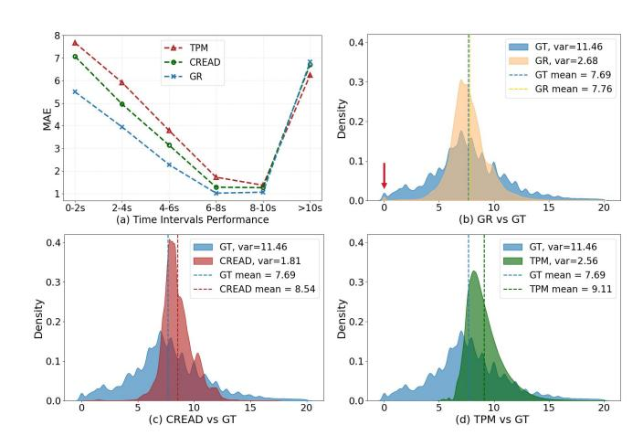

# Generative Regression Based Watch Time Prediction for Short-Video Recommendation

Hongxu Ma∗ Fudan University Shanghai, China hxma24@m.fudan.edu.cn

Kai Tian∗ KuaiShou Technology Beijing, China tiank311@gmail.com

Tao Zhang KuaiShou Technology Beijing, China zhangtao08@kuaishou.com

Xuefeng Zhang KuaiShou Technology Beijing, China zhangxuefeng06@kuaishou.com

Han Zhou Shanghai University of Finance and Economics Shanghai, China zhouhan@stu.sufe.edu.cn

Chunjie Chen KuaiShou Technology Beijing, China chencj517@gmail.com

Han Li KuaiShou Technology Beijing, China lihan08@kuaishou.com

Jihong Guan Tongji University Shanghai, China jhguan@tongji.edu.cn

Shuigeng Zhou† Fudan University Shanghai, China sgzhou@fudan.edu.cn

# ABSTRACT

Watch time prediction (WTP) has emerged as a pivotal task in short video recommendation systems, designed to quantify user engagement through continuous interaction modeling. Predicting users' watch times on videos often encounters fundamental challenges, including wide value ranges and imbalanced data distributions, which can lead to significant estimation bias when directly applying regression techniques. Recent studies have attempted to address these issues by converting the continuous watch time estimation into an ordinal regression task. While these methods demonstrate partial effectiveness, they exhibit notable limitations: (1) the discretization process frequently relies on bucket partitioning, inherently reducing prediction flexibility and accuracy and (2) the interdependencies among different partition intervals remain underutilized, missing opportunities for effective error correction.

Inspired by language modeling paradigms, we propose a novel Generative Regression (GR) framework that reformulates WTP as a sequence generation task. Our approach employs structural discretization to enable nearly lossless value reconstruction while maintaining prediction fidelity. Through carefully designed vocabulary construction and label encoding schemes, each watch time is bijectively mapped to a token sequence. To mitigate the traininginference discrepancy caused by teacher-forcing, we introduce a

curriculum learning with embedding mixup strategy that gradually transitions from guided to free-generation modes.

We evaluate our method against state-of-the-art approaches on two public datasets and one industrial dataset. We also perform online A/B testing on the Kuaishou App to confirm the real-world effectiveness. The results conclusively show that GR outperforms existing techniques significantly. Furthermore, we successfully apply GR to Lifetime Value (LTV) prediction, achieving 17.66% MAE improvement over existing methods. These results validate GR as a generalizable solution for continuous value prediction tasks in recommendation systems.

### CCS CONCEPTS

• Information systems → Recommender systems.

# KEYWORDS

Recommendation, Watch-time prediction, Generative regression

### ACM Reference Format:

Hongxu Ma, Kai Tian, Tao Zhang, Xuefeng Zhang, Han Zhou, Chunjie Chen, Han Li, Jihong Guan, and Shuigeng Zhou. 2018. Generative Regression Based Watch Time Prediction for Short-Video Recommendation. In Proceedings of Make sure to enter the correct conference title from your rights confirmation email (Conference acronym 'XX). ACM, New York, NY, USA, [10](#page-9-0) pages. [https:](https://doi.org/XXXXXXX.XXXXXXX) [//doi.org/XXXXXXX.XXXXXXX](https://doi.org/XXXXXXX.XXXXXXX)

### 1 INTRODUCTION

In recent years, online short video content has a remarkable surge with the rapid development of short video social media platforms such as TikTok and Kuaishou, which spurs efforts to optimize recommendation systems for streaming players [\[5,](#page-8-0) [6,](#page-8-1) [24,](#page-8-2) [27\]](#page-8-3). Unlike traditional Video on Demand (VOD) platforms such as Netflix and Hulu, short video platforms in scrolling mode automatically play content without the user clicking action for desirable video choice, rendering traditional metrics such as click-through rates obsolete [\[13,](#page-8-4) [14\]](#page-8-5). Under these circumstances, the watch time of videos has emerged as a critical metric for measuring user engagement

∗Both authors contributed equally to this research. †Corresponding author.

Permission to make digital or hard copies of all or part of this work for personal or classroom use is granted without fee provided that copies are not made or distributed for profit or commercial advantage and that copies bear this notice and the full citation on the first page. Copyrights for components of this work owned by others than the author(s) must be honored. Abstracting with credit is permitted. To copy otherwise, or republish, to post on servers or to redistribute to lists, requires prior specific permission and/or a fee. Request permissions from permissions@acm.org.

Conference acronym 'XX, June 03–05, 2018, Woodstock, NY

© 2018 Copyright held by the owner/author(s). Publication rights licensed to ACM. ACM ISBN 978-1-4503-XXXX-X/2018/06. . . \$15.00 <https://doi.org/XXXXXXX.XXXXXXX>

**(a) Ordinal regression paradigm (CREAD)** 0 t1

t2

t3 … tn-1

tn …

**(b) Ordinal regression paradigm (TPM) …**

**…**

**… …**

**(c) Our generative regression paradigm (GR) …**

hidden **…**

<SOS>

Figure 1: Predictive paradigm comparison among ordinal regression methods CREAD (a) and TPM (b), and our generative regression (c). Red lines indicate the discretization structure.

and experience [\[5,](#page-8-0) [37,](#page-9-1) [40,](#page-9-2) [41\]](#page-9-3). Continuous video watching means users' immersion and enjoyment of the platform, enhancing the probability of further user retention and conversion. Consequently, accurate watch time estimation enables platforms to recommend videos prolonging users' viewing, which impacts key business metrics such as Daily Active Users (DAU) and drives revenue growth.

In contrast to limited and discrete actions such as liking, following, and sharing, watch time generally exhibits a wide range and long-tailed distribution, making it fundamentally a regression problem for prediction. Some methods [\[33,](#page-9-4) [42–](#page-9-5)[45,](#page-9-6) [47\]](#page-9-7) optimize watch time prediction from a debiasing perspective but have not yet adequately addressed the core challenges of regression. Some others [\[23,](#page-8-6) [31\]](#page-9-8) transform the prediction problem into an Ordinal Regression (OR) task by employing a series of binary classifications across various predefined time intervals (buckets), as separately shown in Fig. [1\(](#page-1-0)a) and Fig. [1\(](#page-1-0)b). While effective, such a modeling paradigm still exhibits two major limitations as follows:

Firstly, conditional dependencies among time intervals are not fully leveraged, which are solely reflected in the definition of the labels. Predictions across different time intervals are often produced independently, thereby hindering the potential for effective error correction and leading to suboptimal results. We provide rigorous theoretical proof of this limitation in the supplementary material.

Secondly, the strict discretization process within fixed time intervals in ordinal regression makes model performance highly contingent on the method of time interval segmentation, inherently reducing prediction flexibility and accuracy. This approach performs binary classification across all predefined buckets, with the final prediction derived as the sum of bucket sigmoid probabilities multiplied by their corresponding bucket span values. Due to the wide range of actual watch times [\[31,](#page-9-8) [33\]](#page-9-4), tail buckets often have excessively large span values, which can disproportionately amplify prediction errors for samples with shorter watch times, even when the binary probabilities of these tail buckets are minimal. Additionally, the scrolling mode of short video platforms results in a high percentage of videos with relatively short watch times in real-world scenarios, further exacerbating the overall fitting error.

In response to these limitations above, inspired by the recent success of Large Language Models (LLMs) [\[3,](#page-8-7) [34,](#page-9-9) [46\]](#page-9-10), we propose a novel universal regression paradigm, called Generative Regression (GR), which effectively utilizes dependencies among multi-step predictions and does not strictly rely on fixed time interval divisions. GR addresses the issues above as follows:

On the one hand, as shown in Fig. [1\(](#page-1-0)c), the complete watch time prediction task is decomposed into a sequential generation task, where each step predicts a part of the total watch time. The output

of each time step serves as input for the next one, thereby constituting a conditional and sequential modeling process. The objective is to predict a sequence of time slots, whose sum constitutes the continuous regression target. This generative regression paradigm not only ingeniously inherits the advantage of previous ordinal regression methods [\[10,](#page-8-8) [21,](#page-8-9) [23,](#page-8-6) [31\]](#page-9-8) by decomposing the regression task into multi-classification subtasks to simplify the prediction process, but also leverages dependencies between steps to accurately and progressively approximate the total watch time.

On the other hand, unlike ordinal regression methods [\[23,](#page-8-6) [31\]](#page-9-8) that restrict outputs to binary classification within fixed time intervals, our GR model offers the flexibility for each predictive step to not only select from a vocabulary of tokens—each representing a distinct time slot in positive real number space, but also output an end-of-sequence (<EOS>) token. This flexibility enables GR to generate a broader set of potential sequences, thereby improving its capacity to generalize across diverse watching behaviors and leading to more accurate and personalized predictions.

For token definition and watch time segmentation, we propose a data-driven unified vocabulary construction method, which mitigates token imbalance and eliminates manual design reliance, and a label encoding strategy allows a lossless restoration of watch time values, thereby enhancing the model's generality and generalization capability. To accelerate model convergence, we adopt curriculum learning [\[2\]](#page-8-10) strategy during training to alleviate training-andinference inconsistency, commonly known as exposure bias [\[8,](#page-8-11) [36\]](#page-9-11). Besides, leveraging our insights into the training process, we propose an embedding mixup method to compensate for output-toinput gradients. This approach enhances model performance at a lower computational cost by leveraging the semantic additivity of tokens while ensuring consistency between training and inference.

The contributions of this paper are as follows:

- (i) We introduce a novel generation framework for predicting watch time, which inherits the benefits of structured discretization and adeptly utilizes interval relationships for the progressive and precise estimation of total watch time.
- (ii) To enhance generality and adaptability, we develop a datadriven unified vocabulary design and a label encoding method. Additionally, we introduce curriculum learning with embedding mixup to mitigate exposure bias and compensate for output-to-input gradients to accelerate model training.
- (iii) Extensive online and offline experiments show that GR significantly outperforms existing SOTA models. We further analyze the underlying reasons for performance gain and

the impact of key factors like vocabulary design to provide a clear understanding of the mechanisms underlying GR.

- (iv) Last but not least, we successfully apply GR to another regression task in recommendation systems, Lifetime Value (LTV) prediction, which indicates its potential as a novel and effective solution to general regression challenges.

### 2 RELATED WORK

### 2.1 Watch Time Prediction (WTP)

WTP aims to estimate the video watch time based on the user's profile, historical interactions, and video characteristics. Value regression (VR) directly predicts the absolute value of watch time, assessing model accuracy by mean square error (MSE). Subsequent WTP methods can be roughly divided into two groups. The first focuses on optimizing WTP from a debiasing perspective [\[33,](#page-9-4) [42–](#page-9-5) [45,](#page-9-6) [47\]](#page-9-7). CWM [\[44\]](#page-9-12) introduces a counterfactual watch time, estimating a video's hypothetical full watch time to gauge user interest. D2Co [\[45\]](#page-9-6) differentiates actual user interest from duration bias and noisy watching using a duration-wise Gaussian mixture model. However, these methods have not yet adequately addressed the core challenges of regression. The second transforms the regression task into classification [\[5,](#page-8-0) [23,](#page-8-6) [31\]](#page-9-8). CREAD [\[31\]](#page-9-8) introduces an erroradaptive discretization technique to construct dynamic time intervals. TPM [\[23\]](#page-8-6) utilizes hierarchical labels to model relationships across varying granularities of time intervals. Yet, these approaches are unable to fully capitalize on the interdependencies among these intervals and heavily rely on time interval segmentation.

### 2.2 Ordinal Regression

OR is a type of predictive modeling strategy employed when the outcome variable is ordinal and the relative order of labels is important, such as age prediction [\[29\]](#page-8-12), monocular depth perception [\[11\]](#page-8-13), and head-pose estimation [\[17\]](#page-8-14). Recent works include specialized architectures like CNNOR [\[26\]](#page-8-15), alternative training paradigms using soft labels such as SORD [\[7\]](#page-8-16), and dedicated probabilistic embedding methods [\[22\]](#page-8-17). It has not been applied to watch time prediction until the introduction of CREAD [\[31\]](#page-9-8) and TPM [\[23\]](#page-8-6). These models decompose the regression task into multiple binary classification tasks, achieving significant benefits.

### 2.3 Sequence Generation

Sequence generation learns contextual sequence mappings, initially prominent in NLP for tasks like machine translation [\[4,](#page-8-18) [32\]](#page-9-13) and text summarization [\[1,](#page-8-19) [35\]](#page-9-14). This paradigm extended to recommendation systems for capturing sequential user behavior patterns. In recommendation systems, sequential recommendation methods have been proposed to capture sequential patterns. GRU4Rec [\[16\]](#page-8-20) is a session-based recommendation model with GRU. SASRec [\[19\]](#page-8-21) utilizes a self-attention mechanism to capture both long-term and short-term user preferences. BERT4Rec [\[30\]](#page-8-22) employs a bidirectional transformer to encode item sequences. However, these sequential recommendation methods have predominantly focused on predicting the sequence of user behaviors, and their application to watch time prediction remains unexplored.

### 3 METHOD

### 3.1 Problem Formulation

Given a dataset D = {(���� , ���� , ����)} �� ��=1 , where ���� and ���� represent the user-side features (such as user ID, static profile, and historical behaviors etc.) and the item-side (videos in this paper) features (e.g. tags, duration and category) of the ��-th example respectively [1](#page-2-0) , ���� ∈ R is the corresponding watch time of the ��-th example collected from recommendation system logs. Value regression methods aim to learn a function �� (·) that directly maps the input features to a real-valued output, i.e., ���� = �� ( [���� ; ����]).

Sequence generation in GR is mostly based on autoregressive language modeling. Specifically, we introduce a vocabulary V = ���� �� ��=1 , where �� is the vocabulary size and each element ���� represents a predefined time slot (e.g. 5 seconds, 10 seconds, etc.). The details of vocabulary construction are presented in Sec. [3.3.](#page-3-0) Here, these time slots are analogous to tokens in language models (LMs). Thus, "token" and "time slot" will be used interchangeably in the sequel. The vocabulary embedding matrix is denoted as �� ∈ R �� ×�� , where �� is the dimension of the time slot embeddings.

We decompose ���� into a sequence of tokens ���� = {�� 1 �� , ..., �� ���� �� }, where �� �� �� ∈ V and ���� denotes the length of the sequence. This process, referred to aslabel encoding, is described in detail in Sec. [3.4.](#page-3-1) On the other hand, we design a label decoding function g(·) [2](#page-2-1) that reconstructs the original watch time ���� from ���� , i.e., ���� = g(����) = Í���� ��=1 g(�� �� �� ) ∈ R. Our goal is to train a sequence generation model, given user and video characteristics (���� , ����), which generates the corresponding sequence of watch time slots ��ˆ�� = {��ˆ 1 �� ,��ˆ 2 �� , ...,��ˆ ���� �� }, and in turn, from which the predicted watch time ��ˆ�� = g(��ˆ��) = Í���� ��=1 g(��ˆ �� ) approximates the actual watch time ���� .

# 3.2 The Generative Regression (GR) Model

As shown in Fig. [2,](#page-3-2) GR adopts a Transformer-based encoder-decoder architecture. The encoder extracts user and video features, while the decoder predicts the watch time in an autoregressive manner.

3.2.1 Encoder. Unlike traditional sequence-to-sequence tasks or user behavior modeling in recommendation systems, watch time prediction does not inherently depend on the order of user history interacted items. To ensure model generality and simplicity, we follow previous works [\[23,](#page-8-6) [31\]](#page-9-8) and employ a feedforward network (FFN) as an encoder. Note that this encoder can be replaced with any sophisticated model architecture. Formally, the encoder extracts user and video features to produce a fixed-length hidden feature ���� ∈ R 1×�� that will be fed to the decoder as follows:

���� = ���� · (...relu(��2 · (relu(��1 · ����)))) (1)

where ���� = [���� ; ����], ��1, ..., ���� are weight parameters of FFN.

3.2.2 Decoder. The decoder adopts a Transformer [\[35\]](#page-9-14) architecture, comprising standard Transformer blocks. Each block contains Masked Multi-Head Self-Attention (Masked MHA), Multi-Head

1We omit the context-side features for simplicity.

2Here, g(· ) functions as a lookup table that maps tokens to real-valued vocabulary entries, e.g., g("30s") = 30.

Table 1: Performance comparison among different approaches on KuaiRec, CIKM16 and Indust dataset.

|       | Method | MAE   | KuaiRec ↓ XAUC ↑ | (watch time) XAUC Improv. | MAE   | KuaiRec ↓ XAUC ↑ | (watch ratio) XAUC Improv. | MAE   | CIKM16 ↓ XAUC ↑ | XAUC Improv. | MAE    | Indust ↓ XAUC ↑ |
|-------|--------|-------|------------------|---------------------------|-------|------------------|----------------------------|-------|-----------------|--------------|--------|-----------------|
|       | VR     | 7.634 | 0.534            |                           | 0.385 | 0.691            |                            | 1.039 | 0.641           |              | 46.343 | 0.588           |
| WLR   | [5]    | 6.047 | 0.545            | 2.059%                    | 0.375 | 0.698            | 1.013%                     | 0.998 | 0.672           | 4.836%       |        |                 |
| D2Q   | [42]   | 5.426 | 0.565            | 8.757%                    | 0.371 | 0.712            | 3.039%                     | 0.899 | 0.661           | 3.120%       |        |                 |
| CWM   | [44]   | 3.452 | 0.580            | 8.614%                    | 0.368 | 0.725            | 4.920%                     | 0.891 | 0.662           | 3.276 %      |        |                 |
| TPM   | [23]   | 3.456 | 0.571            | 6.929%                    | 0.361 | 0.734            | 6.223%                     | 0.850 | 0.676           | 5.460%       | 41.486 | 0.593           |
| CREAD | [31]   | 3.307 | 0.594            | 11.236%                   | 0.369 | 0.738            | 6.802%                     | 0.865 | 0.678           | 5.772%       | 39.979 | 0.597           |
| GR    | (ours) | 3.196 | 0.614            | 14.981%                   | 0.333 | 0.753            | 8.972%                     | 0.815 | 0.691           | 7.80%        | 38.528 | 0.604           |

Here, the best and second best results are marked in bold and underline, respectively. ↑ indicates that the higher the value is, the better the performance is, while ↓ signifies the opposite. Each experiment is repeated 5 times and the average is reported.

Table 2: Performance gain on online A/B testing.

| A/B test |                            |                        |
|----------|----------------------------|------------------------|
|          | APP Usage Time             | +0.112% (p-value=0.01) |
|          | Average App Usage Per User | +0.087%                |
|          | Video Consumption Time     | +0.129%                |

In a stable video recommendation system, a 0.1% increase is significant.

Table 3: Comparison of vocabulary construction methods.

| Vocabulary design | MAE ↓ | KuaiRec XAUC ↑ | MAE ↓ | CIKM16 XAUC ↑ |
|-------------------|-------|----------------|-------|---------------|
| Manual            | 3.281 | 0.604          | 0.825 | 0.685         |
| Binary            | 3.268 | 0.605          | 0.821 | 0.687         |
| Dynamic quantile  | 3.196 | 0.614          | 0.815 | 0.691         |

ratio predictions, while all models gain significantly from eliminating duration bias, GR maintains the best performance, boasting a 7.756% MAE reduction and a 2.033% XAUC improvement. The comprehensive improvements in both MAE and XAUC substantiate GR's superiority. We also conduct experiments with parameterequivalent models (see supplementary materials) to ensure the performance gains are not solely from increased model parameters.

4.2.2 Online A/B Testing. We also conduct an online A/B test on the Kuaishou App to demonstrate the real-world efficacy of our method. Considering that Kuaishou serves over 400 million users daily, doing experiments from 6% of traffic involves a huge population of more than 25 million users, which can yield highly reliable results. The predicted watch times are used in the ranking stage to prioritize items with higher predicted watch times, making them more likely to be recommended. The online experiment has been launched on the system for six days, with evaluation metrics including app usage time, average app usage per user, daily active users, and video consumption time (accumulated watch time). The control group utilized the CREAD model, while the proposed GR framework exhibited a 10.2% reduction in average queries per second (QPS) during online serving. Despite this computational overhead, the overall return on investment (ROI) met the threshold for full deployment, indicating favorable trade-offs between operational costs and business value enhancement. As shown in Tab. [2,](#page-6-1) the results demonstrate that GR consistently boosts performance in watch time related metrics, with an improvement by 0.087% on average app usage per user, significant 0.129% on video consumption time

and 0.112% on app usage time with p-value[4](#page-6-2) = 0.01, substantiating its potential to significantly enhance real-world user experiences.

### 4.3 Underlying Reasons Analysis For Performance Gain (RQ2)

We analyze model performance across ground truth (GT) watch time intervals on KuaiRec, where approximately 80% of videos have GT ≤10s. By splitting the range of watch time into 2-second long segments, Fig. [5\(](#page-7-2)a) shows that GR significantly outperforms CREAD and TPM for videos with short and medium watch times, with slightly lower performance only in the last >10s interval, where it lags behind TPM. For a more intuitive analysis, Fig. [5\(](#page-7-2)b-d) visualizes the distributions of Ground Truth (GT) watch times and the predictions generated by different methods, alongside their means and variances. Notably, the mean predicted watch time of GR closely aligns with the GT mean, whereas those of CREAD and TPM deviate significantly. Regarding variance, GR exhibits the largest spread, while CREAD shows the smallest. This corresponds visually to CREAD's highly peaked distribution versus GR's broader and flatter curve, suggesting GR's capability to generate a more diverse and personalized set of predictions. Furthermore, GR is the only method that accurately predicts when GT is close to 0s, highlighting its flexibility afforded by its ability to output the <EOS> token in the first step. Fig. [5\(](#page-7-2)c) and (d) also visually confirm our hypothesis that CREAD and TPM tend to overestimate watch times, stemming from their rigid discretization structure where excessively large span values in tail buckets disproportionately amplify prediction errors, especially for videos with shorter watch times. As shown in Fig. [5\(](#page-7-2)d), the prediction distribution of TPM exhibits a notable skew towards higher values, attributable to the model's tendency (observed during case analysis) to learn probabilities greater than 0.5 at the root node of its tree structure. This can result in an overall overestimation of the predicted outcomes, thereby explaining why GR's performance is marginally surpassed by TPM in the >10s interval. However, given the characteristic long-tail distribution of real-world watch time data, the superior overall performance and distributional fidelity achieved by GR represent a favorable trade-off for this minor discrepancy in the high-value range.

4Lower p-values mean greater statistical significance (e.g., p=0.01 implies a 1% likelihood of gain occurring by chance).

Figure 4: Token distribution comparison among vocabulary construction methods: (a) Manual, (b) Binary, (c) Dynamic.

Figure 5: (a) Comparison of MAE on the KuaiRec dataset across videos with different watch time intervals. (b-d) The distribution comparison of predicted watch times among TPM, CREAD, and GR, compared to the Ground Truth (GT).

### 4.4 Vocabulary Construction Analysis (RQ3)

Here we examine the effect of the vocabulary construction method. Besides the proposed Dynamic Quantile algorithm, two commonly used methods are considered: Manual that designs the vocabulary based on experience, e.g., using values like 1ms, 3ms and 5ms, then scaling them by 10, 100, and so on until exceeding the maximum watch time in the dataset. Binary starts with the smallest unit of watching duration, i.e., milliseconds, as the first token, with each subsequent token being twice the value of its predecessor until exceeding the maximum watch time in the dataset. Tab. [3](#page-6-3) presents the experimental results. We can see that the proposed dynamic quantile method outperforms the other two strategies. Notably, our method is nearly automatic, which makes it more efficient than the manual and binary vocabulary construction methods.

We further analyze token frequency distribution, i.e., counting the occurrences of each token in the vocabulary, and results are shown in Fig. [4.](#page-7-3) We sort all tokens in descending order according to frequencies and select the top 15 for analysis and comparison. We can see that in the binary method, nearly half of the tokens are scarcely used, while the manual method exhibits a highly imbalanced distribution. In contrast, our dynamic quantile method achieves a more balanced distribution, further validating the efficacy of the proposed algorithm.

Table 4: Ablation study on the strategy of curriculum learning (CL) with embedding mixup (EM).

|     | Method      | MAE   | KuaiRec ↓ XAUC | ↑ MAE | CIKM16 ↓ XAUC ↑ |
|-----|-------------|-------|----------------|-------|-----------------|
| (a) | GR          | 3.196 | 0.614          | 0.815 | 0.691           |
| (b) | w/o CLEM    | 3.416 | 0.584          | 0.858 | 0.674           |
| (c) | EM with TF  | 3.241 | 0.604          | 0.844 | 0.684           |
| (d) | CL w/o EM   | 3.359 | 0.588          | 0.849 | 0.679           |
| (e) | linear      | 3.205 | 0.613          | 0.818 | 0.690           |
| (f) | exponential | 3.211 | 0.613          | 0.819 | 0.690           |
| (g) | �� = 0 5    | 3.208 | 0.612          | 0.820 | 0.690           |
| (h) | �� = 0      | 3.283 | 0.593          | 0.846 | 0.681           |

### 4.5 Ablation study on Curriculum Learning with Embedding Mixup (RQ4)

To systematically evaluate the proposed Curriculum Learning with Embedding Mixup (CLEM) framework, we conduct controlled ablation experiments across three dimensions:(1) component effectiveness, (2) scheduling sensitivity, and (3) nonlinear decay impact. The experimental variants a re designed as follows:

- Component Analysis:
  - w/o CLEM: Vanilla training using direct feature projection �� [��ˆ ��−1 �� , :] → ��ˆ �� �� without curriculum scheduling or mixup.
  - EM with TF: Embedding mixup with full teacher forcing (fixed sampling rate �� = 1).
  - CL w/o EM: Curriculum learning without embedding mixup regularization.
- Decay Strategy Comparison:
  - Linear: Linear sampling rate decay ���� = 1 − ����.
  - Exponential: Exponential decay ���� = �� −���� .
- Sampling Rate Impact:
  - Fixed-0.5: Constant sampling rate �� = 0.5.
  - Fixed-0: Pure free-running mode (�� = 0).

As shown in Tab. [4,](#page-7-4) the full CLEM framework (Row a) demonstrates significant improvements over baseline configurations. Compared to the non-curriculum variant (Row c), curriculum learning alone provides a 1.656% XAUC boost and 1.38% MAE reduction on the KuaiRec dataset. Embedding mixup contributes more substantially: disabling mixup (Row d) degrades XAUC by 4.235% and increases MAE by 4.853%, highlighting its critical regularization role. The sampling rate decay coefficients significantly impact both metrics. The proposed curriculum strategy achieves a gain of 2.65% in MAE and 3.42% in XAUC on KuaiRec, comparing row (a) with row (h). Although different nonlinear decay strategies yield similar results in terms of XAUC, they still improve MAE. These findings indicate that the CLEM strategy improves the model's accuracy of watch time prediction.

### 4.6 Performance on LTV Prediction Task (RQ5)

GR is a generalized regression framework. To rigorously evaluate its cross-task generalization capability, we conduct extended experiments on the Lifetime Value (LTV) prediction task under identical experimental protocols as [\[39\]](#page-9-15). The evaluation employs

Table 5: Performance comparison on LTV datasets. Method Criteo-SSC Kaggle MAE ↓ Spearman's �� ↑ MAE ↓ Spearman's �� ↑ Two-stage [\[9\]](#page-8-26) 21.719 0.2386 74.782 0.4313 MTL-MSE [\[28\]](#page-8-27) 21.190 0.2478 74.065 0.4329 ZILN [\[38\]](#page-9-16) 20.880 0.2434 72.528 0.5239 MDME [\[20\]](#page-8-28) 16.598 0.2269 72.900 0.5163 MDAN [\[25\]](#page-8-29) 20.030 0.2470 73.940 0.4367 OptDist [\[39\]](#page-9-15) 15.784 0.2505 70.929 0.5249 GR (ours) 12.996 0.3026 67.035 0.5334 two datasets: Criteo-SSC[5](#page-8-30) and Kaggle[6](#page-8-31) , with MAE and Spearman's rank correlation (Spearman's ��) serving as performance metrics. All baseline implementations strictly adhere to the configurations documented in [\[39\]](#page-9-15). As shown in Tab. [5,](#page-8-32) GR achieves state-of-the-art performance with relative improvements of 17.66% in MAE and 20.79% in Spearman's �� on Criteo-SSC over the previous best method OptDist [\[39\]](#page-9-15). Notably, these baselines include task-specific architectures with dedicated LTV prediction modules. The consistent superiority of GR across both point estimation (MAE) and ranking correlation (��) metrics provides empirical evidence for its inherent robustness and domain-agnostic characteristics. 5 CONCLUSION This paper proposes a novel regression paradigm Generative Regression (GR) to accurately predict watch time, which addresses two key issues associated with existing ordinal regression (OR) methods. First, OR struggles to accurately recover watch times due to discretization, with performance heavily reliant on the chosen time-binning strategy. Second, while OR implicitly constrains the probability distribution along the estimation path to exhibit a decreasing trend, existing methods have not fully leveraged this property. GR builds upon autoregressive modeling and offers a promising exploration space. We also introduce embedding mixups and curriculum learning during training to accelerate model convergence. Extensive online and offline experiments show that GR significantly outperforms the SOTA models. Additionally, our GR also surpasses the SOTA models in lifetime value (LTV) prediction, highlighting its potential as an effective general regression solution. REFERENCES [1] Dzmitry Bahdanau. 2014. Neural machine translation by jointly learning to align and translate. arXiv preprint arXiv:1409.0473 (2014). [2] Yoshua Bengio, Jérôme Louradour, Ronan Collobert, and Jason Weston. 2009. Curriculum learning. In Proceedings of the 26th annual international conference on machine learning. 41–48. [3] Tom B Brown. 2020. Language models are few-shot learners. arXiv preprint arXiv:2005.14165 (2020). [4] Kyunghyun Cho. 2014. Learning phrase representations using RNN encoderdecoder for statistical machine translation. arXiv preprint arXiv:1406.1078 (2014). [5] Paul Covington, Jay Adams, and Emre Sargin. 2016. Deep neural networks for youtube recommendations. In Proceedings of the 10th ACM conference on recommender systems. 191–198. [6] James Davidson, Benjamin Liebald, Junning Liu, Palash Nandy, Taylor Van Vleet, Ullas Gargi, Sujoy Gupta, Yu He, Mike Lambert, Blake Livingston, et al. 2010. The YouTube video recommendation system. In Proceedings of the fourth ACM conference on Recommender systems. 293–296. 5https://ailab.criteo.com/criteo-sponsored-search-conversion-log-dataset/ [7] Raul Diaz and Amit Marathe. 2019. Soft labels for ordinal regression. In Proceedings of the IEEE/CVF conference on computer vision and pattern recognition. 4738–4747. [8] Nan Ding and Radu Soricut. 2017. Cold-start reinforcement learning with softmax policy gradient. Advances in Neural Information Processing Systems 30 (2017). [9] Anders Drachen, Mari Pastor, Aron Liu, Dylan Jack Fontaine, Yuan Chang, Julian Runge, Rafet Sifa, and Diego Klabjan. 2018. To be or not to be... social: Incorporating simple social features in mobile game customer lifetime value predictions. In proceedings of the australasian computer science week multiconference. 1–10. [10] Eibe Frank and Mark Hall. 2001. A simple approach to ordinal classification. In Machine Learning: ECML 2001: 12th European Conference on Machine Learning Freiburg, Germany, September 5–7, 2001 Proceedings 12. Springer, 145–156. [11] Huan Fu, Mingming Gong, Chaohui Wang, Kayhan Batmanghelich, and Dacheng Tao. 2018. Deep ordinal regression network for monocular depth estimation. In Proceedings of the IEEE conference on computer vision and pattern recognition. 2002–2011. [12] Chongming Gao, Shijun Li, Wenqiang Lei, Jiawei Chen, Biao Li, Peng Jiang, Xiangnan He, Jiaxin Mao, and Tat-Seng Chua. 2022. KuaiRec: A Fully-Observed Dataset and Insights for Evaluating Recommender Systems. In Proceedings of the 31st ACM International Conference on Information & Knowledge Management (Atlanta, GA, USA) (CIKM '22). 540–550.<https://doi.org/10.1145/3511808.3557220> [13] Chongming Gao, Shijun Li, Yuan Zhang, Jiawei Chen, Biao Li, Wenqiang Lei, Peng Jiang, and Xiangnan He. 2022. Kuairand: an unbiased sequential recommendation dataset with randomly exposed videos. In Proceedings of the 31st ACM International Conference on Information & Knowledge Management. 3953–3957. [14] Xudong Gong, Qinlin Feng, Yuan Zhang, Jiangling Qin, Weijie Ding, Biao Li, Peng Jiang, and Kun Gai. 2022. Real-time short video recommendation on mobile devices. In Proceedings of the 31st ACM international conference on information & knowledge management. 3103–3112. [15] Sebastian Goodman, Nan Ding, and Radu Soricut. 2020. Teaforn: Teacher-forcing with n-grams. arXiv preprint arXiv:2010.03494 (2020). [16] B Hidasi. 2015. Session-based Recommendations with Recurrent Neural Networks. arXiv preprint arXiv:1511.06939 (2015). [17] Heng-Wei Hsu, Tung-Yu Wu, Sheng Wan, Wing Hung Wong, and Chen-Yi Lee. 2018. Quatnet: Quaternion-based head pose estimation with multiregression loss. IEEE Transactions on Multimedia 21, 4 (2018), 1035–1046. [18] Peter J Huber. 1992. Robust estimation of a location parameter. In Breakthroughs in statistics: Methodology and distribution. Springer, 492–518. [19] Wang-Cheng Kang and Julian McAuley. 2018. Self-attentive sequential recommendation. In 2018 IEEE international conference on data mining (ICDM). IEEE, 197–206. [20] Kunpeng Li, Guangcui Shao, Naijun Yang, Xiao Fang, and Yang Song. 2022. Billion-user customer lifetime value prediction: an industrial-scale solution from Kuaishou. In Proceedings of the 31st ACM International Conference on Information & Knowledge Management. 3243–3251. [21] Ling Li and Hsuan-Tien Lin. 2006. Ordinal regression by extended binary classification. Advances in neural information processing systems 19 (2006). [22] Wanhua Li, Xiaoke Huang, Jiwen Lu, Jianjiang Feng, and Jie Zhou. 2021. Learning probabilistic ordinal embeddings for uncertainty-aware regression. In Proceedings of the IEEE/CVF conference on computer vision and pattern recognition. 13896– 13905. [23] Xiao Lin, Xiaokai Chen, Linfeng Song, Jingwei Liu, Biao Li, and Peng Jiang. 2023. Tree based progressive regression model for watch-time prediction in short-video recommendation. In Proceedings of the 29th ACM SIGKDD Conference on Knowledge Discovery and Data Mining. 4497–4506. [24] Shang Liu, Zhenzhong Chen, Hongyi Liu, and Xinghai Hu. 2019. User-video coattention network for personalized micro-video recommendation. In The world wide web conference. 3020–3026. [25] Wenshuang Liu, Guoqiang Xu, Bada Ye, Xinji Luo, Yancheng He, and Cunxiang Yin. 2024. MDAN: Multi-distribution Adaptive Networks for LTV Prediction. In Pacific-Asia Conference on Knowledge Discovery and Data Mining. Springer, 409–420. [26] Yanzhu Liu, Adams Wai-Kin Kong, and Chi Keong Goh. 2017. Deep ordinal regression based on data relationship for small datasets.. In IJCAI. 2372–2378. [27] Yiyu Liu, Qian Liu, Yu Tian, Changping Wang, Yanan Niu, Yang Song, and Chenliang Li. 2021. Concept-aware denoising graph neural network for microvideo recommendation. In Proceedings of the 30th ACM international conference on information & knowledge management. 1099–1108. [28] Xiao Ma, Liqin Zhao, Guan Huang, Zhi Wang, Zelin Hu, Xiaoqiang Zhu, and Kun Gai. 2018. Entire space multi-task model: An effective approach for estimating post-click conversion rate. In The 41st International ACM SIGIR Conference on Research & Development in Information Retrieval. 1137–1140. [29] Zhenxing Niu, Mo Zhou, Le Wang, Xinbo Gao, and Gang Hua. 2016. Ordinal regression with multiple output cnn for age estimation. In Proceedings of the IEEE conference on computer vision and pattern recognition. 4920–4928. [30] Fei Sun, Jun Liu, Jian Wu, Changhua Pei, Xiao Lin, Wenwu Ou, and Peng Jiang. 2019. BERT4Rec: Sequential recommendation with bidirectional encoder representations from transformer. In Proceedings of the 28th ACM international

|           | Method | MAE ↓  | Criteo-SSC Spearman’s | �� ↑ MAE ↓ | Kaggle Spearman’s �� ↑ |
|-----------|--------|--------|-----------------------|------------|------------------------|
| Two-stage | [9]    | 21.719 | 0.2386                | 74.782     | 0.4313                 |
| MTL-MSE   | [28]   | 21.190 | 0.2478                | 74.065     | 0.4329                 |
| ZILN      | [38]   | 20.880 | 0.2434                | 72.528     | 0.5239                 |
| MDME      | [20]   | 16.598 | 0.2269                | 72.900     | 0.5163                 |
| MDAN      | [25]   | 20.030 | 0.2470                | 73.940     | 0.4367                 |
| OptDist   | [39]   | 15.784 | 0.2505                | 70.929     | 0.5249                 |
| GR        | (ours) | 12.996 | 0.3026                | 67.035     | 0.5334                 |

6https://www.kaggle.com/c/acquire-valued-shoppers-challenge

conference on information and knowledge management. 1441–1450. [31] Jie Sun, Zhaoying Ding, Xiaoshuang Chen, Qi Chen, Yincheng Wang, Kaiqiao Zhan, and Ben Wang. 2024. CREAD: A Classification-Restoration Framework with Error Adaptive Discretization for Watch Time Prediction in Video Recommender Systems. In Proceedings of the AAAI Conference on Artificial Intelligence, Vol. 38. 9027–9034. [32] I Sutskever. 2014. Sequence to Sequence Learning with Neural Networks. arXiv preprint arXiv:1409.3215 (2014). [33] Shisong Tang, Qing Li, Dingmin Wang, Ci Gao, Wentao Xiao, Dan Zhao, Yong Jiang, Qian Ma, and Aoyang Zhang. 2023. Counterfactual video recommendation for duration debiasing. In Proceedings of the 29th ACM SIGKDD Conference on Knowledge Discovery and Data Mining. 4894–4903. [34] Hugo Touvron, Thibaut Lavril, Gautier Izacard, Xavier Martinet, Marie-Anne Lachaux, Timothée Lacroix, Baptiste Rozière, Naman Goyal, Eric Hambro, Faisal Azhar, et al. 2023. Llama: Open and efficient foundation language models. arXiv preprint arXiv:2302.13971 (2023). [35] Ashish Vaswani, Noam Shazeer, Niki Parmar, Jakob Uszkoreit, Llion Jones, Aidan N Gomez, Łukasz Kaiser, and Illia Polosukhin. 2017. Attention is all you need. Advances in neural information processing systems 30 (2017). [36] Arun Venkatraman, Martial Hebert, and J Bagnell. 2015. Improving multi-step prediction of learned time series models. In Proceedings of the AAAI Conference on Artificial Intelligence, Vol. 29. [37] Tianxin Wang, Jingwu Chen, Fuzhen Zhuang, Leyu Lin, Feng Xia, Lihuan Du, and Qing He. 2020. Capturing Attraction Distribution: Sequential Attentive Network for Dwell Time Prediction. In ECAI 2020. IOS Press, 529–536. [38] Xiaojing Wang, Tianqi Liu, and Jingang Miao. 2019. A deep probabilistic model for customer lifetime value prediction. arXiv preprint arXiv:1912.07753 (2019). [39] Yunpeng Weng, Xing Tang, Zhenhao Xu, Fuyuan Lyu, Dugang Liu, Zexu Sun, and Xiuqiang He. 2024. OptDist: Learning Optimal Distribution for Customer Lifetime Value Prediction. arXiv preprint arXiv:2408.08585 (2024). [40] Siqi Wu, Marian-Andrei Rizoiu, and Lexing Xie. 2018. Beyond views: Measuring and predicting engagement in online videos. In Proceedings of the International AAAI Conference on Web and Social Media, Vol. 12. [41] Xing Yi, Liangjie Hong, Erheng Zhong, Nanthan Nan Liu, and Suju Rajan. 2014. Beyond clicks: dwell time for personalization. In Proceedings of the 8th ACM Conference on Recommender systems. 113–120. [42] Ruohan Zhan, Changhua Pei, Qiang Su, Jianfeng Wen, Xueliang Wang, Guanyu Mu, Dong Zheng, Peng Jiang, and Kun Gai. 2022. Deconfounding duration bias in watch-time prediction for video recommendation. In Proceedings of the 28th ACM SIGKDD Conference on Knowledge Discovery and Data Mining. 4472–4481. [43] Yang Zhang, Yimeng Bai, Jianxin Chang, Xiaoxue Zang, Song Lu, Jing Lu, Fuli Feng, Yanan Niu, and Yang Song. 2023. Leveraging watch-time feedback for short-video recommendations: A causal labeling framework. In Proceedings of the 32nd ACM International Conference on Information and Knowledge Management. 4952–4959. [44] Haiyuan Zhao, Guohao Cai, Jieming Zhu, Zhenhua Dong, Jun Xu, and Ji-Rong Wen. 2024. Counteracting Duration Bias in Video Recommendation via Counterfactual Watch Time. In Proceedings of the 30th ACM SIGKDD Conference on Knowledge Discovery and Data Mining. 4455–4466. [45] Haiyuan Zhao, Lei Zhang, Jun Xu, Guohao Cai, Zhenhua Dong, and Ji-Rong Wen. 2023. Uncovering user interest from biased and noised watch time in video recommendation. In Proceedings of the 17th ACM Conference on Recommender Systems. 528–539. [46] Wayne Xin Zhao, Kun Zhou, Junyi Li, Tianyi Tang, Xiaolei Wang, Yupeng Hou, Yingqian Min, Beichen Zhang, Junjie Zhang, Zican Dong, et al. 2023. A survey of large language models. arXiv preprint arXiv:2303.18223 (2023). [47] Yu Zheng, Chen Gao, Jingtao Ding, Lingling Yi, Depeng Jin, Yong Li, and Meng Wang. 2022. Dvr: Micro-video recommendation optimizing watch-time-gain under duration bias. In Proceedings of the 30th ACM International Conference on Multimedia. 334–345.