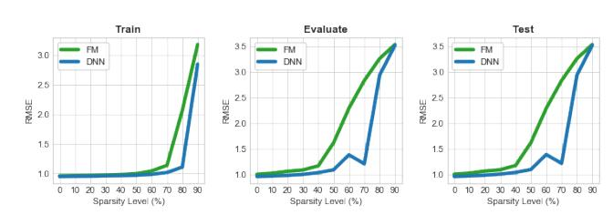
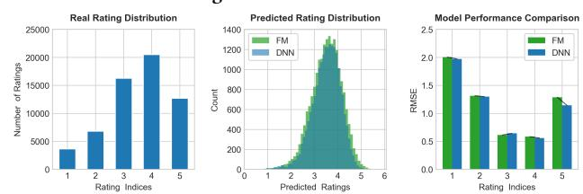
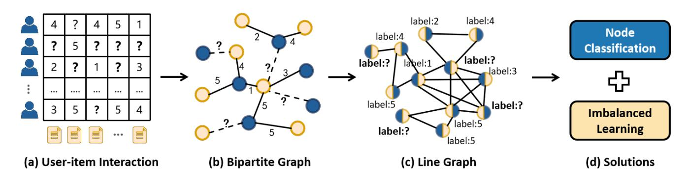
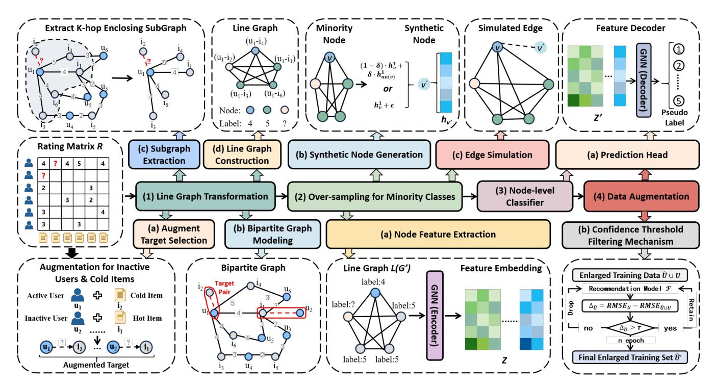
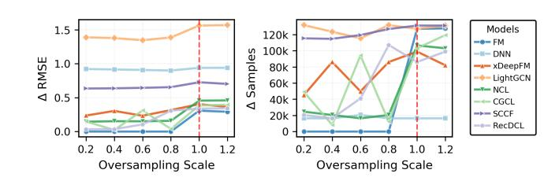
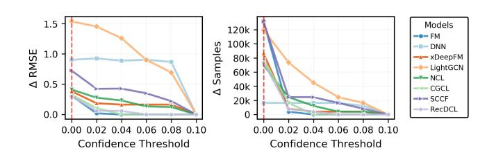
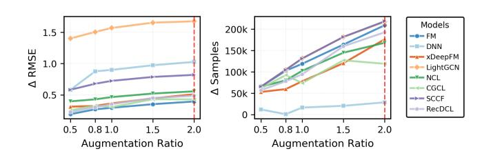
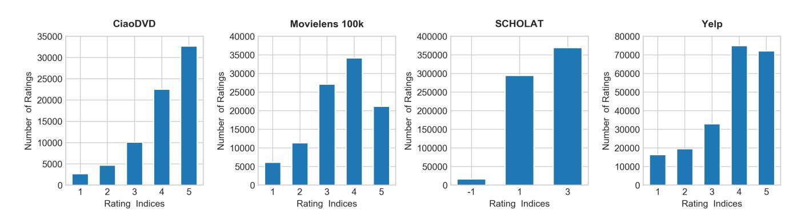

# Line Graphs Are Here! Unlock a Simple Solution for Data Sparsity and Class Imbalance in Recommender Systems

[Junming Zhou](https://orcid.org/0009-0000-1205-5154) School of Computer Science, South China Normal University, Guangzhou, Guangdong, China zhoujunming@m.scnu.edu.cn

[Hao Zhong](https://orcid.org/0000-0001-8960-5521) School of Computer Science, Guangdong Polytechnic Normal University, Guangzhou, Guangdong, China hzhong@gpnu.edu.cn

[Shupeng Li](https://orcid.org/0000-0002-0765-3632) School of Computer Science, South China Normal University, Guangzhou, Guangdong, China lisp@m.scnu.edu.cn

[Zhengyang Wu](https://orcid.org/0000-0002-3171-4618) School of Computer Science, South China Normal University, Guangzhou, Guangdong, China wuzhengyang@m.scnu.edu.cn

[Yong Tang](https://orcid.org/0000-0002-9812-0742)∗ School of Computer Science, South China Normal University, Guangzhou, Guangdong, China Institute of Data Intelligence, Guangdong University of Science and Technology, Dongguan, Guangdong, China ytang@m.scnu.edu.cn

[Ronghua Lin](https://orcid.org/0000-0002-8003-570X)∗ School of Computer Science, South China Normal University, Guangzhou, Guangdong, China rhlin@m.scnu.edu.cn

# Abstract

The persistent challenges of data sparsity and class imbalance have long limited the development of recommender systems. Fortunately, line graph theory offers a novel perspective to overcome these issues. By transforming the user-item interaction bipartite graph into a line graph, the problems of data sparsity and class imbalance are elegantly reformulated as those of insufficient labeled nodes and imbalanced label distribution in the line graph domain. This reformulation allows us to directly apply mature techniques from node classification and imbalanced graph learning to address these core challenges. Inspired by this insight, we propose a Line Graph Data Augmentation (LGDA) strategy, which features two distinct characteristics. Firstly, it is a plug-and-play module that resolves data sparsity and imbalance without modifying the underlying recommendation framework. Secondly, it employs a targeted augmentation and confidence filtering mechanism to generate highquality, balanced augmented data. Extensive experiments on four real-world datasets validate that LGDA effectively alleviates data sparsity and class imbalance, leading to significant improvements in both recommendation performance and system robustness.

# CCS Concepts

• Information systems → Recommender systems.

# Keywords

Recommender Systems; Line Graph; Data Augmentation

∗Corresponding Author.

[This work is licensed under a Creative Commons Attribution 4.0 International License.](https://creativecommons.org/licenses/by/4.0)

WWW '26, Dubai, United Arab Emirates © 2026 Copyright held by the owner/author(s). ACM ISBN 979-8-4007-2307-0/2026/04 <https://doi.org/10.1145/3774904.3792292>

### ACM Reference Format:

Junming Zhou, Hao Zhong, Shupeng Li, Zhengyang Wu, Yong Tang, and Ronghua Lin. 2026. Line Graphs Are Here! Unlock a Simple Solution for Data Sparsity and Class Imbalance in Recommender Systems. In Proceedings of the ACM Web Conference 2026 (WWW '26), April 13–17, 2026, Dubai, United Arab Emirates. ACM, New York, NY, USA, [12](#page-11-0) pages. [https://doi.org/10.1145/3774904.](https://doi.org/10.1145/3774904.3792292) [3792292](https://doi.org/10.1145/3774904.3792292)

### Resource Availability:

The source code of this paper has been made publicly available at [https:](https://doi.org/10.5281/zenodo.18346766) [//doi.org/10.5281/zenodo.18346766.](https://doi.org/10.5281/zenodo.18346766)

# 1 Introduction

Recommender systems are fundamentally constrained by two intertwined challenges: data sparsity and class imbalance. Data sparsity describes the prevalent scenario where users interact with only a small subset of items, or items receive very few user interactions [\[4\]](#page-8-0). Class imbalance arises when the distribution of user-item interactions is highly skewed across categories [\[15\]](#page-8-1). Effectively addressing both issues is critical to achieving robust and high-performing recommender systems.

The detrimental impact of data sparsity is quantitatively evident. As shown in Figure [1a,](#page-1-0) as data sparsity increases, the RMSE of both FM and DNN models shows a clear upward trend. Although DNNs outperform FM in handling data sparsity due to their complex architectures and powerful learning capabilities, both approaches collapse when sparsity reaches 90%. This phenomenon underscores that without sufficient data, models struggle to learn user preferences and make accurate recommendations. Therefore, data sparsity is a key factor that prevents recommender systems from providing high-quality recommendations. Current mainstream approaches to mitigating data sparsity can be broadly categorized into two types: data augmentation and leveraging side information. Data augmentation [\[24\]](#page-8-2) centers on generating simulated interactions derived from existing data. In contrast, leveraging side information

(a) The RMSE performance across various sparsity levels. Different levels of sparsity are attained through the random masking of portions within the training dataset.

(b) The real distribution, predicted distribution, and predicted RMSE for each rating category.

Figure 1: The empirical analysis of data sparsity and class imbalance in the MovieLens 100K dataset. FM and DNN are used as baselines. Lower RMSE means better results.

[\[6\]](#page-8-3) emphasizes integrating external data sources, such as social networks or knowledge graphs. However, both approaches have inherent limitations: data augmentation may introduce noise if improperly applied, and side information is often context-specific, which limits its broader applicability.

Class imbalance, often manifested as a long-tail distribution (Figure [1b,](#page-1-0) left), presents a distinct yet equally critical challenge. It biases models toward popular (head) items, causing over-prediction for the head and under-prediction for the tail (Figure [1b,](#page-1-0) middle). Consequently, prediction errors are substantially higher for tail ratings (Figure [1b,](#page-1-0) right). In practical applications, however, misclassifying minority but high-value samples may lead to significant economic losses for platforms. For instance, consider an e-commerce platform with 1000 products to recommend, including 50 high-profit featured items. The core goal of the recommendation system is to accurately identify and recommend these 50 items. If the model predicts all products as non-featured, it can easily achieve 95% accuracy. Yet this would clearly defeat the purpose, as the model would fail to identify these 50 critical items, leaving users unable to access them. Current solutions to the long-tail recommendation problem are primarily categorized into data-level and algorithm-level methods. Data-level methods [\[28\]](#page-8-4) balance class distribution via techniques like oversampling and undersampling. Algorithm-level methods [\[14\]](#page-8-5) enhance focus on tail classes by dynamically adjusting loss functions or incorporating prior probabilities. In addition, some research attempts to adopt hybrid methods [\[3\]](#page-8-6) to integrate the advantages of both data- and algorithm-level strategies.

The aforementioned challenges highlight the critical need to jointly address data sparsity and class imbalance in recommender systems. Thankfully, line graph theory provides a promising pathway toward this goal [\[26\]](#page-8-7). In a line graph, each edge of an original graph becomes a node, and two such nodes are connected if their corresponding edges share a common endpoint [\[1\]](#page-8-8). In the recommendation context, user-item interactions naturally form a weighted bipartite graph [\[8\]](#page-8-9). Transforming this interaction graph into its line graph yields an insightful reformulation: each interaction (edge) becomes a node, and its rating becomes the node label. Consequently, the problem of data sparsity translates into a scarcity of labeled nodes, while class imbalance manifests as a skewed label distribution in the line graph domain. This reformulation unlocks a direct and powerful solution: we can now apply well-established node classification techniques to infer labels for unlabeled nodes (addressing sparsity), and employ imbalanced graph learning methods to rebalance the label distribution (addressing imbalance). Figure [2](#page-2-0) provides an intuitive illustration of this conceptual transformation. To our knowledge, no relevant studies have yet attempted to apply this method in practice.

Building upon the above reformulation, we propose the Line Graph-based Data Augmentation (LGDA) strategy to jointly address data sparsity and class imbalance in recommender systems. The LGDA pipeline is carried out as follows. First, to control the computational cost, LGDA adopts a targeted augmentation mechanism that focuses on inactive users and unpopular items to identify augmentation candidates. The augmented interactions are then modeled as a weighted bipartite graph. Subsequently, for each target node pair to be augmented, its corresponding ��-hop enclosing subgraph is extracted from this bipartite graph and further converted into a line graph. To mitigate class imbalance in the transformed line graph, synthetic minority-class nodes and their associated edges are generated via embedding interpolation, thus rectifying the skewed label distribution. The balanced line graph is then used to train an unbiased GNN classifier, which serves as the foundation for subsequent interaction prediction. Finally, a confidence-based filtering strategy is applied to refine the generated augmented data, ensuring its high quality and balanced distribution. Notably, LGDA is designed as a plug-and-play module that can be seamlessly integrated into existing recommendation frameworks without modifying the original system configurations. Extensive experiments on four real-world datasets demonstrate that LGDA effectively alleviates data sparsity and class imbalance, leading to significant improvements in both recommendation performance and model robustness. The main contributions of this paper are:

- This paper proposes a novel approach of converting the useritem interaction bipartite graph into a line graph, to reformulate the problems of data sparsity and class imbalance as labeled node scarcity and label distribution skew at the line graph level, respectively, opening up a new technical path for the unified solution to these two core challenges in recommender systems.
- Based on the above idea, we propose the Line Graph-based Data Augmentation (LGDA) strategy, a plug-and-play module that can be directly integrated into existing recommendation architectures to address data sparsity and class imbalance without adjusting the original configuration.
- Furthermore, our proposed targeted augmentation and confidence filtering mechanism ensures the generation of high-quality,

that belongs to the same class as ℎ 1 , which is defined as

����(��) = argmin ∥ ℎ 1 �� − ℎ 1 ∥, (6)

where ����(��) refers to the nearest neighbor of �� from the same class. Note that ���� = ���� . However, subgraph partitioning can result in a limited number of node categories in the line graph, which may prevent the finding of same-class neighbors for minority-class nodes. To address this bottleneck, we generate synthetic nodes based on neighborhood availability. When a minority-class node �� has same-class neighbors, a new node is generated by linearly interpolating its features with those of its neighbors. When no sameclass neighbors are available, new samples are generated through intra-class interpolation by introducing Gaussian noise to existing minority-class samples. This process can be described as

ℎ 1 ′ = ( (1 − ��) · ℎ 1 �� + �� · ℎ 1 ����(��) if | ����(��) |&gt; 0 , ℎ 1 �� + �� otherwise, (7)

where �� ∈ [0, 1] is a mixing coefficient that governs the weighting between the original node's features and those of its neighbor, and �� ∼ �� (0, �� 2 ��) denotes the Gaussian noise vector with mean 0 and variance �� 2 ��. Additionally, we introduce a hyper-parameter �� (the over-sampling scale) to control the number of synthetic samples generated for each minority class. Through this generation process, we can make the distribution of class size more balanced. Finally, we obtain the synthetic nodes �� ′′ for the minority-class.

3.2.3 Edge Simulation. Synthetic nodes have been generated to balance the class distribution. However, these nodes remain isolated from the original graph due to the lack of connecting edges. To integrate them, we introduce an edge generator to simulate relational links. Specifically, each synthetic node is randomly connected to �� existing nodes from the original graph:

�� ′′ = ���� ∪ Ø ′ ∈�� n (�� ′ , ��) | �� ∼ Uniform(����, ��) o , (8)

where Uniform(·) denotes a function that uniformly samples �� nodes from the set ����. In this work, we set �� = 3. The newly generated nodes and edges are then incorporated into the adjacency matrix of the augmented line graph ��ˆ(�� ′ ), which now possesses a balanced label distribution, and serve as input to the subsequent GNN-based classifier.

### 3.3 Node-level Classifier

Here, the balanced line graph ˆ ��(�� ′ ) will be used to train an unbiased GNN classifier ���� . Notably, the backbone classifier ���� of our proposed strategy can be implemented using any type of GNN. Once trained, ���� can generate distribution-balanced pseudo-labels ��ˆ for unlabeled nodes. As previously mentioned, node labels in the line graph correspond directly to edges and their associated ratings in the original user-item bipartite graph. Hence, predicting pseudo-labels ���� for unlabeled line graph nodes is equivalent to inferring potential user-item rating interactions. When these potential interactions are treated as augmented data, they not only alleviate the problem of training data sparsity but also address the issue of imbalanced rating distribution.

### 3.4 Data Augmentation and Refinement

The selection of augmented data should not be made arbitrarily. During the data augmentation process, if all data is introduced without careful screening, a large amount of noise is likely to be introduced. To ensure the quality of data augmentation, we design a confidence scoring mechanism that calculates a confidence score for each batch of augmented data. Let ��ˆ be a batch of augmented data, the confidence is measured by:

Δ��ˆ = ���������� − ���������� ��ˆ , (9)

where Δ��ˆ denotes the RMSE difference between the original training set�� and the augmented training set�� ∪��ˆ. If Δ��ˆ &gt; �� ′ (typically �� ′ = 0), the batch is considered confident and added to the training set; otherwise, it is discarded.

Table 1: The basic statistics of the four datasets.

| Dataset         | CiaoDVD | MovieLens 100k | SCHOLAT | Yelp    |
|-----------------|---------|----------------|---------|---------|
| Users           | 17,616  | 943            | 32,182  | 43,874  |
| Items           | 16,122  | 1,682          | 19,645  | 11,536  |
| Ratings         | 72,665  | 100,000        | 680,267 | 21,5879 |
| Sparsity        | 99.97%  | 93.69%         | 99.89%  | 99.95%  |
| Imbalance ratio | 12.33   | 5.59           | 22.59   | 4.57    |

### 4 Experiments

In this section, we systematically evaluate the proposed LGDA strategy on four real-world datasets to verify its effectiveness in mitigating data sparsity and class imbalance.

### 4.1 Experimental Settings

4.1.1 Datasets. Four widely used recommendation datasets are adopted for experiments: CiaoDVD[1](#page-4-0) , MovieLens 100k[2](#page-4-1) , SCHOLAT[3](#page-4-2) , Yelp[4](#page-4-3) . These datasets vary in terms of field, scale, sparsity, and imbalance ratios. The basic statistics and real rating distributions of the datasets are provided in Table [1](#page-4-4) and Figure [7,](#page-10-0) respectively. See the Appendix for further dataset details.

4.1.2 Baselines. To evaluate the effectiveness of our LGDA strategy, we specifically integrate it into the following eight representative models: FM [\[18\]](#page-8-11), DNN [\[5\]](#page-8-12), xDeepFM [\[16\]](#page-8-13), LightGCN [\[11\]](#page-8-14), NCL [\[17\]](#page-8-15), CGCL [\[10\]](#page-8-16), SCCF [\[22\]](#page-8-17) and RecDCL [\[23\]](#page-8-18). See the Appendix for further baseline details.

4.1.3 Evaluation Metrics. We evaluate performance using two standard metrics: Mean Absolute Error (MAE) and Root Mean Square Error (RMSE). Lower values for both indicate better performance, and even marginal improvements can significantly enhance recommendation quality. See the Appendix for metric calculations.

### 4.2 Overall Comparison

In this section, we focus on the overall performance of various baseline algorithms with (w/) and without (w/o) LGDA augmentation across four real-world datasets. Table [2](#page-5-0) reports the optimal results

1https://guoguibing.github.io/librec/datasets/CiaoDVD.zip

2https://files.grouplens.org/datasets/movielens/MovieLens 100k/

3https://www.scholat.com/datasetApplication.html?dataset=user\_recommendation 4https://tianchi.aliyun.com/dataset/89459

Table 2: Experimental results of the baseline algorithms with (w/) or without (w/o) our LGDA enhancement on the four datasets. The best results are boldfaced, with "Δ" denoting a reduction in MAE or RMSE.

| Datasets       | Metric | MAE  | FM RSME | MAE  | DNN RSME | MAE  | xDeepFM RSME | MAE  | LightGCN RSME | MAE  | NCL RSME | MAE  | CGCL RSME | MAE  | SCCF RSME | MAE  | RecDCL RSME |
|----------------|--------|------|---------|------|----------|------|--------------|------|---------------|------|----------|------|-----------|------|-----------|------|-------------|
|                | w/o    | 3.77 | 3.93    | 3.63 | 3.79     | 0.83 | 1.08         | 4.05 | 4.19          | 3.46 | 3.67     | 2.55 | 2.83      | 3.75 | 3.91      | 2.85 | 3.11        |
| CiaoDVD        | w/     | 1.32 | 1.73    | 1.87 | 2.02     | 0.65 | 0.89         | 2.52 | 2.84          | 1.58 | 2.01     | 0.95 | 1.31      | 1.84 | 2.24      | 1.41 | 1.75        |
|                | Δ      | 2.45 | 2.20    | 1.76 | 1.77     | 0.18 | 0.19         | 1.53 | 1.35          | 1.88 | 1.66     | 1.60 | 1.52      | 1.91 | 1.67      | 1.44 | 1.36        |
| MovieLens 100k |        |      |         |      |          |      |              |      |               |      |          |      |           |      |           |      |             |
|                | w/o    | 0.78 | 0.97    | 1.77 | 2.01     | 0.92 | 1.11         | 2.26 | 2.51          | 1.16 | 1.40     | 0.90 | 1.14      | 1.19 | 1.40      | 0.87 | 1.09        |
|                | w/     | 0.41 | 0.66    | 0.55 | 0.82     | 0.53 | 0.76         | 0.63 | 0.93          | 0.69 | 0.92     | 0.47 | 0.72      | 0.45 | 0.69      | 0.53 | 0.76        |
|                | Δ      | 0.37 | 0.31    | 1.22 | 1.19     | 0.39 | 0.35         | 1.63 | 1.58          | 0.47 | 0.48     | 0.43 | 0.42      | 0.74 | 0.71      | 0.34 | 0.33        |
|                | w/o    | 0.57 | 0.85    | 0.49 | 0.73     | 0.51 | 0.73         | 1.12 | 1.40          | 0.69 | 0.97     | 0.52 | 0.78      | 0.65 | 0.86      | 0.48 | 0.74        |
| SCHOLAT        | w/     | 0.34 | 0.60    | 0.39 | 0.66     | 0.36 | 0.61         | 0.52 | 0.84          | 0.51 | 0.77     | 0.47 | 0.72      | 0.37 | 0.61      | 0.43 | 0.68        |
|                | Δ      | 0.23 | 0.25    | 0.10 | 0.07     | 0.15 | 0.12         | 0.60 | 0.56          | 0.18 | 0.20     | 0.05 | 0.06      | 0.28 | 0.25      | 0.05 | 0.06        |
|                | w/o    | 0.98 | 1.25    | 1.20 | 1.52     | 0.89 | 1.13         | 2.13 | 2.58          | 1.29 | 1.61     | 1.07 | 1.34      | 1.15 | 1.45      | 1.03 | 1.30        |
| Yelp           | w/     | 0.48 | 0.83    | 0.62 | 0.92     | 0.49 | 0.81         | 0.92 | 1.46          | 0.66 | 1.04     | 0.65 | 0.96      | 0.53 | 0.84      | 0.58 | 0.87        |
|                | Δ      | 0.50 | 0.42    | 0.58 | 0.60     | 0.40 | 0.32         | 1.21 | 1.12          | 0.63 | 0.57     | 0.42 | 0.38      | 0.62 | 0.61      | 0.45 | 0.43        |

of the comparison experiment. Overall, LGDA significantly reduces MAE and RMSE across all datasets and baseline algorithms, validating its effectiveness as a general plug-and-play augment component to alleviate data sparsity and class imbalance and improve recommendation performance. In terms of data sparsity, LGDA achieves the most significant improvement on the sparsest dataset, CiaoDVD, while the gain is relatively smaller on the densest dataset, Movie-Lens 100k. This contrast indicates that LGDA's enhancement is more pronounced when data is sparser. Regarding class imbalance, the performance gain of LGDA follows a rise-then-decline trend across datasets with varying imbalance ratios. On low-imbalance datasets such as Yelp and MovieLens 100k, improvements are primarily due to the alleviation of data sparsity. In contrast, on moderately imbalanced datasets like CiaoDVD, LGDA performs best as its targeted augmentation effectively corrects prediction bias toward long-tail classes. Even in cases of high imbalance (e.g., SCHOLAT), where diminishing returns are observed, LGDA maintains stable gains through local oversampling, demonstrating its robustness.

# 4.3 Ablation Study

In this section, three independent studies are carried out to explore the contribution of each design component in our LGDA strategy.

4.3.1 Effect of Backbone Classifier. In this section, we select three classical graph neural network models (GCN [\[13\]](#page-8-19), Graph-SAGE [\[9\]](#page-8-20), and GAT [\[20\]](#page-8-21)) as backbone classifier to investigate the influence mechanisms of different neural network architectures on the data augmentation process. We focus on analyzing the correlation between the backbone classifier's pseudo-label accuracy (ACC), RMSE reduction (ΔRMSE), and the number of final augmented samples (ΔSamples). The results are presented in Table [4.](#page-11-1) The results show that ΔRMSE exhibits a positive correlation with ACC. Employing GraphSAGE as the backbone classifier yields higher ΔRMSE values in most scenarios, indicating superior quality of its generated pseudo labels and a more pronounced enhancement in recommendation performance. Notably, even when GAT achieves high pseudo label accuracy in certain cases, its ΔRMSE is not always optimal. This demonstrates that high ACC alone is insufficient to ensure the effective augmentation, and the reliability of augmented samples also needs to be considered. However, there is no straightforward

linear relationship between ΔRMSE and ΔRMSE. In some cases, fewer augmented samples even lead to a greater ΔRMSE. For example, GCN+RecDCL achieves ΔRMSE = 1.36 with only 45,056 samples on the CiaoDVD dataset. This indicates that sample quality is more important than quantity. Nevertheless, in GraphSAGE, higher ΔRMSE are often accompanied by higher ΔRMSE. This shows that on the premise of ensuring quality, increasing the number of samples is still beneficial for improving performance. Furthermore, the enhancement effects of different backbone classifiers on baseline models show significant differences. GCN demonstrates stable overall performance, particularly on the CiaoDVD and SCHOLAT datasets, where it achieves a certain degree of improvement for baseline models such as FM and LightGCN. GraphSAGE performs optimally on most baseline models and datasets, exhibiting clear advantages especially in terms of ΔRMSE and ACC. GAT shows relatively unstable performance. This may be because its attention mechanism is sensitive to noise.

4.3.2 Effect of Over-sampling Module. To evaluate the effectiveness of the over-sampling module, this section primarily examines how its inclusion (w/) or exclusion (w/o) impacts the RMSE performance of baseline models across all rating levels. The comparative results on four datasets are shown in Table [5.](#page-11-2) For the tail categories, the LGDA equipped with an over-sampling module leads to a notable decrease in RMSE for most models. Even for extremely rare classes (e.g., rating=-1 in SCHOLAT), all models show consistent "w/" > "w/o" improvements. This validates the stability of the LGDA strategy in tail-class optimization. In the head categories, most models achieve a reduction in RMSE. Although this decrease is smaller than that observed in tail categories, it shows that, while balancing data distribution, LGDA does not affect the stability of predictions for head categories. The "all" row across all datasets shows that the LGDA equipped with an over-sampling module significantly reduces the overall RMSE of all baseline models. Notably, even in the most imbalanced SCHOLAT dataset, all models benefit significantly by LGDA over-sampling, confirming its effectiveness under extreme data distributions. Furthermore, a small increase in RMSE is observed for a few models on specific classes (e.g., the FM model for rating=4 in MovieLens 100k), presumably due to slight

Table 3: Performance comparison of baselines when enhanced with (w/) versus without (w/o) the LGDA confidence threshold mechanism, across four datasets. The best results are boldfaced. ΔRMSE = RMSE�� − RMSE�� ��ˆ denotes the reduction in RMSE. ΔSamples is the number of augmented samples.

| Datasets       | Metric  | w/o       | FM w/   | w/o       | DNN w/  | w/o       | xDeepFM w/ | w/o       | LightGCN w/ | w/o       | NCL w/  | w/o       | CGCL w/ | w/o       | SCCF w/ | w/o       | RecDCL w/ |
|----------------|---------|-----------|---------|-----------|---------|-----------|------------|-----------|-------------|-----------|---------|-----------|---------|-----------|---------|-----------|-----------|
| CiaoDVD        | Δ RMSE  | 2.20      | 2.20    | 1.01      | 1.77    | -0.51     | 0.19       | 1.35      | 1.35        | 1.13      | 1.66    | 1.24      | 1.52    | 0.78      | 1.67    | 1.52      | 1.36      |
| Δ              | Samples | 112,108   | 112,108 | 112,108   | 12,288  | 112,108   | 12,288     | 112,108   | 112,108     | 112,108   | 86,016  | 112,108   | 95,724  | 112,108   | 108,012 | 112,108   | 45,056    |
| MovieLens 100k | Δ RMSE  | 0.23      | 0.31    | 0.76      | 1.19    | -0.01     | 0.35       | 1.42      | 1.58        | 0.15      | 0.48    | 0.36      | 0.42    | 0.65      | 0.71    | -0.13     | 0.33      |
| Δ              | Samples | 131,638   | 131,072 | 131,638   | 86,016  | 131,638   | 69,632     | 131,638   | 131,638     | 131,638   | 114,688 | 131,638   | 118,784 | 131,638   | 122,880 | 131,638   | 82,486    |
| SCHOLAT        | Δ RMSE  | 0.12      | 0.25    | 0         | 0.07    | -0.12     | 0.12       | 0.47      | 0.56        | 0.12      | 0.20    | 0.02      | 0.06    | 0.18      | 0.25    | 0         | 0.06      |
| Δ              | Samples | 1,253,356 | 380,928 | 1,253,356 | 65,536  | 1,253,356 | 98,304     | 1,253,356 | 684,032     | 1,253,356 | 262,144 | 1,253,356 | 53,248  | 1,253,356 | 376,832 | 1,253,356 | 86,016    |
| Yelp           | Δ RMSE  | 0.18      | 0.42    | 0.42      | 0.60    | 0.08      | 0.32       | 1.03      | 1.12        | 0.42      | 0.57    | 0.28      | 0.38    | 0.33      | 0.61    | 0.23      | 0.43      |
| Δ              | Samples | 301,754   | 248,506 | 301,754   | 150,202 | 301,754   | 196,608    | 301,754   | 293,562     | 301,754   | 233,472 | 301,754   | 135,168 | 301,754   | 281,274 | 301,754   | 195,258   |

pseudo-label distribution bias introduced by oversampling. However, this impact does not alter the overall trend of performance improvement. Therefore, we have sufficient reason to believe that the LGDA oversampling module can effectively alleviate class imbalance by specifically supplementing tail samples and balancing data distribution.

4.3.3 Effect of Confidence Threshold Mechanism. To verify the effectiveness of the pseudo-label confidence threshold mechanism, this section investigates the impact of enabling (w/) versus disabling (w/o) the mechanism on both the RMSE reduction (ΔRMSE) and the number of final augmented samples (ΔSamples) of baseline models. The comparative results on four datasets are presented in Table [3.](#page-6-0) Obviously, there are significant differences in ΔRMSE and ΔSamples between enabling (w/) and disabling (w/o) the confidence threshold mechanism. When the mechanism is disabled, all ΔSamples are retained, with ΔRMSE remaining at a relatively low level. In contrast, when enabling the mechanism, the number of ΔSamples decreases sharply, and the ΔRMSE rises significantly. This phenomenon aligns with our expectations. Because when the mechanism is disabled, it is highly likely that a large number of low-confidence noisy samples are mixed into the augmented samples. These samples can seriously interfere with the model's prediction performance and even cause some models to exhibit negative ΔRMSE values. On the contrary, after enabling the threshold mechanism, it can filter out low-confidence pseudo-labels (i.e., noisy samples) while retaining "high-confidence, low-noise" effective samples. As a result, the phenomenon of negative ΔRMSE is eliminated. However, a few models show a slight decrease in ΔRMSE after enabling the threshold (for example, the RecDCL model in the CiaoDVD dataset, with its ΔRMSE dropping from 1.52 to 1.36). It is speculated that the reason may be an inappropriate threshold setting, which filters out some useful samples and reduces the effective information that the model can learn. But this limitation can be avoided by setting the threshold reasonably. Overall, a substantial amount of solid evidence indicates that this mechanism can effectively address the core issue of noise introduction in traditional data augmentation, providing reliable support for robust data augmentation in recommendation systems.

Figure 4: The enhancement effect of the LGDA strategy under varying over-sampling scale ��.

### 4.4 Hyper-Parameter Sensitivity Analysis

This section evaluates the sensitivity of LGDA to its core hyperparameters: the oversampling scale ��, the confidence threshold ��, and the augmentation ratio ��. All experiments are conducted in a controlled environment using the MovieLens 100k dataset with GAT as the backbone classifier. We report the RMSE reduction (ΔRMSE) alongside the number of generated samples (ΔSamples) across different parameter configurations.

4.4.1 Over-sampling Scale ��. To investigate the enhancement effect of the LGDA strategy under different over-sampling scales ��, we fixed the confidence threshold �� = 0 and the data augmentation ratio �� = 1.0, and conducted experiments with �� ∈ {0.2, 0.4, 0.6, 0.8, 1.0, 1.2}. The experiment results are shown in Figure [4.](#page-6-1) It is apparent that when �� reaches 1.0, both ΔRMSE and ΔSamples reach their peaks, demonstrating that LGDA achieves the most remarkable improvement in recommendation performance under this setting. However, when �� further increases to 1.2, both metrics decline to varying degrees. This phenomenon reveals that excessive oversampling does not yield better performance. A moderate oversampling scale (e.g., �� = 1.0) can effectively alleviate data sparsity and enhance the model's generalization ability on long-tail items. In contrast, an excessive oversampling scale (i.e., �� = 1.2) may introduce redundant information and noisy samples, leading to model overfitting or learning bias, and thus degrading recommendation accuracy.

4.4.2 Confidence Threshold ��. To evaluate how the confidence thresholds �� affects LGDA's performance, we set the over-sampling scale �� = 1.0 and the data augmentation ratio �� = 1.0, and evaluated �� across {0, 0.02, 0.04, 0.06, 0.08, 0.1}. The experiment results

Figure 5: The enhancement effect of the LGDA strategy under varying confidence thresholds ��.

Figure 6: The enhancement effect of the LGDA strategy under varying augmentation ratio ��.

are shown in Figure [5.](#page-7-0) Evidently, variations in the confidence threshold �� exert a significant influence on both ΔRMSE and ΔSamples. It is worth noting that although that a lower confidence threshold, while potentially increasing the sample usage, may not necessarily lead to a higher ΔRMSE. Conversely, moderately raising the confidence threshold, although reducing the sample usage, may stabilize the effect of model performance improvement. Therefore, when it comes to practical applications, it is crucial to choose the right confidence threshold, balancing sample usage with the need to enhance model performance.

4.4.3 Augmentation Ratio ��. To evaluate how the data augmentation ratio �� affects LGDA's performance, we set the over-sampling scale �� = 1.0 and the confidence threshold �� = 0, and evaluated �� across {0.5, 0.8, 1.0, 1.5, 2.0}. The experiment results are shown in Figure [6.](#page-7-1) The overall trend shows that as �� increases from 0.5 to 1.5, both ΔRMSE and ΔSamples rise significantly, indicating that the augmented data effectively enriches long-tail patterns without introducing substantial noise. However, when �� reaches 2.0, some models exhibit a decline in both metrics, suggesting that excessive augmentation may generate redundant or spuriously correlated samples, which impairs generalization. These results demonstrate that while raising �� alleviates data sparsity, the benefits exhibit a saturation point. Hence, in practice, the optimal �� should be selected by balancing data utility and model performance, rather than blindly pursuing a higher augmentation ratio.

# 5 Related Work

# 5.1 Line Graph-based Methods

With the advancement of graph neural networks, the structural properties of line graphs have been increasingly applied to various tasks. LGLP [\[1\]](#page-8-8) converts original graphs to line graphs to model edge-edge interactions explicitly, facilitating target link feature learning. LGCL [\[25\]](#page-8-22) reformulates link prediction as node classification through contrastive learning and proposes a subgraphto-line-graph node contrastive paradigm to reduce information redundancy. DLGNN [\[7\]](#page-8-23) directly generates edge embeddings via line graph structures to enhance information aggregation in graph convolution. LGSMOTE-IDS [\[26\]](#page-8-7) resolves class imbalance and the neglect of edge features by converting the fine-grained protocol service graph in network intrusion detection into a corresponding line graph. However, current research primarily focuses on nodelevel tasks, and integrating line graphs with GNNs to address data sparsity remains an under-explored area.

### 5.2 Class-Imbalanced Graph Learning

With the widespread application of GNNs for modeling complex graph structures, the class imbalance problem has become increasingly prominent in graph data mining. Existing approaches address this issue from diverse perspectives. Several methods, such as GraphSMOTE [\[27\]](#page-8-10) and FincGAN [\[12\]](#page-8-24), focus on data-level augmentation by generating synthetic minority-class samples—either via interpolation-based node synthesis or generative adversarial networks in heterogeneous graphs. Another line of work, including ReNode [\[2\]](#page-8-25) and IceBerg [\[15\]](#page-8-1), operates at the algorithmic level. ReNode introduces a topological imbalance metric to adjust node weights adaptively, while IceBerg employs a double-balancing mechanism to counteract the Matthew effect and label shift in selftraining. Other methods like DR-GCN [\[19\]](#page-8-26) and G2GNN [\[21\]](#page-8-27) incorporate regularization and contrastive learning strategies to enhance model generalization under imbalance. Additionally, GraphSR [\[30\]](#page-8-28) enhances minority-class diversity by selectively sampling informative unlabeled nodes.

### 6 Conclusion

Adopting a line graph perspective, this research provides novel insights into data sparsity and class imbalance in recommender systems. By converting the user-item interaction bipartite graph into a line graph, these two originally challenging problems are transformed into "insufficient labeled nodes" and "unevenly distributed labels" in the line graph, respectively. Building on this reformulation, this paper further proposes a Line Graph-based Data Augmentation (LGDA) strategy to address data sparsity and imbalance issues in a plug-and-play manner. Extensive experiments on four realworld datasets have verified the effectiveness and applicability of LGDA in mitigating data sparsity and class imbalance issues. While LGDA shows considerable promise, it also presents exciting opportunities for future development. For instance, future work could explore incorporating temporal dynamics and sequential patterns to capture evolving user preferences. Additionally, investigating scenarios with unknown or shifting data distributions represents another promising direction to enhance the model's robustness and generalizability.

# Acknowledgments

This work was supported in part by the National Key Research and Development Program of China (No. 2023YFC3341200) and the National Natural Science Foundation of China (No. 62407016 and 62377015).

- References [1] Lei Cai, Jundong Li, Jie Wang, and Shuiwang Ji. 2022. Line Graph Neural Networks for Link Prediction. IEEE Trans. Pattern Anal. Mach. Intell. 44, 9 (2022), 5103–5113. [doi:10.1109/TPAMI.2021.3080635](https://doi.org/10.1109/TPAMI.2021.3080635) [2] Deli Chen, Yankai Lin, Guangxiang Zhao, Xuancheng Ren, Peng Li, Jie Zhou, and Xu Sun. 2021. Topology-Imbalance Learning for Semi-Supervised Node Classification. In Advances in Neural Information Processing Systems 34: Annual Conference on Neural Information Processing Systems 2021, NeurIPS 2021, December 6-14, 2021, virtual, Marc'Aurelio Ranzato, Alina Beygelzimer, Yann N. Dauphin, Percy Liang, and Jennifer Wortman Vaughan (Eds.). 29885–29897. [https://proceedings.neurips.](https://proceedings.neurips.cc/paper/2021/hash/fa7cdfad1a5aaf8370ebeda47a1ff1c3-Abstract.html) [cc/paper/2021/hash/fa7cdfad1a5aaf8370ebeda47a1ff1c3-Abstract.html](https://proceedings.neurips.cc/paper/2021/hash/fa7cdfad1a5aaf8370ebeda47a1ff1c3-Abstract.html) [3] Zhi Chen, Jiang Duan, Li Kang, and Guoping Qiu. 2021. A hybrid data-level ensemble to enable learning from highly imbalanced dataset. Inf. Sci. 554 (2021), 157–176. [doi:10.1016/J.INS.2020.12.023](https://doi.org/10.1016/J.INS.2020.12.023) [4] Zefeng Chen, Wensheng Gan, Jiayang Wu, Kaixia Hu, and Hong Lin. 2025. Data Scarcity in Recommendation Systems: A Survey. Trans. Recomm. Syst. 3, 3 (2025), 27:1–27:31. [doi:10.1145/3639063](https://doi.org/10.1145/3639063) [5] Paul Covington, Jay Adams, and Emre Sargin. 2016. Deep Neural Networks for YouTube Recommendations. In Proceedings of the 10th ACM Conference on Recommender Systems, Boston, MA, USA, September 15-19, 2016, Shilad Sen, Werner Geyer, Jill Freyne, and Pablo Castells (Eds.). ACM, 191–198. [doi:10.1145/2959100.](https://doi.org/10.1145/2959100.2959190) [2959190](https://doi.org/10.1145/2959100.2959190) [6] Yuntao Du, Xinjun Zhu, Lu Chen, Ziquan Fang, and Yunjun Gao. 2023. MetaKG: Meta-Learning on Knowledge Graph for Cold-Start Recommendation. IEEE Trans. Knowl. Data Eng. 35, 10 (2023), 9850–9863. [doi:10.1109/TKDE.2022.3168775](https://doi.org/10.1109/TKDE.2022.3168775) [7] Guanghan Duan, Hongwu Lv, Huiqiang Wang, and Guangsheng Feng. 2023. Application of a Dynamic Line Graph Neural Network for Intrusion Detection With Semisupervised Learning. IEEE Trans. Inf. Forensics Secur. 18 (2023), 699–714. [doi:10.1109/TIFS.2022.3228493](https://doi.org/10.1109/TIFS.2022.3228493) [8] Jiayan Guo, Lun Du, Xu Chen, Xiaojun Ma, Qiang Fu, Shi Han, Dongmei Zhang, and Yan Zhang. 2023. On Manipulating Signals of User-Item Graph: A Jacobi Polynomial-based Graph Collaborative Filtering. In Proceedings of the 29th ACM SIGKDD Conference on Knowledge Discovery and Data Mining, KDD 2023, Long Beach, CA, USA, August 6-10, 2023, Ambuj K. Singh, Yizhou Sun, Leman Akoglu, Dimitrios Gunopulos, Xifeng Yan, Ravi Kumar, Fatma Ozcan, and Jieping Ye (Eds.). ACM, 602–613. [doi:10.1145/3580305.3599450](https://doi.org/10.1145/3580305.3599450) [9] William L. Hamilton, Zhitao Ying, and Jure Leskovec. 2017. Inductive Representation Learning on Large Graphs. In Advances in Neural Information Processing Systems 30: Annual Conference on Neural Information Processing Systems 2017, December 4-9, 2017, Long Beach, CA, USA, Isabelle Guyon, Ulrike von Luxburg, Samy Bengio, Hanna M. Wallach, Rob Fergus, S. V. N. Vishwanathan, and Roman Garnett (Eds.). 1024–1034. [https://proceedings.neurips.cc/paper/2017/hash/](https://proceedings.neurips.cc/paper/2017/hash/5dd9db5e033da9c6fb5ba83c7a7ebea9-Abstract.html) [5dd9db5e033da9c6fb5ba83c7a7ebea9-Abstract.html](https://proceedings.neurips.cc/paper/2017/hash/5dd9db5e033da9c6fb5ba83c7a7ebea9-Abstract.html) [10] Wei He, Guohao Sun, Jinhu Lu, and Xiu Susie Fang. 2023. Candidate-aware Graph Contrastive Learning for Recommendation. In Proceedings of the 46th International ACM SIGIR Conference on Research and Development in Information Retrieval, SIGIR 2023, Taipei, Taiwan, July 23-27, 2023, Hsin-Hsi Chen, Wei-Jou (Edward) Duh, Hen-Hsen Huang, Makoto P. Kato, Josiane Mothe, and Barbara Poblete (Eds.). ACM, 1670–1679. [doi:10.1145/3539618.3591647](https://doi.org/10.1145/3539618.3591647) [11] Xiangnan He, Kuan Deng, Xiang Wang, Yan Li, Yong-Dong Zhang, and Meng Wang. 2020. LightGCN: Simplifying and Powering Graph Convolution Network for Recommendation. In Proceedings of the 43rd International ACM SIGIR conference on research and development in Information Retrieval, SIGIR 2020, Virtual Event, China, July 25-30, 2020, Jimmy X. Huang, Yi Chang, Xueqi Cheng, Jaap Kamps, Vanessa Murdock, Ji-Rong Wen, and Yiqun Liu (Eds.). ACM, 639–648. [doi:10.1145/3397271.3401063](https://doi.org/10.1145/3397271.3401063) [12] Hung Chun Hsu, Ting-Le Lin, Bo-Jun Wu, Ming-Yi Hong, Che Lin, and Chih-Yu Wang. 2024. FincGAN: A Gan Framework of Imbalanced Node Classification on Heterogeneous Graph Neural Network. In IEEE International Conference on Acoustics, Speech and Signal Processing, ICASSP 2024, Seoul, Republic of Korea, April 14-19, 2024. IEEE, 5750–5754. [doi:10.1109/ICASSP48485.2024.10448064](https://doi.org/10.1109/ICASSP48485.2024.10448064) [13] Thomas N. Kipf and Max Welling. 2017. Semi-Supervised Classification with Graph Convolutional Networks. In 5th International Conference on Learning Representations, ICLR 2017, Toulon, France, April 24-26, 2017, Conference Track Proceedings. OpenReview.net.<https://openreview.net/forum?id=SJU4ayYgl> [14] Lan Li, Bowen Tao, Lu Han, De-Chuan Zhan, and Han-Jia Ye. 2024. Twice Class Bias Correction for Imbalanced Semi-supervised Learning. In Thirty-Eighth AAAI Conference on Artificial Intelligence, AAAI 2024, Thirty-Sixth Conference on Innovative Applications of Artificial Intelligence, IAAI 2024, Fourteenth Symposium on Educational Advances in Artificial Intelligence, EAAI 2014, February 20-27, 2024, Vancouver, Canada, Michael J. Wooldridge, Jennifer G. Dy, and Sriraam Natarajan (Eds.). AAAI Press, 13563–13571. [doi:10.1609/AAAI.V38I12.29260](https://doi.org/10.1609/AAAI.V38I12.29260) [15] Zhixun Li, Dingshuo Chen, Tong Zhao, Daixin Wang, Hongrui Liu, Zhiqiang Zhang, Jun Zhou, and Jeffrey Xu Yu. 2025. IceBerg: Debiased Self-Training for Class-Imbalanced Node Classification. In Proceedings of the ACM on Web Conference 2025, WWW 2025, Sydney, NSW, Australia, 28 April 2025- 2 May 2025, Guodong Long, Michale Blumestein, Yi Chang, Liane Lewin-Eytan, Zi Helen Huang, and Elad Yom-Tov (Eds.). ACM, 3160–3170. [doi:10.1145/3696410.3714963](https://doi.org/10.1145/3696410.3714963) [16] Jianxun Lian, Xiaohuan Zhou, Fuzheng Zhang, Zhongxia Chen, Xing Xie, and Guangzhong Sun. 2018. xDeepFM: Combining Explicit and Implicit Feature Interactions for Recommender Systems. In Proceedings of the 24th ACM SIGKDD International Conference on Knowledge Discovery & Data Mining, KDD 2018, London, UK, August 19-23, 2018, Yike Guo and Faisal Farooq (Eds.). ACM, 1754–1763. [doi:10.1145/3219819.3220023](https://doi.org/10.1145/3219819.3220023) [17] Zihan Lin, Changxin Tian, Yupeng Hou, and Wayne Xin Zhao. 2022. Improving Graph Collaborative Filtering with Neighborhood-enriched Contrastive Learning. In WWW '22: The ACM Web Conference 2022, Virtual Event, Lyon, France, April 25
  - 29, 2022, Frédérique Laforest, Raphaël Troncy, Elena Simperl, Deepak Agarwal, Aristides Gionis, Ivan Herman, and Lionel Médini (Eds.). ACM, 2320–2329. [doi:10.](https://doi.org/10.1145/3485447.3512104) [1145/3485447.3512104](https://doi.org/10.1145/3485447.3512104) [18] Steffen Rendle. 2010. Factorization Machines. In ICDM 2010, The 10th IEEE International Conference on Data Mining, Sydney, Australia, 14-17 December 2010, Geoffrey I. Webb, Bing Liu, Chengqi Zhang, Dimitrios Gunopulos, and Xindong Wu (Eds.). IEEE Computer Society, 995–1000. [doi:10.1109/ICDM.2010.127](https://doi.org/10.1109/ICDM.2010.127) [19] Min Shi, Yufei Tang, Xingquan Zhu, David A. Wilson, and Jianxun Liu. 2020. Multi-Class Imbalanced Graph Convolutional Network Learning. In Proceedings of the Twenty-Ninth International Joint Conference on Artificial Intelligence, IJCAI 2020, Christian Bessiere (Ed.). ijcai.org, 2879–2885. [doi:10.24963/IJCAI.2020/398](https://doi.org/10.24963/IJCAI.2020/398) [20] Petar Velickovic, Guillem Cucurull, Arantxa Casanova, Adriana Romero, Pietro Liò, and Yoshua Bengio. 2018. Graph Attention Networks. In 6th International Conference on Learning Representations, ICLR 2018, Vancouver, BC, Canada, April 30
  - May 3, 2018, Conference Track Proceedings. OpenReview.net. [https://openreview.](https://openreview.net/forum?id=rJXMpikCZ) [net/forum?id=rJXMpikCZ](https://openreview.net/forum?id=rJXMpikCZ) [21] Yu Wang, Yuying Zhao, Neil Shah, and Tyler Derr. 2022. Imbalanced Graph Classification via Graph-of-Graph Neural Networks. In Proceedings of the 31st ACM International Conference on Information & Knowledge Management, Atlanta, GA, USA, October 17-21, 2022, Mohammad Al Hasan and Li Xiong (Eds.). ACM, 2067–2076. [doi:10.1145/3511808.3557356](https://doi.org/10.1145/3511808.3557356) [22] Yihong Wu, Le Zhang, Fengran Mo, Tianyu Zhu, Weizhi Ma, and Jian-Yun Nie. 2024. Unifying Graph Convolution and Contrastive Learning in Collaborative Filtering. In Proceedings of the 30th ACM SIGKDD Conference on Knowledge Discovery and Data Mining, KDD 2024, Barcelona, Spain, August 25-29, 2024, Ricardo Baeza-Yates and Francesco Bonchi (Eds.). ACM, 3425–3436. [doi:10.1145/3637528.3671840](https://doi.org/10.1145/3637528.3671840) [23] Dan Zhang, Yangliao Geng, Wenwen Gong, Zhongang Qi, Zhiyu Chen, Xing Tang, Ying Shan, Yuxiao Dong, and Jie Tang. 2024. RecDCL: Dual Contrastive Learning for Recommendation. In Proceedings of the ACM on Web Conference 2024, WWW 2024, Singapore, May 13-17, 2024, Tat-Seng Chua, Chong-Wah Ngo, Ravi Kumar, Hady W. Lauw, and Roy Ka-Wei Lee (Eds.). ACM, 3655–3666. [doi:10.](https://doi.org/10.1145/3589334.3645533) [1145/3589334.3645533](https://doi.org/10.1145/3589334.3645533) [24] Yi Zhang and Yiwen Zhang. 2025. MixRec: Individual and Collective Mixing Empowers Data Augmentation for Recommender Systems. In Proceedings of the ACM on Web Conference 2025, WWW 2025, Sydney, NSW, Australia, 28 April 2025- 2 May 2025, Guodong Long, Michale Blumestein, Yi Chang, Liane Lewin-Eytan, Zi Helen Huang, and Elad Yom-Tov (Eds.). ACM, 2198–2208. [doi:10.1145/3696410.](https://doi.org/10.1145/3696410.3714565) [3714565](https://doi.org/10.1145/3696410.3714565) [25] Zehua Zhang, Shilin Sun, Guixiang Ma, and Caiming Zhong. 2023. Line graph contrastive learning for link prediction. Pattern Recognit. 140 (2023), 109537. [doi:10.1016/J.PATCOG.2023.109537](https://doi.org/10.1016/J.PATCOG.2023.109537) [26] Guyu Zhao, Linwei Li, Hongdou He, and Jiadong Ren. 2025. LGSMOTE-IDS: Line Graph based Weighted-Distance SMOTE for imbalanced network traffic detection. Expert Syst. Appl. 281 (2025), 127645. [doi:10.1016/J.ESWA.2025.127645](https://doi.org/10.1016/J.ESWA.2025.127645) [27] Tianxiang Zhao, Xiang Zhang, and Suhang Wang. 2021. GraphSMOTE: Imbalanced Node Classification on Graphs with Graph Neural Networks. In WSDM '21, The Fourteenth ACM International Conference on Web Search and Data Mining, Virtual Event, Israel, March 8-12, 2021, Liane Lewin-Eytan, David Carmel, Elad Yom-Tov, Eugene Agichtein, and Evgeniy Gabrilovich (Eds.). ACM, 833–841. [doi:10.1145/3437963.3441720](https://doi.org/10.1145/3437963.3441720) [28] Tianxiang Zhao, Xiang Zhang, and Suhang Wang. 2024. Imbalanced Node Classification With Synthetic Over-Sampling. IEEE Trans. Knowl. Data Eng. 36, 12 (2024), 8515–8528. [doi:10.1109/TKDE.2024.3443160](https://doi.org/10.1109/TKDE.2024.3443160) [29] Wayne Xin Zhao, Yupeng Hou, Xingyu Pan, Chen Yang, Zeyu Zhang, Zihan Lin, Jingsen Zhang, Shuqing Bian, Jiakai Tang, Wenqi Sun, Yushuo Chen, Lanling Xu, Gaowei Zhang, Zhen Tian, Changxin Tian, Shanlei Mu, Xinyan Fan, Xu Chen, and Ji-Rong Wen. 2022. RecBole 2.0: Towards a More Up-to-Date Recommendation Library. In Proceedings of the 31st ACM International Conference on Information & Knowledge Management, Atlanta, GA, USA, October 17-21, 2022, Mohammad Al Hasan and Li Xiong (Eds.). ACM, 4722–4726. [doi:10.1145/3511808.3557680](https://doi.org/10.1145/3511808.3557680) [30] Mengting Zhou and Zhiguo Gong. 2023. GraphSR: A Data Augmentation Algorithm for Imbalanced Node Classification. In Thirty-Seventh AAAI Conference on Artificial Intelligence, AAAI 2023, Thirty-Fifth Conference on Innovative Applications of Artificial Intelligence, IAAI 2023, Thirteenth Symposium on Educational Advances in Artificial Intelligence, EAAI 2023, Washington, DC, USA, February 7-14, 2023, Brian Williams, Yiling Chen, and Jennifer Neville (Eds.). AAAI Press, 4954–4962. [doi:10.1609/AAAI.V37I4.25622](https://doi.org/10.1609/AAAI.V37I4.25622)

Figure 7: Real rating distribution across four datasets.

makes it an ideal benchmark for studying sparsity and imbalance in academic recommendation.

- Yelp. Sourced from the Yelp Open Dataset, it includes 215,879 ratings (1-5 stars) and reviews from 43,874 users on 11,536 businesses. It encompasses rich user profiles, business attributes, and geographical information, realistically simulating the challenges of data sparsity and skewed rating distributions in commercial local-service recommendation.

These datasets exhibit considerable diversity in domain, scale, sparsity, and class-imbalance ratio.

### A.4 Baseline Introduction

To evaluate the effectiveness of our LGDA strategy, we specifically integrate it into the following eight representative models:

- FM [\[18\]](#page-8-11): A classic recommendation algorithm that efficiently captures second-order feature interactions via latent vector dot products, resolving linear models' non-linear combination limitations.
- DNN [\[5\]](#page-8-12): The model automatically mines complex nonlinear feature interactions in high-dimensional sparse data via a multilayer network architecture, breaking the limitation of traditional shallow models in expressing feature relationships.
- xDeepFM [\[16\]](#page-8-13): This method employs an innovative Compressed Interaction Network (CIN) architecture to explicitly model highorder feature interactions, overcoming the limitation of traditional FM models which are only capable of capturing secondorder interactions.
- LightGCN [\[11\]](#page-8-14): A classical GCN-based recommendation model that simplifies the original GCN design for CF tasks. It achieves iterative embedding propagation through user-item interaction graphs to precisely capture latent preference associations.
- NCL [\[17\]](#page-8-15): A novel paradigm of neighbor-enriched contrastive learning. It provides additional supervisory signals for recommendation tasks by constructing structural neighbors and semantic neighbors.
- CGCL [\[10\]](#page-8-16): This method represents a novel candidate-aware graph contrastive learning paradigm for recommendation, utilizing intermediate embeddings from different GCN layers as contrastive views and overcoming the limitation of information loss caused by traditional GCL's random data augmentation.

- SCCF [\[22\]](#page-8-17): This method employs a simple embedding model paired with an improved second-order cosine similarity contrastive loss, avoiding complex graph convolutional structures and offering a more concise and efficient paradigm for recommendation algorithm design.
- RecDCL [\[23\]](#page-8-18): An innovative dual contrastive learning recommendation framework integrates batch contrastive learning (BCL) and feature contrastive learning (FCL), overcoming the single-dimensional constraints of batch contrast in traditional self-supervised recommendation.

### A.5 Evaluation Metrics

We use Root Mean Square Error (RMSE) and Mean Absolute Error (MAE) to measure the accuracy of rating prediction, which are defined as

�������� = √︄Í (��,��∈ T ) (������ − ��ˆ����) 2 |T | , (12)

������ = Í (��,��∈ T ) |������ − ��ˆ���� | |T | , (13)

where T denotes the testing set. ������ and ��ˆ���� are the true and predicted ratings, respectively. The lower the RMSE and MAE values are, the better the prediction performance will be. Even a minor reduction in the RMSE and MAE values can have a considerable effect on the quality of the recommendations.

### A.6 Implementation Details

We implement LGDA in Pytorch. The default optimizer is Adam with the learning rate of 1�� − 3, and initialization is done via the Xavier method. For each preprocessed dataset, the ratio of training, validation, and test set is 6 : 2 : 2. For the baselines, all methods are implemented using Recbole [\[29\]](#page-8-29), with their hyperparameters following original paper settings or tuned via grid search. For our LGDA strategy, we set the enclosing subgraph hop �� to 2, with the over-sampling scale �� adjusted within the range {0.2, 0.4, 0.6, 0.8, 1.0, 1.2}, the confidence threshold �� varied within the range {0, 0.02, 0.04, 0.06, 0.08, 0.1}, and the data augmentation ratio �� optimized within the range {0.5, 0.8, 1.0, 1.5, 2.0}. All experiments are conducted on a NVIDIA Tesla v100 GPU.

Table 4: Performance comparison of baselines with LGDA enhancement by using different backbone classifier. The best results are boldfaced. ΔRMSE = RMSE�� − RMSE�� ��ˆ denotes the reduction in RMSE. ΔSamples is the number of augmented samples.

| Backbone Baseline  | CiaoDVD ACC Δ RMSE | Δ Samples | MovieLens ACC Δ RMSE | 100k Δ Samples | SCHOLAT ACC Δ RMSE | Δ Samples | YELP ACC Δ RMSE | Δ Samples |
|--------------------|--------------------|-----------|----------------------|----------------|--------------------|-----------|-----------------|-----------|
|                    | 1.94               | 108,012   |                      |                |                    |           |                 |           |
|                    |                    |           | 0                    | 0              |                    |           |                 |           |
|                    |                    |           |                      |                | 0.21               | 290,816   |                 |           |
| FM                 |                    |           |                      |                |                    |           | 0.37            | 229,376   |
| DNN                | 1.61               | 12,288    | 0.88                 | 16,384         | 0.06               | 45,056    | 0.59            | 162,490   |
| xDeepFM            | 0.02               | 4,096     | 0.12                 | 8,192          | 0.12               | 98,304    | 0.18            | 102,400   |
| LightGCN GCN       | 1.28               | 112,108   | 1.23                 | 82,486         | 0.55               | 647,168   | 1.08            | 274,432   |
| NCL                | 1.51               | 86,016    | 0.16                 | 20,480         | 0.17               | 208,896   | 0.57            | 233,472   |
| CGCL               | 1.21               | 81,920    | 0.01                 | 4,096          | 0.04               | 24,576    | 0.16            | 53,248    |
| SCCF               | 1.53               | 108,012   | 0.44                 | 106,496        | 0.18               | 221,184   | 0.53            | 240,314   |
| RecDCL             | 1.36               | 45,056    | 0.02                 | 4,096          | 0.06               | 86,016    | 0.39            | 188,416   |
|                    | 2.2                | 112,108   |                      |                |                    |           |                 |           |
|                    |                    |           | 0                    | 0              |                    |           |                 |           |
|                    |                    |           |                      |                | 0.23               | 352,256   |                 |           |
| FM                 |                    |           |                      |                |                    |           | 0.40            | 217,088   |
| DNN                | 1.77               | 12,288    | 1.19                 | 86,016         | 0.07               | 65,536    | 0.60            | 150,202   |
| xDeepFM            | 0.19               | 12,288    | 0.26                 | 66,102         | 0.10               | 53,248    | 0.32            | 196,608   |
| LightGCN GraphSage | 1.35               | 112,108   | 1.39                 | 131,072        | 0.52               | 569,344   | 1.12            | 293,562   |
| NCL                | 1.66               | 86,016    | 0.17                 | 20,480         | 0.20               | 262,144   | 0.51            | 196,608   |
| CGCL               | 1.52               | 95,724    | 0.15                 | 53,814         | 0.06               | 49,152    | 0.38            | 135,168   |
| SCCF               | 1.67               | 108,012   | 0.65                 | 131,638        | 0.25               | 376,832   | 0.60            | 270,336   |
| RecDCL             | 1.23               | 45,056    | 0.04                 | 12,288         | 0.05               | 53,248    | 0.40            | 170,682   |
|                    | 0.53               | 67,052    |                      |                |                    |           |                 |           |
|                    |                    |           | 0.31                 | 131,072        |                    |           |                 |           |
|                    |                    |           |                      |                | 0.25               | 380,928   |                 |           |
| FM                 |                    |           |                      |                |                    |           | 0.42            | 248,506   |
| DNN                | 2.71               | 12,288    | 0.91                 | 16,384         | 0.06               | 40,960    | 0.56            | 131,072   |
| xDeepFM            | 0.17               | 12,288    | 0.35                 | 69,632         | 0.11               | 77,824    | 0.28            | 166,586   |
| LightGCN GAT       | 0                  | 24,576    | 1.58                 | 131,638        | 0.56               | 684,032   | 1.11            | 285,370   |
| NCL                | 0.16               | 24,576    | 0.48                 | 114,688        | 0.17               | 212,992   | 0.56            | 221,184   |
| CGCL               | 0.71               | 40,960    | 0.42                 | 118,784        | 0.06               | 53,248    | 0.34            | 117,434   |
| SCCF               | 0.27               | 58,860    | 0.71                 | 122,880        | 0.23               | 331,776   | 0.61            | 281,274   |
| RecDCL             | 1.13               | 45,056    | 0.33                 | 82,486         | 0.04               | 45,056    | 0.43            | 195,258   |

Table 5: The comparison of RMSE metric for baselines when enhanced with (w/) versus without (w/o) the LGDA over-sampling module, across four datasets. The best results are boldfaced. 'tail' and 'head' denote the tail class and head class respectively.

| Datasets       | Predicted Rating | FM w/o | w/   | DNN w/o | w/   | w/o  | xDeepFM w/ | LightGCN w/o | w/   | w/o  | NCL w/ | CGCL w/o | w/   | w/o  | SCCF w/ | RecDCL w/o | w/   |
|----------------|------------------|--------|------|---------|------|------|------------|--------------|------|------|--------|----------|------|------|---------|------------|------|
|                | 1 (tail)         | 0.70   | 0.43 | 0.54    | 0.23 | 3.09 | 2.66       | 0.98         | 0.92 | 0.61 | 0.52   | 1.58     | 1.19 | 0.70 | 0.26    | 1.03       | 1.70 |
|                | 2                | 1.69   | 0.72 | 1.54    | 0.77 | 2.10 | 1.67       | 1.98         | 1.90 | 1.37 | 1.07   | 1.22     | 0.57 | 1.68 | 1.20    | 1.02       | 0.93 |
| CiaoDVD        | 3                | 2.69   | 1.30 | 2.53    | 1.76 | 1.10 | 0.68       | 2.98         | 2.76 | 2.28 | 1.61   | 1.55     | 1.03 | 2.67 | 1.97    | 1.68       | 1.78 |
|                | 4                | 3.70   | 2.33 | 3.52    | 2.75 | 0.10 | 0.28       | 3.98         | 3.77 | 3.41 | 2.60   | 2.49     | 1.51 | 3.68 | 2.98    | 2.79       | 1.55 |
|                | 5 (head)         | 4.72   | 3.37 | 4.52    | 3.74 | 0.90 | 1.23       | 4.99         | 4.79 | 4.48 | 3.67   | 3.54     | 2.28 | 4.70 | 3.99    | 3.89       | 2.12 |
|                | all              | 3.93   | 1.74 | 3.75    | 2.8  | 1.08 | 1.02       | 4.19         | 2.85 | 3.67 | 2.11   | 2.84     | 1.31 | 3.91 | 2.21    | 3.11       | 1.60 |
| MovieLens 100k |                  |        |      |         |      |      |            |              |      |      |        |          |      |      |         |            |      |
|                | 1 (tail)         | 1.81   | 0.48 | 1.12    | 0.53 | 2.60 | 0.66       | 0.61         | 0.78 | 2.05 | 1.94   | 2.28     | 1.88 | 1.44 | 0.49    | 2.18       | 1.46 |
|                | 2                | 1.14   | 1.21 | 1.03    | 1.18 | 1.62 | 1.17       | 0.90         | 0.83 | 1.04 | 0.59   | 1.50     | 0.43 | 0.61 | 1.23    | 1.42       | 1.19 |
|                | 3                | 0.57   | 0.87 | 1.57    | 0.85 | 0.63 | 0.79       | 1.78         | 0.82 | 0.58 | 0.38   | 0.77     | 0.6  | 0.45 | 0.87    | 0.70       | 0.58 |
|                | 4 (head)         | 0.66   | 0.82 | 2.13    | 0.85 | 0.36 | 0.80       | 2.71         | 1.43 | 1.23 | 1.01   | 0.70     | 0.75 | 1.35 | 0.82    | 0.65       | 0.73 |
|                | 5                | 1.29   | 1.30 | 2.76    | 1.40 | 1.34 | 1.31       | 3.65         | 2.27 | 2.12 | 1.91   | 1.39     | 1.45 | 2.31 | 1.37    | 1.35       | 1.46 |
|                | all              | 0.96   | 0.75 | 2.00    | 0.83 | 1.11 | 0.85       | 2.51         | 1.11 | 1.39 | 0.92   | 1.14     | 0.73 | 1.40 | 0.76    | 1.08       | 1.06 |
|                | -1 (tail)        | 2.07   | 2.05 | 2.10    | 2.05 | 2.53 | 2.18       | 1.85         | 2.01 | 2.14 | 2.10   | 2.24     | 2.20 | 2.06 | 2.04    | 2.24       | 2.16 |
| SCHOLAT        | 1                | 0.51   | 0.35 | 0.51    | 0.47 | 0.59 | 0.48       | 0.63         | 0.44 | 0.70 | 0.50   | 0.64     | 0.61 | 0.59 | 0.47    | 0.61       | 0.55 |
|                | 3 (head)         | 0.98   | 0.83 | 0.74    | 0.74 | 0.67 | 0.61       | 1.79         | 1.41 | 1.07 | 0.99   | 0.77     | 0.75 | 0.96 | 0.82    | 0.72       | 0.71 |
|                | all              | 0.86   | 0.61 | 0.72    | 0.68 | 0.74 | 0.62       | 1.40         | 0.84 | 0.97 | 0.77   | 0.78     | 0.75 | 0.86 | 0.68    | 0.74       | 0.71 |
|                | 1 (tail)         | 2.09   | 0.56 | 1.70    | 0.75 | 2.42 | 0.67       | 1.46         | 0.56 | 1.87 | 0.56   | 2.05     | 0.76 | 1.87 | 0.64    | 1.87       | 0.64 |
|                | 2                | 1.48   | 1.50 | 1.10    | 1.59 | 1.60 | 1.58       | 1.66         | 1.44 | 1.56 | 1.50   | 1.55     | 1.54 | 1.50 | 1.47    | 1.50       | 1.47 |
| Yelp           | 3                | 0.83   | 0.84 | 0.96    | 0.89 | 0.85 | 0.83       | 1.81         | 1.48 | 1.14 | 1.00   | 0.97     | 0.87 | 0.96 | 0.87    | 0.96       | 0.87 |
|                | 4 (head)         | 0.76   | 0.75 | 1.32    | 0.68 | 0.63 | 0.63       | 2.30         | 1.90 | 1.17 | 1.01   | 0.89     | 0.71 | 0.93 | 0.90    | 0.93       | 0.90 |
|                | 5                | 1.46   | 1.34 | 1.93    | 1.23 | 1.14 | 1.14       | 3.44         | 2.94 | 2.10 | 1.92   | 1.66     | 1.41 | 1.87 | 1.49    | 1.87       | 1.49 |
|                | all              | 1.24   | 0.83 | 1.52    | 0.92 | 1.16 | 0.83       | 2.58         | 1.46 | 1.62 | 1.06   | 1.36     | 0.98 | 1.44 | 0.82    | 1.44       | 0.82 |