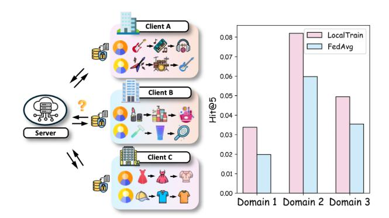
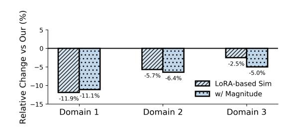
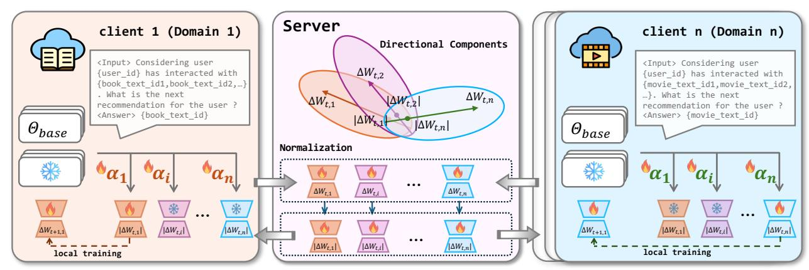
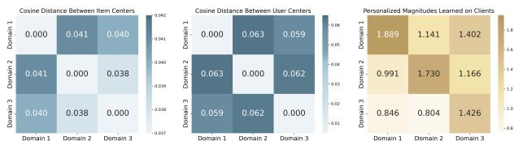
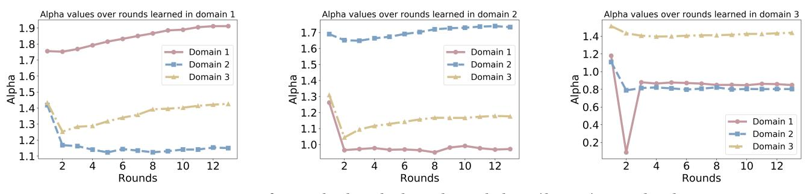
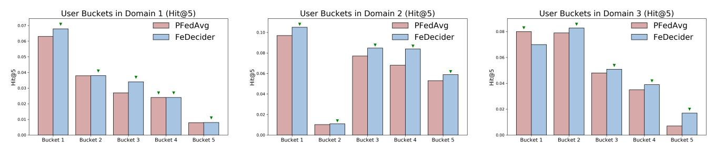
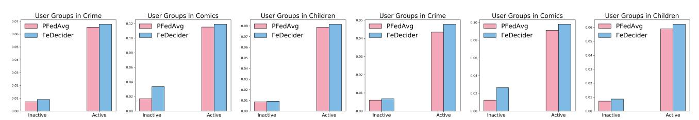

# FeDecider: An LLM-Based Framework for Federated Cross-Domain Recommendation

Xinrui He University of Illinois Urbana-Champaign Champaign, IL, USA xhe33@illinois.edu

Ting-Wei Li University of Illinois Urbana-Champaign Champaign, IL, USA twli@illinois.edu

Tianxin Wei University of Illinois Urbana-Champaign Champaign, IL, USA twei10@illinois.edu

Xuying Ning University of Illinois Urbana-Champaign Champaign, IL, USA xuying2@illinois.edu

Xinyu He University of Illinois Urbana-Champaign Champaign, IL, USA xhe34@illinois.edu

Wenxuan Bao University of Illinois Urbana-Champaign Champaign, IL, USA wbao4@illinois.edu

Hanghang Tong University of Illinois Urbana-Champaign Champaign, IL, USA htong@illinois.edu

Jingrui He University of Illinois Urbana-Champaign Champaign, IL, USA jingrui@illinois.edu

# Abstract

Federated cross-domain recommendation (Federated CDR) aims to collaboratively learn personalized recommendation models across heterogeneous domains while preserving data privacy. Recently, large language model (LLM)-based recommendation models have demonstrated impressive performance by leveraging LLMs' strong reasoning capabilities and broad knowledge. However, adopting LLM-based recommendation models in Federated CDR scenarios introduces new challenges. First, there exists a risk of overfitting with domain-specific local adapters. The magnitudes of locally optimized parameter updates often vary across domains, causing biased aggregation and overfitting toward domain-specific distributions. Second, unlike traditional recommendation models (e.g., collaborative filtering, bipartite graph-based methods) that learn explicit and comparable user/item representations, LLMs encode knowledge implicitly through autoregressive text generation training. This poses additional challenges for effectively measuring the cross-domain similarities under heterogeneity. To address these challenges, we propose an LLM-based framework for federated cross-domain recommendation, FeDecider. Specifically, FeDecider tackles the challenge of scale-specific noise by disentangling each client's low-rank updates and sharing only their directional components. To handle the need for flexible and effective integration, each client further learns personalized weights that achieve the data-aware integration of updates from other domains. Extensive experiments across diverse datasets validate the effectiveness of our proposed FeDecider. The implementation is available at [https://github.com/Xinrui17/FeDecider.](https://github.com/Xinrui17/FeDecider)

# CCS Concepts

• Information systems → Recommender systems.

# Keywords

Cross-Domain Recommendation, LLM-based Recommendation, Federated Recommendation, Privacy-Preserving

# 1 Introduction

In real-world recommendation scenarios [\[16,](#page-8-0) [34\]](#page-8-1), privacy regulations on customer data, including full shopping history and personal information and institutional boundaries [\[18\]](#page-8-2) often hinder centralized data collection across platforms, leaving valuable cross-domain information fragmented. Federated cross-domain recommendation, which integrates federated learning [\[15,](#page-8-3) [29\]](#page-8-4) into CDR, provides a promising alternative by training models collaboratively across decentralized clients without exposing raw user data. Many recent studies have explored this direction in the context of traditional recommendation models [\[5,](#page-8-5) [6\]](#page-8-6). For example, FedCT [\[26\]](#page-8-7) adopts a variational inference framework to maximize mutual information across domains; FedGCDR [\[49\]](#page-9-0) enhances privacy and reduces negative transfer through feature mapping and graph neural networks. However, these approaches primarily focus on rigid id-based user or item representation mapping under federated constraints and are typically built on simple collaborative filtering architectures [\[14,](#page-8-8) [32,](#page-8-9) [33,](#page-8-10) [42,](#page-8-11) [47\]](#page-9-1), which struggle to leverage rich textual information and generalize to new users or items.

Recently, LLM for recommendation has achieved great success by leveraging its strong reasoning ability in understanding user intent and its broad knowledge for supporting more contextually personalized outputs [\[21,](#page-8-12) [24,](#page-8-13) [31,](#page-8-14) [41\]](#page-8-15). As illustrated in Figure [1](#page-1-0) (left), different clients represent distinct domains (e.g., Instruments, Beauty, Clothing), where sequential dependencies among items may exhibit similar contextual patterns. For example, the transition from core products to related accessories in one domain can benefit models in another by providing analogous contextual cues. However, as shown in Figure [1](#page-1-0) (right), directly adopting LLM-based recommendation models in federated cross-domain scenario via

Figure 1: Left: Illustration of the federated cross-domain recommendation. Right: Comparison of performance (Hit@5) between local training and FedAvg aggregation across 3 domains in Goodreads.

a standard federated learning method (e.g., FedAvg [\[29\]](#page-8-4)) which averages the uploaded parameters of all clients results in significant performance degradation in all domains compared to local training in the GoodReads dataset [\[38\]](#page-8-16).

This highlights two challenges of transferring and integrating useful knowledge in LLM-based federated recommendation under domain heterogeneity: (1) Risk of overfitting with domainspecific local adapters. Federated LLM-based recommender typically exchanges only partial model parameters, such as LoRA adapters, instead of full-model updates. While efficient, the magnitude (scale) of these locally optimized parameter updates vary significantly across domains, causing biased aggregation and overfitting to local data distributions. (2) Difficulty in cross-domain similarity measurement. Backbone LLMs model contextual dependencies rather than explicit user-item relations through autoregressive text generation training, unlike traditional recommenders that learn explicit user/item embeddings, comparable representations. This implicit representation hinders direct comparison and aggregation across domains, thereby necessitating data-aware integration to enable effective cross-domain coordination. Figure [2](#page-1-1) empirically shows these two challenges, where both aggregation strategies suffer consistent performance degradation across domains due to scale-specific noise and ineffective similarity measurement.

To address these challenges, we propose FeDecider, an LLMbased framework for federated cross-domain recommendation. As shown in Figure [3,](#page-2-0) each client (domain) first represents its update as a Low-Rank Adaptation (LoRA) module [\[17\]](#page-8-17) and uploads it to the server. Then, to address the first challenge, the FeDecider server extracts only the directional components of the LoRA updates, which are later broadcast to all clients. This design removes scale-wide noise while preserving the domain-specific pattern. After each client receives the lightweight LoRA modules from other clients, FeDecider clients perform data-aware integration. Specifically, clients learn a set of personalized weights to combine the received directional components with its own. This mechanism addresses the second challenge by allowing clients to selectively incorporate external knowledge and automatically adapting to their local data distributions. By enabling client-specific integration, FeDecider supports flexible knowledge fusion even when semantic representations vary across domains. The final personalized model is constructed as a weighted

Figure 2: Performance degradation (NDCG@5) of two baseline aggregation strategies across domains in GoodReads dataset, illustrating the challenges of scale-specific noise and ineffective cross-domain similarity measurement with LoRA. The aggregation weights of the baseline LoRA-based Sim are computed using the layer-wise cosine similarity of the LoRA module.

combination of all directional components, enabling effective and flexible knowledge sharing under domain heterogeneity.

The major contributions of this paper are summarized as follows:

- We introduce FeDecider, a novel LLM-based federated crossdomain recommendation model that addresses the unique challenges when adopting LLM-based recommendation models in federated CDR, including (i) the risk of overfitting with domainspecific local adapters and (ii) the intrinsic difficulty of crossdomain similarity computation.
- FeDecideronly communicates directional components of LoRA updates across clients to efficiently and effectively transfer the knowledge embedded in the LLM-based recommendation models. Then, each client performs data-aware integration with locally learnable personalized weights, allowing fine-grained integration.
- Experiments on multiple cross-domain recommendation datasets confirm the strong performance and robustness of FeDecider.

### 2 Preliminaries 2.1 Cross-Domain Recommendation

In practical settings, cross-domain recommendation typically involves a small number of closely related domains (e.g., books, movies, music), each with its own item space. Despite being disjoint, these domains often share latent semantics such as user preferences and content themes that can benefit knowledge transfer across domains. We consider a federated cross-domain recommendation task with �� clients, where each client D�� represents a distinct domain for �� = 1, 2, . . . , ��. Each domain maintains its own user set U�� , item pool V�� = {����,1, ����,2, . . .}, and interaction dataset R�� ⊆ U�� × V�� . Different from general federated learning, which learns a single model across all clients (domains), federated cross-domain recommendation addresses domain heterogeneity by learning a personalized model ���� with ���� = Θ + Δ���� for each client D�� . To accommodate client-side resource constraints and reduce communication overhead, we adopt a shared LLM backbone with frozen parameters Θ, and fine-tune lightweight, client-specific LoRA modules Δ���� on local data. The training objective is to minimize the negative log-likelihood of next-item prediction:

min {Δ���� } �� ��=1 1 �� ∑︁�� ��=1 E(��,����,��+)∼R�� -− log ������ (�� + | ����) ,

where ���� is the interaction history of user �� ∈ U�� , and �� + ∈ V�� is the ground-truth next item.

on locally harmful directions and increase weights on beneficial ones. Finally, the local training objective is:

min ,��˜ ���� = E(��,��)∼D�� [L ( (��;��0 + Δ����) , ��)] ,with Δ���� = ∑︁�� ������ · ��˜ ����˜ ,

���� ��,��˜ ��=1 where �� denotes the generative recommendation input constructed from user interaction history and �� is the target item to be predicted. This optimization enforces that each client personalizes its own update while learning how to incorporate shared knowledge from other clients through learnable weights ������ . We provided a formal analysis on how personalized weights can down-weight the harmful directions in local integration.

Overall Training Process. The federated training process is summarized in Figure [3.](#page-2-0) Before communication begins, each client independently trains its own LoRA matrices ���� and ���� on local data. At the end of the first local training phase, clients upload their raw LoRA updates to the server. The server then performs normalization to extract directional components ��˜ �� , ��˜ �� . This step also prevents other clients from recovering the exact original updates, and additional privacy discussion is provided in [4.3.1.](#page-6-0) The server then broadcasts these directional components to all clients. Upon receiving these directional components, each client constructs a fine-grained integration by learning its personalized set of aggregation weights {������ } and updates its own LoRA.

In subsequent communication rounds, each client uploads its updated LoRA to the server, while the server re-applies normalization and redistributes the new directional components. This process is repeated iteratively. After the final communication round, each client's personalized model is defined as a weighted combination of all directional components using the learned aggregation weights, without any further local fine-tuning. A detailed discussion on communication cost is provided in Section [4.3.2.](#page-6-1)

### 4 Results

In this section, we present experimental results on several realworld cross-domain datasets to evaluate the performance of FeDecider. Our experiments intend to answer the following research questions:

- RQ1: How does FeDecider perform compared to existing LLMbased models for federated cross-domain recommendation tasks?
- RQ2: To what extent does each individual component in FeDecider contribute to the overall performance?
- RQ3: How effective are the personalization weights learned by FeDecider in capturing domain similarities?
- RQ4: How robust is FeDecider across user groups with different activity levels and item groups with varying popularity?

### 4.1 Experiment Setup

Datasets. We conduct experiments on Goodreads [\[38\]](#page-8-16) and the Amazon review dataset [\[12\]](#page-8-19). Specifically, we select three domains, Crime, Comics, and Children, from Goodreads and two pairs of domains from Amazon, which are Beauty & Clothing and Electronics & Phones, to evaluate the performance of FeDecider in federated cross-domain recommendation scenarios. The data statistics and preprocessing procedure are introduced in Appendix [B.1,](#page-11-0) and results of Electronics & Phones are provided in Appendix [C.](#page-11-1)

Baseline Methods. We compare our approach with seven representative personalized federated learning baselines, including both classic algorithms and recent LoRA-specific federated fine-tuning methods. We applied each baseline to LLM-based cross-domain recommendation tasks. For classic methods, we instantiate their local-update and aggregation rules within our parameter-efficient fine-tuning pipeline by applying them to the LoRA adapter parameters. Below, we briefly summarize each baseline. FedAvg [\[29\]](#page-8-4) is the basic algorithm for federated learning, which performs global aggregation of locally trained models by averaging their parameters. PFedAvg is a personalized variant of FedAvg that applies local adaptation after the final global aggregation to capture user-specific preferences. FedProx [\[23\]](#page-8-20) extends FedAvg with a proximal term to constrain local updates and mitigate client drift caused by data heterogeneity. Ditto [\[22\]](#page-8-21) maintains both a global and a personalized model on each client using bi-level optimization to improve personalization. FFA-LoRA[\[35\]](#page-8-22) freezes LoRA-A matrices and only fine-tunes LoRA-B to address the instability of LoRA aggregation in FL. Rolora [\[8\]](#page-8-23) improves LoRA-based federated fine-tuning via alternating aggregation for better robustness and efficiency. FellRec [\[54\]](#page-9-2) introduces dynamic balancing and flexible storage to improve the performance of LLM-based federated recommendation. FD-LoRA [\[30\]](#page-8-24) employs dual LoRA modules to separate global and personalized learning and uses adaptive fusion to balance performance and efficiency.

Implementation Details. We adopt IDGenRec [\[36\]](#page-8-25) as the backbone model. During the pre-training stage, we jointly fine-tune the base recommendation model and the ID generator using a small subset of data randomly sampled from the interactions that are not included in any local client. Specifically, we use 2,000 interactions for Amazon and 3,000 interactions for Goodreads. For the pre-training, we follow the default hyperparameters provided in the original IDGenRec implementation. Considering that clients may have limited resources to store the full model, we follow SLM-Rec [\[46\]](#page-9-3) and distill a smaller model with half the parameter size using the same pre-training dataset, which serves as the base model for all clients. Details of the distillation process are provided in Appendix [B.2.](#page-11-2) After pre-training, the ID generator is fixed and shared across all clients without further tuning. For client fine-tuning, LoRA layers are inserted into all attention layers of the backbone model. For a fair comparison, all methods perform one round of federated communication after every five local training epochs, totaling 20 rounds on Goodreads and 25 rounds on Amazon. The local batch size is set to 64, and the learning rate is 1e-3. For our method, the personalization weights are initialized to 2 and optimized with a learning rate of 1e-3. All experiments are conducted on a machine with 4 NVIDIA A100 GPUs.

# 4.2 Experimental Results

4.2.1 Main Results (RQ1). As shown in Table [1](#page-4-0) and Table [2,](#page-4-1) FeDecider consistently outperforms all baseline methods across most evaluation metrics on both the Goodreads and Amazon datasets. In particular, our model achieves the highest performance on all NDCG@10 metrics. The detailed analysis yields the following observations:

Table 1: Overall performance comparison between the baselines on GoodReads Crime & Comics & Children. The best results are highlighted in boldface, and the second-best results are underlined.

| Domain Metric | H@5    | GoodReads- H@10 | Crime N@5 | N@10   | H@5    | GoodReads- H@10 | Comics N@5 | N@10   | H@5    | GoodReads- H@10 | Children N@5 | N@10   | Avg H@5 |
|---------------|--------|-----------------|-----------|--------|--------|-----------------|------------|--------|--------|-----------------|--------------|--------|---------|
| Local train   | 0.0339 | 0.0426          | 0.0232    | 0.0260 | 0.0820 | 0.1071          | 0.0625     | 0.0706 | 0.0494 | 0.0624          | 0.0376       | 0.0418 | 0.0551  |
| FedAvg        | 0.0198 | 0.0252          | 0.0154    | 0.0171 | 0.0598 | 0.0790          | 0.0458     | 0.0520 | 0.0354 | 0.0456          | 0.0283       | 0.0315 | 0.0383  |
| PFedAvg       | 0.0328 | 0.0420          | 0.0223    | 0.0236 | 0.0804 | 0.1006          | 0.0620     | 0.0684 | 0.0486 | 0.0614          | 0.0367       | 0.0409 | 0.0539  |
| FedProx       | 0.0340 | 0.0412          | 0.0233    | 0.0257 | 0.0838 | 0.1056          | 0.0661     | 0.0738 | 0.0500 | 0.0620          | 0.0381       | 0.0420 | 0.0559  |
| Ditto         | 0.0358 | 0.0452          | 0.0241    | 0.0271 | 0.0836 | 0.1036          | 0.0651     | 0.0716 | 0.0482 | 0.0592          | 0.0368       | 0.0403 | 0.0559  |
| FFA-LoRA      | 0.0304 | 0.037           | 0.0200    | 0.0222 | 0.0676 | 0.0888          | 0.0517     | 0.0586 | 0.0374 | 0.0468          | 0.0297       | 0.0328 | 0.0451  |
| Rolora        | 0.0322 | 0.0408          | 0.0217    | 0.0245 | 0.0820 | 0.1032          | 0.0635     | 0.0703 | 0.0494 | 0.0640          | 0.0378       | 0.0425 | 0.0545  |
| FellRec       | 0.0316 | 0.0406          | 0.0211    | 0.0240 | 0.0840 | 0.1056          | 0.0637     | 0.0706 | 0.0474 | 0.0618          | 0.0359       | 0.0406 | 0.0543  |
| FDLoRA        | 0.0322 | 0.0396          | 0.0215    | 0.0239 | 0.0818 | 0.1054          | 0.0620     | 0.0697 | 0.0500 | 0.0620          | 0.0373       | 0.0412 | 0.0547  |
| FeDecider     | 0.0352 | 0.0478          | 0.0252    | 0.0292 | 0.0862 | 0.1078          | 0.0701     | 0.0771 | 0.0502 | 0.0620          | 0.0401       | 0.0439 | 0.0572  |

Table 2: Overall performance comparison between the baselines on Amazon Beauty & Clothing. The best results are highlighted in boldface, and the second-best results are underlined.

| Domain Metric | H@5    | Amazon- H@10 | Beauty N@5 | N@10   | H@5    | Amazon- H@10 | Clothing N@5 | N@10   | Avg H@5 |
|---------------|--------|--------------|------------|--------|--------|--------------|--------------|--------|---------|
| Local train   | 0.0172 | 0.0220       | 0.0124     | 0.0139 | 0.0080 | 0.0107       | 0.0057       | 0.0062 | 0.0126  |
| FedAvg        | 0.0168 | 0.0220       | 0.0130     | 0.0146 | 0.0068 | 0.0100       | 0.0054       | 0.0064 | 0.0118  |
| PFedAvg       | 0.0173 | 0.0210       | 0.0132     | 0.0144 | 0.0078 | 0.0105       | 0.0062       | 0.0071 | 0.0126  |
| FedProx       | 0.0160 | 0.0200       | 0.0121     | 0.0134 | 0.0075 | 0.0100       | 0.0060       | 0.0068 | 0.0118  |
| Ditto         | 0.0158 | 0.0210       | 0.0122     | 0.0140 | 0.0088 | 0.0113       | 0.0067       | 0.0075 | 0.0123  |
| FFA-LoRA      | 0.0140 | 0.0163       | 0.0109     | 0.0116 | 0.0073 | 0.0120       | 0.0052       | 0.0067 | 0.0107  |
| Rolora        | 0.0165 | 0.0218       | 0.0124     | 0.0141 | 0.0083 | 0.0103       | 0.0065       | 0.0072 | 0.0124  |
| FellRec       | 0.0173 | 0.0210       | 0.0128     | 0.0140 | 0.0085 | 0.0105       | 0.0068       | 0.0075 | 0.0129  |
| FDLoRA        | 0.0163 | 0.0205       | 0.0123     | 0.0143 | 0.0090 | 0.0115       | 0.0069       | 0.0077 | 0.0127  |
| FeDecider     | 0.0190 | 0.0247       | 0.0145     | 0.0164 | 0.0097 | 0.0161       | 0.0061       | 0.0084 | 0.0144  |

(1) Compared to existing frameworks, including both general PFL methods and LoRA-specific frameworks, our approach demonstrates superior performance, confirming the benefit of our dataaware integration and fine-grained control over shared knowledge. (2) Personalized baselines such as FedProx, Ditto, and even purely local training perform competitively in some domains, reflecting the advantage of preserving local models under significant domain shifts. This highlights the importance of balancing personalization and knowledge sharing in federated CDR. (3) FFA-LoRA and RoLoRA, though designed to mitigate interference and instability during LoRA aggregation, show limited performance, potentially due to reduced information exchange across clients. (4) FellRec achieves good results in several domains, supporting the utility of weighted aggregation under client heterogeneity. (5) More fine-grained shared knowledge is needed. FDLoRA shows promising performance in domains such as Amazon-Clothing and Goodreads-Children by maintaining personalized LoRA modules and employing an adaptive fusion strategy, but it captures shared knowledge at a coarser granularity than FeDecider. (6) We further compare FeDecider with ID-based federated cross-domain recommendation frameworks that represent users and items solely through IDs. The results presented in Section [4.2.6](#page-6-2) show that the incorporation of textual information through LLM significantly boosts performance, underscoring the potential of LLM-based approaches in federated CDR tasks.

4.2.2 Ablation Studies (RQ2). To evaluate the impact of key designs in FeDecider, we conduct experiments with three model variants on Goodreads (Table [3\)](#page-5-0). In all settings, for each client ��, only the personalization weights {������ } �� ��=1 and its own LoRA parameters ���� , ���� are trainable, while all external parameters from other clients remain fixed. We study the following variants:

(1) w/o Decomp: This variant removes the directional decomposition. The local training objective becomes:

min ���� ��,���� ,���� E(��,��)∼D�� [L ( (��;��0 + Δ����) , ��)] ,with Δ���� = ∑︁�� ������ · ��������

��=1 This leads to a slight drop in performance, suggesting that separating direction and weight is beneficial for achieving stable and fine-grained control during aggregation. Without directional decomposition, variations in the scale of update directions across clients can introduce noise during the knowledge transferring, which confirms the fisrt challenge we discussed in Section [1.](#page-0-0)

(2) w/o Per: This setting removes client-specific personalization weights ������ , and aggregates external LoRA directions uniformly:

min ��˜ ,��˜ E(��,��)∼D�� [L ( (��;��0 + Δ����) , ��)] ,with Δ���� = 1 �� ∑︁�� ��˜ ����˜ ��

��=1 The performance degradation in this setting confirms the importance of personalization in the aggregation process. Uniformly combining directions ignores inter-client differences and fails to

Table 3: Ablation study of FeDecider on GoodReads Crime & Comics & Children. The best results are highlighted in boldface, and the second-best results are underlined.

|           | Domain Metric |            | H@5    | GoodReads- H@10 | Crime N@5 | N@10   | H@5    | GoodReads- H@10 | Comics N@5 | N@10   | H@5    | GoodReads- H@10 | Children N@5 | N@10   | Avg H@5 |
|-----------|---------------|------------|--------|-----------------|-----------|--------|--------|-----------------|------------|--------|--------|-----------------|--------------|--------|---------|
| PFedAvg   |               | (baseline) | 0.0328 | 0.0420          | 0.0223    | 0.0236 | 0.0804 | 0.1006          | 0.0620     | 0.0684 | 0.0486 | 0.0614          | 0.0367       | 0.0409 | 0.0539  |
| FeDecider | w/o           | Decomp     | 0.0338 | 0.0426          | 0.0224    | 0.0252 | 0.0836 | 0.1090          | 0.0656     | 0.0737 | 0.0510 | 0.0632          | 0.0381       | 0.0420 | 0.0561  |
| FeDecider | w/o           | Per        | 0.0342 | 0.0460          | 0.0246    | 0.0283 | 0.0824 | 0.1050          | 0.0664     | 0.0737 | 0.0476 | 0.0586          | 0.0360       | 0.0396 | 0.0547  |
| FeDecider | w/o           | Sep        | 0.0342 | 0.0428          | 0.0227    | 0.0255 | 0.0830 | 0.1066          | 0.0654     | 0.0731 | 0.0480 | 0.0616          | 0.0376       | 0.0421 | 0.0551  |
|           | FeDecider     |            | 0.0352 | 0.0478          | 0.0252    | 0.0292 | 0.0862 | 0.1078          | 0.0701     | 0.0771 | 0.0502 | 0.0620          | 0.0401       | 0.0439 | 0.0572  |

Figure 4: Visualization of item (left) and user (middle) distances, and learned personalization weights (right, where each row represents the personalization magnitudes learned on a specific client/domain with respect to other domains) across domains (clients).

capture domain-specific preferences, especially under heterogeneous data distributions.

(3) w/o Sep: This variant removes the aggregation over complete client updates �������� . Instead, it first aggregates LoRA factors ���� and ���� separately and then composes the update:

min ���� ��,���� ,���� E(��,��)∼D�� [L ( (��;��0 + Δ����) , ��)] ,with Δ���� = ( ∑︁�� ����������) (∑︁�� ����������).

This results in degraded performance, which may be caused by breaking the structural alignment between���� and ���� from the same client. This separate aggregation introduces semantic inconsistency and noise in the reconstructed updates.

These ablation results collectively demonstrate that each design component plays a critical role in the effectiveness of FeDecider.

### 4.2.3 Analysis of Personalization Weights (RQ3).

Interpretability via Domain-Level User and Item Similarity. We assess whether the learned personalization weights {������ } reflect meaningful inter-client relationships by comparing them against domainlevel semantic similarities on Goodreads. We use the Sentence-BERT model gtr-t5-base to embed textual content in each domain. For item-side comparison, we encode all item descriptions within a domain and compute their mean embedding as the domain-level representation. We then compute cosine distances for all domain pairs based on these representations. For user-side comparison, we embed the textual user IDs and compute domain-level user representations in the same manner.

We visualize three heatmaps: (1) item-level domain cosine distances (which is 1- cosine similarity), (2) user-level domain cosine distances, and (3) the learned personalization weights ������ . As shown in the Figure [4,](#page-5-1) the learned weights align more closely with the user-level similarity structure, which is consistent with the goal of cross-domain recommendation: transferring and aligning user preference signals across domains. Notably, for domain 3, although item embeddings suggest slightly closer similarity to domain 2, the model assigns a higher weight to domain 1, in line with the

Table 4: Performance with LoRA rank equals 16 on GoodReads Crime & Comics & Children. The best results are in bold.

| r Method  | H@5    | Crime N@5 | H@5    | Comics N@5 | H@5    | Children N@5 |
|-----------|--------|-----------|--------|------------|--------|--------------|
| FedAvg    | 0.0262 | 0.0187    | 0.0654 | 0.0532     | 0.0430 | 0.0342       |
| PFedAvg   | 0.0330 | 0.0230    | 0.0844 | 0.0676     | 0.0504 | 0.0362       |
| FeDecider | 0.0346 | 0.0256    | 0.0868 | 0.0691     | 0.0514 | 0.0379       |

user-level similarity. This suggests the model prioritizes user-level alignment in learning cross-domain aggregation weights.

Convergence of Personalized Weights. To better understand the behavior of the personalized aggregation mechanism in FeDecider, we examine the convergence of the learned client-specific weights {������ }. As shown in Figure [5,](#page-6-3) we visualize the weight evolution over training rounds for three clients. We observe a clear convergence, where each clients consistently learn to promote weights from similar domains and down-weight dissimilar ones. The best performance occurs at communication round 11.

4.2.4 Performance under Different LoRA Rank. In our main experiments, we use a LoRA rank of 8 to achieve more efficient communication. To further evaluate the impact of the LoRA rank �� on model performance, we conduct a rank study on the GoodReads Crime, Comics, and Children domains. As shown in Table [4,](#page-5-2) FeDecider consistently outperforms FedAvg and PFedAvg across all domains in both Hit@5 and NDCG@5 metrics when using different �� = 16, which shows the stable performance of FeDecider.

4.2.5 Performance Across User Activity and Item Popularity Groups (RQ4). To analyze model performance under varying user activity levels, we conduct a bucket-based evaluation across all three domains. Specifically, users on each client are ranked by their interaction counts and are evenly divided into five buckets, with each bucket containing 20% of the users. Bucket 1 represents the least active users, while Bucket 5 contains the most active ones. We report the Hit@5 performance of FeDecider and one of the strong baselines PFedAvg within these groups to assess how well the models generalize across different user activity levels. As shown in Figure [6,](#page-7-0) FeDecider outperforms PFedAvg in 13 out of 15 user buckets, and with one bucket showing equal performance, highlighting the robustness of FeDecider across varying user activity levels.

In addition to user-side analysis, we evaluate model performance with respect to item popularity. Items are grouped into two groups based on their frequency in ground-truth interactions across all clients. Items in the bottom 2% of all ground-truth items ranked by

Table 5: Overall performance comparison between the ID-based baselines on GoodReads Crime & Comics & Children. The best results are highlighted in boldface, and the second-best results are underlined.

| Domain Metric | H@5    | GoodReads- H@10 | Crime N@5 | N@10   | H@5    | GoodReads- H@10 | Comics N@5 | N@10   | H@5    | GoodReads- H@10 | Children N@5 | N@10   | Avg H@5 |
|---------------|--------|-----------------|-----------|--------|--------|-----------------|------------|--------|--------|-----------------|--------------|--------|---------|
| FedHCDR       | 0.0224 | 0.0338          | 0.0175    | 0.0212 | 0.0196 | 0.0404          | 0.0119     | 0.0185 | 0.0312 | 0.0460          | 0.0200       | 0.0248 | 0.0244  |
| FedDCSR       | 0.0178 | 0.0254          | 0.0104    | 0.0127 | 0.0128 | 0.0308          | 0.0063     | 0.0121 | 0.0152 | 0.0354          | 0.0080       | 0.0147 | 0.0153  |
| FedGCDR       | 0.0310 | 0.0444          | 0.0218    | 0.0259 | 0.0192 | 0.0310          | 0.0112     | 0.0150 | 0.0336 | 0.0618          | 0.0204       | 0.0288 | 0.0279  |
| FeDecider     | 0.0352 | 0.0478          | 0.0252    | 0.0292 | 0.0862 | 0.1078          | 0.0701     | 0.0771 | 0.0502 | 0.0620          | 0.0401       | 0.0439 | 0.0572  |

Figure 5: Convergence of personalized weights learned on each clients (domains) on GoodReads.

interaction frequency are categorized as inactive, while the remaining are active. This split reflects the real-world challenge of long-tail items, which are harder to recommend due to limited exposure. As shown in Figure [7,](#page-7-1) FeDecider consistently outperforms PFedAvg across active and inactive item groups in all three domains, which demonstrates FeDecider's ability to generalize to infrequent items by effectively leveraging cross-domain knowledge.

4.2.6 Comparison with ID-based Methods. In this section, we compare FeDecider with traditional ID-based federated cross-domain recommendation methods. FedHCDR [\[51\]](#page-9-4) uses hypergraph filters to separate domain-shared and domain-specific user representations, enhanced by a contrastive learning module. FedDCSR [\[50\]](#page-9-5) disentangles user sequences into shared and exclusive features and applies contrastive learning to strengthen preference signals. FedGCDR [\[49\]](#page-9-0) extracts transferable knowledge via graph attention networks and expands the target domain graph using a feature mapping mechanism. For a fair comparison, the embedding sizes are set to 128 for all baseline methods. The results in Table [5](#page-6-4) show that leveraging side information through LLMs leads to improved performance on federated cross-domain recommendation tasks.

### 4.3 Privacy & Efficiency Analysis

4.3.1 Privacy Preserving Analysis. In the proposed FeDecider, privacy is enhanced through the use of directional components of LoRA updates as shared parameters. Specifically, after each client completes its local training, it uploads raw LoRA matrices ���� and ���� to the server. Instead of sharing these updates directly, the server performs normalization to extract directional components ��˜ �� and ��˜ �� , which are then broadcast to all clients. This removes scale information, acting as an inherent obfuscation mechanism.

For stronger protection, normalization can be performed locally before upload so the server never accesses raw (���� , ����). Moreover, FeDecider is compatible with local differential privacy [\[9\]](#page-8-26): clients can apply an ��-LDP perturbation to the communicated directional

components before uploading, providing an explicit privacy guarantee.

Table 6: Comparison of communication cost per client per round

4.3.2 Communication Cost Analysis. In LLM-based federated recommendation systems, communication cost is a major bottleneck, especially when model sizes are large and communication rounds are frequent. We analyze the communication cost of FeDecider in comparison with several representative baselines: PFedAvg, FellRec, Ditto, FDLoRA, and FedllRec. In each communication round, the communication overhead is determined primarily by exchanging parameters between clients and servers. Let �� denote the dimensionality of a full model layer, and �� ≪ �� denote the rank of the LoRA update. In FeDecider , each client uploads its own LoRA matrices ���� , ���� , and downloads the normalized directional components ��˜ , ��˜ �� from other clients. Although this introduces a slightly higher download cost compared to typical LoRA-based methods, it enables fully personalized aggregation. The per-round communication cost is O (������), where �� is the number of clients.

Compared to other LoRA-based methods (Table [6\)](#page-6-5), FeDecider incurs a slightly higher download cost due to the need to download shared directional components from all other clients for personalized aggregation. owever, this additional cost is minimal in practice, since federated cross-domain recommendation typically involves only a small number of closely related domains/clients (i.e., �� is small), as incorporating many weakly related domains often brings negative transfer with limited benefit. Overall, FeDecider achieves

Figure 6: Comparison of Hit@5 across user buckets in domains, with check marks indicating the better-performing method.

Figure 7: Performance comparison on item groups in three domains. The left three charts show Hit@5, and the right three show NDCG@5.

a favorable trade-off between communication efficiency and effectiveness in Federated CDR. We provide a discussion of the training time and convergence in Appendix [D.](#page-11-3)

# 5 Related Work

Cross-domain Recommendation (CDR) & Federated CDR. Crossdomain recommendation alleviates data sparsity problem by transferring knowledge across related domains [\[5,](#page-8-5) [20,](#page-8-27) [39\]](#page-8-28). Early methods like SSCDR [\[19\]](#page-8-29), EMCDR [\[28\]](#page-8-30) learns mapping functions across embeddings, while TMCDR [\[55\]](#page-9-6) applies meta-learning for cold-start users. Graph-based models like PPGN [\[52\]](#page-9-7) and Coast [\[53\]](#page-9-8) enhance representation learning via structural and contrastive signals.

To enable privacy and personalization, recent works integrate cross-domain recommendation with federated learning. FedCT [\[26\]](#page-8-7) trains decentralized user embeddings via a federated VAE. Fed-CDR [\[48\]](#page-9-9) introduces personalized transfer modules. PriCDR [\[5\]](#page-8-5) protects user interactions using random projections such as the Johnson-Lindenstrauss transform. P2FCDR [\[6\]](#page-8-6) adopts gating-based dual-target optimization to avoid negative transfer. FedGCDR [\[49\]](#page-9-0) and FedCLR [\[40\]](#page-8-31) further improve knowledge transfer via privacypreserving mechanisms and contrastive alignment. Despite these efforts, most methods still rely on ID-based representations and traditional recommendation architectures. Few have explored using large language models for federated cross-domain recommendation, which offers new opportunities for semantic-rich and privacyaware knowledge transfer.

LLM-based Federated Learning. With the success of large language models [\[1,](#page-7-2) [13,](#page-8-32) [25,](#page-8-33) [56\]](#page-9-10), privacy concerns have raised attention in federated learning over decentralized data [\[18\]](#page-8-2). Early work like FedBERT [\[37\]](#page-8-34) explores federated pretraining on BERT [\[10\]](#page-8-35). As models grow, recent efforts adopt parameter-efficient finetuning [\[2,](#page-8-36) [3\]](#page-8-37), notably LoRA [\[17\]](#page-8-17), to reduce memory and communication costs [\[4,](#page-8-38) [11\]](#page-8-39). FLoRA [\[43\]](#page-8-40) stacks local adapters into global modules, while FFA-LoRA [\[35\]](#page-8-22) freezes initialized weights to cut training overhead. RoLoRA [\[7\]](#page-8-41) improves stability via alternating aggregation. FedLoRA [\[44\]](#page-9-11) addresses non-IID data but requires training from scratch, limiting scalability. To improve personalization, FDLoRA

[\[30\]](#page-8-24) uses dual adapters for global and local knowledge, and FellRec [\[54\]](#page-9-2) applies LLM-based federated learning in general recommendation scenario. However, little work has explored federated LLM finetuning for cross-domain recommendation, where item and user shifts pose unique challenges for shared knowledge integration and fine-grained personalization under privacy constraints.

### 6 Conclusion

We propose FeDecider, an LLM-based framework for federated cross-domain recommendation. FeDecider addresses key challenges in adopting LLM-based recommendation models in Federated CDR. Inspired by recent insights into the structure of Low-Rank updates, FeDecider computes directional components from each client's Low-Rank updates and transfers them across clients to mitigate the negative impact of the magnitude (scale) of the domainspecific adapters. Instead of performing aggregation on the server, FeDecider shifts this process to the client side, where each client performs data-aware integration of others' directional components using a set of client-specific learnable weights. This design allows clients to adaptively incorporate shared knowledge based on their own data distributions. We demonstrate the effectiveness and robustness of FeDecider through extensive experiments on crossdomain recommendation datasets. Future work includes extending the personalized weights to a layer-wise design and integrating image information for VLM-based multimodal CDR.

# 7 Acknowledgements

This work is supported by National Science Foundation under Award No. IIS-2316233, IIS-2117902. The views and conclusions are those of the authors and should not be interpreted as representing the official policies of the funding agencies or the government.

# References

[1] Josh Achiam, Steven Adler, Sandhini Agarwal, Lama Ahmad, Ilge Akkaya, Florencia Leoni Aleman, Diogo Almeida, Janko Altenschmidt, Sam Altman, Shyamal Anadkat, et al. 2023. Gpt-4 technical report. arXiv preprint arXiv:2303.08774 (2023).

[2] Mengting Ai, Tianxin Wei, Sirui Chen, and Jingrui He. 2025. NIRVANA: Structured pruning reimagined for large language models compression. arXiv[:2509.14230](https://arxiv.org/abs/2509.14230) [cs.LG]<https://arxiv.org/abs/2509.14230> [3] Mengting Ai, Tianxin Wei, Yifan Chen, Zhichen Zeng, Ritchie Zhao, Girish Varatkar, Bita Darvish Rouhani, Xianfeng Tang, Hanghang Tong, and Jingrui He. 2025. ResMoE: Space-efficient Compression of Mixture of Experts LLMs via Residual Restoration. In Proceedings of the 31st ACM SIGKDD Conference on Knowledge Discovery and Data Mining V.1 (KDD '25). ACM, 1–12. [doi:10.1145/](https://doi.org/10.1145/3690624.3709196) [3690624.3709196](https://doi.org/10.1145/3690624.3709196) [4] Sara Babakniya, Ahmed Roushdy Elkordy, Yahya H Ezzeldin, Qingfeng Liu, Kee-Bong Song, Mostafa El-Khamy, and Salman Avestimehr. 2023. Slora: Federated parameter efficient fine-tuning of language models. arXiv preprint arXiv:2308.06522 (2023). [5] Chaochao Chen, Huiwen Wu, Jiajie Su, Lingjuan Lyu, Xiaolin Zheng, and Li Wang. 2022. Differential private knowledge transfer for privacy-preserving cross-domain recommendation. In Proceedings of the ACM web conference 2022. 1455–1465. [6] Gaode Chen, Xinghua Zhang, Yijun Su, Yantong Lai, Ji Xiang, Junbo Zhang, and Yu Zheng. 2023. Win-win: a privacy-preserving federated framework for dualtarget cross-domain recommendation. In Proceedings of the AAAI Conference on Artificial Intelligence, Vol. 37. 4149–4156. [7] Shuangyi Chen, Yue Ju, Hardik Dalal, Zhongwen Zhu, and Ashish Khisti. 2024. Robust federated finetuning of foundation models via alternating minimization of LoRA. arXiv preprint arXiv:2409.02346 (2024). [8] Shuangyi Chen, Yue Ju, Hardik Dalal, Zhongwen Zhu, and Ashish J Khisti. [n. d.]. Robust Federated Finetuning of Foundation Models via Alternating Minimization of LoRA. In Workshop on Efficient Systems for Foundation Models II@ ICML2024. [9] Woo-Seok Choi, Matthew Tomei, Jose Rodrigo Sanchez Vicarte, Pavan Kumar Hanumolu, and Rakesh Kumar. 2018. Guaranteeing Local Differential Privacy on Ultra-Low-Power Systems. In 2018 ACM/IEEE 45th Annual International Symposium on Computer Architecture (ISCA). 561–574. [doi:10.1109/ISCA.2018.00053](https://doi.org/10.1109/ISCA.2018.00053) [10] Jacob Devlin, Ming-Wei Chang, Kenton Lee, and Kristina Toutanova. 2019. Bert: Pre-training of deep bidirectional transformers for language understanding. In Proceedings of the 2019 conference of the North American chapter of the association for computational linguistics: human language technologies, volume 1 (long and short papers). 4171–4186. [11] Ning Ding, Yujia Qin, Guang Yang, Fuchao Wei, Zonghan Yang, Yusheng Su, Shengding Hu, Yulin Chen, Chi-Min Chan, Weize Chen, et al. 2023. Parameterefficient fine-tuning of large-scale pre-trained language models. Nature Machine Intelligence 5, 3 (2023), 220–235. [12] Ruining He and Julian McAuley. 2016. Ups and downs: Modeling the visual evolution of fashion trends with one-class collaborative filtering. In proceedings of the 25th international conference on world wide web. 507–517. [13] Xinrui He, Yikun Ban, Jiaru Zou, Tianxin Wei, Curtiss Cook, and Jingrui He. 2025. LLM-Forest: Ensemble Learning of LLMs with Graph-Augmented Prompts for Data Imputation. In Findings of the Association for Computational Linguistics: ACL 2025, Wanxiang Che, Joyce Nabende, Ekaterina Shutova, and Mohammad Taher Pilehvar (Eds.). Association for Computational Linguistics, Vienna, Austria, 6921– 6936. [doi:10.18653/v1/2025.findings-acl.361](https://doi.org/10.18653/v1/2025.findings-acl.361) [14] Xiangnan He, Lizi Liao, Hanwang Zhang, Liqiang Nie, Xia Hu, and Tat-Seng Chua. 2017. Neural collaborative filtering. In Proceedings of the 26th international conference on world wide web. 173–182. [15] Xinrui He, Shuo Liu, Jacky Keung, and Jingrui He. 2024. Co-clustering for Federated Recommender System. In Proceedings of the ACM Web Conference 2024 (Singapore, Singapore) (WWW '24). Association for Computing Machinery, New York, NY, USA, 3821–3832. [doi:10.1145/3589334.3645626](https://doi.org/10.1145/3589334.3645626) [16] Xinrui He, Tianxin Wei, and Jingrui He. 2023. Robust Basket Recommendation via Noise-tolerated Graph Contrastive Learning. In Proceedings of the 32nd ACM International Conference on Information and Knowledge Management (Birmingham, United Kingdom) (CIKM '23). Association for Computing Machinery, New York, NY, USA, 709–719. [doi:10.1145/3583780.3615039](https://doi.org/10.1145/3583780.3615039) [17] Edward J Hu, Yelong Shen, Phillip Wallis, Zeyuan Allen-Zhu, Yuanzhi Li, Shean Wang, Lu Wang, Weizhu Chen, et al. 2022. Lora: Low-rank adaptation of large language models. ICLR 1, 2 (2022), 3. [18] Erin Illman and Paul Temple. 2019. California consumer privacy act. The Business Lawyer 75, 1 (2019), 1637–1646. [19] SeongKu Kang, Junyoung Hwang, Dongha Lee, and Hwanjo Yu. 2019. Semisupervised learning for cross-domain recommendation to cold-start users. In Proceedings of the 28th ACM international conference on information and knowledge management. 1563–1572. [20] Muhammad Murad Khan, Roliana Ibrahim, and Imran Ghani. 2017. Cross domain recommender systems: A systematic literature review. ACM Computing Surveys (CSUR) 50, 3 (2017), 1–34. [21] Jiacheng Li, Ming Wang, Jin Li, Jinmiao Fu, Xin Shen, Jingbo Shang, and Julian McAuley. 2023. Text is all you need: Learning language representations for sequential recommendation. In Proceedings of the 29th ACM SIGKDD Conference on Knowledge Discovery and Data Mining. 1258–1267. [22] Tian Li, Shengyuan Hu, Ahmad Beirami, and Virginia Smith. 2021. Ditto: Fair and robust federated learning through personalization. In International conference on machine learning. PMLR, 6357–6368. [23] Tian Li, Anit Kumar Sahu, Manzil Zaheer, Maziar Sanjabi, Ameet Talwalkar, and Virginia Smith. 2020. Federated optimization in heterogeneous networks. Proceedings of Machine learning and systems 2 (2020), 429–450. [24] Yunzhe Li, Junting Wang, Hari Sundaram, and Zhining Liu. 2025. LLM-RecG: A Semantic Bias-Aware Framework for Zero-Shot Sequential Recommendation. In Proceedings of the Nineteenth ACM Conference on Recommender Systems (RecSys '25). Association for Computing Machinery, New York, NY, USA, 237–246. [doi:10.](https://doi.org/10.1145/3705328.3748077) [1145/3705328.3748077](https://doi.org/10.1145/3705328.3748077) [25] Aixin Liu, Bei Feng, Bing Xue, Bingxuan Wang, Bochao Wu, Chengda Lu, Chenggang Zhao, Chengqi Deng, Chenyu Zhang, Chong Ruan, et al. 2024. Deepseek-v3 technical report. arXiv preprint arXiv:2412.19437 (2024). [26] Shuchang Liu, Shuyuan Xu, Wenhui Yu, Zuohui Fu, Yongfeng Zhang, and Amelie Marian. 2021. FedCT: Federated collaborative transfer for recommendation. In Proceedings of the 44th international ACM SIGIR conference on research and development in information retrieval. 716–725. [27] Shih-Yang Liu, Chien-Yi Wang, Hongxu Yin, Pavlo Molchanov, Yu-Chiang Frank Wang, Kwang-Ting Cheng, and Min-Hung Chen. 2024. Dora: Weightdecomposed low-rank adaptation. In Forty-first International Conference on Machine Learning. [28] Tong Man, Huawei Shen, Xiaolong Jin, and Xueqi Cheng. 2017. Cross-domain recommendation: An embedding and mapping approach.. In IJCAI, Vol. 17. 2464– 2470. [29] Brendan McMahan, Eider Moore, Daniel Ramage, Seth Hampson, and Blaise Aguera y Arcas. 2017. Communication-efficient learning of deep networks from decentralized data. In Artificial intelligence and statistics. PMLR, 1273–1282. [30] Jiaxing Qi, Zhongzhi Luan, Shaohan Huang, Carol Fung, Hailong Yang, and Depei Qian. 2024. FDLoRA: personalized federated learning of large language model via dual LoRA tuning. arXiv preprint arXiv:2406.07925 (2024). [31] Shashank Rajput, Nikhil Mehta, Anima Singh, Raghunandan Hulikal Keshavan, Trung Vu, Lukasz Heldt, Lichan Hong, Yi Tay, Vinh Tran, Jonah Samost, et al. 2023. Recommender systems with generative retrieval. Advances in Neural Information Processing Systems 36 (2023), 10299–10315. [32] Francesco Ricci, Lior Rokach, and Bracha Shapira. 2010. Introduction to recommender systems handbook. In Recommender systems handbook. Springer, 1–35. [33] Aravind Sankar, Junting Wang, Adit Krishnan, and Hari Sundaram. 2020. Beyond Localized Graph Neural Networks: An Attributed Motif Regularization Framework. In 2020 IEEE International Conference on Data Mining (ICDM). 472–481. [doi:10.1109/ICDM50108.2020.00056](https://doi.org/10.1109/ICDM50108.2020.00056) [34] Aravind Sankar, Junting Wang, Adit Krishnan, and Hari Sundaram. 2021. ProtoCF: Prototypical Collaborative Filtering for Few-shot Recommendation. In Proceedings of the 15th ACM Conference on Recommender Systems (Amsterdam, Netherlands) (RecSys '21). Association for Computing Machinery, New York, NY, USA, 166–175. [doi:10.1145/3460231.3474268](https://doi.org/10.1145/3460231.3474268) [35] Youbang Sun, Zitao Li, Yaliang Li, and Bolin Ding. 2024. Improving loRA in privacy-preserving federated learning. arXiv preprint arXiv:2403.12313 (2024). [36] Juntao Tan, Shuyuan Xu, Wenyue Hua, Yingqiang Ge, Zelong Li, and Yongfeng Zhang. 2024. Idgenrec: Llm-recsys alignment with textual id learning. In Proceedings of the 47th International ACM SIGIR Conference on Research and Development in Information Retrieval. 355–364. [37] Yuanyishu Tian, Yao Wan, Lingjuan Lyu, Dezhong Yao, Hai Jin, and Lichao Sun. 2022. FedBERT: When federated learning meets pre-training. ACM Transactions on Intelligent Systems and Technology (TIST) 13, 4 (2022), 1–26. [38] Mengting Wan and Julian McAuley. 2018. Item recommendation on monotonic behavior chains. In Proceedings of the 12th ACM conference on recommender systems. 86–94. [39] Junting Wang, Praneet Rathi, and Hari Sundaram. 2024. A Pre-trained Zero-shot Sequential Recommendation Framework via Popularity Dynamics. In Proceedings of the 18th ACM Conference on Recommender Systems (Bari, Italy) (RecSys '24). Association for Computing Machinery, New York, NY, USA, 433–443. [doi:10.](https://doi.org/10.1145/3640457.3688145) [1145/3640457.3688145](https://doi.org/10.1145/3640457.3688145) [40] Qingren Wang, Yuchuan Zhao, Yi Zhang, Yiwen Zhang, Shuiguang Deng, and Yun Yang. 2025. Federated Contrastive Learning for Cross-Domain Recommendation. IEEE Transactions on Services Computing (2025). [41] Wenjie Wang, Honghui Bao, Xinyu Lin, Jizhi Zhang, Yongqi Li, Fuli Feng, See-Kiong Ng, and Tat-Seng Chua. 2024. Learnable item tokenization for generative recommendation. In Proceedings of the 33rd ACM International Conference on Information and Knowledge Management. 2400–2409. [42] Xiang Wang, Xiangnan He, Meng Wang, Fuli Feng, and Tat-Seng Chua. 2019. Neural graph collaborative filtering. In Proceedings of the 42nd international ACM SIGIR conference on Research and development in Information Retrieval. 165–174. [43] Ziyao Wang, Zheyu Shen, Yexiao He, Guoheng Sun, Hongyi Wang, Lingjuan Lyu, and Ang Li. 2024. Flora: Federated fine-tuning large language models with heterogeneous low-rank adaptations. arXiv preprint arXiv:2409.05976 (2024).

Table 7: Overall performance comparison between the baselines on Amazon Electronics & Phones. The best results are highlighted in boldface, and the second-best results are underlined.

| Domain Metric | H@5    | Amazon- H@10 | Electronics N@5 | N@10   | H@5    | Amazon- H@10 | Phones N@5 | N@10   | Avg H@5 |
|---------------|--------|--------------|-----------------|--------|--------|--------------|------------|--------|---------|
| FedAvg        | 0.0114 | 0.0130       | 0.0092          | 0.0097 | 0.0164 | 0.0194       | 0.0128     | 0.0137 | 0.0139  |
| PFedAvg       | 0.0122 | 0.0150       | 0.0095          | 0.0105 | 0.0186 | 0.0248       | 0.0139     | 0.0159 | 0.0154  |
| FedProx       | 0.0116 | 0.0136       | 0.0088          | 0.0095 | 0.0204 | 0.0262       | 0.0146     | 0.0164 | 0.0160  |
| Ditto         | 0.0124 | 0.0150       | 0.0095          | 0.0103 | 0.0205 | 0.0258       | 0.0148     | 0.0166 | 0.0164  |
| FeDecider     | 0.0130 | 0.0156       | 0.0096          | 0.0106 | 0.0216 | 0.0272       | 0.0154     | 0.0169 | 0.0173  |

Table 8: Statistics of the preprocessed GoodReads and Amazon datasets.

| Domain    |             | #Users | #Items | #Avg Inter. |
|-----------|-------------|--------|--------|-------------|
| Goodreads | Crime       | 5,000  | 31031  | 21.42       |
| Goodreads | Comics      | 5,000  | 15636  | 24.31       |
| Goodreads | Children    | 5,000  | 21422  | 26.88       |
| Amazon    | Beauty      | 4,000  | 10077  | 8.92        |
| Amazon    | Clothing    | 4,000  | 14087  | 9.35        |
| Amazon    | Electronics | 5,000  | 8661   | 6.87        |
| Amazon    | Phones      | 5,000  | 23037  | 9.89        |

### B Experimental Setting

# B.1 Datasets

We introduce our datasets in detail here. As mentioned in the paper, we conduct experiments on the Goodreads and Amazon review datasets, covering three domains from Goodreads (Crime, Comics, Children) and two domain pairs from Amazon (Beauty & Clothing, Electronics & Phones). For each user in the dataset, we use the last interaction for testing, the second-to-last for validation, and the rest for training. For each domain, we randomly sample 5,000 users from the Goodreads dataset and 4,000 users from the Amazon dataset. Table [8](#page-11-4) summarizes the statistics of each dataset after preprocessing.

# B.2 Efficient Local Storage Implementation

Due to the large size of generative recommendation models, many local clients may not have sufficient storage or computational resources to host the full model. To address this, in our implementation, we adopt a two-step strategy to prepare a lightweight but effective local model.

First, we finetune the pre-trained base model Mbase on a small recommendation dataset Dpretrain (the pre-training datasets mentioned in Implementation Details in Sec 4.1), resulting in a new model Mft. This step helps the model become familiar with the input format and content structure of downstream recommendation tasks.

Second, inspired by prior distillation-based compression techniques [\[45\]](#page-9-15), we compress Mft into a smaller local model Mlocal by reducing its depth. Specifically, for every two layers ��2��−1 and ��2�� in Mft, we construct a single layer ���� in Mlocal to approximate their combined transformation:

����(��) ≈ ��2��(��2��−1 (��))

To preserve model behavior during this compression, we apply intermediate-layer supervision. Instead of matching only the final outputs, we minimize the discrepancy between the output of each compressed layer ���� and the corresponding two-layer composition ��2�� ◦ ��2��−1 in the original model. The distillation objective is defined as:

Ldistill = ∑︁ (��,��) ∈Dpretrain ∑︁��/2 ��=1 ∥����(ℎ��) − ��2��(��2��−1 (ℎ��))∥

where ℎ�� denotes the input to the (2�� − 1)-th layer in Mft, and �� is the total number of layers in Mft.

This distillation process enables the compressed model to retain the expressive power of the original one while significantly reducing the local storage and computation overhead.

### C Additional Experiment Results

To further validate the effectiveness of our proposed method, we present the results on Amazon Electronics & Phones and compare it with several strong baselines. As shown in Table [7,](#page-11-5) FeDecider consistently outperforms the baselines, including FedAvg, PFedAvg, FedProx, and Ditto, across all evaluation metrics on both domains.

Table 9: Comparison of average local computation cost and convergence efficiency across methods.

| Method    | Avg. Local Train Time / Round | Converge (s) Round |
|-----------|-------------------------------|--------------------|
| PFedAvg   | 688                           | 15                 |
| Ditto     | 1665                          | 7                  |
| FDLoRA    | 1185                          | 10                 |
| FellRec   | 850                           | 16                 |
| FeDecider | 746                           | 12                 |

### D Computation and Convergence Efficiency

Table [9](#page-11-6) reports the average local training time per round and the number of rounds to convergence for different frameworks. Compared with existing baselines, FeDecider achieves comparable convergence efficiency while maintaining a lower local training cost. In particular, Ditto requires dual-model optimization, and FD-LoRA decouples local model learning from fusion-function learning, both of which increase local computation. This demonstrates that FeDecider strikes a favorable balance between personalization and computational efficiency, enabling scalable deployment under limited client resources.