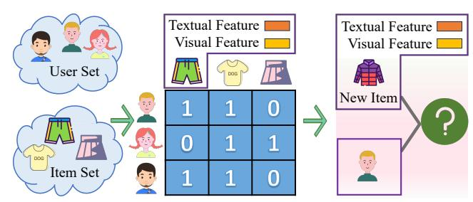
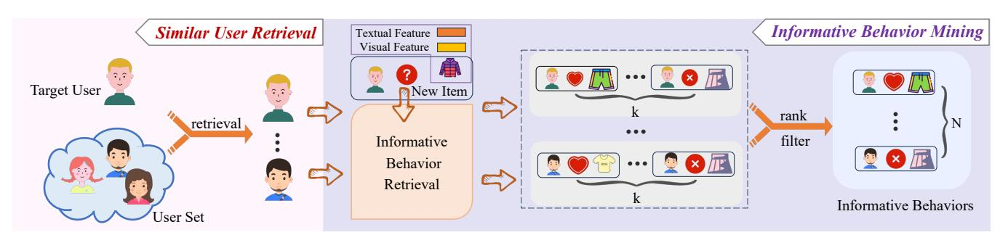
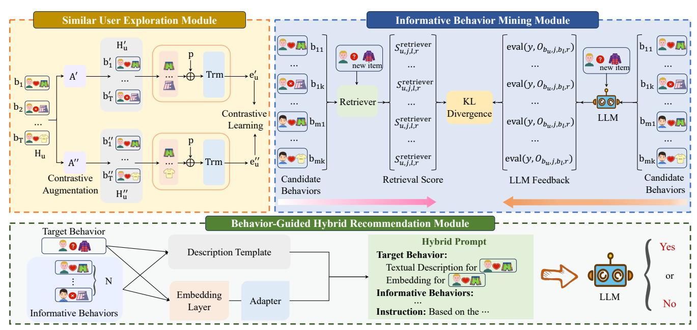
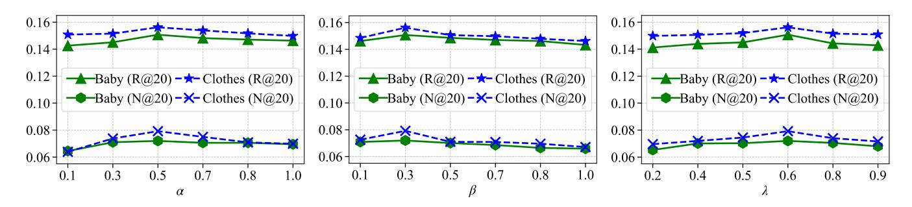
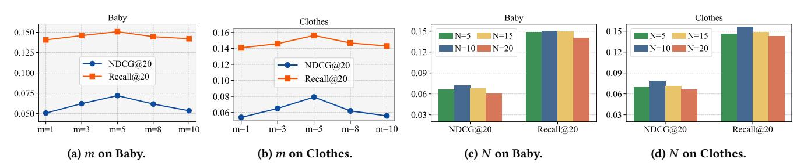

# Joint Similar User Exploration and Informative Behavior Guidance for Multi-Modal New Item Recommendation

Jianye Xie College of Computer Science and Technology, China University of Petroleum (East China) Qingdao, China Shandong Key Laboratory of Intelligent Oil and Gas Industrial Software Qingdao, China jianyexie96@gmail.com

Lianyong Qi∗ College of Computer Science and Technology, China University of Petroleum (East China) Qingdao, China Shandong Key Laboratory of Intelligent Oil and Gas Industrial Software Qingdao, China lianyongqi@upc.edu.cn

Weiming Liu ByteDance Inc. Singapore, Singapore lwming95@gmail.com

Anqi Wang College of Computer Science and Technology, China University of Petroleum (East China) Qingdao, China Shandong Key Laboratory of Intelligent Oil and Gas Industrial Software Qingdao, China wanganqi0618@gmail.com

Xiaolong Xu School of Computer and Software, Nanjing University of Information Science and Technology Nanjing, China xlxu@nuist.edu.cn

Haolong Xiang School of Software, Nanjing University of Information Science and Technology Nanjing, China hlxiang@nuist.edu.cn

Xuyun Zhang School of Computing, Macquarie University Sydney, Australia xuyun.zhang@mq.edu.au

Wenwen Gong College of Information and Electrical Engineering, China Agricultural University Beijing, China wenweng@cau.edu.cn

Yang Zhang Anuradha and Vikas Sinha Department of Data Science, University of North Texas Denton, United States yang.zhang@unt.edu

Amin Beheshti School of Computing, Macquarie University Sydney, Australia amin.beheshti@mq.edu.au

Wanchun Dou State Key Laboratory for Novel Software Technology, School of Computer Science and Technology, Nanjing University Nanjing, China douwc@nju.edu.cn

# Abstract

Multi-modal recommendation has become essential with the rapid expansion of online platforms such as e-commerce and videosharing applications. In this work, we focus on the Multi-Modal New Item Recommendation (MMNIR) problem, where items with multi-modal content but newly introduced items lack interaction history. The MMNIR problem is particularly challenging in two aspects: (1) a large number of new items are created rapidly over time without any interaction data, (2) not all existing interactions are equally useful, and it is non-trivial to identify informative behaviors from users with similar preferences. However, previous methods fail to identify users with similar preferences and to capture informative behaviors from historical data. Furthermore, conventional models primarily rely on simple co-occurring signals, leading to

∗Corresponding Author.

© 2026 Copyright held by the owner/author(s). ACM ISBN 979-8-4007-2307-0/2026/04 <https://doi.org/10.1145/3774904.3792302>

spurious neighbors and neglecting the informative behaviors of truly similar users with consistent preferences. To fill this gap, we propose Joint Similar User Exploration and Informative Behavior Guidance (SuperG) for solving the MMNIR problem. SuperG first proposes a similar user exploration module to identify users with similar preferences to the target user. Then it incorporates an informative behavior mining module to retrieve informative behaviors from both the target user and similar users' histories to support new item recommendation. Finally, SuperG proposes a behaviorguided hybrid recommendation module to incorporate the retrieved behavioral signals to guide the recommendation of new items. Our empirical study on three real datasets demonstrates that SuperG outperforms the state-of-the-art models under the MMNIR setting.

# CCS Concepts

- Information systems → Recommender systems.

# Keywords

Recommender Systems, Multi-Modal Recommendation, New Item Recommendation, Large Language Models

[This work is licensed under a Creative Commons Attribution 4.0 International License.](https://creativecommons.org/licenses/by/4.0) WWW '26, Dubai, United Arab Emirates

#### ACM Reference Format:

Jianye Xie, Lianyong Qi, Weiming Liu, Anqi Wang, Xiaolong Xu, Haolong Xiang, Xuyun Zhang, Wenwen Gong, Yang Zhang, Amin Beheshti, and Wanchun Dou. 2026. Joint Similar User Exploration and Informative Behavior Guidance for Multi-Modal New Item Recommendation. In Proceedings of the ACM Web Conference 2026 (WWW '26), April 13–17, 2026, Dubai, United Arab Emirates. ACM, New York, NY, USA, [12](#page-11-0) pages. [https:](https://doi.org/10.1145/3774904.3792302) [//doi.org/10.1145/3774904.3792302](https://doi.org/10.1145/3774904.3792302)

#### 1 Introduction

With the rapid expansion of the Web, Multi-Modal Recommendation (MMR) models have become essential for online platforms such as e-commerce and video-sharing applications. These MMR models leverage both user-item interactions and multi-modal content features to improve recommendation accuracy [\[2,](#page-8-0) [12,](#page-8-1) [39,](#page-8-2) [64,](#page-9-0) [79\]](#page-9-1). However, in practical scenarios, these models face critical challenges: newly introduced items have no interaction data, which makes accurate recommendation difficult [\[7,](#page-8-3) [80,](#page-9-2) [85\]](#page-9-3). This issue becomes even more critical for these new items with multi-modal content, as both collaborative signals and modality preferences are unavailable [\[3,](#page-8-4) [44\]](#page-9-4). Thus, how to effectively handle cold-start items under multi-modal conditions still needs more investigation.

In this paper, we focus on the Multi-Modal New Item Recommendation (MMNIR) problem as shown in Fig. [1.](#page-1-0) That is, we aim to address the cold-start problem for newly introduced items with multi-modal content. For each target user, existing user-item interaction data is available, while new items lack any interaction history. Meanwhile, new items contain multi-modal content such as images, audio, and text. Moreover, we assume that certain behaviors of the target user as well as similar users can serve as informative signals. For instance, if the target user has previously interacted with items that are similar to the new item, such behaviors can inform the recommendation of the new item. Likewise, if similar users who share comparable preferences have interacted with items similar to the new item, such behaviors can also serve as informative signals to guide the recommendation. There are two main challenges in solving the MMNIR problem: (1) CH1: How to identify users who share similar preferences with the target user without explicit user similarity labels? (2) CH2: How to retrieve informative behaviors that can support recommendations for new items?

Previous methods cannot better solve MMNIR well. On the one hand, previous methods often focus primarily on modeling multimodal content to learn user preferences [\[15,](#page-8-5) [18,](#page-8-6) [37,](#page-8-7) [63\]](#page-9-5), while neglecting the valuable information contained in users' interaction history, which prevents previous approaches from performing effectively. Recent MMNIR models attempt to overcome this limitation by combining collaborative filtering (CF) [\[24,](#page-8-8) [82\]](#page-9-6) signals and multimodal information to better capture user preferences. However, they typically rely on simple co-occurring implicit signals and assume that users who have interacted with the same items are similar. This approach can lead to spurious neighbors, since users who interact with the same popular items may still have very different overall preferences, while truly similar users may never interact with the same items, causing their informative behaviors to be overlooked. Moreover, these methods often utilize Graph Neural Networks (GNNs) [\[41,](#page-8-9) [66,](#page-9-7) [68\]](#page-9-8) to aggregate interaction information through user–item graph message passing. However, GNNs

Figure 1: The problem definition of MMNIR.

struggle to capture explicit and semantically rich CF information and commonly suffer from over-smoothing [\[6,](#page-8-10) [32\]](#page-8-11), which limits their ability to model comprehensive and discriminative interaction patterns. Although recent methods such as MMHCL [\[19\]](#page-8-12) and MHCR [\[42\]](#page-8-13) employ hypergraphs [\[14,](#page-8-14) [17,](#page-8-15) [70\]](#page-9-9) to model higher-order user-item interactions, the adopted hypergraph-based architectures are sensitive to the choice of hyper-parameters and may fail to efficiently capture these higher-order relationships. Hence, they inevitably incur imprecise and meaningless hyperedges among user-item hypergraphs, leading to limited model potential. Therefore, traditional MMNIR models cannot solve CH1 well. On the other hand, recent works leverage large language models (LLMs) [\[5,](#page-8-16) [13,](#page-8-17) [48,](#page-9-10) [55\]](#page-9-11) to address MMNIR. However, these LLM-based models [\[62,](#page-9-12) [71\]](#page-9-13) have not explicitly explored informative behaviors to guide the recommendation process. These methods often rely on a significant number of historical interactions, inevitably introducing noisy signals. Moreover, LLMs cannot simultaneously process all items in natural language form due to input length limitations, leading to substantial token consumption and making them impractical for real-world deployment [\[1\]](#page-8-18). To address this issue, the latest studies attempt to recall a subset of items or interactions as recommendation signals [\[28,](#page-8-19) [78\]](#page-9-14). Nevertheless, these approaches typically depend on simple text similarity and pay limited attention to the distinguishability of features among users and items, resulting in the retrieval of large but low-quality item sets that lack discriminative capacity and thus fail to provide truly informative signals for recommendation. Therefore, traditional MMNIR models cannot solve CH2 well. In conclusion, previous methods cannot provide satisfactory results in tackling the MMNIR problem.

To address the aforementioned issues, in this paper, we propose Joint Similar User Exploration and Informative Behavior Guidance model (SuperG) for solving the MMNIR problem. SuperG includes three main modules, i.e., similar user exploration module, informative behavior mining module, and behavior-guided hybrid recommendation module. The similar user exploration module is designed to identify users most similar to the target user, introducing collaborative signals based on user-user similarity to address CH1. Specifically, we employ contrastive learning [\[29,](#page-8-20) [33,](#page-8-21) [54\]](#page-9-15) to learn discriminative user representations for effective similar user exploration. In the informative behavior mining module, we retrieve and rerank the most informative user-item interactions from the target user and similar users' history to support the recommendation for solving CH2, as illustrated in Fig. [2.](#page-2-0) We refer to these interactions as informative behaviors. Finally, the behavior-guided hybrid recommendation module is set to leverage the informative

Figure 2: The illustration of similar user retrieval and informative behavior mining.

behaviors to guide the LLM in generating recommendations. In this module, we jointly utilize natural language and embedding-based representations to guide LLMs in predicting user-item interactions. By incorporating these three modules, SuperG can better identify users who share similar preferences with the target user without explicit user similarity labels, meanwhile SuperG can also identify and leverage the informative behaviors of the target user and similar users to alleviate the cold-start problem for new items.

We summarize our main contributions as follows: (1) We propose a novel framework, i.e., SuperG, for solving the MMNIR problem by combining similar user exploration, informative behavior mining, and LLM-based behavior-guided recommendation. (2) We propose similar users exploration via contrastive learning and informative behaviors mining through LLM-based feedback, leveraging collaborative signals to improve recommendation performance for cold-start items. (3) We introduce a behavior-guided hybrid recommendation approach that leverages informative behaviors in both textual and embedding forms to guide LLMs in recommending cold-start items. (4) We provide theoretical analyses and conduct extensive experiments to validate the effectiveness of SuperG.

## 2 Method

In this section, we will introduce the details of the proposed SuperG for solving the MMNIR problem. First, we describe notations. We assume there are two sets, i.e., a user set U and an item set V. There exist ��U users and ��V items in the user and item sets respectively. R ∈ R ��U ×��V denotes the user-item interaction matrix, where each entry ������ ∈ {0, 1} indicates whether user �� has interacted with item ��. Specifically, ������ = 1 denotes an observed interaction and ������ = 0 otherwise. Meanwhile, items in V have multi-modal features extracted from their content, such as visual and textual features. We adopt generic feature extractors to generate the multi-modal features. For an item �� ∈ V, we denote its feature representation as x�� ∈ R ��×�� , where �� is the number of modalities and �� is the dimensionality of each modality-specific feature vector.

The framework of SuperG is shown in Fig. [3.](#page-3-0) SuperG mainly has three modules, i.e., similar user exploration module, informative behavior mining module, and behavior-guided hybrid recommendation module. The similar user exploration module aims to identify users with similar preferences to the target user, thereby introducing collaborative signals. The informative behavior mining module is set to retrieve interaction behaviors from both the target user and similar users that are most likely to support the recommendation of new items through LLM-based feedback. The behavior-guided

hybrid recommendation module aims to incorporate the retrieved behavioral signals to guide the LLM in generating recommendations for new items. By incorporating these three modules in SuperG, we can leverage rich information from similar users and informative behaviors to enhance the recommendation of new multi-modal items. We will introduce these three modules in detail later.

## 2.1 Similar User Exploration Module

To start with, we first introduce the similar user exploration module in SuperG. The similar user exploration module includes two main steps, i.e., user representation construction and user representation contrastive learning. User representation construction is set to construct user embeddings from historical interactions. User representation contrastive learning aims to learn discriminative user representations for similar user retrieval. By combining user representation construction and user representation contrastive learning, the similar user exploration module can effectively identify users with similar preferences to the target user, thereby introducing collaborative signals to enhance new item recommendation.

User Representation Construction. Specifically, we represent a user's historical interaction sequence H�� as a collection of previously interacted items, each represented by the corresponding vector ���� . We obtain ���� for each item by following [\[3,](#page-8-4) [61\]](#page-9-16), and the details are presented in the Appendix [B.](#page-10-0) These item vectors form a matrix X�� = [��1, ��2, . . . , ���� ] ⊤ ∈ R �� ×�� , where �� denotes the number of historical items and �� is the embedding dimension. To capture the order information in the user's interaction history, we add positional embeddings P ∈ R �� ×�� to obtain X˜ �� = X�� + P. We then apply a transformer [\[57\]](#page-9-17) encoder to X˜ �� to model complex dependencies among the items in the sequence. The final user embedding is computed by averaging the transformer's output:

u = MEAN(Trm(X˜ ��)) ∈ R �� , (1)

where Trm(·) denotes the transformer encoder.

User Representation Contrastive Learning. Although user representation construction has provided user embeddings derived from historical interactions, there are no explicit labels indicating which users are similar to each other. Therefore, it is essential to further explore underlying user-user similarities beyond individual representations. That is, we should learn more discriminative user representations to better identify users with similar preferences via contrastive learning. Hence, we propose the user representation contrastive learning method to achieve this goal. Specifically,

format, typically a binary response ("Yes" or "No"). As shown in Fig. [3,](#page-3-0) the complete prompt combines the instruction with the target user and new item information, as well as informative behaviors. The target user, the new item, and the informative behaviors all include textual descriptions and embeddings. The detailed instruction and full prompt design are introduced in the Appendix [C.](#page-10-1)

LLM-Compatible Representation Adaptation. Since the user and item embeddings e�� and z�� originate from an external representation space, they may not align with the LLM's internal embedding distribution [\[21\]](#page-8-30). To bridge this gap, we introduce a lightweight adapter module �� (·) that transforms raw embeddings into LLMcompatible representations. Formally:

e˜�� = �� (e��), z˜�� = �� (z��). (12)

The projected vectors e˜�� and z˜�� are then injected into the LLM prompt using special tokens:

[USER\_EMBED] = e˜��, [ITEM\_EMBED] = z˜�� . (13)

Training. During training, we freeze all LLM parameters and optimize only the shared adapter module �� (·). In this work, the adapter is built with a two-layer bottleneck structure (Linear–ReLU–Linear). The objective is to align the injected embeddings with the LLM's token-level reasoning, improving the prompt's semantic integrity. The training signal comes from the LLM's generative objective, which predicts a correct binary label ("Yes" or "No"). The adapter is trained end-to-end via the following loss:

Lad = − 1 �� ∑︁�� ��=1 [���� log(��ˆ��) + (1 − ����) log(1 − ��ˆ��)] , (14)

where ��ˆ�� is the predicted probability of "Yes" generated by the LLM, and ���� is the ground truth label.

Joint Optimization with Behavior Retriever. To ensure consistency between behavior retrieval and final recommendation prediction, we share the adapter module �� (·) across both the informative behavior mining module and the behavior-guided hybrid recommendation module. In retrieval, adapted embeddings e˜�� and z˜�� are used to construct prompts for retrieving informative behaviors. The adapter is jointly optimized by Eq.[\(11\)](#page-4-3) and Eq.[\(14\)](#page-5-0).

Interaction Prediction. Given the constructed prompt with textual descriptions and adapted embeddings, the LLM is prompted to directly generate a binary response indicating whether the target user �� would interact with the new item ��. The output is constrained to be one of the two tokens: "Yes" or "No", following the predefined output format. This prediction corresponds to the final recommendation result in the MMNIR task, effectively completing the recommendation process for the target user and new item pair.

### 2.4 Putting Together

The total loss of SuperG could be obtained by combining the losses from different modules:

Ltotal = LCL + ��Lretriever + ��Lad, (15)

where �� and �� are hyper-parameters controlling the relative importance of each loss term. By doing this, SuperG can effectively leverage useful knowledge from existing user-item interactions to

alleviate the cold-start problem. Additionally, the inference algorithm of SuperG can be found in the Appendix [D.](#page-10-2)

#### 3 Experiments

In this section, we conduct experiments on several real-world datasets to answer the following questions: (1) RQ1: How does the proposed model SuperG perform compared with the stateof-the-art MMNIR methods? (2) RQ2: How do the similar user exploration and informative behavior guidance contribute to performance improvement? (3) RQ3: How does the performance of SuperG vary with different values of the hyper-parameters?

#### 3.1 Experimental Setup

Datasets. We conduct experiments on three widely used real-world datasets: (a) Amazon Baby [\[22,](#page-8-31) [45\]](#page-9-27), (b) Amazon Clothing, Shoes, and Jewelry [\[22,](#page-8-31) [45\]](#page-9-27), and (c) TikTok [\[3\]](#page-8-4). For simplicity, we refer to them as Baby, Clothes, and TikTok. Both Baby and Clothes contain visual and textual modalities. TikTok is collected from the TikTok platform, recording users' viewed short videos. Its multi-modal features include visual, acoustic, and title textual information. The statistics of the pre-processed datasets are summarized in Appendix [E.](#page-11-1) To simulate new items, we randomly select 20% of items and remove their historical interactions from the training process. Among these, half are further used as a validation set and the remaining half as a test set. These items are completely unseen during training. Evaluation Metrics. We select two metrics that are widely used in personalized recommender systems: Recall (Recall@K) and Normalized Discounted Cumulative Gain (NDCG@K) [\[30\]](#page-8-32). Higher values of these two metrics indicate better model performance.

Baselines. To verify the effectiveness of SuperG, we compare it with multiple representative and state-of-the-art models that are suitable for the task scenarios: MMGCN [\[64\]](#page-9-0), LATTICE [\[75\]](#page-9-28), MI-CRO [\[76\]](#page-9-29), CCFCRec [\[84\]](#page-9-30), GoRec [\[2\]](#page-8-0), MILK [\[3\]](#page-8-4), LGMRec [\[20\]](#page-8-33), PROMPTMM [\[62\]](#page-9-12), LLMTreeRec [\[78\]](#page-9-14), MMHCL [\[19\]](#page-8-12), MLLM-MSR [\[71\]](#page-9-13).

Implementation Details. We randomly split the user–item interaction data into training, validation, and test sets with a ratio of 8:1:1, following [\[3,](#page-8-4) [19\]](#page-8-12). The batch size is set to 1024. We adopt the Adam optimizer [\[34\]](#page-8-34) with a learning rate tuned in 1e−3, 1e−4, 1e−5 and select 1e−3 as default. An early stopping strategy is applied to prevent overfitting. For model hyper-parameters, the embedding dimension �� is set to 768, the number of retrieved similar users �� is set to 5, and the number of retrieved behaviors per user �� is also set to 5. The transformer encoder Trm(·) in Eq.[\(1\)](#page-2-1) is implemented with 1 layer and 2 attention heads. The temperature parameter ��1 in Eq.[\(2\)](#page-3-1) is fixed at 0.1. The retrieval score weighting parameter �� in Eq.[\(6\)](#page-4-0) is set to 0.6. The number of top behaviors �� used to guide recommendation is set to 5. For the total loss, the weights are empirically set as �� = 0.5 and �� = 0.3. We employ Llama-3-8B-Instruct as the backbone LLM, with the temperature parameter fixed at 0. We do not fine-tune the LLM due to the high computational cost and potential risk of user privacy leakage. For evaluation, we use the same prompt template as in training and set the maximum sequence length to 2048. All experiments are conducted five times with different random seeds, and we report the average results.

Table 1: Experimental results on Baby, Clothes, and TikTok datasets.

| Models      | Recall@10 | Baby Recall@20 | Recall@10 | Clothes Recall@20 | Recall@10 | TikTok Recall@20 |
|-------------|-----------|----------------|-----------|-------------------|-----------|------------------|
| MMGCN       | 0.0208    | 0.0278         | 0.0175    | 0.0289            | 0.1318    | 0.1385           |
| LATTICE     | 0.0271    | 0.0328         | 0.0324    | 0.0371            | 0.1568    | 0.1695           |
| MICRO       | 0.0283    | 0.0450         | 0.0340    | 0.0509            | 0.1760    | 0.1867           |
| CCFCRec     | 0.0295    | 0.0464         | 0.0355    | 0.0545            | 0.1802    | 0.1920           |
| GoRec       | 0.0335    | 0.0544         | 0.0429    | 0.0639            | 0.1465    | 0.1605           |
| MILK        | 0.0381    | 0.0628         | 0.0484    | 0.0716            | 0.1886    | 0.2002           |
| LGMRec      | 0.0409    | 0.0785         | 0.0552    | 0.0865            | 0.1956    | 0.2091           |
| PROMPTMM    | 0.0653    | 0.0896         | 0.0681    | 0.0903            | 0.2029    | 0.2156           |
| LLMTreeRec  | 0.0756    | 0.1108         | 0.0826    | 0.1153            | 0.2325    | 0.2561           |
| MMHCL       | 0.0646    | 0.0950         | 0.0893    | 0.0925            | 0.2108    | 0.2389           |
| MLLM-MSR    | 0.0859    | 0.1305         | 0.0906    | 0.1389            | 0.2302    | 0.2565           |
| SuperG-SUEM | 0.0892    | 0.1390         | 0.0951    | 0.1438            | 0.2571    | 0.2683           |
| SuperG-IBMM | 0.0906    | 0.1439         | 0.0989    | 0.1470            | 0.2596    | 0.2720           |
| SuperG-BHRM | 0.0920    | 0.1477         | 0.1016    | 0.1508            | 0.2617    | 0.2766           |
| SuperG      | 0.0986    | 0.1507         | 0.1059    | 0.1562            | 0.2680    | 0.2812           |
|             | NDCG@10   | NDCG@20        | NDCG@10   | NDCG@20           | NDCG@10   | NDCG@20          |
| MMGCN       | 0.0138    | 0.0169         | 0.0165    | 0.0230            | 0.1201    | 0.1320           |
| LATTICE     | 0.0151    | 0.0188         | 0.0178    | 0.0235            | 0.1536    | 0.1625           |
| MICRO       | 0.0153    | 0.0192         | 0.0186    | 0.0243            | 0.1270    | 0.1357           |
| CCFCRec     | 0.0159    | 0.0209         | 0.0207    | 0.0259            | 0.1799    | 0.1802           |
| GoRec       | 0.0179    | 0.0249         | 0.0234    | 0.0292            | 0.1096    | 0.1124           |
| MILK        | 0.0215    | 0.0277         | 0.0279    | 0.0343            | 0.1830    | 0.1852           |
| LGMRec      | 0.0227    | 0.0283         | 0.0302    | 0.0455            | 0.1986    | 0.2091           |
| PROMPTMM    | 0.0240    | 0.0298         | 0.0331    | 0.0476            | 0.2029    | 0.2104           |
| LLMTreeRec  | 0.0345    | 0.0410         | 0.0415    | 0.0553            | 0.2520    | 0.2685           |
| MMHCL       | 0.0336    | 0.0401         | 0.0389    | 0.0506            | 0.2509    | 0.2668           |
| MLLM-MSR    | 0.0457    | 0.0526         | 0.0491    | 0.0568            | 0.2607    | 0.2692           |
| SuperG-SUEM | 0.0551    | 0.0613         | 0.0533    | 0.0690            | 0.2755    | 0.2807           |
| SuperG-IBMM | 0.0590    | 0.0681         | 0.0585    | 0.0749            | 0.2786    | 0.2862           |
| SuperG-BHRM | 0.0603    | 0.0706         | 0.0602    | 0.0772            | 0.2802    | 0.2883           |
| SuperG      | 0.0619    | 0.0720         | 0.0625    | 0.0792            | 0.2836    | 0.2912           |

# 3.2 Overall Comparisons (RQ1)

As shown in Table 2, we compare our model with competitive baselines on three datasets, and obtain the following observations: (1) On all three datasets, SuperG consistently outperforms all baselines. Specifically, it improves the strongest baseline (MLLM-MSR) in terms of Recall@10 by 14.8%, 16.9%, and 16.4% on the Baby, Clothes, and TikTok datasets, respectively. These results demonstrate the effectiveness of our framework, and we attribute the gains to the three proposed modules that jointly enhance the performance of the model. (2) Compared with representative baselines such as MMHCL, LGMRec, CCFCRec, and MMGCN, SuperG achieves consistently better performance. For example, on the Clothes dataset, SuperG improves over the baseline MMHCL by 18.6% in Recall@10. We attribute these gains to the similar user exploration module, which avoids spurious neighbors caused by relying solely on simple cooccurring interactions and instead introduces reliable collaborative signals based on explicit user–user similarity. (3) Compared with recent LLM-based models such as LLMTreeRec, PROMPTMM, and MLLM-MSR, SuperG also demonstrates clear superiority. On the TikTok dataset, for instance, SuperG improves over the strongest baseline (MLLM-MSR) by 16.4% in Recall@10. This improvement

stems from the informative behavior mining module, which explicitly retrieves and reranks the most informative interactions from both the target user and similar users.

# 3.3 Ablation Study (RQ2)

To exploit the effectiveness of each component in the proposed SuperG, we conduct ablation studies on multiple datasets. As illustrated in Table [1,](#page-6-0) we compare the full model with several variants: SuperG-SUEM: the Similar User Exploration Module (SUEM) is removed, and informative behaviors are directly retrieved from all users' historical interactions. SuperG-IBMM: the Informative Behavior Mining Module (IBMM) is removed. In this setting, we retrieve user behaviors without incorporating LLM feedback. SuperG-BHRM: the Behavior-Guided Hybrid Recommendation Module (BHRM) is removed, and external embeddings are directly appended to the final prompt without LLM-compatible representation adaptation. From the results, we derive the following observations: (1) Each component contributes substantially to the superior performance of SuperG. SUEM contributes the most to performance, followed by IBMM and BHRM. For example, on the Baby dataset, removing SUEM, IBMM, and BHRM leads to performance drops of 12.3%, 4.9%, and 2.7% in NDCG@10, respectively, underscoring their indispensable roles. (2) SuperG-SUEM underperforms the full

Figure 4: The experimental results on varying ��, �� and ��.

Figure 5: The experimental results on varying �� and ��.

model, demonstrating that merely retrieving behaviors from all users cannot effectively capture informative collaborative signals. This validates that the proposed SUEM is critical for tackling CH1, as it enables precise identification of similar users while avoiding spurious neighbors. (3) Both SuperG-IBMM and SuperG-BHRM perform significantly worse than SuperG, highlighting the importance of explicitly retrieving informative behaviors and adapting user–item embeddings into LLM-compatible representations. These results show that IBMM and BHRM can effectively identify the most informative behaviors and leverage these behaviors to guide the final recommendation for tackling CH2.

### 3.4 Effect of Hyper-Parameters (RQ3)

We further investigate the effects of key hyper-parameters on the

performance of SuperG on the Baby and Clothes datasets. Effect of the number of similar users ��. The parameter �� controls the number of similar users retrieved in the similar user exploration module. As shown in Fig[.5\(a\)-\(b\),](#page-7-0) a small �� (e.g., �� = 1) leads to insufficient collaborative signals, while a very large �� introduces noisy and spurious neighbors. The best performance is achieved at �� = 5, which we adopt as the default setting.

Effect of the retrieval score weighting parameter ��. We vary �� in 0.2, 0.4, 0.5, 0.6, 0.8, 1.0, and report Recall@20 and NDCG@20 in Fig[.4.](#page-7-1) When �� is small (e.g., 0.2), the score relies heavily on semantic relevance while largely ignoring user-specific preferences, resulting in suboptimal performance. Conversely, a large �� (e.g., 1.0) overly emphasizes user-specific preferences and disregards behavioral similarity, leading to performance degradation. The best balance is observed at �� = 0.6, which we set as the default.

Effect of top-�� behaviors for guiding recommendation. As illustrated in Fig[.5\(c\)-\(d\),](#page-7-0) too few behaviors (e.g., �� = 5) fail to provide sufficient informative signals, while too many behaviors introduce redundant or noisy interactions. Performance peaks at �� = 10, and we therefore set �� = 10 as the default.

Effect of the total loss weights �� and ��. We conduct sensitivity analysis by varying one parameter while fixing the other. As shown in Fig[.4,](#page-7-1) model performance remains relatively stable within a reasonable range, demonstrating the robustness of SuperG. Empirically, we set �� = 0.5 and �� = 0.3, which provides the best balance among the loss objectives.

### 4 Conclusion

In this paper, we propose the Joint Similar User Exploration and Informative Behavior Guidance model (SuperG) to address the Multi-Modal New Item Recommendation (MMNIR) problem. SuperG consists of three modules: the similar user exploration module, the informative behavior mining module, and the behavior-guided hybrid recommendation module. The similar user exploration module identifies users with preferences similar to the target user via user representation contrastive learning. The informative behavior mining module retrieves the most informative behaviors from both the target user and similar users' histories through LLM-based feedback. The behavior-guided hybrid recommendation module incorporates these behaviors to guide the LLM in generating the final recommendation. By integrating these three modules, SuperG effectively leverages rich information from informative behaviors to enhance the recommendation of new multi-modal items. We also conduct extensive experiments on multiple datasets to demonstrate the superior performance of our proposed SuperG model.

# 5 Acknowledgements

This work was supported in part by the National Natural Science Foundation of China (No. 62572486, No. 62506364), The State Key Laboratory of Novel Software Technology (KFKT2024B50, KFKT2024A03). Dr. Yang Zhang from the University of North Texas did not receive financial support for this work from this grant or from any other external project; his contributions were conducted as independent academic research.

References [1] Shengnan An, Zexiong Ma, Zeqi Lin, Nanning Zheng, Jian-Guang Lou, and Weizhu Chen. 2024. Make your llm fully utilize the context. Advances in Neural Information Processing Systems 37 (2024), 62160–62188. [2] Haoyue Bai, Min Hou, Le Wu, Yonghui Yang, Kun Zhang, Richang Hong, and Meng Wang. 2023. Gorec: a generative cold-start recommendation framework. In Proceedings of the 31st ACM international conference on multimedia. 1004–1012. [3] Haoyue Bai, Le Wu, Min Hou, Miaomiao Cai, Zhuangzhuang He, Yuyang Zhou, Richang Hong, and Meng Wang. 2024. Multimodality invariant learning for multimedia-based new item recommendation. In Proceedings of the 47th International ACM SIGIR Conference on Research and Development in Information Retrieval. 677–686. [4] Gleb Bazhenov, Denis Kuznedelev, Andrey Malinin, Artem Babenko, and Liudmila Prokhorenkova. 2023. Evaluating robustness and uncertainty of graph models under structural distributional shifts. Advances in Neural Information Processing Systems 36 (2023), 75567–75594. [5] Sébastien Bubeck, Varun Chandrasekaran, Ronen Eldan, Johannes Gehrke, Eric Horvitz, Ece Kamar, Peter Lee, Yin Tat Lee, Yuanzhi Li, Scott Lundberg, et al. 2023. Sparks of artificial general intelligence: Early experiments with gpt-4. arXiv preprint arXiv:2303.12712 (2023). [6] Deli Chen, Yankai Lin, Wei Li, Peng Li, Jie Zhou, and Xu Sun. 2020. Measuring and relieving the over-smoothing problem for graph neural networks from the topological view. In Proceedings of the AAAI conference on artificial intelligence, Vol. 34. 3438–3445. [7] Hao Chen, Zefan Wang, Feiran Huang, Xiao Huang, Yue Xu, Yishi Lin, Peng He, and Zhoujun Li. 2022. Generative adversarial framework for cold-start item recommendation. In Proceedings of the 45th International ACM SIGIR Conference on Research and Development in Information Retrieval. 2565–2571. [8] Jingyuan Chen, Hanwang Zhang, Xiangnan He, Liqiang Nie, Wei Liu, and Tat-Seng Chua. 2017. Attentive collaborative filtering: Multimedia recommendation with item-and component-level attention. In Proceedings of the 40th International ACM SIGIR conference on Research and Development in Information Retrieval. 335–344. [9] Yimeng Chen, Ruibin Xiong, Zhi-Ming Ma, and Yanyan Lan. 2022. When does group invariant learning survive spurious correlations? Advances in Neural Information Processing Systems 35 (2022), 7038–7051. [10] Elliot Creager, Jörn-Henrik Jacobsen, and Richard Zemel. 2021. Environment inference for invariant learning. In International Conference on Machine Learning. PMLR, 2189–2200. [11] Jiequan Cui, Zhuotao Tian, Zhisheng Zhong, Xiaojuan Qi, Bei Yu, and Hanwang Zhang. 2024. Decoupled kullback-leibler divergence loss. Advances in Neural Information Processing Systems 37 (2024), 74461–74486. [12] Xiaoxi Cui, Weihai Lu, Yu Tong, Yiheng Li, and Zhejun Zhao. 2025. Multi-Modal Multi-Behavior Sequential Recommendation with Conditional Diffusion-Based Feature Denoising. In Proceedings of the 48th International ACM SIGIR Conference on Research and Development in Information Retrieval. 1593–1602. [13] Abhimanyu Dubey, Abhinav Jauhri, Abhinav Pandey, Abhishek Kadian, Ahmad Al-Dahle, Aiesha Letman, Akhil Mathur, Alan Schelten, Amy Yang, Angela Fan, et al. 2024. The llama 3 herd of models. arXiv preprint arXiv:2407.21783 (2024). [14] Yifan Feng, Haoxuan You, Zizhao Zhang, Rongrong Ji, and Yue Gao. 2019. Hypergraph neural networks. In Proceedings of the AAAI conference on artificial intelligence, Vol. 33. 3558–3565. [15] Junchen Fu, Xuri Ge, Xin Xin, Alexandros Karatzoglou, Ioannis Arapakis, Jie Wang, and Joemon M Jose. 2024. IISAN: Efficiently adapting multimodal representation for sequential recommendation with decoupled PEFT. In Proceedings of the 47th International ACM SIGIR Conference on Research and Development in Information Retrieval. 687–697. [16] Christian Ganhör, Marta Moscati, Anna Hausberger, Shah Nawaz, and Markus Schedl. 2024. A multimodal single-branch embedding network for recommendation in cold-start and missing modality scenarios. In Proceedings of the 18th ACM Conference on Recommender Systems. 380–390. [17] Yue Gao, Yifan Feng, Shuyi Ji, and Rongrong Ji. 2022. Hgnn+: General hypergraph neural networks. IEEE Transactions on Pattern Analysis and Machine Intelligence 45, 3 (2022), 3181–3199. [18] Xue Geng, Hanwang Zhang, Jingwen Bian, and Tat-Seng Chua. 2015. Learning image and user features for recommendation in social networks. In Proceedings of the IEEE international conference on computer vision. 4274–4282. [19] Xu Guo, Tong Zhang, Fuyun Wang, Xudong Wang, Xiaoya Zhang, Xin Liu, and Zhen Cui. 2025. MMHCL: Multi-Modal Hypergraph Contrastive Learning for Recommendation. ACM Transactions on Multimedia Computing, Communications and Applications (2025). [20] Zhiqiang Guo, Jianjun Li, Guohui Li, Chaoyang Wang, Si Shi, and Bin Ruan. 2024. Lgmrec: Local and global graph learning for multimodal recommendation. In Proceedings of the AAAI Conference on Artificial Intelligence, Vol. 38. 8454–8462. [21] Jinwen He, Yujia Gong, Zijin Lin, Cheng'an Wei, Yue Zhao, and Kai Chen. 2024. Llm factoscope: Uncovering llms' factual discernment through measuring inner states. In Findings of the Association for Computational Linguistics ACL 2024. 10218–10230. [22] Ruining He and Julian McAuley. 2016. Ups and downs: Modeling the visual evolution of fashion trends with one-class collaborative filtering. In proceedings of the 25th international conference on world wide web. 507–517. [23] Xiangnan He, Kuan Deng, Xiang Wang, Yan Li, Yongdong Zhang, and Meng Wang. 2020. Lightgcn: Simplifying and powering graph convolution network for recommendation. In Proceedings of the 43rd International ACM SIGIR conference on research and development in Information Retrieval. 639–648. [24] Xiangnan He, Lizi Liao, Hanwang Zhang, Liqiang Nie, Xia Hu, and Tat-Seng Chua. 2017. Neural collaborative filtering. In Proceedings of the 26th international conference on world wide web. 173–182. [25] Yue He, Yancheng Dong, Peng Cui, Yuhang Jiao, Xiaowei Wang, Ji Liu, and Philip S Yu. 2021. Purify and generate: Learning faithful item-to-item graph from noisy user-item interaction behaviors. In Proceedings of the 27th ACM SIGKDD Conference on Knowledge Discovery & Data Mining. 3002–3010. [26] John R Hershey and Peder A Olsen. 2007. Approximating the Kullback Leibler divergence between Gaussian mixture models. In 2007 IEEE International Conference on Acoustics, Speech and Signal Processing-ICASSP'07, Vol. 4. IEEE, IV–317. [27] David T Hoffmann, Nadine Behrmann, Juergen Gall, Thomas Brox, and Mehdi Noroozi. 2022. Ranking info noise contrastive estimation: Boosting contrastive learning via ranked positives. In Proceedings of the AAAI Conference on Artificial Intelligence, Vol. 36. 897–905. [28] Feiran Huang, Yuanchen Bei, Zhenghang Yang, Junyi Jiang, Hao Chen, Qijie Shen, Senzhang Wang, Fakhri Karray, and Philip S Yu. 2025. Large Language Model Simulator for Cold-Start Recommendation. In Proceedings of the Eighteenth ACM International Conference on Web Search and Data Mining. 261–270. [29] Ashish Jaiswal, Ashwin Ramesh Babu, Mohammad Zaki Zadeh, Debapriya Banerjee, and Fillia Makedon. 2020. A survey on contrastive self-supervised learning. Technologies 9, 1 (2020), 2. [30] Olivier Jeunen, Ivan Potapov, and Aleksei Ustimenko. 2024. On (normalised) discounted cumulative gain as an off-policy evaluation metric for top-n recommendation. In Proceedings of the 30th ACM SIGKDD conference on knowledge discovery and data mining. 1222–1233. [31] Yiyang Jiang, Wengyu Zhang, Xulu Zhang, Xiao-Yong Wei, Chang Wen Chen, and Qing Li. 2024. Prior knowledge integration via llm encoding and pseudo event regulation for video moment retrieval. In Proceedings of the 32nd ACM International Conference on Multimedia. 7249–7258. [32] Nicolas Keriven. 2022. Not too little, not too much: a theoretical analysis of graph (over) smoothing. Advances in Neural Information Processing Systems 35 (2022), 2268–2281. [33] Prannay Khosla, Piotr Teterwak, Chen Wang, Aaron Sarna, Yonglong Tian, Phillip Isola, Aaron Maschinot, Ce Liu, and Dilip Krishnan. 2020. Supervised contrastive learning. Advances in neural information processing systems 33 (2020), 18661– 18673. [34] Diederik Kinga, Jimmy Ba Adam, et al. 2015. A method for stochastic optimization. In International conference on learning representations (ICLR), Vol. 5. California;. [35] Xingchen Li, Xiang Wang, Xiangnan He, Long Chen, Jun Xiao, and Tat-Seng Chua. 2020. Hierarchical fashion graph network for personalized outfit recommendation. In Proceedings of the 43rd international ACM SIGIR conference on research and development in information retrieval. 159–168. [36] Xiaoni Li, Yu Zhou, Yifei Zhang, Aoting Zhang, Wei Wang, Ning Jiang, Haiying Wu, and Weiping Wang. 2021. Dense semantic contrast for self-supervised visual representation learning. In Proceedings of the 29th ACM international conference on multimedia. 1368–1376. [37] Jianxun Lian, Xiaohuan Zhou, Fuzheng Zhang, Zhongxia Chen, Xing Xie, and Guangzhong Sun. 2018. xdeepfm: Combining explicit and implicit feature interactions for recommender systems. In Proceedings of the 24th ACM SIGKDD international conference on knowledge discovery & data mining. 1754–1763. [38] Fangzhou Lin, Yun Yue, Ziming Zhang, Songlin Hou, Kazunori Yamada, Vijaya Kolachalama, and Venkatesh Saligrama. 2023. InfoCD: A contrastive chamfer distance loss for point cloud completion. Advances in Neural Information Processing Systems 36 (2023), 76960–76973. [39] Xinyu Lin, Wenjie Wang, Jujia Zhao, Yongqi Li, Fuli Feng, and Tat-Seng Chua. 2024. Temporally and distributionally robust optimization for cold-start recommendation. In Proceedings of the AAAI Conference on Artificial Intelligence, Vol. 38. 8750–8758. [40] Xi Victoria Lin, Xilun Chen, Mingda Chen, Weijia Shi, Maria Lomeli, Richard James, Pedro Rodriguez, Jacob Kahn, Gergely Szilvasy, Mike Lewis, et al. 2023. Ra-dit: Retrieval-augmented dual instruction tuning. In The Twelfth International Conference on Learning Representations. [41] Zewen Liu, Guancheng Wan, B Aditya Prakash, Max SY Lau, and Wei Jin. 2024. A review of graph neural networks in epidemic modeling. In Proceedings of the 30th ACM SIGKDD conference on knowledge discovery and data mining. 6577–6587. [42] Sisuo Lyu, Xiuze Zhou, and Xuming Hu. 2025. Multi-view Hypergraph-based Contrastive Learning Model for Cold-Start Micro-video Recommendation. In ICASSP 2025-2025 IEEE International Conference on Acoustics, Speech and Signal Processing (ICASSP). IEEE, 1–5. [43] Qiyao Ma, Xubin Ren, and Chao Huang. 2024. Xrec: Large language models for explainable recommendation. arXiv preprint arXiv:2406.02377 (2024).

[44] Daniele Malitesta, Emanuele Rossi, Claudio Pomo, Tommaso Di Noia, and Fragkiskos D Malliaros. 2024. Do We Really Need to Drop Items with Missing Modalities in Multimodal Recommendation?. In Proceedings of the 33rd ACM International Conference on Information and Knowledge Management. 3943–3948. [45] Julian McAuley, Christopher Targett, Qinfeng Shi, and Anton Van Den Hengel. 2015. Image-based recommendations on styles and substitutes. In Proceedings of the 38th international ACM SIGIR conference on research and development in information retrieval. 43–52. [46] Fionn Murtagh. 1991. Multilayer perceptrons for classification and regression. Neurocomputing 2, 5-6 (1991), 183–197. [47] Aaron van den Oord, Yazhe Li, and Oriol Vinyals. 2018. Representation learning with contrastive predictive coding. arXiv preprint arXiv:1807.03748 (2018). [48] Long Ouyang, Jeffrey Wu, Xu Jiang, Diogo Almeida, Carroll Wainwright, Pamela Mishkin, Chong Zhang, Sandhini Agarwal, Katarina Slama, Alex Ray, et al. 2022. Training language models to follow instructions with human feedback. Advances in Neural Information Processing Systems 35 (2022), 27730–27744. [49] Lianyong Qi, Jianye Xie, Chunhua Hu, Xiaolong Xu, Haolong Xiang, Haipeng Dai, Rong Gu, Xuyun Zhang, and Wanchun Dou. 2025. Knowledge-driven reasoning for compatible and interpretable API recommendation via teacher LLM distillation. ACM Transactions on Information Systems (2025). [50] Haohao Qu, Wenqi Fan, Zihuai Zhao, and Qing Li. 2025. TokenRec: Learning to Tokenize ID for LLM-Based Generative Recommendations. IEEE Transactions on Knowledge and Data Engineering (2025). [51] Badrul Sarwar, George Karypis, Joseph Konstan, and John Riedl. 2001. Item-based collaborative filtering recommendation algorithms. In Proceedings of the 10th international conference on World Wide Web. 285–295. [52] Weijia Shi, Sewon Min, Michihiro Yasunaga, Minjoon Seo, Rich James, Mike Lewis, Luke Zettlemoyer, and Wen-tau Yih. 2023. Replug: Retrieval-augmented black-box language models. arXiv preprint arXiv:2301.12652 (2023). [53] Harald Steck. 2011. Item popularity and recommendation accuracy. In Proceedings of the fifth ACM conference on Recommender systems. 125–132. [54] Yonglong Tian, Chen Sun, Ben Poole, Dilip Krishnan, Cordelia Schmid, and Phillip Isola. 2020. What makes for good views for contrastive learning? Advances in neural information processing systems 33 (2020), 6827–6839. [55] Hugo Touvron, Louis Martin, Kevin Stone, Peter Albert, Amjad Almahairi, Yasmine Babaei, Nikolay Bashlykov, Soumya Batra, Prajjwal Bhargava, Shruti Bhosale, et al. 2023. Llama 2: Open foundation and fine-tuned chat models. arXiv preprint arXiv:2307.09288 (2023). [56] Tim Van Erven and Peter Harremos. 2014. Rényi divergence and Kullback-Leibler divergence. IEEE Transactions on Information Theory 60, 7 (2014), 3797–3820. [57] Ashish Vaswani, Noam Shazeer, Niki Parmar, Jakob Uszkoreit, Llion Jones, Aidan N Gomez, Łukasz Kaiser, and Illia Polosukhin. 2017. Attention is all you need. Advances in neural information processing systems 30 (2017). [58] Jinpeng Wang, Ziyun Zeng, Yunxiao Wang, Yuting Wang, Xingyu Lu, Tianxiang Li, Jun Yuan, Rui Zhang, Hai-Tao Zheng, and Shu-Tao Xia. 2023. Missrec: Pretraining and transferring multi-modal interest-aware sequence representation for recommendation. In Proceedings of the 31st ACM International Conference on Multimedia. 6548–6557. [59] Shuai Wang, Kun Zhang, Le Wu, Haiping Ma, Richang Hong, and Meng Wang. 2021. Privileged graph distillation for cold start recommendation. In Proceedings of the 44th international ACM SIGIR conference on research and development in information retrieval. 1187–1196. [60] Xiang Wang, Xiangnan He, Liqiang Nie, and Tat-Seng Chua. 2017. Item silk road: Recommending items from information domains to social users. In Proceedings of the 40th International ACM SIGIR conference on Research and Development in Information Retrieval. 185–194. [61] Wei Wei, Chao Huang, Lianghao Xia, and Chuxu Zhang. 2023. Multi-modal self-supervised learning for recommendation. In Proceedings of the ACM web conference 2023. 790–800. [62] Wei Wei, Jiabin Tang, Lianghao Xia, Yangqin Jiang, and Chao Huang. 2024. Promptmm: Multi-modal knowledge distillation for recommendation with prompt-tuning. In Proceedings of the ACM Web Conference 2024. 3217–3228. [63] Yinwei Wei, Xiang Wang, Liqiang Nie, Xiangnan He, and Tat-Seng Chua. 2020. Graph-refined convolutional network for multimedia recommendation with implicit feedback. In Proceedings of the 28th ACM international conference on multimedia. 3541–3549. [64] Yinwei Wei, Xiang Wang, Liqiang Nie, Xiangnan He, Richang Hong, and Tat-Seng Chua. 2019. MMGCN: Multi-modal graph convolution network for personalized recommendation of micro-video. In Proceedings of the 27th ACM international conference on multimedia. 1437–1445. [65] Chuhan Wu, Fangzhao Wu, Tao Qi, Suyu Ge, Yongfeng Huang, and Xing Xie. 2019. Reviews meet graphs: Enhancing user and item representations for recommendation with hierarchical attentive graph neural network. In Proceedings of the 2019 Conference on Empirical Methods in Natural Language Processing and the 9th International Joint Conference on Natural Language Processing (EMNLP-IJCNLP). 4884–4893. [66] Lingfei Wu, Peng Cui, Jian Pei, Liang Zhao, and Xiaojie Guo. 2022. Graph neural networks: foundation, frontiers and applications. In Proceedings of the 28th ACM SIGKDD conference on knowledge discovery and data mining. 4840–4841. [67] Le Wu, Xiangnan He, Xiang Wang, Kun Zhang, and Meng Wang. 2022. A survey on accuracy-oriented neural recommendation: From collaborative filtering to information-rich recommendation. IEEE Transactions on Knowledge and Data Engineering 35, 5 (2022), 4425–4445. [68] Zonghan Wu, Shirui Pan, Fengwen Chen, Guodong Long, Chengqi Zhang, and Philip S Yu. 2020. A comprehensive survey on graph neural networks. IEEE transactions on neural networks and learning systems 32, 1 (2020), 4–24. [69] Jianye Xie, Yunpeng Sun, and Tiyao Liu. 2026. Exploring prompt engineering with instructive shots to enhance LLMs as a recommender system. Information Sciences (2026), 123064. [70] Naganand Yadati, Madhav Nimishakavi, Prateek Yadav, Vikram Nitin, Anand Louis, and Partha Talukdar. 2019. Hypergcn: A new method for training graph convolutional networks on hypergraphs. Advances in neural information processing systems 32 (2019). [71] Yuyang Ye, Zhi Zheng, Yishan Shen, Tianshu Wang, Hengruo Zhang, Peijun Zhu, Runlong Yu, Kai Zhang, and Hui Xiong. 2025. Harnessing multimodal large language models for multimodal sequential recommendation. In Proceedings of the AAAI Conference on Artificial Intelligence, Vol. 39. 13069–13077. [72] Zongyou Yu, Qiang Qu, Qian Zhang, Nan Zhang, and Xiaoming Chen. 2025. Llmevrep: Learning an llm-compatible event representation using a self-supervised framework. In Companion Proceedings of the ACM on Web Conference 2025. 2314– 2319. [73] An Zhang, Leheng Sheng, Zhibo Cai, Xiang Wang, and Tat-Seng Chua. 2023. Empowering collaborative filtering with principled adversarial contrastive loss. Advances in Neural Information Processing Systems 36 (2023), 6242–6266. [74] Jinghao Zhang, Guofan Liu, Qiang Liu, Shu Wu, and Liang Wang. 2024. Modalitybalanced learning for multimedia recommendation. In Proceedings of the 32nd ACM International Conference on Multimedia. 7551–7560. [75] Jinghao Zhang, Yanqiao Zhu, Qiang Liu, Shu Wu, Shuhui Wang, and Liang Wang. 2021. Mining latent structures for multimedia recommendation. In Proceedings of the 29th ACM international conference on multimedia. 3872–3880. [76] Jinghao Zhang, Yanqiao Zhu, Qiang Liu, Mengqi Zhang, Shu Wu, and Liang Wang. 2022. Latent structure mining with contrastive modality fusion for multimedia recommendation. IEEE Transactions on Knowledge and Data Engineering 35, 9 (2022), 9154–9167. [77] Wenqiao Zhang, Zheqi Lv, Hao Zhou, Jia-Wei Liu, Juncheng Li, Mengze Li, Yunfei Li, Dongping Zhang, Yueting Zhuang, and Siliang Tang. 2024. Revisiting the domain shift and sample uncertainty in multi-source active domain transfer. In Proceedings of the IEEE/CVF Conference on Computer Vision and Pattern Recognition. 16751–16761. [78] Wenlin Zhang, Chuhan Wu, Xiangyang Li, Yuhao Wang, Kuicai Dong, Yichao Wang, Xinyi Dai, Xiangyu Zhao, Huifeng Guo, and Ruiming Tang. 2024. Llmtreerec: Unleashing the power of large language models for cold-start recommendations. arXiv preprint arXiv:2404.00702 (2024). [79] Xiaokun Zhang, Bo Xu, Fenglong Ma, Chenliang Li, Liang Yang, and Hongfei Lin. 2023. Beyond co-occurrence: Multi-modal session-based recommendation. IEEE Transactions on Knowledge and Data Engineering 36, 4 (2023), 1450–1462. [80] Yi Zhang and Yiwen Zhang. 2025. MixRec: Individual and Collective Mixing Empowers Data Augmentation for Recommender Systems. In Proceedings of the ACM on Web Conference 2025. 2198–2208. [81] Han Zhao, Remi Tachet Des Combes, Kun Zhang, and Geoffrey Gordon. 2019. On learning invariant representations for domain adaptation. In International conference on machine learning. PMLR, 7523–7532. [82] Xiaoxue Zhao, Weinan Zhang, and Jun Wang. 2013. Interactive collaborative filtering. In Proceedings of the 22nd ACM international conference on Information & Knowledge Management. 1411–1420. [83] Xin Zhou, Hongyu Zhou, Yong Liu, Zhiwei Zeng, Chunyan Miao, Pengwei Wang, Yuan You, and Feijun Jiang. 2023. Bootstrap latent representations for multimodal recommendation. In Proceedings of the ACM web conference 2023. 845–854. [84] Zhihui Zhou, Lilin Zhang, and Ning Yang. 2023. Contrastive collaborative filtering for cold-start item recommendation. In Proceedings of the ACM web conference 2023. 928–937. [85] Ziwei Zhu, Shahin Sefati, Parsa Saadatpanah, and James Caverlee. 2020. Recommendation for new users and new items via randomized training and mixtureof-experts transformation. In Proceedings of the 43rd International ACM SIGIR conference on research and development in Information Retrieval. 1121–1130. [86] Chen-Chen Zong, Ye-Wen Wang, Ming-Kun Xie, and Sheng-Jun Huang. 2024. Dirichlet-based prediction calibration for learning with noisy labels. In Proceedings of the AAAI Conference on Artificial Intelligence, Vol. 38. 17254–17262. Appendix A Related Work Multi-Modal Recommendation. Recent research in MMR lever-

ages multi-modal item content such as text, images, and audio to

improve recommendation quality [\[49,](#page-9-31) [58,](#page-9-32) [69,](#page-9-33) [83\]](#page-9-34). Among these methods, GNNs have been widely adopted to propagate embeddings over user-item interaction graphs [\[25,](#page-8-35) [60,](#page-9-35) [65\]](#page-9-36) enriched with multi-modal features, effectively capturing user preferences across different content types [\[8,](#page-8-36) [23,](#page-8-37) [35,](#page-8-38) [39\]](#page-8-2). Although these methods have made notable progress in utilizing heterogeneous modality signals, most of them heavily depend on CF information [\[67\]](#page-9-37). This reliance limits their generalization capabilities, particularly in handling newly emerging items that lack sufficient interaction history.

Multi-Modal New Item Recommendation. To alleviate the limitations of MMR approaches in cold-start scenarios, recent studies explore models to recommend newly introduced items by leveraging their multi-modal content representations [\[18,](#page-8-6) [37,](#page-8-7) [76\]](#page-9-29). These approaches can be broadly categorized into two types: contentbased methods and hybrid recommendation methods. Contentbased methods exclusively rely on modeling item characteristics extracted from multi-modal inputs, enabling recommendation in the absence of new item interactions. Hybrid recommendation methods integrate both collaborative filtering signals and multimedia features during training to construct joint user-item representations that encode hybrid preference signals [\[7,](#page-8-3) [59,](#page-9-38) [84\]](#page-9-30). Despite their effectiveness, such methods typically assume that the data is consistently complete and of high quality. The absence of modalities either during model training or inference significantly degrades recommendation performance, highlighting the need for methods that are robust to modality incompleteness. To address the challenge of modality missingness in MMNIR, several methods propose different strategies [\[3,](#page-8-4) [16,](#page-8-39) [74\]](#page-9-39). MILK [\[3\]](#page-8-4) employs invariant learning [\[9,](#page-8-40) [10,](#page-8-41) [81\]](#page-9-40) to maintain robustness under incomplete modality scenarios and adopts a Dirichlet-based cyclic mixup strategy to enhance modality representation balance. SiBraR [\[16\]](#page-8-39) uses a single extractor with shared weights to map multiple modalities into a common representation space, aiming to ensure robustness against missing modalities. However, MILK relies on sensitive parameter choices in its Dirichlet-based mixup strategy [\[4,](#page-8-42) [77,](#page-9-41) [86\]](#page-9-42), which may hinder the balance of modality representations and affect generalization. SiBraR adopts a tightly coupled architecture where the absence of any modality impacts the shared extractor, thereby degrading the extraction quality of the remaining modalities.

## B User Representation Construction

Item Representation. For each item �� ∈ V, we extract modalityspecific features from three modalities: visual, acoustic, and textual.

Textual modality. We employ the pretrained RoBERTa-base model to encode the textual description of each item. The hidden representation of the [CLS] token from the final layer is used as the textual feature vector, x (������) ∈ R 768 .

�� Visual modality. We adopt BLIP to extract visual features from item images. The global embedding output from the image encoder serves as the visual feature vector, x (������ ) ∈ R 768 .

Acoustic modality. For audio signals associated with items, we use BEATs. Frame-level features from the final transformer layer are averaged to form a global acoustic embedding, x (������) �� ∈ R 768 . Thus, for each item ��, we obtain three modality-specific embeddings:

x�� = {x (������ ) �� , x (������) �� , x (������) }.

To obtain a unified item representation ���� with the same dimensionality as each modality, we compute the mean of the modalityspecific embeddings:

���� = 1 3 x (������ ) �� + x (������) �� + x (������) �� , ���� ∈ R 768

This simple mean-pooling operation ensures that all modalities contribute equally to the final representation while avoiding the introduction of additional trainable parameters. The resulting ���� can then be used for subsequent sequence modeling and recommendation tasks. For the TikTok dataset, all three modalities (visual, acoustic, and textual) are available for each item. For the Baby and Clothes datasets, only the visual and textual modalities are present, and the acoustic modality is not used. In these cases, the mean-pooling is performed over the available modalities only.

### C Behavior-Guided Hybrid Recommendation Module

Prompt Construction Details. In this section, we provide a detailed illustration of the prompt design used in our framework. The prompt consists of four main parts: (1) target user information, (2) new item information, (3) informative behaviors, and (4) instruction. The target user information, the new item information, and the informative behaviors all include textual descriptions and embeddings.

Target User. The target user is represented by a unique ID, textual attributes (when available), and the corresponding embedding.

New Item. The candidate item is represented by its ID, textual metadata (e.g., title, category), and its embedding.

Informative Behaviors. We convert the retrieved informative behaviors into textual form, where each behavior describes whether a specific user interacted with a specific item. Both IDs and embeddings are included.

Instruction. Finally, we prepend an instruction that specifies the prediction task and the expected output format:

Instruction:

"Based on the above information, predict whether the target user will interact with the new item. Respond with 'Yes' or 'No'."

As illustrated in Fig. [6,](#page-11-2) the complete prompt is formed by concatenating the instruction, target user information, new item information, and informative behaviors. This design allows the LLM to simultaneously leverage structured metadata, textual descriptions, and dense embeddings for personalized recommendation.

### D Inference

Inference Algorithm of SuperG. The inference procedure is detailed in Algorithm [1.](#page-11-3) During inference, SuperG takes as input a target user and a new item, and outputs a binary prediction (Yes/No) indicating whether the user would interact with the item. The inference process consists of four steps: 1. Similar User Retrieval. We first compute the embedding of the target user using Eq.[\(1\)](#page-2-1). By measuring cosine similarities with all users, we retrieve the top-�� most similar users. These users provide collaborative signals to compensate for the cold-start challenge in new item recommendation. 2. Informative Behavior Retrieval. From the histories of the

#### Algorithm 1 Inference Procedure of SuperG

Require: Target user ��, new item ��, trained SuperG model, parameters ��, ��, ��

Ensure: Prediction ��ˆ��,�� ∈ {Yes, No} 1: Step 1: Similar User Retrieval 2: Obtain user embedding e�� by Eq.[\(1\)](#page-2-1) 3: Compute cosine similarity between e�� and all other users' embeddings 4: Retrieve top-�� most similar users {��1, . . . , ���� } 5: Step 2: Informative Behavior Retrieval 6: For each similar user ���� and target user ��, retrieve top-�� historical interactions based on Eq.[\(6\)](#page-4-0) 7: Form candidate behavior set B retrieved with size (�� + 1) × �� 8: Rank all candidates and select top-�� informative behaviors Branked 9: Step 3: Prompt Construction 10: Convert Branked into textual descriptions 11: Project embeddings e��, z�� into LLM space via adapter �� (·) 12: Construct final prompt = {instruction, target user & new item info, informative behaviors} 13: Step 4: Interaction Prediction 14: Feed prompt into LLM 15: Obtain binary prediction ��ˆ��,�� ∈ {Yes, No}

# **Target Behavior:**

Target User: ID + Attributes + [USER\_EMBED] New Item: ID + Attributes + [ITEM\_EMBED]

### **Informative Behaviors:**

Behavior 1:

 User ��1: ID + Attributes + [USER\_EMBED] Item ��1: ID + Attributes + [ITEM\_EMBED]

 User ��1 interacted with Item ��1? "Yes" Behavior 2:

 User ��2: ID + Attributes + [USER\_EMBED] Item ��2: ID + Attributes + [ITEM\_EMBED] User ��2 interacted with Item ��2? "No"

......

# **Instruction:**

Based on the above information, predict whether the target user will interact with the new item. Respond with 'Yes' or 'No'.

Figure 6: Illustration of the prompt in SuperG.

target user and similar users, we first retrieve the top-�� historical interactions based on the retrieval score �� retriever ��,��,��,�� (Eq.[\(6\)](#page-4-0)) to form the candidate set. We then rerank the candidates based on �� retriever ��,��,��,�� , and finally select the top-�� informative behaviors Branked. These behaviors are the most relevant and user-personalized signals for supporting prediction. 3. Prompt Construction. The selected behaviors are transformed into textual descriptions. Meanwhile, the embeddings of the target user and new item are projected into the LLM's semantic space via the adapter module �� (·). We then construct a unified prompt that combines (i) an instruction specifying the prediction task, (ii) the target user and new item information, and (iii) the informative behaviors. 4. Interaction Prediction. The constructed prompt is fed into the LLM, which outputs a binary response ("Yes" or "No") representing the prediction result. Through these steps, SuperG effectively leverages both collaborative information from similar users and supportive signals from informative behaviors to improve recommendation performance in MMNIR scenarios.

# E Experiment

Table 2: The statistics of datasets.

| Dataset |            |              | Baby    | Clothes | TikTok |
|---------|------------|--------------|---------|---------|--------|
| Train   | #          | Users        | 19,442  | 39,384  | 9,319  |
| Train   | #          | Items        | 5,640   | 18,427  | 5,368  |
| Train   | #          | Interactions | 128,963 | 222,759 | 55,126 |
| Train   |            | Density (%)  | 0.118   | 0.031   | 0.110  |
|         | Validation | # Users      | 10,342  | 19,801  | 2,380  |
|         | Validation | # Items      | 705     | 2,303   | 671    |
| Test    | #          | Users        | 10,474  | 19,858  | 2,960  |
| Test    | #          | Items        | 705     | 2,303   | 671    |

# E.1 Experimental Setup

Datasets. We conduct experiments on three widely used real-world datasets: (a) Amazon Baby [\[22,](#page-8-31) [45\]](#page-9-27), (b) Amazon Clothing, Shoes, and Jewelry [\[22,](#page-8-31) [45\]](#page-9-27), and (c) TikTok [\[3\]](#page-8-4). For simplicity, we refer to them as Baby, Clothes, and TikTok. Both Baby and Clothes contain visual and textual modalities. TikTok is collected from the TikTok platform, recording users' viewed short videos. Its multi-modal features include visual, acoustic, and title textual information. The statistics of the pre-processed datasets are summarized in Table [2.](#page-11-4) To simulate new items, we randomly select 20% of items and remove their historical interactions from the training process. Among these, half are further used as a validation set and the remaining half as a test set. These items are completely unseen during training.