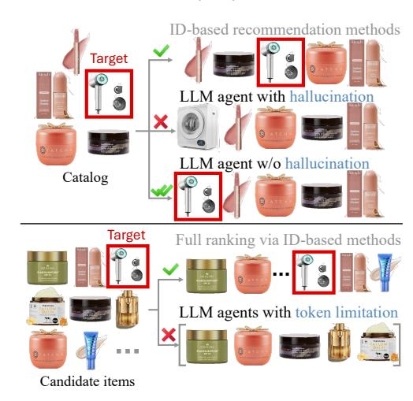
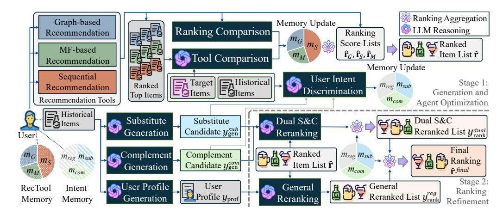
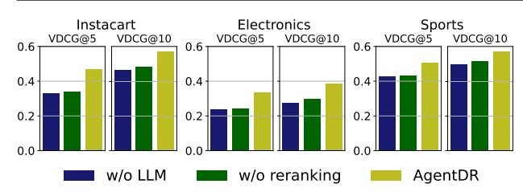
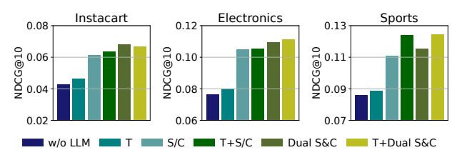
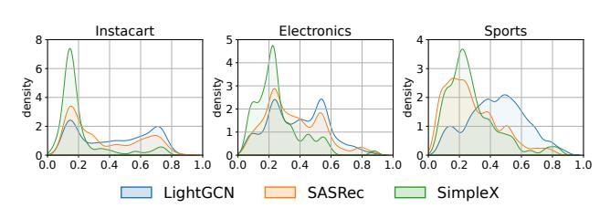

# AgentDR: Dynamic Recommendation with Implicit Item-Item Relations via LLM-based Agents

Mingdai Yang myang72@uic.edu Univ. of Illinois Chicago Chicago, IL, USA

Nurendra Choudhary nurendc@amazon.com Amazon Mountain View, CA, USA

Jiangshu Du jiangshd@amazon.com Amazon Mountain View, CA, USA

Edward W Huang ewhuang@amazon.com Amazon Mountain View, CA, USA

Philip Yu psyu@uic.edu Univ. of Illinois Chicago Chicago, IL, USA

Karthik Subbian ksubbian@amazon.com Amazon Mountain View, CA, USA

Danai Koutra∗ dkoutra@umich.edu University of Michigan Ann Arbor, MI, USA

## Abstract

Recent agent-based recommendation frameworks aim to simulate user behaviors by incorporating memory mechanisms and prompting strategies, but they struggle with hallucinating non-existent items and full-catalog ranking. Besides, a largely underexplored opportunity lies in leveraging LLMs' commonsense reasoning to capture user intent through substitute and complement relationships between items, which are usually implicit in datasets and difficult for traditional ID-based recommenders to capture. In this work, we propose a novel LLM-agent framework, AgentDR, which bridges LLM reasoning with scalable recommendation tools. Our approach delegates full-ranking tasks to traditional models while utilizing LLMs to (i) integrate multiple recommendation outputs based on personalized tool suitability and (ii) reason over substitute and complement relationships grounded in user history. This design mitigates hallucination, scales to large catalogs, and enhances recommendation relevance through relational reasoning. Through extensive experiments on three public grocery datasets, we show that our framework achieves superior full-ranking performance, yielding on average a twofold improvement over its underlying tools. We also introduce a new LLM-based evaluation metric that jointly measures semantic alignment and ranking correctness.

## CCS Concepts

- Information systems → Retrieval models and ranking.

## Keywords

Agents; Recommender Systems; Large Language Models

#### ACM Reference Format:

Mingdai Yang, Nurendra Choudhary, Jiangshu Du, Edward W Huang, Philip Yu, Karthik Subbian, and Danai Koutra. 2026. AgentDR: Dynamic Recommendation with Implicit Item-Item Relations via LLM-based Agents. In Proceedings of the ACM Web Conference 2026 (WWW '26), April 13–17,

∗Danai Koutra holds concurrent appointments as an Amazon Scholar and a Professor at UM. This paper describes work performed at Amazon.

[This work is licensed under a Creative Commons Attribution 4.0 International License.](https://creativecommons.org/licenses/by/4.0) WWW '26, Dubai, United Arab Emirates.

© 2026 Copyright held by the owner/author(s). ACM ISBN 979-8-4007-2307-0/2026/04 <https://doi.org/10.1145/3774904.3792304>

Figure 1: There are two major drawbacks in directly deploying LLMs for recommendation: hallucination and token limitation. AgentDR addresses them by delegating full-ranking tasks to recommendation tools.

2026, Dubai, United Arab Emirates. ACM, New York, NY, USA, [12](#page-11-0) pages. <https://doi.org/10.1145/3774904.3792304>

## 1 Introduction

Recommender systems provide personalized suggestions to assist users in information discovery and decision-making [\[25,](#page-8-0) [46,](#page-9-0) [47,](#page-9-1) [49\]](#page-9-2). However, traditional ID-based recommender systems [\[5,](#page-8-1) [11,](#page-8-2) [20\]](#page-8-3) solely based on user-item interactions are constrained by overlooking the rich semantic information contained in textual context. Even when LLMs are employed to encode textual features into embeddings [\[30,](#page-8-4) [40,](#page-9-3) [59\]](#page-9-4), these fixed-length representations inherently struggle to preserve the full semantic richness of textual information for recommendation [\[21,](#page-8-5) [43\]](#page-9-5). There are several attempts to harness the commonsense reasoning and knowledge utilization capabilities of LLMs by directly applying them as recommender systems, reformulating recommendation tasks as language modeling problems [\[7,](#page-8-6) [10,](#page-8-7) [12,](#page-8-8) [14\]](#page-8-9). However, an inherent gap remains because LLMs are optimized for next-token prediction in natural language rather than learning collaborative and sequential patterns from interactions, limiting their efficiency in user behavior modeling.

Given the limitations of using LLMs solely as feature encoders or standalone recommenders, recent studies have investigated leveraging LLMs as interactive agents for recommendation [\[36,](#page-9-6) [54,](#page-9-7) [55\]](#page-9-8). Rather than relying only on direct prompting with user interaction histories, these agent-based approaches integrate memory modules to preserve long-term context and better harness collaborative signals throughout the recommendation process. While LLM-based agents alleviate the representational constraints of static numerical embeddings and enable adaptive modeling of user behavior over time, they also inherit key limitations from the generative nature of LLMs. As illustrated in Fig. [1,](#page-0-0) two primary drawbacks arise in previous agent-based works when directly applying LLMs for recommendation: (i) the tendency to hallucinate non-existent items that are not part of the product catalog, and (ii) the high inference cost and token length constraints, which make them impractical for large-scale item ranking. Moreover, longer input and output sequences further increase the risk of hallucination due to attention bottlenecks and heightened generation uncertainty [\[16\]](#page-8-10).

As a result, when applied to recommendation scenarios, existing LLM-based agents [\[45,](#page-9-9) [54,](#page-9-7) [55\]](#page-9-8) typically evaluate performance by checking whether the ground-truth item, which is the next item that the user actually interacted, is correctly ranked against a small set of negative candidates. These negative candidates are items randomly sampled from the catalog that the user did not interact with during the observation window, serving as distractors in the ranking process. However, this setup is fundamentally misaligned with most real-world recommendation scenarios, where systems must select the most relevant items from massive catalogs that often contain thousands of items. Restricting the candidate set to such a small range can artificially inflate performance, overlook the complexity of large-scale ranking, and hinder the system's ability to identify truly relevant items in open-ended domains.

Besides their limitations in full-ranking, previous LLM-based agents primarily focus on modeling user preferences from explicit user-item interactions, which already can be effectively modeled by traditional embedding-based recommendation methods [\[5,](#page-8-1) [11,](#page-8-2) [26\]](#page-8-11). On the contrary, traditional models often overlook higher-level semantic relations between items that go beyond co-occurrence patterns. To address this gap, the generative capabilities and extensive world knowledge of LLMs make them particularly well-suited for reasoning over implicit relationships, such as complementarity and substitution relations. Substitutes help identify alternative options when a preferred item is unavailable or when the user seeks variety, while complements reveal co-purchase patterns that often indicate planned or contextual consumption behaviors. For example, a user purchasing a digital single-lens reflex camera often requires a tripod as a complement, whereas a user who buys tiramisu is more likely to choose cheesecake as substitute over burgers when the original item is out of stock. Although such relationships can greatly enhance recommendation quality [\[27,](#page-8-12) [41,](#page-9-10) [56\]](#page-9-11), the ground-truth labels of them are typically absent from most datasets [\[1,](#page-8-13) [28\]](#page-8-14). Furthermore, annotating item pairs with accurate relational labels often requires extensive world knowledge and nuanced understanding, making manual annotation both expensive and time-consuming. This gap highlights the potential of LLMs as an alternative source of relational knowledge. By leveraging their extensive pretraining on diverse textual data, LLMs can capture

Table 1: Comparison of recommendation approaches.

|                                         | Full Ranking | Text Feature | Generative |
|-----------------------------------------|--------------|--------------|------------|
|                                         | Evaluation   | Handling     | Reasoning  |
| Recommender based on interactions       | ✓            | ✗            | ✗          |
| LLM as Encoder                          | ✓            | ✓            | ✗          |
| LLM as Recommender                      | ✗            | ✓            | ✓          |
| LLM-Rec Agents [17, 36, 39, 45, 54, 55] | ✗            | ✓            | ✓          |
| AgentDR                                 | ✓            | ✓            | ✓          |

subtle functional relationships between items, enabling automatic discovery of substitutes and complements that would otherwise require labor-intensive human annotation.

Considering the two issues discussed above, we propose a novel LLM-based agent framework that leverages the complementary strengths of LLMs and traditional recommendation models. This framework addresses hallucination by grounding all recommendations in catalog-aware models. The reasoning ability and world knowledge of LLMs are utilized to integrate the ranking results of multiple recommendation tools and to perform fine-grained refinement of the combined ranking results, both in a personalized manner. For each user, an agent is optimized to assess the suitability of each recommendation tool by measuring the gap between the tool's outputs and the user's true preferences. In parallel, the user's intent to purchase substitutes or complements is inferred by the LLM based on the user's historical behavior. During inference, the agent first leverages the stored tool suitability to integrate the outputs from all tools, and then applies the inferred user intent to refine the combined ranking results. Building on this framework, we highlight the main contributions of our work as follows:

- Novel Framework. We propose an agent-based framework AgentDR, where LLM-based agents delegate full-ranking recommendation to recommendation tools that excel at modeling complex user behavior patterns. This separation enables the integration of the scalability and efficiency of traditional recommenders with the reasoning capabilities of LLMs.
- Item-item Reasoning. We leverage the world knowledge of LLMs for implicit item-item relationship reasoning to enhance recommendation. Each user agent generates substitute and complement candidates based on the user's historical preferences, and accordingly refines recommendation results.
- Comprehensive Evaluation. Extensive experiments verify the effectiveness of our approach in full-ranking performance on three public datasets. Besides recall and NDCG, we propose a LLM-based metric to jointly assess the semantic relevance and ordering correctness of the predicted ranking lists.

## 2 Related Work

LLM-based agents have recently demonstrated strong capabilities in using memory and reflection to learn from past experiences and simulate human-like behaviors [\[9,](#page-8-16) [22,](#page-8-17) [33,](#page-8-18) [34,](#page-8-19) [57,](#page-9-13) [58\]](#page-9-14). In the context of recommendation, LLM-based agents have been used to investigate social phenomena such as information cocoons and filter bubble effect by simulating user behaviors [\[36,](#page-9-6) [54\]](#page-9-7). Given that agent-based frameworks can offer deeper insights into user behavior by leveraging the reasoning capabilities of LLMs, there is a growing interest in applying LLM-based agents to enhance recommendation performance [\[17,](#page-8-15) [39,](#page-9-12) [45,](#page-9-9) [55\]](#page-9-8). Nonetheless, since hallucination [\[32,](#page-8-20) [53\]](#page-9-15) and token limitation remain two challenges when applying these agents to rank all items in the datasets for each user, most prior works [\[17,](#page-8-15) [36,](#page-9-6) [39,](#page-9-12) [45,](#page-9-9) [54,](#page-9-7) [55\]](#page-9-8) lack of full-ranking ability. The batch-ranking task in these works is fundamentally misaligned with most real-world scenarios, where recommender systems are required to rank relevant items from massive catalogs. And these works focus on predicting user behaviors based on user-item interactions, a signal that traditional recommendation models [\[11,](#page-8-2) [20,](#page-8-3) [26\]](#page-8-11) are already well-equipped to capture and exploit. Different from these works, our framework combines the strengths of LLMs and traditional recommenders to achieve personalized fullranking. Related works other than LLM-based agent frameworks for recommendation are discussed in Appendix [A.5.](#page-11-1) Comparison between different approaches is summarized in Table [1.](#page-1-0)

## 3 Proposed Framework: AgentDR

### 3.1 Preliminaries

3.1.1 Problem Formulation. Let I and U denote the complete item pool and the set of users in the dataset, respectively. Specifically, each user �� ∈ U is associated with a behavior sequence s = (��1,��2, . . . ,����), where ���� ∈ I denotes the ��-th item interacted with by user ��. Furthermore, each item �� ∈ I is accompanied by its corresponding textual description. For simplicity, we use desc(s) to denote the list of textual descriptions for all items from item sequences s. Given a user's historical interaction sequence s[:−�� ] and the corresponding item description list, the goal is to predict the next item ����+1 ∈ I that the user is likely to interact with. This is commonly framed as a ranking task: each user agent is expected to assign higher scores to items that better match the user's preferences, as inferred from both behavioral patterns and textual semantics. The final output is a ranked list of I tailored to this user ��. For clarity, the subscript �� will be omitted in subsequent sections, given that each user agent functions independently. 3.1.2 Recommendation Tools. AgentDR is an agent-based framework compatible with different recommendation methods as tools under the minimal assumption that they produce a full-ranking list of items. These recommendation methods are treated as tools and collectively form the tool set T. For a broad coverage of recommendation modeling strategies, we utilize three types of recommendation tools to perform recommendation tasks within AgentDR: (i) a graph-based model with output ranking score list rˆ�� ; (ii) a sequential recommendation model with output ranking score list rˆ�� ∈ R; and (iii) a MF-based model with output ranking score list rˆ�� . All these output lists are in R 1× | I |. The three model instances used in this work are elaborated in Sec. [4.1.2.](#page-5-0) These models are pretrained on the first (�� − ��) items, denoted as s[:−�� ] .

3.1.3 Framework Overview. The overall framework of AgentDR is depicted in Fig. [2.](#page-3-0) Each user agent is equipped with a profile and two memory modules (Sec. [3.2\)](#page-2-0). The agent optimization begins with prompting the LLM to generate potential substitutes and complements for each user (Sec. [3.3\)](#page-2-1). Next, the agent memory is optimized by distinct reflection mechanisms. The RecTool memory is optimized through personalized tool selection (Sec. [3.4\)](#page-3-1), while the intent memory is optimized via user intent discrimination (Sec. [3.5\)](#page-3-2). Finally, the top items from the aggregated rankings of multiple tools are refined by dual S&C reranking module (Sec. [3.6\)](#page-4-0).

#### 3.2 User Profile and Memory

3.2.1 User Profile Summarization. Explicit user profiles are usually unavailable in most public real-world datasets. Thus, we summarize the user profile from users' historical interactions by leveraging the reasoning capabilities and world knowledge of LLMs. To be concrete, we prompt the LLM to summarize the user's preference from descriptions of historical items for each user. And this preference is used as the user profile �� of each user agent:

��prof = LLMprof(desc(s)), (1)

where LLMprof(·) represents the LLM prompted to transform these texts into a coherent user profile. Due to limited space, the details of all prompts used in AgentDR are shown in Appendix [A.4.](#page-10-0)

3.2.2 User Agent Memory. In contrast to static user profiles, memories are employed to enable user agents to dynamically maintain context in response to agent optimization based on consecutive user behaviors. We equip each user agent with two compact memory modules: RecTool memory and intent memory. RecTool memory m������ ∈ R 1× | T | is a list of weights reflecting the suitability of each recommendation tool for each user, where �� is the number of recommendation tools. For LightGCN, SASRec and SimpleX deployed in this paper, we denote their weights in memory as ���� , ���� and ���� , respectively. Similarly, intent memory m������ ∈ R 1×3 contains three weights �������� , �������� and �������� , denoting the user's intent toward substitutes, complements, and other regular items, respectively. In AgentDR, RecTool memory is optimized by tool comparison and ranking comparison modules, detailed in Sec. [3.4.1](#page-3-3) and [3.4.2.](#page-3-4) Intent memory is optimized by a intent discrimination module in Sec. [3.5.](#page-3-2)

## 3.3 Substitute and Complement Generation

A key challenge in enhancing personalization through substitution and complementarity is that such relationships are usually implicit in most datasets. Annotating these pairwise relationships with LLMs across a large number of items demands substantial computational resource, as it involves O (|I|2 ) LLM inference calls. To mitigate computational overhead, AgentDR is designed to refine the top-ranked items from recommendation tools based on the substitutes and complements of the user's latest preferences. The first step in this process involves generating potential substitutes and complements based on the user's historical behaviors. Specifically, we prompt the LLM to generate a list of substitutes and a list of complements corresponding to the user's recent interests:

�� ������ gen = LLM������ gen (desc(s[− (��+�� ):−�� ])) (2) �� gen = LLM������ gen (desc(s[− (��+�� ):−�� ])), (3)

where s[− (��+�� ):−�� ] denotes the most recent �� items visible to the recommendation tools in the sequence. The textual outputs�� ������ gen and �� gen represent the generated lists of substitutes and complements, each of length ��. The functions LLM������ gen (·) and LLM������ gen (·) denote the prompt functions for generating substitutes and complements, respectively. From a complexity perspective, we reduce the LLM inference calls from O (|I|2 ) for pairwise annotation to O (|U|) for personalized intent generation. This reduction substantially enhances scalability in real-world scenarios, such as online grocery involving millions of items.

Figure 2: The framework of AgentDR: Each user agent is equipped with two memory modules: RecTool memory to store tool suitability, and intent memory to track user intent. Ranking results from recommendation tools are aggregated based on RecTool memory. The aggregated result is further refined by the dual S&C and general ranking modules.

### 3.4 Personalized Tool Selection

3.4.1 LLM-based Tool Comparison. Different users exhibit distinct behavior patterns and therefore benefit from different recommendation strategies. For instance, users who read books like Harry Potter often proceed with its sequels, making sequential recommendation models particularly effective. After finishing all the sequels, users may be interested in other fictions read by similar users, where collaborative filtering proves more suitable. To enable personalized tool selection for each user, AgentDR incorporates a tool comparison module that performs a holistic evaluation across multiple recommendation tools. In this module, the user agent is tasked with identifying the best tool based on recommended results of tools and ground-truth user preference:

zcpr = LLMcpr({desc(��top (rˆ�� , ��cpr))|�� ∈ T }, desc(s[−��:])), (4)

where the output zcpr consists of |T | binary indicators, each indicating whether tool �� provides the most relevant recommendation to the user's preference among all tools in T. For instance, �� �� cpr = 1 indicates that the LLM has selected the graph-based tool as the best match to the user's preferences. We use ��top (rˆ�� , ��cpr) to represent the sequence of top-��cpr items ranked by recommendation tool ��. Subsequence s[−��:] refers to the most recent �� user-interacted items, which are withheld from training of recommendation tools and used as ground-truth signals to optimize the agent's decision-making. The function LLMcpr(·) is used to prompt the LLM to compare the input sequences and select the tool most aligned with the user's preferences. After the LLM identifies the tool that best aligns with the user's recent preferences, the tool weight ���� ∈ {����,����,���� } in RecTool memory is updated accordingly:

���� ← ���� + �� · �� cpr, (5)

where �� is the learning rate to update RecTool memory by this module. This tool comparison remains robust even when multiple tools appear effective. It addresses two key challenges: LLMs tend to agree with any reasonable recommendation, and single-domain datasets often make all outputs appear relevant.

3.4.2 Ranking Comparison and Aggregation. Besides the LLMbased tool comparison, we also compare the ranking performance based on the ranks of the most recent �� items in each tool:

���� ← ���� + �� ∑︁ {�� �� |���� ∈s[−��:] (�� �� ) −1 Í ′ ∈ T (�� �� ′ ) −1 , (6)

where �� �� is the rank of the ��-th item from tool ��. This quantitative comparison yields a behavior-grounded signal reflecting how well each tool generalizes to unseen user preferences in s[−��:] . To obtain a comprehensive ranked list from all tools, a weighted sum is computed based on the updated RecTool memory:

rˆ = ∑︁ �� ∈ T ���� rˆ�� = ���� rˆ�� + ���� rˆ�� + ���� rˆ��, (7)

where rˆ ∈ R 1× | I | is the aggregated ranked item list. This simple yet effective rank-level ensemble strategy allows the agent to adaptively combine tools based on user-specific preferences. It also remains flexible and can be replaced by more complex list-wise combination mechanisms based on backpropagation. We implement and compare different ensemble strategies for ranking comparison and aggregation in Sec. [4.5.](#page-6-0)

## 3.5 Intent Discrimination

Understanding whether a user's next interaction is driven by substitutes, complements, or general interest is crucial for tailoring recommendations that match their intent. Traditional ID-based recommenders struggle to distinguish these patterns, as they require nuanced semantic and functional reasoning that goes beyond cooccurrence statistics. With reasoning ability of LLMs, user agents can allocate attention to the most relevant pathway while ensuring coverage of diverse user behaviors, ultimately improving ranking robustness and relevance.

3.5.1 Substitution and Complementarity. Based on implicit itemitem relationships, we first distinguish the user's potential intent between substitutes and complements. Given the substitute list �� ������ gen and the complement list �� gen generated in Sec. [3.3,](#page-2-1) we prompt the

Table 2: Dataset statistics

| Dataset       | Instacart | Electronics | Sports |
|---------------|-----------|-------------|--------|
| User #        | 6,987     | 4,966       | 10,873 |
| Item #        | 2,108     | 14,635      | 4,306  |
| Interaction # | 5,105,339 | 91,819      | 55,990 |
| Density       | 34.663%   | 0.126%      | 0.120% |

### 4.1 Experiment Settings

4.1.1 Datasets. We conduct experiments on three datasets: Instacart [\[19\]](#page-8-21), Electronics and Sports [\[2\]](#page-8-22). Electronics and Sports are two sub-datasets from public XMarket dataset [\[3\]](#page-8-23). The statistics are summarized in Table [2.](#page-5-1)

4.1.2 Tool selection. In this work, three pretrained recommendation models are used as tools within AgentDR: (1) LightGCN [\[11\]](#page-8-2), (2) SASRec [\[20\]](#page-8-3), and (3) SimpleX [\[26\]](#page-8-11). The simplicity of these tools allows us to validate the effectiveness of our framework without relying on complex architectures, aligning with our goal of maintaining a model-agnostic design.

4.1.3 Baselines. Besides the individual recommendation tools, we compare AgentDR with eight other baselines. First, other representative MF-based, diffusion-based, and sequential models are used as tradition recommendation baselines:

- (4) ENMF [\[5\]](#page-8-1) introduces mathematical optimization that enable efficient full-data MF without negative sampling.
- (5) DiffRec [\[38\]](#page-9-16) is a diffusion-based recommendation model that generates user interactions in a denoising manner.
- (6) FEARec [\[8\]](#page-8-24) enhances self-attention with frequency-aware mechanisms to capture high-frequency signals and periodic patterns for sequential recommendation.

Both tools and recommendation baselines are pretrained on the first (��−��) items of each user's interaction sequence s[:−�� ] , following the standard training protocol of sequential recommendation for fair performance comparison. Following the previous works [\[45,](#page-9-9) [55\]](#page-9-8), we also compare AgentDR with language-based approaches:

- (7) BM25 [\[31\]](#page-8-25) ranks candidates according to their textual similarity with user historical interactions.
- (8) LLMRanker [\[14\]](#page-8-9) uses the LLM as a zero-shot ranker, considering user sequential interaction histories as conditions.

In addition to these language-based baselines, we compare AgentDR against recommendation tools integrated with Retrieval-Augmented Generation (RAG). Specifically, the LLM is prompted to generate the top 20 items from the 50 candidates retrieved by each tool, conditioned on the user's behavior sequence. The same hallucination filtering mechanism from Sec. [3.6](#page-4-0) is applied for fair comparison. These baselines are represented as (9)-(11) RAGG/S/M for Light-GCN, SASRec and SimpleX, respectively. Since most prior LLMagent works [\[17,](#page-8-15) [36,](#page-9-6) [39,](#page-9-12) [45,](#page-9-9) [54,](#page-9-7) [55\]](#page-9-8) are unable to rank all items in datasets, we exclude them from the comparison table instead of reporting trivially low full-ranking performance.

4.1.4 Evaluation Metrics. Recall@{10,20} and NDCG@{10,20} are adopted for ranking performance evaluation. Additionally, we propose a novel metric that measures the semantic vicinity of the predicted item list to the ground-truth item in the following Sec. [4.2.](#page-5-2)

### 4.2 Semantic Vicinity Evaluation: VDCG

Unlike ID-based recommenders, language-based methods prioritize semantic similarity over behavioral patterns. As a result, the item lists they generate may better reflect a user's interests, even if the exact target items are absent. For example, for a user interested in a black baseball helmet, a list of baseball helmets in other colors is clearly more relevant than a list of bicycle helmets, despite both yielding zero recall and NDCG. To better capture the semantic vicinity to the user intent, we propose a new LLM-based evaluation metric, Vicinity-DCG (VDCG), which jointly assesses the semantic alignment and ranking correctness of the predicted item list.

Specifically, we prompt the LLM to rate how well each item in the recommended list aligns with the ground-truth item in terms of relevance, usefulness, and user interest. The rating scale ranges from 0 to 9, where 0 indicates an entirely unrelated item, and 9 represents a perfect semantic match between the item descriptions. These ratings are treated as relevance scores to compute the DCG [\[4\]](#page-8-26) for the list. For normalization, we divide by a customized ideal DCG, calculated from a synthetic ideal list of scores: [��, ��/2, ..., ��/2 ], where �� is the maximum relevance score minus 1, and �� is the length of the list. This ideal score distribution reflects the empirical tendency of the LLM to assign higher scores to only a few semantic-related items, following an approximately exponential decay. VDCG thus captures both the semantic vicinity and ranking quality of the predicted list with respect to the user's true intent.

## 4.3 RQ1: Ranking Performance Comparison

Performance comparison between AgentDR and other baselines are shown in Table [3.](#page-6-1) We have the following observations:

- AgentDR exhibits superior performance across all datasets. Even compared with more advanced and complex recommendation methods such as DiffRec, it has up to 33.5% improvement in recall and up to 28.4% improvement in NDCG. When compared to its own base recommendation tools such as SASRec, AgentDR consistently achieves at least 33.3% improvement across all datasets. Since AgentDR's performance is inherently dependent on the underlying tools, we expect greater performance gains when integrated with more advanced recommenders. We leave the exploration of stronger underlying tools in future works, as any resulting performance gain would not stem from our agent design and thus falls outside the scope of this study.
- Language-only methods, such as BM25 and LLMRank, underperform compared to all recommendation baselines in most scenarios. This performance gap arises from their inability to effectively capture collaborative filtering signals or sequential behavioral patterns, both of which are essential for modeling personalized user preferences in large-scale item spaces. Lacking the ability to leverage historical interaction structures, these methods rely solely on surface-level text matching or general world knowledge, which limits their performance in full-ranking recommendation.
- Compared to AgentDR, RAG-based methods such as RAG�� , fail to consistently improve recommendation performance on all the datasets through the world knowledge of LLMs. This is due to two main reasons. First, relying on a single recommender as the retrieval model leads the LLM to generate top items from a potentially biased candidate set, even if the set is larger than that

Table 3: Overall performance comparison. The best and second-best performances are in boldface and underlined.

|          | R@10   | R@20   | Instacart N@10 | N@20   | R@10   | R@20   | Electronics N@10 | N@20   | R@10   | R@20   | Sports N@10 | N@20   |
|----------|--------|--------|----------------|--------|--------|--------|------------------|--------|--------|--------|-------------|--------|
| LightGCN | 0.0500 | 0.1188 | 0.0221         | 0.0398 | 0.1188 | 0.1313 | 0.0734           | 0.0765 | 0.1438 | 0.1625 | 0.0997      | 0.1040 |
| SASRec   | 0.0875 | 0.1500 | 0.0395         | 0.0552 | 0.1188 | 0.1313 | 0.0635           | 0.0667 | 0.1000 | 0.1438 | 0.0554      | 0.0667 |
| SimpleX  | 0.0313 | 0.0500 | 0.0180         | 0.0226 | 0.1000 | 0.1063 | 0.0761           | 0.0776 | 0.1375 | 0.1563 | 0.0951      | 0.0999 |
| ENMF     | 0.1125 | 0.1750 | 0.0711         | 0.0797 | 0.1250 | 0.1312 | 0.0881           | 0.0897 | 0.1375 | 0.1438 | 0.1172      | 0.1187 |
| DiffRec  | 0.1188 | 0.1563 | 0.0773         | 0.0806 | 0.1562 | 0.1688 | 0.0971           | 0.0981 | 0.1125 | 0.1188 | 0.0875      | 0.0890 |
| FEARec   | 0.1063 | 0.1875 | 0.0639         | 0.0845 | 0.1250 | 0.1625 | 0.0627           | 0.0726 | 0.1313 | 0.1563 | 0.0732      | 0.0797 |
| BM25     | 0.0625 | 0.0875 | 0.0310         | 0.0370 | 0.1000 | 0.1313 | 0.0432           | 0.0514 | 0.1188 | 0.1250 | 0.0536      | 0.0552 |
| LLMRank  | 0.0750 | 0.1000 | 0.0373         | 0.0436 | 0.1000 | 0.1250 | 0.0503           | 0.0565 | 0.0938 | 0.1063 | 0.0458      | 0.0488 |
| RAG ��   | 0.1125 | 0.1563 | 0.0480         | 0.0594 | 0.1125 | 0.1438 | 0.0715           | 0.0748 | 0.1125 | 0.1188 | 0.0750      | 0.0768 |
| RAG ��   | 0.0688 | 0.1063 | 0.0312         | 0.0405 | 0.1063 | 0.1188 | 0.0575           | 0.0605 | 0.1375 | 0.1625 | 0.0852      | 0.0913 |
| RAG ��   | 0.0750 | 0.1125 | 0.0335         | 0.0427 | 0.0875 | 0.1250 | 0.0517           | 0.0613 | 0.1125 | 0.1375 | 0.0823      | 0.0871 |
| AgentDR  | 0.1563 | 0.2000 | 0.0796         | 0.0907 | 0.1688 | 0.2000 | 0.1180           | 0.1260 | 0.1750 | 0.2063 | 0.1247      | 0.1326 |
| Improv.  | 33.50% | 6.67%  | 2.98%          | 7.34%  | 8.07%  | 18.48% | 21.52%           | 28.44% | 21.67% | 26.95% | 6.40%       | 11.71% |

used in AgentDR. Second, the behavior sequences fed to the LLM consist of item descriptions. These descriptions usually contain noises, such as abbreviations or symbols, that carry little to no preference-relevant information. In contrast, AgentDR reranks a smaller but higher-confidence candidate set aggregated from multiple recommendation tools and reasons over a summarized user profile with inferred intent, enabling more comprehensive and nuanced recommendations.

## 4.4 RQ2: VDCG Comparison

The VDCG comparison is presented in Table [4.](#page-6-2) Compared to the ranking-based evaluation results in Table [3,](#page-6-1) RAG-based methods demonstrate a much more pronounced advantage in VDCG over the base recommenders. Given their overall lower recall, this advantage primarily stems from the stronger semantic vicinity of their recommended item lists to user interests. This demonstrates that the world knowledge embedded in LLMs can be effectively harnessed to generate semantically meaningful recommendations aligned with user intent, which is especially valuable when the target item is difficult to predict from historical behavior. Similarly, language-only methods such as BM25 and LLMRank achieve competitive VDCG scores despite poor recall and NDCG performance, especially in the Electronics and Sports where item descriptions tend to be longer and more semantically distinguishable. In contrast, the relatively low VDCG scores of interaction-based recommenders in these datasets reveal a limitation not captured by standard recall or NDCG metrics. In real-world e-commercial services, a lack of semantic relevance in recommended lists may undermine user trust more severely than occasional misses. Addressing this gap, AgentDR actively reasons over implicit item-item relations, resulting in the highest overall semantic and ranking alignment, as reflected by its VDCG.

In Fig. [3,](#page-6-3) we further examine the contribution of the LLM-based reasoning modules to VDCG by progressively removing them from the ranking refinement and agent optimization stages. The VDCG gap between AgentDR with and without the reranking modules highlights their importance in enhancing the semantic alignment between recommended item lists and user preferences. Notably, tool

Table 4: Performance comparison on VDCG, which jointly evaluates semantic and ordering correctness.

|          | V@5    | Instacart V@10 | V@5    | Electronics V@10 | V@5    | Sports V@10 |
|----------|--------|----------------|--------|------------------|--------|-------------|
| BM25     | 0.2409 | 0.3220         | 0.2547 | 0.3188           | 0.5030 | 0.6075      |
| LLMRank  | 0.2529 | 0.3224         | 0.2180 | 0.2932           | 0.4351 | 0.5341      |
| LightGCN | 0.3144 | 0.4039         | 0.1736 | 0.2344           | 0.4541 | 0.5702      |
| SASRec   | 0.3143 | 0.4037         | 0.1748 | 0.2377           | 0.3898 | 0.4847      |
| SimpleX  | 0.3091 | 0.3984         | 0.1735 | 0.2341           | 0.4551 | 0.5884      |
| RAG ��   | 0.3363 | 0.4537         | 0.2656 | 0.3338           | 0.4119 | 0.5220      |
| RAG ��   | 0.3300 | 0.4496         | 0.2569 | 0.3257           | 0.5095 | 0.6094      |
| RAG ��   | 0.3306 | 0.4460         | 0.2100 | 0.2874           | 0.4670 | 0.5768      |
| AgentDR  | 0.4683 | 0.5743         | 0.3334 | 0.3846           | 0.5085 | 0.5743      |
| Improv.  | 39.25% | 26.53%         | 25.90% | 15.21%           | -0.20% | -5.76%      |

Figure 3: Performance of AgentDR on VDCG without LLMbased modules. The bars of w/o LLM refer to AgentDR without both reranking and tool comparison on three datasets.

comparison consistently improves VDCG, as it increases the weight of the recommendation tool that produces the most semantically relevant item list during agent optimization.

## 4.5 RQ3: Aggregation Strategy Analysis

4.5.1 Setup. The ranking comparison in Eq. [6](#page-3-6) is a simple quantitative reflection mechanism to adjust RecTool weights for personalized tool suitability. This component is flexible and can be

Table 5: Performance of different ensemble methods with and without all LLM reasoning modules from AgentDR.

|           |     | N@10   | Instacart N@20 | N@10   | Electronics N@20 | N@10   | Sports N@20 |
|-----------|-----|--------|----------------|--------|------------------|--------|-------------|
| Ensemble: | RC  | 0.0428 | 0.0633         | 0.0765 | 0.0874           | 0.0859 | 0.1009      |
| + AgentDR |     | 0.0701 | 0.0825         | 0.1149 | 0.1227           | 0.1221 | 0.1286      |
| Ensemble: | LR  | 0.0401 | 0.0638         | 0.0862 | 0.0893           | 0.0950 | 0.1060      |
| + AgentDR |     | 0.0796 | 0.0907         | 0.1136 | 0.1200           | 0.1246 | 0.1297      |
| Ensemble: | MLP | 0.0397 | 0.0635         | 0.0754 | 0.0861           | 0.1009 | 0.1056      |
| + AgentDR |     | 0.0747 | 0.0858         | 0.1071 | 0.1166           | 0.1247 | 0.1328      |
| Ensemble: | Att | 0.0473 | 0.0692         | 0.0787 | 0.0878           | 0.1000 | 0.1078      |
| + AgentDR |     | 0.0765 | 0.0844         | 0.1180 | 0.1260           | 0.1247 | 0.1326      |

replaced with alternative learning-based ensemble methods. For instance, we can train a learnable vector v ∈ R 1× | T | as adaptive tool weights for all users. This learnable vector is then list-wise multiplied by the ranking score lists rˆT ∈ R | T |× | I | of each user to obtain the aggregated ranking score list rˆ ′ ∈ R 1× | I |. Supervised training is performed using ground-truth target items in training set, with a hinge loss as the objective. To integrate this with the original framework, we normalize this rˆ ′ and rˆ from Eq. [7](#page-3-7) and add them as an updated rˆ for the following reranking.

4.5.2 Results. Table [5](#page-7-0) reports the performance of various ensemble strategies, both with and without all LLM-based reasoning modules from AgentDR. The original ranking comparison mechanism and the alternative linear model described above are denoted as RC and LR, respectively. Additionally, we explore MLP with and without attention mechanisms to capture inter-tool dependencies, as alternatives to the original ranking comparison. These variants are denoted as Att and MLP in the table. The results demonstrate that the proposed reasoning modules consistently provide significant benefits across different ensemble strategies. Although AgentDR equipped with the simplest ranking comparison mechanism already surpasses most baselines in Table [3,](#page-6-1) substituting it with more expressive ensemble methods yields up to a 13.56% improvement in NDCG. This performance gain comes at the cost of increased computational complexity during backpropagation. Among the evaluated methods, the MLP with an attention mechanism achieves the best overall performance when integrated into AgentDR, which has the the highest number of learnable parameters. We leave the exploration of potential improvement from integrating more advanced ensemble methods in the future work.

## 4.6 RQ4: Ablation Study

4.6.1 Tool Comparison and Dual S&C Reranking. We investigate the contribution of the proposed tool comparison and dual S&C reranking modules, denoted as T and Dual S&C, respetively. We also explore the effect of replacing dual S&C by a mutually exclusive substitute or complement reranking based on intent memory of each user, denoted as S/C. The general reranking module is excluded from this study. The results are shown in Fig. [4.](#page-7-1) We observe that tool comparison improves performance in most settings, while it may degrade performance on Instacart. In this dataset, the semantic differences between the grocery food lists recommended by different tools are less pronounced, providing weaker signals for LLM-based tool selection. Moreover, the dual S&C reranking

Figure 4: Ablation study on tool comparison or dual S&C reranking modules. The bars of S/C denote reranking based on substitutes or complements according to intent memory.

Table 6: Performance of different variants of AgentDR with and without general reranking.

|        | Dataset Metric | N@10   | Instacart N@20 | N@10   | Electronics N@20 | N@10   | Sports N@20 |
|--------|----------------|--------|----------------|--------|------------------|--------|-------------|
| S/C    |                | 0.0614 | 0.0740         | 0.1047 | 0.1076           | 0.1107 | 0.1174      |
| +      | General        | 0.0676 | 0.0817         | 0.1026 | 0.1120           | 0.1109 | 0.1190      |
| T+S/C  |                | 0.0634 | 0.0794         | 0.1054 | 0.1136           | 0.1238 | 0.1320      |
| +      | General        | 0.0626 | 0.0800         | 0.1055 | 0.1149           | 0.1244 | 0.1323      |
| Dual   | S&C            | 0.0682 | 0.0805         | 0.1095 | 0.1174           | 0.1155 | 0.1203      |
| +      | General        | 0.0684 | 0.0824         | 0.1050 | 0.1109           | 0.1190 | 0.1238      |
| T+Dual | S&C            | 0.0666 | 0.0793         | 0.1112 | 0.1211           | 0.1240 | 0.1307      |
| +      | General        | 0.0701 | 0.0825         | 0.1149 | 0.1227           | 0.1221 | 0.1286      |

consistently outperforms reranking based on either substitutes or complements alone across all settings, highlighting the advantage of a more comprehensive reranking strategy.

4.6.2 General Reranking. The general reranking module in Sec. [3.5.3](#page-4-1) refines recommendation lists based on summarized user preferences, independent of substitution and complementarity signals. In Table [6,](#page-7-2) we compare the performance of AgentDR with and without this module under different reranking settings. The results show that general reranking consistently improves performance in most cases, and all best results across the three datasets are achieved with this module enabled, confirming the importance of general preference signals in complementing intent-specific reasoning. Since the corresponding intent identification module in Eq. [9](#page-4-2) accounts for one-third of all inference calls during agent optimization, it can be optionally deactivated to save computational resources in this flexible agent framework, without sacrificing the general preference signals. In such cases, �������� is set as a constant regularization coefficient shared across all users in the dataset.

## 5 Conclusion

In this work, we propose a novel LLM-based agent framework, AgentDR, for full-ranking recommendation. The commonsense world knowledge of the LLM is utilized to infer user intent regarding substitutes and complements. A limitation of this work is that substitution and complementarity relationships are more prevalent in domains like groceries than in others such as movies or music.

## Acknowledgements

This work is supported in part by NSF under grants III-2106758, and POSE-2346158.

### References

[1] Hamed Bonab, Mohammad Aliannejadi, Ali Vardasbi, Evangelos Kanoulas, and James Allan. 2021. Cross-Market Product Recommendation. In Proceedings of the 30th ACM International Conference on Information & Knowledge Management (Virtual Event, Queensland, Australia) (CIKM '21). Association for Computing Machinery, New York, NY, USA, 110–119. [2] Hamed Bonab, Mohammad Aliannejadi, Ali Vardasbi, Evangelos Kanoulas, and James Allan. 2021. Cross-Market Product Recommendation. In Proceedings of the 30th ACM International Conference on Information & Knowledge Management. ACM.<https://xmrec.github.io/> [3] Hamed R. Bonab, Mohammad Aliannejadi, Ali Vardasbi, Evangelos Kanoulas, and James Allan. 2021. Cross-Market Product Recommendation. In CIKM '21: The 30th ACM International Conference on Information and Knowledge Management, Virtual Event, Queensland, Australia, November 1 - 5, 2021. ACM, 110–119. [4] Chris Burges, Tal Shaked, Erin Renshaw, Ari Lazier, Matt Deeds, Nicole Hamilton, and Greg Hullender. 2005. Learning to rank using gradient descent. In Proceedings of the 22nd International Conference on Machine Learning (Bonn, Germany) (ICML '05). Association for Computing Machinery, New York, NY, USA, 89–96. [5] Chong Chen, Min Zhang, Yongfeng Zhang, Yiqun Liu, and Shaoping Ma. 2020. Efficient Neural Matrix Factorization without Sampling for Recommendation. ACM Trans. Inf. Syst. 38, 2 (2020), 14:1–14:28. [6] Tong Chen, Hongzhi Yin, Guanhua Ye, Zi Huang, Yang Wang, and Meng Wang. 2020. Try This Instead: Personalized and Interpretable Substitute Recommendation. In Proceedings of the 43rd International ACM SIGIR Conference on Research and Development in Information Retrieval (Virtual Event, China) (SIGIR '20). Association for Computing Machinery, New York, NY, USA, 891–900. [7] Zeyu Cui, Jianxin Ma, Chang Zhou, Jingren Zhou, and Hongxia Yang. 2022. M6- Rec: Generative Pretrained Language Models are Open-Ended Recommender Systems. CoRR abs/2205.08084 (2022). arXiv[:2205.08084](https://arxiv.org/abs/2205.08084) [8] Xinyu Du, Huanhuan Yuan, Pengpeng Zhao, Jianfeng Qu, Fuzhen Zhuang, Guanfeng Liu, Yanchi Liu, and Victor S. Sheng. 2023. Frequency Enhanced Hybrid Attention Network for Sequential Recommendation. In Proceedings of the 46th International ACM SIGIR Conference on Research and Development in Information Retrieval, SIGIR 2023, Taipei, Taiwan, July 23-27, 2023. ACM, 78–88. [9] Pengyu Gao, Jinming Zhao, Xinyue Chen, and Long Yilin. 2025. An Efficient Context-Dependent Memory Framework for LLM-Centric Agents. In Proceedings of the 2025 Conference of the Nations of the Americas Chapter of the Association for Computational Linguistics: Human Language Technologies (Volume 3: Industry Track). Association for Computational Linguistics, Albuquerque, New Mexico, 1055–1069. [10] Shijie Geng, Shuchang Liu, Zuohui Fu, Yingqiang Ge, and Yongfeng Zhang. 2022. Recommendation as Language Processing (RLP): A Unified Pretrain, Personalized Prompt & Predict Paradigm (P5). In RecSys '22: Sixteenth ACM Conference on Recommender Systems. ACM, 299–315. [11] Xiangnan He, Kuan Deng, Xiang Wang, Yan Li, Yong-Dong Zhang, and Meng Wang. 2020. LightGCN: Simplifying and Powering Graph Convolution Network for Recommendation. In Proceedings of the 43rd International ACM SIGIR conference on research and development in Information Retrieval. ACM, 639–648. [12] Zhongmou He, Jing Zhu, Shengyi Qian, Joyce Chai, and Danai Koutra. 2025. LinkGPT: Leveraging Large Language Models for Enhanced Link Prediction in Text-Attributed Graphs. In Proceedings of the 34th ACM International Conference on Information and Knowledge Management (Seoul, Republic of Korea) (CIKM '25). Association for Computing Machinery, New York, NY, USA, 843–853. [13] Kasra Hosseini, Thomas Kober, Josip Krapac, Roland Vollgraf, Weiwei Cheng, and Ana Peleteiro Ramallo. 2025. Retrieve, Annotate, Evaluate, Repeat: Leveraging Multimodal LLMs for Large-Scale Product Retrieval Evaluation. In Advances in Information Retrieval: 47th European Conference on Information Retrieval, ECIR 2025, Lucca, Italy, April 6–10, 2025, Proceedings, Part I (Lucca, Italy). Springer-Verlag, Berlin, Heidelberg, 149–163. [14] Yupeng Hou, Junjie Zhang, Zihan Lin, Hongyu Lu, Ruobing Xie, Julian J. McAuley, and Wayne Xin Zhao. 2024. Large Language Models are Zero-Shot Rankers for Recommender Systems. In Advances in Information Retrieval - 46th European Conference on Information Retrieval, ECIR 2024, Glasgow, UK, March 24-28, 2024, Proceedings, Part II (Lecture Notes in Computer Science, Vol. 14609). Springer, 364–381. [15] Feiran Huang, Yuanchen Bei, Zhenghang Yang, Junyi Jiang, Hao Chen, Qijie Shen, Senzhang Wang, Fakhri Karray, and Philip S. Yu. 2025. Large Language Model Simulator for Cold-Start Recommendation. In Proceedings of the Eighteenth ACM International Conference on Web Search and Data Mining, WSDM 2025, Hannover, Germany, March 10-14, 2025. ACM, 261–270. [16] Lei Huang, Weijiang Yu, Weitao Ma, Weihong Zhong, Zhangyin Feng, Haotian Wang, Qianglong Chen, Weihua Peng, Xiaocheng Feng, Bing Qin, and Ting Liu. 2025. A Survey on Hallucination in Large Language Models: Principles, Taxonomy, Challenges, and Open Questions. ACM Trans. Inf. Syst. 43, 2 (2025), 42:1–42:55. [17] Xu Huang, Jianxun Lian, Yuxuan Lei, Jing Yao, Defu Lian, and Xing Xie. 2025. Recommender AI Agent: Integrating Large Language Models for Interactive Recommendations. ACM Trans. Inf. Syst. (April 2025). [18] Tong Jian, Fan Yang, Zhen Zuo, Wenbo Wang, Michinari Momma, Tong Zhao, Chaosheng Dong, Yan Gao, and Yi Sun. 2022. Multi-task GNN for Substitute Identification. In Companion of The Web Conference 2022, Virtual Event / Lyon, France, April 25 - 29, 2022. ACM, 228–231. [19] Kaggle. 2022. Kaggle Datasets by Yasser H. [https://www.kaggle.com/yasserh/](https://www.kaggle.com/yasserh/datasets) [datasets](https://www.kaggle.com/yasserh/datasets) Accessed: 2026-01-25. [20] Wang-Cheng Kang and Julian J. McAuley. 2018. Self-Attentive Sequential Recommendation. In IEEE International Conference on Data Mining, ICDM 2018, Singapore, November 17-20, 2018. IEEE Computer Society, 197–206. [21] Hang Li, Tianlong Xu, Ethan Chang, and Qingsong Wen. 2025. Knowledge Tagging with Large Language Model Based Multi-Agent System. In AAAI-25, Sponsored by the Association for the Advancement of Artificial Intelligence, February 25 - March 4, 2025, Philadelphia, PA, USA. AAAI Press, 28775–28782. [22] Li Tao Li, Steven H. H. Ding, Andrew Walenstein, Philippe Charland, and Benjamin C. M. Fung. 2024. Dynamic Neural Control Flow Execution: an Agent-Based Deep Equilibrium Approach for Binary Vulnerability Detection. In Proceedings of the 33rd ACM International Conference on Information and Knowledge Management, CIKM 2024, Boise, ID, USA, October 21-25, 2024. ACM, 1215–1225. [23] Jiayi Liao, Sihang Li, Zhengyi Yang, Jiancan Wu, Yancheng Yuan, Xiang Wang, and Xiangnan He. 2024. LLaRA: Large Language-Recommendation Assistant. In Proceedings of the 47th International ACM SIGIR Conference on Research and Development in Information Retrieval, SIGIR 2024, Washington DC, USA, July 14-18, 2024. ACM, 1785–1795. [24] Yiding Liu, Yulong Gu, Zhuoye Ding, Junchao Gao, Ziyi Guo, Yongjun Bao, and Weipeng Yan. 2020. Decoupled Graph Convolution Network for Inferring Substitutable and Complementary Items. In Proceedings of the 29th ACM International Conference on Information & Knowledge Management (Virtual Event, Ireland) (CIKM '20). Association for Computing Machinery, New York, NY, USA, 2621–2628. [25] Donald Loveland, Mingxuan Ju, Tong Zhao, Neil Shah, and Danai Koutra. 2025. On the Role of Weight Decay in Collaborative Filtering: A Popularity Perspective. In Proceedings of the 31st ACM SIGKDD Conference on Knowledge Discovery and Data Mining V.2 (KDD '25). Association for Computing Machinery, New York, NY, USA, 1975–1986. [26] Kelong Mao, Jieming Zhu, Jinpeng Wang, Quanyu Dai, Zhenhua Dong, Xi Xiao, and Xiuqiang He. 2021. SimpleX: A Simple and Strong Baseline for Collaborative Filtering. In CIKM '21: The 30th ACM International Conference on Information and Knowledge Management, Virtual Event, Queensland, Australia, November 1 - 5, 2021. ACM, 1243–1252. [27] Favour Nerrise, Edward W Huang, Xiaonan Ji, Karthik Subbian, and Danai Koutra. 2025. GraFS: An Integrated GNN-LLM Approach for Inferring Best Functional Substitute Products. In Proceedings of the 34th ACM International Conference on Information and Knowledge Management (Seoul, Republic of Korea) (CIKM '25). Association for Computing Machinery, 5047–5051. [28] Jianmo Ni, Jiacheng Li, and Julian McAuley. 2019. Justifying Recommendations using Distantly-Labeled Reviews and Fine-Grained Aspects. In Proceedings of the 2019 Conference on Empirical Methods in Natural Language Processing and the 9th International Joint Conference on Natural Language Processing (EMNLP-IJCNLP). Association for Computational Linguistics, Hong Kong, China, 188–197. [29] Rastislav Papso. 2023. Complementary Product Recommendation for Long-tail Products. In Proceedings of the 17th ACM Conference on Recommender Systems (Singapore, Singapore) (RecSys '23). Association for Computing Machinery, New York, NY, USA, 1305–1311. [30] Xubin Ren, Wei Wei, Lianghao Xia, Lixin Su, Suqi Cheng, Junfeng Wang, Dawei Yin, and Chao Huang. 2024. Representation Learning with Large Language Models for Recommendation. In Proceedings of the ACM on Web Conference. ACM, 3464–3475. [31] Stephen E. Robertson and Hugo Zaragoza. 2009. The Probabilistic Relevance Framework: BM25 and Beyond. Found. Trends Inf. Retr. 3, 4 (2009), 333–389. [32] Yedan Shen, Kaixin Wu, Yuechen Ding, Jingyuan Wen, Hong Liu, Mingjie Zhong, Zhouhan Lin, Jia Xu, and Linjian Mo. 2025. Alleviating LLM-based Generative Retrieval Hallucination in Alipay Search. In Proceedings of the 48th International ACM SIGIR Conference on Research and Development in Information Retrieval (Padua, Italy) (SIGIR '25). Association for Computing Machinery, New York, NY, USA, 4294–4298. [33] Yuchen Shi, Guochao Jiang, Tian Qiu, and Deqing Yang. 2024. AgentRE: An Agent-Based Framework for Navigating Complex Information Landscapes in Relation Extraction. In Proceedings of the 33rd ACM International Conference on Information and Knowledge Management, CIKM 2024, Boise, ID, USA, October 21-25, 2024. ACM, 2045–2055. [34] Noah Shinn, Federico Cassano, Ashwin Gopinath, Karthik Narasimhan, and Shunyu Yao. 2023. Reflexion: language agents with verbal reinforcement learning. In Advances in Neural Information Processing Systems 36: Annual Conference on Neural Information Processing Systems 2023, NeurIPS 2023, New Orleans, LA, USA, December 10 - 16, 2023. [35] Kai Sugahara, Chihiro Yamasaki, and Kazushi Okamoto. 2024. Is It Really Complementary? Revisiting Behavior-based Labels for Complementary Recommendation. In Proceedings of the 18th ACM Conference on Recommender Systems (Bari,

- Italy) (RecSys '24). Association for Computing Machinery, New York, NY, USA, 1091–1095. [36] Lei Wang, Jingsen Zhang, Hao Yang, Zhi-Yuan Chen, Jiakai Tang, Zeyu Zhang, Xu Chen, Yankai Lin, Hao Sun, Ruihua Song, Xin Zhao, Jun Xu, Zhicheng Dou, Jun Wang, and Ji-Rong Wen. 2025. User Behavior Simulation with Large Language Model-based Agents. ACM Trans. Inf. Syst. 43, 2, Article 55 (Jan. 2025), 37 pages. [37] Shijie Wang, Wenqi Fan, Yue Feng, Lin Shanru, Xinyu Ma, Shuaiqiang Wang, and Dawei Yin. 2025. Knowledge Graph Retrieval-Augmented Generation for LLM-based Recommendation. In Proceedings of the 63rd Annual Meeting of the Association for Computational Linguistics (Volume 1: Long Papers). Association for Computational Linguistics, Vienna, Austria, 27152–27168. [38] Wenjie Wang, Yiyan Xu, Fuli Feng, Xinyu Lin, Xiangnan He, and Tat-Seng Chua. 2023. Diffusion Recommender Model. In Proceedings of the 46th International ACM SIGIR Conference on Research and Development in Information Retrieval, SIGIR 2023, Taipei, Taiwan, July 23-27, 2023. ACM, 832–841. [39] Yancheng Wang, Ziyan Jiang, Zheng Chen, Fan Yang, Yingxue Zhou, Eunah Cho, Xing Fan, Yanbin Lu, Xiaojiang Huang, and Yingzhen Yang. 2024. RecMind: Large Language Model Powered Agent For Recommendation. In Findings of the Association for Computational Linguistics: NAACL 2024. Association for Computational Linguistics, Mexico City, Mexico, 4351–4364. [40] Wei Wei, Xubin Ren, Jiabin Tang, Qinyong Wang, Lixin Su, Suqi Cheng, Junfeng Wang, Dawei Yin, and Chao Huang. 2024. LLMRec: Large Language Models with Graph Augmentation for Recommendation. In Proceedings of the 17th ACM International Conference on Web Search and Data Mining. ACM, 806–815. [41] Huizi Wu, Cong Geng, and Hui Fang. 2023. Session-based recommendation by exploiting substitutable and complementary relationships from multi-behavior data. Data Min. Knowl. Discov. 38, 3 (Dec. 2023), 1193–1221. [42] Junda Wu, Cheng-Chun Chang, Tong Yu, Zhankui He, Jianing Wang, Yupeng Hou, and Julian J. McAuley. 2024. CoRAL: Collaborative Retrieval-Augmented Large Language Models Improve Long-tail Recommendation. In Proceedings of the 30th ACM SIGKDD Conference on Knowledge Discovery and Data Mining, KDD 2024, Barcelona, Spain, August 25-29, 2024. ACM, 3391–3401. [43] Shirley Wu, Shiyu Zhao, Qian Huang, Kexin Huang, Michihiro Yasunaga, Kaidi Cao, Vassilis N. Ioannidis, Karthik Subbian, Jure Leskovec, and James Zou. 2024. AvaTaR: Optimizing LLM Agents for Tool Usage via Contrastive Reasoning. In Advances in Neural Information Processing Systems, Vol. 37. Curran Associates, Inc., 25981–26010. [44] Da Xu, Chuanwei Ruan, Evren Korpeoglu, Sushant Kumar, and Kannan Achan. 2020. Product Knowledge Graph Embedding for E-commerce. In Proceedings of the 13th International Conference on Web Search and Data Mining (Houston, TX, USA) (WSDM '20). Association for Computing Machinery, New York, NY, USA, 672–680. [45] Wujiang Xu, Yunxiao Shi, Zujie Liang, Xuying Ning, Kai Mei, Kun Wang, Xi Zhu, Min Xu, and Yongfeng Zhang. 2025. iAgent: LLM Agent as a Shield between User and Recommender Systems. In Findings of the Association for Computational Linguistics: ACL 2025. Association for Computational Linguistics, Vienna, Austria, 18056–18084. [46] Mingdai Yang, Zhiwei Liu, Liangwei Yang, Xiaolong Liu, Chen Wang, Hao Peng, and Philip S. Yu. 2023. Group Identification via Transitional Hypergraph Convolution with Cross-view Self-supervised Learning. In Proceedings of the 32nd ACM International Conference on Information and Knowledge Management. ACM, 2969–2979. [47] Mingdai Yang, Zhiwei Liu, Liangwei Yang, Xiaolong Liu, Chen Wang, Hao Peng, and Philip S. Yu. 2023. Ranking-based Group Identification via Factorized Attention on Social Tripartite Graph. In Proceedings of the Sixteenth ACM International Conference on Web Search and Data Mining. ACM, 769–777. [48] Mingdai Yang, Zhiwei Liu, Liangwei Yang, Xiaolong Liu, Chen Wang, Hao Peng, and Philip S. Yu. 2024. Instruction-based Hypergraph Pretraining. In Proceedings of the 47th International ACM SIGIR Conference on Research and Development in Information Retrieval. ACM, 501–511. [49] Mingdai Yang, Zhiwei Liu, Liangwei Yang, Xiaolong Liu, Chen Wang, Hao Peng, and Philip S. Yu. 2024. Unified Pretraining for Recommendation via Task Hypergraphs. In Proceedings of the 17th ACM International Conference on Web Search and Data Mining. ACM, 891–900. [50] Mingdai Yang, Zhiwei Liu, Liangwei Yang, Xiaolong Liu, Chen Wang, Hao Peng, and Philip S. Yu. 2025. Training Large Recommendation Models via Graph-Language Tokens Alignment. In Companion Proceedings of the ACM on Web Conference 2025, WWW 2025, Sydney, NSW, Australia, 28 April 2025 - 2 May 2025. ACM, 1470–1474. [51] Mingdai Yang, Fan Yang, Yanhui Guo, Shaoyuan Xu, Tianchen Zhou, Yetian Chen, Simone Shao, Jia Liu, and Yan Gao. 2025. PCL: Prompt-based Continual Learning for User Modeling in Recommender Systems. In Companion Proceedings of the ACM on Web Conference 2025, WWW 2025, Sydney, NSW, Australia, 28 April 2025
- - 2 May 2025. ACM, 1475–1479.<https://doi.org/10.1145/3701716.3715589> [52] Wenting Ye, Hongfei Yang, Shuai Zhao, Haoyang Fang, Xingjian Shi, and Naveen Neppalli. 2023. A Transformer-Based Substitute Recommendation Model Incorporating Weakly Supervised Customer Behavior Data. In Proceedings of the 46th International ACM SIGIR Conference on Research and Development in Information Retrieval (Taipei, Taiwan) (SIGIR '23). Association for Computing Machinery, New York, NY, USA, 3325–3329. [53] Chung-En Yu, Brian Jalaian, and Nathaniel Bastian. 2024. Mitigating Large Vision-Language Model Hallucination at Post-hoc via Multi-agent System. Proceedings of the AAAI Symposium Series 4 (11 2024), 110–113. [54] An Zhang, Yuxin Chen, Leheng Sheng, Xiang Wang, and Tat-Seng Chua. 2024. On Generative Agents in Recommendation. In Proceedings of the 47th International ACM SIGIR Conference on Research and Development in Information Retrieval, SIGIR 2024, Washington DC, USA, July 14-18, 2024. ACM, 1807–1817. [55] Junjie Zhang, Yupeng Hou, Ruobing Xie, Wenqi Sun, Julian J. McAuley, Wayne Xin Zhao, Leyu Lin, and Ji-Rong Wen. 2024. AgentCF: Collaborative Learning with Autonomous Language Agents for Recommender Systems. In Proceedings of the ACM on Web Conference 2024, WWW 2024, Singapore, May 13-17, 2024. ACM, 3679–3689. [56] Wei Zhang, Zeyuan Chen, Hongyuan Zha, and Jianyong Wang. 2022. Learning from Substitutable and Complementary Relations for Graph-based Sequential Product Recommendation. ACM Trans. Inf. Syst. 40, 2 (2022), 26:1–26:28. [57] Runhao Zhao, Jiuyang Tang, Weixin Zeng, Ziyang Chen, and Xiang Zhao. 2024. Zero-shot Knowledge Graph Question Generation via Multi-agent LLMs and Small Models Synthesis. In Proceedings of the 33rd ACM International Conference on Information and Knowledge Management, CIKM 2024, Boise, ID, USA, October 21-25, 2024. ACM, 3341–3351. [58] Wanjun Zhong, Lianghong Guo, Qiqi Gao, He Ye, and Yanlin Wang. 2024. MemoryBank: Enhancing Large Language Models with Long-Term Memory. In Thirty-Eighth AAAI Conference on Artificial Intelligence, AAAI 2024, Thirty-Sixth Conference on Innovative Applications of Artificial Intelligence, IAAI 2024, Fourteenth Symposium on Educational Advances in Artificial Intelligence, EAAI 2014, February 20-27, 2024, Vancouver, Canada. AAAI Press, 19724–19731. [59] Jing Zhu, Yuhang Zhou, Shengyi Qian, Zhongmou He, Tong Zhao, Neil Shah, and Danai Koutra. 2025. Mosaic of Modalities: A Comprehensive Benchmark for Multimodal Graph Learning. In Proceedings of the Computer Vision and Pattern Recognition Conference (CVPR). 14215–14224. [60] Yaochen Zhu, Liang Wu, Qi Guo, Liangjie Hong, and Jundong Li. 2024. Collaborative Large Language Model for Recommender Systems. In Proceedings of the ACM on Web Conference 2024, WWW 2024, Singapore, May 13-17, 2024. ACM, 3162–3172. A Appendix A.1 Implementation Details Since most item titles in the three grocery datasets used in experiments are self-explainable, we use titles as textual descriptions of items and remove all the items without titles. For each dataset, users' interactions are chronologically organized based on timestamps to construct user behavior sequences. Since our framework delegates full-ranking sequential recommendation tasks to existing models, we follow the same data preprocessing strategy in previous works [\[11,](#page-8-2) [20,](#page-8-3) [26\]](#page-8-11) to remove cold-start users and items. The recommendation tools are pretrained on the first (�� − ��) items of each user's interaction sequence s[:−�� ] , following the standard training protocol in recommendation where models learn from early interactions and are evaluated on their ability to predict future behaviors. This setup ensures consistency across tools and enables fair performance comparison between our framework and other recommendation baselines. A grid search is applied for searching learning rates ��, �� and �� in {1e-3, 5e-3, 1e-2, 5e-2, 1e-1}. To mitigate overfitting, each learning rate is multiplied by a decay factor of 0.8 after every optimization epoch. The number of historical items �� used for substitute and complement generation is set to 10. Following the training scheme in sequential recommendation, the number of target items �� is set to 1 during optimization. Since the evaluation metrics consider at most top 20 items, the number of reranking candidates �� ′ is fixed at 20. All experiments are conducted using the Phi-4 language model, deployed locally with vLLM on eight Tesla V100 GPUs, each with 32 GB of VRAM. The temperature is set to 0 to ensure deterministic outputs. Aside from the complexity

of the recommendation tools described in Sec. [3.1.2,](#page-2-3) the quantized

version of a single Phi-4 model requires less than 12 GB of VRAM. Following prior LLM-agent works [\[17,](#page-8-15) [36,](#page-9-6) [55\]](#page-9-8), we train the recommendation tools on the entire training set, and randomly sample 160 agents for optimization on each dataset.

## A.2 Cost Analysis

The total LLM API calls in AgentDR consist of three parts: generation, agent optimization, and reranking. Generation (Eq. [1,](#page-2-4) Eq. [2](#page-2-5) and Eq. [3\)](#page-2-6) and reranking (Eq. [10,](#page-4-3) Eq. [12,](#page-4-4) and Eq. [13\)](#page-4-5) contain 6 calls per user. Each epoch in agent optimization contains 3 calls (Eq. [4,](#page-3-8) Eq. [8](#page-4-6) and Eq. [11\)](#page-4-7) per user. Hence, the total number of calls is 6�� + 3���� where �� and �� are the numbers of users and epochs, respectively. With all the agent memory updated, AgentDR takes less than 1 second to generate the final ranking list for each user. We acknowledge that LLM-based agents generally have higher inference latency than embedding-based recommendation models, but they are still practical for offline ranking or secondary-stage recommendation pipelines.

## A.3 Agent Memory Visualization

We visualize the RecTool memories after agent optimization in Fig. [5.](#page-10-1) Kernel density estimation (KDE) plots are used to show the weight distributions of different tools for all users in the three datasets. The x-axis represents the value of the tool weight, while the y-axis reflects the density of that value. The results show that SimpleX receives lower weights than LightGCN and SASRec on Instacart and Electronics, suggesting that its low-rank factorization captures fewer semantically aligned items, whereas the latter models leverage high-order collaborative signals and temporal ordering to produce more relevant recommendations. This pattern aligns with the low VDCG of SimpleX on these two datasets in Table [4.](#page-6-2)

## A.4 Details of Prompts

The detailed contents of prompts used in AgentDR are shown from Table [7](#page-10-2) to Table [13.](#page-11-2) The prompts for VDCG evaluation is shown in Table [14.](#page-11-3)

#### [Instruction]

Summarize the user's preference based on the historical items this user

purchased under Electronics on Amazon.

[Historical Items] {item\_descriptions}

Table 7: Prompts for LLMprof(·) in Eq. [1](#page-2-4) to summarize users' preferences.

Figure 5: The KDE plot visualizing the distributions of Rec-Tool memory in all user agents after optimization.

#### [Instruction]

According to the historical items purchased by a user, generate 20 substitutes of these items under Electronics on Amazon. [Historical Items] {item\_descriptions} The output must be one list of item titles in length of 20, separated by lines.

Table 8: Prompts for LLM������ gen(·) in Eq. [2](#page-2-5) to generate substitutes. Similar prompts are used for LLM������ gen (·) in Eq. [3](#page-2-6) to generate complements.

### [Instruction]

Under Electronics on Amazon, according to the descriptions of items in three groups A, B and C, evaluate which group the target item is most

relevant to. [Group A] {item\_descriptions} [Group B] {item\_descriptions} [Group C] {item\_descriptions} [Target Item] {target\_item\_description}

The output must be one single character in {A, B, C} denoting the most

relevant group.

Table 9: Prompts for LLMcpr (·) in Eq. [4](#page-3-8) to select the tool most aligned with the user's ground-truth interest.

[Instruction]

Given the two groups of items under Electronics on Amazon, evaluate

which group is more relevant to the target item.

[Group 1] {item\_descriptions} [Group 2] {item\_descriptions} [Target Item] {target\_item\_description}

The output must be one single number in {1, 2} denoting the more

relevant group.

Table 10: Prompts for LLMdcm(·) in Eq. [8](#page-4-6) to identify whether the substitute or complement list better matches the user's ground-truth interest.

[Instruction]

According to the historical items purchased by a user under Electronics on Amazon, evaluate if this user exhibits clear substitute/complement

patterns or not. [Historical Items] {item\_descriptions}

The output must be one single word in {Yes, No}.

Table 11: Prompts for LLM������ dcm(·) in Eq. [9](#page-4-2) to evaluate if user preferences exhibit clear substitute or complement patterns.

#### [Instruction]

According to the user profile, rank top-20 items this user may prefer from the candidate item list, from higher to lower probability. [User Profile] {user\_profile}

[Candidate Item List in format of (ID, description)]

{(item\_IDs, item\_descriptions)}

The output must be a list of candidate item IDs with length of 20, with

items separated by lines.

Table 12: Prompts for LLM������ rank(·) in Eq. [10](#page-4-3) to rerank candidate items based on their semantic similarity with the users' general preferences.

[Instruction] Rank top-20 items from the candidate item list based on their similarity to the target item list, from higher to lower similarity. [Target Item List ordered by priority] {item\_descriptions} [Candidate Item List in format of (ID, description)] {(item\_IDs, item\_descriptions)} The output must be a list of candidate item IDs with length of 20, with items separated by lines.

Table 13: Prompts for LLM������ rank(·) and LLM������ rank(·) in Sec. [3.6](#page-4-0) to rerank candidate items based on their semantic similarity with the potential substitutes or complements.

[Instruction] Given the same category, rate how well each item from the recommended list matches the target item based on relevance, usefulness, and user interest. [Category] {item\_category} [Target Item] {item\_description} [Recommended List] {item\_descriptions} The output must be a list of integers. Each score must be between 0 (very unrelated) and 9 (exact match).

Table 14: Prompts for the LLM to rate how well each item in the recommended list aligns with the ground-truth item for VDCG evaluation in Sec. [4.2.](#page-5-2)

## A.5 Additional Related Work

In this appendix, we discuss additional works related to ours, including research on LLM-based recommendation systems and methods for identifying substitute and complementary products.

A.5.1 LLM for Recommendation. The capabilities of traditional embedding-based recommender systems remain limited when relying solely on historical interaction data. To address this limitation, prior works have incorporated LLMs either as text encoders to enrich recommendation embeddings with textual information [\[27,](#page-8-12) [30,](#page-8-4) [40,](#page-9-3) [48,](#page-9-17) [51,](#page-9-18) [59\]](#page-9-4) or as standalone recommenders by reformulating recommendation tasks as language modeling problems [\[7,](#page-8-6) [10,](#page-8-7) [12\]](#page-8-8). While these approaches leverage the world knowledge of LLMs and show advantages in cold-start scenarios [\[14,](#page-8-9) [15\]](#page-8-27), their effectiveness is constrained by the fixed dimensionality of feature vectors and the fundamental mismatch between language and behavior modeling, which hinders their ability to fully exploit interaction signals. We compare these pioneer works with LLM-based recommendation agents [\[17,](#page-8-15) [36,](#page-9-6) [39,](#page-9-12) [45,](#page-9-9) [54,](#page-9-7) [55\]](#page-9-8) in Table [1.](#page-1-0)

To tightly couple the pretrained knowledge in LLMs and ID-based behavior patterns in recommender systems, recent works introduce user and item tokens into the LLM vocab space, and align these tokens with the language space [\[23,](#page-8-28) [50,](#page-9-19) [60\]](#page-9-20). However, compared to inference-only LLM agents for recommendation, the effectiveness of this knowledge alignment with LLMs is sensitive to the amount of tunable parameters and available data. Besides, the concept of Retrieval-Augmented Generation (RAG) has been adapted for recommendation, where candidate interactions are first retrieved without LLMs and then reasoned by LLMs [\[37,](#page-9-21) [42\]](#page-9-22). Retrieval alleviates the reasoning load for LLMs by narrowing the candidate space, but the overall performance is influenced by the inherent biases of the specific deployed retrieval method. In contrast, LLM agents usually leverage multiple tools to enhance the performance on the target task, like AgentDR equipped with full-ranking tools for recommendation.

A.5.2 Substitution and Complementarity. Although substitution and complementarity as item-item relations play a crucial role in understanding user intent [\[27,](#page-8-12) [41,](#page-9-10) [56\]](#page-9-11), they are unavailable in most public datasets [\[1,](#page-8-13) [28\]](#page-8-14). As a result, previous works [\[6,](#page-8-29) [24,](#page-8-30) [44\]](#page-9-23) constructed these labels from co-view and co-purchase logs of users due to the inefficiency of rigorous label annotation by human annotator. However, many item-pairs labeled based on these behavior logs are not functionally substitution or complementary [\[18,](#page-8-31) [35,](#page-8-32) [52\]](#page-9-24). To address this gap, LLMs have been applied for labeling substitution and complementary relations in previous works [\[13,](#page-8-33) [29\]](#page-8-34), indicating that their extensive world knowledge make LLMs particularly wellsuited for reasoning over these implicit item-item relationships in e-commerce datasets. In AgentDR, these relationships are leveraged during intent discrimination and relational reranking to enhance recommendation relevance.