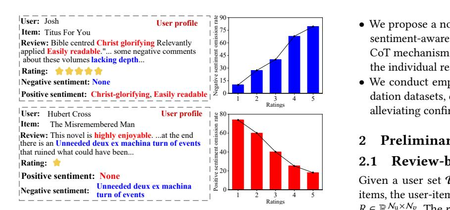
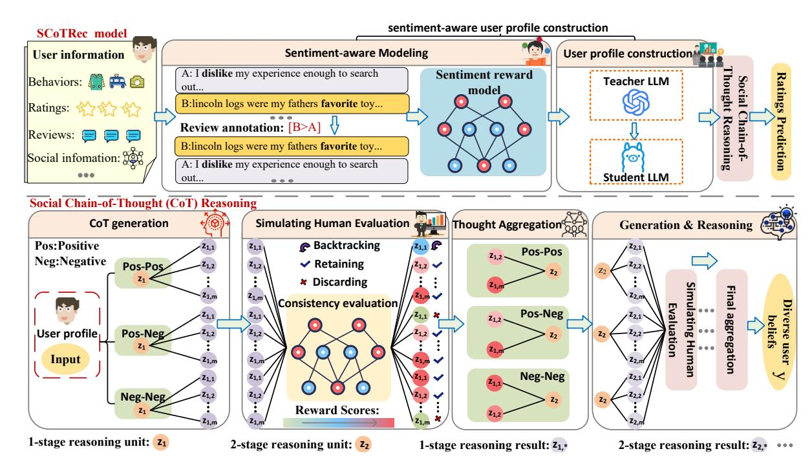
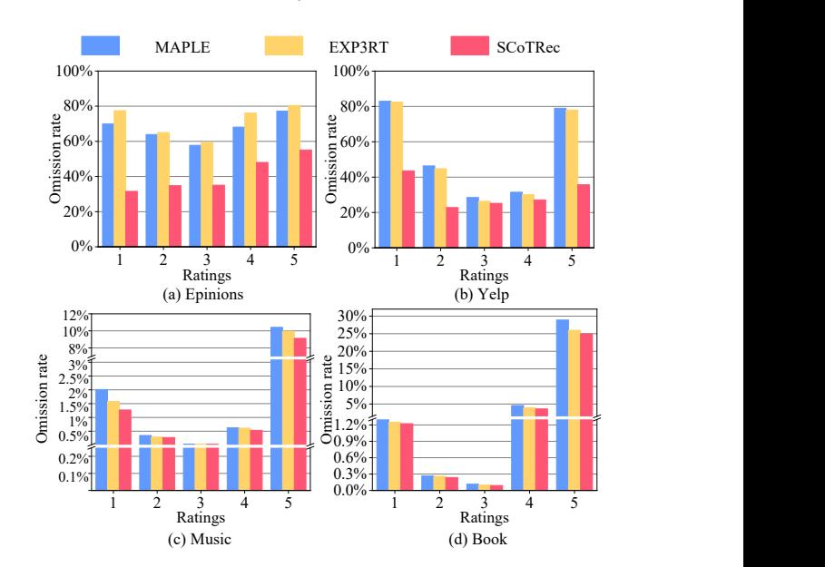

# ScotRec: Social Chain-of-Thought LLM Reasoning for Recommendation

[Kaibei Li](https://orcid.org/0009-0008-8250-4822) University of Electronic Science and Technology of China Chengdu, China 202511081738@std.uestc.edu.cn

[Jie Zou](https://orcid.org/0000-0002-0181-778X)∗ University of Electronic Science and Technology of China Chengdu, China jie.zou@uestc.edu.cn

[Qika Lin](https://orcid.org/0000-0001-5650-0600) National University of Singapore Singapore, Singapore qikalin@foxmail.com

[Weikang Guo](https://orcid.org/0000-0003-3532-6943)∗ Southwestern University of Finance and Economics Chengdu, China guowk@swufe.edu.cn

[Qinyang He](https://orcid.org/0009-0009-1909-4055) Chongqing University of Technology Chongqing, China QinyangHe@stu.cqut.edu.cn

[Yang Yang](https://orcid.org/0000-0002-5070-4511) University of Electronic Science and Technology of China Chengdu, China yang.yang@uestc.edu.cn

## Abstract

Large language models (LLMs) have emerged as a promising paradigm for recommender systems, due to their powerful capabilities in global knowledge integration and reasoning. However, LLMs are inherently prone to confirmation bias – the tendency to favor information that reinforces users' existing views – which leads to an overemphasis on previously shown viewpoints and ignores diverse user beliefs for recommendations. To address this issue, in this paper, we propose SCoTRec, a social chain-of-thought reasoning framework for recommendation. SCoTRec first constructs sentiment-aware user profiles by extracting sentiment terms from user reviews. It then incorporates users' social sentiment information into the social chain-of-thought reasoning units to improve recommendations. In particular, we categorize the social chain-ofthought into sentiment-based pathways and apply human evaluation operations – backtracking, discarding, retaining, and aggregating – to simulate nuanced sentiment cognition and interpersonal influence, effectively alleviating confirmation bias. Extensive experiments on four benchmark datasets demonstrate the effectiveness of SCoTRec in alleviating confirmation bias and improving recommendations.

# CCS Concepts

### • Information systems → Recommender systems.

# Keywords

Social Networks, Large Language Model, Chain of Thought, Recommender Systems.

### ACM Reference Format:

Kaibei Li, Jie Zou, Qika Lin, Weikang Guo, Qinyang He, and Yang Yang. 2026. ScotRec: Social Chain-of-Thought LLM Reasoning for Recommendation.

∗Corresponding author

[This work is licensed under a Creative Commons Attribution-NonCommercial-](https://creativecommons.org/licenses/by-nc-nd/4.0)[NoDerivatives 4.0 International License.](https://creativecommons.org/licenses/by-nc-nd/4.0)

WWW '26, Dubai, United Arab Emirates © 2026 Copyright held by the owner/author(s). ACM ISBN 979-8-4007-2307-0/2026/04 <https://doi.org/10.1145/3774904.3792313>

In Proceedings of the ACM Web Conference 2026 (WWW '26), April 13–17, 2026, Dubai, United Arab Emirates. ACM, New York, NY, USA, [10](#page-9-0) pages. <https://doi.org/10.1145/3774904.3792313>

# 1 Introduction

Recommender systems (RSs) [\[3,](#page-8-0) [21,](#page-8-1) [23,](#page-8-2) [24,](#page-8-3) [52,](#page-9-1) [62\]](#page-9-2) play a vital role in delivering relevant information across content-rich platforms such as social media, music streaming services, and digital libraries. Among various approaches in RSs, collaborative filtering (CF) [\[2,](#page-8-4) [25,](#page-8-5) [32,](#page-8-6) [37\]](#page-8-7) stands out as a fundamental technique, which learns user and item representations from the user-item interaction matrix to infer user preferences. Despite its widespread adoption, CF struggles with the cold start problem, primarily due to the sparsity of historical interaction data.

With the rapid development of Large Language Models (LLMs), LLMs for recommendation (LLM4Rec) [\[13,](#page-8-8) [17,](#page-8-9) [31,](#page-8-10) [48\]](#page-9-3) leverages the exceptional world knowledge and reasoning capabilities of LLMs, offering a viable solution to the cold start problem. Early studies of LLM4Rec attempt to incorporate user-item collaborative information into LLMs. For instance, researchers attempt to integrate collaborative embeddings from conventional recommendation models (e.g., matrix factorization [\[22,](#page-8-11) [35\]](#page-8-12), collaborative filtering [\[19,](#page-8-13) [42\]](#page-8-14)) into the LLMs' embedding space [\[56,](#page-9-4) [57\]](#page-9-5). However, they still suffer from a major challenge for effective knowledge transfer, due to the significant differences in knowledge distribution and semantic spaces between LLMs and these traditional recommendation models. Subsequently, the LLM4Rec methods introduce a reinforcement learning mechanism based on human feedback (RLHF) [\[8,](#page-8-15) [36,](#page-8-16) [50\]](#page-9-6) to align user behavior with LLMs. Although effective to some extent, these LLM4Rec methods face the limitation of high computational demands [\[10\]](#page-8-17). To address this issue, LLM role-playing [\[44,](#page-9-7) [49\]](#page-9-8) has emerged. It leverages user profiles to generate interpretable, humanaligned content in order to enhance recommendation performance.

Although LLM role-playing methods humanize the "algorithm", most existing methods for recommendation do not perceive the user's sentiment. Moreover, most existing LLM role-playing methods with user profiles overlook the susceptibility of LLMs to confirmation bias [\[15,](#page-8-18) [20,](#page-8-19) [38\]](#page-8-20). That is, the feedback loop in LLMs tends to prioritize content that reinforces users' existing viewpoints, which

Figure 1: Illustration of confirmation bias in LLM4Rec.

leads to an overemphasis on previously shown viewpoints and ignores diverse user beliefs for recommendations. For example, as shown in Figure [1,](#page-1-0) when we ask the LLM (i.e., LLaMA 3.1-8B [\[43\]](#page-8-21)) to take user subjective ratings into account and extract both positive and negative sentiment factors from user reviews, the model identifies only one type of sentiment (either positive or negative) rather than both. This indicates that the LLM tends to rely on the given rating and automatically overlooks different user perspectives toward the same item. We then conducted a further analysis of the LLM's sentiment omission rates across different rating levels. The results reveal a clear pattern: as ratings become higher (e.g., rating = 5), the model increasingly ignores negative sentiment factors and favors positive sentiment (high blue bars vs. low red bars); conversely, for lower ratings (e.g., rating = 1), it is more likely to overlook positive sentiment and favor negative sentiment (low blue bars vs. high red bars). This suggests that the feedback loop in LLM4Rec amplifies the effect of confirmation bias (favoring positive or negative), leading to an overestimation of users' viewpoints and degrading recommendation performance.

To address these issues, we propose an innovative LLM roleplaying method, which integrates the Social Chain-of-Thought (CoT) paradigm for Recommendation, called SCoTRec. SCoTRec mainly consists of two stages: sentiment-aware user profile construction and social CoT reasoning. Given that the reward system of the human brain is highly dependent on interactions with others and providing sentiment feedback [\[59\]](#page-9-9), we first construct a sentiment-aware user profile by extracting sentiments from user reviews. Then, we introduce users' social network and propose a social CoT framework to incorporate social sentiment feedback into each reasoning unit. Specifically, we divide the social CoT reasoning into sentiment-based paths (e.g., positive-positive, negativepositive, negative-negative) and implement operations such as "backtracking", "discarding", "retaining", and "aggregating" to simulate human-like sentiment cognition and interpersonal influence. By modeling diverse user beliefs based on the sentiments of users' social networks, SCoTRec effectively alleviates the confirmation bias in the LLM feedback loop. We summarize the main contributions of this paper as follows:

- We observe the confirmation bias in the LLM4Rec feedback loop and provide an effective solution to address it.

- We propose a novel LLM4Rec method, SCoTRec, which builds sentiment-aware user profiles and introduces a pioneering social CoT mechanism that integrates social sentiment feedback into the individual reasoning process.
- We conduct empirical experiments on four public recommendation datasets, demonstrating the effectiveness of SCoTRec in alleviating confirmation bias and improving recommendations.

### 2 Preliminary

### 2.1 Review-based LLM for Recommendation

Given a user set U with Nu users and an item set V with N�� items, the user-item interaction is represented by the rating matrix �� ∈ R Nu×N�� . The ����,�� ∈ �� (e.g., ��=1, 2, 3, 4, 5) denotes the explicit rating given by user �� to item ��. Concurrently, the review set is T = R Nu×N�� , where each element ����,�� ∈ T represents the review of user �� on item ��. The primary task is to predict the user ratings [\[18,](#page-8-22) [44,](#page-9-7) [51,](#page-9-10) [58\]](#page-9-11), where the LLM (�������� ) learns the mapping to predict unobserved ratings ��ˆ���� for items that users have not yet reviewed as accurately as possible:

�������� : (��, ��, ����,�� ) → ��ˆ��,�� . (1)

The predicted ratings are then used for scores to recommend items to the user.

### 2.2 Chain of Thought Reasoning

CoT reasoning [\[5,](#page-8-23) [47,](#page-9-12) [53,](#page-9-13) [55\]](#page-9-14) is a technique that prompts LLMs to generate a series of intermediate reasoning units before arriving at the final answer. Given an input ��, the intermediate thought units ��1, ��2, . . . , ���� are generated sequentially, with each �� conditioned on the input �� and all previous thoughts. This process is expressed as:

z��+1 = arg max ���� (��|��, ��1, . . . , ����). (2)

Finally, the output �� is derived from the entire sequence of thoughts, conditioned on the input �� and all the reasoning units ��1, ��2, . . . , ����+1. This is expressed as:

�� = arg max ���� (��|��, ��1, . . . , ����+1). (3)

Where the output distribution of an LLM parameterized by �� is denoted by ���� . This formulation shows that the reasoning process involves a series of reasoning units where the intermediate thoughts are generated in a sequential manner, and the final output �� is determined by maximizing the conditional probability based on the complete reasoning path.

### 3 Methodology

In this section, we present the proposed method SCoTRec, which consists of three main modules: 1) sentiment-aware modeling, 2) user profile construction, and 3) social CoT reasoning. The first module focuses on modeling sentiment from user reviews, and the second focuses on constructing user profiles. The third module simulates human evaluation and interpersonal influence to reason the positive and negative traits of items for recommendations. The overall framework is illustrated in Figure [2.](#page-2-0)

|               | Final Aggregation Prompt                                     |
|---------------|--------------------------------------------------------------|
| <Instruction> | The following are the speculations and reasons for           |
| whether       | users like new items under different emotions, please ana   |
| lyze          | their reasonableness and merge the three paragraphs into one |
| paragraph.    | Give you rationale in one paragraph.                         |
| <Speculation  | and Reason>                                                  |
| 1.            | {input1}                                                     |
| 2.            | {input2}                                                     |
| 3.            | {input3}                                                     |

Table 1: Statistics of the Datasets

| Dataset  | # Users | # Items # | Interactions | # Social Ties |
|----------|---------|-----------|--------------|---------------|
| Epinions | 14,680  | 233,261   | 447,312      | 632,144       |
| Yelp     | 99,262  | 105,142   | 672,513      | 1,298,522     |
| Music    | 4,183   | 2,660     | 47,638       |               |
| Book     | 13,863  | 13,515    | 83,657       |               |

### 4.4 Implementation Details.

All experiments are conducted on an NVIDIA A6000 GPU with 48 GB of memory. We explore CoT �� values of {1, 2, 3}, reasoning results �� values of {6, 8, 10, 12}, and threshold �� values from {1, 2, . . . , 9}. Fine-tuning is performed using QLoRA on the llama-3.1-8B-Instruct model with LoRA rank 16, alpha 32, and dropout 0.1, for 3 epochs, a sequence length of 4096, and batch size 32, using the AdamW optimizer (learning rate 3e-4, 100 warmup steps). A fixed random seed of 42 ensures reproducibility. For each user, we sample five first-order neighbors for social context, label 200 reviews, and generate a 5-item review sequence. The social CoT reasoning aggregation layer is set to 2 layers.

## 4.5 Overall Performance Analysis

In this experiment, we compared the performance of different models across four datasets (Epinions, Yelp, Music, and Book) using MAE and RMSE as evaluation metrics, as shown in Table [2.](#page-5-0) The results demonstrate that the SCoTRec series of models, particularly SCoTRec-LLaMA, exhibit a significant advantage in both MAE and RMSE. Compared to traditional recommendation methods, LLMbased approaches perform well in certain scenarios, due to the extensive world knowledge and strong reasoning capabilities of LLMs. This enables them to better reason user ratings for items based on reviews, leading to more accurate recommendations. Finetuned LLaMA outperforms GPT-4o on specific datasets (e.g., Yelp and Book), as the fine-tuned model is more suited to particular tasks. Additionally, the CoT approach has made further progress by designing a process that includes more necessary factors, enabling more complex reasoning. The EXP3RT method, a relatively effective model, achieves thoughtful reasoning through multiple steps—preference extraction, matching, and prediction. However, the reasoning unit in these methods is typically a single individual, which can lead to LLMs displaying ingratiating behavior and exacerbating confirmation bias. This feedback loop prioritizes information that aligns with the model's existing opinions, leading users to overestimate the popularity of their views.

SCoTRec enhances recommendation performance by modeling user sentiment and incorporating a social CoT mechanism. This design leverages users' social networks to conduct fine-grained reasoning across different sentiment pathways, thereby mitigating confirmation bias. Among its variants, SCoTRec-LLaMA outperforms others, as LLaMA's fine-tuning enables a more precise perception of sentiment within specific task datasets. LLaMA demonstrates superior ability in capturing and interpreting sentiment information. In contrast, although GPT-4o is a powerful pre-trained model that

Table 2: Performance comparison on four datasets in terms of MAE and RMSE. The best results are shown in bold, and sub-optimal results are underlined. The SCoTRec-llama3.1- 8B and SCoTRec-GPT-4o are variants of our SCoTRec model.

| Method         | MAE    | Epinions RMSE | MAE    | Yelp RMSE | MAE    | Music RMSE | MAE    | Book RMSE |
|----------------|--------|---------------|--------|-----------|--------|------------|--------|-----------|
| MF             | 0.846  | 1.086         | 0.798  | 1.0711    | 0.6188 | 0.8142     | 0.6277 | 0.8565    |
| DAML           | 1.162  | 1.383         | 0.7964 | 1.0405    | 0.5703 | 0.7848     | 0.6214 | 0.8371    |
| DeepCoNN       | 0.7959 | 1.0392        | 0.8177 | 1.0785    | 0.6034 | 0.8057     | 0.6221 | 0.8403    |
| LLaMA          | 0.6643 | 0.8726        | 0.8586 | 1.126     | 0.5775 | 0.8017     | 0.6415 | 0.9528    |
| GPT-4o         | 0.6294 | 0.7764        | 0.8766 | 1.3005    | 0.7438 | 1.1069     | 0.7591 | 1.1558    |
| Rec-SAVER      | 0.5986 | 0.7014        | 0.8295 | 1.1282    | 0.6463 | 0.9262     | 0.6645 | 0.9356    |
| MAPLE          | 0.5694 | 0.6896        | 0.8543 | 1.3156    | 0.6637 | 0.9654     | 0.6854 | 0.9648    |
| EXP3RT         | 0.5781 | 0.6897        | 0.8306 | 1.2311    | 0.5608 | 0.8385     | 0.6135 | 0.9370    |
| SCoTRec-LLaMA  | 0.5333 | 0.6479        | 0.7141 | 0.9827    | 0.5253 | 0.7589     | 0.5793 | 0.8326    |
| SCoTRec-GPT-4o | 0.5337 | 0.6474        | 0.7346 | 1.027     | 0.5326 | 0.7530     | 0.5799 | 0.8531    |

Table 3: Quality evaluation of generated text. The best results are highlighted in bold, and sub-optimal results are underlined. The Gscore denotes the GPTScore metric, and BLE denotes the BLEURT metric.

| Method    | Gscore | Epinions BLE | Gscore | Yelp BLE | Gscore | Music BLE | Gscore | Book BLE |
|-----------|--------|--------------|--------|----------|--------|-----------|--------|----------|
| Rec-SAVER | 74.58  | 0.4276       | 66.43  | 0.4102   | 75.60  | 0.3652    | 72.45  | 0.4233   |
| MAPLE     | 77.42  | 0.4563       | 62.58  | 0.4036   | 73.96  | 0.3763    | 71.69  | 0.4196   |
| EXP3RT    | 76.42  | 0.4436       | 64.28  | 0.4275   | 76.22  | 0.3840    | 73.60  | 0.4373   |
| SCoTRec   | 88.56  | 0.4932       | 88.39  | 0.5128   | 89.72  | 0.5069    | 89.49  | 0.5375   |

performs well on general tasks, the fine-tuned LLaMA in our recommendation case exhibits stronger sentiment and contextual understanding, effectively integrating sentiment signals with user–item rating relationships to improve recommendation performance.

Next, we analyze the reasoning quality of SCoTRec, focusing on the results from the GPTScore and BLEURT metrics across four different datasets, as shown in Table [3.](#page-5-1) The results show that SCoTRec outperforms all other methods on both the GPTScore and BLEURT metrics across all datasets, achieving significant improvements compared to the others. This superiority can be attributed to SCoTRec's effective integration of user sentiment, and its ability to leverage diverse sentiment feedback from users' social networks, which helps alleviate confirmation bias and thereby enhances the quality of the reasoning.

# 4.6 Ablation Study

The ablation study investigates the impact of different components on the performance of SCoTRec. We include five ablation variants: 'w/o SCoT', indicating the removal of the social CoT, replaced by single chain reasoning; 'w/o SN', meaning that social network information is omitted, and users interacting with the same item are treated as having potential social relationships; 'w/o UPC', which refers to the exclusion of user profile construction, relying instead

Table 4: The ablation experiment results. The best results are shown in bold.

|         | Method | MAE    | Epinions RMSE | MAE    | Yelp RMSE | MAE    | Music RMSE | MAE    | Book RMSE |
|---------|--------|--------|---------------|--------|-----------|--------|------------|--------|-----------|
| -w/o    | SCoT   | 0.5467 | 0.6611        | 0.7596 | 1.172     | 0.5368 | 0.7583     | 0.6005 | 0.8742    |
| -w/o    | SN     | 0.5443 | 0.6591        | 0.7525 | 1.1712    |        |            |        |           |
| -w/o    | UPC    | 0.5837 | 0.7027        | 0.7756 | 1.2846    | 0.539  | 0.7638     | 0.6164 | 0.8885    |
| -w/o    | MRR    | 0.5458 | 0.6615        | 0.7438 | 1.0569    | 0.5376 | 0.7602     | 0.6127 | 0.8782    |
| -w/o    | CE     | 0.5578 | 0.6879        | 0.7596 | 1.2163    | 0.5387 | 0.7654     | 0.6156 | 0.8859    |
| SCoTRec |        | 0.5333 | 0.6479        | 0.7141 | 0.9827    | 0.5253 | 0.7589     | 0.5793 | 0.8326    |

on user interaction records and review information to build the user profile; 'w/o MRR', which means the omission of multiple reasoning result, using only a single reasoning result; 'w/o CE', which indicates that the consistency evaluation score function is not used and reasoning and aggregation is performed directly.

The results of our ablation study across four datasets in terms of MAE and RMSE metrics are shown in Table [4.](#page-6-0) Based on the experimental results, we found that removing each component led to a decline in model performance, further confirming the critical role of each important component. Without social CoT, the "w/o SCoT" model fails to integrate diverse user beliefs, causing the LLM to suffer from certainty bias and resulting in degraded recommendation performance. 'w/o SN' ignores the real social relationships between users causes the model to lose some social context, thus affecting the prediction of user preferences. 'w/o UPC' results in the worst performance, indicating that without sentiment awareness, the model relies solely on user interaction records and review information to construct user profiles, leading to a significant increase in both MAE and RMSE. This suggests that sentiment awareness is crucial for understanding user preferences and providing accurate recommendations. 'w/o MRR' shows that a single reasoning result cannot provide effective recommendations compared to using multiple reasoning results. 'w/o CE' leads to the inability to evaluate the reasoning result, and directly performing aggregation affects the quality of the reasoning results.

### 4.7 Confirmation Bias Analysis

Confirmation bias occurs when users are primarily exposed to content that aligns with their existing preferences and views, reinforcing rather than challenging their true opinions. In this section, we conduct the experiment aiming to evaluate whether SCoTRec can alleviate confirmation bias in RSs to some extent. We use the measure of omission rates of positive and negative traits at different rating levels (ranging from 1 to 5) to reflect relative confirmation bias, and compare SCoTRec with the baseline models, including the MAPLE and EXP3RT, on the four datasets. MAPLE uses a pretrained model based on T5 [\[34\]](#page-8-31) to directly extract sentiment tuples from user reviews for explanation generation. EXP3RT infers a set of user preferences (likes and dislikes) from reviews. Experimental results in Figure [3](#page-6-1) show that SCoTRec reduces the omission rate of sentiment traits compared to MAPLE and EXP3RT, with particularly significant improvements on the social datasets Epinions and Yelp. This highlights the effectiveness of leveraging the social CoT

Figure 3: The omission rate results of sentiment traits on four datasets.

to integrate diverse user perspectives within the social network for complex reasoning to some extent. Overall, SCoTRec encourages users to explore a variety of positive and negative emotional traits and reduces the reinforcement of existing opinions, effectively alleviating confirmation bias.

### 4.8 Hyperparameter Analysis

The Number of CoT. Table [5](#page-7-0) reports results for different CoT step values. With one step, the model unifies positive and negative reasoning; with two, it separates positive–positive and negative–negative chains. Performance generally improves as the number of steps increases, peaking at three. An exception occurs on the Music dataset, where two steps yield the best RMSE, likely due to its smaller size—separating positive and negative reasoning better captures sentiment relations and reduces prediction errors.

The Number of Reasoning Results. Table [6](#page-7-1) presents the results for different numbers of reasoning units. The findings indicate that as the number of reasoning results increases, the model is able to better handle and analyze the complex relationships between users and items, leading to more accurate predictions. However, when the number of reasoning results reaches a certain threshold, model performance begins to decline, indicating the occurrence of over-reasoning. In the Epinions, Yelp, and Book datasets, the model performs best when the number of reasoning results is set to 10. In contrast, on the Music dataset, MAE performs best with 10 results, while RMSE performs best with 8 results.

The Threshold of ��. Table [7](#page-7-2) presents the results for different sizes of��. Performance improves as�� increases from 1 to 5, indicating that overly permissive thresholds (small ��) allow low-quality reasoning results to be retained, harming accuracy. The best results are generally achieved around �� = 5 to 7, balancing selectivity and reasoning diversity. When �� becomes too large (e.g., 9), performance slightly

Table 5: Performance comparison of the number of CoT across four datasets. The best results are in bold.

| # CoT | MAE    | Epinions RMSE | MAE    | Yelp RMSE | MAE    | Music RMSE | MAE    | Book RMSE |
|-------|--------|---------------|--------|-----------|--------|------------|--------|-----------|
| 1     | 0.5467 | 0.6611        | 0.7596 | 1.172     | 0.5368 | 0.7583     | 0.6005 | 0.8742    |
| 2     | 0.5414 | 0.6560        | 0.7326 | 1.0942    | 0.5348 | 0.7536     | 0.6105 | 0.8842    |
| 3     | 0.5333 | 0.6479        | 0.7141 | 0.9827    | 0.5253 | 0.7589     | 0.5793 | 0.8326    |

Table 6: The number of reasoning results performance comparison across four datasets. The best results are bolded.

| # reasoning | MAE    | Epinions RMSE | MAE    | Yelp RMSE | MAE    | Music RMSE | MAE    | Book RMSE |
|-------------|--------|---------------|--------|-----------|--------|------------|--------|-----------|
| 6           | 0.5381 | 0.6534        | 0.7179 | 0.9894    | 0.5462 | 0.776      | 0.5864 | 0.8699    |
| 8           | 0.5317 | 0.6468        | 0.7141 | 0.9827    | 0.5278 | 0.7593     | 0.5823 | 0.8579    |
| 10          | 0.5333 | 0.6479        | 0.7150 | 0.9806    | 0.5253 | 0.7589     | 0.5793 | 0.8326    |
| 12          | 0.5428 | 0.6572        | 0.7277 | 0.9963    | 0.5487 | 0.7791     | 0.5808 | 0.8465    |

Table 7: The size of �� performance comparison across four datasets. The best results are bolded.

| Value of | �� MAE | Epinions RMSE | MAE    | Yelp RMSE | MAE    | Music RMSE | MAE    | Book RMSE |
|----------|--------|---------------|--------|-----------|--------|------------|--------|-----------|
| 1        | 0.6842 | 0.8392        | 0.8942 | 1.3962    | 0.6356 | 0.8764     | 0.6942 | 1.0369    |
| 2        | 0.6543 | 0.7658        | 0.8796 | 1.2960    | 0.5847 | 0.8642     | 0.6756 | 0.9652    |
| 5        | 0.5967 | 0.7265        | 0.8146 | 1.0563    | 0.5253 | 0.7589     | 0.5793 | 0.8326    |
| 7        | 0.5333 | 0.6479        | 0.7141 | 0.9827    | 0.5648 | 0.7892     | 0.6293 | 0.8756    |
| 9        | 0.5694 | 0.6052        | 0.7642 | 1.0363    | 0.5792 | 0.8142     | 0.6576 | 0.9231    |

degrades, likely due to excessive discarding of useful reasoning results.

# 4.9 Case Study

To further examine whether SCoTRec's reasoning results can mitigate confirmation bias, we conducted a case study, as shown in Figure [8.](#page-9-19) Based on the user's review and rating, it can be inferred that the user holds certain negative opinions about Baru, though such details cannot be directly derived from the review text. We compared the reasoning outputs of EXP3RT and SCoTRec. The results show that EXP3RT, relying solely on user information, extracted only positive aspects and predicted a rating of 5. In contrast, SCoTRec incorporates the user's social network information, effectively capturing both positive and negative sentiment traits toward Baru and accounting for subjective sentiment, thereby producing a more accurate prediction of rating 4.

# 5 Related Work

Review-based Recommendation. Review-based recommendation [\[7,](#page-8-32) [28,](#page-8-33) [29,](#page-8-34) [41\]](#page-8-35) typically integrates the rich information contained in reviews into the modeling of users and items. BoWLF [\[1\]](#page-8-36) utilizes a distributed bag-of-words representation of reviews to regularize the latent factors in a matrix factorization approach for collaborative filtering. Later studies, such as DeepCoNN [\[60\]](#page-9-18) and DAML [\[27\]](#page-8-28), begin to utilize graph neural networks to directly learn deep representations from raw review texts. RRM [\[59\]](#page-9-9) incorporates social network information and sentiment tendencies from reviews into the recommendation task, effectively improving rating prediction accuracy. However, these review-based recommendation methods often suffer from the cold-start problem. Different from them, our SCoTRec leverages the rich world knowledge of LLMs to extract aspect-level sentiment terms from limited reviews, thereby alleviating the cold-start problem.

LLM-based Recommendation. LLM4Rec [\[4,](#page-8-37) [6,](#page-8-38) [11,](#page-8-39) [26,](#page-8-40) [33,](#page-8-41) [40,](#page-8-42) [54,](#page-9-20) [61\]](#page-9-21) leverages the world knowledge and reasoning capabilities of LLMs to address the cold-start problem in RSs. While methods like CoLLM [\[57\]](#page-9-5) use traditional models to integrate user behaviors into LLMs, the semantic gap between LLMs and RSs poses a significant challenge to effective knowledge transfer. To address this, PrefRec [\[50\]](#page-9-6) introduces an RLHF framework to align user behaviors with LLMs, despite the high computational cost of reinforcement learning. To further reduce the reliance on reinforcement learning, role-playing approaches are then proposed to align LLMs with user behaviors through user profiles. For example, ExpertLLaMA [\[49\]](#page-9-8)uses expert profiles and real-world instructions to guide LLMs to generate highquality responses, while Rec-SAVER [\[44\]](#page-9-7) employs CoT reasoning to analyze user history and preferences, building complex and dynamic user representations for alignment. However, these models often suffer from confirmation bias. In comparison, SCoTRec effectively alleviates confirmation bias by incorporating sentiment feedback from social users into the reasoning unit.

# 6 Conclusion and Discussion

In this study, we propose SCoTRec, a recommendation method based on social CoT LLM reasoning that explores the social CoT in the LLM-based recommendation. By primarily leveraging a social CoT mechanism with sentiment-based pathways and simulating human evaluation operations, SCoTRec effectively alleviates confirmation bias.

In this paper, SCoTRec is built on social networks. When such information is unavailable, we adopt an alternative approach by treating users who interacted with the same item as potential social links (Music and Book datasets). Although SCoTRec still outperforms baseline models on these datasets, the improvements are smaller than on Epinions and Yelp, suggesting that this alternative may introduce additional noise. In future work, we aim to improve the design of CoT applications to tolerate noise in recommendations. Similar to GRSU [\[46\]](#page-9-22), generating multiple reasoning results in SCoTRec may increase computation.

# Acknowledgments

This research was supported by the National Natural Science Foundation of China under grants 62220106008 and 62402093, the Sichuan Science and Technology Program (2025ZNSFSC0479), the Fundamental Research Funds for the Central Universities (JBK202511020), and the Sichuan Science and Technology Program under Grant 2024NSFTD0034.

References [1] Amjad Almahairi, Kyle Kastner, Kyunghyun Cho, and Aaron Courville. 2015. Learning distributed representations from reviews for collaborative filtering. In Proceedings of the 9th ACM Conference on Recommender Systems. 147–154. [2] Guojia An, Jie Zou, Jiwei Wei, Chaoning Zhang, Fuming Sun, and Yang Yang. 2025. Beyond whole dialogue modeling: Contextual disentanglement for conversational recommendation. In Proceedings of the 48th International ACM SIGIR Conference on Research and Development in Information Retrieval. 31–41. [3] Xiao Ao, Shuxi Han, Yeming Li, Heli Ma, Pengfei Zhang, and Jie Zou. 2025. Retrieval Augmented Multi-agent Recommender. In Companion Proceedings of the ACM on Web Conference 2025. 2968–2972. [4] Keqin Bao, Jizhi Zhang, Wenjie Wang, Yang Zhang, Zhengyi Yang, Yanchen Luo, Chong Chen, Fuli Feng, and Qi Tian. 2025. A bi-step grounding paradigm for large language models in recommendation systems. ACM Transactions on Recommender Systems 3, 4 (2025), 1–27. [5] Maciej Besta, Nils Blach, Ales Kubicek, Robert Gerstenberger, Michal Podstawski, Lukas Gianinazzi, Joanna Gajda, Tomasz Lehmann, Hubert Niewiadomski, Piotr Nyczyk, et al. 2024. Graph of thoughts: Solving elaborate problems with large language models. In Proceedings of the AAAI Conference on Artificial Intelligence, Vol. 38. 17682–17690. [6] Lei Chen, Chen Gao, Xiaoyi Du, Hengliang Luo, Depeng Jin, Yong Li, and Meng Wang. [n. d.]. Enhancing ID-based Recommendation with Large Language Models. ACM Transactions on Information Systems ([n. d.]). [7] Yoonhyuk Choi and Fahim Tasneema Azad. 2024. Improving the Text Convolution Mechanism with Large Language Model for Review-Based Recommendation. In 2024 IEEE International Conference on Big Data (BigData). IEEE, 6977–6981. [8] Paul F Christiano, Jan Leike, Tom Brown, Miljan Martic, Shane Legg, and Dario Amodei. 2017. Deep reinforcement learning from human preferences. Advances in neural information processing systems 30 (2017). [9] Tim Dettmers, Artidoro Pagnoni, Ari Holtzman, and Luke Zettlemoyer. 2023. Qlora: Efficient finetuning of quantized llms, 2023. URL https://arxiv. org/abs/2305.14314 2 (2023). [10] Xuan Long Do, Kenji Kawaguchi, Min-Yen Kan, and Nancy Chen. 2025. Aligning Large Language Models with Human Opinions through Persona Selection and Value–Belief–Norm Reasoning. In Proceedings of the 31st International Conference on Computational Linguistics. 2526–2547. [11] Zhiang Dong, Liya Hu, Jingyuan Chen, Zhihua Wang, and Fei Wu. [n. d.]. Comprehend Then Predict: Prompting Large Language Models for Recommendation with Semantic and Collaborative Data. ACM Transactions on Information Systems ([n. d.]). [12] Yi Fang, Wenjie Wang, Yang Zhang, Fengbin Zhu, Qifan Wang, Fuli Feng, and Xiangnan He. 2025. Large Language Models for Recommendation with Deliberative User Preference Alignment. arXiv preprint arXiv:2502.02061 (2025). [13] Jingtong Gao, Bo Chen, Xiangyu Zhao, Weiwen Liu, Xiangyang Li, Yichao Wang, Wanyu Wang, Huifeng Guo, and Ruiming Tang. 2025. LLM4Rerank: LLM-based Auto-Reranking Framework for Recommendations. In Proceedings of the ACM on Web Conference 2025. 228–239. [14] Lianli Gao, Zhao Guo, Hanwang Zhang, Xing Xu, and Heng Tao Shen. 2017. Video captioning with attention-based LSTM and semantic consistency. IEEE Transactions on Multimedia 19, 9 (2017), 2045–2055. [15] Moshe Glickman and Tali Sharot. 2025. How human–AI feedback loops alter human perceptual, emotional and social judgements. Nature Human Behaviour 9, 2 (2025), 345–359. [16] Aaron Grattafiori, Abhimanyu Dubey, Abhinav Jauhri, Abhinav Pandey, Abhishek Kadian, Ahmad Al-Dahle, Aiesha Letman, Akhil Mathur, Alan Schelten, Alex Vaughan, et al. 2024. The llama 3 herd of models. arXiv preprint arXiv:2407.21783 (2024). [17] Chumeng Jiang, Jiayin Wang, Weizhi Ma, Charles LA Clarke, Shuai Wang, Chuhan Wu, and Min Zhang. 2025. Beyond Utility: Evaluating LLM as Recommender. In Proceedings of the ACM on Web Conference 2025. 3850–3862. [18] Jieyong Kim, Hyunseo Kim, Hyunjin Cho, SeongKu Kang, Buru Chang, Jinyoung Yeo, and Dongha Lee. 2025. driven Personalized Preference Reasoning with Large Language Models for Recommendation. In Proceedings of the 48th International ACM SIGIR Conference on Research and Development in Information Retrieval. 1697–1706. [19] Sein Kim, Hongseok Kang, Seungyoon Choi, Donghyun Kim, Minchul Yang, and Chanyoung Park. 2024. Large language models meet collaborative filtering: An efficient all-round llm-based recommender system. In Proceedings of the 30th ACM SIGKDD Conference on Knowledge Discovery and Data Mining. 1395–1406. [20] Hannah Rose Kirk, Bertie Vidgen, Paul Röttger, and Scott A Hale. 2024. The benefits, risks and bounds of personalizing the alignment of large language models to individuals. Nature Machine Intelligence 6, 4 (2024), 383–392. [21] Nikolaos Kondylidis, Jie Zou, and Evangelos Kanoulas. 2021. Category aware explainable conversational recommendation. arXiv preprint arXiv:2103.08733 (2021). [22] Yehuda Koren, Robert Bell, and Chris Volinsky. 2009. Matrix factorization techniques for recommender systems. Computer 42, 8 (2009), 30–37. [23] Kaibei Li, Yihao Zhang, Qinyang He, and Xiaokang Li. 2026. Leveraging hierarchyaware diffusion model and knowledge-enhanced contrastive learning for recommendation. Knowledge and Information Systems 68, 1 (2026), 34. [24] Kaibei Li, Yihao Zhang, Xiaokang Li, Meng Yuan, and Wei Zhou. 2025. Mask diffusion-based contrastive learning for knowledge-aware recommendation. IEEE Transactions on Knowledge and Data Engineering (2025). [25] Zhiwei Li, Guodong Long, Tianyi Zhou, Jing Jiang, and Chengqi Zhang. 2025. Personalized federated collaborative filtering: A variational autoencoder approach. In Proceedings of the AAAI Conference on Artificial Intelligence, Vol. 39. 18602–18610. [26] Jiayi Liao, Sihang Li, Zhengyi Yang, Jiancan Wu, Yancheng Yuan, Xiang Wang, and Xiangnan He. 2024. Llara: Large language-recommendation assistant. In Proceedings of the 47th International ACM SIGIR Conference on Research and Development in Information Retrieval. 1785–1795. [27] Donghua Liu, Jing Li, Bo Du, Jun Chang, and Rong Gao. 2019. Daml: Dual attention mutual learning between ratings and reviews for item recommendation. In Proceedings of the 25th ACM SIGKDD international conference on knowledge discovery & data mining. 344–352. [28] Fan Liu, Yaqi Liu, Huilin Chen, Zhiyong Cheng, Liqiang Nie, and Mohan Kankanhalli. 2025. Understanding Before Recommendation: Semantic Aspect-Aware Review Exploitation via Large Language Models. ACM Transactions on Information Systems 43, 2 (2025), 1–26. [29] Junrui Liu, Tong Li, Di Wu, Zifang Tang, Yuan Fang, and Zhen Yang. 2025. An Aspect Performance-aware Hypergraph Neural Network for Review-based Recommendation. In Proceedings of the Eighteenth ACM International Conference on Web Search and Data Mining. 503–511. [30] Junling Liu, Chao Liu, Peilin Zhou, Renjie Lv, Kang Zhou, and Yan Zhang. 2023. Is chatgpt a good recommender? a preliminary study. arXiv preprint arXiv:2304.10149 (2023). [31] Qidong Liu, Xian Wu, Yejing Wang, Zijian Zhang, Feng Tian, Yefeng Zheng, and Xiangyu Zhao. 2024. Llm-esr: Large language models enhancement for longtailed sequential recommendation. Advances in Neural Information Processing Systems 37 (2024), 26701–26727. [32] Weiming Liu, Chaochao Chen, Xinting Liao, Mengling Hu, Jiajie Su, Yanchao Tan, and Fan Wang. 2024. User distribution mapping modelling with collaborative filtering for cross domain recommendation. In Proceedings of the ACM Web Conference 2024. 334–343. [33] Zhongzhou Liu, Hao Zhang, Kuicai Dong, and Yuan Fang. 2024. Collaborative Cross-modal Fusion with Large Language Model for Recommendation. In Proceedings of the 33rd ACM International Conference on Information and Knowledge Management. 1565–1574. [34] Yaojie Lu, Qing Liu, Dai Dai, Xinyan Xiao, Hongyu Lin, Xianpei Han, Le Sun, and Hua Wu. 2022. Unified Structure Generation for Universal Information Extraction. In Proceedings of the 60th Annual Meeting of the Association for Computational Linguistics (Volume 1: Long Papers). 5755–5772. [35] Xin Luo, Yue Zhou, Zhigang Liu, and MengChu Zhou. 2021. Fast and accurate non-negative latent factor analysis of high-dimensional and sparse matrices in recommender systems. IEEE Transactions on Knowledge and Data Engineering 35, 4 (2021), 3897–3911. [36] Long Ouyang, Jeffrey Wu, Xu Jiang, Diogo Almeida, Carroll Wainwright, Pamela Mishkin, Chong Zhang, Sandhini Agarwal, Katarina Slama, Alex Ray, et al. 2022. Training language models to follow instructions with human feedback. Advances in neural information processing systems 35 (2022), 27730–27744. [37] Zhongyu Ouyang, Chunhui Zhang, Shifu Hou, Chuxu Zhang, and Yanfang Ye. 2024. How to improve representation alignment and uniformity in graph-based collaborative filtering?. In Proceedings of the International AAAI Conference on Web and Social Media, Vol. 18. 1148–1159. [38] Daniel E O'Leary. 2025. Confirmation and Specificity Biases in Large Language Models: An Explorative Study. IEEE Intelligent Systems 40, 1 (2025), 63–68. [39] Thibault Sellam, Dipanjan Das, and Ankur Parikh. 2020. BLEURT: Learning Robust Metrics for Text Generation. In Proceedings of the 58th Annual Meeting of the Association for Computational Linguistics. 7881–7892. [40] Yubo Shu, Haonan Zhang, Hansu Gu, Peng Zhang, Tun Lu, Dongsheng Li, and Ning Gu. 2024. RAH! RecSys–Assistant–Human: A Human-Centered Recommendation Framework With LLM Agents. IEEE Transactions on Computational Social Systems (2024). [41] Jie Shuai, Kun Zhang, Le Wu, Peijie Sun, Richang Hong, Meng Wang, and Yong Li. 2022. A review-aware graph contrastive learning framework for recommendation. In Proceedings of the 45th international ACM SIGIR conference on research and development in information retrieval. 1283–1293. [42] Zhongxiang Sun, Zihua Si, Xiaoxue Zang, Kai Zheng, Yang Song, Xiao Zhang, and Jun Xu. 2024. Large language models enhanced collaborative filtering. In Proceedings of the 33rd ACM International Conference on Information and Knowledge Management. 2178–2188. [43] Hugo Touvron, Thibaut Lavril, Gautier Izacard, Xavier Martinet, Marie-Anne Lachaux, Timothée Lacroix, Baptiste Rozière, Naman Goyal, Eric Hambro, Faisal Azhar, et al. 2023. Llama: Open and efficient foundation language models. arXiv preprint arXiv:2302.13971 (2023).

[44] Alicia Tsai, Adam Kraft, Long Jin, Chenwei Cai, Anahita Hosseini, Taibai Xu, Zemin Zhang, Lichan Hong, Ed Chi, and Xinyang Yi. 2024. Leveraging LLM Reasoning Enhances Personalized Recommender Systems. In Findings of the Association for Computational Linguistics ACL 2024. 13176–13188. [45] Jiaan Wang, Yunlong Liang, Fandong Meng, Zengkui Sun, Haoxiang Shi, Zhixu Li, Jinan Xu, Jianfeng Qu, and Jie Zhou. 2023. Is ChatGPT a Good NLG Evaluator? A Preliminary Study. In Proceedings of the 4th New Frontiers in Summarization Workshop. Association for Computational Linguistics. [46] Xiaolei Wang, Chunxuan Xia, Junyi Li, Fanzhe Meng, Lei Huang, Jinpeng Wang, Wayne Xin Zhao, and Ji-Rong Wen. 2025. Search-Based Interaction For Conversation Recommendation via Generative Reward Model Based Simulated User. In Proceedings of the 48th International ACM SIGIR Conference on Research and Development in Information Retrieval. 75–84. [47] Jason Wei, Xuezhi Wang, Dale Schuurmans, Maarten Bosma, Fei Xia, Ed Chi, Quoc V Le, Denny Zhou, et al. 2022. Chain-of-thought prompting elicits reasoning in large language models. Advances in neural information processing systems 35 (2022), 24824–24837. [48] Yibiao Wei, Jie Zou, Weikang Guo, Guoqing Wang, Xing Xu, and Yang Yang. 2025. MSCRS: Multi-modal semantic graph prompt learning framework for conversational recommender systems. In Proceedings of the 48th International ACM SIGIR Conference on Research and Development in Information Retrieval. 42–52. [49] Benfeng Xu, An Yang, Junyang Lin, Quan Wang, Chang Zhou, Yongdong Zhang, and Zhendong Mao. 2023. Expertprompting: Instructing large language models to be distinguished experts. arXiv preprint arXiv:2305.14688 (2023). [50] Wanqi Xue, Qingpeng Cai, Zhenghai Xue, Shuo Sun, Shuchang Liu, Dong Zheng, Peng Jiang, Kun Gai, and Bo An. 2023. Prefrec: Recommender systems with human preferences for reinforcing long-term user engagement. In Proceedings of the 29th ACM SIGKDD Conference on Knowledge Discovery and Data Mining. 2874–2884. [51] Ching-Wen Yang, Zhi-Quan Feng, Ying-Jia Lin, Che Wei Chen, Kun-da Wu, Hao Xu, Yao Jui-Feng, and Hung-Yu Kao. 2025. MAPLE: Enhancing Review Generation with Multi-Aspect Prompt LEarning in Explainable Recommendation. In Proceedings of the 63rd Annual Meeting of the Association for Computational Linguistics (Volume 1: Long Papers), Wanxiang Che, Joyce Nabende, Ekaterina Shutova, and Mohammad Taher Pilehvar (Eds.). Association for Computational Linguistics, Vienna, Austria, 31803–31821. [doi:10.18653/v1/2025.acl-long.1535](https://doi.org/10.18653/v1/2025.acl-long.1535) [52] Yuhan Yang, Jie Zou, Guojia An, Weikang Guo, Mingshi Yan, Yang Yang, and Heng Tao Shen. 2026. CooSBR: Rethinking neighborhood integration for sessionbased recommendation. Information Processing & Management 63, 4 (2026), 104625. [53] Shunyu Yao, Dian Yu, Jeffrey Zhao, Izhak Shafran, Tom Griffiths, Yuan Cao, and Karthik Narasimhan. 2023. Tree of thoughts: Deliberate problem solving with large language models. Advances in neural information processing systems 36 (2023), 11809–11822. [54] Yuyang Ye, Zhi Zheng, Yishan Shen, Tianshu Wang, Hengruo Zhang, Peijun Zhu, Runlong Yu, Kai Zhang, and Hui Xiong. 2025. Harnessing multimodal large language models for multimodal sequential recommendation. In Proceedings of the AAAI Conference on Artificial Intelligence, Vol. 39. 13069–13077. [55] Xuan Zhang, Chao Du, Tianyu Pang, Qian Liu, Wei Gao, and Min Lin. 2024. Chain of preference optimization: Improving chain-of-thought reasoning in llms. Advances in Neural Information Processing Systems 37 (2024), 333–356. [56] Yang Zhang, Keqin Bao, Ming Yan, Wenjie Wang, Fuli Feng, and Xiangnan He. 2024. Text-like Encoding of Collaborative Information in Large Language Models for Recommendation. In Proceedings of the 62nd Annual Meeting of the Association for Computational Linguistics (Volume 1: Long Papers). 9181–9191. [57] Yang Zhang, Fuli Feng, Jizhi Zhang, Keqin Bao, Qifan Wang, and Xiangnan He. 2025. Collm: Integrating collaborative embeddings into large language models for recommendation. IEEE Transactions on Knowledge and Data Engineering (2025). [58] Zijian Zhang, Shuchang Liu, Ziru Liu, Rui Zhong, Qingpeng Cai, Xiangyu Zhao, Chunxu Zhang, Qidong Liu, and Peng Jiang. 2025. Llm-powered user simulator for recommender system. In Proceedings of the AAAI Conference on Artificial Intelligence, Vol. 39. 13339–13347. [59] Guoshuai Zhao, Xiaojiang Lei, Xueming Qian, and Tao Mei. 2018. Exploring users' internal influence from reviews for social recommendation. IEEE transactions on multimedia 21, 3 (2018), 771–781. [60] Lei Zheng, Vahid Noroozi, and Philip S Yu. 2017. Joint deep modeling of users and items using reviews for recommendation. In Proceedings of the tenth ACM international conference on web search and data mining. 425–434. [61] Yaochen Zhu, Liang Wu, Qi Guo, Liangjie Hong, and Jundong Li. 2024. Collaborative large language model for recommender systems. In Proceedings of the ACM Web Conference 2024. 3162–3172. [62] Jie Zou, Yifan Chen, and Evangelos Kanoulas. 2020. Towards question-based recommender systems. In Proceedings of the 43rd international ACM SIGIR conference on research and development in information retrieval. 881–890. [63] Jie Zou, Ling Xu, Mengning Yang, Meng Yan, Dan Yang, and Xiaohong Zhang. 2016. Duplication detection for software bug reports based on topic model. In 2016 9th International Conference on Service Science (ICSS). IEEE, 60–65. A Appendix A.1 Case study denotes positive aspects. Review & Rating I feel that Baru is underrated. Not many people recommend it. However, I've had really delicious entrees there. I do feel that they could do better or just be more consistent with their drinks. I think one of my favorite nights on magazine ended with my husband and in laws on the baru balcony... User Ratings: 4. EXP3RT The user would appreciate the underrated charm and welcoming atmosphere of Baru, as they value hidden gems that offer memorable experiences. The cozy balcony dinner with family reflects their preference for warm, story-like moments that create lasting impressions. Their attention to both the quality of entrees and the inconsistency of drinks shows an appreciation for detail and coherence, similar to enjoying narratives with strong world-building and logical flow. Overall, the user would likely enjoy Baru for its inviting setting, flavorful dishes, and the sense of discovery that makes the visit feel special. User rating prediction results: 5. SCoTRec The user's preferences and review history suggest a likely mixed experience at Baru Bistro & Tapas. While the user values high-quality food, a pleasant dining experience, and good service—elements that are positively highlighted in the reviews of Baru Bistro & Tapas—the negative aspects, particularly regarding drink quality and service, could overshadow these positives.... Therefore, while the food quality and dessert may appeal to the user, the shortcomings in drink strength and service quality may lead to disappointment, suggesting that ... User rating prediction results: 4. A.2 Aspect-level Sentiment Terms Prompt Aspect-level sentiment terms prompt <Instruction> Based on the given example, the user's comment history for each item is divided into two parts, positive and negative. Please strictly adhere to the response format in the example without any other sentences. <User Review History> {user\_review} <Example> Input: <User Review History> I absolutely love these wireless Bluetooth headphones. They are incredibly lightweight and comfortable to wear, with a long battery life. The sound quality is clear, with deep bass and crisp highs. However, the charging case is prone to scratches, and sometimes the connection is unstable. Overall, I'm very satisfied; they are worth the price. Output: Positive Aspects: Comfortable, Lightweight. Negative Aspects: Scratch-Prone Case, Unstable Connection.

Table 8: The blue text denotes negative aspects and red text

|               |             |          | Aspect-level  |             | sentiment    |          | terms       | prompt     |               |            |         |
|---------------|-------------|----------|---------------|-------------|--------------|----------|-------------|------------|---------------|------------|---------|
| <Instruction> |             | Based    |               | on the      | given        | example, |             | the user’s | comment       |            | history |
| for           | each item   | is       | divided       | into        | two          | parts,   | positive    |            | and negative. |            | Please  |
| strictly      | adhere      | to       | the           | response    | format       | in       | the         | example    | without       | any        | other   |
| <User         | Review      | History> |               |             |              |          |             |            |               |            |         |
| <User         | Review      | History> |               |             |              |          |             |            |               |            |         |
| I absolutely  |             | love     | these         | wireless    | Bluetooth    |          | headphones. |            | They          | are        | incred |
| ibly          | lightweight |          | and           | comfortable |              | to wear, |             | with a     | long battery  | life.      | The     |
| sound         | quality     | is       | clear,        | with        | deep         | bass     | and         | crisp      | highs.        | However,   | the     |
| charging      | case        | is       | prone         | to          | scratches,   | and      | sometimes   |            | the           | connection | is      |
| unstable.     | Overall,    |          | I’m           | very        | satisfied;   | they     |             | are worth  | the           | price.     |         |
| Positive      | Aspects:    |          | Comfortable,  |             | Lightweight. |          |             |            |               |            |         |
| Negative      | Aspects:    |          | Scratch-Prone |             |              | Case,    | Unstable    |            | Connection.   |            |         |