# Modeling Cascaded Delay Feedback for Online Net Conversion Rate Prediction: Benchmark, Insights and Solutions

[Mingxuan Luo](https://orcid.org/0009-0006-7659-1320)∗ luomingxuan@stu.xmu.edu.cn Xiamen University Xiamen, China

[Guipeng Xv](https://orcid.org/0000-0001-5320-5489)∗ xuguipeng@stu.xmu.edu.cn Xiamen University Xiamen, China

[Sishuo Chen](https://orcid.org/0009-0007-8845-5817) chensishuo.css@alibaba-inc.com Taobao & Tmall Group of Alibaba Beijing, China

[Xinyu Li](https://orcid.org/0009-0007-5575-8221) xinyuli@stu.xmu.edu.cn Xiamen University Xiamen, China

[Li Zhang](https://orcid.org/0009-0005-1311-4116) zl428934@alibaba-inc.com Taobao & Tmall Group of Alibaba Beijing, China

[Zhangming Chan](https://orcid.org/0000-0002-3081-2427) zhangming.czm@alibaba-inc.com Taobao & Tmall Group of Alibaba Beijing, China

[Xiang-Rong Sheng](https://orcid.org/0009-0006-4864-574X) xiangrong.sxr@alibaba-inc.com Taobao & Tmall Group of Alibaba Beijing, China

[Han Zhu](https://orcid.org/0000-0002-9522-5637) zhuhan.zh@alibaba-inc.com Taobao & Tmall Group of Alibaba Beijing, China

[Jian Xu](https://orcid.org/0000-0003-3111-1005) xiyu.xj@alibaba-inc.com Taobao & Tmall Group of Alibaba Beijing, China

[Bo Zheng](https://orcid.org/0000-0002-4037-6315) bozheng@alibaba-inc.com Taobao & Tmall Group of Alibaba Beijing, China

[Chen Lin](https://orcid.org/0000-0002-2275-997X)† chenlin@xmu.edu.cn Xiamen University Xiamen, China

# Abstract

In industrial recommender systems, conversion rate (CVR) is often used for traffic allocation, but fails to fully reflect recommendation effectiveness as it does not account for refund rate (RFR). Thus, net conversion rate (NetCVR), the probability that a clicked item is purchased and not refunded, is proposed to better show true user satisfaction and business value. Unlike CVR, NetCVR prediction involves a more complex multi-stage cascaded delay feedback phenomenon. The two cascaded delays Click → Conversion and Conversion → Refund in NetCVR have opposite effects. Therefore, traditional CVR methods cannot be directly applied. At present, the lack of relevant open-source datasets and online continuous training schemes poses a challenge.

To address these, we first introduce CAscadal Sequences of Conversion And Delayed rEfund (CASCADE), the first largescale open dataset derived from Taobao app for online continuous NetCVR prediction. We further analyze CASCADE and derive three key insights: (1) NetCVR exhibits clear temporal patterns necessitating online continuous modeling; (2) Cascaded modeling CVR and RFR for NetCVR outperforms directly modeling NetCVR; and (3) delay time, which correlated with both CVR and RFR, is an important

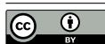

[This work is licensed under a Creative Commons Attribution 4.0 International License.](https://creativecommons.org/licenses/by/4.0) WWW '26, Dubai, United Arab Emirates

feature for NetCVR prediction. Based on these insights, we propose neT convErsion caScaded modeLing and debiAsing method (TESLA). This continuous method features a CVR-RFR cascaded architecture, stage-wise debiasing, and a delay-time-aware ranking loss for efficient NetCVR prediction. Experiments show that TESLA outperforms state-of-the-art methods on CASCADE, achieving an absolute improvement of 12.41% in RI-AUC and 14.94% in RI-PRAUC on NetCVR over the strongest baseline. We hope this work provides a new direction for online delayed feedback modeling in NetCVR prediction. Our code and dataset are available at [https://github.com/alimama-tech/NetCVR.](https://github.com/alimama-tech/NetCVR)

# CCS Concepts

• Information systems → Online advertising; • Applied computing → Electronic commerce.

# Keywords

Net Conversion Rate Prediction, Cascaded Delayed Feedback, Continuous Learning

# 1 Introduction

In industrial recommender systems, the post-click conversion rate (CVR) —defined as the probability that a user makes a purchase after clicking an item —is commonly predicted and leveraged for traffic allocation [\[2,](#page-8-0) [4,](#page-8-1) [8,](#page-8-2) [13,](#page-8-3) [14,](#page-8-4) [23–](#page-8-5)[25\]](#page-8-6). However, CVR alone may not fully capture the true effectiveness of a recommendation algorithm, as users often request refunds when purchased items fail to meet their expectations. To better reflect genuine user satisfaction and business value, it is essential to consider not only whether a purchase occurs, but also whether it is retained —i.e., not followed by a refund. This motivates the prediction of the net conversion rate (NetCVR) [\[28\]](#page-8-7),

∗The authors contribute equally.

†Corresponding author.

This paper has been accepted by the ACM Web Conference (WWW) 2026. This is the camera-ready version. Please refer to the published version for citation once available.

© 2026 Copyright held by the owner/author(s).

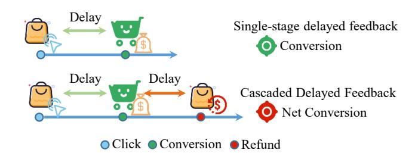

Figure 1: Illustration of Net Conversion and Conversion. Net conversion shows multi-stage cascaded delay nature, involving Click → Conversion and Conversion → Refund delays.

which measures the probability that a user completes a purchase and does not subsequently request a refund (as illustrated in Fig. [1\)](#page-1-0).

NetCVR prediction is significantly more challenging than conventional conversion rate (CVR) estimation due to its multi-stage, cascaded delay feedback structure. To obtain a definitive training label, one must observe the full user journey: Click → Conversion → Refund. This process involves two distinct delay intervals: (1) the time between a click and a potential conversion, and (2) the subsequent time between conversion and a potential refund.

Refunds can occur weeks after purchase, but recommender systems need up-to-date models. Existing methods, such as ECAD [\[28\]](#page-8-7), use fully observed labels and adopt batch-based feedback modeling, typically updating the model once per day offline.

However, offline training fails to capture temporal dynamics and lacks the responsiveness required in real-world recommender systems, where models must continuously adapt to evolving user behavior and market conditions [\[2,](#page-8-0) [7,](#page-8-8) [12,](#page-8-9) [17,](#page-8-10) [19,](#page-8-11) [21,](#page-8-12) [22,](#page-8-13) [27\]](#page-8-14). Meanwhile, offline methods cannot be simply extended to online learning scenarios, as they fail to address issues like stream data modeling and debiasing. Consequently, online continuous approaches to NetCVR prediction remain largely unexplored, despite their critical importance for practical deployment.

In this work, we present CAscadal Sequences of Conversion And Delayed rEfund (CASCADE), the first large-scale open dataset dedicated to online continuous net-conversion prediction. We derive CASCADE using display advertising data collected from the Taobao app, one of the world's largest e-commerce platforms. It meticulously records the full user interaction sequence, from clicks to conversions and refunds, providing a comprehensive view of user behavior. Each event is timestamped, enabling accurate modeling of label evolution under cascaded delayed feedback. These features make it an invaluable resource for advancing delayed feedback models in NetCVR prediction.

To gather insights for algorithm development, we perform data analysis and experiments on CASCADE, leading to three key findings. (1) NetCVR exhibit distinct temporal patterns, underscoring the importance of online continuous training. (2) Cascaded modeling CVR and refund rate (RFR) for NetCVR outperforms direct modeling NetCVR, showing significant potential. (3) Delay time correlates with both CVR and RFR. Shorter delays are common in high CVR and high RFR cases, suggesting that delay time could be useful for improving NetCVR prediction.

Based on the above observations, we present the first online continuous method for net conversion prediction, neT convErsion caScaded modeLing and debiAsing method (TESLA). To address the time-varying nature of NetCVR, TESLA employs online continuous training and constructs a novel data stream for NetCVR prediction. Since CVR and RFR are highly correlated, TESLA employs a shared-bottom architecture to model CVR and RFR as separate tasks with partial shared parameters. Additionally, a delay-time-aware ranking loss is employed for real-time training on partial feedback. Extension experiments confirm that TESLA surpasses state-of-the-art methods on CASCADE, achieving an absolute improvement of 12.41% in RI-AUC and 14.94% in RI-PRAUC on NetCVR over the strongest baseline.

We hope this work can offer a new direction for online delayed feedback modeling in NetCVR prediction. We summarize our contributions as follows:

- Data Resources. We introduce the first public benchmark dataset CASCADE for online continuous NetCVR prediction, offering a reproducible streaming experimental environment. We plan to release our code and benchmark post-publication.
- Valuable Insights. Based on data and experimental analysis, we reveal the limitations of current methods in handling cascaded delayed feedback and propose several key insights to guide future research directions.
- Efficient Method. We evaluate multiple methods on CASCADE and introduce the first online continuous training framework specifically designed for NetCVR. Extensive evaluations show that TESLA consistently boosts NetCVR prediction performance.

# 2 Related Work

Conversion Rate Prediction. Click-through conversion rate (CVR) prediction is a core component in recommender systems and online advertising, directly affecting ranking quality and platform revenue [\[1,](#page-8-15) [5,](#page-8-16) [9,](#page-8-17) [17,](#page-8-10) [28\]](#page-8-7). Existing efforts have advanced CVR modeling from multiple angles, including model architecture design [\[5,](#page-8-16) [9,](#page-8-17) [16\]](#page-8-18), multi-task learning with auxiliary signals [\[3,](#page-8-19) [17,](#page-8-10) [19,](#page-8-11) [22,](#page-8-13) [28\]](#page-8-7), and delayed feedback handling [\[2,](#page-8-0) [8,](#page-8-2) [13,](#page-8-3) [14,](#page-8-4) [23\]](#page-8-5). While these methods improve estimation accuracy along the click-to-conversion path, they do not account for post-conversion refund behaviors, a critical factor in determining true user satisfaction and net revenue.

Delayed Feedback in Conversion Rate Prediction. Methods for addressing delayed feedback fall into three main paradigms: (1) Parametric Survival Modeling: Early approaches such as DFM [\[2\]](#page-8-0) and NoDeF [\[26\]](#page-8-20) assume parametric delay distributions (e.g., exponential) and jointly model conversion probability and delay time. (2) Label Correction with Importance Sampling: To correct bias from censored negatives, methods like FNW [\[11\]](#page-8-21) and Defer [\[8\]](#page-8-2) re-weight unconverted samples upon delayed feedback using importance weighting. (3) Hybrid Window-Based Methods: These balance bias and variance by combining unbiased short-term estimation within an observation window and debiased long-term correction beyond it. Examples include Defuse [\[4\]](#page-8-1) and DDFM [\[6\]](#page-8-22), while DFSN [\[14\]](#page-8-4) and MISS [\[13\]](#page-8-3) further enhance performance via multi-stream modeling across different delay stages.

Net Conversion and Refund-Aware Modeling. Recent work has begun to recognize that final user outcomes extend beyond

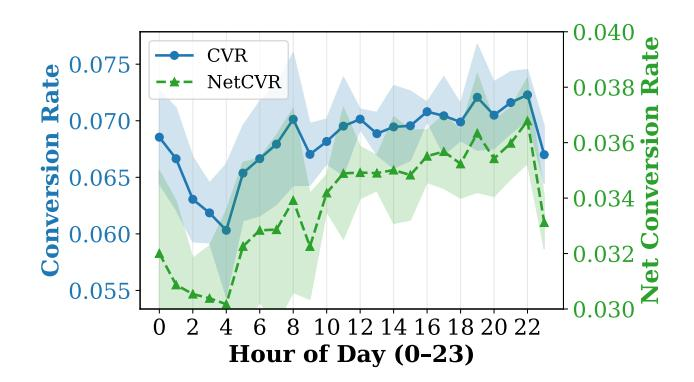

Figure 2: Conversion Rate and Net Conversion Rate by Hours.

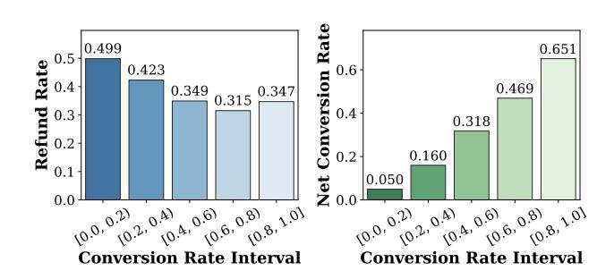

Figure 3: Average Refund Rate and Net Conversion Rate Across Conversion Rate Bins.

conversion. ECAD [\[28\]](#page-8-7) introduces net conversion by incorporating refunds, but operates offline with static labels, ignoring the cascaded and asynchronous nature of real-time feedback. In contrast, TESLA is the first method designed for online continuous NetCVR prediction under multi-stage cascaded delay feedback.

# 3 Dataset Construction and Analysis

# 3.1 Dataset Construction

Although the prediction of net conversion rates (NetCVR) is crucial, one limitation is the absence of open-access datasets. Existing datasets such as Criteo[1](#page-2-0) and Tencent[2](#page-2-1) provide click and conversion data, but none include post-purchase behavioral signals, such as whether a purchase is retained or refunded, making it impossible to accurately model NetCVR. To address these limitations, we have developed the first open-source dataset for net conversion rate prediction, named CAscadal Sequences of Conversion And Delayed rEfund (CASCADE). Detailed construction, feature descriptions, and statistics are provided in Appendix [B.](#page-9-0)

# 3.2 Problem Setup

In the Conversion Rate (CVR), Refund Rate (RFR), and Net Conversion Rate (NetCVR) prediction task, the model processes inputs as (x, ��, ��) ∼ (��, ��, ��). Here, x represents features, and �� ∈ {0, 1}, �� ∈ {0, 1} are the conversion and refund labels. Since net conversion

Table 1: Net conversion rate performance between the cascade modeling approach and direct modeling approach.

has multi-stage cascaded delay characteristics, we do not collect net conversion labels separately but represent them using conversion and refund labels. �� = 1 and �� = 1 represent there exist a conversion and a refund, respectively. Net conversion occurs when �� = 1 and �� = 0. Given features x, the objectives are as follows: For CVR, train a parameterized function �� CVR to predict the conversion probability; for RFR, train �� RFR to predict the refund probability; and for NetCVR, train �� NetCVR to predict the net conversion probability, which can also be represented as �� NetCVR = �� CVR ∗ (1 − �� RFR ). The key notations used in this paper are summarized in Appendix [A.](#page-8-23)

### 3.3 Insights Exploration

Given the lack of prior art in NetCVR prediction, to gain deeper insights, we employ exploratory data analysis in this section. Key insights are listed as follows:

### Takeaways

- 1. NetCVR exhibits clear temporal patterns necessitating online continuous learning.
- 2. Cascaded modeling CVR and RFR for NetCVR outperforms directly modeling NetCVR.
- 3. Delay time, which is correlated with CVR and RFR, is an important feature for NetCVR prediction.

3.3.1 The Significance of Online Continuous Training. To analyze intra-day patterns of NetCVR targets, we randomly sampled three days' data and computed hourly CVR and NetCVR. CVR was derived by aggregating clicks within each hour and assigning conversion labels based on user behavior over the following 3-day window (conversion attribute window). NetCVR was calculated similarly, with refund labels assigned based on user behavior over a 6-day window (conversion and refund attribute window).

We can observe from Fig. [2](#page-2-2) that both CVR and NetCVR display hour-to-hour fluctuations over time. Notably, both indicators experience a substantial decline during late-night periods (e.g., 00:00–04:00). Consequently, relying on offline methods that update models only once per day [\[28\]](#page-8-7) is insufficient to capture such finegrained temporal patterns, highlighting the necessity of employing online continuous learning algorithms that can adapt to dynamic user behavior and provide more accurate real-time responses.

3.3.2 The Superiority of Cascade Structure. We first grouped items by CVR and analyzed their relationships with RFR and NetCVR. As shown in Fig. [3,](#page-2-3) we can observe that: (1) Items with higher CVR tend to have higher NetCVR, suggesting a possible positive correlation and indicating potential for joint modeling of CVR and NetCVR with shared parameters. (2) Items with higher

1<https://labs.criteo.com/2013/12/conversion-logs-dataset/>

2<https://algo.qq.com/?lang=en>

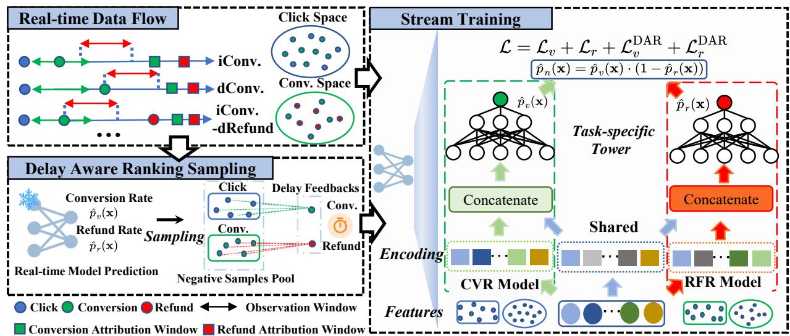

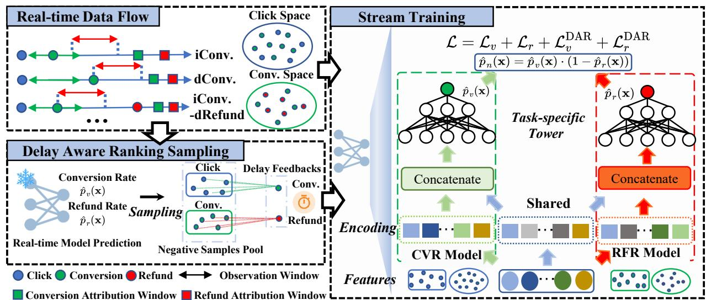

Figure 4: Framework of TESLA. i denotes an immediate response while d denotes a delayed response.

CVR generally show lower RFR. However, RFR increases in the top CVR bucket (0.8, 1], which reveals that conversion and refund are mostly related but retain some distinct characteristics.

There are two approaches exist for online continuous NetCVR modeling: (1) direct modeling NetCVR, and (2) cascaded modeling CVR and RFR. Based on above insights, we can use a dual-tower structure to implement both methods. The direct method predicts CVR and NetCVR tasks simultaneously, while the cascaded method predicts CVR and RFR tasks together.

To evaluate these approaches for online NetCVR prediction, we extended the simplest online continual learning method FNC [\[4,](#page-8-1) [8\]](#page-8-2) to NetCVR task as there is no prior continuous methods for NetCVR and FNC's straightforward debiasing strategy can minimize experimental interference. The detail of FNC is shown in Appendi[xD.4.](#page-10-0) In this adapted method, conversion events enter the model through the native data flow, and refund events are input when actual refunds occur. We compared AUC, NLL, PRAUC, and PCOC for both variants as proxy metrics to evaluate the performance of netCVR prediction.

As shown in Tab. [1,](#page-2-4) the cascaded approach attains higher AUC and PR-AUC, signaling superior model ranking accuracy. AUC evaluates the model's ability to rank true conversions above nonconversions and refunds. (1) Direct modeling NetCVR cannot distinguish between non-conversions and refunds, often overfitting conversion intent features, leading to biased predictions. Thus, its PCOC values exceeding 1. (2) In contrast, a cascaded approach decomposes NetCVR into sequential sub-tasks, i.e., conversion prediction followed by refund prediction, allowing the model to capture distinct behavioral patterns at each stage and produce more accurate, interpretable estimates.

3.3.3 The Potential of Modeling Delay Time for NetCVR Prediction. We grouped users by CVR and RFR and calculated the mean and variance of delay time for each group. We can observe from Fig. [5](#page-3-0) that: (1) High-CVR users have shorter and more consistent

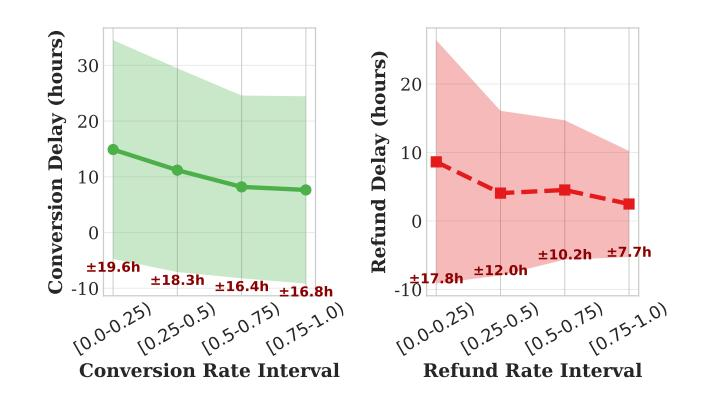

Figure 5: Average conversion and refund delay across CVR and refund rate groups.

payment delays than low-CVR users, suggesting that those who convert quickly may have stronger purchase intent. (2) Compared to the low-RFR group, the high-RFR group has a shorter average delay and smaller variance, which may indicate immediate postpurchase dissatisfaction or that these users are subject to automated return policies. Delay is not just a technical challenge but a behavioral signal reflecting user confidence and satisfaction. It should be considered in modeling cascaded delayed feedback.

# 4 Methodology

Based on the gathered insights, we propose neT convErsion caScaded modeLing and debiAsing (TESLA). As shown in Fig. [4,](#page-3-1) TESLA consists of three components: (1) Inspired by the insights that NetCVR exhibits clear temporal patterns (§ [3.3.1\)](#page-2-5), TESLA adopts an online continuous learning method with two-stage cascaded observation windows to dynamically track net conversion status (§ [4.1\)](#page-4-0); (2) Drawing on the insights that cascaded modeling of CVR and RFR

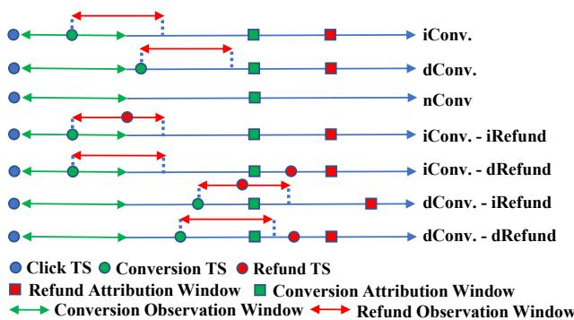

Table 2: Performance Comparison on CVR and NetCVR prediction. Oracle is the upper bound on the best achievable performance as there are no delayed Conversions. "Shared", "Separate", and "Hybrid" are three variants of TESLA. Bold indicates the best results and the oracle results for reference are grayed out.

| Model Oracle | Pre-trained | (CVR 0.7223 0.7556 | AUC / / / ↑ NetCVR) 0.7353 0.7643 | (CVR 0.2252 0.2155 | NLL / / / ↓ NetCVR) 0.1810 0.1750 | (CVR 0.1768 0.2007 | PRAUC / / / ↑ NetCVR) 0.1521 0.1722 | (CVR   | RI-AUC / ∼ ∼ ↑ NetCVR) | (CVR   | RI-PRAUC / ∼ ∼ ↑ NetCVR) |
|--------------|-------------|--------------------|-----------------------------------|--------------------|-----------------------------------|--------------------|-------------------------------------|--------|------------------------|--------|--------------------------|
| BDL          |             | 0.7381             | / 0.7476                          | 0.2237             | / 0.1805                          | 0.1832             | / 0.1574                            | 47.45% | / 42.41%               | 26.78% | / 26.37%                 |
| FNC          |             | 0.7437             | / 0.7525                          | 0.2225             | / 0.1801                          | 0.1852             | / 0.1585                            | 64.26% | / 59.31%               | 35.15% | / 31.84%                 |
| FNW          | (RecSys’19) | 0.7443             | / 0.7539                          | 0.2220             | / 0.1800                          | 0.1887             | / 0.1619                            | 66.07% | / 64.14%               | 49.79% | / 48.76%                 |
| DEFER        | (KDD’21)    | 0.7450             | / 0.7552                          | 0.2190             | / 0.1777                          | 0.1920             | / 0.1649                            | 68.17% | / 68.62%               | 63.60% | / 63.68%                 |
| DEFUSE       | (WWW’22)    | 0.7459             | / 0.7550                          | 0.2347             | / 0.1971                          | 0.1925             | / 0.1645                            | 70.87% | / 67.93%               | 65.69% | / 61.69%                 |
| ES-DFM       | (AAAI’21)   | 0.7456             | / 0.7546                          | 0.2190             | / 0.1783                          | 0.1924             | / 0.1644                            | 69.97% | / 66.55%               | 65.27% | / 61.19%                 |
| DSFN         | (SIGIR’23)  | 0.7437             | / 0.7527                          | 0.2199             | / 0.1793                          | 0.1905             | / 0.1617                            | 64.26% | / 60.00%               | 57.32% | / 47.76%                 |
| DDFM         | (CIKM’23)   | 0.7446             | / 0.7541                          | 0.2199             | / 0.1793                          | 0.1918             | / 0.1640                            | 66.97% | / 64.83%               | 62.76% | / 59.20%                 |
| MISS         | (AAAI’24)   | 0.7441             | / 0.7527                          | 0.2199             | / 0.1783                          | 0.1902             | / 0.1625                            | 65.47% | / 60.00%               | 56.07% | / 51.74%                 |
| TESLA        | (Separate)  | 0.7456             | / 0.7555                          | 0.2190             | / 0.1776                          | 0.1924             | / 0.1651                            | 69.97% | / 69.66%               | 65.27% | / 64.68%                 |
| TESLA        | (Shared)    | 0.7458             | / 0.7567                          | 0.2189             | / 0.1772                          | 0.1926             | / 0.1667                            | 70.57% | / 73.79%               | 66.11% | / 72.64%                 |
| TESLA        | (Hybrid)    | 0.7469             | / 0.7579                          | 0.2188             | / 0.1771                          | 0.1933             | / 0.1676                            | 73.87% | / 77.93%               | 69.04% | / 77.11%                 |
| TESLA        |             | 0.7479             | / 0.7588                          | 0.2182             | / 0.1767                          | 0.1939             | / 0.1679                            | 76.88% | / 81.03%               | 71.55% | / 78.61%                 |

methods (FNC, FNW, ES-DFM, DEFER, DEFUSE) and hybrid multiwindow approaches (DDFM, DSFN, MISS). Detailed descriptions are provided in Appendix [D.4.](#page-10-0)

### 5.2 Performance Comparison

We evaluate all methods on the CASCADE dataset. We have following observations from Tab. [2:](#page-6-4) (1) TESLA consistently enhances both CVR and NetCVR tasks. It outperforms other methods across all metrics, showing its effectiveness in tackling delayed feedback and better capturing user preferences. The improvements of RI-AUC in the NetCVR task (12.41%) are more pronounced than those in the CVR task (6.01%), suggesting that it is more effective in addressing the multi-stage cascaded delayed feedback. (2) Continuous training contributes to the performance lift. All online models perform better than BDL models, which validates the need for online continuous learning (§ [3.3.1\)](#page-2-5) and demonstrates the advantage of online continuous learning models in promptly updating user preferences for better recommendations. (3) Adding Delay-aware Ranking Loss proves effective. Compared with TESLA (Hybird), TESLA improves RI-AUC by 3.01% in CVR and 3.1% in NetCVR. This shows that using delay time helps online models better identify delayed labels.

# 5.3 Ablation Study

5.3.1 Impact of Cascaded Structure. To explore the impact of cascaded structure, we have three variants: (1) Fully shared model (Shared): CVR and RFR towers share all lower-layer parameters. (2) Fully separate model (Separate): CVR and RFR towers have separate lower-layer parameters. (3) Hybrid shared-independent model (Our method, Hybrid): CVR and RFR towers combine shared and

task-specific lower-layer parameters. We remove the delay-aware ranking loss to eliminate potential interference.

From Tab. [2](#page-6-4) we can observe that: (1) Hybrid achieves the best results. By separating shared and unique parameters, Hybrid effectively balances knowledge transfer and task specificity. This validates the findings in § [3.3.2,](#page-2-6) which highlight that CVR and RFR share relevant information yet retain unique content, making this approach crucial for accurate NetCVR estimation. (2) Shared performs better than Separate. Given the limited availability of refund data, parameter sharing enhances the performance of the RFR model, surpassing the results of completely independent modeling.

5.3.2 Impact of Refund De-biasing. To explore the impact of refund debiasing, we conduct ablation studies by removing the Refund Observation Window (ROW) and debiasing strategy (DS) under Separate. Note that DS can only be used with ROW enabled.

We can observe from Tab. [3](#page-7-1) that: (1) Adding ROW alone enhances AUC and reduces NLL, demonstrating improved ranking accuracy and lower uncertainty. This indicates that the observation window effectively filters early refunds, thereby reducing label noise. (2) Combining both ROW and DS achieves optimal performance. This suggests that while early filtering with ROW is beneficial, an explicit debiasing strategy is indispensable for precise NetCVR estimation.

5.3.3 Impact of Delay-aware Ranking Loss. To explore the effectiveness of delay-aware ranking loss (DAR), we assess its key components—delay-aware positive weighting (PW) and lowuncertainty-driven negative sampling (LN) within the Hybrid in § [5.3.1.](#page-6-1) The variants include: NR (no ranking loss), RN (random negatives with ranking loss), HN (high-uncertainty negative sampling), LN (low-uncertainty negative sampling), and DAR (PW-LN) (our method with positive weighting and low-uncertainty negatives).

Table 3: Ablation study on the Refund Observation Window (ROW) and Refund Debiasing Strategy (DS), built upon the Separate architecture in § [5.3.1.](#page-6-1)

| ROW DS | AUC    | ↑ NLL  | ↓ PRAUC ↑ |
|--------|--------|--------|-----------|
| × ×    | 0.7546 | 0.1783 | 0.1644    |
| ✓ ×    | 0.7553 | 0.1779 | 0.1644    |
| ✓ ✓    | 0.7555 | 0.1776 | 0.1651    |

Table 4: Ablation study on Delay-Aware Ranking Loss (DAR), built upon the Hybrid architecture in § [5.3.1.](#page-6-1) NR represents no ranking loss. PW, RN, LN, and HN denote positive weighting, random, low-uncertainty, and high-uncertainty negative sampling, respectively.

| Variation   | (CVR   | RI-AUC / ↑ NetCVR) | (CVR   | NLL / ↓ NetCVR) | (CVR   | RI-PRAUC / ↑ NetCVR) |
|-------------|--------|--------------------|--------|-----------------|--------|----------------------|
| NR          | 73.87% | / 77.93%           | 0.2188 | / 0.1771        | 69.04% | / 77.11%             |
| RN          | 75.68% | / 79.77%           | 0.2186 | / 0.1767        | 69.60% | / 77.28%             |
| HN          | 75.08% | / 76.44%           | 0.2226 | / 0.1801        | 69.60% | / 76.29%             |
| LN          | 76.08% | / 80.23%           | 0.2182 | / 0.1767        | 70.85% | / 78.23%             |
| DAR (PW-LN) | 76.78% | / 80.92%           | 0.2182 | / 0.1767        | 71.41% | / 78.77%             |

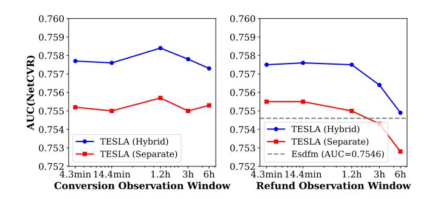

Figure 7: Ablation study on refund and conversion observation window.

From Tab. [4,](#page-7-2) we observe that: (1) DAR performs best, as it reduces potential noise in both positive and negative samples. (2) Randomly negatives (RN) outperforms high-uncertainty negatives (HN) but underperforms low-uncertainty negatives (LN), underscoring the importance of uncertainty-guided negative sampling. (3) PW-LN is better than LN, demonstrating the effectiveness of positive sample weighting and the value of focusing on small delay times to capture high-confidence user intent (§ [3.3.3\)](#page-3-2). (4) NR performs the worst, indicating that pair-wise ranking loss can mitigate label uncertainty caused by delayed feedback (§ [4.4\)](#page-5-0).

# 5.4 Impact of Observation Windows

To optimize NetCVR performance through selecting and tuning the conversion and refund observation windows, we conduct parameter experiments on �� ������ and �� ������ �� over {0.003, 0.01, 0.05, 0.125, 0.25} days, modifying one window at a time while fixing the other at 0.01 days. AUC (NetCVR) serves as the primary evaluation metric.

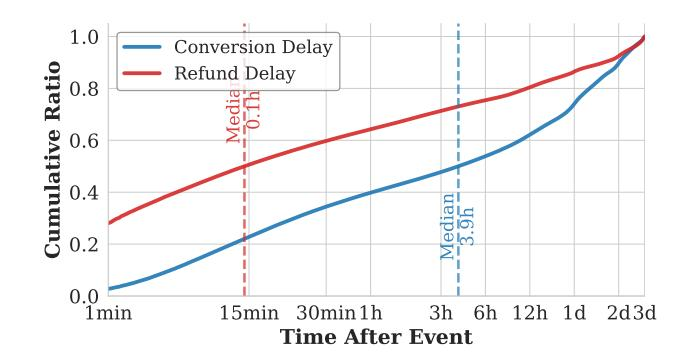

Figure 8: Cumulative distribution of conversion and refund delays.

From Fig. [7,](#page-7-3) we can observe that: (1) Conversion observation window�� ������ are achieved at 0.05 days, with performance declining beyond this point. This highlights the need for a balance between sufficient time to gather stable positive signals and maintaining freshness, reflecting the slower and more diverse conversion dynamics as shown in Fig. [8.](#page-7-4) (2) In contrast, shorter refund observation window�� ������ are preferable. AUC remains stable when�� ������ �� ≤ 0.01 days and declines with longer durations. When the window is too long, the results may even be worse than those without an refund observation window. This aligns with the refund delay distribution in Fig. [8,](#page-7-4) where most refunds occur quickly. Shorter window enhances label purity by excluding delayed cases, improving training reliability.

### 6 Conclusion

In this paper, We study multi-stage cascaded delayed feedback in NetCVR prediction and introduce CASCADE, the first large-scale open dataset for continuous NetCVR modeling from Taobao. Analysis reveals key temporal patterns and the benefit of cascaded modeling. Based on these insights, we propose TESLA, the first online continuous learning method addressing cascaded delayed feedback with a CVR-RFR structure, stage-aware debiasing, and delay-aware ranking loss. Experiments show its superior performance over existing methods. We hope that our exploration will be helpful for future research in this area.

# Acknowledgments

This work was supported by the Natural Science Foundation of China (No.62432011,62372390), Science Fund for Distinguished Young Scholars of Fujian Province (No.2025J010001), and Alibaba Group through Alibaba Innovative Research Program. Chen Lin is the corresponding author. This work was completed while the first author was an intern at Alibaba.

References [1] Zhangming Chan, Yu Zhang, Shuguang Han, Yong Bai, Xiang-Rong Sheng, Siyuan Lou, et al. 2023. Capturing conversion rate fluctuation during sales promotions: A novel historical data reuse approach. In Proceedings of the 29th ACM SIGKDD Conference on Knowledge Discovery and Data Mining. 3774–3784. [2] Olivier Chapelle. 2014. Modeling delayed feedback in display advertising. In Proceedings of the 20th ACM SIGKDD international conference on Knowledge discovery and data mining. 1097–1105. [3] Sishuo Chen, Zhangming Chan, Xiang-Rong Sheng, Lei Zhang, Sheng Chen, et al. 2025. See Beyond a Single View: Multi-Attribution Learning Leads to Better Conversion Rate Prediction. In Proceedings of the 34th ACM International Conference on Information and Knowledge Management (Seoul, Republic of Korea) (CIKM '25). Association for Computing Machinery, New York, NY, USA, 5600–5608. [4] Yu Chen, Jiaqi Jin, Hui Zhao, Pengjie Wang, Guojun Liu, Jian Xu, and Bo Zheng. 2022. Asymptotically unbiased estimation for delayed feedback modeling via label correction. In Proceedings of the ACM Web Conference 2022. 369–379. [5] Heng-Tze Cheng, Levent Koc, Jeremiah Harmsen, Tal Shaked, Tushar Chandra, Hrishi Aradhye, Glen Anderson, Greg Corrado, Wei Chai, Mustafa Ispir, et al. 2016. Wide & deep learning for recommender systems. In Proceedings of the 1st workshop on deep learning for recommender systems. 7–10. [6] Sunhao Dai, Yuqi Zhou, Jun Xu, and Ji-Rong Wen. 2023. Dually enhanced delayed feedback modeling for streaming conversion rate prediction. In Proceedings of the 32nd ACM International Conference on Information and Knowledge Management. 390–399. [7] Ke Fei, Xinyue Zhang, and Jingjing Li. 2025. Entire-Space Variational Information Exploitation for Post-Click Conversion Rate Prediction. In Proceedings of the AAAI Conference on Artificial Intelligence, Vol. 39. 11654–11662. [8] Siyu Gu, Xiang-Rong Sheng, Ying Fan, Guorui Zhou, and Xiaoqiang Zhu. 2021. Real negatives matter: Continuous training with real negatives for delayed feedback modeling. In Proceedings of the 27th ACM SIGKDD Conference on Knowledge Discovery & Data Mining. 2890–2898. [9] Huifeng Guo, Ruiming Tang, Yunming Ye, Zhenguo Li, and Xiuqiang He. 2017. DeepFM: a factorization-machine based neural network for CTR prediction. arXiv preprint arXiv:1703.04247 (2017). [10] Sergey Ioffe and Christian Szegedy. 2015. Batch Normalization: Accelerating Deep Network Training by Reducing Internal Covariate Shift. JMLR.org (2015). [11] Sofia Ira Ktena, Alykhan Tejani, Lucas Theis, Pranay Kumar Myana, Deepak Dilipkumar, Ferenc Huszár, Steven Yoo, and Wenzhe Shi. 2019. Addressing delayed feedback for continuous training with neural networks in CTR prediction. In Proceedings of the 13th ACM conference on recommender systems. 187–195. [12] Kuang-chih Lee, Burkay Orten, Ali Dasdan, and Wentong Li. 2012. Estimating conversion rate in display advertising from past erformance data. In Proceedings of the 18th ACM SIGKDD international conference on Knowledge discovery and data mining. 768–776. [13] Qiming Liu, Xiang Ao, Yuyao Guo, and Qing He. 2024. Online conversion rate prediction via multi-interval screening and synthesizing under delayed feedback. In Proceedings of the AAAI Conference on Artificial Intelligence, Vol. 38. 8796–8804. [14] Qiming Liu, Haoming Li, Xiang Ao, Yuyao Guo, Zhihong Dong, Ruobing Zhang, Qiong Chen, Jianfeng Tong, and Qing He. 2023. Online Conversion Rate Prediction via Neural Satellite Networks in Delayed Feedback Advertising. In Proceedings of the 46th International ACM SIGIR Conference on Research and Development in Information Retrieval. 1406–1415. [15] Ilya Loshchilov and Frank Hutter. 2017. Decoupled Weight Decay Regularization. (2017). [16] Jiaqi Ma, Zhe Zhao, Xinyang Yi, Jilin Chen, Lichan Hong, and Ed H Chi. 2018. Modeling task relationships in multi-task learning with multi-gate mixture-ofexperts. In Proceedings of the 24th ACM SIGKDD international conference on knowledge discovery & data mining. 1930–1939. [17] Xiao Ma, Liqin Zhao, Guan Huang, Zhi Wang, Zelin Hu, Xiaoqiang Zhu, and Kun Gai. 2018. Entire space multi-task model: An effective approach for estimating post-click conversion rate. In The 41st International ACM SIGIR Conference on Research & Development in Information Retrieval. 1137–1140. [18] Maas and Hannun. [n. d.]. Rectifier nonlinearities improve neural network acoustic models. ([n. d.]). [19] Hongzu Su, Lichao Meng, Lei Zhu, Ke Lu, and Jingjing Li. 2024. DDPO: Direct dual propensity optimization for post-click conversion rate estimation. In Proceedings of the 47th International ACM SIGIR Conference on Research and Development in Information Retrieval. 1179–1188. [20] Hongyan Tang, Junning Liu, Ming Zhao, and Xudong Gong. 2020. Progressive Layered Extraction (PLE): A Novel Multi-Task Learning (MTL) Model for Personalized Recommendations. In RecSys '20: Fourteenth ACM Conference on Recommender Systems. [21] Guoquan Wang, Qiang Luo, Weisong Hu, Pengfei Yao, Wencong Zeng, Guorui Zhou, and Kun Gai. 2025. FIM: Frequency-Aware Multi-View Interest Modeling for Local-Life Service Recommendation. In Proceedings of the 48th International ACM SIGIR Conference on Research and Development in Information Retrieval. 1748–1757. [22] Hao Wang, Tai-Wei Chang, Tianqiao Liu, Jianmin Huang, Zhichao Chen, Chao Yu, Ruopeng Li, and Wei Chu. 2022. ESCM2: Entire space counterfactual multitask model for post-click conversion rate estimation. In Proceedings of the 45th International ACM SIGIR Conference on Research and Development in Information Retrieval. 363–372. [23] Yifan Wang, Peijie Sun, Min Zhang, Qinglin Jia, Jingjie Li, and Shaoping Ma. 2023. Unbiased delayed feedback label correction for conversion rate prediction. In Proceedings of the 29th ACM SIGKDD Conference on Knowledge Discovery and Data Mining. 2456–2466. [24] Jia-Qi Yang, Xiang Li, Shuguang Han, Tao Zhuang, De-Chuan Zhan, Xiaoyi Zeng, and Bin Tong. 2021. Capturing delayed feedback in conversion rate prediction via elapsed-time sampling. In Proceedings of the AAAI Conference on Artificial Intelligence, Vol. 35. 4582–4589. [25] Shota Yasui, Gota Morishita, Fujita Komei, and Masashi Shibata. 2020. A feedback shift correction in predicting conversion rates under delayed feedback. In Proceedings of The Web Conference 2020. 2740–2746. [26] Yuya Yoshikawa and Yusaku Imai. 2018. A Nonparametric Delayed Feedback Model for Conversion Rate Prediction. CoRR abs/1802.00255 (2018). arXiv preprint arXiv:1802.00255 (2018). [27] Xinyue Zhang, Cong Huang, Kun Zheng, Hongzu Su, Tianxu Ji, Wei Wang, Hongkai Qi, and Jingjing Li. 2024. Adversarial-Enhanced Causal Multi-Task Framework for Debiasing Post-Click Conversion Rate Estimation. In Proceedings of the ACM Web Conference 2024. 3287–3296. [28] Yunfeng Zhao, Xu Yan, Xiaoqiang Gui, Shuguang Han, Xiang-Rong Sheng, et al. 2023. Entire space cascade delayed feedback modeling for effective conversion rate prediction. In Proceedings of the 32nd ACM International Conference on Information and Knowledge Management. 4981–4987. A Key Notations The key notations used throughout this paper are summarized in Table [5.](#page-8-26) Table 5: Notation and explanations Notation Explanation x, ��, �� Input features, conversion labels, refund labels ���� , ����, ���� , ���� click time, conversion time, refund time, observation time ����, ���� ���� = ���� − ���� :interval between click and observation time; ���� = ���� − ���� :interval between conversion and observation time ℎ��, ℎ�� conversion delay : ℎ�� = ���� − ���� ; refund delay : ℎ�� = ���� − ���� �� ������ ,�� ������ conversion/refund observation window �� �������� ,�� �������� conversion/refund Attribution window ���� (��), ���� (x) ground-truth of conversion : ���� (x) = ��(�� = 1|x), observerd distribution of conversion : ���� (x) = ��(�� = 1|x) ���� (x), ���� (x) ground-truth of refund : ���� (x) = ��(�� = 1|�� = 1, x), observerd distribution of refund : ���� (x) = ��(�� = 1|�� = 1, x) ���� (x), ���� (x) ground-truth of net conversion : ���� (x) = ���� (��) · (1 −���� (x)), observerd distribution of net conversion : ���� (x) = ���� (x) · (1 − ���� (x) P��, P�� real-time positive conversion/refund samples set from streaming data N��, N�� real-time negative conversion/refund samples set from streaming data ��ˆ�� (x), ��ˆ�� (x), ��ˆ�� (x) output logits of the CVR and RFR models, i.e., ��ˆ�� (x) = �� CVR (x), ��ˆ�� (��) = �� RFR (x)) ,

Table 6: Statistics of the datasets. Counts are rounded in millions (M).

attribution windows are both set to 3 days, defining the maximum delay for valid outcomes, while observation windows are 0.01 day (15 minutes) each.

# D.2 Sample Delivery

Conversion events are fed into the model at the end of the conversion observation window if they occur within it; otherwise, they are added at the exact time of conversion. Refund events are fed into the model either at the time of actual refund or at the end of the refund observation window, whichever comes first. Notably, the refund observation window is a unique feature of TESLA. Other methods only detect refunds at the actual refund time.

# D.3 Detailed Evaluation Metrics

We adopt the following metrics to evaluate both ranking and calibration performance in streaming NetCVR prediction:

- AUC: The area under the ROC curve, measuring the model's ability to distinguish between positive and negative samples in terms of pairwise ranking.
- PRAUC: The area under the precision-recall curve. Due to the highly imbalanced nature of streaming data, PRAUC is more sensitive than AUC to improvements on positive samples and better reflects practical utility.
- NLL: The negative log-likelihood, which evaluates the quality of predicted probabilities:

NLL = − 1 �� ∑︁�� ��=1 [���� log ��ˆ�� + (1 − ����) log(1 − ��ˆ��)] ,

It penalizes miscalibration and is critical in cost-per-action (CPA) systems.

- RI-AUC (Relative Improvement in AUC): Following prior works [\[4,](#page-8-1) [24\]](#page-8-25), we compute the relative improvement over the pre-trained model:

RI-AUC = AUCmodel − AUCpre-trained AUCoracle − AUCpre-trained × 100%,

where AUCoracle is computed using ground-truth labels with full delay observation. RI-AUC measures how close a method approaches the oracle performance, with higher values indicating better recovery from delayed feedback.

- PCOC (Predicted Click-to-Conversion Over Calibration): We further evaluate calibration by computing the ratio of average predicted probability to empirical conversion rate:

PCOC = E[��ˆ] E[��] ,

A PCOC value close to 1 indicates well-calibrated predictions. Values &gt; 1 indicate overestimation (common in delayed feedback), while &lt; 1 indicate underestimation.

### D.4 Detailed Competitors

The compared methods include:

- Pre-trained: The initial model trained on the pre-training set without any online updates. Serves as a static baseline to measure the value of streaming adaptation.
- Oracle: A privileged model fine-tuned with ground-truth labels after full observation (i.e., after ���� +���� ), representing the performance upper bound under complete feedback.
- BDL(Batch Deep Learning): A daily batch model that waits for all feedback within attribution window, thus receiving delay-free labels. Simulates ideal offline training with no label censorship.
- FNC [\[11\]](#page-8-21): Corrects selection bias by directly re-injecting delayed feedback samples into the training stream upon their arrival.
- FNW [\[11\]](#page-8-21): Uses importance weighting to up-weight fake negatives and down-weight real negatives based on delay distribution.
- DEFER [\[8\]](#page-8-2): Replicates both delayed positive samples and confirmed real negative samples to mitigate feature distribution shift caused by asymmetric sample duplication.
- DEFUSE [\[4\]](#page-8-1): Introduces a four-way categorization of samples: Immediate Positive (IP), Fake Negative (FN), Real Negative (RN), and Delayed Positive (DP), with tailored modeling and reweighting for each type.
- ES-DFM [\[24\]](#page-8-25): The first method to introduce an explicit conversion observation window and perform debiasing within it using importance weighting. Models the trade-off between label completeness and data freshness via adaptive sample reweighting.
- DDFM [\[6\]](#page-8-22): Proposes a hybrid modeling strategy: applies unbiased estimation for samples inside the observation window, and debiased modeling for those outside—without relying on survival models.
- DSFN [\[14\]](#page-8-4): Leverages transfer learning to capture shared representations across different types of streaming user feedback.
- MISS [\[13\]](#page-8-3): Employs multiple models trained on different observation windows and fuses their predictions via ensemble voting to improve robustness.

# D.5 Implement Details

We reproduce all competitors based on their official implementations. Since cascaded modeling outperforms direct modeling (§ [3.3.2\)](#page-2-6), all methods adopt a unified dual-tower architecture that independently estimates CVR and RFR. All models are initialized from the same pre-trained checkpoint and fine-tuned on identical streaming data, ensuring controlled comparisons under cascaded feedback. We implement TESLA and all baselines in PyTorch. Feature inputs are embedded and fed into fully connected networks with hidden sizes {256, 256, 128}, where each layer is followed by BatchNorm [\[10\]](#page-8-27) and LeakyReLU [\[18\]](#page-8-28). All methods are optimized with Adam [\[15\]](#page-8-29), and hyperparameters are carefully tuned to report the best performance.

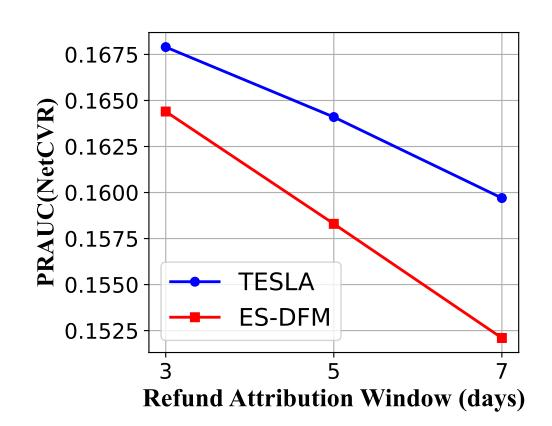

Figure 9: Robustness study on refund attribution window.

# D.6 Robustness to Refund Attribution Windows

To evaluate robustness under different refund attribution assumptions, we further test TESLA with varying refund attribution windows �� �������� �� ∈ {3d, 5d, 7d} while keeping all other settings fixed. This design intentionally introduces variation in the time allowed for attributing refunds, thereby simulating the practical uncertainty in real-world refund timing. It allows us to examine whether the performance is sensitive to such shifts in the attribution window.

The results indicate that TESLA consistently outperforms strong delayed-feedback baselines across all experimental settings. As illustrated in Fig. [9,](#page-11-0) the proposed TESLA consistently outperforms ES-DFM across different refund attribution windows in terms of NetCVR PR-AUC, with relative improvements of approximately 2.1%, 3.7%, and 5.0% for the 3-day, 5-day, and 7-day windows, respectively. Importantly, the performance gap remains stable as the refund window increases, suggesting that TESLA is robust to variations in refund timing and does not depend on finely tuned attribution assumptions. These findings highlight TESLA 's effectiveness in handling realistic refund delay shifts.