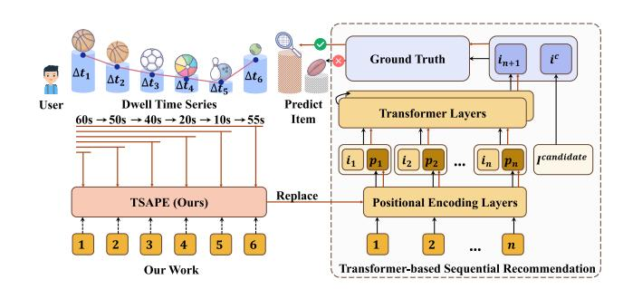
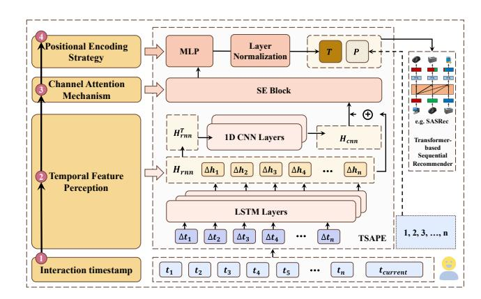
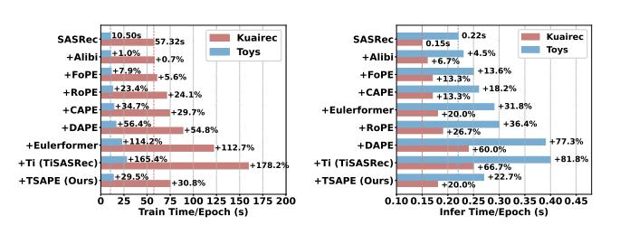
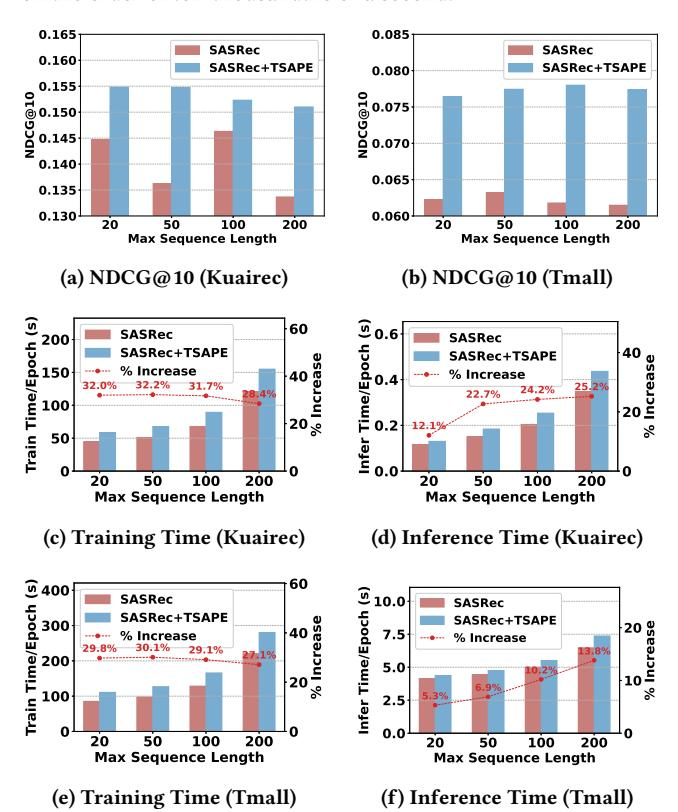
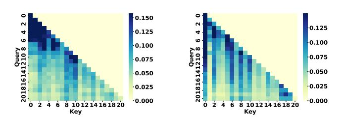
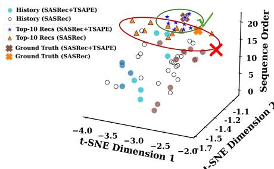
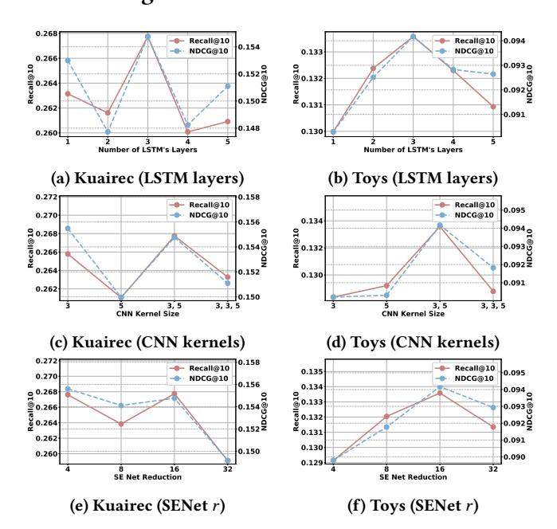

# Temporal-Series-Aware Adaptive Positional Encoding for Transformer-based Sequential Recommendation

[Rongbo Qi](https://orcid.org/0009-0002-0879-3140)

rongbo.qi@mail.nankai.edu.cn

School of Computer Science, TJ Key Lab of NDST, DISSec, TMCC, TBI Center, VCIP, AAIS, Nankai University Tianjin, China

[Yaqi Zhang](https://orcid.org/0000-0001-9347-2039)

yaqi.zhang@mail.nankai.edu.cn

School of Computer Science, TJ Key Lab of NDST, DISSec, TMCC, TBI Center, VCIP, AAIS, Nankai University Tianjin, China

[Chunyao Song](https://orcid.org/0000-0002-5715-5092)∗

chunyao.song@nankai.edu.cn

School of Computer Science, TJ Key Lab of NDST, DISSec, TMCC, TBI Center, VCIP, AAIS, Nankai University Tianjin, China

[Tingjian Ge](https://orcid.org/0000-0003-2225-8291)

tingjian\_ge@uml.edu Department of Computer Science, University of Massachusetts Lowell

Lowell, Massachusetts, United States

### Abstract

With the rapid proliferation of short-video platforms and contentdriven social networks, sequential recommendation models capable of accurately capturing user interests have become increasingly crucial. Among these, Transformer-based sequential recommendation models have gained widespread adoption due to their superior ability. The positional encoding (PE) in Transformer architectures serves to incorporate positional information into sequences. However, relying solely on original absolute positional information may be insufficient for sequential recommendation models. In contrast, the dwell time after interactions (i.e., the time intervals between consecutive user interactions) provides a more accurate reflection of users' emotional responses and evolving interests. Despite its significance, this aspect has often been overlooked in existing works. To fully utilize this information, our work introduces an adaptive PE method, termed TSAPE (Temporal-Series-Aware Positional Encoding). This approach introduces an innovative modeling of the sequence of time intervals between user interactions, rather than the numerical values of the intervals themselves, thereby capturing real-time feedback on user interests and integrating it with conventional PE mechanisms. Furthermore, we employ multiple layers of one-dimensional convolutional networks and attention mechanisms to endow the features with adaptive capabilities across various time interval scenarios. This enables TSAPE to more accurately capture sequential positional information at any given moment. By enhancing the sequential order information of interactions, TSAPE significantly improves the accuracy of next-item recommendations. We seamlessly integrated our method into several Transformer-based sequential recommendation models and conducted comparisons with state-of-the-art sequential recommendation approaches and widely-used PE methods. The

∗Corresponding author

© 2026 Copyright held by the owner/author(s). ACM ISBN 979-8-4007-2307-0/2026/04 <https://doi.org/10.1145/3774904.3792333>

results demonstrate that the integration of TSAPE consistently outperforms the original backbone models and other SOTA methods. The SASRec model integrated with TSAPE achieves an average improvement of 15.61% across three evaluation metrics on four benchmark datasets. Our code has been made publicly available at [https://github.com/rongbo-qi/TSAPE\\_Rec.](https://github.com/rongbo-qi/TSAPE_Rec)

# CCS Concepts

- Information systems → Recommender systems.

# Keywords

Positional Encoding, Sequential Recommendation, Transformer, Temporal Series

#### ACM Reference Format:

Rongbo Qi, Yaqi Zhang, Chunyao Song, and Tingjian Ge. 2026. Temporal-Series-Aware Adaptive Positional Encoding for Transformer-based Sequential Recommendation. In Proceedings of the ACM Web Conference 2026 (WWW '26), April 13–17, 2026, Dubai, United Arab Emirates. ACM, New York, NY, USA, [12](#page-11-0) pages.<https://doi.org/10.1145/3774904.3792333>

# 1 Introduction

Figure 1: Illustrative example demonstrating the research significance of the proposed TSAPE

Sequential recommendation models have become prevalent in contemporary online platforms. Accurately capturing users' dynamic preferences is crucial for these systems, as it directly enhances user

[This work is licensed under a Creative Commons Attribution 4.0 International License.](https://creativecommons.org/licenses/by/4.0) WWW '26, Dubai, United Arab Emirates.

engagement and satisfaction while boosting platform performance and profitability [\[23\]](#page-8-0). However, users' interests are subject to dynamic evolution, shaped by both temporal progression and the content they receive [\[18,](#page-8-1) [20,](#page-8-2) [27\]](#page-8-3). These changes can even occur in real-time; for example, repeated exposure to homogeneous recommendations within a short timeframe may induce user fatigue or disengagement, triggering abrupt shifts in their preferences [\[9,](#page-8-4) [19\]](#page-8-5). Regrettably, users rarely provide explicit feedback (e.g., through in-app buttons or interface elements) to alert recommendation systems when their interests transform. As a result, identifying and modeling the signals tied to user preference changes has become a critical research priority for advancing recommendation systems.

To this end, our study demonstrates that sequential patterns in users' dwell time intervals (the temporal gaps between consecutive interactions) indirectly reflect their dynamic emotional responses to sequential recommendations. For example, gradually increasing or decreasing dwell time may indicate the enhancement or shift of user interests. In the example illustrated in Figure [1,](#page-0-0) decreasing interaction intervals for broad ball-related items reflect waning user interest, whereas a subsequent increase for a specific tennis item signals a preference shift. Traditional methods often fail to capture such dynamics, potentially recommending irrelevant items like rugby instead of the more suitable tennis racket. However, existing approaches leveraging temporal interval information predominantly focus on the raw duration between a user's current interaction and their prior activity [\[6,](#page-8-6) [17\]](#page-8-7), rather than analyzing the sequential temporal dynamics or latent behavioral feedback embedded within the entire interaction timeline.

Given its inherent emphasis on temporal dynamics, the sequential recommendation task predominantly uses sequence modeling techniques to achieve enhanced predictive performance [\[10,](#page-8-8) [24,](#page-8-9) [30\]](#page-8-10). Over the past decade, Transformer-based sequential recommendation models have proliferated and remain highly competitive [\[7,](#page-8-11) [15,](#page-8-12) [29\]](#page-8-13). The recent success of large language models has once again emphasized the effectiveness of the Transformer architecture. Some studies have attempted to construct large-scale models specifically for sequential recommendation tasks, such as Meta's HSTU [\[37\]](#page-8-14) and ByteDance's HLLM [\[4\]](#page-8-15). These highlight the significant value of researching and enhancing the performance of Transformer modules tailored to the unique demands of sequential recommendation tasks. However, these methods often adopt Transformer architectures originally designed for language modeling, without tailoring them to align more closely with the specific characteristics of sequential recommendation tasks. Meanwhile, several research efforts, such as EulerFormer [\[31\]](#page-8-16) and CAPE [\[36\]](#page-8-17), have demonstrated that designing alternative traditional positional encoding mechanisms can effectively enhance sequential recommendation performance. However, the current body of research dedicated to PE within the domain of sequential recommendation remains relatively sparse. This is primarily because existing approaches either focus predominantly on improving the Transformer architecture itself without fully aligning with the specific characteristics of recommendation tasks, or they concentrate on feature-aware encoding of corresponding items without adequately addressing the real-time dynamics of user interest. Moreover, these methods may tend to rely more heavily on multi-feature encoding of items rather than purely on ID-based embeddings.

We recognize that, unlike NLP language modeling where tokens have simple sequential ties, recommendation interactions are complex and cannot be reduced to mere positional order. Therefore, we propose to take advantage of a temporal model, specifically an LSTM, to encode the sequence of time intervals. As derived in Section [4,](#page-2-0) this approach not only captures a part of the traditional monotonically increasing absolute positional information but also effectively models the variation trends within the time intervals. By concatenating the encoded features with the original item embeddings, we can establish a one-to-one correspondence that reflects the user's real-time feedback toward each item.

Unfortunately, the duration between user-item interactions often encompasses various types of time spans beyond the interaction time itself. For instance, users may frequently close the platform after completing a positive interaction, resulting in an extended interval before the next interaction occurs—an interval that clearly does not reflect the real-time feedback we aim to capture. Moreover, users engage in numerous negative interactions, and the time spent during these activities also contributes to the overall duration between two positive interactions. To utilize the extracted features as positional encodings, it is essential that they can represent the state at any given moment, rather than solely capturing the real-time feedback discussed earlier.

Therefore, based on the before-mentioned considerations, it is imperative to investigate a specialized positional encoding scheme tailored to time interval sequences for sequential recommendation. However, existing research has yet to address or realize this objective, likely due to the aforementioned challenges. To address these challenges, we propose an adaptive positional encoding module that leverages timestamp data to capture temporal variations in user–item interaction intervals, thereby enhancing the expressive capacity of sequential recommendation models. Specifically, the contributions of this paper are summarized as follows:

- We are the first to innovatively exploit temporal interval series data to comprehensively capture users' dynamic feedback signals and the evolution of both long-term and short-term interest patterns.
- We propose an effective and efficient adaptive positional encoding method namely Temporal-Series-Aware Positional Encoding (TSAPE), designed for seamless integration into any transformerbased sequential recommendation framework.
- We conducted experiments on four benchmark datasets by integrating TSAPE into four representative backbone models. The results demonstrate an average improvement of 17.35% across three evaluation metrics for all four models. Furthermore, compared to state-of-the-art positional encoding methods and other leading sequential recommendation approaches, our method outperforms them by 8.79% and 9.81% on average across the three evaluation metrics, respectively.

# 2 Related Work

Given the relevance to the study presented in this work and the evolution of technology, we delve into a discussion on both sequential recommendation methods and positional encoding techniques in this section, respectively.

### 2.1 Sequential Recommendation

The task of sequential recommendation aims to model user interests based on their historical interactions in order to recommend the next item that they are likely to engage with [\[3,](#page-8-18) [5,](#page-8-19) [7,](#page-8-11) [10,](#page-8-8) [11,](#page-8-20) [15,](#page-8-12) [24,](#page-8-9) [29,](#page-8-13) [30,](#page-8-10) [35\]](#page-8-21). Following the introduction of the Transformer architecture, numerous studies have integrated this powerful framework into sequential recommendation models, achieving significant performance improvements [\[7,](#page-8-11) [11,](#page-8-20) [15,](#page-8-12) [29,](#page-8-13) [41\]](#page-8-22). Among these studies, SASRec [\[15\]](#page-8-12) directly employs the Transformer to predict the representation of the target item for recommendation. Core [\[11\]](#page-8-20) proposes a representation-consistent encoder that unifies the representation space for both encoding and decoding processes. Meanwhile, FEARec [\[7\]](#page-8-11) enhances the original time-domain self-attention mechanism by incorporating a ramp structure in the frequency domain, enabling the explicit learning of both low-frequency and high-frequency information within sequences. SRT [\[41\]](#page-8-22) proposes a catalog-size-independent encoder and contrastive loss, validating LLM-like scaling laws. However, the aforementioned methods directly adopt positional encodings from language modeling without a critical adaptation to the distinct characteristics of recommendation sequences. In contrast, our work bridges this gap and can be efficiently integrated into these existing approaches, achieving substantial performance improvements.

### 2.2 Positional Encoding

Positional encoding is essential for Transformers to capture sequential order, and is typically categorized into absolute and relative methods [\[36\]](#page-8-17). Absolute positional encoding maps positional information into the model through predefined sinusoidal functions or learnable parameters [\[21,](#page-8-23) [32,](#page-8-24) [34\]](#page-8-25), typically applied directly to the input representation of the Transformer model. In contrast, relative positional encoding enhances the model's ability to capture sequential dependencies by introducing relative distance biases [\[26,](#page-8-26) [36\]](#page-8-17) or computed embedding vectors [\[28\]](#page-8-27) during the attention score computation phase. Notably, methods such as RoPE [\[28\]](#page-8-27) have been widely adopted in the training of large language models [\[1,](#page-7-0) [8\]](#page-8-28). Recently, FoPE [\[13\]](#page-8-29) identifies spectrum damage in Language Model components as a key bottleneck for length generalization and proposes fourier position embedding to mitigate it by enhancing robustness in the frequency domain. Concurrently, DAPE [\[40\]](#page-8-30) introduces data-adaptive positional encoding, which dynamically adjusts positional representations based on input context.

Meanwhile, preliminary studies have explored PE tailored for sequential recommendation tasks. For instance, EulerFormer [\[31\]](#page-8-16) employs Euler's formula and a differential rotation mechanism to measure semantic and positional differences within sequential recommendations. Additionally, CAPE [\[36\]](#page-8-17) proposed a Contextual-Aware Positional Encoding method, which effectively captures and represents multi-level positional information embedded in user contexts. Another noteworthy early work is TiSASRec [\[17\]](#page-8-7), which combines relative time interval encoding with traditional absolute positional encoding, demonstrating the effectiveness of incorporating relative time intervals. This work is also one of the studies most closely related to this paper in methodology. Unlike prior works, our approach focuses on capturing the sequential patterns

of time intervals between user interactions to model implicit feedback towards their previously engaged items. This mechanism can be integrated into all sequence recommendation models employing Transformer-based intermediate architectures through an absolute position encoding form.

#### 3 Problem Description

The task of sequential recommendation aims to predict the next item a user is likely to be interested in, based on their historical interactions. Unlike traditional recommendation systems, sequential recommendation not only considers users' long-term preferences but also emphasizes temporal dependencies and contextual information in their recent behaviors. Let us denote the set of users as U and the set of items as I, then the behavior of each user �� ∈ U can be represented as an interaction sequence:

���� = [��1,��2, . . . ,���� ] (1)

Here, ���� ∈ I denotes the item that user �� interacted with at time step ��, and �� represents the length of the sequence. The objective is to predict the next item ����+1 that user �� is likely to interact with at time step �� + 1, based on the historical interaction sequence �� (��) �� = [��1,��2, . . . ,���� ]. This can be formalized as a probability estimation problem:

ˆ����+1 = arg max ��∈I �� (����+1 = �� | �� (��) �� ; ��) (2)

Here, �� represents the model parameters. For clarity, we summarize the key notations in Table [1](#page-2-1) as follows:

Table 1: Notations used in the paper.

#### 4 Methodology

Figure [2](#page-3-0) illustrates the overall framework of our proposed method, which comprises three primary components: the temporal feature perception module, the channel attention mechanism, and the positional encoding integration strategy. We designate the complete module as TSAPE. In the subsequent sections, we will systematically introduce and validate the full procedural workflow of our approach.

# 4.1 Temporal Feature Perception

The time intervals within user interaction behavior sequences (i.e., the dwell time between consecutive interactions) indirectly reflect real-time emotional feedback and the dynamic evolution of user interests. However, time intervals, when treated as independent numerical values, exhibit certain limitations. Beyond their correlation with external factors such as user habits, a single time interval

Figure 2: Schematic illustration of the TSAPE model architecture and its integration strategy

merely captures the absolute duration, making it challenging to uncover real-time changes in user interests. For instance, in a sequence of continuous interactions, if a user exhibits a sustainly intensifying interest in recent content, this tendency may manifest as a series of moderately long yet uninterrupted interaction time intervals. Conversely, if the user's interest in recent content begins to wane, a prolonged gap may follow an initially active interaction before the next engagement occurs. Moreover, a prolonged time interval does not necessarily indicate a short- or long-term shift in user interest. In many cases, it may simply suggest that the user remains engaged with a previously interacted item for an extended duration. Therefore, relying solely on individual time interval values may introduce noise bias into the model. In contrast, leveraging the series information of time intervals—by capturing temporal continuity and variation patterns—can guide the model toward a more accurate representation of user interests. Therefore, our encoding methodology emphasizes the sequential patterns of time intervals of pairwise interactions preceding the current moment rather than focusing on the intervals themselves.

Prior to model processing, we compute the time intervals ���� between each historical interaction and its succeeding event using timestamp ���� associated with the ��-th interaction event in the sequence. Notably, the final interval in this temporal sequence is specifically defined as the duration from the last recorded interaction to the present state (i.e., the current interaction requiring recommendation):

����′ �� = ���� − ����−1, ����′ = [����′ , ����′ , . . . , ����′ �� ] (3)

To mitigate the interference caused by extreme time intervals while preserving as much valid information as possible, we establish a maximum temporal threshold ��max for each dataset. This threshold is set above the 95th percentile of the distribution of temporal intervals across the dataset. Based on this criterion, data undergo truncation and normalization procedures to ensure consistency and stability in the data characteristics. This normalization is applied to all datasets

������ = min(����′ ��, ��max)/��max, ���� = [����1, ����2, . . . , ������ ] (4)

To capture the temporal dynamics and evolutionary patterns of time interval sequences, we employ LSTM networks to encode the time interval series. The hidden state update mechanism of LSTM, formalized as ℎ�� = �� (ℎ��−1, ������ ), enables explicit modeling of cumulative effects inherent in temporal intervals. These include discontinuous behavioral patterns in consecutive user interactions or abrupt activities following prolonged inactivity. Furthermore, this mechanism inherently incorporates sequential positional information to some extent, thus serving as a viable substitute for conventional positional encodings (a simplified discussion is provided in Section [4.4\)](#page-4-0). Consequently, we initially process the time interval sequence ���� through an ��-layers LSTM architecture:

ℎrnn = LSTM�� (����) (5)

As discussed in Section [1,](#page-0-1) although sequences of user dwell time can effectively reflect evolving user interests, the time intervals recorded in the data do not always align with these behavioral patterns. One contributing factor is that users may exit the platform after interacting with an item, resulting in a prolonged period before the next interaction—such durations clearly do not reflect changes driven by user interest. Therefore, although LSTM networks have shown strong capability in capturing extensive user feedback and global trends within sequential interaction durations, they may be limited in distinguishing between continuous and discontinuous time interval patterns. To address this limitation, we stacked a 1D CNN layer on top of the LSTM's output sequence. Using multiscale convolutional kernels (e.g., kernel sizes of ��1 and ��2), our model extracts local temporal patterns. The integration of CNN layers capitalizes on their translation-invariant property, which enhances the model's robustness against temporal fluctuations in time interval series. Specifically, we formulate the representation as:

ℎ ′ rnn ∈ R ��×�� ×�� = Permute(ℎ������, (0, 2, 1)) (6a)

ℎcnn1 = GELU(Conv1D(ℎ ′ rnn, kernel = ��1)) (6b)

ℎcnn ′ = Conv1D(ℎcnn1 , kernel = ��2) (6c)

ℎcnn ∈ R ��×�� ×�� = Permute(ℎcnn ′ , (0, 2, 1)) (6d)

Here, the symbols ��, �� , and �� denote the training batch size (the number of sequences processed per training iteration), number of time intervals, and hidden dimension, respectively, while Permute refers to tensor dimension rearrangement for format alignment.

Subsequently, through residual connections, the global temporal information of LSTM is retained while local pattern features from CNN are injected:

ℎ ∈ R ��×�� ×�� = ℎrnn + ℎcnn (7)

### 4.2 Channel Attention Mechanism

It is also important to note that datasets used in sequential recommendation typically contain only positive interaction data. As a result, the recorded time intervals inherently include noise introduced by unobserved or implicit negative interactions. Consequently, such noise may be inadvertently encoded into the positional features extracted from these time intervals. To capture the significance

# 5.1 Experimental Settings

5.1.1 Datasets and Evaluation Metrics. We conduct experiments on four publicly available datasets, encompassing major scenarios in sequential recommendation, to validate the effectiveness of our proposed approach: (1) Zhihu[1](#page-5-1) , (2) Kuairec[2](#page-5-2) , (3) Amazon Toys (Toys)[3](#page-5-3) , (4) Tmall[3](#page-5-3) . The description of these datasets and their statistical properties can be found in Appendix [A.3.](#page-9-0) These four datasets collectively represent mainstream sequential recommendation platforms.

We employ the leave-one-out strategy for data splitting and evaluate top-10 recommendations using Recall [\[25\]](#page-8-35), MRR [\[33\]](#page-8-36), and NDCG [\[14\]](#page-8-37) as evaluation metrics.

5.1.2 Backbone Models and Baselines. As discussed in the previous section, TSAPE can be seamlessly integrated into Transformerbased sequential recommendation models. To evaluate its effectiveness, we incorporate TSAPE into four representative backbone models: (1) SASRec [\[15\]](#page-8-12), (2) CORE [\[11\]](#page-8-20), (3) FEARec [\[7\]](#page-8-11), (4) SASRec-CPR [\[2\]](#page-8-38).

Additionally, we compare TSAPE against other PE methods integrated into the classical SASRec model: (1) TiSASRec [\[17\]](#page-8-7), (2) EulerFormer [\[31\]](#page-8-16), (3) CAPE [\[36\]](#page-8-17), (4) RoPE [\[28\]](#page-8-27), (5) Alibi [\[26\]](#page-8-26), (6) DAPE [\[40\]](#page-8-30), and (7) FoPE [\[13\]](#page-8-29).

To validate the practical utility of TSAPE, we further compare the performance of a TSAPE-integrated SASRec model against that of current state-of-the-art sequential recommendation methods: (1) LinRec [\[22\]](#page-8-39), (2) RepPad [\[5\]](#page-8-19), (3) SIGMA [\[24\]](#page-8-9).

Detailed information on all the aforementioned methods can be found in Appendix [A.4.](#page-10-0)

5.1.3 Implementation Details. We implement TSAPE and conduct most of our experiments using and modifying RecBole [\[38,](#page-8-40) [39\]](#page-8-41) framework, ensuring that the hyperparameter configurations for all baseline methods remain consistent with their original settings. For all Transformer-based sequential recommendation models, we adopt a unified set of hyperparameters: the number of transformer layers is set to �� = 2, the number of attention heads to ℎ = 2, the hidden dimension of the feedforward layer to 256, and the embedding dimension to �� = 64. We employ the Adam [\[16\]](#page-8-42) optimizer for training. Except for the sequence length analysis section, we cap the maximum number of interactions at 50. For TSAPE, we set the number of LSTM layers to �� = 3, the convolutional kernel sizes to ��1 = 3, ��2 = 5, the reduction factor to �� = 16 and the �� values for the four datasets to 1000, 3000, 1��8, and 1��5, respectively. These values correspond to the 95th percentile threshold of each dataset, as discussed in Section [4.1.](#page-2-2)

# 5.2 Overall Performance

5.2.1 Improvements on Transformer-based Sequential Recommender (RQ1). To validate the effectiveness of TSAPE, we incorporated it into four Transformer-based backbone models. Based on the results presented in Table [3,](#page-6-0) the following conclusions can be drawn:

- (1) Across all four backbone models, the methods augmented with TSAPE consistently outperform their original counterparts. Moreover, on all datasets, the best-performing results are achieved

by models integrated with TSAPE, demonstrating the efficacy of TSAPE as a positional encoding insertion mechanism.

- (2) On the Zhihu and Kuairec datasets, SASRecCPR combined with TSAPE yields the optimal performance, indicating that the innovation proposed in Paper [\[2\]](#page-8-38) is particularly effective for these datasets. Furthermore, our method further enhances its recommendation performance.
- (3) The Core model exhibits suboptimal performance across the four datasets used in this study. However, with the integration of TSAPE, its performance improves significantly and even attains a competitive level on certain evaluation metrics.

5.2.2 Comparison of Different Positional Encoding Approaches and SOTA baselines (RQ2). To substantiate the competitiveness of TSAPE against state-of-the-art positional encoding baselines, we integrated Methods [\[13,](#page-8-29) [17,](#page-8-7) [26,](#page-8-26) [28,](#page-8-27) [31,](#page-8-16) [36,](#page-8-17) [40\]](#page-8-30), as outlined in Section [5.1.2,](#page-5-4) into the classical SASRec model, which has also been widely adopted as the backbone model in prior studies. The results, presented in Table [4,](#page-6-1) demonstrate that our method consistently achieves the best performance across all PE models and evaluation metrics. This finding highlights the effectiveness of modeling time interval sequences as absolute positional encodings.

The comparative results between the TSAPE-integrated SAS-Rec model and current state-of-the-art sequential recommendation methods are presented in Table [4](#page-6-1) as well. Across all metrics evaluated on four datasets, TSAPE-SASRec achieves the best performance in all cases except for the Recall metric on the Zhihu dataset, where it falls slightly short of the optimal (however, it significantly outperforms the baselines established by other PE methods, and our implementation of the SASRecCPR+TSAPE model, as shown in Table [3,](#page-6-0) surpasses this result). These results highlight the effectiveness and practical value of TSAPE in sequential recommendation scenarios.

Meanwhile, we conducted efficiency experiments on positional encoding methods of Studies [\[13,](#page-8-29) [17,](#page-8-7) [26,](#page-8-26) [28,](#page-8-27) [31,](#page-8-16) [36,](#page-8-17) [40\]](#page-8-30). The training and inference efficiency remains within a moderate range (see Appendix [A.5\)](#page-10-1), while the performance of TSAPE in sequential recommendation tasks significantly surpasses that of all other methods.

# 5.3 Further Analysis of TSAPE

5.3.1 Ablation Study. To validate the effectiveness of the CNN and SE layers in TSAPE, as well as to assess the significance of optionally retaining the original positional encoding, we conducted ablation experiments based on the SASRec model. Specifically, we evaluated the following model variants:

- w: TSAPE with the original PE in SASRec retained.
- w/o original pe: TSAPE without retaining the original PE.
- w/o cnn+se: TSAPE with both the CNN and SE modules removed.
- w/o cnn: TSAPE with the CNN module removed.
- w/o se: TSAPE with the channel attention mechanism removed.

Based on the results presented in Table [5,](#page-7-1) the following conclusions can be drawn:

The best-performing results are consistently achieved by the complete TSAPE model (including retaining or omitting the original PE), demonstrating the effectiveness of both the CNN and SE layers. An exception occurs only on the KuaiRec dataset for the MRR metric, where the model attains the second-best result,

1https://github.com/THUIR/ZhihuRec-Dataset

2https://kuairec.com

3https://recbole.io/cn/dataset\_list.html

Table 3: Performance of backbone models (w): use TSAPE and (w/o): use original Transformer. "Improv." indicates the relative improvement ratios of the TSAPE over the original Transformer.

| Dataset Metric | w/o     | SASRec w | Improv. | w/o     | CORE w  | Improv. | w/o     | SASRecCPR w | Improv. | w/o     | FEARec w | Improv. |
|----------------|---------|----------|---------|---------|---------|---------|---------|-------------|---------|---------|----------|---------|
| Recall@10      | 0.04102 | 0.04412  | 7.56%   | 0.03458 | 0.03832 | 10.82%  | 0.05514 | 0.05768     | 4.61%   | 0.03422 | 0.04008  | 17.12%  |
| MRR@10 Zhihu   | 0.01261 | 0.01399  | 10.94%  | 0.00898 | 0.00997 | 11.02%  | 0.01889 | 0.01955     | 3.49%   | 0.01039 | 0.01285  | 23.68%  |
| NDCG@10        | 0.01911 | 0.0209   | 9.37%   | 0.01481 | 0.01643 | 10.94%  | 0.02722 | 0.02834     | 4.11%   | 0.01586 | 0.0191   | 20.43%  |
| Recall@10      | 0.24097 | 0.26775  | 11.11%  | 0.15646 | 0.19649 | 25.58%  | 0.25966 | 0.26872     | 3.49%   | 0.21308 | 0.21726  | 1.96%   |
| MRR@10 Kuairec | 0.10419 | 0.12019  | 15.36%  | 0.05131 | 0.06752 | 31.59%  | 0.12277 | 0.13321     | 8.50%   | 0.091   | 0.10052  | 10.46%  |
| NDCG@10        | 0.13623 | 0.15476  | 13.60%  | 0.07565 | 0.09756 | 28.96%  | 0.155   | 0.16512     | 6.53%   | 0.11964 | 0.12794  | 6.94%   |
| Recall@10      | 0.12425 | 0.13358  | 7.51%   | 0.09567 | 0.11578 | 21.02%  | 0.0955  | 0.10765     | 12.72%  | 0.12417 | 0.13452  | 8.34%   |
| MRR@10 Toys    | 0.06433 | 0.08208  | 27.59%  | 0.03857 | 0.05026 | 30.31%  | 0.0605  | 0.06706     | 10.84%  | 0.06582 | 0.07105  | 7.95%   |
| NDCG@10        | 0.07845 | 0.09417  | 20.04%  | 0.05195 | 0.06569 | 26.45%  | 0.06868 | 0.0766      | 11.53%  | 0.0796  | 0.08604  | 8.09%   |
| Recall@10      | 0.11642 | 0.12552  | 7.82%   | 0.08632 | 0.12833 | 48.67%  | 0.09397 | 0.121       | 28.76%  | 0.11993 | 0.12749  | 6.30%   |
| MRR@10 Tmall   | 0.04678 | 0.06265  | 33.92%  | 0.02438 | 0.03821 | 56.73%  | 0.04945 | 0.06485     | 31.14%  | 0.04715 | 0.05308  | 12.58%  |
| NDCG@10        | 0.06323 | 0.07744  | 22.47%  | 0.03875 | 0.05957 | 53.73%  | 0.05994 | 0.07811     | 30.31%  | 0.06435 | 0.07064  | 9.77%   |

Table 4: Performance of different sequential methods. "+" denotes PE methods implemented with SASRec as the base model, while "Improv." indicates the percentage by which SASRec+TSAPE (ours) outperforms the "+PE" variants and other sequential recommendation methods. Bold formatting indicates the best overall performance among all results, while underlined formatting highlights the second-best results within each of the three groups—SR, PE, and Ours—excluding the group with the best performance.

| Dataset         | Model  | Recall@10 | MRR@10  | NDCG@10 | Dataset         | Model  | Recall@10 | MRR@10  | NDCG@10 |
|-----------------|--------|-----------|---------|---------|-----------------|--------|-----------|---------|---------|
| LinRec          |        | 0.04126   | 0.01263 | 0.01918 |                 |        |           |         |         |
|                 |        |           |         |         | LinRec          |        | 0.12476   | 0.06705 | 0.08072 |
| RepPad          |        | 0.03975   | 0.01238 | 0.01865 | RepPad          |        | 0.12425   | 0.06434 | 0.07846 |
| SIGMA           |        | 0.04456   | 0.01363 | 0.02072 | SIGMA           |        | 0.10953   | 0.06845 | 0.07809 |
| + Eulerformer   |        | 0.0405    | 0.0125  | 0.0189  | + Eulerformer   |        | 0.12476   | 0.06697 | 0.08065 |
| +               | FoPE   | 0.04106   | 0.01292 | 0.01937 | +               | FoPE   | 0.12562   | 0.06705 | 0.08087 |
| + Zhihu         | DAPE   | 0.04094   | 0.01297 | 0.01939 | + Toys          | DAPE   | 0.12553   | 0.06571 | 0.07982 |
| + Ti (TiSASRec) |        | 0.03961   | 0.01212 | 0.01842 | + Ti (TiSASRec) |        | 0.12725   | 0.06737 | 0.0815  |
| +               | CAPE   | 0.03691   | 0.01159 | 0.01742 | +               | CAPE   | 0.11578   | 0.07159 | 0.08197 |
| +               | RoPE   | 0.03824   | 0.01171 | 0.01779 | +               | RoPE   | 0.1222    | 0.0656  | 0.07902 |
| +               | Alibi  | 0.03975   | 0.01211 | 0.01844 | +               | Alibi  | 0.12528   | 0.06717 | 0.08096 |
| + TSAPE         | (Ours) | 0.04412   | 0.01399 | 0.0209  | + TSAPE         | (Ours) | 0.13358   | 0.08208 | 0.09417 |
| Improv.         | SR     | -0.99%    | 2.64%   | 0.87%   | Improv.         | SR     | 7.07%     | 19.91%  | 16.66%  |
| Improv.         | +PE    | 7.45%     | 7.86%   | 7.79%   | Improv.         | +PE    | 4.97%     | 14.65%  | 14.88%  |
| LinRec          |        | 0.24934   | 0.11046 | 0.14296 |                 |        |           |         |         |
|                 |        |           |         |         | LinRec          |        | 0.11816   | 0.04579 | 0.06287 |
| RepPad          |        | 0.24139   | 0.10422 | 0.13634 | RepPad          |        | 0.11608   | 0.04664 | 0.06304 |
| SIGMA           |        | 0.23944   | 0.1083  | 0.13898 | SIGMA           |        | 0.10568   | 0.05186 | 0.06449 |
| + Eulerformer   |        | 0.2563    | 0.1129  | 0.1464  | + Eulerformer   |        | 0.11715   | 0.04632 | 0.06305 |
| +               | FoPE   | 0.26175   | 0.11632 | 0.15035 | +               | FoPE   | 0.11816   | 0.04679 | 0.06365 |
| + Kuairec       | DAPE   | 0.24488   | 0.10286 | 0.13604 | + Tmall         | DAPE   | 0.11741   | 0.04672 | 0.06341 |
| + Ti (TiSASRec) |        | 0.24962   | 0.10813 | 0.14123 | + Ti (TiSASRec) |        | 0.11644   | 0.04648 | 0.063   |
| +               | CAPE   | 0.24934   | 0.10984 | 0.14238 | +               | CAPE   | 0.10728   | 0.0538  | 0.06638 |
| +               | RoPE   | 0.24362   | 0.10487 | 0.13739 | +               | RoPE   | 0.11671   | 0.04588 | 0.06262 |
| +               | Alibi  | 0.25603   | 0.11369 | 0.14702 | +               | Alibi  | 0.11768   | 0.04635 | 0.06321 |
| + TSAPE         | (Ours) | 0.26775   | 0.12019 | 0.15476 | + TSAPE         | (Ours) | 0.12552   | 0.06265 | 0.07744 |
| Improv.         | SR     | 7.38%     | 8.81%   | 8.25%   | Improv.         | SR     | 6.23%     | 20.81%  | 20.08%  |
| Improv.         | +PE    | 2.29%     | 3.33%   | 2.93%   | Improv.         | +PE    | 6.23%     | 16.45%  | 16.66%  |

while Recall and NDCG remain optimal. This suggests that the full model still exhibits stronger overall optimization capability in recommendation quality, while the sequential playback characteristic of the short-video platform underlying the Kuairec dataset

Table 5: Ablation study with the base model as SASRec

| Dataset      | Model  | Recall@10 | MRR@10  | NDCG@10 |
|--------------|--------|-----------|---------|---------|
|              | w      | 0.04412   | 0.01399 | 0.0209  |
| w/o original | pe     | 0.04428   | 0.01397 | 0.02093 |
| w/o Zhihu    | cnn+se | 0.04349   | 0.01371 | 0.02053 |
| w/o          | cnn    | 0.04392   | 0.01383 | 0.02074 |
| w/o          | se     | 0.04387   | 0.01371 | 0.02064 |
|              | w      | 0.26775   | 0.12019 | 0.15476 |
| w/o original | pe     | 0.2598    | 0.11536 | 0.14915 |
| w/o Kuairec  | cnn+se | 0.25812   | 0.11133 | 0.14565 |
| w/o          | cnn    | 0.25157   | 0.1132  | 0.14554 |
| w/o          | se     | 0.26454   | 0.12039 | 0.15418 |
|              | w      | 0.13358   | 0.08208 | 0.09417 |
| w/o original | pe     | 0.12956   | 0.07864 | 0.09056 |
| w/o Toys     | cnn+se | 0.13058   | 0.079   | 0.09112 |
| w/o          | cnn    | 0.12733   | 0.07831 | 0.08981 |
| w/o          | se     | 0.13298   | 0.08046 | 0.09272 |
|              | w      | 0.12552   | 0.06265 | 0.07744 |
| w/o original | pe     | 0.12657   | 0.06341 | 0.07825 |
| w/o Tmall    | cnn+se | 0.12418   | 0.06224 | 0.07682 |
| w/o          | cnn    | 0.12583   | 0.06312 | 0.07787 |
| w/o          | se     | 0.12451   | 0.06254 | 0.07713 |

may lead to a slight degradation in top-ranked recommendation accuracy. Notably, on the Tmall dataset, the variant without the original PE achieves the optimal performance. This suggests that Tmall exhibits a weaker dependence on the sequential order of historical interactions, likely due to its data preprocessing, which merges multiple interaction clicks. This preprocessing amplifies the importance of content itself. Furthermore, as discussed in Section [4.4,](#page-4-0) retaining the original PE in this dataset may introduce additional noise, reducing the signal-to-noise ratio and increasing the processing burden for subsequent model components.

The w/o SE variant performs second-best on the Kuairec and Toys datasets, indicating that the CNN layer alone can still achieve competitive results. Conversely, on the Tmall dataset, the w/o CNN variant attains the second-best performance, suggesting that distinguishing the relative importance of different channels may be less critical for this dataset.

Meanwhile, this result indirectly substantiates that, in the face of the challenge where temporal intervals fail to fully capture the actual dwell time of user-item interactions, the incorporation of CNN and SE modules effectively enhances temporal feature representation. This compensates for the limitations of relying solely on LSTM-based sequential modeling, thereby enabling the model to better accommodate the complexities inherent in real-world scenarios. Furthermore, this enhancement improves the model's robustness to data variability, aligning well with the functional requirements of positional encoding in Transformer architectures.

Since the result on Tmall dataset achieved the best performance when the original PE method was not added (w/o original PE), we supplemented three additional experimental groups for ablating other modules: w/o original PE+cnn+se, w/o original PE+cnn, and w/o original PE+se. The results are shown in Table [6,](#page-7-2) which once again demonstrate the effectiveness of our method.

Table 6: Additional ablation study on Tmall

| Dataset | Model    |           | Recall@10 | MRR@10  | NDCG@10 |
|---------|----------|-----------|-----------|---------|---------|
| w/o     | original | pe        | 0.12657   | 0.06341 | 0.07825 |
| w/o     | original | pe+cnn+se | 0.12506   | 0.06268 | 0.07737 |
| w/o     | original | pe+cnn    | 0.12488   | 0.06264 | 0.07728 |
| w/o     | original | pe+se     | 0.12393   | 0.06271 | 0.07711 |

5.3.2 Scalability Analysis. To analyze the model's scalability, we conduct a comprehensive comparison between SASRec+TSAPE (ours) and the original SASRec, covering (1) recommendation accuracy and training/inference time per epoch under varying sequence lengths, and (2) model performance on datasets containing millions of interactions. Details are provided in Appendix [A.6.](#page-10-2)

5.3.3 Case study. To more intuitively demonstrate the impact of TSAPE on the Transformer architecture, we conduct a case study in which we visualize the attention probabilities of SAS-Rec+TSAPE (ours) and the original SASRec, and further map useritem interactions along with the top-10 recommended items into a low-dimensional space to validate the effectiveness of TSAPE's optimization (see Appendix [A.7\)](#page-11-1).

5.3.4 Empirical Evaluation of Hyperparameter Configurations. We evaluate the sensitivity of TSAPE to key hyperparameters (e.g., sequence length��, SENet reduction ratio ��, and CNN kernels {��1, ��2, ..., ��}) on the Kuairec and Toys datasets. As detailed in Appendix [A.8,](#page-11-2) TSAPE demonstrates robust performance across a wide range of settings, with consistent optimal results achieved at �� = 3 , �� = 16 , and a CNN kernel configuration of {3, 5}.

### 6 Conclusion

In this study, we propose a novel positional encoding method, TSAPE, which effectively makes use of the indispensable timestamp information inherent in sequential recommendation data. By capturing the implicit real-time feedback reflected in user interaction intervals, TSAPE enhances the ability of Transformer-based models to accurately model user interests. Experimental results demonstrate that our method can be seamlessly integrated into Transformerbased sequential recommendation models, significantly improving their accuracy while outperforming existing approaches. In future work, we plan to develop finer-grained user behavior modeling and explore both positive and negative interaction samples across the entire sequence to achieve more precise real-time implicit feedback modeling.

### Acknowledgments

This work was supported by the National Natural Science Foundation of China (62172237). Tingjian Ge was supported in part by NSF (IIS-2124704, OAC-2106740) and U.S. Army CCDC (W911QY2020005). We also acknowledge support from Enowa Network Technology Co., Ltd., and thank Feipeng Dou and Hao Li for their valuable guidance.

# References

[1] Jinze Bai, Shuai Bai, Yunfei Chu, et al. 2023. Qwen Technical Report. CoRR abs/2309.16609 (2023).

[2] Haw-Shiuan Chang, Nikhil Agarwal, and Andrew McCallum. 2024. To Copy, or not to Copy; That is a Critical Issue of the Output Softmax Layer in Neural Sequential Recommenders. In WSDM 2024. ACM, 67–76. [3] Jianxin Chang, Chen Gao, Yu Zheng, et al. 2021. Sequential Recommendation with Graph Neural Networks. In SIGIR 2021. ACM, 378–387. [4] Junyi Chen, Lu Chi, Bingyue Peng, and Zehuan Yuan. 2024. HLLM: Enhancing Sequential Recommendations via Hierarchical Large Language Models for Item and User Modeling. CoRR abs/2409.12740 (2024). [5] Yizhou Dang, Yuting Liu, Enneng Yang, et al. 2024. Repeated Padding for Sequential Recommendation. In Proceedings of the 18th ACM Conference on Recommender Systems, RecSys 2024, Bari, Italy, October 14-18, 2024. 497–506. [6] Yizhou Dang, Enneng Yang, Guibing Guo, et al. 2024. TiCoSeRec: Augmenting Data to Uniform Sequences by Time Intervals for Effective Recommendation. IEEE Trans. Knowl. Data Eng. 36, 6 (2024), 2686–2700. [7] Xinyu Du, Huanhuan Yuan, Pengpeng Zhao, et al. 2023. Frequency Enhanced Hybrid Attention Network for Sequential Recommendation. In SIGIR 2023. ACM, 78–88. [8] Abhimanyu Dubey, Abhinav Jauhri, Abhinav Pandey, et al. 2024. The Llama 3 Herd of Models. CoRR abs/2407.21783 (2024). [9] Chongming Gao, Kexin Huang, Jiawei Chen, et al. 2023. Alleviating Matthew Effect of Offline Reinforcement Learning in Interactive Recommendation. In SIGIR 2023. ACM, 238–248. [10] Balázs Hidasi and Alexandros Karatzoglou. 2018. Recurrent Neural Networks with Top-k Gains for Session-based Recommendations. In CIKM 2018. 843–852. [11] Yupeng Hou, Binbin Hu, Zhiqiang Zhang, and Wayne Xin Zhao. 2022. CORE: Simple and Effective Session-based Recommendation within Consistent Representation Space. In SIGIR 2022. ACM, 1796–1801. [12] Jie Hu, Li Shen, and Gang Sun. 2018. Squeeze-and-Excitation Networks. In CVPR 2018. Computer Vision Foundation / IEEE Computer Society, 7132–7141. [13] Ermo Hua, Che Jiang, Xingtai Lv, et al. 2024. Fourier Position Embedding: Enhancing Attention's Periodic Extension for Length Generalization. CoRR abs/2412.17739 (2024). Accepted at ICML 2025. [14] Kalervo Järvelin and Jaana Kekäläinen. 2002. Cumulated gain-based evaluation of IR techniques. TOIS 20, 4 (2002), 422–446. [15] Wang-Cheng Kang and Julian J. McAuley. 2018. Self-Attentive Sequential Recommendation. In ICDM 2018. IEEE Computer Society, 197–206. [16] Diederik P. Kingma and Jimmy Ba. 2015. Adam: A Method for Stochastic Optimization. In ICLR 2015. [17] Jiacheng Li, Yujie Wang, and Julian J. McAuley. 2020. Time Interval Aware Self-Attention for Sequential Recommendation. In WSDM 2020. ACM, 322–330. [18] Lei Li, Li Zheng, Fan Yang, and Tao Li. 2014. Modeling and broadening temporal user interest in personalized news recommendation. Expert Syst. Appl. 41, 7 (2014), 3168–3177. [19] Nian Li, Xin Ban, Cheng Ling, et al. 2024. Modeling User Fatigue for Sequential Recommendation. In SIGIR 2024. ACM, 996–1005. [20] Yahong Lian, Chunyao Song, and Tingjian Ge. 2025. ITMPRec: Intention-based Targeted Multi-round Proactive Recommendation. In WWW 2025. ACM, 4171– 4182. [21] Tatiana Likhomanenko, Qiantong Xu, Gabriel Synnaeve, et al. 2021. CAPE: Encoding Relative Positions with Continuous Augmented Positional Embeddings. In NeurIPS 2021. 16079–16092. [22] Langming Liu, Liu Cai, Chi Zhang, et al. 2023. LinRec: Linear Attention Mechanism for Long-term Sequential Recommender Systems. In Proceedings of the 46th International ACM SIGIR Conference on Research and Development in Information Retrieval, SIGIR 2023, Taipei, Taiwan, July 23-27, 2023. 289–299. [23] Xin Liu. 2015. Modeling Users' Dynamic Preference for Personalized Recommendation. In IJCAI 2015. 1785–1791. [24] Ziwei Liu, Qidong Liu, Yejing Wang, et al. 2025. SIGMA: Selective Gated Mamba for Sequential Recommendation. In AAAI 2025. 12264–12272. [25] Christopher D Manning, Prabhakar Raghavan, and Hinrich Schütze. 2008. Introduction to information retrieval. Cambridge university press. [26] Ofir Press, Noah A. Smith, and Mike Lewis. 2022. Train Short, Test Long: Attention with Linear Biases Enables Input Length Extrapolation. In ICLR 2022. OpenReview.net. [27] Dimitrios Rafailidis and Alexandros Nanopoulos. 2016. Modeling Users Preference Dynamics and Side Information in Recommender Systems. IEEE Trans. Syst. Man Cybern. Syst. 46, 6 (2016), 782–792. [28] Jianlin Su, Murtadha H. M. Ahmed, Yu Lu, et al. 2024. RoFormer: Enhanced transformer with Rotary Position Embedding. Neurocomputing 568 (2024), 127063. [29] Fei Sun, Jun Liu, Jian Wu, et al. 2019. BERT4Rec: Sequential Recommendation with Bidirectional Encoder Representations from Transformer. In CIKM 2019. ACM, 1441–1450. [30] Yong Kiam Tan, Xinxing Xu, and Yong Liu. 2016. Improved Recurrent Neural Networks for Session-based Recommendations. In RecSys 2016. 17–22. [31] Zhen Tian, Wayne Xin Zhao, Changwang Zhang, et al. 2024. EulerFormer: Sequential User Behavior Modeling with Complex Vector Attention. In SIGIR 2024. ACM, 1619–1628. [32] Ashish Vaswani, Noam Shazeer, Niki Parmar, et al. 2017. Attention is All you Need. In NeurIPS 2017. 5998–6008. [33] Ellen M Voorhees et al. 1999. The trec-8 question answering track report.. In Trec, Vol. 99. 77–82. [34] Benyou Wang, Lifeng Shang, Christina Lioma, et al. 2021. On Position Embeddings in BERT. In ICLR 2021. OpenReview.net. [35] Xu Xie, Fei Sun, Zhaoyang Liu, et al. 2022. Contrastive Learning for Sequential Recommendation. In ICDE 2022. IEEE, 1259–1273. [36] Jun Yuan, Guohao Cai, and Zhenhua Dong. 2025. A Contextual-Aware Position Encoding for Sequential Recommendation. In WWW 2025. 577–585. [37] Jiaqi Zhai, Lucy Liao, Xing Liu, et al. 2024. Actions Speak Louder than Words: Trillion-Parameter Sequential Transducers for Generative Recommendations. In ICML 2024. OpenReview.net. [38] Wayne Xin Zhao, Yupeng Hou, Xingyu Pan, et al. 2022. RecBole 2.0: Towards a More Up-to-Date Recommendation Library. In CIKM 2022. 4722–4726. [39] Wayne Xin Zhao, Shanlei Mu, Yupeng Hou, et al. 2021. RecBole: Towards a Unified, Comprehensive and Efficient Framework for Recommendation Algorithms. In CIKM 2021. ACM, 4653–4664. [40] Chuanyang Zheng, Yihang Gao, Han Shi, et al. 2024. DAPE: Data-Adaptive Positional Encoding for Length Extrapolation. In NeurIPS 2024. [41] Pablo Zivic, Hernan Vazquez, and Jorge Sánchez. 2024. Scaling Sequential Recommendation Models with Transformers. In SIGIR 2024. 1567–1577. A Appendix A.1 Algorithm Here, we present the pseudocode for TSAPE, corresponding to Section [4.4:](#page-4-0) Algorithm 1 Time-Series Aware Position Encoding (TSAPE) Input: Time intervals sequence ����′ ∈ R ��×�� Output: Time-aware encoded feature tensor h ∈ R ��×�� ×�� 1: Normalize time intervals: 2: ������ = min(����′ ��, ��max)/��max, ���� = [����1, ����2, . . . , ������ ] 3: Process normalized time intervals with a three-layer LSTM: 4: h ← LSTM�� (����) 5: Extract features using a convolutional layer: 6: hcnn ← Conv1D(GELU(Conv1D(h T )))T 7: Fuse RNN and CNN features: 8: h ← h + hcnn 9: Apply squeeze-and-excitation block: 10: h ← SE(h) 11: Enhance features with a multi-layer perceptron: 12: h ← MLP(h) 13: Normalize using LayerNorm: 14: h ← LayerNorm(h) 15: return h or h ⊕ PEoriginal A.2 Mathematical Derivations The core computational equations of LSTM are presented as follows: ���� = ��(���� · [ℎ��−1, ���� ] + ���� ), (11) ���� = ��(���� · [ℎ��−1, ���� ] + ����), (12) ���� = tanh(���� · [ℎ��−1, ���� ] + ���� ), (13) ���� = ���� ⊙ ����−1 + ���� ⊙ ���� , (14) ���� = ��(���� · [ℎ��−1, ���� ] + ���� ), (15) ℎ�� = ���� ⊙ tanh(���� ), (16)

where: (1) ���� ,���� , ���� : Forget gate, input gate, and output gate activations respectively, (2) ���� : Candidate cell state, (3) ���� : Current

| Dataset     | Table #Users | 7: Dataset #Items | Statistics #Interactions | Sparsity | Avg. N |
|-------------|--------------|-------------------|--------------------------|----------|--------|
| Zhihu       | 79,809       | 97,887            | 2,703,975                | 99.97%   | 33.88  |
| Kuairec     | 7,176        | 10,612            | 936,390                  | 98.77%   | 130.51 |
| Amazon Toys | 11,687       | 8,289             | 202,230                  | 99.79%   | 17.31  |
| Tmall       | 76,205       | 62,033            | 1,815,745                | 99.96%   | 23.83  |

### A.4 Overview of Backbone Models and Baseline Methods

Here, we provide detailed information about the backbone models and baseline methods we used or compared our approach to:

A.4.1 Backbone Models: Transformer-based Sequential Recommender. (1) SASRec [\[15\]](#page-8-12): Utilizes a Transformer-based architecture to predict item representations for recommendation; (2) CORE [\[11\]](#page-8-20): Unifies the representation spaces of encoding and decoding processes to enhance performance; (3) FEARec [\[7\]](#page-8-11): Introduces novel structures in the frequency domain to strengthen the self-attention mechanism; (4) SASRec-CPR [\[2\]](#page-8-38): Mitigates the issue of indistinguishable repeated recommendations by refining the traditional Softmax layer.

A.4.2 Baseline Methods: Positional Encoding Methods. (1) TiSAS-Rec [\[17\]](#page-8-7): Incorporates relative time intervals within the self-attention mechanism for sequential recommendation; (2) EulerFormer [\[31\]](#page-8-16): Introduces Euler's formula and related transformations into positional encoding for sequence modeling; (3) CAPE [\[36\]](#page-8-17): Proposes a context-aware positional encoding mechanism for sequential recommendation; (4) RoPE [\[28\]](#page-8-27): Employs specific rotational matrices to model relative positional encoding; (5) Alibi [\[26\]](#page-8-26): Utilizes specific positional bias to capture relative position information; (6) DAPE [\[40\]](#page-8-30): Dynamically adjusts positional encodings conditioned on input context; (7) FoPE [\[13\]](#page-8-29): Enhances length generalization by repairing spectrum damage in attention via Fourier Series-based frequency component pruning.

A.4.3 Baseline Methods: SOTA sequential recommenders. (1) Lin-Rec [\[22\]](#page-8-39): Propose a novel L2-Normalized Linear Attention for the Transformer-based Sequential Recommender Systems; (2) RepPad [\[5\]](#page-8-19): Use the original interaction sequences as the padding content and fill it to the padding positions during model training; (3) SIGMA [\[24\]](#page-8-9): Propose a novel framework called Selective Gated Mamba for Sequential Recommendation.

# A.5 Efficiency Comparison Experiment

To assess the impact of incorporating TSAPE on training and inference efficiency, we recorded the average duration required for each training and evaluating epoch. As illustrated in Figure [3,](#page-10-3) on the Kuairec and Toys datasets, the integration of TSAPE resulted in an approximately 30% increase in the average training time and 20% increase in the average inference time per epoch.

Figure 3: Comparison of training (Left) and inference (Right) time for one epoch with different PE methods added on the Kuairec and Toys datasets (where SASRec represents the base model using the original PE method)

#### A.6 Scalability Analysis

To investigate the impact of maximum sequence length on models incorporating TSAPE, we conducted experiments using the "SAS-Rec+TSAPE" model on the Kuairec and Tmall datasets. Specifically, we trained the model with maximum sequence lengths of 20, 50, 100, and 200. As illustrated in Figures [4a](#page-10-4) and [4b,](#page-10-4) the original SAS-Rec model exhibits considerable sensitivity to sequence length on the Kuairec dataset, where users tend to have longer interaction sequences. In contrast, the Tmall dataset shows relatively minor fluctuations, achieving optimal performance when the maximum sequence length is set to 50. After integrating the TSAPE module, the results remain consistently stable at a high level, demonstrating reduced sensitivity to variations in sequence length. As shown in Figures [4c, 4d, 4e,](#page-10-4) and [4f,](#page-10-4) the incorporation of TSAPE leads to additional increases in both training and inference time across varying sequence lengths. The increase in training time remains consistently around 30%, which is also consistent with the results presented in Section [5.2.2.](#page-5-5) As for inference efficiency, the increase gradually rises but at a decelerating rate. It is worth noting that the inference time reported here corresponds to a full epoch of inference, given that the duration of a single inference operation is on the order of ten-thousandths of a second.

Figure 4: Impact of maximum sequence length on model performance and efficiency. Top row: NDCG@10 on Kuairec and Tmall. Middle row: Training and inference time on Kuairec. Bottom row: Training and inference time on Tmall. All experiments use SASRec with TSAPE.

The above experiments demonstrate the scalability of TSAPE with respect to sequence length. In addition, we validated the performance retention of TSAPE on an unfiltered Tmall dataset (626,042 users, 2,200,292 items, 24,363,557 interactions), as shown in the Table [8.](#page-11-3)

Table 8: Performance of SASRec+TSAPE (ours) on a millions of interaction dataset

| Dataset       | Model        | Recall@10 | MRR@10  | NDCG@10 |
|---------------|--------------|-----------|---------|---------|
| Tmall (Large) |              |           |         |         |
|               | SASRec       | 0.07198   | 0.03121 | 0.04079 |
|               | SASRec+TSAPE | 0.07767   | 0.03565 | 0.04552 |
|               | Improv.      | 7.90%     | 14.23%  | 11.60%  |

# A.7 Case Study

Figure 5: Attention probability hatmap for User-24 in Zhihu (Left: SASRec model; Right: SASRec + TSAPE model)

Figure 6: t-SNE of sequence order and recommendation performance in low-dimensional space for User-24

Inspired by the work of EulerFormer [\[31\]](#page-8-16), we conducted an analysis on both the original SASRec model and the SASRec model integrated with TSAPE. Specifically, we tested a user (User-24) from the Zhihu dataset who has interaction history of 21 behaviors. We visualized the attention probabilities derived from the Softmax layer in the final Transformer layer. As illustrated in Figure [5,](#page-11-4) deeper colors indicate higher attention scores. In the original model, the attention distribution is relatively diffuse, making it difficult to capture noticeable interest shifts or identify critical patterns. In contrast, in our TSAPE-enhanced model, distinct light and dark regions indicate a stronger ability to focus on salient information. Furthermore, the visualization suggests that the model is capable of perceiving users' short-term interest changes while also retaining a certain capacity for modeling long-term dependencies.

Subsequently, we further analyzed the model's actual recommendation performance for this user. As shown in Figure [6,](#page-11-5) ✓ marks represent the Top-10 recommendations (★) generated by our model and their correspondence with the ground truth, while ✕ marks indicate the corresponding results (▲) from the original model. In comparison, our model successfully recommended the correct item, with its Top-10 recommendations closely clustered around the ground truth. In contrast, the results of the original model are relatively scattered and failed to produce the correct recommendation. This finding is also corroborated by the results shown in Figure [5.](#page-11-4)

### A.8 Empirical Evaluation of Hyperparameter Configurations

Figure 7: Performance of SASRec with TSAPE under different hyperparameters: (a-b) Number of LSTM layers ��; (c-d) CNN kernels {��1, ��2, ..., ��}; (e-f) SENet reduction ratio ��. (Left column: Kuairec dataset; Right column: Toys dataset.)

As illustrated in Figure [7,](#page-11-6) we conducted experiments on key hyperparameters of TSAPE using the the Kuairec and Toys datasets. We conducted experiments with different configurations of �� (ranging from 1 to 5), �� (4, 8, 16, and 32), and CNN kernel designs ({3}, {5}, {3, 5}, and {3, 3, 5}). The results show that even the worst-performing configuration in each group maintains a relatively high performance level, indicating that the hyperparameter design of TSAPE exhibits a certain degree of robustness. Furthermore, as shown in Figures [7a](#page-11-6) and [7b,](#page-11-6) the trends of the results with respect to �� differ between the two datasets, yet both achieve optimal performance when �� is set to 3. Similarly, Figures [7c](#page-11-6) and [7d](#page-11-6) indicates that the model achieves stable and optimal results when the convolutional kernel is designed as {3, 5}. Figures [7e](#page-11-6) and [7f](#page-11-6) shows that the model performs best when �� is set to 16. These findings provide experimental validation for the optimal hyperparameter settings of TSAPE.