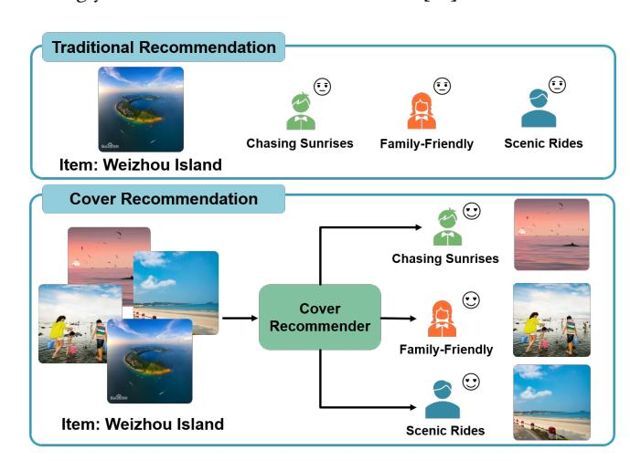
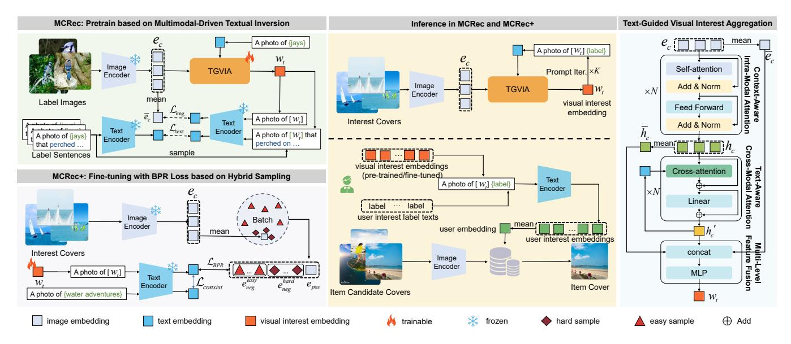
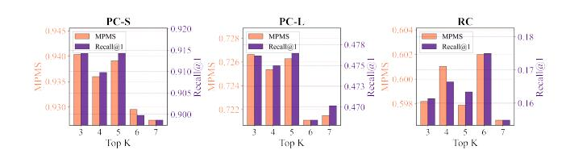
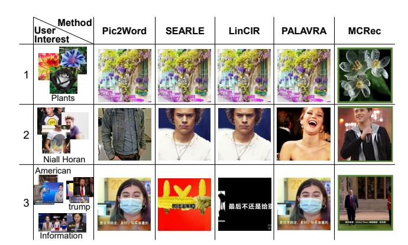
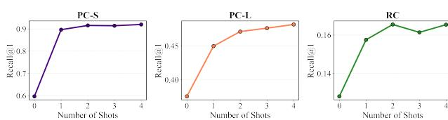

# MCRec: Few-Shot Multimodal Cover Recommendation via User Interest Profiles

[Weixin Zheng](https://orcid.org/0009-0008-4981-508X) weixin.zheng@mail.nankai.edu.cn School of Computer Science, DISSec, TJ Key Lab of NDST, TMCC, VCIP, AAIS, TBI Center, Nankai University Tianjin, China

[Chunyao Song](https://orcid.org/0000-0002-5715-5092)∗ chunyao.song@nankai.edu.cn School of Computer Science, DISSec, TJ Key Lab of NDST, TMCC, VCIP, AAIS, TBI Center, Nankai University Tianjin, China

[Tingjian Ge](https://orcid.org/0000-0003-2225-8291) tingjian\_ge@uml.edu Department of Computer Science, University of Massachusetts Lowell Lowell, Massachusetts, United States

# Abstract

Recommendation systems play a central role in modern services, yet often treat item cover images as static attributes, overlooking their influence on user decisions. We introduce the task of cover recommendation and study few-shot, interaction-free selection using multimodal user interest profiles. To address coldstart and sparsity challenges in traditional methods, we propose Multimodal Cover Recommendation (MCRec), a framework that leverages Vision-Language Models (VLMs) for multimodal feature extraction. Our approach includes: (1) a Text-Guided VisualInterest Aggregation network (TGVIA) integrating visual and textual representations; (2) multimodal interest embeddings fused via templated prompts; and (3) a multimodal-driven textual inversion technique enabling training-free generalization to new scenarios. We further propose MCRec+, a fine-tuning variant using hybrid sampling. To support evaluation, we construct three benchmarks and propose two new metrics. Extensive experiments show our methods significantly outperform baselines across datasets, especially with average gains of 3.72% in Recall@1, 1.70% in APMS and 1.25% in MPMS on MCRec. Code and data are publicly available from [https://github.com/WeixinZhengRec/MCRec.](https://github.com/WeixinZhengRec/MCRec)

# CCS Concepts

• Information systems → Recommender systems.

# Keywords

Cover Recommendation, Multimodal, VLMs, Few-shot learning

### ACM Reference Format:

Weixin Zheng, Chunyao Song, and Tingjian Ge. 2026. MCRec: Few-Shot Multimodal Cover Recommendation via User Interest Profiles. In Proceedings of the ACM Web Conference 2026 (WWW '26), April 13–17, 2026, Dubai, United Arab Emirates. ACM, New York, NY, USA, [12](#page-11-0) pages. [https://doi.org/10.1145/](https://doi.org/10.1145/3774904.3792334) [3774904.3792334](https://doi.org/10.1145/3774904.3792334)

# 1 Introduction

Recommendation systems are vital for mitigating information overload in modern information ecosystems. In typical applications

∗Corresponding author

© 2026 Copyright held by the owner/author(s). ACM ISBN 979-8-4007-2307-0/2026/04 <https://doi.org/10.1145/3774904.3792334>

such as e-commerce[\[22,](#page-8-0) [31\]](#page-8-1) and short-video platforms[\[5,](#page-8-2) [46\]](#page-8-3), the primary task of traditional recommendation systems is to predict user preferences for items—essentially answering "what item should be recommended to the user?". These systems generally assume that the visual representation of an item (e.g., a product's main image or video covers) is static and unique[\[13,](#page-8-4) [23,](#page-8-5) [24,](#page-8-6) [28\]](#page-8-7), overlooking the fact that different visual presentations of the same item may strongly influence its attractiveness to users[\[12\]](#page-8-8).

Figure 1: The difference between traditional recommendation and cover recommendation.

To address this gap, we introduce the cover recommendation task, which focuses on answering "how should an item be visually presented to a specific user to maximize its appeal?". The goal of cover recommendation is to capture personalized visual preferences and dynamically select, for each item, the cover most likely to trigger user interaction. This enhances exposure, increases clickthrough[\[18\]](#page-8-9) and provides significant commercial value[\[43\]](#page-8-10). For instance, e-commerce platforms may display fashion street photos of a product to users who favor stylish looks, and fabric details to users who value practicality, thereby boosting clicks and purchases. Similarly, streaming services can promote a single movie using posters tailored to each user, featuring their favored actors to boost engagement and retention. The difference between traditional recommendation and cover recommendation is shown in [Figure 1.](#page-0-0)

However, cover recommendation faces three key challenges: cold-start issues, data sparsity, and attribution difficulty. First, cover recommendation is a typical multi-faceted cold-start scenario. In

[This work is licensed under a Creative Commons Attribution 4.0 International License.](https://creativecommons.org/licenses/by/4.0) WWW '26, Dubai, United Arab Emirates

practice, beyond the well-known cold-start users[\[29,](#page-8-11) [49\]](#page-8-12) and items [\[33,](#page-8-13) [44\]](#page-8-14) in traditional systems, there is also the cold-start cover issue. For instance, e-commerce platforms may design new eyecatching promotional images or adjust product cover backgrounds [\[12\]](#page-8-8). These new covers lack historical interaction data at launch, making it hard to reliably predict appeal via past interaction signals.

Second, the data sparsity problem is more severe than item recommendation. While traditional recommendation [\[30,](#page-8-15) [45,](#page-8-16) [48\]](#page-8-17) relies on user-item binary interactions (e.g., clicks, purchases), cover recommendation requires granular user-item-cover ternary relationships. Since a user typically interacts with an item only once, and each exposure shows only one cover, the available user-itemcover-level data is extremely sparse.

Third, accurately attributing interaction behavior is challenging [\[17\]](#page-8-18), leading to significant noise in supervision signals. User behavior is driven by multiple factors, including the item's content (e.g., movie plot, theme, actors), visual presentation of the cover, and other contextual conditions[\[17\]](#page-8-18). It is hard to disentangle whether a click stems from the cover, the content, or other influences. Moreover, users typically have only one exposure to each item and see just one cover version, precluding direct modeling of different covers' true impacts. These issues severely hinder the construction of reliable supervision signals that reflect the covers' visual appeal based on interactions. Consequently, models may learn spurious correlations related to item content, compromising the accuracy and generalization performance of cover recommendations.

Traditional collaborative filtering[\[40\]](#page-8-19) approaches and their variants (e.g., NCF[\[21\]](#page-8-20), LightGCN[\[20\]](#page-8-21)) rely on user–item interaction matrices, making them poorly suited for this scenario. We turn to mining user preferences directly from cover content, with a particular emphasis on few-shot learning scenarios. Recent advances in vision–language models (VLMs) provide a promising alternative. Trained on large-scale image–text pairs, VLMs possess strong cross-modal alignment and representation abilities[\[27,](#page-8-22) [34\]](#page-8-23). In particular, textual inversion enables the embedding of new visual concepts into the text space of a pre-trained VLM using only a few examples[\[1,](#page-8-24) [2,](#page-8-25) [15,](#page-8-26) [37\]](#page-8-27). This allows to establish explicit associations between user interest labels (such as cyberpunk and minimalist, which are often provided during user registration) and cover styles, and constructs an "interest-cover" bridge to lessen dependence on historical interactions and resolve attribution ambiguity.

Building on this, we propose a new paradigm for cover recommendation that does not depend on user historical interactions: Few-shot Multimodal Cover Recommendation via Semantic User Profiles (MCRec). MCRec uses user interest labels with a small set of covers, and leverages pre-trained VLMs and textual inversion to extract and fuse multimodal interest features. This produces compact, semantically rich user interest representations that enable effective recommendations even in full cold-start scenarios. Specifically, we design a Text-Guided Visual Interest Aggregation (TGVIA) module to fuse multi-level visual interest features and map them to the semantic space. This history-free pipeline directly tackles sparsity and attribution issues. By leveraging the generalization power of pre-trained VLMs, it can recommend for new users, interests, or covers without training, thus mitigating the cold start problem.

Additionally, cover recommendation lacks standardized benchmarks. We filled this gap by constructing three real-world datasets

based on user-image interactions and interest labels (pinterestsmall[\[16\]](#page-8-28), pinterest-large[\[16\]](#page-8-28), reasoner[\[8\]](#page-8-29)). We also introduce dedicated evaluation metrics that jointly assess visual attractiveness, interest relevance, and hit rate, enabling comprehensive evaluation.

The main contributions of this work are as follows:

- We propose MCRec for the new task of cover recommendation: a VLM-based method integrating textual inversion and TGVIA for multimodal representation, with unsupervised pre-training enabling generalization to new scenarios. We also contribute three benchmark datasets and two metrics.
- We further propose MCRec+, a vector fine-tuning method based on proposed difficulty-aware hybrid sampling. This improves the model's ability to distinguish visually similar covers, enhancing fine-grained visual preference modeling.
- Experiments on the three datasets show that MCRec significantly outperforms baseline models in key metrics, while MCRec+ further improves performance and achieves SOTA.

# 2 Related Work

# 2.1 Vision-language models

VLMs, such as CLIP [\[34\]](#page-8-23) and BLIP[\[27\]](#page-8-22), are pre-trained on largescale image-text pairs to map image and textual modalities into a unified semantic space, thereby achieving strong feature extraction capability, modality alignment performance, and generalization[\[36\]](#page-8-30). These capabilities have enabled the widespread application in various areas, including zero-shot image classification[\[39\]](#page-8-31), text-image retrieval[\[6\]](#page-8-32), and image generation[\[47\]](#page-8-33). Furthermore, many studies directly employ CLIP's text and image encoders as feature extractors [\[25\]](#page-8-34), further validating the powerful potential of VLMs in cover recommendation. However, CLIP has inherent limitations in representing personalized concepts, struggling to adequately capture the specific preferences.Therefore, to effectively apply CLIP to cover recommendation task, it is essential to equip it with personalized modeling capabilities. To this end, we propose a novel approach to adapt CLIP for the downstream task of cover recommendation.

# 2.2 Personalized Image Retrieval based on Textual Inversion

To enable few-shot personalization in CLIP, existing research has primarily explored textual inversion techniques that adapt the model using a small set of specific images[\[37\]](#page-8-27). The core idea is to map images into a pseudo-token to represent personalization concepts. For instance, PALAVRA[\[10\]](#page-8-35) employs a two-stage personalization framework. It first uses textual inversion on a large-scale dataset to learn a general pseudo-token from image sets, then finetunes it for specific tasks. However, the second stage is computationally expensive.

Another train-free approach uses textual inversion with an MLP network to map single images into pseudo-tokens for one-shot retrieval. For example, Pic2Word[\[38\]](#page-8-36) aligns images and text in CLIP space, SEARLE[\[2\]](#page-8-25) employs unsupervised inversion and distillation, and LinCIR[\[19\]](#page-8-37) uniquely trains its projection module using only language data.

However, existing methods are ill-suited for cover recommendation, as they process only single images without textual guidance.

4.2.2 Bayesian Personalized Ranking Loss based on Hybrid Sampling. Based on the positive and sampled negative samples, we finetune the visual interest pseudo-token by the loss like BPR[\[5\]](#page-8-2):

LBPR = − 1 |��| ∑︁ (��,������,������) ∈�� ln ��(��ˆ��,������ − ��ˆ��,������) + �� (15)

where �� represents the samples in the batch, ��(·) is the sigmoid function, and ��ˆ��,pos and ��ˆ��,neg are the model's prediction scores between the interest representation ��ˆ�� and the positive sample ��pos and the negative sample ��neg, respectively. The �� term forces the model to learn distinctions between the embeddings.

To prevent the fine-tuned model from overfitting to the noise of covers, which could lead to a drift in the interest features, we introduce an interest text consistency constraint loss. This loss directly minimizes the Mean Squared Error between the interest text embedding ���� and the fine-tuned interest embedding ��ˆ�� :

Lconsist = 1 |��| ∑︁ �� ∈ T�� ∥��ˆ�� − ���� ∥ 2 2 (16)

where T�� denotes the set of labels contained in batch ��.

The final loss function for MCRec+ combines LBPR and Lconsist:

LHybrid = LBPR + �� · Lconsist (17)

where �� is a hyperparameter weighting the strength of the consistency constraint. By minimizing LHybrid, MCRec+ learns finegrained, more robust, and better-adapted interest visual representations for the specific target scenario, thereby obtaining superior user embeddings and improving cover recommendation performance.

### 5 Experiments

We conduct extensive experiments using three constructed benchmark datasets, as detailed in Appendix [A.1:](#page-8-41) PC-S, PC-L, and RC.

### 5.1 Experiment Setup

5.1.1 Implementation Details. Our work is implemented in Py-Torch and runs on a server with NVIDIA GeForce RTX3090. We utilize the CLIP ViT-L/14[4](#page-5-0) model as VLMs. The number of interest covers ���� are set to 3 to represent the few-shot scenario. The numbers of self-attention and cross-attention layers are set to 2 and 3, respectively, with a dropout rate of 0.2. The AdamW[\[32\]](#page-8-42) is employed for training with 0.1 weight decay. The batch size is 128, and the hidden layer dimension is 1024.

During pre-training, each label from the training vocabulary dictionary (Open Images V7) is associated with the top 2 most similar images from the predefined image gallery (COCO 2017). This stage uses a contrastive temperature of 0.08 and a learning rate of 5 × 10−4 for 20 epochs. When fine-tuning, the parameters are trained for 5 epochs with a learning rate of 0.1.

5.1.2 Evaluation Protocols. The cover recommendation task aims to improve the accuracy of recommended covers, with emphasis on the quality of the TOP-1 result. We measure recommendation accuracy from two complementary dimensions: interest label semantic matching and actual user interaction behavior.

First, based on interest label semantic matching, we propose two new metrics: Average Preference Matching Score (APMS) and Maximum Preference Matching Score (MPMS). These quantify the semantic alignment between user interest and recommended covers. For each interaction between user �� ∈ U and item �� ∈ I, the associated interest label set is T��. User ��'s preference centroid vector is defined as g�� = | T�� | Í �� ∈ T�� ������������ (��), where |T�� | is the number of user interest labels, and ������������ (·) is a text encoding function mapping label texts to semantic vectors. We implement this encoding using the pre-trained all-MiniLM-L6-v2[5](#page-5-1) that effectively converts text to semantic vectors for similarity computation. Each label ��ˆ ∈ Tˆ �� of a recommended cover ��ˆ is similarly encoded as gˆ�� = ������������ (��ˆ). The Preference Matching Score (PMS) between user �� and cover label ��ˆ is their cosine similarity:

PMS(��,��ˆ) = cos(gˆ�� , g��) (18)

Based on this, MPMS and APMS are formalized as:

MPMS = 1 |D | ∑︁ (��,��,�� ) ∈D max ��ˆ∈Tˆ PMS(��,��ˆ) (19)

APMS = 1 |D | ∑︁ (��,��,�� ) ∈D 1 |Tˆ �� | ∑︁ ��ˆ∈Tˆ PMS(��,��ˆ) (20)

where D is the set of all user-item-cover interaction triplets. MPMS reflects the maximum alignment between user preferences and the most relevant cover label, measuring the cover's ability to satisfy core user interest. APMS reflects the average alignment across all cover labels, measuring the cover's overall appeal to the user.

Second, based on actual user interaction behavior, we introduce Recall@1 to directly measure the accuracy of correctly recommending the target cover among candidates. While TOP-1 recommendation is our primary metric, we also evaluate overall ranking quality using mean Reciprocal Rank (mRR)[\[11\]](#page-8-43), Recall@K[\[2\]](#page-8-25), NDCG@K[\[26\]](#page-8-44), and mean Average Precision (mAP@K)[\[3\]](#page-8-45) for a comprehensive assessment. However, as the task prioritizes high-quality top results, larger K values are less indicative of core performance. Consequently, we set K to 2 and 3.

5.1.3 Baselines. We compare our proposed MCRec and MCRec+ method against the CLIP variants: CLIP-text, CLIP-image, and CLIPmultimodal. Personalized image retrieval: PALAVRA. Zero-shot composed image retrieval: Freedom, OSrCIR, Pic2Word, SEARLE, and LinCIR. To ensure a fair comparison, all methods are based on the same CLIP ViT-L/14 backbone and adopt a unified input preprocessing pipeline. More details are provided in Appendix [A.4.](#page-11-1)

# 5.2 Overall Performance

[Table 2](#page-6-0) presents the performance comparison between our proposed method and various baseline models across the PC-L, PC-S, and RC datasets. On the PC-S dataset, label semantics are more specific, the distinction between labels is high, and the visual differences

4<https://huggingface.co/openai/clip-vit-large-patch14>

5<https://huggingface.co/sentence-transformers/all-MiniLM-L6-v2>

Table 2: The overall experiment performance on three datasets. The bold is the best result and the underline is the second-best

| Dataset Method  |   | MPMS   |   | APMS   |   | mRR    |   | Recall@1 |   | Recall@2 |   | NDCG@2 |   | mAP@2  |   | Recall@3 |   | NDCG@3 |   | mAP@3  |
|-----------------|---|--------|---|--------|---|--------|---|----------|---|----------|---|--------|---|--------|---|----------|---|--------|---|--------|
| CLIP-text       | 0 | 6002   | 0 | 5289   | 0 | 6655   | 0 | 5122     | 0 | 6748     | 0 | 6148   | 0 | 5935   | 0 | 7584     | 0 | 6566   | 0 | 6214   |
| CLIP-image      | 0 | 8459   | 0 | 7988   | 0 | 8608   | 0 | 7862     | 0 | 8708     | 0 | 8396   | 0 | 8285   | 0 | 9276     | 0 | 8680   | 0 | 8474   |
| CLIP-multimodal | 0 | 8664   | 0 | 8144   | 0 | 8799   | 0 | 8185     | 0 | 8842     | 0 | 8599   | 0 | 8513   | 0 | 9321     | 0 | 8839   | 0 | 8673   |
| Freedom         | 0 | 7559   | 0 | 6911   | 0 | 7956   | 0 | 6882     | 0 | 8263     | 0 | 7753   | 0 | 7572   | 0 | 8764     | 0 | 8004   | 0 | 7739   |
| OSrCIR PC-S     | 0 | 6280   | 0 | 5650   | 0 | 6860   | 0 | 5145     | 0 | 7539     | 0 | 6655   | 0 | 6342   | 0 | 8229     | 0 | 7001   | 0 | 6572   |
| Pic2Word        | 0 | 8927   | 0 | 8316   | 0 | 9155   | 0 | 8508     |   | 0.9555   |   | 0.9168 | 0 | 9031   |   | 0.9788   | 0 | 9285   | 0 | 9109   |
| SEARLE          |   | 0.9158 |   | 0.8526 |   | 0.9261 |   | 0.8820   |   | 0.9343   | 0 | 9150   |   | 0.9081 | 0 | 9744     |   | 0.9350 |   | 0.9215 |
| LinCIR          | 0 | 8738   | 0 | 8091   | 0 | 8989   | 0 | 8374     | 0 | 9165     | 0 | 8873   | 0 | 8769   | 0 | 9532     | 0 | 9057   | 0 | 8892   |
| MCRec           |   | 0.9404 |   | 0.8778 |   | 0.9477 |   | 0.9143   |   | 0.9555   |   | 0.9403 |   | 0.9349 |   | 0.9855   |   | 0.9553 |   | 0.9449 |
| PALAVRA         | 0 | 9393   | 0 | 8785   | 0 | 9459   | 0 | 9109     | 0 | 9555     | 0 | 9390   | 0 | 9332   |   | 0.9866   | 0 | 9546   | 0 | 9436   |
| MCRec+          |   | 0.9517 |   | 0.8845 |   | 0.9599 |   | 0.9332   |   | 0.9710   |   | 0.9571 |   | 0.9521 |   | 0.9866   |   | 0.9649 |   | 0.9573 |
| CLIP-text       | 0 | 6653   | 0 | 4897   | 0 | 5513   | 0 | 3865     | 0 | 5268     | 0 | 4750   | 0 | 4566   | 0 | 6234     | 0 | 5233   | 0 | 4888   |
| CLIP-image      | 0 | 6406   | 0 | 4876   | 0 | 4945   | 0 | 3337     | 0 | 4550     | 0 | 4102   | 0 | 3944   | 0 | 5385     | 0 | 4520   | 0 | 4222   |
| CLIP-multimodal | 0 | 6721   | 0 | 5088   | 0 | 5414   | 0 | 3860     | 0 | 5108     | 0 | 4647   | 0 | 4484   | 0 | 5939     | 0 | 5063   | 0 | 4761   |
| Freedom         | 0 | 6786   | 0 | 5059   | 0 | 5670   | 0 | 4062     | 0 | 5431     | 0 | 4926   | 0 | 4747   | 0 | 6395     | 0 | 5408   | 0 | 5068   |
| OSrCIR PC-L     | 0 | 6469   | 0 | 4790   | 0 | 5331   | 0 | 3620     | 0 | 5086     | 0 | 4545   | 0 | 4353   | 0 | 6064     | 0 | 5034   | 0 | 4679   |
| Pic2Word        |   | 0.7189 |   | 0.5380 |   | 0.6173 |   | 0.4665   |   | 0.6036   |   | 0.5530 |   | 0.5351 |   | 0.6907   |   | 0.5966 |   | 0.5641 |
| SEARLE          | 0 | 7097   | 0 | 5292   | 0 | 6088   | 0 | 4510     | 0 | 6002     | 0 | 5452   | 0 | 5256   | 0 | 6900     | 0 | 5901   | 0 | 5556   |
| LinCIR          | 0 | 6988   | 0 | 5234   | 0 | 5971   | 0 | 4387     | 0 | 5832     | 0 | 5298   | 0 | 5109   | 0 | 6761     | 0 | 5763   | 0 | 5419   |
| MCRec           |   | 0.7266 |   | 0.5455 |   | 0.6267 |   | 0.4762   |   | 0.6160   |   | 0.5644 |   | 0.5461 |   | 0.7016   |   | 0.6072 |   | 0.5747 |
| PALAVRA         | 0 | 7108   | 0 | 5365   | 0 | 6157   | 0 | 4610     | 0 | 6072     | 0 | 5533   | 0 | 5341   | 0 | 6955     | 0 | 5974   | 0 | 5636   |
| MCRec+          |   | 0.7351 |   | 0.5509 |   | 0.6427 |   | 0.4949   |   | 0.6359   |   | 0.5839 |   | 0.5655 |   | 0.7207   |   | 0.6263 |   | 0.5938 |
| CLIP-text       | 0 | 5907   | 0 | 3334   | 0 | 3008   | 0 | 1198     | 0 | 2080     | 0 | 1754   | 0 | 1639   | 0 | 2995     | 0 | 2212   | 0 | 1944   |
| CLIP-image      | 0 | 5606   | 0 | 3222   | 0 | 2190   | 0 | 0572     | 0 | 1155     | 0 | 0940   | 0 | 0864   | 0 | 1769     | 0 | 1247   | 0 | 1068   |
| CLIP-multimodal | 0 | 5720   | 0 | 3253   | 0 | 2297   | 0 | 0666     | 0 | 1255     | 0 | 1037   | 0 | 0960   | 0 | 1893     | 0 | 1357   | 0 | 1173   |
| Freedom         | 0 | 5876   | 0 | 3328   | 0 | 2997   | 0 | 1162     | 0 | 2062     | 0 | 1730   | 0 | 1612   | 0 | 3022     | 0 | 2210   | 0 | 1932   |
| OSrCIR RC       | 0 | 5819   | 0 | 3306   | 0 | 2961   | 0 | 1167     | 0 | 2031     | 0 | 1712   | 0 | 1599   | 0 | 2924     | 0 | 2158   | 0 | 1896   |
| Pic2Word        | 0 | 5902   | 0 | 3342   | 0 | 3133   | 0 | 1264     | 0 | 2205     | 0 | 1858   | 0 | 1735   | 0 | 3233     | 0 | 2372   | 0 | 2077   |
| SEARLE          |   | 0.5956 | 0 | 3360   |   | 0.3435 | 0 | 1510     |   | 0.2677   |   | 0.2247 |   | 0.2094 |   | 0.3686   |   | 0.2751 |   | 0.2430 |
| LinCIR          |   | 0.5982 |   | 0.3361 | 0 | 3430   |   | 0.1531   | 0 | 2606     | 0 | 2209   | 0 | 2068   | 0 | 3657     | 0 | 2735   | 0 | 2419   |
| MCRec           |   | 0.5982 |   | 0.3386 |   | 0.3617 |   | 0.1614   |   | 0.2967   |   | 0.2468 |   | 0.2291 |   | 0.4094   |   | 0.3031 |   | 0.2666 |
| PALAVRA         | 0 | 6004   | 0 | 3377   | 0 | 3472   | 0 | 1553     | 0 | 2696     | 0 | 2274   | 0 | 2125   | 0 | 3798     | 0 | 2825   | 0 | 2492   |
| MCRec+          |   | 0.6174 |   | 0.3467 |   | 0.3866 |   | 0.1914   |   | 0.3271   |   | 0.2770 |   | 0.2592 |   | 0.4382   |   | 0.3325 |   | 0.2963 |

among candidate covers are significant. As a result, all methods perform well on the dataset. A downward trend in performance is observed for all methods from PC-S to PC-L and to RC, indicating a progressive increase in the challenge posed by the datasets. This is due to the significantly increased difficulty of the cover recommendation task, which stems from users' multiple interest labels and the heightened similarity among candidate covers.

Notably, as the similarity between the target cover and candidate covers increases, the performance of the image-only CLIP-image method degrades more significantly than the text-only CLIP-text method. On the PC-L and RC datasets, the performance of CLIPimage even falls below CLIP-text. This degradation is particularly pronounced on the RC dataset, where CLIP-image's performance on Recall@1 is worse than random recommendation (Recall@1 of random recommendation is 0.1). This reflects the intra-class characteristics among different covers of the same item. Generally, the

multimodal CLIP-multimodal method outperforms CLIP methods using only single-modality text or image features, demonstrating the effectiveness of multimodality. However, on the RC dataset, the performance of the multimodal fusion method declines. This may be attributed to the excessively high similarity in the image features among the candidate elements, which makes it difficult for simple feature extraction and fusion strategies to capture discriminative cues effectively.

We observe that both Freedom and OSrCIR, which utilize discrete explicit text personalizations, perform poorly. Freedom introduces external images and labels, leading to a significant loss of personalized user characteristics. For OSrCIR, we argue it works effectively only when prompts align with the specific task, the LLM, and CLIP weights. However, cover recommendation requires more complex adaptation and is theoretically limited in fully conveying personalized visual information through text alone. Furthermore, we find that OSrCIR introduces substantial noisy content unrelated to personalized visual features. In the comparison of few-shot methods, other models exhibit their respective advantages on different datasets. However, our method demonstrates a significant advantage across all evaluation metrics, achieving state-of-the-art performance. On the key metrics of Recall@1, APMS, and MPMS, our method improves upon the second best by an average of 3.72%, 1.70%, and 1.25%, respectively. In the overall ranking metric mRR, MCRec shows an average improvement of 3.05%. It consistently demonstrates an advantage in both key and various supplementary ranking metrics. These gains show our method effectively extracts and fuses discriminative features from interest label texts and images to form robust user preference representations. Remarkably, pre-trained MCRec still outperforms the fine-tuned PALAVRA model on most datasets, supporting the effectiveness.

When fine-tuned, MCRec+ achieves a significant performance advantage over PALAVRA. Crucially, our method improved substantially after fine-tuning, with an average improvement of 1.86% on MPMS, 1.37% on APMS, 8.20% on Recall@1, and 3.57% on mRR. We attribute this to two factors: its adaptive cover recommendations by BPR Loss based on the Hybrid Sample and the consistency of the data distribution. These characteristics show that our method can adapt to different interest labels in cover recommendations.

# 5.3 Ablation Study

This section presents ablation studies on MCRec and MCRec+ across three datasets to evaluate the contribution of each component. To this end, we analyze the two model stages separately to avoid confounding effects. First, we ablate key pre-training components in MCRec. Then, for MCRec+, we use the pre-trained embeddings as initial features to assess the impact of its subsequent components, as detailed below:

### MCRec

- w/o TGVIA: Replaces the TGVIA with a 3-layer MLP to directly extract common features from the image set, without text-aware aggregation.
- w/o Limg: Removes the visual loss term from the loss function during pre-training.
- w/o Ltext: Removes the text loss term from the loss function.

### MCRec+

- w/o LBPR: Replaces BPR Loss with a matching-based InfoNCE loss, while retaining the text semantic regularization term to ensure fair comparison.
- w/o Hybrid Sampling: Replaces the difficulty-aware hybrid sampling strategy with in-batch random negative sampling.

As shown in Appendix [Table 3,](#page-9-0) removing any first-stage component causes performance degradation across datasets. The TGVIA module outperforms a simple MLP by fusing text-aware, contextaware, and raw image features into richer multi-level representations. Both the visual Loss (Limg) and text Loss (Ltext) are critical: removing the former weakens visual representation, while removing the latter harms generalization. The performance gain stems from the joint contribution of TGVIA, Limg, and Ltext in extracting and integrating personalized multimodal features.

Ablating any component in MCRec+ also degrades performance. The Hybrid Sampling strategy enhances cover recommendation by

forcing the model to distinguish between visually similar covers, thereby improving specialization without overfitting. Moreover, BPR Loss outperforms InfoNCE, as its ability to learn difficultyaware ordinal relationships complements the sampling strategy, whereas InfoNCE focuses on batch-level contrast and struggles with fine-grained ranking. Consequently, MCRec+ benefits from this synergistic design, achieving stronger recommendation performance.

# 5.4 Further Analysis

We provide a comprehensive analysis to further validate our methods, with complete details in Appendix [A.3.](#page-10-2) Our investigation examines the impact of the pre-training vocabulary (Appendix [A.3.1\)](#page-10-3), the number of images per vocabulary item during pre-training (Appendix [A.3.2\)](#page-10-1), the number of prompt iterations during inference (Appendix [A.3.3\)](#page-10-0), the model's few-shot learning capability (Appendix [A.3.4\)](#page-11-2), efficiency analysis (Appendix [A.3.5\)](#page-11-3), and a qualitative case study (Appendix [A.4\)](#page-11-4).

# 6 Conclusion

In this paper, we introduce the cover recommendation task and propose MCRec and MCRec+ based on CLIP for the few-shot multimodal setting. Our methods learn multimodal interest features from user profiles, enabling recommendations without specific interaction histories. We propose Visual-Guided Text-Interest Aggregation (VGTIA) to fuse multi-level visual interest guided by interest text into a compact "interest pseudo-token". Notably, we incorporate multimodal textual inversion techniques to achieve high-quality visual representations of few-shot covers. Through unsupervised pre-training, the MCRec method acquires strong generalized recommendation capabilities. To further enhance recommendation performance within a specific interest domain, we propose MCRec+ based on MCRec. It fine-tunes visual vectors with difficulty-aware hybrid sampling, strengthening the model's ability to perceive and distinguish subtle differences between semantically similar covers. For a comprehensive evaluation, we construct three cover recommendation datasets and employ a series of recommendation-relevant metrics. Additionally, we propose two new metrics, MPMS and APMS, to measure the semantic match between recommended covers and user interests. Extensive experiments demonstrate that our methods achieve state-of-the-art performance on core metrics, validating superiority.

In the future, we plan to construct higher-quality datasets based on real-world product candidate covers and incorporate additional modalities. We also aim to explore universal representation methods based on Multimodal Large Language Models (MLLMs), extending this research to recommendation scenarios capable of simultaneously processing multimodal content, including audio and video.

# Acknowledgments

This work was supported by the National Natural Science Foundation of China (62172237). Tingjian Ge was supported in part by NSF (IIS-2124704, OAC-2106740) and U.S. Army CCDC (W911QY2020005). We also acknowledge support from Enowa Network Technology Co., Ltd., and thank Feipeng Dou and Hao Li for their valuable guidance.

# References

[1] Yuval Alaluf, Elad Richardson, Sergey Tulyakov, et al. 2024. MyVLM: Personalizing VLMs for User-Specific Queries. In ECCV. 73–91. [2] Alberto Baldrati, Lorenzo Agnolucci, Marco Bertini, et al. 2023. Zero-Shot Composed Image Retrieval with Textual Inversion. In IEEE ICCV. 15292–15301. [3] Steven M. Beitzel, Eric C. Jensen, and Ophir Frieder. 2018. MAP. In Encyclopedia of Database Systems, Second Edition. Springer. [4] Usha Bhalla, Alex Oesterling, Suraj Srinivas, et al. 2024. Interpreting CLIP with Sparse Linear Concept Embeddings (SpLiCE). In NeurIPS. [5] Gaode Chen, Ruina Sun, Yinjie Jiang, et al. 2025. A Cold-start Recommendation System at Kuaishou Designed from the Short-video Perspective. In ACM WWW. 124–132. [6] Pengxu Chen, Huazhong Liu, Jihong Ding, et al. 2025. Class Activation Values: Lucid and Faithful Visual Interpretations for CLIP-based Text-Image Retrievals. In ACM SIGIR. 844–853. [7] Ting Chen, Simon Kornblith, Mohammad Norouzi, et al. 2020. A Simple Framework for Contrastive Learning of Visual Representations. In ICML. 1597–1607. [8] Xu Chen, Jingsen Zhang, Lei Wang, et al. 2023. REASONER: An Explainable Recommendation Dataset with Comprehensive Labeling Ground Truths. In NeurIPS. [9] Xu Chen, Jingsen Zhang, Lei Wang, et al. 2023. REASONER: An Explainable Recommendation Dataset with Multi-aspect Real User Labeled Ground Truths Towards more Measurable Explainable Recommendation. CoRR abs/2303.00168 (2023). [10] Niv Cohen, Rinon Gal, Eli A. Meirom, et al. 2022. "This Is My Unicorn, Fluffy": Personalizing Frozen Vision-Language Representations. In ECCV. 558–577. [11] Nick Craswell. 2018. Mean Reciprocal Rank. In Encyclopedia of Database Systems, Second Edition. Springer. [12] Ádám Tibor Czapp, Mátyás Jani, Bálint Domián, et al. 2024. Dynamic Product Image Generation and Recommendation at Scale for Personalized E-commerce. In ACM RecSys. 768–770. [13] Yuzhuo Dang, Zhiqiang Pan, Xin Zhang, et al. 2025. Discrepancy Learning Guided Hierarchical Fusion Network for Multi-modal Recommendation. Knowl. Based Syst. 317 (2025), 113496. [14] Nikos Efthymiadis, Bill Psomas, Zakaria Laskar, et al. 2025. Composed Image Retrieval for Training-FREE DOMain Conversion. In WACV. 1723–1733. [15] Rinon Gal, Yuval Alaluf, Yuval Atzmon, et al. 2023. An Image is Worth One Word: Personalizing Text-to-Image Generation using Textual Inversion. In ICLR. [16] Xue Geng, Hanwang Zhang, Jingwen Bian, et al. 2015. Learning Image and User Features for Recommendation in Social Networks. In IEEE ICCV. 4274–4282. [17] Fernando Amat Gil, Ashok Chandrashekar, Tony Jebara, et al. 2018. Artwork personalization at netflix. In ACM RecSys. 487–488. [18] Anjan Goswami, Naren Chittar, and Sung H. Chung. 2011. A study on the impact of product images on user clicks for online shopping. In ACM WWW. 45–46. [19] Geonmo Gu, Sanghyuk Chun, Wonjae Kim, et al. 2024. Language-only Efficient Training of Zero-shot Composed Image Retrieval. In IEEE CVPR. 13225–13234. [20] Xiangnan He, Kuan Deng, Xiang Wang, et al. 2020. LightGCN: Simplifying and Powering Graph Convolution Network for Recommendation. In ACM SIGIR. 639–648. [21] Xiangnan He, Lizi Liao, Hanwang Zhang, et al. 2017. Neural Collaborative Filtering. In ACM WWW. 173–182. [22] Yuan He, Yonghong Du, and Xiaofei Pu. 2025. Personalized Recommendation System of E-Commerce in the Digital Economy Era: Enhancing Social Connections with Graph Attention Networks. Appl. Artif. Intell. 39, 1 (2025). [23] Jun Hu, Bryan Hooi, Bingsheng He, et al. 2025. Modality-Independent Graph Neural Networks with Global Transformers for Multimodal Recommendation. In AAAI. 11790–11798. [24] Songwen Hu, Ryan A. Rossi, Tong Yu, et al. 2025. Interactive Visualization Recommendation with Hier-SUCB. In ACM WWW. 313–321. [25] Yi Huang, Jiancheng Huang, Yifan Liu, et al. 2025. Diffusion Model-Based Image Editing: A Survey. IEEE Trans. Pattern Anal. Mach. Intell. 47, 6 (2025), 4409–4437. [26] Kalervo Järvelin and Jaana Kekäläinen. 2002. Cumulated gain-based evaluation of IR techniques. ACM Trans. Inf. Syst. 20, 4 (2002), 422–446. [27] Junnan Li, Dongxu Li, Silvio Savarese, et al. 2023. BLIP-2: Bootstrapping Language-Image Pre-training with Frozen Image Encoders and Large Language Models. In ICML. 19730–19742. [28] Xinhang Li, Jingbo Zhou, Wei Chen, et al. 2024. Visualization Recommendation with Prompt-based Reprogramming of Large Language Models. In ACL. 13250– 13262. [29] Yichen Li, Yijing Shan, Yi Liu, et al. 2025. Personalized Federated Recommendation for Cold-Start Users via Adaptive Knowledge Fusion. In ACM WWW. 2700–2709. [30] Shenghao Liu, Lingyun Lu, and Bang Wang. 2025. Mining User-Item Interactions via Knowledge Graph for Recommendation. Trans. Recomm. Syst. 3, 3 (2025), 32:1–32:19. [31] Yiliang Liu, Kai Wang, Fan Wu, et al. 2025. Enhancing Movie Recommendations in Fully Automated Vehicles: A Multi-Interest Approach With Transformer Models. IEEE Internet Things J. 12, 12 (2025), 19177–19188. [32] Ilya Loshchilov and Frank Hutter. 2019. Decoupled Weight Decay Regularization. In ICLR. [33] Yunze Luo, Yuezihan Jiang, Yinjie Jiang, et al. 2025. Online Item Cold-Start Recommendation with Popularity-Aware Meta-Learning. In ACM KDD. 927–937. [34] Alec Radford, Jong Wook Kim, Chris Hallacy, et al. 2021. Learning Transferable Visual Models From Natural Language Supervision. In ICML. 8748–8763. [35] Steffen Rendle, Christoph Freudenthaler, Zeno Gantner, et al. 2009. BPR: Bayesian Personalized Ranking from Implicit Feedback. In UAI. 452–461. [36] Andrea Rosasco, Stefano Berti, Giulia Pasquale, et al. 2024. ConCon-Chi: Concept-Context Chimera Benchmark for Personalized Vision-Language Tasks. In IEEE CVPR. 22239–22248. [37] Nataniel Ruiz, Yuanzhen Li, Varun Jampani, et al. 2023. DreamBooth: Fine Tuning Text-to-Image Diffusion Models for Subject-Driven Generation. In IEEE CVPR. 22500–22510. [38] Kuniaki Saito, Kihyuk Sohn, Xiang Zhang, et al. 2023. Pic2Word: Mapping Pictures to Words for Zero-shot Composed Image Retrieval. In IEEE CVPR. 19305–19314. [39] Fawaz Sammani and Nikos Deligiannis. 2024. Interpreting and Analysing CLIP's Zero-Shot Image Classification via Mutual Knowledge. In NeurIPS. [40] Shipeng Song, Bin Liu, Fei Teng, et al. 2025. Self-supervised contrastive learning for implicit collaborative filtering. Eng. Appl. Artif. Intell. 139 (2025), 109563. [41] Yuanmin Tang, Jue Zhang, Xiaoting Qin, et al. 2025. Reason-before-Retrieve: One-Stage Reflective Chain-of-Thoughts for Training-Free Zero-Shot Composed Image Retrieval. In IEEE CVPR. 14400–14410. [42] Ashish Vaswani, Noam Shazeer, Niki Parmar, et al. 2017. Attention is All you Need. In NeurIPS. 5998–6008. [43] Mengyue Wang, Xin Li, Yidi Liu, et al. 2024. A contrast-composition-distraction framework to understand product photo background's impact on consumer interest in E-commerce. Decis. Support Syst. 178 (2024), 114124. [44] Wenbo Wang, Bingquan Liu, Lili Shan, et al. 2024. Preference Aware Dual Contrastive Learning for Item Cold-Start Recommendation. In AAAI. 9125–9132. [45] Xinyuan Wang, Liang Wu, Liangjie Hong, et al. 2024. LLM-Enhanced User-Item Interactions: Leveraging Edge Information for Optimized Recommendations. CoRR abs/2402.09617 (2024). [46] Han Xu, Taoxing Pan, Zhiqiang Liu, et al. 2025. Mutual Information-aware Knowledge Distillation for Short Video Recommendation. In ACM KDD. 2725– 2734. [47] Mengling Xu, Jie Wang, Ming Tao, et al. 2025. CookGALIP: Recipe Controllable Generative Adversarial CLIPs With Sequential Ingredient Prompts for Food Image Generation. IEEE Trans. Multim. 27 (2025), 2772–2782. [48] Li Yu, Shuyang Sheng, Yonggang Liu, et al. 2025. Group Modeling and Recommendation Based on Multi-Behavior Interactions in Live Streaming E-Commerce. In ICASSP. 1–5. [49] Guohang Zeng, Qian Zhang, Guangquan Zhang, et al. 2025. Sharpness-Aware Cross-Domain Recommendation to Cold-Start Users. IEEE Trans. Syst. Man Cybern. Syst. 55, 6 (2025), 4244–4257. A Appendix A.1 Dataset Construction Directly obtaining real-world data on how different item covers affect user interactions for the same item is challenging. To evaluate item cover recommendation tasks and address the lack of task-specific datasets, we constructed new cover recommendation datasets based on existing item recommendation datasets. Selected datasets must satisfy two key criteria: (1) contain real user explicit interaction interest labels; and (2) visual information plays a significant role in user-item interactions. Accordingly, we utilized Pinterest[\[16\]](#page-8-28) and REASONER[\[9\]](#page-8-46) public datasets to construct three benchmarks: Pinterest Cover-small, PC-S (Small-scale dataset with single-label users.), Pinterest Cover-large, PC-L (Largerscale dataset with single-label users.), and REASONER Cover, RC (Large-scale dataset with multi-label users.) A.1.1 Data Preprocess. To obtain effective data and prepare for the cover construction, we perform preprocessing on the Pinterest and Reasoner datasets respectively. Pinterest Cover Dataset Introduction: Pinterest[\[16\]](#page-8-28) is an image-centric recommendation dataset with real user interaction labels from the Pinterest platform. It features high sparsity and is

commonly used for visual recommendation. Users "pin" images to

Table 3: Ablation Study Results on MCRec and MCRec+

| Dataset    | Ablation |          |        | MPMS |        | APMS |        | Recall@1 |
|------------|----------|----------|--------|------|--------|------|--------|----------|
| w/o        | TGVIA    |          | 0      | 8143 | 0      | 7509 | 0      | 7572     |
| w/o        | L        | img      | 0      | 8524 | 0      | 8058 | 0      | 7962     |
| w/o        | L        | text     | 0      | 7515 | 0      | 6859 | 0      | 6871     |
| MCRec PC-S |          |          | 0.9404 |      | 0.8778 |      | 0.9143 |          |
| w/o        | Hybrid   | Sampling | 0      | 9410 | 0      | 8758 | 0      | 9165     |
| w/o        | L        | BPR      | 0      | 9512 | 0.8857 |      | 0      | 9298     |
| MCRec+     |          |          | 0.9517 |      | 0      | 8845 | 0.9332 |          |
| w/o        | TGVIA    |          | 0      | 6845 | 0      | 5117 | 0      | 4180     |
| w/o        | L        | img      | 0      | 6640 | 0      | 5039 | 0      | 3748     |
| w/o        | L        | text     | 0      | 6808 | 0      | 5081 | 0      | 4095     |
| MCRec PC-L |          |          | 0.7266 |      | 0.5455 |      | 0.4762 |          |
| w/o        | Hybrid   | sampling | 0      | 7343 | 0      | 5498 | 0      | 4919     |
| w/o        | L        | BPR      | 0      | 7330 | 0      | 5505 | 0      | 4919     |
| MCRec+     |          |          | 0.7351 |      | 0.5509 |      | 0.4949 |          |
| w/o        | TGVIA    |          | 0      | 5937 | 0      | 3368 | 0.1656 |          |
| w/o        | L        | img      | 0      | 5698 | 0      | 3264 | 0      | 0862     |
| w/o        | L        | text     | 0      | 5922 | 0      | 3359 | 0      | 1557     |
| MCRec RC   |          |          | 0.5982 |      | 0.3386 |      | 0      | 1614     |
| w/o        | Hybrid   | Sampling | 0      | 6158 | 0      | 3465 | 0      | 1887     |
| w/o        | L        | BPR      | 0      | 6122 | 0      | 3456 | 0      | 1782     |
| MCRec+     |          |          | 0.6174 |      | 0.3467 |      | 0.1914 |          |

personal "boards" and assign "category" labels, aligning with our requirements for explicit user interest labels and visual importance. Due to a lack of image tags, we assigned the user's valid interaction interest label to the image.

Pinterest Cover-small Preprocess: To ensure high quality, strict filtering was applied. First, images with fewer than five interactions or download failures were removed. Then, users with invalid images or fewer than five interactions were removed. Finally, nonexistent image tags were filtered out using the new user interaction interest labels. Each interaction record includes a user interest label (from the interaction), a target item cover (the interacted-upon image), and an item cover label (the image tag). The statistics of the preprocessed dataset are shown in [Table 4.](#page-9-1)

Pinterest Cover-large Preprocess: We applied an interaction threshold of two for images and five for users. Detailed statistics are provided in [Table 4.](#page-9-1)

REASONER Cover Dataset Preprocess: REASONER[\[9\]](#page-8-46) is an explainable recommendation dataset featuring multi-aspect real user interest labels, video metadata, and user feedback (e.g., viewing intent, multi-dimensional interests, ratings). It was collected via a custom video recommendation platform that displayed titles, tags, and keyframes. To adapt it for cover recommendation, we performed the following preprocessing: interactions with negative intent (e.g., "don't want to watch") and non-semantic tags were removed; the middle frame of a video's keyframe sequence was used as the visual item cover for its representativeness; the user's multi-aspect interest labels were retained as the user interest label, and the video tags were used as the item cover label. Due to the high original quality of the dataset, no additional user or image

removal was necessary. The final statistics are presented in [Table 4.](#page-9-1) Compared to Pinterest, this dataset provides multiple labels per user and a significantly larger label space.

Table 4: Dataset Statistics

| Dataset | #Users | #Covers | #Interest Labels | #Interactions |
|---------|--------|---------|------------------|---------------|
| PC-S    | 83     | 987     | 25               | 1757          |
| PC-L    | 2,090  | 32,160  | 396              | 47,627        |
| RC      | 2,997  | 4,484   | 1,576            | 9,549         |

A.1.2 Cover Recommendation Dataset Construction. To simulate varying covers for the same item, we further processed the data:

1. Multimodal Interest Representation: For each interest label, select the top 3 most-interacted images as preferred visual information, forming the multimodal "label-image" representation.

2. Validation/Test Set Splitting: Interactions involving images used for multimodal interest representation were first removed. The remaining interactions were then partitioned by user and interest into validation and test sets with a 1:1 ratio. To ensure the completeness of the test set, interactions where a user had only one item for a specific interest label were exclusively assigned to the test set.

3. Candidate Cover Generation: For each user interaction in the validation/test sets, we used the pre-trained CLIP B/32[6](#page-9-2) to compute the cosine similarity between the target image and all other images. We selected the top-K (K=9) most visually similar images as candidate covers, excluding those sharing the target interest label to ensure visual and semantic diversity.

# A.2 Introduction on baseline methods

Detailed descriptions of baselines are provided below:

- CLIP-image only: It uses only the mean CLIP feature of interest images as the interest representation.
- CLIP-text only: It uses only the text feature of the interest label to represent interest.
- CLIP-multimodal: It fuses the textual feature of the interest label and the mean-pooled visual feature of the interest images to get interest representation.
- Freedom[\[14\]](#page-8-47): It is a training-free, CLIP-based method that retrieves three proxy images and inverts five discrete words via memory banks, then fuses them through high-frequency filtering to form composite queries.
- OsrCIR[\[41\]](#page-8-48): It is a training-free method for compositional image retrieval. It uses a MLLM (Qwen-VL-max) to generate target descriptions via a Reflective Chain-of-Thought, with a fixed manipulation text "related to label", and retrieves images based on CLIP similarity.
- PALAVRA[\[10\]](#page-8-35): This two-stage method employs a Set network for personalized textual inversion, pre-training on general image sets before fine-tuning on specific label-image pairs. We adapted it from CLIP-B/32 to CLIP-L/14 by retraining as per the paper and code.

6<https://huggingface.co/openai/clip-vit-base-patch32>

- Pic2Word[\[38\]](#page-8-36): It converts image embeddings into pseudolanguage tokens via a lightweight network trained on unlabeled data, based on CLIP.
- SEARLE[\[2\]](#page-8-25): This method obtains compact image representations in language space via a two-stage process: iterative optimization for pseudo-token generation, followed by knowledge distillation into a lightweight network.
- LinCIR[\[19\]](#page-8-37): This method operates exclusively on language data, training a projection module through a self-supervised strategy termed Self-Masking Projection.

### A.3 In-Deep Analysis

Table 5: Effect of different training vocabulary dictionaries

| Dataset vocabulary |      | MPMS   |   | APMS   |   | Recall@1 |
|--------------------|------|--------|---|--------|---|----------|
| COCO               | 0    | 9307   | 0 | 8736   | 0 | 8998     |
| Laion bigrams PC-S | 0    | 9242   | 0 | 8633   | 0 | 8931     |
| Open Images        | V7   | 0.9404 |   | 0.8778 |   | 0.9143   |
| COCO               | 0    | 7163   | 0 | 5373   | 0 | 4616     |
| Laion bigrams PC-L | 0    | 7210   | 0 | 5415   | 0 | 4680     |
| Open Images        | V7   | 0.7266 |   | 0.5455 |   | 0.4762   |
| COCO               | 0    | 6000   |   | 0.3408 |   | 0.1658   |
| Laion bigrams RC   |      | 0.6006 | 0 | 3392   | 0 | 1623     |
| Open Images        | V7 0 | 5982   | 0 | 3386   | 0 | 1614     |

A.3.1 Effect of different pre-training vocabulary dictionaries. To analyze how different label vocabularies affect model pre-training, we conduct experiments using three vocabularies: COCO dataset[\[4\]](#page-8-49) (~12K classes), Laion bigrams dataset[\[4\]](#page-8-49)(~10K classes), and Open Images V7 dataset[7](#page-10-4) (~20K classes). [Table 5](#page-10-5) reports MCRec's performance after pre-training on each vocabulary without downstream fine-tuning. The results show consistently strong performance across all three vocabularies, indicating that the model is robust to changes in the label vocabulary. Specifically, Open Images V7 confers a modest advantage on the PC-S and PC-L benchmarks, while all three vocabularies yield comparable results on RC. Overall, Open Images V7 produces slightly better performance; therefore, we adopt Open Images V7 during pre-training.

Figure 3: The effect of the top number of images per vocabulary

A.3.2 The impact of the number of images per vocabulary during pretraining. During pre-training, we assign the �� most similar images

to each label as its visual representation, where �� is a key parameter.

7<https://storage.googleapis.com/openimages/web/index.html> As shown in [Figure 3,](#page-10-6) we evaluate model performance on the three datasets for �� values ranging from 2 to 6. The results indicate that overall performance is relatively stable across different �� and that the optimal �� varies little between datasets. Nevertheless, a certain degree of performance fluctuation can be observed, which can be primarily attributed to two factors: (1) heterogeneous numbers of training images per vocabulary, and (2) varying degrees of intralabel semantic consistency. Intuitively, increasing �� enlarges the training set and can improve generalization, but newly included images may be less well aligned with the label and thus introduce noise that degrades performance. Considering the trade-off between training efficiency and model accuracy, we selecte �� = 2 as the optimal value. This setting maintains strong performance while limiting training overhead.

Table 6: Effect of indicating the prompt iteration times during inference

| Dataset Iter. |        | MPMS |        | APMS |        | Recall@1 |
|---------------|--------|------|--------|------|--------|----------|
| 0             | 0      | 9381 | 0      | 8753 | 0      | 9120     |
| 1             | 0.9404 |      | 0.8778 |      | 0.9143 |          |
| 2             | 0.9404 |      | 0.8778 |      | 0.9143 |          |
| 3             | 0.9404 |      | 0.8778 |      | 0.9143 |          |
| 0             | 0      | 7265 | 0      | 5453 | 0      | 4756     |
| 1             | 0      | 7266 | 0      | 5455 | 0.4762 |          |
| 2             | 0.7267 |      | 0.5457 |      | 0      | 4761     |
| 3             | 0      | 7266 | 0      | 5456 | 0      | 4761     |
| 0             | 0      | 5978 | 0      | 3385 | 0      | 1597     |
| 1             | 0.5982 |      | 0      | 3386 | 0.1614 |          |
| 2             | 0      | 5977 | 0.3387 |      | 0      | 1609     |
| 3             | 0      | 5979 | 0.3387 |      | 0      | 1612     |

A.3.3 Influence of Prompt Iteration Times during Inference. To investigate the impact of prompt iterative optimization on model feature extraction capabilities during inference, we conduct comparative experiments on prompt iteration times. Specifically, we set the number of prompt iterations to 0–3 during inference and evaluated model performance across key metrics on three datasets, with results presented in [Table 6.](#page-10-7) Compared with using the original prompt (0 iterations), applying iterative optimization yields measurable improvements. This indicates that the model possesses semantically aware feature extraction capabilities, and prompt optimization enhances the extraction of shared features. Further analysis reveals rapid convergence in the refinement process, with performance gains plateauing after the first iteration, which suggests efficient semantic calibration by the model. Notably, on the RC, a single iteration significantly improved Recall@1 by 1.06%. Balancing inference efficiency and accuracy, we adopt one prompt iteration as the default inference strategy, since it provides significant performance gains while containing computational cost.

Figure 5: Cover recommendation cases on three datasets

Figure 6: Cover recommendation case in Weizhou Island

Figure 4: Influence of the shot number used to personalize

A.3.4 Few-shot learning capability. To evaluate the model's capacity in few-shot learning, we design experiments that control the number of preference images per interest label. Specifically, for each interest label, we use �� = 0, 1, 2, 3, 4 shots as interest cover set inputs to measure performance under varying shots. [Figure 4](#page-11-5) illustrates the trend of the model's Recall@1 across different datasets as �� changes. In the zero-shot scenario (�� = 0), we adapt the model by retrieving the three most similar images from the pre-training image corpus using the label text. Experimental results indicate poor performance in this setting, primarily because retrieved images lack personalized expression and struggle to accurately capture the visual interest. When �� = 1, precision improves substantially because the model receives a personalized interest image whose distribution matches the target, allowing it to capture user preferences more accurately. As �� increases further, performance continues to improve

but exhibits diminishing marginal returns. When �� = 3, the model achieves optimal and stable performance levels. In summary, the model demonstrates effective learning capabilities in both zero-shot (k = 0) and few-shot (k = 1 ~4) settings, validating its adaptability and robustness under few-shot conditions.

Table 7: Comparison of average inference time (seconds) per interest (Results report average over 10 runs).

| Method  |   |     | PC-S |     |   |     | PC-L |     |   |      | RC  |     |   | Avg. |
|---------|---|-----|------|-----|---|-----|------|-----|---|------|-----|-----|---|------|
| PALAVRA | 1 | 290 | ± 0  | 009 | 1 | 513 | ± 0  | 005 | 0 | 757  | ± 0 | 005 | 1 | 187  |
| MCRec   | 0 | 042 | ± 0  | 001 | 0 | 049 | ± 0  | 001 | 0 | 0253 | ± 0 | 001 | 0 | 014  |
| MCRec+  | 0 | 827 | ± 0  | 005 | 1 | 220 | ± 0  | 003 | 0 | 428  | ± 0 | 001 | 0 | 683  |

A.3.5 Efficiency analysis. We compare the inference time per interest of our proposed MCRec and MCRec+ against the fine-tuning method PALAVRA. As shown in [Table 7,](#page-11-6) averaged over 10 runs, MCRec's runtime is approximately two orders of magnitude faster than PALAVRA. MCRec+ offers a further performance gain, being an additional 30% faster than MCRec. This demonstrates a significant advantage in inference efficiency. Furthermore, our method is highly data-efficient. MCRec was pre-trained on only ~10k images and ~40k label sentences. This represents only 0.4%, 9.8%, and 0.8% of the data required by training-free methods Pic2Word, SEARLE, and LinCIR, respectively. Thus, our approach achieves efficient inference while drastically reducing training resource consumption.

# A.4 Case Study

We select one real user–item cover interaction from each of the three constructed datasets to illustrate recommendation results, shown in [Figure 5.](#page-11-4) From top to bottom, the figure shows one instance from PC-S, PC-L, and RC, with correct recommendations outlined in green. MCRec reliably retrieves covers that match actual user interactions, while competing methods sometimes miss visually salient cues. For example, Case 1's recommendation contains "flowers" but also irrelevant background elements compared with the interest images; Case 2 shows failures to capture sufficiently fine-grained visual details; and in Case 3, faced with images that differ greatly, they struggle to capture the core semantic content. These examples highlight MCRec's advantage in aligning recommendations with users' visual preferences.

We further validate our approach with a case study on Weizhou Island attractions. We crawl roughly 120 images for five interest labels: Family-Friendly Fun, Tidepooling, Chasing Sunrises, Water Adventures, and Island Vibes. Using these data, we run cover recommendation with MCRec and MCRec+. As shown in [Figure 6,](#page-11-7) MCRec's recommendations are visually and semantically consistent with the target interest labels for all categories except Water Adventures. MCRec+ further improves results. It recommends surfing scenes for Water Adventures and produces more accurate island panoramas for Island Vibes. This case study demonstrates that MCRec effectively supports multi-interest cover recommendation and that MCRec+ further enhances recommendation quality.