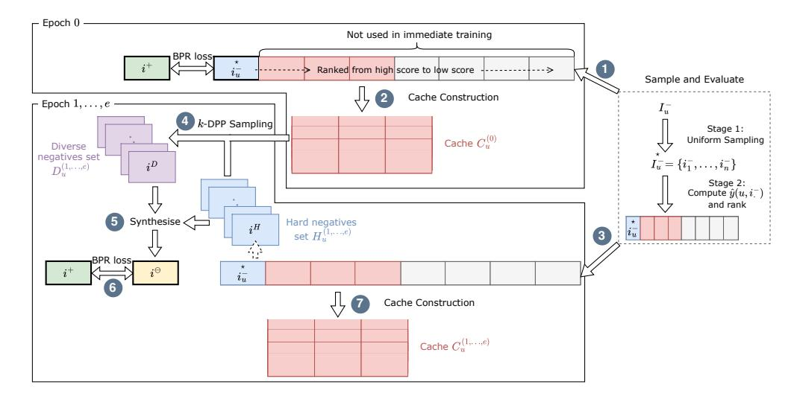
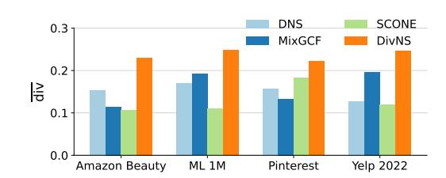
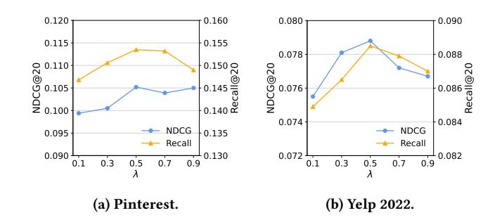
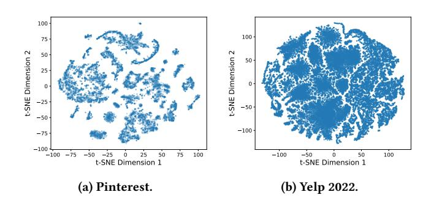
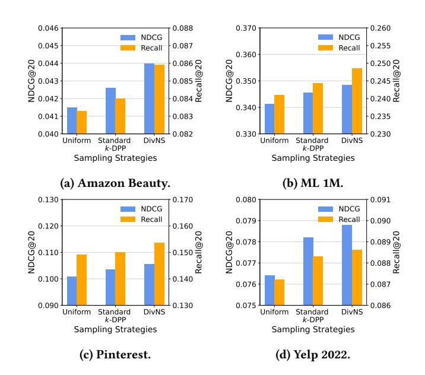
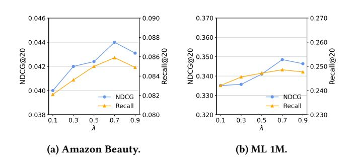

# Diversity-Augmented Negative Sampling for Implicit Collaborative Filtering

[Yueqing Xuan](https://orcid.org/0000-0002-9365-8949) RMIT University Melbourne, Victoria Australia yueqing.xuan@rmit.edu.au

[Kacper Sokol](https://orcid.org/0000-0002-9869-5896) Università della Svizzera italiana Lugano, Switzerland kacper.sokol@usi.ch

[Mark Sanderson](https://orcid.org/0000-0003-0487-9609) RMIT University Melbourne, Victoria Australia mark.sanderson@rmit.edu.au

[Jeffrey Chan](https://orcid.org/0000-0002-7865-072X) RMIT University Melbourne, Victoria Australia jeffrey.chan@rmit.edu.au

# Abstract

Recommenders built upon implicit collaborative filtering are typically trained to distinguish between users' positive and negative preferences. When direct observations of the latter are unavailable, negative training data are constructed with sampling techniques. But since items often exhibit clustering in the latent space, existing methods tend to oversample negatives from dense regions, resulting in homogeneous training data and limited model expressiveness. To address these shortcomings, we propose a novel negative sampler with diversity guarantees. To achieve them, our approach first pairs each positive item of a user with one that they have not yet interacted with; this instance, called hard negative, is chosen as the top-scoring item according to the model. Instead of discarding the remaining highly informative items, we store them in a user-specific cache. Next, our diversity-augmented sampler selects a representative subset of negatives from the cache, ensuring its dissimilarity from the corresponding user's hard negatives. Our generator then combines these items with the hard negatives, replacing them to produce more effective (synthetic) negative training data that are informative and diverse. Experiments show that our method consistently leads to superior recommendation quality without sacrificing computational efficiency.

# CCS Concepts

- Information systems → Recommender systems.

# Keywords

Recommender Systems; Negative Sampling; Collaborative Filtering.

### ACM Reference Format:

Yueqing Xuan, Kacper Sokol, Mark Sanderson, and Jeffrey Chan. 2026. Diversity-Augmented Negative Sampling for Implicit Collaborative Filtering. In Proceedings of the ACM Web Conference 2026 (WWW '26), April 13–17, 2026, Dubai, United Arab Emirates. ACM, New York, NY, USA, [11](#page-10-0) pages. <https://doi.org/10.1145/3774904.3792346>

# 1 Introduction

Recommender systems learn users' preferences and suggest items of potential interest by leveraging historical user–item interaction data. Many leading collaborative filtering recommenders rely on implicit feedback data and adopt a pairwise learning paradigm such

© 2026 Copyright held by the owner/author(s). ACM ISBN 979-8-4007-2307-0/2026/04 <https://doi.org/10.1145/3774904.3792346>

as Bayesian Personalised Ranking (BPR) [\[29\]](#page-8-0). These models are typically trained on triplets linking a user with two items, one representing a positive and the other a negative interaction. However, in many real-world applications, only positive user feedback – e.g., clicks, purchases or views – is available as negative preferences can rarely be observed. Consequently, items that users genuinely dislike are often indistinguishable from those they have simply not encountered. Negative Samplers (NSs) are then employed to identify the true negative items among all the unlabelled ones, with the informativeness of these instances being crucial to the effectiveness of the recommenders trained on them.

Current negative sampling strategies often follow a two-stage pipeline. First, a small candidate subset of items is uniformly sampled from the full set of unlabelled instances to reduce the downstream computational cost. Then, these instances are ranked according to method-specific criteria, with the top item – called the hard negative – used for model training. For example, Dynamic Negative Sampling (DNS) selects the candidate with the highest predicted score [\[42\]](#page-8-1), and Disentangled NS (DENS) picks the negative that diverges the most from the positive item along disentangled latent dimensions [\[23\]](#page-8-2).

Notably, in the first stage, these methods sample candidate negatives independently for each positive item of a user. Due to the inherent cluster structure of item embeddings – attributed to factors such as item genre or popularity – uniform sampling often selects neighbouring negatives from the same high-density regions of the embedding space. Figure [1a](#page-0-0) illustrates this issue with a toy example, where the selected candidates are concentrated within a few dense clusters, resulting in homogeneous negative samples. When this process is repeated for different positive items, NS tools

(a) Uniform sampling. (b) Sampling based on ��-DPP.

Figure 1: Toy example showing the distribution of �� = 15 negative items (★) drawn through [\(a\)](#page-0-0) uniform and [\(b\)](#page-0-0) ��- Determinantal Point Process (��-DPP) sampling. Item clusters in the embedding space are marked with different colours.

[This work is licensed under a Creative Commons Attribution 4.0 International License.](https://creativecommons.org/licenses/by/4.0) WWW '26, Dubai, United Arab Emirates.

frequently resample similar negatives from these dense areas, leading to reuse of the same items during model training. Meanwhile, sparse regions of the data space – potentially containing highly informative negatives – are systematically overlooked.

As a result, positive items are repeatedly paired with negatives that are similar to one another, leading to limited exploration of the item space during model training. This lack of diversity among the negative samples yields uninformative gradient updates when optimising the BPR loss and poor expressiveness of the resulting recommender as we show later in Section [3](#page-2-0) [\[9,](#page-8-3) [17,](#page-8-4) [40\]](#page-8-5). Notably, diverse training data have been shown to benefit model learning across various machine learning domains. For instance, [Duan et al.](#page-8-3) [\[9\]](#page-8-3) demonstrated that diverse negative instances improve node classification performance in Graph Neural Networks (GNN), and Zhang et al. [\[40\]](#page-8-5) illustrated the importance of this property for pre-training large language models; similarly, Hong et al. [\[17\]](#page-8-4) showed that training on diverse data subsets improves model generalisation.

In recommender systems, however, directly maximising diversity by sampling negatives across the entire item space is impractical. Since the item pool is typically overwhelmingly large, naïvely optimising for this property is computationally infeasible. To overcome this limitation, we propose a novel diversity-augmented negative sampling technique that is tailored to recommender systems and generates representative subsets of informative negatives that exhibit beneficial variation without sacrificing the tractability of this process or requiring item labels and repeated item evaluation. In particular, we demonstrate that incorporating diversity criteria into the model training process itself – specifically, the task of selecting negative data samples from the latent space – can lead to improved model generalisation and more accurate recommendations.

In contrast to our problem formulation – which remains largely under-explored – most recommender research focuses on increasing diversity of the final recommendation output; this is often achieved via post-processing techniques such as result re-ranking based on item dissimilarity [\[22,](#page-8-6) [36\]](#page-8-7). Related work on instance sampling for model training, on the other hand, is predominantly concerned with data imbalance; for example, FairNeg achieves categoryaware sampling by adjusting sampling probabilities across item categories to rebalance training data [\[6\]](#page-8-8). Notably, such methods typically rely on external metadata, e.g., category labels, and do not explicitly optimise for diversity of the sampled negatives in the learnt embedding space.

Our approach – called Diverse Negative Sampling (DivNS) – targets BPR-based recommenders and consists of three modules: cache construction maintains a per-user cache of informative negatives not yet used in model training;

diversity-augmented sampling selects a diverse subset of negative items from the cache while ensuring that they are dissimilar from current hard negatives, leveraging ��-Determinantal Point Process (��-DPP) to this end; and

synthetic negatives generation combines the selected diverse negatives with hard negatives to form the final training set. This pipeline ensures that negative samples used for training are both informative and representative, i.e., have good coverage of the latent item space. Consequently, DivNS enables recommenders to learn from a broader region of the item space, thus improving model generalisation and mitigating overfitting to narrow data subspaces. Furthermore, our method is computationally efficient and easy to integrate into existing recommenders without requiring additional item metadata, labelling or repeated scoring.

- In summary, our work delivers three main contributions:
- (1) We identify and theoretically analyse the diversity limitations of existing negative sampling strategies, showing their tendency to oversample from dense regions of the item space.
- (2) We propose DivNS a novel negative sampling approach that incorporates a caching mechanism, diversity-augmented ��-DPP sampling and an item mixing strategy to ensure that the resulting instances are both informative and diverse.
- (3) We conduct an extensive empirical evaluation to demonstrate that incorporating diverse negative samples into training data enables DivNS to consistently outperform strong baselines in terms of recommendation quality.

# 2 Related Work and Preliminaries

# 2.1 Negative Sampling

Recommenders are commonly trained on implicit user feedback data, where the observations represent users' positive preference towards items; the unobserved data then contain both true negative items and potential positive ones that have not yet been interacted with. Negative sampling strategies are used to extract true negative items from the unobserved data. They are generally categorised into static and hard sampling approaches.

Static NS utilises a fixed sampling distribution for each user. The simplest approach uniformly samples negative instances from a user's non-interacted items [\[29\]](#page-8-0); advanced methods introduce more informative sampling distributions. For example, MCNS approximates the negative sampling distribution using the positive distribution [\[38\]](#page-8-9), and PNS uses a sampling method based on item popularity to select highly popular instances as negative data [\[5\]](#page-8-10).

Hard NS, on the other hand, targets items that are challenging for the model to distinguish from positives, which typically are instances with high probability of being misclassified as positive interactions for a given user [\[28,](#page-8-11) [32,](#page-8-12) [42\]](#page-8-1). These items tend to lie close to decision boundaries, hence using them as negative training data allows more precise delineation of user preferences. For instance, DNS dynamically selects negative items with the highest predicted preference scores [\[42\]](#page-8-1), and SRNS samples items that have high prediction scores and high score variance as these are considered indicators of true negative instances [\[8\]](#page-8-13). MixGCF generates synthetic hard negatives by mixing information from neighbouring items as well as positive instances [\[18\]](#page-8-14), and DENS disentangles item features based on their relevance, using this contrast observed between positives and candidate negatives to guide sampling [\[23\]](#page-8-2). SCONE injects stochastic positive items to form hard negatives [\[25\]](#page-8-15).

Beyond this categorisation, several works propose samplers targeting other recommender setups. AdvIR integrates negative sampling into a GAN framework to generate robust negatives [\[27\]](#page-8-16). Auxiliary information such as social relations [\[4\]](#page-8-17) or cross-domain user preferences [\[34\]](#page-8-18) are also frequently utilised to guide sampling. For sequential recommendation, GNNO adopts neighbourhoodbased hard negative mining [\[10\]](#page-8-19).

Despite these advancements, the diversity criterion remains largely overlooked by negative samplers. Existing methods retrieve

Figure 2: Illustration of DivNS. Epoch 0 is used for initialisation; subsequent epochs – Epoch 1, . . . , e – are identical.

Proposition 3.1. Two-stage – i.e., sampling followed by ranking – NS methods that employ uniform sampling as their foundation cannot guarantee maximum item diversity measured in the latent space.

When the candidate set ★ �� − exhibits low diversity, the recommender repeatedly compares positive items to highly similar negatives. This results in redundant gradient updates and can cause the model to overfit to small regions of the item space. Consequently, user embeddings become less generalisable and the model may fail to sufficiently penalise items from under-sampled or sparse data regions [\[17\]](#page-8-4). Ultimately, this undermines the model's ability to capture the global structure of the item space and reduces the robustness of the ranking that it outputs. It is thus essential that negative samples used during training are sufficiently diverse to stabilise learning and promote generalisation.

# 3.2 Empirical Analysis

To demonstrate the limitations of uniform negative sampling and its adverse impact on instance diversity, we construct a toy example by projecting item embeddings into a two-dimensional space. We then use the resulting representation – shown in Figure [1](#page-0-0) – to compare uniform and ��-DPP sampling.

Specifically, Figure [1a](#page-0-0) demonstrates that uniform sampling tends to select negative items that are densely concentrated within a few clusters. This is expected as such an approach ignores the underlying structure of the embedding space. In contrast, sampling based on ��-DPP, shown in Figure [1b,](#page-0-0) explicitly encourages diversity by penalising selection of similar items. Consequently, the sampled negatives are distributed more evenly across the latent space.

These observations further support our theoretical analysis showing that uniform sampling fails to optimise for diversity, outputting instances drawn from selected few (dense) regions of the item space. In contrast, ��-DPP sampling captures the broader structure of the embedding space and delivers more representative and diverse negatives. Such diversity-aware selection can improve model training stability by avoiding repeated pairing of similar negative items with different positives as well as enhance model expressiveness.

However, applying ��-DPP sampling directly over a user's entire negative item set �� − is computationally prohibitive; while it can achieve maximal diversity, its complexity is O (|�� − 3 ). Repeating this process for every positive item of each user during model training is thus infeasible at scale. This limitation motivates the need for a new NS strategy that retains the diversity offered by ��-DPP while remaining computationally efficient for large-scale datasets.

### 4 Diverse Negative Sampling

Our proposed method – DivNS – is a computationally efficient negative sampling strategy for recommender systems that targets item diversity. Existing samplers often focus on informativeness of individual negatives but overlook their diversity, thus restricting the recommender's exposure to the broader item embedding space and curtailing its generalisation ability. DivNS addresses these limitations by introducing diversity criteria directly into the sampling pipeline without requiring an additional model for scoring candidate negatives. An overview of our framework is shown in Figure [2.](#page-3-1)

DivNS comprises three key modules: ([§4.1\)](#page-3-2) cache construction, ([§4.2\)](#page-4-0) diversity-augmented sampling and ([§4.3\)](#page-4-1) synthetic negatives generation. The first module maintains a cache for each user containing previously scored negative items that are highly informative but not yet ranked as the top one (i.e., the hard negative); these instances are often ignored by NS methods despite being highly valuable. The second module applies a tailored ��-DPP sampling to select a diverse subset of negatives from each user's cache while also ensuring that these instances differ sufficiently from the user's latest hard negatives; by limiting the sampling scope to the cached items, DivNS remains computationally efficient. Finally, the third module synthesises the diverse negatives and the hard negatives into a synthetic training dataset.

### 4.1 Cache Construction

Cache construction begins with two-stage sampling – captured by Step 1 , which is indicated by a dashed box, in Figure [2](#page-3-1) – at the start of each training epoch �� ∈ [0, . . . , ��]. For each positive item

Table 1: Recommendation utility – measured using NDCG and Recall based on top-10 and top-20 ranking – of negative samplers paired with two recommenders: MF and LightGCN. The best results are in bold and the second best results are underlined. Relative improvement – RI – of DivNS over the best baseline is marked with ∗ whenever it is statistically significant (�� &lt; 0.05).

| Sampler         | Amazon NDCG | Beauty Recall | ML NDCG | Top-10 1M Recall | NDCG    | Pinterest Recall | Yelp NDCG | 2022 Recall | Amazon NDCG | Beauty Recall | ML NDCG | Top-20 1M Recall | NDCG    | Pinterest Recall | Yelp NDCG | 2022 Recall |
|-----------------|-------------|---------------|---------|------------------|---------|------------------|-----------|-------------|-------------|---------------|---------|------------------|---------|------------------|-----------|-------------|
| RNS             | 0.0275      | 0.0471        | 0.2624  | 0.1948           | 0.0514  | 0.0812           | 0.0408    | 0.0476      | 0.0304      | 0.0577        | 0.3009  | 0.2236           | 0.0766  | 0.1160           | 0.0527    | 0.0613      |
| PNS             | 0.0266      | 0.0466        | 0.2550  | 0.1837           | 0.0465  | 0.0783           | 0.0393    | 0.0477      | 0.0303      | 0.0572        | 0.3010  | 0.2235           | 0.0640  | 0.0983           | 0.0517    | 0.0598      |
| DNS             | 0.0310      | 0.0495        | 0.2712  | 0.2018           | 0.0688  | 0.0840           | 0.0459    | 0.0556      | 0.0354      | 0.0703        | 0.3328  | 0.2289           | 0.0814  | 0.1263           | 0.0582    | 0.0697      |
| AdaSIR MF       | 0.0296      | 0.0487        | 0.2674  | 0.1978           | 0.0654  | 0.0795           | 0.0448    | 0.0527      | 0.0322      | 0.0627        | 0.3114  | 0.2257           | 0.7061  | 0.1135           | 0.0563    | 0.0663      |
| DNS(M, N)       | 0.0314      | 0.0493        | 0.2705  | 0.2016           | 0.0674  | 0.0826           | 0.0457    | 0.0535      | 0.0339      | 0.0645        | 0.3188  | 0.2269           | 0.0782  | 0.1178           | 0.0573    | 0.0686      |
| DENS            | 0.0303      | 0.0485        | 0.2713  | 0.2024           | 0.0656  | 0.0813           | 0.0466    | 0.0534      | 0.0352      | 0.0699        | 0.3325  | 0.2286           | 0.0736  | 0.1120           | 0.0592    | 0.0703      |
| AHNS            | 0.0297      | 0.0483        | 0.2547  | 0.1949           | 0.0653  | 0.0811           | 0.0452    | 0.0524      | 0.0332      | 0.0631        | 0.2959  | 0.2154           | 0.0706  | 0.1052           | 0.0568    | 0.0675      |
| DivNS           | 0.0327      | 0.0518        | 0.2812  | 0.2125           | 0.0733  | 0.0882           | 0.0486    | 0.0551      | 0.0385      | 0.0758        | 0.3397  | 0.2393           | 0.0883  | 0.1356           | 0.0613    | 0.0727      |
| RI              | 4.14% ∗     |               |         |                  |         |                  |           |             |             |               |         |                  |         |                  |           |             |
|                 |             | 4.65% ∗       |         |                  |         |                  |           |             |             |               |         |                  |         |                  |           |             |
|                 |             |               | 3.65% ∗ |                  |         |                  |           |             |             |               |         |                  |         |                  |           |             |
|                 |             |               |         | 5.00% ∗          |         |                  |           |             |             |               |         |                  |         |                  |           |             |
|                 |             |               |         |                  | 6.54% ∗ |                  |           |             |             |               |         |                  |         |                  |           |             |
|                 |             |               |         |                  |         | 5.00% ∗          |           |             |             |               |         |                  |         |                  |           |             |
|                 |             |               |         |                  |         |                  | 4.29% ∗   |             |             |               |         |                  |         |                  |           |             |
|                 |             |               |         |                  |         |                  |           | 3.18% ∗     |             |               |         |                  |         |                  |           |             |
|                 |             |               |         |                  |         |                  |           |             | 8.76% ∗     |               |         |                  |         |                  |           |             |
|                 |             |               |         |                  |         |                  |           |             |             | 7.82% ∗       |         |                  |         |                  |           |             |
|                 |             |               |         |                  |         |                  |           |             |             |               | 2.07%   | 4.54% ∗          |         |                  |           |             |
|                 |             |               |         |                  |         |                  |           |             |             |               |         |                  | 8.48% ∗ |                  |           |             |
|                 |             |               |         |                  |         |                  |           |             |             |               |         |                  |         | 7.36% ∗          |           |             |
|                 |             |               |         |                  |         |                  |           |             |             |               |         |                  |         |                  | 3.38% ∗   |             |
|                 |             |               |         |                  |         |                  |           |             |             |               |         |                  |         |                  |           | 3.41% ∗     |
| RNS             | 0.0303      | 0.0624        | 0.2501  | 0.1823           | 0.0745  | 0.0994           | 0.0516    | 0.0598      | 0.0398      | 0.0802        | 0.3225  | 0.2304           | 0.0951  | 0.1405           | 0.0666    | 0.0753      |
| PNS             | 0.0301      | 0.0586        | 0.2375  | 0.1792           | 0.0646  | 0.0948           | 0.0473    | 0.0575      | 0.0393      | 0.0797        | 0.3152  | 0.2288           | 0.0853  | 0.1273           | 0.0637    | 0.0728      |
| DNS             | 0.0322      | 0.0674        | 0.2762  | 0.1895           | 0.0728  | 0.1077           | 0.0587    | 0.0677      | 0.0427      | 0.0838        | 0.3437  | 0.2412           | 0.0986  | 0.1449           | 0.0755    | 0.0862      |
| AdaSIR LightGCN | 0.0310      | 0.0642        | 0.2540  | 0.1804           | 0.0692  | 0.0914           | 0.0540    | 0.0656      | 0.0404      | 0.0823        | 0.3220  | 0.2306           | 0.0931  | 0.1237           | 0.0706    | 0.0832      |
| DNS(M, N)       | 0.0315      | 0.0660        | 0.2560  | 0.1935           | 0.0727  | 0.1050           | 0.0574    | 0.0663      | 0.0408      | 0.0825        | 0.3313  | 0.2396           | 0.0944  | 0.1389           | 0.0736    | 0.0849      |
| MixGCF          | 0.0323      | 0.0672        | 0.2762  | 0.1976           | 0.0801  | 0.1122           | 0.0585    | 0.0656      | 0.0426      | 0.0841        | 0.3442  | 0.2414           | 0.1010  | 0.1482           | 0.0755    | 0.0854      |
| DENS            | 0.0321      | 0.0626        | 0.2478  | 0.1892           | 0.0706  | 0.0963           | 0.0567    | 0.0663      | 0.0397      | 0.0800        | 0.3223  | 0.2319           | 0.0800  | 0.1183           | 0.0740    | 0.0850      |
| AHNS            | 0.0310      | 0.0597        | 0.2418  | 0.1790           | 0.0703  | 0.0855           | 0.0555    | 0.0649      | 0.0392      | 0.0791        | 0.3045  | 0.2287           | 0.0912  | 0.1185           | 0.0734    | 0.0812      |
| SCONE           | 0.0321      | 0.0670        | 0.2758  | 0.1919           | 0.0814  | 0.1131           | 0.0584    | 0.0668      | 0.0428      | 0.0838        | 0.3436  | 0.2411           | 0.1003  | 0.1485           | 0.0752    | 0.0861      |
| DivNS           | 0.0340      | 0.0693        | 0.2827  | 0.2053           | 0.0827  | 0.1170           | 0.0603    | 0.0690      | 0.0440      | 0.0859        | 0.3485  | 0.2486           | 0.1054  | 0.1536           | 0.0788    | 0.0886      |
| RI              | 5.26% ∗     |               |         |                  |         |                  |           |             |             |               |         |                  |         |                  |           |             |
|                 |             | 2.82% ∗       |         |                  |         |                  |           |             |             |               |         |                  |         |                  |           |             |
|                 |             |               | 2.35% ∗ |                  |         |                  |           |             |             |               |         |                  |         |                  |           |             |
|                 |             |               |         | 3.90% ∗          |         |                  |           |             |             |               |         |                  |         |                  |           |             |
|                 |             |               |         |                  | 1.60%   | 3.45% ∗          |           |             |             |               |         |                  |         |                  |           |             |
|                 |             |               |         |                  |         |                  | 2.73% ∗   |             |             |               |         |                  |         |                  |           |             |
|                 |             |               |         |                  |         |                  |           | 1.92%       | 2.80% ∗     |               |         |                  |         |                  |           |             |
|                 |             |               |         |                  |         |                  |           |             |             | 2.14%         | 1.25%   | 2.98% ∗          |         |                  |           |             |
|                 |             |               |         |                  |         |                  |           |             |             |               |         |                  | 4.36% ∗ |                  |           |             |
|                 |             |               |         |                  |         |                  |           |             |             |               |         |                  |         | 3.43% ∗          |           |             |
|                 |             |               |         |                  |         |                  |           |             |             |               |         |                  |         |                  | 4.37% ∗   |             |
|                 |             |               |         |                  |         |                  |           |             |             |               |         |                  |         |                  |           | 2.78% ∗     |

Additional details about our setup are provided in Appendix [C.1.](#page-9-2) Our code is available at: [github.com/xuanxuanxuan-git/DivNS.](https://github.com/xuanxuanxuan-git/DivNS)

### 5.2 Results

Each experiment is repeated five times with a different random seed; Table [1](#page-6-0) reports their average result. We find that, across all four datasets, DivNS consistently outperforms all the baselines by a substantial margin. This improvement stems from two key design choices. First, by constructing user-specific caches that contain top-ranked negatives, more informative instances are used, thus reducing the amount of noise. Second, by applying diversityaugmented ��-DPP sampling, we further allow the recommender to explore a broader item space and learn a more precise decision boundary for each user, thereby improving model generalisation.

The performance gain from using DivNS is more pronounced for MF than LightGCN when compared to all the baselines. We speculate that this is because MixGCF is an effective negative sampler (recall that it is incompatible with MF), which also has a component that mixes negatives. Distinct from our method, MixGCF synthesises a negative instance with its neighbouring negatives in a graph; it therefore only implicitly introduces diverse item sets to the model. In contrast, our method directly optimises for diversity, helping it to outperform MixGCF. Moreover, none of the existing MF-compatible samplers account for the diversity of sampled negative data, giving DivNS a significant advantage when it is paired with MF.

DivNS extends the standard DNS approach by not only identifying hard negatives but also synthesising them with other diverse and informative negative items. The consistent improvement achieved by DivNS over DNS highlights the critical role of diversity in negative sampling as we elaborate in the following section.

Runtime. Taking LightGCN as an example, the average training times per epoch for RNS, DNS, MixGCF, DENS and DivNS on Amazon Beauty are approximately 5, 20, 26, 29 and 31 seconds respectively; runtime results for the other datasets are listed in Appendix [C.2.](#page-9-3) We find that, although DivNS requires slightly more compute due to ��-DPP sampling, setting the cache ratio�� to a small value (as discussed in Section [4.2\)](#page-4-0) allows to keep its training time on a par with other hard negative samplers, making it competitive.

Sampled Negatives Diversity. To verify that DivNS enhances sampling diversity, we measure this property for the negative items used during model training. Let �� ⊖ (��) denote the set of negative training data sampled by DivNS for user �� in epoch ��. The average diversity across all users and epochs is div = ��max Í ��∈U Í��max−1 ��=0 div(�� ⊖ (��) ), where div(·) is the diversity metric defined in Equation [1.](#page-2-1) Figure [3](#page-6-1) compares div of DivNS to top baselines for LightGCN; the remaining results are listed in Appendix [C.2.](#page-9-3) We find that DivNS consistently produces more diverse negative samples than all the baselines, confirming the effectiveness of our diversity-aware approach.

Figure 3: Diversity of sampled negatives for the top four performing samplers deployed with LightGCN.

### 5.3 DivNS Analysis and Ablation Study

Next, we conduct an ablation study to gauge the impact of each DivNS module. Given the sequential structure of our approach, removing the first module (cache construction) disables the entire pipeline. Our evaluation therefore relies on: (1) removing the full pipeline; (2) replacing our diversity-augmented ��-DPP sampling (module two) with random and vanilla ��-DPP sampling; and (3) tweaking our synthetic negatives generation (module three) by varying the mixing coefficient �� (Equation [4\)](#page-4-2). We also examine the influence of a key DivNS hyperparameter: the cache ratio ��. To ensure fair comparison, all the experiments follow a setup that is identical to the one described in Section [5.1.](#page-5-6)

Disable All Modules: Using Diverse Negatives. To verify the impact of using diverse negatives in recommender training, we disable DivNS entirely, effectively reverting the sampling step to standard DNS (i.e., using only the top-ranked, hard, negative for each positive). Results in Table [2](#page-7-0) show performance decline of 5–10% when diverse negatives are absent. This finding confirms the importance of diversity in negative training data and supports the core motivation behind our work (outlined earlier in Section [3\)](#page-2-0).

Swap Module Two: Diversity-Augmented Sampling. Since diversity-augmented ��-DPP is the foundation of our method, we compare its effectiveness to other sampling strategies. First, we experiment with vanilla ��-DPP, in which case the negatives in ���� may contain items similar to those in ����, sacrificing the training data diversity. We also test uniform sampling, which further weakens the diversity of ����. The exact results of these experiments are reported in Appendix [C.2.](#page-9-3) We observe that our diversity-augmented ��-DPP sampling consistently delivers the best performance. Vanilla ��-DPP (which lacks our bespoke kernel) performs slightly worse, but it still outperforms uniform sampling in most cases. These findings highlight the central role of data diversity in enhancing recommender training effectiveness.

Tweak Module Three: Synthetic Negatives Generation. We also study the impact of the mixing coefficient �� (Equation [4\)](#page-4-2), which controls the balance between diverse and hard negatives when synthesising negative training data. Smaller values of �� increase the contribution of diverse negatives; we vary �� between 0.1 and 0.9 with a step size of 0.2. Figure [4](#page-7-1) shows the results of this experiment. We observe that the performance improves as �� decreases from 0.9 to 0.7 or 0.5, which strengthens the contribution of diverse negatives; nonetheless, it starts to decline for �� &lt; 0.5. This finding reflects the fundamental trade-off between diverse and hard negatives: while the former improve model generalisation, they

Table 2: Performance – NDCG@20 and Recall@20 – of DivNS with (✓) and without (✗) its all three modules.

|          | Amazon NDCG | Beauty Recall | ML NDCG | 1M Recall | Pinterest NDCG | Recall | Yelp NDCG | 2022 Recall |
|----------|-------------|---------------|---------|-----------|----------------|--------|-----------|-------------|
| MF       | ✓ 0.0385    | 0.0758        | 0.3397  | 0.2393    | 0.0883         | 0.1356 | 0.0613    | 0.0727      |
|          | ✗ 0.0354    | 0.0703        | 0.3328  | 0.2289    | 0.0814         | 0.1263 | 0.0582    | 0.0697      |
| LightGCN | ✓ 0.0440    | 0.0859        | 0.3485  | 0.2486    | 0.1054         | 0.1536 | 0.0788    | 0.0886      |
|          | ✗ 0.0427    | 0.0838        | 0.3437  | 0.2412    | 0.0986         | 0.1449 | 0.0755    | 0.0862      |

Figure 4: Impact of synthetic negatives generation on performance – NDCG@20 and Recall@20 – of LightGCN for [\(a\)](#page-7-1) Pinterest and [\(b\)](#page-7-1) Yelp 2022. Appendix [C.2](#page-9-3) lists full results.

are less informative than the latter, so over-relying on them can hinder model training (showing as lower NDCG@20 for small values of ��). However, confining recommender training exclusively to hard negatives also impairs its performance (evidenced by reduced NDCG@20 when �� approaches 1).

Cache Ratio Adjustment. To further study the behaviour of cache construction, we vary the cache ratio �� ∈ {1, 2, 4, 6}, which affects how many top-ranked negatives from the candidate set ★ �� − are kept in the cache ����. The exact results of these experiments are reported in Appendix [C.2.](#page-9-3) We find that increasing �� up to 4 improves the performance; but when�� = 6 with �� = 10, we cache more than half of the candidate negatives from ★ �� − , which entails storing and using lower quality items that may be uninformative, thus degrading performance. Keeping �� &lt; ��/2 appears to be the most effective.

### 6 Conclusion

In this paper we proposed DivNS: a novel negative sampling framework for collaborative filtering that selects a diverse set of negative instances from across the latent item space. Our analyses revealed that existing negative samplers neglect data diversity, limiting the ability of recommenders to capture users' negative preferences. DivNS addressed this limitation by, first, constructing user-specific caches containing highly informative negative items that are discarded by traditional samplers. Then, it applied a diversity-augmented sampling strategy to produce a representative subset of negatives from the cache, ensuring that the selected items also differ from the top-ranked, hard, negatives. Finally, it synthesised the diverse and hard negatives to create more effective training examples. This process enabled the recommenders to explore a larger item space and learn more comprehensive user–item relationships. Experiments on four popular datasets showed that DivNS consistently outperforms state-of-the-art samplers while remaining computationally efficient.

# Acknowledgements

This research was conducted by the ARC Centre of Excellence for Automated Decision-Making and Society (CE200100005), funded by the Australian Government through the Australian Research Council. Additional support was provided by the TRUST-ME project (205121L 214991), funded by the Swiss National Science Foundation.

References [1] Allan Borodin, Aadhar Jain, Hyun Chul Lee, and Yuli Ye. 2017. Max-sum diversification, monotone submodular functions, and dynamic updates. ACM Transactions on Algorithms (TALG) 13, 3 (2017), 1–25. [2] Chong Chen, Weizhi Ma, Min Zhang, Chenyang Wang, Yiqun Liu, and Shaoping Ma. 2023. Revisiting negative sampling vs. non-sampling in implicit recommendation. ACM Transactions on Information Systems 41, 1 (2023), 1–25. [3] Jin Chen, Defu Lian, Binbin Jin, Kai Zheng, and Enhong Chen. 2022. Learning recommenders for implicit feedback with importance resampling. In Proceedings of the ACM Web Conference. ACM, New York, NY, USA, 1997–2005. [4] Jiawei Chen, Can Wang, Sheng Zhou, Qihao Shi, Yan Feng, and Chun Chen. 2019. Samwalker: Social recommendation with informative sampling strategy. In Proceedings of the ACM Web Conference. ACM, New York, NY, USA, 228–239. [5] Ting Chen, Yizhou Sun, Yue Shi, and Liangjie Hong. 2017. On sampling strategies for neural network-based collaborative filtering. In Proceedings of the 23rd ACM SIGKDD International Conference on Knowledge Discovery and Data Mining. ACM, New York, NY, USA, 767–776. [6] Xiao Chen, Wenqi Fan, Jingfan Chen, Haochen Liu, Zitao Liu, Zhaoxiang Zhang, and Qing Li. 2023. Fairly adaptive negative sampling for recommendations. In Proceedings of the ACM Web Conference. ACM, New York, NY, USA, 3723–3733. [7] Jin Yao Chin, Yile Chen, and Gao Cong. 2022. The datasets dilemma: How much do we really know about recommendation datasets?. In Proceedings of the 15th ACM International Conference on Web Search and Data Mining. ACM, New York, NY, USA, 141–149. [8] Jingtao Ding, Yuhan Quan, Quanming Yao, Yong Li, and Depeng Jin. 2020. Simplify and robustify negative sampling for implicit collaborative filtering. Advances in Neural Information Processing Systems 33 (2020), 1094–1105. [9] Wei Duan, Junyu Xuan, Maoying Qiao, and Jie Lu. 2022. Learning from the dark: Boosting graph convolutional neural networks with diverse negative samples. In Proceedings of the AAAI Conference on Artificial Intelligence, Vol. 36. AAAI, Washington, DC, USA, 6550–6558. [10] Lu Fan, Jiashu Pu, Rongsheng Zhang, and Xiao-Ming Wu. 2023. Neighborhoodbased hard negative mining for sequential recommendation. In Proceedings of the 46th International ACM SIGIR Conference on Research and Development in Information Retrieval. ACM, New York, NY, USA, 2042–2046. [11] Mike Gartrell, Ulrich Paquet, and Noam Koenigstein. 2017. Low-rank factorization of determinantal point processes. In Proceedings of the AAAI Conference on Artificial Intelligence, Vol. 31. AAAI, Washington, DC, USA, 1912–1918. [12] Xue Geng, Hanwang Zhang, Jingwen Bian, and Tat-Seng Chua. 2015. Learning image and user features for recommendation in social networks. In Proceedings of the IEEE International Conference on Computer Vision. IEEE, Piscataway, NJ, USA, 4274–4282. [13] Jennifer Gillenwater, Alex Kulesza, and Ben Taskar. 2012. Near-optimal map inference for determinantal point processes. Advances in Neural Information Processing Systems 25 (2012), 2735–2743. [14] F Maxwell Harper and Joseph A Konstan. 2015. The MovieLens datasets: History and context. ACM Transactions on Interactive Intelligent Systems 5, 4 (2015), 1–19. [15] Ruining He and Julian McAuley. 2016. Ups and downs: Modeling the visual evolution of fashion trends with one-class collaborative filtering. In Proceedings of the ACM Web Conference. ACM, New York, NY, USA, 507–517. [16] Xiangnan He, Kuan Deng, Xiang Wang, Yan Li, Yongdong Zhang, and Meng Wang. 2020. LightGCN: Simplifying and powering graph convolution network for recommendation. In Proceedings of the 43rd International ACM SIGIR Conference on Research and Development in Information Retrieval. ACM, New York, NY, USA, 639–648. [17] Feng Hong, Yueming Lyu, Jiangchao Yao, Ya Zhang, Ivor W Tsang, and Yanfeng Wang. 2024. Diversified batch selection for training acceleration. In Proceedings of the 41st International Conference on Machine Learning, Vol. 235. PMLR, Breckenridge, CO, USA, 18648–18667. [18] Tinglin Huang, Yuxiao Dong, Ming Ding, Zhen Yang, Wenzheng Feng, Xinyu Wang, and Jie Tang. 2021. MixGCF: An improved training method for graph neural network-based recommender systems. In Proceedings of the 27th ACM SIGKDD International Conference on Knowledge Discovery and Data Mining. ACM, New York, NY, USA, 665–674. [19] Walid Krichene and Steffen Rendle. 2020. On sampled metrics for item recommendation. In Proceedings of the 26th ACM SIGKDD International Conference on Knowledge Discovery and Data Mining. ACM, New York, NY, USA, 1748–1757. [20] Alex Kulesza and Ben Taskar. 2011. k-DPPs: Fixed-size determinantal point processes. In Proceedings of the 28th International Conference on Machine Learning. Omnipress, Madison, WI, USA, 1193–1200. [21] Alex Kulesza and Ben Taskar. 2012. Determinantal point processes for machine learning. Foundations and Trends in Machine Learning 5, 2–3 (2012), 123–286. [22] Matevž Kunaver and Tomaž Požrl. 2017. Diversity in recommender systems – A survey. Knowledge-based Systems 123 (2017), 154–162. [23] Riwei Lai, Li Chen, Yuhan Zhao, Rui Chen, and Qilong Han. 2023. Disentangled negative sampling for collaborative filtering. In Proceedings of the 16th ACM International Conference on Web Search and Data Mining. ACM, New York, NY, USA, 96–104. [24] Riwei Lai, Rui Chen, Qilong Han, Chi Zhang, and Li Chen. 2024. Adaptive hardness negative sampling for collaborative filtering. In Proceedings of the AAAI Conference on Artificial Intelligence, Vol. 38. AAAI, Washington, DC, USA, 8645– 8652. [25] Chaejeong Lee, Jeongwhan Choi, Hyowon Wi, Sung-Bae Cho, and Noseong Park. 2025. SCONE: A novel stochastic sampling to generate contrastive views and hard negative samples for recommendation. In Proceedings of the 18th ACM International Conference on Web Search and Data Mining. ACM, New York, NY, USA, 419–428. [26] Yong Liu, Yingtai Xiao, Qiong Wu, Chunyan Miao, Juyong Zhang, Binqiang Zhao, and Haihong Tang. 2020. Diversified interactive recommendation with implicit feedback. In Proceedings of the AAAI Conference on Artificial Intelligence, Vol. 34. AAAI, Washington, DC, USA, 4932–4939. [27] Dae Hoon Park and Yi Chang. 2019. Adversarial sampling and training for semi-supervised information retrieval. In Proceedings of the ACM Web Conference. ACM, New York, NY, USA, 1443–1453. [28] Steffen Rendle and Christoph Freudenthaler. 2014. Improving pairwise learning for item recommendation from implicit feedback. In Proceedings of the 7th ACM International Conference on Web Search and Data Mining. ACM, New York, NY, USA, 273–282. [29] Steffen Rendle, Christoph Freudenthaler, Zeno Gantner, and Lars Schmidt-Thieme. 2009. BPR: Bayesian personalized ranking from implicit feedback. In Proceedings of the 25th Conference on Uncertainty in Artificial Intelligence. AUAI Press, Arlington, VA, USA, 452–461. [30] Chaofeng Sha, Xiaowei Wu, and Junyu Niu. 2016. A framework for recommending relevant and diverse items. In Proceedings of the 25th International Joint Conference on Artificial Intelligence, Vol. 16. IJCAI, New York, NY, USA, 3868–3874. [31] Wentao Shi, Jiawei Chen, Fuli Feng, Jizhi Zhang, Junkang Wu, Chongming Gao, and Xiangnan He. 2023. On the theories behind hard negative sampling for recommendation. In Proceedings of the ACM Web Conference. ACM, New York, NY, USA, 812–822. [32] Jun Wang, Lantao Yu, Weinan Zhang, Yu Gong, Yinghui Xu, Benyou Wang, Peng Zhang, and Dell Zhang. 2017. IRGAN: A minimax game for unifying generative and discriminative information retrieval models. In Proceedings of the 40th International ACM SIGIR conference on Research and Development in Information Retrieval. ACM, New York, NY, USA, 515–524. [33] Xiang Wang, Xiangnan He, Meng Wang, Fuli Feng, and Tat-Seng Chua. 2019. Neural graph collaborative filtering. In Proceedings of the 42nd International ACM SIGIR Conference on Research and Development in Information Retrieval. ACM, New York, NY, USA, 165–174. [34] Yidan Wang, Xuri Ge, Xin Chen, Ruobing Xie, Su Yan, Xu Zhang, Zhumin Chen, Jun Ma, and Xin Xin. 2025. Exploration and exploitation of hard negative samples for cross-domain sequential recommendation. In Proceedings of the 18th ACM International Conference on Web Search and Data Mining. ACM, New York, NY, USA, 669–677. [35] Chuhan Wu, Fangzhao Wu, and Yongfeng Huang. 2021. Rethinking InfoNCE: How many negative samples do you need? arXiv preprint (2021), 1–13. arXiv[:2105.13003](https://arxiv.org/abs/2105.13003) [36] Haolun Wu, Yansen Zhang, Chen Ma, Fuyuan Lyu, Bowei He, Bhaskar Mitra, and Xue Liu. 2024. Result diversification in search and recommendation: A survey. IEEE Transactions on Knowledge and Data Engineering 36, 10 (2024), 5354–5373. [37] Qiong Wu, Yong Liu, Chunyan Miao, Binqiang Zhao, Yin Zhao, and Lu Guan. 2019. PD-GAN: Adversarial learning for personalized diversity-promoting recommendation. In Proceedings of the 28th International Joint Conference on Artificial Intelligence, Vol. 19. IJCAI, Macao, 3870–3876. [38] Zhen Yang, Ming Ding, Chang Zhou, Hongxia Yang, Jingren Zhou, and Jie Tang. 2020. Understanding negative sampling in graph representation learning. In Proceedings of the 26th ACM SIGKDD International Conference on Knowledge Discovery and Data Mining. ACM, New York, NY, USA, 1666–1676. [39] Yelp Inc. 2025. Yelp Open Dataset. [https://business.yelp.com/data/resources/open](https://business.yelp.com/data/resources/open-dataset/)[dataset/.](https://business.yelp.com/data/resources/open-dataset/) [40] Chi Zhang, Huaping Zhong, Kuan Zhang, Chengliang Chai, Rui Wang, Xinlin Zhuang, Tianyi Bai, Jiantao Qiu, Lei Cao, Ju Fan, Ye Yuan, Guoren Wang, and Conghui He. 2025. Harnessing diversity for important data selection in pretraining large language models. In Proceedings of the 13th International Conference on Learning Representations. Curran Associates, Inc., Red Hook, NY, USA, 22941–22964. [41] Hongyi Zhang, Moustapha Cisse, Yann N Dauphin, and David Lopez-Paz. 2018. mixup: Beyond empirical risk minimization. In Proceedings of the 6th International Conference on Learning Representations. Curran Associates, Inc., Red Hook, NY, USA, 2866–2878. [42] Weinan Zhang, Tianqi Chen, Jun Wang, and Yong Yu. 2013. Optimizing top-n collaborative filtering via dynamic negative item sampling. In Proceedings of the 36th International ACM SIGIR Conference on Research and Development in Information Retrieval. ACM, New York, NY, USA, 785–788.

|      | Dataset   |             | U       |         | I         | Y   Density |       |        | Characteristics |
|------|-----------|-------------|---------|---------|-----------|-------------|-------|--------|-----------------|
|      | Amazon    | Beauty [15] | 22,363  | 12,101  | 198,502   | 0.07%       | small | &      | sparse          |
| ML   | 1M [14]   |             | 6,040   | 3,706   | 1,000,209 | 4.47%       |       | medium | & dense         |
|      | Pinterest | [12]        | 55,187  | 9,916   | 1,463,581 | 0.27%       | large | &      | dense           |
| Yelp | 2022      | [39]        | 287,116 | 148,523 | 4,392,169 | 0.01%       | large | &      | sparse          |

Table 4: Hyperparameter setup of DivNS.

were: 32, 158, 222, 284 and 282 seconds respectively for NS, DNS, MixGCF, DENS and DivNS on ML 1M; 35, 176, 248, 272 and 280 seconds on Pinterest; and 50, 218, 306, 376 and 413 seconds on Yelp. Our results show that even though DivNS requires slightly more time due to its ��-DPP sampling, the training time remains competitive when compared to other negative samplers.

Sampled Negatives Diversity. Table [5](#page-10-2) shows the complete results of sample diversity for different NS methods used with LightGCN across all the datasets; it complements the result reported in Section [5.2](#page-6-2) and Figure [3.](#page-6-1) We observe that DivNS consistently achieves best diversity across the board.

Diversity-Augmented Sampling. Figure [6](#page-10-3) reports additional results for the experiments evaluating impact of diversity-augmented sampling given in Section [5.3.](#page-7-2) It shows that our approach consistently outperforms other sampling strategies.

Synthetic Negatives Generation. Figure [7](#page-10-4) reports results on two additional datasets for the experiments evaluating the impact of synthetic negatives generation given in Section [5.3.](#page-7-2) These findings align with our original conclusion that diverse negatives can help model generalisation, thus improve performance, but, at the same time, their excessive amount can be detrimental.

Cache Ratio. Table [6](#page-10-5) shows the performance of DivNS for different cache ratio setups with the candidate set size set as �� = 10.

Table 5: Diversity of negatives sampled by each NS technique during LightGCN training. The best results are in bold.

|          | Amazon Beauty | ML 1M | Pinterest | Yelp 2022 |
|----------|---------------|-------|-----------|-----------|
| RNS      | 0.136         | 0.156 | 0.158     | 0.183     |
| PNS      | 0.092         | 0.149 | 0.142     | 0.142     |
| DNS      | 0.153         | 0.170 | 0.156     | 0.127     |
| AdaSIR   | 0.145         | 0.134 | 0.103     | 0.164     |
| DNS(M,N) | 0.138         | 0.178 | 0.095     | 0.195     |
| MixGCF   | 0.114         | 0.192 | 0.133     | 0.185     |
| DENS     | 0.129         | 0.157 | 0.113     | 0.175     |
| AHNS     | 0.104         | 0.147 | 0.144     | 0.183     |
| SCONE    | 0.107         | 0.110 | 0.183     | 0.119     |
| DivNS    | 0.230         | 0.248 | 0.222     | 0.246     |

Figure 6: Impact of diversity-augmented sampling on performance – NDCG@20 and Recall@20 – of LightGCN for: [\(a\)](#page-10-3) Amazon Beauty, [\(b\)](#page-10-3) ML 1M, [\(c\)](#page-10-3) Pinterest and [\(d\)](#page-10-3) Yelp 2022.

Figure 7: Impact of synthetic negatives generation on performance – NDCG@20 and Recall@20 – of LightGCN for: [\(a\)](#page-10-4) Amazon Beauty and [\(b\)](#page-10-4) ML 1M.

Table 6: Impact of cache ratio �� on DivNS performance measured with NDCG@20 and Recall@20. We fix �� = 10. The best results are in bold.