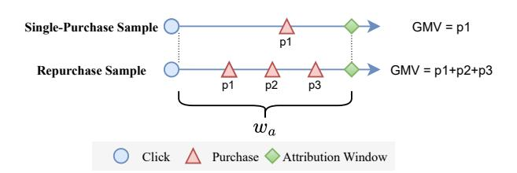
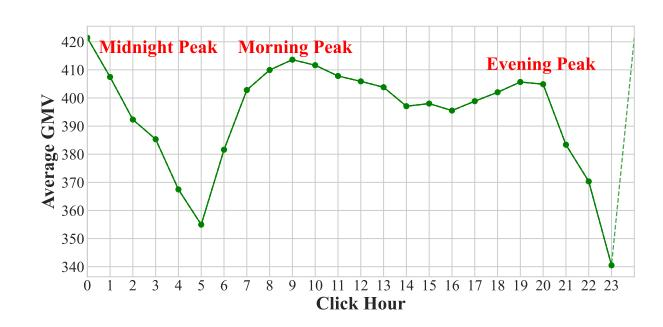
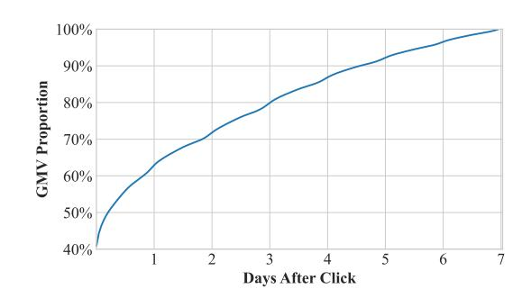
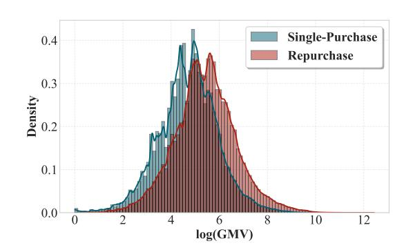
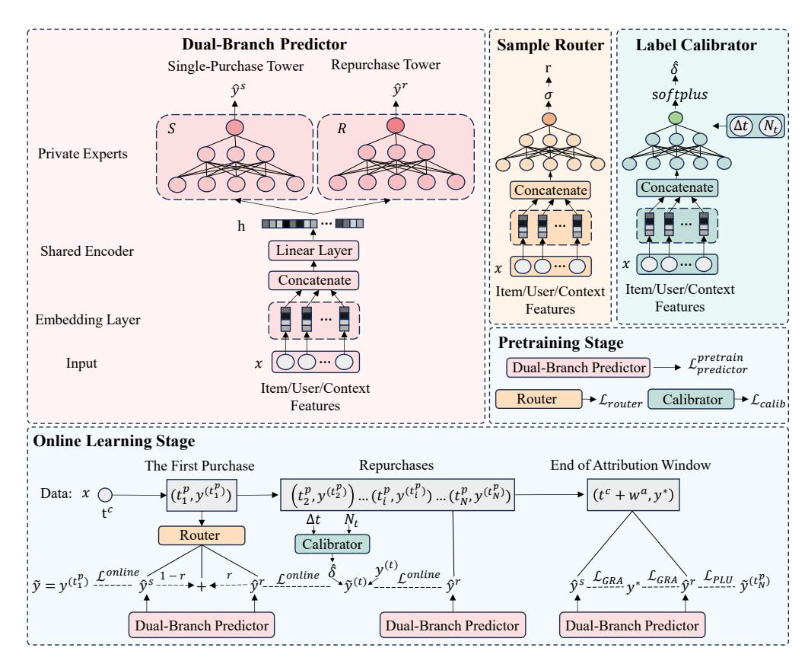

# Delayed Feedback Modeling for Post-Click Gross Merchandise Volume Prediction: Benchmark, Insights and Approaches

[Xinyu Li](https://orcid.org/0009-0007-5575-8221)∗ xinyuli@stu.xmu.edu.cn School of Informatics, Xiamen University Xiamen, China

[Sishuo Chen](https://orcid.org/0009-0007-8845-5817)∗ chensishuo.css@alibaba-inc.com Taobao & Tmall Group of Alibaba Beijing, China

[Guipeng Xv](https://orcid.org/0000-0001-5320-5489) xuguipeng@stu.xmu.edu.cn School of Informatics, Xiamen University Xiamen, China

[Li Zhang](https://orcid.org/0009-0005-1311-4116) zl428934@alibaba-inc.com Taobao & Tmall Group of Alibaba Beijing, China

[Mingxuan Luo](https://orcid.org/0009-0006-7659-1320) luomingxuan@stu.xmu.edu.cn School of Informatics, Xiamen University Xiamen, China

[Zhangming Chan](https://orcid.org/0000-0002-3081-2427) zhangming.czm@alibaba-inc.com Taobao & Tmall Group of Alibaba Beijing, China

[Xiang-Rong Sheng](https://orcid.org/0009-0006-4864-574X) xiangrong.sxr@alibaba-inc.com Taobao & Tmall Group of Alibaba Beijing, China

[Han Zhu](https://orcid.org/0000-0002-9522-5637) zhuhan.zh@alibaba-inc.com Taobao & Tmall Group of Alibaba Beijing, China

[Jian Xu](https://orcid.org/0000-0003-3111-1005) xiyu.xj@alibaba-inc.com Taobao & Tmall Group of Alibaba Beijing, China

[Chen Lin](https://orcid.org/0000-0002-2275-997X)† chenlin@xmu.edu.cn School of Informatics, Xiamen University Xiamen, China

# Abstract

The prediction objectives of online advertisement ranking models are evolving from probabilistic metrics like conversion rate (CVR) to numerical business metrics like post-click gross merchandise volume (GMV). Unlike the well-studied delayed feedback problem in CVR prediction, delayed feedback modeling for GMV prediction remains unexplored and poses greater challenges, as GMV is a continuous target, and a single click can lead to multiple purchases that cumulatively form the label.

To bridge the research gap, we establish TRACE, a GMV prediction benchmark containing complete transaction sequences rising from each user click, which supports delayed feedback modeling in an online streaming manner. Our analysis and exploratory experiments on TRACE reveal two key insights: (1) the rapid evolution of the GMV label distribution necessitates modeling delayed feedback under online streaming training; (2) the label distribution of repurchase samples substantially differs from that of single-purchase samples, highlighting the need for separate modeling. Motivated

by these findings, we propose RepurchasE-Aware Dual-branch prEdictoR (READER), a novel GMV modeling paradigm that selectively activates expert parameters according to repurchase predictions produced by a router. Moreover, READER dynamically calibrates the regression target to mitigate under-estimation caused by incomplete labels. Experimental results show that READER yields superior performance on TRACE over baselines, achieving a 2.19% improvement in terms of accuracy. We believe that our study will open up a new avenue for studying online delayed feedback modeling for GMV prediction, and our TRACE benchmark with the gathered insights will facilitate future research and application in this promising direction. Our code and dataset are available at [https://github.com/alimama-tech/OnlineGMV.](https://github.com/alimama-tech/OnlineGMV)

### CCS Concepts

### • Information systems → Online advertising; • Applied computing → Electronic commerce.

# Keywords

Online Advertising, Gross Merchandise Volume, Post-Click GMV Prediction, Delayed Feedback Modeling, Benchmark and Dataset

# 1 Introduction

As value-based bidding strategies such as Max Conversion Value and Target ROAS (return on ad spend) [\[1,](#page-8-0) [11,](#page-8-1) [23\]](#page-8-2) play an increasingly significant role in web advertising, the prediction target of advertisement models has expanded from probabilistic metrics like

∗Equal Contribution.

†Corresponding author.

This paper has been accepted by the ACM Web Conference (WWW) 2026. This is the camera-ready version. Please refer to the published version for citation once available.

[This work is licensed under a Creative Commons Attribution 4.0 International License.](https://creativecommons.org/licenses/by/4.0) WWW '26, Dubai, United Arab Emirates

© 2026 Copyright held by the owner/author(s).

Figure 1: Label accumulation processes in GMV prediction, where the final label equals to the sum of the transaction prices of all purchases within the attribution window ����.

click-through rate (CTR) and post-click conversion rate (CVR) to numerical business metrics such as post-click gross merchandise value (post-click GMV) [\[19\]](#page-8-3), namely the total sales value attributed to an ad click conditioned on conversion.

Considering that users may make multiple repurchases, the post-click GMV label of an ad click �� can be formulated as GMV�� = Í�� ��=1 ���� , where �� is the purchase count within the attribution window ����, and ���� is the transaction price of the ��-th purchase. Real-time bidding requires accurate predictions, yet ground-truth conversions–and thus the true GMV–only become available with a delay after a click occurs. To this end, modeling of this delayed feedback is therefore essential to maintain prediction accuracy.

As illustrated in Figure [1,](#page-1-0) the GMV label associated with an ad click is updated up to �� times within the attribution window. This dynamic labeling process necessitates a delayed feedback modeling paradigm that effectively balances label accuracy and sample freshness [\[4,](#page-8-4) [6,](#page-8-5) [9\]](#page-8-6). Although delayed feedback modeling for postclick CVR prediction has drawn sustained research attention [\[3–](#page-8-7) [10,](#page-8-8) [12,](#page-8-9) [13,](#page-8-10) [15,](#page-8-11) [16,](#page-8-12) [18\]](#page-8-13), the challenge is overlooked in post-click GMV prediction. Prior work on GMV prediction, such as TransSun [\[19\]](#page-8-3), considers only single-purchase scenarios, ignoring the pronounced delayed feedback phenomenon in repurchase samples, which are common in real-world e-commerce scenarios.

To fill this gap, we construct TRAnsaCtion sEquences (TRACE), the first benchmark for post-click GMV prediction covering singlepurchase and repurchase instances. For each ad click leading to purchase(s), TRACE records the complete transaction sequence from the click until the end of the attribution window, so that the cumulative GMV trajectory is available for developing streaming models updated in an online manner. TRACE is collected from the display advertising system of Taobao, Alibaba, and rigorously anonymized for public use, providing a valuable testbed for developing delayed feedback models for GMV prediction.

To collect insights for algorithm development, we conduct data analysis and experiments on TRACE, making two key findings. First, streaming models updated in an online manner remarkably surpass offline-trained counterparts, highlighting the significance of model freshness and the value of delayed feedback modeling under online training. Second, the label distribution of single-purchase and repurchase samples significantly differs from each other, indicating that training a single model for both scenarios is challenging, and separate modeling for each scenario may offer great potential.

Inspired by these insights, we propose READER, short for RepurchasE-Aware Dual-branch prEdictoR, a novel online-updated GMV prediction model. READER features two specialized expert towers – one tailored for single-purchase samples and the other for repurchase samples – along with a lightweight router that dynamically selects the appropriate expert by predicting whether an ad click will lead to a single or multiple purchases. Beyond the architectural design, READER incorporates two tailored debiasing modules to better handle delayed feedback: (1) a label calibrator that maps the observed accumulated label to a pseudo-final label, mitigating underestimation caused by incomplete observations; (2) a partial label unlearning strategy applied when the attribution window closes to reduce residual bias. Experiments show that READER significantly outperforms baselines on the TRACE benchmark, raising the accuracy and AUC metrics by 2.19% and 0.86%, respectively. Moreover, ablation experiments demonstrate the effectiveness of the key modules composing the READER model.

We believe that our study provides actionable insights for researchers and practitioners seeking to improve GMV prediction for web advertising, and we summarize our contributions as follows:

- (1) Data Resources. We release TRACE, the first benchmark for post-click GMV prediction with delayed feedback modeling, a significant yet ignored problem in web advertising.
- (2) Valuable Insights. Our experiments reveal key findings, such as the importance of online training and dual-branch modeling for single-purchase versus repurchase samples.
- (3) Effective Approaches. We propose READER, a novel framework for addressing the delayed feedback problem in post-click GMV prediction. Composed of a dual-branch architecture and meticulously designed optimization strategies for debiasing, READER achieves outstanding performance on TRACE.

### 2 Background and Related Works

### 2.1 GMV Prediction

2.1.1 Definition of GMV Targets. The definition of GMV targets varies in the literature, depending on the specific application requirements, such as seller-level GMV [\[17,](#page-8-14) [20\]](#page-8-15), user-level GMV [\[14\]](#page-8-16), and order-level GMV [\[19\]](#page-8-3). To our knowledge, our study is the first to formally define and address the problem of post-click GMV prediction, which aims to forecast the total GMV attributable to an ad click that ultimately leads to conversions. The most closely related problem setting to ours is the order-level GMV prediction [\[19\]](#page-8-3), which focuses on estimating the monetary value of a single order but overlooks potential repurchases triggered by an ad click.

2.1.2 The Significance of Post-Click GMV in Ad Ranking. In popular value-based ad bidding modes such as Max Conversion Value and Target ROAS (return on ad spend) [\[1,](#page-8-0) [11,](#page-8-1) [23\]](#page-8-2), the Effective Cost Per Mille (ECPM) score of an online advertisement �� is formalized as

ECPM(��) = pCTR(��) × bid(��) = pCTR(��) × �� × pCVR(��) × pGMV(��), (1)

where pCTR(��) is the predicted CTR, pCVR(��) is the predicted CVR, pGMV(��) is the predicted post-click GMV, �� is the bidding parameter. Note: although the price of the item in �� is available, simply replacing pGMV(��) with the item price is sub-optimal, considering the existence of repurchases and the varying transaction price for each order due to consumers' selection of product variants and their

Table 1: Statistics of TRACE, where repurchase samples denote the ad clicks bringing multiple purchases.

use of coupons. Therefore, accurate prediction of post-click GMV is essential for automated bidding and traffic allocation [\[1,](#page-8-0) [11\]](#page-8-1).

### 2.2 Delayed Feedback Modeling

Unlike the click feedback taking place immediately after ad exposure, post-click targets like conversions (e.g., product purchase in e-commerce) are often substantially delayed relative to ad exposure, necessitating dedicated delayed feedback modeling techniques [\[4,](#page-8-4) [22\]](#page-8-17). Generally, considering model freshness is important in highly dynamic online advertising scenarios, existing approaches usually devise sample collection strategies [\[6,](#page-8-5) [9,](#page-8-6) [15\]](#page-8-11) for fresh label collection and online model updating before the end of the attribution window ����. Furthermore, given the gap between the fresh yet incomplete labels and the complete label available only after the end of ����, previous studies have developed a wide array of debiasing approaches [\[6,](#page-8-5) [7,](#page-8-18) [12,](#page-8-9) [16\]](#page-8-12) to optimize the trade-off between model freshness and label correctness. In spite of the significance and prevalence of delayed feedback modeling, almost all of the existing studies focus on CVR prediction models that judge whether an ad click leads to conversion, overlooking the forecast of numerical business targets such as post-click GMV. To the best of our knowledge, our work takes the first step to study delayed feedback modeling in GMV prediction.

### 3 Benchmark and Insights

### 3.1 Benchmark Construction

3.1.1 Overview. As there is no publicly available dataset for postclick GMV prediction, we construct the TRAnsaCtion sEquences (TRACE) benchmark, which is sampled from the display advertising logs of Taobao, Alibaba. The core characteristic of TRACE is the availability of the complete purchase sequence with timestamps and transaction prices for each ad click that leads to conversions. This characteristic enables a systematic investigation of online-updated streaming models and delayed feedback modeling approaches—techniques shown to be beneficial for CVR prediction [\[6,](#page-8-5) [9\]](#page-8-6) but largely overlooked in the context of GMV prediction. The dataset covers sampled clicks in 82 days, and the attribution window is 7 days. The statistics of TRACE are shown in Table [1.](#page-2-0)

3.1.2 Data Sampling Criteria. Given the requirements for data confidentiality and the need for efficient academic experimentation, we sample ad clicks from industrial logs in two dimensions: advertising scenarios and users. Regarding ad scenarios, we randomly sample 15 from the representative advertising scenarios on the Taobao app. For users, we apply a stratified sampling strategy – assigning higher sampling rates to highly active users and lower rates to less active one – to obtain a more representative user subset. This dataset does not represent real-world business metrics or operational conditions.

Table 2: Summary of Key Notations

3.1.3 Feature and Label Schema. Each ad click instance in TRACE contains four categories of signals:

- Categorical features: 22 user/item/context attributes;
- Temporal information: The click timestamp and the sequence of purchase timestamps;
- Original transaction prices: The sequence of transaction prices aligned with the purchase timestamp sequence.
- Derived GMV labels: The cumulative GMV trajectory and the final ground-truth GMV label.

3.1.4 Data compliance and Availability. The TRACE dataset undergoes strict de-identification and anonymization, where all user, item/product, campaign, and placement identifiers are irreversibly hashed, and any directly or indirectly identifying attributes are removed. Only the fields essential for academic model development are retained, these do not reflect any real-world business scenarios due to the specific ad context and user sampling procedures employed. We have released the TRACE benchmark to pave the way for studies on post-click GMV prediction in the community.

### 3.2 Problem Setup

We formalize each sample in the TRACE benchmark for post-click GMV prediction as �� = &lt;��, ��, P>, where �� ∈ R �� is the embedded categorical features, �� is the click timestamp, and P = �� , ���� �� ��=1 is the purchase sequence, in which �� �� �� is the timestamp of the �� th purchase, ���� is the transaction price of this purchase and �� is the number of purchases within the attribution window ����. The ground-truth label of the GMV prediction task is �� ∗ = Í�� ��=1 ���� . Considering �� ∗ is not available until the end of ����, at a certain moment ��, we can utilize the observed partial label �� (��) = Í ���� ≤�� ���� for model updating. Table [2](#page-2-1) summarizes the notations in the paper.

### 3.3 Insights from Analysis and Experiments

Given the lack of public benchmarks or prior art in post-click GMV modeling, we conduct data analysis and exploratory experiments on the TRACE benchmark. Key insights are listed as follows:

Figure 2: The hourly evolution of the average GMV label.

Table 3: The performance advantage of online training over offline training in GMV prediction.

| Training Regime | AUC    |
|-----------------|--------|
| Offline         | 0.8055 |
| Online          | 0.8165 |

### Takeaways

- 1. Rapid shifts in the GMV label distribution necessitate delay feedback modeling under online streaming training.
- 2. The label distribution of single-purchase and repurchase samples significantly differs from each other, which suggests that repurchase-aware separate modeling is beneficial.

3.3.1 The Significance of Delayed Feed back Modeling in an Online-Training Manner. To capture the intra-day evolving pattern of GMV targets, we calculate the average GMV of ad clicks taking place in each hour and show its trend in Figure [2.](#page-3-0) We find significant hourly variations in the average GMV label, with clear spikes during the midnight (00:00), morning (09:00), and evening (19:00) periods. Such substantial fluctuations suggest that streaming online training is necessary to maintain model freshness and adapt to evolving user behavior. To further verify the conjecture, we conduct exploratory experiments for comparing two model training regimes:

- Offline Training: The model only consumes the ground-truth label �� ∗ after the 7-day attribution window and keeps updated in a daily manner.
- Online Training: A vanilla streaming model that consumes the observed partial label �� (��) when each purchase takes place.

As the AUC metrics listed in Table [3,](#page-3-1) the online-trained model significantly outperforms the daily-updated offline counterpart, which substantiates the significance of model freshness and the superiority of online training.

However, vanilla online learning on observed partial labels may suffer from label incorrectness and cause estimation bias in GMV prediction. To verify the necessity of delayed feedback modeling for unbiased estimation, we plot the temporal evolution of the average cumulative fraction of realized GMV in TRACE in Figure [3.](#page-3-2) We find

Figure 3: The cumulative proportion of GMV over time.

Figure 4: The GMV distributions of single-purchase and repurchase samples differ significantly.

that only 40% of the final GMV comes from immediate purchases following ad clicks. Consequently, the cumulative proportion of observed GMV rapidly increases to over 60% after one day, then grows relatively steadily in the following days before the end of the attribution window, with the growth rate gradually slowing down. As a substantial portion of the final GMV remains unobserved in the early post-click period, simply using partially observed GMV as the training target will lead to severe underestimation, and modeling delayed feedback under online training is essential for striking a balance between model freshness and label correctness.

3.3.2 The Potential of Modeling Single-Purchase and Repurchase Samples Separately. The GMV distributions illustrated in Figure [4](#page-3-3) reveal significant differences in label distribution between singlepurchase and repurchase samples. Concretely, repurchase samples exhibit a substantially higher average GMV and a more pronounced right-skewed tail compared to single-purchase ones. Besides, we apply the two-sample Kolmogorov–Smirnov test and obtain a p-value at 0.00, indicating strong statistical evidence of distributional discrepancy. The distributional disparity suggests that treating these two types of samples within a unified model may pose challenges in model optimization, and modeling single-purchase and repurchase instances separately offers strong potential.

Such separate modeling necessitates a routing module that distinguishes between single-purchase and repurchase instances. To assess the feasibility of such a router, we implement a lightweight MLP-based router, achieving an AUC of over 80% on held-out test

gap ˆ�� and the true gap �� defined in [\(6\)](#page-4-2) and [\(8\)](#page-4-3):

Lcalib = 1 |DRE| ∑︁ �� ∈DRE ˆ���� − ���� |. (14)

4.3.2 Online Learning Stage. In the online learning stage, the model must learn from the partial labels that arrive sequentially as the user makes purchases. When the first purchase takes place, the sample type is predicted by the sample router, and the predicted GMV ��ˆ, namely the output of the dual-branch predictor, is calculated following the routing rule defined in [\(5\)](#page-4-4). Accordingly, the calibrated target ��˜ (��) for the predictor is defined as:

��˜ (��) = (1 − ��) · �� (��) + �� · (exp(log(1 + �� (��) ) + ˆ��) − 1), (15)

where �� (��) is the observed partial label, �� is the predicted repurchase probability, and ˆ�� is the the correction term predicted by the calibrator [2](#page-6-0) as defined in [\(6\)](#page-4-2). Given the predicted GMV ��ˆ and the calibrated label ��˜, we update the parameters of the dual-branch predictor and the router to minimize the log-MAE loss:

L online = 1 |DON| ∑︁ �� ∈DON |log(1 + ��ˆ�� ) − log(1 + ��˜�� )| , (16)

where DON denotes the online data stream. The overall optimization target is to minimize the weighted sum of Lonline and the debiasing targets LGRA and LGRA defined in [\(9\)](#page-4-5) and [\(10\)](#page-5-3), respectively:

L overall = L online + ��1 (LGRA − ��2LPLU), (17)

where ��1 and ��2 are hyperparameters set to 0.1 and 0.5, respectively.

### 5 Experiment

# 5.1 Experimental Setting

5.1.1 Baselines. We compare our READER model with the following baselines under the vanilla single-tower architecture:

- Pre-Single: The offline-trained model only consumes the pretraining data and then keeps frozen.
- Offline-Single: The model only consumes the ground-truth label �� ∗ and keeps updated once a day.
- Online-Single: The model consumes the observed partial label �� (��) evevy time a purchase takes places.

We also test the variants of Pre-Single and Offline-Single under our dual-branch structure, i.e., Pre-Dual, Offline-Dual, and Online-Dual. Besides, we test oracle models Oracle-Single and Oracle-Dual under the single-branch and dual-branch architecture, respectively, which are trained on the ground-truth label when the first purchase takes place, which contradict the setting of real-world applications but provide performance upper bounds for reference.

5.1.2 Training Setting. All models except Pre-Single and Pre-Dual are trained under the two-stage regime for fair comparison. The pretraining is conducted on the ad clicks in TRACE taking place from the 0-th to the 50-th day, while the online learning is performed from the 57-th to the 82-nd day. All models are trained for one epoch [\[21\]](#page-8-20) [3](#page-6-1) and the learning rate is searched from {1e-2, 1e-3, 1e-4}.

Table 4: GMV prediction performance. ↑ (↓) indicates higher (lower) is better. The best results are highlighted in bold, the best baselines are underlined, and the metrics of the oracle models for reference are grayed out. The last row gives the relative gain achieved by READER over the best baseline.

| Models                | AUC         | ↑ ACC  | ↑ ALPR ↓ |
|-----------------------|-------------|--------|----------|
| Oracle-Single         | 0.8168      | 0.2580 | 0.7823   |
| Oracle-Dual Baselines | 0.8486      | 0.4134 | 0.6273   |
| Pre-Single            | 0.8035      | 0.2488 | 0.8220   |
| Offline-Single        | 0.8055      | 0.2556 | 0.8125   |
| Online-Single         | 0.8165      | 0.2495 | 0.8079   |
| Our Approaches        |             |        |          |
| Pre-Dual              | 0.8045      | 0.2466 | 0.8213   |
| Offline-Dual          | 0.8114      | 0.2507 | 0.7974   |
| Online-Dual           | 0.8161      | 0.2562 | 0.8506   |
| READER                | 0.8235      | 0.2612 | 0.7523   |
| Performance           | Gain +0.86% | +2.19% | -6.88%   |

5.1.3 Evaluation Metrics. We adopt the following three evaluation metrics, whose details are given in Appendix [A.](#page-8-21)

- Area Under the ROC Curve (AUC) widely used in ranking;
- Accuracy (ACC): The proportion of samples for which the relative error between the predicted and true GMV is within 20%;
- Absolute Predition Error (ALPR): The average of the logarithmic relative errors.

### 5.2 Main Results

We display the primary results in Table [4](#page-6-2) and make two key observations as follows.

First, our READER model outperforms the baselines in terms of all metrics. Regarding AUC and ALPR, READER relatively raises AUC by 0.86% and reduces ALPR by 6.88% compared with the strongest baseline Online-Single; as for the ACC metric, READER surpasses the best baseline Offline-Single by 2.19% relatively. Notably, READER outperforms Oracle Single and achieves performance closest to Oracle-Dual, showing the superiority of READER and the potential of repurchase-aware dual-branch modeling.

Second, the repurchase-aware dual-branch structure yields significant performance gains. A comparison between the single-branch models (Oracle-Single, Pre-Single, and Offline-Single) and their dual-branch counterparts reveals that the proposed repurchaseaware dual-branch architecture consistently yields performance improvements.

We notice that in the online training setting (Online-Single v.s. Online-Dual), the dual-branch structure leads to an improvement in ACC but deterioration of AUC and ALPR. This suggests that the dual-branch structure needs to be enhanced with the debiasing strategies as done in READER in online training, for which we conduct comprehensive ablation experiments as follows.

2Although online training is also feasible for the label calibrator, we freeze it in the online learning stage as we find online updating only yields marginal gains. 3Altough a repurchase sample is consumed more than once in online training, we do not observe one-epoch over-fitting as the label keeps changing [\[6\]](#page-8-5).

Table 5: The model performance when ablating debiasing approaches. Calib denotes the label calibrator, GRA denotes the ground-truth alignment approach, and PLU denotes the partial label unlearning strategy.

| Calib GRA | PLU AUC  | ↑ ACC  | ↑ ALPR ↓ |
|-----------|----------|--------|----------|
| % %       | % 0.8161 | 0.2562 | 0.8506   |
| ! %       | % 0.8180 | 0.2568 | 0.7738   |
| ! !       | % 0.8235 | 0.2604 | 0.7534   |
| ! !       | ! 0.8235 | 0.2612 | 0.7523   |

### 5.3 Ablation Study

5.3.1 Ablation on Debiasing Approaches. To verify the effectiveness of our debiasing approaches introduced in § [4.2,](#page-4-1) we ablate the choice of debiasing methods and present the results in Table [5.](#page-7-0) We find that each debiasing method contributes to the performance improvement. Specifically, using only the label calibrator (Calib) yields a modest improvement in AUC alongside a substantial reduction in ALPR, highlighting its effectiveness in mitigating bias. Adding ground-truth alignment (GRA) further boosts AUC by +0.0055 and improves ACC, highlighting the value of the delayed ground-truth label coming after the end of the attribution window. Moreover, further incorporating partial label unlearning (PLU) leads to the best ACC and lowest ALPR, with no loss in AUC, demonstrating the complementary nature of the three debiasing strategies.

5.3.2 Ablation on Architecture Design. We ablate the model structure under the oracle setting where the final GMV label �� ∗ comes at the moment when the first purchase takes place. This oracle setting eliminates noise caused by delayed feedback and errors from incorrect routing decisions, thereby providing a clean upper bound on the performance achievable by each architecture. Although this setup is not feasible for real-time online training, it serves as an idealized diagnostic to assess capability of different architectural designs. We compare four architectures:

- Single-Branch: Sharing one predictor for all samples.
- Independent Dual-Branch: Single-purchase and repurchase cases are trained on completely separate towers.
- Frozen-Bottom Dual-Branch: Sharing a fixed feature extractor but uses separate heads.
- Shared-Bottom Dual-Branch: Both towers share a trainable bottom encoder but have independent heads.

As shown in Table [6,](#page-7-1) the Shared-Bottom Dual-Branch variant achieves the best performance, outperforming the frozenbottom variant and substantially surpassing the independent dualbranch and single-branch baselines. These results sho that: (1) sharing low-level representations effectively captures common behavioral cues across both sample types, (2) enabling the bottom encoder to adapt online is crucial for performance, and (3) modeling heterogeneous distributions within a single tower is suboptimal—findings that align with the analysis in § [3.3.2.](#page-3-4) Collectively, they underscore the superiority and necessity of our architectural design.

5.3.3 Ablation on Routing Strategies. Table [7](#page-7-2) compares the repurchaseaware dual-branch predictor under two routing strategies:

Table 6: Architecture comparison under the oracle setting.

| Architecture  |             | AUC    | ↑ ACC  | ↑ ALPR ↓ |
|---------------|-------------|--------|--------|----------|
| Single-Branch |             | 0.8168 | 0.2580 | 0.7823   |
| Independent   | Dual-Branch | 0.8348 | 0.3772 | 0.6819   |
| Frozen-Bottom | Dual-Branch | 0.8404 | 0.3902 | 0.6593   |
| Shared-Bottom | Dual-Branch | 0.8520 | 0.4124 | 0.6199   |

Table 7: The performance under different routing strategies.

- Hard Routing: Choosing the single-purchase branch when �� &lt; 0.5 or the repurchase branch when �� ≥ 0.5.
- Hybrid Routing: The three-zone routing strategy introduced in [\(5\)](#page-4-4) in § [4.1.3,](#page-4-6) which feeds low- and high-confidence samples to specialized branches, while interpolating the predictions of two branches for ambiguous cases.

We find that the hybrid routing strategy adopted in READER beats the hard routing baseline in terms of all metrics, which demonstrates the effectiveness of our proposal. This highlights the importance of routing design in the repurchase-aware dual-branch predictor, and developing more advanced routing strategies is a promising direction for future improvement.

### 6 Conclusion

In this work, we address a critical yet overlooked challenge in online advertising: delayed feedback modeling for post-click GMV prediction. Aware of the lack of data resources and prior art in the problem, we construct TRACE, the first publicly available post-click GMV prediction benchmark covering the entire purchase event sequence arising from each ad click, which lays the foundation for studying online training regimes and delayed feedback modeling. Inspired by the insights collected on TRACE, such as the advantage of online streaming training and the potential of modeling single-purchase and repurchase instances separately, we present READER, a novel GMV modeling paradigm composed of the repurchase-aware dualbranch structure and tailed debiasing strategies for online learning. Extensive experimental results on TRACE demonstrate the superiority of READER over strong baselines, and ablation results verify the effectiveness of the core modules composing our READER model. We believe that our benchmark, analysis and approaches will offer practical insights for researchers and practitioners aiming to enhance GMV prediction in web advertising.

## Acknowledgments

This work was supported by the Natural Science Foundation of China (No.62432011, 62372390), Science Fund for Distinguished Young Scholars of Fujian Province (No. 2025J010001), and Alibaba Group through Alibaba Innovative Research Program. Chen Lin is the corresponding author. This work was completed while the first author was an intern at Alibaba.

- References [1] Gagan Aggarwal, Ashwinkumar Badanidiyuru, Santiago R Balseiro, Kshipra Bhawalkar, Yuan Deng, Zhe Feng, Gagan Goel, Christopher Liaw, Haihao Lu, Mohammad Mahdian, et al. 2024. Auto-bidding and auctions in online advertising: A survey. ACM SIGecom Exchanges 22, 1 (2024), 159–183. [2] Lucas Bourtoule, Varun Chandrasekaran, Christopher A Choquette-Choo, Hengrui Jia, Adelin Travers, Baiwu Zhang, David Lie, and Nicolas Papernot. 2021. Machine unlearning. In 2021 IEEE symposium on security and privacy (SP). IEEE, 141–159. [3] Zhangming Chan, Yu Zhang, Shuguang Han, Yong Bai, Xiang-Rong Sheng, Siyuan Lou, Jiacen Hu, Baolin Liu, Yuning Jiang, Jian Xu, et al. 2023. Capturing conversion rate fluctuation during sales promotions: A novel historical data reuse approach. In Proceedings of the 29th ACM SIGKDD Conference on Knowledge Discovery and Data Mining. 3774–3784. [4] Olivier Chapelle. 2014. Modeling delayed feedback in display advertising. In The 20th ACM SIGKDD International Conference on Knowledge Discovery and Data Mining, KDD '14, New York, NY, USA - August 24 - 27, 2014, Sofus A. Macskassy, Claudia Perlich, Jure Leskovec, Wei Wang, and Rayid Ghani (Eds.). ACM, 1097– 1105. [doi:10.1145/2623330.2623634](https://doi.org/10.1145/2623330.2623634) [5] Sishuo Chen, Zhangming Chan, Xiang-Rong Sheng, Lei Zhang, Sheng Chen, Chenghuan Hou, Han Zhu, Jian Xu, and Bo Zheng. 2025. See Beyond a Single View: Multi-Attribution Learning Leads to Better Conversion Rate Prediction. In Proceedings of the 34th ACM International Conference on Information and Knowledge Management. 5600–5608. [6] Yu Chen, Jiaqi Jin, Hui Zhao, Pengjie Wang, Guojun Liu, Jian Xu, and Bo Zheng. 2022. Asymptotically Unbiased Estimation for Delayed Feedback Modeling via Label Correction. In WWW '22: The ACM Web Conference 2022, Virtual Event, Lyon, France, April 25 - 29, 2022, Frédérique Laforest, Raphaël Troncy, Elena Simperl, Deepak Agarwal, Aristides Gionis, Ivan Herman, and Lionel Médini (Eds.). ACM, 369–379. [doi:10.1145/3485447.3511965](https://doi.org/10.1145/3485447.3511965) [7] Sunhao Dai, Yuqi Zhou, Jun Xu, and Ji-Rong Wen. 2023. Dually enhanced delayed feedback modeling for streaming conversion rate prediction. In Proceedings of the 32nd ACM International Conference on Information and Knowledge Management. 390–399. [8] Chenlu Ding, Jiancan Wu, Yancheng Yuan, Junfeng Fang, Cunchun Li, Xiang Wang, and Xiangnan He. 2025. Addressing Delayed Feedback in Conversion Rate Prediction via Influence Functions. CoRR abs/2502.01669 (2025). arXiv[:2502.01669](https://arxiv.org/abs/2502.01669) [doi:10.48550/ARXIV.2502.01669](https://doi.org/10.48550/ARXIV.2502.01669) [9] Siyu Gu, Xiang-Rong Sheng, Ying Fan, Guorui Zhou, and Xiaoqiang Zhu. 2021. Real Negatives Matter: Continuous Training with Real Negatives for Delayed Feedback Modeling. In KDD '21: The 27th ACM SIGKDD Conference on Knowledge Discovery and Data Mining, Virtual Event, Singapore, August 14-18, 2021, Feida Zhu, Beng Chin Ooi, and Chunyan Miao (Eds.). ACM, 2890–2898. [doi:10.1145/](https://doi.org/10.1145/3447548.3467086) [3447548.3467086](https://doi.org/10.1145/3447548.3467086) [10] Sofia Ira Ktena, Alykhan Tejani, Lucas Theis, Pranay Kumar Myana, Deepak Dilipkumar, Ferenc Huszár, Steven Yoo, and Wenzhe Shi. 2019. Addressing delayed feedback for continuous training with neural networks in CTR prediction. In Proceedings of the 13th ACM Conference on Recommender Systems, RecSys 2019, Copenhagen, Denmark, September 16-20, 2019, Toine Bogers, Alan Said, Peter Brusilovsky, and Domonkos Tikk (Eds.). ACM, 187–195. [doi:10.1145/3298689.](https://doi.org/10.1145/3298689.3347002) [3347002](https://doi.org/10.1145/3298689.3347002) [11] Ningyuan Li, Zhilin Zhang, Tianyan Long, Yuyao Liu, Rongquan Bai, Yurong Chen, Xiaotie Deng, Pengjie Wang, Chuan Yu, Jian Xu, et al. 2025. Beyond Advertising: Mechanism Design for Platform-Wide Marketing Service "QuanZhanTui". In Proceedings of the 31st ACM SIGKDD Conference on Knowledge Discovery and Data Mining V. 2. 1447–1457. [12] Qiming Liu, Xiang Ao, Yuyao Guo, and Qing He. 2024. Online conversion rate prediction via multi-interval screening and synthesizing under delayed feedback. In Proceedings of the AAAI Conference on Artificial Intelligence, Vol. 38. 8796–8804. [13] Yanshi Wang, Jie Zhang, Qing Da, and Anxiang Zeng. 2020. Delayed feedback modeling for the entire space conversion rate prediction. arXiv preprint arXiv:2011.11826 (2020). [14] Shen Xin, Martin Ester, Jiajun Bu, Chengwei Yao, Zhao Li, Xun Zhou, Yizhou Ye, and Can Wang. 2019. Multi-task based sales predictions for online promotions. In Proceedings of the 28th ACM international conference on information and knowledge management. 2823–2831. [15] Jia-Qi Yang, Xiang Li, Shuguang Han, Tao Zhuang, De-Chuan Zhan, Xiaoyi Zeng, and Bin Tong. 2021. Capturing Delayed Feedback in Conversion Rate Prediction via Elapsed-Time Sampling. In Thirty-Fifth AAAI Conference on Artificial Intelligence, AAAI 2021, Thirty-Third Conference on Innovative Applications of Artificial Intelligence, IAAI 2021, The Eleventh Symposium on Educational Advances in Artificial Intelligence, EAAI 2021, Virtual Event, February 2-9, 2021. AAAI Press, 4582–4589. [doi:10.1609/AAAI.V35I5.16587](https://doi.org/10.1609/AAAI.V35I5.16587) [16] Jia-Qi Yang, Xiang Li, Shuguang Han, Tao Zhuang, De-Chuan Zhan, Xiaoyi Zeng, and Bin Tong. 2021. Capturing delayed feedback in conversion rate prediction via elapsed-time sampling. In Proceedings of the AAAI Conference on Artificial Intelligence, Vol. 35. 4582–4589. [17] Borui Ye, Shuo Yang, Binbin Hu, Zhiqiang Zhang, Youqiang He, Kai Huang, Jun Zhou, and Yanming Fang. 2022. Gaia: Graph Neural Network with Temporal Shift aware Attention for Gross Merchandise Value Forecast in E-commerce. In 38th IEEE International Conference on Data Engineering, ICDE 2022, Kuala Lumpur, Malaysia, May 9-12, 2022. IEEE, 3320–3326. [doi:10.1109/ICDE53745.2022.00313](https://doi.org/10.1109/ICDE53745.2022.00313) [18] Yuya Yoshikawa and Yusaku Imai. 2018. A nonparametric delayed feedback model for conversion rate prediction. arXiv preprint arXiv:1802.00255 (2018). [19] Jiahao Yu, Haozhuang Liu, Yeqiu Yang, Lu Chen, Wu Jian, Yuning Jiang, and Bo Zheng. 2025. TranSUN: A Preemptive Paradigm to Eradicate Retransformation Bias Intrinsically from Regression Models in Recommender Systems. arXiv preprint arXiv:2505.13881 (2025). [20] Qianyu Yu, Shuo Yang, Zhiqiang Zhang, Ya-Lin Zhang, Binbin Hu, Ziqi Liu, Kai Huang, Xingyu Zhong, Jun Zhou, and Yanming Fang. 2021. A Graph Attention Network Model for GMV Forecast on Online Shopping Festival. In Web and Big Data - 5th International Joint Conference, APWeb-WAIM 2021, Guangzhou, China, August 23-25, 2021, Proceedings, Part I (Lecture Notes in Computer Science, Vol. 12858), Leong Hou U, Marc Spaniol, Yasushi Sakurai, and Junying Chen (Eds.). Springer, 134–139. [doi:10.1007/978-3-030-85896-4\\_11](https://doi.org/10.1007/978-3-030-85896-4_11) [21] Zhao-Yu Zhang, Xiang-Rong Sheng, Yujing Zhang, Biye Jiang, Shuguang Han, Hongbo Deng, and Bo Zheng. 2022. Towards understanding the overfitting phenomenon of deep click-through rate models. In Proceedings of the 31st ACM international conference on information & knowledge management. 2671–2680. [22] Yunfeng Zhao, Xu Yan, Xiaoqiang Gui, Shuguang Han, Xiang-Rong Sheng, Guoxian Yu, Jufeng Chen, Zhao Xu, and Bo Zheng. 2023. Entire space cascade delayed feedback modeling for effective conversion rate prediction. In CIKM. 4981–4987. [23] Han Zhu, Junqi Jin, Chang Tan, Fei Pan, Yifan Zeng, Han Li, and Kun Gai. 2017. Optimized cost per click in taobao display advertising. In Proceedings of the 23rd ACM SIGKDD international conference on knowledge discovery and data mining. 2191–2200. A Evaluaion Metrics Assuming �� is the label and ��ˆ is the prediction, the evaluation metrics are defined as follows:
  - Area Under the ROC Curve (AUC): In regression problems, the AUC is defined as the probability that, for a randomly selected pair of samples (��, ��), the model's predictions reflect the true ranking of the targets: AUROC = P (��ˆ�� − ��ˆ��) (���� − ����) &gt; 0
    - (18) This measures the proportion of correctly ordered pairs in terms of rank agreement. An AUC of 1 indicates perfect ranking and 0.5 corresponds to random performance.
  - Accuracy (ACC): The proportion of samples for which the relative error between the predicted and true GMV is within 20%: ACC = 1 �� ∑︁�� ��=1 |��ˆ�� − ���� |���� ≤ 0.2 , (19) where �� is the sample count, and I(·) is the indicator function that equals 1 if the condition is satisfied and 0 otherwise.
  - Absolute Predition Error (ALPR): The average of the logarithmic relative errors: ALPR = 1 ∑︁�� ��=1 log2 ��ˆ�� ����  , (20) where �� is the sample count. This metric measures the average multiplicative deviation between predictions and true values in log scale. Compared to traditional metrics such as mean squared error (MSE) and mean absolute error (MAE), ALPR is less sensitive to extreme values with large targets and better reflects overall predictive accuracy across different scales.

