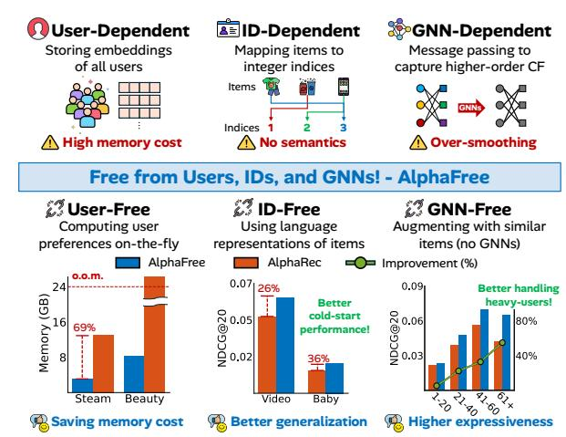
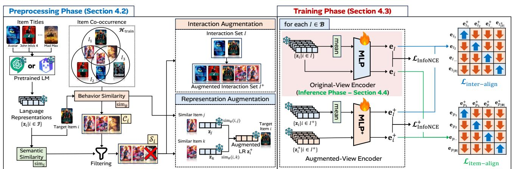
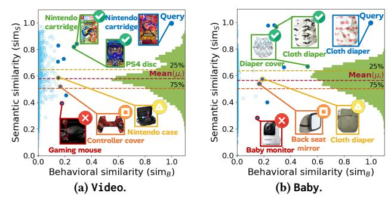
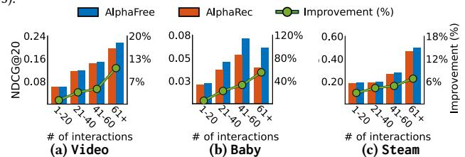
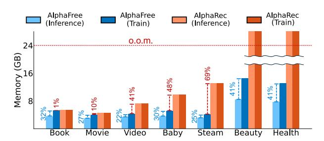
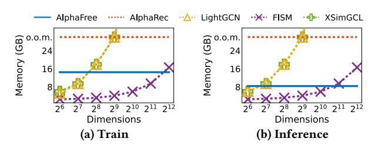
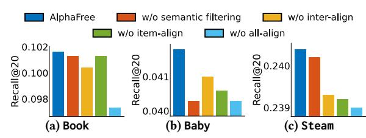
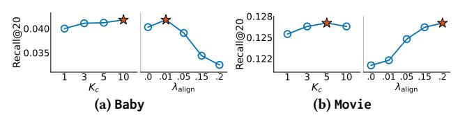
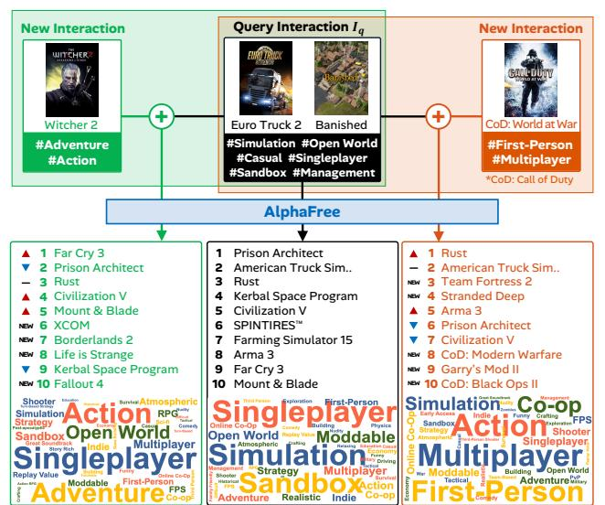
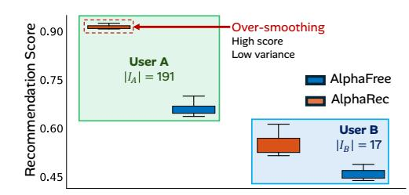

# AlphaFree: Recommendation Free from Users, IDs, and GNNs

[Minseo Jeon](https://orcid.org/0009-0007-2185-5031) Soongsil University Seoul, Republic of Korea minseojeon@soongsil.ac.kr

[Junwoo Jung](https://orcid.org/0009-0005-0612-4906) Soongsil University Seoul, Republic of Korea junwoojung@soongsil.ac.kr

[Daewon Gwak](https://orcid.org/0009-0008-5404-6553) Soongsil University Seoul, Republic of Korea daewon1@soongsil.ac.kr

[Jinhong Jung](https://orcid.org/0000-0002-5533-1507)∗ Soongsil University Seoul, Republic of Korea jinhong@ssu.ac.kr

### Abstract

Can we design effective recommender systems free from users, IDs, and GNNs? Recommender systems are central to personalized content delivery across domains, with top-�� item recommendation being a fundamental task to retrieve the most relevant items from historical interactions. Existing methods rely on entrenched design conventions, often adopted without reconsideration, such as storing per-user embeddings (user-dependent), initializing features from raw IDs (ID-dependent), and employing graph neural networks (GNN-dependent). These dependencies incur several limitations, including high memory costs, cold-start and over-smoothing issues, and poor generalization to unseen interactions.

In this work, we propose AlphaFree, a novel recommendation method free from users, IDs, and GNNs. Our main ideas are to infer preferences on-the-fly without user embeddings (user-free), replace raw IDs with language representations (LRs) from pretrained language models (ID-free), and capture collaborative signals through augmentation with similar items and contrastive learning, without GNNs (GNN-free). Extensive experiments on various realworld datasets show that AlphaFree consistently outperforms its competitors, achieving up to around 40% improvements over non-LR-based methods and up to 5.7% improvements over LR-based methods, while significantly reducing GPU memory usage by up to 69% under high-dimensional LRs.

# CCS Concepts

- Information systems → Recommender systems.

# Keywords

User-free recommendation, ID-free representation, GNN-free architecture, Collaborative augmentation, Contrastive learning

### ACM Reference Format:

Minseo Jeon, Junwoo Jung, Daewon Gwak, and Jinhong Jung. 2026. AlphaFree: Recommendation Free from Users, IDs, and GNNs. In Proceedings of the ACM Web Conference 2026 (WWW '26), April 13–17, 2026, Dubai, United Arab Emirates. ACM, New York, NY, USA, [13](#page-12-0) pages. [https://doi.org/10.1145/](https://doi.org/10.1145/3774904.3792355) [3774904.3792355](https://doi.org/10.1145/3774904.3792355)

# 1 Introduction

Recommender systems play a central role in online services by delivering personalized content across domains such as e-commerce,

∗Corresponding author.

© 2026 Copyright held by the owner/author(s). ACM ISBN 979-8-4007-2307-0/2026/04 <https://doi.org/10.1145/3774904.3792355>

Figure 1: Highlight of the motivation and effectiveness of AlphaFree. (Top) Existing recommender systems depend on user embeddings, item IDs, or GNNs, leading to high memory cost, cold-start limitations, and over-smoothing. (Bottom) AlphaFree overcomes these challenges by performing recommendations free from users, IDs, and GNNs, showing 69% less memory, 26–36% higher accuracy in cold-start cases, and up to around 50% improvement for heavy users.

streaming, and social media [\[34,](#page-8-0) [44,](#page-8-1) [49\]](#page-8-2). A fundamental task in this field is top-�� item recommendation, which aims to retrieve the �� most relevant items based on a user's historical interactions [\[19,](#page-8-3) [20,](#page-8-4) [36\]](#page-8-5). Over the years, numerous methods have been proposed for this task, ranging from classical collaborative filtering [\[18,](#page-8-6) [31,](#page-8-7) [51,](#page-8-8) [52,](#page-8-9) [56\]](#page-8-10) and neural network-based approaches [\[11,](#page-8-11) [13,](#page-8-12) [32,](#page-8-13) [62,](#page-9-0) [65\]](#page-9-1) to more recent language model-based techniques [\[1,](#page-8-14) [9,](#page-8-15) [50,](#page-8-16) [55\]](#page-8-17), all striving to improve performance. Throughout this development, recommender modeling has been largely shaped by several conventions that have become de facto standards: storing user embeddings, initializing with ID-based features, and employing graph neural networks (GNNs) to capture collaborative signals. Based on these aspects, we categorize existing approaches into (1) user-dependent methods, (2) ID-dependent methods, and (3) GNN-dependent methods.

User-dependent methods extract user and item embeddings from historical interactions, and require user embeddings to be maintained throughout training and inference. Although user embeddings encode individual preferences, they become unreliable when interactions are sparse [\[4\]](#page-8-18) or noisy [\[8,](#page-8-19) [15\]](#page-8-20), and their memory cost scales linearly with the number of users, which becomes substantial in domains with many users, such as e-commerce. ID-dependent methods rely on raw discrete identifiers (IDs) as the initial features of users and items. While simple and effective for seen entities, these representations lack semantic meaning and generalize poorly

[This work is licensed under a Creative Commons Attribution 4.0 International License.](https://creativecommons.org/licenses/by/4.0) WWW '26, Dubai, United Arab Emirates

to unseen users or items. GNN-dependent methods use GNNs to capture high-order collaborative signals from explicit graph structures (e.g., user–item graphs). However, they also need to preserve user embeddings (thus inherently user-dependent) as well as graphs, which leads to high memory usage, and their expressiveness is limited due to over-smoothing [\[2,](#page-8-21) [37,](#page-8-22) [53\]](#page-8-23).

Several prior works have attempted to partially address the limitations of these three methods. For instance, FISM [\[22\]](#page-8-24) and SLIM-based methods [\[43\]](#page-8-25) neither store user embeddings nor employ GNNs; however, they rely on ID-based features and struggle to capture higher-order collaborative signals. LightGCN [\[11\]](#page-8-11) and XSimGCL [\[64\]](#page-9-2) capture higher-order structures with GNNs but also rely on ID-based features, store user embeddings, and suffer from over-smoothing. Recent methods such as RLMRec [\[50\]](#page-8-16) and AlphaRec [\[55\]](#page-8-17) leverage language models to exploit semantic representations of items, but they remain user-dependent or rely on GNNs. Figure [1](#page-0-0) summarizes these dependencies and limitations, motivating our work, while Table [1](#page-5-0) shows that no existing approach addresses them simultaneously, raising the question: Can we design effective recommender systems free from users, IDs, and GNNs?

In this paper, we propose AlphaFree, a novel method to top- �� item recommendation that is free from users, IDs, and GNNs, while achieving strong performance across various benchmarks. AlphaFree builds on three core design principles:

- User-free: Rather than storing user embeddings, it computes latent preferences on-the-fly from interaction history, reducing memory usage and improving cold-start handling.
- ID-free: It replaces raw IDs with semantic item representations derived from language models, enabling generalization to unseen items and capturing semantic similarity.
- GNN-free: It captures collaborative signals without GNNs by augmenting representations with behaviorally and semantically similar items and applying contrastive learning.

By removing all three dependencies, AlphaFree achieves greater memory efficiency, improved generalization, and higher accuracy than the existing methods. Our contributions are as follows:

- Method. We propose AlphaFree, a novel method that performs recommendations free from users, IDs, and GNNs.
- Techniques. We show our design principles are effectively realized through: (1) augmenting with behaviorally and semantically similar items, (2) on-the-fly preference modeling, and (3) contrastive learning between the original and augmented views.
- Experiment. Through our extensive experiments, we show AlphaFree achieves better recommendation accuracy and memory efficiency compared to state-of-the-art methods.

### 2 Related Work

Traditional methods dependent on users, IDs, or GNNs. Most classical methods are user-dependent, as they require user embeddings. Matrix factorization-based methods, such as MF-BPR [\[31,](#page-8-7) [52\]](#page-8-9) and NCF [\[13\]](#page-8-12), extract user embeddings along with item embeddings from a user-item matrix. Graph-based methods, such as Light-GCN [\[11\]](#page-8-11) and XSimGCL [\[64\]](#page-9-2), perform message passing over useritem graphs to learn users and items embeddings. Although they directly encode user preferences in an embedding space, they incur memory costs that grow with the number of users, which becomes substantial in user-heavy domains such as e-commerce (see Table [2\)](#page-5-1).

Moreover, traditional methods including the aforementioned models are ID-dependent, initializing embeddings with raw discrete IDs (e.g., unique integer indices for users or items) due to the absence of user or item content and their reliance on user-item interactions. These IDs are typically mapped to one-hot encoding or randomly initialized features followed by training. While straightforward and effective for learning interactions without domain knowledge, they struggle to capture meaningful patterns under sparse interactions and to generalize to new entities.

With the emergence of GNNs, many methods have been developed that are GNN-dependent, relying on message passing over a user–item graph to capture higher-order collaborative signals. For example, LightGCN employs simplified GNN layers to propagate user and item embeddings across the graph, capturing higher-order signals through multiple layers. XSimGCL [\[64\]](#page-9-2) further introduces graph contrastive learning [\[59,](#page-8-26) [63,](#page-9-3) [69\]](#page-9-4) for better expressiveness. These methods enhance performance by using higher-order CF signals, but they remain inherently user-dependent, requiring embeddings for all users. Additionally, they suffer from over-smoothing, where embeddings become too similar after repeated message passing, which is particularly severe for high-degree nodes due to excessive averaging over many neighbors, limiting performance.

Methods partially free from users, IDs, or GNNs. Several studies have attempted to partially relax those dependencies. User-free methods discard user embeddings while retaining only item embeddings. Along this line, SLIM [\[43\]](#page-8-25) directly learns item–item similarities, while FISM [\[22\]](#page-8-24) models them through factorized matrices of items. However, both approaches remain ID-dependent. Earlystage methods such as MF-BPR and NCF are trivially GNN-free as they predate the advent of GNNs, while still relying on users and IDs. With advances in language models, RLMRec [\[50\]](#page-8-16) and AlphaRec [\[55\]](#page-8-17) have been recently proposed as ID-free, using language representations (LRs) derived from item content instead of IDs during training. However, both store user embeddings and thus remain user-dependent, while AlphaRec is additionally GNN-dependent. In particular, the LR-based methods face challenges of user dependency w.r.t. memory consumption, as most language models produce high-dimensional embeddings, which are then used to compute embeddings for every user[1](#page-1-0) . To the best of our knowledge, no existing work resolves all these dependencies simultaneously, whereas our AlphaFree successfully resolves them.

### 3 Preliminaries

Notations. We denote the set of all items by I, and ���� is the associated text content (e.g., title) of item ��. Let �� ⊆ I denote the interaction set of an arbitrary user, i.e., �� = {��1, · · · ,��|�� | }. Let H denote the collection of all interaction sets in a dataset, i.e., H = {�� | �� ⊆ I}. Problem definition. The problem is defined as follows:

Problem 1 (Top-�� Item Recommendation). Given a training collection of interaction sets Htrain, the goal is to learn the parameters �� of a recommendation model, in order to recommend the items in the top-�� ranked list R���� for a querying interaction set ����:

R���� := argtop�� ���� (�� | ����) | �� ∈ I 

For example, at the initial stage, LightGCN uses 64-dimensional embeddings [\[11\]](#page-8-11), while AlphaRec adopts 3,072-dimensional ones from text-embedding-3-large [\[41,](#page-8-27) [55\]](#page-8-17).

Table 1: Recommendation performance in terms of Recall@�� and NDCG@�� (�� = 20) under the user-wise holdout split setting. We indicate whether each method satisfies three design principles: **UF** (user-free), **IF** (ID-free), and **GF** (GNN-free). The best non-LR results are in red, and best LR results (excluding AlphaFree) are in blue. Note that only AlphaFree adheres to all design principles, achieves the best accuracy, and successfully processes all datasets where some LR-based methods fail.

| Model       | UF   | Principle IF | GF Movie | Book     | Video    | Recall@20 Baby | Steam   | Beauty   | Health  | Movie    | Book     | Video    | NDCG@20 Baby | Steam    | Beauty   | Health  |
|-------------|------|--------------|----------|----------|----------|----------------|---------|----------|---------|----------|----------|----------|--------------|----------|----------|---------|
| MF-BPR      | %    | %            | " 0.0580 | 0.0436   | 0.0177   | 0.0150         | 0.1610  | 0.0063   | 0.0091  | 0.0533   | 0.0387   | 0.0095   | 0.0074       | 0.1537   | 0.0032   | 0.0048  |
| FISM-BPR    | "    | %            | " 0.0861 | 0.0623   | 0.0392   | 0.0150         | 0.1801  | 0.0079   | 0.0104  | 0.0801   | 0.0540   | 0.0220   | 0.0076       | 0.1431   | 0.0044   | 0.0060  |
| LightGCN    | %    | %            | % 0.0860 | 0.0712   | 0.0732   | 0.0359         | 0.2013  | 0.0201   | 0.0250  | 0.0754   | 0.0597   | 0.0409   | 0.0185       | 0.1518   | 0.0110   | 0.0142  |
| XSimGCL     | %    | %            | % 0.0967 | 0.0818   | 0.0897   | 0.0390         | 0.2245  | 0.0253   | 0.0299  | 0.0866   | 0.0690   | 0.0500   | 0.0203       | 0.1664   | 0.0140   | 0.0170  |
| RLMRec      | %    | "            | % 0.1046 | 0.0905   | o.o.t.   | o.o.t.         | o.o.t.  | o.o.t.   | o.o.t.  | 0.0942   | 0.0741   | o.o.t.   | o.o.t.       | o.o.t.   | o.o.t.   | o.o.t.  |
| AlphaRec    | %    | "            | % 0.1219 | 0.0991   | 0.1088   | 0.0391         | 0.2360  | o.o.m.   | o.o.m.  | 0.1141   | 0.0829   | 0.0605   | 0.0210       | 0.1884   | o.o.m.   | o.o.m.  |
| AlphaFree   | "    | "            | " 0.1267 | 0.1014   | 0.1111   | 0.0412         | 0.2402  | 0.0361   | 0.0325  | 0.1194   | 0.0861   | 0.0615   | 0.0219       | 0.1938   | 0.0200   | 0.0184  |
| % inc. over | best | LR           | 3.94% ∗  |          |          |                |         |          |         |          |          |          |              |          |          |         |
|             |      |              |          | 2.32% ∗  |          |                |         |          |         |          |          |          |              |          |          |         |
|             |      |              |          |          | 2.11% ∗  |                |         |          |         |          |          |          |              |          |          |         |
|             |      |              |          |          |          | 5.37% ∗        |         |          |         |          |          |          |              |          |          |         |
|             |      |              |          |          |          |                | 1.78% ∗ |          |         |          |          |          |              |          |          |         |
|             |      |              |          |          |          |                |         |          |         | 4.65% ∗  |          |          |              |          |          |         |
|             |      |              |          |          |          |                |         |          |         |          | 3.86% ∗  |          |              |          |          |         |
|             |      |              |          |          |          |                |         |          |         |          |          | 1.65% ∗  |              |          |          |         |
|             |      |              |          |          |          |                |         |          |         |          |          |          | 5.71% ∗      |          |          |         |
|             |      |              |          |          |          |                |         |          |         |          |          |          |              | 2.89% ∗  |          |         |
| % inc. over | best | non-LR       | 31.00% ∗ |          |          |                |         |          |         |          |          |          |              |          |          |         |
|             |      |              |          | 23.96% ∗ |          |                |         |          |         |          |          |          |              |          |          |         |
|             |      |              |          |          | 23.81% ∗ |                |         |          |         |          |          |          |              |          |          |         |
|             |      |              |          |          |          | 5.58% ∗        |         |          |         |          |          |          |              |          |          |         |
|             |      |              |          |          |          |                | 6.99% ∗ |          |         |          |          |          |              |          |          |         |
|             |      |              |          |          |          |                |         | 42.69% ∗ |         |          |          |          |              |          |          |         |
|             |      |              |          |          |          |                |         |          | 8.70% ∗ |          |          |          |              |          |          |         |
|             |      |              |          |          |          |                |         |          |         | 37.90% ∗ |          |          |              |          |          |         |
|             |      |              |          |          |          |                |         |          |         |          | 24.78% ∗ |          |              |          |          |         |
|             |      |              |          |          |          |                |         |          |         |          |          | 23.07% ∗ |              |          |          |         |
|             |      |              |          |          |          |                |         |          |         |          |          |          | 9.26% ∗      |          |          |         |
|             |      |              |          |          |          |                |         |          |         |          |          |          |              | 16.49% ∗ |          |         |
|             |      |              |          |          |          |                |         |          |         |          |          |          |              |          | 42.86% ∗ |         |
|             |      |              |          |          |          |                |         |          |         |          |          |          |              |          |          | 8.24% ∗ |

- Out-of-time (o.o.t.) indicates that the total time including preprocessing exceeded 50 hours, while out-of-memory (o.o.m.) denotes GPU memory overflow. - Percentage increases marked with ∗ are statistically significant (��-value ≤ 0.05).

Table 2: Statistics of real-world recommendation datasets.

| Datasets | Movie   | Book      | Video   |           | Baby Steam | Beauty    | Health    |
|----------|---------|-----------|---------|-----------|------------|-----------|-----------|
| #Users   | 26,073  | 71,306    | 94,762  | 150,777   | 334,730    | 729,576   | 796,054   |
| #Items   | 12,464  | 40,523    | 25,612  | 36,013    | 15,068     | 207,649   | 184,346   |
| #Inter.  | 875,906 | 2,206,865 | 814,586 | 1,241,083 | 4,216,781  | 6,624,441 | 7,176,552 |

### 5 Experiments

We present experimental results to evaluate the effectiveness of AlphaFree compared with state-of-the-art baselines for Problem [1.](#page-1-1)

# 5.1 Experimental Settings

Datasets and competitors. We conducted experiments on seven real-world datasets in Table [2,](#page-5-1) where details of each dataset are in Appendix [B.](#page-9-5) We group the baselines of AlphaFree as follows:

- Non-LR-based methods. We considered MF-BPR [\[31\]](#page-8-7), a widely used baseline that stores user embeddings, and FISM-BPR [\[22\]](#page-8-24), a well-known user-free model. We included LightGCN [\[11\]](#page-8-11) and XSimGCL [\[64\]](#page-9-2), which are popular GNN-based approaches. All of these methods are ID-dependent, not using LRs.
- LR-based methods. We included RLMRec [\[50\]](#page-8-16) and AlphaRec [\[55\]](#page-8-17), which are state-of-the-art ID-free approaches. Details of the LMs used in this section are in Appendix [B,](#page-9-5) with additional analyses on the effect of different LMs provided in Appendix [E.](#page-11-1)

Training and evaluation protocol. Each dataset was divided into training, validation, and test sets, where the detailed ratios and splitting strategies are provided in the following subsections. We tuned the hyperparameters of each model, including AlphaFree, on the validation set using Recall@20. Using the selected hyperparameters, we then evaluated the models on the test set in terms of Recall@20 and NDCG@20. We ran each experiment five times with different random seeds and reported the average performance. Refer to Appendix [B](#page-9-5) for details of the settings.

Reproducibility. The code and datasets used in the paper are available at <https://github.com/minseojeonn/AlphaFree>.

### 5.2 Recommendation Performance

We evaluated the performance of top-�� recommendation following recent studies [\[55,](#page-8-17) [66\]](#page-9-9), using a user-wise holdout split. Specifically,

Figure 4: Performance of AlphaFree and AlphaRec in NDCG@20 across groups with different numbers of interactions. The green line indicates the relative improvement of AlphaFree over AlphaRec. AlphaFree shows consistent improvements, which grow with more interactions.

we randomly divided each user's interaction history into training, validation, and test sets with a ratio of 4:3:3. The results are reported in Table [1,](#page-5-0) and we observe the following findings:

- AlphaFree outperforms LR-based methods with gains of up to 5.37% (Recall@20) and 5.71% (NDCG@20), and significantly outperforms non-LR-based ones with improvements of up to 42% on both metrics, while uniquely satisfying all design principles.
- Among LR-based methods, only AlphaFree successfully handles all datasets, whereas others fail on large ones, with RLMRec suffering from out-of-time even on smaller datasets and AlphaRec running out-of-memory on larger ones such as Beauty and Health, highlighting the advantage of being user-free.
- AlphaFree benefits from being ID-free, as ID-dependent methods such as MF-BPR and FISM-BPR yield lower accuracy, indicating that LR-based (ID-free) approaches, including AlphaFree, provide richer semantics and better performance.
- By being GNN-free, AlphaFree consistently outperforms GNNdependent methods, including LightGCN and AlphaRec, in both accuracy and efficiency.

# 5.3 Performance across Interaction Groups

We analyzed performance across interaction groups to investigate the effect of being GNN-free. To this end, we compared AlphaFree with AlphaRec, the second-best model (Table [1\)](#page-5-0), which also utilizes item LRs but still relies on GNNs. We classified each �� ∈ Htrain into one of four groups (i.e., 1–20, 21–40, 41–60, and 61+) based on

Table 3: Performance on interaction sets of new users unseen during training (best in bold; second-best underlined). AlphaFree outperforms the tested baselines by effectively recommending for new users.

| Model     | Movie  | Book   | Recall@20 Video | Baby   | Movie  | Book   | NDCG@20 Video | Baby   |
|-----------|--------|--------|-----------------|--------|--------|--------|---------------|--------|
| FISM-BPR  | 0.0570 | 0.0494 | 0.0601          | 0.0135 | 0.0853 | 0.0601 | 0.0397        | 0.0090 |
| LightGCN  | 0.0401 | 0.0302 | 0.0438          | 0.0125 | 0.0614 | 0.0423 | 0.0274        | 0.0076 |
| AlphaRec  | 0.0681 | 0.0621 | 0.0732          | 0.0216 | 0.0980 | 0.0837 | 0.0474        | 0.0138 |
| AlphaFree | 0.0706 | 0.0646 | 0.0922          | 0.0300 | 0.1027 | 0.0850 | 0.0596        | 0.0188 |
| % inc.    | 3.63%  | 3.94%  | 25.90%          | 38.65% | 4.89%  | 1.51%  | 25.71%        | 35.95% |

|�� | and measured NDCG@20 for each group. Figure [4](#page-5-2) shows the results, with the percentage increase of ours over AlphaRec shown on the right y-axis. AlphaFree consistently outperforms AlphaRec across all groups, and the relative improvement becomes larger as |�� | increases. In particular, the improvement in the 61+ group (or heavy users) is more pronounced than in the other groups, indicating that AlphaRec using GNNs shows limited performance for those users as their representations become excessively averaged (i.e., oversmoothed), whereas our GNN-free design avoids such an issue.

### 5.4 Generalization to Unseen Interaction Sets

We evaluated the generalization performance of AlphaFree on interaction sets unseen during training, i.e., in a user cold-start setting[4](#page-6-0) . For each dataset, we first split the users into training, validation, and test sets with an 8:1:1 ratio. For evaluation, we sampled 10% of interactions (at least one) from each user's set �� in the validation and test data to form ����, and used the remaining ones as ground truth. From Table [3,](#page-6-1) we observe the following:

- AlphaFree shows consistently superior generalization performance compared to the tested baselines, achieving improvements of up to 38.65% in Recall@20 and 35.95% in NDCG@20, respectively.
- As a user-dependent method, AlphaRec shows limited generalization compared to AlphaFree, indicating that it struggles to learn effective embeddings for new users.
- For ID-dependent methods, the user-free FISM-BPR performs better than LightGCN, whereas AlphaFree further improves performance by leveraging LRs.

These verify that user-free architectures generalize more effectively to new users with few interactions, while leveraging LRs provides additional gains beyond ID- and user-dependent models.

# 5.5 Space Efficiency

We analyze the space efficiency of AlphaFree gained from its user-free design. The runtime analysis is provided in Appendix [I.](#page-12-1) Memory usage over LR-based methods. For LR-based models, language models (LMs) produce LRs of a fixed size ��LR that cannot be easily adjusted, which becomes a major bottleneck in space. Thus, we analyzed the average GPU memory usage per epoch of AlphaFree and AlphaRec during both training and inference, where they used the same LRs. As shown in Figure [5,](#page-6-2) AlphaFree uses less memory than AlphaRec, which fails to run on larger datasets

Figure 5: GPU memory usage of AlphaFree and AlphaRec during training and inference, showing AlphaFree consistently requires less memory, and AlphaRec runs out of memory (o.o.m.) on large datasets such as **Beauty** and **Health**.

Figure 6: GPU memory usage on **Beauty** under varying embedding dimensions. For AlphaFree and AlphaRec, the dimension is fixed by the language model (��LR = 2 12), where AlphaRec runs out-of-memory. Other baselines require less memory at smaller dimensions but grow rapidly, eventually surpassing AlphaFree after ��LR.

such as Beauty and Health. In particular, AlphaFree reduces the usage by up to 69% compared to AlphaRec during training. This results from the user-free design of AlphaFree (i.e., not storing user embeddings), unlike AlphaRec. We also observe that AlphaFree requires up to 41% less memory for inference compared to training, as the inference phase uses only the original-view encoder. Memory usage w.r.t. embedding dimensions. Unlike the above LR-based models, the embedding dimension �� of traditional methods can be easily adjusted. For AlphaFree and AlphaRec, ��LR = 2 12 was fixed by the LM, while we varied �� for the other methods from 2 6 to 2 12 to examine their memory usage on the Beauty dataset. As shown in Figure [6,](#page-6-3) they use less GPU memory at smaller ��, but their usage increases as �� grows. In particular, LightGCN and XSimGCL (i.e., user-dependent) show steeper growth than FISM-BPR (i.e., user-free). AlphaFree uses more memory than those methods with small �� due to high-dimensional LRs, but it achieves much higher accuracy (Section [5.2\)](#page-5-3), whereas those methods overfit at large dimension ��.

# 5.6 Ablation Study

We further analyze the contribution of each component through ablation studies: w/o semantic filtering disables the semantic filtering module used for selecting similar items; w/o inter-align removes the interaction-level alignment loss Linter-align; w/o itemalign removes the item-level alignment loss Litem-align; and w/o all-align removes all alignment losses by setting ��align = 0, and uses only LInfoNCE. Figure [7](#page-7-0) shows the results of our ablation studies, where removing any component leads to performance degradation,

In this experimental setup, each new user was given on average 1.09–2.95 interactions as a query at test time (see Appendix [B](#page-9-5) for details).

Figure 7: Ablation results showing that each module contributes positively, with varying effects across datasets, and the full model (AlphaFree) performs the best.

Figure 8: Effects of hyperparameters ���� and ��align, where the best points are marked with a star symbol. The trends differ across datasets, suggesting that proper tuning of them is required to adapt to various data characteristics.

verifying that each module contributes positively to AlphaFree with varying impacts across datasets. Note that the full version of AlphaFree consistently achieves the best performance.

# 5.7 Effect of Hyperparameters

We analyzed the effect of ���� and ��align, which controls the number of similar items and the strength of the cross-view alignment. Since data density can affect augmentation, we selected Movie and Baby, whose densities are 0.27% and 0.02%, to examine the effects on datasets with different densities.

Effect of ���� . As shown in Figure [8,](#page-7-1) AlphaFree benefits from a larger ���� in the sparser Baby dataset, whereas Movie achieves the best performance around ���� = 5, indicating that a larger ���� is not good for denser datasets.

Effect of ��align. In the denser Movie dataset, larger ��align improves performance by enforcing consistency between the two views. In the sparser Baby dataset, too strong alignment degrades performance, as the augmentations in sparse data may contain noise; in this case, a weaker alignment can be helpful.

# 5.8 Qualitative Case Study

We conducted a case study to qualitatively verify the effectiveness of the user-free and ID-free designs of AlphaFree. To this end, we trained AlphaFree on Htrain of the Steam dataset and examined how it adapts to new interactions. Specifically, we set an unseen ���� = {EuroTruck, Banished}, whose context is characterized by several tags such as #Simulation and #Sandbox. The resulting recommendations of AlphaFree for ���� are shown in the middle of Figure [9,](#page-7-2) where these tags are dominant, indicating AlphaFree effectively captures the context of ����. Next, adding Witcher2 (#Action and #Adventure) to ���� and feeding it to AlphaFree without retraining yields the left recommendation list, where action games rise or newly appear, and those tags become dominant. In contrast, when adding CoD to ����, AlphaFree yields the right result, where FPS games rise or newly appear, and the #First-Person

Figure 9: Case study on the **Steam** dataset, where the middle shows the results for unseen ����, and the left and right show updates after adding a new item into ���� with word clouds of user tags for recommended games.

and #Multiplayer tags become dominant. These results show that AlphaFree effectively captures query contexts (ID-free) and adapts to new interactions (user-free).

### 6 Conclusion

In this paper, we proposed AlphaFree, a novel top-�� recommendation framework that is free from users, IDs, and GNNs. Throughout this work, we demonstrate that even a simple and lightweight model, such as MLPs, can achieve strong recommendation performance by removing dependencies on users, IDs, and GNNs. Specifically, AlphaFree augments each item and interaction set with behaviorally and semantically similar items, and contrastively aligns the original and augmented views during training, enabling the model to leverage high-order CF signals without relying on GNNs. At inference, only the original-view encoder consisting of a lightweight MLP is used, providing on-the-fly recommendations for a given query, while remaining free from users, IDs, and GNNs. Extensive experiments on various benchmarks and settings demonstrate that AlphaFree outperforms state-of-the-art methods, achieving up to around 40% higher accuracy over non-LR-based methods and 5.7% higher accuracy over LR-based methods, while reducing GPU memory usage by up to 69%. We discuss the limitations and future directions of AlphaFree in Appendix [A.](#page-9-8)

# Acknowledgements

We would like to thank all anonymous reviewers for their dedicated reviews and comments. This work was supported by the Institute of Information & Communications Technology Planning & Evaluation (IITP) - Innovative Human Resource Development for Local Intellectualization program grant funded by the Korea government (MSIT) (IITP-2026-RS-2022-00156360, 50%) and the Convergence security core talent training business support program (IITP-2026- RS-2024-00426853, 50%).

### References

[1] Keqin Bao, Jizhi Zhang, Yang Zhang, Wenjie Wang, Fuli Feng, and Xiangnan He. 2023. TALLRec: An Effective and Efficient Tuning Framework to Align Large Language Model with Recommendation. In RecSys. [2] Deli Chen, Yankai Lin, Wei Li, Peng Li, Jie Zhou, and Xu Sun. 2020. Measuring and Relieving the Over-Smoothing Problem for Graph Neural Networks from the Topological View. In AAAI. [3] Yuxin Chen, Junfei Tan, An Zhang, Zhengyi Yang, Leheng Sheng, Enzhi Zhang, Xiang Wang, and Tat-Seng Chua. 2024. On Softmax Direct Preference Optimization for Recommendation. In NeurIPS. [4] Zefeng Chen, Wensheng Gan, Jiayang Wu, Kaixia Hu, and Hong Lin. 2023. Data Scarcity in Recommendation Systems: A Survey. CoRR abs/2312.10073 (2023). [5] Minjin Choi, Sunkyung Lee, Seongmin Park, and Jongwuk Lee. 2025. Linear Item-Item Models with Neural Knowledge for Session-based Recommendation. In SIGIR. [6] Jaewan Chun, Geon Lee, Kijung Shin, and Jinhong Jung. 2024. Random walk with restart on hypergraphs: fast computation and an application to anomaly detection. Data Min. Knowl. Discov. 38, 3 (2024), 1222–1257. [7] Abhinav Dubey et al. 2024. The Llama 3 Herd of Models. CoRR abs/2407.21783 (2024). [8] Yunjun Gao, Yuntao Du, Yujia Hu, Lu Chen, Xinjun Zhu, Ziquan Fang, and Baihua Zheng. 2022. Self-Guided Learning to Denoise for Robust Recommendation. In SIGIR. [9] Shijie Geng, Shuchang Liu, Zuohui Fu, Yingqiang Ge, and Yongfeng Zhang. 2022. Recommendation as Language Processing (RLP): A Unified Pretrain, Personalized Prompt & Predict Paradigm (P5). In RecSys. [10] Gyeongmin Gu, Minseo Jeon, Hyun-Je Song, and Jinhong Jung. 2025. Effective and lightweight representation learning for signed bipartite graphs. Neural Networks 192 (2025), 107708. [11] Xiangnan He, Kuan Deng, Xiang Wang, Yan Li, Yong-Dong Zhang, and Meng Wang. 2020. LightGCN: Simplifying and Powering Graph Convolution Network for Recommendation. In SIGIR. [12] Xiangnan He, Ming Gao, Min-Yen Kan, and Dingxian Wang. 2017. BiRank: Towards Ranking on Bipartite Graphs. IEEE Trans. Knowl. Data Eng. 29, 1 (2017), 57–71. [13] Xiangnan He, Lizi Liao, Hanwang Zhang, Liqiang Nie, Xia Hu, and Tat-Seng Chua. 2017. Neural Collaborative Filtering. In WWW. [14] Yupeng Hou, Jiacheng Li, Zhankui He, An Yan, Xiusi Chen, and Julian J. McAuley. 2024. Bridging Language and Items for Retrieval and Recommendation. CoRR abs/2403.03952 (2024). [15] Tinglin Huang, Yuxiao Dong, Ming Ding, Zhen Yang, Wenzheng Feng, Xinyu Wang, and Jie Tang. 2021. MixGCF: An Improved Training Method for Graph Neural Network-based Recommender Systems. In KDD. [16] Albert Q. Jiang, Alexandre Sablayrolles, Arthur Mensch, Chris Bamford, Devendra Singh Chaplot, Diego de Las Casas, Florian Bressand, Gianna Lengyel, Guillaume Lample, Lucile Saulnier, Lélio Renard Lavaud, Marie-Anne Lachaux, Pierre Stock, Teven Le Scao, Thibaut Lavril, Thomas Wang, Timothée Lacroix, and William El Sayed. 2023. Mistral 7B. CoRR abs/2310.06825 (2023). [17] Jeff Johnson, Matthijs Douze, and Hervé Jégou. 2021. Billion-Scale Similarity Search with GPUs. IEEE Trans. Big Data 7, 3 (2021), 535–547. [18] Yu-Chin Juan, Yong Zhuang, Wei-Sheng Chin, and Chih-Jen Lin. 2016. Fieldaware Factorization Machines for CTR Prediction. In RecSys. [19] Jinhong Jung, Woojeong Jin, Lee Sael, and U Kang. 2016. Personalized Ranking in Signed Networks Using Signed Random Walk with Restart. In ICDM. [20] Jinhong Jung, Namyong Park, Lee Sael, and U Kang. 2017. BePI: Fast and Memory-Efficient Method for Billion-Scale Random Walk with Restart. In SIGMOD. [21] Jinhong Jung, Jaemin Yoo, and U Kang. 2020. Signed Graph Diffusion Network. CoRR abs/2012.14191 (2020). [22] Santosh Kabbur, Xia Ning, and George Karypis. 2013. FISM: factored item similarity models for top-N recommender systems. In SIGKDD. [23] Wang-Cheng Kang and Julian J. McAuley. 2018. Self-Attentive Sequential Recommendation. In ICDM. [24] Vladimir Karpukhin, Barlas Oguz, Sewon Min, Patrick Lewis, Ledell Wu, Sergey Edunov, Danqi Chen, and Wen-tau Yih. 2020. Dense Passage Retrieval for Open-Domain Question Answering. In EMNLP. [25] George Karypis. 2001. Evaluation of Item-Based Top-N Recommendation Algorithms. In CIKM. [26] Kyungho Kim, Sunwoo Kim, Geon Lee, Jinhong Jung, and Kijung Shin. 2025. Multi-behavior Recommender Systems: A Survey. In PAKDD. [27] Kyungho Kim, Sunwoo Kim, Geon Lee, and Kijung Shin. 2025. A Self-Supervised Mixture-of-Experts Framework for Multi-behavior Recommendation. In CIKM. [28] Sang-Hong Kim and Ha-Myung Park. 2023. Efficient Distributed Approximate k-Nearest Neighbor Graph Construction by Multiway Random Division Forest. In SIGKDD. [29] Geonwoo Ko, Minseo Jeon, and Jinhong Jung. 2025. Personalized Ranking on Cascading Behavior Graphs for Accurate Multi-Behavior Recommendation. arXiv preprint arXiv:2502.11335 abs/2502.11335 (2025). [30] Geonwoo Ko and Jinhong Jung. 2024. Learning disentangled representations in signed directed graphs without social assumptions. Inf. Sci. 665 (2024), 120373. [31] Yehuda Koren, Robert M. Bell, and Chris Volinsky. 2009. Matrix Factorization Techniques for Recommender Systems. Computer 42, 8 (2009), 30–37. [32] Geon Lee, Kyungho Kim, and Kijung Shin. 2024. Revisiting LightGCN: Unexpected Inflexibility, Inconsistency, and A Remedy Towards Improved Recommendation. In RecSys. [33] Jong-whi Lee and Jinhong Jung. 2023. Time-Aware Random Walk Diffusion to Improve Dynamic Graph Learning. In AAAI. [34] Jaeri Lee and U Kang. 2025. Context-aware Sequential Bundle Recommendation via User-specific Representations. In CIKM. [35] Seunghan Lee, Geonwoo Ko, Hyun-Je Song, and Jinhong Jung. 2024. MuLe: Multi-Grained Graph Learning for Multi-Behavior Recommendation. In CIKM. [36] Sangkeun Lee, Sang-il Song, Minsuk Kahng, Dongjoo Lee, and Sang-goo Lee. 2011. Random walk based entity ranking on graph for multidimensional recommendation. In RecSys. [37] Qimai Li, Zhichao Han, and Xiao-Ming Wu. 2018. Deeper Insights Into Graph Convolutional Networks for Semi-Supervised Learning. In AAAI. [38] Greg Linden, Brent Smith, and Jeremy York. 2003. Amazon.com Recommendations: Item-to-Item Collaborative Filtering. IEEE Internet Comput. 7, 1 (2003), 76–80. [39] Yaokun Liu, Xiaowang Zhang, Minghui Zou, and Zhiyong Feng. 2023. Cooccurrence Embedding Enhancement for Long-tail Problem in Multi-Interest Recommendation. In RecSys. [40] Yury A. Malkov and Dmitry A. Yashunin. 2020. Efficient and Robust Approximate Nearest Neighbor Search Using Hierarchical Navigable Small World Graphs. IEEE Trans. Pattern Anal. Mach. Intell. 42, 4 (2020), 824–836. [41] Arvind Neelakantan et al. 2022. Text and Code Embeddings by Contrastive Pre-Training. CoRR abs/2201.10005 (2022). [42] Jianmo Ni, Jiacheng Li, and Julian J. McAuley. 2019. Justifying Recommendations using Distantly-Labeled Reviews and Fine-Grained Aspects. In EMNLP. [43] Xia Ning and George Karypis. 2011. SLIM: Sparse Linear Methods for Top-N Recommender Systems. In ICDM. [44] Haekyu Park, Jinhong Jung, and U Kang. 2017. A comparative study of matrix factorization and random walk with restart in recommender systems. In BigData. [45] Ka Hyun Park, Junghun Kim, Jinhong Jung, and U Kang. 2025. PiGLeT: Probabilistic Message Passing for Semi-supervised Link Sign Prediction. In ICDM. [46] Seungcheol Park, Jeongin Bae, Beomseok Kwon, Minjun Kim, Byeongwook Kim, Se Jung Kwon, U Kang, and Dongsoo Lee. 2025. Unifying Uniform and Binarycoding Quantization for Accurate Compression of Large Language Models. In ACL. [47] Apurva Pathak, Kshitiz Gupta, and Julian J. McAuley. 2017. SIGIR. [48] Alec Radford, Jong Wook Kim, Chris Hallacy, Aditya Ramesh, Gabriel Goh, Sandhini Agarwal, Girish Sastry, Amanda Askell, Pamela Mishkin, Jack Clark, Gretchen Krueger, and Ilya Sutskever. 2021. Learning Transferable Visual Models From Natural Language Supervision. CoRR abs/2103.00020 (2021). [49] Shaina Raza, Mizanur Rahman, Safiullah Kamawal, Armin Toroghi, Ananya Raval, Farshad Navah, and Amirmohammad Kazemeini. 2024. A Comprehensive Review of Recommender Systems: Transitioning from Theory to Practice. CoRR abs/2407.13699 (2024). [50] Xubin Ren, Wei Wei, Lianghao Xia, Lixin Su, Suqi Cheng, Junfeng Wang, Dawei Yin, and Chao Huang. 2024. Representation Learning with Large Language Models for Recommendation. In WWW. [51] Steffen Rendle. 2010. Factorization Machines. In ICDM. [52] Steffen Rendle, Christoph Freudenthaler, Zeno Gantner, and Lars Schmidt-Thieme. 2009. BPR: Bayesian Personalized Ranking from Implicit Feedback. In UAI. [53] T. Konstantin Rusch, Michael M. Bronstein, and Siddhartha Mishra. 2023. A Survey on Oversmoothing in Graph Neural Networks. CoRR abs/2303.10993 (2023). [54] Badrul Munir Sarwar, George Karypis, Joseph A. Konstan, and John Riedl. 2001. Item-based collaborative filtering recommendation algorithms. In WWW. [55] Leheng Sheng, An Zhang, Yi Zhang, Yuxin Chen, Xiang Wang, and Tat-Seng Chua. 2025. Language Representations Can be What Recommenders Need: Findings and Potentials. In ICLR. [56] Harald Steck. 2019. Embarrassingly Shallow Autoencoders for Sparse Data. In WWW. [57] Gemini Team. 2023. Gemini: A Family of Highly Capable Multimodal Models. CoRR abs/2312.11805 (2023). [58] Andreas Veit, Balazs Kovacs, Sean Bell, Julian J. McAuley, Kavita Bala, and Serge J. Belongie. 2015. Learning Visual Clothing Style with Heterogeneous Dyadic Co-Occurrences. In ICCV. [59] Petar Velickovic, William Fedus, William L. Hamilton, Pietro Liò, Yoshua Bengio, and R. Devon Hjelm. 2018. Deep Graph Infomax. CoRR abs/1809.10341 (2018). [60] Fali Wang, Zhiwei Zhang, Xianren Zhang, Zongyu Wu, Tzuhao Mo, Qiuhao Lu, Wanjing Wang, Rui Li, Junjie Xu, Xianfeng Tang, Qi He, Yao Ma, Ming Huang, and Suhang Wang. 2025. A Comprehensive Survey of Small Language Models in the Era of Large Language Models: Techniques, Enhancements, Applications, Collaboration with LLMs, and Trustworthiness. ACM Trans. Intell. Syst. Technol.

- 16, 6 (2025), 145:1–145:87. [61] Liang Wang, Wei Zhao, and Jingming Liu. 2021. Aligning Cross-lingual Sentence Representations with Dual Momentum Contrast. In EMNLP. [62] Xiang Wang, Xiangnan He, Meng Wang, Fuli Feng, and Tat-Seng Chua. 2019. Neural Graph Collaborative Filtering. In SIGIR. [63] Yuning You, Tianlong Chen, Yongduo Sui, Ting Chen, Zhangyang Wang, and Yang Shen. 2020. Graph Contrastive Learning with Augmentations. In NeurIPS. [64] Junliang Yu, Xin Xia, Tong Chen, Lizhen Cui, Nguyen Quoc Viet Hung, and Hongzhi Yin. 2024. XSimGCL: Towards Extremely Simple Graph Contrastive Learning for Recommendation. IEEE Trans. Knowl. Data Eng. 36, 2 (2024), 913–
- 926. [65] Junliang Yu, Hongzhi Yin, Xin Xia, Tong Chen, Lizhen Cui, and Quoc Viet Hung Nguyen. 2022. Are Graph Augmentations Necessary?: Simple Graph Contrastive Learning for Recommendation. In SIGIR. [66] An Zhang, Yuxin Chen, Leheng Sheng, Xiang Wang, and Tat-Seng Chua. 2024. On Generative Agents in Recommendation. In SIGIR. [67] Yanzhao Zhang, Mingxin Li, Dingkun Long, Xin Zhang, Huan Lin, Baosong Yang, Pengjun Xie, An Yang, Dayiheng Liu, Junyang Lin, Fei Huang, and Jingren Zhou. 2025. Qwen3 Embedding: Advancing Text Embedding and Reranking Through Foundation Models. CoRR abs/2506.05176 (2025). [68] Zhihui Zhou, Lilin Zhang, and Ning Yang. 2023. Contrastive Collaborative Filtering for Cold-Start Item Recommendation. In WWW. [69] Yanqiao Zhu, Yichen Xu, Feng Yu, Qiang Liu, Shu Wu, and Liang Wang. 2020. Deep Graph Contrastive Representation Learning. CoRR abs/2006.04131 (2020).

# A Limitations and Future Directions

Dependency on textual metadata and LMs. AlphaFree exhibits an inherent dependency on textual item metadata and pre-trained LMs. This dependency arises as an unavoidable trade-off of its IDfree design, which replaces raw item IDs with LRs to address the limitations associated with ID-based modeling. As a result, in scenarios where no textual metadata is available, AlphaFree, along with other LR-based methods, cannot be directly applied. Moreover, the quality of the resulting representations is inherently bounded by the expressive power of the chosen LM (see Appendix [E\)](#page-11-1). Consequently, the performance of AlphaFree may vary across domains depending on both the quality of textual metadata, as well as the specific LM employed. However, this work, including [\[55\]](#page-8-17), uses only item titles whose LRs provide beneficial signals for recommendation. As such titles are widely available in most domains, AlphaFree is expected to be practically applicable. Nevertheless, how to effectively leverage other textual metadata (e.g., category, price, description, etc.) beyond item titles, as well as the trade-offs induced by different LM choices, has not yet been systematically studied, making this an important open question for future research. Preprocessing overhead and scalability. Our method exhibits additional preprocessing overhead and scalability considerations. In the data augmentation process (Section [4.2\)](#page-2-2), AlphaFree computes pairwise similarities among items, which currently incurs ��(�� ) time for �� items. Moreover, as shown in Table [9,](#page-12-2) generating LRs of items using pre-trained LMs accounts for about 98–99% of the preprocessing time, leading to higher preprocessing costs than ID-dependent methods. These overheads primarily affect the initial construction stage and may become a bottleneck for extremely large-scale datasets. Nevertheless, note that this cost is incurred only once and does not impact inference efficiency, as only the original-view encoder is used during inference. For better scalability, the quadratic complexity of similarity computation can be alleviated by adopting approximate ��-NN search methods (e.g., HNSW [\[40\]](#page-8-36), IVF [\[17\]](#page-8-37), and MRDF [\[28\]](#page-8-38)). In addition, employing lightweight LMs [\[46,](#page-8-39) [60\]](#page-8-40) can further reduce preprocessing time, while systematically analyzing the associated trade-offs in representation quality remains an important direction for future work.

Future directions. This work focuses on top-�� item recommendation with static user–item interaction histories. A natural extension is to apply the proposed design principles to more expressive settings, including sequential recommendation [\[23\]](#page-8-41), session-based recommendation [\[5\]](#page-8-42), multi-behavior modeling [\[26,](#page-8-43) [27,](#page-8-44) [35\]](#page-8-45), bundle recommendation [\[34\]](#page-8-0), temporal dynamics [\[33\]](#page-8-46), and signed or explicit feedback [\[10,](#page-8-47) [21,](#page-8-48) [30,](#page-8-49) [45\]](#page-8-50). Moreover, while behavior similarity is computed based on co-occurrence in this study, future work may explore alternative graph-based similarities, such as random-walkbased [\[6,](#page-8-51) [20\]](#page-8-4) or bi-ranking methods [\[12,](#page-8-52) [29\]](#page-8-53), to further examine their effectiveness or trade-offs within the proposed framework.

# B Detailed Experimental Settings

Machine. We used a workstation equipped with an AMD 5955WX, an RTX 4090 (24GB VRAM), and 128GB of main memory. Implementation. We implemented our AlphaFree in Python 3.9 using PyTorch 1.13 with CUDA 11.7. For the baselines, we used their official open-source implementations from the following sources:

- MF-BPR: [https://github.com/RUCAIBox/RecBole/blob/master/recbole/](https://github.com/RUCAIBox/RecBole/blob/master/recbole/model/general_recommender/bpr.py) [model/general\\_recommender/bpr.py](https://github.com/RUCAIBox/RecBole/blob/master/recbole/model/general_recommender/bpr.py)
- FISM[5](#page-9-10) : [https://github.com/RUCAIBox/RecBole/blob/master/recbole/](https://github.com/RUCAIBox/RecBole/blob/master/recbole/model/general_recommender/fism.py) [model/general\\_recommender/fism.py](https://github.com/RUCAIBox/RecBole/blob/master/recbole/model/general_recommender/fism.py)
- LightGCN: <https://github.com/gusye1234/LightGCN-PyTorch>
- XSimGCL: <https://github.com/Coder-Yu/SELFRec>
- RLMRec: <https://github.com/HKUDS/RLMRec>
- AlphaRec: <https://github.com/LehengTHU/AlphaRec>

Details on datasets. Following previous studies [\[14,](#page-8-54) [42,](#page-8-55) [55\]](#page-8-17), we used datasets from Amazon Reviews [\[14\]](#page-8-54) [6](#page-9-11) across several categories, including Movie, Book, Video, Baby, Health, and Beauty. For a fair comparison with AlphaRec [\[55\]](#page-8-17), we used the preprocessed Movie and Book versions provided in that work[7](#page-9-12) . For the other datasets, we used the 5-core versions from [\[14\]](#page-8-54). We also used the 5-core version of the Steam reviews [\[47\]](#page-8-56)[8](#page-9-13) . We used item titles as text. Language representations. For Movie and Book, we employed the preprocessed LRs provided by [\[55\]](#page-8-17), based on text-embedding-3-large with dimension ��LR = 3,072, which were used in both AlphaRec and AlphaFree. For the other datasets, where no LRs are preprocessed, we obtained them using LLaMA-3.1-8B [\[7\]](#page-8-57) (��LR = 4,096). RLMRec used GPT 3.5 Turbo and ada-002 as suggested in the original work (��LR = 1,536).

Hyperparameter tuning. We used Adam optimizer for training. For baselines, we used the hyperparameters reported in their respective papers. For our method, we fixed embedding dimension �� to 64, learning rate �� to 0.0005, batch size |B| to 4096, weight decay to 10−6 , and the number ���� of negative samples to 256. We trained for up to 500 epochs (��epoch = 500) with early stopping based on the validation metric (patience = 20). We performed a grid search to select optimal values for the key hyperparameters: the number of similar items ���� ∈ {1, 3, 5, 10}, the alignment temperature ���� ∈ {0.01, 0.05, 0.15, 0.2}, the recommendation temperature ���� ∈ {0.15, 0.2}, and the alignment loss weight ��align ∈ {0.01, 0.05, 0.15, 0.2}.

5We adapted FISM to employ BPR loss instead of BCE loss, based on the original code available at the corresponding repository.

6[https://amazon-reviews-2023.github.io/data\\_processing/5core.html](https://amazon-reviews-2023.github.io/data_processing/5core.html)

7<https://github.com/LehengTHU/AlphaRec>

8[https://cseweb.ucsd.edu/~jmcauley/datasets.html#steam\\_data](https://cseweb.ucsd.edu/~jmcauley/datasets.html#steam_data)

| Datasets | Average | Maximum | Minimum |
|----------|---------|---------|---------|
| Movie    | 2.95    | 142     | 1       |
| Book     | 2.70    | 74      | 1       |
| Video    | 1.02    | 18      | 1       |
| Baby     | 1.03    | 19      | 1       |

| Methods !       | ( �� R@20 | Qwen-0.6B LR =1,024) N@20 | [67] ( �� R@20 | Gemma-1B LR =1,152) N@20 | [57] ( �� R@20 | LLaMA-8B LR =4,096) N@20 | [7] ( �� LR R@20 | Mist-7B [16] = 4,096) N@20 |
|-----------------|-----------|---------------------------|----------------|--------------------------|----------------|--------------------------|------------------|----------------------------|
| AlphaFree Video | 0.103     | 0.057                     | 0.094          | 0.052                    | 0.112          | 0.062                    | 0.118            | 0.065                      |
| AlphaRec        | 0.107     | 0.059                     | 0.099          | 0.056                    | 0.109          | 0.061                    | 0.115            | 0.064                      |
| LightGCN        | 0.073     | 0.041                     | 0.073          | 0.041                    | 0.073          | 0.041                    | 0.073            | 0.041                      |
| XSimGCL         | 0.090     | 0.050                     | 0.090          | 0.050                    | 0.090          | 0.050                    | 0.090            | 0.050                      |
| AlphaFree       | 0.034     | 0.018                     | 0.034          | 0.018                    | 0.041          | 0.022                    | 0.045            | 0.024                      |
| AlphaRec Baby   | 0.040     | 0.021                     | 0.034          | 0.018                    | 0.039          | 0.021                    | 0.043            | 0.023                      |
| LightGCN        | 0.036     | 0.019                     | 0.036          | 0.019                    | 0.036          | 0.019                    | 0.036            | 0.019                      |
| XSimGCL         | 0.039     | 0.020                     | 0.039          | 0.020                    | 0.039          | 0.020                    | 0.039            | 0.020                      |
| AlphaFree Steam | 0.233     | 0.187                     | 0.234          | 0.190                    | 0.240          | 0.194                    | 0.241            | 0.193                      |
| AlphaRec        | 0.226     | 0.182                     | 0.230          | 0.186                    | 0.236          | 0.188                    | 0.238            | 0.189                      |
| LightGCN        | 0.201     | 0.152                     | 0.201          | 0.152                    | 0.201          | 0.152                    | 0.201            | 0.152                      |
| XSimGCL         | 0.225     | 0.166                     | 0.225          | 0.166                    | 0.225          | 0.166                    | 0.225            | 0.166                      |

