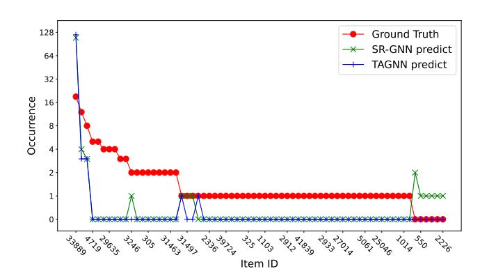
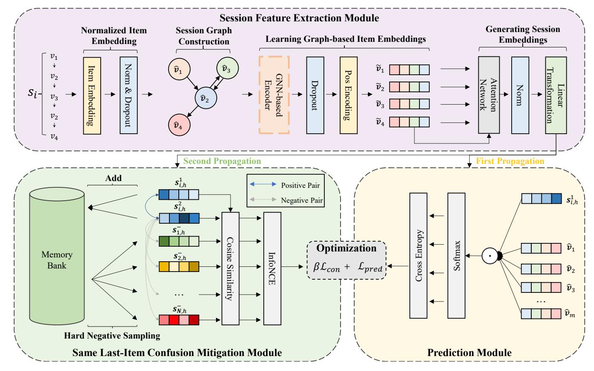
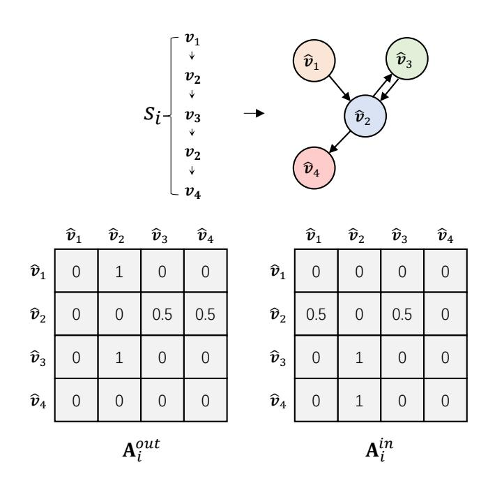
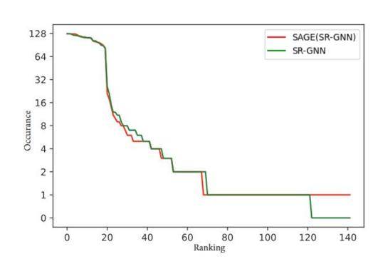

# Same Last-Item Confusion Unveiled: A Unified Mitigation Framework for Graph Learning in Session-Based Recommendation

Jinpeng Chen∗† School of Computer Science (National Pilot Software Engineering School), Beijing University of Posts and Telecommunications Beijing, China jpchen@bupt.edu.cn

Jianxiang He† School of Computer Science (National Pilot Software Engineering School), Beijing University of Posts and Telecommunications Beijing, China hjx812143280@bupt.edu.cn

Yuan Cao National University of Singapore Singapore, Singapore e1124923@u.nus.edu

Huan Li The State Key Laboratory of Blockchain and Data Security, Zhejiang University Hangzhou, China lihuan.cs@zju.edu.cn

Zhenye Yang Beijing University of Posts and Telecommunications Beijing, China yangzhenye@bupt.edu.cn

Kaimin Wei College of Information Science and Technology, Jinan University Guangzhou, China kaiminwei@jnu.edu.cn

Xiongnan Jin Shenzhen University Shenzhen, China xiongnanjin@szu.edu.cn

Senzhang Wang Central South University Changsha, China szwang@csu.edu.cn

Weiping Tu TravelSky Technology Limited Beijing, China wptu@travelsky.com.cn

### Abstract

Session-based recommendation (SBR), which focuses on next-item prediction for anonymous users based on short-term interaction sequences, has garnered increasing attention from researchers. While graph neural networks (GNNs) have become predominant in modeling complex item transition patterns, our empirical study reveals two critical limitations in existing GNN-based SBR methods. On the one hand, they struggle to differentiate between sessions sharing the same last item, resulting in indistinguishable session representations. On the other hand, the inherent popularity bias in session data leads to the over-recommendation of popular items. Inspired by contrastive learning techniques, this paper presents a unified mitigation framework for Same lAst-item confusion in Graph lEarning (SAGE) for SBR. In SAGE, we first obtain normalized session embeddings on constructed session graphs. We then build positive and negative samples of sessions through dual forward propagations and a novel negative sample selection strategy, followed by calculating contrastive loss. Finally, the enhanced session embeddings are utilized for prediction. Extensive experiments on two real-world

datasets demonstrate that integrating SAGE with various stateof-the-art GNN-based SBR methods significantly improves their original performances.

# CCS Concepts

• Information systems → Recommender systems.

# Keywords

Recommender systems, contrastive learning, session-based recommendation

### ACM Reference Format:

Jinpeng Chen, Jianxiang He, Yuan Cao, Huan Li, Zhenye Yang, Kaimin Wei, Xiongnan Jin, Senzhang Wang, and Weiping Tu. 2026. Same Last-Item Confusion Unveiled: A Unified Mitigation Framework for Graph Learning in Session-Based Recommendation. In Proceedings of the ACM Web Conference 2026 (WWW '26), April 13–17, 2026, Dubai, United Arab Emirates. ACM, New York, NY, USA, [10](#page-9-0) pages.<https://doi.org/10.1145/3774904.3792356>

# 1 Introduction

With the progressive development of the Internet and the explosion of online information, recommender systems have become essential to the digital ecosystem. Sequential recommender systems [\[3,](#page-8-0) [8,](#page-8-1) [9,](#page-8-2) [22\]](#page-8-3), in particular, capture user preferences' evolving nature by considering user-level and item-level information. However, in some scenarios, users may remain anonymous [\[16\]](#page-8-4), meaning that only item-level features are available, and user-level information is not accessible. In such cases, session-based recommenders (SBR), focusing solely on the current session rather than

∗Corresponding author.

†Also with Key Laboratory of Trustworthy Distributed Computing and Service (BUPT), Ministry of Education.

[This work is licensed under a Creative Commons Attribution 4.0 International License.](https://creativecommons.org/licenses/by/4.0) WWW '26, Dubai, United Arab Emirates © 2026 Copyright held by the owner/author(s). ACM ISBN 979-8-4007-2307-0/2026/04 <https://doi.org/10.1145/3774904.3792356>

relying on extensive historical user-item interactions, have gained increasing attention in recent years [\[4,](#page-8-5) [5,](#page-8-6) [31,](#page-8-7) [42\]](#page-8-8).

Figure 1: The "Same Last-Item Confusion" Example. We trained SR-GNN and TAGNN SBR models on the Diginetica dataset and selected a set of sessions (127 in total) with the same last-interacted item (item 33889, the most commonly occurring last item) for prediction. The line graph tracks the occurrences of different items in the ground truth and prediction. The results reveal a tendency for these GNN methods to predict the same item (item 33889) for sessions that share the same last item, despite the ground truth showing the underlying prediction diversity in those sessions.

To capture the sequential relationship in user-item interactions, Markov Chain (MC)-based sequential recommenders [\[13,](#page-8-9) [27\]](#page-8-10) were proposed. However, due to their limited representational capacity and strong reliance on the last interacted item in each session, their performance remains constrained. Recurrent neural networks (RNNs) were then introduced into session-based recommendation thanks to their natural ability to model sequential information. With the introduction of GRU4Rec [\[18\]](#page-8-11), RNNs turned out to be the structure of choice for solving the session recommendation problem. For example, NARM [\[19\]](#page-8-12) designs two RNNs to capture users' global and local sequential preferences correspondingly. However, it was not until the existence of SR-GNN [\[37\]](#page-8-13), which utilized a gated graph neural network (GGNN) to extract sequential information on a session graph, that significant improvements were observed. Since then, works following the basic schema of SR-GNN have been proposed. For example, TAGNN [\[41\]](#page-8-14) added a target-attentive mechanism to SR-GNN, achieving promising results. Besides, as SR-GNN focuses on a local session, methods like FGNN [\[25\]](#page-8-15) and GCE-GNN [\[35\]](#page-8-16) incorporate global session information in different ways, further enhancing SBR. Disen-GNN [\[17\]](#page-8-17) disentangles item factors and uses factor-level attention to better capture user intent. DMI-GNN [\[23\]](#page-8-18) applies multi-positional encoding with dynamic regularization.

Although all methods mentioned above have achieved favorable results, they still inherit a major limitation from the MC-based approach: a strong reliance on the last interacted item. Take SR-GNN as an example; when assembling the final session representation, it simply applies a linear transformation over the concatenation of the embedding vector of the last item and the global embedding vector. As a result, these methods may struggle to distinguish between sessions that share the same last interacted item. To illustrate this, we trained SR-GNN and TAGNN on the Diginetica dataset and selected 127 sessions that concluded with the same last-interacted item, item 33889—the most frequently occurring last item in the dataset. As shown in Fig. [1,](#page-1-0) the line graph compares the number of occurrences of various items in the ground truth against the predictions generated by the GNN-based models. The results reveal a tendency for methods employing this technique to predict the same item for sessions that share the same last item, which limits the underlying prediction diversity in those sessions. As mentioned earlier, a large branch of existing graph-based methods ([\[35,](#page-8-16) [41\]](#page-8-14), for example) refers to the same approach as SR-GNN in the final assembly of the session embedding, resulting in this phenomenon being widespread in current advanced graph-based SBR methods. In this paper, we refer to this phenomenon as the "same last-item confusion" problem. Apart from this, Fig. [1](#page-1-0) also supports the hypothesis proposed by [\[12\]](#page-8-19) that SR-GNN predictions are susceptible to popularity bias.

To address the "same last-item confusion" problem and mitigate popularity bias across various GNN-based SBR methods, we propose a unified mitigation framework for same last-item confusion in graph learning for SBR. Inspired by the success of contrastive learning in recommendation systems [\[11,](#page-8-20) [33,](#page-8-21) [36\]](#page-8-22), we aim to mitigate the confusion caused by the last interacted item by increasing the discrepancy between sessions with the same last item, treating those sessions as negative samples. However, defining positive samples is challenging, so we follow the approach proposed by [\[10\]](#page-8-23) by treating the session itself as a positive sample through dropout [\[29\]](#page-8-24) techniques. To this end, we design a contrastive module that increases the discrepancy between sessions with the same last interacted item. Furthermore, to counteract the influence of popular items in the final prediction and better capture the user's underlying interests, we normalize both item and session embeddings.

Our main contributions in this paper are listed as follows.

- We propose SAGE, a unified framework to address the "same last-item confusion" problem in GNN-based SBR methods using contrastive learning with a novel hard negative sampling strategy.
- We mitigate popularity bias by introducing normalized item embeddings and session embeddings.
- We validate SAGE through extensive experiments, showing significant performance improvements and effectiveness in resolving both "same last-item confusion" and popularity bias.

# 2 Related Work

# 2.1 Traditional SBR Methods

A series of approaches [\[15,](#page-8-25) [24,](#page-8-26) [28\]](#page-8-27) based on matrix factorization (MF) are representatives of the traditional methods. MF-based methods consider that the user-item interaction matrix is too sparse and then decompose the matrix into two low-rank dense matrices, which correspond to users and items, respectively. However, MF-based approaches do not capture users' sequential interaction behavior, making them unsuitable for sequential recommendation tasks.

Given that static matrix decomposition methods do not model sequence behavior, FPMC [\[27\]](#page-8-10) models user behavior as a Markov Chain and combines Markov Chains with MF. FOSSIL [\[13\]](#page-8-9) improves on FPMC by introducing factorized sequential prediction with an item similarity model and higher-order Markov Chains, thus both long-term and short-term user behavior are taken into account. However, due to the expressive capability limitation of their shallow networks, they do not perform well in nowadays more complex recommendation scenarios.

### 2.2 Deep Learning-Based SBR Methods

In recent years, as deep-learning methods emerge, deep learningbased recommendation methods [\[6,](#page-8-28) [30\]](#page-8-29) utilizing recurrent neural networks (RNNs) are on the rise. GRU4Rec [\[18\]](#page-8-11) is a typical pioneer in utilizing RNN structures for making sequential recommendations. Subsequently, more attempts have been made to perform sequential recommendations using RNNs. Tan et al. [\[32\]](#page-8-30) improved the performance of RNN recommendation models by proposing several data enhancements and training tricks. Li et al. [\[19\]](#page-8-12) proposed a neural attentive recommendation machine with an encoder-decoder structure based on RNNs to capture the user's sequential preferences. STAMP [\[21\]](#page-8-31), which replaces the RNN structure with simple MLPs and attention mechanisms, proved to be efficient in capturing both users' static and dynamic interests.

Although deep learning-based models have more powerful representation capabilities than traditional methods, these approaches still cannot effectively model complex item relationships, such as non-adjacent item transitions.

### 2.3 Neural Networks on Graphs

Recently, with the rise of graph neural networks [\[1,](#page-8-32) [7,](#page-8-33) [34\]](#page-8-34), many approaches [\[2,](#page-8-35) [14,](#page-8-36) [40\]](#page-8-37) have utilized GNN-based network structures to address SBR problems. SR-GNN [\[37\]](#page-8-13) is one of the earliest and most representative models, which models each session as a session graph and applies a gated-GNN [\[20\]](#page-8-38) to obtain a representative embedding of the session. Following the success of SR-GNN, many variants have been proposed. For example, TAGNN [\[41\]](#page-8-14) introduced a target-aware attention mechanism to SR-GNN, which adaptively activates different user interests concerning varied target items. FGNN [\[25\]](#page-8-15) takes both sequence order and latent order in the session graph into consideration. S2 -DHCN [\[39\]](#page-8-39) leverages hypergraph techniques to represent each session and utilizes contrastive learning techniques to perform self-supervised learning. Additionally, methods like GCE-GNN [\[35\]](#page-8-16) extend beyond local session graphs by constructing global graphs to capture broader dataset-wide information. Disen-GNN [\[17\]](#page-8-17) enhances SBR by disentangling item embeddings into independent factors and leveraging factor-level GNNs and attention to capture user intents. DMI-GNN[\[23\]](#page-8-18) introduces multi-positional encoding and dynamic regularization to mitigate excessive interests in SBR.

However, as discussed in the introduction, all of these methods suffer from the "same last-item confusion" problem and are affected by popularity bias, leading to performance degradation. Despite various enhancements, the fundamental issues of differentiating sessions with the same last item and mitigating the dominance of popular items remain largely unaddressed.

### 3 Methodology

### 3.1 Problem Formulation

A session-based recommender aims to offer recommendations to users based on the inputs of their anonymous historical interaction sequences, e.g., clicks or purchases. Given the item set V = {��1, ��2, ..., ���� }, an anonymous interaction session �� is an item sequence ���� = [�� 1 , ���� , ..., ���� |���� ], ���� ∈ S, where �� is the ��-th interacted item of the ��-th session. Given session ���� , the goal is to predict �� |���� |+1 . The important notations used in this paper are detailed in Appendix [A.](#page-9-1)

### 3.2 Overview

The overall workflow of our proposed SAGE is illustrated in Fig. [2.](#page-3-0) SAGE consists of four main modules: Session Feature Extraction Module, Prediction Module, Same Last-Item Confusion Mitigation Module, and Optimization Module. Initially, the original sessions are transformed into session graphs, from which graph-based item representations are extracted using GNN. Attention networks and normalizations are then employed to generate the final hybrid session representation. The Session Feature Extraction Module undergoes two forward propagations. During propagation, passing through the Dropout layer yields two distinct session representation vectors for the same session. The first representation facilitates a machine factorization (MF)-like item prediction. Meanwhile, negative samples are sampled from a memory bank, and the two generated session representations serve as the query and key for calculating the contrastive loss.

### 3.3 Session Feature Extraction Module

3.3.1 Normalized Item Embedding. Since the one-hot vectors of items are sparse and high-dimensional and do not carry pairwise distance information, we first embed each item ���� ∈ V into a �� dimensional representation ���� ∈ R �� .

As some existing methods directly utilize ���� for downstream tasks, we argue that the direct use of embedded vectors would lead to popularity bias [\[12\]](#page-8-19). To this end, we intuitively add ��2 normalization to the raw feature vector. Apart from this, we also add Dropout directly on an embedding layer for the downstream contrastive module. The normalized vectors ��ˆ�� are given as follows:

��ˆ�� = ��������������(��������(����), ��), (1)

where �� is the dropout probability, ��������(·) is the L2-normalization function.

3.3.2 Session Graph Construction. To explore rich transitions among items and generate accurate latent vectors of items, as shown in Fig[.3,](#page-3-1) we model each session �� as a directed graph G�� = (V�� , E�� ), where each node ����,�� ∈ V�� represents an item and each edge (����,��−1, ����,��) ∈ E�� represents a user interaction where ����,�� is interacted with after ����,��−1. This session graph construction approach is consistent with the method used in SR-GNN and has been widely adopted by the majority of GNN-based session-based recommendation methods. To handle items that occur multiple times within sessions, we assign a normalized weight to each edge. The weight is calculated by dividing the occurrence of the corresponding interaction ((����,��−1, ����,��)) by the out-degree of the starting node (����,��−1). We

This allows us to compute the comparison loss without additional forward propagation, but only with the corresponding vector in the memory bank ��.

# 3.6 Model Optimization

In the previous section, we defined the prediction loss L�������� and the contrastive loss L������, we define our final loss function with the integration of both of them as follows:

L = L�������� + ��L������ + ��||Θ||2 2 , (16)

where Θ is all trainable parameters, �� is the hyper-parameter for balancing the contrastive module, �� is the regularization hyperparameter. The whole training procedure of the proposed SAGE framework is summarized in Algorithm [1.](#page-5-0)

# 4 Experiments

# 4.1 Datasets

Following previous work, we choose two commonly used session recommendation datasets, that is, Yoochoose 1/64 and Diginetica. Yoochoose dataset is from the RecSys Challenge 2015 and consists of six months of interaction sessions from an E-commercial website. We only make use of the most recent fractions 1/64 of the training sequences of Yoochoose denoted. Diginetica dataset comes from CIKM Cup 2016, and only the transaction data is used.

For fairness consideration, we use the same preprocessing techniques as [\[37\]](#page-8-13), which filter out all sessions of length 1 and items that appear less than 5 times in all datasets. Moreover, we do data

augmentation on a session to obtain sequences and corresponding labels. For example, for session �� = [��1, ��2, ..., ����], we split it in to ( [��1], ��2), ( [��1, ��2], ��3), ..., ( [��1, ��2, ..., ����−1], ����). The statistics of datasets are shown in Table [1.](#page-5-2)

Table 1: Statistics of the datasets.

| Dataset             | Yoochoose | 1/64 Diginetica |
|---------------------|-----------|-----------------|
| # Click             | 557,248   | 982,961         |
| # Training sessions | 369,859   | 719,470         |
| # Test sessions     | 55,898    | 60,858          |
| # Items             | 16,766    | 43,097          |
| Average Length      | 6.16      | 5.12            |

### 4.2 Evaluation Metrics

We use the same metrics, Recall@K and Mean Reciprocal Rank (MRR@K), as in [\[37\]](#page-8-13) with K = 20.

## 4.3 Baselines

To evident the effectiveness of our proposed SAGE, we compare it with the following representative baselines.

- POP and SPOP recommend the top-K popular items in the training dataset and the current predicting session, respectively.
- Item-KNN [\[28\]](#page-8-27) leverages item-to-item collaborative filtering techniques, which recommend items similar to the previously interacted items by cosine similarity.
- BPR [\[26\]](#page-8-41) is a classical matrix factorization (MF) method, and is optimized by a pairwise ranking loss function.
- FPMC [\[27\]](#page-8-10) is a sequential prediction method combining the Markov chain and MF.
- GRU4REC [\[18\]](#page-8-11) utilizes the RNN structure to model the sequential interaction of users and leverages multiple tricks to help the RNN converge to the session recommendation problem.
- NARM [\[19\]](#page-8-12) improves GRU4REC by incorporating an attention mechanism into RNN.
- STAMP [\[21\]](#page-8-31) replaces the RNN structures by employing attention mechanism.
- SR-GNN [\[37\]](#page-8-13) first introduces session graph structure into a session-based recommendation. By utilizing a Gated GNN to extract on-graph item embeddings, the last item together with a weighted sum of all the session embeddings are concatenated for prediction.
- FGNN [\[25\]](#page-8-15) formulates the next item recommendation within the session as a graph classification problem.
- TAGNN [\[41\]](#page-8-14) introduces target-aware attention to jointly consider item transitions and user interests for specific target items.
- GCE-GNN [\[35\]](#page-8-16) constructed a global graph using session data and modified the model structure to introduce the global information learned from the global graph.
- Disen-GNN [\[17\]](#page-8-17) proposes a disentangled graph neural network to capture the session purpose.

- S 2 -DHCN [\[39\]](#page-8-39) constructs each session as a hypergraph and utilizes contractive learning methods.
- DMI-GNN [\[23\]](#page-8-18) introduces multi-positional encoding and dynamic regularization to mitigate excessive interests in SBR.

### 4.4 Implementation Details

To align with the previous work, we set the hidden size �� = 100, while model parameters are initialized using a Gaussian distribution with a mean of 0 and a deviation of 0.1. The mini-batch Adam optimizer is utilized to optimize model parameters. The initial learning rate is set to 1e-3 and decays by 0.1 every 3 epochs. Dropout probabilities for all dropout layers are set to 0.1. For the contrastive module, the temperature parameter �� is set to 12, and �� is set to 0.1 for Yoochoose 1/64 and 1 for Diginetica. All the hyperparameters are tuned on the validation set. Experiments ran on an Ubuntu 16.04.7 server with 24-core Intel® Xeon® E5-2680 v3 CPUs, 125GB RAM, and five NVIDIA GPUs (four RTX 2080 Ti + one RTX 4090). We used Python 3.8.19 with PyTorch 1.12.1, CUDA 11.6, and numpy 1.24.4.

# 4.5 Experiment Results

Table 2: Recommendation performance on public datasets (%). The best-performing method in each column is boldfaced, and the second-best method is underlined.

| Method        | Yoochoose Recall@20 | 1/64 MRR@20 | Recall@20 | Diginetica MRR@20 |
|---------------|---------------------|-------------|-----------|-------------------|
| POP           | 6.71                | 1.65        | 0.89      | 0.20              |
| S-POP         | 30.44               | 18.35       | 21.06     | 13.68             |
| Item-KNN      | 51.60               | 21.81       | 35.75     | 11.57             |
| BPR           | 31.31               | 12.08       | 5.24      | 1.98              |
| FPMC          | 45.62               | 15.01       | 26.53     | 6.95              |
| GRU4REC       | 60.64               | 22.89       | 29.45     | 8.33              |
| NARM          | 68.32               | 28.63       | 49.70     | 16.17             |
| STAMP         | 68.74               | 29.67       | 45.64     | 14.32             |
| SR-GNN        | 70.57               | 30.94       | 50.73     | 17.59             |
| FGNN          | 71.75               | 31.71       | 51.36     | 18.47             |
| TAGNN         | 71.02               | 31.12       | 51.31     | 18.03             |
| GCE-GNN       | 70.91               | 30.63       | 54.22     | 19.04             |
| Disen-GNN     | 71.46               | 31.36       | 53.79     | 18.99             |
| -DHCN S       | 70.39               | 29.92       | 53.66     | 18.51             |
| DMI-GNN       | 72.25               | 30.74       | 54.25     | 19.21             |
| SAGE(SR-GNN)  | 71.61               | 31.99       | 54.01     | 19.04             |
| SAGE(TAGNN)   | 71.72               | 30.78       | 53.01     | 18.44             |
| SAGE(GCE-GNN) | 72.29               | 30.88       | 54.26     | 19.04             |

To further demonstrate the overall performance of our proposed SAGE, we compare it with the selected baselines described above. The experimental results are shown in Table [2.](#page-6-0) From Table [2,](#page-6-0) we can see that our SAGE achieves the best performance on both datasets, especially in MRR@20, which illustrates the superior ranking capability compared with other baseline methods.

Among traditional methods, the Item-KNN achieves the best performance, although the overall performance of all traditional methods is relatively poor. To our surprise, the simple yet effective S-POP shows better performance than those of BPR and FPMC. Notably, the S-POP considers only item popularity, which means both the Yoochoose 1/64 dataset and the Diginetica dataset suffer from popularity bias. It's also vital to point out that the Item-KNN utilizes pairwise item similarities only and performs better than FPMC, which is an MC-based approach with the assumption that only the last interacted items are needed to perform sequential recommendation. This phenomenon indicates that the simple MC assumption is not suitable for such complex sessions.

For deep learning-based methods, all DL-based methods consistently outperform traditional methods. GRU4REC and NARM, both based on RNN structures, achieve decent performances. NARM, which adds an attention mechanism to the original RNN, significantly outperforms GRU4REC. STAMP, which replaces RNN with attentional MLPs, shows comparable performance to NARM. Finally, all DL-based methods share better performance over FPMC, which shows the importance of modeling the whole interaction sequence instead of considering merely the last click. However, neither RNNs nor MLPs are suitable for capturing complex transitions among sessions. This may explain why they are worse than graph-based methods.

Graph-based methods significantly outperform other baselines. SR-GNN, which introduces session graph structures, achieves better performance than most other methods. FGNN and TAGNN further enhance performance by rethinking item order and considering target item features, respectively. GCE-GNN leverages global information to improve upon SR-GNN, achieving high performance on both datasets. Disen-GNN and S2 -DHCN also show strong perfor-

mance, highlighting the effectiveness of graph-based approaches. Our SAGE framework, when integrated with these graph-based methods, consistently achieves the best performance. Specifically, SAGE(SR-GNN) outperforms SR-GNN in both Recall@20 and MRR@20 on both datasets, demonstrating the effectiveness of our framework in enhancing the base model. SAGE(TAGNN) also shows significant improvements over TAGNN, achieving better performance in both Recall@20 and MRR@20 on Diginetica. Moreover, SAGE(GCE-GNN) achieves the best performance among all methods on both datasets across both metrics, except MRR@20 on the Yoochoose 1/64 dataset. This further confirms the generalizability and effectiveness of SAGE in enhancing GNN-based SBR methods by mitigating the same last-item confusion problem through contrastive learning.

### 4.6 Ablation Study

To validate module contributions in SAGE, we compare full implementations on SR-GNN and TAGNN backbones against four variants:

- (1) SAGE-Contrast. We removed the contrastive module of SAGE.
- (2) SAGE-HardNeg. We randomly sampled negative sessions instead of choosing sessions with the same last item.
- (3) SAGE-Norm. We removed all normalizations.
- (4) SAGE-PE. We removed positional embeddings.

Results (Table [3\)](#page-7-0) demonstrate critical dependencies: Removing contrastive learning consistently degrades performance across

Table 3: Performance of variants of SAGE(SR-GNN) and SAGE(TAGNN) (%).

| Method       | Yoochoose Recall@20 | 1/64 MRR@20 | Recall@20 | Diginetica MRR@20 |
|--------------|---------------------|-------------|-----------|-------------------|
| SR-GNN       | 70.57               | 30.94       | 50.73     | 17.59             |
| SAGE(SR-GNN) | 71.61               | 31.99       | 54.01     | 19.04             |
| -Contrast    | 71.31               | 31.80       | 53.49     | 19.01             |
| -HardNeg     | 71.65               | 31.16       | 53.99     | 18.92             |
| -Norm        | 71.01               | 31.55       | 51.77     | 17.58             |
| -PE          | 71.39               | 30.92       | 53.80     | 18.94             |
| TAGNN        | 71.02               | 31.12       | 51.31     | 18.03             |
| SAGE(TAGNN)  | 71.72               | 30.78       | 53.01     | 18.44             |
| -Contrast    | 71.54               | 30.69       | 52.53     | 18.43             |
| -HardNeg     | 71.61               | 30.51       | 52.77     | 18.31             |
| -Norm        | 71.08               | 30.64       | 52.22     | 18.21             |
| -PE          | 71.57               | 30.42       | 52.89     | 18.42             |

datasets and base models, confirming its essential role in session representation enhancement; Hard negative sampling proves vital for ranking metrics, particularly in TAGNN, where performance universally declines; Normalization removal severely damages overall performance by impairing popularity bias suppression and contrastive learning; Positional embeddings significantly impact ranking outcomes, with MRR@20 on Yoochoose 1/64 showing marked deterioration upon their removal. Collectively, these findings validate the necessity of all proposed components in SAGE.

# 4.7 Case Study

Figure 4: Predicted results of SAGE(SR-GNN) and SR-GNN on sessions with the same last-item (item 33889).

4.7.1 Effect on Solving Same Last-Item Confusion. Consistent with the Introduction section, we still take sessions with the same last item (item 33889) and utilize the trained SR-GNN and SAGE(SR-GNN) to provide predictions. For each session, 20 items are recommended and counted. The relationship between the number of occurrences of an item in the prediction candidate set and its corresponding occurrence ranking is shown in Fig. [4.](#page-7-1) From the figure, we can see that SAGE(SR-GNN) predicts a lower curve of item occurrences compared to SR-GNN, which shows that SAGE(SR-GNN) can provide different recommendations for sessions with the same last item. At the same time, SAGE(SR-GNN) recommended a total of

142 kinds of items, 20 more than the 122 kinds of items in SR-GNN, which also confirms the effectiveness of our method in solving the same last-item confusion.

4.7.2 Effect on Solving Popularity Bias. To measure the popularity of recommended items, we calculated Average Recommendation Popularity (ARP) on SR-GNN and SAGE(SR-GNN) to compare the difference in popularity of recommended items between the two methods. The ARP can be calculated as follows,

������ = 1 |�� | ∑︁ ��∈�� Í ��∈���� �� (��) �� , (17)

where �� (��) is the number of times that item �� appears in the training dataset, ���� is the recommended item list for session ��, and �� is the set of sessions in the test dataset.

Table 4: SAGE(SR-GNN) versus SR-GNN in terms of Average Recommendation Popularity (ARP). A lower ARP value indicates a lower popularity bias.

From Table [4,](#page-7-2) it is easy to see that SAGE(SR-GNN) has a huge difference in the popularity of recommended items on both datasets compared to SR-GNN. It proves that our SAGE framework can indeed somewhat solve the popularity bias problem.

### 5 Conclusion

In this paper, we proposed the unified mitigation framework SAGE to address two key limitations of GNN-based session-based recommendation (SBR) models. Specifically, SAGE uses a contrastive module to resolve "same last-item confusion" (indistinguishable representations for sessions with the same last item) and adopts normalized item/session embeddings to alleviate popularity bias (overrecommending popular items). Experiments on two real-world datasets demonstrated SAGE effectively boosts GNN-based SBR performance and is compatible with mainstream architectures. Future work will explore techniques to further reduce the last item's influence on session representations and enhance SBR system's robustness.

## 6 Acknowledgements

This work was supported in part by the National Natural Science Foundation of China (62572075, 62572217, 62306287), in part by the Beijing Natural Science Foundation (L233034, L253004), in part by Fundamental Research Funds for the Beijing University of Posts and Telecommunications (No.2025TSQY01), in part by Science and Technology Program of Guangzhou (2024A04J6317), in part by State Key Laboratory of Radio Frequency Heterogeneous Integration (No.2025006), in part by Scientific Foundation for Youth Scholars of Shenzhen University (No.868-000001032902) and part by Natural Science Foundation of Guangdong Province (2025A1515010739).

References [1] Shiyu Chang, Wei Han, Jiliang Tang, Guo-Jun Qi, Charu C Aggarwal, and Thomas S Huang. 2015. Heterogeneous network embedding via deep architectures. In Proceedings of the 21th ACM SIGKDD international conference on knowledge discovery and data mining. 119–128. [2] Jinpeng Chen, Yuan Cao, Fan Zhang, Pengfei Sun, and Kaimin Wei. 2022. Sequential intention-aware recommender based on user interaction graph. In Proceedings of the 2022 International Conference on Multimedia Retrieval. 118–126. [3] Ming Chen, Weike Pan, and Zhong Ming. 2024. Explicit and Implicit Modeling via Dual-Path Transformer for Behavior Set-informed Sequential Recommendation. In Proceedings of the 30th ACM SIGKDD Conference on Knowledge Discovery and Data Mining. 329–340. [4] Tianwen Chen and Raymond Chi-Wing Wong. 2020. Handling information loss of graph neural networks for session-based recommendation. In Proceedings of the 26th ACM SIGKDD international conference on knowledge discovery & data mining. 1172–1180. [5] Minjin Choi, Hye-young Kim, Hyunsouk Cho, and Jongwuk Lee. 2024. Multiintent-aware Session-based Recommendation. In Proceedings of the 47th International ACM SIGIR Conference on Research and Development in Information Retrieval. 2532–2536. [6] Gabriel de Souza Pereira Moreira, Sara Rabhi, Jeong Min Lee, Ronay Ak, and Even Oldridge. 2021. Transformers4rec: Bridging the gap between nlp and sequential/session-based recommendation. In Proceedings of the 15th ACM conference on recommender systems. 143–153. [7] Yuxiao Dong, Ziniu Hu, Kuansan Wang, Yizhou Sun, and Jie Tang. 2020. Heterogeneous Network Representation Learning. In Proceedings of the Twenty-Ninth International Joint Conference on Artificial Intelligence, IJCAI 2020, Christian Bessiere (Ed.). 4861–4867. [8] Yingpeng Du, Ziyan Wang, Zhu Sun, Yining Ma, Hongzhi Liu, and Jie Zhang. 2024. Disentangled Multi-interest Representation Learning for Sequential Recommendation. In Proceedings of the 30th ACM SIGKDD Conference on Knowledge Discovery and Data Mining. 677–688. [9] Kairui Fu, Shengyu Zhang, Zheqi Lv, Jingyuan Chen, and Jiwei Li. 2024. DIET: Customized slimming for incompatible networks in sequential recommendation. In Proceedings of the 30th ACM SIGKDD Conference on Knowledge Discovery and Data Mining. 816–826. [10] Tianyu Gao, Xingcheng Yao, and Danqi Chen. 2021. Simcse: Simple contrastive learning of sentence embeddings. arXiv preprint arXiv:2104.08821 (2021). [11] Linxin Guo, Yaochen Zhu, Min Gao, Yinghui Tao, Junliang Yu, and Chen Chen. 2024. Consistency and Discrepancy-Based Contrastive Tripartite Graph Learning for Recommendations. In Proceedings of the 30th ACM SIGKDD Conference on Knowledge Discovery and Data Mining. 944–955. [12] Priyanka Gupta, Diksha Garg, Pankaj Malhotra, Lovekesh Vig, and Gautam M Shroff. 2019. NISER: normalized item and session representations with graph neural networks. arXiv preprint arXiv:1909.04276 43 (2019). [13] Ruining He and Julian McAuley. 2016. Fusing similarity models with markov chains for sparse sequential recommendation. In 2016 IEEE 16th international conference on data mining (ICDM). IEEE, 191–200. [14] Xiangnan He, Kuan Deng, Xiang Wang, Yan Li, Yongdong Zhang, and Meng Wang. 2020. Lightgcn: Simplifying and powering graph convolution network for recommendation. In Proceedings of the 43rd International ACM SIGIR conference on research and development in Information Retrieval. 639–648. [15] Yehuda Koren, Robert Bell, and Chris Volinsky. 2009. Matrix factorization techniques for recommender systems. Computer 42, 8 (2009), 30–37. [16] Sara Latifi, Noemi Mauro, and Dietmar Jannach. 2021. Session-aware recommendation: A surprising quest for the state-of-the-art. Information Sciences 573 (2021), 291–315. [17] Ansong Li, Zhiyong Cheng, Fan Liu, Zan Gao, Weili Guan, and Yuxin Peng. 2023. Disentangled Graph Neural Networks for Session-Based Recommendation. IEEE Trans. Knowl. Data Eng. 35, 8 (2023), 7870–7882. [doi:10.1109/TKDE.2022.3208782](https://doi.org/10.1109/TKDE.2022.3208782) [18] Jing Li, Pengjie Ren, Zhumin Chen, Zhaochun Ren, Tao Lian, and Jun Ma. 2017. Neural attentive session-based recommendation. In Proceedings of the 2017 ACM on Conference on Information and Knowledge Management. 1419–1428. [19] Jing Li, Pengjie Ren, Zhumin Chen, Zhaochun Ren, Tao Lian, and Jun Ma. 2017. Neural attentive session-based recommendation. In Proceedings of the 2017 ACM on Conference on Information and Knowledge Management. 1419–1428. [20] Yujia Li, Daniel Tarlow, Marc Brockschmidt, and Richard Zemel. 2015. Gated graph sequence neural networks. arXiv preprint arXiv:1511.05493 (2015). [21] Qiao Liu, Yifu Zeng, Refuoe Mokhosi, and Haibin Zhang. 2018. STAMP: shortterm attention/memory priority model for session-based recommendation. In Proceedings of the 24th ACM SIGKDD international conference on knowledge discovery & data mining. 1831–1839. [22] Yuli Liu, Christian Walder, Lexing Xie, and Yiqun Liu. 2024. Probabilistic Attention for Sequential Recommendation. In Proceedings of the 30th ACM SIGKDD Conference on Knowledge Discovery and Data Mining. 1956–1967. [23] Mingyang Lv, Xiangfeng Liu, and Yuanbo Xu. 2025. Dynamic Multi-Interest Graph Neural Network for Session-Based Recommendation. In Proceedings of the AAAI Conference on Artificial Intelligence, Vol. 39. 12328–12336. [24] Andriy Mnih and Russ R Salakhutdinov. 2007. Probabilistic matrix factorization. Advances in neural information processing systems (2007), 1257–1264. [25] Ruihong Qiu, Jingjing Li, Zi Huang, and Hongzhi Yin. 2019. Rethinking the item order in session-based recommendation with graph neural networks. In Proceedings of the 28th ACM international conference on information and knowledge management. 579–588. [26] Steffen Rendle, Christoph Freudenthaler, Zeno Gantner, and Lars Schmidt-Thieme. 2012. BPR: Bayesian personalized ranking from implicit feedback. arXiv preprint arXiv:1205.2618 (2012). [27] Steffen Rendle, Christoph Freudenthaler, and Lars Schmidt-Thieme. 2010. Factorizing personalized markov chains for next-basket recommendation. In Proceedings of the 19th international conference on World wide web. 811–820. [28] Badrul Sarwar, George Karypis, Joseph Konstan, and John Riedl. 2001. Item-based collaborative filtering recommendation algorithms. In Proceedings of the 10th international conference on World Wide Web. 285–295. [29] Nitish Srivastava, Geoffrey Hinton, Alex Krizhevsky, Ilya Sutskever, and Ruslan Salakhutdinov. 2014. Dropout: a simple way to prevent neural networks from overfitting. The journal of machine learning research 15, 1 (2014), 1929–1958. [30] Fei Sun, Jun Liu, Jian Wu, Changhua Pei, Xiao Lin, Wenwu Ou, and Peng Jiang. 2019. BERT4Rec: Sequential recommendation with bidirectional encoder representations from transformer. In Proceedings of the 28th ACM international conference on information and knowledge management. 1441–1450. [31] Zhu Sun, Hongyang Liu, Xinghua Qu, Kaidong Feng, Yan Wang, and Yew Soon Ong. 2024. Large language models for intent-driven session recommendations. In Proceedings of the 47th International ACM SIGIR Conference on Research and Development in Information Retrieval. 324–334. [32] Yong Kiam Tan, Xinxing Xu, and Yong Liu. 2016. Improved recurrent neural networks for session-based recommendations. In Proceedings of the 1st workshop on deep learning for recommender systems. 17–22. [33] Jiakai Tang, Sunhao Dai, Zexu Sun, Xu Chen, Jun Xu, Wenhui Yu, Lantao Hu, Peng Jiang, and Han Li. 2024. Towards Robust Recommendation via Decision Boundary-aware Graph Contrastive Learning. In Proceedings of the 30th ACM SIGKDD Conference on Knowledge Discovery and Data Mining. 2854–2865. [34] Petar Velickovic, Guillem Cucurull, Arantxa Casanova, Adriana Romero, Pietro Lio, Yoshua Bengio, et al. 2017. Graph attention networks. stat 1050, 20 (2017), 10–48550. [35] Ziyang Wang, Wei Wei, Gao Cong, Xiao-Li Li, Xian-Ling Mao, and Minghui Qiu. 2020. Global context enhanced graph neural networks for session-based recommendation. In Proceedings of the 43rd international ACM SIGIR conference on research and development in information retrieval. 169–178. [36] Zongwei Wang, Junliang Yu, Min Gao, Hongzhi Yin, Bin Cui, and Shazia Sadiq. 2024. Unveiling Vulnerabilities of Contrastive Recommender Systems to Poisoning Attacks. In Proceedings of the 30th ACM SIGKDD Conference on Knowledge Discovery and Data Mining. 3311–3322. [37] Shu Wu, Yuyuan Tang, Yanqiao Zhu, Liang Wang, Xing Xie, and Tieniu Tan. 2019. Session-based recommendation with graph neural networks. In Proceedings of the AAAI conference on artificial intelligence, Vol. 33. 346–353. [38] Zhirong Wu, Yuanjun Xiong, Stella X Yu, and Dahua Lin. 2018. Unsupervised feature learning via non-parametric instance discrimination. In Proceedings of the IEEE conference on computer vision and pattern recognition. 3733–3742. [39] Xin Xia, Hongzhi Yin, Junliang Yu, Qinyong Wang, Lizhen Cui, and Xiangliang Zhang. 2021. Self-supervised hypergraph convolutional networks for sessionbased recommendation. In Proceedings of the AAAI conference on artificial intelligence, Vol. 35. 4503–4511. [40] Chengfeng Xu, Pengpeng Zhao, Yanchi Liu, Victor S Sheng, Jiajie Xu, Fuzhen Zhuang, Junhua Fang, and Xiaofang Zhou. 2019. Graph contextualized selfattention network for session-based recommendation.. In IJCAI, Vol. 19. 3940– 3946. [41] Feng Yu, Yanqiao Zhu, Qiang Liu, Shu Wu, Liang Wang, and Tieniu Tan. 2020. TAGNN: Target attentive graph neural networks for session-based recommendation. In Proceedings of the 43rd international ACM SIGIR conference on research and development in information retrieval. 1921–1924. [42] Xiaokun Zhang, Bo Xu, Zhaochun Ren, Xiaochen Wang, Hongfei Lin, and Fenglong Ma. 2024. Disentangling id and modality effects for session-based recommendation. In Proceedings of the 47th International ACM SIGIR Conference on Research and Development in Information Retrieval. 1883–1892.

