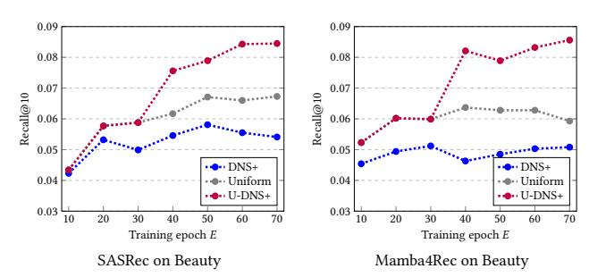
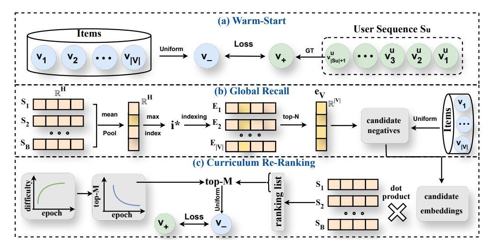
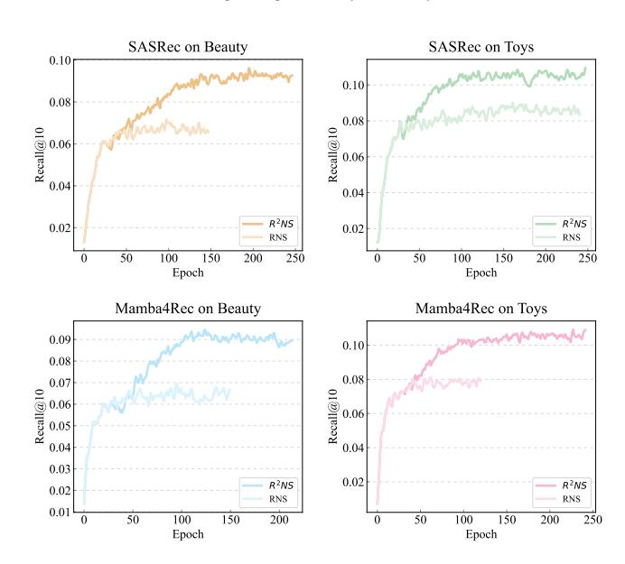
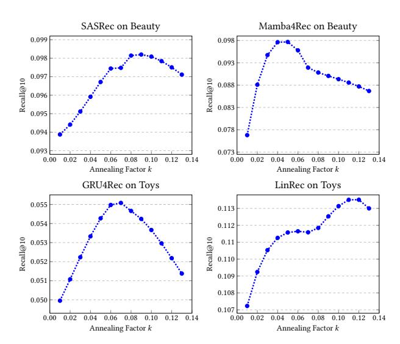

#### R 2NS: Recall and Re-ranking of Negative Samples for Sequential Recommendation

Yuanzi Li Shandong University Qingdao, China liyuanzi0313@outlook.com

Xuri Ge Shandong University Jinan, China xuri.ge@sdu.edu.cn

Jingyu Zhao Shandong University Qingdao, China jingyu.zhao@mail.sdu.edu.cn

Yidan Wang Shandong University Qingdao, China wangyidan1413@163.com

Jiyuan Yang Shandong University Qingdao, China jiyuan.yang@mail.sdu.edu.cn

Zhumin Chen Shandong University Qingdao, China chenzhumin@sdu.edu.cn

Zhaochun Ren∗ Leiden University Leiden, The Netherlands z.ren@liacs.leidenuniv.nl

Xin Xin∗ Shandong University Qingdao, China xinxin@sdu.edu.cn

# Abstract

Negative sampling plays a critical role in sequential recommendation, providing contrastive signals that enable the model to distinguish between preferred and non-preferred items. Existing methods commonly sample items with top prediction scores from a randomly selected candidate set as hard negatives. However, such methods suffer from: (1) early-stage training failure since introducing hard negatives too early; (2) the lack of a global item view due to scoring only a small candidate subset; and (3) the failure of fine-grained control of learning difficulty due to the fixed top-ranking strategy.

To address the above challenges, we propose recall and re-ranking of negative samples for sequential recommendation, i.e., R 2NS. The proposed method comprises three phases, including warm-start, global recall, and curriculum re-ranking. Firstly, in the warm-start phase, the recommender is trained with naive uniform negative sampling to establish fundamental capability and avoid introducing hard negatives too early. Then, in the global recall phase, candidate negatives are selected from the whole item space through an efficient max-index approximation method to introduce contrastive signals from a global perspective. Finally, in the curriculum re-ranking phase, a curriculum top-ranking strategy is introduced to dynamically adjust the difficulty of negative samples. Extensive experiments on four real-world datasets, five sequential recommendation backbone models, and two commonly adopted loss functions demonstrate that R 2NS significantly outperforms state-of-the-art negative sampling approaches, validating both the effectiveness and generalization capability of R 2NS. Our code is available at [https://github.com/Lyz103/R2NS.](https://github.com/Lyz103/R2NS)

# CCS Concepts

#### •Information systems→Information retrieval; Recommender systems.

∗Corresponding author

[This work is licensed under a Creative Commons Attribution 4.0 International License.](https://creativecommons.org/licenses/by/4.0) WWW '26, Dubai, United Arab Emirates

© 2026 Copyright held by the owner/author(s). ACM ISBN 979-8-4007-2307-0/2026/04 <https://doi.org/10.1145/3774904.3792360>

# Keywords

Sequential Recommendation, Negative Sampling, Curriculum Learning, Recommender System

#### ACM Reference Format:

Yuanzi Li, Xuri Ge, Jingyu Zhao, Yidan Wang, Jiyuan Yang, Zhumin Chen, Zhaochun Ren, and Xin Xin. 2026. R 2NS: Recall and Re-ranking of Negative Samples for Sequential Recommendation. In Proceedings of the ACM Web Conference 2026 (WWW '26), April 13–17, 2026, Dubai, United Arab Emirates. ACM, New York, NY, USA, [11](#page-10-0) pages[. https://doi.org/10.1145/3774904.3792360](https://doi.org/10.1145/3774904.3792360)

## 1 Introduction

Sequential Recommendation. Recommender systems play a pivotal role in information retrieval and are widely adopted across domains including e-commerce [\[13\]](#page-8-0), social media [\[39\]](#page-8-1), and various online platforms [\[23\]](#page-8-2). Within the broad spectrum of recommendation tasks, sequential recommendation (SR) has emerged as a critical focus, attracting substantial attention from both academia and industry. Its core objective is to leverage past user interactions to predict potential future interests. SR typically learns user preferences from implicit feedback, such as clicks and purchases, thus requiring high-quality positive and negative samples for training.

Negative Sampling for SR. Since implicit feedback usually contains only positive samples, negative sampling is introduced to provide contrastive signals to depict user interests more accurately. Straightforward approaches include uniform sampling from uninteracted items [\[26\]](#page-8-3), sampling from exposed but uninteracted items [\[5\]](#page-8-4), or performing probability sampling based on item popularity [\[3,](#page-8-5) [40\]](#page-8-6). However, such samples carry limited information and yield weak gradient signals, making it difficult for the model to achieve effective updates, resulting in limited improvement.

Sampling Hard Negatives. To generate effective parameter updates, the strategic use of hard negative samples, i.e., instances that are difficult for the model to distinguish from positive ones, compels the model to learn more discriminative user preference representation. For example, for the positive item mouse, a negative item like mouse pad is more informative than yogurt since it is a more relevant and difficult distinction for the model to draw.

Hard negatives are usually sampled by selecting items with the highest predicted scores [\[14,](#page-8-7) [41\]](#page-8-8). However, scoring and ranking of the full item set are often computationally prohibitive due to the large number of items. Therefore, a common workaround is to first

Table 1: Characteristics comparison between R 2NS and existing methods. The abbreviations stand for: FNM (False Negative Mitigation), WAS (Warm-Start), GLP (Global Perspective), DDA (Dynamic Difficulty Adjustment), and SEF (Sampling Efficiency). The PRF column shows that the more ❍ marks a method has, the better its performance.

| Method |      | FNM WAS | GLP DDA | SEF PRF |
|--------|------|---------|---------|---------|
| DNS    | [41] | ✗ ✗     | ✓ ✗     | ✗ ❍     |
| MixGCF | [15] | ✗ ✗     | ✓ ✗     | ✗ ❍     |
| AdaSIR | [1]  | ✗ ✗     | ✗ ✗     | ✓ ❍     |
| GNNO   | [7]  | ✓ ✗     | ✓ ✓     | ✗ ❍❍    |
| DNS+   | [29] | ✓ ✗     | ✗ ✗     | ✓ ❍❍    |
| SRNS   | [6]  | ✓ ✗     | ✗ ✗     | ✓ ❍❍    |
| 2 NS   |      | ✓ ✓     | ✓ ✓     | ✓ ❍❍❍   |

Figure 1: Performance of DNS+ [\[29\]](#page-8-12), uniform sampling, and U-DNS+. DNS+ uniformly samples one negative example from the top-5 ranked items among 100 randomly selected candidate negatives. U-DNS+ first performs uniform sampling for 30 epochs and then applies DNS+.

randomly sample a candidate subset of �� items, and then perform scoring and selection within this much smaller candidate set [\[1,](#page-8-10) [29\]](#page-8-12). Besides, such deterministic approach also suffers from the false negative problem, where the top-ranked uninteracted item could be potential positive. To mitigate this issue, one common approach is to introduce stochasticity by uniformly sampling from the top-�� ranked items among the �� candidate negatives [\[29\]](#page-8-12). Besides, Ding et al. [\[6\]](#page-8-13) proposed to utilize model uncertainty to identify and downweight false negatives. Both techniques aim to reduce the risk of erroneously selecting false negatives while ensuring the chosen samples remain challenging for effective training.

Remaining Limitations. Although these methods have achieved certain progress, there still exists the following limitations:

(1) Early-stage training failure. Previous studies [\[29\]](#page-8-12) have shown that, within a certain range, the harder the negative samples, the better the model performance. However, as shown in Figure [1,](#page-1-0) when the difficulty is too high, performance of selecting hard negatives (e.g., DNS+ [\[29\]](#page-8-12)) can even be worse than uniform sampling. While when we first train with uniform sampling for 30 epochs and then switch to DNS+, the performance improves significantly. This is because, during the early training stage, the model lacks sufficient discriminative capability, and overly hard negative samples fail to provide informative gradients—hindering effective learning and potentially triggering a "butterfly effect" that leads to training failure.

(2) Global information loss. Candidate subset-based strategies restrict negative sample selection to a randomly drawn subset of �� items. While this reduces computational cost, it deprives the model of a global view over the entire item space, leading to insufficient information coverage. As a result, item rankings are susceptible to sampling bias, causing significant fluctuations in sample difficulty, which in turn hinders the enhancement of model capability.

(3) Fixed top-ranking rigidity. Methods such as [\[29\]](#page-8-12) fix the candidate subset size �� and the selection range �� before training. This causes the failure of fine-grained control of learning difficulty throughout the training process, preventing a gradual transition from easy-to-distinguish samples in the early stage to more confusing hard samples in later stages, thus limiting potential further performance gains of the model.

Our Proposed Methods. In this work, we propose recall and reranking of negative samples for sequential recommendation, i.e., R 2NS. Specifically, R 2NS addresses the aforementioned limitations through three tailored-designed phases:

(1) Warm-start. To overcome early-stage training failure and avoid negative samples being too difficult for the model to provide effective gradients, R 2NS adopts a uniform sampling strategy in the early stages as a warm-start phase. This allows the model to initially acquire fundamental discriminative capabilities, thereby laying a more stable basement for subsequent sampling and training.

(2) Global recall. To address global information loss, R 2NS conducts the recall of negative candidates from the entire item space through an efficient max-index approximation method. This approach not only enhances sampling efficiency, but also ensures better global coverage during the sampling process.

(3) Curriculum re-ranking. To avoid fixed top-ranking rigidity and enable dynamic difficulty adjustment during training, R 2NS performs fine-grained re-ranking on the recalled candidate negatives and gradually reduces the selection range of top-�� to sample higher-ranked items. This allows the model to first learn from distinguishable easy samples and progressively adapt to more challenging ones, improving learning effectiveness.

Table [1](#page-1-1) shows the characteristics comparison between R 2NS and state-of-the-art methods.

Contributions. Our contributions are as follows:

- We proposed R 2NS, a novel effective and efficient negative sampling framework for SR, which contains warm-start, global recall and curriculum re-ranking.
- We effectively addressed the issue of excessive difficulty in the early training stages through introducing the warm-start phase.

Figure 2: An Overview of R 2NS. (a) Warm-Start: R 2NS first trains the recommender with uniform negative sampling for certain epochs. (b) Global Recall: For a batch of user sequences, R 2NS obtains the batch representation. Then, a candidate negative set is recalled from the entire item space efficiently through max-index approximation for this batch. (c) Curriculum Re-ranking: The candidate negatives are re-ranked using dot product to obtain a more precise ranking. A negative example is then selected from the top-�� re-ranked negatives, where �� is dynamically adjusted by a curriculum strategy to control learning difficulty.

- We successfully obtained a global view of negative samples while maintaining recall efficiency through an efficient maxindex approximation method in the global recall phase.
- We employed fine-grained curriculum re-ranking to dynamically adjust the difficulty of hard negative samples.
- Extensive experiments on different datasets, models, and loss functions demonstrated the effectiveness and generalization capability of our approach.

#### 2 Problem Formulation

In this section, we formally define the problem of sequential recommendation. Let U and V denote the sets of users and items, respectively. For each user �� ∈ U, their interaction history is represented as a chronological sequence ���� = [��1, ��2, . . . , ��|���� |], where ���� ∈ V is the item that user �� interacted with at timestep ��, and |���� | is the length of the sequence.

The objective of sequential recommendation is to predict the item that user �� is most likely to interact with at the next timestep |���� | + 1. Formally, this task is framed as finding the item �� ∗ that maximizes the conditional probability:

arg max ∗ ∈V �� ��|���� |+1 = �� ∗ | ���� (1)

To achieve this, models are typically trained using a pairwise ranking loss L������ or a binary cross-entropy loss L������ . The objective of L������ is to learn a scoring function that assigns a higher score to the ground-truth next item (the positive sample, �� + ) than to items the user has not interacted with (negative samples, �� − ), while L������ formalizes the recommendation task as a binary classification problem with interacted items �� + as positive instances and sampled uninteracted �� − as negative instances. The quality of these negative samples is crucial for effective training. In this paper, we propose R 2NS, a novel method that focuses on selecting more informative negative samples (�� − ) to enhance the performance of sequential recommendation.

#### 3 Methodology

In this section, we present details of R 2NS, an effective and efficient negative sampling method for sequential recommendation, consisting of warm-start, global recall, and curriculum re-ranking.

As illustrated in Figure [2,](#page-2-0) R 2NS first employs a warm-start phase (Section [3.1\)](#page-2-1) to establish fundamental capabilities and avoid earlystage training failure. Then, in the global recall phase, a max-index approximation method is introduced to efficiently select candidate negatives from the entire item space, mitigating the loss of global information. Furthermore, a curriculum re-ranking strategy (Section [3.3\)](#page-3-0) is proposed to dynamically identify top-�� hard negatives from the candidate set and enable fine-grained control of learning difficulty. Finally, the negative example is uniformly sampled from the re-ranked top-�� items. Time complexity of the proposed R 2NS is analyzed in Appendix [A.](#page-9-0)

## 3.1 Warm-Start

To mitigate early-stage training failure and avoid introducing hard negatives too early, we first employ uniform negative sampling for warm-start of the model:

− �� ∼ Uniform V \ {�� + } ∪ ���� (2)

where �� − �� denotes a negative sample drawn uniformly from the item set excluding user ��'s interacted items �� + and visited sequence ����. The recommender is optimized using the following loss function:

loss = − ∑︁ ��∈U ∑︁ L �� (�� ��+ |�� <�� ), �� (�� ��− |�� <�� ) (3)

Table 2: Dataset statistics.

|          | Dataset | Yelp    | Sports  | Beauty  | Toys    |
|----------|---------|---------|---------|---------|---------|
| #        | Users   | 30,431  | 35,598  | 22,363  | 19,412  |
| #        | Items   | 20,033  | 18,357  | 12,101  | 11,924  |
| #        | Inter   | 316,354 | 296,337 | 198,502 | 167,597 |
| #        | AvgLen  | 10.4    | 8.3     | 8.8     | 8.6     |
| Sparsity |         | 99.95%  | 99.95%  | 99.93%  | 99.93%  |

item in ���� (Section [3.3.1\)](#page-4-3) and gets the curriculum-based top-�� selection range (Section [3.3.2\)](#page-4-4). These two signals are then combined to select the final negative sample used for training (Section [3.3.3\)](#page-4-5).

3.3.1 Relevance Score Calculation. For a user sequence ����, the relevance scores for all items in the negative candidate set ���� are calculated by taking the dot product between the sequence representation and the item embeddings:

r�� = ⟨s��, E ⊤ ⟩ ∈ R |���� | (11)

where E�� ∈ R |���� |×�� denotes the embedding matrix of items in ���� . The larger the value of r�� , the more similar the item is to the positive example, indicating a higher difficulty measure.

3.3.2 Curriculum-Based Selection Range. To dynamically control the sampling difficulty in the training process, R 2NS designs an adaptive scheduling mechanism to control the selection range of negative samples. R2NS first defines an annealing function:

�� (��) = �� · �� −��·�� , �� = 0, 1, . . . ,�� (12)

where �� is a decay constant that controls the rate of reduction, �� is the total number of training epochs, and �� is a scaling factor that normalizes the cumulative sum to 0.99:

�� = 0.99 Í�� ��=0 �� −��·�� (13)

Then R2NS defines the cumulative function:

��(��) = ∑︁�� ��=0 �� (��) (14)

The selection range of negative samples, denoted as ��, at training epoch ��, is determined by:

�� = max (��������, |���� | · (1 − ��(�� − ��0))) (15)

where �������� is the minimum allowable selection range, and ��0 denotes the number of epochs used in the warm-start phase.

3.3.3 Final Negative Sample Selection. R 2NS first selects the top-�� items from ���� based on their relevance scores:

��top−�� = Top-M (r�� ) (16)

Then, to avoid the false negative problem and introduce stochasticity, R 2NS uniformly samples one item from this top-ranked set as the final negative sample for training:

− �� ∼ Uniform ��top-�� (17)

In this manner, the negative sample is selected from a global perspective and ensures increasing difficulty as training progresses. The full algorithm pipeline of R2NS is detailed in Algorithm [1.](#page-3-7)

#### 4 Experiments

In this work, we aim to answer the following research questions:

(RQ1) How does R 2NS perform compared to existing negative sampling methods in sequential recommendation? (RQ2) How well does R 2NS generalize across different recommendation models and loss functions?

(RQ3) How do components of R2NS affect the performance?

#### 4.1 Experiments Setup

4.1.1 Datasets. Experiments are conducted on four real-world datasets: Sports, Beauty, and Toys are derived from Amazon product reviews [\[21\]](#page-8-14), corresponding to the "Sports and Outdoors", "Beauty" and "Toys and Games" categories, respectively. Yelp are the second version of the Yelp dataset, released in 2020, with records selected from January 1, 2019. For consistency with prior work [\[16,](#page-8-15) [43\]](#page-8-16), we process the Amazon datasets by retaining only the 5-core filtered version where each item/user appears in at least five interactions. The Yelp undergoes identical preprocessing. Table [2](#page-4-6) summarizes the key statistics of our processed datasets.

4.1.2 Evaluation Proposal. Following previous studies [\[16,](#page-8-15) [43\]](#page-8-16), we use widely-used Recall@�� and NDCG@�� as metrics to evaluate performance, reporting results under different values of �� ∈ 5, 10, 20. We employ the ratio-based splitting strategy, dividing the dataset into 70% for training, 20% for validation, and the remaining 10% for testing.

4.1.3 Backbone Models. Our proposed method is model-agnostic, making it compatible with a wide range of sequential recommendation architectures. To assess its generalization capability and effectiveness, we conduct experiments based on several representative backbone models drawn from diverse architectural paradigms:

- MLP-based model: FMLP4Rec [\[44\]](#page-8-17) is an MLP-based model that uses learnable filters to capture sequential dependencies.
- RNN-based model: GRU4Rec [\[34\]](#page-8-18) utilizes gated recurrent units to capture sequential user behavior patterns effectively.
- Transformer-based models: SASRec [\[16\]](#page-8-15) utilizes multi-head self-attention to capture user interaction dependencies.
- Linear Transformer-based model: LinRec [\[20\]](#page-8-19) adopts a linearized attention mechanism for efficient sequence modeling.
- Selective state space model: Mamba4Rec [\[19\]](#page-8-20) models sequences efficiently using a selective state space model.

4.1.4 Baselines. We compare R 2NS with various state-of-the-art hard negative-focused methods and false negative mitigated methods on sequential recommendation models:

- RNS [\[26\]](#page-8-3) employs a uniform distribution to select negatives.
- Hard negative-focused methods:
  - (1) DNS [\[41\]](#page-8-8) is a representative dynamic hard negative sampling method, selecting negatives with highest item score.
  - (2) MixGCF [\[15\]](#page-8-9) generates hard negatives by injecting positive signals from the interaction graph into negative samples through positive mixing and hop mixing.
  - (3) AdaSIR [\[1\]](#page-8-10) is a two-stage method that maintains a fixed size contextualized sample pool with importance resampling.
- False negative-mitigated methods:

Table 3: Performance comparison across four datasets. The best and the second-best scores are marked in bold and underlined fonts. RC and NG denote Recall and NDCG. \* denotes p-value < 0.05 for paired t-tests.

| Method  | RC@5     | RC@10    | RC@20    | Beauty NG@5 | NG@10    | NG@20    | RC@5     | RC@10    | Toys RC@20 | NG@5    | NG@10   | NG@20    |
|---------|----------|----------|----------|-------------|----------|----------|----------|----------|------------|---------|---------|----------|
| RNS     | 0.0434   | 0.0612   | 0.0966   | 0.0289      | 0.0347   | 0.0435   | 0.0592   | 0.0865   | 0.1231     | 0.0406  | 0.0496  | 0.0587   |
| DNS     | 0.0398   | 0.0545   | 0.0715   | 0.0288      | 0.0335   | 0.0378   | 0.0216   | 0.0288   | 0.0366     | 0.0170  | 0.0193  | 0.0213   |
| MixGCF  | 0.0349   | 0.0550   | 0.0805   | 0.0232      | 0.0297   | 0.0361   | 0.0144   | 0.0175   | 0.0237     | 0.0106  | 0.0117  | 0.0132   |
| AdaSIR  | 0.0590   | 0.0840   | 0.1127   | 0.0417      | 0.0497   | 0.0568   | 0.0685   | 0.0947   | 0.1241     | 0.0487  | 0.0573  | 0.0647   |
| GNNO    | 0.0577   | 0.0854   | 0.1144   | 0.0388      | 0.0476   | 0.0550   | 0.0705   | 0.0989   | 0.1292     | 0.0475  | 0.0566  | 0.0641   |
| DNS+    | 0.0550   | 0.0769   | 0.1140   | 0.0355      | 0.0425   | 0.0519   | 0.0721   | 0.0963   | 0.1344     | 0.0503  | 0.0581  | 0.0676   |
| MixGCF+ | 0.0532   | 0.0720   | 0.1068   | 0.0359      | 0.0418   | 0.0506   | 0.0685   | 0.0968   | 0.1282     | 0.0463  | 0.0554  | 0.0635   |
| SRNS    | 0.0487   | 0.0742   | 0.1180   | 0.0334      | 0.0416   | 0.0527   | 0.0772   | 0.0978   | 0.1308     | 0.0521  | 0.0586  | 0.0668   |
| 2 NS R  | 0.0715   | 0.0983   | 0.1381   | 0.0505      | 0.0593   | 0.0692   | 0.0839   | 0.1081   | 0.1483     | 0.0565  | 0.0643  | 0.0744   |
| improve | 21.18% ∗ |          |          |             |          |          |          |          |            |         |         |          |
|         |          | 15.11% ∗ |          |             |          |          |          |          |            |         |         |          |
|         |          |          | 17.03% ∗ |             |          |          |          |          |            |         |         |          |
|         |          |          |          | 21.10% ∗    |          |          |          |          |            |         |         |          |
|         |          |          |          |             | 19.32% ∗ |          |          |          |            |         |         |          |
|         |          |          |          |             |          | 21.83% ∗ |          |          |            |         |         |          |
|         |          |          |          |             |          |          | 8.68% ∗  |          |            |         |         |          |
|         |          |          |          |             |          |          |          | 9.30% ∗  |            |         |         |          |
|         |          |          |          |             |          |          |          |          | 10.34% ∗   |         |         |          |
|         |          |          |          |             |          |          |          |          |            | 8.45% ∗ |         |          |
|         |          |          |          |             |          |          |          |          |            |         | 9.72% ∗ |          |
|         |          |          |          |             |          |          |          |          |            |         |         | 10.06% ∗ |
| Method  |          |          |          | Sports      |          |          |          |          | Yelp       |         |         |          |
|         | RC@5     | RC@10    | RC@20    | NG@5        | NG@10    | NG@20    | RC@5     | RC@10    | RC@20      | NG@5    | NG@10   | NG@20    |
| RNS     | 0.0233   | 0.0368   | 0.0587   | 0.0153      | 0.0195   | 0.0250   | 0.0145   | 0.0217   | 0.0417     | 0.0089  | 0.0112  | 0.0163   |
| DNS     | 0.0048   | 0.0087   | 0.0157   | 0.0027      | 0.0039   | 0.0056   | 0.0049   | 0.0099   | 0.0145     | 0.0028  | 0.0044  | 0.0056   |
| MixGCF  | 0.0037   | 0.0059   | 0.0132   | 0.0023      | 0.0030   | 0.0048   | 0.0049   | 0.0102   | 0.0171     | 0.0033  | 0.0050  | 0.0068   |
| AdaSIR  | 0.0250   | 0.0354   | 0.0522   | 0.0168      | 0.0202   | 0.0245   | 0.0168   | 0.0329   | 0.0526     | 0.0098  | 0.0148  | 0.0197   |
| GNNO    | 0.0326   | 0.0480   | 0.0697   | 0.0206      | 0.0255   | 0.0310   | 0.0227   | 0.0371   | 0.0604     | 0.0133  | 0.0180  | 0.0237   |
| DNS+    | 0.0312   | 0.0486   | 0.0713   | 0.0202      | 0.0258   | 0.0316   | 0.0214   | 0.0371   | 0.0598     | 0.0140  | 0.0191  | 0.0248   |
| MixGCF+ | 0.0323   | 0.0489   | 0.0683   | 0.0215      | 0.0269   | 0.0318   | 0.0237   | 0.0375   | 0.0539     | 0.0149  | 0.0193  | 0.0235   |
| SRNS    | 0.0315   | 0.0478   | 0.0680   | 0.0212      | 0.0265   | 0.0316   | 0.0207   | 0.0332   | 0.0585     | 0.0122  | 0.0163  | 0.0226   |
| 2 NS R  | 0.0382   | 0.0492   | 0.0742   | 0.0258      | 0.0292   | 0.0350   | 0.0266   | 0.0421   | 0.0634     | 0.0163  | 0.0211  | 0.0265   |
| improve | 17.18% ∗ |          |          |             |          |          |          |          |            |         |         |          |
|         |          | 0.61% ∗  |          |             |          |          |          |          |            |         |         |          |
|         |          |          | 4.07% ∗  |             |          |          |          |          |            |         |         |          |
|         |          |          |          | 20.00% ∗    |          |          |          |          |            |         |         |          |
|         |          |          |          |             | 8.55% ∗  |          |          |          |            |         |         |          |
|         |          |          |          |             |          | 10.06% ∗ |          |          |            |         |         |          |
|         |          |          |          |             |          |          | 12.23% ∗ |          |            |         |         |          |
|         |          |          |          |             |          |          |          | 12.27% ∗ |            |         |         |          |
|         |          |          |          |             |          |          |          |          | 4.97% ∗    |         |         |          |
|         |          |          |          |             |          |          |          |          |            | 9.39% ∗ |         |          |
|         |          |          |          |             |          |          |          |          |            |         | 9.32% ∗ |          |
|         |          |          |          |             |          |          |          |          |            |         |         | 6.85% ∗  |

- (1) GNNO [\[7\]](#page-8-11) mines negatives by neighborhood overlap, and removes false negatives via neighborhood similarity.
- (2) DNS+ [\[29\]](#page-8-12) improves DNS by random sampling the top-�� candidates to mitigate the false negative problem.
- (3) MixGCF+ [\[15\]](#page-8-9) improves MixGCF by random sampling the top-�� candidates to mitigate the false negative problem.
- (4) SRNS [\[6\]](#page-8-13) utilizs score-based memory update and variancebased sampling to obtain high-quality true negative samples.

# 4.2 Implementation Details

We implement all backbone models following their original papers and adopt the recommended hyperparameter configurations. For negative sampling baselines, we use the implementations and search spaces reported in their respective works. All models are trained with Adam [\[17\]](#page-8-21) (���� = 0.001, ��1 = 0.9, ��2 = 0.999), using an embedding size of 64 and batch size of 1024. The annealing factor �� is tuned via a grid search in the range [0.01, 0.15], while the warmstart epochs are set to 30. The candidate size �� is 200 for Yelp and 100 for other datasets. The minimal selection range ��������=5 are fixed. Early stopping on the validation set (patience=50) ensures training stability. Final results are reported on the test set as averages over three runs. Importantly, only �� is tuned, rendering our reported results conservative; nonetheless, our method consistently yields over 10% improvements against all baselines. The performance of R 2NS throughout the training process and the impact of the hyperparameter decay factor k are provided in Appendix [B.2](#page-9-1) and Appendix [B.3.](#page-9-2)

# 4.3 Performance of R2NS (RQ1)

Table [3](#page-5-0) presents the performance comparisons between different negative sampling strategies across four benchmark datasets. Here, we employ the widely used SASRec as the backbone model with binary cross-entropy (BCE) loss [\[28\]](#page-8-22) for training. We observe that the proposed R 2NS consistently establishes new state-of-the-art results under all evaluation metrics, demonstrating remarkable robustness across different domains. In particular, R 2NS yields substantial gains over the strongest baselines, with improvements up to 21.8% in NDCG@20 on Beauty, 20.0% in NDCG@5 on Sports, and over 10% on multiple metrics in Toys and Yelp. Furthermore, R 2NS also maintains consistent significant gains over other methods on all recall metrics on all four datasets. In addition, the gains are particularly pronounced on top-ranking sensitive metrics (e.g., Recall@5, NDCG@5), which are crucial for real-world recommender systems. We further compared the performance on two less popular datasets in Appendix [B.1,](#page-9-3) where the results showed that our model maintained a consistent lead. These observations demonstrate that our negative sampling strategy is highly effective and robust, consistently surpassing the performance of existing methods.

## 4.4 Generalization Evaluation (RQ2)

In this section, we demonstrate the generalization abilities of R 2NS through experiments on different recommendation backbone models and various loss functions.

4.4.1 Generalization across Different Backbone Models. Our proposed R 2NS is designed as a plug-and-play negative sampling method,

Table 4: Performance of different sequential recommendation models on different real-world datasets using BCE loss [\[28\]](#page-8-22). The best scores are marked in bold fonts. \* denotes p-value < 0.05 for paired t-tests.

| Domain Method | RC@5   | RC@10    | SASRec ������ NG@5 | NG@10    | RC@5     | RC@10    | LinRec ������ NG@5 | NG@10    | RC@5     | RC@10    | FMLP4Rec ������ NG@5 | NG@10      |
|---------------|--------|----------|--------------------|----------|----------|----------|--------------------|----------|----------|----------|----------------------|------------|
| RNS           | 0.0434 | 0.0612   | 0.0289             | 0.0347   | 0.0523   | 0.0751   | 0.0363             | 0.0435   | 0.0532   | 0.0800   | 0.0342               | 0.0429     |
| DNS+ Beauty   | 0.0550 | 0.0769   | 0.0355             | 0.0425   | 0.0617   | 0.0939   | 0.0420             | 0.0525   | 0.0635   | 0.0903   | 0.0432               | 0.0519     |
| 2 NS R        | 0.0715 | ∗ 0.0983 | ∗ 0.0505           | ∗ 0.0593 | ∗ 0.0796 | ∗ 0.1051 | ∗ 0.0555           | ∗ 0.0637 | ∗ 0.0769 | ∗ 0.1042 | ∗ 0.0520             | ∗ 0.0608 ∗ |
| RNS           | 0.0592 | 0.0865   | 0.0406             | 0.0496   | 0.0639   | 0.0860   | 0.0431             | 0.0505   | 0.0592   | 0.0870   | 0.0416               | 0.0505     |
| DNS+ Toys     | 0.0721 | 0.0963   | 0.0503             | 0.0581   | 0.0742   | 0.1050   | 0.0521             | 0.0622   | 0.0808   | 0.1056   | 0.0522               | 0.0600     |
| 2 NS R        | 0.0839 | ∗ 0.1081 | ∗ 0.0565           | ∗ 0.0643 | ∗ 0.0886 | ∗ 0.1128 | ∗ 0.0612           | ∗ 0.0689 | ∗ 0.0896 | ∗ 0.1215 | ∗ 0.0609             | ∗ 0.0712 ∗ |
| RNS           | 0.0233 | 0.0368   | 0.0153             | 0.0195   | 0.0261   | 0.0433   | 0.0159             | 0.0215   | 0.0261   | 0.0416   | 0.0163               | 0.0213     |
| DNS+ Sports   | 0.0312 | 0.0486   | 0.0202             | 0.0258   | 0.0323   | 0.0472   | 0.0220             | 0.0268   | 0.0365   | 0.0494   | 0.0236               | 0.0278     |
| 2 NS R        | 0.0382 | ∗ 0.0492 | ∗ 0.0258           | ∗ 0.0292 | ∗ 0.0410 | ∗ 0.0576 | ∗ 0.0258           | ∗ 0.0311 | ∗ 0.0441 | ∗ 0.0598 | ∗ 0.0294             | ∗ 0.0344 ∗ |

Table 5: Performance of the other three sequential recommendation models on two real-world datasets using BPR loss [\[26\]](#page-8-3). The best scores are marked in bold fonts. \* denotes p-value < 0.05 for paired t-tests.

| Domain Method | RC@5   | RC@10    | SASRec ������ NG@5 | NG@10    | RC@5     | RC@10    | GRU4Rec ������ NG@5 | NG@10    | RC@5     | RC@10    | Mamba4Rec ������ NG@5 | NG@10      |
|---------------|--------|----------|--------------------|----------|----------|----------|---------------------|----------|----------|----------|-----------------------|------------|
| RNS           | 0.0416 | 0.0657   | 0.0300             | 0.0377   | 0.0241   | 0.0398   | 0.0154              | 0.0204   | 0.0527   | 0.0791   | 0.0343                | 0.0428     |
| DNS+ Beauty   | 0.0523 | 0.0760   | 0.0351             | 0.0427   | 0.0340   | 0.0501   | 0.0231              | 0.0283   | 0.0572   | 0.0760   | 0.0351                | 0.0427     |
| 2 NS R        | 0.0684 | ∗ 0.0983 | ∗ 0.0473           | ∗ 0.0567 | ∗ 0.0496 | ∗ 0.0711 | ∗ 0.0298            | ∗ 0.0368 | ∗ 0.0747 | ∗ 0.0970 | ∗ 0.0530              | ∗ 0.0601 ∗ |
| RNS           | 0.0561 | 0.0865   | 0.0383             | 0.0481   | 0.0237   | 0.0371   | 0.0162              | 0.0205   | 0.0577   | 0.0860   | 0.0411                | 0.0501     |
| DNS+ Toys     | 0.0633 | 0.0953   | 0.0445             | 0.0546   | 0.0299   | 0.0469   | 0.0170              | 0.0225   | 0.0690   | 0.0947   | 0.0484                | 0.0568     |
| 2 NS R        | 0.0808 | ∗ 0.1061 | ∗ 0.0565           | ∗ 0.0647 | ∗ 0.0433 | ∗ 0.0628 | ∗ 0.0315            | ∗ 0.0376 | ∗ 0.0814 | ∗ 0.1107 | ∗ 0.0574              | ∗ 0.0668 ∗ |
| RNS           | 0.0270 | 0.0424   | 0.0171             | 0.0220   | 0.0129   | 0.0205   | 0.0082              | 0.0106   | 0.0278   | 0.0390   | 0.0197                | 0.0233     |
| DNS+ Sports   | 0.0284 | 0.0416   | 0.0204             | 0.0245   | 0.0171   | 0.0267   | 0.0106              | 0.0136   | 0.0320   | 0.0466   | 0.0215                | 0.0262     |
| 2 NS R        | 0.0329 | ∗ 0.0475 | ∗ 0.0232           | ∗ 0.0279 | ∗ 0.0253 | ∗ 0.0376 | ∗ 0.0155            | ∗ 0.0196 | ∗ 0.0351 | ∗ 0.0514 | ∗ 0.0232              | ∗ 0.0284 ∗ |

which makes it highly adaptable to diverse sequential recommendation architectures. To rigorously evaluate this property, we integrate R 2NS into five widely adopted backbone models, including SASRec, LinRec, FMLP4Rec, GRU4Rec, and Mamba4Rec. As summarized in Table [4](#page-6-0) and [5,](#page-6-1) our approach consistently delivers substantial and statistically significant performance improvements across all backbones, compared with widely used baselines such as RNS and DNS+. Notably, the consistent superiority of R 2NS across both lightweight linear models (e.g., LinRec), selective state space architectures (e.g., Mamba4Rec) and models of other architectures clearly demonstrates its robustness and adaptability. These comprehensive and convincing evidences confirm that the R 2NS can be widely and reliably applied to various sequential recommender architectures as a universal enhancement.

4.4.2 Generalization across Different Loss Functions. Beyond architectural versatility, R 2NS is also designed to be agnostic to the choice of optimization objectives. To validate this, we examine its performance under two dominant learning paradigms: the Binary Cross-Entropy (BCE) loss [\[28\]](#page-8-22), which formulates recommendation as a classification task, and the Bayesian Personalized Ranking (BPR) loss [\[26\]](#page-8-3), which optimizes pairwise ranking. As reported in Table [5](#page-6-1) and [4,](#page-6-0) R 2NS consistently achieves notable improvements under both loss functions, significantly outperforming baseline sampling strategies across multiple datasets and evaluation metrics. In particular, when we apply different objective functions on the same backbone (e.g., SASRec with BCE loss vs. BPR loss), the performance improvements remain stable and consistent, confirming that the effectiveness of R 2NS is independent of the choice of training objective. These consistent and robust improvements observed across different learning paradigms fully confirm our method's excellent generalization capability and its adaptability to diverse learning goals, positioning it as a universal and powerful tool for the field of sequential recommendation.

## 4.5 Ablation Study (RQ3)

In this section, we conduct extensive ablation studies to investigate the impact of each component of R 2NS individually, including Warm-Start (WS), Global Recall (GR), Diverse Negative Infusion (DI), and Curriculum Re-Ranking (CRR). All experiments are performed on the SASRec backbone model using three Amazon datasets with detailed results in Table [6.](#page-7-0) The variant models are:

- No-WS: The model is trained directly with hard negative sampling from the beginning without Warm-Start initialization.
- No-GR: After the warm-start phase, the negative candidate set is constructed directly from randomly sampled items, without leveraging global information for filtering.
- No-DI: At the global recall stage, no randomly sampled items are added to the negative candidate set to enhance its diversity.

Table 6: Ablation study of R2NS on three Amazon datasets.

| Variant | RC@5   | RC@10  | Beauty NG@5 | NG@10  | RC@5   | RC@10  | Toys NG@5 | NG@10  | RC@5   | RC@10  | Sports NG@5 | NG@10  |
|---------|--------|--------|-------------|--------|--------|--------|-----------|--------|--------|--------|-------------|--------|
| 2 NS R  | 0.0715 | 0.0983 | 0.0505      | 0.0593 | 0.0839 | 0.1081 | 0.0565    | 0.0643 | 0.0382 | 0.0492 | 0.0258      | 0.0292 |
| No-WS   | 0.0662 | 0.0907 | 0.0451      | 0.0528 | 0.0830 | 0.1077 | 0.0554    | 0.0633 | 0.0323 | 0.0455 | 0.0219      | 0.0262 |
| No-GR   | 0.0599 | 0.0894 | 0.0395      | 0.0490 | 0.0788 | 0.1081 | 0.0543    | 0.0635 | 0.0354 | 0.0517 | 0.0221      | 0.0273 |
| No-DI   | 0.0322 | 0.0568 | 0.0227      | 0.0308 | 0.0525 | 0.0783 | 0.0358    | 0.0439 | 0.0188 | 0.0295 | 0.0126      | 0.0159 |
| No-CRR  | 0.0560 | 0.0759 | 0.0365      | 0.0435 | 0.0732 | 0.0963 | 0.0512    | 0.0582 | 0.0343 | 0.0481 | 0.0202      | 0.0268 |

- No-CRR: The model is trained with a fixed negative sampling difficulty throughout whole training process, instead of following a dynamic easy-to-hard progression by Curriculum Re-Ranking.

As shown in Table [6,](#page-7-0) R 2NS consistently outperforms all ablation variants. Removing the Warm-Start phase ("No-WS") causes a clear drop in performance, highlighting the importance for establishing a stable training foundation. Excluding Global Recall ("No-GR") also leads to noticeable degradation, which confirms its effectiveness in filtering high-quality negatives and reducing noise. The decline observed in the absence of Diverse Negative Infusion ("No-DI") further shows that introducing random items during the global recall stage is essential for maintaining sample diversity and balancing training difficulty. Moreover, eliminating Curriculum Re-Ranking ("No-CRR") results in unstable and less efficient optimization, indicating that the easy-to-hard progression strategy substantially improves convergence and robustness.

## 5 Related Works

In this section, we present a literature review regarding sequential recommendation and negative sampling.

# 5.1 Sequential Recommendation

Sequential recommendation (SR) [\[8,](#page-8-23) [16,](#page-8-15) [30,](#page-8-24) [31\]](#page-8-25) aims to predict a user's next interaction by modeling the temporal dependencies within their historical data. The field has evolved from early probabilistic and factorization-based methods, such as Markov chains [\[27\]](#page-8-26) and matrix factorization [\[12\]](#page-8-27), to more sophisticated deep learning architectures. Representative models include recurrent networks for capturing temporal dynamics [\[10,](#page-8-28) [11\]](#page-8-29), convolutional networks for extracting local patterns [\[39\]](#page-8-1), and attention mechanisms for adaptive relevance modeling [\[16,](#page-8-15) [18\]](#page-8-30). Recently, the state-of-the-art methods have been advanced by architectures with superior sequence modeling capabilities, such as Filter-MLP [\[44\]](#page-8-17) and selective state-space models like Mamba4Rec [\[19\]](#page-8-20) and RecMamba [\[37\]](#page-8-31). Orthogonal to these architectural innovations, advanced techniques including contrastive learning [\[4,](#page-8-32) [24,](#page-8-33) [33\]](#page-8-34), causal inference [\[9\]](#page-8-35), and distributionally robust optimization (DRO) [\[25,](#page-8-36) [36\]](#page-8-37) have been employed to further enhance model performance and robustness. Most existing methods rely on high-quality negative sampling, which, however, often suffers from early-stage training failure and overly difficult negatives that impede effective gradient learning.

# 5.2 Negative Sampling

In sequential recommendation with implicit feedback, negative sampling is crucial for generating informative training signals [\[35\]](#page-8-38).

Early studies adopted static strategies, such as uniform [\[26\]](#page-8-3) or popularity-based sampling [\[3,](#page-8-5) [42\]](#page-8-39). Subsequently, the field embraced dynamic sampling strategies, exemplified by Dynamic Negative Sampling (DNS) [\[41\]](#page-8-8), which adaptively selects high-scoring unobserved items during training. More advanced methods emerged, including GAN-based approaches (e.g., IRGAN [\[32\]](#page-8-40), AdvIR [\[22\]](#page-8-41)) for generating hard negatives and those [\[2,](#page-8-42) [6,](#page-8-13) [15,](#page-8-9) [38\]](#page-8-43) leveraging auxiliary information. A persistent challenge across these methods is the "false negative" problem, which recent works such as DNS+ [\[29\]](#page-8-12) and GNNO [\[7\]](#page-8-11) have specifically begun to address. However, existing methods still face three key issues: early-stage instability, global information loss, and rigid top-ranking bias.

Different from the existing studies, we introduce a novel sampling method that stabilizes early training via warm-start, enhances global awareness through efficient global recall, and adaptively controls negative difficulty with fine-grained curriculum re-ranking.

## 6 Conclusion

In this paper, we presented R 2NS, a novel negative sampling framework for sequential recommendation that effectively addresses challenges in early training instability, negative sample diversity, and learning difficulty. R 2NS integrates three key components: Warm-Start, which stabilizes early optimization by preventing premature hard negatives; Global Recall, which enhances sampling efficiency while ensuring diverse and representative negatives; and Curriculum Re-Ranking, which guides the model through an easy-to-hard learning paradigm, progressively adapting from simple to challenging samples. Extensive experiments across multiple widely used datasets, popular backbone architectures, and loss functions demonstrate that R 2NS consistently outperforms existing state-of-the-art negative sampling methods, achieving superior accuracy, robustness, and generalization. Future work includes investigating more efficient recall and more effective re-ranking approaches.

# Acknowledgements

This research was (partially) supported by the Natural Science Foundation of China (62202271, 62472261, 62372275, 62272274, T2293773), the National Key R&D Program of China with grant No. 2024YFC3307300 and No. 2022YFC3303004, the Provincial Key R&D Program of Shandong Province with grant No. 2024CXGC010108, the Natural Science Foundation of Shandong Province with grant No. ZR2024QF203, the Technology Innovation Guidance Program of Shandong Province with grant No. YDZX2024088. All content represents the opinion of the authors, which is not necessarily shared or endorsed by their respective employers and/or sponsors.

#### References

- [1] Jin Chen, Defu Lian, Binbin Jin, Kai Zheng, and Enhong Chen. 2022. Learning recommenders for implicit feedback with importance resampling. In Proceedings of the ACM Web Conference 2022. 1997–2005. [2] Jiawei Chen, Can Wang, Sheng Zhou, Qihao Shi, Yan Feng, and Chun Chen. 2019. Samwalker: Social recommendation with informative sampling strategy. In The world wide web conference. 228–239. [3] Ting Chen, Yizhou Sun, Yue Shi, and Liangjie Hong. 2017. On sampling strategies for neural network-based collaborative filtering. In Proceedings of the 23rd ACM SIGKDD International Conference on Knowledge Discovery and Data Mining. 767–
- 776. [4] Yongjun Chen, Zhiwei Liu, Jia Li, Julian McAuley, and Caiming Xiong. 2022. Intent Contrastive Learning for Sequential Recommendation. arXiv preprint arXiv:2202.02519 (2022). [5] Jingtao Ding, Yuhan Quan, Xiangnan He, Yong Li, and Depeng Jin. 2019. Reinforced negative sampling for recommendation with exposure data.. In IJCAI. Macao, 2230–2236. [6] Jingtao Ding, Yuhan Quan, Quanming Yao, Yong Li, and Depeng Jin. 2020. Simplify and robustify negative sampling for implicit collaborative filtering. Advances in Neural Information Processing Systems 33 (2020), 1094–1105. [7] Lu Fan, Jiashu Pu, Rongsheng Zhang, and Xiao-Ming Wu. 2023. Neighborhoodbased hard negative mining for sequential recommendation. In Proceedings of the 46th International ACM SIGIR Conference on Research and Development in Information Retrieval. 2042–2046. [8] Hui Fang, Danning Zhang, Yiheng Shu, and Guibing Guo. 2020. Deep learning for sequential recommendation: Algorithms, influential factors, and evaluations. ACM Transactions on Information Systems (TOIS) 39, 1 (2020), 1–42. [9] Chen Gao, Yu Zheng, Wenjie Wang, Fuli Feng, Xiangnan He, and Yong Li. 2024. Causal inference in recommender systems: A survey and future directions. ACM Transactions on Information Systems 42, 4 (2024), 1–32. [10] Balázs Hidasi, Alexandros Karatzoglou, Linas Baltrunas, and Domonkos Tikk. 2015. Session-based recommendations with recurrent neural networks. arXiv preprint arXiv:1511.06939 (2015). [11] Balázs Hidasi, Massimo Quadrana, Alexandros Karatzoglou, and Domonkos Tikk. 2016. Parallel recurrent neural network architectures for feature-rich session-based recommendations. In Proceedings of the 10th ACM conference on recommender systems. 241–248. [12] Balázs Hidasi and Domonkos Tikk. 2016. General factorization framework for context-aware recommendations. Data Mining and Knowledge Discovery 30, 2 (2016), 342–371. [13] Yujing Hu, Qing Da, Anxiang Zeng, Yang Yu, and Yinghui Xu. 2018. Reinforcement learning to rank in e-commerce search engine: Formalization, analysis, and application. In Proceedings of the 24th ACM SIGKDD international conference on knowledge discovery & data mining. 368–377. [14] Jui-Ting Huang, Ashish Sharma, Shuying Sun, Li Xia, David Zhang, Philip Pronin, Janani Padmanabhan, Giuseppe Ottaviano, and Linjun Yang. 2020. Embeddingbased retrieval in facebook search. In Proceedings of the 26th ACM SIGKDD International Conference on Knowledge Discovery & Data Mining. 2553–2561. [15] Tinglin Huang, Yuxiao Dong, Ming Ding, Zhen Yang, Wenzheng Feng, Xinyu Wang, and Jie Tang. 2021. Mixgcf: An improved training method for graph neural network-based recommender systems. In Proceedings of the 27th ACM SIGKDD conference on knowledge discovery & data mining. 665–674. [16] Wang-Cheng Kang and Julian McAuley. 2018. Self-attentive sequential recommendation. In 2018 IEEE international conference on data mining (ICDM). IEEE, 197–206. [17] Diederik P Kingma. 2014. Adam: A method for stochastic optimization. arXiv preprint arXiv:1412.6980 (2014). [18] Jing Li, Pengjie Ren, Zhumin Chen, Zhaochun Ren, Tao Lian, and Jun Ma. 2017. Neural attentive session-based recommendation. In Proceedings of the 2017 ACM on Conference on Information and Knowledge Management. 1419–1428. [19] Chengkai Liu, Jianghao Lin, Jianling Wang, Hanzhou Liu, and James Caverlee. 2024. Mamba4rec: Towards efficient sequential recommendation with selective state space models. arXiv preprint arXiv:2403.03900 (2024). [20] Langming Liu, Liu Cai, Chi Zhang, Xiangyu Zhao, Jingtong Gao, Wanyu Wang, Yifu Lv, Wenqi Fan, Yiqi Wang, Ming He, et al. 2023. Linrec: Linear attention mechanism for long-term sequential recommender systems. In Proceedings of the 46th International ACM SIGIR Conference on Research and Development in Information Retrieval. 289–299. [21] Julian McAuley, Christopher Targett, Qinfeng Shi, and Anton Van Den Hengel. 2015. Image-based recommendations on styles and substitutes. In Proceedings of the 38th international ACM SIGIR conference on research and development in information retrieval. 43–52. [22] Dae Hoon Park and Yi Chang. 2019. Adversarial sampling and training for semisupervised information retrieval. In The World Wide Web Conference. 1443–1453. [23] Tao Qi, Fangzhao Wu, Chuhan Wu, Yongfeng Huang, and Xing Xie. 2020. Privacypreserving news recommendation model learning. arXiv preprint arXiv:2003.09592 (2020). [24] Ruihong Qiu, Zi Huang, Hongzhi Yin, and Zijian Wang. 2022. Contrastive learning for representation degeneration problem in sequential recommendation. In Proceedings of the fifteenth ACM international conference on web search and data mining. 813–823. [25] Hamed Rahimian and Sanjay Mehrotra. 2019. Distributionally robust optimization: A review. arXiv preprint arXiv:1908.05659 (2019). [26] Steffen Rendle, Christoph Freudenthaler, Zeno Gantner, and Lars Schmidt-Thieme. 2012. BPR: Bayesian personalized ranking from implicit feedback. arXiv preprint arXiv:1205.2618 (2012). [27] Steffen Rendle, Christoph Freudenthaler, and Lars Schmidt-Thieme. 2010. Factorizing personalized markov chains for next-basket recommendation. In Proceedings of the 19th international conference on World wide web. 811–820. [28] Shannon and E. C. 1948. A Mathematical Theory of Communication. Bell Systems Technical Journal 27, 4 (1948), 623–656. [29] Wentao Shi, Jiawei Chen, Fuli Feng, Jizhi Zhang, Junkang Wu, Chongming Gao, and Xiangnan He. 2023. On the theories behind hard negative sampling for recommendation. In Proceedings of the ACM Web Conference 2023. 812–822. [30] Fei Sun, Jun Liu, Jian Wu, Changhua Pei, Xiao Lin, Wenwu Ou, and Peng Jiang. 2019. BERT4Rec: Sequential recommendation with bidirectional encoder representations from transformer. In CIKM. 1441–1450. [31] Jiaxi Tang and Ke Wang. 2018. Personalized top-n sequential recommendation via convolutional sequence embedding. In Proceedings of the eleventh ACM international conference on web search and data mining. 565–573. [32] Jun Wang, Lantao Yu, Weinan Zhang, Yu Gong, Yinghui Xu, Benyou Wang, Peng Zhang, and Dell Zhang. 2017. Irgan: A minimax game for unifying generative and discriminative information retrieval models. In Proceedings of the 40th International ACM SIGIR conference on Research and Development in Information Retrieval. 515–524. [33] Xu Xie, Fei Sun, Zhaoyang Liu, Shiwen Wu, Jinyang Gao, Jiandong Zhang, Bolin Ding, and Bin Cui. 2022. Contrastive learning for sequential recommendation. In 2022 IEEE 38th international conference on data engineering (ICDE). IEEE, 1259– 1273. [34] Chengfeng Xu, Pengpeng Zhao, Yanchi Liu, Jiajie Xu, Victor S Sheng S. Sheng, Zhiming Cui, Xiaofang Zhou, and Hui Xiong. 2019. Recurrent convolutional neural network for sequential recommendation. In The world wide web conference. 3398–3404. [35] Lanling Xu, Jianxun Lian, Wayne Xin Zhao, Ming Gong, Linjun Shou, Daxin Jiang, Xing Xie, and Ji-Rong Wen. 2022. Negative sampling for contrastive representation learning: A review. arXiv preprint arXiv:2206.00212 (2022). [36] Jiyuan Yang, Yue Ding, Yidan Wang, Pengjie Ren, Zhumin Chen, Fei Cai, Jun Ma, Rui Zhang, Zhaochun Ren, and Xin Xin. 2024. Debiasing Sequential Recommenders through Distributionally Robust Optimization over System Exposure. In Proceedings of the 17th ACM International Conference on Web Search and Data Mining. 882–890. [37] Jiyuan Yang, Yuanzi Li, Jingyu Zhao, Hanbing Wang, Muyang Ma, Jun Ma, Zhaochun Ren, Mengqi Zhang, Xin Xin, Zhumin Chen, et al. 2024. Uncovering Selective State Space Model's Capabilities in Lifelong Sequential Recommendation. arXiv preprint arXiv:2403.16371 (2024). [38] Rex Ying, Ruining He, Kaifeng Chen, Pong Eksombatchai, William L Hamilton, and Jure Leskovec. 2018. Graph convolutional neural networks for web-scale recommender systems. In Proceedings of the 24th ACM SIGKDD international conference on knowledge discovery & data mining. 974–983. [39] Fajie Yuan, Alexandros Karatzoglou, Ioannis Arapakis, Joemon M Jose, and Xiangnan He. 2019. A simple convolutional generative network for next item recommendation. In Proceedings of the twelfth ACM international conference on web search and data mining. 582–590. [40] Shuai Zhang, Lina Yao, Aixin Sun, and Yi Tay. 2019. Deep learning based recommender system: A survey and new perspectives. ACM computing surveys (CSUR) 52, 1 (2019), 1–38. [41] Weinan Zhang, Tianqi Chen, Jun Wang, and Yong Yu. 2013. Optimizing top-n collaborative filtering via dynamic negative item sampling. In Proceedings of the 36th international ACM SIGIR conference on Research and development in information retrieval. 785–788. [42] Jin Peng Zhou, Ga Wu, Zheda Mai, and Scott Sanner. 2020. Noise contrastive estimation for autoencoding-based one-class collaborative filtering. arXiv preprint arXiv:2008.01246 (2020). [43] Kun Zhou, Hui Wang, Wayne Xin Zhao, Yutao Zhu, Sirui Wang, Fuzheng Zhang, Zhongyuan Wang, and Ji-Rong Wen. 2020. S3-rec: Self-supervised learning for sequential recommendation with mutual information maximization. In Proceedings of the 29th ACM international conference on information & knowledge management. 1893–1902. [44] Kun Zhou, Hui Yu, Wayne Xin Zhao, and Ji-Rong Wen. 2022. Filter-enhanced MLP is all you need for sequential recommendation. In Proceedings of the ACM web conference 2022. 2388–2399.

Table 7: Further performance comparison across two unpopular datasets. The best and the second-best scores are marked in bold and underlined fonts. RC and NG denote Recall and NDCG. \* denotes p-value < 0.05 for paired t-tests.

| Method  | RC@5     | RC@10    | RC@20   | Health NG@5 | NG@10    | NG@20    | RC@5     | RC@10    | RC@20    | Home NG@5 | NG@10    | NG@20    |
|---------|----------|----------|---------|-------------|----------|----------|----------|----------|----------|-----------|----------|----------|
| RNS     | 0.0360   | 0.0533   | 0.0777  | 0.0239      | 0.0295   | 0.0357   | 0.0111   | 0.0179   | 0.0271   | 0.0072    | 0.0094   | 0.0117   |
| DNS     | 0.0243   | 0.0311   | 0.0388  | 0.0196      | 0.0217   | 0.0236   | 0.0029   | 0.0056   | 0.0087   | 0.0019    | 0.0028   | 0.0036   |
| MixGCF  | 0.0207   | 0.0274   | 0.0344  | 0.0165      | 0.0186   | 0.0204   | 0.0068   | 0.0105   | 0.0209   | 0.0045    | 0.0057   | 0.0083   |
| AdaSIR  | 0.0404   | 0.0603   | 0.0893  | 0.0275      | 0.0340   | 0.0413   | 0.0096   | 0.0144   | 0.0234   | 0.0063    | 0.0079   | 0.0101   |
| GNNO    | 0.0458   | 0.0653   | 0.0955  | 0.0309      | 0.0372   | 0.0448   | 0.0153   | 0.0221   | 0.0358   | 0.0109    | 0.0130   | 0.0164   |
| DNS+    | 0.0453   | 0.0681   | 0.0968  | 0.0316      | 0.0389   | 0.0461   | 0.0144   | 0.0218   | 0.0338   | 0.0093    | 0.0116   | 0.0147   |
| MixGCF+ | 0.0492   | 0.0653   | 0.0950  | 0.0334      | 0.0386   | 0.0461   | 0.0165   | 0.0243   | 0.0371   | 0.0117    | 0.0141   | 0.0174   |
| SRNS    | 0.0469   | 0.0668   | 0.0922  | 0.0328      | 0.0393   | 0.0456   | 0.0159   | 0.0230   | 0.0380   | 0.0107    | 0.0130   | 0.0167   |
| 2 NS R  | 0.0554   | 0.0753   | 0.1028  | 0.0385      | 0.0449   | 0.0518   | 0.0194   | 0.0307   | 0.0442   | 0.0129    | 0.0165   | 0.0199   |
| improve | 12.60% ∗ |          |         |             |          |          |          |          |          |           |          |          |
|         |          | 10.57% ∗ |         |             |          |          |          |          |          |           |          |          |
|         |          |          | 6.20% ∗ |             |          |          |          |          |          |           |          |          |
|         |          |          |         | 15.27% ∗    |          |          |          |          |          |           |          |          |
|         |          |          |         |             | 14.25% ∗ |          |          |          |          |           |          |          |
|         |          |          |         |             |          | 16.32% ∗ |          |          |          |           |          |          |
|         |          |          |         |             |          |          | 17.58% ∗ |          |          |           |          |          |
|         |          |          |         |             |          |          |          | 26.34% ∗ |          |           |          |          |
|         |          |          |         |             |          |          |          |          | 16.32% ∗ |           |          |          |
|         |          |          |         |             |          |          |          |          |          | 10.26% ∗  |          |          |
|         |          |          |         |             |          |          |          |          |          |           | 17.02% ∗ |          |
|         |          |          |         |             |          |          |          |          |          |           |          | 14.36% ∗ |

Table 8: Dataset statistics.

#### A Time Complexity Analysis

In the warm-start stage, the time complexity of uniform sampling is ��(1); in the global recall phase, the time complexity of average pooling is ��(����), finding the maximum index is ��(��), extracting all item embeddings at the ��-th dimension is ��(|V |), and the time complexity for top-�� recall is ��(|V | log ��). Thus, the overall time complexity of global recall is ��(���� + �� + |V | + |V | log ��). Since these operations are performed once per batch, the amortized time complexity per sequence is �� ����+��+|V |+|V | log �� . In the curriculum re-ranking phase, the time complexity of computing the inner product scores for �� items is ��(����), the time complexity of selecting the top-�� is ��(�� log ��), and randomly selecting one from �� has a time complexity of ��(1). Since �� gradually decreases, the overall time complexity is less than ��(���� +�� log ��). Considering that |V | ≫ �� ≫ �� and |V | ≫ ��, |V | ≫ ��, the final overall time complexity approximates �� |V | log �� .

#### B Further Analysis

In this section, we provide a deeper analysis of our proposed R 2NS method. First, we benchmark R 2NS against state-of-the-art negative sampling strategies on two unpopular Amazon datasets to further demonstrate its effectiveness (Section [B.1\)](#page-9-3). Next, we investigate the evolution of evaluation metrics throughout the training process (Section [B.2\)](#page-9-1). Finally, we conduct a sensitivity analysis on the key hyperparameter, the curriculum annealing factor ��, to assess its impact on model performance (Section [B.3\)](#page-9-2).

# B.1 Further Performance Analysis

As shown in Table [7,](#page-9-4) we further evaluate the performance of R 2NS on two subsets of the Amazon dataset that are less commonly used in prior research: Health (Health and Personal Care) and Home (Home and Kitchen). The statistics of these datasets are detailed in Table [8.](#page-9-5) We continue to employ the widely adopted SASRec as the backbone model, optimized with the binary cross-entropy (BCE) loss. The experimental results demonstrate that on these two less-frequented datasets, R 2NS achieves a significant performance improvement of up to 10% compared to other state-of-the-art negative sampling methods. This compelling result not only underscores the superiority of our approach on popular benchmarks but also validates its strong generalization capability and effectiveness on datasets that are not as frequently benchmarked in the literature.

#### B.2 Metric Analysis

As illustrated in Figure [3,](#page-10-1) we present a comparative analysis of R 2NS's performance against the RNS baseline across various training epochs. The evaluation was rigorously conducted on two distinct backbone models, SASRec and Mamba4Rec, using the Beauty and Toys datasets, with Recall@10 serving as the key performance indicator. A consistent trend emerges across all four experimental configurations: R 2NS consistently surpasses RNS after an initial warm-start period of approximately 30 pre-training epochs. This result strongly indicates that our method, following a foundational learning phase, effectively and continuously identifies and utilizes high-quality hard negative samples. We attribute this sustained performance improvement to our proposed mechanism, which leverages a global perspective to guide sample selection within a curriculum learning framework, thereby validating the efficacy of our approach.

### B.3 Hyperparameter Analysis

This section analyzes the impact of the key hyperparameter ��, the annealing factor, on the Recall@10 performance of recommendation models under R 2NS. As shown in Figure [4,](#page-10-2) the value of �� critically governs the rate at which the difficulty of negative samples increases. A small �� leads to a slow escalation in difficulty, risking overfitting to easy negatives and thereby degrading performance. Conversely, a large �� causes the difficulty to rise too abruptly, potentially leading to training instability or failure. Performance significantly improves as �� approaches an optimal intermediate value, where the rate of difficulty progression is well-aligned with

Figure 3: Comparison of Recall@10 between R 2NS and RNS on the Beauty and Toys datasets using the SASRec and Mamba4Rec models.

the model's learning capacity. Therefore, selecting an appropriate �� is crucial.

Figure 4: The impact of the annealing factor �� on Recall@10 performance across various models and datasets. The results are smoothed with a window size of 3.