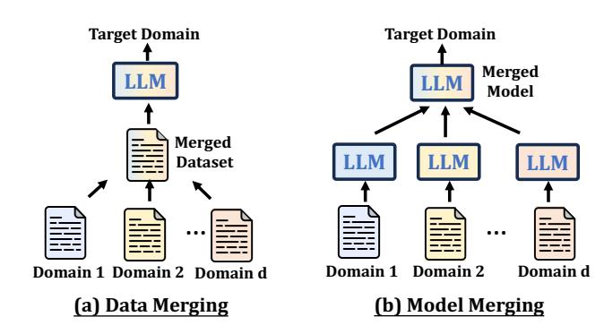
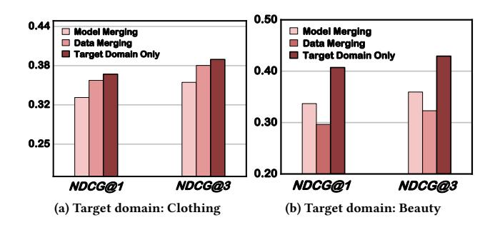
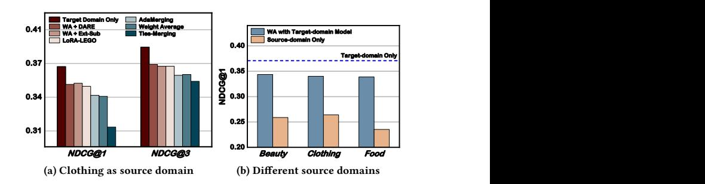
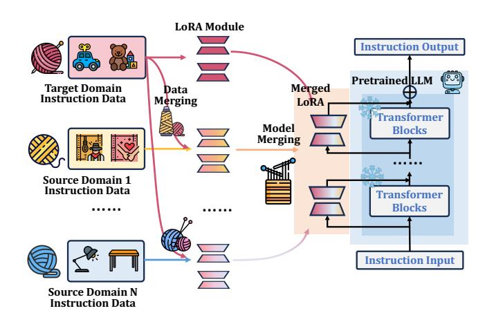
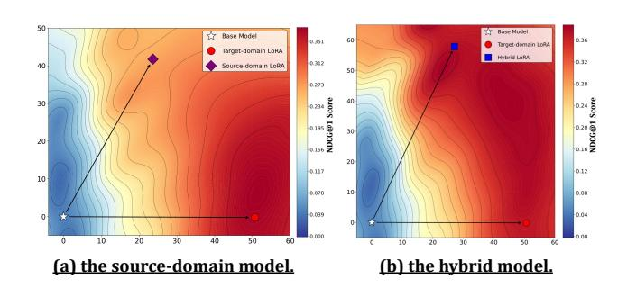
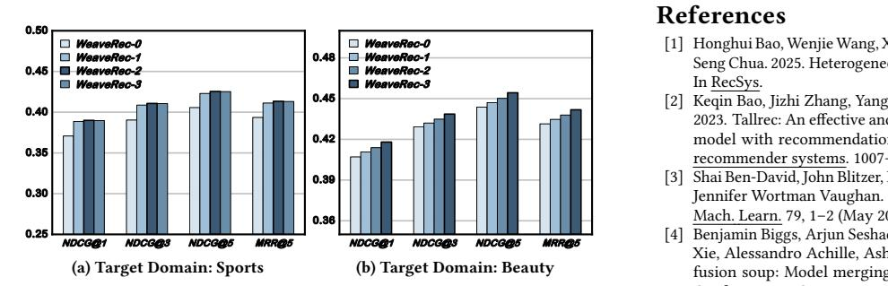
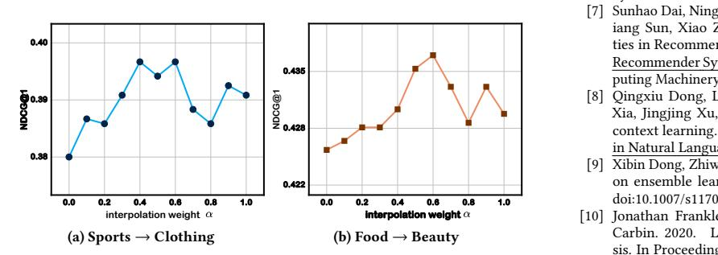
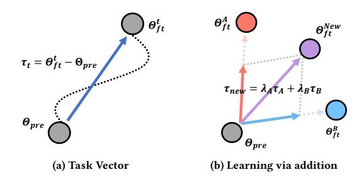
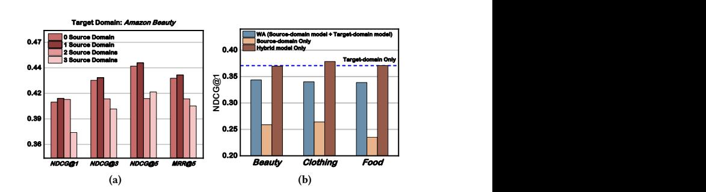

# WeaveRec: An LLM-Based Cross-Domain Sequential Recommendation Framework with Model Merging

Min Hou hmhoumin@gmail.com Hefei University of Technology Hefei, China

Xin Liu xinliu221b@gmail.com Hefei University of Technology Hefei, China

Le Wu\* lewu.ustc@gmail.com Hefei University of Technology Hefei, China

Chenyi He hechenyi@mail.hfut.edu.cn Hefei University of Technology Hefei, China

Hao Liu haoliu@mail.hfut.edu.cn Hefei University of Technology Hefei, China

Zhi Li zhilizl@sz.tsinghua.edu.cn Tsinghua University Shenzhen, China

Xin Li iFLYTEK Hefei, China leexin@ustc.edu.cn

Si Wei iFLYTEK Hefei, China siwei@iflytek.com

### Abstract

Cross-Domain Sequential Recommendation (CDSR) seeks to improve user preference modeling by transferring knowledge from multiple domains. Despite the progress made in CDSR, most existing methods rely on overlapping users or items to establish crossdomain correlations-a requirement that rarely holds in real-world settings. The advent of large language models (LLM) and modelmerging techniques appears to overcome this limitation by unifying multi-domain data without explicit overlaps. Yet, our empirical study shows that naively training an LLM on combined domains—or simply merging several domain-specific LLMs—often degrades performance relative to a model trained solely on the target domain.

To address these challenges, we first experimentally investigate the cause of suboptimal performance in LLM-based cross-domain recommendation and model merging. Building on these insights, we introduce WeaveRec, which cross-trains multiple LoRA modules with source and target domain data in a "weaving" fashion, and fuses them via model merging. WeaveRec can be extended to multisource domain scenarios and notably does not introduce additional inference-time cost in terms of latency or memory. Furthermore, we provide a theoretical guarantee that WeaveRec can reduce the upper bound of the expected error in the target domain. Extensive experiments on single-source, multi-source, and cross-platform cross-domain recommendation scenarios validate that WeaveRec effectively mitigates performance degradation and consistently outperforms baseline approaches in real-world recommendation

\*Corresponding Author.

Permission to make digital or hard copies of all or part of this work for personal or classroom use is granted without fee provided that copies are not made or distributed for profit or commercial advantage and that copies bear this notice and the full citation on the first page. Copyrights for components of this work owned by others than the author(s) must be honored. Abstracting with credit is permitted. To copy otherwise, or republish, to post on servers or to redistribute to lists, requires prior specific permission and/or a fee. Request permissions from permissions@acm.org.

Conference acronym 'XX, Woodstock, NY © 2018 Copyright held by the owner/author(s). Publication rights licensed to ACM. ACM ISBN 978-1-4503-XXXX-X/2018/06

<https://doi.org/XXXXXXX.XXXXXXX>

Figure 1: Illustration of Data Merging and Model Merging.

tasks. Codes are available at [https://anonymous.4open.science/r/](https://anonymous.4open.science/r/WeaveRec-829F) [WeaveRec-829F.](https://anonymous.4open.science/r/WeaveRec-829F)

### CCS Concepts

• Do Not Use This Code → Generate the Correct Terms for Your Paper; Generate the Correct Terms for Your Paper; Generate the Correct Terms for Your Paper; Generate the Correct Terms for Your Paper.

# Keywords

Do, Not, Us, This, Code, Put, the, Correct, Terms, for, Your, Paper

### ACM Reference Format:

Min Hou, Xin Liu, Le Wu\*, Chenyi He, Hao Liu, Zhi Li, Xin Li, and Si Wei. 2018. WeaveRec: An LLM-Based Cross-Domain Sequential Recommendation Framework with Model Merging. In Proceedings of Make sure to enter the correct conference title from your rights confirmation email (Conference acronym 'XX). ACM, New York, NY, USA, [13](#page-12-0) pages. [https:](https://doi.org/XXXXXXX.XXXXXXX) [//doi.org/XXXXXXX.XXXXXXX](https://doi.org/XXXXXXX.XXXXXXX)

### 1 Introduction

With the rapid growth of the Internet, a wide range of online services has emerged, generating vast volumes of user interactions across multiple domains. Each domain encodes valuable behavioral signals and preference data. Cross-domain sequential recommendation (CDSR) [\[47,](#page-9-0) [48,](#page-9-1) [53\]](#page-9-2) has therefore arisen as a powerful approach, leveraging knowledge transfer from source domains to bolster recommendation performance in a target domain, addressing the fundamental challenge of data sparsity in individual domains. Along this line, existing traditional CDSR methodologies can be divided into two primary categories based on their representation strategies. 1) ID-based approaches [\[5,](#page-8-0) [15,](#page-8-1) [29,](#page-9-3) [38\]](#page-9-4) employ collaborative filtering models to learn domain-specific embeddings, which are subsequently aligned through overlapping users or items via techniques such as mapping functions or shared latent spaces. 2) Transferable approaches [\[17,](#page-8-2) [18,](#page-8-3) [25\]](#page-9-5) employ content-based representations, particularly textual descriptions, to encode items within a unified semantic space, enabling the learning of universal and transferable sequence representations across domains.

Recently, Large Language Models (LLMs) have demonstrated remarkable success across diverse fields [\[50\]](#page-9-6), driven by their emergent capabilities [\[8,](#page-8-4) [21\]](#page-9-7) such as world knowledge, language understanding, and complex reasoning. Building upon these strengths, LLMs shift recommender systems from task-specific designs to unified, general-purpose models capable of handling diverse domains and tasks [\[6,](#page-8-5) [12,](#page-8-6) [30,](#page-9-8) [31,](#page-9-9) [35\]](#page-9-10), and further introduced transformative advancements to CDSR [\[13,](#page-8-7) [32,](#page-9-11) [35\]](#page-9-10). The core methodology involves aggregating multi-domain and multi-task recommendation data into unified instruction-tuning datasets, followed by training a single comprehensive model capable of handling diverse domains and tasks [\[6,](#page-8-5) [12,](#page-8-6) [30,](#page-9-8) [31,](#page-9-9) [35\]](#page-9-10). This "one model for all" paradigm effectively overcomes traditional CDSR constraints such as dependency on overlapping users/items and limited representation capabilities. Representative works include M6-rec [\[6\]](#page-8-5), which develops a foundation model supporting open-ended domains and tasks in industrial settings; LLM-Rec [\[35\]](#page-9-10), which explores language models' capabilities in modeling multi-domain user behavior. However, we argue that this approach of aggregating multi-source data to directly train a model has the following limitations: 1) Inflexible. The addition or removal of a domain necessitates model retraining from scratch, resulting in prohibitive computational costs and limited practical applicability. 2) Data Conflict. User interactions from different domains often contain conflict (i.e., interactions irrelevant to or conflicting with the target domain's recommendation), which leads to model misaligned with users' true preferences in the target domain and ultimately degrades recommendation performance. Our preliminary empirical analysis in Figure [2](#page-2-0) reveals a critical phenomenon: data merging often yields performance degradation compared to target-domain-only models. These limitations motivate us to find a new paradigm for building a unified CDSR model.

Fortunately, model merging [\[43\]](#page-9-12) offers a viable alternative by combining model parameters in weight, as shown in Figure [1\(](#page-0-0)b). By merging multiple single-task models' parameters, model merging is designed to obtain a unified model that can simultaneously perform multiple tasks without the need for retraining. This is an exciting and promising technology, which is being applied to

various scenarios, such as unlearning old knowledge in LLMs[\[46\]](#page-9-13), achieving image-style transformation[\[4\]](#page-8-8), and so on. If the model merging technique can be applied in CDSR, then it can naturally solve the limitations of inflexibility and data conflict. This is because if we want to add or remove a source domain, we only need to operate on the saved model parameters without retraining models for all the other domains. Furthermore, each domain's model is trained using only its specific domain data, which reduces the impact of data conflicts. However, naively applying model merging to cross-domain recommendation presents significant challenges. Experiments in Figure [2](#page-2-0) reveal that model merging still suffers from the performance degradation in the target domain. This degradation occurs when source domain knowledge conflicts with target domain patterns, causing the merged model to converge to suboptimal representations that satisfy neither domain effectively.

In this paper, we explore the integration of model-merging techniques into cross-domain recommendation. Our aim is to preserve the inherent scalability and extensibility of model merging while ensuring consistent performance improvements on the target domain. We first experimentally analyze potential causes of performance degradation in model merging techniques for LLM-based crossdomain recommendation. Experimentssuggest that the performance degradation is more likely to occur when the source-domain model performs poorly in the target domain. Specifically, when it happens, the source-domain models capture patterns that are not only irrelevant but actively misleading for the target domain recommendation. The poor source-domain model "drags" the fused network into a compromise that fits none of the domains well, manifesting as severe performance degradation on the target domain. Based on the findings above, our goal shifts to improving the performance of the source domain model on the target domain. However, ensuring the source model's performance on the target domain is not trivial. The source and target domains often exhibit significant differences in user behavior patterns, item characteristics, and interaction distributions, making it difficult for source-domain models to generalize effectively to the target domain without substantial adaptation. To solve this challenge, we present a simple but effective model merging-based cross-domain recommendation framework, named WeaveRec. We train a model using mixed data from the source domain and the target domain and merge it with the target-domain-only model. In such a "weave"-like manner, the new source domain model can be better adapted to the target domain distribution, therefore avoiding performance degradation in the target domain. We also extend WeaveRec to multi-source domain scenarios and notably do not introduce additional inference-time cost in terms of latency or memory. Furthermore, our theoretical analysis demonstrates that WeaveRec effectively ensure the source domain model's performance on the target domain by provably reducing the upper bound of generalization error in the target domain. Extensive experiments on single-source, multi-source, and cross-platform cross-domain recommendation scenarios validate that WeaveRec consistently outperforms baseline approaches in real-world recommendation tasks. The main contributions of this work are as follows:

�� �� = 1 �� + 1 �� 0 + 1 �� + 1 �� 1 + · · · + 1 �� + 1 �� �� , (6)

�� �� = 1 �� + 1 �� 0 + 1 �� + 1 �� 1 + · · · + 1 �� + 1 �� �� , (7)

The merged LoRA ���� maintains the same total number of parameters as one standard LoRA. In addition, the LoRA module is reusable. It is easy to remove or add knowledge from a specific domain without retraining the whole model. Although this naive model merging approach possesses attractive properties and is widely used in multitask learning scenarios, it cannot be directly applied to CDSR tasks due to potential phenomena of performance degradation in the target domain.

### 3 Experimental Analysis

Current research efforts have given rise to numerous model merging methods. This raises the question: What effect would applying these methods to cross-domain recommendation tasks have? To address this, we conduct experiments on CDSR tasks using existing model merging techniques and analyze the observations.

• Experimental Settings. Some representative model merging methods are selected for experimentation. We choose Amazon Sports as the target domain and Clothing as the source domain. Thus, we can obtain two distinct LoRAs, which have learned recommendation knowledge from the two domains, respectively. They are then merged into a single new LoRA using the chosen methods, and its performance is evaluated on the target domain. The chosen methods are as follows.

• Model Merging Methods. (1) Weight Average(WA) [\[39\]](#page-9-15) is the simplest model merging method, directly combining multiple single-task/domain models by their average weights, as described in Eqn. [\(5\)](#page-2-3). (2) Ext-Sub [\[20\]](#page-9-16) decomposes LoRA modules from different tasks into shared and task-specific components to mitigate inter-task conflicts during model merging. (3) DARE [\[45\]](#page-9-17) mitigates parameter interference in model merging by eliminating a significant number of redundant parameters, and it can be integrated with any downstream model merging method. (4) LoRA-LEGO [\[51\]](#page-9-18) is a LoRA merging technique, which decouples each LoRA into several Minimum Semantic Units (MSUs) and then clusters all of them to form a new merged LoRA. (5) Tie-Merging [\[42\]](#page-9-19) involves a three-step process that includes reducing parameter redundancy, eliminating sign conflicts between parameters, and finally merging them. (6) AdaMerging [\[44\]](#page-9-20) is an adaptive model merging technique that automatically learns optimal merging coefficients(rather than using uniform coefficients) for multi-task learning by leveraging entropy minimization on unlabeled test data.

• Analysis of the Experimental Observations. As shown in Figure [3a,](#page-3-0) none of these methods can effectively enhance the target domain's knowledge. Their performance consistently falls short of the target-domain LoRA. This significant performance drop is likely due to a fundamental difference between the objectives of mainstream model merging methods and our task. Our aim is to enhance the performance of the merged model on the target domain by introducing models rich in recommendation knowledge from source domains, thereby reflecting the contribution of source domain knowledge to target domain improvement. Conversely, mainstream model merging methods are predominantly designed for multi-task scenarios. Their goal is to obtain a single model that

Figure 3: Performance comparison of different model merging methods when Sports is the target domain.

Figure 4: An example prompt of WeaveRec.

achieves an acceptable performance across multiple tasks simultaneously. However, these performances are, in most cases, inferior to the performance of their respective single-task models.

Further experiments are shown in Figure [3b.](#page-3-1) For the same targetdomain model, its fusion with different source domain models consistently leads to a significant decline in performance on the target domain. Concurrently, the performance of these source domain models on the target domain is notably poor, which is entirely expected, as source domain models have not been exposed to the target domain's training data. We can intuitively observe from Figure [3](#page-3-2) that the performance of models obtained through various model merging methods lies between that of the target domain model and the source domain models. This implies that incorporating source-domain models degrades the overall performance to some extent, which aligns with findings from prior work [\[40\]](#page-9-21) suggesting that model merging should only include models exceeding a performance threshold. Based on the findings above, our goal shifts to improving the performance of the source domain model on the target domain. However, ensuring the source model's performance on the target domain is not trivial. The source and target domains often exhibit significant differences in user behavior patterns, item characteristics, and interaction distributions, making it difficult for source-domain models to generalize effectively to the target domain without substantial adaptation.

# 4 Methodology

In this section, we propose WeaveRec, an effective and efficient framework of LoRA merging for LLM-based Cross-Domain Sequential Recommendation with mitigation of the performance degradation mentioned earlier.

Table 1: Performance comparison in cross-domain scenario.

| Method             | N@1     | Beauty,Clothing,Food N@3 | → N@5   | Sports M@5 | N@1     | Sports,Clothing,Food N@3 | → N@5   | Beauty M@5 | N@1     | Beauty,Sports,Food N@3 | → N@5   | Clothing M@5 | N@1     | Beauty,Sports,Clothing N@3 | → N@5   | Food M@5 |
|--------------------|---------|--------------------------|---------|------------|---------|--------------------------|---------|------------|---------|------------------------|---------|--------------|---------|----------------------------|---------|----------|
| GRU4Rec            | 0.1664  | 0.2635                   | 0.3139  | 0.2776     | 0.1737  | 0.2748                   | 0.3378  | 0.2901     | 0.1531  | 0.2471                 | 0.2894  | 0.2466       | 0.1823  | 0.2763                     | 0.3554  | 0.3041   |
| SASRec             | 0.1890  | 0.3142                   | 0.3699  | 0.3132     | 0.2166  | 0.3272                   | 0.3712  | 0.3239     | 0.1963  | 0.3193                 | 0.3714  | 0.3069       | 0.2366  | 0.3533                     | 0.3979  | 0.3492   |
| BERT4Rec           | 0.1839  | 0.2792                   | 0.3205  | 0.2779     | 0.2215  | 0.3116                   | 0.3447  | 0.3073     | 0.0813  | 0.1415                 | 0.1748  | 0.1444       | 0.2440  | 0.3405                     | 0.3724  | 0.3343   |
| FMLP-Rec           | 0.2411  | 0.3462                   | 0.3879  | 0.3432     | 0.2581  | 0.3613                   | 0.4003  | 0.3598     | 0.1842  | 0.2691                 | 0.3084  | 0.3136       | 0.2934  | 0.3873                     | 0.4197  | 0.4084   |
| MCRPL              | 0.2465  | 0.3330                   | 0.3775  | 0.3523     | 0.2424  | 0.3490                   | 0.3912  | 0.3677     | 0.2034  | 0.2967                 | 0.3527  | 0.3162       | 0.2473  | 0.3577                     | 0.4009  | 0.3539   |
| UnisRec            | 0.2258  | 0.3323                   | 0.3764  | 0.3299     | 0.2485  | 0.3367                   | 0.3727  | 0.3345     | 0.1948  | 0.2936                 | 0.3371  | 0.2927       | 0.2965  | 0.3808                     | 0.4122  | 0.3773   |
| VQ-Rec             | 0.2512  | 0.3578                   | 0.3812  | 0.3550     | 0.2686  | 0.3674                   | 0.3924  | 0.3498     | 0.2367  | 0.3562                 | 0.3895  | 0.3327       | 0.3104  | 0.3828                     | 0.4131  | 0.3945   |
| RecFormer          | 0.2638  | 0.3575                   | 0.3816  | 0.3694     | 0.2844  | 0.3751                   | 0.4160  | 0.3831     | 0.2568  | 0.3586                 | 0.3792  | 0.3451       | 0.3125  | 0.3918                     | 0.4376  | 0.3956   |
| Qwen2-7B           | 0.0411  | 0.0488                   | 0.0659  | 0.0560     | 0.0450  | 0.0559                   | 0.0728  | 0.0623     | 0.0730  | 0.0880                 | 0.1087  | 0.0955       | 0.0282  | 0.0366                     | 0.0516  | 0.0426   |
| TALLRec            | 0.2957  | 0.3232                   | 0.3435  | 0.3272     | 0.2604  | 0.2885                   | 0.3078  | 0.3570     | 0.3124  | 0.3403                 | 0.3593  | 0.3434       | 0.3184  | 0.3445                     | 0.3627  | 0.3477   |
| LLM-REC            | 0.3206  | 0.3896                   | 0.4107  | 0.4059     | 0.3623  | 0.4305                   | 0.4478  | 0.4329     | 0.3227  | 0.3812                 | 0.4076  | 0.3854       | 0.3475  | 0.4078                     | 0.4522  | 0.4217   |
| Weight Average     | 0.3098  | 0.3321                   | 0.3510  | 0.3368     | 0.3369  | 0.3595                   | 0.3766  | 0.3629     | 0.3269  | 0.3512                 | 0.3689  | 0.3544       | 0.3028  | 0.3275                     | 0.3460  | 0.3311   |
| AdaMerging         | 0.3095  | 0.3326                   | 0.3502  | 0.3361     | 0.3384  | 0.3609                   | 0.3782  | 0.3645     | 0.3270  | 0.3512                 | 0.3689  | 0.3545       | 0.3025  | 0.3275                     | 0.3468  | 0.3315   |
| LoRA-LEGO          | 0.3109  | 0.3328                   | 0.3502  | 0.3365     | 0.3481  | 0.3704                   | 0.3867  | 0.3733     | 0.3244  | 0.3482                 | 0.3655  | 0.3514       | 0.3084  | 0.3320                     | 0.3493  | 0.3354   |
| Ties-Merging       | 0.3102  | 0.3361                   | 0.3555  | 0.3400     | 0.3375  | 0.3402                   | 0.3420  | 0.3405     | 0.3275  | 0.3543                 | 0.3747  | 0.3585       | 0.2994  | 0.3250                     | 0.3444  | 0.3289   |
| Target-domain Only | 0.3708  | 0.3904                   | 0.4057  | 0.3936     | 0.4071  | 0.4293                   | 0.4438  | 0.4314     | 0.3643  | 0.3880                 | 0.4049  | 0.3910       | 0.4143  | 0.4337                     | 0.4492  | 0.4370   |
| All Data Merging   | 0.3677  | 0.3919                   | 0.4092  | 0.3950     | 0.2965  | 0.3231                   | 0.3413  | 0.3260     | 0.3545  | 0.3783                 | 0.3963  | 0.3818       | 0.4146  | 0.4375                     | 0.4554  | 0.4412   |
| WeaveRec (ours)    | 0.3897* | 0.4107*                  | 0.4253* | 0.4132*    | 0.4180* | 0.4386*                  | 0.4543* | 0.4418*    | 0.3732* | 0.3965*                | 0.4130* | 0.3995*      | 0.4220* | 0.4425*                    | 0.4572* | 0.4452*  |

Table 2: Performance comparison in cross-platform scenario.

| Method             | NDCG@1  | Toys → NDCG@3 | MovieLens-1M NDCG@5 | MRR@5   | NDCG@1  | MovieLens-1M NDCG@3 | → Toys NDCG@5 | MRR@5   |
|--------------------|---------|---------------|---------------------|---------|---------|---------------------|---------------|---------|
| GRU4Rec            | 0.2211  | 0.3750        | 0.4419              | 0.3729  | 0.1548  | 0.2524              | 0.2987        | 0.2531  |
| SASRec             | 0.2754  | 0.3743        | 0.4339              | 0.3662  | 0.2081  | 0.3157              | 0.3591        | 0.3127  |
| BERT4Rec           | 0.2405  | 0.3682        | 0.4256              | 0.3678  | 0.1508  | 0.2334              | 0.2732        | 0.2345  |
| FMLP-Rec           | 0.2853  | 0.4378        | 0.4788              | 0.4458  | 0.2614  | 0.3562              | 0.3919        | 0.3707  |
| MCRPL              | 0.2911  | 0.3807        | 0.4323              | 0.4016  | 0.2378  | 0.3572              | 0.3889        | 0.3551  |
| UnisRec            | 0.3011  | 0.4325        | 0.4810              | 0.4266  | 0.2318  | 0.3373              | 0.3792        | 0.3340  |
| VQ-Rec             | 0.3362  | 0.4569        | 0.4945              | 0.4334  | 0.2641  | 0.3666              | 0.3982        | 0.3616  |
| RecFormer          | 0.2847  | 0.4309        | 0.4795              | 0.4252  | 0.3012  | 0.3872              | 0.4188        | 0.3804  |
| Qwen2-7B           | 0.0099  | 0.0135        | 0.0145              | 0.0132  | 0.0955  | 0.1146              | 0.1326        | 0.1197  |
| TALLRec            | 0.2972  | 0.3177        | 0.3331              | 0.3208  | 0.3174  | 0.3456              | 0.3661        | 0.3496  |
| LLM-REC            | 0.4023  | 0.4766        | 0.4952              | 0.4701  | 0.3238  | 0.4209              | 0.4452        | 0.4255  |
| Weight Average     | 0.4103  | 0.4327        | 0.4505              | 0.4367  | 0.3595  | 0.3843              | 0.4021        | 0.3875  |
| AdaMerging         | 0.4111  | 0.4334        | 0.4515              | 0.4375  | 0.3596  | 0.3849              | 0.4024        | 0.3879  |
| LoRA-LEGO          | 0.4081  | 0.4291        | 0.4442              | 0.4319  | 0.3704  | 0.3887              | 0.4035        | 0.3920  |
| Ties-Merging       | 0.1930  | 0.2637        | 0.2951              | 0.2633  | 0.2942  | 0.3475              | 0.3723        | 0.3479  |
| Target-domain Only | 0.4500  | 0.4704        | 0.4845              | 0.4728  | 0.4080  | 0.4328              | 0.4488        | 0.4350  |
| All Data Merging   | 0.4568  | 0.4752        | 0.4888              | 0.4777  | 0.3984  | 0.4239              | 0.4423        | 0.4274  |
| WeaveRec (ours)    | 0.4854* | 0.5049*       | 0.5217*             | 0.5073* | 0.4110* | 0.4368*             | 0.4541*       | 0.4396* |

Average, AdaMerging [\[44\]](#page-9-20), LoRA-LEGO [\[51\]](#page-9-18), and Ties-Merging [\[42\]](#page-9-19). 5) Our Ablation Counterparts: Target-Domain Only and All Data Merging. See Appendix [A.3](#page-10-1) for more details of these baselines.

5.1.3 Evaluation Setting. Following some previous LLM-based recommendation works, to evaluate the performance of each methods, each user's candidate set in the test set includes 29 randomly selected non-interacted items and one ground truth item. To quantitatively compare, we employ widely used ranking-based metrics, NDCG@1, NDCG@3, NDCG@5, and MRR@5 for all experiments. All metrics show improved performance with higher values. For all the following tables, bold\* numbers refer to the best performance, while underlined numbers indicate the second-best performance.

# 5.2 Overall Performance

The experimental results in the cross-domain scenario and crossplatform scenario are shown in Table [1](#page-6-0) and [2,](#page-6-1) respectively. The proposed WeaveRec consistently achieves the best performance across various target domain settings in both cross-domain and

cross-platform scenarios, with a t-test at p<0.05 level. From the experimental results, we have two main observations:

• Across both cross-domain and cross-platform scenarios, existing get domain. Notably, the four baseline model merging approaches tal settings, with the exception of Ties-Merging which exhibits This finding suggests that current model merging methodologies are not properly aligned with the requirements of cross-domain

- model merging methods underperform compared to target-domainonly models, whereas WeaveRec successfully leverages sourcedomain knowledge to achieve enhanced performance in the tardemonstrate comparable performance across various experimensignificant performance degradation in cross-platform scenarios. recommendation tasks.
- Comparing the two baselines of target-domain only and all data merging, we can find that when using the merging of multi-domain data to train the model, it may performs better in the Sports and Food domains than the target-domain-only model, but its performance declines in Beauty and Clothing, especially in Beauty. This indicates the instability of multi-task joint training in cross-domain recommendation. When the model learns multi-domain data, the updated gradients have conflicting directions, which compromises the performance of the model. This may be manifested as the model performing better than the target-domain-only model in some do-

mains, but experiencing severe degradation in some domains.

### 5.3 In-Depth Analysis

More in-depth analysis can be found in Appendix [A.5.](#page-11-0)

5.3.1 Component Analysis. We disassemble WeaveRec under the settings of Table [1](#page-6-0) and individually test each component on target domains. Note that different target domains utilize different hybrid LoRAs, which are not distinguished in this section. As shown in Table [3,](#page-7-0) the performance of each individual branch of WeaveRec is comparable, while the performance of the merged model is significantly enhanced. This clearly demonstrates WeaveRec's mitigation of performance degradation. This supports our discussion in Section [4.2](#page-4-1) that fusion members should not exhibit poor performance on the target domain.

5.3.2 Why WeaveRec Employs Weight Average? An interesting question arises: Why does WeaveRec employ simple Weight Averaging (WA) for model merging instead of more complex methods like LoRA-LEGO or Tie-Merging? To explore this, we designate Sports as the target domain, with Clothing, Beauty, and Food serving as source domains. Following Our WeaveRec, we obtain three hybrid LoRAs: Sports-Clothing, Sports-Beauty, and Sports-Food. We then merge these three LoRAs with the target-domain LoRA using Weight Average, LoRA-LEGO, Tie-Merging and AdaMerging as the merging functions. The results, as shown in Table [4,](#page-7-1) indicate that LoRA-LEGO and Tie-Merging still perform poorly, with Weight Average showing the best performance and AdaMerging being the second-best. This further suggests that existing model merging methods may not be well-suited for recommendation tasks. It's possible these methods manipulate model parameters too aggressively, leading to a loss of valuable knowledge.

5.3.3 Impact of the Number of Source Domains. As WeaveRec supports plug-and-play modules, we can select one or more source

Table 3: Component Analysis of WeaveRec on NDCG@1.

| Target        |      | domain | Sports | Beauty | Clothing |
|---------------|------|--------|--------|--------|----------|
| Target-domain |      | LoRA   | 0.3708 | 0.4071 | 0.3643   |
| Hybrid        | LoRA | 1      | 0.3698 | 0.4059 | 0.3673   |
| Hybrid        | LoRA | 2      | 0.3786 | 0.4072 | 0.3573   |
| Hybrid        | LoRA | 3      | 0.3709 | 0.4029 | 0.3567   |
| WeaveRec      |      |        | 0.3897 | 0.4180 | 0.3732   |

Table 4: Performance comparison of four merging methods applied to WeaveRec.

|               | Setting Metrics | NDCG@1      | Sports, Clothing, NDCG@3 | Food → NDCG@5 | Beauty MRR@5 |
|---------------|-----------------|-------------|--------------------------|---------------|--------------|
| Target-domain |                 | Only 0.4071 | 0.4293                   | 0.4438        | 0.4314       |
| WeaveRec      | w/ WA           | 0.4180      | 0.4386                   | 0.4543        | 0.4418       |
| w/            | LoRA-LEGO       | 0.3493      | 0.3710                   | 0.3872        | 0.3742       |
| w/            | Ties-Merging    | 0.3466      | 0.3679                   | 0.3857        | 0.3720       |
| w/            | AdaMerging      | 0.4115      | 0.4318                   | 0.4467        | 0.4347       |

domains to facilitate cross-domain recommendations for a target domain. To explore how the varying number of source domains affects the LLM's performance on target domain, we conduct four sets of experiments on two distinct target domains. WeaveRec-0 represents the baseline, degenerating to the target-domain LoRA, while WeaveRec-N (1 ≤ �� ≤ 3) signifies utilizing �� source domains for cross-domain recommendation.

As shown in Figure [7a,](#page-8-15) for Sports as the target domain, the performance of WeaveRec-0, WeaveRec-1, and WeaveRec-2 exhibits little difference. This indicates that for the Sports domain, more source domains are not necessarily better. One source domain can effectively enhance the model's performance on Sports, with the addition of more source domains not yielding a substantial increase. Notably, even though WeaveRec-2 shows the best performance, adding another source domain does not lead to a significant performance drop. This suggests that while multiple source domains might not provide optimal enhancement for a particular target domain, they do not cause significant performance degradation, demonstrating WeaveRec's robustness.

In contrast, for Beauty as target domain, as presented in Figure [7b,](#page-8-16) we can intuitively observe a gradual increase in the model's test performance on the target domain with the increasing number of source domains. This implies that for the Beauty domain, utilizing three source domains yields the best results. This pattern differs from that observed in Figure [7a,](#page-8-15) signifying that the optimal number of source domains varies across different target domains, thereby reflecting the inherent heterogeneity among them.

5.3.4 Sensitivity Analysis of Interpolation Weight. As shown in Figure [8,](#page-8-17) we investigate how changes in interpolation weight �� affect the final model's performance under different one-to-one cross-domain scenarios. We observe that under various scenarios, Weight Average (�� = 0.5) achieves sub-optimal performance with a minimal performance gap from the optimal weight. Thus Weight Average is an excellent strategy when the number of source domains increases because of search cost.

NDCG@1 NDCG@3 NDCG@5 MRR@5 0.0 0.2 0.4 0.6 0.8 1.0 [1] Honghui Bao, Wenjie Wang, Xinyu Lin, Fengbin Zhu, Teng Sun, Fuli Feng, and Tat-Seng Chua. 2025. Heterogeneous User Modeling for LLM-based Recommendation. In RecSys. [2] Keqin Bao, Jizhi Zhang, Yang Zhang, Wenjie Wang, Fuli Feng, and Xiangnan He. 2023. Tallrec: An effective and efficient tuning framework to align large language model with recommendation. In Proceedings of the 17th ACM conference on recommender systems. 1007–1014. [3] Shai Ben-David, John Blitzer, Koby Crammer, Alex Kulesza, Fernando Pereira, and Jennifer Wortman Vaughan. 2010. A theory of learning from different domains. Mach. Learn. 79, 1–2 (May 2010), 151–175. [doi:10.1007/s10994-009-5152-4](https://doi.org/10.1007/s10994-009-5152-4) [4] Benjamin Biggs, Arjun Seshadri, Yang Zou, Achin Jain, Aditya Golatkar, Yusheng Xie, Alessandro Achille, Ashwin Swaminathan, and Stefano Soatto. 2024. Diffusion soup: Model merging for text-to-image diffusion models. In European Conference on Computer Vision. Springer, 257–274. [5] Jiangxia Cao, Shaoshuai Li, Bowen Yu, Xiaobo Guo, Tingwen Liu, and Bin Wang. 2023. Towards Universal Cross-Domain Recommendation. In Proceedings of the Sixteenth ACM International Conference on Web Search and Data Mining (Singapore, Singapore) (WSDM '23). Association for Computing Machinery, New York, NY, USA, 78–86. [doi:10.1145/3539597.3570366](https://doi.org/10.1145/3539597.3570366) [6] Zeyu Cui, Jianxin Ma, Chang Zhou, Jingren Zhou, and Hongxia Yang. 2022. M6- Rec: Generative Pretrained Language Models are Open-Ended Recommender Systems. arXiv[:2205.08084](https://arxiv.org/abs/2205.08084) [cs.IR]<https://arxiv.org/abs/2205.08084> [7] Sunhao Dai, Ninglu Shao, Haiyuan Zhao, Weijie Yu, Zihua Si, Chen Xu, Zhongxiang Sun, Xiao Zhang, and Jun Xu. 2023. Uncovering ChatGPT's Capabilities in Recommender Systems. In Proceedings of the 17th ACM Conference on Recommender Systems(Singapore, Singapore) (RecSys '23). Association for Computing Machinery, New York, NY, USA, 1126–1132. [doi:10.1145/3604915.3610646](https://doi.org/10.1145/3604915.3610646) [8] Qingxiu Dong, Lei Li, Damai Dai, Ce Zheng, Jingyuan Ma, Rui Li, Heming Xia, Jingjing Xu, Zhiyong Wu, Baobao Chang, et al. 2024. A survey on incontext learning. In Proceedings of the 2024 Conference on Empirical Methods in Natural Language Processing. 1107–1128. [9] Xibin Dong, Zhiwen Yu, Wenming Cao, Yifan Shi, and Qianli Ma. 2020. A survey on ensemble learning. Frontiers of Computer Science 14, 2 (2020), 241–258. [doi:10.1007/s11704-019-8208-z](https://doi.org/10.1007/s11704-019-8208-z) [10] Jonathan Frankle, Gintare Karolina Dziugaite, Daniel M Roy, and Michael Carbin. 2020. Linear Mode Connectivity and the Lottery Ticket Hypothesis. In Proceedings of the 37th International Conference on Machine Learning (Proceedings of Machine Learning Research, Vol. 119). PMLR, 3259–3269. [11] Timur Garipov, Pavel Izmailov, Dmitrii Podoprikhin, Dmitry Vetrov, and Andrew Gordon Wilson. 2018. Loss surfaces, mode connectivity, and fast ensembling of DNNs. In Proceedings of the 32nd International Conference on Neural Information Processing Systems (Montréal, Canada) (NIPS'18). Curran Associates Inc., Red Hook, NY, USA, 8803–8812. [12] Shijie Geng, Shuchang Liu, Zuohui Fu, Yingqiang Ge, and Yongfeng Zhang. 2022. Recommendation as language processing (rlp): A unified pretrain, personalized prompt & predict paradigm (p5). In Proceedings of the 16th ACM conference on recommender systems. 299–315. [13] Shijie Geng, Shuchang Liu, Zuohui Fu, Yingqiang Ge, and Yongfeng Zhang. 2022. Recommendation as Language Processing (RLP): A Unified Pretrain, Personalized Prompt & Predict Paradigm (P5). In Proceedings of the 16th ACM Conference on Recommender Systems (Seattle, WA, USA) (RecSys '22). Association for Computing Machinery, New York, NY, USA, 299–315. [doi:10.1145/3523227.3546767](https://doi.org/10.1145/3523227.3546767) [14] Lei Guo, Chunxiao Wang, Xinhua Wang, Lei Zhu, and Hongzhi Yin. 2023. Automated prompting for non-overlapping cross-domain sequential recommendation. arXiv preprint arXiv:2304.04218 (2023). [15] Lei Guo, Jinyu Zhang, Tong Chen, Xinhua Wang, and Hongzhi Yin. 2023. Reinforcement Learning-Enhanced Shared-Account Cross-Domain Sequential Recommendation. IEEE Trans. on Knowl. and Data Eng. 35, 7 (July 2023), 7397–7411. [doi:10.1109/TKDE.2022.3185101](https://doi.org/10.1109/TKDE.2022.3185101) [16] Balázs Hidasi, Alexandros Karatzoglou, Linas Baltrunas, and Domonkos Tikk. 2016. Session-based Recommendations with Recurrent Neural Networks. In 4th International Conference on Learning Representations, ICLR 2016, San Juan, Puerto Rico, May 2-4, 2016, Conference Track Proceedings, Yoshua Bengio and Yann LeCun (Eds.).<http://arxiv.org/abs/1511.06939> [17] Yupeng Hou, Zhankui He, Julian McAuley, and Wayne Xin Zhao. 2023. Learning Vector-Quantized Item Representation for Transferable Sequential Recommenders. In TheWebConf. [18] Yupeng Hou, Shanlei Mu, Wayne Xin Zhao, Yaliang Li, Bolin Ding, and Ji-Rong Wen. 2022. Towards Universal Sequence Representation Learning for Recommender Systems. In Proceedings of the 28th ACM SIGKDD Conference on Knowledge Discovery and Data Mining (Washington DC, USA) (KDD '22). Association for Computing Machinery, New York, NY, USA, 585–593. [doi:10.](https://doi.org/10.1145/3534678.3539381) [1145/3534678.3539381](https://doi.org/10.1145/3534678.3539381) [19] Edward J Hu, Yelong Shen, Phillip Wallis, Zeyuan Allen-Zhu, Yuanzhi Li, Shean Wang, Lu Wang, Weizhu Chen, et al. 2022. Lora: Low-rank adaptation of large language models. ICLR 1, 2 (2022), 3.

Figure 7: The impact of the number of source domains on WeaveRec's performance. (a) The three source domains are Amazon Clothing, Beauty, and Food. WeaveRec-N refers to using only the first N of these three domains. (b) Similarly, three source domains are Amazon Food, Clothing, and Sports.

Figure 8: Sensitivity analysis of the weight ��, where �������������� = �� · ��ℎ���������� + (1 − ��) · �������������� .

### 6 Conclusion

In this paper, we addressed the degradation problem in cross-domain recommendation systems when applying model-merging techniques. Through experimental analysis, we identified that performance degradation occurs when source-domain models perform poorly on the target domain, leading to misleading patterns that compromise recommendation quality. We proposed WeaveRec, a novel framework that trains a mixed-domain model and merges it with a target-domain-only model to better adapt source knowledge to target distributions. Our theoretical analysis demonstrates that WeaveRec provably reduces the upper bound of generalization error, while extensive experiments across various scenarios validate its effectiveness in consistently outperforming baseline approaches. WeaveRec maintains the scalability advantages of model merging without additional inference costs, opening new avenues for cross-domain recommendation systems, opening new avenues for leveraging model-merging techniques in cross-domain learning.

### References

[20] Xinshuo Hu, Dongfang Li, Baotian Hu, Zihao Zheng, Zhenyu Liu, and Min Zhang. 2024. Separate the wheat from the chaff: model deficiency unlearning via parameter-efficient module operation. In Proceedings of the Thirty-Eighth AAAI Conference on Artificial Intelligence and Thirty-Sixth Conference on Innovative Applications of Artificial Intelligence and Fourteenth Symposium on Educational Advances in Artificial Intelligence (AAAI'24/IAAI'24/EAAI'24). AAAI Press, Article 2036, 9 pages. [doi:10.1609/aaai.v38i16.29784](https://doi.org/10.1609/aaai.v38i16.29784) [21] Jie Huang and Kevin Chen-Chuan Chang. 2023. Towards Reasoning in Large Language Models: A Survey. In Findings of the Association for Computational Linguistics: ACL 2023, Anna Rogers, Jordan Boyd-Graber, and Naoaki Okazaki (Eds.). Association for Computational Linguistics, Toronto, Canada, 1049–1065. [doi:10.18653/v1/2023.findings-acl.67](https://doi.org/10.18653/v1/2023.findings-acl.67) [22] Gabriel Ilharco, Marco Tulio Ribeiro, Mitchell Wortsman, Suchin Gururangan, Ludwig Schmidt, Hannaneh Hajishirzi, and Ali Farhadi. 2023. Editing Models with Task Arithmetic. arXiv[:2212.04089](https://arxiv.org/abs/2212.04089) [cs.LG]<https://arxiv.org/abs/2212.04089> [23] Pavel Izmailov, Dmitrii Podoprikhin, Timur Garipov, Dmitry Vetrov, and Andrew Gordon Wilson. 2018. Averaging weights leads to wider optima and better generalization. arXiv preprint arXiv:1803.05407 (2018). [24] Wang-Cheng Kang and Julian McAuley. 2018. Self-attentive sequential recommendation. In 2018 IEEE international conference on data mining (ICDM). IEEE, 197–206. [25] Jiacheng Li, Ming Wang, Jin Li, Jinmiao Fu, Xin Shen, Jingbo Shang, and Julian McAuley. 2023. Text is all you need: Learning language representations for sequential recommendation. In Proceedings of the 29th ACM SIGKDD Conference on Knowledge Discovery and Data Mining. 1258–1267. [26] Jianghao Lin, Xinyi Dai, Yunjia Xi, Weiwen Liu, Bo Chen, Hao Zhang, Yong Liu, Chuhan Wu, Xiangyang Li, Chenxu Zhu, Huifeng Guo, Yong Yu, Ruiming Tang, and Weinan Zhang. 2025. How Can Recommender Systems Benefit from Large Language Models: A Survey. ACM Trans. Inf. Syst. 43, 2, Article 28 (Jan. 2025), 47 pages. [doi:10.1145/3678004](https://doi.org/10.1145/3678004) [27] Xinyu Lin, Wenjie Wang, Yongqi Li, Fuli Feng, See-Kiong Ng, and Tat-Seng Chua. 2024. Bridging items and language: A transition paradigm for large language model-based recommendation. In Proceedings of the 30th ACM SIGKDD Conference on Knowledge Discovery and Data Mining. 1816–1826. [28] Hao Liu, Lei Guo, Lei Zhu, Yongqiang Jiang, Min Gao, and Hongzhi Yin. 2024. MCRPL: A Pretrain, prompt, and fine-tune paradigm for non-overlapping manyto-one cross-domain recommendation. ACM Transactions on Information Systems 42, 4 (2024), 1–24. [29] Jing Liu, Lele Sun, Weizhi Nie, Peiguang Jing, and Yuting Su. 2024. Graph disentangled contrastive learning with personalized transfer for cross-domain recommendation. In Proceedings of the Thirty-Eighth AAAI Conference on Artificial Intelligence and Thirty-Sixth Conference on Innovative Applications of Artificial Intelligence and Fourteenth Symposium on Educational Advances in Artificial Intelligence (AAAI'24/IAAI'24/EAAI'24). AAAI Press, Article 975, 9 pages. [doi:10.1609/aaai.v38i8.28723](https://doi.org/10.1609/aaai.v38i8.28723) [30] Xinyi Liu, Ruijie Wang, Dachun Sun, Dilek Hakkani Tur, and Tarek Abdelzaher. 2025. Uncovering Cross-Domain Recommendation Ability of Large Language Models. In Companion Proceedings of the ACM on Web Conference 2025 (Sydney NSW, Australia) (WWW '25). Association for Computing Machinery, New York, NY, USA, 2736–2743. [doi:10.1145/3701716.3717850](https://doi.org/10.1145/3701716.3717850) [31] Bo Peng, Xinyi Ling, Ziru Chen, Huan Sun, and Xia Ning. 2024. eCeLLM: Generalizing Large Language Models for E-commerce from Large-scale, High-quality Instruction Data. In Forty-first International Conference on Machine Learning. <https://openreview.net/forum?id=LWRI4uPG2X> [32] Bo Peng, Xinyi Ling, Ziru Chen, Huan Sun, and Xia Ning. 2024. eCeLLM: generalizing large language models for E-commerce from large-scale, high-quality instruction data. In Proceedings of the 41st International Conference on Machine Learning (Vienna, Austria) (ICML'24). JMLR.org, Article 1632, 43 pages. [33] Scott Sanner, Krisztian Balog, Filip Radlinski, Ben Wedin, and Lucas Dixon. 2023. Large Language Models are Competitive Near Cold-start Recommenders for Language- and Item-based Preferences. In Proceedings of the 17th ACM Conference on Recommender Systems (Singapore, Singapore) (RecSys '23). Association for Computing Machinery, New York, NY, USA, 890–896. [doi:10.1145/](https://doi.org/10.1145/3604915.3608845) [3604915.3608845](https://doi.org/10.1145/3604915.3608845) [34] Fei Sun, Jun Liu, Jian Wu, Changhua Pei, Xiao Lin, Wenwu Ou, and Peng Jiang. 2019. BERT4Rec: Sequential Recommendation with Bidirectional Encoder Representations from Transformer. In Proceedings of the 28th ACM International Conference on Information and Knowledge Management (Beijing, China) (CIKM '19). Association for Computing Machinery, New York, NY, USA, 1441–1450. [doi:10.1145/3357384.3357895](https://doi.org/10.1145/3357384.3357895) [35] Zuoli Tang, Zhaoxin Huan, Zihao Li, Xiaolu Zhang, Jun Hu, Chilin Fu, Jun Zhou, Lixin Zou, and Chenliang Li. 2025. One Model for All: Large Language Models Are Domain-Agnostic Recommendation Systems. ACM Trans. Inf. Syst. 43, 5, Article 118 (July 2025), 27 pages. [doi:10.1145/3705727](https://doi.org/10.1145/3705727) [36] Joachim Utans. 1996. Weight Averaging for Neural Networks and Local Resampling Schemes. In AAAI-96 Workshop on Integrating Multiple Learned Models. [37] Xiaolei Wang, Xinyu Tang, Xin Zhao, Jingyuan Wang, and Ji-Rong Wen. 2023. Rethinking the Evaluation for Conversational Recommendation in the Era of Large Language Models. In The 2023 Conference on Empirical Methods in Natural Language Processing.<https://openreview.net/forum?id=O4kDO3yS9B> [38] Zihan Wang, Yonghui Yang, Le Wu, Richang Hong, and Meng Wang. 2024. Making Non-Overlapping Matters: An Unsupervised Alignment Enhanced Cross-Domain Cold-Start Recommendation. IEEE Trans. on Knowl. and Data Eng. 37, 4 (Dec. 2024), 2001–2014. [doi:10.1109/TKDE.2024.3511602](https://doi.org/10.1109/TKDE.2024.3511602) [39] Mitchell Wortsman, Gabriel Ilharco, Samir Ya Gadre, Rebecca Roelofs, Raphael Gontijo-Lopes, Ari S Morcos, Hongseok Namkoong, Ali Farhadi, Yair Carmon, Simon Kornblith, and Ludwig Schmidt. 2022. Model soups: averaging weights of multiple fine-tuned models improves accuracy without increasing inference time. In Proceedings of the 39th International Conference on Machine Learning (Proceedings of Machine Learning Research, Vol. 162). PMLR, 23965–23998. [40] Mitchell Wortsman, Gabriel Ilharco, Samir Ya Gadre, Rebecca Roelofs, Raphael Gontijo-Lopes, Ari S Morcos, Hongseok Namkoong, Ali Farhadi, Yair Carmon, Simon Kornblith, and Ludwig Schmidt. 2022. Model soups: averaging weights of multiple fine-tuned models improves accuracy without increasing inference time. In Proceedings of the 39th International Conference on Machine Learning (Proceedings of Machine Learning Research, Vol. 162), Kamalika Chaudhuri, Stefanie Jegelka, Le Song, Csaba Szepesvari, Gang Niu, and Sivan Sabato (Eds.). PMLR, 23965–23998.<https://proceedings.mlr.press/v162/wortsman22a.html> [41] Likang Wu, Zhi Zheng, Zhaopeng Qiu, Hao Wang, Hongchao Gu, Tingjia Shen, Chuan Qin, Chen Zhu, Hengshu Zhu, Qi Liu, Hui Xiong, and Enhong Chen. 2024. A survey on large language models for recommendation. World Wide Web 27, 5 (Aug. 2024), 31 pages. [doi:10.1007/s11280-024-01291-2](https://doi.org/10.1007/s11280-024-01291-2) [42] Prateek Yadav, Derek Tam, Leshem Choshen, Colin A Raffel, and Mohit Bansal. 2023. Ties-merging: Resolving interference when merging models. Advances in Neural Information Processing Systems 36 (2023), 7093–7115. [43] Enneng Yang, Li Shen, Guibing Guo, Xingwei Wang, Xiaochun Cao, Jie Zhang, and Dacheng Tao. 2024. Model Merging in LLMs, MLLMs, and Beyond: Methods, Theories, Applications and Opportunities. arXiv preprint arXiv:2408.07666 (2024). [44] Enneng Yang, Zhenyi Wang, Li Shen, Shiwei Liu, Guibing Guo, Xingwei Wang, and Dacheng Tao. 2024. AdaMerging: Adaptive Model Merging for Multi-Task Learning. The Twelfth International Conference on Learning Representations (2024). [45] Le Yu, Bowen Yu, Haiyang Yu, Fei Huang, and Yongbin Li. 2024. Language Models are Super Mario: Absorbing Abilities from Homologous Models as a Free Lunch. In International Conference on Machine Learning. PMLR. [46] Kerem Zaman, Leshem Choshen, and Shashank Srivastava. 2024. Fuse to Forget: Bias Reduction and Selective Memorization through Model Fusion. arXiv[:2311.07682](https://arxiv.org/abs/2311.07682) [cs.CL]<https://arxiv.org/abs/2311.07682> [47] Tianzi Zang, Yanmin Zhu, Haobing Liu, Ruohan Zhang, and Jiadi Yu. 2022. A Survey on Cross-domain Recommendation: Taxonomies, Methods, and Future Directions. ACM Trans. Inf. Syst. 41, 2, Article 42 (Dec. 2022), 39 pages. [doi:10.](https://doi.org/10.1145/3548455) [1145/3548455](https://doi.org/10.1145/3548455) [48] Hao Zhang, Mingyue Cheng, Qi Liu, Junzhe Jiang, Xianquan Wang, Rujiao Zhang, Chenyi Lei, and Enhong Chen. 2025. A Comprehensive Survey on Cross-Domain Recommendation: Taxonomy, Progress, and Prospects. arXiv[:2503.14110](https://arxiv.org/abs/2503.14110) [cs.IR] <https://arxiv.org/abs/2503.14110> [49] Jinghan Zhang, Shiqi Chen, Junteng Liu, and Junxian He. 2023. Composing parameter-efficient modules with arithmetic operations. In Proceedings of the 37th International Conference on Neural Information Processing Systems (New Orleans, LA, USA) (NIPS '23). Curran Associates Inc., Red Hook, NY, USA, Article 552, 22 pages. [50] Wayne Xin Zhao, Kun Zhou, Junyi Li, Tianyi Tang, Xiaolei Wang, Yupeng Hou, Yingqian Min, Beichen Zhang, Junjie Zhang, Zican Dong, et al. 2023. A survey of large language models. arXiv preprint arXiv:2303.18223 (2023). [51] Ziyu Zhao, Tao Shen, Didi Zhu, Zexi Li, Jing Su, Xuwu Wang, Kun Kuang, and Fei Wu. 2024. Merging loras like playing lego: Pushing the modularity of lora to extremes through rank-wise clustering. arXiv preprint arXiv:2409.16167 (2024). [52] Kun Zhou, Hui Yu, Wayne Xin Zhao, and Ji-Rong Wen. 2022. Filter-enhanced MLP is All You Need for Sequential Recommendation. In Proceedings of the ACM Web Conference 2022 (Virtual Event, Lyon, France) (WWW '22). Association for Computing Machinery, New York, NY, USA, 2388–2399. [doi:10.1145/3485447.](https://doi.org/10.1145/3485447.3512111) [3512111](https://doi.org/10.1145/3485447.3512111) [53] Feng Zhu, Yan Wang, Chaochao Chen, Jun Zhou, Longfei Li, and Guanfeng Liu. 2021. Cross-Domain Recommendation: Challenges, Progress, and Prospects. In Proceedings of the Thirtieth International Joint Conference on Artificial Intelligence, IJCAI-21, Zhi-Hua Zhou (Ed.). International Joint Conferences on Artificial Intelligence Organization, 4721–4728. [doi:10.24963/ijcai.2021/639](https://doi.org/10.24963/ijcai.2021/639) Survey Track.

| Datasets     | # Users | # Items | # Interactions | Density(%) |
|--------------|---------|---------|----------------|------------|
| Clothing     | 39,387  | 23,033  | 278,677        | 0.0307     |
| Beauty       | 22,363  | 12,101  | 198,502        | 0.0734     |
| Sports       | 35,598  | 18,357  | 296,337        | 0.0453     |
| Food         | 14,681  | 8,713   | 151,254        | 0.1182     |
| Toys         | 19,412  | 11,924  | 167,597        | 0.0724     |
| Movielens-1M | 6,040   | 6,883   | 1,000,209      | 2.4059     |

between 60% and 100% of the full dataset. A domain with a smaller dataset size consequently exhibits a higher sampling proportion in our approach. The learning rate is set to 2e-4 and the batch size is set to 128. In order to reduce GPU memory usage, we used gradient checkpointing techniques. And we use the VLLM inference acceleration framework to perform inference and then evaluate the results.

To ensure a fair comparison, the experimental settings are standardized as follows. For single-domain sequential recommendation methods (GRU4Rec, SASRec, BERT4Rec, and FMLP-Rec), the learning rate is set to 0.001, and the Adam optimizer is employed. The batch size is set to 256 and the embedding dimension is set to 64. With respect to cross- domain sequential recommendation methods, VQ-Rec and UnisRec utilize a BERT for text processing. VQ-Rec, UnisRec, and RecFormer are fine-tuned and then tested using our target domain data, based on the pre-trained parameters provided by their respective authors. MCRPL first undergoes pre-training using the target domain and all source domains, and then is fine-tuned and tested on each of its respective domains. Regarding LLM-based Recommendation methods, Qwen2-7B is directly zero-shot tested on the target domain. TALLRec is fine-tuned on data from all target and source domains, and subsequently evaluated on each domain individually, whose backbone is Llama2-7B[2](#page-11-1) . LLM-REC, similar to TALLRec, is also fine-tuned on all domain data and then tested individually on each domain. According to the original text, its backbone is BERT. For Model Merging Methods, they all integrate the target-domain model and all source-domain models according to their respective methods to form a new, single model, which is then tested individually on each domain. Among these, AdaMerging randomly select 50 unlabeled test data samples from each domain and combined them, which is used for Test-Time Adaptation to learn the fusion weights. For Our ablation counterparts, the LoRA and other experimental parameters used are consistent with those of WeavRec. All experiments are conducted on 8 NVIDIA GeForce RTX 4090 (24GB) GPUs.

# A.5 More In-Depth Analysis

A.5.1 Why one source domain per branch? In this section, we explore why each branch of WeaveRec contains at most one source domain rather than combining multiple source domains into one branch. To investigate this, we conducted controlled experiments, fixing WeaveRec to two branches. As shown in Figure [10a,](#page-11-2) "0 Source Domain" signifies a degeneration to the target-domain LoRA, while larger values indicate mixing all source domains with the target domain in one branch. Performance is optimal when only one source domain is mixed within a single branch. A substantial decline in model performance was observed when multiple source domains were mixed in one branch. When data from one source domain are mixed with that of the target domain to form the second branch, WeaveRec's performance surpasses that of target-domain LoRA, indicating the alleviation of performance degradation. However, when multiple source domains are mixed with the target domain to form the second branch, performance degradation of varying degrees occurs, suggesting the problem likely caused by potential gradient interference and other factors inherent in multi-task

learning. This explains why WeaveRec allocates source domains to separate branches before merging.

A.5.2 Hybrid model outperforms source-domain model. Here, we expand upon Figure [3b.](#page-3-1) As shown in Figure [10b,](#page-11-3) for the same target domain but with different source domains, we obtain their respective hybrid models. The different hybrid models all perform comparably to the target-domain model on the target domain, and they all perform much better than their corresponding sourcedomain models. As a key component of WeaveRec, the hybrid model demonstrates its superiority and rationality over the sourcedomain model in Figure [10b,](#page-11-3) confirming the findings in the Section [3.](#page-3-4)

Figure 10: (a) WeaveRec's performance comparison under fixed two-branch conditions. The three source domains are, in order, Amazon Food, Sports, and Clothing. (b) Comparison of performance on the fixed target domain Sports under different source domain conditions.

### B Related Work

• Cross-Domain Sequential Recommendation. Cross-domain recommendation [\[47,](#page-9-0) [48,](#page-9-1) [53\]](#page-9-2) seeks to improve user preference modeling in target domain by transferring knowledge from multiple source domains. Existing CDSR methodologies can be divided into two primary categories based on their representation strategies: 1) ID-based approaches [\[5,](#page-8-0) [15,](#page-8-1) [29,](#page-9-3) [38\]](#page-9-4), which employ collaborative filtering models to learn domain-specific embeddings, which are subsequently aligned through overlapping users or items via techniques such as mapping functions or shared latent spaces. While effective when overlap exists, these methods face severe scalability constraints due to their dependency on cross-domain overlaps, which are often sparse or unavailable in practice. To overcome this limitation, PLCR[\[14\]](#page-8-18) is an automated promptingbased recommendation framework for non-overlapping scenarios. MCRPL[\[28\]](#page-9-27) proposes a two-stage prompting-based paradigm for challenges such as the absence of overlapping information and distribution discrepancy between different domains. 2) Transferable approaches [\[17,](#page-8-2) [18,](#page-8-3) [25\]](#page-9-5) address this limitation by utilizing content-based representations, particularly textual descriptions, to encode items in a unified semantic space. Notable examples include VQ-Rec [\[17\]](#page-8-2) and UniSRec [\[18\]](#page-8-3), which employ contrastive pre-training on language models to learn domain-agnostic representations that facilitate knowledge transfer without requiring explicit overlaps. Recently, these methods have been further advanced

2<https://huggingface.co/meta-llama/Llama-2-7b-chat-hf>

through the incorporation of LLMs' multi-domain integration capabilities [\[6,](#page-8-5) [31,](#page-9-9) [35\]](#page-9-10). However, transferable-based works primarily focus on improving the model's overall capabilities across multiple domains, while overlooking the negative transfer phenomenon. We find that this may lead to performance degradation in the target domain.

• LLM-Based Recommendation. The emergence of LLMs has catalyzed a paradigm shift in recommender systems, giving rise to LLM-based recommendation approaches that directly leverage LLMs as recommendation engines [\[26,](#page-9-29) [41\]](#page-9-30). Early studies [\[7,](#page-8-19) [33,](#page-9-31) [37\]](#page-9-32) explore LLM's zero-shot/few-shot potential via in-context learning. However the gap between LLMs' pretraining on general text and recommendation-specific needs leads to suboptimal performance. To address this, constructing recommendation data into text-based instruction fine-tuning datasets and supervised fine-tuning LLMs has been validated to be effective [\[2\]](#page-8-14). The rapid rise of LLMs is shifting recommender systems from task-specific designs to unified, general-purpose models capable of handling diverse domains and tasks [\[6,](#page-8-5) [12,](#page-8-6) [30,](#page-9-8) [31,](#page-9-9) [35\]](#page-9-10). This "one model for all" paradigm capitalizes on LLMs' capacity to encode heterogeneous data sources and perform cross-domain inference through prompt-driven frameworks. Representative works in this direction include P5 [\[12\]](#page-8-6), which designs unified prompts to integrate five distinct recommendation tasks within a text-to-text framework; M6-rec [\[6\]](#page-8-5), which develops a foundation model supporting open-ended domains and tasks in industrial settings; LLM-Rec [\[1,](#page-8-20) [35\]](#page-9-10), which explores language models' capabilities in modeling multi-domain user behavior. These approaches collectively challenge the traditional single-domain, single-task recommendation paradigm and demonstrate significant practical value. Nevertheless, they are primarily focus on the "data merging" strategies. It may suffer from fundamental scalability and flexibility limitations: the addition of a new domain or task necessitates model retraining from scratch, resulting in prohibitive computational costs.

• Model Merging. Traditional ensembling [\[9\]](#page-8-21) improves performance by averaging predictions from multiple models, but this approach comes with the downside of increased inference costs and becomes fundamentally impractical for large language models since their text outputs cannot be meaningfully averaged or merged. Model merging [\[43\]](#page-9-12) offers a viable alternative by combining model parameters in weight space rather than attempting to merge outputs. Model merging is rooted in the theoretical foundation of mode connectivity [\[10,](#page-8-10) [11,](#page-8-11) [36\]](#page-9-14), the principle that models fine-tuned from the same pre-trained checkpoint often reside in connected regions of the loss landscape, enabling meaningful parameter interpolation without significant performance degradation. Early work [\[39\]](#page-9-15) demonstrated the effectiveness of simple arithmetic averaging of corresponding parameters across models. This was subsequently extended by task arithmetic [\[22,](#page-9-28) [49\]](#page-9-33) approaches that treat model parameter differences as vectors, enabling mathematical operations like addition, subtraction, and scaling to combine or remove specific capabilities. More sophisticated methods [\[20,](#page-9-16) [42,](#page-9-19) [44,](#page-9-20) [51\]](#page-9-18) have emerged to improve performance across multiple tasks by reducing conflicts between models and adjusting merging weights.

Received 20 February 2007; revised 12 March 2009; accepted 5 June 2009