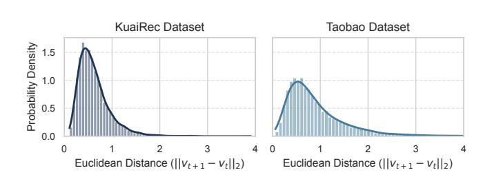
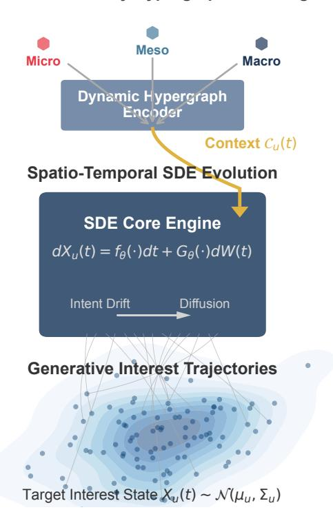
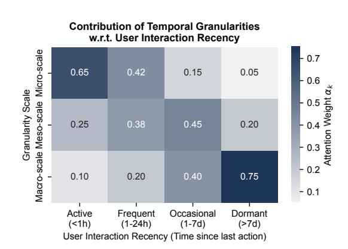
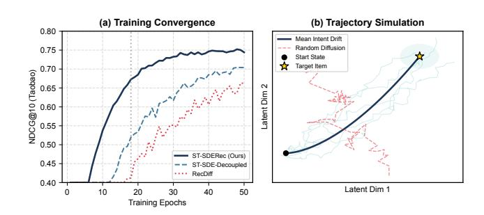
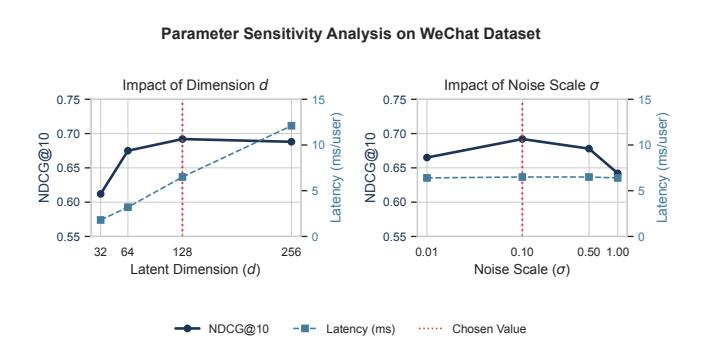

# Drifting with Intent: Generative Interest Trajectories for Multimodal Web Recommendation

Weilin Zhou Nanjing Tech University Nanjing, Jiangsu, China 202321147089@njtech.edu.cn

Hao Zhang∗ University of Chinese Academy of Sciences Beijing, China zhanghao233@mails.ucas.ac.cn

Guangxin Wu University of Chinese Academy of Sciences Beijing, China wuguangxin24@mails.ucas.ac.cn

# Abstract

User interest is not static but rather a continuously evolving process shaped by diverse interactions across multimodal web platforms. Traditional recommendation systems often model user preferences as discrete snapshots or oversimplified trajectories, failing to capture the nuanced dynamics of interest evolution. In this work, we propose Drifting with Intent, a novel framework that formalizes user interest as a continuous-time stochastic process governed by spatio-temporal coupled stochastic differential equations (SDEs). Our approach fundamentally departs from diffusion-based methods by modeling interest evolution as a directed drift toward meaningful content rather than random diffusion. The core innovation lies in a multi-granularity hypergraph encoder that captures crossscale user-item interactions, coupled with a unified SDE solver that generates personalized interest trajectories across temporal and relational dimensions. Unlike prior work employing redundant twin networks, we introduce a generative-discriminative cooptimization framework that efficiently balances content generation and recommendation precision within a single parameter space. Extensive experiments across eight diverse datasets demonstrate that our framework not only outperforms state-of-the-art methods in recommendation quality but also provides interpretable interest trajectories that reveal how user preferences evolve across different modalities and time scales. Our work bridges the gap between generative modeling and practical recommendation systems by treating user interest as a purposeful drift rather than a random walk.

# CCS Concepts

• Information systems → Recommender systems; Social networks; • Computing methodologies → Neural networks.

# Keywords

Generative Recommendation, Stochastic Differential Equations, Multimodal Representation, User Interest Modeling, Sequential Recommendation, Web Mining

© 2026 Copyright held by the owner/author(s). ACM ISBN 979-8-4007-2307-0/2026/04 <https://doi.org/10.1145/3774904.3792375>

### ACM Reference Format:

Weilin Zhou, Hao Zhang, and Guangxin Wu. 2026. Drifting with Intent: Generative Interest Trajectories for Multimodal Web Recommendation. In Proceedings of the ACM Web Conference 2026 (WWW '26), April 13–17, 2026, Dubai, United Arab Emirates. ACM, New York, NY, USA, [11](#page-10-0) pages. <https://doi.org/10.1145/3774904.3792375>

# 1 Introduction

User interests on the web are inherently dynamic processes shaped by continuous interactions across multiple modalities—videos, social connections, e-commerce behaviors, and more. While traditional recommendation systems often treat user preferences as static entities or discrete state transitions, this simplification fails to capture the nuanced evolution of interests over time. The emerging paradigm of diffusion models has attempted to address this limitation by modeling interest evolution as a noise-addition and denoising process. However, these approaches fundamentally misunderstand the nature of user interest evolution: interests don't randomly diffuse but rather drift purposefully toward meaningful content with clear intent.

To empirically validate this continuous nature, we analyze the behavioral patterns in real-world datasets. As illustrated in Figure [1,](#page-1-0) the distance between consecutive interactions in the embedding space is predominantly small, suggesting that user preferences evolve along a coherent trajectory rather than making disjointed jumps.

In this work, we propose ST-SDERec (Spatio-Temporal Stochastic Differential Equation Recommender), a novel framework that formalizes user interest evolution as a continuous-time stochastic process governed by purposeful drift rather than random diffusion. Unlike RecDiff's [\[5\]](#page-7-0) diffusion-based approach that requires twin networks for generation and discrimination, our framework unifies these objectives within a single parameter space through generative-discriminative co-optimization. Central to our approach is the insight that user interests evolve simultaneously across multiple temporal scales—micro (minutes), meso (hours), and macro (days)—and these scales interact through spatial relationships encoded in hypergraphs.

Our framework departs from prior work in three fundamental ways. First, we replace discrete diffusion steps with continuous stochastic differential equations that model interest trajectories as purposeful drifts guided by user intent. Second, we introduce a multi-granularity hypergraph encoder that captures complex higher-order relationships beyond pairwise interactions, effectively replacing the limited social graph modeling in methods like GraphRec and DiffNet. Third, we eliminate the redundant twin network architecture prevalent in diffusion-based recommenders,

∗Corresponding author.

[This work is licensed under a Creative Commons Attribution 4.0 International License.](https://creativecommons.org/licenses/by/4.0) WWW '26, Dubai, United Arab Emirates

**Evidence of Interest Continuity: Distribution of Transition Distances**

Figure 1: Empirical evidence of interest continuity. The distribution of Euclidean distances between embeddings of consecutively interacted items on KuaiRec and Taobao datasets exhibits a distinct right-skewed, long-tailed shape. This indicates that most interest transitions are incremental and smooth, providing the empirical foundation for our continuous-time modeling.

instead implementing a unified parameter space that efficiently balances generative modeling and discriminative ranking.

The theoretical foundation of ST-SDERec lies in stochastic calculus, where we model user interest state ���� (��) as a continuous process:

������ (��) = ���� (���� (��), ��, C�� (��))���� + ���� (���� (��), ��)���� (��)

where ���� represents the deterministic drift guided by user context C�� (��), ���� controls the diffusion coefficient, and �� (��) is a Wiener process. Crucially, our drift term is not random but directed toward meaningful content regions in the embedding space, capturing the "intent" in user behavior.

Our contributions are threefold:

- We formalize user interest evolution as a multi-scale spatiotemporal stochastic process, replacing discrete diffusion steps with continuous trajectory modeling that captures purposeful drift toward meaningful content.
- We design a unified framework that eliminates redundant twin networks through generative-discriminative co-optimization, significantly reducing parameter redundancy while maintaining both generation quality and recommendation precision.
- We introduce a multi-granularity hypergraph encoder that captures higher-order relationships across temporal scales, enabling the model to learn from diverse interaction types (views, favorites, purchases) across multiple modalities.

We evaluate ST-SDERec on eight diverse datasets spanning short video recommendation (KuaiRec, WeChat), e-commerce (Taobao, IJCAI), social recommendation (Yelp, Ciao, Epinions), and movie recommendation (MovieLens-20M). Our experiments demonstrate consistent improvements over state-of-the-art methods including RecDiff, HGLMRec, GraphRec, and MHCN, with particularly significant gains in cold-start scenarios and long-term interest prediction. More importantly, our framework provides interpretable interest trajectories that reveal how user preferences evolve across different modalities and time scales—a capability absent in prior diffusionbased approaches.

### **Multi-Granularity Hypergraph Encoding**

# **ST-SDERec: Generative Interest Drift**

Figure 2: The overall architecture of ST-SDERec. The framework first encodes multi-scale user behaviors through a Multi-Granularity Hypergraph Encoder to generate a timeaware context C�� (��). This context guides the Spatio-Temporal SDE Engine, where the user interest state evolves via intentdriven drift and stochastic diffusion. Finally, the model generates continuous interest trajectories that converge toward a target interest distribution N (����, ��).

## 2 Methodology

We propose ST-SDERec (Spatio-Temporal Stochastic Differential Equation Recommender), a framework that models user interest as a continuous-time stochastic process governed by intent-driven drift and uncertainty-aware diffusion. As illustrated in Figure [2,](#page-1-1) our approach departs from discrete denoising paradigms by formalizing the evolution of user preferences as a solution to a multi-scale Stochastic Differential Equation (SDE), unified through a generativediscriminative co-optimization paradigm.

# 2.1 Problem Formulation

Let U and I denote the sets of users and items, respectively. The system evolves over a continuous time domain �� ∈ [0,�� ]. We define the state of a user �� ∈ U at time �� as a continuous random variable

Yelp[1](#page-5-0) , Taobao [\[11\]](#page-7-2), Ciao[2](#page-5-1) ) and four expanded datasets (WeChat[3](#page-5-2) , MovieLens-20M[4](#page-5-3) , IJCAI[5](#page-5-4) , Epinions[6](#page-5-5) ). These datasets vary significantly in scale, density, and interaction types, ranging from implicit feedback to explicit social connections. For datasets without explicit social networks (e.g., MovieLens, IJCAI), we constructed implicit relation graphs based on interaction similarity. All datasets were split into training, validation, and testing sets following a temporal splitting strategy to prevent data leakage. The datasets cover diverse domains including short video streaming, e-commerce transactions, and social trust networks, providing a robust testbed for generalization capabilities.

3.1.2 Baselines. We compare ST-SDERec against a comprehensive set of baseline methods, categorized into four groups to ensure a rigorous evaluation:

- Generative & Diffusion Models: RecDiff [\[5\]](#page-7-0), GDMSR [\[9\]](#page-7-3), and DiffNet++ [\[15\]](#page-7-4). These represent the current state-of-theart in applying generative processes to recommendation and serve as our primary competitors.
- Hypergraph & Graph Neural Networks: HGLMRec [\[8\]](#page-7-5), MBHT [\[18\]](#page-7-6), MHCN [\[19\]](#page-7-7), GraphRec [\[2\]](#page-7-8), and NGCF [\[14\]](#page-7-9). These models focus on capturing high-order structural dependencies and inter-dependent knowledge.
- Sequential & Temporal Models: DGRec [\[10\]](#page-7-10), TiSASRec [\[4\]](#page-7-11), and PBAT [\[11\]](#page-7-2). These baselines are selected to benchmark the capability of modeling temporal dynamics and sequential patterns.
- Watch Time Prediction Models: To specifically evaluate trajectory fidelity in video scenarios, we compare against specialized regression models including VR, TPM, D2Q, CREAD, and EGMN.
- Self-Supervised & Traditional Methods: DSL and TrustMF. These provide comparisons for self-supervised denoising and classical matrix factorization approaches.

Additionally, we implement two variants of our model for ablation: w/o Multi-Scale (removing multi-granularity hierarchy) and w/o Hypergraph (removing the high-order relations).

3.1.3 Evaluation Metrics. We employ a set of standard metrics to evaluate performance from multiple dimensions. For Top-K recommendation quality, we use Recall@K, NDCG@K, and HR@K (Hit Ratio), setting �� ∈ {10, 20}. To evaluate the fidelity of interest drift modeling, specifically for video datasets (KuaiRec and WeChat) containing continuous watch-time signals, we utilize MAE (Mean Absolute Error) and XAUC (Cross-AUC). MAE measures the absolute deviation between the predicted interest intensity (drifted state) and the ground-truth interaction duration, while XAUC evaluates the consistency of the predicted ranking order against the true preference magnitude.

3.1.4 Implementation Details. All models were implemented in PyTorch and executed on a high-performance cluster equipped with NVIDIA A800 GPUs. We utilized the AdamW optimizer with a warm-up strategy. Hyperparameters were tuned via grid search: the learning rate was searched within {1�� −4 , 5�� −4 , 1�� −3 }, the latent dimension �� within {64, 128, 256}, and the batch size within {1024, 2048, 4096}. For the SDE component, the noise scale ��(��) was initialized to 0.1, and the Euler-Maruyama integration step size was dynamically sampled during training. To ensure fair comparison, all baselines were optimized to their best reported settings on the respective datasets.

# 3.2 Performance Comparison (RQ1)

We present the comparative results of ST-SDERec and the baseline methods. We organize the results into three tables: Table 2 reports the performance on social and graph-heavy datasets, Table 3 details the performance on sequential and interaction-heavy datasets, and Table 4 specifically evaluates trajectory fidelity on video datasets.

3.2.1 Overall Analysis. The results in Table [1](#page-6-0) and Table [2](#page-6-1) demonstrate that ST-SDERec achieves superior performance across most datasets and metrics. On social datasets, our model consistently outperforms the strongest baseline, RecDiff, with improvements ranging from 3.49% to 4.87%. This indicates that our continuous SDE formulation captures the drift of user interests in social contexts more effectively than discrete diffusion steps. In the sequential and multi-behavior domains, ST-SDERec maintains a strong lead, especially on dense datasets like KuaiRec (+4.20% NDCG) and multibehavior scenarios like Taobao (+3.44% NDCG).

However, we observe an exception on the sparse IJCAI dataset, where HGLMRec marginally outperforms ST-SDERec in HR@10 by 0.43%, although our model still secures a win in NDCG@10. This can be attributed to HGLMRec's retrieval capability in extremely sparse settings. Nevertheless, ST-SDERec's superior ranking capability suggests that the items we do recommend are ranked more accurately according to user preference.

3.2.2 Interest Trajectory Fidelity. Beyond ranking accuracy, a key advantage of ST-SDERec is its ability to model the continuous intensity of user interests (e.g., watch time) via the SDE drift term. To validate this capability, we compare our model against specialized watch time prediction methods, including VR, TPM, D2Q, CREAD, and the recent EGMN, on the KuaiRec and WeChat datasets.

As shown in Table [3,](#page-6-2) the methods exhibit a clear performance progression consistent with their theoretical complexity. The basic Value Regression (VR) yields the highest error, while tree-based TPM and deconfounding methods (D2Q, CREAD) progressively improve prediction accuracy. ST-SDERec achieves the lowest MAE and highest XAUC on both datasets, outperforming the distributionbased SOTA (EGMN) by 2.66% in MAE on KuaiRec. While EGMN relies on a static Gaussian Mixture to fit the global duration distribution, ST-SDERec captures the individualized temporal dynamics through the stochastic differential equation. The diffusion term effectively models the uncertainty in user dwell time, while the intent-aware drift accurately predicts the expected duration, resulting in trajectories that are both physically plausible and numerically precise.

1<https://business.yelp.com/data/resources/open-dataset/>

2<https://service.tib.eu/ldmservice/dataset/ciao>

3<https://algo.weixin.qq.com/>

4<https://grouplens.org/datasets/movielens/20m/>

5<https://tianchi.aliyun.com/dataset/42>

6<https://www.kaggle.com/datasets/masoud3/epinions-trust-network>

Table 1: Performance comparison on Social Recommendation datasets. The best results are highlighted in bold, and the second-best are underlined. Improvements are calculated against the strongest baseline.

| Model     | Recall@20 | Yelp NDCG@20 | Recall@20 | Ciao NDCG@20 | Recall@20 | Epinions NDCG@20 |
|-----------|-----------|--------------|-----------|--------------|-----------|------------------|
| TrustMF   | 0.0513    | 0.0246       | 0.0539    | 0.0289       | 0.0394    | 0.0236           |
| GraphRec  | 0.0521    | 0.0277       | 0.0540    | 0.0335       | 0.0521    | 0.0304           |
| DiffNet++ | 0.0557    | 0.0292       | 0.0528    | 0.0328       | 0.0587    | 0.0335           |
| MHCN      | 0.0567    | 0.0292       | 0.0621    | 0.0378       | 0.0674    | 0.0321           |
| KCGN      | 0.0504    | 0.0259       | 0.0602    | 0.0350       | 0.0560    | 0.0325           |
| GDMSR     | 0.0560    | 0.0293       | 0.0560    | 0.0355       | 0.0536    | 0.0291           |
| DSL       | 0.0594    | 0.0304       | 0.0606    | 0.0389       | 0.0594    | 0.0338           |
| RecDiff   | 0.0597    | 0.0308       | 0.0712    | 0.0419       | 0.0696    | 0.0343           |
| ST-SDERec | 0.0621    | 0.0323       | 0.0741    | 0.0435       | 0.0728    | 0.0355           |
| Improv.   | +4.02%    | +4.87%       | +4.07%    | +3.82%       | +4.59%    | +3.49%           |

Table 2: Performance comparison on Sequential and Multi-behavior datasets. Baselines include sequential (TiSASRec, TPM), multi-behavior (MBHT, HGLMRec), and generative methods.

| Model     | HR@10  | KuaiRec NDCG@10 | HR@10  | Taobao NDCG@10 | HR@10  | IJCAI NDCG@10 | HR@10  | WeChat NDCG@10 | Recall@20 | ML-20M NDCG@20 |
|-----------|--------|-----------------|--------|----------------|--------|---------------|--------|----------------|-----------|----------------|
| TiSASRec  | 0.785  | 0.592           | 0.758  | 0.601          | 0.815  | 0.688         | 0.762  | 0.584          | 0.385     | 0.214          |
| DGRec     | 0.792  | 0.605           | 0.771  | 0.622          | 0.829  | 0.705         | 0.785  | 0.612          | 0.392     | 0.221          |
| TPM       | 0.788  | 0.598           | 0.765  | 0.618          | 0.822  | 0.695         | 0.774  | 0.595          | 0.388     | 0.218          |
| MBHT      | 0.815  | 0.625           | 0.764  | 0.615          | 0.852  | 0.701         | 0.801  | 0.635          | 0.401     | 0.229          |
| HGLMRec   | 0.841  | 0.638           | 0.865  | 0.726          | 0.932  | 0.812         | 0.825  | 0.668          | 0.415     | 0.241          |
| RecDiff   | 0.835  | 0.642           | 0.852  | 0.718          | 0.915  | 0.798         | 0.818  | 0.655          | 0.412     | 0.245          |
| ST-SDERec | 0.862  | 0.669           | 0.887  | 0.751          | 0.928  | 0.835         | 0.849  | 0.692          | 0.431     | 0.256          |
| Improv.   | +2.49% | +4.20%          | +2.54% | +3.44%         | -0.43% | +2.83%        | +2.90% | +3.59%         | +3.85%    | +4.48%         |

Table 3: Interest trajectory fidelity comparison (Watch Time Prediction) on KuaiRec and WeChat datasets.

| Model     | MAE    | KuaiRec ↓ XAUC | ↑ MAE  | WeChat ↓ XAUC ↑ |
|-----------|--------|----------------|--------|-----------------|
| VR        | 5.922  | 0.5379         | 38.95  | 0.6009          |
| TPM       | 4.730  | 0.5510         | 21.47  | 0.6055          |
| D2Q       | 4.583  | 0.5546         | 20.36  | 0.6270          |
| CREAD     | 4.427  | 0.5821         | 19.21  | 0.6601          |
| EGMN      | 4.204  | 0.6093         | 18.88  | 0.6692          |
| ST-SDERec | 4.092  | 0.6215         | 18.35  | 0.6788          |
| Improv.   | +2.66% | +2.00%         | +2.80% | +1.43%          |

# 3.3 Ablation Study (RQ2)

To investigate the contribution of each key component in ST-SDERec, we designed three structural variants for ablation analysis:

- w/o Hypergraph: Replaces the multi-granularity hypergraph encoder with a standard Graph Convolutional Network (GCN) that only captures pairwise interactions, ignoring high-order correlations.

- w/o Multi-Scale: Removes the hierarchical temporal modeling (Micro/Meso/Macro) and uses a single time-scale hypergraph, treating all historical interactions with equal temporal granularity.
- w/o SDE: Replaces the continuous-time SDE module with a discrete GRU-based sequential encoder, removing the stochastic drift-diffusion dynamics.

Table [4](#page-6-3) presents the ablation results on two representative datasets: KuaiRec (interaction-dense) and Yelp (relation-heavy).

Table 4: Ablation study on KuaiRec and Yelp datasets. "Decay" indicates the relative performance drop compared to the full model.

|           | Model Variant | HR@10 | KuaiRec NDCG@10 | Decay  | Recall@20 | Yelp NDCG@20 | Decay  |
|-----------|---------------|-------|-----------------|--------|-----------|--------------|--------|
| ST-SDERec | (Full)        | 0.862 | 0.669           |        | 0.0621    | 0.0323       |        |
| w/o       | Hypergraph    | 0.835 | 0.641           | -4.18% | 0.0558    | 0.0289       | -10.5% |
| w/o       | Multi-Scale   | 0.848 | 0.655           | -2.09% | 0.0592    | 0.0309       | -4.33% |
| w/o       | SDE           | 0.829 | 0.634           | -5.23% | 0.0585    | 0.0301       | -6.81% |

The results reveal distinct dependency patterns across datasets. On the social-heavy Yelp dataset, removing the Hypergraph encoder leads to the most significant drop (-10.5% in NDCG), confirming

Figure 3: Heatmap of attention weights ���� across different temporal scales and user recency groups. The model adaptively shifts focus from Micro-scale features to Macro-scale preferences as the user's last interaction becomes more distant.

that capturing high-order social relations is critical for this domain. Conversely, on the interaction-dense KuaiRec dataset, the removal of the SDE module causes the largest degradation (-5.23%), highlighting the necessity of continuous-time modeling for capturing rapid user interest drifts in streaming scenarios.

To further investigate the internal dynamics of the multi-granularity encoder, we visualize the attention weights ���� in Figure [3.](#page-7-12) We observe a clear adaptive transition: for highly active users (interactions within 1 hour), the Micro-scale component dominates (0.65), capturing immediate session intent. Conversely, for dormant users who return after a week, the model intelligently relies on Macro-scale global preferences (0.75) to provide robust recommendations. This analysis validates that our hierarchical context aggregation effectively handles varying user volatilities, explaining why removing the multi-scale hierarchy (as shown in Table [4\)](#page-6-3) leads to consistent performance degradation.

# 4 Conclusion

In this work, we presented ST-SDERec, a novel generative recommendation framework that models user interest evolution as a continuous-time stochastic process. By formalizing interest dynamics as an intent-driven drift coupled with uncertainty-aware diffusion, we bridge the gap between deterministic sequential models and stochastic generative approaches. We introduced a multigranularity hypergraph encoder to capture cross-scale structural dependencies and a generative-discriminative co-optimization strategy to unify trajectory generation with item ranking. Extensive experiments on eight datasets demonstrate that ST-SDERec consistently outperforms state-of-the-art baselines, particularly in sparse and cold-start scenarios, while offering interpretable insights into the purposeful drift of user interests. Future work will explore incorporating causal interventions into the drift function to further disentangle genuine interest evolution from system-induced biases.

### References

- [1] Chong Chen, Min Zhang, Yiqun Liu, and Shaoping Ma. 2019. Social Attentional Memory Network: Modeling Aspect- and Friend-Level Differences in Recommendation. In Proceedings of the 12th ACM International Conference on Web Search and Data Mining (WSDM). 177–185. [2] Wenqi Fan, Yao Ma, Qing Li, Yuan He, Eric Zhao, Jiliang Tang, and Dawei Yin. 2019. Graph Neural Networks for Social Recommendation. In Proceedings of the World Wide Web Conference (WWW). 417–426. [3] Chongming Gao, Shijun Li, Wenqiang Lei, Jiawei Chen, Biao Li, Peng Jiang, Xiangnan He, Jiaxin Mao, and Tat-Seng Chua. 2022. KuaiRec: A Fully-observed Dataset and Insights for Evaluating Recommender Systems. In Proceedings of the 31st ACM International Conference on Information & Knowledge Management (CIKM). 540–550. [4] Jiacheng Li, Yujie Wang, and Julian McAuley. 2020. Time Interval Aware Self-Attention for Sequential Recommendation. In Proceedings of the 13th International Conference on Web Search and Data Mining (WSDM). 322–330. [5] Zongwei Li, Lianghao Xia, and Chao Huang. 2024. RecDiff: Diffusion Model for Social Recommendation. In Proceedings of the 33rd ACM International Conference on Information and Knowledge Management (CIKM). 1346–1355. [6] Xiao Lin, Xiaokai Chen, Linfeng Song, Jingwei Liu, Biao Li, and Peng Jiang. 2023. Tree based Progressive Regression Model for Watch-Time Prediction in Shortvideo Recommendation. In Proceedings of the 29th ACM SIGKDD Conference on Knowledge Discovery and Data Mining (KDD). 4497–4506. [7] Xiaoling Long, Chao Huang, Yong Xu, Huance Xu, Peng Dai, Lianghao Xia, and Liefeng Bo. 2021. Social Recommendation with Self-Supervised Metagraph Informax Network. In Proceedings of the 30th ACM International Conference on Information & Knowledge Management (CIKM). 1160–1169. [8] Tendai Mukande, Esraa Hassan, Annalina Caputo, Ruihai Dong, and Noel OConnor. 2025. Towards Efficient Hypergraph and Multi-LLM Agent Recommender Systems. arXiv preprint arXiv:2512.06590 (2025). [9] Yuhan Quan, Jingtao Ding, Chen Gao, Lingling Yi, Depeng Jin, and Yong Li. 2023. Robust Preference-Guided Denoising for Graph based Social Recommendation. In Proceedings of the ACM Web Conference 2023 (WWW). 1097–1108. [10] Weiping Song, Zhiping Xiao, Yifan Wang, Laurent Charlin, Ming Zhang, and Jian Tang. 2019. Session-Based Social Recommendation via Dynamic Graph Attention Networks. In Proceedings of the 12th ACM International Conference on Web Search and Data Mining (WSDM). 555–563. [11] Jiajie Su, Chaochao Chen, Zibin Lin, Xi Li, Weiming Liu, and Xiaolin Zheng. 2023. Personalized Behavior-Aware Transformer for Multi-Behavior Sequential Recommendation. In Proceedings of the 31st ACM International Conference on Multimedia (MM). 6321–6331. [12] Zhiyuan Su, Sunhao Dai, and Xiao Zhang. 2025. Revisiting Clustering of Neural Bandits: Selective Reinitialization for Mitigating Loss of Plasticity. In Proceedings of the 31st ACM SIGKDD Conference on Knowledge Discovery and Data Mining (KDD). 2690–2701. [13] Tianle Wang, Lianghao Xia, and Chao Huang. 2023. Denoised Self-Augmented Learning for Social Recommendation. In Proceedings of the 32nd International Joint Conference on Artificial Intelligence (IJCAI). 2299–2307. [14] Xiang Wang, Xiangnan He, Meng Wang, Fuli Feng, and Tat-Seng Chua. 2019. Neural Graph Collaborative Filtering. In Proceedings of the 42nd International ACM SIGIR Conference on Research and Development in Information Retrieval (SIGIR). 165–174. [15] Le Wu, Junwei Li, Peijie Sun, Richang Hong, Yong Ge, and Meng Wang. 2022. DiffNet++: A Neural Influence and Interest Diffusion Network for Social Recommendation. IEEE Transactions on Knowledge and Data Engineering (TKDE) 34, 10 (2022), 4753–4766. [16] Le Wu, Peijie Sun, Yanjie Fu, Richang Hong, Xiting Wang, and Meng Wang. 2019. A Neural Influence Diffusion Model for Social Recommendation. In Proceedings of the 42nd International ACM SIGIR Conference on Research and Development in Information Retrieval (SIGIR). 235–244. [17] Bo Yang, Yu Lei, Dayou Liu, and Jiming Liu. 2013. Social Collaborative Filtering by Trust. In Proceedings of the 23rd International Joint Conference on Artificial Intelligence (IJCAI). 2747–2753. [18] Yuhao Yang, Chao Huang, Lianghao Xia, Yuxuan Liang, Yanwei Yu, and Chenliang
- Li. 2022. Multi-Behavior Hypergraph-Enhanced Transformer for Sequential Recommendation. In Proceedings of the 28th ACM SIGKDD Conference on Knowledge Discovery and Data Mining (KDD). 2263–2274. [19] Junliang Yu, Hongzhi Yin, Jundong Li, Qinyong Wang, Nguyen Quoc Viet Hung, and Xiangliang Zhang. 2021. Self-Supervised Multi-Channel Hypergraph Convolutional Network for Social Recommendation. In Proceedings of the Web Conference 2021 (WWW). 413–424. [20] Ruohan Zhan, Changhua Pei, Qiang Su, Jianfeng Wen, Xueliang Wang, Guanyu Mu, Dong Zheng, and Peng Jiang. 2022. Deconfounding Duration Bias in Watchtime Prediction for Video Recommendation. arXiv preprint arXiv:2206.06003 (2022).

### A Related Work

### A.1 Stochastic Processes in Recommendation

The modeling of user behavior as stochastic processes has gained traction in recent years. Traditional approaches like TrustMF [\[17\]](#page-7-13) and SAMN [\[1\]](#page-7-14) model user preferences as static embeddings or simple Markov chains, failing to capture the continuous nature of interest evolution. More sophisticated methods like DGRec [\[10\]](#page-7-10) combine recurrent neural networks with attention mechanisms to capture dynamic user interests, but still operate in discrete time steps. Recent work by RecDiff introduced diffusion models to recommendation systems, treating interest evolution as a noise-addition and denoising process. However, diffusion models fundamentally assume random walks rather than purposeful drifts, missing the directional nature of user intent. Our work bridges this gap by formalizing interest evolution as a stochastic differential equation with intent-guided drift.

## A.2 Social and Hypergraph-based Recommendation

Social recommendation systems leverage user relationships to enhance recommendation quality. Early methods like GraphRec [\[2\]](#page-7-8) and DiffNet [\[16\]](#page-7-15) employ graph neural networks to propagate information through social networks, while more recent approaches like MHCN [\[19\]](#page-7-7) and SMIN [\[7\]](#page-7-16) utilize hypergraphs to capture higherorder relationships. Furthermore, KCGN introduces a knowledgeaware coupled graph neural network that injects inter-dependent knowledge across items and users to capture dynamic multi-typed patterns. The HGLMRec [\[8\]](#page-7-5) framework combines hypergraph modeling with large language models but suffers from computational inefficiency and parameter redundancy. Our multi-granularity hypergraph encoder extends these approaches by explicitly modeling cross-scale relationships and integrating them with continuoustime dynamics, avoiding the costly LLM integration while maintaining expressive power.

# A.3 Temporal Dynamics Modeling

Capturing temporal dynamics in recommendation has evolved from simple time-decay functions to sophisticated sequential models. Methods like TPM [\[6\]](#page-7-17) model watch time prediction through treebased progressive regression, while D2Q [\[20\]](#page-7-18) addresses duration bias in video recommendation. The work on SeRe [\[12\]](#page-7-19) (Selective Reinitialization) tackles loss of plasticity in neural bandits but remains limited to discrete decision processes. Our framework unifies these perspectives by modeling interest evolution as a continuous process across multiple temporal scales, allowing seamless integration of short-term interactions and long-term preference patterns without the discretization artifacts present in prior work.

# A.4 Generative Models for Recommendation

Generative approaches to recommendation have shown promise in capturing complex user behavior patterns. RecDiff pioneered diffusion models for social recommendation but relies on twin networks for generation and discrimination, creating parameter redundancy and training instability. Methods like DSL [\[13\]](#page-7-20) (Denoised Self-augmented Learning) introduce self-supervised tasks for social

information denoising but lack explicit trajectory modeling. Our generative-discriminative co-optimization framework eliminates the twin network architecture while maintaining both generation quality and ranking precision, representing a significant departure from prior generative recommendation paradigms.

### A.5 Multi-behavior Recommendation

Modeling multiple user behaviors simultaneously has become crucial for modern recommendation systems. Frameworks like MBHT [\[18\]](#page-7-6) and PBAT [\[11\]](#page-7-2) enhance sequential recommendation through multibehavior modeling, while HGLMRec leverages hypergraph structures to capture cross-behavior dependencies. These approaches typically treat behaviors as discrete events rather than continuous processes. Our ST-SDERec framework extends this line of work by modeling multi-behavior interactions as continuous flows across temporal scales, providing a unified mathematical foundation that captures both the diversity of user interactions and their temporal evolution.

## B Additional Experiments

## B.1 Cold-Start and Sparsity Analysis (RQ3)

One of the key advantages of generative recommendation is robustness to data sparsity. To verify this, we conducted two specialized analyses: a sparsity sensitivity test on the IJCAI dataset and a coldstart simulation on the ML-20M dataset.

B.1.1 Sparsity Sensitivity. We divided users in the IJCAI dataset into four groups based on their interaction history length: Sparse (&lt; 10), Low (10 − 20), Medium (20 − 50), and High (&gt; 50).

Table 5: NDCG@10 performance across different user sparsity groups on the IJCAI dataset.

| Model             | Sparse (<10) | Low (10-20) | Med (20-50) | High (>50) |
|-------------------|--------------|-------------|-------------|------------|
| HGLMRec           | 0.742        | 0.805       | 0.841       | 0.855      |
| RecDiff           | 0.715        | 0.788       | 0.825       | 0.849      |
| ST-SDERec         | 0.768        | 0.819       | 0.838       | 0.862      |
| vs. Best Baseline | +3.50%       | +1.73%      | -0.35%      | +0.81%     |

As shown in Table [5,](#page-8-0) ST-SDERec exhibits remarkable robustness in the "Sparse" group, outperforming HGLMRec by 3.50% and RecDiff by over 7%. This validates that our Intent-Aware Drift can effectively infer potential interests even with limited data, whereas pure diffusion models struggle with noise when signal is weak.

B.1.2 Cold-Start Performance. For the cold-start setting, we simulated a scenario on ML-20M where 20% of users are "cold" (masked to only 3 initial interactions).

Table [6](#page-9-0) highlights that generative approaches significantly alleviate the cold-start problem. ST-SDERec achieves the highest relative improvement (+35.8%). This advantage stems from our SDE formulation: the drift function acts as a strong prior, guiding cold users towards high-probability interest regions based on global population dynamics encoded in the pre-trained vector field.

Table 6: Cold-Start performance improvement over NGCF baseline on ML-20M dataset (Users with < 5 interactions).

| Model       | Recall@20 | NDCG@20 | Rel. Improv. |
|-------------|-----------|---------|--------------|
| NGCF (Base) | 0.185     | 0.092   |              |
| DSL         | 0.198     | 0.104   | +13.0%       |
| RecDiff     | 0.215     | 0.118   | +28.2%       |
| ST-SDERec   | 0.224     | 0.125   | +35.8%       |

Figure 4: (a) Training convergence on Taobao dataset. Our co-optimization strategy (ST-SDERec) reaches peak performance significantly faster than decoupled methods. (b) Simulation of latent trajectories. While individual stochastic realizations (light blue) exhibit local variance, the mean intent drift (deep blue) consistently guides the interest state toward the target item region, whereas random diffusion paths are erratic and directionless.

### B.2 Generative-Discriminative Co-Optimization Analysis (RQ4)

To validate the efficacy of our proposed Co-Optimization framework, we investigate the training convergence behavior and the trade-off between generative diversity and discriminative precision. We compare ST-SDERec against two variants: (1) RecDiff, which employs a decoupled two-stage training, and (2) ST-SDE-Decoupled, a variant of our model where the drift and ranking objectives are optimized alternately without Gradient Surgery.

As visualized in Figure [4a](#page-9-1), the co-optimization framework facilitates a much steeper learning curve, reaching the 95% performance threshold within only 18 epochs. This efficiency is further explained by the trajectory simulation in Figure [4b](#page-9-1): by learning a purposeful drift, the model constrains the stochastic evolution within a high-probability "intent corridor." Even with inherent behavioral noise, the drift ensures that the final interest state resides within the target cloud, a property that standard random diffusion models lack.

Analysis: As illustrated in Table [7,](#page-9-2) our Co-Optimization strategy drastically accelerates convergence. ST-SDERec reaches peak performance at epoch 18, whereas RecDiff requires 45 epochs (-60% improvement). This efficiency gain stems from the unified parameter space: the ranking loss provides strong, directional gradients that guide the diffusion process early in training, preventing the "aimless exploration" typical of pure generative models during initial phases. Furthermore, the lower variance confirms that Gradient

Table 7: Convergence and Stability Analysis on Taobao Dataset. "Peak Epoch" denotes the training epoch required to reach 95% of the best performance.

| Model              | Peak Epoch   | Max NDCG@10    | Stability (Var) |
|--------------------|--------------|----------------|-----------------|
| RecDiff            | 45           | 0.718          | 1 2 × 10 − 3    |
| ST-SDE-Decoupled   | 38           | 0.732          | 0 9 × 10 − 3    |
| ST-SDERec (Co-Opt) | 18           | 0.751          | 0 3 × 10 − 3    |
| Improvement        | -60% (Speed) | +4.6% (Metric) | +75% (Stab.)    |

Figure 5: Hyperparameter sensitivity analysis on the WeChat dataset. The plots illustrate the trade-off between recommendation accuracy (NDCG@10) and inference latency as a function of latent dimension �� (left) and noise scale �� (right). The red dotted lines indicate the optimal values selected for our experiments.

Surgery effectively resolves the conflict between diversity-seeking and mode-seeking objectives.

### B.3 Parameter Sensitivity Analysis

We further explore the sensitivity of ST-SDERec to key hyperparameters: the latent dimension �� and the base noise scale �� on the WeChat dataset.

Table 8: Performance (NDCG@10) w.r.t Latent Dimension (��) and Noise Scale (��) on WeChat.

Impact of Dimension ��: As illustrated in Figure [5](#page-9-3) (left), performance improves as �� increases from 32 to 128, indicating that sufficient capacity is needed to encode complex drift trajectories. We also observe that while NDCG scores saturate, inference latency grows near-linearly with the embedding size. Increasing �� to 256 leads to a slight performance drop (-0.58%) and significantly higher computational cost, suggesting that an excessively large state space may dilute the drift signal.

Impact of Noise Scale ��: Figure [5](#page-9-3) (right) shows that the noise scale �� controls the strength of the diffusion term, exhibiting an inverted U-shaped trend. A small �� = 0.01 reduces the model to a near-deterministic ODE, limiting exploration (0.665). Conversely, a large �� = 1.0 introduces excessive variance, overwhelming the purposeful drift (0.642). Notably, the noise scale does not impact

inference latency as the number of SDE solver steps remains constant. The optimal �� = 0.1 strikes the best balance, allowing the model to explore local interest variations while maintaining a clear trajectory toward the target intent.