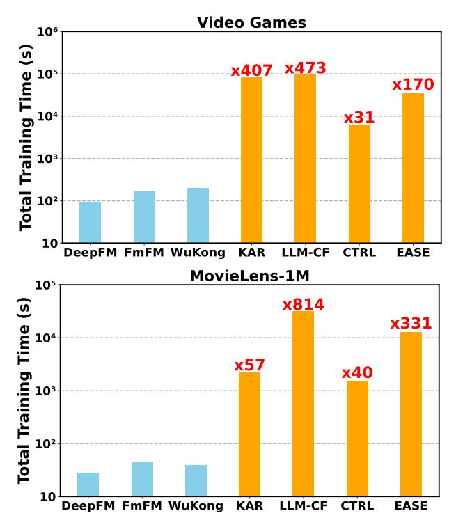
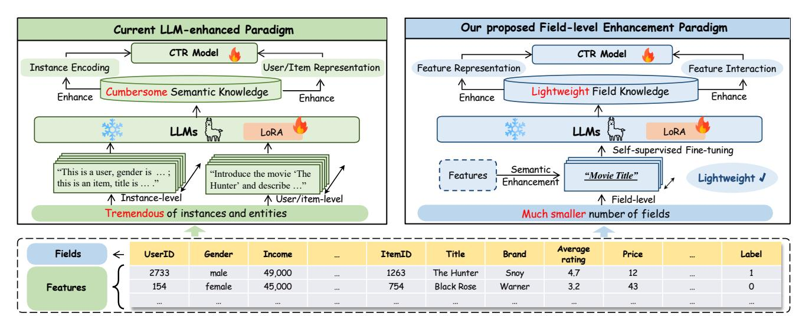
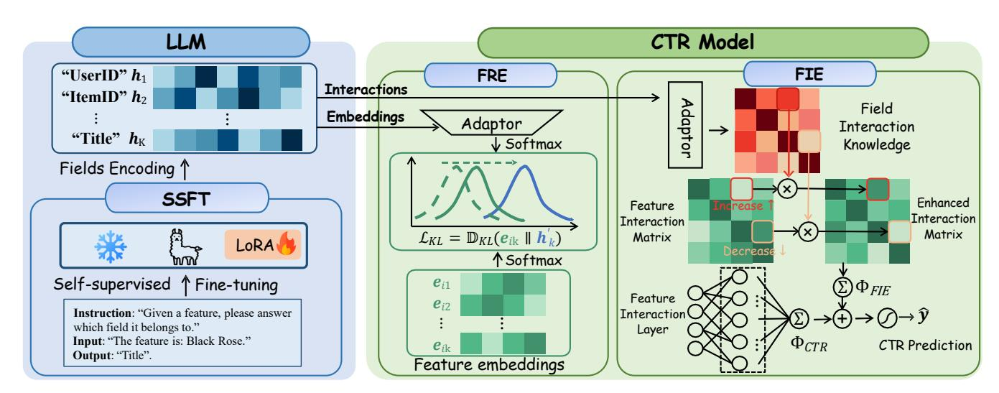
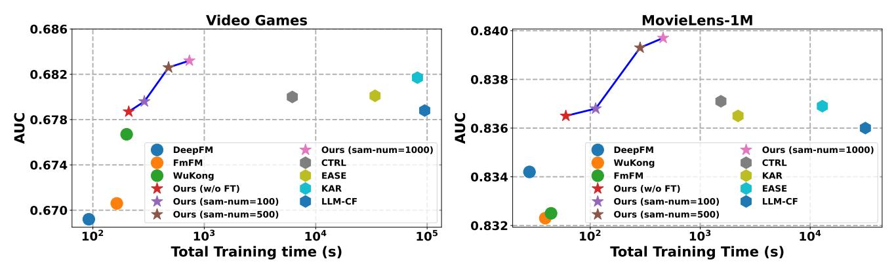
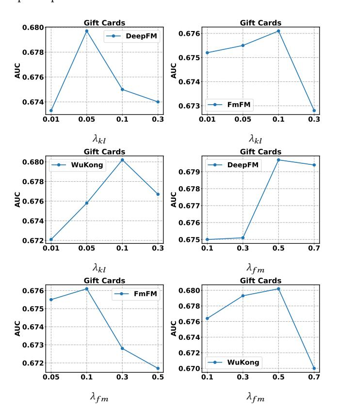

# Field Matters: A Lightweight LLM-enhanced Method for CTR Prediction

[Yu Cui](https://orcid.org/0009-0001-6203-3022)†‡ Zhejiang University Hangzhou, China cuiyu23@zju.edu.cn

[Feng Liu](https://orcid.org/0009-0004-9265-9431) OPPO Research Institute Shenzhen, China liufeng4hit@gmail.com

[Jiawei Chen](https://orcid.org/0000-0002-4752-2629)∗†‡§ Zhejiang University Hangzhou, China sleepyhunt@zju.edu.cn

[Xingyu Lou](https://orcid.org/0009-0003-3180-0668) OPPO Research Institute Shenzhen, China louxingyu@oppo.com

[Changwang Zhang](https://orcid.org/0009-0004-4193-7833) OPPO Research Institute Shenzhen, China changwangzhang@foxmail.com

[Jun Wang](https://orcid.org/0000-0002-0481-5341) OPPO Research Institute Shenzhen, China junwang.lu@gmail.com

[Yuegang Sun](https://orcid.org/0009-0009-2701-4641) Intelligence Indeed Hangzhou, China bulutuo@i-i.ai

[Xiaohu Yang](https://orcid.org/0000-0003-4111-4189)† Zhejiang University Hangzhou, China yangxh@zju.edu.cn

[Can Wang](https://orcid.org/0000-0002-5890-4307)†§ Zhejiang University Hangzhou, China wcan@zju.edu.cn

# Abstract

Click-through rate (CTR) prediction is a fundamental task in modern recommender systems. In recent years, the integration of large language models (LLMs) has been shown to effectively enhance the performance of traditional CTR methods. However, existing LLM-enhanced methods often require extensive processing of detailed textual descriptions for large-scale instances or user/item entities, leading to substantial computational overhead. To address this challenge, this work introduces LLaCTR, a novel and lightweight LLM-enhanced CTR method that employs a field-level enhancement paradigm. Specifically, LLaCTR first utilizes LLMs to distill crucial and lightweight semantic knowledge from small-scale feature fields through self-supervised field-feature fine-tuning. Subsequently, it leverages this field-level semantic knowledge to enhance both feature representation and feature interactions. In our experiments, we integrate LLaCTR with six representative CTR models across four datasets, demonstrating its superior performance in terms of both effectiveness and efficiency compared to existing LLM-enhanced methods. Our code is available at [https:](https://github.com/istarryn/LLaCTR) [//github.com/istarryn/LLaCTR.](https://github.com/istarryn/LLaCTR)

# CCS Concepts

• Information systems → Recommender systems.

# Keywords

Large language Model, CTR Prediction, Recommender Systems

∗Corresponding author.

[This work is licensed under a Creative Commons Attribution 4.0 International License.](https://creativecommons.org/licenses/by/4.0)

WWW '26, Dubai, United Arab Emirates © 2026 Copyright held by the owner/author(s). ACM ISBN 979-8-4007-2307-0/2026/04 <https://doi.org/10.1145/3774904.3792387>

#### ACM Reference Format:

Yu Cui, Feng Liu, Jiawei Chen, Xingyu Lou, Changwang Zhang, Jun Wang, Yuegang Sun, Xiaohu Yang, and Can Wang. 2026. Field Matters: A Lightweight LLM-enhanced Method for CTR Prediction. In Proceedings of the ACM Web Conference 2026 (WWW '26), April 13–17, 2026, Dubai, United Arab Emirates. ACM, New York, NY, USA, [12](#page-11-0) pages. [https://doi.org/10.1145/](https://doi.org/10.1145/3774904.3792387) [3774904.3792387](https://doi.org/10.1145/3774904.3792387)

# 1 Introduction

Click-through rate (CTR) prediction [\[54\]](#page-9-0) is a core task in modern recommender systems (RS) [\[5,](#page-8-0) [58\]](#page-9-1), with the objective of estimating the likelihood that a user will click on a specific item by modeling complex feature interactions. With the advent of Large Language Models (LLMs) and their remarkable abilities in content comprehension and semantic reasoning [\[1,](#page-8-1) [11\]](#page-8-2), there has been a surge of interest in leveraging LLMs for CTR prediction. Recent studies mainly explored two paradigms: 1) LLMs as CTR predictors [\[3,](#page-8-3) [13,](#page-8-4) [14\]](#page-8-5), where LLMs are either prompted or fine-tuned to directly perform CTR prediction; 2) LLM-enhanced CTR models [\[22,](#page-8-6) [36,](#page-8-7) [41,](#page-8-8) [51\]](#page-9-2), where LLMs are leveraged to augment traditional CTR models by injecting semantic knowledge.

Despite their encouraging performance, these approaches encounter significant practical limitations, particularly regarding computational efficiency and economic feasibility. The high computational demands of LLMs make their direct deployment for online CTR prediction largely impractical, as they introduce considerable inference latency that violates real-time serving requirements. Although the second paradigm alleviates inference latency by retaining conventional CTR models for online serving, it still suffers prohibitive training costs. Specifically, these methods typically operate at the instance level [\[22,](#page-8-6) [24,](#page-8-9) [41\]](#page-8-8) or the user/item level [\[36,](#page-8-7) [50,](#page-9-3) [51\]](#page-9-2), requiring LLMs to process detailed textual descriptions for largescale data instances or user/item entities. Empirically, we find that existing LLM-enhanced CTR methods (e.g., KAR[\[51\]](#page-9-2), LLM-CF[\[41\]](#page-8-8), CTRL[\[22\]](#page-8-6) and EASE [\[36\]](#page-8-7)) require over 290 times (on average) more computation time than baseline models on typical Amazon Video Games and MovieLens-1M datasets with millions of interactions (cf.

† State Key Laboratory of Blockchain and Data Security, Zhejiang University.

‡College of Computer Science and Technology, Zhejiang University.

§Hangzhou High-Tech Zone (Binjiang) Institute of Blockchain and Data Security.

Figure 1: Empirical efficiency study on representative conventional CTR models and LLM-enhanced CTR models. The multiple increase in time cost is reported based on WuKong.

Figure [1\)](#page-1-0). These challenges naturally motivate a critical research question: How can we leverage LLMs to enhance CTR models in a more efficient and cost-effective manner?

To address this challenge, we explore a novel field-level enhancement paradigm that utilizes LLMs to extract semantic knowledge from feature fields to enhance CTR models. As illustrated in Figure [2,](#page-2-0) fields denote categories of features in CTR prediction. This paradigm offers two principal advantages: 1) Computational Efficiency: The number of fields is orders of magnitude lower than that of instances or entities (e.g., hundreds vs. millions in the real RS), yielding a drastic reduction in LLM computational overhead. 2) Crucial Semantic Information: Conventional CTR methods primarily utilize field IDs as categorical indicators, often neglecting the rich semantic information inherent in field descriptions. In fact, field semantics can significantly enhance both feature representation and feature interaction modeling — the two core components contributing the success of CTR prediction. For example, recognizing that the feature "4.7" belongs to the field "average rating" provides insight into item quality; understanding the relationship between fields such as "user income" and "item price" can inform the importance of feature interactions. Although field-level semantic knowledge may not be as rich as cumbersome instance-level semantic information, its conciseness and importance offer substantial potential for improving model performance.

Motivated by these analyses, we introduce LLaCTR, a novel Lightweight LLM-enhanced CTR method through field-level enhancement, comprising two key components:

- Self-supervised Field-feature Fine-tuning. While LLMs are pre-trained on open-domain corpora, they may lack domainspecific knowledge relevant to recommender systems. This limitation can hinder the quality of the distilled field semantic knowledge. To address this, we design a self-supervised task where the LLM is prompted to predict the field to which a given feature belongs. This fine-tuning leverages rich domain knowledge encoded in feature-field relationships, enabling the LLM to better understand the field semantics. Notably, since the number of fields is small and fine-tuning only requires a limited sample of features, this approach is more efficient than directly extracting instance or user/item-level knowledge as in prior work.
- Field Semantic-guided Enhancement. We further utilize the field semantic knowledge (i.e., field semantic embeddings) distilled from LLMs to enhance traditional CTR models in two key aspects: 1) field embeddings are utilized to guide the learning of feature embeddings via a specific alignment loss, injecting semantic knowledge into feature representations; 2) field embeddings are transformed into field interaction matrix through a dedicated network to supplement and enhance feature interaction modeling.

Notably, LLaCTR is both flexible and lightweight, allowing for seamless integration into existing CTR models as a plug-and-play enhancement. In our experiments, we incorporate LLaCTR into six conventional CTR methods and observe significant performance improvements across four real-world datasets (with an average increase of 2.24%). Moreover, LLaCTR outperforms recent LLMenhanced methods while incurring substantially lower computational overhead (by a factor of 10–100 times).

Overall, this work makes the following contributions:

- We identify the limitations of existing LLM-based CTR methods and advocate for leveraging field-level semantic knowledge to efficiently enhance traditional CTR models.
- We propose a novel LLM-enhanced CTR method, LLaCTR, which employs self-supervised fine-tuning to distill high-quality field knowledge from LLMs and integrates this knowledge to improve both feature representation and feature interaction modeling.
- We conduct extensive experiments to demonstrate that LLaCTR significantly improves the accuracy of traditional CTR models while being highly efficient and cost-effective.

#### 2 Preliminaries

# 2.1 Task Formulation

This work focuses on click-through rate (CTR) prediction [\[25,](#page-8-10) [47\]](#page-9-4), a core task in many personalized services (e.g., recommender systems). Let D = {(X�� , ����)}�� ��=1 denote the training dataset of user-item historical interaction records, where X�� = [x��1, x��2, . . . , x���� ] represents the input features across ��-field for the ��-th instance, and x���� denotes the feature of the ��-th field for the instance. In general, x���� is a vector that can represent categorical, multi-valued, numerical features, etc. The label ���� ∈ {1, 0} indicates whether the user has clicked on the item in this instance. The goal of CTR is to learn a model from D that can accurately predict the click probability of a new instance.

Figure 2: Current LLM-enhanced CTR paradigm versus our field-level enhancement paradigm.

## 2.2 Traditional CTR Models

Traditional CTR models [\[15,](#page-8-11) [34,](#page-8-12) [35,](#page-8-13) [38,](#page-8-14) [40,](#page-8-15) [56\]](#page-9-5) primarily adopt deep learning paradigms and can generally be abstracted into three core components:

1) Feature Embedding Layer. Given the high-dimensional and sparse nature of raw input features, feature embedding is commonly employed to map the raw features into dense representations:

E�� = EmbeddingLayer(X��), (1)

where E�� = [e��1, e��2, . . . , e���� ] ∈ R ��×�� represents the learned feature embeddings of the instance X�� , with e���� denoting the D-dimensional embedding vector for ��-th field feature.

2) Feature Interaction Layer. This crucial component is designed to effectively capture the complex feature interactions:

Φ(X��) = FeatureInteraction(X�� , E��), (2)

where Φ(·) is the hidden representation learned from feature interactions. Among various architectures, the most representative one is the factorization machine (FM) [\[38\]](#page-8-14), which explicitly model bi-level feature interactions:

Φ���� (X�� ) = ��0 + ∑︁�� ��=1 w�� �� x���� + ∑︁�� ��=1 ∑︁�� ��=��+1 �� (x���� x���� �� <e����, e���� >), (3)

where��0, w�� denotes the learnable weights, and &lt; ·, · &gt; denotes the inner product of two vectors; �� (.) denotes the sum of all elements in the matrix. For convenience, here we adopt vector notation to represent the formula of Factorization Machines (FM), which is mathematically equivalent to the original formulation presented in [\[38\]](#page-8-14). The features are explicitly bi-level interacted with x����x���� �� and its contribution is controlled by their embeddings <e����, e����>.

Building on FM, recent works have explored various extensions [\[32,](#page-8-16) [42,](#page-8-17) [52\]](#page-9-6), such as introducing field-aware matrices [\[19,](#page-8-18) [35,](#page-8-13) [40\]](#page-8-15) or incorporating neural layers [\[15,](#page-8-11) [57\]](#page-9-7). Meanwhile, other studies have proposed novel architectures, such as convolution operator [\[23,](#page-8-19) [28\]](#page-8-20) and self-attention [\[59,](#page-9-8) [60\]](#page-9-9), to better capture complex feature interactions.

3) Prediction Layer. Finally, the prediction layer transforms Φ(X��) into the model prediction ��ˆ�� :

��ˆ�� = �� [PredictionLayer(Φ(X��))], (4)

where ��(·) is the sigmoid function. The model is typically optimized with the binary cross-entropy (BCE) loss [\[33\]](#page-8-21) with:

L������ (��,��ˆ) = − 1 �� ∑︁�� ��=1 [���� log (��ˆ��) + (1 − ����) log (1 − ��ˆ��)] , (5)

While these traditional CTR models have made significant progress in the past few decades, they often suffer from the semantic information loss. Specifically, some methods rely solely on field IDs as categorical indicators [\[19,](#page-8-18) [35,](#page-8-13) [40\]](#page-8-15), neglecting the rich semantic information in field descriptions. This limitation motivates our use of LLMs to enhance traditional CTR models with field-level semantic knowledge.

# 2.3 LLM-enhanced CTR Models

To fully exploit semantic knowledge, LLMs have been extensively investigated for enhancing traditional CTR models. As illustrated in Figure [2,](#page-2-0) existing LLM-enhanced CTR methods primarily operate at the instance level or user/item level. Typically, these approaches first organize the features of users, items, or instances into textual descriptions, which are then provided as prompts to the LLM for reasoning or summarization. The resulting semantic knowledge, often at the user/item or instance level, is further encoded into semantic embeddings to augment traditional CTR models.

However, due to the large scale of users/items and instances in real-world applications, such strategies incur prohibitive computational costs during training, inference and encoding. For example, on representative datasets such as Amazon Video Games and MovieLens-1M, the total training time of existing LLM-enhanced CTR methods (e.g., KAR [\[51\]](#page-9-2), LLM-CF [\[41\]](#page-8-8), CTRL [\[22\]](#page-8-6) and EASE [\[36\]](#page-8-7)) is over 290 times (on average) that of standard CTR models on average (as shown in Figure [1\)](#page-1-0). Moreover, the complex and voluminous semantic knowledge generated at the user/item or instance level is often difficult for traditional CTR models to effectively

|              | Template of Self-supervised Instruction Tuning                                                                   |
|--------------|------------------------------------------------------------------------------------------------------------------|
| Instruction  | : Given a feature, please answer which field it belongs to. Please select the field name from the candidate set. |
|              | The feature is: “ Black Rose ” . The candidate set is: [User ID,                                                 |
|              | Gender, Age, Occupation, Movie ID, Movie Title, … ].                                                             |
| Output       | : Movie Title.                                                                                                   |
| Feature Name | Field Candidate Set Field Name                                                                                   |
| Input        | :                                                                                                                |

less than 100) rather than millions of instances or user/item pairs in the experimental datasets. Some readers may be concerned about the potential inefficiency of self-supervised fine-tuning. However, this process is also lightweight, as it only requires sampling a small number of features per field for training. For example, sampling just 500 features per field is sufficient to achieve significantly better performance compared to recent LLM-enhanced methods, while incurring substantially lower training time. Empirical comparisons of efficiency can be found in Figure [5.](#page-6-0) The detailed time efficiency analyses of LLaCTR and other LLM-enhanced baselines are provided in Section [4.2.2.](#page-6-1)

#### 3.2 Feature Representation Enhancement (FRE)

The quality of feature representations is critical for the success of CTR models. However, existing methods often overlook the semantic knowledge contained in field descriptions [\[24,](#page-8-9) [51\]](#page-9-2). To address this, we transfer the field semantic knowledge distilled from LLMs to enhance feature embeddings.

Given the embedding space gap between LLMs and CTR models, we first map original field embeddings ℎ�� into the embedding space of CTR models using a learnable adaptor:

h ′ �� = Adaptor(h�� ), (9)

where Adaptor(·) can be implemented as a simple linear transformation. We then align feature embeddings with their corresponding field embeddings through normalized KL-divergence [\[43\]](#page-8-23):

h ′ �� ← Softmax(h ′ �� ), e���� ← Softmax(e���� ), (10)

L���� = ∑︁�� ��=1 ∑︁�� ��=1 DKL (e����, h ′ �� ) = ∑︁�� ��=1 ∑︁�� ��=1 e���� · ln(e���� /h ′ �� ). (11)

Specifically, here we employ normalized KL-divergence, as it eliminates the influence of embedding magnitude and focuses on aligning the underlying distributions. We also experimented with other commonly used alignment losses, such as contrastive loss, but found that normalized KL-divergence consistently yields superior performance (see Appendix [B.2.2](#page-11-2) for details). By minimizing L����, feature embeddings are able to absorb semantic knowledge from the field embeddings, resulting in higher-quality representations. Intuitively, the field semantic embeddings serve as prototypes, encouraging the feature embeddings close to these semantic centers during training.

The overall training objective combines semantic alignment with the original CTR objective:

L = L������ + ������L����, (12)

where hyperparameter ������ balances their contributions.

# 3.3 Feature Interaction Enhancement (FIE)

Field information has been shown beneficial to improve feature interaction modeling in CTR tasks [\[19,](#page-8-18) [38,](#page-8-14) [40\]](#page-8-15). However, these traditional method only utilize field ID information by employing implicit embedding layers [\[19\]](#page-8-18) or learnable parameters matrices [\[38,](#page-8-14) [40\]](#page-8-15), without taking the textual information of fields into account. Field semantic information provides new insights into feature interactions. For example, semantically, interactions between the features belonging to "user income" and "item price" are likely highly useful for click prediction.

Table 1: Statistics of the datasets.

| Dataset      | Gift Cards | Video Games     | Digital Music   | MovieLens-1M  |
|--------------|------------|-----------------|-----------------|---------------|
| #Field       | 13         | 13              | 13              | 8             |
| #Feature     | 1,981,330  | 60,119,995      | 1,695,642       | 9,001,881     |
| #User        | 132,732    | 2,766,656       | 100,952         | 6,040         |
| #Item        | 1,137      | 137,249         | 70,511          | 3,706         |
| #Interaction | 152,410    | 4,624,615       | 130,434         | 1,000,209     |
| Density      | 1 01 × 10  | − 3 1 22 × 10 − | 5 1 83 × 10 − 5 | 4 47 × 10 − 2 |

To leverage this insight, we first compute the importance of feature interactions of two fields based on their semantic embeddings:

�� ���� = FieldInteraction(h�� , h��), (13)

where FieldInteraction(·) denotes the field interaction layer, which can be implemented by various architecture. In practice, we find that cosine similarity is effective — intuitively, the fields with similar semantic may provide more insights on prediction. For convenience, we collect all pairwise field interaction scores into a matrix M�� . Subsequently, we employ a learnable adaptor to re-scale these importance scores, i.e., M ′ = Adaptor(M�� ), where the adaptor can be simply implemented via a linear layer.

The field-aware importance scores derived from semantic embeddings are then utilized to guide the learning of feature interactions. Specifically, we explicitly incorporate these scores into a bi-level feature interaction modeling, thereby enhancing the feature interaction layer of CTR methods:

Φ ������ (X�� ) = Φ(X�� ) + ���� �� · ∑︁�� ��=1 ∑︁�� ��=��+1 �� (x���� x���� �� <e����, e���� �� >�� ′ ���� ), (14)

where the field-aware importance score�� ′ ���� modulates the strength of feature interactions. Here, we augment the original feature interaction layer by integrating an additional field-aware feature interaction component, with ���� �� controlling the relative contribution of the two components.

Notably, our proposed feature interaction enhancement strategy can be seamlessly integrated into a wide range of existing CTR models. This generality motivates our approach of introducing a supplementary field-aware feature interaction component, rather than modifying the inherent feature interaction architecture of each model. In our experiments, we incorporate our LLaCTR module into six representative CTR methods, and observe substantial performance improvements across almost all cases. Detailed results are presented in Section [4,](#page-4-0) and the implementation details are provided in the Appendix [A.](#page-9-10)

#### 4 Experiments

We aim to answer the following research questions:

- RQ1 : How does LLaCTR perform compared with the state-ofthe-art CTR methods?
- RQ2 : How is the efficiency of LLaCTR compared with existing LLM-enhanced CTR methods?
- RQ3 : What are the impacts of different components of LLaCTR?

# 4.1 Experimental Setup

4.1.1 Datasets. Following previous work [\[24,](#page-8-9) [51\]](#page-9-2), we conduct experiments on four widely used public datasets in LLM-enhanced

Table 2: Performance comparisons of LLaCTR with existing PLM/LLM-enhanced methods. The results of PLM-enhanced methods are reported on their best backbones. The best result is bolded and the blue-colored zone indicates that LLaCTR is better than the basic CTR backbone. The mark "\*" indicates the improvement is statistically significant (��-value &lt; 0.05).

| Method           | Logloss | Gift Cards ↓ AUC | ↑ RelaImpr | Logloss | Video ↓ AUC | Games ↑ RelaImpr | Logloss | Digital ↓ AUC | Music ↑ RelaImpr | Logloss | MovieLens-1M ↓ AUC | ↑ RelaImpr |
|------------------|---------|------------------|------------|---------|-------------|------------------|---------|---------------|------------------|---------|--------------------|------------|
| CELA             | 0.4658  | 0.6746           | 1.02%      | 0.5798  | 0.6775      | 0.44%            | 0.3364  | 0.7638        | 0.37%            | 0.4031  | 0.8373             | 0.24%      |
| ClickPrompt      | 0.4656  | 0.6754           | 1.48%      | 0.5747  | 0.6799      | 1.79%            | 0.3356  | 0.7652        | 0.90%            | 0.4025  | 0.8379             | 0.42%      |
| Base             | 0.4606  | 0.6621           |            | 0.5805  | 0.6673      |                  | 0.3359  | 0.7612        |                  | 0.4081  | 0.8354             |            |
| KAR              | 0.4551  | 0.6643           | 1.34%      | 0.5803  | 0.6705      | 1.93%            | 0.3410  | 0.7607        | -0.21%           | 0.4073  | 0.8358             | 0.13%      |
| LLM-CF FM        | 0.4580  | 0.6666           | 2.77%      | 0.5805  | 0.6682      | 0.58%            | 0.3351  | 0.7633        | 0.78%            | 0.4128  | 0.8337             | -0.50%     |
| CTRL             | 0.4595  | 0.6636           | 0.93%      | 0.5802  | 0.6708      | 2.13%            | 0.3360  | 0.7611        | -0.04%           | 0.4128  | 0.8336             | -0.53%     |
| EASE             | 0.4534  | 0.6667           | 2.84%      | 0.5804  | 0.6701      | 1.69%            | 0.3359  | 0.7625        | 0.48%            | 0.4101  | 0.8357             | 0.10%      |
| LLaCTR           | 0.4500  | 0.6673           | 3.21%*     | 0.5801  | 0.6718      | 2.70%*           | 0.3362  | 0.7621        | 0.32%            | 0.4050  | 0.8364             | 0.30%*     |
| Base             | 0.4751  | 0.6713           |            | 0.5762  | 0.6692      |                  | 0.3478  | 0.7582        |                  | 0.4190  | 0.8342             |            |
| KAR              | 0.4753  | 0.6778           | 3.80%      | 0.5871  | 0.6720      | 1.65%            | 0.3439  | 0.7587        | 0.18%            | 0.4207  | 0.8335             | -0.20%     |
| LLM-CF DeepFM    | 0.4723  | 0.6736           | 1.36%      | 0.5769  | 0.6730      | 2.28%            | 0.3441  | 0.7588        | 0.21%            | 0.4140  | 0.8353             | 0.34%      |
| CTRL             | 0.4746  | 0.6744           | 1.83%      | 0.5757  | 0.6758      | 3.92%            | 0.3432  | 0.7576        | -0.26%           | 0.4142  | 0.8352             | 0.31%      |
| EASE             | 0.4748  | 0.6739           | 1.52%      | 0.5807  | 0.6738      | 2.74%            | 0.3360  | 0.7604        | 0.83%            | 0.4180  | 0.8349             | 0.22%      |
| LLaCTR           | 0.4657  | 0.6797           | 4.90%*     | 0.5834  | 0.6744      | 3.10%*           | 0.3350  | 0.7687        | 4.06%*           | 0.4049  | 0.8354             | 0.38%*     |
| Base             | 0.4664  | 0.6691           |            | 0.5762  | 0.6683      |                  | 0.3420  | 0.7553        |                  | 0.4017  | 0.8365             |            |
| KAR              | 0.4661  | 0.6694           | 0.19%      | 0.5791  | 0.6741      | 3.42%            | 0.3432  | 0.7575        | 0.88%            | 0.4020  | 0.8360             | -0.15%     |
| LLM-CF FwFM      | 0.4672  | 0.6698           | 0.47%      | 0.5806  | 0.6702      | 1.13%            | 0.3397  | 0.7567        | 0.57%            | 0.4044  | 0.8371             | 0.18%      |
| CTRL             | 0.4679  | 0.6699           | 0.50%      | 0.5776  | 0.6755      | 4.28%            | 0.3414  | 0.7561        | 0.33%            | 0.4004  | 0.8372             | 0.21%      |
| EASE             | 0.4661  | 0.6703           | 0.74%      | 0.5795  | 0.6765      | 4.84%            | 0.3415  | 0.7571        | 0.71%            | 0.4030  | 0.8369             | 0.12%      |
| LLaCTR           | 0.4659  | 0.6718           | 1.61%*     | 0.5827  | 0.6780      | 5.73%*           | 0.3362  | 0.7585        | 1.27%*           | 0.4014  | 0.8367             | 0.05%      |
| Base             | 0.4579  | 0.6747           |            | 0.5824  | 0.6706      |                  | 0.3315  | 0.7628        |                  | 0.4077  | 0.8325             |            |
| KAR              | 0.4595  | 0.6754           | 0.42%      | 0.5767  | 0.6711      | 0.29%            | 0.3347  | 0.7640        | 0.43%            | 0.4062  | 0.8332             | 0.21%      |
| LLM-CF FmFM      | 0.4652  | 0.6740           | -0.43%     | 0.5877  | 0.6709      | 0.20%            | 0.3317  | 0.7627        | -0.04%           | 0.4066  | 0.8329             | 0.11%      |
| CTRL             | 0.4593  | 0.6751           | 0.21%      | 0.5826  | 0.6714      | 0.47%            | 0.3310  | 0.7650        | 0.82%            | 0.4059  | 0.8332             | 0.21%      |
| EASE             | 0.4590  | 0.6753           | 0.33%      | 0.5750  | 0.6729      | 1.35%            | 0.3311  | 0.7637        | 0.33%            | 0.4056  | 0.8334             | 0.27%      |
| LLaCTR           | 0.4560  | 0.6761           | 0.78%*     | 0.5725  | 0.6765      | 3.45%*           | 0.3323  | 0.7615        | -0.50%           | 0.4055  | 0.8335             | 0.30%*     |
| Base             | 0.4774  | 0.6720           |            | 0.5830  | 0.6761      |                  | 0.3423  | 0.7557        |                  | 0.4086  | 0.8301             |            |
| KAR              | 0.4881  | 0.6726           | 0.35%      | 0.5820  | 0.6817      | 3.19%            | 0.3429  | 0.7546        | -0.41%           | 0.4094  | 0.8290             | -0.33%     |
| LLM-CF FinalMLP  | 0.4781  | 0.6731           | 0.62%      | 0.5845  | 0.6785      | 1.36%            | 0.3369  | 0.7560        | 0.13%            | 0.4041  | 0.8299             | -0.06%     |
| CTRL             | 0.4719  | 0.6781           | 3.55%      | 0.5835  | 0.6790      | 1.65%            | 0.3399  | 0.7561        | 0.15%            | 0.4033  | 0.8328             | 0.82%      |
| EASE             | 0.4773  | 0.6736           | 0.93%      | 0.5776  | 0.6796      | 1.97%            | 0.3414  | 0.7560        | 0.12%            | 0.4049  | 0.8309             | 0.24%      |
| LLaCTR           | 0.4717  | 0.6818           | 5.71%*     | 0.5738  | 0.6832      | 4.02%*           | 0.3411  | 0.7552        | -0.19%           | 0.4009  | 0.8340             | 1.18%*     |
| Base             | 0.4755  | 0.6728           |            | 0.5819  | 0.6767      |                  | 0.3402  | 0.7514        |                  | 0.4088  | 0.8323             |            |
| KAR              | 0.4794  | 0.6721           | -0.43%     | 0.5927  | 0.6758      | -0.53%           | 0.3429  | 0.7506        | -0.31%           | 0.4099  | 0.8316             | -0.21%     |
| LLM-CF WuKong    | 0.4756  | 0.6752           | 1.36%      | 0.5805  | 0.6788      | 1.15%            | 0.3379  | 0.7560        | 1.83%            | 0.4084  | 0.8293             | -0.90%     |
| CTRL             | 0.4753  | 0.6769           | 2.37%      | 0.5792  | 0.6800      | 1.84%            | 0.3399  | 0.7561        | 1.85%            | 0.4029  | 0.8367             | 1.31%      |
| EASE             | 0.4748  | 0.6758           | 1.71%      | 0.5783  | 0.6801      | 1.91%            | 0.3381  | 0.7556        | 1.67%            | 0.4031  | 0.8334             | 0.33%      |
| LLaCTR           | 0.4745  | 0.6802           | 4.24%*     | 0.5763  | 0.6819      | 2.91%*           | 0.3377  | 0.7564        | 1.99%*           | 0.4027  | 0.8397             | 2.21%*     |
| Average RelaImpr |         | 3.41%            |            |         | 3.65%       |                  |         | 1.16%         |                  |         | 0.74%              |            |

CTR task: Amazon Gift Cards, Amazon Video Games, Amazon Digital Music and MovieLens-1M.

- Amazon Review Datasets[1](#page-5-0) are well-known e-commercial datasets [\[2,](#page-8-24) [22,](#page-8-6) [24,](#page-8-9) [41\]](#page-8-8) with ratings ranging from 1 to 5. Following [\[24\]](#page-8-9), we binarize the ratings with a threshold of 4 and use the 5-core setting, i.e., all users and items have at least 5 interactions.
- MovieLens-1M Dataset[2](#page-5-1) is a benchmark movie recommendation dataset from Movielens with ratings ranging from 1 to 5. We binarize the ratings with a threshold of 4, while removing neutral samples with ratings equal to 3 following [\[22\]](#page-8-6).

The dataset statistics are summarized in Table [1.](#page-4-1) Following [\[22,](#page-8-6) [24\]](#page-8-9), we organize the review behaviors in ascending order of timestamps to partition each dataset into training, validation, and testing sets with ratios of 8:1:1 after preprocessing.

4.1.2 Evaluation Metrics. Following previous work [\[24,](#page-8-9) [39\]](#page-8-25), we employ two widely-used metrics LogLoss (binary cross-entropy loss) and AUC (area under the ROC curve) to evaluate performance. The RelaImpr [\[53\]](#page-9-11) (relative AUC improvement) is also reported. Notably, slightly higher AUC or lower LogLoss (e.g., 0.1%) can be regarded as significant improvement in CTR prediction, as indicated by previous studies [\[18,](#page-8-26) [39\]](#page-8-25).

4.1.3 Baselines. For comparisons, we selected KAR (RecSys'24) [\[51\]](#page-9-2), LLM-CF (CIKM'24) [\[41\]](#page-8-8), CTRL (TORS'23) [\[22\]](#page-8-6) and EASE

1<https://amazon-reviews-2023.github.io/>

2<https://grouplens.org/datasets/MovieLens/1m/>

Figure 5: AUC and training time of compared methods. The "sam-num" is the sampling feature number of each field, and "w/o FT" represents fine-tuning has been removed.

(CIKM'24) [\[36\]](#page-8-7) as LLM-enhanced baselines. These baselines are closely related and representative LLM-enhanced CTR methods. We also include two representative PLM-enhanced methods — CELA (arXiv'24) [\[50\]](#page-9-3) and ClickPrompt (WWW'24) [\[24\]](#page-8-9) for comparisons.

We integrated these baseline methods into the following representative traditional CTR models: 1) Classic FM-based methods: FM (ICDM'10) [\[38\]](#page-8-14) and DeepFM (IJCAI'17) [\[15\]](#page-8-11); 2) Field-based CTR methods: FwFM (WWW'18) [\[35\]](#page-8-13) and FmFM (WWW'21) [\[40\]](#page-8-15); 3) The state-of-the-art CTR methods: FinalMLP (AAAI'23) [\[34\]](#page-8-12) and WuKong (ICML'24) [\[56\]](#page-9-5). The readers may refer to Appendix [A](#page-9-10) for more details about these methods.

4.1.4 Implementation Details. We use the Adam [\[20\]](#page-8-27) optimizer to train all the CTR models. The learning rate (lr) is set as 0.001 and the weight decay (wd) is tuned in {1e-2, 1e-3, 1e-4, 1e-5, 1e-6, 0}. We fix the feature embedding size to 32 and batch size to 4096 for all the backbones and datasets. For all compared methods, we closely refer to the configurations provided in their respective publications to ensure their optimal performance. For LLaCTR fine-tuning, we fix the batch size as 128, the learning rate of LLM as 1e-4 and rank of LoRA [\[17\]](#page-8-28) as 8, respectively. During LLaCTR enhancement, the ������ and ���� �� are tuned in {0.01, 0.05, 0.1, 0.3, 0.5, 0.7, 1}. We set the feature sampling number as 1000 by default, and set temperature parameter �� of contrastive loss into 0.02 following previous work [\[48\]](#page-9-12). All methods are implemented in PyTorch and run on 8 Nvidia A800 GPUs. More implementation details are provided in the Appendix [A.](#page-9-10)

### 4.2 Experimental Results

In this section, we focus on performance comparison, efficiency analysis, and ablation studies. Additional results, including time complexity analysis, hyperparameter sensitivity analysis and more details, are provided in Appendix [B.](#page-10-0)

4.2.1 Performance Comparison (RQ1). Table [2](#page-5-2) shows the performance comparison of the proposed LLaCTR against the baseline methods. We observe that:

Comparing with traditional CTR models. LLaCTR can be applied to various types of basic CTR models, and yield performance gains in most cases. The improvements brought by LLaCTR are impressive, achieving an average AUC relative improvement of 2.24% over all basic CTR models across four datasets. These results demonstrate the effectiveness of LLaCTR by injecting field semantic knowledge.

Comparing with PLM/LLM-enhanced CTR models. We observe that LLaCTR outperforms two representative PLM-enhanced CTR models (CELA and ClickPrompt) and four LLM-enhanced CTR models (KAR, LLM-CF, CTRL and EASE) in most cases (89%), which validates the effectiveness of our field-level enhancement paradigm. This result is highly surprising, as we only utilize the lightweight field knowledge rather than the cumbersome instancelevel (or user/item-level) knowledge utilized by recent work. The reasons may be 1) field knowledge is indeed important and helpful for CTR prediction; 2) the lightweight field knowledge has been effectively exploited, enhancing both feature representation and feature interactions.

4.2.2 Efficiency Analysis (RQ2). In this section, we conduct an indepth analysis on the training efficiency of different LLM-enhanced CTR methods. In terms of inference efficiency, since all these methods pre-store LLM knowledge and ultimately depend on CTR models for recommendations, the variation is much smaller than that observed during training (cf. Table [8](#page-11-3) in Appendix [B.3\)](#page-11-4).

The AUC performance and the total training time of compared methods are shown in Figure [5.](#page-6-0) The performances of LLM-enhanced methods are reported on their best backbones. We observe: 1) Compared to three representative LLM-enhanced methods, LLaCTR can improve efficiency by 10-100x and achieve better performance. 2) With the increase of the sampling number in the SSFT module, both the training time and AUC of LLaCTR will increase. This indicates increasing the number of samples used for self-supervised learning can yield higher-quality field semantic knowledge, but require more training time. 3) Even without fine-tuning, LLaCTR still achieves decent results. This suggests our LLaCTR could be applied in resource-constrained scenarios, enhancing existing CTR methods with incurring limited additional time cost. Besides, we also study the efficiency bottleneck and the time complexity of these LLM-enhanced methods, the readers may refer to Appendix [B.1](#page-10-1) for more details.

Table 3: Ablation study on DeepFM and WuKong. Results on the other backbones are shown in Appendix [B.4.](#page-11-5)

4.2.3 Ablation Study (RQ3). We further conduct the ablation study, where the Self-supervised Fine-tuning (SSFT) module, Feature Representation Enhancement (FRE) module or Feature Interaction Enhancement (FIE) module is removed respectively. The results are presented in Table [3.](#page-7-0) As can be seen, both the three components are important — removing SSFT, FRE or the FIE module would result in performance drops in most case. Delving deeper into the SSFT module, we observe that self-supervised field-feature fine-tuning on LLMs is indeed helpful. The field description encoded by the fine-tuned LLM has higher quality than that extracted from the pre-trained corpus. For FRE module, we observe that the developed KL-Divergence loss is also important. It can effectively inject semantic knowledge of fields into the feature representations. For FIE module, we find that for both explicit feature modeling and implicit feature modeling CTR methods, injecting field interaction scores can effectively guide feature interaction and bring AUC improvement.

# 5 Related Work

## 5.1 Traditional CTR Prediction

CTR prediction is a core functional module in personalized online services, where the key idea is to capture feature interaction patterns that capture the combinational relationships among multiple features. Traditional methods employ various operations for feature interaction, including product-based operators [\[6,](#page-8-29) [49\]](#page-9-13), convolutional networks [\[30\]](#page-8-30), and attention mechanisms [\[18\]](#page-8-26). Recently, field-aware CTR methods [\[35,](#page-8-13) [40\]](#page-8-15) have gained attention, though they primarily rely on field IDs as categorical indicators without fully leveraging the semantic richness of field descriptions.

# 5.2 LLMs as CTR predictors

Initial efforts explored the pre-trained language models as CTR predictors by reformulating recommendation tasks as NLP problems [\[9,](#page-8-31) [14,](#page-8-5) [29\]](#page-8-32). With the advent of LLMs in content comprehension and semantic reasoning [\[1,](#page-8-1) [11\]](#page-8-2), LLMs have demonstrated strong potential in CTR prediction [\[3,](#page-8-3) [4\]](#page-8-33). However, LLMs suffer from high inference latency and resource demands. While acceleration techniques exist (e.g., BAHE [\[13\]](#page-8-4) for parameter reduction, Rella [\[26\]](#page-8-34) for sequence shortening), their computational overhead remains prohibitive for real-world deployment due to massive model sizes.

#### 5.3 LLM-enhanced CTR Prediction

To address the efficiency challenges inherent in LLM-based CTR predictors, the LLM-enhanced CTR paradigm has been extensively investigated as an alternative approach. This paradigm primarily focuses on leveraging the powerful semantic encoding and knowledge reasoning capabilities of LLMs to enhance traditional CTR models [\[22,](#page-8-6) [36\]](#page-8-7). For example, KAR [\[51\]](#page-9-2) leverages LLMs to enhance the knowledge of users and items. LLM-CF [\[41\]](#page-8-8) uses LLMs to generate chains of thought (CoT) for enhancement. CTRL [\[22\]](#page-8-6) utilizes the LLM as the feature encoder for instances and uses contrastive learning to align the knowledge. EASE [\[36\]](#page-8-7) trains a semantic adaptor to align item embeddings with LLM. Other work also focuses on specific CTR scenarios, such as cross-domain[\[12\]](#page-8-35) and interpretability [\[55\]](#page-9-14). Despite their promising performance, they involve enhancements at the instance-level or user/item-level, which results in great inefficiency issue in dealing with large-scale instances or entities in practice. Our approach is applied on the more efficient and cost-effective field-level, without incurring superabundant computational overhead.

#### 5.4 Other Related Work

There are also two related topics: 1) PLM-enhanced CTR methods: Early studies have leveraged pretrained language models (PLMs, such as BERT [\[10\]](#page-8-36)) to enhance CTR models, e.g., CELA [\[50\]](#page-9-3) pretrains PLMs on item features and aligns them with ID embeddings for enhancement. ClickPrompt [\[24\]](#page-8-9) uses the ID embeddings as prefix soft tokens in PLMs for generating instance-level knowledge. However, the capacity of early PLMs is generally inferior to that of recent LLMs, and recent studies have demonstrated the superior performance of LLM-enhanced methods. Consequently, our work aims to further investigate and advance the LLM-enhanced CTR modeling. 2) LLM-enhanced recommendation: Recent years have also witnessed the integration of LLMs on other recommendation tasks [\[7,](#page-8-37) [44,](#page-8-38) [45\]](#page-9-15), e.g., sequential recommendation [\[8,](#page-8-39) [46\]](#page-9-16), collaborative filtering [\[27,](#page-8-40) [37\]](#page-8-41). Notably, CTR prediction differs from these tasks in that it typically involves various features and emphasizes modeling feature interactions. Thus, our LLaCTR is specifically designed to improve feature representation and interactions in CTR prediction.

#### 6 Conclusion

This work proposes a lightweight method, LLaCTR, which leverages LLMs to extract semantic knowledge from feature fields for enhancing CTR models. Specifically, LLaCTR employs a self-supervised field-feature fine-tuning to distill high-quality field-level knowledge, which is subsequently utilized to improve both feature representation and feature interaction modeling. Extensive experiments demonstrate the superiority of LLaCTR in both predictive accuracy and computational efficiency. In the future, it would be valuable to investigate more sophisticated strategies for integrating field semantics to further enhance CTR methods.

# Acknowledgments

This work is supported by the Zhejiang Province "JianBingLingYan+X" Research and Development Plan (2025C02020). We thank the reviewers for their valuable and insightful suggestions that improve the paper.

#### References

[1] Josh Achiam, Steven Adler, Sandhini Agarwal, Lama Ahmad, Ilge Akkaya, Florencia Leoni Aleman, Diogo Almeida, Janko Altenschmidt, Sam Altman, Shyamal Anadkat, et al. 2023. Gpt-4 technical report. arXiv preprint arXiv:2303.08774 (2023). [2] Keqin Bao, Jizhi Zhang, Wenjie Wang, Yang Zhang, Zhengyi Yang, Yancheng Luo, Chong Chen, Fuli Feng, and Qi Tian. 2023. A bi-step grounding paradigm for large language models in recommendation systems. arXiv preprint arXiv:2308.08434 (2023). [3] Keqin Bao, Jizhi Zhang, Yang Zhang, Wenjie Wang, Fuli Feng, and Xiangnan He. 2023. Tallrec: An effective and efficient tuning framework to align large language model with recommendation. In Proceedings of the 17th ACM Conference on Recommender Systems. 1007–1014. [4] Junyi Chen, Lu Chi, Bingyue Peng, and Zehuan Yuan. 2024. Hllm: Enhancing sequential recommendations via hierarchical large language models for item and user modeling. arXiv preprint arXiv:2409.12740 (2024). [5] Jiawei Chen, Hande Dong, Xiang Wang, Fuli Feng, Meng Wang, and Xiangnan He. 2023. Bias and debias in recommender system: A survey and future directions. ACM Transactions on Information Systems 41, 3 (2023), 1–39. [6] Heng-Tze Cheng, Levent Koc, Jeremiah Harmsen, Tal Shaked, Tushar Chandra, Hrishi Aradhye, Glen Anderson, Greg Corrado, Wei Chai, Mustafa Ispir, et al. 2016. Wide & deep learning for recommender systems. In Proceedings of the 1st workshop on deep learning for recommender systems. 7–10. [7] Yu Cui, Feng Liu, Jiawei Chen, Canghong Jin, Xingyu Lou, Changwang Zhang, Jun Wang, Yuegang Sun, and Can Wang. 2025. HatLLM: Hierarchical Attention Masking for Enhanced Collaborative Modeling in LLM-based Recommendation. arXiv preprint arXiv:2510.10955 (2025). [8] Yu Cui, Feng Liu, Pengbo Wang, Bohao Wang, Heng Tang, Yi Wan, Jun Wang, and Jiawei Chen. 2024. Distillation matters: empowering sequential recommenders to match the performance of large language models. In Proceedings of the 18th ACM Conference on Recommender Systems. 507–517. [9] Zeyu Cui, Jianxin Ma, Chang Zhou, Jingren Zhou, and Hongxia Yang. 2022. M6-rec: Generative pretrained language models are open-ended recommender systems. arXiv preprint arXiv:2205.08084 (2022). [10] Jacob Devlin, Ming-Wei Chang, Kenton Lee, and Kristina Toutanova. 2019. Bert: Pre-training of deep bidirectional transformers for language understanding. In Proceedings of the 2019 conference of the North American chapter of the association for computational linguistics: human language technologies, volume 1 (long and short papers). 4171–4186. [11] Abhimanyu Dubey, Abhinav Jauhri, Abhinav Pandey, Abhishek Kadian, Ahmad Al-Dahle, Aiesha Letman, Akhil Mathur, Alan Schelten, Amy Yang, Angela Fan, et al. 2024. The llama 3 herd of models. arXiv preprint arXiv:2407.21783 (2024). [12] Zichuan Fu, Xiangyang Li, Chuhan Wu, Yichao Wang, Kuicai Dong, Xiangyu Zhao, Mengchen Zhao, Huifeng Guo, and Ruiming Tang. 2023. A unified framework for multi-domain ctr prediction via large language models. ACM Transactions on Information Systems (2023). [13] Binzong Geng, Zhaoxin Huan, Xiaolu Zhang, Yong He, Liang Zhang, Fajie Yuan, Jun Zhou, and Linjian Mo. 2024. Breaking the length barrier: Llm-enhanced CTR prediction in long textual user behaviors. In Proceedings of the 47th International ACM SIGIR Conference on Research and Development in Information Retrieval. 2311–2315. [14] Shijie Geng, Shuchang Liu, Zuohui Fu, Yingqiang Ge, and Yongfeng Zhang. 2022. Recommendation as language processing (rlp): A unified pretrain, personalized prompt & predict paradigm (p5). In Proceedings of the 16th ACM Conference on Recommender Systems. 299–315. [15] Huifeng Guo, Ruiming Tang, Yunming Ye, Zhenguo Li, and Xiuqiang He. 2017. DeepFM: a factorization-machine based neural network for CTR prediction. arXiv preprint arXiv:1703.04247 (2017). [16] Kaiming He, Haoqi Fan, Yuxin Wu, Saining Xie, and Ross Girshick. 2020. Momentum contrast for unsupervised visual representation learning. In Proceedings of the IEEE/CVF conference on computer vision and pattern recognition. 9729–9738. [17] Edward J Hu, Yelong Shen, Phillip Wallis, Zeyuan Allen-Zhu, Yuanzhi Li, Shean Wang, Lu Wang, and Weizhu Chen. 2021. Lora: Low-rank adaptation of large language models. arXiv preprint arXiv:2106.09685 (2021). [18] Tongwen Huang, Zhiqi Zhang, and Junlin Zhang. 2019. FiBiNET: combining feature importance and bilinear feature interaction for click-through rate prediction. In Proceedings of the 13th ACM conference on recommender systems. 169–177. [19] Yuchin Juan, Yong Zhuang, Wei-Sheng Chin, and Chih-Jen Lin. 2016. Fieldaware factorization machines for CTR prediction. In Proceedings of the 10th ACM conference on recommender systems. 43–50. [20] Diederik P Kingma and Jimmy Ba. 2014. Adam: A method for stochastic optimization. arXiv preprint arXiv:1412.6980 (2014). [21] Honghao Li, Yiwen Zhang, Yi Zhang, Hanwei Li, Lei Sang, and Jieming Zhu. 2024. DCNv3: Towards Next Generation Deep Cross Network for CTR Prediction. arXiv preprint arXiv:2407.13349 (2024). [22] Xiangyang Li, Bo Chen, Lu Hou, and Ruiming Tang. 2023. Ctrl: Connect collaborative and language model for ctr prediction. ACM Transactions on Recommender Systems (2023). [23] Zekun Li, Zeyu Cui, Shu Wu, Xiaoyu Zhang, and Liang Wang. 2019. Fi-gnn: Modeling feature interactions via graph neural networks for ctr prediction. In Proceedings of the 28th ACM international conference on information and knowledge management. 539–548. [24] Jianghao Lin, Bo Chen, Hangyu Wang, Yunjia Xi, Yanru Qu, Xinyi Dai, Kangning Zhang, Ruiming Tang, Yong Yu, and Weinan Zhang. 2024. ClickPrompt: CTR Models are Strong Prompt Generators for Adapting Language Models to CTR Prediction. In Proceedings of the ACM on Web Conference 2024. 3319–3330. [25] Jianghao Lin, Yanru Qu, Wei Guo, Xinyi Dai, Ruiming Tang, Yong Yu, and Weinan Zhang. 2023. Map: A model-agnostic pretraining framework for click-through rate prediction. In Proceedings of the 29th ACM SIGKDD Conference on Knowledge Discovery and Data Mining. 1384–1395. [26] Jianghao Lin, Rong Shan, Chenxu Zhu, Kounianhua Du, Bo Chen, Shigang Quan, Ruiming Tang, Yong Yu, and Weinan Zhang. 2024. Rella: Retrieval-enhanced large language models for lifelong sequential behavior comprehension in recommendation. In Proceedings of the ACM on Web Conference 2024. 3497–3508. [27] Siyi Lin, Chongming Gao, Jiawei Chen, Sheng Zhou, Binbin Hu, Yan Feng, Chun Chen, and Can Wang. 2025. How do recommendation models amplify popularity bias? An analysis from the spectral perspective. In Proceedings of the Eighteenth ACM International Conference on Web Search and Data Mining. 659–668. [28] Bin Liu, Ruiming Tang, Yingzhi Chen, Jinkai Yu, Huifeng Guo, and Yuzhou Zhang. 2019. Feature generation by convolutional neural network for click-through rate prediction. In The World Wide Web Conference. 1119–1129. [29] Guang Liu, Jie Yang, and Ledell Wu. 2022. Ptab: Using the pre-trained language model for modeling tabular data. arXiv preprint arXiv:2209.08060 (2022). [30] Qiang Liu, Feng Yu, Shu Wu, and Liang Wang. 2015. A convolutional click prediction model. In Proceedings of the 24th ACM international on conference on information and knowledge management. 1743–1746. [31] Yinhan Liu, Myle Ott, Naman Goyal, Jingfei Du, Mandar Joshi, Danqi Chen, Omer Levy, Mike Lewis, Luke Zettlemoyer, and Veselin Stoyanov. 2019. Roberta: A robustly optimized bert pretraining approach. arXiv preprint arXiv:1907.11692 (2019). [32] Wantong Lu, Yantao Yu, Yongzhe Chang, Zhen Wang, Chenhui Li, and Bo Yuan. 2021. A dual input-aware factorization machine for CTR prediction. In Proceedings of the twenty-ninth international conference on international joint conferences on artificial intelligence. 3139–3145. [33] Anqi Mao, Mehryar Mohri, and Yutao Zhong. 2023. Cross-entropy loss functions: Theoretical analysis and applications. In International conference on Machine learning. PMLR, 23803–23828. [34] Kelong Mao, Jieming Zhu, Liangcai Su, Guohao Cai, Yuru Li, and Zhenhua Dong. 2023. FinalMLP: an enhanced two-stream MLP model for CTR prediction. In Proceedings of the AAAI Conference on Artificial Intelligence, Vol. 37. 4552–4560. [35] Junwei Pan, Jian Xu, Alfonso Lobos Ruiz, Wenliang Zhao, Shengjun Pan, Yu Sun, and Quan Lu. 2018. Field-weighted factorization machines for click-through rate prediction in display advertising. In Proceedings of the 2018 world wide web conference. 1349–1357. [36] Zexuan Qiu, Jieming Zhu, Yankai Chen, Guohao Cai, Weiwen Liu, Zhenhua Dong, and Irwin King. 2024. EASE: Learning Lightweight Semantic Feature Adapters from Large Language Models for CTR Prediction. In Proceedings of the 33rd ACM International Conference on Information and Knowledge Management. 4819–4827. [37] Xubin Ren, Wei Wei, Lianghao Xia, Lixin Su, Suqi Cheng, Junfeng Wang, Dawei Yin, and Chao Huang. 2024. Representation learning with large language models for recommendation. In Proceedings of the ACM on Web Conference 2024. 3464– 3475. [38] Steffen Rendle. 2010. Factorization machines. In 2010 IEEE International conference on data mining. IEEE, 995–1000. [39] Weiping Song, Chence Shi, Zhiping Xiao, Zhijian Duan, Yewen Xu, Ming Zhang, and Jian Tang. 2019. Autoint: Automatic feature interaction learning via selfattentive neural networks. In Proceedings of the 28th ACM international conference on information and knowledge management. 1161–1170. [40] Yang Sun, Junwei Pan, Alex Zhang, and Aaron Flores. 2021. FM2: Field-matrixed factorization machines for recommender systems. In Proceedings of the web conference 2021. 2828–2837. [41] Zhongxiang Sun, Zihua Si, Xiaoxue Zang, Kai Zheng, Yang Song, Xiao Zhang, and Jun Xu. 2024. Large language models enhanced collaborative filtering. In Proceedings of the 33rd ACM International Conference on Information and Knowledge Management. 2178–2188. [42] Zhulin Tao, Xiang Wang, Xiangnan He, Xianglin Huang, and Tat-Seng Chua. 2020. HoAFM: a high-order attentive factorization machine for CTR prediction. Information Processing & Management 57, 6 (2020), 102076. [43] Yonglong Tian, Dilip Krishnan, and Phillip Isola. 2019. Contrastive representation distillation. arXiv preprint arXiv:1910.10699 (2019). [44] Bohao Wang, Jiawei Chen, Feng Liu, Changwang Zhang, Jun Wang, Canghong Jin, Chun Chen, and Can Wang. 2026. Does LLM Focus on the Right Words? Mitigating Context Bias in LLM-based Recommenders. arXiv[:2510.10978](https://arxiv.org/abs/2510.10978) [cs.IR] <https://arxiv.org/abs/2510.10978>

[45] Bohao Wang, Feng Liu, Jiawei Chen, Xingyu Lou, Changwang Zhang, Jun Wang, Yuegang Sun, Yan Feng, Chun Chen, and Can Wang. 2025. Msl: Not all tokens are what you need for tuning llm as a recommender. In Proceedings of the 48th International ACM SIGIR Conference on Research and Development in Information Retrieval. 1912–1922. [46] Bohao Wang, Feng Liu, Changwang Zhang, Jiawei Chen, Yudi Wu, Sheng Zhou, Xingyu Lou, Jun Wang, Yan Feng, Chun Chen, et al. 2025. Llm4dsr: Leveraging large language model for denoising sequential recommendation. ACM Transactions on Information Systems 44, 1 (2025), 1–32. [47] Fangye Wang, Yingxu Wang, Dongsheng Li, Hansu Gu, Tun Lu, Peng Zhang, and Ning Gu. 2022. Enhancing CTR prediction with context-aware feature representation learning. In Proceedings of the 45th International ACM SIGIR Conference on Research and Development in Information Retrieval. 343–352. [48] Liang Wang, Nan Yang, Xiaolong Huang, Linjun Yang, Rangan Majumder, and Furu Wei. 2023. Improving text embeddings with large language models. arXiv preprint arXiv:2401.00368 (2023). [49] Ruoxi Wang, Rakesh Shivanna, Derek Cheng, Sagar Jain, Dong Lin, Lichan Hong, and Ed Chi. 2021. Dcn v2: Improved deep & cross network and practical lessons for web-scale learning to rank systems. In Proceedings of the web conference 2021. 1785–1797. [50] Xingmei Wang, Weiwen Liu, Xiaolong Chen, Qi Liu, Xu Huang, Yichao Wang, Xiangyang Li, Yasheng Wang, Zhenhua Dong, Defu Lian, et al. 2024. CELA: Cost-Efficient Language Model Alignment for CTR Prediction. arXiv preprint arXiv:2405.10596 (2024). [51] Yunjia Xi, Weiwen Liu, Jianghao Lin, Xiaoling Cai, Hong Zhu, Jieming Zhu, Bo Chen, Ruiming Tang, Weinan Zhang, and Yong Yu. 2024. Towards open-world recommendation with knowledge augmentation from large language models. In Proceedings of the 18th ACM Conference on Recommender Systems. 12–22. [52] Jun Xiao, Hao Ye, Xiangnan He, Hanwang Zhang, Fei Wu, and Tat-Seng Chua. 2017. Attentional factorization machines: Learning the weight of feature interactions via attention networks. arXiv preprint arXiv:1708.04617 (2017). [53] Ling Yan, Wu-Jun Li, Gui-Rong Xue, and Dingyi Han. 2014. Coupled group lasso for web-scale ctr prediction in display advertising. In International conference on machine learning. PMLR, 802–810. [54] Yanwu Yang and Panyu Zhai. 2022. Click-through rate prediction in online advertising: A literature review. Information Processing & Management 59, 2 (2022), 102853. [55] Xiaohan Yu, Li Zhang, and Chong Chen. 2024. Explainable CTR Prediction via LLM Reasoning. arXiv preprint arXiv:2412.02588 (2024). [56] Buyun Zhang, Liang Luo, Yuxin Chen, Jade Nie, Xi Liu, Shen Li, Yanli Zhao, Yuchen Hao, Yantao Yao, Ellie Dingqiao Wen, et al. 2024. Wukong: towards a scaling law for large-scale recommendation. In Proceedings of the 41st International Conference on Machine Learning. 59421–59434. [57] Li Zhang, Weichen Shen, Jianhang Huang, Shijian Li, and Gang Pan. 2019. Fieldaware neural factorization machine for click-through rate prediction. IEEE Access 7 (2019), 75032–75040. [58] Shengjia Zhang, Jiawei Chen, Changdong Li, Sheng Zhou, Qihao Shi, Yan Feng, Chun Chen, and Can Wang. 2025. Advancing Loss Functions in Recommender Systems: A Comparative Study with a Rényi Divergence-Based Solution. In Proceedings of the AAAI Conference on Artificial Intelligence, Vol. 39. 13286–13294. [59] Guorui Zhou, Na Mou, Ying Fan, Qi Pi, Weijie Bian, Chang Zhou, Xiaoqiang Zhu, and Kun Gai. 2019. Deep interest evolution network for click-through rate prediction. In Proceedings of the AAAI conference on artificial intelligence, Vol. 33. 5941–5948. [60] Guorui Zhou, Xiaoqiang Zhu, Chenru Song, Ying Fan, Han Zhu, Xiao Ma, Yanghui Yan, Junqi Jin, Han Li, and Kun Gai. 2018. Deep interest network for click-through rate prediction. In Proceedings of the 24th ACM SIGKDD international conference on knowledge discovery & data mining. 1059–1068. [61] Jieming Zhu, Quanyu Dai, Liangcai Su, Rong Ma, Jinyang Liu, Guohao Cai, Xi Xiao, and Rui Zhang. 2022. Bars: Towards open benchmarking for recommender systems. In Proceedings of the 45th International ACM SIGIR Conference on Research and Development in Information Retrieval. 2912–2923. [62] Jieming Zhu, Qinglin Jia, Guohao Cai, Quanyu Dai, Jingjie Li, Zhenhua Dong, Ruiming Tang, and Rui Zhang. 2023. Final: Factorized interaction layer for ctr prediction. In Proceedings of the 46th International ACM SIGIR Conference on Research and Development in Information Retrieval. 2006–2010.

# A Appendix A: Experimental Details

# A.1 Baselines

We reproduced the following LLM-enhanced CTR methods as baselines in our experiments:

- KAR (RecSys'24) [\[51\]](#page-9-2): KAR leverages the LLM as a open-word knowledge base to enhance the profile of users and items, and

then pass the encoded user/item embeddings through a knowledge adaptation network to enhance traditional CTR models.

- LLM-CF (CIKM'24) [\[41\]](#page-8-8): LLM-CF uses LLMs to generate a base of chains of thought (CoT) for sampled instances, which are further retrieved to enhance CTR models. Consistent with the original paper, we sampled 10% of the instances as sampled data for fine-tuning and CoT data generation.
- CTRL (TORS'23) [\[22\]](#page-8-6): CTRL utilizes the LLM as the feature encoder for instances and uses a fine-grained contrastive learning scheme to align cross-modal knowledge.
- EASE (CIKM'24) [\[36\]](#page-8-7): EASE trains a semantic adaptor network to align item embeddings with the LLM, and then use it for encoding during inference. Following the original paper, we inited the semantic adapter using BERT-Base [\[10\]](#page-8-36) with 12 transformer blocks, and cross-attention layers are added to the 6-th and 12-th transformer blocks.

For fair comparisons, unless otherwise specified, we consistently used the Llama3-8B [\[11\]](#page-8-2) as the LLM in all the LLM-enhanced CTR methods. Besides, we also reproduced two representative PLMenhanced methods:

- CELA (arXiv'24) [\[50\]](#page-9-3): CELA first pretrains a PLM on item descriptions, then aligns item textual embeddings with pretrained ID-based embeddings, and finally merges them into CTR models for enhancement. We selected Robert-base [\[31\]](#page-8-42) as the PLM as it performs the best in the original paper.
- • ClickPrompt (WWW'24) [\[24\]](#page-8-9): ClickPrompt uses a CTR model to encode instances into soft tokens, which are then treated as prefix tokens in a PLM for generating instance-level semantic knowledge. Following the original paper, we selected Robertbase [\[31\]](#page-8-42) as the PLM in our experiment.

# A.2 Backbones

For all the backbone models, we reused the implement of an opensource CTR prediction library[3](#page-9-17) - FuxiCTR [\[61\]](#page-9-18), following the previous work [\[21,](#page-8-43) [34,](#page-8-12) [62\]](#page-9-19). We selected six representative CTR methods as backbones in our experiments, including:

- FM (ICDM'10) [\[38\]](#page-8-14): FM introduces factorization machines to model pairwise feature interactions via factorized parameters.
- DeepFM (IJCAI'17) [\[15\]](#page-8-11): DeepFM combines factorization machines with deep neural networks to jointly learn low-order and high-order feature interactions. We fix the DNN layers at [300, 300, 128] in our experiments.
- FwFM (WWW'18) [\[35\]](#page-8-13): FwFM proposes field-weighted factorization machines that learn field-specific interaction weights to better capture heterogeneous feature relationships.
- FmFM (WWW'21) [\[40\]](#page-8-15): FmFM enhances FM with field-matrix factorization using learnable projection matrices per field pair, enabling more expressive cross-field interactions.
- FinalMLP (AAAI'23) [\[34\]](#page-8-12): FinalMLP designs two Stream Feature Interaction networks to progressively refine feature representations learned by MLP. We select the MLP hidden units size from {400, 500} and the MLP layer number from {2, 3}.
- WuKong (ICML'24) [\[56\]](#page-9-5): WuKong employs an interaction stack on the WuKong layer to capture feature interactions, where each WuKong layer consists of a Factorization Machine Block (FMB)

3<https://github.com/reczoo/FuxiCTR>

Table 4: Fine-tuning loss (in SSFT module) comparison between language generative loss (L���� ) and contrastive loss (L����).

Table 5: Feature representation enhancement loss (in FRE module) comparison between mean squared error loss (L������), contrastive loss (L����), and Kullback-Leibler divergence loss (L����).

and a Linear Compress Block. We select the interaction layer number from {4, 8}, the FMB layer from {2, 3} and the compression dimension from {24, 32} respectively.

For the implementation of LLaCTR, the SSFT module and FRE module remained consistent across all backbones. The implementation of the FIE module had slightly difference on explicit and implicit feature interaction backbones. Specifically:

- 1) For explicit feature interaction backbones (FM, DeepFM, FwFM and FmFM), the FIE module was implemented by adding the learnable field interaction matrix on the original feature interaction matrix. By explicitly guiding the learning of feature interactions modeling, the FIE module can directly inject the field interaction knowledge into the CTR models.
- 2) For implicit feature interaction backbones (FinalMLP and WuKong), the FIE module was treated as an additional plugin network to explicitly influence the second-order feature interactions learning and generate CTR prediction logit, which was later fused into the final prediction result of the original CTR model.

# B Appendix B: Supplementary Experiments

# B.1 Efficiency Study

B.1.1 Efficiency Bottleneck Analysis. The training time of all LLMenhanced CTR methods can be divided into four parts: fine-tuning, knowledge generation, semantic encoding and CTR prediction. To study the efficiency bottleneck, we conducted a detailed training time analysis on Video Games and MovieLens-1M datasets. The results are shown in Table [6.](#page-10-2) We can derive:

- 1) The efficiency bottleneck of KAR and LLM-CF is the knowledge generation. KAR requires to generate knowledge for a large number of users/items, while LLM-CF needs to generate the CoT

Table 6: Time Cost (s) details of LLM-enhanced CTR baselines and our LLaCTR.

| Dataset      | Method | Fine-tuning | Time Cost Generation | in Details Enoding | Prediction |
|--------------|--------|-------------|----------------------|--------------------|------------|
| Video Games  |        |             |                      |                    |            |
|              | KAR    | 0           | 77,861               | 3,886              | 120        |
|              | LLM-CF | 15,179      | 78,104               | 1,676              | 178        |
|              | CTRL   | 0           | 0                    | 5,839              | 329        |
|              | EASE   | 32,221      | 0                    | 1,747              | 125        |
|              | LLaCTR | 599         | 0                    | 12                 | 124        |
|              | KAR    | 0           | 2,057                | 108                | 42         |
|              | LLM-CF | 5,234       | 26,094               | 355                | 64         |
| MovieLens-1M | CTRL   | 0           | 0                    | 1,401              | 141        |
|              | EASE   | 12,813      | 0                    | 49                 | 43         |
|              | LLaCTR | 415         | 0                    | 11                 | 34         |

data on numerous instances (even if sampled as 10%). The reasoning and generation of LLMs consume a significant amount of time, and rise constantly as the length of generated text increases.

- 2) The encoding time overhead of CTRL is significantly higher than other methods. Although encoding usually costs less time than Fine-tuning and Inference, CTRL still faces an efficiency bottleneck due to the large number of training instances that need to be encoded.
- 3) The time overhead of fine-tuning with EASE is higher than other methods. EASE freezes the LLM and trains trains the semantic adaptor network during fine-tuning, but the frozen LLM still needs to be involved in the model forward phase. Besides, the parameter size of EASE's semantic adaptor network (a BERT-Base [\[10\]](#page-8-36) network with 12 transformer blocks and an additional 2 cross-attention layers) is about 110M, while the trainable parameter size of LoRA [\[17\]](#page-8-28) based Llama3-8B [\[11\]](#page-8-2) (used in LLM-CF and LLaCTR) is only approximately 3.4M (with the rank LoRA as 8), leading to a higher fine-tuning time overhead for EASE.
- 4) The efficiency bottleneck of LLaCTR lies in fine-tuning. Although fine-tuning on the sampled field-feature data (in the SSFT module of LLaCTR) still incurs considerable time overhead compared to traditional CTR methods, it is much more efficient than fine-tuning on the numerous instance level or user/item level data (e.g., LLM-CF and EASE).

B.1.2 Time Complexity Analysis. To further study the training efficiency of LLaCTR and other LLM-enhanced CTR methods, we discuss the training time complexity of these models here. For the LLMs, let �� and �� denote the average input and output token sequence lengths of the LLM, respectively, and �� its embedding dimension. The average time overhead of the LLM can be expressed as ��(��) for fine-tuning/encoding and ��(��, ��) for generation. For the original CTR model, �� denotes average time overhead and �� the feature embedding dimension. �� , ��, and �� denote the number of users, items, and total instances, respectively.

In LLaCTR, let �� represent the number of fields and �� represent the feature sample number of SSFT module. The time complexity of the SSFT module is ��(������(��) +����(��)), while the FRE module is ��(������) and the FRE module is ��(�� +�� 2 ), respectively. The overall time complexity of LLaCTR is ��( (�� + 1)����(��) + ������ + (�� + �� 2 )). Since the time overhead on the LLM is much greater than the enhancement on CTR models, the SSFT module will dominate the

Table 7: Ablation Study on the other backbones.

| Method       |     | Gift   | Games  | Music  | Movie  |
|--------------|-----|--------|--------|--------|--------|
| Base         |     | 0.6691 | 0.6683 | 0.7553 | 0.8365 |
| w/o          | FT  | 0.6714 | 0.6757 | 0.7587 | 0.8365 |
| w/o FwFM     | FRE | 0.6692 | 0.6729 | 0.7553 | 0.8366 |
| w/o          | FIE | 0.6710 | 0.6652 | 0.7572 | 0.8364 |
| LLaCTR       |     | 0.6718 | 0.6780 | 0.7585 | 0.8367 |
| Base         |     | 0.6747 | 0.6706 | 0.7628 | 0.8325 |
| w/o          | FT  | 0.6759 | 0.6759 | 0.7614 | 0.8334 |
| w/o FmFM     | FRE | 0.6750 | 0.6714 | 0.7608 | 0.8334 |
| w/o          | FIE | 0.6753 | 0.6710 | 0.7612 | 0.8332 |
| LLaCTR       |     | 0.6761 | 0.6765 | 0.7615 | 0.8335 |
| Base         |     | 0.6723 | 0.6761 | 0.7557 | 0.8260 |
| w/o          | FT  | 0.6815 | 0.6787 | 0.7554 | 0.8330 |
| w/o FinalMLP | FRE | 0.6757 | 0.6772 | 0.7564 | 0.8332 |
| w/o          | FIE | 0.6800 | 0.6775 | 0.7555 | 0.8324 |
| LLaCTR       |     | 0.6818 | 0.6832 | 0.7552 | 0.8340 |

Table 8: Inference Time (s) on LLM-enhanced CTR methods.

overall time overhead, and the time complexity can be simplified to ��( (�� + 1)����(��)).

Similarly, the time complexity of KAR is��( (�� +��)��(��, ��) + (�� + ��)��(��)), LLM-CF is ��(2����(��) + ����(��, ��)), CTRL is ��(����(��)), and EASE is ��(2����(��)). Given that �� &lt; ���� ≪ (�� + ��) &lt; ��, LLaCTR exhibits significantly lower training time complexity compared to other LLM-enhanced CTR methods. This further highlights the efficiency of LLaCTR's field-level enhancement approach.

# B.2 Empirical Study

B.2.1 Fine-tuning Loss Study. For the fine-tuning loss in the SSFT module, we compare the performance of language generative loss (L���� ) with contrastive loss (L����) on over DeepFM and WuKong backbones, and the results are shown in Table [4.](#page-10-3) We observe that the contrastive loss performs slightly better than the language generative loss, so we use the contrastive loss as the final finetuning loss.

B.2.2 Alignment Loss Study. For the feature representation enhancement loss in the FRE module, we compare the performance of mean squared error loss (L������), contrastive loss (L����), and Kullback-Leibler divergence loss (L����) over DeepFM and WuKong backbones, and the results are shown in Table [5.](#page-10-4) We find that the KL divergence loss performs better than the MSE loss and CL loss, which is more suitable for enhancement loss.

# B.3 Inference Efficiency Study

We compare the total inference time of different LLM-enhanced methods on the Video Games and MovieLens-1M datasets, with the results shown in Table [8](#page-11-3) (WuKong serves as the backbone model). It can be observed that the differences among various LLMenhanced methods during the inference stage are negligible and do not introduce significant latency compared to the backbone

model. This is because these LLM-enhanced methods have prestored the knowledge of LLMs, requiring only lightweight networks and a small number of parameters to inject the knowledge into the inference process of traditional CTR models, thereby avoiding excessive additional latency.

# B.4 Ablation Study

The ablation study results on the FwFM, FmFM and FinalMLP backbones are presented in Table [7.](#page-11-6) As can be seen, the results are consistent with those obtained from other backbones. Both the three modules are important, removing each would result in performance drops.

# B.5 Hyperparameters Sensitivity

Figure [6](#page-11-7) illustrates performance of LLaCTR with different hyperparameters, where ������ and ���� �� control the effects of Feature Representation Enhancement (FRE) and Feature Interaction Enhancement (FIE) respectively. We can observed the general trend is that the model's performance would increase at the beginning and then drop as these parameters increase. This result validates the effectiveness of the Feature Representation Enhancement (FRE) module and Feature Interaction Enhancement (FIE) module. But over-emphasizing the introduced component would incur performance drops as it would relatively decline the contribution from original models. Finely tuning these hyper-parameters for best balance could achieve optimal performance.

Figure 6: Sensitivity analysis w.r.t. ������ , ���� ��.