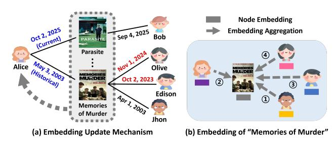
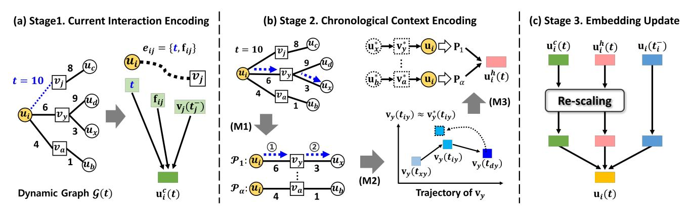
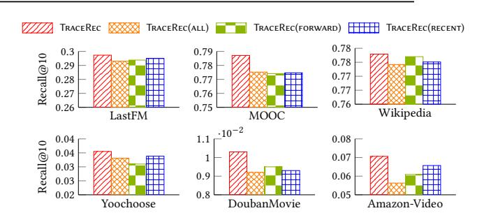
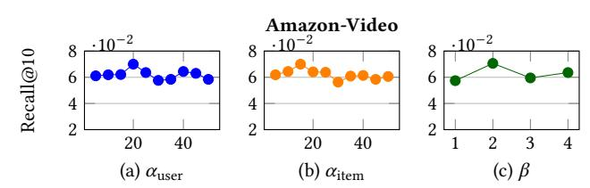
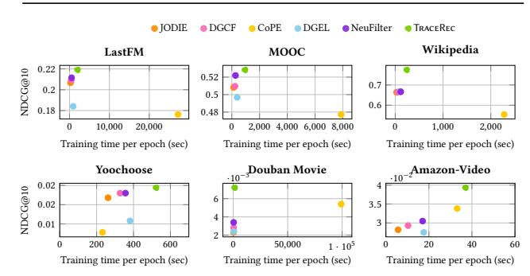
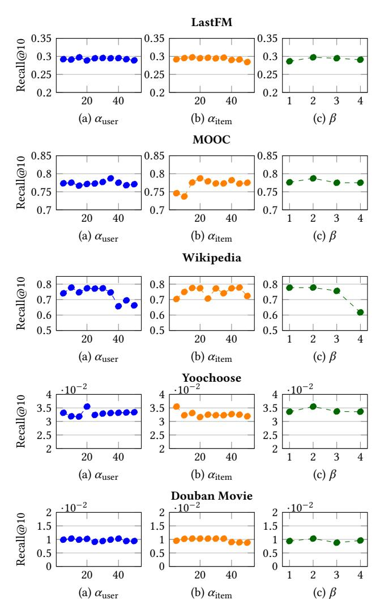
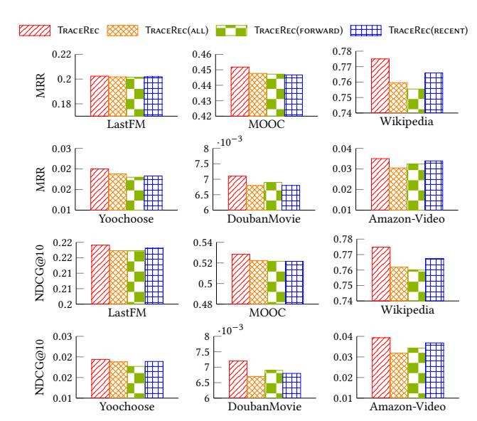

# Retracing and Restoring: Chronological Context Preservation for Effective Dynamic Recommendation

Min-Jeong Kim Hanyang University Seoul, Korea kmj0792@hanyang.ac.kr

Jiwon Son Hanyang University Seoul, Korea tinybeing@hanyang.ac.kr

Yeon-Chang Lee Ulsan National Institute of Science and Technology (UNIST) Ulsan, Korea yeonchang@unist.ac.kr

Sang-Wook Kim∗ Hanyang University Seoul, Korea wook@hanyang.ac.kr

# Abstract

Dynamic recommender systems (DRSs) model time-varying user preferences and item popularity by sequentially updating lowdimensional representations (i.e., embeddings) of users and items upon each interaction. However, existing approaches often fail to preserve the chronological context of past interactions, overwriting historical signals with the current context and thereby misrepresenting user preferences and item attributes. To address this limitation, we propose a novel DRS framework, named TraceRec, which (1) retraces historical interaction paths and (2) restores chronological context for effective dynamic recommendation. Specifically, TraceRec retraces historical interaction paths via reverse chronological random walks and restores the embeddings of neighbors along these paths to their interaction-time context using a pastprojection mechanism. Extensive experiments on six real-world dynamic recommendation datasets demonstrate that TraceRec consistently and significantly outperforms eight competitors, achieving up to 17.05% improvement in Recall@10. The code is available at [https://github.com/kmj0792/TraceRec.](https://github.com/kmj0792/TraceRec)

# CCS Concepts

• Information systems → Recommender systems; Data mining.

# Keywords

dynamic recommender system; embedding trajectory; chronological context

#### ACM Reference Format:

Min-Jeong Kim, Jiwon Son, Yeon-Chang Lee, and Sang-Wook Kim. 2026. Retracing and Restoring: Chronological Context Preservation for Effective Dynamic Recommendation. In Proceedings of the ACM Web Conference 2026 (WWW '26), April 13–17, 2026, Dubai, United Arab Emirates. ACM, New York, NY, USA, [12](#page-11-0) pages.<https://doi.org/10.1145/3774904.3792407>

#### Resource Availability:

The source code of this paper has been made publicly available at [https:](https://doi.org/10.5281/zenodo.18367088) [//doi.org/10.5281/zenodo.18367088.](https://doi.org/10.5281/zenodo.18367088)

∗Corresponding author.

[This work is licensed under a Creative Commons Attribution 4.0 International License.](https://creativecommons.org/licenses/by/4.0) WWW '26, Dubai, United Arab Emirates

© 2026 Copyright held by the owner/author(s). ACM ISBN 979-8-4007-2307-0/2026/04 <https://doi.org/10.1145/3774904.3792407>

Figure 1: An example of the embedding update in GNN-based DRSs, where a target user's embedding is updated at the current timestamp by aggregating both the current and historical interaction signals.

# 1 Introduction

Background. The rapid growth of real-world data poses significant challenges for users in efficiently accessing relevant information. Recommender systems [\[3,](#page-8-0) [15,](#page-8-1) [27,](#page-8-2) [29–](#page-8-3)[31,](#page-8-4) [42\]](#page-8-5) have emerged as an effective solution to this problem by leveraging users' historical interactions to suggest items potentially useful to the users. They are now widely deployed across diverse domains, including ecommerce (e.g., Amazon, Alibaba), streaming services (e.g., Netflix, YouTube), and social media (e.g., Instagram, Reddit), where they play a crucial role in enhancing user experience and driving user engagement [\[14,](#page-8-6) [19,](#page-8-7) [28,](#page-8-8) [32\]](#page-8-9).

The effectiveness of recommender systems largely depends on how well they model user preferences and item attributes. A core task in recommendation is to represent these factors as low-dimensional embeddings derived from historical interaction logs. Early studies [\[10,](#page-8-10) [37\]](#page-8-11) addressed this task in a static setting, where all user–item interactions were aggregated into a single snapshot, thereby ignoring their temporal evolution. However, both user preferences and item attributes evolve continuously due to contextual factors such as seasons, events, and social trends [\[5,](#page-8-12) [18,](#page-8-13) [22,](#page-8-14) [39\]](#page-8-15). For instance, users may prefer family-oriented products such as board games during holidays, while sports merchandise such as soccer jerseys becomes popular mainly during global events like the World Cup. To capture such dynamics, recent studies [\[2,](#page-8-16) [9,](#page-8-17) [21,](#page-8-18) [23,](#page-8-19) [25,](#page-8-20) [34,](#page-8-21) [35,](#page-8-22) [39,](#page-8-15) [40,](#page-8-23) [43–](#page-8-24)[45\]](#page-8-25) have investigated Dynamic Recommender Systems (DRSs) that update user and item embeddings with each interaction, thereby modeling their temporal evolution in the form of embedding trajectories.

Existing Work. Early DRS approaches relied primarily on sequence models such as recurrent neural networks (RNNs) [\[2,](#page-8-16) [21,](#page-8-18) [39,](#page-8-15) [45\]](#page-8-25), with representative methods including RRN [\[39\]](#page-8-15), Time-LSTM [\[45\]](#page-8-25), and LatentCross [\[2\]](#page-8-16). These methods process user or item interaction sequences to capture temporal dependencies and predict future interactions. Recently, graph neural networks (GNNs) have been incorporated into DRSs [\[21,](#page-8-18) [23,](#page-8-19) [25,](#page-8-20) [35,](#page-8-22) [40,](#page-8-23) [43,](#page-8-24) [44\]](#page-8-26); notable examples include DGCF [\[23\]](#page-8-19), CoPE [\[43\]](#page-8-24), and DGEL [\[35\]](#page-8-22). This integration allows DRSs to continuously incorporate both the evolving relational structure of the interaction graph and the temporal dependencies in interaction sequences into user and item embeddings [\[1,](#page-8-27) [16,](#page-8-28) [41\]](#page-8-29).

Figure [1-](#page-0-0)(a) illustrates the embedding update mechanism in GNNbased DRSs: (i) users and items are represented as nodes, and their interactions as edges in the interaction graph, which evolves dynamically as new edges arrive [\[23,](#page-8-19) [24,](#page-8-30) [35\]](#page-8-22); and (ii) when a target user (e.g., Alice) interacts with an item (e.g., Parasite) at the current timestamp, the model updates the user embedding by aggregating the current interaction signal together with historical signals accumulated up to that time point. In this way, GNN-based DRSs adapt embeddings to new interactions while preserving the user's historical preferences. For simplicity, only the user side is shown, as the item side follows the same update procedure.

Motivation. However, we note none of the existing GNN-based DRSs preserve the chronological context of past interactions, as they by design overwrite it with the current context. Specifically, they overlook that, in a dynamic setting, the embedding of an item that interacted with a target user at some past timestamp continues to evolve through subsequent interactions with other users. Consequently, these methods produce item embeddings that no longer reflect the attributes the items conveyed at the time of interaction with the target user. As a result, aggregating such context-shifted item embeddings when updating the current target user embedding leads to a misrepresentation of the user's preferences at the time of her interaction, which we refer to as interaction-time preferences.

To further illustrate this issue, we revisit the example in Figure [1.](#page-0-0) Alice, a user with niche tastes in films, watched Bong Joon-ho's "Memories of Murder" upon its release, which signaled her unique preference at that time. However, as his film "Parasite" later gained worldwide popularity, another of his films, "Memories of Murder," was also widely consumed by other users (e.g., Olive and Edison). As a result, the current embedding of "Memories of Murder" may now predominantly capture its shift toward mainstream popularity, as shown in Figure [1-](#page-0-0)(b), rather than the attributes it conveyed at the time of Alice's interaction. Thus, aggregating this context-shifted embedding into Alice's current embedding would misinterpret her interaction-time preferences. This issue is not unique to Alice's case but arises broadly as both user preferences and item attributes evolve over time, underscoring the need to preserve the chronological context of interactions.

Proposed Ideas. To address this limitation, we propose a novel GNN-based DRS framework, named as TraceRec, which reTraces histoRical interaction pAths and restores Chronological contExt for effective dynamic RECommendation.

Given a target user–item interaction at the current timestamp ��, TraceRec generates both the target user's and the item's embeddings at �� through three stages: (S1) Current Interaction Encoding, which encodes the target user's or item's current interaction at

�� into a current-context embedding; (S2) Chronological Context Encoding, which encodes the target user's or item's past interactions at timestamps �� ′ &lt; �� into a chronological-context embedding; and (S3) Embedding Update, which combines the current- and chronological-context embeddings to produce the final embedding at ��. Finally, TraceRec optimizes the embeddings at �� using an evolution loss [\[21,](#page-8-18) [23,](#page-8-19) [35\]](#page-8-22), so that they can predict which items the user will interact with in the future.

Under the above framework, we follow existing conventions [\[23,](#page-8-19) [35\]](#page-8-22) for (S1) and (S3). The main novelty of TraceRec lies in (S2), where we propose the following three key modules that resolve the fundamental structural flaws of prior approaches:

- (M1) Historical Interaction Retracing: We construct historical interaction paths for the target user or item that explicitly preserve the chronological order of past interactions. Each path links the target user (resp. item) to an item (resp. user) whose interactions occurred at �� ′ &lt; ��, and further to another user (resp. item) who had interacted with them before �� ′ .
- (M2) Chronological Context Restoring: The current embedding of an item or user in the paths extracted by (M1) may have evolved from its embedding at the corresponding past timestamp �� ′ . To address this, we propose a projection method that maps back each such embedding from its current context to its interaction-time context at �� ′ .
- (M3) Context-Preserving Aggregation: We obtain the target user's or item's chronological-context embedding by first combining the restored user and item embeddings within each path into a path-level embedding and then aggregating the combined embeddings across all paths.

Contributions. Our contributions are as follows:

- Key Observations. The key limitation of existing DRSs is their failure to preserve the chronological context of past interactions, inevitably relying on context-shifted embeddings that misrepresent users and items.
- Novel Framework. We propose TraceRec, a novel DRS framework that captures the chronological context of interactions, producing user and item embeddings that preserve interaction-time context.
- Extensive Experiments. We conduct extensive experiments on six real-world datasets against eight competitors. The results show that TraceRec significantly outperforms the bestperforming competitors by up to 17.05% in Recall@10.

# 2 Related Work

In this section, we briefly review representative RNN- and GNNbased DRS models.

RNN-based DRSs. Early DRSs [\[2,](#page-8-16) [11,](#page-8-31) [39,](#page-8-15) [45\]](#page-8-25) relied on RNNs and their variants (e.g., LSTM, GRU) to capture temporal dependencies within individual user or item sequences. For example, RRN [\[39\]](#page-8-15) employs two independent LSTMs to learn user- and item-side dynamics separately, while Time-LSTM [\[45\]](#page-8-25) introduced a time gate to explicitly model the effect of time intervals between interactions. However, these models treat users and items as independent sequences, and thus fail to capture the mutual influence between users and items that naturally arises through their interactions.

In the final step, the recommendation list Rec(��+Δ) �� is obtained by ranking all items according to their L2 distance from the embedding v˜ ˆ�� (�� + Δ) and selecting the top-�� items. During training, the objective encourages the embedding v˜ ˆ�� (�� + Δ) to be close to the ground-truth embedding vˆ�� (�� + Δ) of the next item ��ˆ�� that ���� actually interacted with at �� + Δ by minimizing their L2 distance:

L = ∑︁ (���� ,���� ,���� �� ) ∈ E (��+Δ) v˜ ˆ�� (�� + Δ) − vˆ�� (�� + Δ) 2 , (10)

where the ground-truth item embedding is defined as vˆ�� (�� + Δ) = vˆ�� (��) ∥ v¯ˆ�� . Our model is trained in an end-to-end manner, where all learnable parameters introduced in the stages (S1)-(S3) are jointly optimized with respect to the recommendation loss defined in Eq. [\(10\)](#page-5-2).

### 4.4 Complexity Analysis

In this subsection, we analyze the computational complexity of TraceRec. Since TraceRec updates only the embeddings of the user and item involved in each interaction, the training process scales proportionally with the data size. As a result, the overall time complexity per epoch grows linearly with the number of interactions |�� |. Formally, the total complexity can be expressed as �� |�� | · (�� 2 + ���� + ��|f���� | + |V |��) , where ��, ��, |f���� |, and |V | denote the number of sampled paths, the embedding dimensionality, the size of the feature vector, and the number of items, respectively.

Per interaction (���� , ���� ) at ��, the cost decomposes into three embedding generation stages–(S1) Current Interaction Encoding, (S2) Chronological Context Encoding, and (S3) Embedding Update–plus the training loss computation. In (S1), TraceRec encodes the target user ���� or item ���� with a single linear transformation over the concatenation of its embedding, the timestamp ��, and the edge feature vector f���� . The computational cost is ��(�� (�� + |f���� |)). In (S2), TraceRec performs three modules: (M1) samples �� historical paths via temporal random walks, with cost ��(��); (M2) restores neighbor embeddings to their interaction-time context using past-projection, costing ��(����); and (M3) aggregates restored embeddings within and across paths, requiring ��(����). Thus, the overall complexity of this stage is��(����). In (S3), TraceRec generates the final embedding u��(��) based on u �� �� (��), u ℎ �� (��), and u��(�� − �� ). The integration is carried out with RENet and an aggregator agg2 , incurring a cost of ��(�� 2 ). In the training phase, TraceRec requires three additional operations: projecting the user embedding (��(��)), constructing the proxy embedding (��( (�� + |V |)��)), and computing the loss (��(�� + |V |)).

As discussed in Section [4.2,](#page-3-1) our design choices in (M1) and (M2) substantially reduce both time and space complexity. In (M1), the temporal random walk extracts temporally valid historical interaction paths with only ��(��) operations per interaction. By contrast, a naïve variant would explicitly enumerate and validate all possible historical paths, requiring ��(deg�� · deg�� ) operations, where deg�� and deg�� denote the average user and item degrees, respectively. Similarly, in (M2), our past-projection restores interaction-time context on the fly with only ��(����) operations, whereas a snapshotbased naïve variant must retrieve all historical embeddings, leading to ��( (deg�� + deg�� )��) memory accesses per interaction. To complement this theoretical analysis, we report empirical training-time comparisons in Appendix [A.1.](#page-9-0)

Table 2: Dataset statistics

| Datasets     | # Users | # Items | # Interactions | Edge Feature |
|--------------|---------|---------|----------------|--------------|
| LastFM       | 980     | 1,000   | 1,293,103      | X            |
| MOOC         | 7,047   | 97      | 411,749        | O            |
| Wikipedia    | 8,227   | 1,000   | 157,474        | O            |
| Yoochoose    | 33,670  | 3,667   | 211,851        | X            |
| Douban Movie | 9,987   | 9,999   | 1,001,918      | X            |
| Amazon-Video | 5,130   | 1,685   | 37,126         | X            |

### 5 Evaluation

In this section, we conduct extensive experiments to validate the effectiveness of TraceRec. We designed our experiments to answer the following key evaluation questions (EQs):

- (EQ1): Does TraceRec provide more-accurate recommendations than state-of-the-art dynamic recommendation methods?
- (EQ2): How effective is retracing historical interaction paths via temporal random walks for dynamic recommendation?
- (EQ3): Howe effective is restoring the interaction-time context via past-projection for dynamic recommendation?
- (EQ4): How do different ablation variants of TraceRec affect accuracy?
- (EQ5): How sensitive is the accuracy of TraceRec to the hyperparameters �� and ��?

### 5.1 Experimental Setup

Datasets. We evaluate TraceRec on six widely used real-world dynamic recommendation datasets [\[21,](#page-8-18) [43\]](#page-8-24): LastFM, MOOC, Wikipedia, Yoochoose, Douban Movie, and Amazon-Video. Table [2](#page-5-3) provides some statistics of the six datasets. For each dataset, we used the earliest 80% of interactions for training, the next 10% for validation, and the latest 10% for testing. Detailed descriptions of each dataset are provided in Appendix [A.2.](#page-9-1)

Competitors. We compare TraceRec with two baselines and six state-of-the-art DRSs: two static baselines (i.e., NGCF [\[37\]](#page-8-11) and Light-GCN [\[10\]](#page-8-10)), one RNN-based DRSs (i.e., Time-LSTM [\[45\]](#page-8-25)), and five GNN-based DRSs (JODIE [\[21\]](#page-8-18), DGCF [\[23\]](#page-8-19), CoPE [\[43\]](#page-8-24), DGEL [\[35\]](#page-8-22), and NeuFilter [\[40\]](#page-8-23)) methods. Detailed descriptions of these methods are provided in Section [2.](#page-1-0)

Evaluation Task. Following [\[9,](#page-8-17) [21,](#page-8-18) [23,](#page-8-19) [25,](#page-8-20) [34,](#page-8-21) [35,](#page-8-22) [40,](#page-8-23) [43,](#page-8-24) [44\]](#page-8-26), we employed the dynamic recommendation task for evaluations. The goal is to predict the item a target user will interact with at a future timestamp, given the user's past interactions. All methods are evaluated under a no-training-in-test protocol [\[34,](#page-8-21) [35,](#page-8-22) [43\]](#page-8-24); detailed discussions are provided in Appendix [A.3.](#page-9-2) We measured recommendation accuracy using three widely adopted metrics [\[21,](#page-8-18) [23,](#page-8-19) [35,](#page-8-22) [40,](#page-8-23) [43\]](#page-8-24): Mean Reciprocal Rank (MRR) [\[6\]](#page-8-39), Recall [\[4\]](#page-8-40), and Normalized Discounted Cumulative Gain (NDCG) [\[13\]](#page-8-41).

Implementation Details. Following [\[21,](#page-8-18) [35,](#page-8-22) [40\]](#page-8-23), we used the Adam optimizer [\[20\]](#page-8-42) and the temporal batch algorithm [\[21\]](#page-8-18). For all methods including TraceRec, hyperparameters were tuned via grid search on the validation set on each dataset. All results are reported as the average of five independent runs with different random seeds. See the Appendix [A.4](#page-9-3) for the complete implementation details.

Table 3: Dynamic recommendation accuracies of eight competitors and TraceRec

| Datasets Metrics | MRR     | LastFM Recall@10 | NDCG@10 | MRR      | MOOC Recall@10 | NDCG@10  | MRR      | Wikipedia Recall@10 | NDCG@10  |
|------------------|---------|------------------|---------|----------|----------------|----------|----------|---------------------|----------|
| NGCF             | 0.0032  | 0.0035           | 0.0017  | 0.0603   | 0.1453         | 0.0611   | 0.0040   | 0.0059              | 0.0031   |
| LightGCN         | 0.0028  | 0.0025           | 0.0011  | 0.0645   | 0.1586         | 0.0678   | 0.0063   | 0.0105              | 0.0059   |
| Time-LSTM        | 0.0685  | 0.1371           | 0.0701  | 0.2779   | 0.3444         | 0.2827   | 0.0256   | 0.0282              | 0.0251   |
| JODIE            | 0.1909  | 0.2835           | 0.2068  | 0.4437   | 0.7361         | 0.5082   | 0.6504   | 0.7147              | 0.6640   |
| DGCF             | 0.1921  | 0.2897           | 0.2093  | 0.4418   | 0.7418         | 0.5095   | 0.6561   | 0.7050              | 0.6656   |
| CoPE             | 0.1632  | 0.2600           | 0.1762  | 0.4414   | 0.6570         | 0.4772   | 0.5225   | 0.6634              | 0.5541   |
| DGEL             | 0.1747  | 0.2350           | 0.1841  | 0.4308   | 0.7235         | 0.4968   | 0.6591   | 0.7115              | 0.6691   |
| NeuFilter        | 0.1951  | 0.2899           | 0.2115  | 0.4480   | 0.7730         | 0.5219   | 0.6503   | 0.7231              | 0.6662   |
| TraceRec         | 0.2024  | 0.2973           | 0.2191  | 0.4518   | 0.7871         | 0.5283   | 0.7750   | 0.7779              | 0.7748   |
| Gain             | +3.742% | +2.553%          | +3.593% | +0.848%  | +1.074%        | +1.824%  | +17.585% | +7.578%             | +15.797% |
| Datasets         |         | Yoochoose        |         |          | Douban         | Movie    |          | Amazon-Video        |          |
| Metrics          | MRR     | Recall@10        | NDCG@10 | MRR      | Recall@10      | NDCG@10  | MRR      | Recall@10           | NDCG@10  |
| NGCF             | 0.0007  | 0.0003           | 0.0001  | 0.0024   | 0.0037         | 0.0017   | 0.0142   | 0.0224              | 0.0116   |
| LightGCN         | 0.0028  | 0.0044           | 0.0021  | 0.0026   | 0.0040         | 0.0019   | 0.0245   | 0.0471              | 0.0234   |
| Time-LSTM        | 0.0073  | 0.0124           | 0.0076  | 0.0013   | 0.0016         | 0.0005   | 0.0171   | 0.0306              | 0.0152   |
| JODIE            | 0.0160  | 0.0291           | 0.0168  | 0.0026   | 0.0046         | 0.0023   | 0.0264   | 0.0552              | 0.0282   |
| DGCF             | 0.0193  | 0.0318           | 0.0180  | 0.0032   | 0.0053         | 0.0028   | 0.0288   | 0.0543              | 0.0293   |
| CoPE             | 0.0094  | 0.0162           | 0.0078  | 0.0062   | 0.0088         | 0.0054   | 0.0323   | 0.0703              | 0.0338   |
| DGEL             | 0.0121  | 0.0185           | 0.0108  | 0.0034   | 0.0049         | 0.0024   | 0.0268   | 0.0458              | 0.0275   |
| NeuFilter        | 0.0156  | 0.0306           | 0.0180  | 0.0045   | 0.0062         | 0.0034   | 0.0280   | 0.0571              | 0.0305   |
| TraceRec         | 0.0200  | 0.0355           | 0.0194  | 0.0071   | 0.0103         | 0.0072   | 0.0350   | 0.0706              | 0.0393   |
| Gain             | +3.627% | +11.635%         | +7.778% | +14.516% | +17.045%       | +33.333% | +8.359%  | +0.427%             | +16.272% |

## 5.2 Results and Analysis

Due to space limitations, we report only Recall@10 results, except for EQ1; all experimental results are available in Appendix [A.5.](#page-10-0)

Results for EQ1. We conducted comparative experiments on six dynamic recommendation datasets to demonstrate the superiority of TraceRec over its eight competitors. Table [3](#page-6-0) shows the results for all metrics. The values in boldface and underlined indicate the best and 2nd-best accuracies in each column, respectively.

Most importantly, TraceRec consistently and significantly outperforms all competitors on all datasets for all measures. Specifically, TraceRec achieves remarkable improvements—up to 17.585% in MRR on Wikipedia (over DGEL), and 17.045% in Recall@10 and 33.333% in NDCG@10 on Douban Movie (over CoPE)—compared to the best competitors. These consistent improvements demonstrate the effectiveness of retracing historical interaction paths and restoring the chronological context, enabling TraceRec to preserve users' temporal preferences without misrepresentation.

Further investigations include: (i) Models that ignore either temporal dynamics or graph structure, such as NGCF, LightGCN, and Time-LSTM, exhibit consistently lower accuracy, confirming the importance of jointly modeling temporal evolution and structural relations in dynamic recommendation. (ii) GNN-based DRSs that exploit deeper graph topology, such as DGCF, DGEL, and CoPE, and the robustness-oriented model NeuFilter, which filters behavioral noise, generally achieve higher accuracy. This confirms that effectively modeling structural relations while filtering noisy interactions is crucial for improving dynamic recommendation accuracy.

Figure 3: Dynamic recommendation accuracies of TraceRec and its variants with respect to retracing historical paths.

Results for EQ2. To evaluate the effectiveness of retracing historical interaction paths, we compared TraceRec with three variants: TraceRec(all), which samples paths via random walks over all past interactions without temporal constraints; TraceRec(forward), which samples paths forward in the chronological order from the target node; and TraceRec(recent), which samples paths only from the most recent neighbor.

The results, summarized in Figure [3,](#page-6-1) show that TraceRec achieves the best performance when historical paths are retraced in reverse chronological order, which naturally avoids misrepresentation from later interactions. Further analysis reveals two key findings. First, comparing TraceRec with TraceRec(recent) demonstrates that incorporating a richer history substantially improves recommendation accuracy. Second, comparing TraceRec with TraceRec(all) and TraceRec(forward) highlights that, while more history is useful, retracing paths in reverse chronological order is essential to avoid the misrepresentation introduced by subsequent interactions.

Table 4: The effect of different node and path aggregation functions on the performance of TraceRec in terms of Recall@10

| Datasets              | LastFM | MOOC   | Wikipedia | Yoochoose | Douban Movie | Amazon-Video |
|-----------------------|--------|--------|-----------|-----------|--------------|--------------|
| Concat                | 0.1322 | 0.4469 | 0.7804    | 0.0334    | 0.0091       | 0.0382       |
| LSTM                  | 0.2934 | 0.7871 | 0.7779    | 0.0355    | 0.0103       | 0.0706       |
| GRU                   | 0.2973 | 0.7752 | 0.7647    | 0.0330    | 0.0092       | 0.0617       |
| Transformer           | 0.2942 | 0.7813 | 0.7793    | 0.0337    | 0.0093       | 0.0584       |
| Mean Pooling          | 0.2973 | 0.7871 | 0.7779    | 0.0355    | 0.0103       | 0.0706       |
| Time-weighted Pooling | 0.2937 | 0.7735 | 0.6619    | 0.0296    | 0.0094       | 0.0533       |
|                       |        |        |           | 20        | 40           |              |
|                       |        |        |           | 0 5       |              |              |
|                       |        |        |           | 0 6       |              |              |
|                       |        |        |           | 0 7       |              |              |
|                       |        |        |           | 0 8       |              |              |
|                       |        |        |           | (a) ��    | user         |              |
|                       |        |        |           |           | 20           | 40           |
|                       |        |        |           |           | 0 5          |              |
|                       |        |        |           |           | 0 6          |              |
|                       |        |        |           |           | 0 7          |              |
|                       |        |        |           |           | 0 8          |              |
|                       |        |        |           |           | (b)          | �� item      |
|                       |        |        |           |           |              | 0 5          |
|                       |        |        |           |           |              | 0 6          |
|                       |        |        |           |           |              | 0 7          |
|                       |        |        |           |           |              | 0 8          |

Table 5: Dynamic recommendation accuracies of TraceRec and its variant in terms of Recall@10, with respect to restoring neighbors' embeddings to their original temporal states

| Dataset            | LastFM    | MOOC         | Wikipedia    |
|--------------------|-----------|--------------|--------------|
| TraceRec(w/o proj) | 0.2934    | 0.7753       | 0.7643       |
| TraceRec           | 0.2973    | 0.7871       | 0.7779       |
| Dataset            | Yoochoose | Douban Movie | Amazon-Video |
| TraceRec(w/o proj) | 0.0338    | 0.0095       | 0.0700       |
| TraceRec           | 0.0355    | 0.0103       | 0.0706       |

Results for EQ3. To examine the effectiveness of restoring neighbor embeddings to their interaction-time context, we compared TraceRec with TraceRec(w/o proj), a variant that directly aggregates the current embeddings of neighbors in the sampled paths without context restoration. As shown in Table [5,](#page-7-0) TraceRec consistently outperforms TraceRec(w/o proj); on the Douban Movie dataset, for example, it achieves up to 7.4% higher Recall@10. These results demonstrate that mapping context-shifted embeddings back to their interaction-time context mitigates temporal drift and preserve chronological interaction information well, leading to moreaccurate dynamic recommendations.

Results for EQ4. We investigate the effects of different aggregation strategies in TraceRec, focusing on two levels: (i) aggregating restored embeddings within each path into a path-level embedding, and (ii) aggregating path-level embeddings across multiple paths. For the first level, we compared several implementations of agg1 , including a simple concatenation-based aggregator (Concat) and sequence models such as LSTM, GRU, and Transformer. For the second level, we examined mean pooling versus time-weighted pooling, where the latter assigns larger softmax weights to paths involving more-recent neighbors.

As shown in Table [4,](#page-7-1) LSTM, GRU, and Transformer yield comparable performance, with the best choice varying slightly across datasets. In contrast, Concat performs substantially worse, indicating that explicitly modeling the chronological order of nodes within each path is more effective for capturing temporal dependencies. For path-level aggregation, mean pooling consistently outperforms time-weighted pooling. We conjecture that this may be because recent paths are already captured by the current interaction signal in (S1), so overemphasizing them introduces redundancy and reduces the influence of older but informative contexts.

Results for EQ5. We analyze how the accuracy of TraceRec changes with different parameter settings in temporal random walks: �� (number of sampled paths) and �� (maximum walk length). To account for degree imbalance between users and items in user item graphs, we set separate �� values for users and items, denoted

Figure 4: Hyperparameter sensitivity in TraceRec.

as ���������� and ����������, which control the number of paths used when updating user and item embeddings, respectively. We report results on one representative dataset, Amazon-Video, while results for other datasets are provided in Appendix [A.5.](#page-10-0)

Figure [4](#page-7-2) presents the results, where the ��-axis indicates ����������, ����������, and ��, and the ��-axis reports Recall@10. We observe that accuracy improves as �� increases up to a certain point, but degrades when too many paths are sampled, likely due to redundant information from overlapping paths. On the Amazon-Video dataset (avg. degree: user 7, item 22), the best performance is achieved with ���������� = 20 and ���������� = 15, whereas further increases degrade performance. Regarding ��, all datasets consistently show peaks at �� = 2, while longer walks result in a noticeable decline, confirming the well-known oversmoothing effect in deep propagation.

### 6 Conclusion

In this work, we identified a fundamental limitation of existing GNN-based DRSs: by overwriting historical signals with the current context, they misrepresent user preferences and item attributes, losing the chronological context of past interactions. To address this issue, we proposed TraceRec, a novel DRS framework that retraces historical interaction paths and restores the interaction-time context. By integrating these context-preserved historical embeddings with current interaction information, TraceRec effectively captures both short- and long-term temporal dynamics. Extensive experiments show that TraceRec consistently outperforms state-of-theart methods, confirming the importance of preserving chronological contexts for accurate dynamic recommendation.

### Acknowledgments

The work of Sang-Wook Kim was supported by Institute of Information & communications Technology Planning & Evaluation (IITP) grant funded by the Korea government (MSIT) (No. RS-2022- 00155586, and No. RS-2020-II201373). The work of Yeon-Chang Lee was supported by Institute of Information & communications Technology Planning & Evaluation (IITP) grant funded by the Korea government (MSIT) (No. RS-2025-25442824, AI Star Fellowship Program (Ulsan National Institute of Science and Technology)).

### References

[1] Claudio DT Barros, Matheus RF Mendonça, Alex B Vieira, and Artur Ziviani. 2021. A Survey on Embedding Dynamic Graphs. ACM Computing Surveys (CSUR) (2021), 1–37. [2] Alex Beutel, Paul Covington, Sagar Jain, Can Xu, Jia Li, Vince Gatto, and Ed H Chi. 2018. Latent Cross: Making Use of Context in Recurrent Recommender systems. In Proceedings of the ACM International Conference on Web Search and Data Mining (WSDM). 46–54. [3] Jesús Bobadilla, Fernando Ortega, Antonio Hernando, and Abraham Gutiérrez. 2013. Recommender Systems Survey. Knowledge-based Systems (KBS) (2013), 109–132. [4] Michael Buckland and Fredric Gey. 1994. The Relationship between Recall and Precision. Journal of the American Society for Information Science (1994), 12–19. [5] Luciano Caroprese, Francesco Sergio Pisani, Bruno Miguel Veloso, Matthias Konig, Giuseppe Manco, Holger Hoos, and Joao Gama. 2025. Modelling Concept Drift in Dynamic Data Streams for Recommender Systems. ACM Transactions on Recommender Systems (2025), 1–28. [6] Olivier Chapelle, Donald Metlzer, Ya Zhang, and Pierre Grinspan. 2009. Expected Reciprocal Rank for Graded Relevance. In Proceedings of the ACM International Conference on Information and Knowledge Management (CIKM). 621–630. [7] Deli Chen, Yankai Lin, Wei Li, Peng Li, Jie Zhou, and Xu Sun. 2020. Measuring and Relieving the Over-Smoothing Problem for Graph Neural Networks from the topological view. In Proceedings of the AAAI Conference on Artificial Intelligence (AAAI). 3438–3445. [8] Junyoung Chung, Caglar Gulcehre, KyungHyun Cho, and Yoshua Bengio. 2014. Empirical Evaluation of Gated Recurrent Neural Networks on Sequence Modeling. arXiv preprint arXiv:1412.3555 (2014). [9] Hanjun Dai, Yichen Wang, Rakshit Trivedi, and Le Song. 2016. Deep Coevolutionary Network: Embedding User and Item Features for Recommendation. arXiv preprint arXiv:1609.03675 (2016). [10] Xiangnan He, Kuan Deng, Xiang Wang, Yan Li, Yongdong Zhang, and Meng Wang. 2020. Lightgcn: Simplifying and Powering Graph Convolution Network for Recommendation. In Proceedings of the International ACM SIGIR Conference on Research and Development in Information Retrieval (SIGIR). 639–648. [11] Balázs Hidasi, Alexandros Karatzoglou, Linas Baltrunas, and Domonkos Tikk. 2015. Session-based Recommendations with Recurrent Neural Networks. arXiv preprint arXiv:1511.06939 (2015). [12] Sepp Hochreiter and Jürgen Schmidhuber. 1997. Long Short-Term Memory. Neural Computation (1997), 1735–1780. [13] Kalervo Järvelin and Jaana Kekäläinen. 2002. Cumulated Gain-based Evaluation of IR Techniques. ACM Transactions on Information Systems (TOIS) (2002), 422–446. [14] Dongho Jeong, Taeri Kim, Donghyeon Cho, and Sang-Wook Kim. 2025. MELON: Learning Multi-Aspect Modality Preferences for Accurate Multimedia Recommendation. In Proceedings of the International ACM SIGIR Conference on Research and Development in Information Retrieval (SIGIR). 1850–1859. [15] Wang-Cheng Kang and Julian McAuley. 2018. Self-Attentive Sequential Recommendation. In Proceedings of the IEEE International Conference on Data Mining (ICDM). IEEE, 197–206. [16] Seyed Mehran Kazemi, Rishab Goel, Kshitij Jain, Ivan Kobyzev, Akshay Sethi, Peter Forsyth, and Pascal Poupart. 2020. Representation Learning for Dynamic Graphs: A Survey. Journal of Machine Learning Research (2020), 1–73. [17] Nicolas Keriven. 2022. Not Too Little, Not Too Much: A Theoretical Analysis of Graph (Over) smoothing. Proceedings of the International Conference on Neural Information Processing Systems (NIPS) (2022). [18] Min-Jeong Kim, Yeon-Chang Lee, and Sang-Wook Kim. 2024. PolarDSN: An Inductive Approach to Learning the Evolution of Network Polarization in Dynamic Signed Networks. In Proceedings of the ACM International Conference on Information and Knowledge Management (CIKM). 1099–1109. [19] Taeri Kim, Jiho Heo, Hyunjoon Kim, and Sang-Wook Kim. 2025. HI-DR: Exploiting Health Status-Aware Attention and an EHR Graph+ for Effective Medication Recommendation. In Proceedings of the AAAI Conference on Artificial Intelligence (AAAI). 11950–11958. [20] Diederik P Kingma and Jimmy Ba. 2014. Adam: A Method for Stochastic Optimization. arXiv preprint arXiv:1412.6980 (2014). [21] Srijan Kumar, Xikun Zhang, and Jure Leskovec. 2019. Predicting Dynamic Embedding Trajectory in Temporal Interaction Networks. In Proceedings of the ACM International Conference on Knowledge Discovery and Data Mining (KDD). 1269–1278. [22] Yeon-Chang Lee, JaeHyun Lee, Michiharu Yamashita, Dongwon Lee, and Sang-Wook Kim. 2025. CAPER: Enhancing Career Trajectory Prediction using Temporal Knowledge Graph and Ternary Relationship. In Proceedings of the ACM International Conference on Knowledge Discovery and Data Mining (KDD). 647–658. [23] Xiaohan Li, Mengqi Zhang, Shu Wu, Zheng Liu, Liang Wang, and Philip S Yu. 2020. Dynamic Graph Collaborative Filtering. In Proceedings of the IEEE International Conference on Data Mining (ICDM). IEEE, 322–331. [24] Aldo Pareja, Giacomo Domeniconi, Jie Chen, Tengfei Ma, Toyotaro Suzumura, Hiroki Kanezashi, Tim Kaler, Tao Schardl, and Charles Leiserson. 2020. EvolveGCN: Evolving Graph Convolutional Networks for Dynamic Graphs. In Proceedings of the AAAI Conference on Artificial Intelligence (AAAI). 5363–5370. [25] Tianhao Peng, Haitao Yuan, Yongqi Zhang, Yuchen Li, Peihong Dai, Qunbo Wang, Senzhang Wang, and Wenjun Wu. 2025. TagRec: Temporal-Aware Graph Contrastive Learning with Theoretical Augmentation for Sequential Recommendation. IEEE Transactions on Knowledge and Data Engineering (TKDE) (2025). [26] James W Pennebaker, Martha E Francis, Roger J Booth, et al. 2001. Linguistic Inquiry and Word Count: LIWC 2001. Mahway: Lawrence Erlbaum Associates (2001), 2001. [27] Paul Resnick and Hal R Varian. 1997. Recommender Systems. Commun. ACM (1997), 56–58. [28] Seongeun Ryu, Yunyong Ko, and Sang-Wook Kim. 2025. Is This News Still Interesting to You?: Lifetime-Aware Interest Matching for News Recommendation. In Proceedings of the ACM International Conference on Information and Knowledge Management (CIKM). 2515–2524. [29] Badrul Sarwar, George Karypis, Joseph Konstan, and John Riedl. 2001. Item-based Collaborative Filtering Recommendation Algorithms. In Proceedings of the ACM Web Conference (WWW). 285–295. [30] J Ben Schafer, Joseph Konstan, and John Riedl. 1999. Recommender Systems in E-Commerce. In Proceedings of the ACM Conference on Electronic Commerce (EC). 158–166. [31] Kartik Sharma, Yeon-Chang Lee, Sivagami Nambi, Aditya Salian, Shlok Shah, Sang-Wook Kim, and Srijan Kumar. 2024. A Survey of Graph Neural Networks for Social Recommender Systems. Comput. Surveys (2024), 1–34. [32] Jiwon Son, Hyunjoon Kim, and Sang-Wook Kim. 2025. Rating-Aware Homogeneous Review Graphs and User Likes/Dislikes Differentiation for Effective Recommendations. In Proceedings of the International ACM SIGIR Conference on Research and Development in Information Retrieval (SIGIR). 2070–2080. [33] Xiran Song, Jianxun Lian, Hong Huang, Mingqi Wu, Hai Jin, and Xing Xie. 2022. Friend Recommendations with Self-Rescaling Graph Neural Networks. In Proceedings of the ACM International Conference on Knowledge Discovery and Data Mining (KDD). 3909–3919. [34] Haoran Tang, Shiqing Wu, Xueyao Sun, Jun Zeng, Guandong Xu, and Qing Li. 2025. TCGC: Temporal Collaboration-Aware Graph Co-Evolution Learning for Dynamic Recommendation. ACM Transactions on Information Systems (TOIS) (2025), 1–27. [35] Haoran Tang, Shiqing Wu, Guandong Xu, and Qing Li. 2023. Dynamic Graph Evolution Learning for Recommendation. In Proceedings of the International ACM SIGIR Conference on Research and Development in Information Retrieval (SIGIR). 1589–1598. [36] Ashish Vaswani, Noam Shazeer, Niki Parmar, Jakob Uszkoreit, Llion Jones, Aidan N Gomez, Łukasz Kaiser, and Illia Polosukhin. 2017. Attention Is All You Need. Proceedings of the International Conference on Neural Information Processing Systems (NIPS) (2017). [37] Xiang Wang, Xiangnan He, Meng Wang, Fuli Feng, and Tat-Seng Chua. 2019. Neural Graph Collaborative Filtering. In Proceedings of the International ACM SIGIR Conference on Research and Development in Information Retrieval (SIGIR). 165–174. [38] Yanbang Wang, Yen-Yu Chang, Yunyu Liu, Jure Leskovec, and Pan Li. 2021. Inductive Representation Learning in Temporal Networks via Causal Anonymous Walks. Proceedings of the International Conference on Learning Representations (ICLR) (2021). [39] Chao-Yuan Wu, Amr Ahmed, Alex Beutel, Alexander J Smola, and How Jing. 2017. Recurrent Recommender Networks. In Proceedings of the ACM International Conference on Web Search and Data Mining (WSDM). 495–503. [40] Jiafeng Xia, Dongsheng Li, Hansu Gu, Tun Lu, Peng Zhang, Li Shang, and Ning Gu. 2024. Neural Kalman Filtering for Robust Temporal Recommendation. In Proceedings of the ACM International Conference on Web Search and Data Mining (WSDM). 836–845. [41] Jiaxuan You, Yichen Wang, Aditya Pal, Pong Eksombatchai, Chuck Rosenburg, and Jure Leskovec. 2019. Hierarchical Temporal Convolutional Networks for Dynamic Recommender Systems. In Proceedings of the ACM Web Conference (WWW). 2236–2246. [42] Junliang Yu, Hongzhi Yin, Xin Xia, Tong Chen, Jundong Li, and Zi Huang. 2023. Self-Supervised Learning for Recommender Systems: A Survey. IEEE Transactions on Knowledge and Data Engineering (TKDE) (2023), 335–355. [43] Yao Zhang, Yun Xiong, Dongsheng Li, Caihua Shan, Kan Ren, and Yangyong Zhu. 2021. CoPE: Modeling Continuous Propagation and Evolution on Interaction Graph. In Proceedings of the ACM International Conference on Information and Knowledge Management (CIKM). 2627–2636. [44] Ziwei Zhao, Fake Lin, Xi Zhu, Zhi Zheng, Tong Xu, shitian shen, Xueying Li, Zikai Yin, and Enhong Chen. 2025. DynLLM: When Large Language Models Meet Dynamic Graph-based Recommendation. ACM Transactions on Information Systems (TOIS) (2025). [45] Yu Zhu, Hao Li, Yikang Liao, Beidou Wang, Ziyu Guan, Haifeng Liu, and Deng Cai. 2017. What to Do Next: Modeling User Behaviors by Time-LSTM. In Proceedings of the International Joint Conference on Artificial Intelligence (IJCAI). 3602–3608.

Table 6: Hyperparameter settings for each dataset

Figure 5: Efficiency–accuracy trade-offs of six GNN-based DRS methods.

### A Appendix

In this appendix, we provide an empirical efficiency analysis (Appendix [A.1\)](#page-9-0), detailed dataset descriptions (Appendix [A.2\)](#page-9-1), a discussion of evaluation settings and protocols (Appendix [A.3\)](#page-9-2), additional implementation details (Appendix [A.4\)](#page-9-3), and supplementary experimental results for EQ2–EQ5 (Appendix [A.5\)](#page-10-0).

### A.1 Efficiency Analysis

In addition to the theoretical complexity analysis in Section [4.4,](#page-5-1) we report empirical training time comparisons to assess the practical efficiency of TraceRec. The experiments were conducted under identical hardware and experimental settings. Figure [5](#page-9-4) presents dataset-wise trade-offs between training efficiency and recommendation accuracy, by plotting NDCG@10 against the average perepoch training time for six GNN-based DRSs (i.e., JODIE, DGCF, DGEL, CoPE, NeuFilter, and TraceRec). Comparison with CoPE and NeuFilter (best competitors), TraceRec is typically 10.43× faster than CoPE while improving accuracy by up to 33.33%. Compared to NeuFilter, TraceRecincurs a moderate overhead (on average 1.47× slower), but yields up to 7.78% higher accuracy. We consider this trade-off to be practical and justifiable in real-world deployment.

### A.2 Dataset Description

We evaluate TraceRec on six widely used real-world dynamic recommendation datasets [\[21,](#page-8-18) [43\]](#page-8-24): LastFM, MOOC, Wikipedia, Yoochoose, Douban Movie, and Amazon-Video. Table [2](#page-5-3) provides some statistics of the six datasets.

In LastFM, an interaction records a user's music listening activity. In MOOC, an interaction denotes a student engaging with a course resource, and is associated with a feature vector describing the action (e.g., watching a video or attempting a quiz). In Wikipedia, an interaction corresponds to an editor modifying or contributing to an

article, where the edited texts are further converted into LIWC [\[26\]](#page-8-43) feature vectors. In Yoochoose, an interaction captures a user's click or purchase event within an e-commerce session. In Douban Movie, it represents a user rating a movie. Finally, in Amazon-Video, it corresponds to a user purchasing or reviewing a video item. For each dataset, we used the earliest 80% of interactions for training, the next 10% for validation, and the latest 10% for testing.

### A.3 Evaluation Protocols

Two settings are widely used in DRS studies, corresponding to different test-time training protocols: (ES1) no-training-in-test [\[34,](#page-8-21) [35,](#page-8-22) [43\]](#page-8-24), which updates only user/item embeddings during testing under fixed model parameters; and (ES2) training-in-test [\[23,](#page-8-19) [40\]](#page-8-23), which updates both model parameters and embeddings during testing. Depending on the dataset, (ES2) may require parameter updates at very short intervals (e.g., at hourly-level or even more frequent intervals), making it impractical for real-world scenarios. In contrast, (ES1) provides a natural and practical setting for inferring future trajectories under a fixed model at test time. Accordingly, we reproduced all baselines—including those originally adopting (ES2)—under (ES1).

### A.4 Further Implementation Details

We provide additional implementation details for TraceRec and all competing methods to ensure reproducibility.

Common Settings. The experiments were conducted on NVIDIA RTX 5000 GPUs (32GB) with 256GB RAM, using PyTorch 2.4.1 on Ubuntu 22.04 OS. For all methods including TraceRec, the embedding dimensionality �� was set to 128, with early stopping patience of 50, following [\[21,](#page-8-18) [35,](#page-8-22) [40\]](#page-8-23). All remaining hyperparameters for TraceRec and the baselines were set to the best settings found via grid search on the validation set of each dataset.

Ours. We tune �� (number of sampled paths) and �� (maximum walk length) with ��user, ��item ∈ {5, 10, 15, 20, 25, 30, 35, 40, 45, 50} and �� ∈ {1, 2, 3, 4}. To account for degree imbalance between users and items in user–item graphs, we use separate ��user and ��item, controlling the number of paths used when updating user and item embeddings. Training uses a learning rate of 10−3 and a weight decay of 10−5 . Table [6](#page-9-5) summarizes the best settings for each dataset.

Competitors. We used the optimal hyperparameters for all competitors obtained by exhaustive grid search on the validation set. For Time-LSTM, we employed the 3-cell variant (Time-LSTM-3), which performs best according to the original paper [\[45\]](#page-8-25). For DGCF, the aggregation size was searched from {20, 40, 60, 80, 100, 120}. For CoPE, we followed the settings reported in the original paper, where the Neumann series order for matrix inverse (�������� ) was set to 10 and the Chebyshev polynomial order for matrix exponential (�������� ) was set to 2; we did not perform additional tuning due to the high computational cost. For DGEL, the length of the historical neighbor set was selected from {50, 100, 150, 200, 250, 300}, and the coefficient �� controlling the BPR loss was chosen from {0.001, 0.0005}. For NeuFilter, the number of layers in the MLP was selected from {1, 2, 3, 4, 5}. Unless otherwise noted, the learning rate is 10−3 and the weight decay is 10−5 for all methods.

Table 7: Dynamic recommendation accuracies of TraceRec and its variant in terms of MRR and NDCG@10, with respect to restoring neighbors' embeddings to their original temporal states

Table 8: The effect of different node and path aggregation functions on the performance of TraceRec in terms of MRR and NDCG@10

| Datasets Metrics      | MRR    | LastFM NDCG@10 | MRR            | MOOC NDCG@10 | MRR                   | Wikipedia NDCG@10 | MRR                          | Yoochoose NDCG@10 | MRR            | Douban Movie NDCG@10 | MRR    | Amazon-Video NDCG@10 |
|-----------------------|--------|----------------|----------------|--------------|-----------------------|-------------------|------------------------------|-------------------|----------------|----------------------|--------|----------------------|
| Concat                | 0.0967 | 0.1011         | 0.3052         | 0.3234       | 0.7755                | 0.7752            | 0.0188                       | 0.0188            | 0.0054         | 0.0038               | 0.0150 | 0.0171               |
| LSTM                  | 0.2017 | 0.2173         | 0.4518         | 0.5283       | 0.7750                | 0.7748            | 0.0200                       | 0.0194            | 0.0071         | 0.0072               | 0.0350 | 0.0393               |
| GRU                   | 0.2024 | 0.2191         | 0.4470         | 0.5219       | 0.7500                | 0.7520            | 0.0192                       | 0.0186            | 0.0068         | 0.0067               | 0.0325 | 0.0350               |
| Transformer           | 0.2017 | 0.2176         | 0.4499         | 0.5253       | 0.7703                | 0.7714            | 0.0190                       | 0.0190            | 0.0068         | 0.0068               | 0.0300 | 0.0327               |
| Mean Pooling          | 0.2024 | 0.2191         | 0.4518         | 0.5283       | 0.7750                | 0.7748            | 0.0189                       | 0.0194            | 0.0071         | 0.0072               | 0.0350 | 0.0393               |
| Time-weighted Pooling | 0.2012 | 0.2171         | 0.4479         | 0.5220       | 0.5344 Conference’17, | 0.5625            | 0.017 July 2017, Washington, | 0.0169            | 0.0068 DC, USA | 0.0068               | 0.0296 | 0.0299               |
|                       |        |                | Conference’17, | July 2017,   | Washington,           | DC, USA           |                              |                   |                |                      |        |                      |

 ·10−2 ·10−2 ·10−2 Amazon-Video Figure 7: Hyperparameter sensitivity in TraceRec.

Figure 6: Dynamic recommendation accuracies of TraceRec and its variants with respect to retracing historical paths.

### A.5 Further Results

Further Results for EQ2. In (M1) of TraceRec, we employ a temporal random walk that retraces historical interaction paths in reverse chronological order. In addition to Figure [3,](#page-6-1) Figure [6](#page-10-1) reports the MRR and NDCG@10 scores. Consistent with Figure [3,](#page-6-1) TraceRec achieves the best performance when historical paths are retraced in reverse chronological order.

Further Results for EQ3. In (M2) of TraceRec, we apply a pastprojection that restores neighbor embeddings to their interactiontime context. In addition to Table [5,](#page-7-0) Table [7](#page-10-2) shows the MRR and NDCG@10 scores. Similar to Table [5,](#page-7-0) TraceRec consistently outperforms TraceRec(w/o proj).

Further Results for EQ4. In (M3) of TraceRec, we consider two levels of aggregation: (i) aggregating restored embeddings within each path into a path-level embedding, and (ii) aggregating pathlevel embeddings across multiple paths. In addition to Table [4,](#page-7-1) Table [8](#page-10-3) reports the MRR and NDCG@10 scores. For the first level, aggregation within each path, LSTM, GRU, and Transformer yield comparable performance, with the best choice varying slightly

across datasets, whereas Concat performs substantially worse. For the second level, aggregation across multiple paths, mean pooling consistently outperforms time-weighted pooling.

Further Results for EQ5. We analyze how the accuracy of TraceRec changes with different parameter settings in temporal random walks: ����������, ����������, and ��. In addition to Figure [4,](#page-7-2) Figure [7](#page-10-4) reports Recall@10 scores for the other five datasets.