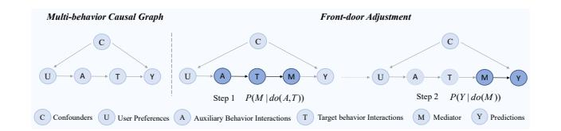
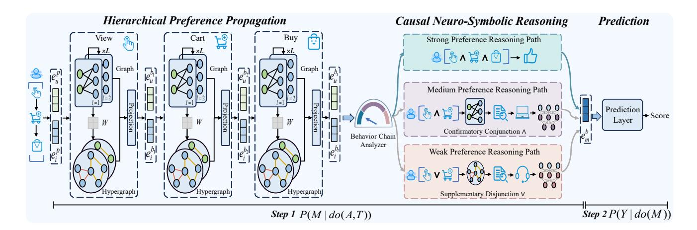
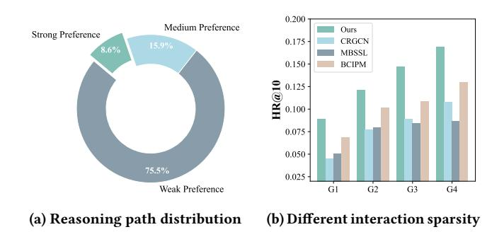
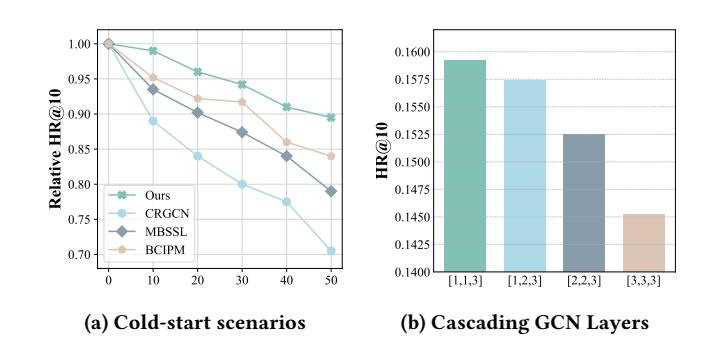

# Modeling Endogenous Logic: Causal Neuro-Symbolic Reasoning Model for Explainable Multi-Behavior Recommendation

[Yuzhe Chen](https://orcid.org/0000-0001-8884-7780) School of Computer Science and Engineering Nanjing University of Science and Technology Nanjing, China chenyuzhe@njust.edu.cn

[Jie Cao](https://orcid.org/0000-0002-7049-5614)∗ School of Management Hefei University of Technology Hefei, China cao\_jie@hfut.edu.cn

[Youquan Wang](https://orcid.org/0000-0003-4726-7493) School of Computer Science and Artificial Intelligence Nanjing University of Finance and Economics Nanjing, China youq.wang@gmail.com

[Haicheng Tao](https://orcid.org/0000-0002-1286-2578) School of Computer Science and Artificial Intelligence Nanjing University of Finance and Economics Nanjing, China haicheng.tao@nufe.edu.cn

[Darko B. Vukovic](https://orcid.org/0000-0002-1165-489X) Department of Finance and Accounting Saint Petersburg State University St. Petersburg, Russian Federation d.vukovic@gsom.spbu.ru

[Jia Wu](https://orcid.org/0000-0002-1371-5801) School of Computing Macquarie University Sydney, Australia jia.wu@mq.edu.au

### Abstract

Existing multi-behavior recommendations tend to prioritize performance at the expense of explainability, while current explainable methods suffer from limited generalizability due to their reliance on external information. Neuro-Symbolic integration offers a promising avenue for explainability by combining neural networks with symbolic logic rule reasoning. Concurrently, we posit that user behavior chains (e.g., view→cart→buy) inherently embody an endogenous logic suitable for explicit reasoning. However, these observational multiple behaviors are plagued by confounders, causing models to learn spurious correlations. By incorporating causal inference into this Neuro-Symbolic framework, we propose a novel Causal Neuro-Symbolic Reasoning model for Explainable Multi-Behavior Recommendation (CNRE). CNRE operationalizes the endogenous logic by simulating a human-like decision-making process. Specifically, CNRE first employs hierarchical preference propagation to capture heterogeneous cross-behavior dependencies. Subsequently, it models the endogenous logic rule implicit in the user's behavior chain based on preference strength, and adaptively dispatches to the corresponding neural-logic reasoning path (e.g., conjunction ∧, disjunction ∨). This process generates an explainable causal mediator that approximates an ideal state isolated from confounding effects. Extensive experiments on three large-scale datasets demonstrate CNRE's significant superiority over state-ofthe-art baselines, offering multi-level explainability from model design and decision process to recommendation results.

∗Corresponding author.

This work was supported by the National Natural Science Foundation of China (Grant Nos. 72342011 and 72172057).

[This work is licensed under a Creative Commons Attribution 4.0 International License.](https://creativecommons.org/licenses/by/4.0) WWW '26, Dubai, United Arab Emirates

© 2026 Copyright held by the owner/author(s). ACM ISBN 978-x-xxxx-xxxx-x/YYYY/MM <https://doi.org/10.1145/nnnnnnn.nnnnnnn>

# CCS Concepts

• Information systems → Recommender systems.

# Keywords

Multi-behavior Recommendation; Explainable Recommendation; Neuro-Symbolic Reasoning; Causal Inference

### ACM Reference Format:

Yuzhe Chen, Jie Cao, Youquan Wang, Haicheng Tao, Darko B. Vukovic, and Jia Wu. 2026. Modeling Endogenous Logic: Causal Neuro-Symbolic Reasoning Model for Explainable Multi-Behavior Recommendation. In Proceedings of the ACM Web Conference 2026 (WWW '26), April 13–17, 2026, Dubai, United Arab Emirates. ACM, New York, NY, USA, [11](#page-10-0) pages. <https://doi.org/10.1145/nnnnnnn.nnnnnnn>

# 1 Introduction

In the modern Web ecosystem, understanding personalized user preferences is pivotal. Multi-behavior recommendation (MBR) leverages auxiliary user behaviors to alleviate data sparsity and better capture user preferences [\[9,](#page-8-0) [39\]](#page-9-0), employing architectures ranging from parallel [\[5,](#page-8-1) [32\]](#page-8-2) to cascading [\[7,](#page-8-3) [37\]](#page-9-1) methods. Recently, nearly 35% of MBR models have adopted contrastive learning to boost performance [\[17,](#page-8-4) [40\]](#page-9-2). However, this pursuit of accuracy has led to two fundamental issues. First, these methods typically learn a single, uniform representation of user preference, overlooking the distinct preference strengths manifest in a user's behavior chain (e.g., the weak preference of a view-only behavior versus the stronger, escalating intent behind a view→cart progression) [\[22\]](#page-8-5). Second, the reliance on inherently black-box algorithms like contrastive learning sacrifices explainability [\[42\]](#page-9-3), a cornerstone for building transparent and trustworthy recommender systems.

To enhance the transparency of recommender systems, explainable recommendation has become a crucial research area [\[45\]](#page-9-4). The dominant paradigm in this field primarily seeks to achieve explainability by incorporating external information. This includes leveraging textual reviews [\[2\]](#page-8-6) or attributes [\[34\]](#page-9-5), mining explainable

reasoning paths on knowledge graphs (KGs) [\[1\]](#page-8-7). More recently, the generative capabilities of large language models (LLMs) have also been employed to produce natural language explanations [\[23\]](#page-8-8), while other studies have introduced causal inference to enhance interpretability [\[21\]](#page-8-9). A particularly promising technical direction within this paradigm is Neuro-Symbolic (NeSy) integration. By extending symbolic logic to continuous embedding spaces, NeSy synergizes the robust representation learning of neural networks with the explicit reasoning of symbolic systems. This continuous relaxation bridges the gap between perception and reasoning, enabling the derivation of transparent logic rules robust to complex data distributions. This is typically achieved by formulating external information (e.g., attributes or KG triples) as logical predicates composed via logical connectives (e.g., ∧, ∨) [\[41\]](#page-9-6). While extensively studied in fields like KG reasoning [\[6\]](#page-8-10), NeSy has recently been adapted for recommender systems to provide rule-based explainability [\[46\]](#page-9-7). Table 1 illustrates examples of such logic rules.

Table 1: Examples of constructing logic rules and corresponding interpretations.

However, relying on external information imposes limitations. First, it impedes generalizability and practicality; in multi-behavior scenarios, maintaining extensive attributes across heterogeneous behaviors incurs prohibitive costs, while LLMs introduce hallucination risks. Second, grounding explanations in external information restricts them to being merely declarative. They can clarify what the logic rule is (e.g., attribute A ∧ attribute B), but fail to reveal the model's intrinsic reasoning process—the why and how of its decisions. For instance, KEMB-Rec [\[11\]](#page-8-11), the sole existing explainable MBR model, relies on external KGs and black-box contrastive learning [\[42\]](#page-9-3), which compromises the faithfulness of its explanations.

To address these challenges, we argue that the user's behavior chain constitutes an endogenous logic: the completeness and type of a preference escalation chain (e.g., view→cart→buy) directly reflect a user's escalating preference strength and correspond to distinct symbolic logic rules (Table 1). However, since interaction data is observational, applying this endogenous logic faces the challenge of spurious correlations caused by confounders [\[4\]](#page-8-12). To this end, Frontdoor Adjustment is an ideal framework [\[43\]](#page-9-8), as it effectively isolates the true causal effect, elevating user preference understanding from a correlational to the causal level, while its structured two-step process inherently provides model design explainability.

Building on this, we incorporate causal inference into the Neuro-Symbolic framework to propose a novel Causal Neuro-symbolic

Reasoning model for Explainable multi-behavior recommendation (CNRE). First, the Hierarchical Preference Propagation module mitigates behavior heterogeneity and cross-behavior dependency through behavior-aware parallel encoding and the cascading structure, while its adaptive projection mechanism suppresses confounders from upstream behaviors. Second, the Causal Neuro-Symbolic Reasoning module first models the endogenous logic rule implicit in the user's behavior chain based on its preference strength, and then adaptively dispatches to the corresponding neural-logic reasoning path, such as: (1) Direct processing for strong preferences; (2) Confirmatory conjunction (∧) inference for medium preferences; and (3) Supplementary disjunction (∨) inference for weak preferences, thereby generating an explainable causal mediator that approximates an ideal state isolated from confounding effects. Crucially, this endogenous approach is highly efficient, avoiding the significant computational overhead of processing external attributes required by models like FENCR [\[46\]](#page-9-7). This two-stage process yields robust recommendations grounded in self-contained, multi-level explainability. Our contributions are summarized as follows:

Novel paradigm: We are the first to systematically explore the problem of explainability in multi-behavior recommendation. This paradigm moves beyond the dominant reliance on external information, offering a self-contained and generalizable approach that provides multi-level explainability spanning from model design and decision process to recommendation results.

Novel methodology: CNRE features an adaptive reasoning mechanism that simulates human-like decision-making by translating the strength of a user's behavior chain into distinct neural-logic operations, thereby constructing an explainable causal mediator that approximates an ideal state isolated from confounding effects.

Superior performance and explainability: Extensive experiments on three datasets demonstrate that CNRE outperforms stateof-the-art baselines in recommendation performance, while detailed experimental analyses validate its multi-level explainability.

# 2 Related Work

### 2.1 Multi-behavior Recommendation

Multi-behavior recommendation (MBR) aims to alleviate data sparsity and better profile user preferences by leveraging auxiliary user behaviors [\[5,](#page-8-1) [15\]](#page-8-13). Modern MBR methods employ various approaches to encode multi-behavior interactions [\[17\]](#page-8-4). For instance, parallel modeling approaches encode different behaviors as independent views to address behavior heterogeneity [\[16\]](#page-8-14). In contrast, cascading modeling approaches model the user's behavior chain (e.g., view→buy), enhancing the embedding learning for a latter behavior with the embeddings learned from upstream ones to address cross-behavior dependency [\[20,](#page-8-15) [37\]](#page-9-1). To further boost performance, many MBR models have incorporated complex black box techniques like contrastive learning to enhance representation robustness [\[35\]](#page-9-9). However, this pursuit of performance has led to a general neglect of model explainability [\[42\]](#page-9-3). Our work aims to bridge this critical gap by conducting the first systematic exploration of explainability.

# 2.2 Explainable Recommendation

Explainable recommendation aims to enhance system transparency. Methods are broadly categorized as model-intrinsic or post-hoc [\[45\]](#page-9-4).

| Dataset | Users  | Items  | Interactions | Behavior Type            |
|---------|--------|--------|--------------|--------------------------|
| Beibei  | 21,716 | 7,977  | 3,338,068    | View, Cart, Buy          |
| Taobao  | 48,749 | 39,493 | 1,952,931    | View, Cart, Buy          |
| Tmall   | 15,449 | 11,953 | 1,395,273    | View, Collect, Cart, Buy |

Table 3: Overall performance in terms of HR@K and NDCG@K on the three datasets (abbreviated as H@K and N@K). Bold numbers indicate the best performance, "\*" indicates the statistical significance over the best baseline using a t-test with �� < 0.05.

| Type            | Method  | H@10     | N@10     | Beibei H@50 | N@50     | H@10     | N@10     | Taobao H@50 | N@50     | H@10     | Tmall N@10 | H@50     | N@50     |
|-----------------|---------|----------|----------|-------------|----------|----------|----------|-------------|----------|----------|------------|----------|----------|
| Single-behavior | NeuMF   | 0.0161   | 0.0088   | 0.0348      | 0.0112   | 0.0085   | 0.0037   | 0.0385      | 0.0154   | 0.0129   | 0.0062     | 0.0297   | 0.0109   |
|                 | MBGCN   | 0.0393   | 0.0219   | 0.0847      | 0.0315   | 0.0433   | 0.0244   | 0.0938      | 0.0351   | 0.0487   | 0.0232     | 0.1062   | 0.0353   |
|                 | MBSSL   | 0.0610   | 0.0344   | 0.1136      | 0.0595   | 0.0847   | 0.0420   | 0.1712      | 0.0639   | 0.0734   | 0.0416     | 0.1541   | 0.0645   |
| Multi-behavior  | CRGCN   | 0.0389   | 0.0271   | 0.0841      | 0.0388   | 0.0796   | 0.0384   | 0.1721      | 0.0554   | 0.0715   | 0.0427     | 0.1525   | 0.0669   |
|                 | MB-CGCN | 0.0507   | 0.0325   | 0.1096      | 0.0469   | 0.1165   | 0.0626   | 0.2517      | 0.0898   | 0.1044   | 0.0592     | 0.2088   | 0.0858   |
|                 | BCIPM   | 0.0743   | 0.0353   | 0.1608      | 0.0573   | 0.1361   | 0.0768   | 0.2942      | 0.1193   | 0.1252   | 0.0738     | 0.2379   | 0.0994   |
| Causal          | CausalD | 0.0650   | 0.0312   | 0.1365      | 0.0465   | 0.0924   | 0.0471   | 0.1932      | 0.0705   | 0.0783   | 0.0461     | 0.1638   | 0.0690   |
|                 | DCCF    |          |          |             |          | 0.0952   | 0.0486   | 0.1995      | 0.0723   | 0.0807   | 0.0476     | 0.1682   | 0.0705   |
| Explainable     | NS-ICF  |          |          |             |          | 0.0784   | 0.0339   | 0.1686      | 0.0486   | 0.0682   | 0.0341     | 0.1488   | 0.0563   |
|                 | FENCR   |          |          |             |          | 0.0893   | 0.0445   | 0.1928      | 0.0638   | 0.0760   | 0.0452     | 0.1614   | 0.0697   |
| Ours            | CNRE    | 0.1074 ∗ | 0.0523 ∗ | 0.2310 ∗    | 0.0758 ∗ | 0.1592 ∗ | 0.0976 ∗ | 0.3435 ∗    | 0.1398 ∗ | 0.1385 ∗ | 0.0827 ∗   | 0.2936 ∗ | 0.1158 ∗ |

behaviors. Similarly, the Tmall dataset [\[38\]](#page-9-14) encompasses four behavior types: view, collect, cart, and buy. Detailed statistics for all datasets are summarized in Table 2.

### 5.2 Baselines

We compare our method with the following three types of recommendation models: Single-behavior Model like NeuMF [\[13\]](#page-8-30) a neural collaborative filtering approach. Multi-behavior Models including parallel MBGCN [\[16\]](#page-8-14) , cascading (e.g., CRGCN [\[37\]](#page-9-1), MB-CGCN [\[7\]](#page-8-3)), and contrastive learning-based (e.g., MBSSL [\[35\]](#page-9-9)) architectures, as well as models that learn behavior contextualized item preferences (e.g., BCIPM [\[38\]](#page-9-14)). Causal Inference Models including DCCF [\[36\]](#page-9-12), which employs FDA on item features to mitigate confounders, and CausalD [\[43\]](#page-9-8), which utilizes causal distillation to alleviate performance heterogeneity. Explainable Neuro-Symbolic Models include NS-ICF[\[44\]](#page-9-10), which learns rules from attributes using a three-tower architecture, and FENCR [\[46\]](#page-9-7), which enhances attribute-based rules with feature embeddings.

### 5.3 Overall Performance (RQ1)

We performed extensive experiments to make recommendations on three public datasets. From the results in Table 3, we summarize the following key observations: Consistent with prior work, all multi-behavior models significantly outperform the single-behavior baseline, confirming that leveraging multiple types of behavior provides a more comprehensive understanding of user preferences.

Compared to other multi-behavior models, CNRE's hybrid architecture of cascading (CRGCN and MB-CGCN) and parallel (MBGCN) encoding systematically mitigates behavior heterogeneity and dependency. Unlike black-box contrastive learning models such as MB-SSL and models focusing on specific behaviors like BCIPM, CNRE models the entire preference escalation chain through a two-stage Front-door Adjustment, thereby achieving superior performance while providing multi-level explainability. This also represents a paradigm shift compared to Neuro-Symbolic models like NS-ICF and FENCR. Instead of relying on external attribute information to

Table 4: Ablation study of key components on CNRE.

|      | Methods | H@10 Hierarchical | Beibei N@10    | H@10 Preference | Taobao N@10 Propagation | H@10 Module | Tmall N@10 |
|------|---------|-------------------|----------------|-----------------|-------------------------|-------------|------------|
| w/o  | HPP     | 0.0846            | 0.0442         | 0.1237          | 0.0898                  | 0.1080      | 0.0728     |
| w/o  | PAR     | 0.0954            | 0.0485         | 0.1392          | 0.0936                  | 0.1191      | 0.0769     |
| w/o  | PRJ     | 0.1025            | 0.0504         | 0.1454          | 0.0955                  | 0.1260      | 0.0802     |
|      |         | Causal            | Neuro-Symbolic | Reasoning       |                         | Module      |            |
| w/o  | REA     | 0.0930            | 0.0469         | 0.1355          | 0.0914                  | 0.1177      | 0.0752     |
| w/o  | CNJ     | 0.0985            | 0.0488         | 0.1451          | 0.0935                  | 0.1261      | 0.0786     |
| w/o  | DSJ     | 0.1012            | 0.0502         | 0.1423          | 0.0928                  | 0.1220      | 0.0782     |
| CNRE |         | 0.1074            | 0.0523         | 0.1592          | 0.0976                  | 0.1385      | 0.0827     |

construct declarative rules, CNRE mines endogenous logic from the behaviors themselves to provide a deeper, procedural explanation for its reasoning process, while simultaneously improving performance. Furthermore, while advanced causal models like DCCF and CausalD also aim to learn purer user preferences, their focus is on debiasing a single behavior signal to obtain performance gains, lacking both the rich information from auxiliary behaviors and the intrinsic explainability of CNRE's reasoning process. This independence from external information grants CNRE greater generality, allowing it to operate on datasets like Beibei, on which DCCF, NS-ICF and FENCR cannot run due to missing required attributes.

### 5.4 Ablation Study (RQ2)

To validate the contribution of each key component in the CNRE framework, we conducted an ablation study with the following variants: (1) w/o HPP: removes the Hierarchical Preference Propagation module and replaces it with a simple parallel GCN encoder; (2) w/o PAR: removes the parallel hypergraph enhancement; (3) w/o PRJ:removes the adaptive projection mechanism; (4) w/o REA: removes the core Causal Neuro-Symbolic Reasoning module; (5)

w/o CNJ: removes the confirmatory conjunction inference path; (6) w/o DSJ: removes the supplementary disjunction inference path.

Table 4 validates the effectiveness of our Hierarchical Preference Propagation module. Specifically, the decline in w/o HPP proves that simple parallel encoding fails to capture the progressive escalation of user intent across the behavior chain. Similarly, the results for w/o PAR and w/o PRJ highlight the critical role of parallel hypergraph encoding in capturing high-order correlations amidst behavior heterogeneity, and the adaptive projection in effectively disentangling true preference signals from upstream confounders.

Removing the entire reasoning module (w/o REA) precipitates a significant performance decline and, crucially, results in a complete loss of CNRE's multi-level explainability. The degradation of w/o CNJ is particularly pronounced on the dense Beibei dataset, highlighting the confirmatory conjunction's effectiveness in filtering noise and solidifying ambiguous, medium-preference signals (e.g., �������� ∧ ��������). Conversely, the performance drop for w/o DSJ is more significant on the sparser Taobao dataset. This demonstrates that the supplementary disjunction inference successfully alleviates data sparsity by retrieving high-order semantic embedding to infer potential interests when explicit signals are weak.

# 5.5 Multi-level Explainability Analysis (RQ3)

By modeling the endogenous logic of multi-behaviors, CNRE provides a multi-level explainability framework. Consistent with the standard practice in multi-behavior recommendation research that utilizes public, offline datasets, conducting a large-scale user study was infeasible for this work. Therefore, drawing upon the analytical paradigms of existing explainability research, this section presents a comprehensive and in-depth analysis of CNRE's explainability.

5.5.1 Model Design Explainability. The design-level explainability of CNRE is detailed in Section 3.2 and depicted in the Figure 1. The model's architecture decomposes the reasoning process into the two requisite stages of FDA: first, estimating the effect of the behavior chain on the causal mediator �� (��|���� (��,�� )), and second, estimating the effect of the mediator on the final prediction �� (�� |���� (��)). This two-stage process ensures that CNRE's architecture is not an opaque "black box," but is instead inherently transparent and possesses the theoretical explainability provided by FDA.

5.5.2 Decision Process Explainability. The explainability of our decision process stems from a fundamental shift from the implicit representation learning of cascading models (e.g., CRGCN, MB-CGCN) to an explicit, adaptive reasoning mechanism. Specifically, CNRE employs three distinct reasoning paths based on the preference strength manifested in the user's behavior chain: supplementary disjunction inference to alleviate weak preferences, confirmatory conjunction inference to validate uncertain preferences, and direct recommendation for strong buy preferences. To quantitatively validate this process, we analyze the activation distribution of these three paths on the Taobao dataset, as shown in Figure 3(a). This figure corrects a visualization rounding artifact present in the conference proceedings version.

This three-path division is a principled design choice that mirrors the e-commerce conversion funnel. For instance, the weak preference path addresses scenarios where the user's behavior signal is

singular and highly uncertain, while the medium preference path handles cases of composite behaviors where intent is enhanced but the decision remains incomplete. This logic rule-based design is crucial for procedural explainability, which would be lost if these paths were learned adaptively by another black-box model.

Figure 3: Analysis of decision process explainability.

To validate the adaptiveness of our reasoning process, we analyzed user groups with varying sparsity (G1-G4). CNRE consistently outperforms baselines across all densities (Figure 3(b)). The model adaptively employs supplementary disjunction in low-density scenarios (G1, G2) to enhance weak signals, while shifting to confirmatory conjunction in high-density scenarios (G3, G4) to validate uncertain preferences. This dynamic path selection makes the model's decision process transparent and explainable.

5.5.3 Recommendation Result Explainability. Aligning with Neuro-Symbolic surveys [\[41\]](#page-9-6) that identify the explicit tracking of inference steps as a core source of explainability, we present case studies from the Taobao dataset in Table 5. We validate CNRE's transparency via counterfactual analysis, examining how perturbing the behavior chain impacts the model's inference path and results.

In Case #1, for a medium-strength chain (view=1, cart=1), the model adaptively generates the logic rule view ∧ cart and activates the confirmatory conjunction inference (∧) path. The corresponding counterfactual analysis (#1\*) shows that removing the 'cart' behavior prompts a logical downgrade to the weak preference path (disjunction ∨), strongly demonstrating the explanation's causal consistency. In Case #2, for a weak signal (view=1, cart=0) where collaborative information can be unreliable, the model employs the supplementary disjunction inference (∨). This path retrieves semantic embeddings from the hypergraph to enhance the weak preference, a crucial function in data-sparse scenarios. Its counterfactual analysis (#2\*) reveals a profound, non-monotonic reasoning: while adding the view behavior upgrades the path as expected, the recommendation score counter-intuitively decreases. This phenomenon arises because the reasoning process is inherently contextsensitive: the path transition reconfigures the logical expression, and the newly incorporated collaborative embedding may encode negative latent patterns, thereby justifying a more conservative and calibrated prediction.

Notably, CNRE does not utilize temporal information; thus, the cascading encoding process inherently precludes interactions that violate the behavior chain (e.g., cart→view). We directly activate the strong preference path for skip-behavior chains (e.g., view→buy).

Table 5: Case study and counterfactual analysis of CNRE's recommendation result explainability. \* denotes a counterfactual analysis of the corresponding base case. Bolded values in the counterfactual rows highlight deviations from the original case.

| Case Item ID Behavior Chain      |  | Inference   | Path        | Inferred | Rationale & Recommendation                               |
|----------------------------------|--|-------------|-------------|----------|----------------------------------------------------------|
| #1 4350 view=1, cart=1, buy=0    |  | Medium      | Preference; |          |                                                          |
|                                  |  | Conjunction | Inference   | ∧        |                                                          |
|                                  |  |             |             | Initial  | Confidence < �� → Retrieve Collaborative Embedding (item |
|                                  |  |             |             | 32039)   | → Neural Conjunction Operation ∧ → Causal Mediator       |
|                                  |  |             |             | → Final  | Recommendation (item 12226, score 0.713).                |
| #2 22470 view=0, cart=1, buy=0   |  | Weak        | Preference; |          |                                                          |
|                                  |  | Disjunction | Inference   | ∨        |                                                          |
|                                  |  |             |             | Without  | Confidence Calc → Retrieve Semantic Embedding (item      |
|                                  |  |             |             | 32755)   | → Neural Disjunction Operation ∨ → Causal Mediator       |
|                                  |  |             |             | → Final  | Recommendation (item 21517, score 0.662).                |
| #1* 4350 view=1, cart=0 , buy=0  |  | Weak        | Preference; |          |                                                          |
|                                  |  | Disjunction | Inference   | ∨        |                                                          |
|                                  |  |             |             | When     | ’cart’ is removed, the path switches to weak inference   |
|                                  |  |             |             | Skip     | Confidence Calc → Retrieve Semantic Embedding (item      |
|                                  |  |             |             | 34516 )  | → Final Recommendation (item 956 , score 0.652 ).        |
| #2* 22470 view=1 , cart=1, buy=0 |  | Medium      | Preference; |          |                                                          |
|                                  |  | Conjunction | Inference   | ∧        |                                                          |
|                                  |  |             |             | When     | ’view’ is added, the path upgrades to medium inference   |
|                                  |  |             |             | Initial  | Confidence < �� → Retrieve Collaborative Embedding (item |
|                                  |  |             |             | 19515 )  | → Final Recommendation (item 7180 , score 0.595 ).       |

Even though upstream auxiliary behaviors are affected by confounders, the buy behavior, as the ground truth, embodies the user's strongest preference, and prioritizing it is also a widely-recognized strategy in the recommender system domain.

5.5.4 Efficiency Evaluation of Explainability. Unlike post-hoc models such as CausalX [\[18\]](#page-8-19) and LLMXRec [\[23\]](#page-8-8) that incur additional overhead, CNRE's explainability is intrinsic. Its reasoning path is embedded in the forward pass, yielding explanations that are structurally faithful and computationally efficient.

To theoretically quantify this efficiency, we further analyze CNRE's time complexity. Let �� be the number of GCN layers, �� is the embedding dimension, ������������ is the total number of interactions, and ���� the batch size. CNRE's total complexity is ��(�� ·������������ ·�� +���� ·�� ). This is comparable to BCIPM ��(�� · ������������ · �� + ���� · ���� · �� 2 ), but our reasoning cost is superior as it does not scale with the neighborhood size ���� . The advantage is most pronounced when compared to the Neuro-Symbolic model FENCR, whose complexity is ��(���� · ������������ · �� · �� ). FENCR's reasoning cost scales linearly with its number of predefined rules (������������ ) and external attributes (��), whereas CNRE's core reasoning module��(���� ·�� 2 ) is independent of these factors. This reliance on external information makes FENCR computationally expensive and difficult to scale, especially in multibehavior contexts where managing distinct attribute sets for each behavior could lead to a combinatorial explosion in complexity.

### 5.6 Robustness and Hyperparameter Sensitivity Analysis (RQ4)

We simulated cold-start scenarios on the Taobao dataset by progressively removing 10% to 50% of historical interactions for 50% of the users. As shown in Figure 4a, while all models' performance declined with increasing data sparsity, CNRE consistently exhibited the smallest degradation and significantly outperformed all baselines. This is attributed to our hybrid architecture, which addresses behavior heterogeneity and cross-behavior dependency, and our causal reasoning module, which enhances preferences at varying strengths by constructing logic rules and reasoning.

Figure 4: Robustness and cascading effectiveness analysis.

As the data distribution and weight of different behaviors vary, setting the optimal number of graph convolution layers for each behavior in the chain is crucial for the cascading method to encode a user's progressive preferences. Our parameter analysis (Figure 4b) shows that the combination [1,1,3] achieves the best performance. This is because upstream behaviors (view, cart) are dense and more susceptible to confounders. For the downstream target behavior, which is sparse but carries the strongest weight; therefore, using the 3-layer GCN leads to performance improvements.

### 6 Conclusions and Future Work

In this paper, we propose a novel Causal Neuro-Symbolic reasoning model CNRE. CNRE simulates a human-like reasoning process by adaptively dispatching to distinct neural-logic paths based on the preference strength inferred from a user's behavior chain. By modeling and reasoning on these endogenous logic rules, our model achieves significant performance gains in recommendation accuracy and provides multi-level explainability, as demonstrated by extensive experiments on three real-world datasets. Acknowledging the lack of recognized quantitative metrics for explainable recommendation and that robust user studies require extensive multidisciplinary knowledge, our future work will focus on designing a human-centric, quantifiable evaluation framework and conducting

large-scale user studies to validate our model's real-world utility and alignment with human cognitive reasoning. References [1] Xingjuan Cai, Lijie Xie, Rui Tian, and Zhihua Cui. 2022. Explicable recommendation based on knowledge graph. Expert Syst. Appl. 200 (2022), 117035. [doi:10.1016/J.ESWA.2022.117035](https://doi.org/10.1016/J.ESWA.2022.117035) [2] Zerui Cai. 2021. Generating Explanations for Recommendation Systems via Injective VAE. In IEEE International Conference on Data Mining, ICDM 2021, Auckland, New Zealand, December 7-10, 2021, James Bailey, Pauli Miettinen, Yun Sing Koh, Dacheng Tao, and Xindong Wu (Eds.). IEEE, 1012–1017. [doi:10.1109/ICDM51629.](https://doi.org/10.1109/ICDM51629.2021.00115) [2021.00115](https://doi.org/10.1109/ICDM51629.2021.00115) [3] Tommaso Carraro, Alessandro Daniele, Fabio Aiolli, and Luciano Serafini. 2022. Logic Tensor Networks for Top-N Recommendation. In AIxIA 2022 - Advances in Artificial Intelligence - XXIst International Conference of the Italian Association for Artificial Intelligence, AIxIA 2022, Udine, Italy, November 28 - December 2, 2022, Proceedings (Lecture Notes in Computer Science, Vol. 13796), Agostino Dovier, Angelo Montanari, and Andrea Orlandini (Eds.). Springer, 110–123. [doi:10.1007/](https://doi.org/10.1007/978-3-031-27181-6_8) [978-3-031-27181-6\\_8](https://doi.org/10.1007/978-3-031-27181-6_8) [4] Jiawei Chen, Hande Dong, Xiang Wang, Fuli Feng, Meng Wang, and Xiangnan He. 2023. Bias and Debias in Recommender System: A Survey and Future Directions. ACM Trans. Inf. Syst. 41, 3 (2023), 67:1–67:39. [doi:10.1145/3564284](https://doi.org/10.1145/3564284) [5] Yuzhe Chen, Jie Cao, Youquan Wang, Jia Wu, Huanhuan Chen, and Guandong Xu. 2025. Causal Variational Inference for Deconfounded Multi-Behavior Recommendation. ACM Trans. Inf. Syst. 43, 6 (2025), 151:1–151:26. [doi:10.1145/3745023](https://doi.org/10.1145/3745023) [6] Kewei Cheng, Nesreen K. Ahmed, Ryan A. Rossi, Theodore L. Willke, and Yizhou Sun. 2024. Neural-Symbolic Methods for Knowledge Graph Reasoning: A Survey. ACM Trans. Knowl. Discov. Data 18, 9 (2024), 225:1–225:44. [doi:10.1145/3686806](https://doi.org/10.1145/3686806) [7] Zhiyong Cheng, Sai Han, Fan Liu, Lei Zhu, Zan Gao, and Yuxin Peng. 2023. Multi-Behavior Recommendation with Cascading Graph Convolution Networks. In Proceedings of the ACM Web Conference 2023, WWW 2023, Austin, TX, USA, 30 April 2023 - 4 May 2023, Ying Ding, Jie Tang, Juan F. Sequeda, Lora Aroyo, Carlos Castillo, and Geert-Jan Houben (Eds.). ACM, 1181–1189. [doi:10.1145/3543507.](https://doi.org/10.1145/3543507.3583439) [3583439](https://doi.org/10.1145/3543507.3583439) [8] Chen Gao, Yu Zheng, Wenjie Wang, Fuli Feng, Xiangnan He, and Yong Li. 2024. Causal Inference in Recommender Systems: A Survey and Future Directions. ACM Trans. Inf. Syst. 42, 4 (2024), 88:1–88:32. [doi:10.1145/3639048](https://doi.org/10.1145/3639048) [9] Shuwei Gong, Yuting Liu, Yizhou Dang, Guibing Guo, Jianzhe Zhao, and Xingwei Wang. 2025. Multiple Purchase Chains with Negative Transfer Elimination for Multi-Behavior Recommendation. In AAAI-25, Sponsored by the Association for the Advancement of Artificial Intelligence, February 25 - March 4, 2025, Philadelphia, PA, USA, Toby Walsh, Julie Shah, and Zico Kolter (Eds.). AAAI Press, 11717–11725. [doi:10.1609/AAAI.V39I11.33275](https://doi.org/10.1609/AAAI.V39I11.33275) [10] Shuyun Gu, Xiao Wang, Chuan Shi, and Ding Xiao. 2022. Self-supervised Graph Neural Networks for Multi-behavior Recommendation. In Proceedings of the Thirty-First International Joint Conference on Artificial Intelligence, IJCAI 2022, Vienna, Austria, 23-29 July 2022, Luc De Raedt (Ed.). ijcai.org, 2052–2058. [11] Feipeng Guo and Zifan Wang. 2025. KEMB-Rec: Knowledge-Enhanced Explainable Multibehavior Recommendation With Graph Contrastive Learning. IEEE Internet Things J. 12, 4 (2025), 3563–3576. [doi:10.1109/JIOT.2024.3439527](https://doi.org/10.1109/JIOT.2024.3439527) [12] Xiangnan He, Kuan Deng, Xiang Wang, Yan Li, Yongdong Zhang, and Meng Wang. 2020. Lightgcn: Simplifying and powering graph convolution network for recommendation. In Proceedings of the 43rd International ACM SIGIR conference on research and development in Information Retrieval. 639–648. [13] Xiangnan He, Lizi Liao, Hanwang Zhang, Liqiang Nie, Xia Hu, and Tat-Seng Chua. 2017. Neural Collaborative Filtering. In Proceedings of the 26th International Conference on World Wide Web, WWW 2017, Perth, Australia, April 3-7, 2017, Rick Barrett, Rick Cummings, Eugene Agichtein, and Evgeniy Gabrilovich (Eds.). ACM, 173–182. [doi:10.1145/3038912.3052569](https://doi.org/10.1145/3038912.3052569) [14] Xiangnan He, Yang Zhang, Fuli Feng, Chonggang Song, Lingling Yi, Guohui Ling, and Yongdong Zhang. 2023. Addressing Confounding Feature Issue for Causal Recommendation. ACM Trans. Inf. Syst. 41, 3 (2023), 53:1–53:23. [doi:10.1145/](https://doi.org/10.1145/3559757) [3559757](https://doi.org/10.1145/3559757) [15] Sirui Huang, Qian Li, Xiangmeng Wang, Dianer Yu, Guandong Xu, and Qing Li. 2024. Counterfactual Debasing for Multi-behavior Recommendations. In Database Systems for Advanced Applications: 29th International Conference, DASFAA 2024, Gifu, Japan, July 2–5, 2024, Proceedings, Part III (Gifu, Japan). Springer-Verlag, Berlin, Heidelberg, 164–179. [doi:10.1007/978-981-97-5555-4\\_11](https://doi.org/10.1007/978-981-97-5555-4_11) [16] Bowen Jin, Chen Gao, Xiangnan He, Depeng Jin, and Yong Li. 2020. Multibehavior Recommendation with Graph Convolutional Networks. In Proceedings of the 43rd International ACM SIGIR conference on research and development in Information Retrieval, SIGIR 2020, Virtual Event, China, July 25-30, 2020, Jimmy X. Huang, Yi Chang, Xueqi Cheng, Jaap Kamps, Vanessa Murdock, Ji-Rong Wen, and Yiqun Liu (Eds.). ACM, 659–668. [doi:10.1145/3397271.3401072](https://doi.org/10.1145/3397271.3401072) [17] Kyungho Kim, Sunwoo Kim, Geon Lee, Jinhong Jung, and Kijung Shin. 2025. Multibehavior Recommender Systems: A Survey. In Advances in Knowledge Discovery and Data Mining - 29th Pacific-Asia Conference on Knowledge Discovery and Data Mining, PAKDD 2025, Sydney, NSW, Australia, June 10-13, 2025, Proceedings, Part IV (Lecture Notes in Computer Science, Vol. 15873), Xintao Wu, Myra Spiliopoulou, Can Wang, Vipin Kumar, Longbing Cao, Yanqiu Wu, Yu Yao, and Zhangkai Wu (Eds.). Springer, 435–452. [doi:10.1007/978-981-96-8183-9\\_31](https://doi.org/10.1007/978-981-96-8183-9_31) [18] Guanrong Li, Haolin Yang, Xinyu Liu, Zhen Wu, and Xinyu Dai. 2025. Counterfactual Language Reasoning for Explainable Recommendation Systems. CoRR abs/2503.08051 (2025). arXiv[:2503.08051](https://arxiv.org/abs/2503.08051) [doi:10.48550/ARXIV.2503.08051](https://doi.org/10.48550/ARXIV.2503.08051) [19] Lei Li, Yongfeng Zhang, and Li Chen. 2023. Personalized Prompt Learning for Explainable Recommendation. ACM Trans. Inf. Syst. 41, 4 (2023), 103:1–103:26. [doi:10.1145/3580488](https://doi.org/10.1145/3580488) [20] Nan Liu, Shunmei Meng, Yu Jiang, Qianmu Li, Xiaolong Xu, Lianyong Qi, and Xuyun Zhang. 2024. Cascading Graph Convolution Contrastive Learning Networks for Multi-behavior Recommendation. In Database Systems for Advanced Applications - 29th International Conference, DASFAA 2024, Gifu, Japan, July 2-5, 2024, Proceedings, Part VI (Lecture Notes in Computer Science, Vol. 14855), Makoto Onizuka, Jae-Gil Lee, Yongxin Tong, Chuan Xiao, Yoshiharu Ishikawa, Sihem Amer-Yahia, H. V. Jagadish, and Kejing Lu (Eds.). Springer, 3–18. [doi:10.1007/978-](https://doi.org/10.1007/978-981-97-5572-1_1) [981-97-5572-1\\_1](https://doi.org/10.1007/978-981-97-5572-1_1) [21] Xu Liu, Tong Yu, Kaige Xie, Junda Wu, and Shuai Li. 2024. Interact with the Explanations: Causal Debiased Explainable Recommendation System. In Proceedings of the 17th ACM International Conference on Web Search and Data Mining, WSDM 2024, Merida, Mexico, March 4-8, 2024, Luz Angelica Caudillo-Mata, Silvio Lattanzi, Andrés Muñoz Medina, Leman Akoglu, Aristides Gionis, and Sergei Vassilvitskii (Eds.). ACM, 472–481. [doi:10.1145/3616855.3635855](https://doi.org/10.1145/3616855.3635855) [22] Dan Lu, Hao Zhang, Lijie Li, Shiqing Wu, and Guandong Xu. 2024. Cascading Hypergraph Convolution Networks for Multi-Behavior Sequential Recommendation. In 11th International Conference on Behavioural and Social Computing, BESC 2024, Harbin, China, August 16-18, 2024. IEEE, 1–7. [doi:10.1109/BESC64747.2024.](https://doi.org/10.1109/BESC64747.2024.10780584) [10780584](https://doi.org/10.1109/BESC64747.2024.10780584) [23] Yucong Luo, Mingyue Cheng, Hao Zhang, Junyu Lu, and Enhong Chen. 2024. Unlocking the Potential of Large Language Models for Explainable Recommendations. In Database Systems for Advanced Applications - 29th International Conference, DASFAA 2024, Gifu, Japan, July 2-5, 2024, Proceedings, Part V (Lecture Notes in Computer Science, Vol. 14854), Makoto Onizuka, Jae-Gil Lee, Yongxin Tong, Chuan Xiao, Yoshiharu Ishikawa, Sihem Amer-Yahia, H. V. Jagadish, and Kejing Lu (Eds.). Springer, 286–303. [doi:10.1007/978-981-97-5569-1\\_18](https://doi.org/10.1007/978-981-97-5569-1_18) [24] Steffen Rendle, Christoph Freudenthaler, Zeno Gantner, and Lars Schmidt-Thieme. 2012. BPR: Bayesian Personalized Ranking from Implicit Feedback. CoRR abs/1205.2618 (2012). arXiv[:1205.2618](https://arxiv.org/abs/1205.2618)<http://arxiv.org/abs/1205.2618> [25] Ram Shanmugam. 2001. Causality: Models, Reasoning, and Inference : Judea Pearl; Cambridge University Press, Cambridge, UK, 2000, pp 384, ISBN 0-521-77362-8. Neurocomputing 41, 1-4 (2001), 189–190. [doi:10.1016/S0925-2312\(01\)00330-7](https://doi.org/10.1016/S0925-2312(01)00330-7) [26] Shaoyun Shi, Hanxiong Chen, Weizhi Ma, Jiaxin Mao, Min Zhang, and Yongfeng Zhang. 2020. Neural Logic Reasoning. In CIKM '20: The 29th ACM International Conference on Information and Knowledge Management, Virtual Event, Ireland, October 19-23, 2020, Mathieu d'Aquin, Stefan Dietze, Claudia Hauff, Edward Curry, and Philippe Cudré-Mauroux (Eds.). ACM, 1365–1374. [doi:10.1145/3340531.](https://doi.org/10.1145/3340531.3411949) [3411949](https://doi.org/10.1145/3340531.3411949) [27] Juntao Tan, Shuyuan Xu, Yingqiang Ge, Yunqi Li, Xu Chen, and Yongfeng Zhang. 2021. Counterfactual Explainable Recommendation. In CIKM '21: The 30th ACM International Conference on Information and Knowledge Management, Virtual Event, Queensland, Australia, November 1 - 5, 2021, Gianluca Demartini, Guido Zuccon, J. Shane Culpepper, Zi Huang, and Hanghang Tong (Eds.). ACM, 1784– 1793. [doi:10.1145/3459637.3482420](https://doi.org/10.1145/3459637.3482420) [28] Nan Wang, Dan Liu, Jin Zeng, Lijin Mu, and Jinbao Li. 2024. HGRec: Group Recommendation With Hypergraph Convolutional Networks. IEEE Trans. Comput. Soc. Syst. 11, 3 (2024), 4214–4225. [doi:10.1109/TCSS.2024.3363843](https://doi.org/10.1109/TCSS.2024.3363843) [29] Xiangmeng Wang, Qian Li, Dianer Yu, Wei Huang, Qing Li, and Guandong Xu. 2024. Neural Causal Graph collaborative filtering. Inf. Sci. 677 (2024), 120872. [doi:10.1016/J.INS.2024.120872](https://doi.org/10.1016/J.INS.2024.120872) [30] Ying Wang, Xin He, Hongji Wang, Yudong Sun, Xin Wang, and Carlo Ricciardi. 2022. Fast Explainable Recommendation Model by Combining Fine-Grained Sentiment in Review Data. Intell. Neuroscience 2022 (Jan. 2022), 15 pages. [doi:10.](https://doi.org/10.1155/2022/4940401) [1155/2022/4940401](https://doi.org/10.1155/2022/4940401) [31] Maonian Wu, Bang Chen, Shaojun Zhu, Bo Zheng, Wei Peng, and Mingyi Zhang. 2024. Neuro-symbolic recommendation model based on logic query. Knowl. Based Syst. 284 (2024), 111311. [doi:10.1016/J.KNOSYS.2023.111311](https://doi.org/10.1016/J.KNOSYS.2023.111311) [32] Lianghao Xia, Yong Xu, Chao Huang, Peng Dai, and Liefeng Bo. 2021. Graph Meta Network for Multi-Behavior Recommendation. In SIGIR '21: The 44th International ACM SIGIR Conference on Research and Development in Information Retrieval, Virtual Event, Canada, July 11-15, 2021. ACM, 757–766. [33] Yikun Xian, Zuohui Fu, Handong Zhao, Yingqiang Ge, Xu Chen, Qiaoying Huang, Shijie Geng, Zhou Qin, Gerard de Melo, S. Muthukrishnan, and Yongfeng Zhang. 2020. CAFE: Coarse-to-Fine Neural Symbolic Reasoning for Explainable Recommendation. In CIKM '20: The 29th ACM International Conference on Information and Knowledge Management, Virtual Event, Ireland, October 19-23, 2020, Mathieu d'Aquin, Stefan Dietze, Claudia Hauff, Edward Curry, and Philippe Cudré-Mauroux (Eds.). ACM, 1645–1654. [doi:10.1145/3340531.3412038](https://doi.org/10.1145/3340531.3412038)

- [34] Jun Xiao, Hao Ye, Xiangnan He, Hanwang Zhang, Fei Wu, and Tat-Seng Chua. 2017. Attentional Factorization Machines: Learning the Weight of Feature Interactions via Attention Networks. In Proceedings of the Twenty-Sixth International Joint Conference on Artificial Intelligence, IJCAI 2017, Melbourne, Australia, August 19-25, 2017, Carles Sierra (Ed.). ijcai.org, 3119–3125. [doi:10.24963/IJCAI.2017/435](https://doi.org/10.24963/IJCAI.2017/435) [35] Jingcao Xu, Chaokun Wang, Cheng Wu, Yang Song, Kai Zheng, Xiaowei Wang, Changping Wang, Guorui Zhou, and Kun Gai. 2023. Multi-behavior Selfsupervised Learning for Recommendation. In Proceedings of the 46th International ACM SIGIR Conference on Research and Development in Information Retrieval, SIGIR 2023, Taipei, Taiwan, July 23-27, 2023, Hsin-Hsi Chen, Wei-Jou (Edward) Duh, Hen-Hsen Huang, Makoto P. Kato, Josiane Mothe, and Barbara Poblete (Eds.). ACM, 496–505. [doi:10.1145/3539618.3591734](https://doi.org/10.1145/3539618.3591734) [36] Shuyuan Xu, Juntao Tan, Shelby Heinecke, Vena Jia Li, and Yongfeng Zhang. 2023. Deconfounded Causal Collaborative Filtering. Trans. Recomm. Syst. 1, 4 (2023), 1–25. [doi:10.1145/3606035](https://doi.org/10.1145/3606035) [37] Mingshi Yan, Zhiyong Cheng, Chen Gao, Jing Sun, Fan Liu, Fuming Sun, and Haojie Li. 2024. Cascading Residual Graph Convolutional Network for Multi-Behavior Recommendation. ACM Trans. Inf. Syst. 42, 1 (2024), 10:1–10:26. [doi:10.](https://doi.org/10.1145/3587693) [1145/3587693](https://doi.org/10.1145/3587693) [38] Mingshi Yan, Fan Liu, Jing Sun, Fuming Sun, Zhiyong Cheng, and Yahong Han. 2024. Behavior-Contextualized Item Preference Modeling for Multi-Behavior Recommendation. In Proceedings of the 47th International ACM SIGIR Conference on Research and Development in Information Retrieval, SIGIR 2024, Washington DC, USA, July 14-18, 2024, Grace Hui Yang, Hongning Wang, Sam Han, Claudia Hauff, Guido Zuccon, and Yi Zhang (Eds.). ACM, 946–955. [doi:10.1145/3626772.3657696](https://doi.org/10.1145/3626772.3657696) [39] Yuhao Yang, Chao Huang, Lianghao Xia, Yuxuan Liang, Yanwei Yu, and Chenliang
- Li. 2022. Multi-Behavior Hypergraph-Enhanced Transformer for Sequential Recommendation. In KDD '22: The 28th ACM SIGKDD Conference on Knowledge Discovery and Data Mining, Washington, DC, USA, August 14 - 18, 2022, Aidong Zhang and Huzefa Rangwala (Eds.). ACM, 2263–2274. [doi:10.1145/3534678.3539342](https://doi.org/10.1145/3534678.3539342) [40] Yabo Yin, Xiaofei Zhu, Wenshan Wang, Yihao Zhang, Pengfei Wang, Yixing Fan, and Jiafeng Guo. 2024. HEC-GCN: Hypergraph Enhanced Cascading Graph Convolution Network for Multi-Behavior Recommendation. CoRR abs/2412.14476 (2024). arXiv[:2412.14476](https://arxiv.org/abs/2412.14476) [doi:10.48550/ARXIV.2412.14476](https://doi.org/10.48550/ARXIV.2412.14476) [41] Dongran Yu, Bo Yang, Dayou Liu, Hui Wang, and Shirui Pan. 2023. A survey on neural-symbolic learning systems. Neural Networks 166 (2023), 105–126. [doi:10.1016/J.NEUNET.2023.06.028](https://doi.org/10.1016/J.NEUNET.2023.06.028) [42] Junliang Yu, Hongzhi Yin, Xin Xia, Tong Chen, Jundong Li, and Zi Huang. 2024. Self-Supervised Learning for Recommender Systems: A Survey. IEEE Trans. Knowl. Data Eng. 36, 1 (2024), 335–355. [doi:10.1109/TKDE.2023.3282907](https://doi.org/10.1109/TKDE.2023.3282907) [43] Shengyu Zhang, Ziqi Jiang, Jiangchao Yao, Fuli Feng, Kun Kuang, Zhou Zhao, Shuo Li, Hongxia Yang, Tat-Seng Chua, and Fei Wu. 2024. Causal Distillation for Alleviating Performance Heterogeneity in Recommender Systems. IEEE Trans. Knowl. Data Eng. 36, 2 (2024), 459–474. [doi:10.1109/TKDE.2023.3290545](https://doi.org/10.1109/TKDE.2023.3290545) [44] Wei Zhang, Junbing Yan, Zhuo Wang, and Jianyong Wang. 2022. Neuro-Symbolic Interpretable Collaborative Filtering for Attribute-based Recommendation. In WWW '22: The ACM Web Conference 2022, Virtual Event, Lyon, France, April 25 - 29, 2022, Frédérique Laforest, Raphaël Troncy, Elena Simperl, Deepak Agarwal, Aristides Gionis, Ivan Herman, and Lionel Médini (Eds.). ACM, 3229–3238. [doi:10.](https://doi.org/10.1145/3485447.3512042) [1145/3485447.3512042](https://doi.org/10.1145/3485447.3512042) [45] Xin Zhang and Victor S. Sheng. 2024. Neuro-Symbolic AI: Explainability, Challenges, and Future Trends. CoRR abs/2411.04383 (2024). arXiv[:2411.04383](https://arxiv.org/abs/2411.04383) [doi:10.48550/ARXIV.2411.04383](https://doi.org/10.48550/ARXIV.2411.04383) [46] Xiaoyu Zhang, Shaoyun Shi, Yishan Li, Weizhi Ma, Peijie Sun, and Min Zhang. 2025. Feature-Enhanced Neural Collaborative Reasoning for Explainable Recommendation. ACM Trans. Inf. Syst. 43, 1 (2025), 7:1–7:33. [doi:10.1145/3690381](https://doi.org/10.1145/3690381) [47] Han Zhu, Daqing Chang, Ziru Xu, Pengye Zhang, Xiang Li, Jie He, Han Li, Jian Xu, and Kun Gai. 2019. Joint Optimization of Tree-based Index and Deep Model for Recommender Systems. CoRR abs/1902.07565 (2019). arXiv[:1902.07565](https://arxiv.org/abs/1902.07565) <http://arxiv.org/abs/1902.07565> [48] Xinyuan Zhu, Yang Zhang, Fuli Feng, Xun Yang, Dingxian Wang, and Xiangnan He. 2024. Mitigating Hidden Confounding Effects for Causal Recommendation. IEEE Trans. Knowl. Data Eng. 36, 9 (2024), 4794–4805. [doi:10.1109/TKDE.2024.](https://doi.org/10.1109/TKDE.2024.3378482) [3378482](https://doi.org/10.1109/TKDE.2024.3378482)

### A Implementation Details

For all baselines, we follow the hyperparameter settings recommended in their original papers. Our CNRE model is implemented in PyTorch and trained end-to-end using the Adam optimizer. We set the batch size to 1024, the embedding dimension to 64, the hyperedge number to 32. All experiments were conducted on a single NVIDIA A100 GPU. We evaluate model performance using the standard HR and NDCG metrics from explainable Neuro-Symbolic

recommendation[\[46\]](#page-9-7). All reported results are the average of five independent runs.

### B Probabilistic Formulation of Front-door Adjustment

This section provides the formal probabilistic parameterization of the two-step Front-door Adjustment (FDA) implemented in our CNRE model. Directly applying the theoretical FDA formula in recommender systems presents two major challenges. First, it requires summing over all possible mediators, which is computationally intractable in the high-dimensional, massive spaces of recommender systems [\[36\]](#page-9-12). Second, the theoretical do-operator requires an idealized intervention, whereas our model can only perform computation on biased, observational data [\[43\]](#page-9-8).

To address these challenges, CNRE pioneers a logic operationbased approximation paradigm. It treats the neuro-symbolic operations on endogenous logic from user behavior chains as a principled simulation of the do-operator, thereby generating the causal mediator �� that approximates an ideal state isolated from confounding effects. Specifically, we detail how this approximation parameterizes the key conditional probabilities, linking the abstract causal theory to our neural computation modules.

# B.1 Parameterizing �� (��|���� (��,�� ))

The first step of FDA, estimating the posterior of the mediator �� given an intervention on the behavior chain (��,�� ), is governed by a hierarchical decision mechanism in CNRE. A Dispatcher function first analyzes the composition of the behavior chain to determine its preference strength, �� ∈{strong, medium, weak}. The parameterization is then conditioned on this strength ��, with a path-specific neuro-logic operator generating a deterministic causal mediator embedding �� ��. This process is designed to find the most probable state of the mediator's posterior distribution. The dispatcher identifies the most likely reasoning mode based on the behavior chain, and the subsequent deterministic function provides a tractable estimate of this mode:

Case 1: Strong Preference (��=strong): When the behavior chain is complete, the mediator �� �� is generated deterministically by a function ��������������, which concatenates the final calibrated user and item embeddings �� ���� �� , �� ���� . This output represents a point estimate of the posterior:

�� �� = �������������� (�� ���� �� ⊕ �� ���� �� ) (15)

Case 2: Medium Preference (��=medium): If the purchase confidence is below a threshold ��, the confirmatory conjunction module, �������������� (an MLP as defined in Eq.(9)), is initiated. This operator retrieves a collaborative embedding �� ������ via ANNS from the collaborative embedding space. The final mediator �� ���� �� is a deterministic function of the user embedding, the target item's collaborative embedding, and the retrieved collaborative embedding:

�� = �������������� (�� �� ⊕ �� ��,������ ⊕ �� ������) (16)

Case 3: Weak Preference (��=weak): The supplementary disjunction module, ���������� (an MLP as defined in Eq.(11)), is initiated. Critically, this operator retrieves a semantic embedding �� �� ������ by performing ANNS in the hypergraph semantic embedding space. The final

Table 6: Comparison between CNRE and related works across several key characteristics.

| Model   | External |     |
|---------|----------|-----|
| CRGCN   | ✗ ✗      | ✗ ✗ |
| S-MBRec | ✗ ✗      | ✗ ✗ |
| BCIPM   | ✗ ✗      | ✗ ✗ |
| InVAE   | ✓ ✗      | ✓ ✗ |
| PEPLER  | ✓ ✗      | ✓ ✗ |
| CAFE    | ✓ ✓      | ✓ ✓ |
| GrEA    | ✓ ✗      | ✓ ✗ |
| CausalX | ✓ ✓      | ✓ ✗ |
| LLMXRec | ✓ ✓      | ✓ ✗ |
| CountER | ✗ ✓      | ✓ ✗ |
| CERS    | ✓ ✓      | ✓ ✗ |
| NS-ICF  | ✓ ✗      | ✓ ✓ |
| FENCR   | ✓ ✗      | ✓ ✓ |
| CNRE    | ✗ ✓      | ✓ ✓ |

mediator �� �� is then a deterministic function of the user embedding, the target item's semantic embedding, and the retrieved semantic embedding:

�� �� = ���������� (�� �� ⊕ �� ��,������ ⊕ �� ������) (17)

### B.2 Parameterizing �� (�� |���� (��))

The second step of FDA, estimating the probability of the outcome �� given an intervention on the mediator ��, is directly modeled by our Prediction Module. As this module's input is solely the causal mediator �� �� ��, which serves as our estimate of the mediator's most likely state, it directly estimates the causal effect of this specific mediator state on ��. We parameterize the probability of a positive recommendation (��=1) as:

�� (�� = 1|���� (�� = �� ��)) ≈ ��(MLP(�� ��)) (18)

In summary, CNRE's parameterization is a principled, two-stage deterministic approximation of the intractable FDA formula. Instead of statistically modeling the full mediator distribution, our paradigm uses the endogenous logic of the behavior chain to first identify the most probable reasoning path, effectively estimating the mode of the mediator distribution. The deterministic output of the corresponding neural-logic operator then serves as a tractable point estimate for this mode. This principled selection process is what allows our model to remain both computationally tractable and highly explainable.

### C Comparison of Explainability Paradigms

To further clarify the methodological distinctiveness of CNRE within the broader research landscape, this section provides a comparison of existing recommendation paradigms, as summarized in Table 6. Existing explainable recommendations predominantly rely on external side information, which often creates a bottleneck due to data sparsity or privacy concerns. For instance, review-based methods (InVAE [\[2\]](#page-8-6), PEPLER [\[19\]](#page-8-16)) require rich textual feedback, knowledge-aware models (CAFE [\[33\]](#page-8-18), GrEA [\[1\]](#page-8-7)) depend on comprehensive knowledge graphs, and logic-rule approaches (FENCR [\[46\]](#page-9-7), NS-ICF [\[44\]](#page-9-10)) necessitate explicit item attributes.

Even advanced paradigms face similar constraints: Causal approaches like CountER [\[27\]](#page-8-20) focus on identifying influential interactions without explicitly modeling the underlying reasoning logic, while others (e.g., CERS [\[21\]](#page-8-9)) depend on feature-level interventions on external attributes. Meanwhile, while LLM-based approaches (CausalX [\[18\]](#page-8-19) and LLMXRec [\[23\]](#page-8-8)) incur high computational costs and rely on vast pre-trained external knowledge. On the other end of the spectrum, traditional multi-behavior recommendations (CRGCN [\[37\]](#page-9-1), S-MBRec [\[10\]](#page-8-32), BCIPM [\[38\]](#page-9-14)) effectively capture interactions but remain entirely black-box, failing to transparently model the decision-making process. In contrast, CNRE introduces a novel paradigm by uncovering endogenous logic solely from user behavior chains. This approach enables multi-level explainability (from model design to results) without the need for any external information, ensuring both high generalizability and transparency.