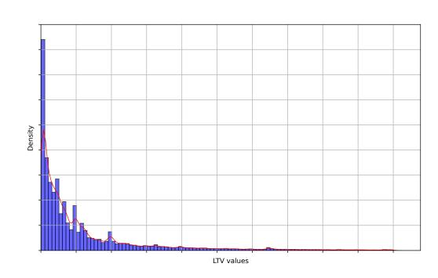
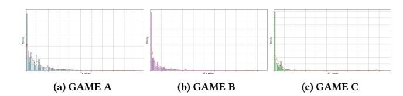
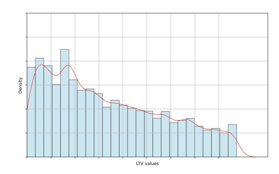
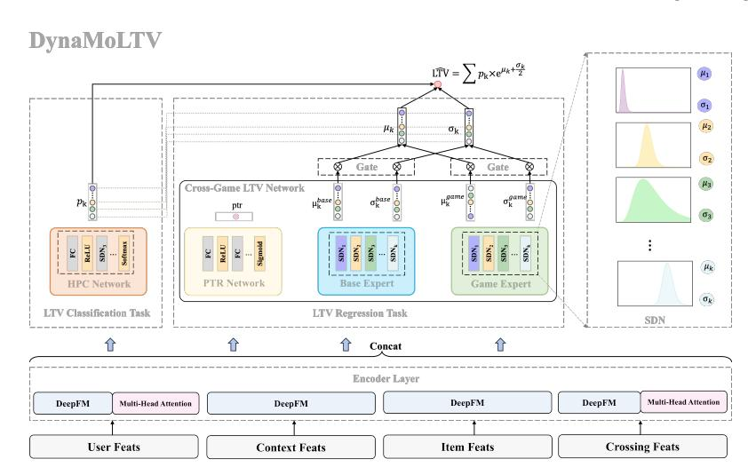
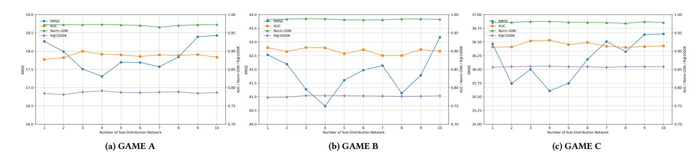
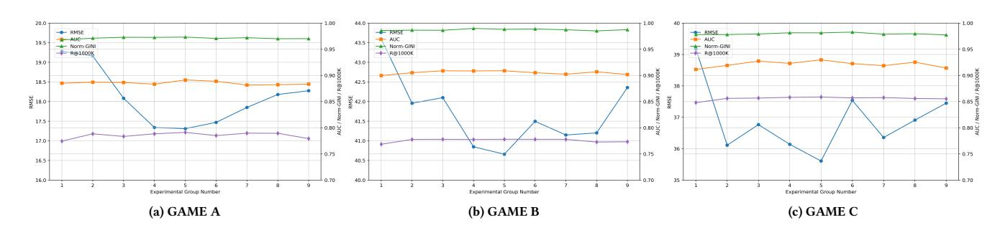

# **DynaMoLTV: A Cross-Game Dynamic Mixture Model with Weighted Sub-Distributions for Player Lifetime Value Prediction**

[Furen Xu](https://orcid.org/0009-0007-4748-1373)∗ Platform and Content Group, Tencent Shenzhen, China furenxu@tencent.com

[Jie Zhang](https://orcid.org/0009-0009-3992-8934)∗ Platform and Content Group, Tencent Shenzhen, China adarazhang@tencent.com

[Kai Jiang](https://orcid.org/0009-0008-3936-1221) Platform and Content Group, Tencent Shenzhen, China bevisjiang@tencent.com

[Chengxiang Zhuo](https://orcid.org/0009-0001-5750-140X) Platform and Content Group, Tencent Shenzhen, China zhchxi11@sina.com

[Zang Li](https://orcid.org/0000-0002-2305-7179) Platform and Content Group, Tencent Shenzhen, China gavinzli@tencent.com

# **Abstract**

Online game advertising is a prominent class of Web-mediated interactive services, where understanding and predicting player Lifetime Value (LTV) is a core scientific challenge in Web-scale user modeling, personalization, and digital economy optimization. However, the LTV prediction task poses severe challenges to traditional methods, which include data sparsity and complex distribution characteristics (such as zero-inflation, long tail, multimodal distribution, and cross-game). Existing methods struggle to capture the realistic and complex LTV distributions and exhibit limitations in leveraging cross-game data. We propose the first crossgame dynamic mixture framework with weighted sub-distributions for LTV prediction, DynaMoLTV. DynaMoLTV primarily models complex distributions via a zero-inflated mixture of lognormal (ZIMLN) loss, incorporates a game expert for cross-game data adaptation, employs a hierarchical payment classifier to capture consumption pattern variations, and integrates coarse and fine-grained losses to balance high-value user identification with LTV prediction accuracy. We conduct comprehensive experiments. The results demonstrate that DynaMoLTV achieves the best performance compared to five state-of-the-art baselines across metrics, including paid user identification, high-value user recall and LTV prediction accuracy. Specifically on three gaming datasets, DynaMoLTV reduces RMSE by 0.76%–46.65%, improves AUC by 0.94%–7.11%, and improves Norm-GINI by 0.63%–11.77% compared to five state-of-the-art baselines. DynaMoLTV also significantly improves ranking capabilities, with Recall@50K increasing by 17.64%–577.78%. We validate DynaMoLTV's effectiveness through two online A/B tests: (1) In the scenario of churned user re-engagement, DynaMoLTV increases online LTV by 20.3%-142.6% and downloads by 22.6%-37.7%. (2) In the scenario of online game advertising, DynaMoLTV increases GMV by 1.89% and GMV(ROI) by 27.31%. Our method has been

∗Both authors contributed equally to this research and are corresponding authors.

This [work is licensed under a Creative Commons Attribution 4.0 International License.](https://creativecommons.org/licenses/by/4.0) *WWW '26, Dubai, United Arab Emirates*

© 2026 Copyright held by the owner/author(s). ACM ISBN 979-8-4007-2307-0/2026/04 <https://doi.org/10.1145/3774904.3792420>

fully deployed in a Web-based online game advertising platform, which ensures that LTV predictions remain personalized for online gaming ad delivery, supporting smarter and more inclusive decision-making on the Web.

# **CCS Concepts**

• **Information systems** → **Data mining**.

# **Keywords**

Customer Lifetime Value Prediction; Online Game Advertising; Regression Task; Multi-Task Learning

#### **ACM Reference Format:**

Furen Xu, Jie Zhang, Kai Jiang, Chengxiang Zhuo, and Zang Li. 2026. DynaMoLTV: A Cross-Game Dynamic Mixture Model with Weighted Sub-Distributions for Player Lifetime Value Prediction. In *Proceedings of the ACM Web Conference 2026 (WWW '26), April 13–17, 2026, Dubai, United Arab Emirates.* ACM, New York, NY, USA, [10](#page-9-0) pages. [https://doi.org/10.1145/](https://doi.org/10.1145/3774904.3792420) [3774904.3792420](https://doi.org/10.1145/3774904.3792420)

# **1 Introduction**

In modern Web ecosystems, especially within e-commerce platforms, online game advertising systems, and content-driven websites, understanding and predicting Customer lifetime value (LTV) is critical for optimizing user experience, resource allocation, and business strategies [[2,](#page-8-0) [9,](#page-8-1) [27,](#page-8-2) [50\]](#page-9-1). LTV prediction directly informs monetization strategies, user acquisition cost optimization, and platform sustainability, all of which are central concerns in the Web as a socio-economic ecosystem where businesses and users interact dynamically. LTV is defined as the total revenue that a user generates for a business throughout their entire lifecycle or within a specific time frame. Accurate LTV prediction not only directly influences the formulation of corporate marketing strategies and user segmentation, but also helps reduce user churn [[17](#page-8-3), [20,](#page-8-4) [31](#page-8-5), [31](#page-8-5), [40,](#page-8-6) [48](#page-9-2)]. Moreover, LTV can serve as a core tool for advertising platforms to maximize ROI and for game developers to balance user acquisition cost (CAC) with long-term returns [\[5](#page-8-7), [25,](#page-8-8) [44](#page-8-9), [51](#page-9-3)]. For example, in the operational framework of advertising bidding platforms[[34](#page-8-10), [41\]](#page-8-11), LTV prediction plays a central role and enables advertisers to dynamically optimize their bidding strategies

for ad impressions based on insights into long-term user value. In gaming scenarios [\[5](#page-8-7), [36,](#page-8-12) [51](#page-9-3)], where user payments constitute the primary revenue source, advance prediction of customer lifetime value (pLTV) helps businesses save on advertising spend, target high-value users more precisely, and implement refined operational strategies. Accurate pLTV not only enables proactive value recapture in re-engagement strategies, particularly by targeting inactive users with high pLTV through personalized incentives, but also delivers timely interventions before user churn occurs, maximizing conversion potential. To sum up, by improving the accuracy of LTV predictions, Web platforms can make more informed decisions that balance profitability with user satisfaction, contributing to a more equitable and user-centric Web experience.

**Figure 1: The distribution of LTV on all games.**

**Figure 2: The LTV distributions of three experimental games.**

**Figure 3: The distribution of LTV in a specific range**

Early LTV prediction methods are primarily based on statistical models and rule-based strategies [[12](#page-8-13)[–15](#page-8-14), [22](#page-8-15), [32](#page-8-16)]. For example, RFM (Recency, Frequency, Monetary) model [[13\]](#page-8-17) categorizes user value levels based on the time since last purchase, frequency, and monetary amount. However, these methods can not output specific numerical predictions and struggle to adapt to complex business scenarios. The machine learning-based LTV prediction model [[11](#page-8-18), [24](#page-8-19), [33](#page-8-20), [38](#page-8-21), [45](#page-8-22)] is not capable of fitting complex LTV distributions. With the development of deep learning, LTV prediction methods based on deep learning have gradually become mainstream [\[5,](#page-8-7) [26](#page-8-23), [28](#page-8-24), [29,](#page-8-25) [36,](#page-8-12) [41](#page-8-11), [42,](#page-8-26) [44](#page-8-9), [46](#page-8-27), [48,](#page-9-2) [49](#page-9-4), [51,](#page-9-3) [52,](#page-9-5) [54](#page-9-6)]. Deep learning methods directly learning the nonlinear mappings between user features and LTV with improving flexibility. To address data distribution challenges, existing studies have proposed various improvements: ZILN [\[42\]](#page-8-26) jointly models payment probability and LTV distribution to alleviate the issue of zero-value sample dominance; CMLTV [\[46](#page-8-27)] leverages contrastive learning to integrate heterogeneous features, enhancing robustness in sparse data settings. Additionally, multi-task learning-based approaches like ExpLTV [[51](#page-9-3)] and transfer learning-based methods like ADSNet [\[41](#page-8-11)] have been employed to tackle data sparsity and scenario generalization issues.

However, LTV prediction is inherently a highly challenging regression problem, since user consumption data is typically volatile, noisy, and sparse [\[42,](#page-8-26) [47\]](#page-8-28). Although numerous solutions have been proposed in existing research, the field still faces the following four core challenges:

- **Zero-inflation.** User payment behavior is highly sparse (e.g., paying users account for less than 10% in games), resulting in an extremely high proportion of zero-value samples in our data. As shown in Figures [1](#page-1-0)[,2](#page-1-1), the number of non-paying users far exceeds that of paying users.
- **Severe long-tail distribution.** As illustrated in Figures [1](#page-1-0)[,2](#page-1-1), LTV values exhibit a significant right-skewed distribution (e.g., 80% of users concentrate their payments in the low-value range, while 20% of high-value users contribute the majority of revenue). Models may underestimate the potential of long-tail users due to early data limitations, misclassifying moderately paying users as high-value ones or overlooking the long-term conversion potential of low-paying users.
- **Multimodal distribution.** Different operational strategies (e.g., "Cumulative recharge of 100 coins to unlock a treasure chest") give rise to multiple payment peaks, leading to a multi-cluster aggregation characteristic in LTV data. As shown in Figures [2](#page-1-1), the payment amount distributions (i.e., LTV distribution) vary significantly across users from different games. Furthermore, Figure [3](#page-1-2) demonstrates that within a specific payment range, the user payment distribution approximates a lognormal distribution. Meanwhile, the overall user payment amount distribution within a single game more closely resembles a superposition of a mixture of lognormal distributions. Traditional singledistribution assumptions (e.g., lognormal distribution) fail to simultaneously capture the features of multiple peaks, making it difficult to model and fit such complex distributions.
- **Scenario specificity and data sparsity.** Figures [2](#page-1-1) show substantial differences in LTV distributions among users of different games, rendering traditional approaches ineffective. Moreover, building a separate LTV prediction model for each game incurs high operational and maintenance costs. In some games,

the user base is small, and payment behavior is sparse. A key challenge lies in effectively utilizing cross-game data, bridging feature space gaps between games, enabling joint training, and alleviating sparsity in sparse game datasets.

In summary, this paper makes the following innovations and contributions:

- **First Cross-Game Dynamic Mixture Model withWeighted** ness.
- **Comprehensive experimental evaluation.** We evaluate the effectiveness of our model from multiple dimensions, including the ability to identify paying users, recall and ranking capabilities for high-value users.The experiments demonstrate that our model achieves the best performance compared to all baseline methods across all evaluation metrics.
- **Online A/B test fully launched across all users.** Online A/B test from two online scenarios shows that DynaMoLTV significantly improves the online LTV, downloads, and GMV, which demonstrates the superior performance of our method. DynaMoLTV has been fully deployed in a Web-based online game advertising platform.
- **Open-source project code.** We have reproduced the code for all baseline methods, which were previously not open-sourced, and we will subsequently release the reproduced code along with our model.

**Sub-Distributions for LTV Prediction.** (1) Multimodal: ZIMLN loss handles long-tail/multimodal payments. (2) Multi-game: Game expert module enables joint cross-game training, solves data scarcity, and cuts per-game model costs. (3) Multi-level: Hierarchical payment structure normalizes consumption variations. (4) Multi-granularity: By jointly optimizing LTV regression task (for continuous payment modeling) and LTV classification task (for high-value user detection), our approach achieves state-of-the-art performance with enhanced robust-

### **2 Method**

Figure [4](#page-3-0) shows the overview of our proposed DynaMoLTV. Below, we detail each key component of DynaMoLTV.

# **2.1 Feat Encoder**

The input of the model consists of user and game-related features ��, which we categorize into four components: user profile features (e.g., user demographics and user behavior sequence), content features (e.g., game genres and elements), context features (e.g., time and environment), and user-game cross-features (e.g., interaction history).

The original feature �� is transformed into an embedding vector:

**e** = ��**x** (1)

where �� ∈ ℝ��∗�� is the feature transformation matrix, �� denotes the number of input features, and �� is the dimension of ��.

To enhance feature representation and capture intricate interaction, we introduce a dedicated encoder layer that processes features according to their temporal characteristics:

• Non-sequential features (e.g., user demographics, static game attributes) are encoded using a DeepFM [\[19](#page-8-29)], which effectively models both low-order feature interactions (via a factorization machine) and high-order interactions (via a deep neural network).

• Sequential features (e.g., user behavior sequences, time-series gameplay data) are modeled using Multi-Head Self-Attention [[39\]](#page-8-30) to capture long-range dependencies and dynamic patterns within the sequences.

Finally, the encoding results of the two types of features are concatenated to obtain the encoded representation, which serves as the input of the subsequent network.

# **2.2 DynaMoLTV**

Motivated by recent pLTV research [[42,](#page-8-26) [44](#page-8-9), [51](#page-9-3)] and our analysis of user LTV distributions across games and time periods (Section [1\)](#page-0-0), we summarize key findings as follows:

- (1) The LTV distribution in multi-game scenarios exhibits **multimodality** and **long-tail characteristics**.
- (2) The LTV distributions across different games show similar overall trends, yet demonstrate significant differences in **peak locations** and **skewness**.
- (3) User payment behavior across the entire value interval follows a **mixture of lognormal distributions**, while conforming more closely to a **single lognormal distribution** within finer-grained sub-intervals.

Based on these findings, we propose **DynaMoLTV**. Specifically, the input feature vector �� is first transformed by the encoder module described in Section [2.1.](#page-2-0) The encoded representation subsequently serves as input to the main network, where it is processed in parallel by two dedicated task-specific subnetworks (i.e., Hierarchical Payment Classifier and Cross-Game LTV Network).

2.2.1 *Hierarchical Payment Classifier*. Hierarchical Payment Classifier (HPC) is designed to predict the user payment amount level. HPC comprises stacked fully connected neural network layers (FC layer) employing ReLU [\[18\]](#page-8-31) activation function, ultimately producing a k-dimensional latent representation. We discretize the actual Lifetime Value (LTV) values into *K* intervals via binning, thereby formulating the task as a multi-class classification problem. Finally, HPC outputs the probability distribution over these payment intervals via Softmax. This payment classification approach demonstrates superior training stability and robustness compared to direct regression-based LTV fitting. Furthermore, it provides essential prior information to guide the learning process of the LTV regression task.

2.2.2 *Cross-Game LTV Network*. The Cross-Game LTV Network consists of two expert networks (the Base Expert Network and the Game Expert Network) and a Payment-Through-Rate network (PTR Network). The Base Expert Network and the Game Expert Network each contain K sub-distribution networks (SDNs). Each SDN consists of multiple layers of fully connected neural network layers with ReLU activation function. The Base Expert receives all input features (including user, game, context, and cross-features) and outputs two K-dimensional vectors (i.e., �� �������� and �� ��������) corresponding to the parameters of the sub-distributions (lognormal distributions) under the K sub-intervals. As highlighted in Section [1](#page-0-0), the LTV distribution exhibits substantial heterogeneity across

Where �� �� �� is a binary indicator reflecting whether the i-th user belongs to the k-th payment interval, and �� �� �� denotes the predicted probability (via a Softmax output) that the i-th user falls into the kth interval. This loss function encourages the model to accurately discern users' payment intention levels, thereby providing a structural prior for the LTV Regression task.

2.3.2 *LTV Regression Task (Fine-grained)*. As introduced in Section [1,](#page-0-0) we hypothesize that user payment behavior follows a zero-inflated mixture of lognormal distributions. The regression loss is thus formulated as the ZIMLN loss, which integrates the cross-entropy loss from the PTR network output and a mixture of lognormal loss:

ℒ�������� ������ = ℒCrossEntropy(��{��>0}; ������ ) + ��{��>0}ℒMul-Lognormal(��; ��, �� ) (13)

Under this probabilistic assumption, we adopt the maximum likelihood estimation (MLE) principle to construct the mixture of lognormal loss. Given a set of observed samples {(���� , ���� )}�� ��=1, we aim to maximize the likelihood of the mixture of lognormal distributions, which is equivalent to minimizing its negative log-likelihood:

ℒMul-Lognormal = − 1 �� ∑ �� ��=1 log ���� (��) = − 1 �� ∑ �� ��=1 log(∑ �� ��=1 �� �� �� ⋅ ���� (���� ; ���� , ���� )) (14)

Here, ���� (���� ; ���� , ���� ) denotes the lognormal probability density function for the k-th payment interval. This loss encourages the model to jointly optimize the interval-assignment probabilities and the distribution parameters within each interval, enabling effective modeling of long-tailed, multi-modal payment distributions.

By optimizing the classification and regression objectives jointly, the model captures continuous variations in user payment amounts through regression, while leveraging categorical signals to improve identification of high-value users. This results in enhanced overall predictive performance and greater model robustness.

# **3 Experimental Setup**

# **3.1 Datasets**

We utilize data from over 100 real gaming scenarios for training and testing, with a sample size of approximately 1,000M, of which only 0.2% are paying samples overall. Our dataset spans 25 genres (e.g., MOBA, shooter, strategy) from mobile platforms. Our experimental training and validation sets are split 9:1 based on the full data set. Since most users in real-world industrial data do not pay (negative samples), the training set is generated based on whether or not users pay, with negative samples sampled to ensure a 1:2 ratio of positive to negative samples. The validation set maintains the original distribution. To prevent time travel, the training and test sets are time-segregated. For example, training features are collected at time ��, and training labels (i.e., ������30) are collected at time �� + 30. The test features are collected at time �� + 31, and the test labels are collected at time �� + 61. Finally, we select three popular games for evaluation in the subsequent experiments.

# **3.2 Baselines**

We replicate all the following baselines and configure them according to the optimal parameters in the corresponding papers to ensure accurate replication.

**ZILN[\[42](#page-8-26)]**: ZILN is based on the lognormal distribution assumption, which uses a deep neural network to capture the nonlinear relationship between user characteristics and the LTV distribution.

**ExpLTV[[51\]](#page-9-3)**: A multi-task learning framework designed for the LTV prediction task in gaming scenarios. It uses an expert routing mechanism (game whale detection gating network) to categorize users into high-value and low-value users, each of which is modeled using a dedicated expert network.

**MDAN[\[26](#page-8-23)]**: MDAN uses a multi-channel network to learn the distribution of different LTVs and utilizes a channel learner to distinguish the learning weights of different channels. However, MDAN only uses MSE loss for regression modeling.

**OptDist[[44](#page-8-9)]**: This method includes a distribution learning module that trains n candidate sub-distribution networks to model the LTV distribution. The distribution selection module adaptively selects a single sub-distribution for each sample for learning and prediction.

**CMLTV[\[46\]](#page-8-27)**: A multi-perspective LTV framework based on contrastive learning, integrating basic features, distribution regression, logarithmic regression, classification regression, and other multiperspective models to model the LTV prediction task.

# **3.3 Evaluation Metrics**

To comprehensively evaluate our model and align with the requirements of practical business scenarios, we employ the following four evaluation metrics.

**RMSE**. RMSE is one of the most widely used evaluation metrics in regression tasks, measuring the deviation between the continuous pLTV and the ground-truth. Lower RMSE values indicate better alignment with ground truth.

**AUC**. AUC (Area Under the ROC Curve [\[21](#page-8-32)]): Evaluates binary classification performance (payment prediction), with higher values (closer to 1) reflecting stronger user-payment discriminability.

**Normalized Gini Coefficient (Norm-GINI) [\[42\]](#page-8-26)**.Norm-GINI ranges from [0, 1] and assesses user-value ranking capability, crucial for marketing/segmentation. Higher scores denote superior ability to prioritize high-LTV users.

**Recall@K (R@K)**. R@K computes the proportion of high-value users (spending >500) among the top-K predicted LTV users. Higher R@K indicates better recall of top spenders.

### **3.4 Experimental Settings**

In our model training, we employ Adam as the optimizer with a learning rate set to 0.0001 and a batch size of 4096. DynaMoLTV has a compact model size of 18 MB. Distributed training takes 30 mins/epoch on 40 CPUs. Distributed inferencing on 600 CPUs can process 300k records/sec.

# **4 Experimental Results**

In this section, we present the research motivation, methodology, and results for the following four research questions (RQs):

RQ1: How does the offline performance of our proposed DynaMoLTV compare with baselines?

RQ2: Does the inclusion of each key component contribute to improved model performance?

RQ3: What is the impact of the key hyperparameter on the performance of our proposed DynaMoLTV?

RQ4: How significant is the impact of DynaMoLTV on online business performance?

# **4.1 RQ1: Performance Comparison**

In recent years, various deep learning-based models have been proposed for LTV prediction. In RQ1, we explore how our model performs compared to five state-of-the-art deep learning-based models. Specifically, all models are evaluated under identical dataset configurations. During training, we retain the best-performing model on the validation set based on its AUC metric for testing set evaluation. The optimal configuration of our model refers to the settings determined in RQ3.

As shown in Table [1,](#page-6-0) across all datasets, our model achieves the best performance compared to the baselines across all evaluation metrics. Compared to five state-of-the-art baselines across three gaming datasets, our DynaMoLTV demonstrates consistent performance gains: it attains a relative reduction of 0.76%–46.65% in RMSE, achieves a relative improvement of 0.94%–7.11% in AUC, and enhances Norm-GINI by 0.63%–11.77% relatively. Furthermore, DynaMoLTV exhibits substantial advancements in ranking ability, with Recall@50K showing remarkable growth from 17.64% to 577.78% relative to baseline methods. In terms of AUC, our model effectively assists in distinguishing between non-paying and paying users. In particular, for the evaluation of continuous LTV prediction values (i.e., RMSE, Norm-GINI, and R@topK), our model predicts more accurate LTV values, demonstrates stronger ranking capability, and can recall more high-value users.

# **4.2 RQ2: Ablation Study**

4.2.1 *Removing Game Expert*. Existing LTV prediction frameworks are designed for single-scenario applications, and ours is the first model capable of multi-game LTV prediction. To address this, we specifically design a Game Expert (GE) Network module to adapt to feature space differences across games. In this experiment, we validate the effectiveness of this module and the extent to which it enhances model performance.

Table [2](#page-6-1) shows that without the Game Expert, the model's performance on all metrics across each game exhibits significant degradation, which confirms the effectiveness of the Game Expert. The Game Expert effectively adapts to feature space variations in data from different games, enabling efficient utilization of cross-game data while reducing the algorithmic cost of developing separate LTV prediction models for each individual game.

4.2.2 *Removing Hierarchical Payment Classifier*. To enhance the LTV prediction model's ability to identify users across different payment tiers, we designed the Hierarchical Payment Classifier (HPC), which identifies the payment tier to which a user belongs and serves as a coarse-grained auxiliary task for continuous LTV value prediction. In this experiment, we validate the effectiveness of this module.

Table [2](#page-6-1) shows that without the HPC, the model's performance on all metrics across each game exhibits significant degradation, confirming the effectiveness of the HPC. Specifically, in terms of

the paid/non-paid user identification metric (i.e., AUC), the HPC effectively assists the model in distinguishing between non-paying and paying users. For the evaluation of continuous LTV prediction values (i.e., RMSE, Norm-GINI, and R@topK), the HPC enables the model to predict more accurate LTV values and recall more highvalue users. The experimental results further validate that the effective combination of coarse-grained and fine-grained tasks allows the model to not only precisely capture the continuous variation in user payment amounts (regression advantage) but also strengthen the identification of high-value users through category information (classification advantage). thereby ultimately achieving optimal overall performance and enhancing the model's robustness.

# **4.3 RQ3: Hyper-Parameter Sensitivity**

In this section, we conduct two key hyperparameter tuning experiments. First, we determine the number of sub-distribution networks (with the multi-task loss function weights set to w1=w2=0.5), as this defines the optimized loss function. Once the loss function is finalized, we proceed with the experiment on weight allocation for the multi-task loss function.

4.3.1 *Sub-distribution Number Tuning Experiment*. We further evaluate how varying the number of sub-distribution networks affects performance. We conduct 10 experiments with the number of sub-distribution networks set to [1, 10]. Figure [5](#page-6-2) shows that all evaluation metrics exhibit a certain correlation with the number of sub-distribution networks.

The experimental results confirm the effectiveness of the mixture of lognormal distributions. As observed in the evaluation results across three games in Figure [5,](#page-6-2) the model performs worst when the number of sub-distribution networks is 1. Optimal performance is achieved when the number of sub-distribution networks is appropriately set (around 4). Insufficient sub-distributions limit the model's ability to fit complex LTV distributions, leading to degraded performance. Conversely, excessive sub-distributions cause overfitting issues and increase optimization costs and difficulty, also resulting in performance decline. Therefore, we set the number of sub-distribution networks to 4.

4.3.2 *Multi-task Loss Weight Allocation*. In our model, we utilize the cross-entropy loss to model the LTV classification task (coarse-grained) and the ZIMLN loss to model the LTV prediction task (fine-grained). The two losses are weighted and combined as the total loss for model optimization. This experiment explores the weight allocation strategy between the two losses. The experiments are divided into 9 groups, where 0–9 respectively denote ��1 = 0.1, ��2 = 0.9; ...; ��1 = 0.9, ��2 = 0.1.

As shown in Figure [6](#page-6-3), the model achieves optimal performance when the two weights are approximately equal. Therefore, we set the weights to ��1 = ��2 = 0.5. When either ��1 > ��2 or ��1 < ��2 , the model performance declines to varying degrees. LTV prediction is essentially a continuous value regression task (aiming to accurately quantify user payment amounts). By binning the continuous LTV into discrete categories and converting it into a multiclass classification task, the model's categorical decision-making capability is enhanced (e.g., more clearly identifying users with different payment capabilities).

**Table 1: A comparative summary of the performance between our DynaMoLTV and the baselines**

|           | RMSE    | AUC    | Norm-GINI | GAME R@50K | A R@100K | R@500K | R@1000K | RMSE    | AUC    | Norm-GINI | GAME R@50K | B R@100K | R@500K | R@1000K | RMSE    | AUC    | Norm-GINI | GAME R@50K | C R@100K | R@500K | R@1000K |
|-----------|---------|--------|-----------|------------|----------|--------|---------|---------|--------|-----------|------------|----------|--------|---------|---------|--------|-----------|------------|----------|--------|---------|
| ZILN      | 20.2911 | 0.8321 | 0.8707    | 0.036      | 0.0692   | 0.2841 | 0.4717  | 63.9848 | 0.8615 | 0.9231    | 0.071      | 0.1366   | 0.4355 | 0.6276  | 35.8799 | 0.8686 | 0.9089    | 0.1558     | 0.2592   | 0.6342 | 0.7701  |
| ExpLTV    | 20.9208 | 0.8694 | 0.9581    | 0.1049     | 0.2059   | 0.5772 | 0.7143  | 51.0556 | 0.8856 | 0.9737    | 0.2689     | 0.4259   | 0.7166 | 0.7577  | 42.4066 | 0.8743 | 0.9705    | 0.4029     | 0.5476   | 0.7901 | 0.8278  |
| MDAN      | 21.8737 | 0.8546 | 0.9504    | 0.0903     | 0.1472   | 0.3908 | 0.5435  | 50.069  | 0.884  | 0.972     | 0.2427     | 0.3668   | 0.6492 | 0.725   | 36.754  | 0.8755 | 0.9661    | 0.273      | 0.3969   | 0.7419 | 0.8193  |
| OptDist   | 21.4403 | 0.8612 | 0.9609    | 0.1424     | 0.2552   | 0.6035 | 0.7252  | 50.1145 | 0.9004 | 0.9674    | 0.2834     | 0.4328   | 0.725  | 0.7643  | 40.8551 | 0.9093 | 0.9752    | 0.4123     | 0.5601   | 0.8044 | 0.8387  |
| CMLTV     | 32.4451 | 0.8538 | 0.9572    | 0.0478     | 0.0964   | 0.4806 | 0.6935  | 49.0694 | 0.8962 | 0.9723    | 0.0701     | 0.1406   | 0.7011 | 0.7536  | 59.7282 | 0.9037 | 0.969     | 0.1647     | 0.3285   | 0.7919 | 0.8323  |
| DynaMoLTV | 17.3098 | 0.8913 | 0.9732    | 0.244      | 0.3889   | 0.7055 | 0.7911  | 40.6593 | 0.9089 | 0.9881    | 0.3334     | 0.5038   | 0.7541 | 0.778   | 35.6077 | 0.9297 | 0.9813    | 0.5837     | 0.7079   | 0.8416 | 0.8587  |

**Table 2: The impact of each key component contributes to our DynaMoLTV**

|                     | RMSE    | AUC    | Norm-GINI | GAME A R@50K | R@100K | R@500K | R@1000K | RMSE    | AUC    | Norm-GINI | GAME B R@50K | R@100K | R@500K | R@1000K | RMSE    | AUC    | Norm-GINI | GAME C R@50K | R@100K | R@500K | R@1000K |
|---------------------|---------|--------|-----------|--------------|--------|--------|---------|---------|--------|-----------|--------------|--------|--------|---------|---------|--------|-----------|--------------|--------|--------|---------|
| DynaMoLTV (w/o HPC) | 18.091  | 0.8729 | 0.9711    | 0.2364       | 0.3834 | 0.7009 | 0.7882  | 43.4198 | 0.8996 | 0.9837    | 0.3225       | 0.4916 | 0.7459 | 0.7666  | 36.5995 | 0.9228 | 0.9785    | 0.5776       | 0.697  | 0.833  | 0.8549  |
| DynaMoLTV (w/o GE)  | 19.489  | 0.8744 | 0.9691    | 0.1964       | 0.3387 | 0.6781 | 0.7699  | 46.9442 | 0.9049 | 0.9857    | 0.3273       | 0.4931 | 0.7524 | 0.7753  | 36.0411 | 0.9252 | 0.975     | 0.5377       | 0.6764 | 0.8337 | 0.8575  |
| DynaMoLTV           | 17.3098 | 0.8913 | 0.9732    | 0.244        | 0.3889 | 0.7055 | 0.7911  | 40.6593 | 0.9089 | 0.9881    | 0.3334       | 0.5038 | 0.7541 | 0.778   | 35.6077 | 0.9297 | 0.9813    | 0.5837       | 0.7079 | 0.8416 | 0.8587  |

**Figure 5: Impact of Sub-Distribution Network Count on DynaMoLTV**

**Figure 6: Impact of different weight allocations in multi-task loss on DynaMoLTV.**

Therefore, the contributions of the two loss functions reach a dynamic balance when we set ��1 = ��2 = 0.5. The effective combination of these two losses enables the model to not only accurately capture the continuous variations in user payment amounts (leveraging the strengths of regression), but also enhance the ability to identify high-value users through category information (leveraging the strengths of classification), which ultimately leads to optimal overall performance and improved model robustness.

# **4.4 RQ4: Online A/B Test**

We conduct two online A/B tests to verify the effectiveness in our real-world decision scenario. (1) Scenario 1: In a specific traffic experiment for the re-engagement scenario for churned users in three game apps, we formulate personalized re-engagement benefit strategies based on the LTV values output by DynaMoLTV, which **significantly increases online LTV by 20.3%-142.6% and downloads by 22.6%-37.7%**. Table [3](#page-6-4) shows that compared to the

original online ZILN model, DynaMoLTV achieves significant improvements in both download volume and LTV across three games. (2) Scenario 2: In a specific traffic experiment for online game advertising scenarios, we specified an ad delivery strategy based on the LTV values output by DynaMoLTV, **significantly increasing GMV by 1.89% and GMV (ROI) by 27.31%**.

These results further verify DynaMoLTV's outstanding capability in paid user identification, high-value user re-engagement, and LTV prediction. DynaMoLTV has been fully deployed in a Webbased online game advertising platform, substantiating its practical efficacy within real-world web-supported ecosystems.

**Table 3: Online A/B Test results in Scenario 1.**

|           | GAME A  | GAME B   | GAME C  |
|-----------|---------|----------|---------|
| Downloads | +22.60% | +25.50%  | +37.70% |
| LTV       | +77.10% | +142.60% | +20.30% |

# **5 Related Work**

# **5.1 LTV Prediction**

Customer Lifetime Value (LTV) prediction, crucial for quantifying user value and enabling precise operations, is key in recommendations, ads, and user growth Existing work focuses on two main approaches: traditional machine learning and deep learning. However, LTV prediction remains less explored compared to recall/ranking algorithms in recommender systems.

Traditional machine learning methods extract structured information such as user behavior and attributes through manual feature engineering, and then model the mapping relationship between features and LTV using statistical or tree-based models[[11](#page-8-18), [38](#page-8-21), [45](#page-8-22)]. For instance, tree-based learning methods [[7](#page-8-33), [23](#page-8-34), [30](#page-8-35)] rely heavily on handcrafted features. Due to the high complexity of gaming LTV user behavior, they fail to process intricate features, leading to substantial information loss.

In recent years, deep learning has significantly advanced LTV prediction [\[3](#page-8-36)[–6](#page-8-37), [26,](#page-8-23) [28,](#page-8-24) [29,](#page-8-25) [36,](#page-8-12) [41,](#page-8-11) [42](#page-8-26), [44](#page-8-9), [46](#page-8-27), [48](#page-9-2), [49,](#page-9-4) [51,](#page-9-3) [54\]](#page-9-6). Most methods employ DNNs with MSE loss, which assumes normality and is sensitive to outliers—a major limitation given gaming LTV's long-tail distribution. To address this, Wang et al. [[42](#page-8-26)] introduced ZILN, modeling LTV as lognormal and mitigating outlier bias, though it fails to capture multimodal distributions in our data. Zhang et al. [\[51](#page-9-3)] extended this with ExpLTV, adding a "whale task tower" to focus on high-value users, yet retained ZILN's limitations and ignored cross-game payment variability. CMLTV [[46\]](#page-8-27) used contrastive learning to fuse multi-view regression models, but its gamma prior struggles with complex distributions and suffers from instability. Weng et al. [[44](#page-8-9)] developed OptDist, training multiple sub-distributions with adaptive selection, though it's constrained to single-game LTV prediction and underutilizes the advantages of multiple sub-distributions. Liu et al. [\[26\]](#page-8-23) presented MDAN, leveraging a multi-channel network for distribution adaptation, but relying on MSE's outlier-sensitive assumptions.

Our work differs from the related work mentioned above. We are the first to propose a cross-game dynamic mixture model with weighted sub-distributions. We have the following differences: (1) Multi-Distribution. We propose the ZIMLN loss to address longtail and complex distribution issues. (2) Multi-Game. We design a game expert module to adapt to heterogeneous data, supporting cross-game joint training to reduce sample scarcity and development costs. (3) Multi-Level. We design the HPC to accommodate variations in consumption patterns. (4) Multi-Granularity. To better assist the learning of the LTV prediction task in the future, we combine the coarse-grained LTV classification task and the finegrained LTV regression task for multi-task learning.

# **5.2 Regression Tasks in Other Scenarios**

LTV prediction is a subcategory of regression tasks. Therefore, fundamental regression methods (such as linear regression, decision trees, and neural networks) are essential foundations for LTV prediction. Recently, a significant amount of outstanding research has been demonstrated across various regression tasks. For example, tree-based learning methods such as XGBoost ([\[7](#page-8-33)]), LightGBM ([\[23\]](#page-8-34)), and CatBoost ([[30](#page-8-35)]), which are frequently used in regression tasks

in major competitions, have strong capabilities for modeling nonlinear relationships and offer strong explainability. However, these methods are prone to overfitting and struggle to capture the contextual relationships of sequence features. With the rise of deep learning, traditional machine learning methods are gradually being replaced by deep learning methods. In the field of tabular data learning, TABNN has been proposed to automatically extract effective feature combinations and structural knowledge from GBDT[\[16\]](#page-8-38), constructing an efficient recurrent neural network architecture.This method has outperformed traditional methods on various tabular data regression tasks, but its performance relies on the prior knowledge of GBDT. Arik et al. [\[1\]](#page-7-0) proposed TabNet, a deep tabular data learning architecture based on a sequential attention mechanism, which selects key features step by step to make decisions. But this approach is limited by its high computational complexity and parameter sensitivity. In recent years, several outstanding studies have been conducted in the field of video watching time prediction for recommender systems[[8,](#page-8-39) [35,](#page-8-40) [53\]](#page-9-7). For example, Sun et al. proposed CREAD, which leveraged a classification-reduction framework combined with error-adaptive discretization to predict watching time. This method discretizes continuous watching time into multiple intervals, uses a classification module to predict interval probabilities, and then uses a reduction module to reconstruct the continuous predictions. This method requires training multiple classifiers, which may increase the cost of model deployment and iteration, and there is still a certain amount of error in predictions for long-tail samples. With the development of large language models (LLMs), many studies have begun to apply LLMs to regression tasks [[10](#page-8-41), [43](#page-8-42)]. For example, the GTL [[43\]](#page-8-42) method converted tabular data into a command-oriented language format and pretrained data based on the LLaMA-2 large language model [\[37](#page-8-43)]. This method achieves zero-shot reasoning and contextual learning capabilities for tabular data, supporting both regression and classification tasks. This approach is limited by the significant LLM inference overhead and prompt dependency.

However, these regression methods are not suitable for addressing the four major challenges in LTV prediction (Section [1\)](#page-0-0). We address the data distribution and computational costs of real-world scenarios and propose a cross-game dynamic mixture model with weighted sub-distributions for LTV prediction.

# **6 Conclusion**

In this paper, we propose a novel cross-game dynamic mixture framework with weighted sub-distributions for LTV prediction. Experiments show DynaMoLTV outperforms 5 SOTA baselines across paid user identification, high-value recall, and LTV accuracy. Online A/B test from two online scenarios also demonstrates the superior performance of our method. Experimental results validate DynaMoLTV's effectiveness in addressing key LTV prediction challenges, offering a practical solution for gaming applications. Future work can explore the scalability of DynaMoLTV in other continuous value prediction tasks and the application of large language models in LTV prediction.

# **References**

[1] Sercan Ö Arik and Tomas Pfister. 2021. Tabnet: Attentive interpretable tabular learning. In *Proceedings of the AAAI conference on artificial intelligence*, Vol. 35.

6679–6687. [2] Hamidreza Badri and Allen Tran. 2022. Beyond customer lifetime valuation: measuring the value of acquisition and retention for subscription services. In *Proceedings of the ACM Web Conference 2022*. 132–140. [3] Josef Bauer and Dietmar Jannach. 2021. Improved customer lifetime value prediction with sequence-to-sequence learning and feature-based models. *ACM Transactions on Knowledge Discovery from Data (TKDD)* 15, 5 (2021), 1–37. [4] Benjamin Paul Chamberlain, Angelo Cardoso, CH Bryan Liu, Roberto Pagliari, and Marc Peter Deisenroth. 2017. Customer lifetime value prediction using embeddings. In *Proceedings of the 23rd ACM SIGKDD international conference on knowledge discovery and data mining*. 1753–1762. [5] Aochuan Chen, Yifan Niu, Ziqi Gao, Yujie Sun, Shoujun Liu, Gong Chen, Yang Liu, and Jia Li. 2025. Mini-Game Lifetime Value Prediction in WeChat. In *Proceedings of the 31st ACM SIGKDD Conference on Knowledge Discovery and Data Mining V. 2*. 4320–4329. [6] Pei Pei Chen, Anna Guitart, Ana Fernández del Río, and Africa Periánez. 2018. Customer lifetime value in video games using deep learning and parametric models. In *2018 IEEE international conference on big data (big data)*. IEEE, 2134–2140. [7] Tianqi Chen and Carlos Guestrin. 2016. Xgboost: A scalable tree boosting system. In *Proceedings of the 22nd acm sigkdd international conference on knowledge discovery and data mining*. 785–794. [8] Paul Covington, Jay Adams, and Emre Sargin. 2016. Deep neural networks for youtube recommendations. In *Proceedings of the 10th ACM conference on recommender systems*. 191–198. [9] Wirawan Dony Dahana, Yukihiro Miwa, and Makoto Morisada. 2019. Linking lifestyle to customer lifetime value: An exploratory study in an online fashion retail market. *Journal of Business Research* 99 (2019), 319–331. [10] Tuan Dinh, Yuchen Zeng, Ruisu Zhang, Ziqian Lin, Michael Gira, Shashank Rajput, Jy-yong Sohn, Dimitris Papailiopoulos, and Kangwook Lee. 2022. Lift: Language-interfaced fine-tuning for non-language machine learning tasks. *Advances in Neural Information Processing Systems* 35 (2022), 11763–11784. [11] Anders Drachen, Mari Pastor, Aron Liu, Dylan Jack Fontaine, Yuan Chang, Julian Runge, Rafet Sifa, and Diego Klabjan. 2018. To be or not to be… social: Incorporating simple social features in mobile game customer lifetime value predictions. In *proceedings of the australasian computer science week multiconference*. 1–10. [12] Peter S Fader and Bruce GS Hardie. 2009. Probability models for customer-base analysis. *Journal of interactive marketing* 23, 1 (2009), 61–69. [13] Peter S Fader, Bruce GS Hardie, and Ka Lok Lee. 2005. RFM and CLV: Using iso-value curves for customer base analysis. *Journal of marketing research* 42, 4 (2005), 415–430. [14] Peter S Fader, Bruce GS Hardie, and Ka Lok Lee. 2005. "Counting your customers" the easy way: An alternative to the Pareto/NBD model. *Marketing science* 24, 2 (2005), 275–284. [15] Peter S Fader, Bruce GS Hardie, and Jen Shang. 2010. Customer-base analysis in a discrete-time noncontractual setting. *Marketing Science* 29, 6 (2010), 1086–1108. [16] Jerome H Friedman. 2001. Greedy function approximation: a gradient boosting machine. *Annals of statistics* (2001), 1189–1232. [17] Nicolas Glady, Bart Baesens, and Christophe Croux. 2009. Modeling churn using customer lifetime value. *European journal of operational research* 197, 1 (2009), 402–411. [18] Xavier Glorot, Antoine Bordes, and Yoshua Bengio. 2011. Deep sparse rectifier neural networks. In *Proceedings of the fourteenth international conference on artificial intelligence and statistics*. JMLR Workshop and Conference Proceedings, 315–323. [19] Huifeng Guo, Ruiming Tang, Yunming Ye, Zhenguo Li, and Xiuqiang He. 2017. DeepFM: a factorization-machine based neural network for CTR prediction. *arXiv preprint arXiv:1703.04247* (2017). [20] Sunil Gupta, Dominique Hanssens, Bruce Hardie, Wiliam Kahn, V Kumar, Nathaniel Lin, Nalini Ravishanker, and Srinivasaraghavan Sriram. 2006. Modeling customer lifetime value. *Journal of service research* 9, 2 (2006), 139–155. [21] James A Hanley and Barbara J McNeil. 1982. The meaning and use of the area under a receiver operating characteristic (ROC) curve. *Radiology* 143, 1 (1982), 29–36. [22] Pavel Jasek, Lenka Vrana, Lucie Sperkova, Zdenek Smutny, and Marek Kobulsky. 2019. Comparative analysis of selected probabilistic customer lifetime value models in online shopping. *Journal of Business Economics and Management (JBEM)* 20, 3 (2019), 398–423. [23] Guolin Ke, Qi Meng, Thomas Finley, Taifeng Wang, Wei Chen, Weidong Ma, Qiwei Ye, and Tie-Yan Liu. 2017. Lightgbm: A highly efficient gradient boosting decision tree. *Advances in neural information processing systems* 30 (2017). [24] Bart Larivière and Dirk Van den Poel. 2005. Predicting customer retention and profitability by using random forests and regression forests techniques. *Expert systems with applications* 29, 2 (2005), 472–484. [25] Kunpeng Li, Guangcui Shao, Naijun Yang, Xiao Fang, and Yang Song. 2022. Billion-user customer lifetime value prediction: an industrial-scale solution from Kuaishou. In *Proceedings of the 31st ACM International Conference on Information & Knowledge Management*. 3243–3251. [26] Wenshuang Liu, Guoqiang Xu, Bada Ye, Xinji Luo, Yancheng He, and Cunxiang Yin. 2024. MDAN: Multi-distribution Adaptive Networks for LTV Prediction. In *Pacific-Asia Conference on Knowledge Discovery and Data Mining*. Springer, 409–420. [27] Edward C Malthouse and Robert C Blattberg. 2005. Can we predict customer lifetime value? *Journal of interactive marketing* 19, 1 (2005), 2–16. [28] Zheng Pan, Xingyu Lou, Xiao Jin, Chiye Ou, Feng Liu, Tieyong Zeng, Chengwei He, Xiang Liu, Lilong Wei, and Jun Wang. 2025. Progressive Tasks Guided Multi-Source Network for Customer Lifetime Value Prediction in Online Advertising. In *Proceedings of the Eighteenth ACM International Conference on Web Search and Data Mining*. 530–538. [29] Jinghua Piao, Guozhen Zhang, Fengli Xu, Zhilong Chen, and Yong Li. 2021. Predicting customer value with social relationships via motif-based graph attention networks. In *Proceedings of the Web Conference 2021*. 3146–3157. [30] Liudmila Prokhorenkova, Gleb Gusev, Aleksandr Vorobev, Anna Veronika Dorogush, and Andrey Gulin. 2018. CatBoost: unbiased boosting with categorical features. *Advances in neural information processing systems* 31 (2018). [31] Saharon Rosset, Einat Neumann, Uri Eick, and Nurit Vatnik. 2003. Customer lifetime value models for decision support. *Data mining and knowledge discovery* 7, 3 (2003), 321–339. [32] David C Schmittlein, Donald G Morrison, and Richard Colombo. 1987. Counting your customers: Who-are they and what will they do next? *Management science* 33, 1 (1987), 1–24. [33] Lavneet Singh, Nancy Kaur, and Girija Chetty. 2018. Customer life time value model framework using gradient boost trees with RANSAC response regularization. In *2018 International Joint Conference on Neural Networks (IJCNN)*. IEEE, 1–8. [34] Hongzu Su, Zhekai Du, Jingjing Li, Lei Zhu, and Ke Lu. 2023. Cross-domain adaptative learning for online advertisement customer lifetime value prediction. In *Proceedings of the AAAI Conference on Artificial Intelligence*, Vol. 37. 4605– 4613. [35] Jie Sun, Zhaoying Ding, Xiaoshuang Chen, Qi Chen, Yincheng Wang, Kaiqiao Zhan, and Ben Wang. 2024. Cread: A classification-restoration framework with error adaptive discretization for watch time prediction in video recommender systems. In *Proceedings of the AAAI Conference on Artificial Intelligence*, Vol. 38. 9027–9034. [36] Shuaiqi Sun, Congde Yuan, Haoqiang Yang, Mengzhuo Guo, Guiying Wei, and Jiangbo Tian. 2025. SHORE: A Long-term User Lifetime Value Prediction Model in Digital Games. *arXiv preprint arXiv:2506.10487* (2025). [37] Hugo Touvron, Louis Martin, Kevin Stone, Peter Albert, Amjad Almahairi, Yasmine Babaei, Nikolay Bashlykov, Soumya Batra, Prajjwal Bhargava, Shruti Bhosale, et al. 2023. Llama 2: Open foundation and fine-tuned chat models. *arXiv preprint arXiv:2307.09288* (2023). [38] Ali Vanderveld, Addhyan Pandey, Angela Han, and Rajesh Parekh. 2016. An engagement-based customer lifetime value system for e-commerce. In *Proceedings of the 22nd ACM SIGKDD international conference on knowledge discovery and data mining*. 293–302. [39] Ashish Vaswani, Noam Shazeer, Niki Parmar, Jakob Uszkoreit, Llion Jones, Aidan N Gomez, Łukasz Kaiser, and Illia Polosukhin. 2017. Attention is all you need. *Advances in neural information processing systems* 30 (2017). [40] Rajkumar Venkatesan and Vita Kumar. 2004. A customer lifetime value framework for customer selection and resource allocation strategy. *Journal of marketing* 68, 4 (2004), 106–125. [41] Ruize Wang, Hui Xu, Ying Cheng, Qi He, Xing Zhou, Rui Feng, Wei Xu, Lei Huang, and Jie Jiang. 2024. ADSNet: Cross-Domain LTV Prediction with an Adaptive Siamese Network in Advertising. In *Proceedings of the 30th ACM SIGKDD Conference on Knowledge Discovery and Data Mining*. 5872–5881. [42] Xiaojing Wang, Tianqi Liu, and Jingang Miao. 2019. A deep probabilistic model for customer lifetime value prediction. *arXiv preprint arXiv:1912.07753* (2019). [43] Xumeng Wen, Han Zhang, Shun Zheng, Wei Xu, and Jiang Bian. 2024. From supervised to generative: A novel paradigm for tabular deep learning with large language models. In *Proceedings of the 30th ACM SIGKDD Conference on Knowledge Discovery and Data Mining*. 3323–3333. [44] Yunpeng Weng, Xing Tang, Zhenhao Xu, Fuyuan Lyu, Dugang Liu, Zexu Sun, and Xiuqiang He. 2024. Optdist: Learning optimal distribution for customer lifetime value prediction. In *Proceedings of the 33rd ACM International Conference on Information and Knowledge Management*. 2523–2533. [45] Than Than Win and Khin Sundee Bo. 2020. Predicting customer class using customer lifetime value with random forest algorithm. In *2020 International conference on advanced information technologies (ICAIT)*. IEEE, 236–241. [46] Chuhan Wu, Jingjie Li, Qinglin Jia, Hong Zhu, Yuan Fang, and Ruiming Tang. 2023. Contrastive Multi-view Framework for Customer Lifetime Value Prediction. *arXiv preprint arXiv:2306.14400* (2023). [47] Mingzhe Xing, Shuqing Bian, Wayne Xin Zhao, Zhen Xiao, Xinji Luo, Cunxiang Yin, Jing Cai, and Yancheng He. 2021. Learning reliable user representations from volatile and sparse data to accurately predict customer lifetime value. In *Proceedings of the 27th ACM SIGKDD Conference on Knowledge Discovery & Data Mining*. 3806–3816.

[48] Junwei Xu, Aisi Zheng, Ling Ding, Huangbin Zhang, Zhengwei Deng, Qun Yu, and Xiao-Ping Zhang. 2025. HiLTV: Hierarchical Multi-Distribution Modeling for Lifetime Value Prediction in Online Games. In *Proceedings of the 48th International ACM SIGIR Conference on Research and Development in Information Retrieval*. 3075–3079. [49] Xuejiao Yang, Binfeng Jia, Shuangyang Wang, and Shijie Zhang. 2023. Feature missing-aware routing-and-fusion network for customer lifetime value prediction in advertising. In *Proceedings of the Sixteenth ACM International Conference on Web Search and Data Mining*. 1030–1038. [50] Guozhen Zhang, Yong Li, Yuan Yuan, Fengli Xu, Hancheng Cao, Yujian Xu, and Depeng Jin. 2021. Community value prediction in social E-commerce. In *Proceedings of the Web Conference 2021*. 2958–2967. [51] Shijie Zhang, Xin Yan, Xuejiao Yang, Binfeng Jia, and Shuangyang Wang. 2023. Out of the box thinking: improving customer lifetime value modelling via expert routing and game whale detection. In *Proceedings of the 32nd ACM International Conference on Information and Knowledge Management*. 3206–3215. [52] Shiwei Zhao, Runze Wu, Jianrong Tao, ManhuQu, Minghao Zhao, Changjie Fan, and Hongke Zhao. 2023. perCLTV: A general system for personalized customer lifetime value prediction in online games. *ACM Transactions on Information Systems* 41, 1 (2023), 1–29. [53] Xu Zhao, Ruibo Ma, Jiaqi Chen, Weiqi Zhao, Ping Yang, and Yao Hu. 2025. Multi-Granularity Distribution Modeling for Video Watch Time Prediction via Exponential-Gaussian Mixture Network. *arXiv preprint arXiv:2508.12665* (2025). [54] Zhiyuan Zhou, Li Lin, Hai Wang, Xiaolei Zhou, Gong Wei, and Shuai Wang. 2024. A Cross Domain Method for Customer Lifetime Value Prediction in Supply Chain Platform. In *Proceedings of the ACM Web Conference 2024*. 4037–4046.