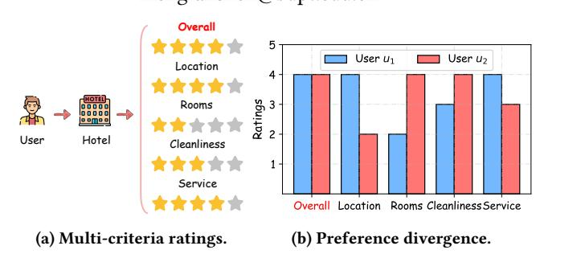
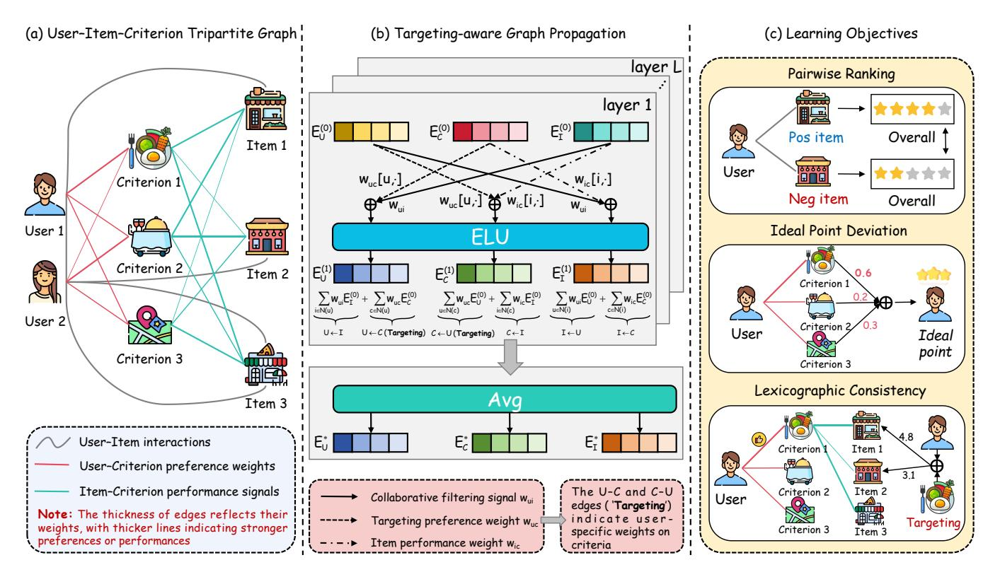
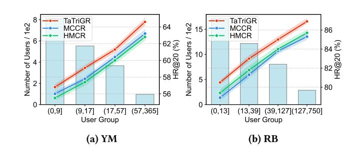
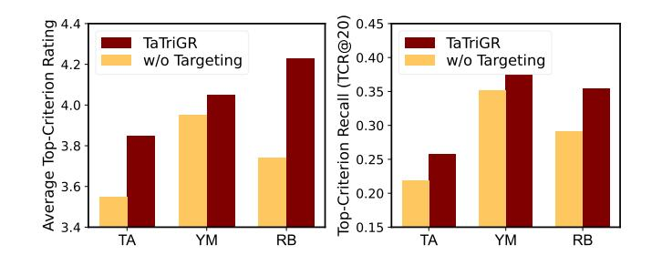
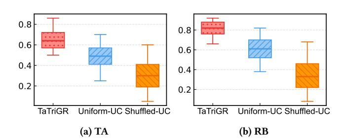
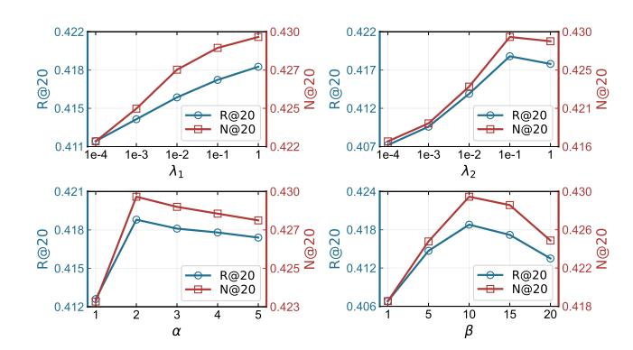
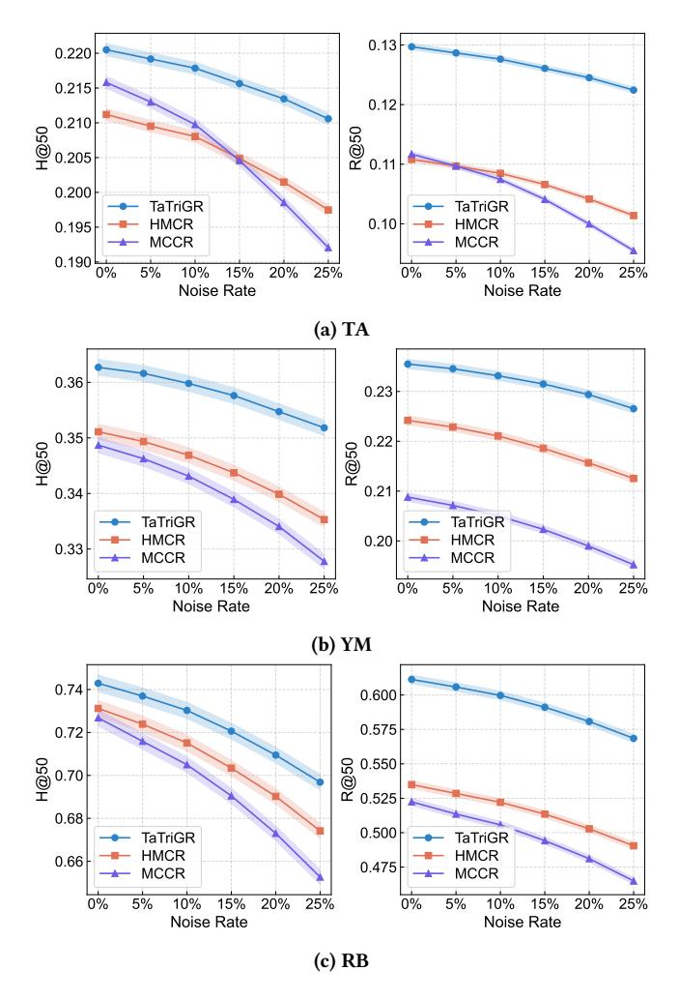
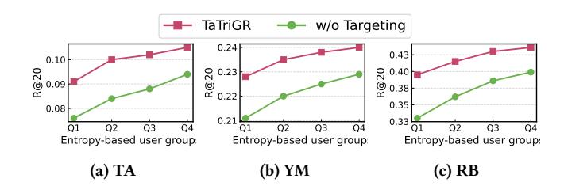
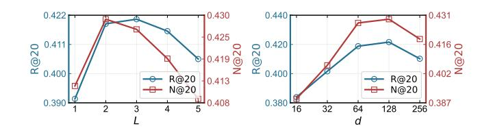
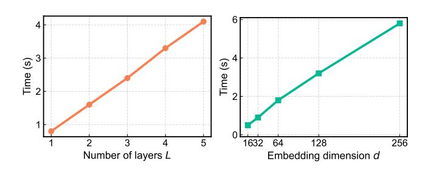

# From Criteria to Ranking: Targeting-Aware Tripartite Graph Learning for Multi-Criteria Recommendation

Zhenhua Meng∗ Inner Mongolia University Hohhot, China zhmeng@imu.edu.cn

Fanshen Meng

Beijing University of Posts and Telecommunications Beijing, China mengfanshen@bupt.edu.cn

## Abstract

Multi-criteria recommender systems (MCRSs) are becoming increasingly important in the Web ecosystem, where platforms such as e-commerce sites and review portals allow users to evaluate items from multiple perspectives. By leveraging criterion-level ratings rather than relying solely on overall scores, MCRSs can enhance personalization and more accurately capture user preferences. However, existing multi-criteria recommendation methods often fail to explicitly model user-specific preferences across criteria or to incorporate item–criterion signals into representation learning. To solve these problems, we propose TaTriGR, a Targeting-Aware Tripartite Graph Recommender, which jointly models user–item–criterion interactions in a unified tripartite graph and integrates user-specific criterion weights through targeting mechanisms. Specifically, TaTriGR encodes user–criterion targeting through personalized weights, while incorporating item–criterion performance as an additional channel to enrich item semantics. A lightweight propagation mechanism then diffuses information across the tripartite structure, and a formal score decomposition shows that predictions satisfy fundamental multi-criteria decision making (MCDM) properties. To further reinforce targeting, TaTriGR introduces two auxiliary objectives: Ideal Point Distillation and Lexicographic Consistency, which encourage criterion-consistent user representations and rankings. Extensive experiments on three realworld datasets demonstrate the effectiveness of TaTriGR, showing relative gains up to 16.1% over the best baseline models. Our implementations are available at https://github.com/nunu1995/TaTriGR.

### CCS Concepts

• Information systems → Recommender systems.

### Keywords

Multi-Criteria Recommender Systems, Graph Neural Networks, Multi-Criteria Decision Making, Preference Learning

#### ACM Reference Format:

Zhenhua Meng and Fanshen Meng. 2026. From Criteria to Ranking: Targeting-Aware Tripartite Graph Learning for Multi-Criteria Recommendation. In Proceedings of the ACM Web Conference 2026 (WWW '26), April 13–17,

∗Corresponding author.

© 2026 Copyright held by the owner/author(s). ACM ISBN 979-8-4007-2307-0/2026/04 <https://doi.org/10.1145/3774904.3792425>

Figure 1: Illustration of multi-criteria recommendation: (a) users provide detailed ratings across multiple criteria in addition to an overall rating; (b) users with the same overall rating may exhibit distinct criterion-level preferences.

2026, Dubai, United Arab Emirates. ACM, New York, NY, USA, [12](#page-11-0) pages. <https://doi.org/10.1145/3774904.3792425>

### 1 Introduction

Multi-criteria recommender systems (MCRSs) extend conventional recommendation by enabling users to evaluate items from multiple dimensions rather than relying solely on an overall rating [\[19,](#page-8-0) [21,](#page-8-1) [28,](#page-8-2) [32\]](#page-8-3). Such information reflects the diversity of user preferences, thereby supporting more accurate recommendations and offering clearer explanations for item selection. MCRSs have been widely applied in Web-based platforms such as e-commerce, travel, hotels and movies [\[3,](#page-8-4) [26,](#page-8-5) [29,](#page-8-6) [39\]](#page-8-7). For example, as illustrated in Figure [1a,](#page-0-0) when evaluating hotels, users provide not only an overall rating but also detailed feedback on aspects such as location, rooms, cleanliness, and service. This often results in cases where two users assign the same overall rating but differ significantly in their criterion evaluations. As shown in Figure [1b,](#page-0-0) user ��1 values location and service but is dissatisfied with rooms, whereas user ��2 emphasizes rooms and cleanliness while remaining less concerned about location. Although both users give an overall rating of 4, the information conveyed by their multi-criteria evaluations is highly divergent. This indicates that, compared with MCRSs, single-criterion recommendation systems may overlook user preference differences and lead to biased results [\[18\]](#page-8-8). In contrast, multi-criteria ratings can provide a richer and more faithful representation of user decision behaviors [\[11,](#page-8-9) [31,](#page-8-10) [37\]](#page-8-11).

Research on MCRSs has primarily focused on how to effectively model criterion information [\[2,](#page-8-12) [5,](#page-8-13) [9,](#page-8-14) [35\]](#page-8-15). Early studies often extended collaborative filtering (CF) or matrix factorization (MF) in multi-criteria scenarios by aggregating criterion-level ratings to

[This work is licensed under a Creative Commons Attribution 4.0 International License.](https://creativecommons.org/licenses/by/4.0) WWW '26, Dubai, United Arab Emirates

predict the overall rating, employing approaches such as multilinear matrix factorization, stacked autoencoders, variational autoencoders, and deep autoencoders [\[21,](#page-8-1) [22,](#page-8-16) [34,](#page-8-17) [37\]](#page-8-11). More recently, graphbased recommendation methods have become increasingly prominent [\[4,](#page-8-18) [38\]](#page-8-19). By representing multi-criteria data as graph structures, many methods leverage high-order connectivity between users and items, with several further incorporating criterion-aware message passing or graph filtering to capture inter-criterion relations [\[31,](#page-8-10) [32\]](#page-8-3). In addition, hyperbolic manifolds and causal inference have also been introduced to enrich the modeling capacity of MCRSs [\[11,](#page-8-9) [12\]](#page-8-20). Despite these advancements, existing most models still lack a clear mechanism to characterize how users target specific criteria during the decision-making process. In other words, while they improve representational power, they do not directly address the criteria-oriented prioritization in user modeling.

From a decision-making perspective, multi-criteria recommendation inherently involves ranking items based on multiple criteria [\[1\]](#page-8-21). In multi-criteria decision-making (MCDM), alternatives are typically evaluated across multiple dimensions to identify the overall best option [\[15,](#page-8-22) [16,](#page-8-23) [23\]](#page-8-24). However, real-world decision-making often deviates from this assumption: decision-makers often care less about the overall best alternatives and more about alternatives that perform best relative to a specific target [\[17\]](#page-8-25). This target-oriented perspective naturally aligns with user behavior in MCRSs. For example, in Figure [1b,](#page-0-0) user ��1 values location and service more highly than other criteria. If these criteria are treated as the target, the recommender system can recommend hotels that perform well in them rather than simply suggesting those with the highest overall ratings. Introducing targeting into MCRSs offers two key advantages: i) it provides a principled mechanism to identify the criteria most relevant to user preferences, ii) and it ensures that recommendations are consistent with the decision strategies users naturally adopt. However, criterion targeting also poses several challenges. C1: How to automatically identify which criteria are most important for a user's targeting? C2: How to design aggregation functions that are consistent with fundamental MCDM properties while remainingexplainable? C3: How to effectively integrate target preferences with CF signals in a unified recommendation framework?

To address the above challenges, we propose a Targeting-Aware Tripartite Graph Recommender (TaTriGR), which explicitly models the user–item–criterion tripartite structure and integrates targeting for multi-criteria recommendation. First, we design novel user–criterion weighting strategies that quantify the relative contribution of each criterion to user preferences by analyzing interaction patterns, allowing the model to identify the dimensions emphasized during recommendation (C1). Second, we introduce targeting-based auxiliary terms, including Ideal Point Deviation (IPD), which aligns user embeddings with their weighted criterion representations, and Lexicographic Consistency (LC), which constrains ranking consistency by requiring items superior on emphasized criteria to be ranked higher than alternatives. These objectives regularize the relationship between user and criterion embeddings and reflect criterion-level prioritization in user representations (C2). Finally, we construct a user–item–criterion tripartite graph where users, items, and criteria are represented as nodes, and we develop a lightweight graph propagation mechanism for aggregating information

across user–item, user–criterion, and item–criterion edges. In this way, targeting signals and collaborative relations are jointly encoded within a shared embedding space (C3). Building upon this framework, the main contributions of this paper are summarized as follows:

- We introduce the concept of targeting into multi-criteria recommendation, bridging the gap between existing approaches that either aggregate criterion ratings or treat them independently, and real decision-making behaviors where users emphasize specific criteria when forming preferences.
- We propose TaTriGR, a targeting-aware tripartite graph framework that represents users, items, and criteria as nodes. It incorporates targeting-based auxiliary losses, including IPD and LC to capture criterion-level prioritization, while employing lightweight graph propagation to encode targeting signals with collaborative relations.
- We conduct extensive experiments on three public datasets, showing that TaTriGR outperforms state-of-the-art multicriteria recommender models. Ablation studies further validate the effectiveness of both our targeting mechanisms and the tripartite graph design.

### 2 Preliminaries

Let U = ��1, . . . , ��|U | and I = ��1, . . . ,��| I | denote the user and item sets, respectively. For each user �� ∈ U, let N�� ⊆ I be the set of items interacted with by ��. In multi-criteria recommendation, each user–item interaction is associated not only with an overall rating but also with a set of criterion-level ratings that reflect different aspects of user evaluation. The collection of rating matrices is defined as R = {R0, R1, . . . R| C | }, where R0 ∈ R |U |× | I | corresponds to the overall ratings, R�� ∈ R |U |× | I | represents the ratings on the ��-th criterion, and C = {��1, ��2, . . . , ��| C | } denotes the set of criteria.

The objective of multi-criteria recommendation is to learn a scoring function ���� : U × I → R, that predicts the overall preference of user �� for an item �� by leveraging information from the overall rating matrix R0 and the criterion matrices {R�� } | C | ��=1 . Based on this scoring function, the system generates a top-�� recommendation list for each user:

L �� �� = Top����∈I\N�� ���� (��,��), (1)

which contains the �� items that user �� is most likely to prefer.

### 3 Methodology

In this section, we present the proposed TaTriGR, and its overall framework is shown in Figure [2.](#page-2-0)

### 3.1 Tripartite Graph Construction

3.1.1 Node Definition. To integrate multi-criteria signals into the recommendation process, it is essential to construct a structure that encodes heterogeneous entities and their relations. In this work, we formalize the recommendation scenario as a tripartite graph G = (V, E), where V = U∪I∪C denotes the set of nodes, consisting of users U = {��1, ��2, . . . , ��|U | }, items I = {��1,��2, . . . ,��| I | }, and criteria C = {��1, ��2, . . . , ��| C | }. Each type of node plays a distinct semantic role, where user nodes act as preference sources, item nodes represent recommendation targets, and criterion nodes function as

Table 1: Statistics of the datasets.

| Dataset | #Users | #Items | #Interactions | #Criteria | Density |
|---------|--------|--------|---------------|-----------|---------|
| TA      | 4,264  | 6,274  | 34,383        | 7         | 1.30e-3 |
| YM      | 1,826  | 1,469  | 50,608        | 4         | 1.89e-2 |
| RB      | 4,020  | 3,380  | 161,276       | 4         | 1.19e-2 |

�� ★ = arg max�� ������ , then �� should also be ranked higher in the final prediction. The LC loss is defined as

LLC = − ∑︁ (��,��,��) log ��( (�� ★ ���� − �� �� ★ ���� ) · (��ˆ���� − ��ˆ����)), (19)

where �� �� ★ ���� represents user ��'s rating of item �� under the dominant criterion �� ★.

3.3.4 Final Objective. The overall learning objective combines BPR loss with the two auxiliary regularization components:

L = LBPR + ��1LIPD + ��2LLC + ��∥Θ∥ , (20)

where ��1 and ��2 control the contributions of the IPD and LC losses, and �� regulates the strength of ��2 regularization on parameters Θ.

#### 4 Experiments

In this section, we conduct extensive experiments on benchmark datasets to address the following research questions:

- RQ1: How does TaTriGR perform compared to various multicriteria recommendation methods?
- RQ2: How does each component of TaTriGR contribute to its overall performance?
- RQ3: How does targeting influence the recommendation performance and ranking behavior?
- RQ4: How do different hyperparameter configurations affect the performance of TaTriGR?

### 4.1 Experimental Settings

4.1.1 Datasets. We evaluate TaTriGR on three widely used datasets for multi-criteria recommendation: TripAdvisor (TA), Yahoo! Movies (YM), and RateBeer (RB) [\[7,](#page-8-27) [27,](#page-8-28) [30\]](#page-8-29). These datasets cover different domains and provide both overall ratings and multi-criteria ratings. To ensure data reliability and sufficient user activity, we filter out users with fewer than five interactions. The key statistics of the datasets are summarized in Table [1.](#page-4-0)

4.1.2 Baselines. To validate the effectiveness of TaTriGR, we compare it with three categories of recommender models. i) Multicriteria Recommenders: ExtendedSAE [\[37\]](#page-8-11), LatentMC [\[21\]](#page-8-1), UBM [\[46\]](#page-8-30), DMCF [\[29\]](#page-8-6), CFM [\[7\]](#page-8-27), and AEMC [\[34\]](#page-8-17). ii) Single-criterion Recommenders: SpectralCF [\[45\]](#page-8-31), NGCF [\[40\]](#page-8-32), LightGCN [\[13\]](#page-8-33), SGL [\[41\]](#page-8-34), and AutoCF [\[42\]](#page-8-35). iii) Graph-based Multi-criteria Recommenders: LightGCNMC, SGLMC, CPA-LGC [\[31\]](#page-8-10), CA-GF [\[32\]](#page-8-3), HMCR [\[11\]](#page-8-9), and MCCR [\[12\]](#page-8-20). Here, LightGCNMC and SGLMC are variants of LightGCN [\[13\]](#page-8-33) and SGL [\[41\]](#page-8-34) for the multi-criteria setting.

4.1.3 Evaluation Metrics. To evaluate the top-�� multi-criteria recommendation performance, we adopt three widely used ranking metrics [\[12–](#page-8-20)[14,](#page-8-36) [25,](#page-8-37) [31\]](#page-8-10): Hit Ratio (H@K), Recall (R@K), and Normalized Discounted Cumulative Gain (N@K), with �� ∈ {20, 50}.

4.1.4 Implementation Details. We partition each dataset into training (70%), validation (10%), and test (20%) sets based on user interactions. For TaTriGR, the embedding dimension is set to �� = 64, and the number of graph propagation layers is fixed to �� = 2. Model parameters are initialized using the Xavier scheme [\[10\]](#page-8-38), and optimization is performed with Adam [\[20\]](#page-8-39) under mini-batch training of size 1024. The learning rate and regularization weight are tuned from 1��-4 to 1��-1. The parameters ��1 and ��2 are searched in {1��-4, 1��-3, 1��-2, 1��-1, 1}. The sharpness parameter �� is tuned in 1 to 5, and the smoothing parameter �� is selected from {1, 5, 10, 15, 20}. For all baselines, we adopt the recommended hyperparameter configurations reported in their original papers. All experiments are conducted on an NVIDIA GeForce RTX 4090 GPU.

### 4.2 Performance Comparison (RQ1)

4.2.1 Comparisons w.r.t. Overall Performance. To evaluate the performance of TaTriGR, we compare it against the baselines described in Section [4.1.2.](#page-4-1) Table [2](#page-5-1) reports the top-20 and top-50 results on the TA, YM, and RB datasets under three evaluation metrics, from which we derive the following observations:

- TaTriGR achieves the best performance across all datasets and metrics. For example, on TA it outperforms the strongest baseline MCCR by 6.59% in H@20 and 7.45% in N@20. On YM, it achieves an R@20 of 0.2355, corresponding to gains of 12.73% over MCCR and 15.48% over HMCR. On RB, it delivers the largest improvements in R@50, with relative gains of 78.79% over the best multi-criteria baseline, 41.01% over the best single-criterion baseline, and 14.28% over the best graph-based multi-criteria baseline. These results confirm that TaTriGR generalizes across domains with different sparsity and criterion characteristics.
- Multi-criteria recommenders based on CF or MF extensions provide only marginal benefits. On YM, TaTriGR achieves an N@50 of 0.3627, which is nearly 2.9× higher than LatentMC. On RB, it doubles or even triples the performance of these baselines across most metrics. This confirms the necessity of modeling user–criterion targeting and item–criterion signals within a unified tripartite structure.
- Single-criterion recommenders achieve strong performance on YM and RB where overall ratings are denser, but fail to capture criterion-level heterogeneity in user preferences. TaTriGR consistently outperforms them, particularly on recalloriented metrics. For example, on YM it raises R@50 from 0.2885 with SGL to 0.3600, and on RB it increases N@20 from 0.2892 with SGL to 0.4293. These demonstrate that incorporating criterion signals yields gains beyond what can be learned from overall ratings alone.
- Graph-based multi-criteria recommenders are the strongest baselines. Multi-criteria extensions clearly enhance recommendation performance, as LightGCNMC surpasses Light-GCN and SGLMC improves over SGL, showing that criterion signals complement overall ratings. However, they lack userspecific targeting, which explains why TaTriGR achieves further gains. On TA, it improves R@20 from 0.0896 with MCCR to 0.1007, yielding a 12.39% gain. On YM, it raises N@20 from 0.2879 with MCCR to 0.2942 and improves recall

Table 2: The overall performance comparison between TaTriGR and baselines on TA, YM and RB datasets. The best and secondbest results are highlighted in bold and underline, respectively. "Improv." indicates the relative improvement of TaTriGR over the best-performing baseline model.

| Dataset Metrics | H@20   | H@50   | R@20    | TA R@50 | N@20   | N@50   | H@20        | H@50 Multi-criteria | R@20 Recommenders | YM R@50      | N@20   | N@50   | H@20   | H@50   | RB R@20 | R@50    | N@20   | N@50   |
|-----------------|--------|--------|---------|---------|--------|--------|-------------|---------------------|-------------------|--------------|--------|--------|--------|--------|---------|---------|--------|--------|
| ExtendedSAE     | 0.0205 | 0.0367 | 0.0125  | 0.0283  | 0.0051 | 0.0073 | 0.1490      | 0.2023              | 0.1271            | 0.1493       | 0.1437 | 0.1521 | 0.0303 | 0.0571 | 0.0223  | 0.0483  | 0.0181 | 0.0213 |
| LatentMC        | 0.1063 | 0.1385 | 0.0723  | 0.0867  | 0.0593 | 0.0647 | 0.1214      | 0.2027              | 0.0913            | 0.1645       | 0.1185 | 0.1231 | 0.1357 | 0.2361 | 0.1131  | 0.2067  | 0.1939 | 0.2092 |
| UBM             | 0.0757 | 0.0987 | 0.0583  | 0.0737  | 0.0391 | 0.0424 | 0.0455      | 0.0929              | 0.0417            | 0.0723       | 0.0289 | 0.0323 | 0.0561 | 0.1137 | 0.0551  | 0.0997  | 0.0523 | 0.0629 |
| DMCF            | 0.0463 | 0.0853 | 0.0315  | 0.0485  | 0.0287 | 0.0325 | 0.1054      | 0.1437              | 0.0793            | 0.1281       | 0.0925 | 0.1039 | 0.1502 | 0.2129 | 0.1337  | 0.2213  | 0.1925 | 0.2087 |
| CFM             | 0.0857 | 0.1427 | 0.0803  | 0.0927  | 0.0653 | 0.0716 | 0.1533      | 0.2161              | 0.1153            | 0.1950       | 0.0915 | 0.1027 | 0.2828 | 0.3037 | 0.2357  | 0.3419  | 0.1837 | 0.2017 |
| AEMC            | 0.0497 | 0.0883 | 0.0311  | 0.0477  | 0.0270 | 0.0313 | 0.0867      | 0.1523              | 0.0635            | 0.1153       | 0.0751 | 0.0859 | 0.1257 | 0.2207 | 0.1073  | 0.1985  | 0.1837 | 0.2041 |
|                 |        |        |         |         |        |        |             | Single-criterion    | Recommenders      |              |        |        |        |        |         |         |        |        |
| SpectralCF      | 0.0705 | 0.1051 | 0.0308  | 0.0547  | 0.0391 | 0.0509 | 0.4203      | 0.5807              | 0.1365            | 0.2352       | 0.1502 | 0.1764 | 0.6752 | 0.7253 | 0.2704  | 0.3907  | 0.2621 | 0.2955 |
| NGCF            | 0.0944 | 0.1312 | 0.0468  | 0.0639  | 0.0385 | 0.0529 | 0.4354      | 0.6042              | 0.1425            | 0.2467       | 0.1583 | 0.1813 | 0.6881 | 0.7389 | 0.2784  | 0.4010  | 0.2680 | 0.2997 |
| LightGCN        | 0.1165 | 0.1597 | 0.0608  | 0.0796  | 0.0596 | 0.0713 | 0.4972      | 0.7011              | 0.1611            | 0.2781       | 0.1765 | 0.1981 | 0.7120 | 0.7683 | 0.2927  | 0.4189  | 0.2786 | 0.3139 |
| SGL             | 0.1235 | 0.1752 | 0.0649  | 0.0902  | 0.0651 | 0.0750 | 0.5286      | 0.7270              | 0.1723            | 0.2885       | 0.1845 | 0.2122 | 0.7336 | 0.7830 | 0.3038  | 0.4300  | 0.2892 | 0.3240 |
| AutoCF          | 0.1269 | 0.1765 | 0.0667  | 0.0915  | 0.0682 | 0.0734 | 0.5157      | 0.7300              | 0.1669            | 0.2913       | 0.1831 | 0.2055 | 0.7264 | 0.7850 | 0.2992  | 0.4335  | 0.2841 | 0.3205 |
|                 |        |        |         |         |        |        | Graph-based |                     | Multi-criteria    | Recommenders |        |        |        |        |         |         |        |        |
| LightGCN MC     | 0.1382 | 0.1887 | 0.0673  | 0.1008  | 0.0692 | 0.0819 | 0.5608      | 0.7524              | 0.1762            | 0.2906       | 0.1867 | 0.2189 | 0.7654 | 0.8697 | 0.3312  | 0.4685  | 0.3159 | 0.3578 |
| SGL MC          | 0.1426 | 0.1924 | 0.0708  | 0.1043  | 0.0712 | 0.0877 | 0.5759      | 0.7708              | 0.1824            | 0.3009       | 0.1955 | 0.2266 | 0.7728 | 0.8803 | 0.3387  | 0.4806  | 0.3264 | 0.3665 |
| CPA-LGC         | 0.1468 | 0.1983 | 0.0732  | 0.1069  | 0.0827 | 0.0954 | 0.5821      | 0.7762              | 0.1868            | 0.3057       | 0.1981 | 0.2345 | 0.7906 | 0.8894 | 0.3442  | 0.4978  | 0.3358 | 0.3759 |
| CA-GF           | 0.1509 | 0.2026 | 0.0764  | 0.1092  | 0.0859 | 0.0988 | 0.5967      | 0.7915              | 0.1926            | 0.3124       | 0.2055 | 0.2426 | 0.8023 | 0.9028 | 0.3515  | 0.5087  | 0.3427 | 0.3825 |
| HMCR            | 0.1617 | 0.2112 | 0.0822  | 0.1108  | 0.0897 | 0.1045 | 0.6220      | 0.7953              | 0.2041            | 0.3178       | 0.2535 | 0.2791 | 0.8573 | 0.9410 | 0.3618  | 0.5349  | 0.4145 | 0.5198 |
| MCCR            | 0.1655 | 0.2158 | 0.0896  | 0.1117  | 0.0913 | 0.1036 | 0.6415      | 0.8007              | 0.2089            | 0.3258       | 0.2879 | 0.3576 | 0.8526 | 0.9371 | 0.3584  | 0.5296  | 0.4102 | 0.5132 |
| TaTriGR         | 0.1764 | 0.2205 | 0.1007  | 0.1297  | 0.0981 | 0.1072 | 0.6566      | 0.8092              | 0.2355            | 0.3600       | 0.2942 | 0.3627 | 0.8692 | 0.9435 | 0.4188  | 0.6113  | 0.4293 | 0.5254 |
| Improv.         | +6.59% | +2.18% | +12.39% | +16.11% | +7.45% | +2.58% | +2.35%      | +1.06%              | +12.73%           | +10.50%      | +2.19% | +1.43% | +1.39% | +0.27% | +15.75% | +14.28% | +3.57% | +1.08% |

by over 12%. Notably, HMCR only outperforms MCCR on RB, suggesting that its hierarchical design works better suited to sparse and noisy criteria but less stable on denser datasets.

4.2.2 Comparisons w.r.t. Data Sparsity. To evaluate the performance of TaTriGR under different sparsity levels, we follow the strategy in [\[43,](#page-8-40) [44\]](#page-8-41) and divide users into four groups based on their interaction scale. As shown in Figure [3,](#page-5-2) the sparsest group accounts for over 50% of users in both YM and RB datasets. From the results, we draw three key observations: i) HR@20 exhibits a clear upward trend as the interaction scale increases, confirming that sparsity significantly affects recommendation accuracy. ii) On YM, TaTriGR achieves 56.8% HR@20 in the sparsest group, outperforming MCCR and HMCR by 0.8% and 1.3%, respectively. This demonstrates its superior ability to handle 'cold-start' users. On RB, TaTriGR improves HR@20 from 78.9% with MCCR and 79.4% with HMCR to 80.5%, again showing advantages in sparse settings. iii) The performance gap further widens in denser groups, where TaTriGR reaches 86.9% HR@20 on RB compared with 85.3% and 85.7% for MCCR and HMCR. This indicates that targeting-aware propagation and auxiliary objectives are effective at leveraging richer interactions.

### 4.3 Ablation Study (RQ2)

To analyze the contribution of each component in TaTriGR, we conduct ablation studies by replacing or removing specific modules. The following variants are evaluated:

- w/o Targeting: Replace the user–criterion distribution by a uniform vector ������ = 1/|C| for all �� ∈ C.
- w/o IPD: Remove the IPD loss and eliminate the alignment between user embeddings and criterion-weighted ideal points.

Figure 3: Performance comparison under different user interaction sparsity levels. Bars (left y-axis) show user counts, and lines (right y-axis) represent HR@20 values.

- w/o LC: Remove the LC loss and eliminate the ranking constraint on the user's top-weighted criterion.
- w/o IC: Remove the item–criterion edges and keep only user–item and user–criterion connections.
- w/o Criterion: Remove all criterion-related edges and simplify TaTriGR into a user–item bipartite graph.

Table [3](#page-6-0) presents the results of ablation studies, from which we derive the following insights: i) Every component is indispensable for enhancing TaTriGR. Performance consistently declines once any module is removed, indicating that targeting, auxiliary objectives, and item–criterion edges jointly contribute to the overall effectiveness of TaTriGR. ii) w/o Targeting leads to the most critical decline among the core components. Removing user–criterion targeting leads to a clear performance drop, highlighting the necessity of personalized criterion weights ������ for capturing user preferences. Meanwhile, w/o Criterion causes the most severe

Table 3: Ablation studies of TaTriGR w.r.t. R@20 and N@20 on three datasets.

|               | Model | R@20   | TA N@20 | R@20   | YM N@20 | R@20   | RB N@20 |
|---------------|-------|--------|---------|--------|---------|--------|---------|
| TaTriGR       |       | 0.1007 | 0.0981  | 0.2355 | 0.2942  | 0.4188 | 0.4293  |
| w/o Targeting |       | 0.0886 | 0.0857  | 0.2213 | 0.2790  | 0.3732 | 0.3869  |
| w/o           | IPD   | 0.0991 | 0.0962  | 0.2330 | 0.2910  | 0.4105 | 0.4212  |
| w/o           | LC    | 0.0968 | 0.0947  | 0.2319 | 0.2905  | 0.4057 | 0.4158  |
| w/o           | IC    | 0.0901 | 0.0872  | 0.2238 | 0.2815  | 0.3824 | 0.3936  |
| w/o Criterion |       | 0.0654 | 0.0688  | 0.1757 | 0.1898  | 0.3074 | 0.2967  |

overall degradation, with R@20 decreasing by 35.1% on TA, 25.4% on YM, and 26.6% on RB, since eliminating all criterion signals degenerates TaTriGR into a single-rating recommender. iii) Both IPD and LC contribute positively, though with different emphases. w/o IPD shows the smallest impact among all ablations, with only moderate declines across datasets. This demonstrates that aligning users to criterion-weighted ideal points helps stabilize training and maintain reliable preference representations. In contrast, w/o LC mainly affects ranking quality, indicating that enforcing LC is beneficial when user preferences are dominated by a few key criteria. iv) w/o IC reveals the crucial role of item-side criterion information in TaTriGR. Removing this channel results in performance drops across all datasets. This confirms that item-criterion edges ������ are essential for enriching item representations with criterion semantics. Without this channel, the model fails to capture how items perform under different criteria, causing weaker preference matching and poorer recommendation accuracy.

#### 4.4 Targeting Analysis (RQ3)

To explore how user–criterion targeting influences recommendation performance and ranking behavior of TaTriGR, we analyze its contributions from multiple perspectives.

4.4.1 Top-Criterion Preferences. We examine how targeting aligns recommendation results with user-specific preferences from two perspectives. i) First, we measure the Average Top-Criterion Rating, defined as the mean rating of recommended items under each user's dominant criterion �� ★. Figure [4](#page-6-1) shows that TaTriGR recommends items with higher ratings on �� ★ compared to w/o Targeting, with the greatest gains observed on RB, increasing from 3.15 to 3.52 on a 5-point scale. This indicates that targeting enables the model to better capture what users value most. ii) Second, we compute Top-Criterion Recall (TCR@20), which evaluates how well the recommended list covers items relevant under the dominant criterion. As shown in Figure [4,](#page-6-1) TaTriGR substantially improves TCR over w/o Targeting on all three datasets, with the relative gains being largest on RB (+6.3%), moderate on TA (+3.9%), and smaller on YM (+2.2%). This pattern aligns with dataset characteristics, as the more heterogeneous the criteria are, the greater the benefit of targeting. Notably, YM exhibits the highest absolute TCR values because its criteria are highly correlated with overall ratings. Therefore, even without targeting, high-scoring items under overall ratings tend to align with top-criterion preferences.

Figure 4: Analysis of targeting on top-criterion preferences.

Figure 5: Correlation between criterion-weighted aggregation and final scores on TA and RB datasets.

4.4.2 Criterion-Weighted Aggregation. We verify whether TaTriGR leverages user–criterion targeting in the aggregation process by decomposing the predicted score into criterion-weighted and residual components, i.e., ��ˆ���� = ��(��,��) +�� (��,��), where ��(��,��) = Í �� ���������� (��). We then compute the correlation between ��(��,��) and ��ˆ���� across users, and compare TaTriGR with two baselines: Uniform-UC, which replaces ������ with uniform weights, and Shuffled-UC, which randomly shuffles ������ across users. As shown in Figure [5,](#page-6-2) TaTriGR achieves the highest and most concentrated correlation values on both TA and RB datasets. For example, on RB, the median correlation of TaTriGR is 0.82 with an interquartile range from 0.76 to 0.88, significantly higher than Uniform-UC with a median of 0.61 and Shuffled-UC with a median of 0.33. This indicates that criterionweighted aggregation with targeting is well aligned with the final prediction scores. Meanwhile, Shuffled-UC exhibits the lowest and most unstable correlation, confirming that user-specific targeting is essential rather than a coincidental effect.

#### 4.5 Sensitivity Analysis (RQ4)

To investigate the sensitivity of TaTriGR, we analyze the impact of four key hyperparameters on performance, including the weight ��1 of loss LIPD, the weight ��2 of loss LLC, the sharpness parameter ��, and the smoothing parameter ��. The results are shown in Figure [6.](#page-7-0)

4.5.1 Impact of ��1 and ��2. As shown in Figure [6,](#page-7-0) both R@20 and N@20 values of TaTriGR steadily improve as ��1 increases, reaching the best performance at ��1 = 1. This confirms that aligning user embeddings with criterion-weighted ideal points helps stabilize training and enhances representation quality. In contrast, ��2 has a more marked effect. When ��2 is too small (e.g., 1��-4 or 1��-3), performance degrades significantly, which is consistent with the ablation results of removing LC. Performance improves as ��2 increases, with

Figure 6: Hyperparameter sensitivities of ��1, ��2, ��, and �� w.r.t. R@20 and N@20 on the RB dataset.

the best results achieved at ��2 = 1��-1. However, further increasing ��2 to 1 leads to a decline, indicating that overly strong emphasis on LC may constrain the model's flexibility.

4.5.2 Impact of ��. The sharpness parameter �� controls the concentration of the user–criterion weight distribution. As shown in Figure [6,](#page-7-0) performance first improves and then declines as �� increases, achieving the best performance at �� = 2. This demonstrates that a moderate value allows TaTriGR to capture user-specific dominant criteria while still retaining auxiliary signals from other criteria. Too small a value (e.g., �� = 1) makes the distribution nearly uniform and weakens targeting mechanism, while too large a value (e.g., �� = 5) relies on a single criterion and degrades overall performance.

4.5.3 Impact of ��. The smoothing parameter �� balances item-level criterion scores with the global criterion mean. When �� = 10, TaTriGR achieves the best performance on both R@20 and N@20, suggesting that it improves criterion estimates for items with few ratings while preserving discriminative signals for frequently rated items. However, when �� is too small or too large, the model suffers from both noisy criterion estimates on sparse items and suppressed item-specific variations, which may cause inferior results.

### 5 Related Work

### 5.1 Multi-Criteria Recommendation

The core of multi-criteria recommendation is to enhance personalization by leveraging users' ratings across multiple criteria instead of relying solely on overall ratings [\[6,](#page-8-42) [8,](#page-8-43) [31,](#page-8-10) [36\]](#page-8-44). Early approaches mainly focus on extending CF or MF techniques to multi-criteria settings [\[34,](#page-8-17) [37\]](#page-8-11). For example, MSVD [\[22\]](#page-8-16) models user–item–criterion interactions as a tensor and applies multilinear singular value decomposition to capture latent relations. CLuCFEuc [\[24\]](#page-8-45) clusters users into preference lattices based on their significant criteria and utilizes extended CF with Euclidean distance within each cluster. Later, deep learning methods are developed to capture nonlinear relationships among criteria. ExtendedSAE [\[37\]](#page-8-11) modifies stacked autoencoders to incorporate multi-criteria ratings as input and predict their mapping to overall ratings. LatentMC [\[21\]](#page-8-1) uses variational autoencoders to generate latent multi-criteria ratings from user reviews, which are then integrated with CF models. CFM [\[7\]](#page-8-27) jointly

factorizes overall and multi-criteria rating matrices in an end-to-end latent factor framework. AEMC [\[34\]](#page-8-17) employs two neural networks to first predict criterion-level ratings and then aggregate them into overall ratings. Although these methods enrich the modeling capacity of MCRSs, they generally treat criteria as additional information without explicitly modeling user preferences. To address this limitation, our proposed TaTriGR introduces user-specific criterion weights, enabling personalized targeting over multiple criteria.

#### 5.2 Graph-based Recommender Systems

Graph-based recommender systems have emerged as a powerful paradigm by modeling user–item interactions as bipartite graphs and learning representations through message passing in graph neural networks (GNNs). Representative approaches include SpectralCF [\[45\]](#page-8-31), NGCF [\[40\]](#page-8-32), and LightGCN [\[13\]](#page-8-33), which leverage high-order connectivity to refine user and item representations. Further advancements such as SGL [\[41\]](#page-8-34) and AutoCF [\[42\]](#page-8-35) leverage self-supervised learning and automated graph augmentation to handle sparsity and noise. Recently, several methods extend graph-based recommendation to multi-criteria settings. CPA-LGC [\[31\]](#page-8-10) is the first model to introduce GNNs into MCRSs, providing a criterion-aware propagation strategy to integrate multiple criteria. CA-GF [\[32\]](#page-8-3) proposes a training-free framework that constructs user-expansion graphs, applies criterion-specific graph filters, and aggregates user preferences for efficient recommendations. HMCR [\[11\]](#page-8-9) adopts hyperbolic manifold modeling for MCRSs, mapping user–item representations into hyperbolic space and integrating multi-criteria ratings. MCCR [\[12\]](#page-8-20) builds a structural causal model to mitigate bias in multi-criteria ratings and employs GNNs to capture heterogeneous user preferences. These approaches demonstrate the benefits of incorporating criteria signals into graph models. However, they often rely on static aggregation schemes and lack modeling of item–criterion channels. In contrast, our proposed TaTriGR introduces item–criterion channels within a tripartite graph and adaptive aggregation mechanisms to achieve more effective multi-criteria recommendations.

### 6 Conclusion

In this work, we propose TaTriGR, a targeting-aware tripartite graph recommender for multi-criteria rating. Its core idea is to model user–item–criterion interactions within a unified graph structure and incorporate user-specific criterion weights to capture heterogeneous preferences. Beyond the tripartite lightweight propagation, TaTriGR introduces two auxiliary objectives: IPD, which strengthens user representations, and LC, which enforces criterionlevel prioritization. An additional item–criterion channel further enriches item embeddings with criterion semantics. Through score decomposition, targeting is made explicit and ensures fundamental decision properties including Neutrality, Contribution, Responsiveness, and Contraction. Experiments on three benchmark datasets demonstrate that TaTriGR consistently outperforms competitive baselines, validating the effectiveness of its targeting-aware design.

### Acknowledgment

This work was supported by the Inner Mongolia University Youth Academic Talent Research Launch Project under Grant No. 10000- A25206028.

- References [1] Gediminas Adomavicius and YoungOk Kwon. 2007. New recommendation techniques for multicriteria rating systems. IEEE Intelligent Systems 22, 3 (2007), 48–55. [2] Konstantin Bauman, Bing Liu, and Alexander Tuzhilin. 2017. Aspect based recommendations: Recommending items with the most valuable aspects based on user reviews. In Proceedings of the 23rd ACM SIGKDD international conference on knowledge discovery and data mining. 717–725. [3] Yahya Bougteb, Bouchra Frikh, Brahim Ouhbi, and El Moukhtar Zemmouri. 2023. Attention-Based Recurrent Neural Network for Multicriteria Recommendations. In Proceedings of SAI Intelligent Systems Conference. Springer, 264–274. [4] Hao Chen, Yuanchen Bei, Qijie Shen, Yue Xu, Sheng Zhou, Wenbing Huang, Feiran Huang, Senzhang Wang, and Xiao Huang. 2024. Macro graph neural networks for online billion-scale recommender systems. In Proceedings of the ACM on Web Conference 2024. 3598–3608. [5] Zhiyong Cheng, Ying Ding, Lei Zhu, and Mohan Kankanhalli. 2018. Aspect-aware latent factor model: Rating prediction with ratings and reviews. In Proceedings of the 2018 world wide web conference. 639–648. [6] Veer Sain Dixit, Harita Mehta, and Punam Bedi. 2014. A proposed framework for group-based multi-criteria recommendations. Applied Artificial Intelligence 28, 10 (2014), 917–956. [7] Ge Fan, Chaoyun Zhang, Junyang Chen, and Kaishun Wu. 2021. Predicting ratings in multi-criteria recommender systems via a collective factor model. In DeMal@ the web conference. 1–6. [8] Saman Forouzandeh, Pavel N Krivitsky, and Rohitash Chandra. 2025. Multiview graph dual-attention deep learning and contrastive learning for multi-criteria recommender systems. Expert Systems with Applications (2025), 128378. [9] Chen Gao, Yu Zheng, Nian Li, Yinfeng Li, Yingrong Qin, Jinghua Piao, Yuhan Quan, Jianxin Chang, Depeng Jin, Xiangnan He, et al. 2023. A survey of graph neural networks for recommender systems: Challenges, methods, and directions. ACM Transactions on Recommender Systems 1, 1 (2023), 1–51. [10] Xavier Glorot and Yoshua Bengio. 2010. Understanding the difficulty of training deep feedforward neural networks. In Proceedings of the thirteenth international conference on artificial intelligence and statistics. JMLR Workshop and Conference Proceedings, 249–256. [11] Zhihao Guo, Ting Han, Peng Song, Chenjiao Feng, Kaixuan Yao, and Jiye Liang. 2025. Hyperbolic Multi-Criteria Rating Recommendation. In Proceedings of the 48th International ACM SIGIR Conference on Research and Development in Information Retrieval. 2162–2171. [12] Zhihao Guo, Peng Song, Chenjiao Feng, Kaixuan Yao, and Jiye Liang. 2025. Causal Inference for Multi-Criteria Rating Recommender Systems. ACM Transactions on Information Systems 43, 6 (2025), 1–30. [13] Xiangnan He, Kuan Deng, Xiang Wang, Yan Li, Yongdong Zhang, and Meng Wang. 2020. Lightgcn: Simplifying and powering graph convolution network for recommendation. In Proceedings of the 43rd International ACM SIGIR conference on research and development in Information Retrieval. 639–648. [14] Xiangnan He, Lizi Liao, Hanwang Zhang, Liqiang Nie, Xia Hu, and Tat-Seng Chua. 2017. Neural collaborative filtering. In Proceedings of the 26th international conference on world wide web. 173–182. [15] Margot Herin, Patrice Perny, and Nataliya Sokolovska. 2024. Learning GAIdecomposable utility models for multiattribute decision making. In Proceedings of the AAAI Conference on Artificial Intelligence, Vol. 38. 20412–20419. [16] Hong-Po Hsieh, Amy Zavatsky, and Min Chen. 2025. Multi-Criteria Decision Analysis for Aiding Glyph Design. IEEE Transactions on Visualization and Computer Graphics (2025). [17] Eyke Huellermeier and Roman Słowiński. 2024. Preference learning and multiple criteria decision aiding: differences, commonalities, and synergies—part II. 4OR 22, 3 (2024), 313–349. [18] Dietmar Jannach, Zeynep Karakaya, and Fatih Gedikli. 2012. Accuracy improvements for multi-criteria recommender systems. In Proceedings of the 13th ACM conference on electronic commerce. 674–689. [19] Dietmar Jannach, Markus Zanker, and Matthias Fuchs. 2014. Leveraging multicriteria customer feedback for satisfaction analysis and improved recommendations. Information Technology & Tourism 14 (2014), 119–149. [20] Diederik P Kingma and Jimmy Ba. 2015. Adam: A method for stochastic optimization. In Proceedings of the 3rd International Conference on Learning Representations. 1–15. [21] Pan Li and Alexander Tuzhilin. 2019. Latent multi-criteria ratings for recommendations. In Proceedings of the 13th ACM conference on recommender systems. 428–431. [22] Qiudan Li, Chunheng Wang, and Guanggang Geng. 2008. Improving personalized services in mobile commerce by a novel multicriteria rating approach. In Proceedings of the 17th international conference on World Wide Web. 1235–1236. [23] Jiapeng Liu, Miłosz Kadziński, Xiuwu Liao, and Xiaoxin Mao. 2021. Data-driven preference learning methods for value-driven multiple criteria sorting with interacting criteria. INFORMS Journal on Computing 33, 2 (2021), 586–606. [24] Liwei Liu, Nikolay Mehandjiev, and Dong-Ling Xu. 2011. Multi-criteria service recommendation based on user criteria preferences. In Proceedings of the fifth ACM conference on Recommender systems. 77–84. [25] Qidong Liu, Xian Wu, Yejing Wang, Zijian Zhang, Feng Tian, Yefeng Zheng, and Xiangyu Zhao. 2024. Llm-esr: Large language models enhancement for longtailed sequential recommendation. Advances in Neural Information Processing Systems 37 (2024), 26701–26727. [26] Julian McAuley, Jure Leskovec, and Dan Jurafsky. 2012. Learning attitudes and attributes from multi-aspect reviews. In 2012 IEEE 12th International Conference on Data Mining. IEEE, 1020–1025. [27] Julian John McAuley and Jure Leskovec. 2013. From amateurs to connoisseurs: modeling the evolution of user expertise through online reviews. In Proceedings of the 22nd international conference on World Wide Web. 897–908. [28] Chang Meng, Hengyu Zhang, Wei Guo, Huifeng Guo, Haotian Liu, Yingxue Zhang, Hongkun Zheng, Ruiming Tang, Xiu Li, and Rui Zhang. 2023. Hierarchical projection enhanced multi-behavior recommendation. In Proceedings of the 29th ACM SIGKDD Conference on Knowledge Discovery and Data Mining. 4649–4660. [29] Nour Nassar, Assef Jafar, and Yasser Rahhal. 2020. A novel deep multi-criteria collaborative filtering model for recommendation system. Knowledge-Based Systems 187 (2020), 104811. [30] Mehrbakhsh Nilashi, Dietmar Jannach, Othman bin Ibrahim, and Norafida Ithnin. 2015. Clustering-and regression-based multi-criteria collaborative filtering with incremental updates. Information Sciences 293 (2015), 235–250. [31] Jin-Duk Park, Siqing Li, Xin Cao, and Won-Yong Shin. 2023. Criteria tell you more than ratings: Criteria preference-aware light graph convolution for effective multicriteria recommendation. In Proceedings of the 29th ACM SIGKDD Conference on Knowledge Discovery and Data Mining. 1808–1819. [32] Jin-Duk Park, Jaemin Yoo, and Won-Yong Shin. 2025. Criteria-aware graph filtering: Extremely fast yet accurate multi-criteria recommendation. In Proceedings of the ACM on Web Conference 2025. 4482–4493. [33] Steffen Rendle, Christoph Freudenthaler, Zeno Gantner, and Lars Schmidt-Thieme. 2012. BPR: Bayesian personalized ranking from implicit feedback. arXiv preprint arXiv:1205.2618 (2012). [34] Qusai Shambour. 2021. A deep learning based algorithm for multi-criteria recommender systems. Knowledge-based systems 211 (2021), 106545. [35] Reetu Singh, Pragya Dwivedi, and Pankaj Patidar. 2025. Multi-criteria recommendation system based on deep matrix factorization and regression techniques. International Journal of Information Technology 17, 8 (2025), 4587–4598. [36] Rama Syamala Sreepada, Bidyut Kr Patra, and Antonio Hernando. 2017. Multicriteria recommendations through preference learning. In Proceedings of the 4th ACM IKDD Conferences on Data Sciences. 1–11. [37] Dharahas Tallapally, Rama Syamala Sreepada, Bidyut Kr Patra, and Korra Sathya Babu. 2018. User preference learning in multi-criteria recommendations using stacked auto encoders. In Proceedings of the 12th ACM conference on recommender systems. 475–479. [38] Bohao Wang, Jiawei Chen, Changdong Li, Sheng Zhou, Qihao Shi, Yang Gao, Yan Feng, Chun Chen, and Can Wang. 2024. Distributionally robust graphbased recommendation system. In Proceedings of the ACM web conference 2024. 3777–3788. [39] Hongning Wang, Yue Lu, and ChengXiang Zhai. 2011. Latent aspect rating analysis without aspect keyword supervision. In Proceedings of the 17th ACM SIGKDD international conference on Knowledge discovery and data mining. 618–
  - 626. [40] Xiang Wang, Xiangnan He, Meng Wang, Fuli Feng, and Tat-Seng Chua. 2019. Neural graph collaborative filtering. In Proceedings of the 42nd international ACM SIGIR conference on Research and development in Information Retrieval. 165–174. [41] Jiancan Wu, Xiang Wang, Fuli Feng, Xiangnan He, Liang Chen, Jianxun Lian, and Xing Xie. 2021. Self-supervised graph learning for recommendation. In Proceedings of the 44th international ACM SIGIR conference on research and development in information retrieval. 726–735. [42] Lianghao Xia, Chao Huang, Chunzhen Huang, Kangyi Lin, Tao Yu, and Ben Kao. 2023. Automated self-supervised learning for recommendation. In Proceedings of the ACM Web Conference 2023. 992–1002. [43] Junliang Yu, Hongzhi Yin, Xin Xia, Tong Chen, Lizhen Cui, and Quoc Viet Hung Nguyen. 2022. Are graph augmentations necessary? simple graph contrastive learning for recommendation. In Proceedings of the 45th international ACM SIGIR conference on research and development in information retrieval. 1294–1303. [44] Yi Zhang, Yiwen Zhang, Yu Wang, Tong Chen, and Hongzhi Yin. 2025. Towards distribution matching between collaborative and language spaces for generative recommendation. In Proceedings of the 48th International ACM SIGIR Conference on Research and Development in Information Retrieval. 2006–2016. [45] Lei Zheng, Chun-Ta Lu, Fei Jiang, Jiawei Zhang, and Philip S Yu. 2018. Spectral collaborative filtering. In Proceedings of the 12th ACM conference on recommender systems. 311–319. [46] Yong Zheng. 2019. Utility-based multi-criteria recommender systems. In Proceedings of the 34th ACM/SIGAPP Symposium on Applied Computing. 2529–2531.

Q1 Q2 Q3 Q4 0.34 0.36 To evaluate the robustness of TaTriGR, we compare its performance with HMCR and MCCR under varying noise rates. Noise is simulated by injecting false positive interactions into the graph, with noise levels ranging from 0% to 25%. As shown in Figure [8,](#page-11-1) we have the following observations: i) Across all datasets and noise levels, TaTriGR consistently outperforms HMCR and MCCR, confirming the effectiveness of its targeting-aware design in mitigating the influence of noisy edges. ii) Performance degradation is smallest on YM, moderate on TA, and largest on RB. This aligns with dataset characteristics: YM is relatively denser and less sensitive to injected noise, while RB is highly sparse and involves heterogeneous rating scales, making it more vulnerable. iii) TaTriGR degrades more gracefully compared to the baselines. For example, on RB, when the noise rate increases from 0% to 25%, TaTriGR's H@50 and R@50 decrease by about 6.2% and 7.0%, whereas HMCR drops by around 8.0%–9.0% and MCCR suffers the largest decline of over 10%.

#### 0.38 D.2 Noise Analysis

0.40 Figure 8: Comparison of TaTriGR and w/o Targeting in terms of R@20 across entropy-based user groups.

### D.3 Impact of Targeting across Entropy Levels

To investigate how targeting benefits users with different degrees of preference concentration, we divide users into four quartile groups based on the normalized entropy of their targeting distributions. Q1 corresponds to users with the sharpest preferences (low entropy), while Q4 represents users with the flattest preferences (high entropy). Figure [8](#page-11-1) reports the results in terms of R@20 on the TA, YM, and RB datasets. Across all datasets, TaTriGR outperforms w/o Targeting, confirming the effectiveness of user–criterion targeting. i) On TA, the improvements are steady across groups, with a relatively uniform gap of about 0.010–0.015. This shows that personalized criterion weights capture subtle preferences even in relatively homogeneous domains. ii) On RB, the benefits of targeting are most evident for sharp-preference users in Q1, where TaTriGR improves R@20 by nearly 20%. This highlights the value of targeting under severe sparsity and heterogeneous criteria. iii) On YM, both models follow a similar increasing trend, and the gap between them remains small. This reflects that strongly correlated criteria provide only limited benefits from targeting, rather than dominant factor.

#### D.4 Impact of Hyperparameters �� and ��

We examine the impact of GNN layers �� and the embedding dimension �� on TaTriGR's performance, since they directly influence representation quality and computational efficiency.

Figure 9: Hyperparameter sensitivities of �� and �� w.r.t. R@20 and N@20 on the RB dataset.

Figure 10: Computational complexity of TaTriGR w.r.t. the number of layers �� and embedding dimension ��.

D.4.1 Impact of ��. As illustrated in Figure [9,](#page-11-2) increasing GNN layers �� from 1 to 2 improves the performance of TaTriGR through richer information propagation. However, deeper models (�� ≥ 3) result in performance saturation or even minor drops due to over-smoothing, where node embeddings lose their discriminative power.

D.4.2 Impact of ��. Increasing the embedding dimension �� generally enhances model performance, as higher-dimensional embeddings provide richer representation capacity. However, as shown in Figure [9,](#page-11-2) performance peaks at �� = 128 and slightly drops at �� = 256, indicating that excessively large dimensions may lead to redundancy and overfitting while also incurring higher computational costs. Hence, a moderate setting such as �� = 64 offers the best balance between accuracy and efficiency.

### D.5 Computational Efficiency

We briefly analyze the computational complexity of TaTriGR. Let |U|, |I|, and |C| denote the numbers of users, items, and criteria, and let |E | be the total number of edges in the tripartite graph. The overall complexity can be summarized as follows. i) Constructing the tripartite graph requires ��(|E |) operations, since edges are directly derived from observed interactions and smoothed criterion scores. ii) Each GNN layer aggregates messages along edges, with cost��(|E |��) per layer, where �� is the embedding dimension. With �� layers, this amounts to ��(��|E |��). iii) Computing prediction scores ��ˆ���� and corresponding losses involves inner products and criterionweighted decompositions, costing ��(��) per prediction and scaling linearly with the number of training samples. Therefore, the total training complexity of TaTriGR is ��(��|E |�� + |D |��), which grows linearly with the graph size and embedding dimension. This explains the empirical results in Figure [10,](#page-11-3) where the training time grows nearly linearly with both �� and ��. The lightweight propagation design therefore enables manageable computational overhead as model depth or embedding dimensionality increases.