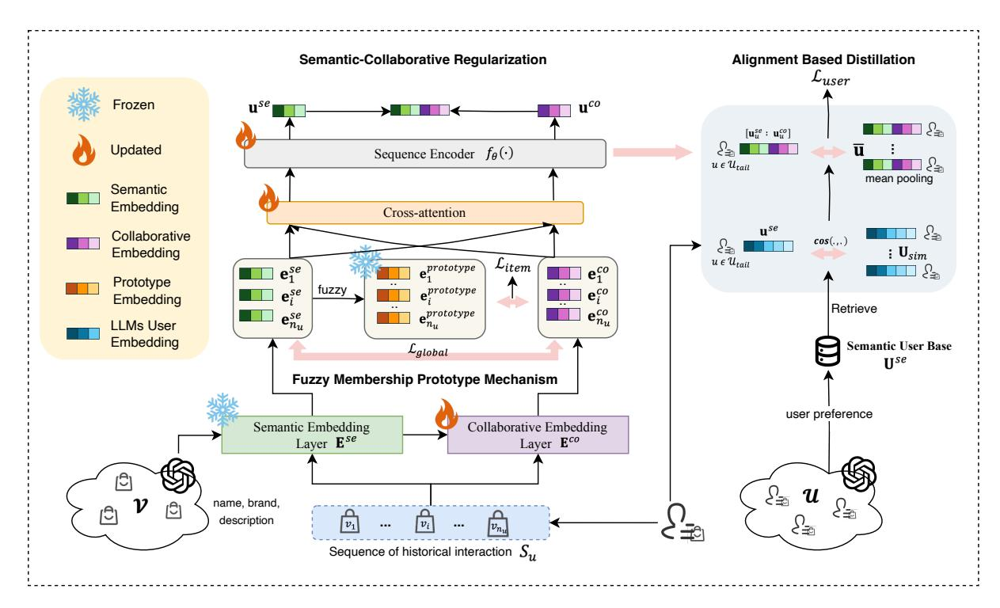
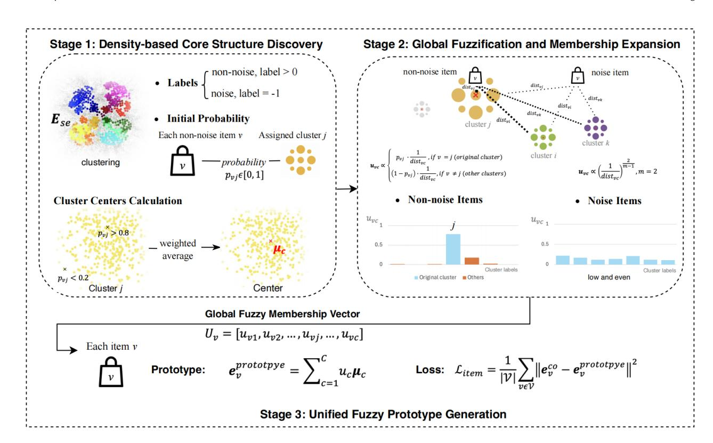
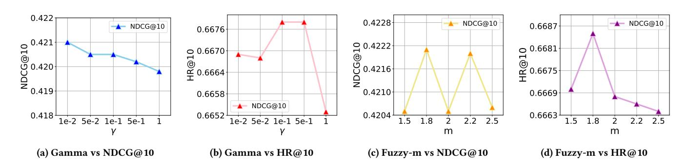

# SAGE: Global Semantic Alignment with LLMs for Long-Tail Sequential Recommendation

Maolin Wang morin.wang@my.cityu.edu.hk City University of Hong Kong Hong Kong SAR, China

Tongshu Bian tsbian2-c@my.cityu.edu.hk City University of Hong Kong Hong Kong SAR, China

Ziyan Wang zwang2684-c@my.cityu.edu.hk City University of Hong Kong Hong Kong SAR, China

Xiaotong Jiang xtjiang22-c@my.cityu.edu.hk City University of Hong Kong Hong Kong SAR, China

Binhao Wang binhawang2-c@my.cityu.edu.hk City University of Hong Kong Hong Kong SAR, China

Derong Xu derongxu@mail.ustc.edu.cn University of Science and Technology of China Hefei, China City University of Hong Kong Hong Kong SAR, China

Wanyu Wang wanyuwang4-c@my.cityu.edu.hk City University of Hong Kong Hong Kong SAR, China

Ruocheng Guo rguo.asu@gmail.com Independent Researcher Hong Kong SAR, China

Xiangyu Zhao∗ xianzhao@cityu.edu.hk City University of Hong Kong Hong Kong SAR, China

# Abstract

Sequential recommendation (SRS) has become a core technique for modern platforms, yet the long-tail distribution of user-item interactions poses persistent challenges. Most users interact sparsely, most items receive little exposure, and existing methods struggle with three issues: (i) collaborative sparsity, where interaction signals collapse in the tail; (ii) limited semantic exploitation, since large language models (LLMs) are mainly used for shallow, point-level embeddings; and (iii) head–tail imbalance, where gains in the tail often come at the cost of head performance. We propose Semantic Alignment with Global Embedding for Recommendation (SAGE-Rec), a new framework that explicitly leverages global semantic organization from LLMs for sequential recommendation. On the item side, SAGE-Rec introduces a fuzzy-membership prototype mechanism that enables tail items to inherit features from semantically related head items. On the user side, it performs alignment and distillation across semantically similar users to enrich sparse representations. At the global level, it applies lightweight regularization to balance semantic and collaborative signals, alleviating the head–tail seesaw effect. Extensive experiments across three realworld datasets and backbone models demonstrate that SAGE-Rec consistently preserves head accuracy while substantially improving recommendations for tail users and items. These results highlight global semantic alignment with LLMs as a principled solution to

WWW '26, Dubai, United Arab Emirates © 2026 Copyright held by the owner/author(s). ACM ISBN 979-8-4007-2307-0/2026/04 <https://doi.org/10.1145/3774904.3792456>

the long-tail dilemma in sequential recommendation. The implementation code is available for easy reproducibility [https://github.](https://github.com/Applied-Machine-Learning-Lab/WWW2026_SAGE-LLM) [com/Applied-Machine-Learning-Lab/WWW2026\\_SAGE-LLM.](https://github.com/Applied-Machine-Learning-Lab/WWW2026_SAGE-LLM)

# CCS Concepts

- Information systems → Information retrieval; Data mining;
- Computing methodologies → Machine learning.

# Keywords

Long-tailed Recommendation, Sequential Recommendation, Large Language Models (LLMs), Semantic–Collaborative Alignment

### ACM Reference Format:

Maolin Wang, Tongshu Bian, Ziyan Wang, Xiaotong Jiang, Binhao Wang, Derong Xu, Wanyu Wang, Ruocheng Guo, and Xiangyu Zhao. 2026. SAGE: Global Semantic Alignment with LLMs for Long-Tail Sequential Recommendation. In Proceedings of the ACM Web Conference 2026 (WWW '26), April 13–17, 2026, Dubai, United Arab Emirates. ACM, New York, NY, USA, [12](#page-11-0) pages.<https://doi.org/10.1145/3774904.3792456>

# 1 Introduction

Recommender systems are indispensable in modern information platforms such as e-commerce [\[50\]](#page-9-0), social media [\[4\]](#page-8-0), and content streaming. Their capability to identify relevant items from massive catalogues directly shapes user experience and business outcomes [\[7,](#page-8-1) [58\]](#page-9-1). Among different paradigms, sequential recommendation (SRS) has gained prominence for its ability to capture the dynamic evolution of user preferences. Trained on chronological useritem interaction sequences, SRS can predict the next item for a user with high accuracy. However, in real-world scenarios, user–item interactions follow a pronounced long-tail distribution [\[3,](#page-8-2) [51\]](#page-9-2): a small proportion of active users and popular items dominate the data, while the vast majority of users interact sparsely and the majority of items remain rarely consumed. This imbalance severely limits

∗Corresponding author.

[This work is licensed under a Creative Commons Attribution-NonCommercial-](https://creativecommons.org/licenses/by-nc-nd/4.0)[NoDerivatives 4.0 International License.](https://creativecommons.org/licenses/by-nc-nd/4.0)

the effectiveness of mainstream models [\[1,](#page-8-3) [46\]](#page-9-3), which excel in the head regions, but underperform in the tail. Therefore, the central research question is how to enhance the representation of long-tail users and items without degrading overall system performance.

The difficulty of long-tail sequential recommendation arises from three fundamental challenges: (i) Collaborative sparsity: tail users generate short sequences and tail items have too few interactions, making collaborative signals unreliable or even absent. (ii) Insufficient semantic exploitation: existing methods typically rely on shallow embeddings or point-level initializations from large language models (LLMs) [\[45,](#page-9-4) [77\]](#page-9-5), overlooking the higher-order structural semantics that LLMs encode. (iii) Head–tail balance: attempts to amplify tail performance often reduce accuracy in the head, leading to the "seesaw effect." [\[38\]](#page-8-4) These three aspects delimit the frontier of current SRS research and form the barriers that an effective solution must overcome.

Prior work has proposed various strategies to address these difficulties, p. Traditional sequential models, such as GRU4Rec [\[13\]](#page-8-5), SAS-Rec [\[17\]](#page-8-6), and BERT4Rec [\[52\]](#page-9-6), achieve strong performance for head users and items but provide little benefit to the tail users. Collaborative enhancement approaches, such as MELT [\[18\]](#page-8-7) or CITIES [\[16\]](#page-8-8), introduce pseudo interactions or additional regularization to enrich sparse regions; however, these additions may introduce noise and exacerbate the head–tail trade-off [\[2,](#page-8-9) [5\]](#page-8-10). The integration of LLMs into recommendation has recently emerged as another direction, as seen in methods such as LLMInit [\[74\]](#page-9-7), RLMRec [\[49\]](#page-9-8), or dual-view alignment frameworks like LLM-ESR [\[33\]](#page-8-11). While these models leverage the semantic richness of LLMs [\[12,](#page-8-12) [15\]](#page-8-13), most remain limited to point-level embeddings [\[62\]](#page-9-9), failing to harness the global organizational structures of LLM representations [\[69\]](#page-9-10). Consequently, their ability to fundamentally address the long-tail challenge is constrained [\[35,](#page-8-14) [39\]](#page-8-15).

In this paper, we propose Semantic Alignment with Global Embedding for Recommendation (SAGE-Rec), a semantic-structure enhanced framework designed to integrate higher-level organizational knowledge from LLMs. The design of SAGE directly corresponds to the challenges described above. (i) To mitigate collaborative sparsity, SAGE introduces a fuzzy-membership prototype mechanism on the item side, softly aligning tail items with semantically related head items to prevent embedding collapse under sparse signals. (ii) To address insufficient semantic exploitation, SAGE aligns and distills across semantically similar users, enabling tail users to benefit from richer structural information and advancing beyond point-level embeddings. (iii) To balance head and tail performance, SAGE employs lightweight regularization that dynamically coordinates semantic and collaborative signals, thereby enhancing the tail without sacrificing head accuracy. Through these designs, SAGE transforms the latent structural semantics of LLMs into actionable constraints for sequential recommendation [\[24,](#page-8-16) [27,](#page-8-17) [68\]](#page-9-11).

The main contributions of this paper are:

- We provide a new perspective on the long-tail problem in sequential recommendation by showing that existing approaches remain restricted to point-level embeddings and shallow semantic injection, which prevents them from fully utilizing the structural knowledge encoded in LLMs.

- We introduce SAGE, a novel framework that incorporates fuzzyprototype constraints for items and alignment-based user distillation, enabling structural semantic knowledge from LLMs to be effectively aligned with collaborative modeling while directly addressing collaborative sparsity, insufficient semantic exploitation, and head–tail imbalance.
- We validate SAGE on three real-world datasets and with diverse backbone models, demonstrating that it preserves head performance while significantly improving recommendations for tail users and items, thereby confirming both its effectiveness.

### 2 Methodology

In this section, we introduce SAGE-Rec (Semantic Alignment with Global Embedding for Recommendation), a semantic-structure enhanced framework designed to alleviate the intrinsic difficulties of long-tailed sequential recommendation [\[35,](#page-8-14) [39\]](#page-8-15).

# 2.1 Overview

The central principle of SAGE-Rec is that the weakness of longtail users and items does not stem from semantic emptiness, but from a disconnection between their sparse collaborative signals and the global semantic organization encoded by LLMs [\[45,](#page-9-4) [77\]](#page-9-5). Instead of treating head and tail as separate domains, SAGE-Rec reconnects them by aligning items, users, and their interactions with the structural semantics of the LLM space. Figure [1](#page-2-0) illustrates the overall architecture, which consists of three interacting modules that correspond directly to the key challenges outlined in Section [1.](#page-0-0)

As shown in Figure [1,](#page-2-0) SAGE-Rec builds on a backbone sequential recommendation model that encodes a user's historical interactions into collaborative representations. However, such representations are insufficient in long-tail settings [\[16,](#page-8-8) [18\]](#page-8-7). To mitigate item sparsity, we introduce fuzzy-membership prototypes, where item embeddings are softly linked to semantic clusters derived from LLM embeddings, allowing even rare items to inherit category-level stability. For users, alignment-based distillation retrieves semantically similar neighbors from a pre-computed LLM user space to form a teacher embedding, aligning each tail user with structurally richer peers. Finally, a global semantic–collaborative regularization term constrains the latent space so that collaborative and semantic embeddings remain geometrically consistent.

These modules act as complementary layers around the backbone: prototypes stabilize sparse items, distillation enriches weak user representations, and regularization maintains head–tail balance. Together, they integrate global semantics into sequential modeling, reframing long-tail weakness as a problem of semantic disconnection rather than absence.

# 2.2 Problem Formulation and Preliminaries

Let U = {��1, . . . , ��|U | } and V = {��1, . . . , ��|V | } denote the sets of users and items, respectively. Each user �� has a chronologically ordered interaction sequence ���� = {�� 1 , . . . , ���� ���� }, where ���� is the sequence length. The goal of sequential recommendation is to predict the most probable next item:

arg max ��∈V �� (������+1 = �� | ����). (1)

Figure 1: Overall architecture of SAGE-Rec, which consists of three key modules: (1) a fuzzy-membership prototype mechanism for stabilizing tail-item representations, (2) alignment-based distillation to enrich tail-user embeddings, and (3) semantic–collaborative regularization to maintain geometric consistency between semantic and collaborative spaces.

Following the Pareto principle, we partition the user and item sets into head and tail groups according to their interaction frequency: U = Uℎ������ ∪ U�������� and V = Vℎ������ ∪ V�������� . The sparsity of U�������� and V�������� is the source of long-tail difficulties.

We consider two types of embeddings. Semantic embeddings E are pre-computed from a pretrained LLM by encoding items' textual attributes and users' interaction histories into prompts. Freezing E ���� preserves the geometry of global semantics. Collaborative embeddings E ���� are trainable vectors updated by interaction data. A backbone sequential encoder ���� , such as GRU-based, Transformerbased (SASRec), or BERT-style encoders, is shared across the two views. The novelty of SAGE-Rec lies in how these two embedding spaces—semantic and collaborative—are related through higherorder structural alignment, rather than mere initialization.

# 2.3 Fuzzy-Membership Prototypes for Items

The first challenge of long-tailed recommendation lies in collaborative sparsity for items. Popular items accumulate abundant interactions and form well-defined representations, while tail items suffer from weak or absent supervision. If optimized solely with collaborative signals, their embeddings collapse into noisy or unstable representations. Prior remedies either oversample rare interactions or directly copy features from head items, but these approaches risk overfitting and destroying semantic nuance.

To address this, SAGE-Rec introduces a fuzzy-membership prototype mechanism, which provides semantic anchors for sparse items. The overall generation process is illustrated in Figure [2,](#page-3-0) consisting of three stages: density-based core structure discovery, global fuzzification and membership expansion, and unified prototype generation. This module allows each item to inherit robust semantic information from LLM embeddings while maintaining representation diversity.

Stage 1: Density-based Core Structure Discovery. We first obtain LLM-derived semantic embeddings E ���� for all items and perform dimensionality reduction (e.g., UMAP) followed by densitybased clustering (e.g., HDBSCAN). Each non-noise item �� is assigned a cluster label �� with an initial membership probability ������ ∈ [0, 1], while noise points are labeled as −1. Cluster centers ���� are then calculated as the weighted mean of items with high membership confidence (������ &gt; 0.8), forming semantically coherent prototypes that capture stable category-level semantics.

Stage 2: Global Fuzzification and Membership Expansion. After deriving the cluster structure, both non-noise and noise items are assigned soft memberships toward all clusters. For a non-noise item ��, the normalized membership ������ depends on its distance to cluster centroids, where the original cluster retains a higher weight while other semantically close clusters obtain smaller but nonzero values. For noise items, which lack reliable assignment, memberships are distributed evenly across clusters based on relative distances. This stage allows tail items to borrow strength from multiple semantically related regions rather than being tied to a single semantic cluster.

noisy interactions. This strengthens individual sequences while respecting the collective semantic organization provided by the LLM. In the broader framework, this module complements fuzzy prototypes: while prototypes connect items to categories, user alignment connects individuals to communities, enriching user preference modeling through semantic relations.

## 2.5 Semantic–Collaborative Regularization

The final challenge concerns head–tail balance. Enhancing tails aggressively may distort collaborative embeddings and harm accuracy on head users and items, producing the undesirable seesaw effect. To avoid this, SAGE-Rec introduces a lightweight regularization that ensures semantic and collaborative signals remain coordinated.

The global item semantic-collaborative alignment loss Lglobal is computed as the average contrastive loss over all valid items in the interaction sequence, where each item's LLM semantic embedding after adapter projection is aligned with its collaborative embedding. The formula ensures that semantic-consistent item pairs are pulled closer while dissimilar pairs are pushed apart,

Lglobal = 1 |V | ∑︁ ��∈V Contrastive (E ���� (��), E ���� (��)) . (5)

This constraint is intentionally simple and light, designed to stabilize the overall geometry of the representation space without overwhelming the optimization process. Globally, it harmonizes the interaction between the two views, ensuring that improvements in tail modeling do not come at the cost of head degradation.

# 2.6 Overall Training Objective

The three modules are integrated into the training of any backbone sequence model. The final loss combines the ranking objective with the auxiliary components:

L = L�������� + �� · L�������� + �� · L������������ +�� · L�������� (6)

where ��, ��,�� control the relative strength of user alignment, global regularization, and item prototypes. In practice, only the collaborative embeddings, adapters, fusion layers, and sequence encoder parameters are updated during training, while the LLM-derived semantic embeddings and cluster centroids remain frozen to preserve their structural integrity.

SAGE-Rec integrates fuzzy prototypes, alignment distillation, and global regularization to stabilize sparse embeddings, transfer knowledge to tail users, and align semantics with collaborative spaces—reconnecting long-tail signals to LLM semantics for stronger sequential recommendation.

### 3 Experiment

We present experimental settings and extensive empirical results of SAGE-Rec in this section.

# 3.1 Experimental Setting

Datasets. To evaluate the robustness and generalization ability of our model, we conduct experiments on three real-world datasets, including Amazon-Fashion, Yelp, and Amazon-Beauty, following standard preprocessing and data-splitting protocols from previous

Table 1: Statistics of the preprocessed datasets .

| Dataset | # Users | # Items | Sparsity | Avg. Length |
|---------|---------|---------|----------|-------------|
| Yelp    | 15,720  | 11,383  | 99.89%   | 12.23       |
| Fashion | 9,049   | 4,722   | 99.92%   | 3.82        |
| Beauty  | 52,204  | 57,289  | 99.99%   | 7.57        |

sequential recommendation studies to ensure fairness and comparability. The statistical details of these preprocessed datasets are summarized in Table [1.](#page-4-0)

Backbones and Baselines. Three representative backbone models (GRU4Rec [\[13\]](#page-8-5), Bert4Rec [\[52\]](#page-9-6), and SASRec [\[17\]](#page-8-6)) are adopted to evaluate the adaptability of our enhancement framework. We compare our approach with both traditional long-tail enhancement methods (such as CITIES [\[16\]](#page-8-8) and MELT [\[18\]](#page-8-7)) and LLM-based frameworks (such as RLMRec [\[49\]](#page-9-8), LLMInit [\[12,](#page-8-12) [15,](#page-8-13) [74\]](#page-9-7), and LLM-ESR [\[33\]](#page-8-11)). Implementation Details. All experiments were conducted on a hardware platform equipped with an Intel Xeon Gold 6130 processor and a Tesla V100 (32GB) GPU, with the software environment comprising Python 3.10.8 and PyTorch 2.1.2. To avoid the inference burden brought by large language models (LLMs), we cache the embeddings derived from LLMs in advance. Specifically, we use the public API text-embedding-ada-002 [1](#page-4-1) to obtain semantic representations for textual inputs. For hyperparameter tuning, we use N@10 on the validation set as the evaluation metric to determine its optimal value. To prevent overfitting, an early stopping strategy with a patience of 20 epochs was applied during training. For the backbone sequential recommendation system (SRS) models, GRU4Rec employed a single-layer GRU structure, while SASRec and Bert4Rec were configured with two stacked self-attention layers. The dropout rate for Bert4Rec was set to 0.6. During training, all datasets were processed with a batch size of 128 and a learning rate of 0.001. The embedding dimension for all baseline models was set to 128, whereas the SAGE model used 64-dimensional embeddings. Evaluation Metrics. The experimental evaluation framework was designed to precisely quantify model performance, using the Top-10 recommendation list as the core assessment unit. Hit Rate at 10 (H@10) is employed to directly reflect the overlap between the recommended items and users' actual preferences, whileNormalized Discounted Cumulative Gain at 10 (NDCG@10) is introduced to evaluate the overall ranking quality of the recommendation list. The negative sampling strategy strictly follows the random sampling paradigm proposed in SASRec [\[17\]](#page-8-6), where for each user, 100 items are independently drawn from the set of unobserved interactions to form negative samples. These are then paired with positive samples, effectively simulating the data distribution characteristics encountered in real-world recommendation scenarios. To enhance the statistical significance and reproducibility of the experimental results, a multi-random-seed mechanism is applied for cross-validation.

Due to space constraints, detailed descriptions of the datasets, model configurations, and hyperparameter settings are provided in Appendix Sec [A](#page-9-12). Detailed prompt templates and construction examples are provided in Appendix Sec Appendix [B](#page-11-1).

1<https://platform.openai.com/docs/guides/embeddings>

Table 2: Performance comparison with SASRec [\[17\]](#page-8-6) backbone. Bold indicates the best performance, while underlining highlights the highest score among the baselines. "\*" denotes statistically significant improvements (i.e., two-sided t-test with �� &lt; 0.05) over the best baseline.

| Dataset Model  | H@10     | Overall N@10 | Tail H@10 | Item N@10 | Head H@10 | Item N@10 | Tail H@10 | User N@10 | Head H@10 | User N@10 |
|----------------|----------|--------------|-----------|-----------|-----------|-----------|-----------|-----------|-----------|-----------|
| Pure           | 0.5940   | 0.3597       | 0.1142    | 0.0495    | 0.7353    | 0.4511    | 0.5893    | 0.3578    | 0.6122    | 0.3672    |
| +CITIES        | 0.5828   | 0.3540       | 0.1532    | 0.0700    | 0.7093    | 0.4376    | 0.5785    | 0.3511    | 0.5994    | 0.3649    |
| +MELT          | 0.6257   | 0.3791       | 0.1015    | 0.0371    | 0.7801    | 0.4799    | 0.6246    | 0.3804    | 0.6299    | 0.3744    |
| +RLMRec Yelp   | 0.5990   | 0.3623       | 0.0953    | 0.0412    | 0.7474    | 0.4568    | 0.5966    | 0.3613    | 0.6084    | 0.3658    |
| +LLMInit       | 0.6415   | 0.3997       | 0.1760    | 0.0789    | 0.7785    | 0.4941    | 0.6403    | 0.4010    | 0.6462    | 0.3948    |
| +LLM-ESR       | 0.6661   | 0.4201       | 0.1794    | 0.0795    | 0.8093    | 0.5204    | 0.6672    | 0.4222    | 0.6618    | 0.4121    |
| +LLM-SAGE-Rec  | 0.6685 ∗ |              |           |           |           |           |           |           |           |           |
|                |          | 0.4221 ∗     |           |           |           |           |           |           |           |           |
|                |          |              | 0.1948 ∗  |           |           |           |           |           |           |           |
|                |          |              |           | 0.0871 ∗  |           |           |           |           |           |           |
|                |          |              |           |           | 0.8079    | 0.5207    | 0.6700 ∗  |           |           |           |
|                |          |              |           |           |           |           |           | 0.4245 ∗  |           |           |
|                |          |              |           |           |           |           |           |           | 0.6629 ∗  |           |
| Pure           | 0.4956   | 0.4429       | 0.0454    | 0.0235    | 0.6748    | 0.6099    | 0.3967    | 0.3390    | 0.6239    | 0.5777    |
| +CITIES        | 0.4923   | 0.4423       | 0.0407    | 0.0214    | 0.6721    | 0.6098    | 0.3936    | 0.3392    | 0.6203    | 0.5760    |
| +MELT Fashion  | 0.4875   | 0.4150       | 0.0368    | 0.0144    | 0.6670    | 0.5745    | 0.3792    | 0.2933    | 0.6280    | 0.5729    |
| +RLMRec        | 0.4982   | 0.4457       | 0.0410    | 0.0223    | 0.6803    | 0.6143    | 0.3990    | 0.3415    | 0.6270    | 0.5808    |
| +LLMInit       | 0.5119   | 0.4492       | 0.0596    | 0.0305    | 0.6920    | 0.6159    | 0.4184    | 0.3501    | 0.6332    | 0.5777    |
| +LLM-ESR       | 0.5590   | 0.4740       | 0.1091    | 0.0531    | 0.7381    | 0.6415    | 0.4758    | 0.3754    | 0.6670    | 0.6019    |
| +LLM-SAGE-Rec  | 0.5643 ∗ |              |           |           |           |           |           |           |           |           |
|                |          | 0.4765 ∗     |           |           |           |           |           |           |           |           |
|                |          |              | 0.1162 ∗  |           |           |           |           |           |           |           |
|                |          |              |           | 0.0556 ∗  |           |           |           |           |           |           |
|                |          |              |           |           | 0.7427 ∗  |           |           |           |           |           |
|                |          |              |           |           |           | 0.6441 ∗  |           |           |           |           |
|                |          |              |           |           |           |           | 0.4821 ∗  |           |           |           |
|                |          |              |           |           |           |           |           | 0.3791 ∗  |           |           |
|                |          |              |           |           |           |           |           |           | 0.6709 ∗  |           |
|                |          |              |           |           |           |           |           |           |           | 0.6029 ∗  |
| Pure           | 0.4388   | 0.3030       | 0.0870    | 0.0649    | 0.5227    | 0.3598    | 0.4270    | 0.2941    | 0.4926    | 0.3438    |
| +CITIES        | 0.2256   | 0.1413       | 0.1363    | 0.0897    | 0.2468    | 0.1536    | 0.2215    | 0.1406    | 0.2441    | 0.1444    |
| +MELT          | 0.4334   | 0.2775       | 0.0460    | 0.0172    | 0.5258    | 0.3995    | 0.4233    | 0.2673    | 0.4796    | 0.3241    |
| +RLMRec Beauty | 0.4460   | 0.3075       | 0.0924    | 0.0658    | 0.5303    | 0.3652    | 0.4365    | 0.3016    | 0.4892    | 0.3345    |
| +LLMInit       | 0.5455   | 0.3656       | 0.1714    | 0.0965    | 0.6347    | 0.4298    | 0.5359    | 0.3592    | 0.5893    | 0.3948    |
| +LLM-ESR       | 0.5650   | 0.3720       | 0.2086    | 0.1018    | 0.6499    | 0.4364    | 0.5552    | 0.3643    | 0.6098    | 0.4070    |
| +LLM-SAGE-Rec  | 0.5705 ∗ |              |           |           |           |           |           |           |           |           |
|                |          | 0.3763 ∗     |           |           |           |           |           |           |           |           |
|                |          |              | 0.2369 ∗  |           |           |           |           |           |           |           |
|                |          |              |           | 0.1191 ∗  |           |           |           |           |           |           |
|                |          |              |           |           | 0.6500    | 0.4376 ∗  |           |           |           |           |
|                |          |              |           |           |           |           | 0.5612 ∗  |           |           |           |
|                |          |              |           |           |           |           |           | 0.3694 ∗  |           |           |
|                |          |              |           |           |           |           |           |           | 0.6129 ∗  |           |

Table 3: Ablation Experiments Results on the SRS Model on the Yelp Dataset Based on the SASRec Framework. Bold represents the best performance, while underlining represents the next best baseline.

| Model        |               | H@10   | Overall N@10 | H@10   | Tail Item N@10 | H@10   | Head Item N@10 | H@10   | Tail User N@10 | H@10   | Head User N@10 |
|--------------|---------------|--------|--------------|--------|----------------|--------|----------------|--------|----------------|--------|----------------|
| LLM-SAGE-Rec |               | 0.6685 | 0.4221       | 0.1948 | 0.0871         | 0.8079 | 0.5207         | 0.6700 | 0.4245         | 0.6629 | 0.4128         |
| w/o          | umap          | 0.6671 | 0.4201       | 0.1885 | 0.0841         | 0.8079 | 0.5191         | 0.6689 | 0.4225         | 0.6600 | 0.4113         |
| w/o          | hdbscan       | 0.6670 | 0.4203       | 0.1921 | 0.0851         | 0.8068 | 0.5190         | 0.6689 | 0.4228         | 0.6599 | 0.4109         |
| w/o          | global-fuzzy  | 0.6659 | 0.4203       | 0.1930 | 0.0866         | 0.8051 | 0.5185         | 0.6675 | 0.4227         | 0.6599 | 0.4111         |
| w/o          | dynamic-fuzzy | 0.6674 | 0.4208       | 0.1776 | 0.0775         | 0.8016 | 0.5118         | 0.6689 | 0.4232         | 0.6618 | 0.4115         |

# 3.2 Overall Performance

This section comprehensively evaluates LLM-SAGE-Rec on three benchmark datasets (Yelp, Fashion, and Beauty) using the SASRec backbone as the base sequential recommendation model. We compare our method with several representative baselines designed to improve long-tail recommendation or LLM-enhanced sequential modeling, including CITIES, MELT, RLMRec, LLMInit, and LLM-ESR. Each experiment is repeated ten times with different random seeds to ensure statistical reliability. We report the mean results with four valid decimal digits, and conduct a two-sided t-test (�� &lt; 0.05) to confirm the statistical significance of the best-performing

method (in bold) over the strongest baseline (in underline). All results are summarized in Table [2.](#page-5-0)

Overall, LLM-SAGE-Rec achieves the best performance across all three datasets and evaluation groups (Overall, Tail Item, Head Item, Tail User, and Head User). The consistent improvements across diverse data distributions underscore the effectiveness of semantic alignment and structural fusion in reconciling sparse (tail) and dense (head) representations.

On the Yelp dataset, LLM-SAGE-Rec obtains the highest scores (H@10 = 0.6685, N@10 = 0.4221), outperforming the best baseline (LLM-ESR) by approximately 3–5%. The improvements are particularly significant in the Tail Item and Tail User groups (H@10 =

Figure 3: Hyperparameter sensitivity analysis for SAGE-Rec framework. (a-b) Impact of gamma parameter (��) on item prototype regularization strength across NDCG@10 and HR@10 metrics, demonstrating optimal performance in the range �� ∈ [0.1, 0.5]. (c-d) Effect of fuzzy exponent (��) on dynamic fuzzy prototype generation quality, showing best results around �� ∈ [2.0, 2.2]. All parameters exhibit stable performance trends within their optimal ranges, indicating robust model behavior.

0.1948, N@10 = 0.0871), demonstrating that semantic structural guidance effectively mitigates collaborative sparsity.

For the Fashion dataset, LLM-SAGE-Rec achieves H@10 = 0.5643 and N@10 = 0.4765, consistently surpassing all existing LLM-based variants. Notably, the Tail Item H@10 improves from 0.1091 to 0.1162, and the Tail User H@10 from 0.4758 to 0.4821, confirming that the combination of fuzzy membership prototypes and alignment based user distillation successfully transfers stable semantic knowledge to underrepresented items and users.

On the Beauty dataset, our method continues to lead with H@10 = 0.5705 and N@10 = 0.3763. Compared with LLM-ESR, LLM-SAGE-Rec yields a 13.6% relative improvement in Tail Item H@10 (from 0.2086 to 0.2369) while maintaining consistent gains across all other subgroups. These results indicate that LLM-SAGE-Rec not only strengthens long-tail modeling but also preserves or slightly improves head performance, thanks to the stabilizing effect of semantic collaborative regularization.

In summary, LLM-SAGE-Rec effectively integrates LLM-derived semantic knowledge into collaborative learning, achieving a superior balance between head accuracy and tail robustness. The overall results validate that semantic structural alignment, rather than simple data augmentation or frequency-based correction, is the key to overcoming the long tail challenge in sequential recommendation. Additional results using GRU4Rec and BERT4Rec backbones are reported in Appendix [C,](#page-11-2) demonstrating the consistent generalization of LLM-SAGE-Rec across different sequential architectures.

### 3.3 Ablation Study

To examine the contribution of each component in LLM-SAGE-Rec, we conduct a series of ablation experiments on the Yelp dataset based on the SASRec backbone. The detailed results are presented in Table [3.](#page-5-1) As shown in the table, the complete LLM-SAGE-Rec model consistently outperforms all its variants across every evaluation metric, confirming the effectiveness of the proposed modules.

Specifically, removing the UMAP module (w/o umap) slightly decreases both Hit@10 and NDCG@10 (from 0.6685/0.4221 to 0.6671/ 0.4201), indicating that UMAP preserves the intrinsic local structure of the LLM-derived semantic space. This contributes to more robust and separable cluster formation in the subsequent HDBSCAN

process. When the HDBSCAN clustering step is omitted (w/o hdbscan), the model performance exhibits a further small degradation, verifying that density-based clustering is essential for identifying coherent semantic prototypes and filtering out noise items. By discovering stable cluster cores, HDBSCAN provides reliable anchors for the fuzzy-membership mechanism.

The removal of the global-fuzzy mechanism (w/o global-fuzzy) causes the most significant drop for tail items, where Hit@10/ NDCG@10 decrease from 0.1948/0.0871 to 0.1930/0.0866, as shown in Table [3.](#page-5-1) This confirms that global fuzzification effectively alleviates item-level sparsity by assigning each item soft memberships over multiple semantically related clusters, enabling tail items to inherit information from neighboring semantic regions.

In contrast, removing the dynamic-fuzzy component (w/o dynamicfuzzy) results in more pronounced degradation across user groups, particularly for head and tail users. This indicates that dynamic fuzzy alignment is crucial for maintaining geometric consistency between the semantic and collaborative spaces during training, providing an adaptive balance between head and tail representations.

Overall, Table [3](#page-5-1) shows that each module contributes clearly and independently: UMAP and HDBSCAN build the semantic backbone, global fuzzification offers semantic mixture support for sparse items, and dynamic fuzzy alignment ensures consistent semantic–collaborative alignment. Together, these components improve SAGE-Rec's robustness and generalization, significantly enhancing recommendation quality under long-tail conditions. Moreover, the modular design remains stable across user strata and sparsity levels, making it easy to reuse and extend to related tasks and modalities.

### 3.4 Hyperparameter Analysis

To validate the robustness and parameter sensitivity of our SAGE-Rec framework, we conduct a comprehensive hyperparameter analysis on two critical components. As illustrated in Figure [3,](#page-6-0) both the gamma and fuzzy membership parameters demonstrate consistent and predictable effects on model performance, underscoring the framework's stability. Such predictability is a desirable trait, as it simplifies the tuning process and enhances the model's reliability in production environments.

The gamma parameter analysis (Figure [3a](#page-6-0) and Figure [3b\)](#page-6-0) reveals that a moderate prototype regularization strength (�� ∈ [0.1, 0.5]) achieves optimal performance across both NDCG@10 and HR@10 metrics. Specifically, NDCG@10 improves from 0.418 to 0.421 as gamma increases from 0.01 to 0.1, while HR@10 shows similar improvement patterns. This suggests that appropriate prototype constraints effectively stabilize tail item representations without over-constraining the learning process, striking a crucial balance between semantic guidance and collaborative signals. Indeed, a value that is too low fails to impart sufficient semantic structure, while one that is too high risks overshadowing the primary objective of collaborative learning. Similarly, the fuzzy exponent parameter analysis (Figure [3c](#page-6-0) and Figure [3d\)](#page-6-0) demonstrates that optimal fuzzification levels (�� ≈ 2.0) balance semantic focus with cross-cluster knowledge transfer capabilities. This parameter directly controls the degree of fuzziness, ensuring tail items can borrow information from multiple semantic regions without losing their core identity.

# 4 Related Works

Sequential Recommendation Models In sequential recommendation research, the primary goal is to capture temporal dependency patterns in user interactions to accurately predict future behaviors [\[8,](#page-8-18) [10,](#page-8-19) [20,](#page-8-20) [22,](#page-8-21) [23,](#page-8-22) [25,](#page-8-23) [26,](#page-8-24) [29,](#page-8-25) [31,](#page-8-26) [37,](#page-8-27) [40–](#page-8-28)[42,](#page-8-29) [59](#page-9-13)[–61,](#page-9-14) [64,](#page-9-15) [71,](#page-9-16) [78,](#page-9-17) [79\]](#page-9-18). Early studies mainly relied on recurrent neural networks (RNNs) and convolutional neural networks (CNNs) [\[19\]](#page-8-30). For instance, Caser [\[53\]](#page-9-19) combined local temporal features with global sequence modeling, while NextItNet [\[70\]](#page-9-20) leveraged deep convolutional structures to enhance representation capability. The success of self-attention mechanisms [\[55\]](#page-9-21) in natural language processing inspired the adoption of Transformer-based architectures for recommendation. Models such as SASRec [\[17\]](#page-8-6) and BERT4Rec [\[52\]](#page-9-6) effectively captured long-term dependencies and contextual relations. More recent methods [\[6,](#page-8-31) [82\]](#page-9-22) exploited MLP-based or lightweight attention designs to improve efficiency.

Despite these advancements, the long-tail problem remains a persistent challenge. On the item side, CITIES [\[16\]](#page-8-8) designed an embedding inference function to enhance representations of infrequent items. On the user side, data augmentation has become a mainstream strategy to alleviate sparsity [\[35,](#page-8-14) [39\]](#page-8-15). For example, CL4SRec [\[67\]](#page-9-23) creates diverse sequence views through cropping and reordering to improve robustness for short sequences, while DuoRec [\[47\]](#page-9-24) enriches user representations by applying sequence perturbations. A few studies, such as MELT [\[18\]](#page-8-7), have attempted to jointly tackle long-tail issues on both the user and item sides from a collaborative perspective. However, most existing methods rely heavily on interaction signals and insufficiently leverage semantic knowledge. In contrast, our proposed SAGE framework integrates large language models (LLMs) to achieve global semantic alignment, providing a more comprehensive and semantics-aware solution for sequential recommendation.

Application of LLMs in Recommendation Large Language Models (LLMs) [\[36,](#page-8-32) [45,](#page-9-4) [77\]](#page-9-5) have demonstrated remarkable capabilities in semantic understanding, reasoning, and knowledge transfer, making them increasingly influential in recommender system research [\[21,](#page-8-33) [28,](#page-8-34) [30,](#page-8-35) [32,](#page-8-36) [36,](#page-8-32) [36,](#page-8-32) [41,](#page-8-37) [43,](#page-8-38) [57,](#page-9-25) [65,](#page-9-26) [66,](#page-9-27) [72,](#page-9-28) [80,](#page-9-29) [81\]](#page-9-30). One line of work explores the direct use of LLMs for recommendation

through prompt engineering and fine-tuning. For instance, ChatRec [\[11\]](#page-8-39) designs dialog-based recommendation flows, while DynamicPrompt [\[54\]](#page-9-31) combines dynamic feedback and knowledge retrieval for logical optimization. Systems such as LLMRerank [\[9\]](#page-8-40) and UniLLMRec [\[73\]](#page-9-32) employ LLM reasoning capabilities in re-ranking and full-pipeline design. In addition, studies like SmartRec [\[56\]](#page-9-33), E4SRec [\[24\]](#page-8-16), LLLaRA [\[27\]](#page-8-17), and RecInterpreter [\[68\]](#page-9-11) utilized lightweight fine-tuning and parameter adaptation [\[14,](#page-8-41) [34\]](#page-8-42) to integrate semantic and behavioral features.

Another research direction indirectly leverages LLMs by enhancing traditional recommendation architectures. SyncRec [\[76\]](#page-9-34) achieves knowledge sharing between models and LLMs through collaborative training, while RLMRec [\[49\]](#page-9-8) employs auxiliary loss functions for better alignment. In cross-domain scenarios, MultiRec [\[48\]](#page-9-35) refines feature fusion and ranking logic with LLM assistance, and LLM4MSR [\[63\]](#page-9-36) as well as Uni-CTR [\[8\]](#page-8-18) further demonstrate how LLM-enhanced integration benefits multi-domain recommendation. In the sequential setting, Harte et al. [\[12\]](#page-8-12) and Hu et al. [\[15\]](#page-8-13) initialized models using LLM embeddings, verifying that semantic priors from LLMs could strengthen downstream recommendation performance. The proposed SAGE framework builds upon this foundation, introducing global semantic alignment between collaborative and semantic spaces to effectively address the long-tail dilemma in sequential recommendation.

# 5 Conclusion

In this paper, we address the persistent long-tail challenge in sequential recommendation, where existing methods are often constrained by collaborative sparsity, shallow semantic exploitation of Large Language Models (LLMs), and the head-tail performance "seesaw effect." We introduce SAGE-Rec, a novel framework that moves beyond point-level embeddings to leverage the global structural knowledge encoded within LLMs. SAGE-Rec integrates three key components: a fuzzy-membership prototype mechanism that allows tail items to inherit stability from semantically related head clusters, an alignment-based distillation process to enrich sparse user representations by learning from data-rich semantic neighbors, and a lightweight global regularization to ensure geometric consistency between the semantic and collaborative spaces. Extensive experiments on multiple real-world datasets and diverse backbone models consistently demonstrate that SAGE-Rec significantly improves recommendation accuracy for tail users and items while preserving, and in some cases enhancing, head performance.

# Acknowledgements

This research was partially supported by National Natural Science Foundation of China (No.62502404), Hong Kong Research Grants Council (Research Impact Fund No.R1015-23, Collaborative Research Fund No.C1043-24GF, General Research Fund No.11218325), Institute of Digital Medicine of City University of Hong Kong (No.9229503), Huawei (Huawei Innovation Research Program), Tencent (Tencent Rhino-Bird Focused Research Program, Tencent University Cooperation Project), Alibaba (CCF-Alimama Tech Kangaroo Fund No. 2024002), Didi (CCF-Didi Gaia Scholars Research Fund), Kuaishou (CCF-Kuaishou Large Model Explorer Fund, Kuaishou University Cooperation Project), and Bytedance.

References [1] Himan Abdollahpouri, Robin Burke, and Bamshad Mobasher. 2017. Recommender systems as multistakeholder environments. In Proceedings of the 25th Conference on User Modeling, Adaptation and Personalization. 347–348. [2] Yanan Bai, Liji Xiao, Chongjun Xia, Kexiang Zeng, and Xiaoyu Shi. 2025. Tca4rec: contrastive learning with popularity-aware asymmetric augmentation for robust sequential recommendation. Journal of Big Data 12, 1 (2025), 137. [3] Òscar Celma Herrada et al. 2009. Music recommendation and discovery in the long tail. Universitat Pompeu Fabra. [4] Jianxin Chang, Chen Gao, Yu Zheng, Yiqun Hui, Yanan Niu, Yang Song, Depeng Jin, and Yong Li. 2021. Sequential recommendation with graph neural networks. In Proceedings of the 44th international ACM SIGIR conference on research and development in information retrieval. 378–387. [5] Mingyue Cheng, Qi Liu, Wenyu Zhang, Zhiding Liu, Hongke Zhao, and Enhong Chen. 2024. A general tail item representation enhancement framework for sequential recommendation. Frontiers of Computer Science 18, 6 (2024), 186333. [6] Xinyan Fan, Zheng Liu, Jianxun Lian, Wayne Xin Zhao, Xing Xie, and Ji-Rong Wen. 2021. Lighter and better: low-rank decomposed self-attention networks for next-item recommendation. In Proceedings of the 44th international ACM SIGIR conference on research and development in information retrieval. 1733–1737. [7] Hui Fang, Danning Zhang, Yiheng Shu, and Guibing Guo. 2020. Deep learning for sequential recommendation: Algorithms, influential factors, and evaluations. ACM Transactions on Information Systems (TOIS) 39, 1 (2020), 1–42. [8] Zichuan Fu, Xiangyang Li, Chuhan Wu, Yichao Wang, Kuicai Dong, Xiangyu Zhao, Mengchen Zhao, Huifeng Guo, and Ruiming Tang. 2025. A unified framework for multi-domain ctr prediction via large language models. ACM Transactions on Information Systems 43, 5 (2025), 1–33. [9] Jingtong Gao, Bo Chen, Xiangyu Zhao, Weiwen Liu, Xiangyang Li, Yichao Wang, Zijian Zhang, Wanyu Wang, Yuyang Ye, Shanru Lin, et al. 2024. Llm-enhanced reranking in recommender systems. arXiv preprint arXiv:2406.12433 (2024). [10] Jingtong Gao, Xiangyu Zhao, Muyang Li, Minghao Zhao, Runze Wu, Ruocheng Guo, Yiding Liu, and Dawei Yin. 2024. Smlp4rec: An efficient all-mlp architecture for sequential recommendations. ACM Transactions on Information Systems 42, 3 (2024), 1–23. [11] Yunfan Gao, Tao Sheng, Youlin Xiang, Yun Xiong, Haofen Wang, and Jiawei Zhang. 2023. Chat-rec: Towards interactive and explainable llms-augmented recommender system. arXiv preprint arXiv:2303.14524 (2023). [12] Jesse Harte, Wouter Zorgdrager, Panos Louridas, Asterios Katsifodimos, Dietmar Jannach, and Marios Fragkoulis. 2023. Leveraging large language models for sequential recommendation. In Proceedings of the 17th ACM Conference on Recommender Systems. 1096–1102. [13] Balázs Hidasi, Alexandros Karatzoglou, Linas Baltrunas, and Domonkos Tikk. 2015. Session-based recommendations with recurrent neural networks. arXiv preprint arXiv:1511.06939 (2015). [14] Edward J Hu, Yelong Shen, Phillip Wallis, Zeyuan Allen-Zhu, Yuanzhi Li, Shean Wang, Lu Wang, Weizhu Chen, et al. 2022. Lora: Low-rank adaptation of large language models. ICLR 1, 2 (2022), 3. [15] Jun Hu, Wenwen Xia, Xiaolu Zhang, Chilin Fu, Weichang Wu, Zhaoxin Huan, Ang Li, Zuoli Tang, and Jun Zhou. 2024. Enhancing sequential recommendation via llm-based semantic embedding learning. In Companion Proceedings of the ACM Web Conference 2024. 103–111. [16] Seongwon Jang, Hoyeop Lee, Hyunsouk Cho, and Sehee Chung. 2020. Cities: Contextual inference of tail-item embeddings for sequential recommendation. In 2020 IEEE International Conference on Data Mining (ICDM). IEEE, 202–211. [17] Wang-Cheng Kang and Julian McAuley. 2018. Self-attentive sequential recommendation. In 2018 IEEE international conference on data mining (ICDM). IEEE, 197–206. [18] Kibum Kim, Dongmin Hyun, Sukwon Yun, and Chanyoung Park. 2023. Melt: Mutual enhancement of long-tailed user and item for sequential recommendation. In Proceedings of the 46th international ACM SIGIR conference on Research and development in information retrieval. 68–77. [19] Yann LeCun, Léon Bottou, Yoshua Bengio, and Patrick Haffner. 2002. Gradientbased learning applied to document recognition. Proc. IEEE 86, 11 (2002), 2278– 2324. [20] Chengxi Li, Yejing Wang, Qidong Liu, Xiangyu Zhao, Wanyu Wang, Yiqi Wang, Lixin Zou, Wenqi Fan, and Qing Li. 2023. STRec: Sparse transformer for sequential recommendations. In Proceedings of the 17th ACM conference on recommender systems. 101–111. [21] Lei Li, Yongfeng Zhang, Dugang Liu, and Li Chen. 2023. Large language models for generative recommendation: A survey and visionary discussions. arXiv preprint arXiv:2309.01157 (2023). [22] Muyang Li, Zijian Zhang, Xiangyu Zhao, Wanyu Wang, Minghao Zhao, Runze Wu, and Ruocheng Guo. 2023. Automlp: Automated mlp for sequential recommendations. In Proceedings of the ACM web conference 2023. 1190–1198. [23] Muyang Li, Xiangyu Zhao, Chuan Lyu, Minghao Zhao, Runze Wu, and Ruocheng Guo. 2022. MLP4Rec: A pure MLP architecture for sequential recommendations. arXiv preprint arXiv:2204.11510 (2022). [24] Xinhang Li, Chong Chen, Xiangyu Zhao, Yong Zhang, and Chunxiao Xing. 2023. E4srec: An elegant effective efficient extensible solution of large language models for sequential recommendation. arXiv preprint arXiv:2312.02443 (2023). [25] Xinhang Li, Zhaopeng Qiu, Xiangyu Zhao, Zihao Wang, Yong Zhang, Chunxiao Xing, and Xian Wu. 2022. Gromov-wasserstein guided representation learning for cross-domain recommendation. In Proceedings of the 31st ACM International Conference on Information & Knowledge Management. 1199–1208. [26] Jiahao Liang, Xiangyu Zhao, Muyang Li, Zijian Zhang, Wanyu Wang, Haochen Liu, and Zitao Liu. 2023. Mmmlp: Multi-modal multilayer perceptron for sequential recommendations. In Proceedings of the ACM Web Conference 2023. 1109–1117. [27] Jiayi Liao, Sihang Li, Zhengyi Yang, Jiancan Wu, Yancheng Yuan, and Xiang Wang. 2023. Llara: Aligning large language models with sequential recommenders. CoRR (2023). [28] Jianghao Lin, Xinyi Dai, Yunjia Xi, Weiwen Liu, Bo Chen, Hao Zhang, Yong Liu, Chuhan Wu, Xiangyang Li, Chenxu Zhu, et al. 2025. How can recommender systems benefit from large language models: A survey. ACM Transactions on Information Systems 43, 2 (2025), 1–47. [29] Langming Liu, Liu Cai, Chi Zhang, Xiangyu Zhao, Jingtong Gao, Wanyu Wang, Yifu Lv, Wenqi Fan, Yiqi Wang, Ming He, et al. 2023. Linrec: Linear attention mechanism for long-term sequential recommender systems. In Proceedings of the 46th International ACM SIGIR Conference on Research and Development in Information Retrieval. 289–299. [30] Qidong Liu, Jiaxi Hu, Yutian Xiao, Xiangyu Zhao, Jingtong Gao, Wanyu Wang, Qing Li, and Jiliang Tang. 2024. Multimodal recommender systems: A survey. Comput. Surveys 57, 2 (2024), 1–17. [31] Qidong Liu, Feng Tian, Qinghua Zheng, and Qianying Wang. 2023. Disentangling interest and conformity for eliminating popularity bias in session-based recommendation. Knowledge and Information Systems 65, 6 (2023), 2645–2664. [32] Qidong Liu, Xian Wu, Wanyu Wang, Yejing Wang, Yuanshao Zhu, Xiangyu Zhao, Feng Tian, and Yefeng Zheng. 2025. Llmemb: Large language model can be a good embedding generator for sequential recommendation. In Proceedings of the AAAI Conference on Artificial Intelligence, Vol. 39. 12183–12191. [33] Qidong Liu, Xian Wu, Yejing Wang, Zijian Zhang, Feng Tian, Yefeng Zheng, and Xiangyu Zhao. 2024. Llm-esr: Large language models enhancement for longtailed sequential recommendation. Advances in Neural Information Processing Systems 37 (2024), 26701–26727. [34] Qidong Liu, Xian Wu, Xiangyu Zhao, Yuanshao Zhu, Derong Xu, Feng Tian, and Yefeng Zheng. 2024. When moe meets llms: Parameter efficient fine-tuning for multi-task medical applications. In Proceedings of the 47th International ACM SIGIR Conference on Research and Development in Information Retrieval. 1104–1114. [35] Qidong Liu, Fan Yan, Xiangyu Zhao, Zhaocheng Du, Huifeng Guo, Ruiming Tang, and Feng Tian. 2023. Diffusion augmentation for sequential recommendation. In Proceedings of the 32nd ACM International conference on information and knowledge management. 1576–1586. [36] Qidong Liu, Xiangyu Zhao, Yuhao Wang, Yejing Wang, Zijian Zhang, Yuqi Sun, Xiang Li, Maolin Wang, Pengyue Jia, Chong Chen, et al. 2024. Large Language Model Enhanced Recommender Systems: A Survey. arXiv preprint arXiv:2412.13432 (2024). [37] Shuchang Liu, Qingpeng Cai, Bowen Sun, Yuhao Wang, Ji Jiang, Dong Zheng, Peng Jiang, Kun Gai, Xiangyu Zhao, and Yongfeng Zhang. 2023. Exploration and regularization of the latent action space in recommendation. In Proceedings of the ACM Web Conference 2023. 833–844. [38] Siyi Liu and Yujia Zheng. 2020. Long-tail session-based recommendation. In Proceedings of the 14th ACM conference on recommender systems. 509–514. [39] Zhiwei Liu, Ziwei Fan, Yu Wang, and Philip S Yu. 2021. Augmenting sequential recommendation with pseudo-prior items via reversely pre-training transformer. In Proceedings of the 44th international ACM SIGIR conference on Research and development in information retrieval. 1608–1612. [40] Ziwei Liu, Qidong Liu, Yejing Wang, Wanyu Wang, Pengyue Jia, Maolin Wang, Zitao Liu, Yi Chang, and Xiangyu Zhao. 2024. Bidirectional gated mamba for sequential recommendation. arXiv e-prints (2024), arXiv–2408. [41] Ziru Liu, Shuchang Liu, Zijian Zhang, Qingpeng Cai, Xiangyu Zhao, Kesen Zhao, Lantao Hu, Peng Jiang, and Kun Gai. 2024. Sequential recommendation for optimizing both immediate feedback and long-term retention. In Proceedings of the 47th International ACM SIGIR Conference on Research and Development in Information Retrieval. 1872–1882. [42] Ziru Liu, Jiejie Tian, Qingpeng Cai, Xiangyu Zhao, Jingtong Gao, Shuchang Liu, Dayou Chen, Tonghao He, Dong Zheng, Peng Jiang, et al. 2023. Multi-task recommendations with reinforcement learning. In Proceedings of the ACM web conference 2023. 1273–1282. [43] Sichun Luo, Yuxuan Yao, Bowei He, Yinya Huang, Aojun Zhou, Xinyi Zhang, Yuanzhang Xiao, Mingjie Zhan, and Linqi Song. 2024. Integrating large language models into recommendation via mutual augmentation and adaptive aggregation. arXiv preprint arXiv:2401.13870 (2024). [44] Julian McAuley, Christopher Targett, Qinfeng Shi, and Anton Van Den Hengel. 2015. Image-based recommendations on styles and substitutes. In Proceedings of the 38th international ACM SIGIR conference on research and development in information retrieval. 43–52.

- [45] Bonan Min, Hayley Ross, Elior Sulem, Amir Pouran Ben Veyseh, Thien Huu Nguyen, Oscar Sainz, Eneko Agirre, Ilana Heintz, and Dan Roth. 2023. Recent advances in natural language processing via large pre-trained language models: A survey. Comput. Surveys 56, 2 (2023), 1–40. [46] Yoon-Joo Park and Alexander Tuzhilin. 2008. The long tail of recommender systems and how to leverage it. In Proceedings of the 2008 ACM conference on Recommender systems. 11–18. [47] Ruihong Qiu, Zi Huang, Hongzhi Yin, and Zijian Wang. 2022. Contrastive learning for representation degeneration problem in sequential recommendation. In Proceedings of the fifteenth ACM international conference on web search and data mining. 813–823. [48] Ahmed Rashed, Shayan Jawed, Lars Schmidt-Thieme, and Andre Hintsches. 2020. MultiRec: A multi-relational approach for unique item recommendation in auction systems. In Proceedings of the 14th ACM Conference on Recommender Systems. 230–239. [49] Xubin Ren, Wei Wei, Lianghao Xia, Lixin Su, Suqi Cheng, Junfeng Wang, Dawei Yin, and Chao Huang. 2024. Representation learning with large language models for recommendation. In Proceedings of the ACM web conference 2024. 3464–3475. [50] Uriel Singer, Haggai Roitman, Yotam Eshel, Alexander Nus, Ido Guy, Or Levi, Idan Hasson, and Eliyahu Kiperwasser. 2022. Sequential modeling with multiple attributes for watchlist recommendation in e-commerce. In Proceedings of the fifteenth ACM international conference on web search and data mining. 937–946. [51] Harald Steck. 2011. Item popularity and recommendation accuracy. In Proceedings of the fifth ACM conference on Recommender systems. 125–132. [52] Fei Sun, Jun Liu, Jian Wu, Changhua Pei, Xiao Lin, Wenwu Ou, and Peng Jiang. 2019. BERT4Rec: Sequential recommendation with bidirectional encoder representations from transformer. In Proceedings of the 28th ACM international conference on information and knowledge management. 1441–1450. [53] Jiaxi Tang and Ke Wang. 2018. Personalized top-n sequential recommendation via convolutional sequence embedding. In Proceedings of the eleventh ACM international conference on web search and data mining. 565–573. [54] Xinye Tang, Haijun Zhai, Chaitanya Belwal, Vineeth Thayanithi, Philip Baumann, and Yogesh K Roy. 2025. Dynamic Context-Aware Prompt Recommendation for Domain-Specific AI Applications. arXiv preprint arXiv:2506.20815 (2025). [55] Ashish Vaswani, Noam Shazeer, Niki Parmar, Jakob Uszkoreit, Llion Jones, Aidan N Gomez, Łukasz Kaiser, and Illia Polosukhin. 2017. Attention is all you need. Advances in neural information processing systems 30 (2017). [56] Sudha Vijayakumar and Jorjeta G Jetcheva. 2022. SMARTREC: A Conversational Recommendation System Using Semantic Knowledge Graphs. In 2022 IEEE Eighth International Conference on Big Data Computing Service and Applications (BigDataService). IEEE, 53–60. [57] Hanbing Wang, Xiaorui Liu, Wenqi Fan, Xiangyu Zhao, Venkataramana Kini, Devendra Pratap Yadav, Fei Wang, Zhen Wen, and Hui Liu. 2025. Rethinking large language model architectures for sequential recommendations. In Proceedings of the 14th International Joint Conference on Natural Language Processing and the 4th Conference of the Asia-Pacific Chapter of the Association for Computational Linguistics. 3376–3391. [58] Liang Wang, Nan Yang, Xiaolong Huang, Linjun Yang, Rangan Majumder, and Furu Wei. 2023. Improving text embeddings with large language models. arXiv preprint arXiv:2401.00368 (2023). [59] Maolin Wang, Yutian Xiao, Binhao Wang, Sheng Zhang, Shanshan Ye, Wanyu Wang, Hongzhi Yin, Ruocheng Guo, and Zenglin Xu. 2025. FindRec: Stein-Guided Entropic Flow for Multi-Modal Sequential Recommendation. In Proceedings of the 31st ACM SIGKDD Conference on Knowledge Discovery and Data Mining V. 2. 3008–3018. [60] Maolin Wang, Sheng Zhang, Ruocheng Guo, Wanyu Wang, Xuetao Wei, Zitao Liu, Hongzhi Yin, Yi Chang, and Xiangyu Zhao. 2025. STAR-Rec: Making Peace with Length Variance and Pattern Diversity in Sequential Recommendation. In Proceedings of the 48th International ACM SIGIR Conference on Research and Development in Information Retrieval. 1530–1540. [61] Maolin Wang, Yao Zhao, Jiajia Liu, Jingdong Chen, Chenyi Zhuang, Jinjie Gu, Ruocheng Guo, and Xiangyu Zhao. 2023. Large multimodal model compression via efficient pruning and distillation at AntGroup. arXiv preprint arXiv:2312.05795 (2023). [62] Xinlong Wang, Shu Liu, Xiaoyong Shen, Chunhua Shen, and Jiaya Jia. 2019. Associatively segmenting instances and semantics in point clouds. In Proceedings of the IEEE/CVF conference on computer vision and pattern recognition. 4096–4105. [63] Yuhao Wang, Yichao Wang, Zichuan Fu, Xiangyang Li, Wanyu Wang, Yuyang Ye, Xiangyu Zhao, Huifeng Guo, and Ruiming Tang. 2024. Llm4msr: An llmenhanced paradigm for multi-scenario recommendation. In Proceedings of the 33rd ACM International Conference on Information and Knowledge Management. 2472–2481. [64] Yuhao Wang, Xiangyu Zhao, Bo Chen, Qidong Liu, Huifeng Guo, Huanshuo Liu, Yichao Wang, Rui Zhang, and Ruiming Tang. 2023. PLATE: A prompt-enhanced paradigm for multi-scenario recommendations. In Proceedings of the 46th International ACM SIGIR Conference on Research and Development in Information Retrieval. 1498–1507. [65] Likang Wu, Zhaopeng Qiu, Zhi Zheng, Hengshu Zhu, and Enhong Chen. 2024. Exploring large language model for graph data understanding in online job recommendations. In Proceedings of the AAAI conference on artificial intelligence, Vol. 38. 9178–9186. [66] Likang Wu, Zhi Zheng, Zhaopeng Qiu, Hao Wang, Hongchao Gu, Tingjia Shen, Chuan Qin, Chen Zhu, Hengshu Zhu, Qi Liu, et al. 2024. A survey on large language models for recommendation. World Wide Web 27, 5 (2024), 60. [67] Xu Xie, Fei Sun, Zhaoyang Liu, Shiwen Wu, Jinyang Gao, Jiandong Zhang, Bolin Ding, and Bin Cui. 2022. Contrastive learning for sequential recommendation. In 2022 IEEE 38th international conference on data engineering (ICDE). IEEE, 1259– 1273. [68] Zhengyi Yang, Jiancan Wu, Yanchen Luo, Jizhi Zhang, Yancheng Yuan, An Zhang, Xiang Wang, and Xiangnan He. 2023. Large language model can interpret latent space of sequential recommender. arXiv preprint arXiv:2310.20487 (2023). [69] Ilker Yildirim and LA Paul. 2024. From task structures to world models: what do LLMs know? Trends in Cognitive Sciences 28, 5 (2024), 404–415. [70] Fajie Yuan, Alexandros Karatzoglou, Ioannis Arapakis, Joemon M Jose, and Xiangnan He. 2019. A simple convolutional generative network for next item recommendation. In Proceedings of the twelfth ACM international conference on web search and data mining. 582–590. [71] Chi Zhang, Qilong Han, Rui Chen, Xiangyu Zhao, Peng Tang, and Hongtao Song. 2024. Ssdrec: Self-augmented sequence denoising for sequential recommendation. In 2024 IEEE 40th International Conference on Data Engineering (ICDE). IEEE, 803–
  - 815. [72] Chao Zhang, Haoxin Zhang, Shiwei Wu, Di Wu, Tong Xu, Xiangyu Zhao, Yan Gao, Yao Hu, and Enhong Chen. 2025. Notellm-2: Multimodal large representation models for recommendation. In Proceedings of the 31st ACM SIGKDD Conference on Knowledge Discovery and Data Mining V. 1. 2815–2826. [73] Wenlin Zhang, Chuhan Wu, Xiangyang Li, Yuhao Wang, Kuicai Dong, Yichao Wang, Xinyi Dai, Xiangyu Zhao, Huifeng Guo, and Ruiming Tang. 2024. Tired of plugins? large language models can be end-to-end recommenders. CoRR (2024). [74] Weizhi Zhang, Liangwei Yang, Wooseong Yang, Henry Peng Zou, Yuqing Liu, Ke Xu, Sourav Medya, and Philip S Yu. 2025. Llminit: A free lunch from large language models for selective initialization of recommendation. arXiv preprint arXiv:2503.01814 (2025). [75] Xiao Zhang, Ruoxi Jiang, Rebecca Willett, and Michael Maire. 2025. Nested Diffusion Models Using Hierarchical Latent Priors. In Proceedings of the Computer Vision and Pattern Recognition Conference. 2502–2512. [76] Yixuan Zhang, Wenkang Zhang, Linqi Liu, Xuxue Sun, Hao Zeng, Weijuan Zhao, Youbing Zhao, and Weifan Chen. 2023. SyncRec: A Synchronized Online Learning Recommendation System. In CAAI International Conference on Artificial Intelligence. Springer, 539–544. [77] Wayne Xin Zhao, Kun Zhou, Junyi Li, Tianyi Tang, Xiaolei Wang, Yupeng Hou, Yingqian Min, Beichen Zhang, Junjie Zhang, Zican Dong, et al. 2023. A survey of large language models. arXiv preprint arXiv:2303.18223 1, 2 (2023). [78] Xiangyu Zhao, Long Xia, Liang Zhang, Zhuoye Ding, Dawei Yin, and Jiliang Tang. 2018. Deep reinforcement learning for page-wise recommendations. In Proceedings of the 12th ACM conference on recommender systems. 95–103. [79] Xiangyu Zhao, Liang Zhang, Zhuoye Ding, Long Xia, Jiliang Tang, and Dawei Yin. 2018. Recommendations with negative feedback via pairwise deep reinforcement learning. In Proceedings of the 24th ACM SIGKDD international conference on knowledge discovery & data mining. 1040–1048. [80] Zihuai Zhao, Wenqi Fan, Jiatong Li, Yunqing Liu, Xiaowei Mei, Yiqi Wang, Zhen Wen, Fei Wang, Xiangyu Zhao, Jiliang Tang, et al. 2024. Recommender systems in the era of large language models (llms). IEEE Transactions on Knowledge and Data Engineering 36, 11 (2024), 6889–6907. [81] Zhi Zheng, Wenshuo Chao, Zhaopeng Qiu, Hengshu Zhu, and Hui Xiong. 2024. Harnessing large language models for text-rich sequential recommendation. In Proceedings of the ACM Web Conference 2024. 3207–3216. [82] Kun Zhou, Hui Yu, Wayne Xin Zhao, and Ji-Rong Wen. 2022. Filter-enhanced MLP is all you need for sequential recommendation. In Proceedings of the ACM web conference 2022. 2388–2399. A Detailed Experiments Settings Dataset. To evaluate the robustness and generalization ability of our model, we conduct experiments on three real-world datasets: Amazon-Fashion, Yelp, and Amazon-Beauty. The statistical details of these preprocessed datasets are summarized in Table [1.](#page-4-0) The data splitting strategies and preprocessing procedures follow the standard practices adopted in previous SRS studies [\[17,](#page-8-6) [53\]](#page-9-19) to ensure fairness and comparability of the experimental results. To comprehensively evaluate model performance, experiments were

conducted on three representative public datasets: Yelp, Fashion,

Table 4: Performance comparison of LLM-SAGE-Rec with different backbone architectures. Bold indicates the best performance, and underlining marks the strongest baseline. "\*" denotes significant improvement (�� &lt; 0.05) over the best baseline.

| Dataset Backbone Model | H@10   | Overall N@10 | H@10     | Tail Item N@10 | H@10     | Head Item N@10 | H@10     | Tail User N@10 | H@10     | Head User N@10 |
|------------------------|--------|--------------|----------|----------------|----------|----------------|----------|----------------|----------|----------------|
| Pure                   | 0.4879 | 0.2751       | 0.0171   | 0.0059         | 0.6265   | 0.3544         | 0.4919   | 0.2777         | 0.4726   | 0.2653         |
| +CITIES                | 0.4898 | 0.2749       | 0.0134   | 0.0051         | 0.6301   | 0.3543         | 0.4936   | 0.2783         | 0.4756   | 0.2618         |
| +MELT                  | 0.4985 | 0.2825       | 0.0201   | 0.0079         | 0.6393   | 0.3633         | 0.5046   | 0.2865         | 0.4750   | 0.2671         |
| +RLMRec GRU4Rec        | 0.4886 | 0.2777       | 0.0188   | 0.0067         | 0.6269   | 0.3574         | 0.4920   | 0.2804         | 0.4756   | 0.2671         |
| +LLMInit               | 0.4872 | 0.2749       | 0.0201   | 0.0072         | 0.6246   | 0.3537         | 0.4908   | 0.2775         | 0.4732   | 0.2647         |
| +LLM-ESR               | 0.5754 | 0.3422       | 0.0708   | 0.0282         | 0.7240   | 0.4346         | 0.5796   | 0.3459         | 0.5594   | 0.3280         |
| +LLM-SAGE Yelp         | 0.5774 | ∗ 0.3437     | ∗ 0.0726 | ∗ 0.0291       | ∗ 0.7259 | ∗ 0.4363       | ∗ 0.5820 | ∗ 0.3474       | ∗ 0.5598 | 0.3294 ∗       |
| Pure                   | 0.5307 | 0.3035       | 0.0115   | 0.0044         | 0.6836   | 0.3916         | 0.5325   | 0.3047         | 0.5241   | 0.2988         |
| +CITIES                | 0.5249 | 0.3015       | 0.0041   | 0.0014         | 0.6783   | 0.3899         | 0.5274   | 0.3032         | 0.5155   | 0.2954         |
| +MELT                  | 0.6206 | 0.3770       | 0.0429   | 0.0149         | 0.7907   | 0.4836         | 0.6210   | 0.3780         | 0.6191   | 0.3733         |
| +RLMRec BERT4Rec       | 0.5306 | 0.3039       | 0.0104   | 0.0040         | 0.6938   | 0.3922         | 0.5351   | 0.3065         | 0.5137   | 0.2936         |
| +LLMInit               | 0.6199 | 0.3781       | 0.0874   | 0.0330         | 0.7766   | 0.4797         | 0.6204   | 0.3796         | 0.6178   | 0.3723         |
| +LLM-ESR               | 0.6624 | 0.4237       | 0.1228   | 0.0509         | 0.8213   | 0.5335         | 0.6617   | 0.4251         | 0.6651   | 0.4185         |
| +LLM-SAGE              | 0.6639 | ∗ 0.4256     | ∗ 0.1399 | ∗ 0.0583       | ∗        |                |          |                |          |                |
|                        |        |              |          |                | 0.8181   | 0.5337         | 0.6636   | ∗ 0.4270       | ∗        |                |
|                        |        |              |          |                |          |                |          |                | 0.6650   | 0.4202 ∗       |
| Pure                   | 0.4798 | 0.3809       | 0.0257   | 0.0101         | 0.6606   | 0.5285         | 0.3781   | 0.2577         | 0.6118   | 0.5408         |
| +CITIES                | 0.4762 | 0.3743       | 0.0252   | 0.0103         | 0.6557   | 0.5191         | 0.3729   | 0.2501         | 0.6103   | 0.5354         |
| +MELT                  | 0.4884 | 0.3975       | 0.0291   | 0.0112         | 0.6712   | 0.5513         | 0.3890   | 0.2770         | 0.6173   | 0.5538         |
| +RLMRec GRU4Rec        | 0.4795 | 0.3808       | 0.0253   | 0.0105         | 0.6603   | 0.5282         | 0.3773   | 0.2577         | 0.6120   | 0.5405         |
| +LLMInit               | 0.4864 | 0.4095       | 0.0250   | 0.0104         | 0.6702   | 0.5684         | 0.3852   | 0.2973         | 0.6177   | 0.5550         |
| +LLM-ESR               | 0.5475 | 0.4597       | 0.0838   | 0.0396         | 0.7321   | 0.6270         | 0.4634   | 0.3600         | 0.6567   | 0.5891         |
| +LLM-SAGE Fashion      | 0.5531 | ∗ 0.4620     | ∗ 0.0884 | ∗ 0.0421       | ∗ 0.7381 | ∗ 0.6291       | ∗ 0.4697 | ∗ 0.3616       | ∗ 0.6614 | ∗ 0.5921 ∗     |
| Pure                   | 0.4668 | 0.3613       | 0.0142   | 0.0067         | 0.6470   | 0.5024         | 0.3500   | 0.2344         | 0.6183   | 0.5258         |
| +CITIES                | 0.4926 | 0.4090       | 0.0223   | 0.0099         | 0.6799   | 0.5679         | 0.3952   | 0.2975         | 0.6190   | 0.5535         |
| +MELT                  | 0.4897 | 0.3810       | 0.0059   | 0.0019         | 0.6823   | 0.5319         | 0.3842   | 0.2514         | 0.6266   | 0.5491         |
| +RLMRec BERT4Rec       | 0.4744 | 0.3567       | 0.0044   | 0.0015         | 0.6615   | 0.4981         | 0.3626   | 0.2268         | 0.6194   | 0.5251         |
| +LLMInit               | 0.4854 | 0.4035       | 0.0328   | 0.0161         | 0.6655   | 0.5577         | 0.3773   | 0.2846         | 0.6255   | 0.5578         |
| +LLM-ESR               | 0.5452 | 0.4520       | 0.0515   | 0.0220         | 0.7417   | 0.6232         | 0.4568   | 0.3453         | 0.6598   | 0.5905         |
| +LLM-SAGE              | 0.5525 | ∗ 0.4590     | ∗ 0.0602 | ∗ 0.0258       | ∗ 0.7485 | ∗ 0.6315       | ∗ 0.4671 | ∗ 0.3547       | ∗ 0.6632 | ∗ 0.5943 ∗     |

and Beauty. The Yelp[2](#page-10-0) The dataset focuses on users' offline behaviors, providing detailed records of user check-in histories and corresponding points of interest (POI) attributes. In this study, we selected the check-in data and POI attribute fields, and through data cleaning and feature extraction, constructed the foundational representations of user behavior. The Amazon[3](#page-10-1) [\[44\]](#page-8-43)dataset, a classic e-commerce resource, contains rich user-item rating information. To align with our research objectives, we carefully selected the Fashion and Beauty subsets from their multiple categories. These two subsets not only provide large-scale user interaction data but also exhibit substantial item attribute diversity, effectively simulating real-world recommendation scenarios. The data preprocessing procedures strictly follow the standardized workflow proposed in SASRec [\[17\]](#page-8-6). Considering that sequential recommendation tasks are typically applied in implicit feedback settings, all user behaviors, such as reviews and ratings, were treated as valid interactions, forming the user-item interaction matrix. To ensure data quality, a filtering strategy was applied to remove users with fewer than three interactions, preventing low-activity users from negatively

impacting model training. For data splitting, we adopted a standard sequential recommendation strategy: the last item in each user's interaction sequence was used as the test set to evaluate the model's predictive performance on unseen data, while the penultimate item served as the validation set to assist in hyperparameter tuning during training. After preprocessing, key statistics of the three datasets including the number of users, items, and interaction counts are summarized in Table [1,](#page-4-0) providing a reliable foundation for subsequent model comparison and analysis.

Implementation Details. Specifically, the random seeds are set to 42,43,...,52, and each experimental configuration is independently repeated three times. Each run is conducted under the same data splits and model parameter initialization conditions, ensuring that the evaluation results are not affected by single-run stochastic variations and providing a robust quantitative basis for assessing model performance. Considering SAGE's dual-branch architecture, the embedding dimension for the second independent branch was halved as a reasonable configuration. The Adam optimizer was used for all models. For the SAGE model, the hyperparameters N, �� and ��, ��, �� were selected from [2, 18], [1.5, 2.5] and [0.01, 1], respectively, with the final optimal combination across the three datasets determined as N = 10, ��=2, �� = 0.1, �� = 0.1, �� = 0.05. This

2<https://www.yelp.com/dataset>

3[https://cseweb.ucsd.edu/~jmcauley/datasets.html#amazon\\_reviews](https://cseweb.ucsd.edu/~jmcauley/datasets.html#amazon_reviews)

configuration ensures training stability across models and provides

a consistent and fair setup for performance comparison. Baselines. To evaluate the flexibility of LLM-ESR, we integrated it with three representative sequential recommendation backbones: GRU4Rec [\[13\]](#page-8-5), Bert4Rec [\[52\]](#page-9-6), and SASRec [\[17\]](#page-8-6). We further compared it against two enhanced framework categories: reinforcementbased methods for long-tail tasks like CITIES [\[16\]](#page-8-8) and MELT [\[18\]](#page-8-7), and language model–based approaches including RLMRec [\[49\]](#page-9-8) and LLMInit [\[12,](#page-8-12) [15,](#page-8-13) [74\]](#page-9-7).

Backbone Models. To validate adaptability, we integrated our method with three sequential recommendation models differing in sequence encoder ���� and ranking loss ��Rank.

- GRU4Rec[\[13\]](#page-8-5): Uses Gated Recurrent Units (GRU) for the sequence encoder and is optimized via a sequence-to-one pairwise ranking loss to capture temporal dependencies.
- Bert4Rec[\[52\]](#page-9-6): Employs stacked bidirectional self-attention layers and combines pairwise ranking loss with a cloze task (masking items) to model bidirectional dependencies.
- SASRec [\[17\]](#page-8-6): Utilizes causal (unidirectional) self-attention layers with a sequence-to-sequence pairwise ranking loss, prioritizing time-sensitive user behavior.

We compare these against two categories of state-of-the-art baselines: traditional enhancement approaches and those leveraging large language models (LLMs) for semantic enhancement. Traditional Baselines. These methods divide users and items into long-tail and head groups, applying virtual training or optimization to improve long-tail performance using collaborative signals.

- CITIES[\[16\]](#page-8-8): Designs an embedding inference function to refine long-tail item representations by learning from head items.
- MELT[\[18\]](#page-8-7): Adopts a dual-branch framework to enhance long-tail items by transferring knowledge from head counterparts.

LLM-Baselines. These methods leverage LLM-extracted semantic information to enhance recommendations.

- LLM-ESR[\[33\]](#page-8-11): Proposes a semantic enhancement framework addressing both long-tail user and item challenges without incurring additional inference overhead.
- RLMRec[\[49\]](#page-9-8): Integrates LLM semantics into recommendation models; originally designed for collaborative filtering, it is adaptable to sequential scenarios.
- LLMInit[\[12,](#page-8-12) [15,](#page-8-13) [74\]](#page-9-7): Approaches like LLM2Bert4Rec[\[12\]](#page-8-12) and SAID [\[15\]](#page-8-13) initialize item embedding layers with LLM vectors, followed by fine-tuning on interaction data.

# B Prompt Design

Below, we illustrate dataset-specific templates; underlined tokens ( ) denote placeholders to be filled with actual attributes. Item Prompt Template. The item templates organize available metadata (e.g., title, category, creator, timestamp) and optional descriptions, varying by dataset due to differing fields. For example, a generic template could be: "Item: TITLE; Category: CATEGORY; Creator: CREATOR; Time: TIME; Tags: TAGS; Description: DESC." Concretely, we instantiate the item template for each dataset as:

The point of interest has the following attributes: name is <NAME>; category is <CATEGORY>; type is <TYPE>; open status is <OPEN>; review count is <COUNT>; city is <CITY>; average score is <STARS>.

The fashion item has the following attributes: name is <TITLE>; brand is <BRAND>; score is <DATE>; price is <PRICE>. It also has the following features: <FEATURES>, and description: <DESCRIPTION>.

The beauty item has the following attributes: name is <TITLE>; brand is <BRAND>; price is <PRICE>. It also includes features: <CATEGORIES> and descriptions: <DESCRIPTION>.

User Prompt Template. This template lists the items a user has interacted with. To keep prompts concise and within token limits, each item is represented only by its title. The same template is shared across all datasets.

User Prompt Template

The user has visited the following items: <ITEM1\_TITLE>, <ITEM2\_TITLE>, . . . Please summarize the user's preference.

# C Additional Backbone Results

To further verify the generalization ability of LLM-SAGE-Rec across different sequential architectures, we replace the SASRec backbone with two widely used alternatives: GRU4Rec and BERT-4Rec. The detailed results are provided in Table [4.](#page-10-2)

Across both Yelp and Fashion datasets, LLM-SAGE-Rec consistently achieves the best performance under both backbones, showing statistically significant improvements (�� &lt; 0.05) over the strongest baseline, LLM-ESR.

Under the GRU4Rec backbone, the model demonstrates stable gains in Hit@10 and NDCG@10, particularly on Tail Item and Tail User subsets. This indicates that the fuzzy-membership prototypes and alignment-based distillation effectively mitigate collaborative sparsity in recurrent architectures. Similarly, with the BERT4Rec backbone, LLM-SAGE-Rec yields the highest overall and subgroup performance, confirming that integrating LLM-driven semantics enhances the robustness of Transformer-based models as well.

In summary, the results verify that LLM-SAGE-Rec is modelagnostic. Its core mechanisms—semantic-collaborative alignment and global fuzzification—generalize effectively across both RNNand Transformer-based frameworks.