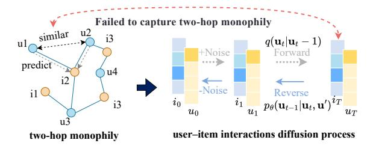
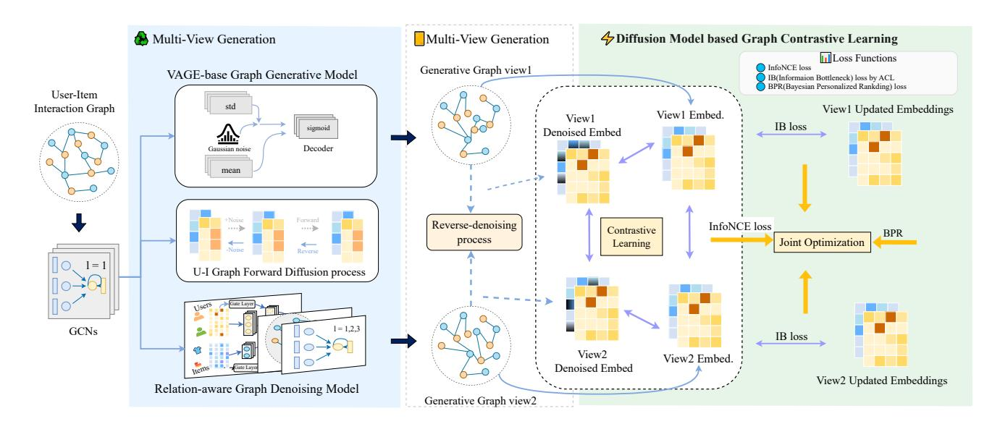
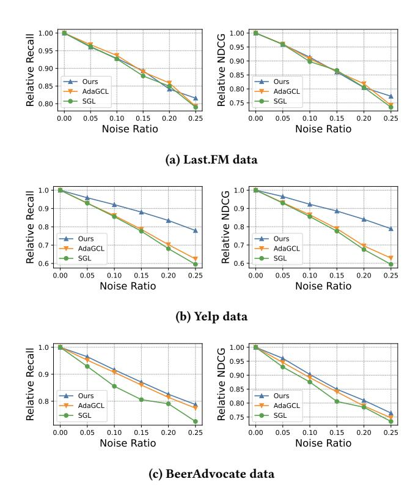
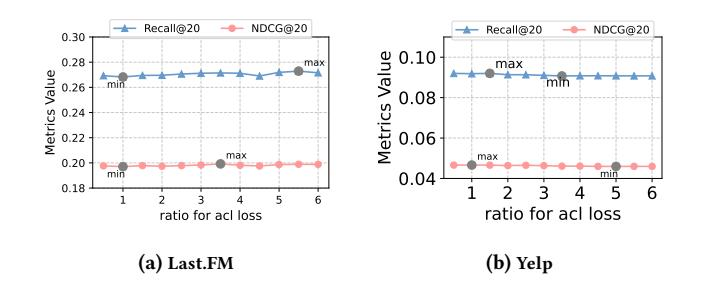
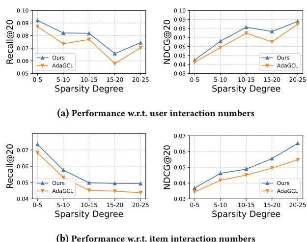

# RaDAR: Relation-aware Diffusion-Asymmetric Graph Contrastive Learning for Recommendation

[Yixuan Huang](https://orcid.org/0009-0005-5854-6668)∗ University of Electronic Science and Technology of China Chengdu, China wangdaijiayou@163.com

[Jiawei Chen](https://orcid.org/0009-0004-4236-6235)∗ National University of Defense Technology Changsha, China cjw@nudt.edu.cn

[Shengfan Zhang](https://orcid.org/0009-0000-5074-3492) Ant Group Chongqing, China 15060126965@163.com [Zongsheng Cao](https://orcid.org/0009-0006-5607-3999)† Tsinghua University Beijing, China agiczsr@gmail.com

### Abstract

Collaborative filtering (CF) recommendation has been significantly advanced by integrating Graph Neural Networks (GNNs) and Graph Contrastive Learning (GCL). However, (i) random edge perturbations often distort critical structural signals and degrade semantic consistency across augmented views, and (ii) data sparsity hampers the propagation of collaborative signals, limiting generalization. To tackle these challenges, we propose RaDAR (Relation-aware Diffusion-Asymmetric Graph Contrastive Learning Framework for Recommendation Systems), a novel framework that combines two complementary view generation mechanisms: a graph generative model to capture global structure and a relation-aware denoising model to refine noisy edges. RaDAR introduces three key innovations: (1) asymmetric contrastive learning with global negative sampling to maintain semantic alignment while suppressing noise; (2) diffusion-guided augmentation, which employs progressive noise injection and denoising for enhanced robustness; and (3) relation-aware edge refinement, dynamically adjusting edge weights based on latent node semantics. Extensive experiments on three public benchmarks demonstrate that RaDAR consistently outperforms state-of-the-art methods, particularly under noisy and sparse conditions. Our code is available at our repository[1](#page-0-0) .

### CCS Concepts

• Information systems → Recommender systems; • Mathematics of computing → Graph algorithms.

### Keywords

Recommendation, Diffusion Model, Contrastive Learning, Data Augmentation

### ACM Reference Format:

Yixuan Huang, Jiawei Chen, Shengfan Zhang, and Zongsheng Cao. 2026. RaDAR: Relation-aware Diffusion-Asymmetric Graph Contrastive Learning for Recommendation. In Proceedings of the ACM Web Conference 2026 (WWW '26), April 13–17, 2026, Dubai, United Arab Emirates. ACM, New York, NY, USA, [13](#page-12-0) pages.<https://doi.org/10.1145/3774904.3792463>

### 1 Introduction

With the development of Artificial Intelligence[\[6–](#page-9-0)[8\]](#page-9-1), recommender systems[\[43\]](#page-9-2) play a vital role in alleviating information overload by learning personalized preferences from sparse user-item interactions. A prevailing approach to recommendation is collaborative filtering (CF)[\[32\]](#page-9-3), which infers user interests based on historical behavioral patterns. To capture high-order connectivity and structural semantics, recent methods have leveraged Graph Neural Networks (GNNs) [\[31\]](#page-9-4), which model user-item interactions through message passing on bipartite graphs. These advances have significantly improved recommendation accuracy, particularly in sparse settings.

To further enhance representation learning, Graph Contrastive Learning (GCL)[\[51\]](#page-10-0) has emerged as a self-supervised paradigm that encourages consistency across multiple augmented views of the interaction graph. By integrating GCL with GNNs, recent models aim to improve robustness against data sparsity and noise. Typical implementations, such as SGL [\[42\]](#page-9-5), generate graph augmentations through node or edge dropout, while methods like GraphACL [\[47\]](#page-9-6) introduce asymmetric contrastive objectives to capture multi-hop patterns. In parallel, diffusion-based models [\[9,](#page-9-7) [16,](#page-9-8) [24\]](#page-9-9) have shown promise in improving denoising capacity through iterative noise injection and reconstruction.

Despite these advancements, two fundamental challenges limit current GCL-based recommendation models: Challenge 1 (C1): Structural Semantics Degradation. Standard graph augmentations (e.g., random node/edge dropout) often corrupt essential topological structures, degrading collaborative signals and destabilizing contrastive learning. This structural perturbation compromises semantic consistency between augmented views, hindering effective representation learning. Challenge 2 (C2): Limited Relational Expressiveness. Existing methods predominantly assume

∗These authors contributed equally to this work.

†Corresponding author.

1<https://github.com/ohowandanliao/RaDAR>

Permission to make digital or hard copies of all or part of this work for personal or classroom use is granted without fee provided that copies are not made or distributed for profit or commercial advantage and that copies bear this notice and the full citation on the first page. Copyrights for components of this work owned by others than the author(s) must be honored. Abstracting with credit is permitted. To copy otherwise, or republish, to post on servers or to redistribute to lists, requires prior specific permission and/or a fee. Request permissions from permissions@acm.org.

WWW '26, Dubai, United Arab Emirates © 2026 Copyright held by the owner/author(s). Publication rights licensed to ACM. ACM ISBN 979-8-4007-2307-0/2026/04 <https://doi.org/10.1145/3774904.3792463>

Figure 1: ACL and diffusion model on a user–item graph, illustrating how standard diffusion misses two-hop monophily where indirectly connected users share similar preferences.

homophily, emphasizing one-hop neighborhood alignment. However, real-world user interactions frequently exhibit heterophily or distant homophily—where similar users connect through multi-hop paths with weak direct links. Current models inadequately capture these higher-order relational patterns. While diffusion models enhance noise robustness, they sacrifice fine-grained relational semantics beyond immediate neighborhoods. As illustrated in Fig. [1,](#page-1-0) two-hop neighbors often share implicit preferences despite weak direct connections, which are not captured by conventional approaches. This raises a key question: How can we design a unified model that preserves structural semantics during augmentation while learning relation-aware representations across multi-hop and heterophilous neighborhoods?

To address recommendation challenges in sparse and noisy scenarios, we propose RaDAR (Relation-aware Diffusion-Asymmetric Graph Contrastive Learning for Recommendation), a contrastive learning framework with two core objectives: preserving structural semantics and enhancing relational expressiveness.

For C1 (structural semantics degradation), RaDAR introduces a diffusion-guided augmentation strategy applying Gaussian noise to node representations with learned denoising. This maintains semantic integrity while generating robust graph views for contrastive learning, reducing overfitting to spurious patterns.

For C2 (limited relational expressiveness), RaDAR employs a dual-view generation architecture combining: (i) a graph generative module based on variational autoencoders, capturing global structural semantics beyond one-hop connections; and (ii) a relationaware graph denoising module that adaptively reweights edge contributions, preserving fine-grained relational signals. Additionally, RaDAR's asymmetric contrastive objective decouples node identity from structural context, enabling alignment of semantically similar nodes even in heterogeneous neighborhoods.

Comprehensive experiments on both binary-edge and weightededge benchmarks—covering public datasets (Last.FM, Yelp, Beer-Advocate) and multi-behavior datasets (Tmall, RetailRocket, IJ-CAI15)—demonstrate that RaDAR consistently outperforms stateof-the-art baselines. The model achieves particularly strong gains under high sparsity and noise conditions, demonstrating its robustness and adaptability across interaction regimes.

In summary, our main contributions are threefold:

- We present RaDAR, a dual-view contrastive framework that integrates diffusion-guided augmentation with relation-aware denoising for robust representation learning;
- We design an asymmetric contrastive objective that enhances structural discrimination while mitigating noise via DDR-style diffusion regularization;
- RaDAR achieves consistent state-of-the-art performance across both binary-edge and weighted-edge recommendation settings, demonstrating strong generalization and noise resilience.

### 2 Preliminaries and Related Work

### 2.1 Collaborative Filtering Paradigm

Let �� and �� denote user and item sets, with interactions encoded in a binary matrix. Graph-based collaborative filtering extracts representations by propagating information across the interaction graph under the homophily principle: users with similar interaction patterns share preferences. Implementations typically employ dualtower architectures to map users and items into a shared latent space, enabling relevance estimation through similarity matching. This approach captures transitive dependencies in interaction graphs to infer unobserved user-item affinities.

### 2.2 Self-Supervised Graph Learning

Recent advances in graph neural networks (GNNs) have transformed recommendation systems by explicitly modeling user–item relations. Core architectures such as PinSage [\[50\]](#page-10-1), NGCF [\[38\]](#page-9-10), and LightGCN [\[14\]](#page-9-11) encode multi-hop relational patterns through graph convolutions, with LightGCN simplifying propagation for higher efficiency. Subsequent works enhance representation learning via multi-intent disentanglement (DGCF [\[39\]](#page-9-12), DCCF [\[29\]](#page-9-13)) and adaptive relation discovery (DRAN [\[41\]](#page-9-14)). Temporal dynamics are further captured by sequence-aware GNNs (DGSR [\[53\]](#page-10-2), GCE-GNN [\[40\]](#page-9-15)) that connect historical interactions with evolving preferences.

The fusion of self-supervised learning (SSL) and graph modeling has become a leading paradigm for data-efficient representation learning. Contrastive methods (e.g., SGL [\[42\]](#page-9-5), GFormer [\[23\]](#page-9-16)) improve user–item embeddings through view-invariance, while reconstruction-based models (S3-Rec [\[54\]](#page-10-3)) employ masked interaction prediction. Recent studies extend SSL to cross-domain and multi-modal settings (C2DSR [\[5\]](#page-9-17), SLMRec [\[35\]](#page-9-18)), highlighting its versatility in leveraging auxiliary self-supervision.

Positioning and Scope. RaDAR lies within the collaborative filtering (CF) paradigm on bipartite user–item graphs, and is designed to operate consistently under both binary- and weighted-edge regimes. Unlike models that rely on large-scale pretraining or side information, RaDAR unifies two complementary view-generation strategies, generative reconstruction and relation-aware denoising, within a single training pipeline. This unified design generalizes across edge settings via a simple weight toggle, minimizing implementation variance and ensuring controlled, fair evaluation in subsequent experiments.

### 3 Methodology

In this section, we present the comprehensive architecture of RaDAR, comprising four interconnected components. The first component

Diffusion–ACL Synergy. Diffusion and asymmetric contrastive learning (ACL) play complementary roles in enhancing representation quality. Diffusion smooths high-frequency noise and refines local neighborhoods, stabilizing latent embeddings. ACL aligns structurally similar nodes across multi-hop relations by decoupling identity from context. Their combination enables RaDAR to suppress noise while preserving monophily-style semantics beyond one hop. Empirical results (Sec. [4.1,](#page-4-0) RQ1/RQ2) confirm that diffusionaugmented ACL consistently improves NDCG with comparable or better Recall.

3.4.2 Asymmetric Graph Contrastive Learning. Conventional contrastive frameworks are limited by homophily assumptions [\[11,](#page-9-24) [26\]](#page-9-25). We adopt an asymmetric paradigm [\[47\]](#page-9-6) for monophilystructural contexts using dual encoders ���� and ���� that generate identity and context representations. An asymmetric predictor reconstructs neighborhood contexts from node identities (Eq. [27](#page-12-1) in Appendix [B.4\)](#page-12-2). This preserves node semantics while encoding structural patterns, naturally accommodating monophily through shared central nodes. Our dual-representation framework uses view-specific encoders ���� and ���� to generate identity representations v = ���� (��) [v] and context representations u = ���� (��) [u]. An asymmetric predictor ���� reconstructs neighborhood contexts from node identities, optimizing a contrastive objective (see Eq. [27](#page-12-1) in Appendix [B.4\)](#page-12-2).

This formulation achieves two key properties: (1) identity representations preserve node-specific semantics, and (2) context representations encode structural neighborhood patterns. The asymmetric objective naturally accommodates monophily by enabling two-hop neighbors to reconstruct similar contexts through their shared central nodes.

### 3.5 Model Training

Our framework adopts a hierarchical optimization approach with three coupled stages, as summarized in Table [1.](#page-4-1)

Phase 1: Unified Multi-Task Learning We initiate joint optimization:

��1 = ��bpr + ��3��diff-ssl + ��4 ∥Θ∥ 2 �� (15)

where ��diff-ssl is the diffusion-based self-supervised loss from Eq. [14,](#page-3-0) and ∥Θ∥ is L2 regularization.

�� Phase 2: Representation Distillation We impose an information bottleneck constraint:

L���� = ���� (��, ���� (v), v, u) = ���� (��, ���� (y ∗ ), y ∗ , yˆ), (16)

where y ∗ represents historical representations and ���� is the ACL loss.

Phase 3: View Generator Optimization We finalize training by optimizing view generators:

L�������������������� = L������ + L������ (17)

where L������ is the VGAE graph generation loss(see Eq. [21\)](#page-11-4) and L������(see Eq. [9\)](#page-3-1) is the relation-aware denoising loss.

3.5.1 DDR-Style Denoising Warmup. Following DDRM [\[37\]](#page-9-22), a lightweight diffusion regularizer is optionally applied to item embeddings after a brief warmup to enhance ranking robustness and

Table 1: Training phases in our framework.

Table 2: Statistics of weighted-edge datasets.

| Dataset      | Users  | Items  | Links    | Interaction Types              |
|--------------|--------|--------|----------|--------------------------------|
| Tmall        | 31,882 | 31,232 | 1,451,29 | View, Favorite, Cart, Purchase |
| RetailRocket | 2,174  | 30,113 | 97,381   | View, Cart, Transaction        |
| IJCAI15      | 17,435 | 35,920 | 799,368  | View, Favorite, Cart, Purchase |

Table 3: Statistics of the experimental datasets.

| Dataset      | Users  | Items  | Interactions |   |   | Density |     |
|--------------|--------|--------|--------------|---|---|---------|-----|
| Last.FM      | 1,892  | 17,632 | 92,834       | 2 | 8 | × 10    | − 3 |
| Yelp         | 42,712 | 26,822 | 182,357      | 1 | 6 | × 10    | − 4 |
| BeerAdvocate | 10,456 | 13,845 | 1,381,094    | 9 | 5 | × 10    | − 3 |

avoid early-stage drift, consistent with DDRM's delayed diffusion supervision.

### 4 Experimental Evaluation

To rigorously evaluate the proposed model, we design experiments to investigate four critical aspects:

- RQ1: How does RaDAR perform against state-of-the-art recommendation baselines in benchmark comparisons?
- RQ2: What is the individual contribution of key components to the model's effectiveness across diverse datasets? (Ablation Analysis)
- RQ3: How robust is RaDAR in handling data sparsity and noise compared to conventional approaches?
- RQ4: How do critical hyperparameters influence the model's performance characteristics?

### 4.1 Model Complexity Analysis

We summarize the dominant costs on a bipartite graph with |U| users, |V | items, |E | edges, embedding size ��, and �� propagation layers.

Time Complexity. Per epoch, RaDAR has three components:

- Sparse propagation: �� GCN-style message passing costs O (|E | �� ��).
- Contrastive objective: the implementation computes all-pairs similarities within a mini-batch (users+items, size ��), yielding O (�� 2��) per step.
- Diffusion regularization (optional): one denoising pass on item embeddings costs O (|V | ����′ ) (or O (������′ ) if step-based), typically smaller than propagation when |E | is large.

Overall, the training is dominated by sparse propagation; contrastive and diffusion add a modest, data/mini-batch dependent overhead.

Table 4: Performance Metrics for Various Models

| Model    | Recall@20 | NDCG@20 | Last.FM Recall@40 | NDCG@40 | Recall@20 | NDCG@20 | Yelp Recall@40 | NDCG@40 | Recall@20 | NDCG@20 | BeerAdvocate Recall@40 | NDCG@40 |
|----------|-----------|---------|-------------------|---------|-----------|---------|----------------|---------|-----------|---------|------------------------|---------|
| BiasMF   | 0.1879    | 0.1362  | 0.2660            | 0.1653  | 0.0532    | 0.0264  | 0.0802         | 0.0321  | 0.0996    | 0.0856  | 0.1602                 | 0.1016  |
| NCF      | 0.1130    | 0.0795  | 0.1693            | 0.0952  | 0.0304    | 0.0143  | 0.0487         | 0.0187  | 0.0729    | 0.0654  | 0.1203                 | 0.0754  |
| AutoR    | 0.1518    | 0.1114  | 0.2174            | 0.1336  | 0.0491    | 0.0222  | 0.0692         | 0.0268  | 0.0816    | 0.0650  | 0.1325                 | 0.0794  |
| PinSage  | 0.1690    | 0.1228  | 0.2402            | 0.1472  | 0.0510    | 0.0245  | 0.0743         | 0.0315  | 0.0930    | 0.0816  | 0.1553                 | 0.0980  |
| STGCN    | 0.2067    | 0.1558  | 0.2940            | 0.1821  | 0.0562    | 0.0282  | 0.0856         | 0.0355  | 0.1003    | 0.0852  | 0.1650                 | 0.1031  |
| GCMC     | 0.2218    | 0.1714  | 0.3149            | 0.1897  | 0.0584    | 0.0280  | 0.0891         | 0.0360  | 0.1082    | 0.0901  | 0.1766                 | 0.1085  |
| NGCF     | 0.2081    | 0.1474  | 0.2944            | 0.1829  | 0.0681    | 0.0336  | 0.1019         | 0.0419  | 0.1033    | 0.0873  | 0.1653                 | 0.1032  |
| GCCF     | 0.2222    | 0.1642  | 0.3083            | 0.1931  | 0.0724    | 0.0365  | 0.1151         | 0.0466  | 0.1035    | 0.0901  | 0.1662                 | 0.1062  |
| LightGCN | 0.2349    | 0.1704  | 0.3220            | 0.2022  | 0.0761    | 0.0373  | 0.1175         | 0.0474  | 0.1102    | 0.0943  | 0.1757                 | 0.1113  |
| SLRec    | 0.1957    | 0.1442  | 0.2792            | 0.1737  | 0.0665    | 0.0327  | 0.1032         | 0.0418  | 0.1048    | 0.0881  | 0.1723                 | 0.1068  |
| NCL      | 0.2353    | 0.1715  | 0.3252            | 0.2033  | 0.0806    | 0.0402  | 0.1230         | 0.0505  | 0.1131    | 0.0971  | 0.1819                 | 0.1150  |
| SGL      | 0.2427    | 0.1761  | 0.3405            | 0.2104  | 0.0803    | 0.0398  | 0.1226         | 0.0502  | 0.1138    | 0.0959  | 0.1776                 | 0.1122  |
| HCCF     | 0.2410    | 0.1773  | 0.3232            | 0.2051  | 0.0789    | 0.0391  | 0.1210         | 0.0492  | 0.1156    | 0.0990  | 0.1847                 | 0.1176  |
| SHT      | 0.2420    | 0.1770  | 0.3235            | 0.2055  | 0.0794    | 0.0395  | 0.1217         | 0.0497  | 0.1150    | 0.0977  | 0.1799                 | 0.1156  |
| DirectAU | 0.2422    | 0.1727  | 0.3356            | 0.2042  | 0.0818    | 0.0424  | 0.1226         | 0.0524  | 0.1182    | 0.0981  | 0.1797                 | 0.1139  |
| AdaGCL   | 0.2603    | 0.1911  | 0.3531            | 0.2204  | 0.0873    | 0.0439  | 0.1315         | 0.0548  | 0.1216    | 0.1015  | 0.1867                 | 0.1182  |
| Ours     | 0.2724    | 0.1992  | 0.3664            | 0.2309  | 0.0914    | 0.0464  | 0.1355         | 0.0571  | 0.1262    | 0.1056  | 0.1946                 | 0.1375  |
| Improv   | 4.65%     | 4.24%   | 3.77%             | 4.76%   | 4.70%     | 5.69%   | 3.04%          | 4.20%   | 3.78%     | 4.04%   | 4.23%                  | 16.33%  |
| p-val    | 2 4 ��    |         |                   |         |           |         |                |         |           |         |                        |         |
|          | − 6       | 5 8 ��  |                   |         |           |         |                |         |           |         |                        |         |
|          |           | − 5     | 4 9 ��            |         |           |         |                |         |           |         |                        |         |
|          |           |         | − 9               | 6 4 ��  |           |         |                |         |           |         |                        |         |
|          |           |         |                   | − 5     | 1 3 ��    |         |                |         |           |         |                        |         |
|          |           |         |                   |         | − 4       | 8 8 ��  |                |         |           |         |                        |         |
|          |           |         |                   |         |           | − 4     | 7 6 ��         |         |           |         |                        |         |
|          |           |         |                   |         |           |         | − 3            | 2 2 ��  |           |         |                        |         |
|          |           |         |                   |         |           |         |                | − 3     | 1 2 ��    |         |                        |         |
|          |           |         |                   |         |           |         |                |         | − 4       | 7 9 ��  |                        |         |
|          |           |         |                   |         |           |         |                |         |           | − 4     | 1 4 ��                 |         |
|          |           |         |                   |         |           |         |                |         |           |         | − 4                    | 2 9 ��  |
|          |           |         |                   |         |           |         |                |         |           |         |                        | − 6     |

Memory Complexity. We store user/item embeddings and �� layer outputs: O ( (|U| + |V |)��). The diffusion MLP contributes O (�� 2 + ����′ ) parameters, independent of graph size. Hence the footprint remains comparable to lightweight CF GCNs.

### 4.2 Experimental Settings

4.2.1 Evaluation Datasets. We evaluate our method on three publicly available datasets:

- Last.FM[\[4\]](#page-9-26): Music listening behaviors and social interactions from Last.fm users.
- Yelp [\[49\]](#page-10-4): A benchmark dataset of user-business ratings from Yelp, widely utilized in location-based recommendation studies.
- BeerAdvocate [\[28\]](#page-9-27): Beer reviews from BeerAdvocate, preprocessed with 10-core filtering to ensure data density.

Additionally, we adopt three widely used weighted-edge (multibehavior) e-commerce datasets: Tmall[\[2\]](#page-9-28), RetailRocket[\[30\]](#page-9-29), and IJCAI15[\[1\]](#page-9-30). Dataset statistics are summarized in Table [3](#page-4-2) (binary) and Table [2](#page-4-3) (weighted). Following public protocols (e.g., DiffGraph/HEC-GCN), we merge multiple behaviors into a single interaction graph and treat edges as binary presence; graph propagation uses the standard symmetric normalized adjacency.

Binary vs. Weighted-Edge Regimes. RaDAR is evaluated under two complementary settings: binary edges capture implicit feedback presence, whereas the weighted-edge setting follows a multi-behavior protocol that aggregates behaviors into a single binary interaction graph. This dual setup enables fair assessment of edge denoising on sparse graphs and robustness in heterogeneous ecommerce data. aligning our evaluation with recent multi-behavior studies such as DiffGraph [\[25\]](#page-9-31).

4.2.2 Evaluation Protocols. Following standard evaluation protocols for recommendation systems, we partition datasets into training/validation/test sets (7:2:1). Adopting the all-ranking strategy, we evaluate each user by ranking all non-interacted items alongside test positives. Performance is measured using Recall@20 and NDCG@20 metrics, with �� = 20 as the default ranking cutoff. This setup ensures a comprehensive assessment of model capabilities

in real-world sparse interaction scenarios. For the weighted-edge (multi-behavior) regime, we follow the public construction and evaluation protocol: behaviors are aggregated into a binary interaction graph and evaluated with the same all-ranking pipeline.

4.2.3 Compared Baseline Methods. We evaluate RaDAR against a comprehensive suite of representative recommendation models spanning both single- and multi-behavior paradigms. Specifically, we categorize the baselines into four major research streams: (1) Traditional collaborative filtering: BiasMF [\[22\]](#page-9-32) and NCF [\[15\]](#page-9-33); (2) GNN-based methods: LightGCN [\[14\]](#page-9-11) and NGCF [\[38\]](#page-9-10); (3) Selfsupervised frameworks: SGL [\[42\]](#page-9-5) and SLRec [\[48\]](#page-10-5); and (4) Contrastive and diffusion learning: DirectAU [\[36\]](#page-9-34) and AdaGCL [\[18\]](#page-9-35).

For theweighted-edge regime, following DiffGraph's protocol [\[25\]](#page-9-31), we further include multi-behavior and heterogeneous baselines widely adopted in e-commerce scenarios, including BPR [\[22\]](#page-9-32), Pin-Sage [\[50\]](#page-10-1), NGCF [\[38\]](#page-9-10), NMTR [\[13\]](#page-9-36), MBGCN [\[20\]](#page-9-37), HGT [\[17\]](#page-9-38), and MATN [\[44\]](#page-9-39). We also incorporate DDRM [\[37\]](#page-9-22) for completeness as a recent diffusion-based generative recommender.

Binary vs. Weighted Evaluation Narrative. We first report results under the binary-edge setting to benchmark each model's collaborative filtering and contrastive learning capability without behavioral intensities. We then extend the evaluation to the weightededge setting, which introduces interaction-level heterogeneity to assess robustness under multi-behavior conditions. This order highlights that RaDAR's improvements are not tied to a specific edge construction but arise from its unified design—integrating view generation and diffusion-based asymmetric contrastive learning (ACL)—that transfers seamlessly across regimes.

To avoid redundancy, shared baselines (e.g., BPR, PinSage, NGCF) are evaluated under both settings but described only once. Full baseline descriptions and implementation details are provided in Appendix [A.](#page-11-6) This taxonomy provides comprehensive coverage from foundational to state-of-the-art paradigms, enabling a rigorous and balanced evaluation across methodological dimensions.

Table 5: Weighted-edge results under DiffGraph settings (Recall@20 / NDCG@20).

| Model         | R@20   | Tmall N@20 | R@20   | RetailRocket N@20 | R@20   | IJCAI15 N@20 |
|---------------|--------|------------|--------|-------------------|--------|--------------|
| BPR           | 0.0248 | 0.0131     | 0.0308 | 0.0237            | 0.0051 | 0.0037       |
| PinSage       | 0.0368 | 0.0156     | 0.0423 | 0.0248            | 0.0101 | 0.0041       |
| NGCF          | 0.0399 | 0.0169     | 0.0405 | 0.0257            | 0.0091 | 0.0035       |
| NMTR          | 0.0441 | 0.0192     | 0.0460 | 0.0265            | 0.0108 | 0.0048       |
| MBGCN         | 0.0419 | 0.0179     | 0.0492 | 0.0258            | 0.0112 | 0.0045       |
| HGT           | 0.0431 | 0.0192     | 0.0413 | 0.0250            | 0.0126 | 0.0051       |
| MATN          | 0.0463 | 0.0197     | 0.0524 | 0.0302            | 0.0136 | 0.0054       |
| DiffGraph     | 0.0553 | 0.0254     | 0.0626 | 0.0353            | 0.0178 | 0.0067       |
| RaDAR (w)     | 0.0626 | 0.0268     | 0.1380 | 0.0746            | 0.0582 | 0.0323       |
| RaDAR (w+DDR) | 0.0620 | 0.0260     | 0.1375 | 0.0748            | 0.0603 | 0.0325       |

Table 6: Ablation study on key components of RaDAR.

| Model Variant Description | Recall | Last.FM NDCG | Recall | Yelp NDCG | Recall | Beer NDCG |
|---------------------------|--------|--------------|--------|-----------|--------|-----------|
| Baseline SOTA SSL         | 0.2603 | 0.1911       | 0.0873 | 0.0439    | 0.1216 | 0.1015    |
| Gen+Gen                   | 0.2665 | 0.1936       | 0.0900 | 0.0456    | 0.1226 | 0.1027    |
| Gen+Linear RaDAR          | 0.2698 | 0.1986       | 0.0910 | 0.0461    | 0.1247 | 0.1050    |
| w/o D-ACL                 | 0.2652 | 0.1934       | 0.0904 | 0.0458    | 0.1250 | 0.1036    |
| w/ ACL only               | 0.2720 | 0.1962       | 0.0911 | 0.0461    | 0.1264 | 0.1057    |
| RaDAR(full)               | 0.2724 | 0.1992       | 0.0914 | 0.0464    | 0.1262 | 0.1056    |

### 4.3 Overall Performance (RQ1)

Table [4](#page-5-0) summarizes the results on the three binary-edge benchmarks. RaDAR achieves the best performance across all datasets and cutoffs (top-20/40), surpassing strong CF, GNN, and SSL baselines with statistically significant improvements (see Improv and p-val rows). These gains verify that relation-aware denoising and diffusion-guided augmentation jointly enhance both coverage and ranking quality while preserving structural semantics.

For the weighted-edge regime, following DiffGraph's protocol, Table [5](#page-6-0) reports results on Tmall, RetailRocket, and IJCAI15. Under the same training pipeline (enabling edge weights), RaDAR consistently outperforms public multi-behavior baselines and the reproduced DiffGraph across all datasets. The DDR variant further improves NDCG@20, reflecting its emphasis on ranking robustness in heterogeneous interactions.

### 4.4 Model Ablation Test (RQ2)

To evaluate RaDAR's architectural components, we conducted systematic ablation studies against the state-of-the-art baseline. We examined four configurations across three datasets (Last.FM, Yelp, and Beer):

- RaDAR (Gen+Gen): Dual VGAE-based generators without denoising model
- RaDAR (Gen+Linear): Linear attention replacing relation-aware denoising model
- RaDAR (w/o D-ACL): Conventional graph contrastive loss without diffusion-asymmetric contrastive learning optimization
- RaDAR (w/ ACL only): Asymmetric contrastive learning without diffusion-based augmentation

### • RaDAR (full): Complete proposed framework

Table [6](#page-6-1) reveals nuanced performance patterns that illuminate four critical insights regarding component interactions and datasetspecific behaviors:

Table [6](#page-6-1) reveals four key insights: Relation-Aware Denoising Effectiveness: The relation-aware denoising module consistently outperforms alternatives. Replacing it with linear attention yields modest degradation (Recall@20: -0.95% on Last.FM), while removing explicit denoising causes more significant drops (-2.17%), confirming its superior noise handling capabilities. Contrastive Learning Impact: Asymmetric contrastive learning provides consistent improvements over conventional loss, with Beer showing the largest gains (Recall@20: +1.12%). The effectiveness varies by dataset density, with sparse datasets like Yelp showing minimal sensitivity to contrastive learning variations. Diffusion Augmentation Benefits: Diffusion-based augmentation primarily enhances ranking quality rather than coverage. It achieves notable NDCG improvements on Last.FM (+1.53%) with marginal recall gains, suggesting it optimizes embedding discriminability for ranking tasks. Component Complementarity: Results establish a clear hierarchy: relation-aware denoising dominates recall performance, while diffusion augmentation excels in ranking quality. This demonstrates the complementary nature of components, with denoising enhancing coverage and D-ACL optimizing ranking precision. Dataset-Specific Variance: On BeerAdvocate, margins among top variants fall within run-to-run variance (<0.2%), while substantial gains on sparse datasets (Last.FM, Yelp) validate the framework's effectiveness in data-scarce scenarios.

### 4.5 Model Robustness Test (RQ3)

In this section, our extensive experimental evaluation demonstrates the efficacy of our proposed RaDAR framework. The results indicate that RaDAR exhibits remarkable resilience against data noise and significantly outperforms existing methods in handling sparse useritem interaction data. Specifically, our approach maintains high performance even in the presence of substantial noise, showcasing its robust nature.

4.5.1 Performance w.r.t. Data Noise Degrees. We systematically evaluate RaDAR's resilience to data corruption through controlled noise injection experiments, where spurious edges replace genuine interactions at incremental ratios (5%-25%). A comparative analysis with AdaGCL and SGL across datasets of varying density (Fig. [3\)](#page-7-0) reveals two key patterns:

On moderate-density datasets (Last.FM: 2.8 × 10−3 , Beer: 9.5 × 10−3 ), RaDAR demonstrates a modest improvement over AdaGCL on the Beer dataset, while the relative Recall/NDCG robustness performance among RaDAR, AdaGCL, and GCL shows less significant variation on the Last.FM dataset. This suggests that the benefits of our proposed approach may be less pronounced when data sparsity is moderate, as the existing methods already capture sufficient structural information under these conditions.

In extreme sparsity conditions (Yelp: 1.6 × 10−4 ), RaDAR demonstrates a pronounced advantage with higher relative improvement margins, confirming superior noise resilience in data-scarce scenarios.

Figure 3: Impact of Noise Ratio (5%–25%) on Performance Degradation

Our empirical analysis demonstrates RaDAR's effectiveness in cold-start scenarios through its density-aware denoising framework. The widening performance gap under increasing sparsity highlights the model's ability to extract critical signals from sparse interactions - a pivotal requirement for practical recommendation systems.

4.5.2 Performance w.r.t. Data Sparsity. We further examine RaDAR's performance under different levels of user and item sparsity on Yelp. From the user perspective (Fig. [5a\)](#page-12-3), RaDAR consistently surpasses AdaGCL across all interaction groups, with the largest improvements observed for cold-start users (0–10 interactions). This confirms RaDAR's robustness in capturing informative user representations even under sparse feedback through adaptive graph augmentation. In contrast, the item-side analysis (Fig. [5b\)](#page-12-3) shows that the performance gap widens as item interaction density increases. While user metrics tend to degrade with sparsity (except a mild rebound at 20–25 interactions), item metrics improve steadily with interaction frequency. These results demonstrate that RaDAR achieves a balance between user-side generalization under sparsity and item-side learning under dense collaborative signals through its dual adaptive and density-aware mechanisms.

Why Recall@20 decreases while NDCG@20 increases under sparsity. Interestingly, we observe diverging trends between Recall@20 and NDCG@20 as sparsity increases. Although both metrics are evaluated under the same protocol, Recall@20 tends to drop for highly sparse users, whereas NDCG@20 may increase slightly. This arises mainly from the test set characteristics: (i) many sparse users have

Figure 4: Performance variation with ACL ratio ��. Last.FM peaks Recall@20 at �� = 5.5, NDCG@20 at �� = 3.5. Yelp peaks Recall@20 at �� = 1.5, NDCG@20 at �� = 1.0. Higher �� values enhance relation-aware denoising for Last.FM, while Yelp requires balanced contributions due to interaction sparsity.

only 1–2 held-out positives, where a single miss drastically reduces Recall, but ranking these few positives higher still boosts NDCG; and (ii) on the item side, positives often concentrate on popular items, where improved ranking contributes more to NDCG than to Recall. Hence, under extreme sparsity, the two metrics capture complementary perspectives—Recall reflects coverage, while NDCG emphasizes ranking quality.

### 4.6 Hyperparameter Analysis (RQ4)

We investigate the impact of the adjustable contrastive learning (ACL) ratio ��, which balances Information Bottleneck (IB) losses between the VGAE-base and relation-aware graph denoising view generators. The total IB loss is formulated as ������ = �� ���� + ������ where �� �� ���� and �� �� ���� represent the IB losses from the VGAE-base view generator and the relation-aware graph denoising view generator, and �� &gt; 1 prioritizes relation-aware structural preservation, while �� &lt; 1 emphasizes generated graph views.

Fig. [4](#page-7-1) reveals distinct �� preferences across datasets. Last.FM achieves optimal performance with �� &gt; 1(Fig. [4a\)](#page-7-1), indicating its structural complexity benefits from enhanced relation-aware denoising. Conversely, Yelp attains peak metrics at lower �� values (Fig. [4b\)](#page-7-1), suggesting its sparse interaction patterns require balanced information preservation from both view generators to prevent overfitting. This empirical evidence confirms RaDAR's adaptability through our symmetric contrastive learning design, showing robust performance across diverse graph recommendation scenarios.

### 5 Conclusion

We present RaDAR, a contrastive recommendation framework that unifies (1) generative–denoising dual-view learning, (2) asymmetric contrastive objectives, and (3) diffusion-based stabilization for noise-robust representation learning. RaDAR achieves consistent improvements over state-of-the-art baselines under both binary and weighted-edge regimes, demonstrating strong generalization and resilience to sparse or noisy interactions. Ablation analyses confirm that diffusion-enhanced denoising and asymmetric contrastive learning jointly contribute to its robustness and stability across datasets.

### 6 Limitations.

RaDAR assumes static graphs without temporal dynamics; extending to sequence-aware diffusion is future work. Training efficiency

could be improved via adaptive sampling for large-scale deployment.

### References

[1] Alibaba Group. 2025. IJCAI-15 Repeat Buyer Prediction Dataset (Tianchi). [https:](https://tianchi.aliyun.com/competition/entrance/231576/information) [//tianchi.aliyun.com/competition/entrance/231576/information.](https://tianchi.aliyun.com/competition/entrance/231576/information) Accessed: 2025- 01-09. Competition dataset from the IJCAI-15 Repeat Buyer Prediction Challenge.. [2] Alibaba Group. 2025. Tmall User Behavior Dataset (Tianchi). [https://tianchi.](https://tianchi.aliyun.com/dataset/649) [aliyun.com/dataset/649.](https://tianchi.aliyun.com/dataset/649) Accessed: 2025-01-09. E-commerce user behavior dataset including view, favorite, cart, and purchase actions.. [3] Rianne van den Berg, Thomas N Kipf, and Max Welling. 2017. Graph convolutional matrix completion. arXiv preprint arXiv:1706.02263 (2017). [4] Iván Cantador, Peter Brusilovsky, and Tsvi Kuflik. 2011. Second workshop on information heterogeneity and fusion in recommender systems (HetRec2011). In Proceedings of the fifth ACM conference on Recommender systems. 387–388. [5] Jiangxia Cao, Xin Cong, Jiawei Sheng, Tingwen Liu, and Bin Wang. 2022. Contrastive cross-domain sequential recommendation. In Proceedings of the 31st ACM International Conference on Information & Knowledge Management. 138–147. [6] Zongsheng Cao, Yangfan He, Anran Liu, Jun Xie, Feng Chen, and Zhepeng Wang. 2025. Tv-rag: A temporal-aware and semantic entropy-weighted framework for long video retrieval and understanding. In Proceedings of the 33rd ACM International Conference on Multimedia. 9071–9079. [7] Zongsheng Cao, Yangfan He, Anran Liu, Jun Xie, Zhepeng Wang, and Feng Chen. 2025. Cofi-dec: Hallucination-resistant decoding via coarse-to-fine generative feedback in large vision-language models. In ACM International Conference on Multimedia. 10709–10718. [8] Zongsheng Cao, Yangfan He, Anran Liu, Jun Xie, Zhepeng Wang, and Feng Chen. 2025. Purifygen: A risk-discrimination and semantic-purification model for safe text-to-image generation. In Proceedings of the 33rd ACM International Conference on Multimedia. 816–825. [9] Zongsheng Cao, Jing Li, Zigan Wang, and Jinliang Li. 2024. Diffusione: Reasoning on knowledge graphs via diffusion-based graph neural networks. In Proceedings of the 30th ACM SIGKDD Conference on Knowledge Discovery and Data Mining. 222–230. [10] Lei Chen, Le Wu, Richang Hong, Kun Zhang, and Meng Wang. 2020. Revisiting graph based collaborative filtering: A linear residual graph convolutional network approach. In Proceedings of the AAAI conference on artificial intelligence, Vol. 34. 27–34. [11] Alex Chin, Yatong Chen, Kristen M. Altenburger, and Johan Ugander. 2019. Decoupled smoothing on graphs. In The World Wide Web Conference. 263–272. [12] Kyunghyun Cho, Bart Van Merriënboer, Caglar Gulcehre, Dzmitry Bahdanau, Fethi Bougares, Holger Schwenk, and Yoshua Bengio. 2014. Learning phrase representations using RNN encoder-decoder for statistical machine translation. arXiv preprint arXiv:1406.1078 (2014). [13] Chen Gao, Xiangnan He, Dahua Gan, Xiangning Chen, Fuli Feng, Yong Li, Tat-Seng Chua, and Depeng Jin. 2019. Neural multi-task recommendation from multi-behavior data. In 2019 IEEE 35th international conference on data engineering (ICDE). IEEE, 1554–1557. [14] Xiangnan He, Kuan Deng, Xiang Wang, Yan Li, Yongdong Zhang, and Meng Wang. 2020. Lightgcn: Simplifying and powering graph convolution network for recommendation. In Proceedings of the 43rd International ACM SIGIR conference on research and development in Information Retrieval. 639–648. [15] Xiangnan He, Lizi Liao, Hanwang Zhang, Liqiang Nie, Xia Hu, and Tat-Seng Chua. 2017. Neural collaborative filtering. In Proceedings of the 26th international conference on world wide web. 173–182. [16] Jonathan Ho, Ajay Jain, and Pieter Abbeel. 2020. Denoising diffusion probabilistic models. Advances in neural information processing systems 33 (2020), 6840–6851. [17] Ziniu Hu, Yuxiao Dong, Kuansan Wang, and Yizhou Sun. 2020. Heterogeneous graph transformer. In Proceedings of the web conference 2020. 2704–2710. [18] Yangqin Jiang, Chao Huang, and Lianghao Huang. 2023. Adaptive graph contrastive learning for recommendation. In Proceedings of the 29th ACM SIGKDD conference on knowledge discovery and data mining. 4252–4261. [19] Yangqin Jiang, Yuhao Yang, Lianghao Xia, and Chao Huang. 2024. Diffkg: Knowledge graph diffusion model for recommendation. In Proceedings of the 17th ACM International Conference on Web Search and Data Mining. 313–321. [20] Bowen Jin, Chen Gao, Xiangnan He, Depeng Jin, and Yong Li. 2020. Multibehavior recommendation with graph convolutional networks. In Proceedings of the 43rd international ACM SIGIR conference on research and development in information retrieval. 659–668. [21] Thomas N Kipf and Max Welling. 2016. Variational graph auto-encoders. arXiv preprint arXiv:1611.07308 (2016). [22] Yehuda Koren, Robert Bell, and Chris Volinsky. 2009. Matrix factorization techniques for recommender systems. Computer 42, 8 (2009), 30–37. [23] Chaoliu Li, Lianghao Xia, Xubin Ren, Yaowen Ye, Yong Xu, and Chao Huang. 2023. Graph transformer for recommendation. In Proceedings of the 46th international ACM SIGIR conference on research and development in information retrieval. 1680– 1689. [24] Xiang Li, John Thickstun, Ishaan Gulrajani, Percy S Liang, and Tatsunori B Hashimoto. 2022. Diffusion-lm improves controllable text generation. Advances in Neural Information Processing Systems 35 (2022), 4328–4343. [25] Zongwei Li, Lianghao Xia, Hua Hua, Shijie Zhang, Shuangyang Wang, and Chao Huang. 2025. DiffGraph: Heterogeneous Graph Diffusion Model. In Proceedings of the Eighteenth ACM International Conference on Web Search and Data Mining. 40–49. [26] Derek Lim, Felix Hohne, Xiuyu Li, Sijia Linda Huang, Vaishnavi Gupta, Omkar Bhalerao, and Ser Nam Lim. 2021. Large scale learning on non-homophilous graphs: New benchmarks and strong simple methods. Advances in neural information processing systems 34 (2021), 20887–20902. [27] Zihan Lin, Changxin Tian, Yupeng Hou, and Wayne Xin Zhao. 2022. Improving graph collaborative filtering with neighborhood-enriched contrastive learning. In Proceedings of the ACM web conference 2022. 2320–2329. [28] Julian John McAuley and Jure Leskovec. 2013. From amateurs to connoisseurs: modeling the evolution of user expertise through online reviews. In Proceedings of the 22nd international conference on World Wide Web. 897–908. [29] Xubin Ren, Lianghao Xia, Jiashu Zhao, Dawei Yin, and Chao Huang. 2023. Disentangled contrastive collaborative filtering. In Proceedings of the 46th international ACM SIGIR conference on research and development in information retrieval. 1137– 1146. [30] Retail Rocket. 2025. Retail Rocket Recommender System Dataset. [https://www.](https://www.kaggle.com/datasets/retailrocket/ecommerce-dataset) [kaggle.com/datasets/retailrocket/ecommerce-dataset.](https://www.kaggle.com/datasets/retailrocket/ecommerce-dataset) Accessed: 2025-01-09. E-commerce interaction logs including page views, add-to-cart, and purchase events.. [31] Franco Scarselli, Marco Gori, Ah Chung Tsoi, Markus Hagenbuchner, and Gabriele Monfardini. 2008. The graph neural network model. IEEE transactions on neural networks 20, 1 (2008), 61–80. [32] J Ben Schafer, Dan Frankowski, Jon Herlocker, and Shilad Sen. 2007. Collaborative filtering recommender systems. In The adaptive web: methods and strategies of web personalization. Springer, 291–324. [33] Suvash Sedhain, Aditya Krishna Menon, Scott Sanner, and Lexing Xie. 2015. Autorec: Autoencoders meet collaborative filtering. In Proceedings of the 24th international conference on World Wide Web. 111–112. [34] Jascha Sohl-Dickstein, Eric Weiss, Niru Maheswaranathan, and Surya Ganguli. 2015. Deep unsupervised learning using nonequilibrium thermodynamics. In ICML. PMLR, 2256–2265. [35] Zhulin Tao, Xiaohao Liu, Yewei Xia, Xiang Wang, Lifang Yang, Xianglin Huang, and Tat-Seng Chua. 2022. Self-supervised learning for multimedia recommendation. IEEE Transactions on Multimedia 25 (2022), 5107–5116. [36] Chenyang Wang, Yuanqing Yu, Weizhi Ma, Min Zhang, Chong Chen, Yiqun Liu, and Shaoping Ma. 2022. Towards representation alignment and uniformity in collaborative filtering. In Proceedings of the 28th ACM SIGKDD conference on knowledge discovery and data mining. 1816–1825. [37] Wenjie Wang, Yiyan Xu, Fuli Feng, Xinyu Lin, Xiangnan He, and Tat-Seng Chua. 2023. Diffusion recommender model. In Proceedings of the 46th international ACM SIGIR conference on research and development in information retrieval. 832–841. [38] Xiang Wang, Xiangnan He, Meng Wang, Fuli Feng, and Tat-Seng Chua. 2019. Neural graph collaborative filtering. In Proceedings of the 42nd international ACM SIGIR conference on Research and development in Information Retrieval. 165–174. [39] Xiang Wang, Hongye Jin, An Zhang, Xiangnan He, Tong Xu, and Tat-Seng Chua. 2020. Disentangled graph collaborative filtering. In Proceedings of the 43rd international ACM SIGIR conference on research and development in information retrieval. 1001–1010. [40] Ziyang Wang, Wei Wei, Gao Cong, Xiao-Li Li, Xian-Ling Mao, and Minghui Qiu. 2020. Global context enhanced graph neural networks for session-based recommendation. In Proceedings of the 43rd international ACM SIGIR conference on research and development in information retrieval. 169–178. [41] Zhaobo Wang, Yanmin Zhu, Haobing Liu, and Chunyang Wang. 2022. Learning graph-based disentangled representations for next POI recommendation. In Proceedings of the 45th international ACM SIGIR conference on research and development in information retrieval. 1154–1163. [42] Jiancan Wu, Xiang Wang, Fuli Feng, Xiangnan He, Liang Chen, Jianxun Lian, and Xing Xie. 2021. Self-supervised graph learning for recommendation. In Proceedings of the 44th international ACM SIGIR conference on research and development in information retrieval. 726–735. [43] Shiwen Wu, Fei Sun, Wentao Zhang, Xu Xie, and Bin Cui. 2022. Graph neural networks in recommender systems: a survey. Comput. Surveys 55, 5 (2022), 1–37. [44] Lianghao Xia, Chao Huang, Yong Xu, Peng Dai, Bo Zhang, and Liefeng Bo. 2020. Multiplex behavioral relation learning for recommendation via memory augmented transformer network. In Proceedings of the 43rd international ACM SIGIR conference on research and development in information retrieval. 2397–2406. [45] Lianghao Xia, Chao Huang, Yong Xu, Jiashu Zhao, Dawei Yin, and Jimmy Huang. 2022. Hypergraph contrastive collaborative filtering. In Proceedings of the 45th International ACM SIGIR conference on research and development in information retrieval. 70–79. [46] Lianghao Xia, Chao Huang, and Chuxu Zhang. 2022. Self-supervised hypergraph transformer for recommender systems. In Proceedings of the 28th ACM SIGKDD conference on knowledge discovery and data mining. 2100–2109. [47] Teng Xiao, Huaisheng Zhu, Zhengyu Chen, and Suhang Wang. 2023. Simple and asymmetric graph contrastive learning without augmentations. Advances in neural information processing systems 36 (2023), 16129–16152.

[48] Tiansheng Yao, Xinyang Yi, Derek Zhiyuan Cheng, Felix Yu, Ting Chen, Aditya Menon, Lichan Hong, Ed H Chi, Steve Tjoa, Jieqi Kang, et al. 2021. Self-supervised learning for large-scale item recommendations. In Proceedings of the 30th ACM international conference on information & knowledge management. 4321–4330. [49] Yelp. 2018. Yelp Open Dataset. [https://business.yelp.com/data/resources/open](https://business.yelp.com/data/resources/open-dataset/)[dataset/.](https://business.yelp.com/data/resources/open-dataset/) [50] Rex Ying, Ruining He, Kaifeng Chen, Pong Eksombatchai, William L Hamilton, and Jure Leskovec. 2018. Graph convolutional neural networks for web-scale recommender systems. In Proceedings of the 24th ACM SIGKDD international conference on knowledge discovery & data mining. 974–983. [51] Yuning You, Tianlong Chen, Yongduo Sui, Ting Chen, Zhangyang Wang, and Yang Shen. 2020. Graph contrastive learning with augmentations. Advances in neural information processing systems 33 (2020), 5812–5823. [52] Jiani Zhang, Xingjian Shi, Shenglin Zhao, and Irwin King. 2019. Star-gcn: Stacked and reconstructed graph convolutional networks for recommender systems. arXiv preprint arXiv:1905.13129 (2019). [53] Mengqi Zhang, Shu Wu, Xueli Yu, Qiang Liu, and Liang Wang. 2022. Dynamic graph neural networks for sequential recommendation. IEEE Transactions on Knowledge and Data Engineering 35, 5 (2022), 4741–4753. [54] Kun Zhou, Hui Wang, Wayne Xin Zhao, Yutao Zhu, Sirui Wang, Fuzheng Zhang, Zhongyuan Wang, and Ji-Rong Wen. 2020. S3-rec: Self-supervised learning for sequential recommendation with mutual information maximization. In Proceedings of the 29th ACM international conference on information & knowledge management. 1893–1902.

### A Baseline Methods Details

A.0.1 Single-behavior Baselines (Binary-edge Setting). We evaluate RaDAR against representative baselines across four research streams covering traditional, neural, graph-based, and contrastive paradigms:

- BiasMF [\[22\]](#page-9-32): A classical matrix factorization model integrating user and item bias terms to enhance personalized preference modeling.
- NCF [\[15\]](#page-9-33): A neural collaborative filtering framework that replaces dot-product interactions with multilayer perceptrons for higher-order user–item relations.
- AutoR [\[33\]](#page-9-40): An autoencoder-based collaborative filtering method reconstructing user–item interaction matrices for latent representation learning.
- GCMC [\[3\]](#page-9-41): A graph convolutional autoencoder that models user–item interactions via message passing on bipartite graphs.
- PinSage [\[50\]](#page-10-1): A graph convolutional framework leveraging random walk sampling and neighborhood aggregation for large-scale recommendation.
- NGCF [\[38\]](#page-9-10): A neural graph collaborative filtering model capturing high-order connectivity through multi-layer message propagation.
- LightGCN [\[14\]](#page-9-11): A simplified graph convolutional network that removes feature transformations and nonlinearities to enhance efficiency and stability.
- GCCF [\[10\]](#page-9-42), STGCN [\[52\]](#page-10-6): Graph-based collaborative filtering variants that refine neighborhood aggregation and address oversmoothing effects.
- SGL [\[42\]](#page-9-5), SLRec [\[48\]](#page-10-5): Self-supervised graph learning frameworks introducing augmentation and contrastive objectives for robust representation learning.
- HCCF [\[45\]](#page-9-43), SHT [\[46\]](#page-9-44): Hypergraph-based self-supervised recommenders capturing both local and global collaborative relations.
- NCL [\[27\]](#page-9-45): A neighborhood-enriched contrastive learning method that constructs both structural and semantic contrastive pairs.
- DirectAU [\[36\]](#page-9-34): A representation learning framework optimizing alignment and uniformity on the hypersphere for improved embedding quality.
- AdaGCL [\[18\]](#page-9-35): An adaptive graph contrastive learning paradigm utilizing trainable view generators for personalized augmentation.

A.0.2 Multi-behavior Baselines (Weighted-edge Setting). Following DiffGraph's weighted-edge protocol [\[25\]](#page-9-31), RaDAR is further evaluated against baselines specifically designed for multi-behavior or heterogeneous recommendation. To ensure consistency, overlapping models such as BPR [\[22\]](#page-9-32), PinSage [\[50\]](#page-10-1), and NGCF [\[38\]](#page-9-10) are reused but not redundantly described. The remaining representative methods are summarized below:

- NMTR [\[13\]](#page-9-36): A neural multi-task model that jointly learns cascading dependencies among multiple user behaviors.

- MBGCN [\[20\]](#page-9-37): A multi-behavior graph convolutional network disentangling heterogeneous interactions through shared and behavior-specific embeddings.
- HGT [\[17\]](#page-9-38): A heterogeneous graph transformer employing typespecific attention and meta-relation projection to model complex interaction semantics.
- MATN [\[44\]](#page-9-39): A memory-augmented transformer network that captures multiplex behavioral relations and long-term dependencies in user behavior.
- DiffGraph [\[25\]](#page-9-31): A diffusion-based heterogeneous graph framework performing noise-aware semantic propagation across relation types for robust link prediction.
- DDRM [\[37\]](#page-9-22): A generative recommendation model built upon denoising diffusion processes, bridging collaborative filtering and generative modeling.

### B Mathematical Details

## B.1 Embedding Propagation Details

For completeness, we omit duplicated formulas and refer readers to the main text section "User-item Embedding Propagation" for the normalized adjacency, layer-wise propagation, final embedding aggregation, and preference scoring formulations.

### B.2 Variational Graph Auto-Encoder Details

In this section, we provide the detailed mathematical formulations of the VGAE framework used in our view generation approach. The KL-divergence regularization term for the latent distributions is defined as:

Lkl = − 1 2 ∑︁�� ��=1 (1 + 2 log(xstd) − x mean − x 2 std) (18)

For graph structure reconstruction, we employ a discriminative loss Ldis that evaluates both positive and negative interactions:

Lpos = BCE(��(�� (xuser[��] ⊙ xitem[��])), 1) = − log(��(�� (xuser[��] ⊙ xitem[��]))) Lneg = BCE(��(�� (xuser[��] ⊙ xitem[��])), 0) = − log(1 − ��(�� (xuser[��] ⊙ xitem[��]))) Ldis = Lpos + Lneg (19)

The Bayesian Personalized Ranking (BPR) loss is incorporated to enhance recommendation performance:

Lbpr = ∑︁ (��,��,��) ∈�� − log ��(��ˆ���� − ��ˆ����), (20)

The total VGAE optimization objective combines these components with weight regularization:

Lgen = Lkl + Ldis + Lgen bpr + ��2 ∥Θ∥ 2 �� , (21)

### B.3 Detailed Diffusion Process Formulation

B.3.1 Forward Diffusion Process. Our diffusion process begins with the forward phase, where Gaussian noise is progressively added according to:

��(���� |����−1) = N (���� ; √︁ 1 − ���� ����−1, ���� ��) (22)

