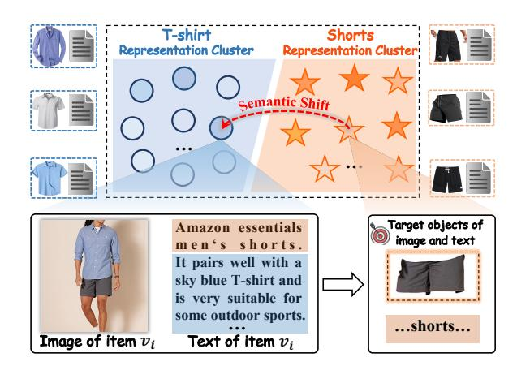
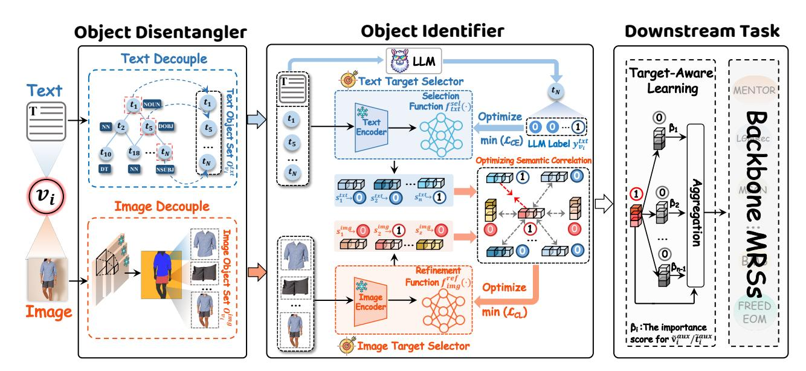
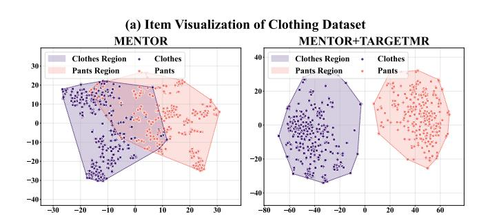
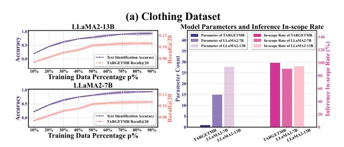
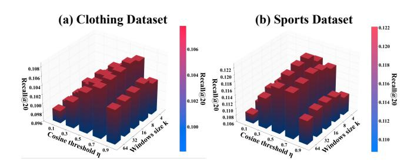
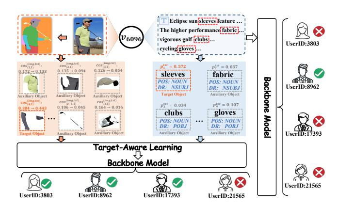
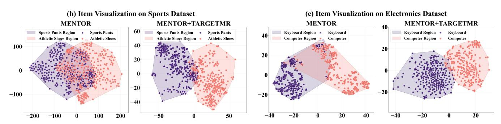
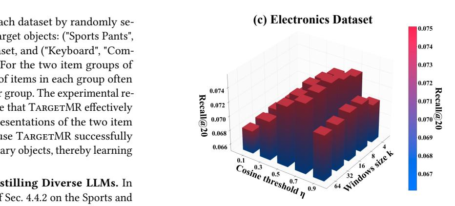
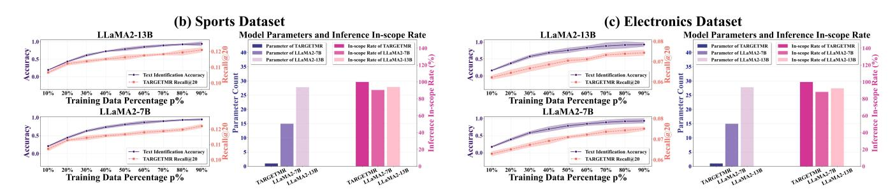

# TargetMR: Learning Modality Target for Multimodal Recommendation

[Gu Tang](https://orcid.org/0009-0008-6640-1268) Shanghai Jiao Tong University Shanghai, China gutang@sjtu.edu.cn

[Jinghe Wang](https://orcid.org/0009-0006-2646-6660) Shanghai Jiao Tong University Shanghai, China whalien-56@sjtu.edu.cn

[Jiang Bo](https://orcid.org/0000-0001-6711-4342)† Shanghai Jiao Tong University Shanghai, China bjiang@sjtu.edu.cn

[Ze Zhao](https://orcid.org/0000-0002-1599-3434) Shanghai Jiao Tong University Shanghai, China zhaoze@sjtu.edu.cn

[Jianping Zhou](https://orcid.org/0009-0000-7161-2029) Shanghai Jiao Tong University Shanghai, China jianpingzhou@sjtu.edu.cn

[Xiaoying Gan](https://orcid.org/0000-0001-5200-1409)† Shanghai Jiao Tong University Shanghai, China ganxiaoying@sjtu.edu.cn

[Luoyi Fu](https://orcid.org/0000-0001-7796-9168) Shanghai Jiao Tong University Shanghai, China yiluofu@sjtu.edu.cn

[Xinbing Wang](https://orcid.org/0000-0002-0357-8356) Shanghai Jiao Tong University Shanghai, China xwang8@sjtu.edu.cn

[Chenghu Zhou](https://orcid.org/0000-0003-3331-2302) Chinese Academy of Sciences Beijing, China zhouch@lreis.ac.cn

### Abstract

Rapid development of web services has led to an explosion of multimodal content, making multimodal recommender systems (MRSs) vital tools for mitigating information overload. Current MRSs have achieved remarkable progress by incorporating advanced technologies such as Graph Neural Networks (GNNs) and Large Language Models (LLMs). However, these studies still suffer from the semantic shift problem. Generally, item's multimodal content usually contain multiple objects, including target object (core content of item) and auxiliary objects (decorations of item). Existing MRSs overlooked this distinction, failing to prevent auxiliary objects from dominating the representation, leading to biased item representation. To address this issue, we propose a model-agnostic framework "TargetMR". Concretely, TargetMR comprises two core modules, including Object Disentangler and Object Identifier. The Object Disentangler decouples item text and image into multiple objects via text syntactic parsing and image segmentation. The Object Identifier performs knowledge distillation based on LLMs to efficiently identify the target text object. It then identifies the target image object through cross-modal semantic evaluation. Moreover, this module refines the representation of image target object by optimizing the semantic correlation. Owing to the model-agnostic design of TargetMR, it can be integrated into various backbone MRSs. Extensive experiments on three benchmark datasets show that TargetMR consistently improves the performance of five backbone MRSs, with an average improvement of 12.26%. Our codes are available at [https://github.com/gutang-97/TargetMR/.](https://github.com/gutang-97/TargetMR/)

[This work is licensed under a Creative Commons Attribution 4.0 International License.](https://creativecommons.org/licenses/by/4.0)

WWW '26, Dubai, United Arab Emirates. © 2026 Copyright held by the owner/author(s). ACM ISBN 979-8-4007-2307-0/2026/04 <https://doi.org/10.1145/3774904.3792466>

# CCS Concepts

• Information systems → Recommender systems; Multimedia and multimodal retrieval.

## Keywords

Multimodal Recommendation; Semantic Shift; Knowledge Distillation

### ACM Reference Format:

Gu Tang, Jinghe Wang, Jiang Bo† , Ze Zhao, Jianping Zhou, Xiaoying Gan† , Luoyi Fu, Xinbing Wang, and Chenghu Zhou. 2026. TargetMR: Learning Modality Target for Multimodal Recommendation. In Proceedings of the ACM Web Conference 2026 (WWW '26), April 13–17, 2026, Dubai, United Arab Emirates. ACM, New York, NY, USA, [12](#page-11-0) pages. [https://doi.org/10.1145/](https://doi.org/10.1145/3774904.3792466) [3774904.3792466](https://doi.org/10.1145/3774904.3792466)

### 1 Introduction

With the rapid growth of web services like e-commerce and social media, recommender systems (RSs) have become essential tools for providing personalized services. They infer user preferences based on user-item interactions to provide personalized recommendations. In recent years, the abundance of multimodal content—such as text, image, and audio—on web platforms has motivated numerous efforts [\[1–](#page-8-0)[3\]](#page-8-1), giving rise to the promising research field known as multimodal recommender systems (MRSs).

The development of MRSs has yielded many valuable research works. Early MRSs, such as VBPR [\[4\]](#page-8-2) and DeepStyle [\[5\]](#page-8-3), primarily integrated multimodal content with matrix factorization (MF) to derive modality-enhanced user and item representations. With the remarkable success of Graph Neural Networks (GNNs), a series of efforts (e.g., MGCN [\[1\]](#page-8-0) and LATTICE [\[3\]](#page-8-1)) have incorporated GNNs to model the high-order relationship between multimodal content and user behavior, resulting in impressive progress. Building upon these, subsequent studies [\[6,](#page-8-4) [7\]](#page-8-5) further incorporate the rich knowledge of Large Language Models (LLMs) [\[8,](#page-8-6) [9\]](#page-8-7) to enhance user/item profiles [\[6\]](#page-8-4) or perform knowledge distillation [\[7\]](#page-8-5), thus enhancing recommendation performance.

† Corresponding authors.

Figure 1: The illustration of semantic shift problem.

Despite the considerable progress, existing MRSs still suffer from the semantic shift problem. For a specific item, its multimodal content typically comprises multiple objects, including a target object (core content of item) and multiple auxiliary objects (decorations of item). However, current MRSs ignore the coexistence of these objects, which causes auxiliary objects to dominate the feature learning, resulting in biased item representation. As shown in Figure [1,](#page-1-0) the target object for the item ���� is "Shorts", and its auxiliary objects include a "T-shirt" (used to decorate the "Shorts"). Yet, the auxiliary object occupies a larger portion of image patches and textual descriptions. Hereby, "T-shirt" dominates the representation of item ���� , resulting in a biased representation.

To address the semantic shift problem, the key lies in overcoming the following two challenges: (i) Multiple objects within a modality (e.g., text or image) often lack clear discriminative criteria, which makes it difficult to disentangle a modality into distinct objects. (ii) The target object is hidden among multiple objects and lacks explicit annotation, posing a significant challenge for its accurate identification.

Consequently, we propose a model-agnostic framework termed "TargetMR: Learning Modality Target for Multimodal Recommendation" to tackle the aforementioned challenges. To be specific, TargetMR comprises two core modules, including Object Disentangler and Object Identifier. The Object Disentangler is designed to decouple modalities (e.g., text and image) into their multiple objects. It first decouples item text into multiple objects by parsing the part-of-speech (POS) and syntactic structure of the text. Thereafter, multiple image objects are obtained by performing image segmentation. Given the above-mentioned multiple text and image objects, the Object Identifier aims to identify target objects from them. It optimizes a discriminative architecture-based text target selector by distilling knowledge from LLMs, thereby enabling the identification of target text object and avoiding the issue of LLM instruction non-compliance. In addition, this module further develops an image target selector, which identifies target image object and refines its representations by evaluating and optimizing the semantic correlations. Owing to the model-agnostic design of TargetMR, it can be incorporated into various backbone MRSs, thereby enhancing their performance.

To summarize, the key contributions of this work are as follows:

- We propose TargetMR, a novel and model-agnostic framework, to address the semantic shift problem through modality decoupling and target identification. It can be integrated into various backbone MRSs, thereby enhancing their performance.
- We propose an Object Disentangler to decouple item text and images into multiple objects through performing syntactic parsing and image segmentation.
- The proposed Object Identifier determines target objects through knowledge distillation and semantic evaluation, followed by representation refinement of the image object via optimizing the semantic correlation.

Extensive experiments on three benchmark datasets show that TargetMR consistently enhances five backbone MRS, achieving state-of-the-art results and an average improvement of 12.26% across them.

### 2 Preliminary

In this section, we first formally define the concepts and notations used throughout this paper. Subsequently, we introduce the task definition of multimodal recommendation.

Concepts and Notations. Following previous works [\[1,](#page-8-0) [3,](#page-8-1) [10,](#page-8-8) [11\]](#page-8-9), we denote the user-item interactions as a bipartite graph G = {(���� , ������ ,���� , ����)|���� ∈ U, ���� ∈ V}, where U and V correspond to the user set and item set, respectively. The ������ ,���� ∈ {0, 1} is a binary indicator, where ������ ,���� = 1 signifies user ���� interacted with item ���� , and ������ ,���� = 0 otherwise. In MRS, each item is associated with multimodal content. In this paper, we focus on the two most prevalent modalities: text and image. Formally, given item ���� , its text and image are defined as sequence T���� = [��1, ��2, · · · , ����] and P���� = [��1, ��2, · · · , ����], respectively. ���� and ���� denote the ��-th token and patch in T���� (including �� tokens) and P���� (with �� patches), respectively. For additional notations, we will introduce them in the corresponding section.

Task Formulation. Formally, the task of multimodal recommendation is formulated as follows: Given the user-item interaction graph G and multimodal content, we aim to optimize a learnable function F to predict the probability of a user adopting an item.

# 3 Methodology

The overall framework of TargetMR is shown in Figure [2,](#page-2-0) which consists of three components, including (i) Object Disentangler, (ii) Object Identifier and (iii) Downstream Task. In the following subsections, we will provide a detailed description for each module.

### 3.1 Object Disentangler

The goal of this module is to decouple item text and image into multiple objects, respectively. Structurally, this module consists of two parts: Text Decouple and Image Decouple.

3.1.1 Text Decouple. The key to decoupling item text into multiple text objects lies in identifying their corresponding tokens. Inspired by the part-of-speech (POS) tags and syntactic structures of text, we identify the tokens of different text objects by parsing the two features.

For the POS tags, given the text sequence T���� = [��1, ��2, · · · , ����] of item ���� , we employ a POS tagging model ������������(·) to derive the

Table 1: Overall performance of all backbone models and their enhanced versions with TargetMR on three benchmark datasets. The highest metric within each block (corresponding to each backbone model) is indicated in bold, and the percentage of performance improvement is highlighted with a gray background. The † indicates statistically significant performance improvements with ��-value &lt; 0.01.

|        | MODELS   |             | R@10   | R@20     | Clothing N@10 | N@20       | R@10   | R@20     | Sports N@10 | N@20       | R@10   | R@20     | Electronics N@10 | N@20       |
|--------|----------|-------------|--------|----------|---------------|------------|--------|----------|-------------|------------|--------|----------|------------------|------------|
| BM3    | (2023)   | [21]        | 0.0450 | 0.0669   | 0.0243        | 0.0295     | 0.0656 | 0.0980   | 0.0355      | 0.0438     | 0.0437 | 0.0648   | 0.0247           | 0.0302     |
| +      | TargetMR |             | 0.0580 | † 0.0835 | † 0.0328      | † 0.0396 † | 0.0737 | † 0.1078 | † 0.0409    | † 0.0498 † | 0.0461 | † 0.0682 | † 0.0260         | † 0.0317 † |
| Imp(%) |          |             | 28.89% | 24.81%   | 34.98%        | 34.24%     | 12.35% | 10.00%   | 15.21%      | 13.70%     | 5.49%  | 5.25%    | 5.26%            | 4.97%      |
|        | FREEDOM  | (2023) [20] | 0.0629 | 0.0941   | 0.0341        | 0.0420     | 0.0717 | 0.1089   | 0.0385      | 0.0481     | 0.0398 | 0.0603   | 0.0218           | 0.0271     |
| +      | TargetMR |             | 0.0696 | † 0.1025 | † 0.0387      | † 0.0465 † | 0.0761 | † 0.1137 | † 0.0415    | † 0.0519 † | 0.0450 | † 0.0669 | † 0.0254         | † 0.0312 † |
| Imp(%) |          |             | 10.65% | 8.93%    | 13.49%        | 10.71%     | 6.14%  | 4.41%    | 7.79%       | 7.9%       | 13.07% | 10.95%   | 16.51%           | 15.13%     |
| MGCN   | (2023)   | [1]         | 0.0641 | 0.0945   | 0.0347        | 0.0428     | 0.0729 | 0.1106   | 0.0397      | 0.0496     | 0.0442 | 0.0650   | 0.0246           | 0.0302     |
| +      | TargetMR |             | 0.0711 | † 0.1040 | † 0.0388      | † 0.0473 † | 0.0771 | † 0.1140 | † 0.0424    | † 0.0517 † | 0.0468 | † 0.0690 | † 0.0264         | † 0.0329 † |
| Imp(%) |          |             | 10.92% | 10.05%   | 11.82%        | 10.51%     | 5.76%  | 3.07%    | 6.80%       | 4.23%      | 5.88%  | 6.15%    | 7.32%            | 8.94%      |
| LGMRec | (2024)   | [10]        | 0.0555 | 0.0828   | 0.0302        | 0.0371     | 0.0720 | 0.1068   | 0.0390      | 0.0480     | 0.0408 | 0.0604   | 0.0226           | 0.0277     |
| +      | TargetMR |             | 0.0688 | † 0.1003 | † 0.0376      | † 0.0453 † | 0.0781 | † 0.1148 | † 0.0435    | † 0.0526 † | 0.0452 | † 0.0671 | † 0.0253         | † 0.0311 † |
| Imp(%) |          |             | 23.96% | 21.35%   | 24.50%        | 22.10%     | 8.47%  | 7.49%    | 11.54%      | 9.58%      | 10.78% | 11.09%   | 11.95%           | 12.27%     |
|        | MENTOR   | (2025) [18] | 0.0668 | 0.0989   | 0.0360        | 0.0443     | 0.0763 | 0.1139   | 0.0409      | 0.0511     | 0.0439 | 0.0655   | 0.0244           | 0.0300     |
| +      | TargetMR |             | 0.0757 | † 0.1078 | † 0.0410      | † 0.0491 † | 0.0832 | † 0.1221 | † 0.0458    | † 0.0558 † | 0.0509 | † 0.0751 | † 0.0286         | † 0.0348 † |
| Imp(%) |          |             | 13.32% | 9.00%    | 13.89%        | 10.84%     | 9.04%  | 7.20%    | 11.98%      | 9.20%      | 15.95% | 14.66%   | 17.21%           | 16.00%     |

Table 2: Ablation Study on TargetMR.

|          | Variant | Models R@20 | Clothing N@20 | R@20   | Sports N@20 | R@20   | Electronics N@20 |
|----------|---------|-------------|---------------|--------|-------------|--------|------------------|
| w/o      | POS     | 0.1038      | 0.0470        | 0.1176 | 0.0526      | 0.0716 | 0.0333           |
| w/o      | SYP     | 0.1045      | 0.0474        | 0.1188 | 0.0533      | 0.0724 | 0.0337           |
| w/o      | ITS     | 0.1025      | 0.0463        | 0.1168 | 0.0516      | 0.0713 | 0.0331           |
| w/o      | RRF     | 0.1034      | 0.0466        | 0.1174 | 0.0522      | 0.0720 | 0.0334           |
| w/o      | TAL     | 0.1007      | 0.0453        | 0.1152 | 0.0512      | 0.0684 | 0.0315           |
| TargetMR |         | 0.1078      | 0.0491        | 0.1221 | 0.0558      | 0.0751 | 0.0348           |

- w/o POS: We remove the POS tagging in text segmentation, relying solely on syntactic parsing to obtain the tokens corresponding to text objects.
- w/o SYP: We remove the syntactic parsing in text segmentation, relying solely on POS tagging to obtain the tokens corresponding to text objects.
- w/o ITS: We remove the Image Target Selector and directly feed the original image features into backbone MRS.
- w/o RRF: We remove the representation refinement function �� ���� �� ������ (·) in Image Target Selector.
- w/o TAL: We remove the Target-Aware Learning and directly feed the representations of target text and image objects into backbone MRS.

Table [2](#page-5-1) shows the performance of TargetMR and multiple variant models. Based on these results, we draw the following conclusions: (i) TargetMR shows performance degradation when ablating both POS tagging and syntactic parsing in text decoupling, i.e., w/o POS and w/o SYP, underscoring their combined contribution to accurately decoupling item text. (ii) Removing the Image Target Selector (w/o ITS) or its representation refinement function �� ���� �� ������ (·) (w/o RRF) leads to performance degradation. These demonstrate the importance of identifying the target image object as well as refining its representation. (iii) The removal of Target-Aware Learning, i.e., w/o TAL, leads to performance degradation in TargetMR. The

reason is that the target-guided auxiliary representation serves as an effective complement to the target object representation.

### 4.4 Results Visualization and Multi-LLM Distillation of TargetMR

4.4.1 The results visualization of TargetMR. In this subsection, we perform a visual analysis to intuitively investigate the effectiveness of TargetMR. Specifically, using the Clothing dataset as an example, we first extract the sum of text and image embeddings for all items as their representations via the optimized MENTOR and MENTOR+TargetMR, respectively. We then randomly select two items with target objects "T-shirt" and "Shorts", respectively. Based on their representations, we retrieve the top-200 most similar items for each of them using cosine similarity, forming two item groups. Finally, we apply t-SNE to visualize the representations of all items within these two groups. The experimental results are presented in Figure [3.](#page-5-2)

Figure 3: The t-SNE visualization for item representations of two item groups generated by MENTOR and MEN-TOR+TargetMR on Clothing Datasets.

Figure [3](#page-5-2) reveals that the item representations generated by MEN-TOR exhibit significant overlap between the two item groups in

the Clothing dataset. This occurs because the multimodal representations of "T-shirt" and "Shorts" often include each other as auxiliary objects. However, MENTOR fails to distinguish the target object and auxiliary objects, resulting in a misleading overlap of representations between the two item groups. In contrast, MEN-TOR+TargetMR significantly reduces the representation overlap between the two item groups. These results demonstrate the effectiveness of TargetMR in identifying target objects, thereby learning unbiased item representations. Further experiments on the Sports and Electronics datasets support this conclusion, as demonstrated in Appendix [A.4.](#page-9-4)

Figure 4: The identification accuracy and Recall@20 of TargetMR based on two LLMs (line chart). The efficiency comparison between TargetMR and two LLMs (bar chart).

4.4.2 The Effect of TargetMR in Distilling Diverse LLMs. This subsection evaluates the performance of TargetMR distilled from different LLMs. Specifically, we create two training datasets by annotating all item texts in the Clothing dataset with LLaMA2-7B and LLaMA2-13B, respectively. Samples with failed annotations due to the LLM's failure to follow instructions are removed from each dataset. For each dataset, the ��% of the data is used for training TargetMR, and the remaining (100-��)% is held out for validation (metric is accuracy). Concurrently, we record the recommendation performance (Recall@20) of TargetMR+MENTOR in the corresponding state. As shown in Figure [4](#page-6-2) (line chart), the accuracy of TargetMR and Recall@20 of TargetMR + MENTOR increase monotonically with the percentage of training data ratio (��%). At p=80%, accuracy surpasses 90%, indicating that TargetMR achieves performance comparable to the LLMs.

In addition, Figure [4](#page-6-2) (bar chart) compares the parameter counts of all models (expressed as relative multiples to TargetMR) and their inference in-scope rates based on validation data (20% of training data). The inference in-scope rate is defined as the proportion of the inferred target text object for ���� that belongs to the text object set O ���� . It is evident that TargetMR has significantly fewer parameters than the LLMs while maintaining a 100% inference inscope rate, highlighting its lightweight and stability. Appendix [A.4](#page-11-1) provides the experiments on more datasets.

# 4.5 The Cross-dataset Transferability

The optimization of TargetMR relies on item's multimodal content and LLM. Moreover, in recommendation scenarios, item's multimodal content generally exhibit cross-dataset relevance, endowing TargetMR with cross-dataset transferability. To validate this, we select MENTOR as backbone MRS and optimize TargetMR on

Table 3: The cross-dataset transferability experiments for TargetMR, where SD and TD denote the source and target dataset, respectively. The overall highest metric values are shown in bold.

| SD       | → TD        |               | R@10   | R@20   | N@10   | N@20   |
|----------|-------------|---------------|--------|--------|--------|--------|
| Sports   | →           | Sports        | 0.0832 | 0.1221 | 0.0458 | 0.0558 |
| Clothing | →           | Sports        | 0.0815 | 0.1200 | 0.0445 | 0.0543 |
|          | Electronics | → Sports      | 0.0779 | 0.1168 | 0.0424 | 0.0526 |
| Clothing | →           | Clothing      | 0.0757 | 0.1078 | 0.0410 | 0.0491 |
| Sports   | →           | Clothing      | 0.0722 | 0.1057 | 0.0394 | 0.0478 |
|          | Electronics | → Clothing    | 0.0684 | 0.1021 | 0.0376 | 0.0458 |
|          | Electronics | → Electronics | 0.0509 | 0.0751 | 0.0286 | 0.0348 |
| Sports   | →           | Electronics   | 0.0460 | 0.0683 | 0.0258 | 0.0315 |
| Clothing | →           | Electronics   | 0.0458 | 0.0681 | 0.0260 | 0.0316 |

source dataset and directly performing inference on target dataset, i.e., SD → TD. These inference results, i.e., the identified target objects and auxiliary objects, are leveraged to optimize the backbone MRS and evaluate its performance. Tabel [3](#page-6-3) demonstrates the experimental results. Obviously, Clothing → Sports and Sports → Clothing yields the satisfied performance, whereas Sports/Clothing → Electronics yield poor performance. The reason is that items of Clothing and Sports share overlapping categories (e.g., clothing, shoes, and pants), while Electronics contains items from a distinct domain. Additional experiments involving more diverse settings are provided in Appendix [A.4.](#page-10-0)

### 4.6 Hyperparameter Analysis and Case Study

4.6.1 Hyperparameter Analysis. In this subsection, we conduct sensitivity analyses of the context window size �� (Eq. [\(13\)](#page-3-1)) in Text Target Selector and the cosine similarity threshold �� (Eq. [\(22\)](#page-4-1)) in Target-Aware Learning, as shown in Figure [5.](#page-6-4) We observe that values of �� in the set {8, 16} and values of �� in the set {0.5, 0.7} yield superior performance. This is because an overly large �� introduces noise into the textual context information of text objects, while an overly small �� provides insufficient context information; conversely, an overly large �� fails to capture sufficient latent positive interactions, whereas an overly small �� admits noisy signals. Extensive experiments on more datasets are demonstrated in Appendix [A.4.](#page-10-0)

Figure 5: Hyperparameter analysis on cosine threshold �� and windows size �� in terms of Clothing and Sports datasets.

4.6.2 Case Study. To investigate the interpretability of TargetMR, we conducte a case study as illustrated in Figure [6.](#page-7-0) We randomly select an item (��6096) from the Clothing dataset and identify its

### References

[1] Penghang Yu, Zhiyi Tan, Guanming Lu, and Bing-Kun Bao. Multi-view graph convolutional network for multimedia recommendation. In Proceedings of the 31st ACM International Conference on Multimedia, pages 6576–6585, 2023. [2] Zixuan Yi, Xi Wang, Iadh Ounis, and Craig Macdonald. Multi-modal graph contrastive learning for micro-video recommendation. In Proceedings of the 45th International ACM SIGIR Conference on Research and Development in Information Retrieval, pages 1807–1811, 2022. [3] Jinghao Zhang, Yanqiao Zhu, Qiang Liu, Shu Wu, Shuhui Wang, and Liang Wang. Mining latent structures for multimedia recommendation. In Proceedings of the 29th ACM international conference on multimedia, pages 3872–3880, 2021. [4] Ruining He and Julian McAuley. Vbpr: visual bayesian personalized ranking from implicit feedback. In Proceedings of the AAAI conference on artificial intelligence, volume 30, 2016. [5] Qiang Liu, Shu Wu, and Liang Wang. Deepstyle: Learning user preferences for visual recommendation. In Proceedings of the 40th international acm sigir conference on research and development in information retrieval, pages 841–844, 2017. [6] Wei Wei, Xubin Ren, Jiabin Tang, Qinyong Wang, Lixin Su, Suqi Cheng, Junfeng Wang, Dawei Yin, and Chao Huang. Llmrec: Large language models with graph augmentation for recommendation. In Proceedings of the 17th ACM international conference on web search and data mining, pages 806–815, 2024. [7] Xubin Ren, Wei Wei, Lianghao Xia, Lixin Su, Suqi Cheng, Junfeng Wang, Dawei Yin, and Chao Huang. Representation learning with large language models for recommendation. In Proceedings of the ACM web conference 2024, pages 3464–3475, 2024. [8] Hugo Touvron, Thibaut Lavril, Gautier Izacard, Xavier Martinet, Marie-Anne Lachaux, Timothée Lacroix, Baptiste Rozière, Naman Goyal, Eric Hambro, Faisal Azhar, et al. Llama: Open and efficient foundation language models. arXiv preprint arXiv:2302.13971, 2023. [9] Daya Guo, Dejian Yang, Haowei Zhang, Junxiao Song, Ruoyu Zhang, Runxin Xu, Qihao Zhu, Shirong Ma, Peiyi Wang, Xiao Bi, et al. Deepseek-r1: Incentivizing reasoning capability in llms via reinforcement learning. arXiv preprint arXiv:2501.12948, 2025. [10] Zhiqiang Guo, Jianjun Li, Guohui Li, Chaoyang Wang, Si Shi, and Bin Ruan. Lgmrec: Local and global graph learning for multimodal recommendation. In Proceedings of the AAAI Conference on Artificial Intelligence, volume 38, pages 8454–8462, 2024. [11] Gu Tang, Jinghe Wang, Xiaoying Gan, Bin Lu, Ze Zhao, Luoyi Fu, Xinbing Wang, and Chenghu Zhou. R2mr: Review and rewrite modality for recommendation. In Proceedings of the 31st ACM SIGKDD Conference on Knowledge Discovery and Data Mining V.1, page 1337–1348, 2025. [12] Duygu Altinok. Mastering spaCy: An end-to-end practical guide to implementing NLP applications using the Python ecosystem. Packt Publishing Ltd, 2021. [13] Lei Ke, Mingqiao Ye, Martin Danelljan, Yu-Wing Tai, Chi-Keung Tang, Fisher Yu, et al. Segment anything in high quality. Advances in Neural Information Processing Systems, 36:29914–29934, 2023. [14] Alexander Kirillov, Eric Mintun, Nikhila Ravi, Hanzi Mao, Chloe Rolland, Laura Gustafson, Tete Xiao, Spencer Whitehead, Alexander C Berg, Wan-Yen Lo, et al. Segment anything. In Proceedings of the IEEE/CVF international conference on computer vision, pages 4015–4026, 2023. [15] Hugo Touvron, Louis Martin, Kevin Stone, Peter Albert, Amjad Almahairi, Yasmine Babaei, Nikolay Bashlykov, Soumya Batra, Prajjwal Bhargava, Shruti Bhosale, et al. Llama 2: Open foundation and fine-tuned chat models. arXiv preprint arXiv:2307.09288, 2023. [16] Jinze Bai, Shuai Bai, Yunfei Chu, Zeyu Cui, Kai Dang, Xiaodong Deng, Yang Fan, Wenbin Ge, Yu Han, Fei Huang, et al. Qwen technical report. arXiv preprint arXiv:2309.16609, 2023. [17] Alec Radford, Jong Wook Kim, Chris Hallacy, Aditya Ramesh, Gabriel Goh, Sandhini Agarwal, Girish Sastry, Amanda Askell, Pamela Mishkin, Jack Clark, et al. Learning transferable visual models from natural language supervision. In International conference on machine learning, pages 8748–8763. PmLR, 2021. [18] Jinfeng Xu, Zheyu Chen, Shuo Yang, Jinze Li, Hewei Wang, and Edith C-H Ngai. Mentor: Multi-level self-supervised learning for multimodal recommendation. arXiv preprint arXiv:2402.19407, 2024. [19] Ruining He and Julian McAuley. Ups and downs: Modeling the visual evolution of fashion trends with one-class collaborative filtering. In proceedings of the 25th international conference on world wide web, pages 507–517, 2016. [20] Xin Zhou and Zhiqi Shen. A tale of two graphs: Freezing and denoising graph structures for multimodal recommendation. In Proceedings of the 31st ACM International Conference on Multimedia, page 935–943, 2023. [21] Xin Zhou, Hongyu Zhou, Yong Liu, Zhiwei Zeng, Chunyan Miao, Pengwei Wang, Yuan You, and Feijun Jiang. Bootstrap latent representations for multi-modal recommendation. In Proceedings of the ACM Web Conference 2023, page 845–854, 2023. [22] Andrew I Schein, Alexandrin Popescul, Lyle H Ungar, and David M Pennock. Methods and metrics for cold-start recommendations. In Proceedings of the 25th annual international ACM SIGIR conference on Research and development in information retrieval, pages 253–260, 2002. [23] Hoyeop Lee, Jinbae Im, Seongwon Jang, Hyunsouk Cho, and Sehee Chung. Melu: Meta-learned user preference estimator for cold-start recommendation. In Proceedings of the 25th ACM SIGKDD international conference on knowledge discovery & data mining, pages 1073–1082, 2019. [24] Quoc-Tuan Truong and Hady Lauw. Multimodal review generation for recommender systems. In The World Wide Web Conference, page 1864–1874, 2019. [25] Ashish Vaswani, Noam Shazeer, Niki Parmar, Jakob Uszkoreit, Llion Jones, Aidan N Gomez, Łukasz Kaiser, and Illia Polosukhin. Attention is all you need. Advances in neural information processing systems, 30, 2017. [26] Hongyu Zhou, Xin Zhou, Lingzi Zhang, and Zhiqi Shen. Enhancing dyadic relations with homogeneous graphs for multimodal recommendation. In ECAI 2023, pages 3123–3130. IOS Press, 2023. [27] Yinwei Wei, Xiang Wang, Liqiang Nie, Xiangnan He, Richang Hong, and Tat-Seng Chua. Mmgcn: Multi-modal graph convolution network for personalized recommendation of micro-video. In Proceedings of the 27th ACM international conference on multimedia, pages 1437–1445, 2019. [28] Qifan Wang, Yinwei Wei, Jianhua Yin, Jianlong Wu, Xuemeng Song, and Liqiang Nie. Dualgnn: Dual graph neural network for multimedia recommendation. IEEE Transactions on Multimedia, 25:1074–1084, 2021. [29] Zhulin Tao, Yinwei Wei, Xiang Wang, Xiangnan He, Xianglin Huang, and Tat-Seng Chua. Mgat: Multimodal graph attention network for recommendation. Information Processing Management, 57(5):102277, 2020. [30] Penghang Yu, Zhiyi Tan, Guanming Lu, and Bing-Kun Bao. Mind individual information! principal graph learning for multimedia recommendation. In Proceedings of the AAAI Conference on Artificial Intelligence, volume 39, pages 13096–13105, 2025. [31] Wei Wei, Chao Huang, Lianghao Xia, and Chuxu Zhang. Multi-modal selfsupervised learning for recommendation. In Proceedings of the ACM Web Conference 2023, pages 790–800, 2023. [32] Chunyu Wei, Jian Liang, Di Liu, and Fei Wang. Contrastive graph structure learning via information bottleneck for recommendation. Advances in Neural Information Processing Systems, pages 20407–20420, 2022. [33] Junliang Yu, Hongzhi Yin, Jundong Li, Qinyong Wang, Nguyen Quoc Viet Hung, and Xiangliang Zhang. Self-supervised multi-channel hypergraph convolutional network for social recommendation. In Proceedings of the web conference 2021, pages 413–424, 2021. [34] Geoffrey Hinton, Oriol Vinyals, and Jeff Dean. Distilling the knowledge in a neural network. arXiv preprint arXiv:1503.02531, 2015. [35] Linfeng Zhang, Jiebo Song, Anni Gao, Jingwei Chen, Chenglong Bao, and Kaisheng Ma. Be your own teacher: Improve the performance of convolutional neural networks via self distillation. In Proceedings of the IEEE/CVF international conference on computer vision, pages 3713–3722, 2019. [36] Jianping Gou, Baosheng Yu, Stephen J Maybank, and Dacheng Tao. Knowledge distillation: A survey. International journal of computer vision, 129(6):1789–1819, 2021. [37] Jiaxi Tang and Ke Wang. Ranking distillation: Learning compact ranking models with high performance for recommender system. In Proceedings of the 24th ACM SIGKDD international conference on knowledge discovery & data mining, pages 2289–2298, 2018. [38] SeongKu Kang, Junyoung Hwang, Wonbin Kweon, and Hwanjo Yu. De-rrd: A knowledge distillation framework for recommender system. In Proceedings of the 29th ACM international conference on information & knowledge management, pages 605–614, 2020. [39] Jae-woong Lee, Minjin Choi, Jongwuk Lee, and Hyunjung Shim. Collaborative distillation for top-n recommendation. In 2019 IEEE international conference on data mining (ICDM), pages 369–378. IEEE, 2019. [40] Wujiang Xu, Qitian Wu, Zujie Liang, Jiaojiao Han, Xuying Ning, Yunxiao Shi, Wenfang Lin, and Yongfeng Zhang. Slmrec: Distilling large language models into small for sequential recommendation. arXiv preprint arXiv:2405.17890, 2024. [41] Zhixuan Chu, Hongyan Hao, Xin Ouyang, Simeng Wang, Yan Wang, Yue Shen, Jinjie Gu, Qing Cui, Longfei Li, Siqiao Xue, et al. Leveraging large language models for pre-trained recommender systems. arXiv preprint arXiv:2308.10837, 2023. [42] Keqin Bao, Jizhi Zhang, Yang Zhang, Wenjie Wang, Fuli Feng, and Xiangnan He. Tallrec: An effective and efficient tuning framework to align large language model with recommendation. In Proceedings of the 17th ACM conference on recommender systems, pages 1007–1014, 2023. [43] Yingpeng Du, Zhu Sun, Ziyan Wang, Haoyan Chua, Jie Zhang, and Yew-Soon Ong. Active large language model-based knowledge distillation for session-based recommendation. In Proceedings of the AAAI Conference on Artificial Intelligence, volume 39, pages 11607–11615, 2025.

| Dataset     | #User   | #Item  | #Interaction | #Sparsity |
|-------------|---------|--------|--------------|-----------|
| Clothing    | 39,387  | 23,033 | 278,677      | 99.97%    |
| Sports      | 35,598  | 18,357 | 296,337      | 99.95%    |
| Electronics | 192,403 | 63,001 | 1,689,188    | 99.06%    |

Figure 7: The t-SNE visualization for item representations of two item groups generated by MENTOR and MENTOR+TargetMR on Electronics datasets.

| [Instruction]:                                | You are a helpful, respectful and honest assistant.                           |
|-----------------------------------------------|-------------------------------------------------------------------------------|
| [Prompt]:                                     | As a natural language processing expert, given a item description from the e |
| commerce domain and a set                     | ��!!                                                                          |
|                                               | "#" containing different objects of the item, please select the               |
| element from set                              | ��!!                                                                          |
|                                               | "#" that best represents the core content of the item based on the overall    |
| Requirement: Directly return the element from | ��!!                                                                          |
|                                               | "#" that you consider most representative                                     |
| Item description:                             | Propper men‘s BDU coat . The coat pairs with the BDU trouser to create        |
| Set ��!!                                      |                                                                               |
| "#" :{coat, trouser,                          | uniform, holes, pocket, elbows}                                               |
| [ Answer]:                                    | coat                                                                          |

Figure 8: The configuration of LLM prompt used in Text Target Selector (Sec[.3.2.1\)](#page-2-3).

two item groups are constructed in each dataset by randomly selecting two items with the following target objects: ("Sports Pants", "Athletic Shoes") from the Sports dataset, and ("Keyboard", "Computer") from the Electronics dataset. For the two item groups of each dataset, the multimodal content of items in each group often include auxiliary objects from the other group. The experimental results are shown in Figure [7.](#page-10-2) We observe that TargetMR effectively reduces the overlap between the representations of the two item groups in both datasets. This is because TargetMR successfully distinguishes between target and auxiliary objects, thereby learning unbiased item representations.

• The Effect of TargetMR in Distilling Diverse LLMs. In this part, we extend the experiments of Sec. [4.4.2](#page-6-0) on the Sports and Electronics datasets, as demonstrated in Figure [9.](#page-11-1) The results demonstrate that as the training data ratio increases, the TargetMR's accuracy in identifying text target object gradually improves, eventually converging with LLM performance. Meanwhile, the recommendation performance of TargetMR+MENTOR also progressively improves with the expansion of the training data ratio. In addition, the bar plot in Figure [9](#page-11-1) shows that TargetMR achieves a 100% inference in-scope rate due to its discriminative structure, while using significantly fewer parameters than the LLMs. These findings are consistent with those obtained on the Clothing dataset (Sec. [4.4.2\)](#page-6-0), highlighting the lightweight architecture and stability of TargetMR.

Table 6: The cross-dataset transferability experiments for TargetMR, where SD and TD denote the source and target dataset, respectively. The overall highest metric values are shown in bold.

| SD → TD         |                      |               | R@10               | R@20   | N@10   | N@20   |
|-----------------|----------------------|---------------|--------------------|--------|--------|--------|
| Sports →        | Sports               |               | 0.0832             | 0.1221 | 0.0458 | 0.0558 |
| Clothing+Sports | →                    | Sports        | 0.0837             | 0.1229 | 0.0459 | 0.0560 |
|                 | Electronics+Sports   | → Sports      | 0.0819             | 0.1216 | 0.0448 | 0.0551 |
| Clothing        | + Electronics        | → Sports      | 0.0811             | 0.1206 | 0.0440 | 0.0543 |
| Clothing        | → Clothing           |               | 0.0757             | 0.1078 | 0.0410 | 0.0491 |
| Sports+Clothing | →                    | Clothing      | 0.0760             | 0.1081 | 0.0413 | 0.0494 |
|                 | Electronics+Clothing | → Clothing    | 0.0733             | 0.1060 | 0.0401 | 0.0480 |
| Sports +        | Electronics          | → Clothing    | 0.0714             | 0.1045 | 0.0389 | 0.0473 |
| Electronics     | →                    | Electronics   | 0.0509             | 0.0751 | 0.0286 | 0.0348 |
| Sports +        | Electronics          | → Electronics | 0.0504             | 0.0742 | 0.0283 | 0.0345 |
| Clothing        | + Electronics        | →             | Electronics 0.0502 | 0.0743 | 0.0281 | 0.0343 |
| Sports +        | Clothing             | → Electronics | 0.0454             | 0.0665 | 0.0253 | 0.0312 |

Figure 10: Hyperparameter analysis of cosine threshold �� and windows size �� on Electronics dataset.

- The Cross-Dataset Transferability of TargetMR. To explore the performance of TargetMR in more complex cross-dataset transfer scenarios, we extend the experiments in Sec. [4.5.](#page-6-1) The results are demonstrated in Table [6.](#page-10-3) We observe that both Clothing + Sports → Sports and Sports + Clothing → Clothing outperform their non-transfer counterparts (i.e., Sports → Sports and Clothing → Clothing). This outcome arises from the fact that the Clothing

Figure 9: The identification accuracy and Recall@20 of TargetMR based on two LLMs (line chart). The efficiency comparison between TargetMR and two LLMs (bar chart).

and Sports share numerous item categories. Their integration provides TargetMR with more extensive training data, enabling it to infer more effectively on samples for which the LLM fails due to the issue of instruction non-compliance. In contrast, performance degradation occurs when Electronics is used as the target dataset (compared to Electronics → Electronics) in cross-dataset scenarios. This result stems from the fact that item categories of Electronics exhibits a larger semantic gap with the other datasets.

• Hyperparameter Analysis. We supplement the hyperparameter experiment on the context windows size �� and the cosine

similarity threshold �� based on Electronics dataset, as shown in Figure [10.](#page-10-0) The experimental results are consistent with the conclusions presented in Sec. [4.6.1.](#page-6-5) The optimal performance is achieved with �� = 16 and �� = 0.7. This can be attributed to the fact that an excessively large �� introduces noise into the text context of modality objects, while an excessively small �� leads to insufficient information. In addition, an overly high �� fails to capture sufficient latent positive interactions, whereas an overly low �� introduces noisy signals.