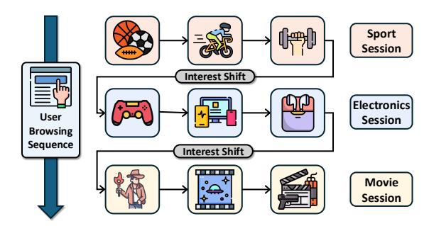
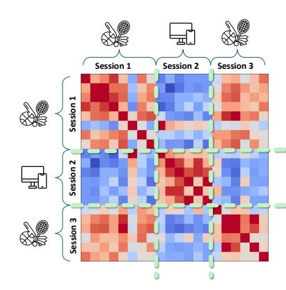
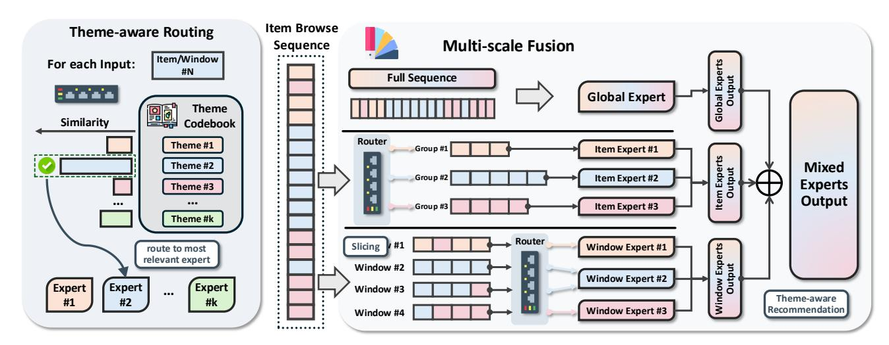
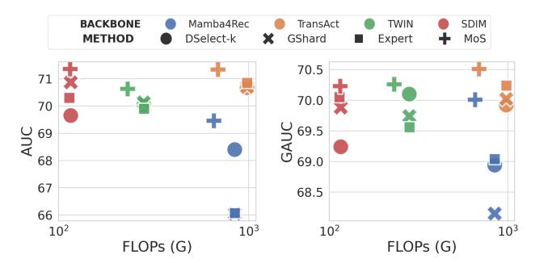
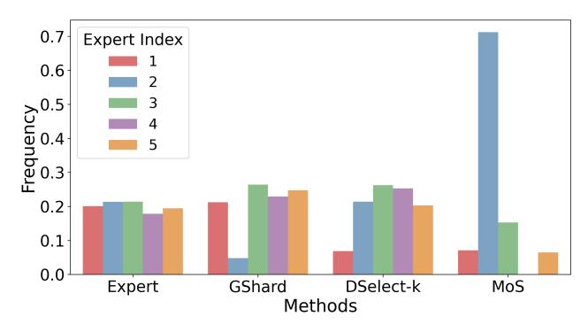
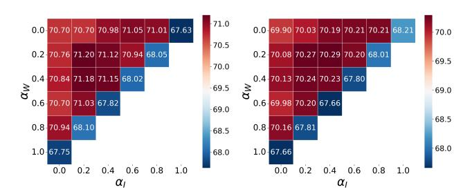
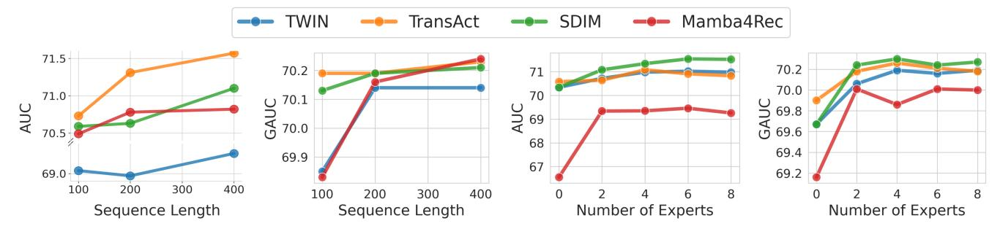
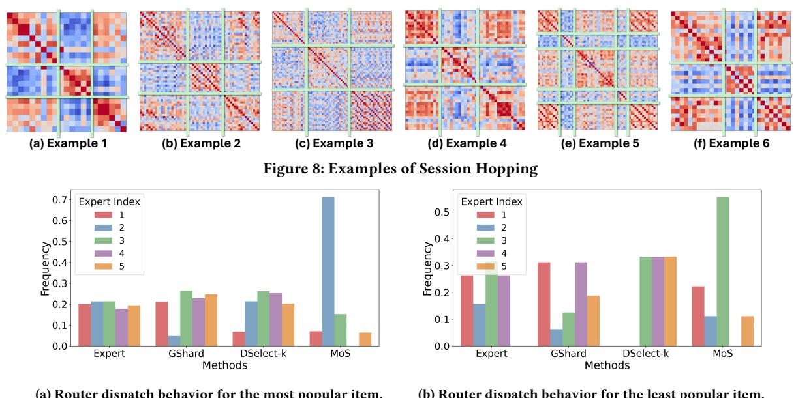

# Mixture of Sequence: Theme-Aware Mixture-of-Experts for Long-Sequence Recommendation

| Xiao Lin      |               |
|---------------|---------------|
| United States |               |
| Zhicheng Tang |               |
| United States |               |
| Weilin        | Cong,         |
| Mengyue       | Hang          |
| United        | States        |
|               | Kai Wang      |
|               | United States |
|               | Yajuan Wang   |
|               | United States |
| Zhichen Zeng, |               |
| Ting-Wei Li,  |               |
| Hyunsik Yoo   |               |
| United States |               |
| Zhining Liu,  |               |
| Xuying Ning,  |               |
| Ruizhong Qiu  |               |
| United States |               |
| Wen-Yen       | Chen,         |
| Shuo          | Chang,        |
| Rong          | Jin           |
| United        | States        |
|               | Huayu Li      |
|               | United States |
|               | Hanghang Tong |
|               | United States |

### Abstract

Sequential recommendation has emerged as a rapidly growing research area in click-through rate prediction due to its ability to capture dynamic user interests from historical interaction sequences. A key challenge, however, lies in modeling long sequences, where users often exhibit pronounced interest shifts, thereby introducing substantial irrelevant or even misleading information into the prediction process. Our empirical analysis corroborates this challenge and further uncovers a recurring behavioral pattern in long sequences, which we term the session hopping phenomenon: while user interests remain stable within a short temporal span, referred to as a session, they often exhibit drastic shifts across sessions and may reappear after multiple sessions. To address this challenge, we propose the Mixture of Sequence (MoS) framework, a model-agnostic MoE approach that achieves accurate predictions by extracting theme-specific and multi-scale subsequences from noisy raw user sequences. First, MoS employs a theme-aware routing mechanism to adaptively learn the latent themes of user sequences and organizes these sequences into multiple coherent subsequences. Each subsequence contains only sessions aligned with a specific theme, thereby effectively filtering out irrelevant or even misleading information introduced by user interest shifts in session hopping. In addition, to alleviate potential information loss caused by subsequence extraction, we introduce a multi-scale fusion mechanism, which leverages three types of experts to capture global sequence characteristics, short-term user behaviors, and theme-specific semantic patterns. Together, these two mechanisms endow MoS with the ability to deliver accurate recommendations from multi-faceted and multi-scale perspectives. Experimental results demonstrate that MoS consistently improves the performance of long-sequence recommendation models while introducing fewer FLOPs compared with other MoE counterparts, providing strong evidence of its excellent balance between utility and efficiency. The code is available at [https://github.com/xiaolin-cs/MoS.](https://github.com/xiaolin-cs/MoS)

# Keywords

Recommendation, Mixture of Experts, Sequence Modeling

### 1 Introduction

Click-through rate (CTR) prediction [\[153,](#page-11-0) [157,](#page-11-1) [158\]](#page-11-2) serves as a cornerstone in online advertising [\[105\]](#page-10-0) and recommender systems

[\[40,](#page-8-0) [41,](#page-8-1) [56,](#page-9-0) [58,](#page-9-1) [153,](#page-11-0) [157,](#page-11-1) [158\]](#page-11-2), enabling users to efficiently discover items of interest from an ever-growing pool of products [\[30\]](#page-8-2), videos [\[23,](#page-8-3) [155\]](#page-11-3), and applications [\[19\]](#page-8-4). In recent years, modeling user behavior sequences has proven to be a highly effective strategy for enhancing CTR performance, as such sequences capture rich temporal dynamics that reflect the evolution of user interests. This advantage has spurred substantial research interest in sequence recommendation [\[10,](#page-8-5) [17,](#page-8-6) [42,](#page-8-7) [95\]](#page-10-1). Furthermore, extending the sequence length is particularly appealing, as it allows models to exploit long-term behavioral patterns. Motivated by this, recent studies [\[6,](#page-8-8) [8,](#page-8-9) [12,](#page-8-10) [114\]](#page-10-2) have begun to investigate the feasibility of modeling very long sequences and have reported promising improvements.

Despite the advantages of leveraging long interaction sequences for CTR prediction, they introduce significant challenges. As user interests often undergo substantial shifts within long sequences [\[47,](#page-8-11) [49,](#page-9-2) [50\]](#page-9-3), many interactions become irrelevant to the current prediction or even inject misleading signals. For instance, on an e-commerce platform [\[135\]](#page-11-4), a user may simultaneously exhibit diverse interests, such as browsing both electronic devices and athletic equipment. An illustration is provided in Figure. [1.](#page-1-0) Ideally, when recommending an electronic product, the model should primarily focus on the subsequence associated with electronics while downweighting interactions w.r.t. unrelated interests, such as athletic equipment. However, if the model indiscriminately incorporates the entire sequence, misleading interactions can dominate the representation and ultimately lead to erroneous predictions [\[14,](#page-8-12) [55\]](#page-9-4). This issue motivates us to raise a critical question for long-sequence modeling.

How could a recommendation model, by focusing on strategically chosen subsets of a long sequence, gain complementary perspectives that lead to more accurate predictions?

To address this question, we investigate the distinctive behavioral patterns embedded in long sequential data. Through a comprehensive empirical analysis, we identify a phenomenon we term session hopping: user interests remain highly consistent within a short temporal span (a "session"), yet may shift abruptly across adjacent sessions and reappear after several sessions. This phenomenon clearly demonstrates the sudden and recurring transitions in user preferences, highlighting the substantial challenges it poses for long-sequence recommendation. Existing methods often rely on attention [\[6,](#page-8-8) [12,](#page-8-10) [114\]](#page-10-2), selective copying [\[67,](#page-9-5) [94\]](#page-10-3) or similar mechanisms

Figure 1: An illustration of user interests. The user undergoes two interest shifts, resulting in three clearly distinct sessions. Within each session, the browsing history reflects a consistent user interest.

[\[101\]](#page-10-4) to capture long-range dependencies, but these mechanisms are designed as continuous function approximators for smooth dynamics. As such, they struggle to fit the discontinuous signals from abrupt interest shifts and hence continue to exploit information from sessions prior to the shift. As illustrated in Figure [1,](#page-1-0) once an interest shift occurs, the items chosen by the user differ substantially from those in earlier sessions. Consequently, prior session information not only fails to provide useful guidance but may also mislead the prediction.

To address the challenges introduced by the session hopping phenomenon, we propose the Mixture of Sequence (MoS), a modelagnostic MoE framework that leverages subsequence extraction to selectively utilize informative sessions for accurate prediction. Intuitively, since similar sessions tend to reappear, these sessions can be grouped into subsequences that reflect specific themes of user behaviors (e.g., sports). By assigning a dedicated expert to each subsequence, MoS enables every expert to fully exploit informative sessions in the theme-aware subsequence while effectively filtering out misleading signals from other themes, thereby mitigating the negative effects of abrupt interest shifts. As a result, MoS serves as a versatile plug-in design that empowers existing sequential models to overcome the challenges posed by session hopping. Specifically, MoS consists of two key components: theme-aware routing and a multi-scale fusion mechanism. (1) The theme-aware routing mechanism introduces a router equipped with a codebook that defines user-behavior themes, allowing MoS to adaptively extract highly coherent, theme-specific subsequences from long interaction histories. (2) The multi-scale fusion mechanism mitigates the potential disruption of semantic and temporal continuity caused by subsequence extraction. It incorporates three types of experts that respectively capture global characteristics of the sequence, theme-specific patterns within subsequences, and short-term contiguous user behaviors. Together, these two components enable MoS to model user dynamics from multi-thematic and multi-scale perspectives, leading to more accurate sequential recommendations.

In summary, our main contributions are as follows:

- Observation. We empirically demonstrate the existence of the session hopping phenomenon on real-world data, which

manifests as both abrupt shifts and reappearance of user interests, thereby highlighting the inherent challenges of modeling long-sequence recommendation.

- Algorithm. As a model-agnostic MoE method, MoS introduces a router that perform adaptive theme-aware subsequence extraction, and leverages three types of experts to jointly capture global, short-term, and semantic characteristics. These designs enable accurate recommendations even in the presence of highly noisy long-sequence data.
- Experiment. We conduct extensive experiments on three real-world datasets. The results show that MoS consistently improves performance across four sequence recommendation backbones, yielding an average gain of 0.68% in AUC and 0.72% in GAUC. MoS surpasses all other MoE methods while requiring fewer FLOPs, demonstrating an excellent balance between utility and efficiency.

# 2 Preliminary

# 2.1 Sequential Recommendation

Let U and V denote the sets of users and items, respectively, with �� ∈ U and �� ∈ V representing a specific user and item. We use |U| and |V | to denote the sizes of these sets. For each user ��, we define the interaction history as a chronologically ordered sequence S�� = (��1,��, ��2,��, . . . , ����,��) where ����,�� is the ��-th interacted item and �� is the sequence length for user ��. For notational simplicity, we use ���� to denote ����,�� and S to denote S�� in the following. Given a user interaction sequence S, the objective of sequential recommendation is to predict the next item the user will interact with at time step �� + 1. Formally, the task can be expressed as:

∗ ��+1 = arg max ��∈V �� (��|S; Θ) (1)

where Θ denotes the model parameters.

# 2.2 Sparse Mixture of Experts

For a sparse MoE model with �� experts {�� (1) , . . . , �� (��) }, a learnable sparse router��(·) is leveraged to decide which experts are activated for a given item embedding ��. The model prediction is a weighted combination of expert outputs, i.e., �� = Í�� ��=1 ��(��) [��]�� (��) (��) where ��(��) [��] denotes the ��-th element of ��(��), i.e., the routing weight assigned to expert ���� . In practice,��(·) is parameterized by a scoring network ��(·) that produces relevance scores of experts. To enforce sparsity, only the top-�� experts with the highest scores are selected:

��(��) = softmax(KeepTopK(��(��), ��)) (2)

where KeepTopK(��, ��) preserves the �� largest elements of �� and replaces the rest with −∞.

# 3 Session Hopping

To better understand the challenges of long-sequence modeling, we conduct a case study on real-world datasets. Specifically, we compute the self-similarity matrix of user interaction history using cosine similarity. A representative heatmap of user behavior is shown in Figure [2,](#page-2-0) with more examples provided in Appendix [A.](#page-11-5) From Figure [2,](#page-2-0) we can clearly identify a distinctive user behavior pattern, which we term the session hopping phenomenon. This phenomenon is characterized by three properties: (1) Stability. User

Figure 2: Heatmap of the self-similarity matrix for a representative user transaction history. Red indicates high similarity, blue indicates low similarity, and green lines denote session boundaries.

interests remain highly consistent and stable within a short temporal span (a session), as indicated by the red area of Figure [2;](#page-2-0) (2) Discontinuity. User interests undergo abrupt and discontinuous shifts across sessions, reflected in the sharp red–blue boundary in Figure [2;](#page-2-0) (3) Reappearance. User interests may reappear after several sessions, as indicated by the strong similarity between the first and third sessions, both highlighted in red. This pattern closely aligns with everyday user behavior. For instance, when purchasing a computer, users often buy related accessories such as a mouse or keyboard within a short period of time. Once these needs are fulfilled, however, their interest in electronics typically drops, and attention shifts abruptly to unrelated categories. After some time, users may once again develop interest in electronics, such as upgrading to a better mouse. A clear illustration is provided in Figure [1.](#page-1-0) In summary, we formalize this phenomenon as follows:

Phenomenon 1. (Session Hopping) User interests remain highly consistent within a session but differ substantially across adjacent sessions. Moreover, similar user interests may reappear across nonadjacent sessions.

This phenomenon illustrates both the opportunities and challenges of long-sequence recommendation. On the one hand, the reappearance property of session hopping suggests that certain user behavior patterns tend to recur over time. These recurring patterns provide valuable cues for predicting the next item, and compared with short-sequence settings, long-sequence data offer richer opportunities to observe such recurring sessions, thereby holding substantial potential for improving predictive accuracy. On the other hand, the discontinuity inherent in session hopping introduces significant modeling challenges. Mainstream sequential recommendation models, such as RNN-based [\[101\]](#page-10-4), Mamba-based [\[67,](#page-9-5) [94\]](#page-10-3), and Transformer-based architectures [\[6,](#page-8-8) [12,](#page-8-10) [114\]](#page-10-2), rely on continuous functions during forward propagation and thus lack mechanisms explicitly designed to capture abrupt, non-continuous shifts in user interests. When fitting such discontinuous signals with models designed smooth dynamics [\[7,](#page-8-13) [83\]](#page-9-6), approximation errors naturally arise. In recommendation scenarios, when a sudden shift in user interest occurs, the content of preceding sessions may differ drastically from the current intent. As a result, earlier sessions not only fail to provide useful information but may even mislead the prediction. Taking Transformer-based models as an example, although attention mechanisms can partially down-weight irrelevant interactions, it is practically impossible for them to assign zero

attention weights to all unrelated sessions preceding a shift. Consequently, the model is highly likely to attend to misleading contexts, thereby incorporating harmful information into recommendation decisions. In summary, current sequential recommendation models face a fundamental trade-off: leveraging as much informative historical context as possible while mitigating the adverse influence of misleading information in long sequences.

### 4 Methodology

To address the problem introduced by session hopping, we propose MoS framework, which adaptively selects highly coherent subsequences at multiple scales to provide diverse perspectives for accurate prediction. MoS is built upon two key mechanisms: the theme-aware routing mechanism in Section [4.1](#page-2-1) and the multi-scale fusion mechanism in Section [4.2.](#page-3-0) Furthermore, we discuss the training paradigm of MoS in Section [4.3](#page-4-0) and analyze its computational efficiency in Section [4.4.](#page-4-1) The pipeline of MoS is shown in Figure [3.](#page-3-1)

# 4.1 Theme-aware Routing

The session hopping phenomenon introduces substantial difficulties for long-sequence recommendation, and existing approaches struggle to precisely capture such user behavior patterns. However, we propose that a simple yet elegant solution is subsequence extraction. Since user interests remain relatively stable within a session and similar sessions often reappear, these sessions reflect a particular user interest or a combination of closely related interests. If we define such interests as a special "theme" (e.g., sports), then these sessions can be regarded as a subsequence aligned with that theme. Furthermore, if a long user sequence can be ideally decomposed into multiple subsequences according to themes, then temporally adjacent but semantically irrelevant sessions are automatically separated into different sequences, thereby effectively reducing the disruptive impact of sudden interest shifts.

The idea of subsequence extraction naturally aligns with the MoE framework. By assigning individual experts to model each subsequence, every expert is able to capture long-range dependencies across sessions in a theme-aware subsequence while effectively ignoring irrelevant information.

Model architecture. Based on the above intuition, we employ a router to adaptively extract multiple subsequences, each of which is then processed by a dedicated expert. Formally, given a router ��(·) and a user sequence S, the subsequence assigned to expert �� is defined as S := (��|��(���� ) [��] &gt; 0, �� ∈ S) with ���� being the embedding of the item ��. This dispatch process needs to satisfy two key properties: (1) Sparsity. To avoid the influence of misleading sessions, each expert should only have access to the corresponding subsequence instead of the entire sequence. Hence, a sparse MoE is leveraged by MoS rather than a dense MoE. (2) Cohesion. The subsequence assigned to an expert should be semantically coherent and aligned with a consistent theme, which imposes strong requirements on the router design. However, empirical evidence shows that conventional routers (e.g., MLPs or linear layers) fail to fulfill this requirement, as they tend to distribute items uniformly across experts rather than making theme-aware assignments. To address this limitation, we propose the theme-aware routing mechanism, which maintains a theme codebook �� ∈ R ��×�� with �� being the dimension of the codebook and �� being the number of experts.

Figure 3: The pipeline of MoS. The left panel illustrates theme-aware routing, which assigns inputs to experts according to theme vectors in the codebook. The right panel shows multi-scale fusion, which models user behaviors by extracting subsequences at different granularities from the full sequence.

Here, the ��-th row of the codebook describes the theme feature associated with the ��-th expert. Given an item embedding ��, MoS first projects �� into the theme space via a learnable MLP ℎ(·), and then computes its cosine similarity with each entry of the codebook to obtain the relevance scores. Formally, the scoring network ��(·) of the theme-aware router can be expressed as:

��(��) = ∥ℎ(��) ∥2 √︃ diag(������ ) −1 ��ℎ(��) (3)

where diag(·) preserves only diagonal elements while setting other elements to zero. Mathematically, equation [3](#page-3-2) could easily ensure the following proposition with its proof provided in Appendix [B.](#page-11-6)

Proposition 1. (Theme-aware Dispatch) A subsequence with high internal similarity will be consistently routed to the same expert.

Optimization. Although Proposition [1](#page-3-3) theoretically guarantees the feasibility of the router, in practice the codebook �� cannot be trained by gradient updates under joint optimization. This is because the codebook and the learnable MLP tend to collapse into a single MLP due to linearity during joint training, thereby undermining the intended role of the codebook. To address this problem, inspired by VQ-VAE [\[99\]](#page-10-5), we update the codebook using an exponential moving average (EMA):

�� (��) = ���� (��−1) + (1 −��) Í ��∈ B 1 (��(��) [��] &gt; 0) ℎ(��) Í ��∈ B 1 (��(��) [��] &gt; 0) (4)

where B is a batch sampled from the dataset. In this way, although the item embeddings evolve throughout training, each entry of the codebook adaptively tracks the centroid of item embeddings under its corresponding theme, thereby maintaining stable and meaningful theme representations.

Initialization. A notable limitation of EMA is that if two entries are initialized too closely, they tend to collapse toward each other during the updating process, thereby reducing the diversity of the codebook. To mitigate this issue, it is essential to adopt an initialization strategy that ensures sufficient differentiation among themes. Specifically, we first estimate the distribution of item embeddings using a pretrained embedding layer, and then apply ��-means clustering to obtain �� cluster centroids, which are subsequently used as the initial values of rows in the codebook.

### 4.2 Multi-scale Fusion

A notable limitation of theme-aware routing is that subsequence extraction disrupts temporal dependencies. As a result, information about users' evolving preferences is largely ignored, and the model becomes biased toward recommending items that shows high semantic similarity rather than capturing dynamic behavioral shifts. This issue arises because the extraction process focuses solely on semantic coherence while neglecting temporal continuity. To remedy this, we introduce a multi-scale fusion mechanism that leverages a global expert, item experts, and window experts to capture temporal information at different granularities.

Global Expert. The objective of the global expert is to effectively extract global features from the sequence, thereby capturing users' globally drifted interests and modeling their evolving preferences. To this end, the global expert directly takes the entire historical sequence as input, without relying on subsequence extraction. When only the global expert is activated, the model naturally degenerates into the non-MoE backbone. Concretely, given any model with a repeated block structure, if we treat one block �� (·) as an expert, the output of the global expert ���� can be expressed as:

���� = �� (X (S)) (5)

where S := (��1, . . . , ���� ) denotes a user historical sequence and X (S) := (����1 , . . . , ������ ) denotes the corresponding embedding sequence with ������ being the embedding of the item ���� .

Item Experts. The goal of the item experts is to deliver finegrained and accurate recommendations by decomposing user behaviors into multiple latent themes and analyzing the theme-aware

in Appendix [C.2.](#page-12-1) For AUC and GAUC, higher values indicate better performance, whereas for FLOPs, lower values are preferred.

Models. We demonstrate the superiority of MoS from two perspectives: routing strategy and multi-scale fusion. From the routing perspective, we compare MoS with three MoE baselines, namely GShard [\[52\]](#page-9-7), DSelect-k [\[33\]](#page-8-15), and Expert Choice Routing [\[159\]](#page-11-7), and leverage them on four different sequence recommendation models as backbones: Mamba4Rec [\[67\]](#page-9-5), TransAct [\[114\]](#page-10-2), TWIN [\[12\]](#page-8-10), and SDIM [\[6\]](#page-8-8). These backbones cover both Transformer-based and Mamba-based architectures. From the multi-scale fusion perspective, we further compare MoS with long-sequence recommendation models that adopt similar fusion designs, including MIRRN [\[122\]](#page-10-6), AttenMixer [\[148\]](#page-11-8), and MiasRec [\[22\]](#page-8-17).

Parameter Settings. Unless otherwise specified, we follow the default hyperparameter settings provided in the released code of the BARS Benchmark [\[160\]](#page-11-9) [1](#page-5-0) . We adopt the Adam optimizer [\[45\]](#page-8-18) to train all models, with the initial learning rate tuned from {1e-4, 5e-4, 1e-3}. For MoS, the codebook dimension is searched from {16, 32, 64}, and a 2-layer MLP is used as ℎ(·). The EMA update weight �� is set to 0.999. For the window experts, we set the stride to 4 and the window size to 8. The multi-scale fusion weights are fixed at ���� = ���� = 0.25. For all MoE routers, the number of experts is set to 5, and the number of experts selected by the router �� is tuned from {1, 2}. All experiments are conducted on NVIDIA A100 GPUs.

# 5.2 Experimental Results

Main results. The primary utility evaluation results are summarized in Table [1](#page-6-0) and Table [2.](#page-6-1) (1) Table [1](#page-6-0) compares MoS with other MoE methods, highlighting the superiority of its routing strategy. Across diverse backbones, MoS consistently delivers overall performance gains on both AUC and GAUC, achieving an average improvement of 0.68% in AUC and 0.72% in GAUC. Specifically, MoS attains the top rank in AUC and GAUC across all datasets, with average ranks of 1 / 1 / 1 / 1 for AUC and 1 / 1 / 1 / 1.33 for GAUC across the four backbones. In certain cases, the improvement is particularly pronounced. For instance, on the MicroVideo dataset, MoS improves the performance of Mamba4Rec by 2.91% in AUC and 0.85% in GAUC. (2) Table [2](#page-6-1) further compares MoS with sequential recommendation models that adopt similar fusion designs. Across all datasets, models enhanced with MoS consistently achieve both the first and second highest ranks, maintaining a clear performance margin over the remaining backbones. On three datasets, the best-performing MoS variants surpass the strongest baseline by 2.39 (1.62), 1.68 (2.60), and 1.87 (1.70) in AUC (GAUC), respectively. These results collectively demonstrate the superiority of MoS in enhancing predictive performance. Importantly, this advantage is not tied to a specific architecture but generalizes robustly across heterogeneous backbones.

Efficiency Analysis. To evaluate the tradeoff between utility and efficiency of MoS, we compare it with all MoE methods using the same number of experts on the MicroVideo dataset across four backbones. The results are presented in Figure [4,](#page-5-1) where colors denote

Figure 4: Trade-off between utility and efficiency. MoS achieves superior utility–efficiency balance, appearing closer to the upper-left region for every backbone (color).

Figure 5: Dispatch behavior of routers for the most popular item. MoS consistently routes the popular item to a fixed expert, indicating strong consistency of theme-aware routing and clear expert specialization compared to other routers.

different backbones and shapes correspond to different MoE methods. As shown, MoS achieves a highly competitive tradeoff, with all of its cross markers positioned near the upper-left corner across all backbones. More concretely, MoS consistently delivers the best utility (both AUC and GAUC), outperforming all baselines on every backbone. At the same time, compared with all MoE methods, MoS achieves the lowest FLOPs, indicating that its subsequence extraction mechanism is highly efficient. These findings collectively demonstrate the superiority of MoS in balancing performance and efficiency.

Routing Behavior Analysis. We analyze the dispatch behavior of routers from all MoE variants to understand why MoS consistently achieves superior performance on recommendation datasets. On the MicroVideo dataset, we select the most popular item, i.e., the item most frequently interacted with by all users, and then track how different MoE variants assign it to experts. Using the TransAct backbone, we record the expert selected for this item each time it appears and compute the dispatch frequency for each expert, as shown in Figure [5.](#page-5-2) The results reveal that MoS consistently routes the popular item to a fixed expert (here, expert #2), demonstrating strong theme-aware consistency and clear expert specialization. In contrast, other MoE variants tend to distribute the same item almost uniformly across all experts. This uniformity indicates insufficient differentiation among experts, which in turn leads to degraded recommendation performance. More detailed explanation and analyses of routing behaviors are provided in Appendix [D.](#page-13-0)

1<https://github.com/reczoo/LongCTR>

Table 1: Main evaluation of model utility on sequential recommendation. Higher AUC and GAUC values indicate better performance. Utility performance as well as the average ranking are reported on four sequential recommendation backbones, comparing MoS with three MoE baselines and the vanilla backbone (without MoE enhancement). Red font highlights the best performance, while blue font denotes the second best. Numbers in parentheses indicate the performance gain brought by MoE.

| Dataset Backbone Method |       | AUC     | MicroVideo | GAUC    |       | AUC     | KuaiVideo | GAUC    |       | AUC     | Ebnerd | GAUC    | AUC  | Rank GAUC |
|-------------------------|-------|---------|------------|---------|-------|---------|-----------|---------|-------|---------|--------|---------|------|-----------|
| Vanilla Mamba4Rec       | 66.55 |         | 69.16      |         | 66.27 |         | 66.26     |         | 63.08 |         | 62.68  |         | 4.00 | 2.67      |
| DSelect-k               | 68.40 | (+1.85) | 68.94      | (-0.22) | 66.48 | (+0.21) | 66.22     | (-0.04) | 63.59 | (+0.51) | 62.50  | (-0.18) | 2.00 | 4.00      |
| GShard                  | 66.05 | (-0.50) | 68.15      | (-1.01) | 65.89 | (-0.38) | 65.74     | (-0.52) | 63.26 | (+0.18) | 63.79  | (+1.11) | 4.67 | 4.33      |
| Expert                  | 66.07 | (-0.48) | 69.04      | (-0.12) | 66.29 | (+0.02) | 66.06     | (-0.20) | 63.56 | (+0.48) | 64.18  | (+1.50) | 3.33 | 3.00      |
| MoS                     | 69.46 | (+2.91) | 70.01      | (+0.85) | 66.67 | (+0.40) | 66.67     | (+0.41) | 64.07 | (+0.99) | 64.54  | (+1.86) | 1.00 | 1.00      |
| Vanilla TransAct        | 70.58 |         | 69.90      |         | 67.67 |         | 65.92     |         | 70.89 |         | 70.25  |         | 3.33 | 3.67      |
| DSelect-k               | 70.67 | (+0.09) | 69.92      | (+0.02) | 67.87 | (+0.20) | 65.38     | (-0.54) | 70.68 | (-0.21) | 70.30  | (+0.05) | 3.67 | 3.33      |
| GShard                  | 70.70 | (+0.12) | 70.02      | (+0.12) | 67.62 | (-0.05) | 65.42     | (-0.50) | 70.69 | (-0.20) | 70.08  | (-0.17) | 3.67 | 3.67      |
| Expert                  | 70.85 | (+0.27) | 70.24      | (+0.34) | 67.52 | (-0.15) | 65.28     | (-0.64) | 70.87 | (-0.02) | 70.27  | (+0.02) | 3.33 | 3.33      |
| MoS                     | 71.34 | (+0.76) | 70.51      | (+0.61) | 67.90 | (+0.23) | 68.10     | (+2.18) | 71.06 | (+0.17) | 70.71  | (+0.46) | 1.00 | 1.00      |
| Vanilla                 | 70.34 |         | 69.67      |         | 69.36 |         | 66.60     |         | 69.85 |         | 69.54  |         | 2.33 | 3.67      |
| DSelect-k TWIN          | 70.02 | (-0.32) | 70.10      | (+0.43) | 68.96 | (-0.40) | 66.64     | (+0.04) | 69.40 | (-0.45) | 68.99  | (-0.55) | 4.00 | 3.00      |
| GShard                  | 70.13 | (-0.21) | 69.74      | (+0.07) | 68.84 | (-0.52) | 66.62     | (+0.02) | 70.10 | (+0.25) | 69.58  | (+0.04) | 3.33 | 2.67      |
| Expert                  | 69.90 | (-0.44) | 69.56      | (-0.11) | 68.96 | (-0.40) | 66.34     | (-0.26) | 69.80 | (-0.05) | 69.33  | (-0.21) | 4.00 | 4.67      |
| MoS                     | 71.11 | (+0.77) | 70.26      | (+0.59) | 69.62 | (+0.26) | 66.89     | (+0.29) | 70.30 | (+0.45) | 69.81  | (+0.27) | 1.00 | 1.00      |
| Vanilla                 | 70.50 |         | 69.62      |         | 68.56 |         | 66.61     |         | 69.63 |         | 69.03  |         | 3.00 | 4.00      |
| DSelect-k SDIM          | 69.65 | (-0.85) | 69.24      | (-0.38) | 68.78 | (+0.22) | 66.48     | (-0.13) | 69.47 | (-0.16) | 69.07  | (+0.04) | 4.00 | 4.33      |
| GShard                  | 70.87 | (+0.37) | 69.88      | (+0.26) | 68.90 | (+0.34) | 66.52     | (-0.09) | 69.47 | (-0.16) | 69.07  | (+0.04) | 2.33 | 3.33      |
| Expert                  | 70.30 | (-0.20) | 70.05      | (+0.43) | 68.85 | (+0.29) | 66.66     | (+0.05) | 69.40 | (-0.23) | 69.13  | (+0.10) | 4.00 | 2.00      |
| MoS                     | 71.36 | (+0.86) | 70.23      | (+0.61) | 69.38 | (+0.82) | 66.75     | (+0.14) | 69.49 | (-0.14) | 69.40  | (+0.37) | 1.33 | 1.00      |

Table 2: Performance comparison between MoS and baselines employing similar multi-scale fusion architectures.

| Method Baseline | AUC   | MicroVideo GAUC | AUC   | KuaiVideo GAUC | AUC   | Ebnerd GAUC |
|-----------------|-------|-----------------|-------|----------------|-------|-------------|
| MIRRN           | 67.17 | 68.74           | 67.94 | 65.5           | 69.19 | 69.01       |
| MiasRec         | 68.67 | 67.83           | 65.05 | 64.70          | 55.95 | 55.45       |
| AttenMixer      | 68.97 | 68.89           | 66.95 | 64.18          | 62.37 | 62.29       |
| TWIN MoS        | 70.83 | 70.26           | 69.62 | 66.89          | 66.89 | 69.81       |
| SDIM            | 71.36 | 70.23           | 69.38 | 66.75          | 69.49 | 69.49       |
| TransAct        | 71.34 | 70.51           | 67.90 | 68.10          | 71.06 | 70.71       |
| Mamba4Rec       | 69.46 | 70.01           | 66.67 | 66.67          | 64.07 | 64.54       |

### 5.3 Ablation Studies

Impact of multi-scale fusion. To examine the contributions of global, item, and window experts to prediction performance, we conduct an ablation study by varying ���� and ���� over 0, 0.2, 0.4, 0.6, 0.8, 1. The corresponding AUC and GAUC results are shown in Figure [6.](#page-6-2) From these results, two clear conclusions can be drawn:

(1) The multi-scale fusion mechanism effectively enhances recommendation performance.As shown in Figure [6,](#page-6-2) the heatmap corresponds to an upper-triangular region constrained by ���� +���� ≤ 1, where the vertices represent the use of single type of experts, the edges correspond to pairwise fusion of any two expert types,

(a) Impact of ���� and ���� on AUC.(b) Impact of ���� and ���� on GAUC.

Figure 6: Impact of ���� and ���� on model utility.

and the interior region denotes full fusion of all experts. It is evident that full fusion consistently achieves the best results, while pairwise fusion outperforms using the single expert. This observation suggests that although the global expert alone already provides strong representations for recommendations, the three types of experts capture complementary behavioral patterns and offer diverse analytical perspectives, thus leading to consistent performance gains when fused.

(2) The multi-scale fusion mechanism exhibits strong robustness. When all experts are fused, corresponding to the interior region of the triangle, the model performance remains consistently high without noticeable fluctuations. The AUC (GAUC) varies only

Figure 7: Scaling study of MoS. MoS consistently enhances AUC/GAUC with increased sequence length and number of experts.

within a narrow range from 70.94% (70.20%) to 71.20% (70.27%). The insensitivity of performance to ���� and ���� demonstrates the strong robustness of the multi-scale fusion mechanism.

Scaling on the sequence length. To assess the effectiveness of MoS in long-sequence recommendation, we vary the input sequence length on the MicroVideo dataset from 100 to 400 and set the number of experts as 5. As shown in Figure [7,](#page-7-0) both AUC and GAUC increase steadily with longer sequences across all four backbones. This trend confirms that MoS's strategy of decomposing long sequences into shorter, theme-coherent subsequences effectively alleviates the impact of irrelevant information and training difficulty, resulting in superior and stable performance.

Scaling on the number of experts. To examine the impact of the number of experts in MoS, we gradually increase the number of experts from 0 to 8 on the MicroVideo dataset with the sequence length of 200. As shown in Figure [7,](#page-7-0) model performance, including both AUC and GAUC, improves as the number of experts increases, but the improvement trend slows markedly once the number exceeds four. This phenomenon may be related to the underlying number of latent themes. When the number of experts is small, adding more experts effectively introduces additional themes, which helps to separate unrelated items or sessions and thereby enhances model performance. However, when the number of experts becomes sufficiently large, further increases lead to overly fine-grained distinctions between themes, causing many informative items to be split across different experts. As a result, the effective information within subsequences diminishes, producing performance saturation while increasing computational cost. These findings suggest that an appropriate number of experts yields beneficial effects for MoS.

### 6 Related Work

# 6.1 Click-Through Rate Prediction

CTR [\[20,](#page-8-19) [31,](#page-8-20) [123\]](#page-10-7) prediction is a fundamental task in online advertising, aiming to estimate the probability that a user clicks on a given item or ad. A dominant paradigm is feature-interaction-based modeling, which typically follows the embedding–interaction–prediction pipeline. Early works [\[89\]](#page-9-10) capture low-order interactions, while Wide&Deep [\[20\]](#page-8-19) and DeepFM [\[31\]](#page-8-20) extend to higher-order with deep neural networks. More advanced designs include cross networks [\[54\]](#page-9-11), graph-based [\[80\]](#page-9-12) and attention-based models [\[92,](#page-10-8) [123\]](#page-10-7).

# 6.2 Sequential Recommendation

Sequential recommendation [\[35,](#page-8-21) [43\]](#page-8-22) aims to predict the next item a user will interact with based on their historical behavior sequence. Advances in deep learning have driven the development of diverse models that capture sequential dependencies and uncover latent user interest from historical interactions. Representative approaches include Convolutional Neural Networks (CNNs) [\[98\]](#page-10-9), Recurrent Neural Networks (RNNs) [\[36,](#page-8-23) [142\]](#page-11-10), Transformer-based models [\[44,](#page-8-24) [96,](#page-10-10) [151\]](#page-11-11), and Graph Neural Networks (GNNs) [\[11,](#page-8-25) [32,](#page-8-26) [113,](#page-10-11) [134\]](#page-11-12), all of which have been widely adopted to improve recommendation performance. In addition, self-supervised learning has become a key paradigm in sequential recommendation [\[18,](#page-8-27) [87,](#page-9-13) [115,](#page-10-12) [150\]](#page-11-13), where contrastive objectives are applied to improve representation learning from unlabeled sequences. More recently, research on long-term user behavior modeling [\[12,](#page-8-10) [67,](#page-9-5) [71,](#page-9-14) [114\]](#page-10-2) has focused on improving efficiency and scalability under strict latency constraints. Representative directions include sampling-based hashing methods like SDIM [\[6\]](#page-8-8), architecture innovations such as Mamba4Rec [\[67\]](#page-9-5), industrial hybrid solutions like TransAct [\[114\]](#page-10-2), and life-long user modeling approaches such as TWIN [\[12\]](#page-8-10), which advance the balance between effectiveness and efficiency in longterm sequential modeling. Our method provides a plug-and-play solution that can be integrated into existing long-sequence recommendation models.

### 7 Conclusion

In this paper, we identify the session hopping phenomenon, which characterizes the stability, discontinuity, and recurrence of user interests—revealing the intrinsic challenges of long-sequence modeling. To address this issue, we propose MoS, a framework that extracts multi-scale, theme-consistent subsequences for accurate prediction. MoS introduces a theme-aware router that learns latent user-interest themes via a special-designed codebook and extracts theme-specific subsequences accordingly. It further employs a multi-scale fusion mechanism with three types of experts to capture global, short-term, and semantic representations for improved prediction. Extensive experiments show that MoS consistently enhances existing long-sequence recommendation models, outperforming other MoE approaches while requiring fewer FLOPs, demonstrating an excellent balance between utility and efficiency.

### References

- [1] Mengting Ai, Tianxin Wei, Yifan Chen, Zhichen Zeng, Ritchie Zhao, Girish Varatkar, Bita Darvish Rouhani, Xianfeng Tang, Hanghang Tong, and Jingrui He. 2025. ResMoE: Space-efficient Compression of Mixture of Experts LLMs via Residual Restoration. In Proceedings of the 31st ACM SIGKDD Conference on Knowledge Discovery and Data Mining V. 1. 1–12. [2] Yikun Ban, Yuchen Yan, Arindam Banerjee, and Jingrui He. 2021. Ee-net: Exploitation-exploration neural networks in contextual bandits. arXiv preprint arXiv:2110.03177 (2021). [3] Yuanchen Bei, Weizhi Zhang, Siwen Wang, et al. 2025. Graphs Meet AI Agents: Taxonomy, Progress, and Future Opportunities. arXiv preprint arXiv:2506.18019 (2025). [4] Shuqing Bian, Xingyu Pan, Wayne Xin Zhao, Jinpeng Wang, Chuyuan Wang, and Ji-Rong Wen. 2023. Multi-modal mixture of experts represetation learning for sequential recommendation. In Proceedings of the 32nd ACM international conference on information and knowledge management. 110–119. [5] Xuheng Cai, Chao Huang, Lianghao Xia, and Xubin Ren. 2023. LightGCL: Simple yet effective graph contrastive learning for recommendation. arXiv preprint arXiv:2302.08191 (2023). [6] Yue Cao, Xiaojiang Zhou, Jiaqi Feng, Peihao Huang, Yao Xiao, Dayao Chen, and Sheng Chen. 2022. Sampling is all you need on modeling long-term user behaviors for CTR prediction. In Proceedings of the 31st ACM International Conference on Information & Knowledge Management. 2974–2983. [7] Valérie Castin, Pierre Ablin, and Gabriel Peyré. 2023. How smooth is attention? arXiv preprint arXiv:2312.14820 (2023). [8] Zheng Chai, Qin Ren, Xijun Xiao, et al. 2025. Longer: Scaling up long sequence modeling in industrial recommenders. In Proceedings of the Nineteenth ACM Conference on Recommender Systems. 247–256. [9] Jianxin Chang, Chen Gao, Xiangnan He, Depeng Jin, and Yong Li. 2020. Bundle recommendation with graph convolutional networks. In Proceedings of the 43rd international ACM SIGIR conference on Research and development in Information Retrieval. 1673–1676. [10] Jianxin Chang, Chen Gao, Yu Zheng, Yiqun Hui, Yanan Niu, Yang Song, Depeng Jin, and Yong Li. 2021. Sequential recommendation with graph neural networks. In Proceedings of the 44th international ACM SIGIR conference on research and development in information retrieval. 378–387. [11] Jianxin Chang, Chen Gao, Yu Zheng, Yiqun Hui, Yanan Niu, Yang Song, Depeng Jin, and Yong Li. 2021. Sequential recommendation with graph neural networks. In Proceedings of the 44th international ACM SIGIR conference on research and development in information retrieval. 378–387. [12] Jianxin Chang, Chenbin Zhang, Zhiyi Fu, Xiaoxue Zang, Lin Guan, Jing Lu, Yiqun Hui, Dewei Leng, Yanan Niu, Yang Song, et al. 2023. TWIN: TWo-stage interest network for lifelong user behavior modeling in CTR prediction at kuaishou. In Proceedings of the 29th ACM SIGKDD Conference on Knowledge Discovery and Data Mining. 3785–3794. [13] Hao Chen, Yuanchen Bei, Qijie Shen, Yue Xu, Sheng Zhou, Wenbing Huang, Feiran Huang, Senzhang Wang, and Xiao Huang. 2024. Macro graph neural networks for online billion-scale recommender systems. In Proceedings of the ACM web conference 2024. 3598–3608. [14] Hong Chen, Yudong Chen, Xin Wang, et al. 2021. Curriculum disentangled recommendation with noisy multi-feedback. NeurIPS 34 (2021), 26924–26936. [15] Huiyuan Chen, Zhe Xu, Chin-Chia Michael Yeh, Vivian Lai, Yan Zheng, Minghua Xu, and Hanghang Tong. 2024. Masked graph transformer for large-scale recommendation. In Proceedings of the 47th International ACM SIGIR Conference on Research and Development in Information Retrieval. 2502–2506. [16] Xusong Chen, Dong Liu, Zheng-Jun Zha, Wengang Zhou, Zhiwei Xiong, and Yan
- Li. 2018. Temporal hierarchical attention at category-and item-level for microvideo click-through prediction. In Proceedings of the 26th ACM international conference on Multimedia. 1146–1153. [17] Xu Chen, Hongteng Xu, Yongfeng Zhang, et al. 2018. Sequential recommendation with user memory networks. In Proceedings of the eleventh ACM international conference on web search and data mining. 108–116. [18] Yongjun Chen, Zhiwei Liu, Jia Li, Julian McAuley, and Caiming Xiong. 2022. Intent contrastive learning for sequential recommendation. In Proceedings of the ACM Web Conference 2022. 2172–2182. [19] Heng-Tze Cheng, Levent Koc, Jeremiah Harmsen, et al. 2016. Wide & deep learning for recommender systems. In Proceedings of the 1st workshop on deep learning for recommender systems. 7–10. [20] Heng-Tze Cheng, Levent Koc, Jeremiah Harmsen, Tal Shaked, Tushar Chandra, Hrishi Aradhye, Glen Anderson, Greg Corrado, Wei Chai, Mustafa Ispir, et al. 2016. Wide & deep learning for recommender systems. In Proceedings of the 1st workshop on deep learning for recommender systems. 7–10. [21] Zewen Chi, Li Dong, Shaohan Huang, Damai Dai, Shuming Ma, Barun Patra, Saksham Singhal, Payal Bajaj, Xia Song, Xian-Ling Mao, et al. 2022. On the representation collapse of sparse mixture of experts. Advances in Neural Information Processing Systems 35 (2022), 34600–34613. [22] Minjin Choi, Hye-young Kim, Hyunsouk Cho, and Jongwuk Lee. 2024. Multiintent-aware Session-based Recommendation. arXiv preprint arXiv:2405.00986 (2024). [23] Paul Covington, Jay Adams, and Emre Sargin. 2016. Deep neural networks for youtube recommendations. In Proceedings of the 10th ACM conference on recommender systems. 191–198. [24] Damai Dai, Chengqi Deng, Chenggang Zhao, et al. 2024. Deepseekmoe: Towards ultimate expert specialization in mixture-of-experts language models. arXiv preprint arXiv:2401.06066 (2024). [25] Kaize Ding, Zhe Xu, Hanghang Tong, and Huan Liu. 2022. Data augmentation for deep graph learning: A survey. ACM SIGKDD Explorations Newsletter 24, 2 (2022), 61–77. [26] Nan Du, Yanping Huang, Andrew M Dai, Simon Tong, Dmitry Lepikhin, Yuanzhong Xu, Maxim Krikun, Yanqi Zhou, Adams Wei Yu, Orhan Firat, et al. 2022. Glam: Efficient scaling of language models with mixture-of-experts. In International Conference on Machine Learning. PMLR, 5547–5569. [27] Wenqi Fan, Yao Ma, Qing Li, Yuan He, Eric Zhao, Jiliang Tang, and Dawei Yin. 2019. Graph neural networks for social recommendation. In The world wide web conference. 417–426. [28] William Fedus, Barret Zoph, and Noam Shazeer. 2022. Switch transformers: Scaling to trillion parameter models with simple and efficient sparsity. Journal of Machine Learning Research 23, 120 (2022), 1–39. [29] Dongqi Fu, Zhe Xu, Hanghang Tong, and Jingrui He. 2023. Natural and artificial dynamics in gnns: A tutorial. In Proceedings of the Sixteenth ACM International Conference on Web Search and Data Mining. 1252–1255. [30] Shijie Geng, Shuchang Liu, Zuohui Fu, Yingqiang Ge, and Yongfeng Zhang. 2022. Recommendation as language processing (rlp): A unified pretrain, personalized prompt & predict paradigm (p5). In Proceedings of the 16th ACM Conference on Recommender Systems. 299–315. [31] Huifeng Guo, Ruiming Tang, Yunming Ye, Zhenguo Li, and Xiuqiang He. 2017. DeepFM: a factorization-machine based neural network for CTR prediction. arXiv preprint arXiv:1703.04247 (2017). [32] Jiayan Guo, Yaming Yang, Xiangchen Song, Yuan Zhang, Yujing Wang, Jing Bai, and Yan Zhang. 2022. Learning multi-granularity consecutive user intent unit for session-based recommendation. In Proceedings of the fifteenth ACM International conference on web search and data mining. 343–352. [33] Hussein Hazimeh, Zhe Zhao, Aakanksha Chowdhery, et al. 2021. Dselect-k: Differentiable selection in the mixture of experts with applications to multi-task learning. NeurIPS 34 (2021), 29335–29347. [34] Xiangnan He, Kuan Deng, Xiang Wang, Yan Li, Yongdong Zhang, and Meng Wang. 2020. Lightgcn: Simplifying and powering graph convolution network for recommendation. In Proceedings of the 43rd International ACM SIGIR conference on research and development in Information Retrieval. 639–648. [35] Balázs Hidasi, Alexandros Karatzoglou, Linas Baltrunas, and Domonkos Tikk. 2015. Session-based recommendations with recurrent neural networks. arXiv preprint arXiv:1511.06939 (2015). [36] Balázs Hidasi, Alexandros Karatzoglou, Linas Baltrunas, and Domonkos Tikk. 2015. Session-based recommendations with recurrent neural networks. arXiv preprint arXiv:1511.06939 (2015). [37] Yupeng Hou, Binbin Hu, Zhiqiang Zhang, and Wayne Xin Zhao. 2022. Core: simple and effective session-based recommendation within consistent representation space. In Proceedings of the 45th international ACM SIGIR conference on research and development in information retrieval. 1796–1801. [38] Yupeng Hou, Shanlei Mu, Wayne Xin Zhao, Yaliang Li, Bolin Ding, and Ji-Rong Wen. 2022. Towards universal sequence representation learning for recommender systems. In Proceedings of the 28th ACM SIGKDD conference on knowledge discovery and data mining. 585–593. [39] Robert A Jacobs, Michael I Jordan, Steven J Nowlan, and Geoffrey E Hinton. 1991. Adaptive mixtures of local experts. Neural computation 3, 1 (1991), 79–87. [40] Baoyu Jing, Yuchen Yan, Kaize Ding, Chanyoung Park, Yada Zhu, Huan Liu, and Hanghang Tong. 2024. Sterling: Synergistic representation learning on bipartite graphs. In Proceedings of the AAAI Conference on Artificial Intelligence, Vol. 38. 12976–12984. [41] Baoyu Jing, Yuchen Yan, Yada Zhu, and Hanghang Tong. 2022. Coin: Co-cluster infomax for bipartite graphs. arXiv preprint arXiv:2206.00006 (2022). [42] Wang-Cheng Kang and Julian McAuley. 2018. Self-attentive sequential recommendation. In 2018 IEEE international conference on data mining (ICDM). IEEE, 197–206. [43] Wang-Cheng Kang and Julian McAuley. 2018. Self-attentive sequential recommendation. In 2018 IEEE international conference on data mining (ICDM). IEEE, 197–206. [44] Wang-Cheng Kang and Julian McAuley. 2018. Self-attentive sequential recommendation. In 2018 IEEE international conference on data mining (ICDM). IEEE, 197–206. [45] Diederik P Kingma. 2014. Adam: A method for stochastic optimization. arXiv preprint arXiv:1412.6980 (2014). [46] TN Kipf. 2016. Semi-supervised classification with graph convolutional networks. arXiv preprint arXiv:1609.02907 (2016). [47] Ivan Koychev and Ingo Schwab. 2000. Adaptation to drifting user's interests. In Proceedings of ECML2000 workshop: machine learning in new information age.

39–46. [48] Johannes Kruse, Kasper Lindskow, et al. 2024. EB-NeRD a large-scale dataset for news recommendation. In Proceedings of the Recommender Systems Challenge 2024. 1–11. [49] Wai Lam and Javed Mostafa. 2001. Modeling user interest shift using a bayesian approach. Journal of the American society for Information Science and Technology 52, 5 (2001), 416–429. [50] Wai Lam, Snehasis Mukhopadhyay, Javed Mostafa, and Mathew Palakal. 1996. Detection of shifts in user interests for personalized information filtering. In Proceedings of the 19th annual international ACM SIGIR conference on Research and development in information retrieval. 317–325. [51] Gyuseok Lee, Yaokun Liu, Yifan Liu, Susik Yoon, Dong Wang, and SeongKu Kang. 2025. Session-Based Recommendation with Validated and Enriched LLM Intents. arXiv preprint arXiv:2508.00570 (2025). [52] Dmitry Lepikhin, HyoukJoong Lee, Yuanzhong Xu, et al. 2020. Gshard: Scaling giant models with conditional computation and automatic sharding. arXiv preprint arXiv:2006.16668 (2020). [53] Dingcheng Li, Xu Li, Jun Wang, and Ping Li. 2020. Video recommendation with multi-gate mixture of experts soft actor critic. In Proceedings of the 43rd International ACM SIGIR conference on research and development in information retrieval. 1553–1556. [54] Honghao Li, Yiwen Zhang, Yi Zhang, Hanwei Li, Lei Sang, and Jieming Zhu. 2024. FCN: Fusing Exponential and Linear Cross Network for Click-Through Rate Prediction. arXiv preprint arXiv:2407.13349 (2024). [55] Haoxuan Li, Chunyuan Zheng, Wenjie Wang, Hao Wang, Fuli Feng, and Xiao-Hua Zhou. 2024. Debiased recommendation with noisy feedback. In Proceedings of the 30th ACM SIGKDD Conference on Knowledge Discovery and Data Mining. 1576–1586. [56] Jinning Li, Ruipeng Han, Chenkai Sun, Dachun Sun, Ruijie Wang, Jingying Zeng, Yuchen Yan, Hanghang Tong, and Tarek Abdelzaher. 2024. Large language model-guided disentangled belief representation learning on polarized social graphs. In 2024 33rd International Conference on Computer Communications and Networks (ICCCN). IEEE, 1–9. [57] Jing Li, Pengjie Ren, Zhumin Chen, Zhaochun Ren, Tao Lian, and Jun Ma. 2017. Neural attentive session-based recommendation. In Proceedings of the 2017 ACM on Conference on Information and Knowledge Management. 1419–1428. [58] Jinning Li, Huajie Shao, Dachun Sun, Ruijie Wang, Yuchen Yan, Jinyang Li, Shengzhong Liu, Hanghang Tong, and Tarek Abdelzaher. 2022. Unsupervised belief representation learning with information-theoretic variational graph auto-encoders. In Proceedings of the 45th International ACM SIGIR Conference on Research and Development in Information Retrieval. 1728–1738. [59] Ting Wei Li, Qiaozhu Mei, and Jiaqi Ma. 2023. A metadata-driven approach to understand graph neural networks. Advances in Neural Information Processing Systems 36 (2023), 15320–15340. [60] Yongqi Li, Meng Liu, Jianhua Yin, Chaoran Cui, Xin-Shun Xu, and Liqiang Nie. 2019. Routing micro-videos via a temporal graph-guided recommendation system. In Proceedings of the 27th ACM international conference on multimedia. 1464–1472. [61] Zihao Li, Zhichen Zeng, Xiao Lin, Feihao Fang, Yanru Qu, Zhe Xu, Zhining Liu, Xuying Ning, Tianxin Wei, Ge Liu, et al. 2025. Flow matching meets biology and life science: a survey. arXiv preprint arXiv:2507.17731 (2025). [62] Mingfu Liang, Xi Liu, Rong Jin, Boyang Liu, Qiuling Suo, Qinghai Zhou, Song Zhou, Laming Chen, Hua Zheng, Zhiyuan Li, et al. 2025. External large foundation model: How to efficiently serve trillions of parameters for online ads recommendation. In Companion Proceedings of the ACM on Web Conference 2025. 344–353. [63] Xiao Lin, Jian Kang, Weilin Cong, and Hanghang Tong. 2024. Bemap: Balanced message passing for fair graph neural network. In Learning on Graphs Conference. PMLR, 37–1. [64] Xiao Lin, Zhining Liu, Dongqi Fu, Ruizhong Qiu, and Hanghang Tong. 2024. Backtime: Backdoor attacks on multivariate time series forecasting. Advances in Neural Information Processing Systems 37 (2024), 131344–131368. [65] Xiao Lin\*, Zhining Liu\*, Ze Yang\*, Gaotang Li, Ruizhong Qiu, Shuke Wang, Hui Liu, Haotian Li, Sumit Keswani, Vishwa Pardeshi, et al. 2025. MORALISE: A Structured Benchmark for Moral Alignment in Visual Language Models. arXiv preprint arXiv:2505.14728 (2025). [66] Xiao Lin, Zhichen Zeng, Tianxin Wei, et al. 2025. Cats: Mitigating correlation shift for multivariate time series classification. arXiv preprint arXiv:2504.04283 (2025). [67] Chengkai Liu, Jianghao Lin, Jianling Wang, et al. 2024. Mamba4rec: Towards efficient sequential recommendation with selective state space models. arXiv preprint arXiv:2403.03900 (2024). [68] Cheng Liu, Chenhuan Yu, Ning Gui, Zhiwu Yu, and Songgaojun Deng. 2024. SimGCL: graph contrastive learning by finding homophily in heterophily. Knowledge and Information Systems 66, 3 (2024), 2089–2114. [69] Qiao Liu, Yifu Zeng, Refuoe Mokhosi, and Haibin Zhang. 2018. STAMP: shortterm attention/memory priority model for session-based recommendation. In Proceedings of the 24th ACM SIGKDD international conference on knowledge discovery & data mining. 1831–1839. [70] Xin Liu, Zheng Li, Yifan Gao, et al. 2023. Enhancing user intent capture in session-based recommendation with attribute patterns. Advances in Neural Information Processing Systems 36 (2023), 30821–30839. [71] Xin Liu, Zheng Li, Yifan Gao, Jingfeng Yang, Tianyu Cao, Zhengyang Wang, Bing Yin, and Yangqiu Song. 2024. Enhancing User Intent Capture in Session-Based Recommendation with Attribute Patterns. Advances in Neural Information Processing Systems 36 (2024). [72] Xiaolong Liu, Zhichen Zeng, Xiaoyi Liu, Siyang Yuan, Weinan Song, Mengyue Hang, Yiqun Liu, Chaofei Yang, Donghyun Kim, Wen-Yen Chen, et al. 2024. A collaborative ensemble framework for ctr prediction. arXiv preprint arXiv:2411.13700 (2024). [73] Zhining Liu, Rana Ali Amjad, Ravinarayana Adkathimar, Tianxin Wei, and Hanghang Tong. 2025. SelfElicit: Your language model secretly knows where is the relevant evidence. In Proceedings of the 63rd Annual Meeting of the Association for Computational Linguistics (Volume 1: Long Papers). Association for Computational Linguistics, 9153–9173. [74] Zhining Liu, Ziyi Chen, Hui Liu, Chen Luo, Xianfeng Tang, Suhang Wang, Joy Zeng, Zhenwei Dai, Zhan Shi, Tianxin Wei, et al. 2025. Seeing but not believing: Probing the disconnect between visual attention and answer correctness in vlms. arXiv preprint arXiv:2510.17771 (2025). [75] Zhining Liu, Zihao Li, Ze Yang, Tianxin Wei, Jian Kang, Yada Zhu, Hendrik Hamann, Jingrui He, and Hanghang Tong. 2025. CLIMB: Class-imbalanced Learning Benchmark on Tabular Data. arXiv preprint arXiv:2505.17451 (2025). [76] Zhining Liu, Ruizhong Qiu, Zhichen Zeng, Hyunsik Yoo, David Zhou, Zhe Xu, Yada Zhu, Kommy Weldemariam, Jingrui He, and Hanghang Tong. 2024. Class-Imbalanced Graph Learning without Class Rebalancing. In Forty-first International Conference on Machine Learning. [77] Zhining Liu, Ze Yang, Xiao Lin, Ruizhong Qiu, Tianxin Wei, Yada Zhu, Hendrik Hamann, Jingrui He, and Hanghang Tong. 2025. Breaking Silos: Adaptive Model Fusion Unlocks Better Time Series Forecasting. In Proceedings of the 42nd International Conference on Machine Learning, Vol. 267. PMLR, 40022–40042. [78] Jiaqi Ma, Zhe Zhao, Jilin Chen, Ang Li, Lichan Hong, and Ed H Chi. 2019. Snr: Sub-network routing for flexible parameter sharing in multi-task learning. In Proceedings of the AAAI conference on artificial intelligence, Vol. 33. 216–223. [79] Jiaqi Ma, Zhe Zhao, Xinyang Yi, Jilin Chen, Lichan Hong, and Ed H Chi. 2018. Modeling task relationships in multi-task learning with multi-gate mixtureof-experts. In Proceedings of the 24th ACM SIGKDD international conference on knowledge discovery & data mining. 1930–1939. [80] Xuan Ma, Hao Peng, Jia Duan, Zhanhao Ye, Langlang Ye, Zehua Zhang, Jie He, Changping Peng, and Zhangang Lin. 2025. Graph Isomorphism Network-Based Cohort Modeling In Click-Through Rate Prediction. In Proceedings of the 48th International ACM SIGIR Conference on Research and Development in Information Retrieval. 4219–4223. [81] Xuying Ning, Dongqi Fu, Tianxin Wei, Wujiang Xu, and Jingrui He. 2025. Graph4MM: Weaving multimodal learning with structural information. arXiv preprint arXiv:2510.16990 (2025). [82] Xuying Ning, Wujiang Xu, Xiaolei Liu, Mingming Ha, Qiongxu Ma, Youru Li, Linxun Chen, and Yongfeng Zhang. 2024. Information Maximization via Variational Autoencoders for Cross-Domain Recommendation. CoRR (2024). [83] Naoki Nishikawa and Taiji Suzuki. 2024. State Space Models are Comparable to Transformers in Estimating Functions with Dynamic Smoothness. In ICML 2024 Workshop on Theoretical Foundations of Foundation Models. [84] Xinglin Pan, Wenxiang Lin, Lin Zhang, Shaohuai Shi, Zhenheng Tang, Rui Wang, Bo Li, and Xiaowen Chu. 2025. Fsmoe: A flexible and scalable training system for sparse mixture-of-experts models. In Proceedings of the 30th ACM International Conference on Architectural Support for Programming Languages and Operating Systems, Volume 1. 524–539. [85] Shutong Qiao, Wei Zhou, Junhao Wen, Chen Gao, Qun Luo, Peixuan Chen, and Yong Li. 2025. Multi-view Intent Learning and Alignment with Large Language Models for Session-based Recommendation. ACM Transactions on Information Systems 43, 4 (2025), 1–25. [86] Zhen Qin, Yicheng Cheng, Zhe Zhao, Zhe Chen, Donald Metzler, and Jingzheng Qin. 2020. Multitask mixture of sequential experts for user activity streams. In Proceedings of the 26th ACM SIGKDD international conference on knowledge discovery & data mining. 3083–3091. [87] Ruihong Qiu, Zi Huang, Hongzhi Yin, and Zijian Wang. 2022. Contrastive learning for representation degeneration problem in sequential recommendation. In Proceedings of the fifteenth ACM international conference on web search and data mining. 813–823. [88] Ruizhong Qiu, Ting-Wei Li, Gaotang Li, and Hanghang Tong. 2025. Graph Homophily Booster: Rethinking the Role of Discrete Features on Heterophilic Graphs. arXiv preprint arXiv:2509.12530 (2025). [89] Steffen Rendle. 2010. Factorization machines. In 2010 IEEE International conference on data mining. IEEE, 995–1000. [90] Shane Roach, Connie Ni, Alexei Kopylov, Tsai-Ching Lu, Jiejun Xu, Si Zhang, Boxin Du, Dawei Zhou, Jun Wu, Lihui Liu, et al. 2020. Canon: Complex analytics of network of networks for modeling adversarial activities. In 2020 IEEE

International Conference on Big Data (Big Data). IEEE, 1634–1643. [91] Jinghan Shi, Houye Ji, Chuan Shi, Xiao Wang, Zhiqiang Zhang, and Jun Zhou. 2020. Heterogeneous graph neural network for recommendation. arXiv preprint arXiv:2009.00799 (2020). [92] Qingquan Song, Dehua Cheng, Hanning Zhou, Jiyan Yang, Yuandong Tian, and Xia Hu. 2020. Towards automated neural interaction discovery for click-through rate prediction. In Proceedings of the 26th ACM SIGKDD International Conference on Knowledge Discovery & Data Mining. 945–955. [93] Jiajie Su, Chaochao Chen, Weiming Liu, Fei Wu, Xiaolin Zheng, and Haoming Lyu. 2023. Enhancing hierarchy-aware graph networks with deep dual clustering for session-based recommendation. In Proceedings of the ACM Web Conference 2023. 165–176. [94] Jinzhao Su and Zhenhua Huang. 2024. Mlsa4rec: Mamba combined with lowrank decomposed self-attention for sequential recommendation. arXiv preprint arXiv:2407.13135 (2024). [95] Fei Sun, Jun Liu, Jian Wu, Changhua Pei, et al. 2019. BERT4Rec: Sequential recommendation with bidirectional encoder representations from transformer. In Proceedings of the 28th ACM international conference on information and knowledge management. 1441–1450. [96] Fei Sun, Jun Liu, Jian Wu, Changhua Pei, Xiao Lin, Wenwu Ou, and Peng Jiang. 2019. BERT4Rec: Sequential recommendation with bidirectional encoder representations from transformer. In Proceedings of the 28th ACM international conference on information and knowledge management. 1441–1450. [97] Hongyan Tang, Junning Liu, Ming Zhao, and Xudong Gong. 2020. Progressive layered extraction (ple): A novel multi-task learning (mtl) model for personalized recommendations. In Proceedings of the 14th ACM conference on recommender systems. 269–278. [98] Jiaxi Tang and Ke Wang. 2018. Personalized top-n sequential recommendation via convolutional sequence embedding. In Proceedings of the eleventh ACM international conference on web search and data mining. 565–573. [99] Aaron Van Den Oord, Oriol Vinyals, et al. 2017. Neural discrete representation learning. NeurIPS 30 (2017). [100] Petar Veličković, Guillem Cucurull, et al. 2017. Graph attention networks. arXiv preprint arXiv:1710.10903 (2017). [101] Kiewan Villatel, Elena Smirnova, Jérémie Mary, and Philippe Preux. 2018. Recurrent neural networks for long and short-term sequential recommendation. arXiv preprint arXiv:1807.09142 (2018). [102] Dingsu Wang, Yuchen Yan, Ruizhong Qiu, Yada Zhu, Kaiyu Guan, Andrew Margenot, and Hanghang Tong. 2023. Networked time series imputation via position-aware graph enhanced variational autoencoders. In Proceedings of the 29th ACM SIGKDD Conference on Knowledge Discovery and Data Mining. 2256–2268. [103] Jianling Wang, Kaize Ding, Ziwei Zhu, and James Caverlee. 2021. Session-based recommendation with hypergraph attention networks. In Proceedings of the 2021 SIAM international conference on data mining (SDM). SIAM, 82–90. [104] Ruijie Wang, Baoyu Li, Yichen Lu, Dachun Sun, Jinning Li, Yuchen Yan, Shengzhong Liu, Hanghang Tong, and Tarek F Abdelzaher. 2023. Noisy positiveunlabeled learning with self-training for speculative knowledge graph reasoning. arXiv preprint arXiv:2306.07512 (2023). [105] Xinfei Wang. 2020. A survey of online advertising click-through rate prediction models. In 2020 IEEE International Conference on Information Technology, Big Data and Artificial Intelligence (ICIBA), Vol. 1. IEEE, 516–521. [106] Yifan Wang, Suyao Tang, Yuntong Lei, et al. 2020. Disenhan: Disentangled heterogeneous graph attention network for recommendation. In Proceedings of the 29th ACM international conference on information & knowledge management. 1605–1614. [107] Ziyang Wang, Wei Wei, Gao Cong, Xiao-Li Li, Xian-Ling Mao, and Minghui Qiu. 2020. Global context enhanced graph neural networks for session-based recommendation. In Proceedings of the 43rd international ACM SIGIR conference on research and development in information retrieval. 169–178. [108] Tianxin Wei, Bowen Jin, Ruirui Li, et al. [n. d.]. Towards Unified Multi-Modal Personalization: Large Vision-Language Models for Generative Recommendation and Beyond. In The Twelfth International Conference on Learning Representations. [109] Tianxin Wei, Ting-Wei Li, Zhining Liu, Xuying Ning, Ze Yang, Jiaru Zou, Zhichen Zeng, Ruizhong Qiu, Xiao Lin, Dongqi Fu, et al. 2026. Agentic Reasoning for Large Language Models. arXiv preprint arXiv:2601.12538 (2026). [110] Tianxin Wei, Xuying Ning, Xuxing Chen, Ruizhong Qiu, Yupeng Hou, Yan Xie, Shuang Yang, Zhigang Hua, and Jingrui He. 2025. CoFiRec: Coarse-to-Fine Tokenization for Generative Recommendation. arXiv preprint arXiv:2511.22707 (2025). [111] Tianxin Wei, Ziwei Wu, Ruirui Li, Ziniu Hu, et al. 2020. Fast adaptation for cold-start collaborative filtering with meta-learning. In 2020 IEEE International Conference on Data Mining (ICDM). IEEE, 661–670. [112] Tianxin Wei, Yuning You, Tianlong Chen, Yang Shen, Jingrui He, and Zhangyang Wang. 2022. Augmentations in hypergraph contrastive learning: Fabricated and generative. Advances in neural information processing systems 35 (2022), 1909–1922. [113] Shu Wu, Yuyuan Tang, Yanqiao Zhu, Liang Wang, Xing Xie, and Tieniu Tan. 2019. Session-based recommendation with graph neural networks. In Proceedings of the AAAI conference on artificial intelligence, Vol. 33. 346–353. [114] Xue Xia, Pong Eksombatchai, Nikil Pancha, Dhruvil Deven Badani, Po-Wei Wang, Neng Gu, Saurabh Vishwas Joshi, Nazanin Farahpour, Zhiyuan Zhang, and Andrew Zhai. 2023. Transact: Transformer-based realtime user action model for recommendation at pinterest. In Proceedings of the 29th ACM SIGKDD Conference on Knowledge Discovery and Data Mining. 5249–5259. [115] Xu Xie, Fei Sun, Zhaoyang Liu, Shiwen Wu, Jinyang Gao, Jiandong Zhang, Bolin Ding, and Bin Cui. 2022. Contrastive learning for sequential recommendation. In 2022 IEEE 38th international conference on data engineering (ICDE). IEEE, 1259–1273. [116] Chengfeng Xu, Pengpeng Zhao, Yanchi Liu, et al. 2019. Graph contextualized self-attention network for session-based recommendation.. In IJCAI, Vol. 19. 3940–3946. [117] Chengfeng Xu, Pengpeng Zhao, Yanchi Liu, Victor S Sheng, Jiajie Xu, Fuzhen Zhuang, Junhua Fang, and Xiaofang Zhou. 2019. Graph contextualized selfattention network for session-based recommendation.. In IJCAI, Vol. 19. 3940– 3946. [118] Haobo Xu, Yuchen Yan, Dingsu Wang, Zhe Xu, Zhichen Zeng, Tarek F Abdelzaher, Jiawei Han, and Hanghang Tong. 2024. Slog: An inductive spectral graph neural network beyond polynomial filter. In Forty-first International Conference on Machine Learning. [119] Wujiang Xu, Xuying Ning, Wenfang Lin, Mingming Ha, Qiongxu Ma, Qianqiao Liang, Xuewen Tao, Linxun Chen, Bing Han, and Minnan Luo. 2024. Towards open-world cross-domain sequential recommendation: A model-agnostic contrastive denoising approach. In Joint European Conference on Machine Learning and Knowledge Discovery in Databases. Springer, 161–179. [120] Wujiang Xu, Yunxiao Shi, Zujie Liang, Xuying Ning, Kai Mei, Kun Wang, Xi Zhu, Min Xu, and Yongfeng Zhang. 2025. Instructagent: Building user controllable recommender via llm agent. arXiv preprint arXiv:2502.14662 (2025). [121] Wujiang Xu, Qitian Wu, Zujie Liang, Jiaojiao Han, Xuying Ning, Yunxiao Shi, Wenfang Lin, and Yongfeng Zhang. 2024. SLMRec: Distilling large language models into small for sequential recommendation. arXiv preprint arXiv:2405.17890 (2024). [122] Xiang Xu, Hao Wang, Wei Guo, et al. 2025. Multi-granularity interest retrieval and refinement network for long-term user behavior modeling in ctr prediction. In Proceedings of the 31st ACM SIGKDD Conference on Knowledge Discovery and Data Mining V. 1. 2745–2755. [123] Xiang Xu, Hao Wang, Wei Guo, Luankang Zhang, Wanshan Yang, Runlong Yu, Yong Liu, Defu Lian, and Enhong Chen. 2025. Multi-granularity interest retrieval and refinement network for long-term user behavior modeling in ctr prediction. In Proceedings of the 31st ACM SIGKDD Conference on Knowledge Discovery and Data Mining V. 1. 2745–2755. [124] Zhe Xu, Yuzhong Chen, Qinghai Zhou, Yuhang Wu, Menghai Pan, Hao Yang, and Hanghang Tong. 2023. Node classification beyond homophily: Towards a general solution. In Proceedings of the 29th ACM SIGKDD Conference on Knowledge Discovery and Data Mining. 2862–2873. [125] Zhe Xu, Kaize Ding, Yu-Xiong Wang, Huan Liu, and Hanghang Tong. 2022. Generalized few-shot node classification. In 2022 IEEE International Conference on Data Mining (ICDM). IEEE, 608–617. [126] Zhe Xu, Boxin Du, and Hanghang Tong. 2022. Graph sanitation with application to node classification. In Proceedings of the ACM Web Conference 2022. 1136– 1147. [127] Yuchen Yan, Yuzhong Chen, Huiyuan Chen, Xiaoting Li, Zhe Xu, Zhichen Zeng, Lihui Liu, Zhining Liu, and Hanghang Tong. 2024. Thegcn: Temporal heterophilic graph convolutional network. arXiv preprint arXiv:2412.16435 (2024). [128] Yuchen Yan, Yongyi Hu, Qinghai Zhou, Lihui Liu, Zhichen Zeng, Yuzhong Chen, Menghai Pan, Huiyuan Chen, Mahashweta Das, and Hanghang Tong. 2024. Pacer: Network embedding from positional to structural. In Proceedings of the ACM Web Conference 2024. 2485–2496. [129] Yuchen Yan, Yongyi Hu, Qinghai Zhou, Shurang Wu, Dingsu Wang, and Hanghang Tong. 2024. Topological anonymous walk embedding: A new structural node embedding approach. In Proceedings of the 33rd ACM International Conference on Information and Knowledge Management. 2796–2806. [130] Yuchen Yan, Lihui Liu, Yikun Ban, Baoyu Jing, and Hanghang Tong. 2021. Dynamic knowledge graph alignment. In Proceedings of the AAAI conference on artificial intelligence, Vol. 35. 4564–4572. [131] Yuchen Yan, Si Zhang, and Hanghang Tong. 2021. Bright: A bridging algorithm for network alignment. In Proceedings of the web conference 2021. 3907–3917. [132] Yuchen Yan, Qinghai Zhou, Jinning Li, Tarek Abdelzaher, and Hanghang Tong. 2022. Dissecting cross-layer dependency inference on multi-layered interdependent networks. In Proceedings of the 31st ACM International Conference on Information & Knowledge Management. 2341–2351. [133] Xiaodong Yang, Huiyuan Chen, Yuchen Yan, Yuxin Tang, Yuying Zhao, Eric Xu, Yiwei Cai, and Hanghang Tong. 2024. SimCE: Simplifying Cross-Entropy Loss for Collaborative Filtering. arXiv preprint arXiv:2406.16170 (2024).

- [134] Yuhao Yang, Chao Huang, Lianghao Xia, Chunzhen Huang, Da Luo, and Kangyi Lin. 2023. Debiased contrastive learning for sequential recommendation. In Proceedings of the ACM web conference 2023. 1063–1073. [135] Dingyu Ye, Fufan Liu, Dongmin Cho, and Zhengzhi Jia. 2022. Investigating switching intention of e-commerce live streaming users. Heliyon 8, 10 (2022). [136] Hyunsik Yoo, SeongKu Kang, Ruizhong Qiu, Charlie Xu, Fei Wang, and Hanghang Tong. 2025. Embracing plasticity: Balancing stability and plasticity in continual recommender systems. In Proceedings of the 48th International ACM SIGIR conference on research and development in Information Retrieval. 2092– 2101. [137] Hyunsik Yoo, Ruizhong Qiu, Charlie Xu, Fei Wang, and Hanghang Tong. 2025. Generalizable Recommender System During Temporal Popularity Distribution Shifts. In Proceedings of the 31st ACM SIGKDD Conference on Knowledge Discovery and Data Mining V. 1. 1833–1843. [138] Hyunsik Yoo, Zhichen Zeng, Jian Kang, Ruizhong Qiu, David Zhou, Zhining Liu, Fei Wang, Charlie Xu, Eunice Chan, and Hanghang Tong. 2024. Ensuring user-side fairness in dynamic recommender systems. In Proceedings of the ACM Web Conference 2024. 3667–3678. [139] Junliang Yu, Xin Xia, Tong Chen, Lizhen Cui, Nguyen Quoc Viet Hung, and Hongzhi Yin. 2023. XSimGCL: Towards extremely simple graph contrastive learning for recommendation. IEEE Transactions on Knowledge and Data Engineering 36, 2 (2023), 913–926. [140] Qi Yu, Zhichen Zeng, Yuchen Yan, Zhining Liu, Baoyu Jing, Ruizhong Qiu, Ariful Azad, and Hanghang Tong. 2025. PLANETALIGN: A Comprehensive Python Library for Benchmarking Network Alignment. arXiv preprint arXiv:2505.21366 (2025). [141] Qi Yu, Zhichen Zeng, Yuchen Yan, Lei Ying, R Srikant, and Hanghang Tong. 2025. Joint optimal transport and embedding for network alignment. In Proceedings of the ACM on Web Conference 2025. 2064–2075. [142] Zhenrui Yue, Yueqi Wang, Zhankui He, Huimin Zeng, Julian McAuley, and Dong Wang. 2024. Linear recurrent units for sequential recommendation. In Proceedings of the 17th ACM international conference on web search and data mining. 930–938. [143] Zhichen Zeng, Wenxuan Bao, Xiao Lin, Ruizhong Qiu, Tianxin Wei, Xuying Ning, Yuchen Yan, Chen Luo, Monica Xiao Cheng, Jingrui He, et al. 2026. Subspace Alignment for Vision-Language Model Test-time Adaptation. arXiv preprint arXiv:2601.08139 (2026). [144] Zhichen Zeng, Mengyue Hang, Xiaolong Liu, Xiaoyi Liu, Xiao Lin, Ruizhong Qiu, Tianxin Wei, Zhining Liu, Siyang Yuan, Chaofei Yang, et al. 2025. Hierarchical LoRA MoE for Efficient CTR Model Scaling. arXiv preprint arXiv:2510.10432 (2025). [145] Zhichen Zeng, Xiaolong Liu, Mengyue Hang, Xiaoyi Liu, Qinghai Zhou, Chaofei Yang, Yiqun Liu, Yichen Ruan, Laming Chen, Yuxin Chen, et al. 2025. Inter-Former: Effective Heterogeneous Interaction Learning for Click-Through Rate Prediction. In Proceedings of the 34th ACM International Conference on Information and Knowledge Management. 6225–6233. [146] Zhichen Zeng, Ruizhong Qiu, Wenxuan Bao, Tianxin Wei, Xiao Lin, Yuchen Yan, Tarek F Abdelzaher, Jiawei Han, and Hanghang Tong. 2025. Pave Your Own Path: Graph Gradual Domain Adaptation on Fused Gromov-Wasserstein Geodesics. arXiv preprint arXiv:2505.12709 (2025). [147] Zhichen Zeng, Qi Yu, Xiao Lin, Ruizhong Qiu, Xuying Ning, Tianxin Wei, Yuchen Yan, Jingrui He, and Hanghang Tong. 2025. Harnessing Consistency for Robust Test-Time LLM Ensemble. arXiv preprint arXiv:2510.13855 (2025). [148] Peiyan Zhang, Jiayan Guo, Chaozhuo Li, Yueqi Xie, Jae Boum Kim, Yan Zhang, Xing Xie, Haohan Wang, and Sunghun Kim. 2023. Efficiently leveraging multilevel user intent for session-based recommendation via atten-mixer network. In Proceedings of the sixteenth ACM international conference on web search and data mining. 168–176. [149] Shengzhe Zhang, Liyi Chen, Dazhong Shen, Chao Wang, and Hui Xiong. 2025. Hierarchical Time-Aware Mixture of Experts for Multi-Modal Sequential Recommendation. In Proceedings of the ACM on Web Conference 2025. 3672–3682. [150] Shengyu Zhang, Lingxiao Yang, Dong Yao, Yujie Lu, Fuli Feng, Zhou Zhao, Tat-Seng Chua, and Fei Wu. 2022. Re4: Learning to re-contrast, re-attend, reconstruct for multi-interest recommendation. In Proceedings of the ACM Web Conference 2022. 2216–2226. [151] Tingting Zhang, Pengpeng Zhao, Yanchi Liu, Victor S Sheng, Jiajie Xu, Deqing Wang, Guanfeng Liu, Xiaofang Zhou, et al. 2019. Feature-level deeper selfattention network for sequential recommendation.. In IJCAI. 4320–4326. [152] Weizhi Zhang, Yuanchen Bei, Liangwei Yang, et al. 2025. Cold-start recommendation towards the era of large language models (llms): A comprehensive survey and roadmap. arXiv preprint arXiv:2501.01945 (2025). [153] Weinan Zhang, Jiarui Qin, Wei Guo, Ruiming Tang, and Xiuqiang He. 2021. Deep learning for click-through rate estimation. arXiv preprint arXiv:2104.10584 (2021). [154] Yijie Zhang, Yuanchen Bei, Hao Chen, et al. 2024. Multi-behavior collaborative filtering with partial order graph convolutional networks. In Proceedings of the 30th ACM SIGKDD Conference on Knowledge Discovery and Data Mining. 6257–6268. [155] Zhe Zhao, Lichan Hong, Li Wei, et al. 2019. Recommending what video to watch next: a multitask ranking system. In Proceedings of the 13th ACM conference on recommender systems. 43–51. [156] Lecheng Zheng, Baoyu Jing, Zihao Li, Zhichen Zeng, Tianxin Wei, Mengting Ai, Xinrui He, Lihui Liu, Dongqi Fu, Jiaxuan You, et al. 2024. Pyg-ssl: A graph self-supervised learning toolkit. arXiv preprint arXiv:2412.21151 (2024). [157] Guorui Zhou, Na Mou, Ying Fan, Qi Pi, Weijie Bian, Chang Zhou, Xiaoqiang Zhu, and Kun Gai. 2019. Deep interest evolution network for click-through rate prediction. In Proceedings of the AAAI conference on artificial intelligence, Vol. 33. 5941–5948. [158] Guorui Zhou, Xiaoqiang Zhu, Chenru Song, et al. 2018. Deep interest network for click-through rate prediction. In Proceedings of the 24th ACM SIGKDD international conference on knowledge discovery & data mining. 1059–1068. [159] Yanqi Zhou, Tao Lei, Hanxiao Liu, Nan Du, Yanping Huang, Vincent Zhao, Andrew M Dai, Quoc V Le, James Laudon, et al. 2022. Mixture-of-experts with expert choice routing. NeurIPS 35 (2022), 7103–7114. [160] Jieming Zhu, Quanyu Dai, Liangcai Su, et al. 2022. Bars: Towards open benchmarking for recommender systems. In SIGIR. 2912–2923. Appendix A Examples of Session Hopping To analyze user behavior patterns, we first use a pretrained embedding layer to obtain the embedding of each item in a user's interaction history. The, we compute a self-similarity matrix of every user interaction sequence based on cosine similarity. A careful examination of these matrices reveals a widely recurring pattern, referred to in the main text as session hopping. Representative cases are shown in Figure [8.](#page-12-2) These examples consistently exhibit stability of interests within sessions, discontinuity across sessions, and the reappearance of interests over time, which together corroborate the prevalence of session hopping. B Proof of Theme-aware Dispatch Setup. Let �� ∈ R ��×�� with rows �� ⊤ and define ���� := ����/∥���� ∥2 for �� = 1, . . . , ��. For any input ��, suppose ℎ(��) ≠ 0 and its direction ��(��) := ℎ(��)/∥ℎ(��) ∥2 ∈ S ��−1 . Under the scoring in Eq. (1), each coordinate of ��(��) equals the cosine similarity ����(��) = �� ⊤ �� ℎ(��) ∥���� ∥2 ∥ℎ(��) ∥2 = �� ⊤ ��(��), �� = 1, . . . , ��. Let ��(1) (��) ≥ · · · ≥ ��(��) (��) be the sorted scores and let ���� (��) be the index set of the top-�� entries of ��(��). Easy to prove, the support of ��(��) coincides with ���� (��). Theorem B.1 (Routing stability under cosine proximity). Fix �� ∈ {1, . . . , ��} and two inputs ��1, ��2. Assume: (i) the embedding directions are close in cosine, �� := ��(��1) ⊤ ��(��2) ≥ 1 − �� for some �� ∈ (0, 1);
  - (ii) there is a strictly positive top-�� margin at ��1, ���� (��1) := ��(��) (��1) − ��(��+1) (��1) &gt; 0. If �� &lt; ���� (��1) 2 /8, then the selected experts are identical, e.g., ���� (��2) = ���� (��1), , hence supp��(��2) = supp��(��1). Proof. Set ��1 := ��(��1) and ��2 := ��(��2). By unit-row normalization, each score is linear in �� with unit coefficient norm: for all ��, ����(��) = �� ⊤ �� and ∥���� ∥2 = 1. Thus the coordinates of �� are 1-Lipschitz in ��:

����(��1) − ����(��2)  = �� ⊤ �� (��1 − ��2)  ≤ ∥��1 − ��2 ∥2 =: �� ∀��.

GAUC (Group AUC). GAUC extends AUC to settings with natural groups such as per user or per query evaluation. The goal is to measure within group ranking quality and then aggregate across groups. For each group �� that contains at least one positive and one negative, compute its AUC value AUC�� as above. The overall GAUC is a weighted average. Pair count weighting is common and unbiased for pairwise comparisons. Let �� + �� and �� − �� be the numbers of positives and negatives in group ��. GAUC could be expressed as:

GAUC = Í �� ���� AUC�� Í �� ���� , ���� = �� + �� �� − .

FLOPs. FLOPs measure theoretical arithmetic workload for floating point computation. A single multiply or add counts as one floating point operation. FLOPs are hardware agnostic and are widely used to measure the efficiency of modern machine learning algorithm.

# D Routing Behavior Analysis

To better understand why MoS outperforms other MoE methods, we conduct a fine-grained analysis of the router's dispatch behavior at the item level. Specifically, on the MicroVideo dataset, many items are repeatedly selected by different users. We first filter out items selected fewer than eight times, and then identify two representative targets: the most frequently selected item and the least frequently selected item. For each target item, we record the expert assigned by the router at every selection and compute the frequency with which each expert is chosen. All MoE variants are configured with five experts. Figure [9a](#page-12-3) and Figure [9b](#page-12-3) illustrate the dispatch behavior for the most popular and least popular items, respectively.

From these results, several observations can be made. (1) MoS consistently routes the same item to a fixed expert, effectively leveraging the theme-aware specialization of experts. In contrast, other MoE methods tend to distribute items uniformly across experts, reflecting weak expert differentiation. (2) When handling the most popular and the least popular items, MoS relies on distinct experts. Specifically, expert #2 is responsible for the most popular item, whereas expert #3 dominates for the least popular one. Based on these two observations, we safely draw the conclusion that the consistency of dispatch behavior and the specialization of experts are central to the superior performance of MoS.

### E More Related Works

# E.1 Mixture of Experts in Recommendation

The Mixture-of-Experts architecture [\[39\]](#page-8-28) was originally introduced to improve supervised learning by combining multiple specialized models through a gating mechanism [\[1\]](#page-8-29). MoE has been widely adopted in recommendation systems [\[4,](#page-8-30) [53,](#page-9-15) [72,](#page-9-16) [86,](#page-9-17) [144,](#page-11-15) [149\]](#page-11-16) particularly in multi-task learning scenarios. For instance, MMOE [\[79\]](#page-9-18) introduces a multi-gate mechanism to balance multiple objectives, SNR [\[78\]](#page-9-19) improves the flexibility of parameter sharing via subnetwork routing, and PLE [\[97\]](#page-10-13) proposes progressive layered extraction to mitigate the seesaw effect in multi-task recommendation. MoE has also been further extended to sequential recommendation [\[4\]](#page-8-30) and cross-domain recommendation [\[38,](#page-8-31) [152\]](#page-11-17). Despite these advances, traditional MoE methods route inputs to all experts, leading to high computational cost. Sparse MoE (SMoE) addresses this

by activating only a subset of experts [\[21,](#page-8-32) [26,](#page-8-33) [28,](#page-8-34) [84\]](#page-9-20), significantly improving efficiency while preserving model capacity.

# E.2 Structured User Behavior Modeling

In the era of big data [\[2,](#page-8-35) [61,](#page-9-21) [102,](#page-10-14) [104,](#page-10-15) [143,](#page-11-18) [147\]](#page-11-19), user recommendation data are collected and represented through a wide range of data modalities, including text [\[73,](#page-9-22) [109,](#page-10-16) [110,](#page-10-17) [120,](#page-10-18) [121\]](#page-10-19), images [\[65,](#page-9-23) [74,](#page-9-24) [75,](#page-9-25) [81,](#page-9-26) [108\]](#page-10-20), time series [\[62,](#page-9-27) [64,](#page-9-28) [66,](#page-9-29) [77,](#page-9-30) [82,](#page-9-31) [119\]](#page-10-21), and graph-structured data [\[15,](#page-8-36) [76,](#page-9-32) [140,](#page-11-20) [141,](#page-11-21) [146\]](#page-11-22). Consequently, user behaviors exhibit rich structural patterns, such as temporal dynamics [\[136–](#page-11-23)[138,](#page-11-24) [145\]](#page-11-25) and relational dependencies [\[13,](#page-8-37) [59,](#page-9-33) [88,](#page-9-34) [111,](#page-10-22) [154\]](#page-11-26), making effective modeling of structured signals a fundamental challenge in recommendation.

First, Graph neural networks (GNNs) [\[3,](#page-8-38) [29,](#page-8-39) [46,](#page-8-40) [63,](#page-9-35) [100,](#page-10-23) [118,](#page-10-24) [124–](#page-10-25) [126\]](#page-10-26) have been widely adopted to model such graph-structured user–item interactions. Homogeneous GNNs [\[9,](#page-8-41) [27,](#page-8-42) [34,](#page-8-43) [90,](#page-9-36) [130–](#page-10-27)[132\]](#page-10-28) are commonly used for collaborative filtering due to their low-pass filtering property, which facilitates learning smooth and similar user–item representations. In contrast, heterogeneous GNNs [\[91,](#page-10-29) [106,](#page-10-30) [127–](#page-10-31)[129\]](#page-10-32) incorporate diverse side information, such as social relations, item attributes, and contextual links, yielding expressive representations. Furthermore, graph contrastive learning [\[5,](#page-8-44) [25,](#page-8-45) [68,](#page-9-37) [112,](#page-10-33) [133,](#page-10-34) [139,](#page-11-27) [156\]](#page-11-28) improves robustness by enforcing representation consistency under graph augmentations.

Second, recent research focuses on session-based recommendation [\[35,](#page-8-21) [51,](#page-9-38) [57,](#page-9-39) [70,](#page-9-40) [85,](#page-9-41) [103,](#page-10-35) [116\]](#page-10-36), which aims to capture both short-term and long-term temporal dependencies from sequential interaction data. Early approaches [\[36,](#page-8-23) [57\]](#page-9-39) predominantly adopt recurrent neural networks to capture sequential transition patterns within sessions, while subsequent methods [\[22,](#page-8-17) [37,](#page-8-46) [69\]](#page-9-42) introduce attention mechanisms to better distinguish the main intent of a session from transient noise. More recently, graph-based session models [\[107,](#page-10-37) [113,](#page-10-11) [116,](#page-10-36) [117\]](#page-10-38) have been proposed to explicitly model item-to-item transitions by constructing session graphs, enabling the capture of complex local dependencies beyond simple sequential orderings. Extensions along this direction further exploit higherorder relations among items, such as hypergraph-based formulations [\[93,](#page-10-39) [103\]](#page-10-35) that model item co-occurrence under multiple contextual windows, allowing richer semantic interactions to be encoded within a session. In parallel, recent studies [\[22,](#page-8-17) [32,](#page-8-26) [148\]](#page-11-8) explore enhanced session representations via disentangling shortterm intent from broader contextual signals. Collectively, these session-based approaches demonstrate strong effectiveness in capturing short-term user preferences, yet they largely assume relatively homogeneous interest patterns within a session and remain challenged when user intents exhibit abrupt shifts or recur intermittently over longer interaction horizons.

# F Ethical Use of Data and Informed Consent

All experiments in this paper use only publicly available datasets from the LongCTR benchmark [2](#page-13-1) . We did not collect new data, contact users, or conduct any interventions. We complied with the licenses and terms of use specified by the benchmark and its constituent datasets. To support transparency, we will release our code, configuration files, and evaluation scripts upon publication.

2<https://github.com/reczoo/LongCTR>