# MCLMR: A Model-Agnostic Causal Learning Framework for Multi-Behavior Recommendation

[Ranxu Zhang](https://orcid.org/0009-0006-7222-2149) School of Artificial Intelligence and Data Science, University of Science and Technology of China Hefei, China zkd\_zrx@mail.ustc.edu.cn

[Junjie Meng](https://orcid.org/0009-0006-5709-9963) School of Artificial Intelligence and Data Science, University of Science and Technology of China Hefei, China mengjre@gmail.com

[Ying Sun](https://orcid.org/0000-0002-4763-6060) Artificial Intelligence Thrust, The Hong Kong University of Science and Technology (Guangzhou) Guangzhou, China sunyinggilly@gmail.com

[Ziqi Xu](https://orcid.org/0000-0003-1748-5801) RMIT University Melbourne, Australia ziqi.xu@rmit.edu.au

[Bing Yin](https://orcid.org/0000-0002-4042-7522) State Key Laboratory of Cognitive Intelligence iFLYTEK Research, iFLYTEK Hefei, China bingyin@iflytek.com

[Hao Li](https://orcid.org/0009-0002-2556-4841) iFLYTEK Research, iFLYTEK Hefei, China haoli5@iflytek.com

[Yanyong Zhang](https://orcid.org/0000-0001-9046-798X) School of Artificial Intelligence and Data Science, University of Science and Technology of China Hefei, China yanyongz@ustc.edu.cn

[Chao Wang](https://orcid.org/0000-0001-7717-447X)∗ School of Artificial Intelligence and Data Science, University of Science and Technology of China State Key Laboratory of Cognitive Intelligence Hefei, China wangchaoai@ustc.edu.cn

### Abstract

Multi-Behavior Recommendation (MBR) leverages multiple user interaction types (e.g., views, clicks, purchases) to enrich preference modeling and alleviate data sparsity issues in traditional singlebehavior approaches. However, existing MBR methods face fundamental challenges: they lack principled frameworks to model complex confounding effects from user behavioral habits and item multi-behavior distributions, struggle with effective aggregation of heterogeneous auxiliary behaviors, and fail to align behavioral representations across semantic gaps while accounting for bias distortions. To address these limitations, we propose MCLMR, a novel model-agnostic causal learning framework that can be seamlessly integrated into various MBR architectures. MCLMR first constructs a causal graph to model confounding effects and performs interventions for unbiased preference estimation. Under this causal framework, it employs an Adaptive Aggregation module based on Mixture-of-Experts to dynamically fuse auxiliary behavior information and a Bias-aware Contrastive Learning module to align cross-behavior representations in a bias-aware manner. Extensive experiments on three real-world datasets demonstrate that MCLMR achieves significant performance improvements

∗Chao Wang is the corresponding author.

[This work is licensed under a Creative Commons Attribution 4.0 International License.](https://creativecommons.org/licenses/by/4.0) WWW '26, Dubai, United Arab Emirates © 2026 Copyright held by the owner/author(s). ACM ISBN 979-8-4007-2307-0/2026/04 <https://doi.org/10.1145/3774904.3792495>

across various baseline models, validating its effectiveness and generality. All data and code will be made publicly available. For anonymous review, our code is available at the following the link: https://github.com/gitrxh/MCLMR.

# CCS Concepts

• Information systems → Recommender systems; • Computing methodologies → Causal reasoning and diagnostics.

# Keywords

Recommender Systems, Causal Intervention, Multi-behavior.

### ACM Reference Format:

Ranxu Zhang, Junjie Meng, Ying Sun, Ziqi Xu, Bing Yin, Hao Li, Yanyong Zhang, and Chao Wang. 2026. MCLMR: A Model-Agnostic Causal Learning Framework for Multi-Behavior Recommendation. In Proceedings of the ACM Web Conference 2026 (WWW '26), April 13–17, 2026, Dubai, United Arab Emirates. ACM, New York, NY, USA, [12](#page-11-0) pages. [https://doi.org/10.1145/3774904.](https://doi.org/10.1145/3774904.3792495) [3792495](https://doi.org/10.1145/3774904.3792495)

# 1 Introduction

Recommender systems [\[10,](#page-8-0) [12,](#page-8-1) [28,](#page-8-2) [30\]](#page-8-3) are essential for information discovery. While Traditional Collaborative Filtering (CF) [\[11,](#page-8-4) [25,](#page-8-5) [27,](#page-8-6) [31\]](#page-8-7) effectively models preferences, it typically relies on single-behavior data, causing data sparsity. Multi-Behavior Recommendation (MBR) [\[8,](#page-8-8) [13,](#page-8-9) [36\]](#page-8-10) addresses this by leveraging diverse interactions (e.g., views, clicks) to enrich preference modeling. However, existing MBR approaches face a fundamental challenge: multibehavior data inherently contains multi-behavior biases, where

different users exhibit distinct behavioral patterns and different items receive varying behavior type distributions. Ignoring such bias modeling leads to suboptimal preference learning and compromised recommendation quality.

To leverage multiple behaviors, researchers have proposed various MBR approaches. Early methods like CMF [\[48\]](#page-9-0) employ matrix factorization to learn shared representations across behaviors. Recently, Graph Neural Network (GNN)-based models have become mainstream, with MBGCN [\[13\]](#page-8-9) propagating information through behavior-specific layers and CRGCN [\[40\]](#page-8-11) designing cascaded networks to model behavioral dependencies. However, these methods primarily focus on capturing behavioral correlations while overlooking multi-behavior biases. Meanwhile, traditional debiasing methods address single-behavior scenarios through techniques like Inverse Propensity Scoring (IPS) or causal inference to mitigate popularity bias [\[6\]](#page-8-12) and exposure bias [\[1,](#page-8-13) [21\]](#page-8-14). Recent efforts have extended causal reasoning to multi-behavior settings: CVID [\[7\]](#page-8-15) employs diffusion models to infer latent confounders, while CMSR [\[18\]](#page-8-16) constructs causal graphs to model behavioral dependencies. Nevertheless, these approaches either lack explicit structural modeling of inter-behavior causality or insufficiently capture the dual confounding effects from both user behavioral habits and item multi-behavior distributions. How to systematically disentangle these multi-faceted biases remains an open challenge.

Hence, we identify three key challenges for multi-behavior debiasing. First, complex confounding behavioral interaction tendencies exist where popularity intertwines with behavior-specific biases (e.g., popular items attract more views regardless of preference). Second, heterogeneous behavioral patterns require dynamic aggregation, as auxiliary behaviors vary in informativeness for specific user-item pairs. Third, significant semantic gaps and bias distortions hinder effective cross-behavior representation alignment. Effectively aligning these behavioral representations in a bias-aware manner while preserving distinct semantic meanings is crucial.

Based on the above considerations, we propose a novel, modelagnostic causal learning framework for multi-behavior recommendation, named MCLMR, which is designed as a universal plugin to enhance existing MBRs models. Specifically, we first construct a causal graph to model the complex confounding effects in multi-behavior data and derive unbiased preference estimation through causal intervention. Under this causal framework, MCLMR addresses the remaining two challenges through: (1) an Adaptive Aggregation module based on a Mixture-of-Experts (MoE) architecture, which dynamically learns to fuse information from heterogeneous auxiliary behaviors in a user-item-specific manner to maximize positive transfer and suppress negative transfer; and (2) a Bias-aware Contrastive Learning module that employs a novel user-item dual alignment strategy to align preference representations across behavioral spaces while accounting for the distortion caused by biases. Our main contributions are as follows:

- We propose MCLMR, a novel model-agnostic causal framework that can be seamlessly integrated into various MBRs architectures to enhance their performance.
- We construct a causal graph to model confounding effects in multi-behavior data and derive principled intervention strategies for unbiased preference estimation.

- We design an Adaptive Aggregation module based on MoE architecture to dynamically fuse auxiliary behavior information and a Bias-aware Contrastive Learning module to align cross-behavior representations.
- Extensive experiments on three public datasets validate the superiority of our framework and the effectiveness of each core component.

### 2 Related Work

### 2.1 Multi-behavior Recommendation

Multi-behavior Recommendation (MBR) [\[20,](#page-8-17) [33,](#page-8-18) [39\]](#page-8-19) integrates diverse interactions to alleviate target behavior sparsity. Early methods like CMF [\[48\]](#page-9-0) jointly factorized behavior matrices via shared latent factors. Recently, GNN-based models [\[29\]](#page-8-20) have become dominant. MBGCN [\[13\]](#page-8-9) learns behavior strength by propagating information on a unified heterogeneous graph, while CRGCN [\[40\]](#page-8-11) employs a cascaded GCN structure to model sequential dependencies and refine preferences. However, MBGCN often overlooks the semantic gap between behaviors, and CRGCN models raw interactions directly. Most existing methods fail to explicitly address the inherent behavioral biases that confound true user intent.

# 2.2 Debiased Recommendation

Debiased recommendation [\[5,](#page-8-21) [17,](#page-8-22) [19,](#page-8-23) [44\]](#page-8-24) addresses biases caused by feedback loops. Inverse Propensity Scoring (IPS) [\[3\]](#page-8-25) is a common technique; Multi-IPW and Multi-DR [\[45\]](#page-8-26) extend IPS to multibehavior scenarios, though they often require normalization (SNIPS) to mitigate high variance. Causal inference [\[15,](#page-8-27) [32,](#page-8-28) [37,](#page-8-29) [38\]](#page-8-30) offers a deeper approach. Methods like PDA [\[46\]](#page-9-1), CausE [\[2\]](#page-8-31), and MACR [\[34\]](#page-8-32) use causal intervention to handle popularity bias, while DCCL [\[47\]](#page-9-2) employs contrastive learning to disentangle interest from conformity. To extend causal reasoning [\[16\]](#page-8-33) to MBR, CVID [\[7\]](#page-8-15) infers latent confounders via diffusion models [\[49\]](#page-9-3), and CMSR [\[18\]](#page-8-16) uses causal graphs to model behavioral dependencies. However, CVID lacks explicit structural modeling of inter-behavior causality, while CMSR insufficiently captures complex unobserved confounders. Effectively handling both within a unified framework remains an open challenge, which is the core issue this paper aims to address.

### 3 Preliminaries

Basic Notations. In our framework, we denote the set of users as �� = {��1, ��2, . . . , ���� } and the set of items as �� = {��1, ��2, . . . , ���� }, where �� and �� are the total number of users and items, respectively.

Multi-Behavior Interaction Data. We consider �� behavior types with inherent sequential dependencies (e.g., from 'view' to 'cart', then 'purchase'). The user interaction data forms a set of interaction subgraphs G = {G1, . . . , G�� }, where each G�� contains all observed interactions for behavior type ��. We explicitly define the final behavior ���� (e.g., 'purchase') as the target behavior, which is the ultimate prediction goal. The preceding behaviors {1, . . . , ���� − 1} serve as auxiliary behaviors to enhance the target prediction.

Model-Agnostic Setting and Embeddings. Designed as a modelagnostic module, our framework can be integrated with any backbone multi-behavior model (e.g., CRGCN, BCIPM). It takes the backbone's learned embeddings as input. Specifically, we denote

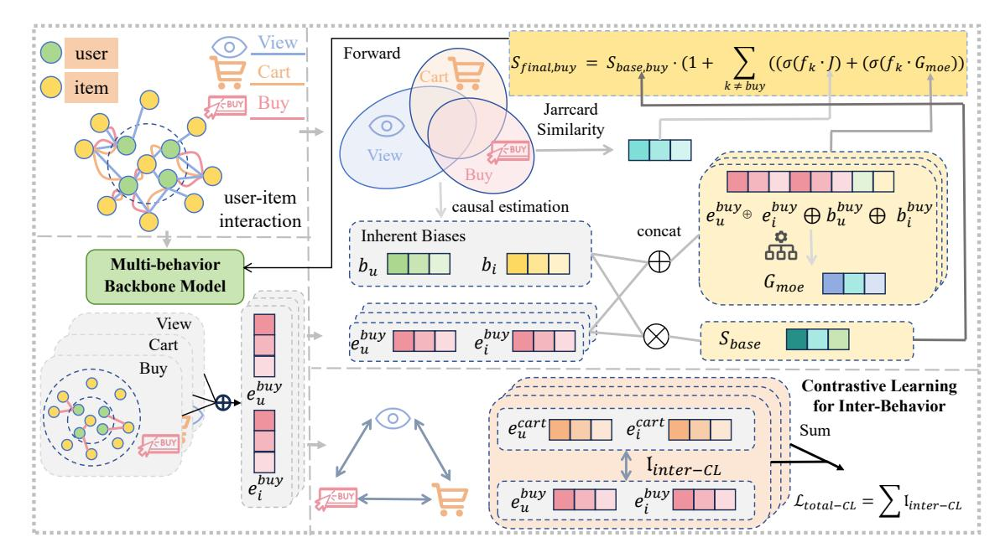

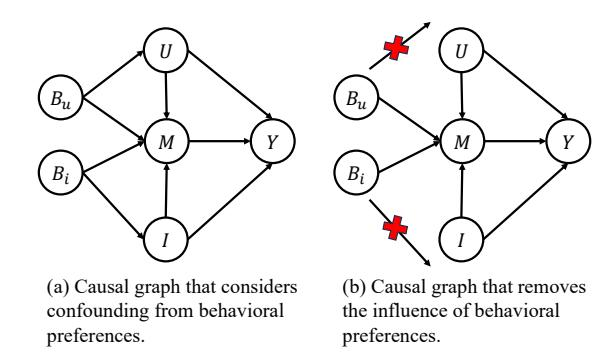

| Dataset | Users  | Items  | view      | collect | cart    | buy     |
|---------|--------|--------|-----------|---------|---------|---------|
| Tmall   | 41,738 | 11,953 | 1,813,498 | 221,514 | 1,996   | 255,586 |
| Jdata   | 93,334 | 24,624 | 1,681,430 | 45,613  | 49,891  | 333,383 |
| Taobao  | 15,449 | 11,953 | 873,954   |         | 195,476 | 92,180  |

Table 2: Performance Comparison with Various Methods (The best performance is highlighted in bold). The statistical significance of improvements over the best baseline is determined by a paired t-test. Symbols ∗ , ∗∗, and ∗∗∗ denote statistical significance at the level of �� &lt; 0.05, �� &lt; 0.01, and �� &lt; 0.001, respectively.

| Type                      | Model          | H@10       | Tmall N@10 | H@50      | N@50       | H@10       | N@10      | Jdata H@50 | N@50       | H@10      | Taobao N@10 | H@50       | N@50       |
|---------------------------|----------------|------------|------------|-----------|------------|------------|-----------|------------|------------|-----------|-------------|------------|------------|
|                           | MF-BPR         | 0.0230     | 0.0124     | 0.0434    | 0.0166     | 0.1850     | 0.1238    | 0.2652     | 0.1417     | 0.0076    | 0.0036      | 0.0151     | 0.0052     |
| Single-behavior Baselines | NCF            | 0.0301     | 0.0153     | 0.0678    | 0.0231     | 0.2090     | 0.1410    | 0.2934     | 0.1599     | 0.0236    | 0.0128      | 0.0483     | 0.0175     |
|                           | LightGCN       | 0.0463     | 0.0226     | 0.1369    | 0.0414     | 0.2932     | 0.1697    | 0.5374     | 0.2246     | 0.0156    | 0.0077      | 0.0483     | 0.0147     |
|                           | LightGCN+MCLMR | 0.1142     | 0.0583     | 0.2729    | 0.0920     | 0.5026     | 0.2914    | 0.7537     | 0.3503     | 0.1142    | 0.0598      | 0.2815     | 0.0962     |
|                           | RGCN           | 0.0316     | 0.0157     | 0.0826    | 0.0262     | 0.2406     | 0.1444    | 0.4873     | 0.1891     | 0.0215    | 0.0104      | 0.0439     | 0.0141     |
|                           | NMTR           | 0.0517     | 0.0250     | 0.1498    | 0.0456     | 0.3142     | 0.1717    | 0.5227     | 0.2198     | 0.0282    | 0.0137      | 0.0578     | 0.0193     |
| Multi-behavior            | MBGCN          | 0.0549     | 0.0285     | 0.1285    | 0.0438     | 0.2803     | 0.1572    | 0.5045     | 0.1984     | 0.0509    | 0.0294      | 0.1009     | 0.0415     |
| Baselines                 | GNMR           | 0.0393     | 0.0193     | 0.1071    | 0.0332     | 0.3068     | 0.1581    | 0.4607     | 0.2029     | 0.0368    | 0.0216      | 0.0735     | 0.0306     |
|                           | S-MBRec        | 0.0694     | 0.0362     | 0.1553    | 0.0544     | 0.4125     | 0.2779    | 0.6036     | 0.3203     | 0.1185    | 0.0659      | 0.2405     | 0.0901     |
|                           | MB-HGCN        | 0.1461     | 0.0770     | 0.3149    | 0.1130     | 0.5338     | 0.3238    | 0.7749     | 0.3804     | 0.1380    | 0.0728      | 0.2751     | 0.1025     |
|                           | NSED           | 0.1480     | 0.0817     | 0.2814    | 0.1102     | 0.5519     | 0.3378    | 0.7392     | 0.3820     | 0.1652    | 0.0912      | 0.2957     | 0.1198     |
| Integrated Causal         |                |            |            |           |            |            |           |            |            |           |             |            |            |
|                           | CVID           | 0.1542     | 0.0829     | 0.3236    | 0.1215     | 0.4258     | 0.2424    | 0.6685     | 0.2979     | 0.1424    | 0.0768      | 0.2862     | 0.1087     |
| Multi-behavior            | CMSR           | 0.1585     | 0.0877     | 0.3089    | 0.1206     | 0.5117     | 0.3095    | 0.7276     | 0.3713     | 0.1295    | 0.0713      | 0.2634     | 0.0989     |
| Multi-behavior +          |                |            |            |           |            |            |           |            |            |           |             |            |            |
|                           | CRGCN          | 0.0840     | 0.0442     | 0.1994    | 0.0685     | 0.4234     | 0.2479    | 0.6749     | 0.3064     | 0.0882    | 0.0496      | 0.1962     | 0.0730     |
|                           | CRGCN+MCLMR    | 0 1449 ∗∗∗ | 0 0803 ∗∗∗ | 0 2725 ∗∗ | 0 1075 ∗∗∗ | 0 5003 ∗∗∗ | 0 3054 ∗∗ | 0 7007 ∗∗∗ | 0 3521 ∗∗∗ | 0 1464 ∗∗ | 0 0839 ∗∗∗  | 0 2753 ∗∗∗ | 0 1122 ∗∗∗ |
| MCLMR                     | BCIPM          | 0.1411     | 0.0741     | 0.3057    | 0.1093     | 0.3851     | 0.2158    | 0.6264     | 0.2711     | 0.1093    | 0.0596      | 0.2462     | 0.0894     |
|                           | BCIPM+MCLMR    | 0.1755     | 0.0970     | 0.3320    | 0.1306     | 0.5575     | 0.3381    | 0.7655     | 0.3875     | 0.1635    | 0.0926      | 0.3023     | 0.1232     |
|                           | HEC-GCN        | 0.1670     | 0.0912     | 0.3131    | 0.1226     | 0.5463     | 0.3360    | 0.7426     | 0.3826     | 0.1807    | 0.0980      | 0.3439     | 0.1341     |
|                           | HEC-GCN+MCLMR  | 0.1896 ∗∗  | 0.1041 ∗∗  | 0.3400 ∗∗ | 0.1367 ∗∗  | 0.5744 ∗∗∗ | 0.3548 ∗∗ | 0.7622 ∗∗∗ | 0.3996 ∗∗∗ | 0.1912 ∗∗ | 0.1055 ∗∗∗  | 0.3575 ∗   | 0.1379 ∗   |

Table 3: Performance Comparison with Pluggable Causal Models (The best results for each backbone are in bold).

| Base Model | Method    | H@10   | N@10   | Tmall H@50 | N@50   | H@10   | N@10   | Jdata H@50 | N@50   | H@10   | N@10   | Taobao H@50 | N@50   |
|------------|-----------|--------|--------|------------|--------|--------|--------|------------|--------|--------|--------|-------------|--------|
| Original   |           | 0.0463 | 0.0226 | 0.1369     | 0.0414 | 0.2932 | 0.1697 | 0.5374     | 0.2246 | 0.0156 | 0.0077 | 0.0483      | 0.0147 |
| +          | SNIPS     | 0.0478 | 0.0284 | 0.1533     | 0.0556 | 0.4149 | 0.2438 | 0.6948     | 0.3067 | 0.0141 | 0.0073 | 0.0427      | 0.0134 |
| + LightGCN | CausE     | 0.0390 | 0.0188 | 0.1184     | 0.0351 | 0.3005 | 0.1766 | 0.5654     | 0.2350 | 0.0185 | 0.0089 | 0.0528      | 0.0161 |
| +          | Multi-IPW | 0.0573 | 0.0322 | 0.1738     | 0.0657 | 0.4150 | 0.2520 | 0.6661     | 0.3084 | 0.0241 | 0.0136 | 0.0745      | 0.0241 |
| +          | DCCL      | 0.0952 | 0.0497 | 0.2386     | 0.0799 | 0.4822 | 0.2886 | 0.7347     | 0.3472 | 0.1067 | 0.0553 | 0.2629      | 0.0890 |
| +          | MCLMR     | 0.1142 | 0.0583 | 0.2729     | 0.0920 | 0.5026 | 0.2914 | 0.7537     | 0.3503 | 0.1142 | 0.0598 | 0.2815      | 0.0962 |
| Original   |           | 0.0840 | 0.0442 | 0.1994     | 0.0685 | 0.4234 | 0.2479 | 0.6749     | 0.3064 | 0.0882 | 0.0496 | 0.1962      | 0.0730 |
| +          | SNIPS     | 0.1197 | 0.0654 | 0.2615     | 0.0955 | 0.4283 | 0.2456 | 0.6788     | 0.3041 | 0.1082 | 0.0635 | 0.2205      | 0.0879 |
| + CRGCN    | CausE     | 0.1185 | 0.0632 | 0.2608     | 0.0933 | 0.3828 | 0.2161 | 0.6299     | 0.2727 | 0.0917 | 0.0518 | 0.1998      | 0.0752 |
| +          | Multi-IPW | 0.1201 | 0.0654 | 0.2590     | 0.0950 | 0.4189 | 0.2432 | 0.6722     | 0.3024 | 0.1080 | 0.0633 | 0.2207      | 0.0878 |
| +          | DCCL      | 0.1144 | 0.0624 | 0.2381     | 0.0886 | 0.4699 | 0.2860 | 0.6833     | 0.3353 | 0.1174 | 0.0667 | 0.2432      | 0.0942 |
| +          | MCLMR     | 0.1449 | 0.0803 | 0.2725     | 0.1075 | 0.5003 | 0.3054 | 0.7007     | 0.3521 | 0.1464 | 0.0839 | 0.2753      | 0.1122 |
| Original   |           | 0.1670 | 0.0912 | 0.3131     | 0.1226 | 0.5463 | 0.3360 | 0.7426     | 0.3826 | 0.1807 | 0.0980 | 0.3439      | 0.1341 |
| +          | SNIPS     | 0.1744 | 0.0950 | 0.3278     | 0.1279 | 0.5156 | 0.3148 | 0.7080     | 0.3597 | 0.1851 | 0.1027 | 0.3345      | 0.1358 |
| + HEC-GCN  | CausE     | 0.1768 | 0.0961 | 0.3365     | 0.1308 | 0.5568 | 0.3396 | 0.7459     | 0.3842 | 0.1847 | 0.1005 | 0.3340      | 0.1334 |
| +          | Multi-IPW | 0.1523 | 0.0824 | 0.3047     | 0.115  | 0.5275 | 0.3167 | 0.7548     | 0.3701 | 0.1584 | 0.0862 | 0.3312      | 0.1241 |
| +          | DCCL      | 0.1759 | 0.0967 | 0.3237     | 0.1286 | 0.5346 | 0.3250 | 0.7306     | 0.3711 | 0.1863 | 0.1034 | 0.3259      | 0.1342 |
| +          | MCLMR     | 0.1896 | 0.1041 | 0.3400     | 0.1367 | 0.5744 | 0.3548 | 0.7622     | 0.3996 | 0.1912 | 0.1055 | 0.3575      | 0.1379 |

0.2479). Substantial improvements are also observed in strong, specialized models (e.g., HEC-GCN on Tmall). Furthermore, compared with other pluggable causal methods like SNIPS and DCCL, our framework achieves superior performance on identical backbones, validating its effectiveness and model-agnostic nature.

# 5.3 Ablation Study (RQ2)

To answer RQ2, We conduct a comprehensive ablation study using CRGCN and BCIPM on Tmall and Jdata to validate MCLMR's components. We compare the full model against six variants: (1) w/o U-Bias: Removes the debiasing module for user behavior habits. (2) w/o I-Bias: Removes the debiasing module for item multi-behavior

bias. (3) w/o Agg.: Removes the entire adaptive information aggregation module. (4) w/o Jaccard: Removes the Jaccard gate within the aggregation module. (5) w/o MoE: Removes the Mixture-of-Experts (MoE) gate within the aggregation module. (6) w/o CL: Removes the contrastive learning module.

As detailed in Tables [4](#page-6-0) and [5,](#page-6-1) the full model consistently yields the best performance. The degradation across all variants confirms that every component is indispensable. Specifically, the significant drop in w/o CL identifies contrastive learning as a critical regularizer. Similarly, declines in w/o Agg. and w/o U/I-Bias validate the vital roles of adaptive aggregation in preventing negative transfer and causal debiasing in disentangling confounders.

Table 4: Ablation study results on the Tmall dataset. The best performance for each backbone is in bold.

|      | Model Variant | HR@10  | BCIPM+MCLMR NDCG@10 | HR@10  | CRGCN+MCLMR NDCG@10 |
|------|---------------|--------|---------------------|--------|---------------------|
| w/o  | U-Bias        | 0.1724 | 0.0949              | 0.1385 | 0.0763              |
| w/o  | I-Bias        | 0.1716 | 0.0932              | 0.1380 | 0.0756              |
| w/o  | Jaccard       | 0.1737 | 0.0946              | 0.1323 | 0.0718              |
| w/o  | MoE           | 0.1719 | 0.0945              | 0.1400 | 0.0771              |
| w/o  | Agg.          | 0.1675 | 0.0925              | 0.1309 | 0.0705              |
| w/o  | CL            | 0.1476 | 0.0805              | 0.1213 | 0.0557              |
| Full | Model         | 0.1755 | 0.0970              | 0.1449 | 0.0803              |

Table 5: Ablation study results on the Jdata dataset. The best performance for each backbone is in bold.

|      | Model Variant | HR@10  | BCIPM+MCLMR NDCG@10 | HR@10  | CRGCN+MCLMR NDCG@10 |
|------|---------------|--------|---------------------|--------|---------------------|
| w/o  | U-Bias        | 0.5431 | 0.3301              | 0.4518 | 0.2741              |
| w/o  | I-Bias        | 0.5454 | 0.3320              | 0.4623 | 0.2797              |
| w/o  | Jaccard       | 0.5539 | 0.3359              | 0.4694 | 0.2843              |
| w/o  | MoE           | 0.5542 | 0.3361              | 0.4709 | 0.2865              |
| w/o  | Agg.          | 0.5461 | 0.3328              | 0.4597 | 0.2770              |
| w/o  | CL            | 0.4521 | 0.2660              | 0.4567 | 0.2522              |
| Full | Model         | 0.5575 | 0.3381              | 0.5003 | 0.3054              |

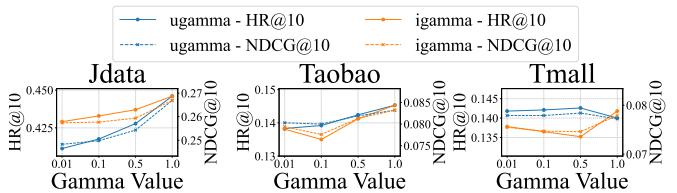

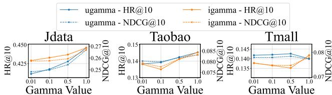

Figure 3: Impact of the debiasing coefficient ��. Performance is shown for HR@10 (left) and NDCG@10 (right).

### 5.4 Parameter Analysis (RQ3)

This subsection examines MCLMR's sensitivity to hyperparameters using the CRGCN backbone. Regarding the debiasing coefficient �� (Fig. [3\)](#page-6-2), a small value (0.01) is universally optimal for items, whereas the optimal user �� is dataset-dependent (larger for Jdata, smaller for Taobao). For the MoE expert dimension (Fig. [4\)](#page-6-3), performance peaks at 64, providing the optimal trade-off between expressiveness and generalization; larger capacities lead to overfitting.

Effectiveness of Bias-aware Temperature. We investigate the temperature parameter �� in our contrastive loss. Unlike standard fixed or learnable approaches, we dynamically adapt �� to behavioral biases to balance the primary BPR and auxiliary contrastive tasks. Specifically, high-bias behaviors (dominating BPR) require distinct penalties compared to sparse ones. We validate this design against four variants (Fixed, Learnable, Random, Alternative Mappings), with detailed settings and comparisons provided in Appendix [C.](#page-9-7)

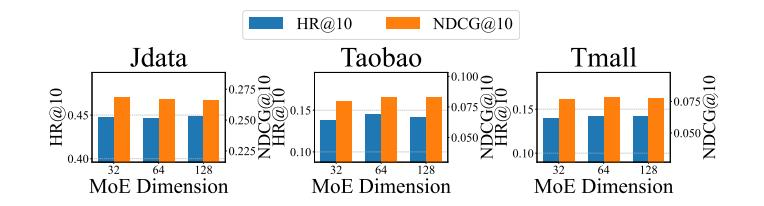

Figure 4: Impact of the MoE expert dimension. Performance is shown for HR@10 (left) and NDCG@10 (right).

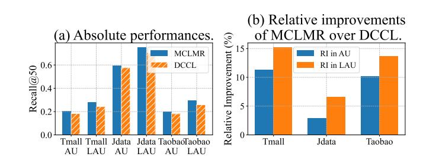

Figure 5: Performance of CRGCN+MCLMR and CRGCN+DCCL in active and less-active user groups. (a) the absolute performance; and (b) the relative improvements of MCLMR over DCCL. "AU" and "LAU" are short for the active user group and the less-active user group, respectively. In (a), bars with slash and without slash corresponds to DCCL and MCLMR, respectively. Better viewed in color.

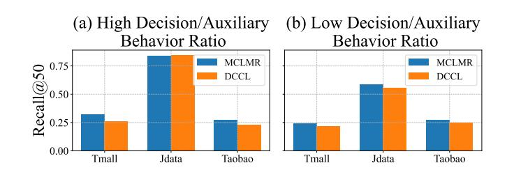

Figure 6: Recall@50 of CRGCN+MCLMR and CRGCN+DCCL in item groups with high and low Decision/Auxiliary Behavior ratio.

### 5.5 In-depth Analyses (RQ4)

In this subsection, we conduct a detailed analysis using the CRGCN backbone to investigate three key questions (analyses on other backbones like HECGCN and LightGCN are deferred to Appendix [D\)](#page-10-0). Specifically, we aim to determine: 1) the primary sources of performance improvements; 2) consistency across different user groups; and 3) effectiveness in recommending high-quality items.

5.5.1 Improvements in Active and Less-active User Groups. We examine whether MCLMR benefits active or less-active user groups differently. For Tmall, Jdata, and Taobao, the top 20% of users by

interaction count are classified as active (AU), and the rest as lessactive (LAU). We compare MCLMR and DCCL on: 1) absolute Recall@50 performance; and 2) relative improvements.

Figure [5](#page-6-4) summarizes the results. We observe that: 1) Better Performance in LAU: As shown in Fig. [5\(](#page-6-4)a), both models perform better in the LAU group across all datasets. 2) Overall Superiority: MCLMR consistently outperforms DCCL in both active and lessactive groups. 3) Greater Relative Improvement in LAU: As shown in Fig. [5\(](#page-6-4)b), the relative improvement (RI) of MCLMR over DCCL is notably higher in the LAU group. These results indicate MCLMR is particularly effective for long-tail users, helping alleviate the "Matthew effect" by ensuring less-active users receive high-quality recommendations despite sparse histories.

5.5.2 Recommendation Quality w.r.t. Decision/Auxiliary Behavior Ratio. Whether the proposed MCLMR can achieve consistent and unbiased user preference estimations is our concern. Thus, in this part, we sort items according to the decision/auxiliary behavior ratio and divide them into two groups: the top 20% of items with a high ratio, and the remaining 80% with a low ratio. High-ratio items are considered higher quality as they align with target actions, whereas over-recommending low-ratio items may hurt user experience. We use recall for evaluation.

The performance on these groups is shown in Figure [6.](#page-6-5) In the high-ratio group (Figure [6\(](#page-6-5)a)), MCLMR significantly outperforms DCCL on Tmall and Taobao, with comparable results on Jdata, demonstrating its capability to recommend high-quality items. Furthermore, in the low-ratio group (Figure [6\(](#page-6-5)b)), MCLMR consistently leads across all datasets. These results suggest that MCLMR is more precise in recommending high-quality items and robust in handling low-quality ones. We attribute this to the removal of hidden confounders that might otherwise promote items with high auxiliary engagement but low decision value.

# 5.6 Complexity Analysis (RQ5)

To evaluate the computational overhead of our proposed MCLMR framework, we analyze its time complexity in comparison with three state-of-the-art multi-behavior recommendation models: CRGCN, HEC-GCN, and BCIPM.

5.6.1 Notations. We define the following symbols: �� and �� are the total number of users and items; �� is the embedding dimension; �� is the number of behaviors; �� is the number of GCN layers; ��total is the total number of edges across all behaviors; �� is the number of hyperedges in the hypergraph; and ���� is the number of unique users within a batch.

5.6.2 Complexity of the MCLMR Framework. Our MCLMR framework introduces an additional computational overhead, OMCLMR, which is composed of three main modules: (1) Jaccard Aggregation Module: O (�� · �� 2 · ��). (2) MoE Gating Aggregation Module: O (�� · �� 2 · �� · ��). (3) Multi-behavior Contrastive Learning Module: O ( (���� + ���� ) · �� 2 · �� 2 ). Thus, the total incremental complexity is OMCLMR = O (�� · �� 2 · (�� + �� · ��) + (���� + ���� ) · �� 2 · �� ).

5.6.3 Complexity Comparison and Analysis. Table [6](#page-7-0) summarizes the original dominant complexities of the backbone models and the total complexity after integrating MCLMR.

Table 6: Time complexity of baseline models before and after integration with the MCLMR framework.

The analysis confirms that MCLMR introduces a fixed computational overhead, demonstrating its model-agnostic nature. The relative impact of this overhead is more significant on simpler models like CRGCN but less pronounced on inherently complex ones such as HEC-GCN. Notably, for BCIPM, our framework adds a complexity term that scales with the square of the batch size (�� 2 ), increasing the model's sensitivity to this hyperparameter.

Empirical Runtime and Latency. In addition to the theoretical complexity analysis, we evaluated the actual training overhead and online inference latency on real-world GPUs to demonstrate its practical efficiency. The empirical results confirm that MCLMR introduces only a minor increase in training time (e.g., approx. 4% increase for HEC-GCN) while maintaining the same inference speed as the backbone models. A detailed derivation of the theoretical complexities can be found in Appendix [E](#page-10-1), and the comprehensive empirical runtime statistics are provided in Appendix [F](#page-11-1).

### 5.7 Ethical Considerations

We acknowledge the importance of ethical data usage in recommender systems. This work utilizes public, anonymized datasets (Tmall, Jdata, Taobao) to strictly protect user privacy. Furthermore, our proposed causal debiasing framework is explicitly designed to mitigate behavioral biases, contributing to more fair and unbiased recommendation outcomes.

### 6 Conclusion

In this paper, we propose MCLMR, a novel model-agnostic causal learning framework that addresses multi-behavior biases in recommendation systems. We first construct a causal graph to model the complex confounding effects from user behavioral habits and item multi-behavior distributions. Then we design an Adaptive Aggregation module based on Mixture-of-Experts to dynamically fuse auxiliary behaviors, and a Bias-aware Contrastive Learning module with user-item dual alignment to bridge semantic gaps while accounting for bias distortions. Extensive experiments on three real-world datasets demonstrate that MCLMR consistently improves various existing MBR models, validating its effectiveness.

# Acknowledgments

This work was supported in part by the Natural Science Foundation of Anhui Province (Grant No. 2508085QF211), the National Natural Science Foundation of China (Grant No. 62506348), New Generation Artificial Intelligence-National Science and Technology Major Project (Grant No. 2025ZD0122601), the Opening Foundation of State Key Laboratory of Cognitive Intelligence, iFLYTEK (COGOS-2025HE02), the CCF-1688 Yuanbao Cooperation Fund (Grant No. CCF-Alibaba2025005).

### References

- [1] Himan Abdollahpouri and Masoud Mansoury. 2020. Multi-sided Exposure Bias in Recommendation. arXiv e-prints, Article arXiv:2006.15772 (June 2020), arXiv:2006.15772 pages. arXiv[:2006.15772](https://arxiv.org/abs/2006.15772) [cs.IR] [doi:10.48550/arXiv.2006.15772](https://doi.org/10.48550/arXiv.2006.15772) [2] Stephen Bonner and Flavian Vasile. 2018. Causal embeddings for recommendation. In Proceedings of the 12th ACM Conference on Recommender Systems (Vancouver, British Columbia, Canada) (RecSys '18). Association for Computing Machinery, New York, NY, USA, 104–112. [doi:10.1145/3240323.3240360](https://doi.org/10.1145/3240323.3240360) [3] Léon Bottou, Jonas Peters, Joaquin Quiñonero Candela, Denis X. Charles, D. Max Chickering, Elon Portugaly, Dipankar Ray, Patrice Simard, and Ed Snelson. 2013. Counterfactual reasoning and learning systems: the example of computational advertising. J. Mach. Learn. Res. 14, 1 (Jan. 2013), 3207–3260. [4] Wei Cai, ZhiHong Zheng, Xuan Zhang, Weiyi Shang, Yubin Ma, WenJie Gao, and Zhi Jin. 2025. Neighborhood structure enhancement and denoising method for multi-behavior recommendation. Neural Networks 191 (2025), 107760. [doi:10.](https://doi.org/10.1016/j.neunet.2025.107760) [1016/j.neunet.2025.107760](https://doi.org/10.1016/j.neunet.2025.107760) [5] Jiawei Chen, Hande Dong, Xiang Wang, Fuli Feng, Meng Wang, and Xiangnan He. 2021. Bias and Debias in Recommender System: A Survey and Future Directions. arXiv[:2010.03240](https://arxiv.org/abs/2010.03240) [cs.IR]<https://arxiv.org/abs/2010.03240> [6] Jiawei Chen, Hande Dong, Xiang Wang, Fuli Feng, Meng Wang, and Xiangnan He. 2023. Bias and Debias in Recommender System: A Survey and Future Directions. ACM Trans. Inf. Syst. 41, 3, Article 67 (Feb. 2023), 39 pages. [doi:10.1145/3564284](https://doi.org/10.1145/3564284) [7] Yuzhe Chen, Jie Cao, Youquan Wang, Jia Wu, Huanhuan Chen, and Guandong Xu. 2025. Causal Variational Inference for Deconfounded Multi-Behavior Recommendation. ACM Trans. Inf. Syst. 43, 6, Article 151 (Sept. 2025), 26 pages. [doi:10.1145/3745023](https://doi.org/10.1145/3745023) [8] Chen Gao, Xiangnan He, Dahua Gan, Xiangning Chen, Fuli Feng, Yong Li, Tat-Seng Chua, and Depeng Jin. 2019. Neural multi-task recommendation from multi-behavior data. In ICDE. IEEE, 1554–1557. [9] Shuyun Gu, Xiao Wang, Chuan Shi, and Ding Xiao. 2022. Self-supervised Graph Neural Networks for Multi-behavior Recommendation. In Proceedings of the Thirty-First International Joint Conference on Artificial Intelligence, IJCAI-22. 2052– 2058. [10] Xiangnan He, Kuan Deng, Xiang Wang, Yan Li, Yongdong Zhang, and Meng Wang. 2020. LightGCN: Simplifying and Powering Graph Convolution Network for Recommendation. arXiv preprint arXiv:2002.02126 (2020). [11] Xiangnan He, Lizi Liao, Hanwang Zhang, Liqiang Nie, Xia Hu, and Tat-Seng Chua. 2017. Neural collaborative filtering. In WWW. 173–182. [12] Chao Huang. 2021. Recent Advances in Heterogeneous Relation Learning for Recommendation. arXiv preprint arXiv:2110.03455 (2021). [13] Bowen Jin, Chen Gao, Xiangnan He, Depeng Jin, and Yong Li. 2020. Multibehavior recommendation with graph convolutional networks. In SIGIR. [14] Diederik P Kingma and Jimmy Ba. 2014. Adam: A method for stochastic optimization. arXiv preprint arXiv:1412.6980 (2014). [15] Karl Krauth, Yixin Wang, and Michael I. Jordan. 2022. Breaking Feedback Loops in Recommender Systems with Causal Inference. arXiv[:2207.01616](https://arxiv.org/abs/2207.01616) [cs.IR] [https:](https://arxiv.org/abs/2207.01616) [//arxiv.org/abs/2207.01616](https://arxiv.org/abs/2207.01616) [16] Jie Liao, Min Yang, Wei Zhou, Hongyu Zhang, and Junhao Wen. 2024. Modeling item exposure and user satisfaction for debiased recommendation with causal inference. Inf. Sci. 676, C (Aug. 2024), 15 pages. [doi:10.1016/j.ins.2024.120834](https://doi.org/10.1016/j.ins.2024.120834) [17] Lingfeng Liu, Yixin Song, Dazhong Shen, Bing Yin, Hao Li, Yanyong Zhang, and Chao Wang. 2025. Rethinking Popularity Bias in Collaborative Filtering via Analytical Vector Decomposition. arXiv preprint arXiv:2512.10688 (2025). [18] Dan Lu, Shiqing Wu, Hao Zhang, Guandong Xu, and Qilong Han. 2025. Causal cascading convolution networks for multi-behavior sequential recommendation. Information Sciences 720 (2025), 122484. [doi:10.1016/j.ins.2025.122484](https://doi.org/10.1016/j.ins.2025.122484) [19] Huishi Luo, Fuzhen Zhuang, Ruobing Xie, Hengshu Zhu, Deqing Wang, Zhulin An, and Yongjun Xu. 2024. A survey on causal inference for recommendation. The Innovation 5, 2 (2024), 100590. [doi:10.1016/j.xinn.2024.100590](https://doi.org/10.1016/j.xinn.2024.100590) [20] Chenglong Ma, Ziqi Xu, Yongli Ren, Danula Hettiachchi, and Jeffrey Chan. 2025. PUB: An LLM-Enhanced Personality-Driven User Behaviour Simulator for Recommender System Evaluation. In Proceedings of the 48th International ACM SIGIR Conference on Research and Development in Information Retrieval, SIGIR. 2690– 2694.<https://doi.org/10.1145/3726302.3730238> [21] Masoud Mansoury, Bamshad Mobasher, and Herke van Hoof. 2024. Mitigating Exposure Bias in Online Learning to Rank Recommendation: A Novel Reward Model for Cascading Bandits. In Proceedings of the 33rd ACM International Conference on Information and Knowledge Management (Boise, ID, USA) (CIKM '24). Association for Computing Machinery, New York, NY, USA, 1638–1648. [doi:10.1145/3627673.3679763](https://doi.org/10.1145/3627673.3679763) [22] Judea Pearl. 2009. Causality: Models, Reasoning and Inference (2nd ed.). Cambridge University Press, USA. [23] Steffen Rendle, Christoph Freudenthaler, Zeno Gantner, and Lars Schmidt-Thieme. 2012. BPR: Bayesian personalized ranking from implicit feedback. arXiv preprint arXiv:1205.2618 (2012). [24] Michael Schlichtkrull, Thomas N Kipf, Peter Bloem, Rianne Van Den Berg, Ivan Titov, and Max Welling. 2018. Modeling relational data with graph convolutional networks. In European semantic web conference. Springer, 593–607. [25] Xiaoyuan Su and Taghi M Khoshgoftaar. 2009. A survey of collaborative filtering techniques. Advances in artificial intelligence 2009 (2009). [26] Adith Swaminathan and Thorsten Joachims. 2015. The Self-Normalized Estimator for Counterfactual Learning. In Advances in Neural Information Processing Systems,
  - C. Cortes, N. Lawrence, D. Lee, M. Sugiyama, and R. Garnett (Eds.), Vol. 28. Curran Associates, Inc. [https://proceedings.neurips.cc/paper\\_files/paper/2015/](https://proceedings.neurips.cc/paper_files/paper/2015/file/39027dfad5138c9ca0c474d71db915c3-Paper.pdf) [file/39027dfad5138c9ca0c474d71db915c3-Paper.pdf](https://proceedings.neurips.cc/paper_files/paper/2015/file/39027dfad5138c9ca0c474d71db915c3-Paper.pdf) [27] Chao Wang, Qi Liu, Runze Wu, Enhong Chen, Chuanren Liu, Xunpeng Huang, and Zhenya Huang. 2018. Confidence-aware matrix factorization for recommender systems. In Proceedings of the AAAI Conference on artificial intelligence, Vol. 32. [28] Chao Wang, Yixin Song, Jinhui Ye, Chuan Qin, Dazhong Shen, Lingfeng Liu, Xiang Wang, and Yanyong Zhang. 2025. FACE: A General Framework for Mapping Collaborative Filtering Embeddings into LLM Tokens. arXiv preprint arXiv:2510.15729 (2025). [29] Chao Wang, Hengshu Zhu, Qiming Hao, Keli Xiao, and Hui Xiong. 2021. Variable interval time sequence modeling for career trajectory prediction: Deep collaborative perspective. In Proceedings of the Web Conference 2021. 612–623. [30] Chao Wang, Hengshu Zhu, Peng Wang, Chen Zhu, Xi Zhang, Enhong Chen, and Hui Xiong. 2021. Personalized and explainable employee training course recommendations: A bayesian variational approach. ACM Transactions on Information Systems (TOIS) 40, 4 (2021), 1–32. [31] Chao Wang, Hengshu Zhu, Chen Zhu, Chuan Qin, and Hui Xiong. 2020. Setrank: A setwise bayesian approach for collaborative ranking from implicit feedback. In Proceedings of the aaai conference on artificial intelligence, Vol. 34. 6127–6136. [32] Yixin Wang, Dawen Liang, Laurent Charlin, and David M. Blei. 2018. The Deconfounded Recommender: A Causal Inference Approach to Recommendation. arXiv e-prints, Article arXiv:1808.06581 (Aug. 2018), arXiv:1808.06581 pages. arXiv[:1808.06581](https://arxiv.org/abs/1808.06581) [cs.IR] [doi:10.48550/arXiv.1808.06581](https://doi.org/10.48550/arXiv.1808.06581) [33] Xinye Wanyan, Danula Hettiachchi, Chenglong Ma, Ziqi Xu, and Jeffrey Chan. 2025. Temporal-Aware User Behaviour Simulation with Large Language Models for Recommender Systems. In Proceedings of the 34th ACM International Conference on Information and Knowledge Management, CIKM. 5335–5339. [https:](https://doi.org/10.1145/3746252.3760878) [//doi.org/10.1145/3746252.3760878](https://doi.org/10.1145/3746252.3760878) [34] Tianxin Wei, Fuli Feng, Jiawei Chen, Ziwei Wu, Jinfeng Yi, and Xiangnan He. 2021. Model-Agnostic Counterfactual Reasoning for Eliminating Popularity Bias in Recommender System. In Proceedings of the 27th ACM SIGKDD Conference on Knowledge Discovery & Data Mining. 1791–1800. [35] Lianghao Xia, Chao Huang, Yong Xu, Peng Dai, Mengyin Lu, and Liefeng Bo. 2021. Multi-Behavior Enhanced Recommendation with Cross-Interaction Collaborative Relation Modeling. In ICDE. IEEE, 1931–1936. [36] Lianghao Xia, Chao Huang, Yong Xu, Peng Dai, Bo Zhang, and Liefeng Bo. 2020. Multiplex behavioral relation learning for recommendation via memory augmented transformer network. In SIGIR. 2397–2406. [37] Ziqi Xu, Debo Cheng, Jiuyong Li, Jixue Liu, Lin Liu, and Ke Wang. 2023. Disentangled Representation for Causal Mediation Analysis. In Thirty-Seventh AAAI Conference on Artificial Intelligence, AAAI. 10666–10674. [https://doi.org/10.1609/](https://doi.org/10.1609/aaai.v37i9.26266) [aaai.v37i9.26266](https://doi.org/10.1609/aaai.v37i9.26266) [38] Ziqi Xu, Debo Cheng, Jiuyong Li, Jixue Liu, Lin Liu, and Kui Yu. 2024. Causal Inference with Conditional Front-Door Adjustment and Identifiable Variational Autoencoder. In The Twelfth International Conference on Learning Representations, ICLR.<https://openreview.net/forum?id=wFf9m4v7oC> [39] Hongrui Xuan, Yi Liu, Bohan Li, and Hongzhi Yin. 2023. Knowledge Enhancement for Contrastive Multi-Behavior Recommendation. In Proceedings of the Sixteenth ACM International Conference on Web Search and Data Mining. 195–203. [40] Mingshi Yan, Zhiyong Cheng, Chen Gao, Jing Sun, Fan Liu, Fuming Sun, and Haojie Li. 2023. Cascading Residual Graph Convolutional Network for Multi-Behavior Recommendation. 42, 1, Article 10 (Aug. 2023), 26 pages. [doi:10.1145/](https://doi.org/10.1145/3587693) [3587693](https://doi.org/10.1145/3587693) [41] Mingshi Yan, Zhiyong Cheng, Jing Sun, Fuming Sun, and Yuxin Peng. 2023. MB-HGCN: A hierarchical graph convolutional network for multi-behavior recommendation. arXiv preprint arXiv:2306.10679 (2023). [42] Mingshi Yan, Fan Liu, Jing Sun, Fuming Sun, Zhiyong Cheng, and Yahong Han. 2024. Behavior-Contextualized Item Preference Modeling for Multi-Behavior Recommendation. In Proceedings of the 47th International ACM SIGIR Conference on Research and Development in Information Retrieval. 946–955. [43] Yabo Yin, Xiaofei Zhu, Wenshan Wang, Yihao Zhang, Pengfei Wang, Yixing Fan, and Jiafeng Guo. 2024. HEC-GCN: Hypergraph Enhanced Cascading Graph Convolution Network for Multi-Behavior Recommendation. arXiv[:2412.14476](https://arxiv.org/abs/2412.14476) [cs.IR] <https://arxiv.org/abs/2412.14476> [44] Guixian Zhang, Guan Yuan, Debo Cheng, Lin Liu, Jiuyong Li, Ziqi Xu, and Shichao Zhang. 2025. Deconfounding representation learning for mitigating latent confounding effects in recommendation. Knowledge and Information Systems 67, 7 (2025), 5999–6020.<https://doi.org/10.1007/s10115-025-02404-7> [45] Wenhao Zhang, Wentian Bao, Xiao-Yang Liu, Keping Yang, Quan Lin, Hong Wen, and Ramin Ramezani. 2019. A Causal Perspective to Unbiased Conversion Rate Estimation on Data Missing Not at Random. CoRR abs/1910.09337 (2019). arXiv[:1910.09337](https://arxiv.org/abs/1910.09337)<http://arxiv.org/abs/1910.09337>

|         | Method | Variant      |             | HR@50          | Jdata NDCG@50 | HR@50  | Taobao NDCG@50 | HR@50  | Tmall NDCG@50 |
|---------|--------|--------------|-------------|----------------|---------------|--------|----------------|--------|---------------|
| Variant | 1:     | Fixed        | Temperature | 0.7150         | 0.3414        | 0.2631 | 0.1091         | 0.2650 | 0.1009        |
| Variant | 2:     | Alt. Mapping | (1 +        | �� �� ) 0.6422 | 0.3213        | 0.2623 | 0.1098         | 0.2622 | 0.1035        |
| Variant | 3:     | Learnable    | Temperature | 0.6775         | 0.3419        | 0.2481 | 0.1008         | 0.2703 | 0.1044        |
| Variant | 4:     | Random       | Temperature | 0.6970         | 0.3171        | 0.2464 | 0.0990         | 0.2574 | 0.0957        |
| MCLMR   |        | (Ours)       |             | 0.7295         | 0.3801        | 0.2736 | 0.1120         | 0.2753 | 0.1075        |

### D Detailed Analysis with Other Backbones

In this section, we provide supplementary results for our in-depth analysis, using HECGCN and LightGCN as alternative GCN backbones. This complements the primary analysis in the main text, which utilizes CRGCN. The experimental setup for user/item group division and evaluation methodology remains consistent with that described in the main paper.

### D.1 Analysis with HECGCN Backbone

We first replace the CRGCN backbone with HECGCN to validate the generalizability of our model's improvements.

D.1.1 Performance in User Groups. As shown in Figure [7,](#page-10-2) the results with the HECGCN backbone are consistent with our findings. Our proposed model (HECGCN+MCLMR) consistently outperforms the baseline (HECGCN+DCCL) in both active and less-active user groups. More importantly, the relative improvement is more pronounced in the less-active user group, once again demonstrating our model's effectiveness in alleviating data sparsity issues.

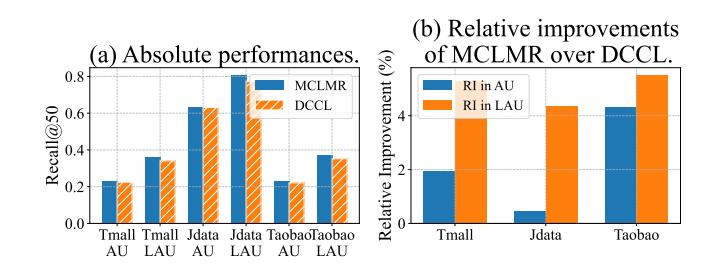

Figure 7: Performance comparison with the HECGCN backbone in active (AU) and less-active (LAU) user groups. (a) Absolute performance; (b) Relative improvements of MCLMR over DCCL.

D.1.2 Recommendation Quality. Figure [8](#page-10-3) illustrates the recommendation quality on items with different decision/auxiliary behavior ratios. When built upon HECGCN, our model achieves significant gains in recommending high-quality items (high-ratio group) and maintains a strong advantage in the low-ratio group. This further validates that our method's ability to mitigate confounders is robust and not limited to a single GCN architecture.

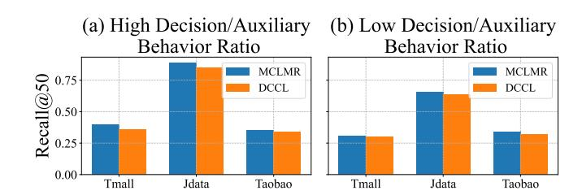

Figure 8: Recall on high and low decision/auxiliary behavior ratio item groups with the HECGCN backbone.

### D.2 Analysis with LightGCN Backbone

We further conduct experiments using LightGCN, a simpler yet powerful backbone, to verify our model's compatibility and effectiveness.

D.2.1 Performance in User Groups. The results, summarized in Figure [9,](#page-10-4) show a similar pattern. The LightGCN+MCLMR combination surpasses the LightGCN+DCCL baseline across both user segments. The greater relative improvement in the less-active user group highlights our model's strong synergy with different types of graph neural networks, from complex (CRGCN, HECGCN) to more streamlined ones (LightGCN).

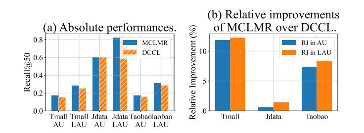

Figure 9: Performance comparison with the LightGCN backbone in active (AU) and less-active (LAU) user groups. (a) Absolute performance; (b) Relative improvements of MCLMR over DCCL.

D.2.2 RecommendationQuality. As depicted in Figure [10,](#page-10-5) our model continues to excel at identifying high-quality items when paired with LightGCN. It demonstrates superior performance in the highratio item group while also performing robustly in the low-ratio group. This consistency across all three backbones provides strong evidence that the improvements stem from our proposed multilevel causal learning framework rather than the specifics of the GCN architecture.

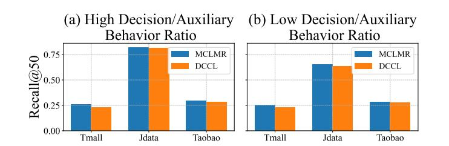

Figure 10: Recall on high and low decision/auxiliary behavior ratio item groups with the LightGCN backbone.

# E Time Complexity Derivation

Here, we provide a detailed derivation of the computational complexity introduced by the MCLMR framework and analyze the complexity of baseline models.

| Method  | Tmall           | Taobao          |
|---------|-----------------|-----------------|
|         | Original +MCLMR | Original +MCLMR |
| HEC-GCN | 625s 650s       | 502s 579s       |
| CRGCN   | 145s 182s       | 110s 135s       |