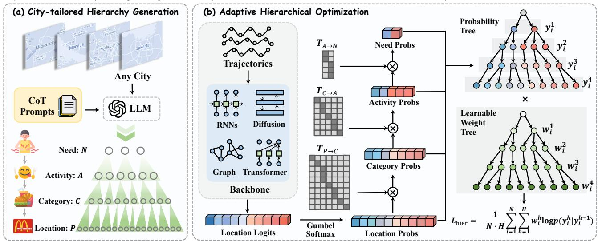
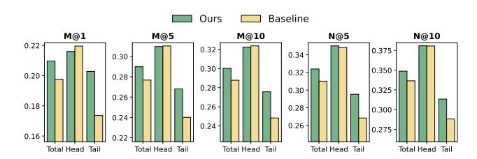
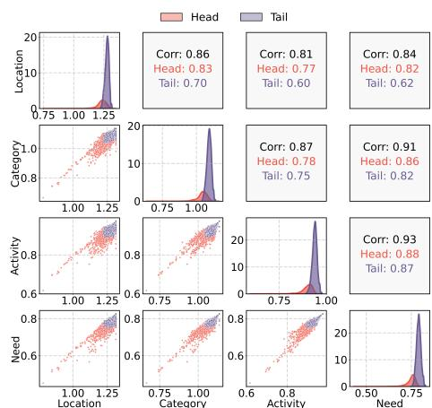
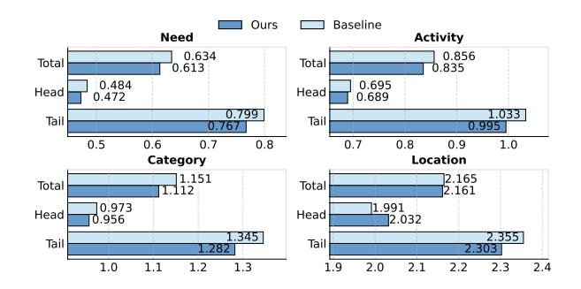
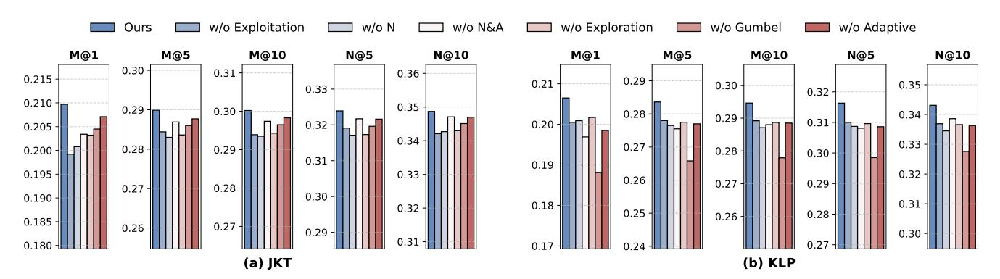
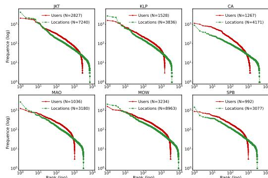
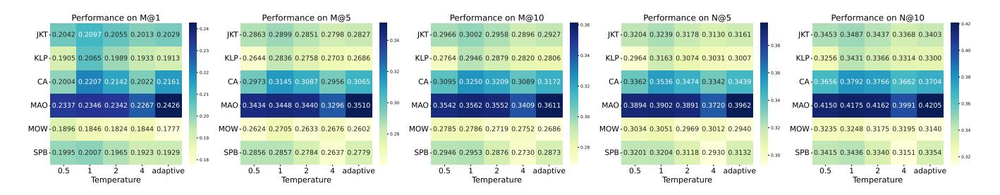

# Adaptive Location Hierarchy Learning for Long-Tailed Mobility Prediction

[Yu Wang](https://orcid.org/0009-0003-5193-1841)∗ yu.wang@zju.edu.cn Zhejiang University Hangzhou, China

[Junshu Dai](https://orcid.org/0009-0005-0081-1799)∗ djs@zju.edu.cn Zhejiang University Hangzhou, China

[Yuchen Ying](https://orcid.org/0009-0004-5683-452X) yingyc@zju.edu.cn Zhejiang University Hangzhou, China

[Hanyang Yuan](https://orcid.org/0009-0002-9570-2154) yuanhanyang@zju.edu.cn Zhejiang University Hangzhou, China

[Zunlei Feng](https://orcid.org/0000-0001-8640-8434) zunleifeng@zju.edu.cn Zhejiang University Hangzhou, China

[Tongya Zheng](https://orcid.org/0000-0003-1190-9773)†‡ doujiang\_zheng@163.com Hangzhou City University, Zhejiang University Hangzhou, China

[Mingli Song](https://orcid.org/0000-0003-2621-6048) brooksong@zju.edu.cn Zhejiang University Hangzhou, China

# Abstract

Human mobility prediction is crucial for applications ranging from location-based recommendations to urban planning, which aims to forecast users' next location visits based on historical trajectories. While existing mobility prediction models excel at capturing sequential patterns through diverse architectures for different scenarios, they are hindered by the long-tailed distribution of location visits, leading to biased predictions and limited applicability. This highlights the need for a solution that enhances the long-tailed prediction capabilities of these models with broad compatibility and efficiency across diverse architectures. To address this need, we propose the first architecture-agnostic plugin for long-tailed human mobility prediction, named Adaptive LOcation HierArchy learning (ALOHA). Inspired by Maslow's theory of human motivation, we exploit and explore common mobility knowledge of head and tail locations derived from human mobility trajectories to effectively mitigate long-tailed bias. Specifically, we introduce an automatic pipeline to construct city-tailored location hierarchies based on Large Language Models (LLMs) and Chain-of-Thought (CoT) prompts, capturing high-level mobility semantics with minimal human verification. We further design an Adaptive Hierarchical Loss (AHL) that rebalances learning through Gumbel disturbance and node-wise adaptive weighting, enabling both exploitation of multilevel signals and exploration within semantically related groups. Extensive experiments across multiple state-of-the-art models demonstrate that ALOHA consistently improves long-tailed mobility prediction performance by up to 16.59% while maintaining efficiency and robustness. Our code is at https://github.com/Star607/ALOHA.

# CCS Concepts

• Computing methodologies → Modeling methodologies.

∗Equal contribution

†Corresponding author

‡Also with, High-Performance Intelligent Computing Research Center for Ultra-Large Scale Graph Data, Hangzhou City University

[This work is licensed under a Creative Commons Attribution 4.0 International License.](https://creativecommons.org/licenses/by/4.0) WWW '26, Dubai, United Arab Emirates

© 2026 Copyright held by the owner/author(s). ACM ISBN 979-8-4007-2307-0/2026/04 <https://doi.org/10.1145/3774904.3792514>

# Keywords

Human Mobility, Mobility Prediction, Long-Tailed Learning

### ACM Reference Format:

Yu Wang, Junshu Dai, Yuchen Ying, Hanyang Yuan, Zunlei Feng, Tongya Zheng, and Mingli Song. 2026. Adaptive Location Hierarchy Learning for Long-Tailed Mobility Prediction. In Proceedings of the ACM Web Conference 2026 (WWW '26), April 13–17, 2026, Dubai, United Arab Emirates. ACM, New York, NY, USA, [12](#page-11-0) pages.<https://doi.org/10.1145/3774904.3792514>

# 1 Introduction

Human mobility prediction, which forecasts an individual's next location based on historical trajectories [\[50\]](#page-8-0), has garnered growing attention due to the proliferation of large-scale mobility data derived from location-based social networks (LBSNs) of Web services [\[32\]](#page-8-1). By leveraging these data, mobility prediction advances Web applications such as location-aware recommendations, personalized content, and real-time service delivery [\[6,](#page-8-2) [45\]](#page-8-3), while also supporting critical urban functions including traffic management and epidemic monitoring [\[2,](#page-8-4) [13,](#page-8-5) [42\]](#page-8-6). However, issues like privacy constraints, sparse sampling, and authorization biases often lead to a long-tailed distribution in visit frequency of locations, complicating accurate, fair and diverse human mobility prediction [\[44,](#page-8-7) [47\]](#page-8-8).

Existing mobility prediction models excel at capturing sequential mobility patterns, leveraging diverse architectures for different scenarios, including Recurrent Neural Network (RNN)-based models [\[9,](#page-8-9) [36,](#page-8-10) [50\]](#page-8-0) for short-term and localized dependencies, Graph Neural Network (GNN)-based models [\[30,](#page-8-11) [45,](#page-8-3) [48,](#page-8-12) [51,](#page-8-13) [54\]](#page-8-14) for spatial and semantic correlations, Transformer-based models [\[11,](#page-8-15) [37,](#page-8-16) [48,](#page-8-12) [51\]](#page-8-13) for long-range and global context, and Diffusion-based models [\[24,](#page-8-17) [29\]](#page-8-18) for uncertain generative dynamics. However, most approaches ignore the intrinsic long-tailed distribution of location visits, causing biased predictions that degrade accuracy, fairness and recommendation diversity in applications. LoTNext [\[47\]](#page-8-8) is the first attempt to explicitly address this issue, but its tight coupling to graph structures limits applicability across diverse prediction architectures.

The limitations of existing methods underscore the pressing solution capable of mitigating biases from the inherently long-tailed distribution of location visits, while remaining seamlessly compatible with a wide range of state-of-the-art mobility prediction models. Achieving this objective entails addressing two fundamental and intertwined challenges. Firstly, how to integrate the long-tailed

learning mechanism in a manner that ensures broad compatibility with diverse mobility prediction architectures such as RNN-, GNN-, Transformer-, and Diffusion-based paradigms for different scenarios. Secondly, as broad compatibility may incur substantial computational costs, how to achieve computation efficiency, enabling the solution to scale effectively and operate robustly across extensive datasets without compromising its versatility.

The challenges of long-tailed human mobility prediction in compatibility and efficiency motivate us to develop a compatible and efficient long-tailed learning plugin to complement existing sequential models, which lack explicit mechanisms for addressing longtailed bias. Unlike tightly coupled designs that struggle to transfer across various models and datasets, this plugin integrates longtailed learning mechanisms without modifying the core model architecture. Additionally, the plugin's efficiency requirement drives a lightweight design that enriches location semantics. Drawing on Maslow's theory of human motivation [\[25\]](#page-8-19), we consider common mobility knowledge (i.e., structured high-level patterns) across all locations as supplementary supervision, facilitating exploitation with high-level optimization signals for all locations and exploration through reasonable variations within higher-level groups.

In this paper, we propose Adaptive LOcation HierArchy learning (ALOHA), a lightweight and architecture-agnostic plugin for mitigating long-tailed bias in mobility prediction. Guided by Maslow's theory of human motivation, ALOHA rebalances optimization via a hierarchical tree structure integrating coarse-grained semantics. First, we design city-tailored hierarchies with Large Language Models (LLMs) and Chain-of-Thought (CoT) prompts, capturing highlevel behavioral patterns with minimal human verification. Second, given location-level logits, we directly compute hierarchical predictions via the hierarchy without additional classifiers and optimize them with Adaptive Hierarchical Loss (AHL), which incorporates (1) Gumbel disturbance to explore long-tailed locations, with its convergence property ensuring prediction accuracy, and (2) adaptive weights for node-wise adjustments across hierarchy levels. This design enables effective use of multi-level semantics and exploration of semantically related groups, ensuring compatibility and efficiency in long-tailed learning. In conclusion, our main contributions are summarized as follows:

- We introduce ALOHA, the first architecture-agnostic plugin for long-tailed mobility prediction, which decouples long-tailed bias mitigation from specific model architectures and ensures broad compatibility and efficiency grounded in Maslow's theory.
- We propose an automatic pipeline that utilizes LLMs and CoT prompts to derive city-tailored hierarchies with minimal human verification and design an adaptive hierarchical loss integrating exploitation and exploration of common mobility knowledge.
- ALOHA improves advanced mobility prediction methods by up to 16.59% while demonstrating strong robustness and efficiency. In-depth analyses reveal its underlying mechanisms in detail for both head and tail location prediction.

# 2 Related Work

Mobility Prediction. Early work includes Markov-chain models [\[10,](#page-8-20) [31\]](#page-8-21) and mechanistic approaches [\[18,](#page-8-22) [34\]](#page-8-23), which struggle with complex spatiotemporal dependencies and rely heavily on

handcrafted features. Recent studies adopt deep learning to better model sequential mobility: RNN-based methods [\[9,](#page-8-9) [36,](#page-8-10) [50\]](#page-8-0) capture local transitions; GNN-based models [\[30,](#page-8-11) [45,](#page-8-3) [47,](#page-8-8) [48,](#page-8-12) [51,](#page-8-13) [54\]](#page-8-14) encode spatiotemporal relations via graphs; Transformers [\[11,](#page-8-15) [37,](#page-8-16) [51\]](#page-8-13) model global dependencies with attention; and Diffusion-based approaches [\[24,](#page-8-17) [29\]](#page-8-18) learn mobility distributions through denoising. Despite these advances, most methods remain biased toward frequently visited locations due to long-tailed visitation patterns. LoTNext [\[47\]](#page-8-8) explicitly addresses this but is limited by its graphdependent design. In contrast, we introduce a lightweight, modelagnostic plugin to alleviate long-tail bias across architectures. Long-Tailed Learning. Long-tailed learning (LTL) has been widely studied in computer vision (CV) [\[8\]](#page-8-24) and recommendation systems (RecSys) [\[22\]](#page-8-25). CV methods mainly address imbalance via data resampling [\[4,](#page-8-26) [33\]](#page-8-27), loss design [\[5,](#page-8-28) [23,](#page-8-29) [28\]](#page-8-30), and logit adjustment [\[26,](#page-8-31) [38,](#page-8-32) [43\]](#page-8-33). In RecSys, where sparsity exacerbates tail effects, meta-learning [\[46\]](#page-8-34) and transfer learning [\[55\]](#page-8-35) leverage shared item knowledge. However, these approaches target static class imbalance and fail to model the dynamic spatiotemporal and sequential dependencies of human mobility, limiting their applicability to mobility prediction. LLM for Mobility. Several recent studies [\[7,](#page-8-36) [15\]](#page-8-37) employ Large Language Models (LLMs) [\[39,](#page-8-38) [40\]](#page-8-39) to enhance mobility learning. MobilityGPT [\[14\]](#page-8-40) casts prediction as an autoregressive task with geospatial constraints and reinforcement learning. Mobility-LLM [\[12\]](#page-8-41) and LLM-Mob [\[41\]](#page-8-42) incorporate trajectories, preferences, and context to improve interpretability and accuracy. LLMob [\[19\]](#page-8-43) and TrajLLM [\[20\]](#page-8-44) embed LLMs in agent-based frameworks using Chainof-Thought reasoning [\[52\]](#page-8-45) and persona generation for realistic simulation, while OpenCity [\[49\]](#page-8-46) extends this paradigm to city-scale activities. Despite these advances, handling the long-tailed distribution of location visits remains largely unexplored.

# 3 Preliminary

Let U = {���� | �� ∈ |U|} denote users and P = {���� | �� ∈ |P |} locations, where ���� = ⟨lat, lon⟩. |U| and |P | are sizes. A check-in ⟨��,��, ������, ��⟩ means user �� visits location �� (category ������) at time ��.

Definition 3.1 (Trajectory). A trajectory x = {x�� | �� ∈ |�� |} is a spatiotemporal sequence where each x�� = ⟨��, ������, ��⟩ is a visit by user ��. The set of all trajectories is denoted as X = {x �� | �� ∈ ��}

Definition 3.2 (Head and Tail Locations). Following the Pareto principle [\[27\]](#page-8-47), locations are split by visit frequency: the top 20% form the head Pℎ������ , and the rest form the tail P�������� = P \ Pℎ������ .

Definition 3.3 (Mobility Prediction). Given the trajectory x1:�� of user ��, predict a distribution over |P | to rank next-location candidates y��+1, focusing on improving performance on P�������� .

# 4 Methodology

In this section, we present the details of Adaptive LOcation HierArchy learning (ALOHA), a lightweight, architecture-agnostic plugin for mitigating long-tailed bias in human mobility prediction. Guided by Maslow's theory of human motivation, ALOHA integrates coarsegrained semantics via a hierarchical tree. City-tailored Hierarchy Generation automatically constructs hierarchical labels for arbitrary cities using LLMs with designed CoT prompts, requiring minimal human effort. Adaptive Hierarchical Optimization

Table 1: M@�� and N@�� scores on JKT, KLP, and CA datasets. GFlash denotes Graph-Flashback. Best and second-best scores are marked in blue and light blue. Improv. is the relative percentage improvement.

| Dataset Metric | M@1    | M@5    | JKT M@10 | N@5    | N@10   | M@1    | M@5    | KLP M@10 | N@5    | N@10   | M@1    | M@5    | CA M@10 | N@5    | N@10   |
|----------------|--------|--------|----------|--------|--------|--------|--------|----------|--------|--------|--------|--------|---------|--------|--------|
| GFlash         | 0.1916 | 0.2791 | 0.2909   | 0.3164 | 0.3452 | 0.1729 | 0.2591 | 0.2703   | 0.2950 | 0.3221 | 0.1801 | 0.2785 | 0.2918  | 0.3202 | 0.3520 |
| +Focal         | 0.1955 | 0.2800 | 0.2919   | 0.3150 | 0.3435 | 0.1853 | 0.2630 | 0.2753   | 0.2957 | 0.3252 | 0.1754 | 0.2747 | 0.2881  | 0.3145 | 0.3469 |
| +CB            | 0.1645 | 0.2387 | 0.2489   | 0.2699 | 0.2947 | 0.1502 | 0.2147 | 0.2260   | 0.2432 | 0.2700 | 0.1727 | 0.2624 | 0.2743  | 0.3022 | 0.3315 |
| +IB            | 0.1487 | 0.2205 | 0.2288   | 0.2495 | 0.2695 | 0.1318 | 0.1936 | 0.2034   | 0.2198 | 0.2435 | 0.1136 | 0.1954 | 0.2108  | 0.2293 | 0.2663 |
| +LA            | 0.1721 | 0.2474 | 0.2580   | 0.2783 | 0.3042 | 0.1522 | 0.2219 | 0.2321   | 0.2516 | 0.2764 | 0.1551 | 0.2506 | 0.2632  | 0.2929 | 0.3232 |
| +BLV           | 0.1874 | 0.2781 | 0.2897   | 0.3151 | 0.3437 | 0.1881 | 0.2680 | 0.2796   | 0.3027 | 0.3305 | 0.1893 | 0.2820 | 0.2962  | 0.3211 | 0.3554 |
| +Ours          | 0.2113 | 0.2946 | 0.3053   | 0.3295 | 0.3557 | 0.2045 | 0.2807 | 0.2923   | 0.3131 | 0.3414 | 0.2207 | 0.3185 | 0.3316  | 0.3588 | 0.3900 |
| Improv.        | 8.08%  | 5.21%  | 4.59%    | 4.14%  | 3.04%  | 8.72%  | 4.74%  | 4.54%    | 3.44%  | 3.30%  | 16.59% | 12.94% | 11.95%  | 11.74% | 9.74%  |
| STHGCN         | 0.1976 | 0.2768 | 0.2878   | 0.3101 | 0.3365 | 0.1961 | 0.2708 | 0.2826   | 0.3025 | 0.3312 | 0.2031 | 0.3015 | 0.3139  | 0.3401 | 0.3695 |
| +Focal         | 0.1950 | 0.2782 | 0.2878   | 0.3124 | 0.3358 | 0.1829 | 0.2602 | 0.2719   | 0.2927 | 0.3207 | 0.2105 | 0.3048 | 0.3177  | 0.3433 | 0.3743 |
| +CB            | 0.1734 | 0.2422 | 0.2519   | 0.2701 | 0.2938 | 0.1346 | 0.2006 | 0.2101   | 0.2285 | 0.2515 | 0.1828 | 0.2768 | 0.2902  | 0.3164 | 0.3480 |
| +IB            | 0.1558 | 0.2239 | 0.2316   | 0.2521 | 0.2707 | 0.0639 | 0.1056 | 0.1127   | 0.1245 | 0.1414 | 0.1856 | 0.2682 | 0.2811  | 0.3033 | 0.3340 |
| +LA            | 0.1708 | 0.2424 | 0.2518   | 0.2724 | 0.2953 | 0.1198 | 0.1942 | 0.2067   | 0.2264 | 0.2563 | 0.1708 | 0.2719 | 0.2855  | 0.3141 | 0.3467 |
| +BLV           | 0.1966 | 0.2773 | 0.2883   | 0.3109 | 0.3375 | 0.1937 | 0.2744 | 0.2858   | 0.3092 | 0.3367 | 0.2059 | 0.3001 | 0.3127  | 0.3395 | 0.3698 |
| +Ours          | 0.2097 | 0.2899 | 0.3002   | 0.3239 | 0.3487 | 0.2065 | 0.2836 | 0.2946   | 0.3163 | 0.3431 | 0.2207 | 0.3145 | 0.3250  | 0.3536 | 0.3792 |
| Improv.        | 6.12%  | 4.21%  | 4.13%    | 3.68%  | 3.32%  | 5.30%  | 3.35%  | 3.08%    | 2.30%  | 1.90%  | 4.85%  | 3.18%  | 2.30%   | 3.00%  | 1.31%  |
| MCLP           | 0.1968 | 0.2796 | 0.2908   | 0.3131 | 0.3400 | 0.1833 | 0.2594 | 0.2703   | 0.2909 | 0.3174 | 0.1939 | 0.2905 | 0.3016  | 0.3285 | 0.3551 |
| +Focal         | 0.1961 | 0.2771 | 0.2881   | 0.3102 | 0.3364 | 0.1713 | 0.2508 | 0.2616   | 0.2830 | 0.3094 | 0.1911 | 0.2871 | 0.2985  | 0.3259 | 0.3530 |
| +CB            | 0.1792 | 0.2517 | 0.2621   | 0.2822 | 0.3073 | 0.1554 | 0.2237 | 0.2336   | 0.2523 | 0.2763 | 0.1745 | 0.2666 | 0.2771  | 0.3057 | 0.3308 |
| +IB            | 0.1839 | 0.2559 | 0.2649   | 0.2859 | 0.3076 | 0.1534 | 0.2171 | 0.2247   | 0.2439 | 0.2626 | 0.0766 | 0.1005 | 0.1044  | 0.1106 | 0.1197 |
| +LA            | 0.1834 | 0.2577 | 0.2679   | 0.2892 | 0.3140 | 0.1554 | 0.2258 | 0.2362   | 0.2547 | 0.2800 | 0.1930 | 0.2801 | 0.2914  | 0.3169 | 0.3441 |
| +BLV           | 0.1918 | 0.2763 | 0.2868   | 0.3101 | 0.3357 | 0.1885 | 0.2627 | 0.2725   | 0.2946 | 0.3186 | 0.2105 | 0.2969 | 0.3078  | 0.3329 | 0.3588 |
| +Ours          | 0.2079 | 0.2903 | 0.3015   | 0.3235 | 0.3507 | 0.1993 | 0.2715 | 0.2829   | 0.3016 | 0.3295 | 0.2225 | 0.3215 | 0.3308  | 0.3608 | 0.3830 |
| Improv.        | 6.02%  | 4.76%  | 4.65%    | 4.29%  | 4.25%  | 5.73%  | 3.35%  | 3.82%    | 2.38%  | 3.42%  | 5.70%  | 8.29%  | 7.47%   | 8.38%  | 6.74%  |
| Diff-POI       | 0.1234 | 0.1826 | 0.1912   | 0.2070 | 0.2273 | 0.1250 | 0.1762 | 0.1843   | 0.1973 | 0.2170 | 0.1339 | 0.1932 | 0.2004  | 0.2180 | 0.2354 |
| +Focal         | 0.1287 | 0.1865 | 0.1955   | 0.2105 | 0.2321 | 0.1242 | 0.1794 | 0.1875   | 0.2021 | 0.2214 | 0.1274 | 0.1785 | 0.1861  | 0.2010 | 0.2198 |
| +CB            | 0.1282 | 0.1826 | 0.1876   | 0.2046 | 0.2167 | 0.1078 | 0.1605 | 0.1650   | 0.1814 | 0.1922 | 0.0960 | 0.1487 | 0.1557  | 0.1723 | 0.1893 |
| +IB            | 0.0824 | 0.0981 | 0.1007   | 0.1049 | 0.1112 | 0.1166 | 0.1378 | 0.1401   | 0.1466 | 0.1522 | 0.0914 | 0.1082 | 0.1106  | 0.1151 | 0.1210 |
| +LA            | 0.1147 | 0.1677 | 0.1748   | 0.1903 | 0.2072 | 0.0998 | 0.1511 | 0.1559   | 0.1723 | 0.1841 | 0.0868 | 0.1453 | 0.1547  | 0.1711 | 0.1932 |
| +BLV           | 0.1289 | 0.1843 | 0.1928   | 0.2087 | 0.2289 | 0.1194 | 0.1707 | 0.1785   | 0.1920 | 0.2109 | 0.1431 | 0.1912 | 0.1996  | 0.2127 | 0.2330 |
| +Ours          | 0.1429 | 0.1948 | 0.2025   | 0.2175 | 0.2364 | 0.1410 | 0.1953 | 0.2020   | 0.2176 | 0.2341 | 0.1496 | 0.2022 | 0.2107  | 0.2254 | 0.2458 |
| Improv.        | 10.86% | 5.70%  | 5.03%    | 3.33%  | 1.85%  | 12.80% | 8.86%  | 7.73%    | 7.67%  | 5.74%  | 4.54%  | 4.66%  | 5.14%   | 3.39%  | 4.42%  |
| MELT           | 0.1388 | 0.2276 | 0.2399   | 0.2632 | 0.2936 | 0.1139 | 0.1962 | 0.2072   | 0.2314 | 0.2573 | 0.1241 | 0.2016 | 0.2128  | 0.2353 | 0.2631 |
| LoTNext        | 0.1834 | 0.2577 | 0.2686   | 0.2895 | 0.3157 | 0.1861 | 0.2514 | 0.2599   | 0.2795 | 0.3003 | 0.2041 | 0.2896 | 0.3034  | 0.3254 | 0.3583 |

intra-hierarchy learning of locations (�� ℎ+1 �� − �� )/�� in a competitive manner, implying that uneven adjustments across levels are essential to maintain representational diversity; otherwise, equal weights lead to a degraded optimization of ��0 (�� )�� 1 �� −�� . Besides, �� 1 and �� serve to stabilize coefficients, preventing gradient vanishing during optimization. The progressive decrease of weight initialization across levels corresponds to a tendency towards shared sematic learning among long-tailed locations.

# 5 Experiments

In this section, we evaluate ALOHA's performance validate extensive experiments. More details are provided in Appendix [B.](#page-10-0)

# 5.1 Experimental Setup

5.1.1 Datasets. We conduct extensive experiments on six realworld mobility datasets, sourced from Foursquare[1](#page-4-0) and Gowalla[2](#page-4-1) , where locations with fewer than 15 visits and users with fewer than 100 check-ins are excluded to and ensure dataset quality [\[29,](#page-8-18) [47,](#page-8-8) [48\]](#page-8-12). Each user's check-in sequence is segmented into trajectories using

24-hour intervals. We sort check-ins chronologically for each user and partition the dataset into training, validation, and test sets in an 8:1:1 ratio [\[51\]](#page-8-13). Users or locations absent from the training set but present in validation/test sets are excluded during evaluation. The statistics of processed datasets are summarized in Table [2.](#page-4-2) Further details are available in Appendix [B.1.](#page-10-1)

Table 2: Basic statistics of processed datasets.

| City | #User | #Loc. | #Record | #Traj. | #Cat. |
|------|-------|-------|---------|--------|-------|
| JKT  | 2,827 | 7,240 | 240,914 | 40,733 | 308   |
| KLP  | 1,528 | 3,836 | 139,391 | 24,015 | 259   |
| CA   | 1,267 | 4,171 | 94,856  | 13,217 | 260   |
| MAO  | 1,036 | 3,180 | 123,861 | 18,735 | 241   |
| MOW  | 3,234 | 8,963 | 316,576 | 50,702 | 330   |
| SPB  | 992   | 3,077 | 99,832  | 15,263 | 253   |

5.1.2 Baselines. We implement four types of backbone architectures for human mobility prediction to validate our framework's generalizability: RNN-based model (Graph-Flashback [\[30\]](#page-8-11)), GNNbased model (STHGCN [\[48\]](#page-8-12)), Transfomer-based model (MCLP [\[37\]](#page-8-16)) and Diffusion-based model (Diff-POI [\[29\]](#page-8-18)). We compare ALOHA's

1<https://sites.google.com/site/yangdingqi/home/foursquare-dataset>

2<https://snap.stanford.edu/data/loc-gowalla.html>

performance against two categories of state-of-the-art baselines: (1) widely adopted Long-tailed Learning (LTL) plugins in computer vision, including loss function (Focal [\[23\]](#page-8-29), CB [\[5\]](#page-8-28) and IB [\[28\]](#page-8-30)) and logit adjustment (LA [\[26\]](#page-8-31) and BLV [\[43\]](#page-8-33)). (2) significant frameworks for long-tailed recommendation systems (MELT [\[21\]](#page-8-52)) and human mobility (LoTNext [\[47\]](#page-8-8)). More details see Appendix [B.2.](#page-10-2)

5.1.3 Evaluation Metrics. We evaluate model performance using MRR@�� and NDCG@�� (M@�� and N@�� for brevity) with �� ∈ {1, 5, 10}. M@�� measures the reciprocal rank of the ground-truth label within the top-�� predictions, while N@�� discounts lower positions to emphasize accurate placement of relevant labels at higher ranks. Note that M@1 and N@1 are equivalent.

### 5.2 Prediction Performance

5.2.1 Overall Comparison. We compare the architecture-agnostic ALOHA against LTL plugin and framework baselines using M@�� and N@�� metrics across six datasets for mobility prediction. Partial results are presented in Table [1,](#page-4-3) and the complete results are provided in Appendix [B.4.](#page-11-1) We can yield three key observations:

- Consistent Effectiveness of ALOHA. ALOHA consistently achieves the highest M@�� and N@�� scores on all backbone architectures. Specifically, it achieves 16.59% improvement on RNN-based backbone (GFlash) for CA dataset and 12.80% on Diffusion-based backbone (Diff-POI) for KLP dataset on M@1 metric. This superiority arises from ALOHA's adaptive hierarchical optimization, which mitigates skewed location distributions through shared semantic among locations. Notably, STHGCN is the strongest backbone without plugins on CA dataset, but adding ALOHA enables the lighter GFlash to surpass "STHGCN + Ours", demonstrating ALOHA's effectiveness and potential.
- Performance of Plugin Baselines. Although some LTL plugin baselines achieve suboptimal performance on partial metrics (e.g., MCLP + BLV on KLP dataset), their results are generally unstable and may even harm backbone models (e.g., a 33.23% drop on M@1 for JKT dataset with Diff-POI + IB). This is because LTL plugins, designed for computer vision (CV) data with fewer classes and extreme imbalance, tend to over-correct on locations. Moreover, independently and identically distributed CV data fail to capture the complex spatiotemporal dependencies of locations in mobility sequences, degrading overall performance.
- Performance of Framework Baselines. MELT underperforms LoTNext by up to 24.32% on M@1 of KLP dataset. This discrepancy arises from the direct transplantation of LTL strategies for RecSys, which fails to address the unique challenges of mobility prediction such as varying scales of distributions, distinct prediction strategies, and the absence of spatial considerations. Although LoTNext outperforms methods based on Diff-POI, it underperforms compared to those utilizing other backbones, highlighting a need for improved generalizability and flexibility.

5.2.2 Long-Tail Location Comparison. According to the partitioning process described in Definition [3.2,](#page-1-2) locations are divided into tail and head groups. To assess whether our model enhances performance on long-tailed locations, we compare ALOHA with the optimal baseline method (STHGCN) using the GNN-based backbone architecture on JKT dataset. Figure [2](#page-5-0) demonstrates that ALOHA

exhibits significant improvements in total and tail groups. In the head group, performance remains comparable to the baseline at M@�� while achieving marginally superior results at N@��. This outcome indicates that our adaptive hierarchical learning framework effectively enhances the learning process for long-tailed locations without compromising performance on head locations.

Figure 2: Prediction comparison of total/head/tail groups between ALOHA and SOTA baseline on JKT dataset.

### 5.3 Robustness

5.3.1 Robustness in Hierarchy Construction. Based on hierarchical labels guided by Maslow's theory of human motivation, ALOHA leverages LLMs and designed CoT prompts to generate inter-level mappings, get city-tailored hierarchies. To evaluate the stability of these hierarchies, we compare results from two types of LLMs: GPT-4o-mini [\[16\]](#page-8-53) and GLM-4.5 [\[53\]](#page-8-54). As shown in Table [3,](#page-5-1) the manual correction rate for category → activity mappings is below 2.60% across both models, indicating high consistency. This confirms the robustness of the hierarchy construction process, with minimal manual refinement required for reliability.

Table 3: Manual correction rates of hierarchical mappings generated by different LLMs on JKT and KLP datasets.

5.3.2 Robustness to Noisy Hierarchy. We further evaluate the impact of noisy hierarchical mappings on ALOHA's performance by randomly corrupting 10% of the mappings for activity → need (N), category → activity (A), and both (NA). Table [4](#page-5-2) presents the results on JKT dataset, where performance remains nearly identical to the clean setting, with only minor metric variations. This demonstrates that ALOHA is robust to moderate noise in the hierarchical mappings, with its adaptive mechanisms effectively mitigating the noise's impact. See Appendix [B.5](#page-11-2) for results on other datasets.

Table 4: Prediction performance under noisy hierarchical mappings on JKT dataset. "N", "A", and "NA" refer to noise in activity → need, category → activity, and both.

| Metric | M@1    | M@5    | M@10   | N@5    | N@10   |
|--------|--------|--------|--------|--------|--------|
| N      | 0.2118 | 0.2903 | 0.3014 | 0.3229 | 0.3499 |
| A      | 0.2003 | 0.2832 | 0.2933 | 0.3172 | 0.3417 |
| NA     | 0.2039 | 0.2870 | 0.2977 | 0.3215 | 0.3477 |
| Ours   | 0.2097 | 0.2899 | 0.3002 | 0.3239 | 0.3487 |

### 5.4 Efficiency

5.4.1 Cost for hierarchy construction. We evaluate the efficiency of LLM-assisted hierarchy construction by reporting the time and cost for generating city-tailored hierarchies. As illustrated in Table [5,](#page-6-0) activity → need mappings remain consistent across cities, facilitating the reuse of JKT results. Category → activity mappings requires 3 6 minutes per city and incurs a cost of less than \$1, demonstrating that LLM-assisted mapping is both cost-effective and time-efficient.

Table 5: Cost and time for hierarchy construction using LLMs (GPT-4o-mini) across six datasets.

5.4.2 Computational Cost. Table [6](#page-6-1) presents the computational efficiency of ALOHA and plugin baselines across four backbone architectures. ALOHA introduces minimal additional parameters, with a complexity of ��(��), resulting in negligible overhead. Among the plugins, BLV is the slowest due to normal distribution generation, while Base, Focal, and CB exhibit similar speeds. MCLP is the fastest due to its simplicity, while Graph-Flashback's ��(�� ) mechanism and STHGCN's multi-hop sampling add extra overhead.

Table 6: The average computation time of each trajectory of all plugin baselines across four backbone architectures on JKT dataset, measured in units of 10−3 second.

|      | Model | Graph-Flashback | STHGCN | MCLP  | Diff-POI |
|------|-------|-----------------|--------|-------|----------|
| Base |       | 0.628           | 8.492  | 0.437 | 12.753   |
| +    | Focal | 0.709           | 8.782  | 0.447 | 12.950   |
| +    | CB    | 0.644           | 8.613  | 0.466 | 13.267   |
| +    | IB    | 0.709           | 8.534  | 0.521 | 12.662   |
| +    | LA    | 0.727           | 8.480  | 0.544 | 12.708   |
| +    | BLV   | 4.978           | 8.969  | 4.918 | 13.879   |
| +    | Ours  | 0.735           | 8.824  | 0.514 | 12.889   |

### 5.5 Hierarchical Analysis of ALOHA

5.5.1 Hierarchical Distance Analysis. We evaluate prediction similarity based on the label hierarchy tree, computed using the lowest common ancestor between the ground truth and the predicted location. A smaller hierarchical distance indicates fewer prediction errors. Comparing ALOHA with the best baseline (STHGCN) on the JKT dataset, Figure [3](#page-6-2) shows that ALOHA achieves smaller hierarchical distances at the coarse-grained levels of need, activity, and category, with improvements of up to 3.3%, 2.5%, and 3.4%, respectively. This demonstrates ALOHA's better understanding of common mobility semantics, enhancing its ability to predict long-tailed locations and improving overall performance.

5.5.2 Hierarchical Weights Visualization. We visualize the optimized weights of ALOHA on STHGCN over the JKT dataset to gain deeper insights into its adaptive mechanisms. Figure [4](#page-6-3) presents

Figure 3: Overall comparison of hierarchical distance between ALOHA and the SOTA baseline on the JKT dataset.

the scatterplot matrix of the weights across four hierarchical levels. The results show that long-tailed classes exhibit a more concentrated weight distribution, with significantly larger values compared to head classes, confirming the model's adjustments for both groups. Additionally, the calculated correlation coefficients reveal stronger correlations between adjacent hierarchical levels, further demonstrating the hierarchical structure's effectiveness. In contrast, long-tailed classes display lower correlation coefficients, reflecting their more diverse characteristics. These findings underscore the model's ability to learn effectively from long-tailed locations while leveraging the interrelatedness of head locations, ultimately leading to more balanced performance in mobility prediction.

Figure 4: Optimized hierarchical weights of ALOHA on STHGCN over JKT dataset. The diagonal plots show kernel density estimates of weight distributions for head and tail groups. The lower triangular matrix displays scatterplots of hierarchical weights, while the upper triangular matrix shows correlation coefficients for all/head/tail locations.

### 5.6 Ablation Study

We conduct the following ablation studies to evaluate the impact of various components of ALOHA: (1) w/o Exploitation: Removes the hierarchical structure, retaining only the Gumbel disturbance. (2) w/o N: Removes the need level from the hierarchy. (3) w/o N&A: Removes both the need and activity levels. (4) w/o Exploration: Removes Gumbel disturbance and node-wise adaptive weights. (5) w/o

Figure 5: Ablation study of our proposed ALOHA using STHGCN backbone on JKT and KLP dataset.

Table 7: Case study on long-tailed location prediction. For each hierarchical level, we show the ground truth label and the top-5 predictions from both ALOHA (Ours) and the SOTA baseline (STHGCN). The columns "No.1" to "No.5" represent the top-5 predictions at each level. The levels "Act," "Cat," and "Loc" refer to Activity, Category, and Location, respectively. The symbol ✓ indicates that the predicted label matches the ground truth at that level.

Gumbel: Removes only the Gumbel disturbance. (6) w/o Adaptive: Removes only node-wise adaptive weights.

As shown in Figure [5,](#page-7-0) using M@1 as an example, "w/o Exploitation" causes the largest performance drop on the more long-tailed JKT dataset, highlighting the importance of higher-level semantic exploitation for long-tailed mobility prediction; On KLP the greatest decline occurs with "w/o Gumbel", indicating that exploration among semantically related locations is also critical. Removing hierarchical layers generally degrades performance—especially on KLP dataset—and "w/o N&A" hurts more than "w/o N", confirming the necessity of the four-level hierarchy. Between the two exploration mechanisms, "w/o Gumbel" produces a slightly larger drop than "w/o Adaptive". These dataset-specific trends, which vary slightly across different metrics, underscore the necessity of considering multiple evaluation metrics when selecting optimal models.

### 5.7 Case Study

We conduct a case study comparing ALOHA with the best baseline (STHGCN) on long-tailed location prediction over the JKT dataset. The true label is a tail location with only twenty-seven visits. The coarse-grained results are derived from transition matrices based on location-level predictions. As shown in Table [7,](#page-7-1) ALOHA predicts the true label at rank one, while STHGCN fails to include it among the top three predictions. ALOHA also achieves high coarse-grained accuracy, where its top three predictions align at both need and activity levels, improving prediction diversity and reliability. In contrast, the baseline prioritizes popular locations (e.g., restaurant) and overlooks rare ones. These results highlight ALOHA's effectiveness in identifying long-tailed locations and underscore the baseline's limitations in producing diverse predictions, demonstrating the

benefit of hierarchical modeling. We further define correctness by top-1 location matching and consider four scenarios: CC (both correct), WW (both wrong), CW (ours correct/baseline wrong), and WC (ours wrong/baseline correct). CW occurs 95 times versus 24 for WC. Even in WW, our model improves category prediction by 7.35%, confirming ALOHA's strength in capturing hierarchical semantics for long-tailed mobility prediction.

## 6 Conclusion

In this paper, we introduce ALOHA, an innovative architectureagnostic plugin designed to mitigate long-tailed bias in human mobility prediction. Grounded in Maslow's theory of human motivation, ALOHA utilizes hierarchical tree structures to ensure balanced optimization across head and tail locations. Through an automatic pipeline leveraging LLMs and CoT prompts, ALOHA constructs city-tailored hierarchies with minimal human validation. The adaptive hierarchical loss incorporates Gumbel disturbance and adaptive weights to effectively exploit and explore of common knowledge patterns. Through extensive experiments across a variety of baselines, ALOHA demonstrates superior performance, achieving up to 16.59% improvement over advanced mobility prediction methods. Our results showcase ALOHA's robustness, efficiency and adjustment mechanism. In future work, we aim to extend ALOHA by incorporating factors like natural disasters and large-scale events, further improving its prediction accuracy and adaptability in dynamic environments.

# Acknowledgments

This work is supported by the Zhejiang Province "JianBingLingYan+X" Research and Development Plan (2025C02020).

### References

[1] Dongliang Chang, Kaiyue Pang, Yixiao Zheng, Zhanyu Ma, Yi-Zhe Song, and Jun Guo. 2021. Your" flamingo" is my" bird": Fine-grained, or not. In CVPR. 11476–11485. [2] Can Chen, Mengya Yang, Yu Wang, Daixi Jiang, Yuxia Du, Kexin Cao, Xiaobao Zhang, Xiaoyue Wu, Mengsha Chen, Yue You, et al. 2024. Intensity and drivers of subtypes interference between seasonal influenza viruses in mainland China: A modeling study. iScience 27, 3 (2024). [3] Jingzhou Chen, Peng Wang, Jian Liu, and Yuntao Qian. 2022. Label relation graphs enhanced hierarchical residual network for hierarchical multi-granularity classification. In CVPR. 4858–4867. [4] Ekin D Cubuk, Barret Zoph, Jonathon Shlens, and Quoc V Le. 2020. Randaugment: Practical automated data augmentation with a reduced search space. In NeurIPS. 702–703. [5] Yin Cui, Menglin Jia, Tsung-Yi Lin, Yang Song, and Serge Belongie. 2019. Classbalanced loss based on effective number of samples. In CVPR. 9268–9277. [6] Junshu Dai, Yu Wang, Tongya Zheng, Wei Ji, Qinghong Guo, Ji Cao, Jie Song, Canghong Jin, and Mingli Song. 2025. Learning Multi-Modal Mobility Dynamics for Generalized Next Location Recommendation. arXiv preprint arXiv:2512.22605 (2025). [7] Yuwei Du, Jie Feng, Jie Zhao, and Yong Li. 2025. TrajAgent: An LLM-Agent Framework for Trajectory Modeling via Large-and-Small Model Collaboration. In NeurIPS. [8] Yingxiao Du and Jianxin Wu. 2023. No One Left Behind: Improving the Worst Categories in Long-Tailed Learning. In CVPR. 15804–15813. [9] Jie Feng, Yong Li, Chao Zhang, Funing Sun, Fanchao Meng, Ang Guo, and Depeng Jin. 2018. Deepmove: Predicting human mobility with attentional recurrent networks. In WWW. 1459–1468. [10] Shanshan Feng, Xutao Li, Yifeng Zeng, Gao Cong, and Yeow Meng Chee. 2015. Personalized ranking metric embedding for next new poi recommendation. In IJCAI. ACM, 2069–2075. [11] Shanshan Feng, Feiyu Meng, Lisi Chen, Shuo Shang, and Yew Soon Ong. 2024. Rotan: A rotation-based temporal attention network for time-specific next poi recommendation. In SIGKDD. 759–770. [12] Letian Gong, Yan Lin, Yiwen Lu, Xuedi Han, Yichen Liu, Shengnan Guo, Youfang Lin, Huaiyu Wan, et al. 2024. Mobility-llm: Learning visiting intentions and travel preference from human mobility data with large language models. NeurIPS 37 (2024), 36185–36217. [13] Qinghong Guo, Yu Wang, Ji Cao, Tongya Zheng, Junshu Dai, Bingde Hu, Shunyu Liu, and Canghong Jin. 2026. Dual-branch Spatial-Temporal Self-supervised Representation for Enhanced Road Network Learning. In AAAI. [14] Ammar Haydari, Dongjie Chen, Zhengfeng Lai, Michael Zhang, and Chen-Nee Chuah. 2024. Mobilitygpt: Enhanced human mobility modeling with a gpt model. arXiv preprint arXiv:2402.03264 (2024). [15] Haoyu He, Haozheng Luo, Yan Chen, and Qi R Wang. 2025. RHYTHM: Reasoning with Hierarchical Temporal Tokenization for Human Mobility. In NeurIPS. [16] Aaron Hurst, Adam Lerer, Adam P Goucher, Adam Perelman, Aditya Ramesh, Aidan Clark, AJ Ostrow, Akila Welihinda, Alan Hayes, Alec Radford, et al. 2024. Gpt-4o system card. arXiv preprint arXiv:2410.21276 (2024). [17] Eric Jang, Shixiang Gu, and Ben Poole. 2017. Categorical reparameterization with gumbel-softmax. ICLR (2017). [18] Shan Jiang, Yingxiang Yang, Siddharth Gupta, Daniele Veneziano, Shounak Athavale, and Marta C González. 2016. The TimeGeo modeling framework for urban mobility without travel surveys. Proceedings of the National Academy of Sciences 113, 37 (2016), E5370–E5378. [19] WANG JIAWEI, Renhe Jiang, Chuang Yang, Zengqing Wu, Ryosuke Shibasaki, Noboru Koshizuka, Chuan Xiao, et al. 2024. Large language models as urban residents: An llm agent framework for personal mobility generation. NeurIPS 37 (2024), 124547–124574. [20] Chenlu Ju, Jiaxin Liu, Shobhit Sinha, Hao Xue, and Flora Salim. 2025. TrajLLM: A Modular LLM-Enhanced Agent-Based Framework for Realistic Human Trajectory Simulation. arXiv preprint arXiv:2502.18712 (2025). [21] Kibum Kim, Dongmin Hyun, Sukwon Yun, and Chanyoung Park. 2023. MELT: Mutual Enhancement of Long-Tailed User and Item for Sequential Recommendation. In SIGIR. 68–77. [22] Yejin Kim, Kwangseob Kim, Chanyoung Park, and Hwanjo Yu. 2019. Sequential and Diverse Recommendation with Long Tail.. In IJCAI, Vol. 19. 2740–2746. [23] Tsung-Yi Lin, Priya Goyal, Ross Girshick, Kaiming He, and Piotr Dollár. 2017. Focal loss for dense object detection. In ICCV. 2980–2988. [24] Jing Long, Guanhua Ye, Tong Chen, Yang Wang, Meng Wang, and Hongzhi Yin. 2024. Diffusion-based cloud-edge-device collaborative learning for next POI recommendations. In SIGKDD. 2026–2036. [25] Abraham Harold Maslow. 1943. A theory of human motivation. Psychological review 50, 4 (1943), 370. [26] Aditya Krishna Menon, Sadeep Jayasumana, Ankit Singh Rawat, Himanshu Jain, Andreas Veit, and Sanjiv Kumar. 2021. Long-tail learning via logit adjustment. In ICLR. [27] Vilfredo Pareto. 1964. Cours d'économie politique. Vol. 1. Librairie Droz. [28] Seulki Park, Jongin Lim, Younghan Jeon, and Jin Young Choi. 2021. Influencebalanced loss for imbalanced visual classification. In CVPR. 735–744. [29] Yifang Qin, Hongjun Wu, Wei Ju, Xiao Luo, and Ming Zhang. 2023. A diffusion model for poi recommendation. TOIS 42, 2 (2023), 1–27. [30] Xuan Rao, Lisi Chen, Yong Liu, Shuo Shang, Bin Yao, and Peng Han. 2022. Graphflashback network for next location recommendation. In SIGKDD. 1463–1471. [31] Steffen Rendle, Christoph Freudenthaler, and Lars Schmidt-Thieme. 2010. Factorizing personalized markov chains for next-basket recommendation. In WWW. 811–820. [32] Pablo Sanchez and Alejandro Bellogin. 2022. Point-of-interest recommender systems based on location-based social networks: a survey from an experimental perspective. ACM Comput. Surv. 54, 11s (2022), 1–37. [33] Jiang-Xin Shi, Tong Wei, Yuke Xiang, and Yu-Feng Li. 2023. How re-sampling helps for long-tail learning? NeurIPS 36 (2023), 75669–75687. [34] Chaoming Song, Tal Koren, Pu Wang, and Albert-László Barabási. 2010. Modelling the scaling properties of human mobility. Nature physics 6, 10 (2010), 818–823. [35] Christian Stab and Iryna Gurevych. 2014. Annotating argument components and relations in persuasive essays. In ACL. 1501–1510. [36] Ke Sun, Tieyun Qian, Tong Chen, Yile Liang, Quoc Viet Hung Nguyen, and Hongzhi Yin. 2020. Where to go next: Modeling long-and short-term user preferences for point-of-interest recommendation. In AAAI, Vol. 34. 214–221. [37] Tianao Sun, Ke Fu, Weiming Huang, Kai Zhao, Yongshun Gong, and Meng Chen. 2024. Going where, by whom, and at what time: Next location prediction considering user preference and temporal regularity. In SIGKDD. 2784–2793. [38] Junjiao Tian, Yen-Cheng Liu, Nathaniel Glaser, Yen-Chang Hsu, and Zsolt Kira. 2020. Posterior re-calibration for imbalanced datasets. NeurIPS 33 (2020), 8101– 8113. [39] Bohao Wang, Feng Liu, Jiawei Chen, Xingyu Lou, Changwang Zhang, Jun Wang, Yuegang Sun, Yan Feng, Chun Chen, and Can Wang. 2025. Msl: Not all tokens are what you need for tuning llm as a recommender. In SIGIR. 1912–1922. [40] Bohao Wang, Feng Liu, Changwang Zhang, Jiawei Chen, Yudi Wu, Sheng Zhou, Xingyu Lou, Jun Wang, Yan Feng, Chun Chen, et al. 2025. Llm4dsr: Leveraging large language model for denoising sequential recommendation. TOIS 44, 1 (2025), 1–32. [41] Xinglei Wang, Meng Fang, Zichao Zeng, and Tao Cheng. 2023. Where would i go next? large language models as human mobility predictors. arXiv preprint arXiv:2308.15197 (2023). [42] Yu Wang, Ji Cao, Wenjie Huang, Zhihua Liu, Tongya Zheng, and Mingli Song. 2024. Spatiotemporal gated traffic trajectory simulation with semantic-aware graph learning. Information Fusion 108 (2024), 102404. [43] Yuchao Wang, Jingjing Fei, Haochen Wang, Wei Li, Tianpeng Bao, Liwei Wu, Rui Zhao, and Yujun Shen. 2023. Balancing logit variation for long-tailed semantic segmentation. In CVPR. 19561–19573. [44] Yu Wang, Tongya Zheng, Yuxuan Liang, Shunyu Liu, and Mingli Song. 2024. Cola: Cross-city mobility transformer for human trajectory simulation. In WWW. 3509–3520. [45] Yu Wang, Tongya Zheng, Shunyu Liu, Zunlei Feng, Kaixuan Chen, Yunzhi Hao, and Mingli Song. 2024. Spatiotemporal-Augmented Graph Neural Networks for Human Mobility Simulation. TKDE 36, 11 (2024), 7074–7086. [46] Chunyu Wei, Jian Liang, Di Liu, Zehui Dai, Mang Li, and Fei Wang. 2023. Meta Graph Learning for Long-tail Recommendation. In SIGKDD. 2512–2522. [47] Xiaohang Xu, Renhe Jiang, Chuang Yang, Kaoru Sezaki, et al. 2024. Taming the long tail in human mobility prediction. NeurIPS 37 (2024), 54748–54771. [48] Xiaodong Yan, Tengwei Song, Yifeng Jiao, Jianshan He, Jiaotuan Wang, Ruopeng Li, and Wei Chu. 2023. Spatio-temporal hypergraph learning for next POI recommendation. In SIGIR. 403–412. [49] Yuwei Yan, Qingbin Zeng, Zhiheng Zheng, Jingzhe Yuan, Jie Feng, Jun Zhang, Fengli Xu, and Yong Li. 2024. OpenCity: A Scalable Platform to Simulate Urban Activities with Massive LLM Agents. arXiv preprint arXiv:2410.21286 (2024). [50] Dingqi Yang, Benjamin Fankhauser, Paolo Rosso, and Philippe Cudre-Mauroux. 2020. Location prediction over sparse user mobility traces using rnns. In IJCAI. 2184–2190. [51] Song Yang, Jiamou Liu, and Kaiqi Zhao. 2022. GETNext: trajectory flow map enhanced transformer for next POI recommendation. In SIGIR. 1144–1153. [52] Hanyang Yuan, Ning Tang, Tongya Zheng, Jiarong Xu, Xintong Hu, Renhong Huang, Shunyu Liu, Jiacong Hu, Jiawei Chen, and Mingli Song. 2025. Tree of Preferences for Diversified Recommendation. In NeurIPS. [53] Aohan Zeng, Xin Lv, Qinkai Zheng, Zhenyu Hou, Bin Chen, Chengxing Xie, Cunxiang Wang, Da Yin, Hao Zeng, Jiajie Zhang, et al. 2025. Glm-4.5: Agentic, reasoning, and coding (arc) foundation models. arXiv preprint arXiv:2508.06471 (2025). [54] Jixiao Zhang, Yongkang Li, Ruotong Zou, Jingyuan Zhang, Renhe Jiang, Zipei Fan, and Xuan Song. 2024. Hyper-relational knowledge graph neural network for next POI recommendation. WWW (2024). [55] Yin Zhang, Derek Zhiyuan Cheng, Tiansheng Yao, Xinyang Yi, Lichan Hong, and Ed H Chi. 2021. A model of two tales: Dual transfer learning framework for improved long-tail item recommendation. In WWW. 2220–2231.

Table 8: M@�� and N@�� on MAO, MOW, and SPB datasets. GFlash denotes Graph-Flashback. Best and second-best scores are marked in blue and light blue. Improv. is the relative percentage improvement.

| Dataset Metric | M@1    | M@5    | MAO M@10 | N@5    | N@10   | M@1    | M@5    | MOW M@10 | N@5    | N@10   | M@1    | M@5    | SPB M@10 | N@5    | N@10   |
|----------------|--------|--------|----------|--------|--------|--------|--------|----------|--------|--------|--------|--------|----------|--------|--------|
| GFlash         | 0.2093 | 0.3175 | 0.3315   | 0.3631 | 0.3967 | 0.1752 | 0.2644 | 0.2737   | 0.3017 | 0.3240 | 0.2019 | 0.2959 | 0.3061   | 0.3338 | 0.3583 |
| +Focal         | 0.1962 | 0.3107 | 0.3249   | 0.3588 | 0.3923 | 0.1679 | 0.2618 | 0.2711   | 0.3001 | 0.3225 | 0.2128 | 0.3011 | 0.3105   | 0.3367 | 0.3592 |
| +CB            | 0.1858 | 0.2824 | 0.2951   | 0.3243 | 0.3548 | 0.1576 | 0.2414 | 0.2504   | 0.2764 | 0.2983 | 0.2001 | 0.2889 | 0.2964   | 0.3250 | 0.3430 |
| +IB            | 0.1816 | 0.2793 | 0.2917   | 0.3218 | 0.3514 | 0.1428 | 0.2290 | 0.2394   | 0.2634 | 0.2882 | 0.1658 | 0.2599 | 0.2709   | 0.2975 | 0.3238 |
| +LA            | 0.1882 | 0.2879 | 0.2998   | 0.3311 | 0.3598 | 0.1654 | 0.2510 | 0.2608   | 0.2862 | 0.3096 | 0.1977 | 0.2898 | 0.2989   | 0.3274 | 0.3489 |
| +BLV           | 0.2093 | 0.3196 | 0.3338   | 0.3657 | 0.3994 | 0.1719 | 0.2630 | 0.2729   | 0.2998 | 0.3236 | 0.2098 | 0.3003 | 0.3099   | 0.3383 | 0.3611 |
| +Ours          | 0.2182 | 0.3344 | 0.3456   | 0.3838 | 0.4106 | 0.1922 | 0.2800 | 0.2887   | 0.3159 | 0.3365 | 0.2363 | 0.3210 | 0.3313   | 0.3562 | 0.3810 |
| Improv.        | 4.25%  | 4.63%  | 3.54%    | 4.95%  | 2.80%  | 9.70%  | 5.90%  | 5.48%    | 4.71%  | 3.86%  | 11.04% | 6.61%  | 6.70%    | 5.29%  | 5.51%  |
| STHGCN         | 0.2281 | 0.3406 | 0.3522   | 0.3869 | 0.4143 | 0.1815 | 0.2629 | 0.2722   | 0.2963 | 0.3186 | 0.1844 | 0.2754 | 0.2846   | 0.3119 | 0.3338 |
| +Focal         | 0.2248 | 0.3356 | 0.3470   | 0.3831 | 0.4103 | 0.1772 | 0.2623 | 0.2707   | 0.2968 | 0.3171 | 0.1935 | 0.2823 | 0.2915   | 0.3184 | 0.3408 |
| +CB            | 0.2013 | 0.3031 | 0.3125   | 0.3470 | 0.3693 | 0.1643 | 0.2405 | 0.2484   | 0.2708 | 0.2897 | 0.1977 | 0.2832 | 0.2911   | 0.3182 | 0.3376 |
| +IB            | 0.1962 | 0.3012 | 0.3110   | 0.3446 | 0.3680 | 0.1553 | 0.2268 | 0.2339   | 0.2551 | 0.2723 | 0.1875 | 0.2769 | 0.2861   | 0.3131 | 0.3351 |
| +LA            | 0.2173 | 0.3225 | 0.3321   | 0.3676 | 0.3904 | 0.1665 | 0.2426 | 0.2512   | 0.2741 | 0.2947 | 0.1887 | 0.2832 | 0.2929   | 0.3195 | 0.3424 |
| +BLV           | 0.2262 | 0.3392 | 0.3504   | 0.3862 | 0.4128 | 0.1784 | 0.2639 | 0.2724   | 0.2989 | 0.3196 | 0.1869 | 0.2729 | 0.2823   | 0.3076 | 0.3307 |
| +Ours          | 0.2426 | 0.3510 | 0.3611   | 0.3962 | 0.4205 | 0.1846 | 0.2705 | 0.2786   | 0.3051 | 0.3248 | 0.2007 | 0.2857 | 0.2953   | 0.3204 | 0.3436 |
| Improv.        | 6.36%  | 3.05%  | 2.53%    | 2.40%  | 1.50%  | 1.71%  | 2.50%  | 2.28%    | 2.07%  | 1.63%  | 1.52%  | 0.88%  | 0.82%    | 0.28%  | 0.35%  |
| MCLP           | 0.2163 | 0.3285 | 0.3406   | 0.3744 | 0.4036 | 0.1770 | 0.2616 | 0.2714   | 0.2964 | 0.3197 | 0.2031 | 0.2925 | 0.3011   | 0.3298 | 0.3503 |
| +Focal         | 0.2088 | 0.3250 | 0.3358   | 0.3726 | 0.3983 | 0.1761 | 0.2648 | 0.2735   | 0.3009 | 0.3216 | 0.2025 | 0.2938 | 0.3025   | 0.3312 | 0.3521 |
| +CB            | 0.1957 | 0.2981 | 0.3097   | 0.3419 | 0.3696 | 0.1641 | 0.2482 | 0.2567   | 0.2830 | 0.3033 | 0.1971 | 0.2863 | 0.2949   | 0.3217 | 0.3422 |
| +IB            | 0.2004 | 0.2863 | 0.2942   | 0.3214 | 0.3395 | 0.1757 | 0.2426 | 0.2480   | 0.2690 | 0.2817 | 0.1977 | 0.2777 | 0.2851   | 0.3084 | 0.3258 |
| +LA            | 0.2023 | 0.3079 | 0.3198   | 0.3520 | 0.3804 | 0.1788 | 0.2634 | 0.2713   | 0.2978 | 0.3166 | 0.2001 | 0.2936 | 0.3030   | 0.3291 | 0.3516 |
| +BLV           | 0.2126 | 0.3228 | 0.3357   | 0.3675 | 0.3984 | 0.1770 | 0.2618 | 0.2712   | 0.2966 | 0.3192 | 0.2086 | 0.2969 | 0.3057   | 0.3339 | 0.3554 |
| +Ours          | 0.2290 | 0.3403 | 0.3511   | 0.3869 | 0.4128 | 0.1889 | 0.2725 | 0.2819   | 0.3076 | 0.3300 | 0.2140 | 0.3049 | 0.3135   | 0.3416 | 0.3620 |
| Improv.        | 5.87%  | 3.59%  | 3.08%    | 3.34%  | 2.28%  | 5.65%  | 2.91%  | 3.07%    | 2.23%  | 2.61%  | 2.59%  | 2.69%  | 2.55%    | 2.31%  | 1.86%  |
| Diff-POI       | 0.1455 | 0.2148 | 0.2230   | 0.2439 | 0.2638 | 0.1208 | 0.1781 | 0.1841   | 0.2020 | 0.2165 | 0.1332 | 0.2070 | 0.2133   | 0.2357 | 0.2509 |
| +Focal         | 0.1394 | 0.2105 | 0.2187   | 0.2408 | 0.2609 | 0.1159 | 0.1723 | 0.1781   | 0.1957 | 0.2096 | 0.1368 | 0.2089 | 0.2167   | 0.2390 | 0.2576 |
| +CB            | 0.1300 | 0.1967 | 0.2037   | 0.2252 | 0.2416 | 0.1128 | 0.1668 | 0.1715   | 0.1880 | 0.1992 | 0.1272 | 0.1958 | 0.2024   | 0.2235 | 0.2390 |
| +IB            | 0.1450 | 0.1790 | 0.1827   | 0.1927 | 0.2015 | 0.0871 | 0.1029 | 0.1058   | 0.1100 | 0.1170 | 0.1200 | 0.1502 | 0.1539   | 0.1624 | 0.1714 |
| +LA            | 0.1314 | 0.1982 | 0.2073   | 0.2273 | 0.2490 | 0.1045 | 0.1632 | 0.1681   | 0.1870 | 0.1987 | 0.1290 | 0.1968 | 0.2043   | 0.2244 | 0.2427 |
| +BLV           | 0.1427 | 0.2138 | 0.2226   | 0.2429 | 0.2640 | 0.1166 | 0.1699 | 0.1767   | 0.1916 | 0.2078 | 0.1374 | 0.2026 | 0.2113   | 0.2284 | 0.2488 |
| +Ours          | 0.1694 | 0.2343 | 0.2420   | 0.2613 | 0.2800 | 0.1321 | 0.1870 | 0.1927   | 0.2098 | 0.2236 | 0.1555 | 0.2238 | 0.2310   | 0.2509 | 0.2678 |
| Improv.        | 16.43% | 9.08%  | 8.52%    | 7.13%  | 6.06%  | 9.35%  | 5.00%  | 4.67%    | 3.86%  | 3.28%  | 13.17% | 7.13%  | 6.60%    | 4.98%  | 3.96%  |
| MELT           | 0.1940 | 0.3111 | 0.3221   | 0.3616 | 0.3877 | 0.1348 | 0.2189 | 0.2283   | 0.2539 | 0.2765 | 0.1630 | 0.2562 | 0.2645   | 0.2933 | 0.3136 |
| LoTNext        | 0.2098 | 0.3118 | 0.3238   | 0.3555 | 0.384  | 0.1837 | 0.2626 | 0.2713   | 0.2955 | 0.3159 | 0.1911 | 0.2652 | 0.2736   | 0.2955 | 0.3159 |

# B Supplement to Experiments

# B.1 Datasets

We analyze the frequency distribution of users and locations across six human mobility datasets (Figure [7\)](#page-9-2). Both user and location frequencies follow a long-tailed distribution where a few users and locations dominate interactions. In cities like KLP and MOW, the user and location curves are similar, indicating more uniform exploration. In contrast, cities like MAO and SPB show a sharp drop in interaction frequency, reflecting a concentration of visits to a few popular locations, with many remaining under-visited.

# B.2 Baselines

We evaluate ALOHA on four advanced mobility prediction models: Graph-Flashback [\[30\]](#page-8-11), which leverages RNNs with user-POI knowledge and transition graphs; STHGCN [\[48\]](#page-8-12), which employs hypergraph Transformers with spatiotemporal encoding; MCLP [\[37\]](#page-8-16), which integrates topic modeling, time embeddings, and Transformers; and Diff-POI [\[29\]](#page-8-18), which combines dual graph encoders with diffusion-based sampling. We further compare against two categories of long-tailed learning methods: Plugins, including: Focal Loss (Focal) [\[23\]](#page-8-29), which reshapes cross-entropy to down-weight

easy examples and focus training on hard instances; Class-Balanced Loss (CB) [\[5\]](#page-8-28), which re-weights classes using the effective number of samples to alleviate imbalance; IB Loss (IB) [\[28\]](#page-8-30), which balances training by reducing the influence of samples that bias the decision boundary; Logit Adjustment (LA) [\[26\]](#page-8-31), which adjusts logits posthoc based on label frequencies to mitigate skewed predictions; and BLV [\[43\]](#page-8-33), which introduces category-wise variation during training to enhance balance in semantic segmentation. Frameworks, such as MELT [\[21\]](#page-8-52), which adopts bilateral branches with curriculum learning, and LoTNext [\[5\]](#page-8-28), which combines graph adjustment, loss modification, and auxiliary tasks for sequential recommendation.

# B.3 Implementation Details

All experiments are conducted on a single RTX A6000 GPU with Adam optimizer and seed 42. Graph-Flashback, STHGCN, and MCLP use 128-d embeddings, while Diff-POI uses 64-d with dual graph encoders (�� = 0.5,�� = 0.2, �� = 10−3 , ���� = ���� = 256). STHGCN employs a 2-layer hypergraph convolution (�� = 0.5, 4 heads), and MCLP integrates 400 LDA topics with a 2-layer Transformer (4 heads). For Gumbel-Softmax in ALOHA, temperatures are searched over {0.5, 1, 2, 4} and an adaptive annealing strategy from 2 to 0.5. Hierarchical weights are initialized as {1, 0.75, 0.5, 0.25}. Plugin

Figure 8: The impact of parameter �� in our proposed ALOHA using STHGCN across six datasets.

baselines include Focal (�� = 2), CB (�� = 0.9999), IB (�� = 0.001), LA (�� = 1), and BLV (�� = 4). Framework baselines include LoTNext searched over hidden sizes {32, 128}, batch sizes {16, 32, 64}, and learning rates {1e-4, 1e-3}, and MELT with hidden size 128, max length 200, ���� = ���� = 0.1, and 2 Transformer layers.

### B.4 Prediction Performance

Results on the remaining three datasets are summarized in Table [8.](#page-10-3) Our method consistently outperforms baselines across all five metrics, demonstrating robustness and generalizability across backbone architectures. On MAO, ALOHA improves M@1 by 16.43% over the second-best Diff-POI. On MAO, MOW, and SPB, most plugins underperform compared to the base models, highlighting their limitations for complex spatiotemporal mobility prediction. On the sparse SPB dataset, BLV achieves the second-best performance on MCLP, reflecting better adaptability than other vision-derived plugins. Notably, the Diff-POI backbone performs poorly across datasets, indicating challenges in long-tailed prediction under sparse data. Finally, MELT performs worse than basic backbones due to differences in scale and strategy between recommendation system and human mobility prediction tasks.

Table 9: Prediction performance under noisy hierarchical mappings on the KLP dataset, where "N", "A", and "NA" denote noise in activity → need, category → activity, and both.

| Metric | M@1    | M@5    | M@10   | N@5    | N@10   |
|--------|--------|--------|--------|--------|--------|
| N      | 0.1969 | 0.2787 | 0.2894 | 0.3135 | 0.3396 |
| A      | 0.1901 | 0.2704 | 0.2829 | 0.3040 | 0.3340 |
| NA     | 0.1917 | 0.2682 | 0.2792 | 0.3003 | 0.3264 |
| Ours   | 0.2065 | 0.2836 | 0.2946 | 0.3163 | 0.3431 |

Table 10: Prediction performance under noisy hierarchical mappings on the CA dataset.

| Metric | M@1    | M@5    | M@10   | N@5    | N@10   |
|--------|--------|--------|--------|--------|--------|
| N      | 0.2004 | 0.2993 | 0.3121 | 0.3394 | 0.3705 |
| A      | 0.2105 | 0.3045 | 0.3173 | 0.3426 | 0.3733 |
| NA     | 0.2151 | 0.3095 | 0.3223 | 0.3491 | 0.3796 |
| Ours   | 0.2207 | 0.3145 | 0.3250 | 0.3536 | 0.3792 |

### B.5 Robustness to Noisy Hierarchy

We evaluate the robustness of ALOHA by randomly corrupting 10% of hierarchical mappings for activity → need (N), category → activity (A), and both (NA). The prediction performance under

Table 11: Prediction performance under noisy hierarchical mappings on the MAO dataset.

| Metric | M@1    | M@5    | M@10   | N@5    | N@10   |
|--------|--------|--------|--------|--------|--------|
| N      | 0.2412 | 0.3500 | 0.3598 | 0.3961 | 0.4198 |
| A      | 0.2323 | 0.3425 | 0.3537 | 0.3876 | 0.4144 |
| NA     | 0.2304 | 0.3380 | 0.3484 | 0.3835 | 0.4082 |
| Ours   | 0.2426 | 0.3510 | 0.3611 | 0.3962 | 0.4205 |

Table 12: Prediction performance under noisy hierarchical mappings on the MOW dataset.

| Metric | M@1    | M@5    | M@10   | N@5    | N@10   |
|--------|--------|--------|--------|--------|--------|
| N      | 0.1896 | 0.2736 | 0.2818 | 0.3078 | 0.3274 |
| A      | 0.1882 | 0.2709 | 0.2794 | 0.3043 | 0.3248 |
| NA     | 0.1860 | 0.2693 | 0.2782 | 0.3027 | 0.3237 |
| Ours   | 0.1846 | 0.2705 | 0.2786 | 0.3051 | 0.3248 |

Table 13: Prediction performance under noisy hierarchical mappings on the SPB dataset.

| Metric | M@1    | M@5    | M@10   | N@5    | N@10   |
|--------|--------|--------|--------|--------|--------|
| N      | 0.2001 | 0.2825 | 0.2934 | 0.3165 | 0.3427 |
| A      | 0.2025 | 0.2869 | 0.2961 | 0.3221 | 0.3444 |
| NA     | 0.2007 | 0.2875 | 0.2966 | 0.3226 | 0.3446 |
| Ours   | 0.2007 | 0.2857 | 0.2953 | 0.3204 | 0.3436 |

noisy hierarchical mappings on the left five datasets are presented in Tables [9–](#page-11-3)[13,](#page-11-4) where performance remains nearly identical to the clean setting, with only minor metric variations. This demonstrates that ALOHA is robust to moderate noise in the hierarchical mappings, with its adaptive mechanisms effectively mitigating the noise's impact.

### B.6 Hyperparameter Analysis

Temperature �� plays a crucial role in the Gumbel disturbance of ALOHA, as it controls the smoothness of perturbed logits and rebalances predictions between head and tail locations. To assess its impact, we test four fixed values {0.5, 1, 2, 4} and one adaptive schedule from 2 to 0.5 on the strongest backbone (STHGCN) across six datasets. As shown in Figure [8,](#page-11-5) ALOHA exhibits robust performance under different �� settings: most datasets (JKT, KLP, CA, MOW, SPB) perform best at �� = 1, while the adaptive strategy achieves the best results on the MOW dataset.