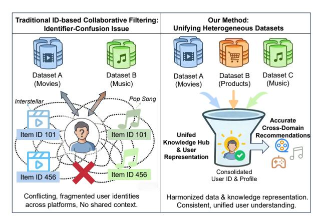
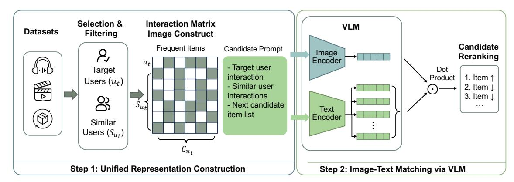
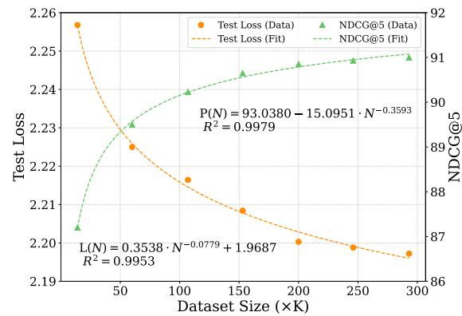
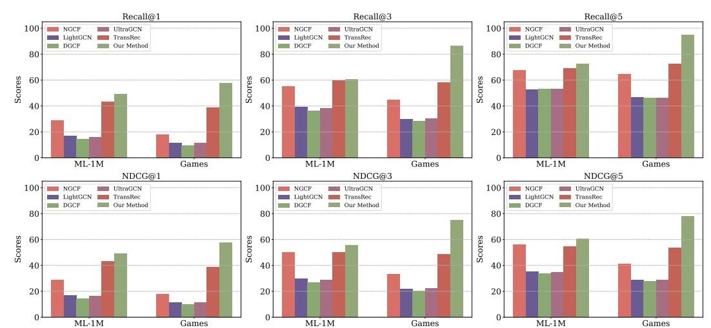
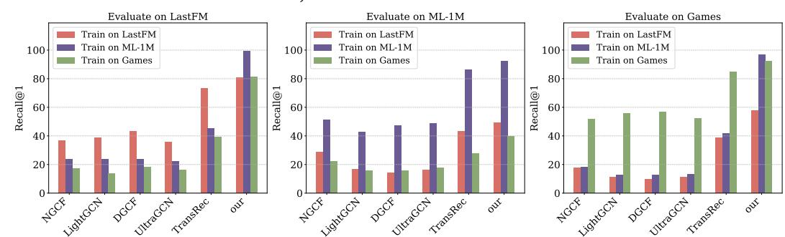

# Scaling Collaborative Filtering with Multimodal Contrastive Fine-tuning

[Liwei Jin](https://orcid.org/0009-0007-6529-0597) Wuhan University Wuhan, China jinliwei@whu.edu.cn

[Dan Luo](https://orcid.org/0000-0003-3243-2441) Lehigh University Bethlehem, United States danluo.ir@gmail.com

[Lixin Zou](https://orcid.org/0000-0001-6755-871X)∗ Wuhan University Wuhan, China zoulixin@whu.edu.cn

[Chenliang Li](https://orcid.org/0000-0003-3144-6374) Wuhan University Wuhan, China cllee@whu.edu.cn

[Xiangyang Luo](https://orcid.org/0000-0003-3225-4649) State Key Lab of Mathematical Engineering and Advanced Computing Zhengzhou, China xiangyangluo@126.com

[Xixun Lin](https://orcid.org/0009-0004-6645-0597) Institute of Information Engineering, Chinese Academy of Sciences Beijing, China linxixun@iie.ac.cn

[Liming Dong](https://orcid.org/0000-0002-8676-0363) National Defense University Beijing, China dlm14@tsinghua.org.cn

[Yifan Zhang](https://orcid.org/0009-0004-2152-8733) Wuhan University Wuhan, China zyifan@whu.edu.cn

# Abstract

Scaling laws have enabled large language models (LLMs) to achieve remarkable performance and strong generalization across diverse language understanding tasks, including few-shot, in-context, and zero-shot learning. While prior studies in large-scale collaborative filtering (CF) have revealed clear relationships between model performance and scaling factors such as data size and model capacity, little attention has been given to how heterogeneous datasets can be synergistically combined for recommender systems (RS). In particular, it remains unclear whether systematically integrating diverse recommendation datasets can yield scaling behaviors analogous to those observed in LLMs, while simultaneously addressing challenges such as cold-start recommendation and cross-domain transfer. In this paper, we present RecCLIP, a multimodal framework that reformulates user–item interactions as visual representations compatible with vision–language models (VLMs). RecCLIP compresses interaction signals and employs prompt-based ranking to enable unified representation across heterogeneous data sources. Extensive experiments reveal consistent power-law scaling trends with respect to data size, and demonstrate that RecCLIP achieves superior performance in both cold-start and cross-domain transfer scenarios. Our findings underscore the importance of data-centric design in recommender systems and provide practical insights into scaling them effectively. The code for replication is available at [https://github.com/jinliwei-1/RecCLIP.](https://github.com/jinliwei-1/RecCLIP)

### CCS Concepts

• Information systems → Recommender systems.

#### Keywords

Scaling laws, Collaborative Filtering, Large Multimodal Models

∗Corresponding author.

© 2026 Copyright held by the owner/author(s). ACM ISBN 979-8-4007-2307-0/2026/04 <https://doi.org/10.1145/3774904.3792523>

#### ACM Reference Format:

Liwei Jin, Dan Luo, Lixin Zou, Chenliang Li, Xiangyang Luo, Xixun Lin, Liming Dong, and Yifan Zhang. 2026. Scaling Collaborative Filtering with Multimodal Contrastive Fine-tuning. In Proceedings of the ACM Web Conference 2026 (WWW '26), April 13–17, 2026, Dubai, United Arab Emirates. ACM, New York, NY, USA, [12](#page-11-0) pages.<https://doi.org/10.1145/3774904.3792523>

# 1 Introduction

Scaling laws, which describe empirical relationships between model performance and factors such as model size, data size, and computational capacity, have been extensively validated in natural language processing [\[19\]](#page-8-0), computer vision [\[53\]](#page-9-0), and information retrieval [\[10\]](#page-8-1). Among these factors, scaling with respect to data size has proven particularly critical, as exemplified by GPT-3, which demonstrates that systematically increasing both parameters and training data yields predictable performance gains and enables breakthroughs in few-shot learning through unsupervised pretraining combined with meta-learning [\[3\]](#page-8-2). Moreover, scaling laws enable a more generalized learning paradigm, i.e., few-shot learning [\[44\]](#page-8-3), in-context learning [\[22\]](#page-8-4), and even zero-shot generalization [\[33\]](#page-8-5). These properties are especially appealing for collaborative filtering (CF) [\[65\]](#page-9-1), which infers user preferences by identifying behaviorally similar users or items and leveraging their collective patterns to generate recommendations. However, this reliance on historical interactions limits CF's ability to adapt to unseen users or items. Consequently, long-standing challenges such as cold-start recommendation [\[11\]](#page-8-6) and cross-domain transfer [\[29\]](#page-8-7), which demand robust generalization under sparse or unseen conditions, remain open problems—yet they can be naturally addressed by large-scale models through data scaling. This motivates us to investigate whether scaling laws for CF can be systematically established by integrating and unifying heterogeneous recommendation datasets.

However, unlike LLMs, which can seamlessly integrate training data from heterogeneous sources such as social media conversations, Wikipedia, books, news articles, and web pages [\[7,](#page-8-8) [63\]](#page-9-2), scaling up recommender systems from heterogeneous sources remains a non-trivial and largely unresolved task. In particular, the key challenge lies in unifying representations across heterogeneous sources. Existing studies have explored the impact of data size

[This work is licensed under a Creative Commons Attribution 4.0 International License.](https://creativecommons.org/licenses/by/4.0) WWW '26, Dubai, United Arab Emirates

Figure 1: Comparison between traditional ID-based collaborative filtering and our method. The left panel illustrates the identifier-confusion issue encountered in traditional IDbased recommendation, while the right panel demonstrates how our method unifies heterogeneous datasets.

within individual recommendation datasets [\[46,](#page-8-9) [54\]](#page-9-3), but they fall short due to the problem of identifier confusion, as shown in Figure [1.](#page-1-0) Typically, users and items in recommendation datasets are represented by arbitrary identifiers. For example, the item ID "101" in a movie dataset may correspond to the film Interstellar, while the same ID in a music dataset could represent a pop song. Directly using such raw identifiers obscures semantic distinctions across domains and inevitably confuses the model. In response, recent efforts making use of the LLMs, such as LLM4Rec [\[27\]](#page-8-10) and semantic-ID [\[12\]](#page-8-11) methods attempt to enrich identifiers with textual descriptions. Despite these advances, such approaches remain inherently metadata-dependent, and textual descriptions may not always be available due to privacy concerns. This motivates a more general ID-based collaborative filtering framework for unifying heterogeneous recommendation data.

In this work, we propose a new paradigm, termed RecCLIP, as illustrated in Figure [1.](#page-1-0) By projecting heterogeneous interaction data into a unified image space, our approach enables the model to capture the intrinsic structural reasoning of user-item interactions, independent of domain-specific semantics. This design mitigates identifier confusion and enables scalable, transferable collaborative filtering across diverse domains. Specifically, RecCLIP consists of three components: 1) Unified visual representation construction. For each dataset, we convert the interaction histories of the target user and similar users into a unified image representation compatible with vision–language models. As a result, CF signals from different data sources are naturally aligned within a unified space. 2) Textual prompt construction. We then transform the target user's historical interactions into a textual prompt, and append candidate items to the end of the sequence, guiding VLMs toward preference prediction. 3) Image–text matching. Finally, we rank candidate items by computing image–text alignment scores between the user interaction image and prompts of candidate items. Through this process, RecCLIP obtains a VLM that can understand and rank items across heterogeneous recommendation datasets in an identifier-agnostic and transferable manner. In summary, the contribution of this paper can be summarized as follows:

- We propose a novel framework, namely RecCLIP, which reformulates collaborative filtering as a vision-language matching problem. By eliminating reliance on dataset-specific identifiers, RecCLIP achieves an identifier-agnostic unifies representation across heterogeneous recommendation datasets.
- We conduct extensive experiments to explore the scaling effect against data size across heterogeneous datasets. Our results justify that RecCLIP exhibits a clear scaling law, wherein the test loss and ranking performance vary predictably with data size.
- We further show that RecCLIP enables a generalized learning paradigm, exhibiting strong generalization in both cold-start recommendation and cross-dataset transfer scenarios.

#### 2 Methodology

#### 2.1 Problem Formulation

Let U = {U1 , · · · , U�� } denote the collection of user sets, and V = {V1 , · · · , V�� } denote the collection of item sets aggregated from �� heterogeneous recommendation datasets. Each pair (U�� , V�� ) represents the user–item space of the ��-th dataset, which may differ significantly in domain, interaction patterns, and semantics (e.g., MovieLens, LastFM, Amazon). It is worth noting that this paper focuses on ID-based CF, i.e., learning solely from user–item interaction data without access to any user or item metadata.

To improve recommendation performance, a reranking process is typically applied to refine the initial recommendation list for each user. Let V �� = {�� �� 1 , . . . , ���� , . . . , ���� } denote the initial list containing �� items, where V �� ⊆ V�� for a given dataset V�� . The reranking procedure aims to generate a more optimal list V ���� = {�� 1 , . . . , ������ �� , . . . , ������ �� }, where �� &lt; ��, by reordering items according to a scoring function ��(��, ��) that quantifies the preference strength of a user �� toward a candidate item ��:

V ���� = Top�� ��∈V�� ��(��, ��). (1)

Therefore, the reranking model refines the initial candidate list V into an optimal recommendation list V ���� , effectively aligning the ranking with individual user preferences and thereby enhancing the overall recommendation quality. The objective of this work is to learn the scoring function ��(��, ��) from user–item interactions across �� heterogeneous datasets.

# 2.2 Unified Visual Representation Construction

Traditional CF methods, such as matrix factorization [\[20\]](#page-8-12), represent users and items as latent factors within a shared embedding space. Inspired by this idea, we reinterpret the interaction matrix as an image and reformulate CF as a vision–language matching problem. In particular, we construct unified representations by aligning user–item interactions (as images) with candidate items (as textual prompts), enabling effective relevance learning and scalable recommendation across heterogeneous data sources. This section presents our strategy to construct unified representation.

We first construct a binary user-item interaction matrix M ∈ {0, 1} |U |× |V |, where each entry encodes whether a user �� has interacted with an item ��. The mathematical definition of M is:

M(��, ��) = ( 1 if user �� interacts with item ��, 0 otherwise. (2)

Specifically, we replicate the matrix across three channels and map each entry with value 1 to a black pixel and each entry with value 0 to a white pixel. To this end, we achieve a unified representation of user–item interactions that abstracts away dataset-specific identifiers and enables the integration of heterogeneous recommendation datasets within a shared visual space.

#### 2.3 Preference Inference

This section presents our approach to leveraging the visual representation I���� together with a designed textual prompt to enable VLMs to perform user preference prediction. Our idea is to reformulate recommendation as an image–text matching problem, wherein the model evaluates the semantic alignment between the target user's interaction representation and each candidate item prompts.

2.3.1 Prompt for Candidate Item. To facilitate VLMs in executing reranking tasks, we instantiate a prompt for candidate item �� ∈ C���� according to the template P (C���� , ��). Please note that we instantiate the placeholders in the template by column indices of the corresponding items, instead of the original identifiers.

This design choice serves two key purposes. First, it eliminates the dependency on dataset-specific identifiers, thereby preventing identifier confusion when aggregating data from heterogeneous sources. Second, it allows the model to focus purely on the relational structure, i.e., collaborative filtering, encoded in the condensed interaction matrix, ensuring that the learned representations remain invariant to the naming or indexing conventions of different datasets. Through this abstraction, the VLM is guided to infer user preferences from the visual patterns in I���� while grounding its textual reasoning in the structural roles of the candidate items, rather than in their surface-level semantics.

#### Candidate Item Prompt Template

The target user history are in the first row, Ids are {Columns indices that the target user has interacted with}. Row 2 - {��} show the interactions of other users who are similar to the target user. The ID of the next candidate item is {Candidate Item Index}.

2.3.2 Ranking as Visual–Textual Alignment. To this end, we leverage VLMs to quantify the semantic alignment between the preconstructed interaction image I���� and the textual prompt P (C���� , ��) corresponding to a candidate item ��. Specifically, the VLM serves as the backbone for instantiating the learned relevance function defined in Eq. [1.](#page-1-1) Formally, we define the matching function as:

��(���� , ��) = Score(I���� , P (���� , ��); ��), (10)

where �� denotes the parameters of the vision–language model. We will introduce the optimization of this relevance function in the next subsection. Here, Score(·) measures the alignment between the visual embedding of the user's interaction representation and the textual embedding of the candidate item prompt. Thus, a higher score indicates a higher likelihood of user preference over item ��.

After obtaining the matching score ��(���� , ��), we utilize it to rerank the items within the candidate item set C���� . Formally, the final ranking for the target user ���� is produced by sorting all candidate items �� ∈ C���� in descending order of their corresponding scores:

V = Rankdesc ��(���� , ��) , �� ∈ C���� . (11)

Through this reranking process, items that exhibit stronger visual–textual alignment with the user's interaction representation are assigned higher ranks, thereby reflecting a higher predicted preference. This step effectively bridges the visual and textual modalities, transforming the matching signal learned by the VLM into a meaningful ranking over candidate items.

#### 2.4 Contrastive learning

Most VLMs are originally designed to capture semantic information from natural images and their textual descriptions, rather than structured interaction patterns. As a result, they are not directly suited for modeling user–item relationships from the interaction matrix I���� . To bridge this gap, we adopt a contrastive learning paradigm that aligns user–item interaction images with their corresponding textual representations.

Our contrastive loss is designed to maximize the similarity between the visual representation of the target user's interaction image and the textual representation of a positively interacted item, while simultaneously minimizing the similarity to those of negatively interacted items. Formally, given a target user ���� , a positively interacted item �� + , and a batch of B negative items {�� − 1 , ��− , . . . , ��− B }, we define the contrastive loss as:

L (��) = − log exp(��(���� , ��+ )) exp(��(���� , ��+)) + ÍB ��=1 exp(��(���� , ��− )) ! (12)

where ��(���� , ��) is instantiated in Eq. [10,](#page-3-0) which represents the alignment score between the visual representation I���� and the textual prompt P (���� , ��). It is worth mentioning that when constructing I���� , we need to exclude the positive item �� + from the image to avoid information leakage, i.e., the column corresponding to the positive item needs to be converted into white pixels.

This loss encourages the model to assign higher scores to positively interacted items while penalizing negative ones, thereby driving the learning of a discriminative relevance function capable of generalizing across heterogeneous datasets.

#### 3 Experiments

In this section, we conduct extensive experiments to evaluate the effectiveness of our proposed method. Specifically, our experiments are designed to address the following research questions:

- RQ1: Can RecCLIP exhibit scaling laws with respect to data size on heterogeneous recommendation datasets, analogous to those observed in LLMs?
- RQ2: How does RecCLIP perform compared to state-of-the-art baselines on the reranking task?
- RQ3: How does the generalization ability of RecCLIP compare with that of collaborative filtering (CF) methods, as well as methods specifically designed for cold-start and transfer learning scenarios—particularly in these two scenarios?
- RQ4: What are the contributions of the individual components of RecCLIP to the overall performance?

Table 1: Statistics of the datasets.

| Datasets       | LastFM-2K      | MovieLens-1M | Amazon Games |
|----------------|----------------|--------------|--------------|
| # Users        | 1,143          | 6,040        | 50,547       |
| # Items        | 11,854         | 3,706        | 16,859       |
| # Interactions | 68,436         | 1,000,209    | 389,718      |
| # Interactions | / # user 59.92 | 165.59       | 7.71         |
| # Interactions | / # item 5.77  | 269.88       | 23.11        |

#### 3.1 Experimental Setups

3.1.1 Datasets. To explore the generalization of the proposed model, we evaluate our approach on three widely recognized datasets: LastFM-2K [\[4\]](#page-8-13), MovieLens-1M [\[15\]](#page-8-14) and Amazon Games [\[31\]](#page-8-15). The statistics of these datasets are summarized in Table [1.](#page-4-0) We preprocess the data using 5-core filtering [\[16,](#page-8-16) [41\]](#page-8-17) and evaluate our approach under the leave-one-out protocol [\[13\]](#page-8-18).

3.1.2 Baselines. To comprehensively evaluate our method, we compare against the following baseline methods: GMF [\[17\]](#page-8-19), DLCM [\[2\]](#page-8-20), BM25 [\[35\]](#page-8-21), NGCF [\[41\]](#page-8-17), LightGCN [\[16\]](#page-8-16), DGCF [\[42\]](#page-8-22), UltraGCN [\[30\]](#page-8-23), RankGPT [\[37\]](#page-8-24), PNN [\[60\]](#page-9-4), and TIGER [\[34\]](#page-8-25). For the specialized cold-start and transferable recommendation scenarios, we include CLCRec [\[45\]](#page-8-26) and TransRec [\[38\]](#page-8-27). Detailed descriptions of all baselines are provided in the Appendix [B.](#page-9-5)

3.1.3 Experimental Protocols. Our method is initialized with a pretrained VLM. In this paper, we use the CLIP model as the backbone. To verify the general applicability of our method, we also used the BLIP [\[21\]](#page-8-28) model as the backbone to conduct experiments. In the training and testing phases, we set the number of negative samples B to 10. Training is conducted on 4 GPUs using a micro-batch size of 2 and 8 gradient accumulation steps, yielding a total batch size of 64. We use the AdamW optimizer with a learning rate of 5e-6 and a weight decay of 1e-3. We train for 10 epochs and adopt an early stopping mechanism. Further details can be found in Appendix [C.](#page-10-0)

To evaluate the ranking performance, we adopt the widely used metrics Recall@K (R@K) and NDCG@K (N@K). For both metrics, we report the results at ranks 1, 3, and 5 to show the performance of models on different positions, and all metrics are reported in percentages (%). Statistical differences are computed based on the paired t-test with �� ≤ 0.05.

#### 3.2 Data Size Scaling (RQ1)

This section investigates how data size influences model performance across heterogeneous datasets. The training data size, measured by the number of user-item interactions, is systematically varied across 14K (the full LastFM training set), 60K, 107K, 153K, 200K, 246K, and 293K samples, respectively. We evaluate each finetuned model on the LastFM test set to assess scaling laws with increasing data size.

Our experimental results are presented in Figure [3.](#page-4-1) While performance consistently improves with more data, the gains diminish, indicating that the model's performance progressively approaches saturation. As Figure [3](#page-4-1) illustrated, increasing the data size leads to a gradual decrease in test loss and a consistent improvement in NDCG@5. In particular, we model the scaling law with respect to data size. The test Loss �� is assumed to follow an inverse power law approaching an irreducible loss floor ��loss:

��(��) = �� · �� −�� + ��loss, (13)

Figure 3: Power-law scaling fits for test loss and NDCG@5. The markers represent observed empirical results, while the dashed curves denote the best-fit lines obtained from the inverse power-law model.

where �� represents the number of user-item interactions in the training set, ��(��) denotes the model's test loss, parameters �� and �� are the scaling coefficients, and ��loss is the asymptotic error as �� → ∞. Correspondingly, the performance metric �� is modeled as a saturating function approaching a performance ceiling ��perf:

�� (��) = ��perf − �� · �� −�� , (14)

where �� (��) denotes the NDCG@5 score on the test set, parameters �� and �� are the scaling coefficients, and ��perf represents the model's maximum achievable performance. In both cases, the coefficient of determination (�� ) indicates a good fit. Based on these results, we infer that the test loss and NDCG@5 score follow a power-law scaling relative to the data size. This finding justifies that **RecCLIP** is able to exhibit scaling laws with respect to data size on heterogeneous recommendation datasets.

#### 3.3 Overall Performance (RQ2)

In this section, we conduct a comprehensive comparison between RecCLIP and various baselines. Our results are summarized in Table [2,](#page-5-0) and we have the following observations.

**RecCLIP** significantly outperforms all baseline methods when optimized with heterogeneous datasets. This result demonstrates the effectiveness of RecCLIP for real-world recommender systems. Collaborative filtering is well known to suffer from data sparsity, which limits its ability to capture complex user–item relationships. In contrast, RecCLIP alleviates this limitation by leveraging heterogeneous datasets, enriching the training signal and improving recommendation performance. The observed gains stem from unifying heterogeneous data, which enables the model to learn richer and more comprehensive representations.

**RecCLIP** achieves superior performance without relying on item metadata. Existing methods, such as RankGPT and TIGER, require access to item semantic information for effective generalization, whereas RecCLIP outperforms them across all evaluation metrics using interaction data alone. This independence from semantic features is a key advantage of RecCLIP, particularly in settings where item metadata is sparse, unavailable, or restricted due to privacy concerns. We leave the integration of item metadata with RecCLIP for future work.

Table 2: Overall performance comparison between **RecCLIP** and baseline methods on LastFM-2K, MovieLens-1M, and Amazon Games. The best and second-best results in each column are highlighted in bold and underlined. "∗" indicates statistically significant improvement over the best baseline with ��-value ≤ 0.05.

| Method   | R@1   | R@3     | R@5     | LastFM-2K N@1 | N@3     | N@5     | R@1     | R@3     | R@5     | MovieLens-1M N@1 | N@3     | N@5     | R@1     | R@3     | Amazon R@5 | Games N@1 | N@3     | N@5     |
|----------|-------|---------|---------|---------------|---------|---------|---------|---------|---------|------------------|---------|---------|---------|---------|------------|-----------|---------|---------|
| GMF      | 63.45 | 72.18   | 76.54   | 63.45         | 68.32   | 70.15   | 78.23   | 83.56   | 87.12   | 78.23            | 81.45   | 82.98   | 75.12   | 81.34   | 85.67      | 75.12     | 78.90   | 80.45   |
| DLCM     | 65.80 | 74.20   | 78.10   | 65.80         | 70.50   | 72.80   | 80.15   | 85.90   | 88.45   | 80.15            | 83.40   | 84.90   | 77.30   | 83.10   | 86.80      | 77.30     | 80.50   | 82.10   |
| BM25     | 58.76 | 66.54   | 70.23   | 58.76         | 62.12   | 64.56   | 72.34   | 78.56   | 82.12   | 72.34            | 75.67   | 77.89   | 70.45   | 76.23   | 80.12      | 70.45     | 73.56   | 75.23   |
| NGCF     | 71.23 | 81.56   | 85.45   | 71.23         | 74.89   | 77.23   | 85.67   | 89.45   | 92.34   | 85.67            | 88.12   | 90.45   | 82.34   | 87.56   | 91.23      | 82.34     | 86.45   | 89.12   |
| LightGCN | 74.99 | 85.12   | 87.87   | 74.99         | 77.15   | 80.77   | 87.90   | 91.78   | 94.60   | 87.90            | 90.86   | 93.52   | 85.35   | 89.89   | 94.28      | 85.35     | 89.01   | 92.47   |
| DGCF     | 76.23 | 86.45   | 89.12   | 76.23         | 78.56   | 82.34   | 88.56   | 93.23   | 95.45   | 88.56            | 91.45   | 93.63   | 86.78   | 91.23   | 95.12      | 86.78     | 90.34   | 93.12   |
| UltraGCN | 77.45 | 87.12   | 89.56   | 77.45         | 79.89   | 83.12   | 89.12   | 94.56   | 96.23   | 89.12            | 92.34   | 93.89   | 87.45   | 92.12   | 95.89      | 87.45     | 91.56   | 93.78   |
| RankGPT  | 66.12 | 74.55   | 78.35   | 66.12         | 70.85   | 73.05   | 80.45   | 86.12   | 88.78   | 80.45            | 83.65   | 85.12   | 77.65   | 83.45   | 87.15      | 77.65     | 80.89   | 82.45   |
| TransRec | 73.45 | 83.12   | 86.50   | 73.45         | 76.10   | 79.25   | 86.12   | 89.85   | 92.80   | 86.12            | 88.45   | 90.95   | 84.85   | 89.15   | 93.45      | 84.85     | 88.20   | 91.50   |
| CLCRec   | 73.80 | 83.50   | 86.85   | 73.80         | 76.45   | 79.60   | 86.55   | 90.25   | 93.10   | 86.55            | 88.80   | 91.20   | 84.20   | 88.65   | 92.90      | 84.20     | 87.80   | 91.10   |
| PNN      | 69.45 | 79.10   | 82.30   | 69.45         | 73.50   | 75.80   | 88.65   | 92.15   | 94.90   | 88.65            | 91.20   | 93.85   | 81.20   | 86.40   | 90.10      | 81.20     | 85.10   | 87.50   |
| TIGER    | 77.20 | 86.50   | 89.80   | 77.20         | 83.10   | 84.90   | 86.50   | 90.80   | 93.90   | 86.50            | 89.40   | 91.50   | 88.10   | 94.20   | 96.50      | 88.10     | 92.50   | 93.80   |
| RecCLIP  | 80.65 | ∗ 89.75 | ∗ 92.29 | ∗ 80.65       | ∗ 86.18 | ∗ 87.20 | ∗ 92.53 | ∗ 98.46 | ∗ 98.86 | ∗ 92.53          | ∗ 96.21 | ∗ 96.37 | ∗ 92.36 | ∗ 97.98 | ∗ 98.34    | 92.36     | ∗ 95.24 | ∗ 95.70 |

Table 3: Cold-start recommendation performance comparison between **RecCLIP** and baseline methods on LastFM-2K, MovieLens-1M, and Amazon Games. The best and second-best results in each column are highlighted in bold and underlined. "∗" indicates statistically significant improvement over the best baseline with ��-value ≤ 0.05.

| Method   | R@1   | R@3     | R@5     | LastFM-2K N@1 | N@3     | N@5     | R@1     | R@3     | R@5    | MovieLens-1M N@1 | N@3     | N@5    | R@1     | R@3     | Amazon R@5 | Games N@1 | N@3     | N@5       |
|----------|-------|---------|---------|---------------|---------|---------|---------|---------|--------|------------------|---------|--------|---------|---------|------------|-----------|---------|-----------|
| NGCF     | 35.00 | 55.33   | 66.67   | 35.00         | 47.00   | 51.66   | 35.85   | 69.04   | 83.50  | 35.85            | 55.22   | 61.21  | 41.00   | 68.95   | 81.35      | 41.00     | 57.23   | 62.33     |
| LightGCN | 41.33 | 58.00   | 72.33   | 41.33         | 50.80   | 56.64   | 37.47   | 69.65   | 86.15  | 37.47            | 56.18   | 62.97  | 47.20   | 73.59   | 84.36      | 47.20     | 62.60   | 67.04     |
| DGCF     | 45.00 | 66.67   | 79.00   | 45.00         | 57.54   | 62.61   | 43.18   | 75.36   | 85.95  | 43.18            | 61.96   | 66.35  | 57.43   | 80.48   | 88.72      | 57.43     | 70.96   | 73.47     |
| UltraGCN | 36.00 | 55.67   | 64.00   | 36.00         | 47.54   | 50.93   | 35.23   | 70.06   | 85.13  | 35.23            | 55.45   | 61.73  | 40.91   | 68.88   | 81.90      | 40.91     | 57.20   | 62.56     |
| CLCRec   | 63.67 | 81.33   | 84.00   | 63.67         | 74.33   | 77.03   | 84.99   | 88.58   | 90.91  | 84.99            | 88.22   | 90.25  | 81.47   | 86.22   | 90.71      | 81.47     | 85.75   | 87.30     |
| RecCLIP  | 70.33 | ∗ 93.00 | ∗ 97.33 | ∗ 70.33       | ∗ 83.89 | ∗ 85.67 | ∗ 89.41 | ∗ 99.59 | ∗ 99.8 | ∗ 89.41          | ∗ 95.62 | ∗ 95.7 | ∗ 89.94 | ∗ 98.77 | ∗ 98.83    | ∗ 89.94   | ∗ 94.16 | ∗ 94.19 ∗ |

### 3.4 Generalization Analysis (RQ3)

3.4.1 Cold Start Recommendation. In this section, we investigate the how RecCLIP addresses the cold-start problem. Following prior work [\[58\]](#page-9-6), we catergroize the users in each dataset into two groups: regular users and cold-start users, based on their number of interactions, determined by a threshold hyperparameter �� . Specifically, �� is set to 10 for LastFM, 25 for MovieLens-1M, and 5 for Amazon Games. For the cold-start experiments, we adopt NGCF, LightGCN, DGCF, UltraGCN, and CLCRec as baseline models, particularly CLCRec is designed for cold-start scenarios.

The experimental results for cold-start setting are summarized in Table [3.](#page-5-1) Our method consistently achieves the best performance across all metrics and datasets. For example, on the Recall@3 metric, RecCLIP outperforms the strongest baseline by 14.3%, 12.4%, and 14.6% on the LastFM-2K, Amazon Games, and MovieLens-1M datasets, respectively.

These substantial gains highlight the superior generalization capability of RecCLIP under sparse user interaction settings. In summary, the results demonstrate that our method is well-equipped to handle cold-start scenarios and exhibits strong robustness against data sparsity.

3.4.2 Transferable Recommendation. This section investigates the transferability of RecCLIP across heterogeneous datasets. We train each model on a single source dataset and then evaluate its performance on two unseen target datasets. We compare RecCLIP to four competitive GNN–based models, including NGCF, LightGCN, DGCF, and UltraGCN, along with TransRec, a model specifically designed for transferable recommendation. For clarity, Figure [4](#page-6-0) illustrates the results of all methods trained on the LastFM dataset and tested on the MovieLens-1M and Amazon Games datasets. The comprehensive results are provided in Appendix [D.](#page-10-1) The results lead to the following observations.

**RecCLIP** demonstrates strong transferability, effectively generalizing to unseen domains. As shown in Figure [4,](#page-6-0) our proposal consistently and significantly outperforms all baseline models across all datasets and evaluation metrics. In addition, data scale is a key factor influencing the manifestation of the scaling law. As shown in Figure [5,](#page-6-1) RecCLIP achieves better performance when the model is trained on the MovieLens-1M or Amazon Games datasets and tested on LastFM. This discrepancy can be attributed to the larger data volumes of MovieLens-1M and Amazon Games, which provide richer interaction signals for learning transferable representations. The interaction density of the data sources also plays a crucial role in transferability. As shown in Table [1,](#page-4-0) the MovieLens-1M dataset exhibits a substantially higher user interaction density than LastFM, offering richer collaborative signals that facilitate stronger cross-domain generalization.

The above observations provide a principled strategy for leveraging RecCLIP: use large-scale, high-interaction datasets as foundation datasets to pretrain the model, and then fine-tune it on the target dataset, even when the latter is relatively small in scale.

Figure 4: Transferable recommendation performance comparison between **RecCLIP** and baselines on the MovieLens-1M and Amazon Games with different evaluation metrics, where all models are trained on the LastFM-2k dataset.

Figure 5: Transferable recommendation Recall@1 performance under in-domain and cross-domain training, highlighting the effect of data scale on cross-domain generalization.

Table 4: Ablation study on VLM backbones. The performance between alternatives is not significant with ��-value ≤ 0.05.

| Method | R@1   | R@3   | R@5          | LastFM-2K N@1 | N@3   | N@5   |
|--------|-------|-------|--------------|---------------|-------|-------|
| CLIP   | 80.65 | 89.75 | 92.29        | 80.65         | 86.18 | 87.2  |
| BLIP   | 79.84 | 88.96 | 92.11        | 79.84         | 85.47 | 87.52 |
| Method |       |       | MovieLens-1M |               |       |       |
|        | R@1   | R@3   | R@5          | N@1           | N@3   | N@5   |
| CLIP   | 92.53 | 98.46 | 98.86        | 92.53         | 96.21 | 96.37 |
| BLIP   | 93.12 | 98.22 | 98.91        | 93.12         | 96.85 | 96.42 |
| Method |       |       | Amazon       | Games         |       |       |
|        | R@1   | R@3   | R@5          | N@1           | N@3   | N@5   |
| CLIP   | 92.36 | 97.98 | 98.34        | 92.36         | 95.24 | 95.7  |
| BLIP   | 91.78 | 98.06 | 98.15        | 91.78         | 95.58 | 95.41 |

#### 3.5 Ablation Study (RQ4)

Our ablation study investigates the influence of the choice of backbone architecture and the column selection strategy.

3.5.1 Backbone Analysis. To investigate the general applicability of our method across different backbones, we compare CLIP with

Table 5: Ablation study of column selection strategy on LastFM-2K. "∗" indicates statistically significant improvement over the baseline with ��-value ≤ 0.05.

BLIP. We use BLIP with the blip-itm-coco variant. Experimental results are shown in Table [4.](#page-6-2) The results demonstrate that the performance differences among various VLM backbones are not statistically significant. This indicates that the core mechanism of RecCLIP can effectively adapt to different pre-trained models, further validating the general applicability of our approach.

3.5.2 Column Selection Strategy. We compare different column selection strategies in the image construction process. Specifically, we replace the frequency-based column selection with a random column selection strategy to assess its impact on performance. The experimental results are presented in Table [5.](#page-6-3)

From the experimental results, we observe that the performance metrics drop sharply when columns are selected at random. This finding confirms the effectiveness of our high-frequency column selection strategy, which maximizes the retention of interaction information and maintains sufficient interaction density.

### 4 Related Work

### 4.1 Large Model-based Recommendation

LLM-based Recommendation leverages the text understanding, generation, and reasoning capabilities of LLMs to enhance the personalization, interpretability, and efficiency of recommender systems [\[6,](#page-8-29) [49,](#page-9-7) [62\]](#page-9-8). Existing methods explore automatic content generation [\[1\]](#page-8-30), semantic representation learning [\[24\]](#page-8-31), and the discovery of latent relational structures for sequential recommendation [\[48\]](#page-8-32). Specially designed prompts are also used to exploit the contextual learning abilities of LLMs for zero-shot recommendation [\[39\]](#page-8-33). More recently, generative recommendation systems have emerged as a promising paradigm [\[9\]](#page-8-34). These methods learn to map item to semantic ID according to item metadata, and use generative retrieval to directly predict the semantic ID of the next item.

Given that LLMs mainly rely on textual input and may contain factual errors [\[61\]](#page-9-9), recent studies have explored VLMs to incorporate richer user-item interaction signals. VLM-based recommendation leverages these models to process and integrate diverse data types such as text, images, and videos, enabling more comprehensive user and item representations and addressing the limitations of traditional text-based recommender systems [\[18,](#page-8-35) [25,](#page-8-36) [28,](#page-8-37) [57\]](#page-9-10). Despite these advances, existing LLM- and VLM-based recommendation methods share a common limitation: a strong dependence on itemor user-side metadata, such as textual descriptions, images, or attributes, to enable generalization and cross-domain transfer. To the best of our knowledge, this work is the first to investigate the use of VLMs to directly scale from raw user–item interaction patterns alone, without relying on external metadata, thereby enabling a unified representation for cross-domain recommendation.

#### 4.2 Transferable and Cold-start Recommendation

Transferable recommendation aims to enhance model performance in new domains by leveraging knowledge across datasets, addressing data sparsity or cold-start issues in scenarios like e-commerce and social media [\[50,](#page-9-11) [52\]](#page-9-12). Early methods relied on explicit overlaps and mapping functions [\[55,](#page-9-13) [59\]](#page-9-14), while recent efforts such as RUN-SRec [\[56\]](#page-9-15) attempt to learn universal representations using textual information and contrastive learning. However, inconsistent user and item identifiers across domains remain a challenge, limiting the generalization ability of the dominant IDRec paradigm [\[51\]](#page-9-16). Nonetheless, domain-specific discrepancies hinder truly unified modeling [\[36\]](#page-8-38), and scaling laws, though promising, have not been fully validated in recommendation settings.

The cold start problem, where systems fail to generate quality recommendations for new users or items due to insufficient data, remains a critical challenge with direct impacts on user engagement and business growth [\[23,](#page-8-39) [64\]](#page-9-17). To address this, the research community has developed various approaches. For example, [Cohen](#page-8-40) [et al.](#page-8-40) [\[8\]](#page-8-40) proposed mapping item attributes to latent spaces via a learned Gaussian distribution. [Hao et al.](#page-8-41) [\[14\]](#page-8-41) introduced MPT, a more general pre-training framework that enhances a Graph Neural Network with a transformer and contrastive learning to better

leverage node features. Recently, in sequential recommendation, CMCLRec [\[47\]](#page-8-42) tackled user cold start by using cross-modal contrastive learning to generate synthetic behavioral sequences from user features. Despite these advances, existing methods share a common reliance on auxiliary semantic features. This dependency, however, introduces a fundamental bottleneck in practice: such side information is frequently unavailable, whether due to stringent privacy regulations or users' own data-sharing preferences. This severely limits real-world applicability, thereby creating a need for methods that operate effectively without external supervision, a need that this paper directly addresses.

# 4.3 Scaling Law in Recommendation

Scaling laws describe that performance improves with scale, successfully applied in language modeling and graph-based recommendation [\[43\]](#page-8-43). Current efforts to harness these laws follow three main paradigms: (1) designing self-supervised tasks, often using generative models like GANs or diffusions to augment sparse data [\[5,](#page-8-44) [40\]](#page-8-45); (2) leveraging large-scale language or multimodal models to process item content via Transformer architectures [\[26,](#page-8-46) [40\]](#page-8-45); and (3) integrating recommenders as tools within LLM agent frameworks for personalization [\[39\]](#page-8-33). However, current scaling laws for recommender systems are limited by data sparsity. To address this, we propose a unified multimodal method aligning visual and textual data via contrastive learning. This approach models user-item interactions from a multimodal perspective, improving scalability and cross-domain generalization while adhering to scaling laws.

# 5 Conclusion and Future Work

In this work, we propose RecCLIP, a novel paradigm that establishes the scaling law for collaborative filtering using heterogeneous datasets. We reformulate collaborative filtering as a vision– language matching problem, thereby addressing the issue of identifier dependence and enabling an identifier-agnostic representation space. In particular, RecCLIP converts user–item interactions into visual and textual modalities, unifying heterogeneous recommendation datasets under a shared multimodal framework and laying the foundation for the emergence of scaling laws in recommendation. Extensive experiments demonstrate that RecCLIP exhibits predictable scaling laws with respect to data size, shows strong generalization in cold-start and cross-domain transfer scenarios, and maintains robustness across different backbone architectures. These findings suggest that RecCLIP provides a principled foundation for developing scalable and transferable recommender systems. A natural direction for future work is to incorporate available textual information to further enhance RecCLIP. It would also be valuable to explore alternative image representations, ranging from binary to grayscale formats, to capture richer interaction patterns.

# Acknowledgement

We express our gratitude for the support provided by the National Natural Science Foundation of China (NO. U23A20305 and NO. 62302345), Innovation Scientists and Technicians Troop Construction Projects of Henan Province (No 254000510007) and the Xiaomi Young Scholar Program.

#### References

- [1] Arkadeep Acharya, Brijraj Singh, and Naoyuki Onoe. 2023. LLM Based Generation of Item-Description for Recommendation System. In RecSys 2023. ACM, 1204–1207. [2] Qingyao Ai, Keping Bi, Jiafeng Guo, and W Bruce Croft. 2018. Learning a deep listwise context model for ranking refinement. In SIGIR 2018. ACM, 135–144. [3] Tom B. Brown, Benjamin Mann, Nick Ryder, Melanie Subbiah, Jared Kaplan, Prafulla Dhariwal, Arvind Neelakantan, Pranav Shyam, Girish Sastry, Amanda Askell, Sandhini Agarwal, Ariel Herbert-Voss, Gretchen Krueger, Tom Henighan, Rewon Child, Aditya Ramesh, Daniel M. Ziegler, Jeffrey Wu, Clemens Winter, Christopher Hesse, Mark Chen, Eric Sigler, Mateusz Litwin, Scott Gray, Benjamin Chess, Jack Clark, Christopher Berner, Sam McCandlish, Alec Radford, Ilya Sutskever, and Dario Amodei. 2020. Language Models are Few-Shot Learners. In NeurIPS 2020. [4] Iván Cantador, Peter Brusilovsky, and Tsvi Kuflik. 2011. Second workshop on information heterogeneity and fusion in recommender systems (HetRec2011). In RecSys 2011. ACM, 387–388. [5] Chien Chin Chen, Po-Lin Lai, and Chih-Yun Chen. 2023. ColdGAN: an effective cold-start recommendation system for new users based on generative adversarial networks. Applied Intelligence 53, 7 (2023), 8302–8317. [6] Zhikai Chen, Haitao Mao, Hang Li, Wei Jin, Hongzhi Wen, Xiaochi Wei, Shuaiqiang Wang, Dawei Yin, Wenqi Fan, Hui Liu, and Jiliang Tang. 2023. Exploring the Potential of Large Language Models (LLMs)in Learning on Graphs. SIGKDD Explor. 25, 2 (2023), 42–61. [7] Aakanksha Chowdhery, Sharan Narang, Jacob Devlin, Maarten Bosma, Gaurav Mishra, Adam Roberts, Paul Barham, Hyung Won Chung, Charles Sutton, Sebastian Gehrmann, Parker Schuh, Kensen Shi, Sasha Tsvyashchenko, Joshua Maynez, Abhishek Rao, Parker Barnes, Yi Tay, et al. 2023. PaLM: Scaling Language Modeling with Pathways. J. Mach. Learn. Res. 24 (2023), 240:1–240:113. [8] Deborah Cohen, Michal Aharon, Yair Koren, Oren Somekh, and Raz Nissim. 2017. Expediting Exploration by Attribute-to-Feature Mapping for Cold-Start Recommendations. In RecSys 2017. ACM, 184–192. [9] Jiaxin Deng, Shiyao Wang, Kuo Cai, Lejian Ren, Qigen Hu, Weifeng Ding, Qiang Luo, and Guorui Zhou. 2025. OneRec: Unifying Retrieve and Rank with Generative Recommender and Iterative Preference Alignment. CoRR abs/2502.18965 (2025). [10] Yan Fang, Jingtao Zhan, Qingyao Ai, Jiaxin Mao, Weihang Su, Jia Chen, and Yiqun Liu. 2024. Scaling Laws For Dense Retrieval. In SIGIR 2024. ACM, 1339–1349. [11] Christian Ganhör, Marta Moscati, Anna Hausberger, Shah Nawaz, and Markus Schedl. 2024. A Multimodal Single-Branch Embedding Network for Recommendation in Cold-Start and Missing Modality Scenarios. In RecSys 2024. ACM, 380–390. [12] Christian Ganhör, Marta Moscati, Anna Hausberger, Shah Nawaz, and Markus Schedl. 2025. Single-Branch Network Architectures to Close the Modality Gap in Multimodal Recommendation. ACM Transactions on Recommender Systems (2025). [13] Jingtong Gao, Bo Chen, Xiangyu Zhao, Weiwen Liu, Xiangyang Li, Yichao Wang, Wanyu Wang, Huifeng Guo, and Ruiming Tang. 2025. LLM4Rerank: LLM-based Auto-Reranking Framework for Recommendations. In WWW 2025. ACM, 228–
- 239. [14] Bowen Hao, Hongzhi Yin, Jing Zhang, Cuiping Li, and Hong Chen. 2023. A Multi-strategy-based Pre-training Method for Cold-start Recommendation. ACM Trans. Inf. Syst. 41, 2 (2023), 31:1–31:24. [15] F. Maxwell Harper and Joseph A. Konstan. 2016. The MovieLens Datasets: History and Context. ACM Trans. Interact. Intell. Syst. 5, 4 (2016), 19:1–19:19. [16] Xiangnan He, Kuan Deng, Xiang Wang, Yan Li, Yong-Dong Zhang, and Meng Wang. 2020. LightGCN: Simplifying and Powering Graph Convolution Network for Recommendation. In SIGIR 2020. ACM, 639–648. [17] Xiangnan He, Lizi Liao, Hanwang Zhang, Liqiang Nie, Xia Hu, and Tat-Seng Chua. 2017. Neural Collaborative Filtering. In WWW 2017. 173–182. [18] Yanbiao Ji, Dan Luo, Chang Liu, Shaokai Wu, Jing Tong, Qichen He, Deyi Ji, Hongtao Lu, and Yue Ding. [n. d.]. Generating Negative Samples for Multi-Modal Recommendation. In ACM MM 2025. [19] Jared Kaplan, Sam McCandlish, Tom Henighan, Tom B. Brown, Benjamin Chess, Rewon Child, Scott Gray, Alec Radford, Jeffrey Wu, and Dario Amodei. 2020. Scaling Laws for Neural Language Models. CoRR abs/2001.08361 (2020). [20] Yehuda Koren, Robert M. Bell, and Chris Volinsky. 2009. Matrix Factorization Techniques for Recommender Systems. Computer 42, 8 (2009), 30–37. [21] Junnan Li, Dongxu Li, Caiming Xiong, and Steven C. H. Hoi. 2022. BLIP: Bootstrapping Language-Image Pre-training for Unified Vision-Language Understanding and Generation. In ICML 2022. PMLR, 12888–12900. [22] Shiyang Li, Jianshu Chen, Yelong Shen, Zhiyu Chen, Xinlu Zhang, Zekun Li, Hong Wang, Jing Qian, Baolin Peng, Yi Mao, Wenhu Chen, and Xifeng Yan. 2022. Explanations from Large Language Models Make Small Reasoners Better. CoRR abs/2210.06726 (2022). [23] Zihao Li, Qiang Chen, Lixin Zou, Aixin Sun, and Chenliang Li. 2025. Multi-Interest Recommendation: A Survey. CoRR abs/2506.15284 (2025). [24] Zihao Li, Yakun Chen, Tong Zhang, and Xianzhi Wang. 2025. Reembedding and Reweighting are Needed for Tail Item Sequential Recommendation. In WWW 2025. ACM, 4925–4936. [25] Feng Liu, Lixin Zou, Xiangyu Zhao, Min Tang, Liming Dong, Dan Luo, Xiangyang Luo, and Chenliang Li. 2025. Flow Matching Based Sequential Recommender Model. (2025), 3108–3116. [26] Kang Liu, Feng Xue, Dan Guo, Peijie Sun, Shengsheng Qian, and Richang Hong. 2023. Multimodal Graph Contrastive Learning for Multimedia-Based Recommendation. IEEE Trans. Multim. 25 (2023), 9343–9355. [27] Hanjia Lyu, Song Jiang, Hanqing Zeng, Yinglong Xia, Qifan Wang, Si Zhang, Ren Chen, Christopher Leung, Jiajie Tang, and Jiebo Luo. 2024. LLM-Rec: Personalized Recommendation via Prompting Large Language Models. In Findings of NAACL 2024. Association for Computational Linguistics. [28] Daniele Malitesta, Giandomenico Cornacchia, Claudio Pomo, Felice Antonio Merra, Tommaso Di Noia, and Eugenio Di Sciascio. 2025. Formalizing Multimedia Recommendation through Multimodal Deep Learning. Trans. Recomm. Syst. 3, 3 (2025), 37:1–37:33. [29] Tong Man, Huawei Shen, Xiaolong Jin, and Xueqi Cheng. 2017. Cross-Domain Recommendation: An Embedding and Mapping Approach. In IJCAI 2017. 2464– 2470. [30] Kelong Mao, Jieming Zhu, Xi Xiao, Biao Lu, Zhaowei Wang, and Xiuqiang He. 2021. UltraGCN: Ultra Simplification of Graph Convolutional Networks for Recommendation. In CIKM '21. ACM, 1253–1262. [31] Julian J. McAuley, Christopher Targett, Qinfeng Shi, and Anton van den Hengel. 2015. Image-Based Recommendations on Styles and Substitutes. In SIGIR 2015. ACM, 43–52. [32] OpenAI. 2023. GPT-4 Technical Report. CoRR abs/2303.08774 (2023). [33] Alec Radford, Jeffrey Wu, Rewon Child, David Luan, Dario Amodei, Ilya Sutskever, et al. 2019. Language models are unsupervised multitask learners. OpenAI blog 1, 8 (2019), 9. [34] Shashank Rajput, Nikhil Mehta, Anima Singh, Raghunandan Hulikal Keshavan, Trung Vu, Lukasz Heldt, Lichan Hong, Yi Tay, Vinh Q. Tran, Jonah Samost, Maciej Kula, Ed H. Chi, and Mahesh Sathiamoorthy. 2023. Recommender Systems with Generative Retrieval. In NeurIPS 2023. [35] Stephen Robertson, Hugo Zaragoza, et al. 2009. The probabilistic relevance framework: BM25 and beyond. Foundations and Trends® in Information Retrieval 3, 4 (2009), 333–389. [36] Kyuyong Shin, Hanock Kwak, Su Young Kim, Max Nihlén Ramström, Jisu Jeong, Jung-Woo Ha, and Kyung-Min Kim. 2023. Scaling Law for Recommendation Models: Towards General-Purpose User Representations. In AAAI 2023. AAAI Press, 4596–4604. [37] Weiwei Sun, Lingyong Yan, Xinyu Ma, Shuaiqiang Wang, Pengjie Ren, Zhumin Chen, Dawei Yin, and Zhaochun Ren. 2023. Is ChatGPT Good at Search? Investigating Large Language Models as Re-Ranking Agents. In EMNLP 2023. Association for Computational Linguistics, 14918–14937. [38] Jie Wang, Fajie Yuan, Mingyue Cheng, Joemon M. Jose, Chenyun Yu, Beibei Kong, Zhijin Wang, Bo Hu, and Zang Li. 2024. TransRec: Learning Transferable Recommendation from Mixture-of-Modality Feedback. In APWeb-WAIM 2024, Vol. 14962. Springer, 193–208. [39] Lei Wang and Ee-Peng Lim. 2024. The Whole is Better than the Sum: Using Aggregated Demonstrations in In-Context Learning for Sequential Recommendation. (2024), 876–895. [40] Wenjie Wang, Yiyan Xu, Fuli Feng, Xinyu Lin, Xiangnan He, and Tat-Seng Chua. 2023. Diffusion Recommender Model. In SIGIR 2023. ACM, 832–841. [41] Xiang Wang, Xiangnan He, Meng Wang, Fuli Feng, and Tat-Seng Chua. 2019. Neural graph collaborative filtering. In SIGIR 2019. 165–174. [42] Xiang Wang, Hongye Jin, An Zhang, Xiangnan He, Tong Xu, and Tat-Seng Chua. 2020. Disentangled Graph Collaborative Filtering. In SIGIR 2020. ACM, 1001–1010. [43] Xinyuan Wang, Liang Wu, Liangjie Hong, Hao Liu, and Yanjie Fu. 2025. LLM-Enhanced User-Item Interactions: Leveraging Edge Information for Optimized Recommendations. ACM Trans. Intell. Syst. Technol. 16, 5 (2025), 117:1–117:24. [44] Jason Wei, Yi Tay, Rishi Bommasani, Colin Raffel, Barret Zoph, Sebastian Borgeaud, Dani Yogatama, Maarten Bosma, Denny Zhou, Donald Metzler, Ed H. Chi, Tatsunori Hashimoto, Oriol Vinyals, Percy Liang, Jeff Dean, and William Fedus. 2022. Emergent Abilities of Large Language Models. Trans. Mach. Learn. Res. 2022 (2022). [45] Yinwei Wei, Xiang Wang, Qi Li, Liqiang Nie, Yan Li, Xuanping Li, and Tat-Seng Chua. 2021. Contrastive Learning for Cold-Start Recommendation. In ACM MM 2021. ACM, 5382–5390. [46] Likang Wu, Zhi Zheng, Zhaopeng Qiu, Hao Wang, Hongchao Gu, Tingjia Shen, Chuan Qin, Chen Zhu, Hengshu Zhu, Qi Liu, Hui Xiong, and Enhong Chen. 2024. A survey on large language models for recommendation. World Wide Web (WWW) 27, 5 (2024), 60. [47] Xiaolong Xu, Hongsheng Dong, Lianyong Qi, Xuyun Zhang, Haolong Xiang, Xiaoyu Xia, Yanwei Xu, and Wanchun Dou. 2024. CMCLRec: Cross-modal Contrastive Learning for User Cold-start Sequential Recommendation. In SIGIR 2024. ACM, 1589–1598. [48] Shenghao Yang, Weizhi Ma, Peijie Sun, Qingyao Ai, Yiqun Liu, Mingchen Cai, and Min Zhang. 2024. Sequential Recommendation with Latent Relations based

on Large Language Model. In SIGIR 2024. ACM, 335–344. [49] Qing Yu, Xiaobei Wang, Shuchang Liu, Xiaoyu Yang, Xueliang Wang, Chang Meng, Shanshan Wu, Bin Wen, Huihui Xiao, Xiang Li, et al. [n. d.]. Who You Are Matters: Bridging Interests and Social Roles via LLM-Enhanced Logic Recommendation. In NeurIPS 2025. [50] Qing Yu, Lixin Zou, Xiangyang Luo, Xiangyu Zhao, and Chenliang Li. 2025. Uniform Graph Pre-training and Prompting for Transferable Recommendation. ACM Trans. Inf. Syst. 43, 4 (2025), 101:1–101:26. [51] Zheng Yuan, Fajie Yuan, Yu Song, Youhua Li, Junchen Fu, Fei Yang, Yunzhu Pan, and Yongxin Ni. 2023. Where to Go Next for Recommender Systems? ID- vs. Modality-based Recommender Models Revisited. In SIGIR 2023. ACM, 2639–2649. [52] Tianzi Zang, Yanmin Zhu, Haobing Liu, Ruohan Zhang, and Jiadi Yu. 2023. A Survey on Cross-domain Recommendation: Taxonomies, Methods, and Future Directions. ACM Trans. Inf. Syst. 41, 2 (2023), 42:1–42:39. [53] Xiaohua Zhai, Alexander Kolesnikov, Neil Houlsby, and Lucas Beyer. 2022. Scaling Vision Transformers. In CVPR 2022. IEEE, 1204–1213. [54] Buyun Zhang, Liang Luo, Yuxin Chen, Jade Nie, Xi Liu, Shen Li, Yanli Zhao, Yuchen Hao, Yantao Yao, Ellie Dingqiao Wen, Jongsoo Park, Maxim Naumov, and Wenlin Chen. 2024. Wukong: Towards a Scaling Law for Large-Scale Recommendation. In ICML 2024. [55] Jinghao Zhang, Guofan Liu, Qiang Liu, Shu Wu, and Liang Wang. 2024. Modality-Balanced Learning for Multimedia Recommendation. In ACM MM 2024. ACM, 7551–7560. [56] Junjie Zhang, Wenqi Sun, Yupeng Hou, Wayne Xin Zhao, and Ji-Rong Wen. 2025. Review-Enhanced Universal Sequence Representation Learning for Recommender Systems. ACM Trans. Inf. Syst. 43, 3 (2025), 74:1–74:31. [57] Wanjie Zhang, Yajun Du, Hongyang Wang, Jia Liu, and Xianyong Li. 2025. SSEDF: A Shared–Private Semantic Enhanced Dynamic Fusion Network for Multimodal Sentiment Analysis. Expert Systems with Applications (2025), 130667. [58] Xiangyu Zhang, Zongqiang Kuang, Zehao Zhang, Fan Huang, and Xianfeng Tan. 2023. Cold & Warm Net: Addressing Cold-Start Users in Recommender Systems. In DASFAA 2023, Vol. 13946. Springer, 532–543. [59] Cheng Zhao, Chenliang Li, Rong Xiao, Hongbo Deng, and Aixin Sun. 2020. CATN: Cross-Domain Recommendation for Cold-Start Users via Aspect Transfer Network. In SIGIR 2020. ACM, 229–238. [60] Yuhan Zhao, Rui Chen, Qilong Han, Hongtao Song, and Li Chen. 2024. Unlocking the hidden treasures: Enhancing recommendations with unlabeled data. In RecSys 2024. 247–256. [61] Zihuai Zhao, Wenqi Fan, Jiatong Li, Yunqing Liu, Xiaowei Mei, Yiqi Wang, Zhen Wen, Fei Wang, Xiangyu Zhao, Jiliang Tang, and Qing Li. 2024. Recommender Systems in the Era of Large Language Models (LLMs). IEEE Trans. Knowl. Data Eng. 36, 11 (2024), 6889–6907. [62] Xin Zheng, Yajun Du, and Xiaolin Qin. 2025. Multi-level Semantics-aware and Multi-granularity Knowledge-infused Model for Emotional Support Conversation. Information Fusion (2025), 103968. [63] Lixin Zou, Weixue Lu, Yiding Liu, Hengyi Cai, Xiaokai Chu, Dehong Ma, Daiting Shi, Yu Sun, Zhicong Cheng, Simiu Gu, Shuaiqiang Wang, and Dawei Yin. 2023. Pre-trained Language Model-based Retrieval and Ranking for Web Search. ACM Trans. Web 17, 1 (2023), 4:1–4:36. [64] Lixin Zou, Long Xia, Zhuoye Ding, Jiaxing Song, Weidong Liu, and Dawei Yin. 2019. Reinforcement Learning to Optimize Long-term User Engagement in Recommender Systems. In KDD 2019. ACM, 2810–2818. [65] Lixin Zou, Long Xia, Yulong Gu, Xiangyu Zhao, Weidong Liu, Jimmy Xiangji Huang, and Dawei Yin. 2020. Neural Interactive Collaborative Filtering. In SIGIR 2020. ACM, 749–758.

#### A Dataset

Three real-world recommendation datasets are used to evaluate the performance of RecCLIP and other baselines. The details of these datasets are as follows:

- LastFM-2K [\[4\]](#page-8-13) is a music recommendation dataset of user–artist listening interactions, with play counts serving as implicit feedback for long-term user preferences.
- MovieLens-1M [\[15\]](#page-8-14) is a movie recommendation dataset with explicit user ratings across a broad range of films and genres.
- Amazon Games [\[31\]](#page-8-15) is a video game subset of the Amazon Review dataset containing user–product interactions with both implicit and explicit feedback.

#### B Baselines

To comprehensively evaluate the performance of our method, we select several highly representative and widely recognized baseline methods as follows:

- GMF [\[17\]](#page-8-19) generalizes matrix factorization with a neural network framework. It uses the element-wise product of user and item embeddings to model their interaction, which captures complex relationships for recommendation.
- DLCM [\[2\]](#page-8-20) leverages a recurrent neural network and optimizes the model with an attention-based loss function.
- BM25 [\[35\]](#page-8-21) is a classical probabilistic retrieval model for document ranking. In our adaptation to recommendation, we redefine term frequency (TF) and inverse document frequency (IDF) over items: TF is the number of co-occurrence between the user's historical items and a candidate item, while IDF reflects item rarity (items interacted with by fewer users receive higher IDF).
- NGCF [\[41\]](#page-8-17) applies graph convolutional networks on user–item bipartite graphs. It propagates embeddings across layers to capture high-order connectivity.
- LightGCN [\[16\]](#page-8-16) simplifies graph convolution by removing nonlinear activations and weight transformations. It only aggregates neighbor embeddings and averages across layers, achieving strong performance with low complexity.
- DGCF [\[42\]](#page-8-22) models users' multiple latent interests. It learns several independent intent factors on the user–item graph, allowing more precise recommendations that reflect diverse behaviors.
- UltraGCN [\[30\]](#page-8-23) reformulates graph convolution as constraintbased optimization within the objective function, effectively approximating high-order connectivity through regularization terms rather than explicit message passing.
- RankGPT [\[37\]](#page-8-24) formulates the ranking problem as a sequence generation task, leveraging LLMs to directly produce ranked item lists.
- PNN [\[60\]](#page-9-4) redefines the conventional positive–negative learning paradigm in recommendation by introducing a neutral class for ambiguous or unlabeled items. This design establishes a more expressive three-way partial order (positive ≻ neutral ≻ negative), enabling the model to capture nuanced user preferences and better leverage implicit feedback from unlabeled interactions.
- TIGER [\[34\]](#page-8-25) pioneers a generative retrieval paradigm by employing a Residual Quantized VAE (RQ-VAE) to map items into hierarchical semantic identifiers. By training a Transformer to autoregressively predict these semantic codes based on interaction history, TIGER effectively captures latent item correlations that distinct ID-based methods often overlook.

To validate the performance of RecCLIP in the cold start and transferable recommendation scenarios, we select baselines that are specifically designed for these two scenarios respectively.

- CLCRec [\[45\]](#page-8-26) leverages contrastive learning to align item content features with collaborative signals, enhancing representation quality through self-supervised objectives. By bridging semantic and interaction spaces, CLCRec effectively alleviates the coldstart problem for items with limited user interactions and improves recommendation accuracy in sparse data scenarios.
- TransRec [\[38\]](#page-8-27) relies solely on item textual semantics to model user–item interactions through a tower-based architecture, which discards ID-dependent user and item representations. This design

enables transferable recommendation across domains and maintains robust performance even under sparse or heterogeneous data conditions.

#### C Implementation Details

In this section, we elaborate the implementation detail in this work. Both �� and �� are set to 224, following the image resolution used of CLIP and BLIP, respectively. In Section [3.2,](#page-4-2) we fix the model size throughout all experiments, adopting ViT-B/32 as the vision backbone of the CLIP framework. For GMF, DLCM, NDCG, LightGCN, DGCF and UltraGCN, we set the learning rate at 1e-3 and weight decay at 1e-4. For BM25, we set k1 at 1.2 and b at 0.75. For RankGPT, GPT-4o-mini [\[32\]](#page-8-47) is selected as the default LLM backbone. Experiments are conducted on 4 Nvidia 3090 GPUs.

#### D Complete Experimental Results of Transferable Recommendation

In this section, we present the comprehensive experimental results of transferable recommendation to supplement the analysis in the main text. Table [6](#page-11-1) reports the complete performance comparison when models are trained on one source dataset and evaluated on both the source dataset (in-domain) and the target datasets (crossdomain), allowing us to examine the transferability in different perspectives.

For cross-domain performance, **RecCLIP** demonstrates superior generalization capability when compared with all baseline models. As shown in Table [6,](#page-11-1) when transferring from MovieLens-1M to LastFM, RecCLIP achieves a Recall@1 of 99.30% and a Normalized Discounted Cumulative Gain (NDCG@1) of 99.30%. This represents a significant improvement over the bestperforming baseline, TransRec, which scored 45.23% in both metrics. Similar substantial gains are observed in other transfer scenarios. When transferring from MovieLens-1M to Amazon Games, our model's Recall@1 of 92.67% starkly contrasts with TransRec's 41.76%. This pattern of outperformance is consistent across all evaluation metrics, including Recall and NDCG at various cutoffs (R@1, R@3, R@5, N@1, N@3, N@5), underscoring the model's enhanced ability to learn transferable representations for users and items that remain effective even when applied to new, unseen domains.

For in-domain performance, while all models experience performance degradation when transferring to new domains, **RecCLIP** exhibits the smallest performance drop, and in some domains, the metrics even improve when compared with results on the same domain in Table [2.](#page-5-0) For example, in the transfer from the MovieLens-1M dataset to the LastFM dataset, our model's Recall@1 metric saw an increase. This resilience contrasts sharply with the baseline models, which consistently experienced significant performance drops in cross-domain scenarios. This suggests that the representations learned by our method are more robust and less susceptible to changes in the underlying data characteristics, a crucial feature for building truly domain-agnostic recommendation systems.

The comprehensive results also shed light on the influence of dataset characteristics on transfer learning efficacy. The experiments show that models trained on larger and denser datasets, such as MovieLens-1M, generally yield better performance when transferred to other domains. This observation supports the strategy of leveraging large-scale, information-rich datasets for pre-training models. By doing so, the model can learn more generalized patterns of user preferences and item characteristics, which then serve as a strong foundation for adaptation to more specialized or sparser target domains. This finding has important practical implications for the development of "foundation models" in the field of recommendation systems.

In summary, the experimental evidence strongly supports the conclusion that the proposed method offers a significant advancement in transferable recommendations. Its ability to generalize effectively across diverse domains, its robustness to domain shift, and the clear benefits derived from training on large-scale datasets collectively highlight its potential for a wide range of real-world applications.

Table 6: Performance comparison of transfer learning between our method and baseline methods. All results are presented in percentage format (%). The experiments are conducted by training on one dataset and testing on another, using LastFM, MovieLens-1M, and Amazon Games. For each task (row), the best and second-best results across all methods are highlighted in bold font and underlined, respectively. "∗" indicates that our method's performance is significantly better than all baselines.

| Method     | Train / Test                      | R@1     | R@3     | R@5     | N@1     | N@3     | N@5     |
|------------|-----------------------------------|---------|---------|---------|---------|---------|---------|
|            | MovieLens-1M train / LastFM test  |         |         |         |         |         |         |
| NGCF       |                                   | 23.64   | 52.63   | 68.21   | 23.64   | 40.24   | 46.65   |
| lightGCN   |                                   | 23.64   | 53.59   | 67.78   | 23.64   | 40.97   | 46.82   |
| DGCF       |                                   | 23.56   | 54.29   | 68.30   | 23.56   | 41.26   | 47.02   |
| ultraGCN   |                                   | 22.42   | 52.45   | 67.34   | 22.42   | 39.92   | 46.06   |
| TransRec   |                                   | 45.23   | 68.57   | 81.32   | 45.23   | 56.93   | 62.68   |
| our method |                                   | 99.30 ∗ | 99.91 ∗ | 99.91 ∗ | 99.30 ∗ | 99.67 ∗ | 99.67 ∗ |
|            | MovieLens-1M train / Amazon Games | test    |         |         |         |         |         |
| NGCF       |                                   | 18.31   | 45.15   | 61.57   | 18.31   | 33.71   | 40.45   |
| lightGCN   |                                   | 12.96   | 33.71   | 48.38   | 12.96   | 24.83   | 30.84   |
| DGCF       |                                   | 12.97   | 33.85   | 48.36   | 12.97   | 24.90   | 30.86   |
| ultraGCN   |                                   | 13.20   | 33.64   | 48.36   | 13.20   | 24.90   | 30.94   |
| TransRec   |                                   | 41.76   | 64.14   | 78.49   | 41.76   | 52.68   | 58.95   |
| our method |                                   | 92.67 ∗ | 98.71 ∗ | 98.96 ∗ | 92.67 ∗ | 96.48 ∗ | 96.62 ∗ |
|            | LastFM train / MovieLens-1M test  |         |         |         |         |         |         |
| NGCF       |                                   | 28.66   | 55.39   | 67.63   | 28.66   | 50.25   | 56.16   |
| lightGCN   |                                   | 16.80   | 39.07   | 52.90   | 16.80   | 29.59   | 35.27   |
| DGCF       |                                   | 14.35   | 36.08   | 53.13   | 14.35   | 26.77   | 33.75   |
| ultraGCN   |                                   | 16.18   | 38.34   | 53.08   | 16.18   | 28.88   | 34.92   |
| TransRec   |                                   | 43.20   | 59.43   | 69.34   | 43.20   | 50.20   | 54.35   |
| our method |                                   | 49.23 ∗ | 60.69   | 72.49   | 49.23 ∗ | 55.76 ∗ | 60.60 ∗ |
|            | LastFM train / Amazon Games test  |         |         |         |         |         |         |
| NGCF       |                                   | 17.92   | 44.68   | 64.56   | 17.92   | 33.20   | 41.35   |
| lightGCN   |                                   | 11.36   | 29.79   | 46.63   | 11.36   | 21.83   | 28.71   |
| DGCF       |                                   | 9.69    | 28.21   | 46.22   | 9.69    | 20.17   | 27.54   |
| ultraGCN   |                                   | 11.36   | 30.22   | 46.46   | 11.36   | 22.10   | 28.75   |
| TransRec   |                                   | 38.77   | 58.29   | 72.54   | 38.77   | 48.69   | 53.42   |
| our method |                                   | 57.62 ∗ | 86.69 ∗ | 94.84 ∗ | 57.62 ∗ | 74.74 ∗ | 78.12 ∗ |
|            | Amazon Games train / LastFM test  |         |         |         |         |         |         |
| NGCF       |                                   | 17.51   | 41.51   | 61.30   | 17.51   | 31.32   | 39.46   |
| lightGCN   |                                   | 13.66   | 33.01   | 49.47   | 13.66   | 24.75   | 31.49   |
| DGCF       |                                   | 18.08   | 36.85   | 56.48   | 18.08   | 28.89   | 34.47   |
| ultraGCN   |                                   | 16.02   | 37.65   | 56.22   | 16.02   | 28.25   | 35.87   |
| TransRec   |                                   | 39.29   | 60.52   | 74.48   | 39.29   | 49.76   | 55.63   |
| our method |                                   | 81.44 ∗ | 94.83 ∗ | 96.76 ∗ | 81.44 ∗ | 89.48 ∗ | 90.27 ∗ |
|            | Amazon Games train / MovieLens-1M | test    |         |         |         |         |         |
| NGCF       |                                   | 22.14   | 49.44   | 63.74   | 22.14   | 37.83   | 45.45   |
| lightGCN   |                                   | 15.99   | 37.30   | 53.36   | 15.99   | 28.18   | 34.77   |
| DGCF       |                                   | 15.76   | 35.64   | 49.30   | 15.76   | 27.20   | 32.80   |
| ultraGCN   |                                   | 17.70   | 42.42   | 60.96   | 17.70   | 31.83   | 39.43   |
| TransRec   |                                   | 36.63   | 51.28   | 61.15   | 36.63   | 43.85   | 51.27   |
| our method |                                   | 39.94 ∗ | 58.77 ∗ | 65.91 ∗ | 39.94 ∗ | 51.12 ∗ | 54.05 ∗ |