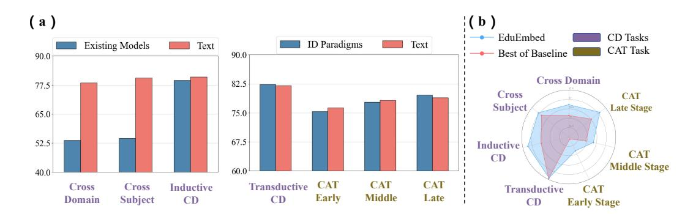
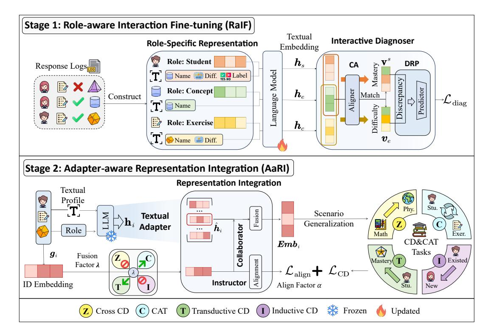
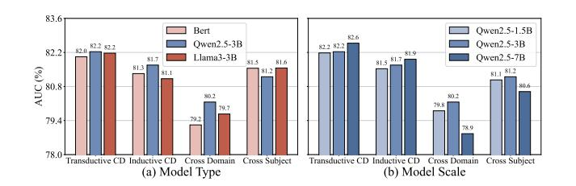
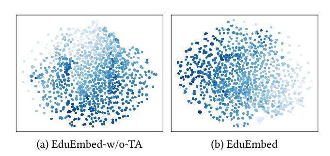
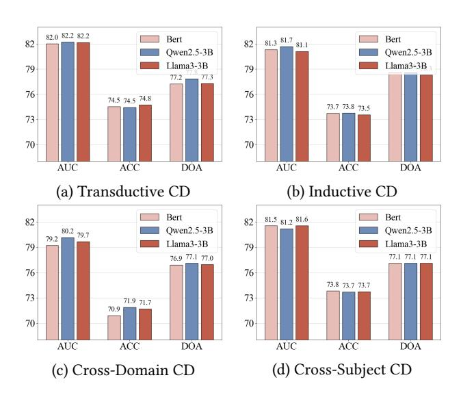
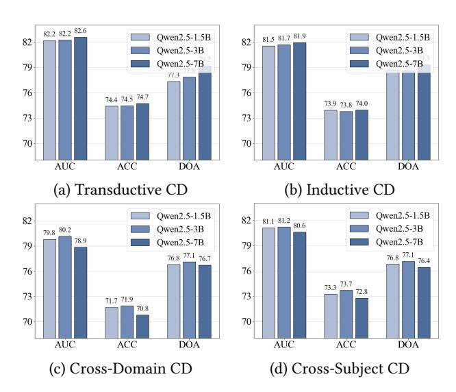
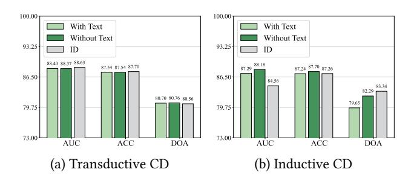
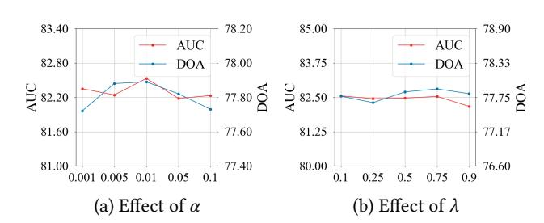

# Embedding Enhancement via Fine-Tuned Language Models for Learner-Item Cognitive Modeling

[Yuanhao Liu](https://orcid.org/0009-0007-3940-6728)∗ East China Normal University Shanghai, China 51275901044@stu.ecnu.edu.cn

[Zihan Zhou](https://orcid.org/0009-0009-7784-4846)∗ East China Normal University Shanghai, China zhzhou@stu.ecnu.edu.cn

[Kaiying Wu](https://orcid.org/0009-0009-7408-7149)∗ East China Normal University Shanghai, China 10235102479@stu.ecnu.edu.cn

[Shuo Liu](https://orcid.org/0000-0001-7970-3187) Tencent Inc Shenzhen, China seokliu@tencent.com

[Yiyang Huang](https://orcid.org/0009-0001-1339-1245) East China Normal University Shanghai, China 10235102470@stu.ecnu.edu.cn

[Jiajun Guo](https://orcid.org/0000-0003-4379-2661) East China Normal University Shanghai, China jjguo@psy.ecnu.edu.cn

[Aimin Zhou](https://orcid.org/0000-0002-4768-5946) East China Normal University Shanghai, China Shanghai Innovation Institute Shanghai, China amzhou@cs.ecnu.edu.cn

[Hong Qian](https://orcid.org/0000-0003-2170-5264)† East China Normal University Shanghai, China Shanghai Innovation Institute Shanghai, China hqian@cs.ecnu.edu.cn

# Abstract

Learner-item cognitive modeling plays a central role in the webbased online intelligent education system by enabling cognitive diagnosis (CD), the upstream and crucial component of the system, across increasingly diverse online educational scenarios. Although ID embedding remains the mainstream approach in cognitive modeling due to its effectiveness and flexibility, recent advances in language models (LMs) have introduced new possibilities for incorporating rich semantic representations to enhance CD performance. However, current studies often focus on a specific task, such as zero-shot CD, limiting the broader application of LMs in this field. This highlights the need for a comprehensive analysis of how LMs enhance embeddings through semantic integration across mainstream CD tasks. This paper identifies two key challenges in fully leveraging LMs in existing work: Misalignment between the training objectives of LMs and CD models creates a distribution gap in feature spaces, hindering the potential of LMs for embedding enhancement; A unified framework is essential for integrating textual embeddings across varied CD tasks while preserving the strengths of existing cognitive modeling paradigms, such as ID embeddings, to ensure the robustness of embedding enhancement. To address these challenges, this paper introduces EduEmbed, a unified embedding enhancement framework that leverages fine-tuned LMs to enrich learner-item cognitive modeling across diverse CD tasks. EduEmbed operates in two stages. In the first stage called role-aware interactive fine-tuning, we fine-tune LMs based on rolespecific representations and an interaction diagnoser to bridge the semantic gap of CD models. In the second stage called adapteraware representation integration, we employ a textual adapter to

2026. ACM ISBN 979-8-4007-2307-0/2026/04 <https://doi.org/10.1145/3774904.3792542>

extract task-relevant semantics and integrate them with existing modeling paradigms to improve generalization across diverse CD tasks. We evaluate the proposed framework on four CD tasks and computerized adaptive testing (CAT) task, achieving robust performance. Further analysis reveals the impact of semantic information across diverse tasks, offering key insights for future research on the application of LMs in CD for online intelligent education systems.

# CCS Concepts

• Computing methodologies → Machine learning; • Applied computing → Education.

# Keywords

Learner-Item Cognitive Modeling, Cognitive Diagnosis, Computerized Adaptive Testing, Embedding Enhancement, Web-based Intelligent Education Systems

### ACM Reference Format:

Yuanhao Liu, Zihan Zhou, Kaiying Wu, Shuo Liu, Yiyang Huang, Jiajun Guo, Aimin Zhou, and Hong Qian. 2026. Embedding Enhancement via Fine-Tuned Language Models for Learner-Item Cognitive Modeling. In Proceedings of the ACM Web Conference 2026 (WWW '26), April 13–17, 2026, Dubai, United Arab Emirates. ACM, New York, NY, USA, [12](#page-11-0) pages. [https:](https://doi.org/10.1145/3774904.3792542) [//doi.org/10.1145/3774904.3792542](https://doi.org/10.1145/3774904.3792542)

# Resource Availability:

The source code of this paper has been made publicly available at [https://doi.](https://doi.org/10.5281/zenodo.18301397) [org/10.5281/zenodo.18301397](https://doi.org/10.5281/zenodo.18301397) and [https://github.com/BW297/EduEmbed.](https://github.com/BW297/EduEmbed)

# 1 Introduction

With the growing demands of personalized learning, web-based online intelligent education systems [\[17\]](#page-8-0) have emerged as a critical development direction. Cognitive Diagnosis (CD) [\[16,](#page-8-1) [18,](#page-8-2) [22,](#page-8-3) [26,](#page-8-4) [32\]](#page-8-5), as a crucial upstream component of the system, aims to infer students' mastery level of specific concepts by analyzing their past interaction

∗These authors contribute equally to this research.

†Corresponding author: Hong Qian (hqian@cs.ecnu.edu.cn).

WWW '26, Dubai, United Arab Emirates.

Figure 1: (a) Motivation study. (b) The comparison of our proposed EduEmbed with best-performing baseline methods on SLP.

records. The diagnosis results can also support further customized applications, such as Computerized Adaptive Testing (CAT) [\[39,](#page-8-6) [40\]](#page-8-7). Currently, these technologies have been widely applied in modern web-based online education platforms [\[5\]](#page-8-8), and single-task scenario settings are no longer sufficient to meet real-world demands. For example, in the field of CD, a variety of scenarios have been proposed and actively studied, including traditional transductive CD [\[28,](#page-8-9) [33,](#page-8-10) [34\]](#page-8-11) for daily practice tests, inductive CD [\[14,](#page-8-12) [19,](#page-8-13) [21\]](#page-8-14) for large-scale, dynamic open student learning environments, zeroshot CD [\[7,](#page-8-15) [9,](#page-8-16) [20\]](#page-8-17) for interdisciplinary and cross-domain settings and CAT [\[1,](#page-8-18) [39,](#page-8-6) [40\]](#page-8-7), as a downstream application of CD, for online standardized testing scenarios.

As the foundational module for CD, learner-item cognitive modeling [\[6,](#page-8-19) [15,](#page-8-20) [25\]](#page-8-21) learns latent representations of learners (e.g., students) and items (e.g., exercises, concepts) via embedding construction, and its quality directly affects aforementioned task performance. ID embedding, which maps entity IDs to latent vectors, has long been the dominant paradigm due to its effectiveness and flexibility, but it struggles to generalize across increasingly diverse CD tasks. Recently, the advancements in language models (LMs) [\[3,](#page-8-22) [29,](#page-8-23) [30\]](#page-8-24) offer new possibilities. Natural language offers a unified interface for modeling diverse CD tasks and pretraining, particularly in large language models, captures rich open-world knowledge, enabling more informative semantic representations. However, most LM-based CD works remain limited to single tasks such as zero-shot CD [\[7,](#page-8-15) [20\]](#page-8-17). Therefore, there is a lack of a comprehensive analysis on the effectiveness of textual semantic embedding generated by LMs across mainstream CD tasks.

As shown in Figure [1](#page-1-0) (a), we compare the pure textual embeddings generated by the original LMs without any additional training against the best-performing models in each task that do not use textual embeddings, across multiple CD scenarios and different stages of CAT. Detailed experimental settings are provided in Appendix [A.](#page-9-0) The results show that the embedding enhancement brought by textual semantic information varies across different CD tasks. Therefore, understanding the enhancement these embeddings bring to each task, as well as the potential improvement space introduced by incorporating textual semantic information in different CD tasks, is essential for assessing the value of textual semantic embedding enhancement and guiding future applications of LMs in CD. In investigating this, we identify two widespread challenges

for applying LMs to CD in current research: (1) Training objectives misalignment: A key challenge lies in the misalignment between the training objectives of general LMs and learner-item cognitive modeling in CD models. This often leads to a distribution gap between LM-generated embeddings and the feature space of mainstream CD frameworks, limiting the potential of LMs for embedding enhancement. Aligning LMs semantic pattern with CD models representation may be crucial to unlock full potential of LMs in embedding enhancement. (2) Lack of a unified integration framework: Given the diversity of CD tasks, there is currently no unified integration paradigm that allows textual embeddings to be seamlessly incorporated across varied scenarios while preserving the strengths of existing learning paradigms, such as ID embeddings. This lack of generalizability makes it difficult to ensure a performance lower bound across tasks, thereby limiting the robustness of embedding enhancement.

To address these challenges, this paper proposes EduEmbed, a unified embedding enhancement framework that leverages finetuned LMs to enrich learner-item cognitive modeling across diverse CD tasks. The framework consists of two stages. In the first stage, it is assumed that LMs have acquired extensive external knowledge during pretraining. Therefore, we aim to activate their capacity for learner-item cognitive modeling through fine-tuning, which facilitates their adaptation to CD models by aligning the training objectives of LMs with those of CD models to a certain extent. We propose role-aware interactive fine-tuning, where we produce textual embeddings aligned with CD models feature spaces, thereby unlocking the full potential of embedding enhancement. In the second stage, adapter-aware representation integration, we propose a unified paradigm to integrate mainstream ID embeddings and textual embeddings. By preserving the strengths of ID embeddings, this paradigm enhances the generalization and robustness of embedding enhancement across diverse CD tasks. Benefiting from this two-stage design, EduEmbed consistently achieves robust performance on four representative CD tasks and a downstream CAT task. Moreover, the analysis of the impact of semantic information under diverse CD tasks offers valuable insights for future research about LMs application in CD for online intelligent education systems.

where �� ∈ [0, 1] is the fusion factor that controls the weight of the textual embedding in the fusion of representation. Finally, the learned latent representations are applied to various CD tasks.

ID Embedding-as-Instructor. Since the current textual embeddings are solely derived from learning the behavioral patterns of entities, they may struggle to effectively distinguish between individuals and tend to be sensitive to noisy data. In contrast, ID embeddings often possess stronger discriminative power. Therefore, we introduce ID embeddings as an instructor to align the textual embeddings accordingly, thereby alleviating these limitations. We define our alignment loss based on InfoNCE [\[24\]](#page-8-31) and take students as an example. We set textual-ID pairs from same students as positive and pairs with other IDs as negative. Specifically,

L align,�� = − 1 |�� | ∑︁ ���� ∈�� log exp(��ˆ�� ���� · �� ⊤ /��) Í ��≠�� exp(��ˆ�� · �� ��⊤ �� �� /��) ! , (7)

where �� is the set of students, �� ���� ∈ R 1×���� denotes the ID embeddings for the student ���� , and �� is the temperature hyperparameter. The computation of the alignment loss is similar for exercises and concepts. We obtain the final alignment loss, formulated as L�� align = L�� align,�� + L�� align,�� + L�� align,�� for original CD task ��. Let L�� CD denote the loss of task ��, which is formulated as:

L �� = L CD + �� · L�� align, (8)

where �� is the align factor used to balance the weight of alignment loss L�� align.

### 5 Experiments

We conduct experiments on real-world datasets to answer the following key research questions.

- RQ1: How effective is the textual embedding enhancement in EduEmbed across various CD tasks?
- RQ2: How does each component contribute to the performance of EduEmbed across various CD tasks?
- RQ3: How do the types and scale of LMs impact the performance of EduEmbed?
- RQ4: How does the textual attribute selection influence the performance of EduEmbed?
  - RQ5: How do hyperparameters influence EduEmbed?

# 5.1 Experimental Settings

Datasets Description. We conduct experiments on four real-world datasets collected from different web-based online intelligent education systems: SLP [\[23\]](#page-8-32), NeurIPS20 [\[35\]](#page-8-33), EDM [\[4\]](#page-8-34), and MOOC [\[37\]](#page-8-35). Table [1](#page-5-0) provides detailed statistics of those datasets. Here, "Average Correct Rate" refers to the mean accuracy of students on exercises, and "Q Density" refers to the average number of concepts associated with each exercise. Specifically, we implement our Stage 1 RaIF on the SLP-Math dataset, using NeurIPS20 as the indomain dataset, since both SLP-Math and NeurIPS20 cover junior and senior-level math, and EDM as the out-domain dataset, which focuses on elementary-level math. This setup allows us to evaluate the generalization performance of EduEmbed across different educational levels. Due to the rich exercise context, MOOC is employed to explore how different attribute selections for textual profiling affect the performance of EduEmbed in RQ5. All datasets largely satisfy

Table 1: Statistics of the real-world datasets.

|         | Datasets           | SLP-Math   | SLP-Chi | NeurIPS20 | EDM    | MOOC   |
|---------|--------------------|------------|---------|-----------|--------|--------|
| #       | Students           | 1080       | 562     | 4918      | 2699   | 3000   |
| #       | Exercises          | 609        | 510     | 948       | 1479   | 1967   |
| #       | Knowledge Concepts | 32         | 17      | 86        | 319    | 2278   |
| #       | Response Logs      | 52100      | 28686   | 1382727   | 116156 | 333602 |
| Average | Correct            | Rate 0.506 | 0.623   | 0.545     | 0.628  | 0.812  |
| Q       | Density            | 1.000      | 1.000   | 4.017     | 1.000  | 2.284  |

normality due to scale and random splits. The detailed introduction of these datasets is summarized in Appendix [B.1.](#page-9-1)

Evaluation Metrics. Since students' true mastery levels are unobservable, we follow prior research [\[33\]](#page-8-10) to evaluate the performance of EduEmbed by predicting the performance of students on CD tasks. We employ score-prediction metrics and interpretability metrics to assess its effectiveness. Specifically, for score prediction metrics, given that the CD task is a binary classification problem, we use the Area Under the Curve (AUC) and Accuracy (ACC) as evaluation metrics. For interpretability, following previous works [\[33\]](#page-8-10), we employ the Degree of Agreement (DOA) to assess the interpretability of the mastery levels of students. For a more detailed explanation of DOA, please refer to Appendix [B.2.](#page-9-2)

Compared Methods. The following provides a brief description of the baselines used in four representative CD tasks and a downstream CAT task.

• Transductive CD. As the most traditional task setting, Transductive CD has been extensively studied, with most methods adopting the ID embedding paradigm, which fits well within our framework. We select three representative models as both compared methods and integrated CD models in EduEmbed: the classic MIRT [\[28\]](#page-8-9), the widely used KaNCD [\[34\]](#page-8-11), and the recent SOTA model OR-CDF [\[25\]](#page-8-21).

• Inductive CD. In inductive CD, traditional ID embedding paradigm is no longer applicable. Therefore, EduEmbed relies solely on textual semantic features in this setting. We compare our approach with two recent models, IDCD [\[14\]](#page-8-12) and ICDM [\[19\]](#page-8-13).

• Zero-shot CD. Zero-shot CD can be further divided into two categories. The first is cross-subject CD, which focuses on transfer across different academic subjects, and the second is cross-CD, which addresses transfer across different datasets. In both tasks, the dominant paradigm is textual semantic embeddings. Accordingly, EduEmbed adopts pure textual semantic features in this setting. We compare our approach with three representative methods: TechCD [\[9\]](#page-8-16), ZeroCD [\[7\]](#page-8-15), and LRCD [\[20\]](#page-8-17).

• Computerized Adaptive Testing (CAT). CAT is a downstream task of CD. It consists of two main components: a selection strategy and a CD model. We select NCD [\[33\]](#page-8-10) and IRT [\[11\]](#page-8-36) as the CD models and five selection strategies: RANDOM, MAAT [\[1\]](#page-8-18), BOBCAT [\[10\]](#page-8-37), NCAT [\[39\]](#page-8-6) and BECAT [\[40\]](#page-8-7). Since CAT follows the ID embedding paradigm, we also integrate ID embeddings into our EduEmbed.

Implementation Details. For stage 1, we use Qwen2.5-3B [\[29\]](#page-8-23) as the default LM. Large LMs are fine-tuned with LoRA [\[12\]](#page-8-38), whereas smaller models undergo full fine-tuning. For stage 2, we set ���� to 64, which is the dimension of the learned latent representations in all tasks. The batch size is set to 256 for all CD tasks, and for CAT task, the batch size is chosen from the set {32, 64, 128, 256}. The learning rate is chosen from {1�� −4 , 5�� −4 , 1�� −3 , 5�� −3 , 1�� −2 }. All experiments are conducted on two A6000 GPUs. We employ a grid search on the validation set to obtain the best hyperparameters and the detailed hyperparameter analysis is provided in Appendix [B.7.](#page-11-1)

### 5.2 Experimental Results

5.2.1 Effectiveness Analysis of Embedding Enhancement (To RQ1). As shown in Table [2](#page-7-1) and [3,](#page-7-2) we conduct a detailed analysis of the effectiveness of textual embedding enhancement across different CD tasks. For CAT, the experimental results on SLP-Math dataset in Table [4](#page-7-3) are shown as an instance. For zero-shot CD, we adopt both cross-subject and cross-domain settings. In the cross-subject CD, we illustrate a representative case where the source domain is the Chinese literature subject (SLP-Chi) and the target domain is the mathematics subject (SLP-Math) within the diverse SLP dataset. For cross-domain CD, for SLP-Math, we use EDM as the source domain and SLP-Math itself as the target domain. Additionally, for in-domain and out-of-domain datasets, we treat each dataset itself as the source domain, with the other dataset serving as the target domain. The complete analysis are provided in Appendix [B.3.](#page-9-3)

Significant Enhancement in Cold Start and High Generalization Scenarios. Textual embedding shows clear performance enhancement in scenarios requiring strong generalization or having severe cold-start issues, such as inductive CD, zero-shot CD and the early stages of CAT.

Limited Enhancement in Low Generalization Requirements Tasks. In tasks with low generalization demands, such as transductive CD, textual semantic embedding offers limited enhancement. Therefore, EduEmbed effectively integrates the ID paradigm, ensuring the performance lower bound and maintaining competitive results.

Interpretability Analysis. For models relying entirely on textual semantic features like LRCD, the fine-tuned EduEmbed offers better interpretability. However, for pattern-driven models like IDCD, which use sparse handcrafted interaction features, these features often show clearer structure and thus outperform dense textual embeddings.

Domain-Sensitive Enhancement. The enhancement provided by fine-tuned LMs is sensitive to their training datasets. As our LM is fine-tuned on SLP-Math, it shows strong performance in in-domain datasets like NeurIPS20, but their generalization to outdomain datasets like EDM remains limited and requires further exploration.

Limited cases like low generalization and out-of-domain applications are discussed in Appendix [C.](#page-11-2)

5.2.2 Ablation Study (To RQ2). To validate the efficacy of each module in EduEmbed, we conduct an ablation study. Five ablated versions of EduEmbed are presented. EduEmbed-w/o-RaIF omits all the fine-tuning designs, using the textual embeddings generated directly by LMs; EduEmbed-w/o-RsR removes the role embedding ��role from fine-tuning process; EduEmbed-w/o-TA skips the Textual Adapter which is MLPs in this paper; EduEmbed-w/o-IDI does not utilize the alignment loss in AaRI; In EduEmbed-w/o-IDC, ID embeddings are not integrated with textual embeddings. Specially,

Figure 3: The performance of EduEmbed under varying LMs types and scales on SLP-Math.

EduEmbed-w/o-TA replaces MLPs with a simple linear layer in inductive CD and CAT. Also, some ablation experiments cannot be conducted in certain scenarios due to limitations. Corresponding explanations would be given in Appendix [B.4.](#page-10-0)

Experimental Results. As shown in Table [5,](#page-7-4) our proposed EduEmbed outperforms most of its ablated versions, confirming the effectiveness of each module. However, we also observe that certain ablated versions exhibit superior performance in specific scenarios. In transductive CD, due to the relatively low requirement for generalization, the performance gains brought by fine-tuning are limited. In inductive CD, using a simple linear layer as the adapter in EduEmbed-w/o-TA helps mitigate potential overfitting and achieve strong predictive performance. In zero-shot CD, where a greater generalization of semantics is required, the lack of explicit semantic information in role embeddings limits the interpretability of EduEmbed compared with EduEmbed-w/o-RsR. For more results and further analysis, please refer to Appendix [B.4.](#page-10-0)

5.2.3 Comparison of Types and Scales of the LMs (To RQ3). Here, we investigate the impact of LMs scales and types on the performance of EduEmbed. We conduct experiments on four CD tasks, and the corresponding results based on AUC are shown in Figure [3.](#page-6-0) For more detailed evaluations, please refer to Figure [5](#page-10-1) and [6](#page-10-2) in Appendix [B.5.](#page-10-3)

Model Types. We fine-tune Qwen2.5-3B [\[29\]](#page-8-23), Llama3.2-3B [\[30\]](#page-8-24) and Bert-Base-Cased [\[3\]](#page-8-22), respectively. As shown in Figure [3](#page-6-0) (a), Qwen2.5-3B delivers optimal performance in most CD scenarios, likely due to its advanced text comprehension and generation capabilities. However, its performance in cross-subject CD is less satisfactory, possibly because it tends to memorize subject-specific patterns from the training data, leading to a limited capacity to generalize to unseen subjects.

Model Scales. We fine-tune the Qwen2.5-series [\[29\]](#page-8-23) LMs with 1.5B, 3B, and 7B parameters, respectively.

As shown in the results of Figure [3](#page-6-0) (b), we observe that in transductive CD and inductive CD, model performance improves as the parameter size increases. This is likely due to the similar distribution between training and testing data, which allows larger models to more effectively capture complex cognitive patterns during fine-tuning. However, in cross-domain and cross-subject CD, the performance initially improves but then declines as the model size increases. This trend may be attributed to domain bias in the training data. Larger models tend to overfit fine-grained, domain-specific features, improving in-domain learning but impairing generalization to new domains.

Table 2: The overall performance of EduEmbed compared with the baseline methods in four CD tasks. Within each method, the highest mean performance is highlighted in bold. The value following "±" denotes the standard deviation of the model's performance. If a mean value is significantly higher than the second-best result according to a ��-test with a significance level of 0.05, it is marked with "\*".

Table 3: The performance of cross-subject CD on SLP. Other details are as same as Table [2.](#page-7-1)

Table 4: The overall performance of EduEmbed with five CAT selection strategies on SLP-Math. "OL" stands for the original method under ID embedding paradigm.

| Dataset Metric Strategy step |       | OL      | IRT   | SLP-Math AUC / ACC (%) NCD EduEmbed OL EduEmbed |
|------------------------------|-------|---------|-------|-------------------------------------------------|
| 5                            | 74.61 | / 68.03 | 75.23 | ∗                                               |
|                              |       |         |       | / 69.42 ∗ 73.38 / 67.38 74.01 ∗                 |
|                              |       |         |       | / 68.02 ∗                                       |
| 10                           | 77.15 | / 70.16 | 78.56 | ∗                                               |
|                              |       |         |       | / 71.48 ∗ 76.47 / 69.59 78.20 ∗                 |
|                              |       |         |       | / 71.22 ∗                                       |
| 15                           | 78.44 | / 71.34 | 80.24 | ∗                                               |
|                              |       |         |       | / 72.02 ∗ 78.33 / 70.78 79.28 ∗                 |
|                              |       |         |       | / 72.09 ∗                                       |
| 5                            | 74.18 | / 67.35 | 76.66 | ∗                                               |
|                              |       |         |       | / 69.85 ∗ 73.66 / 60.07 74.02 ∗                 |
|                              |       |         |       | / 60.82 ∗                                       |
| 10                           | 76.26 | / 68.35 | 78.96 | ∗                                               |
|                              |       |         |       | / 71.17 ∗ 76.29 / 60.77 77.32 ∗                 |
|                              |       |         |       | / 61.23 ∗                                       |
| 15                           | 77.32 | / 69.30 | 79.42 | ∗                                               |
|                              |       |         |       | / 71.55 ∗ 77.88 / 63.65 77.92 ∗                 |
|                              |       |         |       | / 64.21 ∗                                       |
| 5                            | 75.67 | / 68.75 | 78.95 | ∗                                               |
|                              |       |         |       | / 71.91 ∗ 73.74 / 66.39 74.52 ∗                 |
|                              |       |         |       | / 68.35 ∗                                       |
| 10                           | 77.75 | / 70.75 | 80.44 | ∗                                               |
|                              |       |         |       | / 72.27 ∗ 75.69 / 69.05 76.27 ∗                 |
|                              |       |         |       | / 70.14 ∗                                       |
| 15                           | 78.89 | / 71.65 | 81.07 | ∗                                               |
|                              |       |         |       | / 73.54 ∗ 77.43 / 70.57 77.44 ∗                 |
|                              |       |         |       | / 71.05 ∗                                       |
| 5                            | 73.94 | / 67.35 | 77.63 | ∗                                               |
|                              |       |         |       | / 70.30 ∗ 73.32 / 62.78 73.19 / 67.08 ∗         |
| 10                           | 75.89 | / 68.86 | 80.14 | ∗                                               |
|                              |       |         |       | / 72.54 ∗ 76.30 / 68.71 76.59 ∗                 |
|                              |       |         |       | / 70.03 ∗                                       |
| 15                           | 77.45 | / 70.21 | 80.43 | ∗                                               |
|                              |       |         |       | / 72.57 ∗ 77.43 / 70.67 79.41 ∗                 |
|                              |       |         |       | / 72.09 ∗                                       |
| 5                            | 75.37 | / 68.76 | 77.45 | ∗                                               |
|                              |       |         |       | / 70.40 ∗ 71.85 / 64.70 72.36 ∗                 |
|                              |       |         |       | / 65.74 ∗                                       |
| 10                           | 77.81 | / 70.95 | 79.02 | ∗                                               |
|                              |       |         |       | / 71.48 ∗ 75.16 / 66.26 77.26 ∗                 |
|                              |       |         |       | / 69.57 ∗                                       |
| 15                           | 79.60 | / 72.70 | 81.33 | ∗                                               |
|                              |       |         |       | / 73.38 ∗ 77.21 / 69.73 78.40 ∗                 |
|                              |       |         |       | / 70.20 ∗                                       |

5.2.4 The Effect of Text Selection (To RQ4). Previous research [\[27\]](#page-8-30) has shown that the textual content of exercises can serve as valuable attributes for learner-item cognitive modeling. However, many existing datasets lack such content, limiting the broader application of text-based features in CD. To assess the impact of this limitation, we conduct experiments on MOOC dataset which includes exercise content, under both inductive CD and transductive CD. Corresponding details are presented in Appendix [B.6.](#page-11-3)

Table 5: Ablation study in four CD tasks on SLP-Math.

| CD Scenario Metric | EduEmbed w/o RaIF | EduEmbed w/o RsR | EduEmbed w/o TA | EduEmbed |
|--------------------|-------------------|------------------|-----------------|----------|
| AUC Transductive   | 82.27             | 82.24            | 82.06           | 82.23    |
| ACC CD             | 74.40             | 74.40            | 74.38           | 74.45    |
| DOA                | 77.75             | 77.44            | 76.78           | 77.85    |
| AUC Inductive      | 81.04             | 81.59            | 81.62           | 81.68    |
| ACC CD             | 73.75             | 73.63            | 73.97           | 73.78    |
| DOA                | 78.60             | 77.33            | 78.79           | 78.61    |
| Domain CD          |                   |                  |                 |          |
| AUC Cross          | 78.49             | 79.87            | 77.45           | 80.06    |
| ACC                | 71.24             | 71.12            | 64.05           | 72.61    |
| DOA                | 76.87             | 78.91            | 76.22           | 78.61    |
| Subject CD         |                   |                  |                 |          |
| AUC Cross          | 80.41             | 81.14            | 78.01           | 81.20    |
| ACC                | 72.87             | 73.64            | 63.51           | 73.69    |
| DOA                | 77.01             | 77.19            | 76.12           | 77.11    |

5.2.5 Hyperparameter Analysis (To RQ5). We investigate the impact of two key hyperparameters on the performance of EduEmbed. For detailed results, please refer to Appendix [B.7.](#page-11-1)

# 6 Conclusion and Discussion

In this paper, we systematically evaluate and reveal the task-based potential of LM-based textual embeddings across mainstream CD tasks for web-based online intelligent education systems. We introduce EduEmbed, a unified enhancement framework that leverages fine-tuned LMs to improve learner-item cognitive modeling. Comprehensive experiments verify the varying enhancement brought by semantic information, offering insights for future research. Limitations and future directions including performance robustness in low-generalization scenarios, further unified integration and computational cost are discussed in Appendix [C.](#page-11-2)

# Acknowledgments

We would like to thank the anonymous reviewers for their constructive comments. The algorithms and datasets in the paper do not involve any ethical issue. This work is supported by the National Natural Science Foundation of China (No. 62476091), and Tencent Inc Research Program.

References [1] Haoyang Bi, Haiping Ma, Zhenya Huang, Yu Yin, Qi Liu, Enhong Chen, Yu Su, and Shijin Wang. 2020. Quality Meets Diversity: A Model-Agnostic Framework for Computerized Adaptive Testing. In Proceedings of the 20th IEEE International Conference on Data Mining. Sorrento, Italy, 42–51. [2] Jimmy De La Torre. 2009. DINA Model and Parameter Estimation: A Didactic. Journal of Educational and Behavioral Statistics 34, 1 (2009), 115–130. [3] Jacob Devlin, Ming-Wei Chang, Kenton Lee, and Kristina Toutanova. 2019. Bert: Pre-Training of Deep Bidirectional Transformers for Language Understanding. In Proceedings of the 2019 conference of the North American chapter of the association for computational linguistics: human language technologies, volume 1 (long and short papers). Minneapolis, Minnesota, 4171–4186. [4] NHeffernan Ethan Prihar. 2023. EDM Cup 2023. [https://kaggle.com/competitions/](https://kaggle.com/competitions/edm-cup-2023) [edm-cup-2023](https://kaggle.com/competitions/edm-cup-2023) [5] Mingyu Feng, Neil T. Heffernan, and Kenneth R. Koedinger. 2009. Addressing the Assessment Challenge with an Online System That Tutors as it Assesses. User Modeling and User-Adapted Interaction 19, 3 (2009), 243–266. [6] Weibo Gao, Qi Liu, Zhenya Huang, Yu Yin, Haoyang Bi, Mu-Chun Wang, Jianhui Ma, Shijin Wang, and Yu Su. 2021. RCD: Relation Map Driven Cognitive Diagnosis for Intelligent Education Systems. In Proceedings of the 44th International ACM SIGIR Conference on Research and Development in Information Retrieval. Virtual Event, 501–510. [7] Weibo Gao, Qi Liu, Hao Wang, Linan Yue, Haoyang Bi, Yin Gu, Fangzhou Yao, Zheng Zhang, Xin Li, and Yuanjing He. 2024. Zero-1-to-3: Domain-Level Zero-Shot Cognitive Diagnosis via One Batch of Early-Bird Students towards Three Diagnostic Objectives. In Proceedings of the 38th AAAI Conference on Artificial Intelligence, Michael J. Wooldridge, Jennifer G. Dy, and Sriraam Natarajan (Eds.). Vancouver, Canada, 8417–8426. [8] Weibo Gao, Qi Liu, Linan Yue, Fangzhou Yao, Rui Lv, Zheng Zhang, Hao Wang, and Zhenya Huang. 2025. Agent4Edu: Generating Learner Response Data by Generative Agents for Intelligent Education Systems. In Proceedings of the 39th AAAI Conference on Artificial Intelligence, Toby Walsh, Julie Shah, and Zico Kolter (Eds.). Philadelphia, PA, 23923–23932. [9] Weibo Gao, Hao Wang, Qi Liu, Fei Wang, Xin Lin, Linan Yue, Zheng Zhang, Rui Lv, and Shijin Wang. 2023. Leveraging Transferable Knowledge Concept Graph Embedding for Cold-Start Cognitive Diagnosis. In Proceedings of the 46th International ACM SIGIR Conference on Research and Development in Information Retrieval, Hsin-Hsi Chen, Wei-Jou (Edward) Duh, Hen-Hsen Huang, Makoto P. Kato, Josiane Mothe, and Barbara Poblete (Eds.). Taiwan, China, 983–992. [10] Aritra Ghosh and Andrew S. Lan. 2021. BOBCAT: Bilevel Optimization-Based Computerized Adaptive Testing. In Proceedings of the 30th International Joint Conference on Artificial Intelligence. Virtual Event, 2410–2417. [11] Shelby J Haberman. 2005. Identifiability of Parameters in Item Response Models with Unconstrained Ability Distributions. ETS Research Report Series 2005, 2 (2005), i–22. [12] Edward J. Hu, Yelong Shen, Phillip Wallis, Zeyuan Allen-Zhu, Yuanzhi Li, Shean Wang, Lu Wang, and Weizhu Chen. 2022. LoRA: Low-Rank Adaptation of Large Language Models. In Proceedings of the 10th International Conference on Learning Representations. Virtual Event. [13] Yoon Kim. 2014. Convolutional Neural Networks for Sentence Classification. In Proceedings of the 2014 Conference on Empirical Methods in Natural Language Processing. Doha, Qatar, 1746–1751. [14] Jiatong Li, Qi Liu, Fei Wang, Jiayu Liu, Zhenya Huang, Fangzhou Yao, Linbo Zhu, and Yu Su. 2024. Towards the Identifiability and Explainability for Personalized Learner Modeling: An Inductive Paradigm. In Proceedings of the ACM on Web Conference 2024. Singapore, 3420–3431. [15] Jiatong Li, Fei Wang, Qi Liu, Mengxiao Zhu, Wei Huang, Zhenya Huang, Enhong Chen, Yu Su, and Shijin Wang. 2022. HierCDF: A Bayesian Network-Based Hierarchical Cognitive Diagnosis Framework. In Proceedings of the 28th ACM SIGKDD Conference on Knowledge Discovery and Data Mining. Virtual Event, 904–913. [16] Mingjia Li, Hong Qian, Jinglan Lv, Mengliang He, Wei Zhang, and Aimin Zhou. 2024. Foundation Model Enhanced Derivative-Free Cognitive Diagnosis. Frontiers of Computer Science (2024). [17] Mingjia Li, Junkai Tong, Yiyang Huang, Yifei Ding, Hong Qian, and Aimin Zhou. 2025. Paper-Level Computerized Adaptive Testing for High-Stakes Examination via Multi-Objective Optimization. In Proceedings of the 31st ACM SIGKDD Conference on Knowledge Discovery and Data Mining. Toronto, Canada, 1435–1446. [18] Shuo Liu, Hong Qian, Mingjia Li, and Aimin Zhou. 2023. QCCDM: A Q-Augmented Causal Cognitive Diagnosis Model for Student Learning. In Proceedings of the 26th European Conference on Artificial Intelligence. Kraków, Poland, 1536–1543. [19] Shuo Liu, Junhao Shen, Hong Qian, and Aimin Zhou. 2024. Inductive Cognitive Diagnosis for Fast Student Learning in Web-Based Intelligent Education Systems. In Proceedings of the ACM on Web Conference 2024. Singapore, 4260–4271. [20] Shuo Liu, Zihan Zhou, Yuanhao Liu, Jing Zhang, and Hong Qian. 2025. Language Representation Favored Zero-Shot Cross-Domain Cognitive Diagnosis. In Proceedings of the 31st ACM SIGKDD Conference on Knowledge Discovery and Data Mining, Yizhou Sun, Flavio Chierichetti, Hady W. Lauw, Claudia Perlich, Wee Hyong Tok, and Andrew Tomkins (Eds.). Toronto, Canada, 836–847. [21] Yuanhao Liu, Shuo Liu, Yimeng Liu, Chanjin Zheng, Wei Zhang, and Hong Qian. 2025. A Dual-Fusion Cognitive Diagnosis Framework for Open Student Learning Environments. In Proceedings of the 31st ACM SIGKDD Conference on Knowledge Discovery and Data Mining. Toronto, Canada, 1915–1926. [22] Yingjie Liu, Tiancheng Zhang, Xuecen Wang, Ge Yu, and Tao Li. 2023. New Development of Cognitive Diagnosis Models. Frontiers of Computer Science 17, 1 (2023), 171604. [23] Yu Lu, Yang Pian, Ziding Shen, Penghe Chen, and Xiaoqing Li. 2021. SLP: A Multi-Dimensional and Consecutive Dataset from K-12 Education. In Proceedings of the 29th International Conference on Computers in Education. Virtual Event, 261–266. [24] Aaron van den Oord, Yazhe Li, and Oriol Vinyals. 2018. Representation Learning with Contrastive Predictive Coding. arXiv preprint arXiv:1807.03748 (2018). [25] Hong Qian, Shuo Liu, Mingjia Li, Bingdong Li, Zhi Liu, and Aimin Zhou. 2024. ORCDF: An Oversmoothing-Resistant Cognitive Diagnosis Framework for Student Learning in Online Education Systems. In Proceedings of the 30th ACM SIGKDD Conference on Knowledge Discovery and Data Mining. Barcelona, Spain, 2455–2466. [26] Junhao Shen, Hong Qian, Wei Zhang, and Aimin Zhou. 2024. Symbolic Cognitive Diagnosis via Hybrid Optimization for Intelligent Education Systems. In Proceedings of the AAAI conference on artificial intelligence. Vancouver, Canada, 14928–14936. [27] Yu Su, Qingwen Liu, Qi Liu, Zhenya Huang, Yu Yin, Enhong Chen, Chris H. Q. Ding, Si Wei, and Guoping Hu. 2018. Exercise-Enhanced Sequential Modeling for Student Performance Prediction. In Proceedings of the 32nd AAAI Conference on Artificial Intelligence, Sheila A. McIlraith and Kilian Q. Weinberger (Eds.). New Orleans, LA, 2435–2443. [28] James B Sympson. 1978. A Model for Testing with Multidimensional Items. In Proceedings of the 1977 Computerized Adaptive Testing Conference. Minneapolis, MN. [29] Qwen Team. 2024. Qwen2.5: A Party of Foundation Models. [https://qwenlm.](https://qwenlm.github.io/blog/qwen2.5/) [github.io/blog/qwen2.5/](https://qwenlm.github.io/blog/qwen2.5/) [30] Hugo Touvron, Thibaut Lavril, Gautier Izacard, Xavier Martinet, Marie-Anne Lachaux, Timothée Lacroix, Baptiste Rozière, Naman Goyal, Eric Hambro, Faisal Azhar, Aurélien Rodriguez, Armand Joulin, Edouard Grave, and Guillaume Lample. 2023. LLaMA: Open and Efficient Foundation Language Models. CoRR abs/2302.13971 (2023). [31] Laurens Van der Maaten and Geoffrey Hinton. 2008. Visualizing Data Using t-SNE. Journal of Machine Learning Research 9, 11 (2008). [32] Fei Wang, Weibo Gao, Qi Liu, Jiatong Li, Guanhao Zhao, Zheng Zhang, Zhenya Huang, Mengxiao Zhu, Shijin Wang, Wei Tong, et al. 2024. A Survey of Models for Cognitive Diagnosis: New Developments and Future Directions. arXiv preprint arXiv:2407.05458 (2024). [33] Fei Wang, Qi Liu, Enhong Chen, Zhenya Huang, Yuying Chen, Yu Yin, Zai Huang, and Shijin Wang. 2020. Neural Cognitive Diagnosis for Intelligent Education Systems. In Proceedings of the 34th AAAI Conference on Artificial Intelligence. New York, NY. [34] Fei Wang, Qi Liu, Enhong Chen, Zhenya Huang, Yu Yin, Shijin Wang, and Yu Su. 2023. NeuralCD: A General Framework for Cognitive Diagnosis. IEEE Transactions on Knowledge and Data Engineering 35, 8 (2023). [35] Zichao Wang, Angus Lamb, Evgeny Saveliev, Pashmina Cameron, Yordan Zaykov, José Miguel Hernández-Lobato, Richard E Turner, Richard G Baraniuk, Craig Barton, Simon Peyton Jones, et al. 2020. Instructions and Guide for Diagnostic Questions: The Neurips 2020 Education Challenge. arXiv preprint arXiv:2007.12061 (2020). [36] Songlin Xu, Xinyu Zhang, and Lianhui Qin. 2024. EduAgent: Generative Student Agents in Learning. CoRR abs/2404.07963 (2024). [37] Jifan Yu, Mengying Lu, Qingyang Zhong, Zijun Yao, Shangqing= Tu, Zhengshan Liao, Xiaoya Li, Manli Li, Lei Hou, Haitao Zheng, Juanzi Li, and Jie Tang. 2023. MoocRadar: A Fine-Grained and Multi-Aspect Knowledge Repository for Improving Cognitive Student Modeling in MOOCs. (2023). [38] Yuqiang Zhou, Qi Liu, Jinze Wu, Fei Wang, Zhenya Huang, Wei Tong, Hui Xiong, Enhong Chen, and Jianhui Ma. 2021. Modeling Context-Aware Features for Cognitive Diagnosis in Student Learning. In Proceedings of the 27th ACM SIGKDD Conference on Knowledge Discovery and Data Mining. Virtual Event, 2420–2428. [39] Yan Zhuang, Qi Liu, Zhenya Huang, Zhi Li, Shuanghong Shen, and Haiping Ma. 2022. Fully Adaptive Framework: Neural Computerized Adaptive Testing for Online Education. In Proceeddings of the 36th AAAI Conference on Artificial Intelligence. Virtual Event, 4734–4742. [40] Yan Zhuang, Qi Liu, GuanHao Zhao, Zhenya Huang, Weizhe Huang, Zachary Pardos, Enhong Chen, Jinze Wu, and Xin Li. 2023. A Bounded Ability Estimation for Computerized Adaptive Testing. In Advances in Neural Information Processing Systems 37. New Orleans, LA.

| Metric   | AUC   | ACC     | DOA     |
|----------|-------|---------|---------|
| TechCD   | 57.96 | 56.44   | 48.8    |
| ZeroCD   | 61.77 | 59.07   | 50.81   |
| LRCD     | 78.56 | 72.01   | 74.96   |
| EduEmbed | 78.74 | ∗ 72.32 | ∗ 75.30 |

Figure 4: Visualization of students' mastery levels on SLP-Math.

Figure 5: Comparison of LMs types in four CD tasks.

Figure 6: Comparison of LMs scales in four CD tasks.

Table 7: Ablation study in transductive CD.

| Metric | EduEmbed w/o IDI | EduEmbed w/o IDC | EduEmbed |
|--------|------------------|------------------|----------|
| AUC    | 82.21            | 82.05            | 82.23    |
| ACC    | 74.40            | 74.27            | 74.45    |
| DOA    | 77.50            | 77.59            | 77.85    |

### B.4 Ablation Study

In this subsection, we provide the additional experimental results of ablation study in transductive CD and CAT in Table [7](#page-10-4) and [8.](#page-11-4)

Settings. As for zero-shot and inductive CD, ID embeddings of new entities provide no useful information. Therefore, EduEmbed does not integrate them in these settings. Accordingly, experiments on EduEmbed-w/o-IDI and EduEmbed-w/o-IDC are omitted for inductive, cross-domain, and cross-subject CD. For inductive CD and CAT, the MLPs in the text adapter are replaced with a linear layer in EduEmbed-w/o-TA to satisfy the dimension transfer required by the interaction function.

### Detailed Analysis.

• Transductive CD. EduEmbed-w/o-RaIF achieves strong AUC performance, suggesting limited gains since ID embeddings are already well-trained. Nevertheless, EduEmbed still offers clear advantages in both accuracy and interpretability, underscoring its effectiveness in cognitive modeling.

• Inductive CD. EduEmbed-w/o-TA also performs well, likely because MLPs add parameters but risk overfitting. These results validate the textual adapter framework, showing that even a simple linear layer ensures robust performance and offering insights for future adapter design.

• Zero-shot CD. EduEmbed shows weaker interpretability than EduEmbed-w/o-RsR, likely due to the lack of explicit semantics in role embeddings, which is a limitation more evident in cross-domain CD requiring semantic generalization. Still, its strong predictive accuracy highlights the effectiveness of the role embedding design.

• CAT. Similar to inductive CD, EduEmbed-w/o-TA achieves reasonable performance in early CAT stages. In contrast, EduEmbedw/o-IDI and EduEmbed-w/o-IDC underperform at step 5 due to immature ID embeddings introducing noise. As CAT progresses, ID embeddings strengthen, and EduEmbed exhibits clear gains at steps 10 and 15, demonstrating the effectiveness of RaIF, as proposed in Section [4.1.](#page-3-1)

Visualization of Mastery Levels. To further evaluate the contribution of the Texual Adapter, we visualize students' mastery levels on the SLP-Math dataset via t-SNE [\[31\]](#page-8-39), with darker shades indicating higher correct rate. Using transductive CD as a case study, as shown in Figure [4,](#page-10-5) EduEmbed demonstrates clearer clustering and smoother progression, underscoring the interpretability benefits of the Textual Adapter.

The results of the ablation study indicate that designs in both RaIF and AaRI are crucial to the overall effectiveness of EduEmbed.

# B.5 Details of LMs Scales and Types

In this subsection, we provide the performance results of EduEmbed with different types and scales of LMs in transductive CD, as shown in Figure [5](#page-10-1) and [6.](#page-10-2)

Table 8: Ablation study in CAT.

| Metric CD Model Step |       | EduEmbed w/o RaIF |       | EduEmbed w/o RsR |       | EduEmbed w/o AUC TA | / ACC | (%) EduEmbed w/o IDI |       | EduEmbed w/o IDC |       | EduEmbed |
|----------------------|-------|-------------------|-------|------------------|-------|---------------------|-------|----------------------|-------|------------------|-------|----------|
| 5                    | 67.72 | / 61.83           | 73.71 | / 58.49          | 73.21 | / 66.91             | 76.69 | / 69.30              | 76.29 | / 67.87          | 77.45 | / 70.40  |
| 10                   | 73.91 | / 65.54           | 76.00 | / 69.53          | 73.78 | / 67.34             | 79.15 | / 71.67              | 78.20 | / 70.64          | 79.02 | / 71.48  |
| 15                   | 74.95 | / 68.72           | 80.05 | / 71.94          | 74.64 | / 67.81             | 81.27 | / 73.50              | 78.92 | / 69.87          | 81.33 | / 73.38  |
| 5                    | 62.26 | / 57.20           | 72.25 | / 65.64          | 70.65 | / 64.41             | 69.83 | / 62.57              | 73.37 | / 64.07          | 72.36 | / 65.74  |
| 10                   | 65.30 | / 61.62           | 75.69 | / 67.12          | 77.35 | / 69.80             | 75.92 | / 69.31              | 73.48 | / 68.05          | 77.26 | / 69.57  |
| 15                   | 66.93 | / 63.08           | 76.54 | / 67.88          | 78.78 | / 71.55             | 78.17 | / 70.15              | 77.89 | / 70.85          | 78.40 | / 70.20  |

Figure 7: Effect of text selection on MOOC. "OL" refer to baselines, specifically denoting ID embedding in transductive CD and IDCD for inductive CD.

Figure 8: Hyperparameter analysis on SLP-Math.

# B.6 Text Selection Analysis

In this subsection, we provide the details of text selection experiment. We extend the exercise attribute defined in Eq. [\(1\)](#page-3-2) in Section [4.1.1](#page-3-3) by incorporating textual content. Since the exercise content in MOOC is in Chinese, we adopt BERT-Base-Chinese [\[3\]](#page-8-22) as the fine-tuned LM to ensure compatibility with the dataset. As shown in Figure [7,](#page-11-5) incorporating exercise content leads to modest performance fluctuations, likely due to the trade-off between added detail and potential noise of exercise content. This suggests that in datasets lacking exercise content, deriving attributes from response logs has minimal impact on model performance, especially when ultra-high prediction precision is unnecessary.

# B.7 Hyperparameter Analysis

In this subsection, We present the performance of EduEmbed with different hyperparameter settings, as shown in Figure [8.](#page-11-6) We recommend setting �� to 0.01 or 0.005 and �� to 0.5 or 0.75 to generally yield relatively good performance in most cases.

Table 9: Comparison of EduEmbed and "Text-Only" on SLP-Math in transductive CD.

| Metric | Text-Only | EduEmbed |
|--------|-----------|----------|
| AUC    | 75.53     | 82.23    |
| ACC    | 68.93     | 74.45    |
| DOA    | 76.60     | 77.85    |

### C Discussions

Performance Robustness in Low-Generalization Scenarios. As discussed in Section [5.2.1](#page-6-1) and Appendix [B.3,](#page-9-3) LMs show limitations in transductive CD compared to traditional ID-based models. By integrating ID information, EduEmbed ensures a reliable performance lower bound while flexibly adapting to various CD scenarios. Instead of pursuing a one-size-fits-all solution, EduEmbed is designed to flexibly adapt to various CD scenarios with minimal modification, highlighting its practical extensibility. As shown in Table [9,](#page-11-7) EduEmbed achieves superior performance on SLP-Math compared to the "Text-Only" variant using raw LM embeddings without fine-tuning, highlighting that direct use of textual features alone is suboptimal in transductive CD.

Integration with Existing Learning Paradigms. Given the effectiveness of mainstream ID embeddings in cognitive modeling, this work focuses on the fusion of textual embeddings with ID embeddings, to ensure EduEmbed's compatibility across most CD tasks. Other paradigms, such as IDCD, which incorporate handcrafted interaction features as prior information, are also expected to be integrated. Notably, from a methodological perspective, EduEmbed is capable of being integrated with such paradigms. Exploring how textual embeddings can be effectively combined with increasingly diverse approaches remains an important direction for future research.

Computational Cost. Although fine-tuning LMs is generally time-consuming, our proposed decoupled EduEmbed mitigates this issue by freezing the textual embeddings by the LMs and applying them across different CD tasks. As a result, the fine-tuning process only needs to be conducted once, after which the representations can be stored locally. Therefore, in practical applications, the runtime of this component is virtually negligible, significantly improving the overall efficiency and usability of our framework.