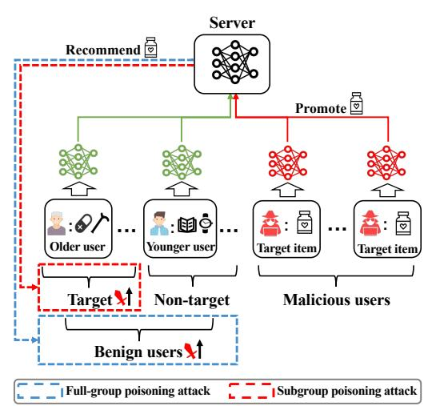
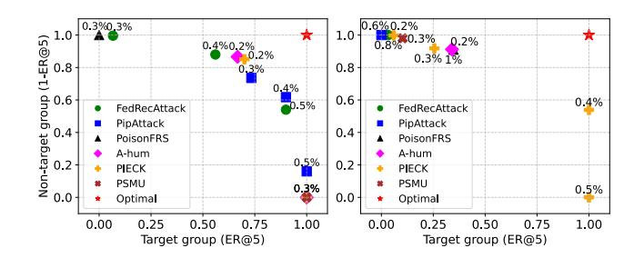
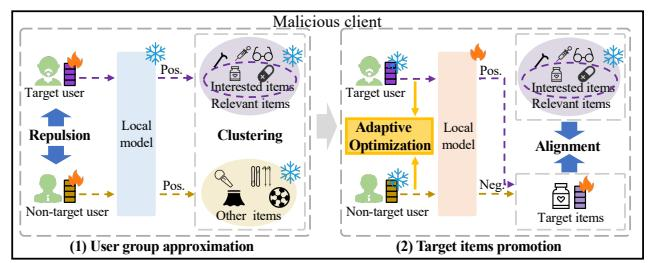
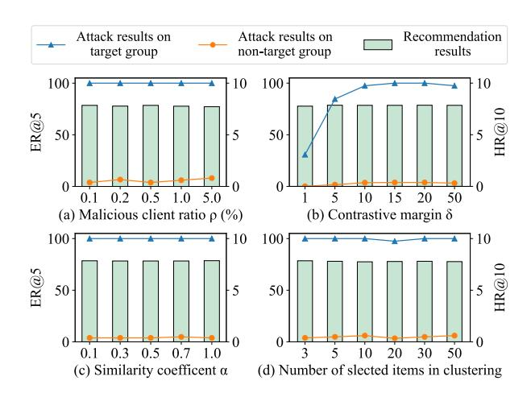
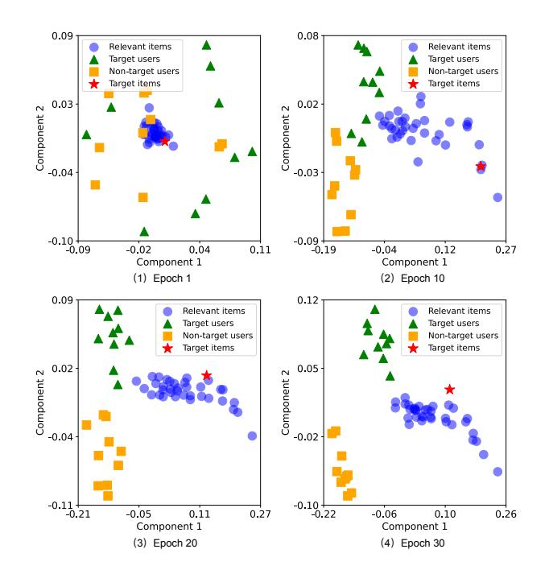

# Spattack: Subgroup Poisoning Attacks on Federated Recommender Systems

Bo Yan Beijing University of Posts and Telecommunications Beijing, China boyan@bupt.edu.cn

Yurong Hao Nanyang Technological University Singapore City, Singapore yurong.hao@ntu.edu.sg

Dingqi Liu Beijing University of Posts and Telecommunications Beijing, China 2023213475@bupt.cn

Huabin Sun Beijing University of Posts and Telecommunications Beijing, China sunhuabin@bupt.edu.cn

Pengpeng Qiao Institute of Science Tokyo Tokyo, Japan peng2qiao@gmail.com

Wei Yang Bryan Lim Nanyang Technological University Singapore City, Singapore bryan.limwy@ntu.edu.sg

Yang Cao Institute of Science Tokyo Tokyo, Japan cao@c.titech.ac.jp

Chuan Shi∗ Beijing University of Posts and Telecommunications Beijing, China shichuan@bupt.edu.cn

### Abstract

Federated recommender systems (FedRec) have emerged as a promising approach to provide personalized recommendations while protecting user privacy. However, recent studies have demonstrated their vulnerability to poisoning attacks, wherein malicious clients can inject carefully crafted gradients to prompt target items to benign users. Existing attacks typically target the full user group, which compromises stealth and increases the risk of detection. In contrast, real-world adversaries may prefer to target specific user subgroup, such as promoting health supplements to older individual, to maximize attack success while preserving stealth to evade detection. Motivated by this gap, we introduce Spattack, the first poisoning attack designed to manipulate recommendations for specific user subgroups in federated setting. Specifically, Spattack adopts an approximate-and-promote paradigm, which first approximate user embeddings of target/non-target subgroups and then prompts target items to the target subgroups. We further reveal a trade-off in achieving strong attack performance on the target group while keeping the non-target group largely unaffected. To achieve a better trade-off, we propose enhanced approximation and promotion strategies. For the approximation, we push the embeddings of different subgroup away based on contrastive learning and augment the target group's relevant item set via clustering. For the promotion, we align target and relevant item embeddings to strengthen their semantic connections. An adaptive weighting strategy is further proposed to balance promotion effects between target and non-target subgroups. Experiments on three real-world datasets demonstrate that Spattack consistently achieves strong attack performance on the target subgroup with minimal impact on non-target users, even when only 0.1% of users are malicious. Moreover, Spattack maintains competitive recommendation performance and exhibits strong resilience against mainstream defenses.

∗Corresponding author.

© 2026 Copyright held by the owner/author(s). ACM ISBN 979-8-4007-2307-0/2026/04 <https://doi.org/10.1145/3774904.3792552>

### CCS Concepts

• Information systems → Recommender systems; • Security and privacy → Distributed systems security.

# Keywords

federated learning, recommender systems, poisoning attack

#### ACM Reference Format:

Bo Yan, Yurong Hao, Dingqi Liu, Huabin Sun, Pengpeng Qiao, Wei Yang Bryan Lim, Yang Cao, and Chuan Shi. 2026. Spattack: Subgroup Poisoning Attacks on Federated Recommender Systems. In Proceedings of the ACM Web Conference 2026 (WWW '26), April 13–17, 2026, Dubai, United Arab Emirates. ACM, New York, NY, USA, [12](#page-11-0) pages[. https://doi.org/10.1145/3774904.3792552](https://doi.org/10.1145/3774904.3792552)

# 1 Introduction

Recommender systems (RS) are essential to modern online platforms, supporting applications in e-commerce, social media, and advertising [\[17,](#page-8-0) [19,](#page-8-1) [37,](#page-8-2) [41\]](#page-8-3). Traditional RS rely on centralized training, which aggregates large volumes of user interaction data, raising serious privacy concerns and facing growing regulatory restrictions, such as the GDPR [\[40\]](#page-8-4). Federated Recommendation (FedRec) has emerged as a promising solution that enables decentralized model training across user devices, avoiding directly sharing raw interaction data [\[25,](#page-8-5) [28,](#page-8-6) [42,](#page-8-7) [45\]](#page-8-8). Typical FedRec updates user embeddings locally and uploads only item and model gradients, minimizing exposure of sensitive user-item interactions.

Despite these advances, recent studies have shown that FedRec remains vulnerable to poisoning attacks [\[36,](#page-8-9) [48,](#page-8-10) [51\]](#page-8-11), where malicious clients might upload well-crafted model gradients to promote specific target items [\[35,](#page-8-12) [36,](#page-8-9) [51\]](#page-8-11). Poisoning attacks have attracted considerable attention due to their financial incentives and high potential for disruption. As illustrated in Fig. [1,](#page-1-0) the blue dashed line highlights traditional poisoning attacks, which are designed to influence all benign users by crafting updates that globally promote target items (e.g., recommending health supplements to all users). This is referred to as a full-group poisoning attack. Existing full-group poisoning attacks fall into two categories: (1) making target items mimic popular items [\[47,](#page-8-13) [50,](#page-8-14) [51\]](#page-8-11) and (2) approximating benign users and matching target items [\[35,](#page-8-12) [36,](#page-8-9) [49\]](#page-8-15). The former is based on the theory of popularity bias [\[1,](#page-8-16) [54\]](#page-8-17), where the model

[This work is licensed under a Creative Commons Attribution 4.0 International License.](https://creativecommons.org/licenses/by/4.0) WWW '26, Dubai, United Arab Emirates.

Figure 1: Illustration of traditional full-group poisoning attacks on all benign users and our proposed subgroup poisoning attacks on specific target users.

is prone to recommend popular items. The latter aims to approximate benign user embeddings such that directly modeling the interactions between approximated users and target items.

Although full-group poisoning attacks are verified to be effective, we argue that they overlook a more practical setting where adversaries aim to target only a specific subgroup of users, namely, subgroup poisoning attack. As shown in Fig. [1,](#page-1-0) marketers of dietary supplements have frequently deployed targeted promotions to older users (interacted with medications or canes) [\[30\]](#page-8-18). Similarly, online misinformation campaigns target vulnerable demographics such as older adults to maximize persuasion and minimize scrutiny [\[14\]](#page-8-19). Moreover, Cambridge Analytica used Facebook to micro-target specific voter segments during the U.S. election, aiming to influence swing voters rather than the entire electorate [\[31\]](#page-8-20). The goal of a subgroup poisoning attack is to maximize its success rate on the target subgroup while minimizing the impact on non-target subgroup, which offers two key benefits: (1) Enhancing attack stealthiness. Selective targeting not only avoids user groups that are more sensitive to unexpected recommendations (e.g., younger users [\[4\]](#page-8-21)), but also limits disruptions to the overall recommendations, thereby reducing both user- and system-level detection risks. (2) Improving attack effectiveness. Some users (e.g., older users) may be more susceptible to such manipulative recommendations and targeting these users can improve the attack effectiveness.

Given this, a natural question arises: Can existing full-group poisoning methods be adapted to perform subgroup poisoning? To answer this question, we conduct empirical studies on the real-world datasets. Users are divided into target and non-target subgroups based on whether they have interacted with a randomly sampled item set. Existing attacks launch attacks based on the sampled set and the performance is evaluated under varying malicious client ratios, as shown in Fig. [2.](#page-1-1) As the ratio increases, both groups' attack performances improve (moving from the top-left to the bottomright), thus, no solution approaches the optimal point of a subgroup poisoning attack (top-right). Therefore, existing attacks struggle to

Figure 2: The trade-off dilemma of full-group poisoning attacks on target and non-target groups across various malicious client ratios (Left: ML-100K; Right: Steam). Some overlapping points are omitted for clarity, and the y-axis is set to 1-Exposure Ratio@5 (ER@5) to better visualize the trade-off.

achieve the goal of subgroup poisoning attacks and present a tradeoff dilemma. Theoretically, most modern recommender systems typically follow similarity-based paradigms, such as collaborative filtering, which recommends items based on shared user-item interaction patterns [\[19,](#page-8-1) [37\]](#page-8-2). Consequently, user groups are difficult to disentangle in the representation space due to the inevitable interaction overlap, making a trade-off the only feasible solution.

In this paper, we investigate the challenge problem of subgroup poisoning attacks on FedRec and propose a novel attack model named Spattack (Subgroup poisoning attack). Spattack builds upon an approximate-and-promote paradigm. It first approximates user embeddings of the two groups based on the attacker's interested items, and then promotes/demotes the target items to the two simulated user groups. To achieve a better trade-off between the attack performance of the two groups, we further propose approximation enhancement and promotion enhancement strategies. In the approximation process, a contrastive learning-based inter-group user embedding repulsion is designed to explicitly disentangle the representation of the two groups. To further increase the discriminability of the two groups, a clustering-based relevant item construction is then proposed to incorporate more similar items into the attack's interested items. In the promotion process, we align the constructed relevant items with the target items to improve the attack performance of the target group. Meanwhile, we propose an adaptive coefficient tuning mechanism to automatically balance the attack effects on the two groups during the federated training process.

Our major contributions are summarized as follows:

- To our knowledge, we are the first to explore subgroup poisoning attacks on FedRec, a more realistic and practical setting that enhances both attack effectiveness and stealthiness.
- We propose Spattack, a novel subgroup poisoning attack for FedRec that maintains strong attack performance on the target group with minimal effect on non-target users. Spattack first learns discriminative group approximations to better disentangle the two user groups in the representation space, and then adaptively optimizes the promotion/demotion of target items for different groups.
- Extensive experiments on three real-world recommendation datasets demonstrate Spattack's superior effectiveness and stealthiness compared to existing attacks.

| Dataset | # Users | # Items | # Interactions | # Avg. |
|---------|---------|---------|----------------|--------|
| ML-100K | 943     | 1,682   | 100,000        | 106    |
| ML-1M   | 6,040   | 3,706   | 1,000,209      | 166    |
| Steam   | 3,753   | 5,134   | 114,713        | 31     |

Table 2: Comparison of attack methods on attack performance (%). Best results on target and all users are highlighted in bold.

| Dataset Metric Group | PipAttack | FedRecAttack | A-hum  | Attack PSMU | Method PoisonFRS | PIECKUEA | PIECKIPE | Spattack |
|----------------------|-----------|--------------|--------|-------------|------------------|----------|----------|----------|
| Target               | 100.00    | 0.00         | 100.00 | 100.00      | 0.00             | 100.00   | 0.00     | 100.00   |
| Non-target ER@5      | 14.01     | 0.00         | 13.90  | 34.76       | 0.00             | 16.04    | 0.11     | 6.31     |
| All ML-100K          | 93.00     | 50.00        | 93.05  | 82.62       | 50.00            | 91.98    | 49.95    | 96.85    |
| Target               | 100.00    | 0.00         | 100.00 | 100.00      | 0.00             | 100.00   | 42.86    | 100.00   |
| Non-target ER@10     | 73.15     | 0.00         | 72.94  | 97.43       | 0.00             | 79.46    | 0.96     | 38.40    |
| All                  | 63.43     | 50.00        | 63.53  | 51.29       | 50.00            | 60.27    | 70.95    | 80.80    |
| Target               | 100.00    | 0.00         | 100.00 | 100.00      | 10.11            | 100.00   | 0.00     | 100.00   |
| Non-target ER@5      | 100.00    | 0.00         | 100.00 | 31.96       | 0.02             | 58.38    | 0.00     | 3.82     |
| All ML-1M            | 50.00     | 50.00        | 50.00  | 84.02       | 55.05            | 70.81    | 50.00    | 98.09    |
| Target ER@10         | 100.00    | 0.00         | 100.00 | 100.00      | 32.98            | 100.00   | 0.00     | 100.00   |
| Non-target           | 100.00    | 0.00         | 100.00 | 88.12       | 0.07             | 100.00   | 0.00     | 12.28    |
| All                  | 50.00     | 50.00        | 50.00  | 55.94       | 66.46            | 50.00    | 50.00    | 93.86    |
| Target ER@5          | 0.00      | 0.00         | 100.00 | 1.63        | 0.00             | 27.87    | 0.00     | 100.00   |
| Non-target           | 0.00      | 0.00         | 9.59   | 0.00        | 0.00             | 0.27     | 0.00     | 6.28     |
| All Steam            | 50.00     | 50.00        | 95.21  | 50.82       | 50.00            | 63.80    | 50.00    | 96.86    |
| Target               | 0.00      | 0.00         | 100.00 | 9.83        | 0.00             | 77.05    | 0.00     | 100.00   |
| Non-target ER@10     | 0.00      | 0.00         | 100.00 | 0.05        | 0.00             | 4.09     | 0.00     | 57.72    |
| All                  | 50.00     | 50.00        | 50.00  | 54.89       | 50.00            | 86.48    | 50.00    | 71.14    |

Table 3: Comparison of attack methods on average training time per round (s).

| Datasets | No-attack | PipAttack | FedRecAttack | A-hum | PSMU | PoisonFRS | PIECKUEA | PIECKIPE | Spattack |
|----------|-----------|-----------|--------------|-------|------|-----------|----------|----------|----------|
| ML-100K  | 1.0       | 1.4       | 2.9          | 1.1   | 1.6  | 1.2       | 0.9      | 1.3      | 1.1      |
| ML-1M    | 6.5       | 7.6       | 10.3         | 8.1   | 8.1  | 6.3       | 6.2      | 7.0      | 6.8      |
| Steam    | 4.0       | 3.4       | 7.0          | 5.6   | 4.9  | 3.5       | 3.6      | 3.6      | 4.6      |

Table 4: Comparison of attack methods on recommendation performance (%).

| Dataset | Metric  | No-attack | PipAttack | FedRecAttack | A-hum | PSMU  | PoisonFRS | PIECKUEA | PIECKIPE | Spattack |
|---------|---------|-----------|-----------|--------------|-------|-------|-----------|----------|----------|----------|
| ML-100K | HR@10   | 8.484     | 7.953     | 8.378        | 7.847 | 7.741 | 8.378     | 7.741    | 8.378    | 8.170    |
|         | NDCG@10 | 3.857     | 3.702     | 3.825        | 3.665 | 3.578 | 3.825     | 3.627    | 3.825    | 3.770    |
| ML-1M   | HR@10   | 7.831     | 7.152     | 7.815        | 7.152 | 7.620 | 7.798     | 7.150    | 7.798    | 7.848    |
|         | NDCG@10 | 4.097     | 3.374     | 4.098        | 3.464 | 4.007 | 4.092     | 3.732    | 4.089    | 4.100    |
| Steam   | HR@10   | 7.967     | 7.780     | 7.967        | 6.395 | 7.914 | 7.967     | 7.967    | 7.967    | 7.860    |
|         | NDCG@10 | 3.593     | 3.584     | 3.642        | 3.150 | 3.624 | 3.641     | 3.639    | 3.641    | 3.541    |

### 4.2 Attack effectiveness

We evaluate the effectiveness of Spattack in terms of performance and efficiency, compared to existing attack methods.

4.2.1 Attack performance against existing attack methods. We evaluate the attack performance on different user groups under ER@5 and ER@10, and utilize 0.5-GER@K to evaluate the overall performance (All). From Table [2](#page-5-0) we observe: (1) Traditional full-group attacks have a poor attack trade-off between two groups. They generally exhibit a low 0.5-GER@K, particularly when �� = 10, indicating a lack of discrimination between the two groups. Noting that several attacks (e.g., PIECKUEA) achieve a higher 0.5-GER@K, but their limited effectiveness on the target group fails to satisfy real-world demands. (2) Spattack achieves consistently superior results on target groups, obtaining a 100% ER@K across datasets, even under low malicious ratios (0.1%). In contrast, several baselines are entirely ineffective on the target group (ER@K= 0). This superiority mainly comes from our enhancement modules, as detailed in the ablation study. (3) Spattack presents a better trade-off between the two groups. It maintains high performance on the target group while significantly reducing the impact on the non-target group, better aligning with practical attack objectives.

4.2.2 Attack efficiency against existing attack methods. We conduct 30 rounds of training for all the baselines and report the average time per training round. The results are depicted in Table [3.](#page-5-1) Compared to vanilla FedRec (No-attack), Spattack introduces only a marginal overhead. Moreover, it achieves comparable or superior efficiency to other baselines. It is also observed that approximationbased methods (e.g., FedRecAttack and PSMU) require more training time than popularity-based methods, as approximating embeddings

Table 5: Comparison of Spattack against typical defense methods (%).

| Dataset Metric | Group      | Norm   | Median | Trimmedmean | Defense Method Krum | MultiKrum | Bulyan | PIECK  | No-defense |
|----------------|------------|--------|--------|-------------|---------------------|-----------|--------|--------|------------|
| ER@5           | Target     | 100.00 | 0.00   | 85.71       | 76.50               | 100.00    | 100.00 | 42.86  | 100.00     |
|                | Non-target | 16.58  | 0.00   | 5.13        | 0.93                | 6.84      | 6.84   | 1.07   | 6.31       |
| ER@10 ML-100K  | Target     | 100.00 | 0.00   | 100.00      | 100.00              | 100.00    | 100.00 | 71.43  | 100.00     |
|                | Non-target | 80.53  | 0.00   | 31.02       | 20.10               | 40.43     | 40.43  | 6.31   | 38.40      |
| HR@10          | All        | 7.85   | 6.89   | 8.17        | 8.06                | 8.06      | 8.06   | 7.74   | 8.17       |
| NDCG@10        | All        | 3.66   | 3.18   | 3.76        | 3.75                | 3.74      | 3.74   | 3.42   | 3.77       |
| ER@5           | Target     | 60.44  | 0.00   | 100.00      | 100.00              | 89.74     | 76.92  | 61.54  | 100.00     |
|                | Non-target | 1.38   | 0.00   | 6.03        | 9.57                | 2.60      | 3.16   | 1.25   | 3.82       |
| ER@10 ML-1M    | Target     | 87.91  | 0.00   | 100.00      | 100.00              | 100.00    | 91.21  | 100.00 | 100.00     |
|                | Non-target | 5.50   | 0.00   | 16.00       | 24.5                | 8.35      | 10.93  | 4.42   | 12.28      |
| HR@10          | All        | 7.78   | 6.85   | 7.80        | 7.50                | 7.81      | 7.76   | 6.92   | 7.85       |
| NDCG@10        | All        | 4.08   | 3.11   | 4.09        | 3.95                | 4.08      | 4.06   | 3.20   | 4.10       |
| ER@5           | Target     | 32.79  | 100.00 | 100.00      | 100.00              | 10.00     | 91.21  | 50.82  | 100.00     |
|                | Non-target | 0.73   | 41.82  | 6.34        | 49.65               | 3.93      | 6.20   | 3.63   | 6.28       |
| ER@10 Steam    | Target     | 100.00 | 100.00 | 100.00      | 100.00              | 100.00    | 100.00 | 100.00 | 100.00     |
|                | Non-target | 10.97  | 100.00 | 58.53       | 100.00              | 29.71     | 100.00 | 25.19  | 57.72      |
| HR@10          | All        | 6.50   | 6.21   | 7.43        | 6.95                | 7.78      | 7.70   | 7.62   | 7.86       |
| NDCG@10        | All        | 3.47   | 2.47   | 3.48        | 3.29                | 3.58      | 3.56   | 3.53   | 3.54       |

Table 6: Ablation study of Spattack (%).

demands more local training rounds than directly aligning them. In contrast, Spattack significantly reduces training time by the proposed approximation enhancement. Overall, Spattack is practical and scalable for real-world deployment.

### 4.3 Attack stealthiness

We evaluate the stealthiness of Spattack by two ways [\[36\]](#page-8-9): (1) recommendation performance under the attack, and (2) attack performance against defense methods.

4.3.1 Recommendation performance. A significant degradation in recommendation performance can make the attack easily detectable by the server. Therefore, preserving recommendation performance is crucial for attack stealthiness. As shown in Table [4,](#page-5-2) all baselines suffer from either failing in attack effectiveness (e.g., PoisonFRS) or severely harming recommendation performance (e.g., PSMU), revealing a trade-off dilemma. In contrast, Spattack avoids this tradeoff by focusing the attack on the target group while minimizing effects on others. As a result, Spattack still achieves competitive recommendation results on both datasets, and even achieves the best results on ML-1M, indicating the stealthiness of our attack.

4.3.2 Attack performance against existing defense methods. From Table [5,](#page-6-0) we can observe that Spattack demonstrates strong effectiveness, indicating that its gradients resemble benign ones rather than outliers, confirming its stealthiness. MEDIAN applies median aggregation, filtering out most updates and thereby weakening our attack. MEDIAN's effect is amplified on denser datasets (ML-1M and ML-100K) and at very small malicious ratios where benign updates dominate. However, as the ratio increases (≥ 1%), MEDIAN becomes ineffective. Moreover, MEDIAN noticeably degrade recommendation performance, as it discards most updates, making it impractical

Figure 4: Effects of key parameters in Spattack (%).

for real-world deployment. Thus, our attack remains effective and stealthy in practice. Inspired by this observation, a potential mitigation strategy is to preserve the median update and selectively incorporate a few nearby updates, achieving a better trade-off between robustness and recommendation performance. Interestingly, some defenses, such as Bulyan, even amplify the attack's effect, as their indiscriminate gradient filtering and normalization weaken sparse benign updates, making malicious gradients dominate [\[50\]](#page-8-14).

### 4.4 Ablation study

To evaluate the effects of key modules in Spattack, we design eight variations from five aspects: (1) The original Spattack (������������). (2) Removing all enhancements (−��). (3) Removing approximation enhancement (−��������\_��). (4) Removing promotion enhancement (−����������\_��). (5) Removing each sub-module of enhancement, including inter-group user embedding repulsion (−��������\_��1), relevant items construction (−��������\_��2), target & relevant item embedding alignment (−����������\_��1), and adaptive coefficient tuning

(−����������\_��2). From Table [6,](#page-6-1) we draw the following conclusions. (1) The basic approximate-and-promotion (−��) fails to achieve subgroup poisoning, results in complete ineffectiveness across all user groups. As discussed, the basic version lacks discriminative ability between the two groups, and also may cause conflicting optimization.

(2) ��������\_�� improves the separation of target and non-target user groups. On ML-1M, removing it suffers significant attack performance decay on all groups, while on Steam, the performance improves. Without enhancement, entangled embeddings push both groups in the same direction and resulting in a poor trade-off. We also observe degraded recommendation performance on Steam, showing that it also harms model training.

(3) ����������\_�� can steer the optimization of target items toward the desired direction. A dramatic drop in attack performance after removing the enhancement indicates that, without a reliable way to evaluate the approximated users, the basic promotion of target items may be misdirected. Noting that the recommendation performance slightly improves, as the optimization will focus more on the recommendation model.

(4) Each sub-module contributes to a distinct aspect of the enhancement. ��������\_��1 improves attacks by directly pushing the two groups apart, thus may harm recommendations. ��������\_��2 further clusters items to separate the groups semantically, reducing the negative impact. ����������\_��1 aligns the target items with relevant items to guide the optimization. ����������\_��2 further adaptively adjusts the direction, significantly improving the attack performance.

#### 4.5 Parameter analysis

We analyze the key hyperparameters in Spattack on ML-1M, including the malicious client ratio ��, contrastive margin �� in Eq. [\(10\)](#page-3-6), similarity coefficient �� in Eq. [\(15\)](#page-4-2), and �� in top-�� most similar items in relevant items construction. The results are shown in Fig. [4.](#page-7-0)

(1) Malicious user ratios ��. From Fig. [4\(](#page-7-0)a), we observe that increasing the malicious client ratio �� leads to stable attack performance on the target user group and a slight increase in the non-target group, while the recommendation performance remains unaffected, which demonstrates the strong robustness of Spattack.

(2) Contrastive margin ��. As shown in Fig. [4\(](#page-7-0)b), increasing �� initially improves attack performance on the target group, but excessive values lead to a slight decline. A small �� fails to sufficiently separate the two groups, while a large one may distort their semantic structure, harming performance.

(3) Similarity coefficient ��. As shown in Fig. [4\(](#page-7-0)c), both attack and recommendation performance are stable when increasing ��. Thus, �� can be set arbitrarily as long as �� &gt; 0. This flexibility is valuable in practice, as tuning hyperparameters is often challenging for attackers.

(4) �� in relevant items construction. In Fig. [4\(](#page-7-0)d), the attack performance first decreases slightly and then increases. A small �� includes many items similar to the interested ones in the non-target approximation, while a large �� introduces dissimilar items into the target group approximation. Both reduce the distinction between groups, leading to an undesired performance increase.

### 5 Conclusion

In this paper, we present Spattack, the first poisoning attack that targets user subgroups in federated recommender systems. Following an approximate-and-promote paradigm, Spattack first separates target and non-target groups through contrastive repulsion and clustering-based item expansion, then aligns target and interested item embeddings while adaptively tuning the optimization weights across subgroups. In this way, a better trade-off between attack effectiveness against different user groups is achieved. Extensive experiments demonstrate that Spattack exhibits superior effectiveness and stealthiness.

### Acknowledgments

This work is supported in part by the National Natural Science Foundation of China (No. 62550138, 62192784, 62572064, 62472329), JST PRESTO JPMJPR23P5, JST CREST JPMJCR21M2, and JST NEXUS JPMJNX25C4. This work is also supported in part by the Ministry of Education, Singapore, under its Academic Research Fund Tier 2 (Award MOE-T2EP20125-0005).

#### References

- [1] Himan Abdollahpouri, Robin Burke, and Bamshad Mobasher. 2017. Controlling Popularity Bias in Learning-to-Rank Recommendation. In RecSys. 42–46. [2] Muhammad Ammad-ud-din, Elena Ivannikova, Suleiman A. Khan, Were Oyomno, Qiang Fu, Kuan Eeik Tan, and Adrian Flanagan. 2019. Federated Collaborative Filtering for Privacy-Preserving Personalized Recommendation System. CoRR abs/1901.09888 (2019). [3] Junfei Bao, Yanhu Mo, Bo Yan, Hai Huang, and Chuan Shi. 2025. Prompt-Tuning on Heterogeneous Information Networks for Cold-Start Recommendation. In ADMA (4) (Lecture Notes in Computer Science, Vol. 16200). Springer, 342–356. [4] Jöran Beel, Stefan Langer, Andreas Nürnberger, and Marcel Genzmehr. 2013. The Impact of Demographics (Age and Gender) and Other User-Characteristics on Evaluating Recommender Systems. In TPDL (Lecture Notes in Computer Science, Vol. 8092). Springer, 396–400. [5] Walid Bendada, Guillaume Salha-Galvan, Romain Hennequin, Thomas Bouabça, and Tristan Cazenave. 2023. On the Consistency of Average Embeddings for Item Recommendation. In RecSys. 833–839. [6] Peva Blanchard, El Mahdi El Mhamdi, Rachid Guerraoui, and Julien Stainer. 2017. Machine Learning with Adversaries: Byzantine Tolerant Gradient Descent. In NeurIPS. 119–129. [7] Germán Cheuque Cerda, José Guzmán, and Denis Parra. 2019. Recommender Systems for Online Video Game Platforms: the Case of STEAM. In WWW. 763–
- 771. [8] Di Chai, Leye Wang, Kai Chen, and Qiang Yang. 2021. Secure Federated Matrix Factorization. IEEE Intell. Syst. 36, 5 (2021), 11–20. [9] Chong Chen, Min Zhang, Yongfeng Zhang, Weizhi Ma, Yiqun Liu, and Shaoping Ma. 2020. Efficient heterogeneous collaborative filtering without negative sampling for recommendation. In AAAI, Vol. 34. 19–26. [10] Minghong Fang, Xiaoyu Cao, Jinyuan Jia, and Neil Zhenqiang Gong. 2020. Local Model Poisoning Attacks to Byzantine-Robust Federated Learning. In USENIX Security Symposium. 1605–1622. [11] Minghong Fang, Neil Zhenqiang Gong, and Jia Liu. 2020. Influence Function based Data Poisoning Attacks to Top-N Recommender Systems. In WWW. 3019–3025. [12] Minghong Fang, Neil Zhenqiang Gong, and Jia Liu. 2020. Influence function based data poisoning attacks to top-n recommender systems. In WWW. 3019–3025. [13] Minghong Fang, Guolei Yang, Neil Zhenqiang Gong, and Jia Liu. 2018. Poisoning attacks to graph-based recommender systems. In ACSAC. 381–392. [14] Andrew Guess, Jonathan Nagler, and Joshua Tucker. 2019. Less than you think: Prevalence and predictors of fake news dissemination on Facebook. Science advances 5, 1 (2019), eaau4586. [15] Yurong Hao, Xihui Chen, Wei Wang, Jiqiang Liu, Tao Li, Junyong Wang, and Witold Pedrycz. 2024. Eyes on Federated RecommendHarperation: Targeted Poisoning With Competition and Its Mitigation. TIFS 19 (2024), 10173–10188. [16] F. Maxwell Harper and Joseph A. Konstan. 2016. The MovieLens Datasets: History and Context. TIIS 5, 4 (2016), 19:1–19:19. [17] Ruining He and Julian J. McAuley. 2016. VBPR: Visual Bayesian Personalized Ranking from Implicit Feedback. In AAAI. 144–150. [18] Xiangnan He, Kuan Deng, Xiang Wang, Yan Li, Yong-Dong Zhang, and Meng Wang. 2020. LightGCN: Simplifying and Powering Graph Convolution Network for Recommendation. In SIGIR. 639–648. [19] Xiangnan He, Lizi Liao, Hanwang Zhang, Liqiang Nie, Xia Hu, and Tat-Seng Chua. 2017. Neural Collaborative Filtering. In WWW. 173–182. [20] Hai Huang, Jiaming Mu, Neil Zhenqiang Gong, Qi Li, Bin Liu, and Mingwei Xu. 2021. Data poisoning attacks to deep learning based recommender systems. NDSS (2021). [21] Yehuda Koren. 2008. Factorization meets the neighborhood: a multifaceted collaborative filtering model. In SIGKDD. 426–434. [22] Bo Li, Yining Wang, Aarti Singh, and Yevgeniy Vorobeychik. 2016. Data poisoning attacks on factorization-based collaborative filtering. NeurIPS 29 (2016). [23] Bo Li, Yining Wang, Aarti Singh, and Yevgeniy Vorobeychik. 2016. Data Poisoning Attacks on Factorization-Based Collaborative Filtering. In NIPS. 1885–1893. [24] Feng Liang, Weike Pan, and Zhong Ming. 2021. FedRec++: Lossless Federated Recommendation with Explicit Feedback. In AAAI. 4224–4231. [25] Guanyu Lin, Feng Liang, Weike Pan, and Zhong Ming. 2021. FedRec: Federated Recommendation With Explicit Feedback. IEEE Intell. Syst. 36, 5 (2021), 21–30. [26] Zhaohao Lin, Weike Pan, and Zhong Ming. 2021. FR-FMSS: Federated recommendation via fake marks and secret sharing. In RecSys. 668–673. [27] Zhiwei Liu, Liangwei Yang, Ziwei Fan, Hao Peng, and Philip S. Yu. 2022. Federated Social Recommendation with Graph Neural Network. ACM Trans. Intell. Syst. Technol. 13, 4 (2022), 55:1–55:24. [28] Brendan McMahan, Eider Moore, Daniel Ramage, Seth Hampson, and Blaise Agüera y Arcas. 2017. Communication-Efficient Learning of Deep Networks from Decentralized Data. In AISTATS (Proceedings of Machine Learning Research, Vol. 54). 1273–1282. [29] El Mahdi El Mhamdi, Rachid Guerraoui, and Sébastien Rouault. 2018. The Hidden Vulnerability of Distributed Learning in Byzantium. In ICML, Vol. 80. 3518–3527. [30] New York State Office of the Attorney General. 2024. Attorney General James Wins Trial Against Quincy Bioscience for Deceptive Prevagen Advertising. [https://ag.ny.gov/press-release/2024/attorney-general-james-wins-trial](https://ag.ny.gov/press-release/2024/attorney-general-james-wins-trial-against-quincy-bioscience-deceptive-and)[against-quincy-bioscience-deceptive-and](https://ag.ny.gov/press-release/2024/attorney-general-james-wins-trial-against-quincy-bioscience-deceptive-and) [31] Toby D. Pilditch and Jens Koed Madsen. 2021. Targeting Your Preferences: Modelling Micro-Targeting for an Increasingly Diverse Electorate. J. Artif. Soc. Soc. Simul. 24, 1 (2021). [32] Pengpeng Qiao, Zhiwei Zhang, Zhetao Li, Yuanxing Zhang, Kaigui Bian, Yanzhou Li, and Guoren Wang. 2023. TAG: Joint Triple-Hierarchical Attention and GCN for Review-Based Social Recommender System. IEEE Trans. Knowl. Data Eng. 35, 10 (2023), 9904–9919. [33] Pengpeng Qiao, Kangfei Zhao, Bei Bi, Zhiwei Zhang, Ye Yuan, and Guoren Wang. 2024. Feed: Towards Personalization-Effective Federated Learning. In ICDE. IEEE, 1779–1791. [34] Steffen Rendle, Christoph Freudenthaler, Zeno Gantner, and Lars Schmidt-Thieme. 2009. BPR: Bayesian personalized ranking from implicit feedback. In UAI. 452–
  - 461. [35] Dazhong Rong, Qinming He, and Jianhai Chen. 2022. Poisoning Deep Learning Based Recommender Model in Federated Learning Scenarios. In IJCAI. 2204– 2210. [36] Dazhong Rong, Shuai Ye, Ruoyan Zhao, Hon Ning Yuen, Jianhai Chen, and Qinming He. 2022. FedRecAttack: Model Poisoning Attack to Federated Recommendation. In ICDE. 2643–2655. [37] Badrul Munir Sarwar, George Karypis, Joseph A. Konstan, and John Riedl. 2001. Item-based collaborative filtering recommendation algorithms. In WWW. 285–
  - 295. [38] Junshuai Song, Zhao Li, Zehong Hu, Yucheng Wu, Zhenpeng Li, Jian Li, and Jun Gao. 2020. PoisonRec: An Adaptive Data Poisoning Framework for Attacking Black-box Recommender Systems. In ICDE. 157–168. [39] Ziteng Sun, Peter Kairouz, Ananda Theertha Suresh, and H. Brendan McMahan. 2019. Can You Really Backdoor Federated Learning? CoRR abs/1911.07963 (2019). [40] Paul Voigt and Axel Von dem Bussche. 2017. The eu general data protection regulation (gdpr). A practical guide, 1st ed., Cham: Springer International Publishing 10, 3152676 (2017), 10–5555. [41] Xiang Wang, Xiangnan He, Meng Wang, Fuli Feng, and Tat-Seng Chua. 2019. Neural Graph Collaborative Filtering. In SIGIR. 165–174. [42] Chuhan Wu, Fangzhao Wu, Yang Cao, Yongfeng Huang, and Xing Xie. 2021. FedGNN: Federated Graph Neural Network for Privacy-Preserving Recommendation. CoRR abs/2102.04925 (2021). [43] Bo Yan, Yang Cao, Haoyu Wang, Wenchuan Yang, Junping Du, and Chuan Shi. 2024. Federated Heterogeneous Graph Neural Network for Privacy-preserving Recommendation. In WWW. 3919–3929. [44] Bo Yan, Sihao He, Cheng Yang, Shang Liu, Yang Cao, and Chuan Shi. 2025. Federated Graph Condensation with Information Bottleneck Principles. In AAAI. AAAI Press, 12990–12998. [45] Liu Yang, Ben Tan, Vincent W. Zheng, Kai Chen, and Qiang Yang. 2020. Federated Recommendation Systems. In Federated Learning. Lecture Notes in Computer Science, Vol. 12500. 225–239. [46] Dong Yin, Yudong Chen, Kannan Ramchandran, and Peter L. Bartlett. 2018. Byzantine-Robust Distributed Learning: Towards Optimal Statistical Rates. In ICML, Vol. 80. 5636–5645. [47] Ming Yin, Yichang Xu, Minghong Fang, and Neil Zhenqiang Gong. 2024. Poisoning Federated Recommender Systems with Fake Users. In WWW. 3555–3565. [48] Yang Yu, Qi Liu, Likang Wu, Runlong Yu, Sanshi Lei Yu, and Zaixi Zhang. 2023. Untargeted Attack against Federated Recommendation Systems via Poisonous Item Embeddings and the Defense. In AAAI. 4854–4863. [49] Wei Yuan, Quoc Viet Hung Nguyen, Tieke He, Liang Chen, and Hongzhi Yin. 2023. Manipulating Federated Recommender Systems: Poisoning with Synthetic Users and Its Countermeasures. In SIGIR. 1690–1699. [50] Jun Zhang, Huan Li, Dazhong Rong, Yan Zhao, Ke Chen, and Lidan Shou. 2024. Preventing the Popular Item Embedding Based Attack in Federated Recommendations. In ICDE. 2179–2191. [51] Shijie Zhang, Hongzhi Yin, Tong Chen, Zi Huang, Quoc Viet Hung Nguyen, and Lizhen Cui. 2022. PipAttack: Poisoning Federated Recommender Systems for Manipulating Item Promotion. In WSDM. 1415–1423. [52] Zhongjian Zhang, Xiao Wang, Huichi Zhou, Yue Yu, Mengmei Zhang, Cheng Yang, and Chuan Shi. 2025. Can Large Language Models Improve the Adversarial Robustness of Graph Neural Networks?. In KDD (1). ACM, 2008–2019. [53] Zhongjian Zhang, Mengmei Zhang, Xiao Wang, Lingjuan Lyu, Bo Yan, Junping Du, and Chuan Shi. 2025. Rethinking Byzantine Robustness in Federated Recommendation from Sparse Aggregation Perspective. In AAAI. 13331–13338. [54] Ziwei Zhu, Yun He, Xing Zhao, Yin Zhang, Jianling Wang, and James Caverlee. 2021. Popularity-Opportunity Bias in Collaborative Filtering. In WSDM. 85–93. [55] Lixin Zou, Long Xia, Yulong Gu, Xiangyu Zhao, Weidong Liu, Jimmy Xiangji Huang, and Dawei Yin. 2020. Neural Interactive Collaborative Filtering. In SIGIR. 749–758.

#### A Notations

Table [7](#page-9-2) summarizes the frequently-used notations in our paper.

Table 7: Summary of notations.

### B Overall algorithm

The overall algorithm of Spattack is presented in Algorithm [1.](#page-9-3) In each communication round ��, the clients first receive the item embeddings V�� and global models Θ�� from the server. Then, each malicious client locally performs approximation and promotion steps. At the approximation step, the client first constructs a relevant item set and then optimizes approximated user group embeddings eu and eu using Eq. [\(11\)](#page-4-3). At the promotion step, each client first calculates the ranks of target items based on V�� and Θ�� , then obtains the gradients ∇Θ�� and ∇eV�� by optimizing Eq. [\(15\)](#page-4-2). Finally, the gradients are uploaded to the server for aggregation.

### C Related work

### C.1 Recommender Systems

Recommender systems have been extensively studied as a fundamental technique for modeling user preferences and delivering personalized recommendations [\[3,](#page-8-31) [32,](#page-8-32) [34,](#page-8-33) [41\]](#page-8-3). Traditional collaborative filtering methods [\[9,](#page-8-34) [55\]](#page-8-35) rely on the explicit feedback, i.e., user-item ratings, and usually decompose the feedback into user embeddings and item embeddings by matrix factorization [\[21,](#page-8-36) [34\]](#page-8-33). With the development of deep learning, neural models such as NCF [\[19\]](#page-8-1) have been proposed to replace the linear interaction assumption of traditional matrix factorization with nonlinear neural architectures, enabling more expressive modeling of user–item relationships. However, these models often struggle to capture higher-order user–item relationships. To address this limitation, GNN-based methods model user–item interactions as a bipartite graph and propagate embedding information along its structure, effectively learning more expressive representations. For example, NGCF [\[41\]](#page-8-3) introduces explicit message passing to model collaborative signals between users and items, while LightGCN [\[18\]](#page-8-37) simplifies this process by removing nonlinear transformations to improve efficiency without sacrificing performance.

#### Algorithm 1 Spattack

Input: global epoch �� , local epoch ��, interested item set V����, benign and malicious client sets U, Ue

Output: server model V�� , Θ�� 1: Server initializes model parameters V0 and Θ0 2: for each round �� = 0, . . . ,�� − 1 do 3: Server distributes V�� and Θ�� to ��e�� ∈ U ∪ U e . 4: for ��e�� ∈ Ue in parallel do 5: // execute on client sides 6: eu , eu �� ← Approximation(V�� , Θ�� ) 7: ∇eV��,�� , ∇Θ��,�� ← Promotion(eu , eu , V�� , Θ�� , ��) 8: end for 9: // execute on central server 10: Receive client gradients {∇V��,��, ∇Θ��,�� } ���� ∈U∪U f 11: V��+1, Θ��+1 ← aggregation gradients 12: end for 13: function Approximation(V, Θ) 14: Construct relevant item set V���� using V and V���� 15: Initialize user group embeddings eu and eu 16: for local round �� = 0, . . . , �� − 1 do 17: eu ��+1 , eu ��+1 ← update embeddings by optimizing Eq. [\(11\)](#page-4-3) 18: end for 19: return eu , eu �� 20: end function 21: function Promotion(eu , eu , V, Θ, ��) 22: Calculate weights �� , �� in Eq. [\(14\)](#page-4-4) using eu , eu , V, and Θ ∇eV, ∇Θ ← obtain model gradients by optimizing Eq. [\(15\)](#page-4-2) 23: return ∇eV, ∇Θ 24: end function

#### C.2 Attacks against Recommender Systems

With the widespread adoption of recommender systems across various application domains, concerns regarding their security and robustness have received increasing attention [\[11,](#page-8-38) [22,](#page-8-39) [23,](#page-8-40) [38,](#page-8-41) [44,](#page-8-42) [52\]](#page-8-43). Many works have demonstrated that recommender systems are susceptible to data poisoning attacks, which inject fake users with fabricated interactions to either promote target items (targeted attacks [\[10,](#page-8-44) [53\]](#page-8-45)) or degrade overall recommendation performance (untargeted attacks [\[36,](#page-8-9) [51\]](#page-8-11)). Targeted attack is typically more stealthy and harmful in practice, as it may go unnoticed while subtly biasing user experience. Several studies have proposed data poisoning techniques targeting different classes of recommender systems [\[13,](#page-8-46) [20,](#page-8-47) [22\]](#page-8-39). However, these approaches generally exhibit limited effectiveness and require strong assumptions regarding the attacker's prior knowledge. Specifically, works such as [\[13,](#page-8-46) [22\]](#page-8-39) assume that the attacker has access to the complete historical interaction data, while [\[12\]](#page-8-48) requires access to a substantial portion of the interaction matrix. These assumptions are often unrealistic in practical deployment settings, where user interaction data is typically sparse, distributed, or privacy-protected.

### C.3 Federated recommendation

Traditional recommendations hold a basic assumption that user interaction data can be collected centrally, which facilitates centralized model training [\[19,](#page-8-1) [41\]](#page-8-3). In reality, such setting largely violates

the user privacy and even may be infeasible. To tackle this challenge, federated recommendation (FedRec) has emerged in recent years due to the property of collaborative training model without exposing user data [\[2,](#page-8-22) [33,](#page-8-49) [43\]](#page-8-50). Typically, each client trains the local model utilizing private user interaction data and only uploads the shared global model updates (e.g., item embeddings) to the server for aggregation, thus protecting privacy.

A spectrum of FedRec methods has been proposed to maintain recommendation performance while protecting user privacy [\[2,](#page-8-22) [8,](#page-8-51) [24,](#page-8-52) [25,](#page-8-5) [27,](#page-8-53) [42\]](#page-8-7). As a first work of FedRec based on the collaborative filter, FCF [\[2\]](#page-8-22) updates the user embeddings locally and uploads the gradients of item embeddings to the server for aggregation. FedMF [\[8\]](#page-8-51) further proves that only uploading item embedding gradients can also leak privacy, and thus encrypts the gradients with homomorphic encryption. To protect user interactions, FedRec [\[25\]](#page-8-5) proposes to upload gradients of randomly sampled items, and FedRec++ [\[24\]](#page-8-52) further utilizes denoising clients to eliminate the noise. Subsequently, some works utilize the graph to model the relation between users and items and apply GNNs to the FedRec [\[27,](#page-8-53) [42\]](#page-8-7), which achieves better recommendation results at the expense of computational efficiency and privacy guarantees.

# C.4 Attacks against federated recommendation

Most centralized attacks rely on shared user interactions, which are not applicable to FedRec, as only gradients or model parameters can be shared. Nevertheless, recent studies have shown that FedRec remains vulnerable to gradient poisoning attacks, where attackers can upload malicious gradients to corrupt the model [\[36,](#page-8-9) [51\]](#page-8-11). Several targeted gradient poisoning attacks have been proposed to promote the exposure of target items in FedRec [\[15,](#page-8-54) [35,](#page-8-12) [36,](#page-8-9) [47,](#page-8-13) [49–](#page-8-15) [51\]](#page-8-11). Among them, one line is based on the idea of promoting target items similar to popular items, the core of which is to find the popular items. To achieve this, PipAttack [\[51\]](#page-8-11) assumes that each item's popularity can be directly accessed by attackers, then the target item can be fed into a pretrained popularity classifier to maximize popularity. PoisonFRS [\[47\]](#page-8-13) removes this prior knowledge by assuming that the average of all item embeddings is unpopular, and uses the distance to the averaged embedding as an indicator of item popularity. PIECK [\[50\]](#page-8-14) further proposes to utilize the convergence speed and magnitude of gradients to identify popular items. Another line focuses on approximating benign users' embeddings and then promoting the target items to them. FedRecAttack [\[36\]](#page-8-9) leverages some public interactions to approximate user embeddings. To eliminate the requirement for public interactions, A-hum [\[35\]](#page-8-12) and PSMU [\[49\]](#page-8-15) approximate user embeddings through random initialization or randomly selected interaction items. Unlike existing attacks that promote target items to all users, this work focuses on targeting a specific user subgroup, which better aligns with real-world scenarios, reduces the impact on recommendation performance, and enhances attack stealth.

# D Detailed experiment settings

### D.1 Baselines

The brief introductions of the baselines are as follows.

FedRecAttack [\[36\]](#page-8-9). It uses public data to estimate benign users and optimizes objectives that increases the targeted item's popularity.

PipAttack [\[51\]](#page-8-11). It leverages item popularity to build a popularity estimator and generates model updates pushing the target item toward higher popularity.

A-hum [\[35\]](#page-8-12). It randomly initializes embeddings for malicious users and enhances the attack by mining hard-to-influence users.

PSMU [\[49\]](#page-8-15). It synthesizes per-round local data for fake users, uses their features to measure item popularity.

PIECKIPE [\[50\]](#page-8-14). It promotes target items by aligning their embeddings with those of mined popular items using a similarity loss.

PIECKUEA [\[50\]](#page-8-14). It approximates user embeddings with popular item embeddings to directly raise target item scores, achieving stronger performance than PIECKIPE.

PoisonFRS [\[47\]](#page-8-13). It uses item embeddings to build a scaled target embedding from estimated popular items and repeatedly uploads crafted updates with filler interactions to promote target items.

NORMBOUND [\[39\]](#page-8-27). The ��2 norm of each user's uploaded gradient is restricted by a predefined threshold.

MEDIAN [\[46\]](#page-8-28). The median value of the received gradients is computed for each dimension.

TRIMMEDMEAN [\[46\]](#page-8-28). The ��˜ largest and smallest values in each dimension are removed, the remains are averaged.

KRUM [\[6\]](#page-8-29). Among all gradients, the one with the smallest squared Euclidean distance to the others is selected.

MULTIKRUM [\[6\]](#page-8-29). The 2��˜ least similar gradients identified by KRUM are iteratively removed, the remains are averaged.

BULYAN [\[29\]](#page-8-30). Gradients are first selected by MultiKrum and then aggregated using TrimmedMean.

PIECK [\[50\]](#page-8-14). It is designed for FedRecs, introducing regularizations to confuse popular and unpopular items and separate user and popular items to reduce popularity bias.

# D.2 Implementation Details

We convert all the datasets into implicit data and use leave-one-out to split training and test sets. To select interested items, To select interested items, we avoid low-occurrence-frequency items to ensure a sufficient number of target users. Specifically, we compute the frequency of all items and randomly sample �� items with frequencies in the range [0.2,1] as interested items. We set �� = 10 for ML-100K and ML-1M, and�� = 5 for Steam to maintain an appropriate number of interested items. The number of approximate users in each group is 10. For all baselines, the dimension of user and item embedding is 8. The batch size is 256, and the learning rate is 0.001. The number of global epochs is 30 to ensure convergence. The ratio of positive to negative samples for each user is 1:1. Unless otherwise specified, we adopt a two-layer MLP with a hidden size of 8 as the recommendation model. Following [\[36\]](#page-8-9), all the results are evaluated at the last training epoch.

# E More Experimental Results

# E.1 Performance under different �� in ��-GER@5

In our proposed metric ��-GER@5, the parameter �� ∈ [0, 1] can be adjusted to accommodate different practical requirements. A smaller �� places greater emphasis on attack stealthiness on the non-targeted group, while a larger one focuses more on attack performance on the targeted group. To evaluate the effectiveness of Spattack under different requirements, we vary �� and compare

Table 8: Comparison of attack methods under different �� (��-GER@5) (%). Best results are highlight in bold.

| ��  | PipAttack | FedRecAttack | A-hum  | PSMU   | PoisonFRS | PIECKUEA | PIECKIPE | Spattack |
|-----|-----------|--------------|--------|--------|-----------|----------|----------|----------|
| 0   | 85.99     | 100.00       | 86.10  | 65.24  | 100.00    | 83.96    | 99.89    | 93.69    |
| 0.3 | 90.19     | 70.00        | 90.27  | 75.67  | 70.00     | 88.77    | 69.92    | 95.58    |
| 0.5 | 93.00     | 50.00        | 93.05  | 82.62  | 50.00     | 91.98    | 49.95    | 96.85    |
| 0.7 | 95.797    | 30.00        | 95.83  | 89.57  | 30.00     | 95.19    | 29.97    | 98.11    |
| 1   | 100.00    | 0.00         | 100.00 | 100.00 | 0.00      | 100.00   | 0.00     | 100.00   |

Table 9: Effects of different number of interested items (%).

| #      | Interested items (# | target users) | 5 (30) | 10 (7) | 15 (2) |
|--------|---------------------|---------------|--------|--------|--------|
|        | Target              | ER@5          | 100.00 | 100.00 | 100.00 |
| Attack |                     | ER@10         | 100.00 | 100.00 | 100.00 |
|        | Non-target          | ER@5          | 10.23  | 6.31   | 5.74   |
|        |                     | ER@10         | 47.21  | 38.40  | 31.70  |
| Rec    | All                 | HR@10         | 8.17   | 8.17   | 8.16   |
|        |                     | NDCG@10       | 3.77   | 3.77   | 3.72   |

Table 10: Comparison of attack methods on GNN-based FedRecs (%). Best results on all users are highlight in bold.

|        | Group      | Metric     | A-hum  | PIECKUEA | Spattack |
|--------|------------|------------|--------|----------|----------|
|        | Target     | ER@5       | 100.00 | 100.00   | 95.32    |
|        |            | ER@10      | 100.00 | 100.00   | 100.00   |
| Attack | Non-target | ER@5       | 30.91  | 25.17    | 6.89     |
|        |            | ER@10      | 89.23  | 81.56    | 41.56    |
|        | All        | 0.5-GER@5  | 84.55  | 87.42    | 94.22    |
|        |            | 0.5-GER@10 | 55.39  | 59.22    | 79.22    |
| Rec    | All        | HR@10      | 7.99   | 7.89     | 7.98     |
|        |            | NDCG@10    | 3.56   | 3.58     | 3.55     |

the results with the baselines on the ML-100K dataset. As shown in Table [8,](#page-11-1) Spattack achieves relatively stable results across various ��, which enables Spattack to satisfy diverse practical requirements under different application scenarios.

#### E.2 Performance under different number of interested items

In practice, the attack may choose different number of interested items to identify the target user groups. To show the effects, We randomly sample different numbers of interested items and conduct experiments on the ML-100K dataset. Table [9](#page-11-2) shows that increasing the number of interested items reduces the attack performance on the non-target group, while the target group performance and recommendation quality remain stable. According to the definition of the target user group, a larger number of interested items results in a smaller target group and consequently a larger non-target group, which may dilute the attack effect on the latter. Moreover, increasing the number of interested items allows for more precise identification of target users. Overall, Our attack remains robust across different numbers of interested items, enabling attackers to flexibly choose the quantity in practical scenarios.

Figure 5: Visualization of embeddings during training. E.3 Performance on GNN-based FedRecs

To evaluate the effectiveness of Spattack on other FedRec architectures, we adopt the typical GNN-based FedRec framework [\[42\]](#page-8-7) and conduct experiments on the ML-100K dataset. We compare Spattack with two baselines A-hum [\[35\]](#page-8-12) and PIECKUSE [\[50\]](#page-8-14), which represent typical approximation-based and popularity-based methods respectively. As shown in Table [10,](#page-11-3) Spattack consistently outperforms both baselines on 0.5-GER@5 and 0.5-GER@10, and achieves comparable recommendation results, demonstrating its adaptability across different FedRec architectures.

#### E.4 Visualization

To provide a clearer understanding of the underlying mechanism of Spattack, we visualize the embeddings from 1, 10, 20, and 30 epochs on Steam using t-SNE, as shown in Fig. [5.](#page-11-4) Initially, the user embeddings of the two groups are highly entangled. The embeddings gradually diverge due to the inter-group user embeddings repulsion. The clustering strategy ensures that relevant items stay close in each round, while the target–relevant item alignment further pulls target items toward them. During training, adaptive coefficient tuning guides the optimization to better balance the two groups, gradually pulling target items closer to the target user group.