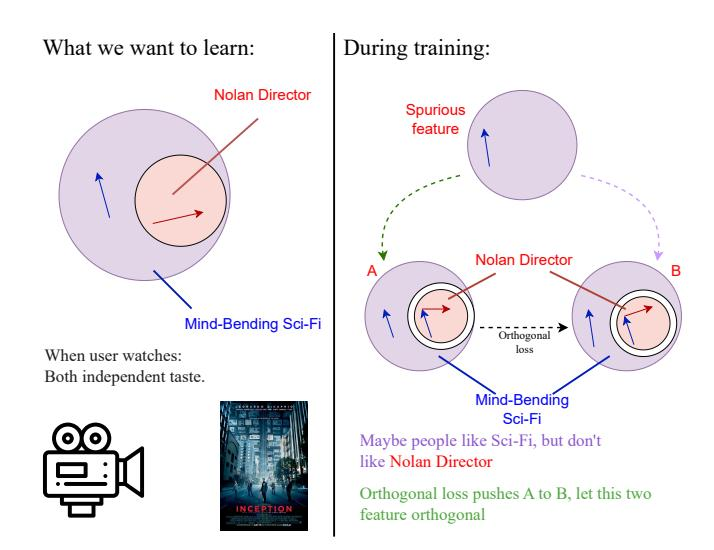
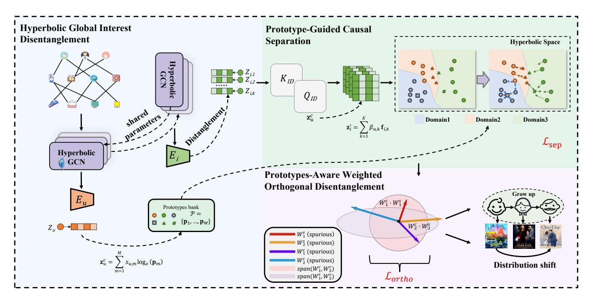
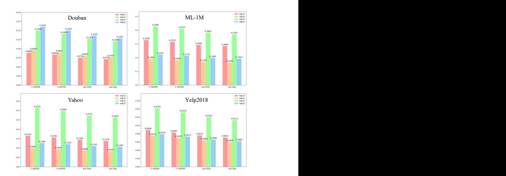
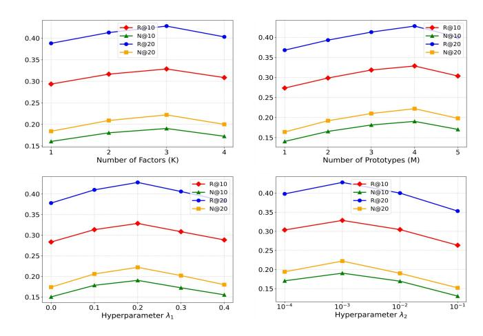

# C-HyPOD: Causal Hyperbolic Representation Learning with Prototype Orthogonal Disentanglement for Graph Out-of-Distribution Recommendation

Jiahao Liang† School of Computer Science and Engineering, South China University of Technology Guangzhou, China csjiahliang6@mail.scut.edu.cn

Yutian Xiao† Institute of Artificial Intelligence, Beijing University of Aeronautics and Astronautics Beijing, China by2442221@buaa.edu.cn

Haoran Yang∗ School of Computer Science and Engineering, Central South University Changsha, China yhr.cse@csu.edu.cn

Zhiwen Yu School of Computer Science and Engineering, South China University of Technology Guangzhou, China zhwyu@scut.edu.cn

Jia-Nan Liu School of Computer Science and Technology, Dongguan University of Technology Dongguan, China j.n.liu@foxmail.com

Kaixiang Yang∗ School of Computer Science and Engineering, South China University of Technology Guangzhou, China yangkx@scut.edu.cn

# Abstract

The vulnerability of graph-based recommender systems to spurious correlations has become a significant obstacle to their practical deployment, hindering their robustness in out-of-distribution (OOD) scenarios. While existing approaches offer partial solutions, they are limited by fundamental shortcomings: model-centric approaches reliant on predefined causal graphs often suffer from suboptimal performance due to complex and dynamic environmental influences. These methods typically require identifying an environmental label or performing feature decoupling, but hidden environments are often difficult to model. Furthermore, existing general feature decoupling methods fail to account for the unique structural characteristics of graphs. To overcome these challenges, we advocate for a shift towards explicit, geometrically-grounded disentanglement. Hyperbolic geometry is particularly suited for this task due to its capacity to model the inherent hierarchies of user interests. We introduce C-HyPOD: Causal Hyperbolic Representation Learning with Prototype Orthogonal Disentanglement, a novel framework designed for graph-based OOD recommendation. Unlike traditional methods, C-HyPOD transforms disentanglement into a concrete geometric task. It introduces a global interest space by learning a single set of universal interest prototypes. They provides a superior geometric foundation for ensuring these prototypes are well-separated and semantically distinct. To ensure a complete separation and prevent information leakage, a targeted orthogonality constraint is then applied. This constraint purifies the aggregated

causal representation by forcing it to be orthogonal to the spurious representation in the tangent space, thereby eliminating their linear correlation. Extensive experiments on four public datasets demonstrate that C-HyPOD significantly improves OOD robustness and recommendation performance, surpassing state-of-the-art methods.

# CCS Concepts

• Information systems → Information retrieval.

# Keywords

Out-of-Distribution Recommendation, Hyperbolic Space, Graph Recommendation

### ACM Reference Format:

Jiahao Liang, Yutian Xiao, Haoran Yang, Zhiwen Yu, Jia-Nan Liu, and Kaixiang Yang. 2026. C-HyPOD: Causal Hyperbolic Representation Learning with Prototype Orthogonal Disentanglement for Graph Out-of-Distribution Recommendation. In Proceedings of the ACM Web Conference 2026 (WWW '26), April 13–17, 2026, Dubai, United Arab Emirates. ACM, New York, NY, USA, [10](#page-9-0) pages.<https://doi.org/10.1145/3774904.3792553>

### 1 Introduction

The complexity of OOD generalization in recommendation systems (RS) [\[7,](#page-8-0) [29](#page-8-1)[–31,](#page-8-2) [44,](#page-8-3) [45\]](#page-8-4) arises from the unique nature of the data. Unlike other types of data, such as images or text, user-item interactions are inherently graph-structured [\[6,](#page-8-5) [36,](#page-8-6) [38,](#page-8-7) [48,](#page-9-1) [49\]](#page-9-2). In these graph-based systems, the inter-connections between nodes (users and items) introduce challenges at both the feature and topological levels. Traditional OOD problems primarily address shifts in feature distributions, but recommendation systems are particularly vulnerable due to the complexity of graph-structured data [\[42,](#page-8-8) [52](#page-9-3)[–54\]](#page-9-4). As user preferences evolve, the interactions between users and items can change, and the model must adapt to these shifts to maintain

†Both authors contributed equally to this research. ∗ indicates the corresponding authors.

[This work is licensed under a Creative Commons Attribution 4.0 International License.](https://creativecommons.org/licenses/by/4.0) WWW '26, Dubai, United Arab Emirates. © 2026 Copyright held by the owner/author(s). ACM ISBN 979-8-4007-2307-0/2026/04 <https://doi.org/10.1145/3774904.3792553>

reliable recommendations. Additionally, the absence of explicit environmental labels makes it difficult to pinpoint how changes in user-item relationships influence model performance.

Existing solutions for Graph Out-of-Distribution (OOD) generalization can be broadly classified into two categories. The first, causal inference [\[9,](#page-8-9) [20,](#page-8-10) [21\]](#page-8-11), models the data-generating process to eliminate spurious correlations. For example, methods may apply causal intervention on a predefined graph to mitigate biases from an item's visual appeal [\[21\]](#page-8-11), employ front-door adjustment to handle unobserved confounders like user mood [\[37\]](#page-8-12), or utilize counterfactual reasoning to distinguish causal effects from mere correlations. The performance of this approach, however, is fundamentally constrained by the accuracy of the predefined graph, rendering it fragile when the true data generation process deviates from the assumed structure. The second category, invariant learning [\[5,](#page-8-13) [17,](#page-8-14) [20,](#page-8-10) [34,](#page-8-15) [35\]](#page-8-16), seeks representations that are stable across different data distributions or "environments." A major practical challenge is the common absence of explicit environmental metadata. To circumvent this, some works attempt to automatically achieve environmental invariance. Approaches include inferring latent environments to guide a diffusion model [\[53\]](#page-9-5), enabling model adaptation during the testing phase via self-distillation [\[42\]](#page-8-8), and using bi-level optimization to learn interaction weights that are robust to noise and distribution shifts [\[32\]](#page-8-17). Still, such environment inference techniques often rely on strong assumptions, such as an alignment between the graph's topology and environmental semantics, which may not hold in practice. Ultimately, both approaches struggle to achieve an interpretable and explicit separation of genuine user interests from environmental biases without relying on strong, and potentially inaccurate, prior assumptions.

To overcome these limitations, we propose a shift from implicit feature disentanglement to an explicit, parameter-level separation of information pathways. As illustrated in Figure [1,](#page-1-0) our approach is designed to disentangle correlated but conceptually distinct user tastes. Consider a user preference for the film Inception. This preference may stem from two independent tastes: a love for the 'mindbending sci-fi" genre and an admiration for 'Christopher Nolan's directorial style." Without proper constraints, a model might learn a single, entangled feature (e.g., 'Nolan's sci-fi'), failing to distinguish the director from the genre. Our proposed orthogonality constraint intervenes by forcing the model's internal processing pathways for these two concepts to remain independent. This ensures the model can accurately represent a user who loves mindbending sci-fi but dislikes Nolan, achieving a more granular and robust preference model. However, realizing such a fine-grained, geometrically-grounded disentanglement is non-trivial, presenting unique challenges in representation learning and optimization.

To address these challenges, we propose C-HyPOD (Causal Hyperbolic Prototype Disentanglement), a novel framework designed for OOD recommendation. C-HyPOD introduces a threestage process to achieve an explicit and interpretable disentanglement. First, it constructs a global interest space by learning a set of M diverse prototypes. This process is conducted in hyperbolic space, which is particularly adept at ensuring the prototypes remain well-separated and semantically distinct [\[8,](#page-8-18) [14\]](#page-8-19). Second, it leverages these prototypes to guide the disentanglement of a user's

Figure 1: Our orthogonal loss (Lortho) enforces the independence of 'Mind - Bending Sci - Fi' and 'Nolan Director' features during training, even with potential spurious correlations.

representation into causal and spurious components, while modeling the fine-grained interaction with an item's multifaceted factors. Finally, it introduces a weight-level orthogonality constraint that purifies the causal pathway at the parameter level, ensuring that final predictions are robust and grounded in stable user interests. Realizing this vision is non-trivial, as it requires specialized non-Euclidean optimization techniques to manage the prototype interactions and orthogonality constraints, posing unique challenges to model convergence and efficiency. In conclusion, our contributions are threefold:

- We develop C-HyPOD, a unified framework that integrates global prototype learning with hyperbolic geometry. By leveraging the superior separation capacity of hyperbolic space to structure its interest space and the semantic clarity of prototypes, C-HyPOD achieves effective and interpretable debiasing.
- We poposed PWOD, a novel disentanglement objective that combines geometric prototype separation with a weight-level orthogonality constraint. This constraint is applied directly to the model's parameters, fundamentally separating the processing pathways for causal and spurious information to achieve a more thorough and robust disentanglement.
- Through extensive experiments on four public recommendation benchmarks, we demonstrate that C-HyPOD consistently outperforms strong baselines in OOD generalization, while also providing interpretable insights into the learned structure of global user interests.

# 2 Preliminary

# 2.1 Problem Formulation

Let U be the set of users and I be the set of items. The user-item interactions are represented as a bipartite graph �� = (U ∪ I, E),

training distribution:

��ˆ �� ���� = (W��v ) �� (W��v��) (21)

Training score. The final training score is the sum of the two components:

��ˆ train ���� = ��ˆ �� ���� + ��ˆ ���� (22)

Together with Lortho, this design encourages the causal branch to focus on prototype-aligned interests, while confining shortcut correlations to the spurious pathway.

Causal-Only Recommendation Score. At inference time, we intervene on the spurious pathway by discarding it, and compute the final recommendation score solely from the causal branch:

��ˆ���� = ��ˆ ���� = (W��v ) �� (W��v��) (23)

Joint Learning Objective. To learn all parameters, we optimize a total objective function Ltotal that seamlessly combines the recommendation task with our proposed disentanglement constraints. The final objective is a weighted sum of three key components:

Ltotal = LBPR + ��1Lsep + ��2Lortho (24)

where ��1, ��2 are hyperparameters that balance the contributions of each term. The components are:

- Ranking Loss (LBPR): We adopt BPR to optimize relative ordering:

LBPR = − ∑︁ (��,��,��) ∈D ln ��(��ˆ���� − ��ˆ����) (25)

- Prototype Separation Loss (Lsep): The geometric regularizer defined in Equation [18,](#page-4-2) which ensures the �� global interest prototypes remain distinct and structurally sound.
- Orthogonality Loss (Lortho): The weight-level disentanglement constraint in Equation [19,](#page-4-3) which purifies the causal processing pathway by orthogonalizing it from the spurious pathway.

During inference, items are ranked by the causal score in Eq. [23.](#page-5-0)

### 4 Experiments

In this section, we conduct a series of experiments to validate C-HyPOD and answer the following key research questions:

- RQ1: What performance can the C-HyPOD achieve compared with selected baselines?
- RQ2: What is the positive impact of our proposed PWOD on performance?
- RQ3: What is influence of Prototype Separation on our model?
- RQ4: How do the hyperparameters of our model affect the performance of our model?

# 4.1 Experimental Settings

In this section, we describe the experimental settings employed to evaluate the performance of various models under different types of distribution shifts.

Datasets. We evaluate our approach on four benchmark datasets: Douban[1](#page-5-1) , Yahoo Music [\[24\]](#page-8-21), MovieLens-1M (ML-1M)[2](#page-5-2) , and Yelp2018[3](#page-5-3) These datasets capture three representative types of distributional

.

shift: popularity, temporal, and exposure. For popularity shift, we use Douban and Yelp2018, where training and test sets are resampled by item popularity so that the test set approximates a uniform popularity distribution. For temporal shift, we adopt ML-1M, using the earliest 60% of interactions for training and the most recent 20% for testing. For exposure shift, we employ Yahoo Music, where the training data come from system-collected ratings while the test set contains ratings on randomly selected items, forming a biased training set and an unbiased test set.

Metrics. We evaluate model performance using two standard metrics in recommender systems: Recall@K and NDCG@K. Recall@K measures the proportion of relevant items retrieved, while NDCG@K reflects the quality of their ranking. Higher values indicate better performance. We report results for �� = 10 and �� = 20.

Baselines. The baseline methods we compared are categorized into four main types: 1) Traditional recommendations: Light-GCN [\[12\]](#page-8-22), HGCF [\[25\]](#page-8-23), HCGR [\[11\]](#page-8-24). 2) Causal-based Recommendations: DCCF [\[37\]](#page-8-12), COR [\[28\]](#page-8-25), CausalPref [\[13\]](#page-8-26), DCCOR [\[18\]](#page-8-27). 3) Invariant learning-based methods: InvCF [\[47\]](#page-9-6), InvPref [\[33\]](#page-8-28), CausalDiffRec [\[53\]](#page-9-5) and IDEA [\[19\]](#page-8-29). 4) Other robust recommendation methods: DR-GNN [\[26\]](#page-8-30), AdvDrop [\[46\]](#page-9-7) and APDA [\[56\]](#page-9-8). The description of these methods is detailed in Appendix.

# 4.2 Overall Experiment

To answer RQ1, we conducted a comprehensive comparison against a range of representative baselines. From Table [1,](#page-6-0) we can draw several key conclusions:

- First of all, our proposed model consistently and significantly outperforms all baselines across all four datasets: Yahoo, Douban, Yelp2018, and ML-1M, achieving the highest scores on all evaluation metrics. This robust superiority highlights the efficacy of our framework, which leverages prototype-guided disentanglement in hyperbolic space to isolate and utilize causal representations for recommendation, effectively mitigating distribution shifts.
- Secondly, methods designed with robustness in mind, particularly those from the Invariant Learning-based and Other Robust Recommendation categories like IDEA, CausalDiffRec, and DR-GNN, show a clear performance advantage over general methods such as LightGCN and SGL. This trend is consistent across all datasets and underscores need for explicitly handling distribution shifts to achieve reliable performance in real-world scenarios.
- Furthermore, a clear performance progression is observed among recent baselines, with 2025 models such as IDEA and CausalDiffRec setting substantially higher benchmarks than earlier methods. Our model surpasses even these competitive approaches, marking a notable advance in robust recommendation. Its consistent superiority across four diverse datasets confirms both effectiveness and generalization capability. By outperforming traditional recommenders and strong OOD-oriented baselines alike, our method establishes a new state of the art for recommendation under distribution shifts.

# 4.3 Ablation Study

To answer RQ2 and RQ3, we conducted a series of ablation studies by removing or replacing three key components: the prototype

1<https://www.kaggle.com/datasets/>

2<https://grouplens.org/datasets/movielens/>

3<https://www.kaggle.com/yelp-dataset/yelp-dataset>

Table 1: Performance comparison on four datasets. The best and second-best results are marked in bold and underline, respectively. 'Improv.' denotes the relative improvement of our model over the best baseline.

|               | Method General Methods | R@10    | N@10    | Yahoo R@20 | N@20   | R@10   | N@10   | Douban R@20 | N@20   | R@10   | N@10   | Yelp2018 R@20 | N@20   | R@10   | N@10   | ML-1M R@20 | N@20   |
|---------------|------------------------|---------|---------|------------|--------|--------|--------|-------------|--------|--------|--------|---------------|--------|--------|--------|------------|--------|
| LightGCN      | (2020)                 | 0.0829  | 0.0549  | 0.1529     | 0.0749 | 0.0445 | 0.0481 | 0.0723      | 0.0789 | 0.0041 | 0.0023 | 0.0095        | 0.0042 | 0.1657 | 0.1049 | 0.2085     | 0.1319 |
| HGCF          | (2021)                 | 0.0777  | 0.0537  | 0.1503     | 0.0763 | 0.0441 | 0.0480 | 0.0735      | 0.0845 | 0.0053 | 0.0032 | 0.0108        | 0.0053 | 0.1618 | 0.1013 | 0.2100     | 0.1394 |
| HCGR          | (2021)                 | 0.0793  | 0.0532  | 0.1518     | 0.0779 | 0.0428 | 0.0471 | 0.0728      | 0.0820 | 0.0055 | 0.0031 | 0.0110        | 0.0052 | 0.1586 | 0.1023 | 0.2079     | 0.1367 |
| Causal-based  | Methods                |         |         |            |        |        |        |             |        |        |        |               |        |        |        |            |        |
| DCCF          | (2024)                 | 0.1175  | 0.0757  | 0.2205     | 0.1117 | 0.0635 | 0.0669 | 0.1057      | 0.1176 | 0.0070 | 0.0044 | 0.0124        | 0.0064 | 0.2350 | 0.1455 | 0.3021     | 0.1960 |
| COR           | (2022)                 | 0.0955  | 0.0632  | 0.1789     | 0.0883 | 0.0521 | 0.0569 | 0.0871      | 0.0952 | 0.0063 | 0.0039 | 0.0116        | 0.0059 | 0.1901 | 0.1221 | 0.2553     | 0.1621 |
| CausalPref    | (2023)                 | 0.1024  | 0.0681  | 0.1933     | 0.0945 | 0.0563 | 0.0615 | 0.0931      | 0.1018 | 0.0066 | 0.0042 | 0.0119        | 0.0062 | 0.2038 | 0.1294 | 0.2717     | 0.1713 |
| DCCOR         | (2024)                 | 0.1049  | 0.0699  | 0.1971     | 0.0968 | 0.0575 | 0.0631 | 0.0955      | 0.1042 | 0.0067 | 0.0043 | 0.0120        | 0.0063 | 0.2088 | 0.1325 | 0.2783     | 0.1754 |
| Invariant     | Learning-based         | Methods |         |            |        |        |        |             |        |        |        |               |        |        |        |            |        |
| InvCF         | (2023)                 | 0.1083  | 0.0718  | 0.2045     | 0.1001 | 0.0589 | 0.0645 | 0.0982      | 0.1075 | 0.0068 | 0.0044 | 0.0122        | 0.0064 | 0.2155 | 0.1351 | 0.2855     | 0.1792 |
| InvPref       | (2022)                 | 0.0962  | 0.0641  | 0.1812     | 0.0891 | 0.0528 | 0.0577 | 0.0882      | 0.0966 | 0.0064 | 0.0040 | 0.0117        | 0.0060 | 0.1915 | 0.1233 | 0.2598     | 0.1637 |
| CausalDiffRec | (2025)                 | 0.1247  | 0.0811  | 0.2414     | 0.0957 | 0.0673 | 0.0717 | 0.1157      | 0.1007 | 0.0077 | 0.0049 | 0.0130        | 0.0068 | 0.2494 | 0.1559 | 0.3307     | 0.1679 |
| IDEA          | (2025)                 | 0.1522  | 0.0901  | 0.2921     | 0.1162 | 0.0822 | 0.0881 | 0.1400      | 0.1515 | 0.0081 | 0.0052 | 0.0135        | 0.0071 | 0.3043 | 0.1732 | 0.4001     | 0.2038 |
| Other         | Robust Recommendation  |         | Methods |            |        |        |        |             |        |        |        |               |        |        |        |            |        |
| DR-GNN        | (2024)                 | 0.1181  | 0.0752  | 0.2218     | 0.1109 | 0.0638 | 0.0666 | 0.1063      | 0.1168 | 0.0071 | 0.0045 | 0.0125        | 0.0065 | 0.2362 | 0.1447 | 0.3038     | 0.1946 |
| AdvDrop       | (2024)                 | 0.1062  | 0.0705  | 0.2001     | 0.0981 | 0.0581 | 0.0638 | 0.0969      | 0.1059 | 0.0067 | 0.0043 | 0.0121        | 0.0063 | 0.2113 | 0.1333 | 0.2818     | 0.1775 |
| APDA          | (2023)                 | 0.1101  | 0.0723  | 0.2093     | 0.1025 | 0.0598 | 0.0654 | 0.1005      | 0.1098 | 0.0069 | 0.0045 | 0.0132        | 0.0065 | 0.2190 | 0.1362 | 0.2903     | 0.1804 |
| Ours          |                        | 0.1643  | 0.0991  | 0.3125     | 0.1266 | 0.0887 | 0.0954 | 0.1498      | 0.1601 | 0.0089 | 0.0075 | 0.0142        | 0.0079 | 0.3286 | 0.1905 | 0.4281     | 0.2221 |
| Improv.       |                        | 7.95%   | 9.99%   | 6.98%      | 8.95%  | 7.91%  | 8.29%  | 7.00%       | 5.68%  | 9.88%  | 44.23% | 5.19%         | 11.27% | 7.99%  | 10.00% | 6.99%      | 8.98%  |

separation loss (C-HyPOD w/o-Sep), the weight-level orthogonality constraint (C-HyPOD w/o-Orth), and a variant that enforces feature-level orthogonality (C-HyFOD). The experimental results are illustrated in Figure [3.](#page-6-1) Our analysis leads to the following conclusions:

- By comparing the full C-HyPOD model with w/o-Orth and w/o-Sep, we observe a significant performance degradation across all datasets when either the hyperbolic orthogonality regularizer or the separation loss is removed. The w/o-Sep variant consistently yields the worst results, indicating that encouraging separation between the learned prototypes is critical for disentanglement.
- The comparison between C-HyPOD and C-HyFOD highlights the advantage of our proposed weight-level orthogonality. Although C-HyFOD (which enforces orthogonality at the feature level) performs better than the other variants, it is consistently outperformed by the full C-HyPOD model. This result suggests that enforcing orthogonality at the parameter level provides a more fundamental and effective structural constraint, leading to better disentanglement and generalization.

### 4.4 Hyperparameters Analysis

To answer RQ4, we analyze the impact of four key parameters on performance based on the results in Figure [4](#page-7-0) as follows:

- The number of factors ��: this parameter determines the dimensionality of the user and item embeddings. As shown in Figure [4,](#page-7-0) the model's performance across all metrics improves as �� increases from 1 to 3, achieving its peak at ��=3. A smaller �� may lead to underfitting, as the embeddings lack the capacity to capture the complex factors in user-item interactions. Yet, when �� is increased to 4, we observe a noticeable performance drop,

Figure 3: Ablation study of C-HyPOD on four datasets. The results validate the effectiveness of each component, as the full model consistently outperforms all degraded variants.

suggesting that higher dimensionality may introduce noise or cause overfitting, impairing the model's generalization.

- The number of Prototypes ��: This parameter controls the number of disentangled prototypes for capturing varied user intents. According to Figure [4,](#page-7-0) performance consistently improves as �� grows from 1 to 4, with the optimal results achieved at �� = 4. This trend indicates that a greater number of prototypes allows the model to better disentangle and represent distinct user preference facets. The decline at �� = 5 suggests that four prototypes are sufficient to capture the primary intent structures within this dataset, and adding more may introduce redundancy.

- The separation loss weight ��1: This hyperparameter balances the main recommendation task with the prototype separation loss ��sep, which encourages prototypes to be distinct. In Figure [4,](#page-7-0) the model's performance peaks at ��1 = 0.2. When ��1 is too small (e.g., 0.0), the prototypes are not effectively separated, leading to redundant representations. Conversely, when ��1 is too large (e.g., 0.4), the excessive separation constraint may distort the semantic space of the embeddings, harming the primary objective of accurate recommendation.
- The orthogonality loss weight ��2: This hyperparameter controls the strength of the orthogonality regularization, which encourages latent factors to be independent. As depicted in Figure [4,](#page-7-0) the model performs optimally at ��2 = 1e−3. A weaker constraint (e.g., 1��−4) is insufficient to enforce factor independence, while a stronger constraint (e.g., 1��−2 or 1��−1) is overly restrictive. This can prevent the model from capturing important latent structures, thereby degrading overall performance.

Figure 4: Hyperparameter analysis of C-HyPOD on the ML-1M dataset. We analyze the impact of (a) the number of factors ��, (b) the number of prototypes ��, (c) the separation loss weight ��1, and (d) the orthogonality loss weight ��2.

### 5 Related Work

In this section, we review two relevant prior works: Hyperbolic Representation Learning and OOD in recommendation.

### 5.1 Hyperbolic Graph Recommendation

To address the geometric limitations of Euclidean models in capturing hierarchical user interests and the power-law distribution of interaction data [\[10,](#page-8-31) [15,](#page-8-32) [43\]](#page-8-33), researchers have increasingly turned to Hyperbolic Graph Representation Learning (HGL) [\[40,](#page-8-34) [57\]](#page-9-9). The exponential volume growth of hyperbolic space provides a more natural and efficient geometry for modeling the scale-free properties inherent in recommendation data [\[39,](#page-8-35) [51\]](#page-9-10). Early work demonstrated that embedding user-item interaction graphs into hyperbolic space yields more faithful representations and improves performance, particularly for long-tail items [\[1,](#page-8-36) [16\]](#page-8-37). Advanced HGL methods incorporate multimodal information and dual-graph architectures (e.g., text-aware or interaction graphs) to combat data sparsity [\[4,](#page-8-38) [27,](#page-8-39) [50\]](#page-9-11). For social recommendation, models like HGSR [\[43\]](#page-8-33) utilize social networks and hyperbolic pre-training to preserve social hierarchies. Additionally, self-supervised contrastive learning has been adapted to the hyperbolic setting [\[10,](#page-8-31) [11,](#page-8-24) [41\]](#page-8-40) to enhance robustness against noise and cold-start issues. Despite these advances, these methods typically neglect causal information, limiting their effectiveness in OOD scenarios.

### 5.2 OOD in recommendation

The Out-of-Distribution (OOD) problem is a critical and pervasive challenge in recommender systems [\[42,](#page-8-8) [58\]](#page-9-12), where a model's performance degrades when the test data distribution differs from the training distribution. These distribution shifts are common and arise from various sources, including temporal dynamics where user interests evolve over time, biases in data collection where popular items are over-represented, and changes in the recommendation context or interface. To tackle this, researchers have explored several robust learning paradigms. One prominent approach is rooted in causal inference [\[9,](#page-8-9) [20,](#page-8-10) [21\]](#page-8-11), which seeks to disentangle the underlying causes of user interactions. For instance, frameworks like DCCL [\[55\]](#page-9-13) and DCCF [\[23\]](#page-8-41) explicitly model and separate a user's intrinsic interest from confounding factors like social conformity or popularity bias, thereby learning a more robust causal representation of user preference. Another strategy is Distributionally Robust Optimization (DRO) [\[2,](#page-8-42) [22\]](#page-8-43), which optimizes for worst-case scenarios; methods such as DR-GNN [\[26\]](#page-8-30) and DRGO [\[54\]](#page-9-4) apply this to mitigate temporal and popularity shifts. Furthermore, selfsupervised and denoising diffusion models are utilized to learn invariant representations against nuisance variations. However, these methods often depend on manually defined priors, which can lead to performance instability.

### 6 Conclusion

In this paper, we introduced C-HyPOD, a novel framework for out-of-distribution (OOD) recommendation that addresses the critical challenge of spurious correlations in graph-based systems. By shifting from implicit disentanglement to explicit, geometricallygrounded causal discovery, our approach pioneers a new paradigm. We introduced learnable causal and confounder prototypes within hyperbolic space, leveraging its unique geometry to model the hierarchical nature of user interests. A targeted orthogonality constraint effectively purifies the causal representation by eliminating confounding influences in the tangent space. Extensive experiments on four public datasets validate our method's superiority, demonstrating that C-HyPOD significantly enhances OOD robustness and recommendation performance over state-of-the-art baselines.

### 7 Acknowledgement

This work was supported in part by the National Natural Science Foundation of China (No. 62476101, 92467109), the Guangdong Basic and Applied Basic Research Foundation under Grant 2024A1515140137, the Guangzhou Science and Technology Plan Project 2024A04J3749, and GuangDong Basic and Applied Basic Research Foundation (No. 2024A1515011341), Dongguan Social Development Technology Project (No. 20231800940342).

### References

[1] Boris Apanasov and Xiangdong Xie. 1997. Geometrically finite complex hyperbolic manifolds. International Journal of Mathematics 8, 06 (1997), 703–757. [2] Jose Blanchet, Jiajin Li, Sirui Lin, and Xuhui Zhang. 2025. Distributionally robust optimization and robust statistics. Statist. Sci. 40, 3 (2025), 351–377. [3] Ines Chami, Zhitao Ying, Christopher Ré, and Jure Leskovec. 2019. Hyperbolic graph convolutional neural networks. Advances in neural information processing systems 32 (2019). [4] Wentao Cheng, Zhida Qin, Zexue Wu, Pengzhan Zhou, and Tianyu Huang. 2025. Large language models enhanced hyperbolic space recommender systems. In Proceedings of the 48th International ACM SIGIR Conference on Research and Development in Information Retrieval. 1944–1953. [5] Shaohua Fan, Xiao Wang, Chuan Shi, Peng Cui, and Bai Wang. 2023. Generalizing graph neural networks on out-of-distribution graphs. IEEE transactions on pattern analysis and machine intelligence 46, 1 (2023), 322–337. [6] Wenqi Fan, Xiaorui Liu, Wei Jin, Xiangyu Zhao, Jiliang Tang, and Qing Li. 2022. Graph trend filtering networks for recommendation. In Proceedings of the 45th international ACM SIGIR conference on research and development in information retrieval. 112–121. [7] Jingtong Gao, Xiangyu Zhao, Bo Chen, Fan Yan, Huifeng Guo, and Ruiming Tang. 2023. AutoTransfer: instance transfer for cross-domain recommendations. In Proceedings of the 46th International ACM SIGIR Conference on Research and Development in Information Retrieval. 1478–1487. [8] Mina Ghadimi Atigh, Martin Keller-Ressel, and Pascal Mettes. 2021. Hyperbolic busemann learning with ideal prototypes. Advances in neural information processing systems 34 (2021), 103–115. [9] Shurui Gui, Xiner Li, Limei Wang, and Shuiwang Ji. 2022. Good: A graph out-ofdistribution benchmark. Advances in Neural Information Processing Systems 35 (2022), 2059–2073. [10] Naicheng Guo, Xiaolei Liu, Shaoshuai Li, Mingming Ha, Qiongxu Ma, Binfeng Wang, Yunan Zhao, Linxun Chen, and Xiaobo Guo. 2023. Hyperbolic contrastive graph representation learning for session-based recommendation. IEEE Transactions on Knowledge and Data Engineering (2023). [11] Naicheng Guo, Xiaolei Liu, Shaoshuai Li, Qiongxu Ma, Yunan Zhao, Bing Han, Lin Zheng, Kaixin Gao, and Xiaobo Guo. 2021. Hcgr: Hyperbolic contrastive graph representation learning for session-based recommendation. arXiv preprint arXiv:2107.05366 (2021). [12] Xiangnan He, Kuan Deng, Xiang Wang, Yan Li, Yongdong Zhang, and Meng Wang. 2020. Lightgcn: Simplifying and powering graph convolution network for recommendation. In Proceedings of the 43rd International ACM SIGIR conference on research and development in Information Retrieval. 639–648. [13] Yue He, Zimu Wang, Peng Cui, Hao Zou, Yafeng Zhang, Qiang Cui, and Yong Jiang. 2022. Causpref: Causal preference learning for out-of-distribution recommendation. In Proceedings of the ACM web conference 2022. 410–421. [14] Chengyang Hu, Ke-Yue Zhang, Taiping Yao, Shouhong Ding, and Lizhuang Ma. 2024. Rethinking generalizable face anti-spoofing via hierarchical prototypeguided distribution refinement in hyperbolic space. In Proceedings of the IEEE/CVF Conference on Computer Vision and Pattern Recognition. 1032–1041. [15] Guojie Li, Zhiwen Yu, Kaixiang Yang, C. L. Philip Chen, and Xuelong Li. 2025. Ensemble-Enhanced Semi-Supervised Learning With Optimized Graph Construction for High-Dimensional Data. IEEE Transactions on Pattern Analysis and Machine Intelligence 47, 2 (2025), 1103–1119. [doi:10.1109/TPAMI.2024.3486319](https://doi.org/10.1109/TPAMI.2024.3486319) [16] Hao Li, Hao Jiang, Dongsheng Ye, Qiang Wang, Liang Du, Yuanyuan Zeng, Yingxue Wang, Cheng Chen, et al. 2024. DHGAT: Hyperbolic representation learning on dynamic graphs via attention networks. Neurocomputing 568 (2024), 127038. [17] Haoyang Li, Ziwei Zhang, Xin Wang, and Wenwu Zhu. 2022. Learning invariant graph representations for out-of-distribution generalization. Advances in Neural Information Processing Systems 35 (2022), 11828–11841. [18] Zhuhang Li and Ning Yang. 2024. Cross-Domain Causal Preference Learning for Out-of-Distribution Recommendation. In International Conference on Database Systems for Advanced Applications. Springer, 245–260. [19] Yuxin Liao, Yonghui Yang, Min Hou, Le Wu, Hefei Xu, and Hao Liu. 2025. Mitigating distribution shifts in sequential recommendation: An invariance perspective. In Proceedings of the 48th International ACM SIGIR Conference on Research and Development in Information Retrieval. 1603–1613. [20] Yang Liu, Xiang Ao, Fuli Feng, Yunshan Ma, Kuan Li, Tat-Seng Chua, and Qing He. 2023. FLOOD: A flexible invariant learning framework for out-of-distribution generalization on graphs. In Proceedings of the 29th ACM SIGKDD Conference on Knowledge Discovery and Data Mining. 1548–1558. [21] Ruihong Qiu, Sen Wang, Zhi Chen, Hongzhi Yin, and Zi Huang. 2021. Causalrec: Causal inference for visual debiasing in visually-aware recommendation. In Proceedings of the 29th ACM international conference on multimedia. 3844–3852. [22] Hamed Rahimian and Sanjay Mehrotra. 2019. Distributionally robust optimization: A review. arXiv preprint arXiv:1908.05659 (2019). [23] Xubin Ren, Lianghao Xia, Jiashu Zhao, Dawei Yin, and Chao Huang. 2023. Disentangled contrastive collaborative filtering. In Proceedings of the 46th international ACM SIGIR conference on research and development in information retrieval. 1137– 1146. [24] Tobias Schnabel, Adith Swaminathan, Ashudeep Singh, Navin Chandak, and Thorsten Joachims. 2016. Recommendations as treatments: Debiasing learning and evaluation. In international conference on machine learning. PMLR, 1670– 1679. [25] Jianing Sun, Zhaoyue Cheng, Saba Zuberi, Felipe Pérez, and Maksims Volkovs. 2021. Hgcf: Hyperbolic graph convolution networks for collaborative filtering. In Proceedings of the web conference 2021. 593–601. [26] Bohao Wang, Jiawei Chen, Changdong Li, Sheng Zhou, Qihao Shi, Yang Gao, Yan Feng, Chun Chen, and Can Wang. 2024. Distributionally robust graphbased recommendation system. In Proceedings of the ACM web conference 2024. 3777–3788. [27] Binhao Wang, Yutian Xiao, Maolin Wang, Zhiqi Li, Tianshuo Wei, Ruocheng Guo, and Xiangyu Zhao. 2025. SPARK: Adaptive Low-Rank Knowledge Graph Modeling in Hybrid Geometric Spaces for Recommendation. arXiv preprint arXiv:2509.11094 (2025). [28] Wenjie Wang, Xinyu Lin, Fuli Feng, Xiangnan He, Min Lin, and Tat-Seng Chua. 2022. Causal representation learning for out-of-distribution recommendation. In Proceedings of the ACM Web Conference 2022. 3562–3571. [29] Wenjie Wang, Yiyan Xu, Fuli Feng, Xinyu Lin, Xiangnan He, and Tat-Seng Chua. 2023. Diffusion recommender model. In Proceedings of the 46th International ACM SIGIR Conference on Research and Development in Information Retrieval. 832–841. [30] Xiang Wang, Xiangnan He, Yixin Cao, Meng Liu, and Tat-Seng Chua. 2019. Kgat: Knowledge graph attention network for recommendation. In Proceedings of the 25th ACM SIGKDD international conference on knowledge discovery & data mining. 950–958. [31] Yuhan Wang, Qing Xie, Mengzi Tang, Zhifeng Bao, Lin Li, and Yongjian Liu. 2025. Knowledge Memory Graph convolution network for cross-domain recommendation. Knowledge-Based Systems 317 (2025), 113415. [doi:10.1016/j.knosys.2025.](https://doi.org/10.1016/j.knosys.2025.113415) [113415](https://doi.org/10.1016/j.knosys.2025.113415) [32] Zongwei Wang, Min Gao, Wentao Li, Junliang Yu, Linxin Guo, and Hongzhi Yin. 2023. Efficient bi-level optimization for recommendation denoising. In Proceedings of the 29th ACM SIGKDD Conference on Knowledge Discovery and Data Mining. 2502–2511. [33] Zimu Wang, Yue He, Jiashuo Liu, Wenchao Zou, Philip S Yu, and Peng Cui. 2022. Invariant preference learning for general debiasing in recommendation. In Proceedings of the 28th ACM SIGKDD Conference on Knowledge Discovery and Data Mining. 1969–1978. [34] Qitian Wu, Hengrui Zhang, Junchi Yan, and David Wipf. 2022. Handling distribution shifts on graphs: An invariance perspective. arXiv preprint arXiv:2202.02466 (2022). [35] Ying-Xin Wu, Xiang Wang, An Zhang, Xiangnan He, and Tat-Seng Chua. 2022. Discovering invariant rationales for graph neural networks. arXiv preprint arXiv:2201.12872 (2022). [36] Hao Xu, Bo Yang, Xiangkun Liu, Wenqi Fan, and Qing Li. 2022. Categoryaware multi-relation heterogeneous graph neural networks for session-based recommendation. Knowledge-Based Systems 251 (2022), 109246. [37] Shuyuan Xu, Juntao Tan, Shelby Heinecke, Vena Jia Li, and Yongfeng Zhang. 2023. Deconfounded Causal Collaborative Filtering. ACM Trans. Recomm. Syst. 1, 4, Article 17 (Oct. 2023), 25 pages. [doi:10.1145/3606035](https://doi.org/10.1145/3606035) [38] Haoran Yang, Xiangyu Zhao, Yicong Li, Hongxu Chen, and Guandong Xu. 2024. An empirical study towards prompt-tuning for graph contrastive pre-training in recommendations. Advances in Neural Information Processing Systems 36 (2024). [39] Menglin Yang, Min Zhou, Jiahong Liu, Defu Lian, and Irwin King. 2022. HRCF: Enhancing collaborative filtering via hyperbolic geometric regularization. In Proceedings of the ACM web conference 2022. 2462–2471. [40] Menglin Yang, Min Zhou, Rex Ying, Yankai Chen, and Irwin King. 2023. Hyperbolic representation learning: Revisiting and advancing. In International Conference on Machine Learning. PMLR, 39639–39659. [41] Xin Yang, Heng Chang, Zhijian Lai, Jinze Yang, Xingrun Li, Yu Lu, Shuaiqiang Wang, Dawei Yin, and Erxue Min. 2024. Hyperbolic contrastive learning for cross-domain recommendation. In Proceedings of the 33rd ACM International Conference on Information and Knowledge Management. 2920–2929. [42] Xihong Yang, Yiqi Wang, Jin Chen, Wenqi Fan, Xiangyu Zhao, En Zhu, Xinwang Liu, and Defu Lian. 2025. Dual test-time training for out-of-distribution recommender system. IEEE Transactions on Knowledge and Data Engineering (2025). [43] Yonghui Yang, Le Wu, Kun Zhang, Richang Hong, Hailin Zhou, Zhiqiang Zhang, Jun Zhou, and Meng Wang. 2024. Hyperbolic Graph Learning for Social Recommendation. IEEE Trans. on Knowl. and Data Eng. 36, 12 (Dec. 2024), 8488–8501. [doi:10.1109/TKDE.2023.3343402](https://doi.org/10.1109/TKDE.2023.3343402) [44] Zhengyi Yang, Jiancan Wu, Zhicai Wang, Xiang Wang, Yancheng Yuan, and Xiangnan He. 2024. Generate what you prefer: Reshaping sequential recommendation via guided diffusion. Advances in Neural Information Processing Systems 36 (2024). [45] Meng Yuan, Yutian Xiao, Wei Chen, Chou Zhao, Deqing Wang, and Fuzhen Zhuang. 2025. Hyperbolic Diffusion Recommender Model. In Proceedings of the

[46] An Zhang, Wenchang Ma, Pengbo Wei, Leheng Sheng, and Xiang Wang. 2024. General debiasing for graph-based collaborative filtering via adversarial graph dropout. In Proceedings of the ACM Web Conference 2024. 3864–3875. [47] An Zhang, Jingnan Zheng, Xiang Wang, Yancheng Yuan, and Tat-Seng Chua. 2023. Invariant collaborative filtering to popularity distribution shift. In Proceedings of the ACM Web Conference 2023. 1240–1251. [48] Guixian Zhang, Guan Yuan, Debo Cheng, Lin Liu, Jiuyong Li, and Shichao Zhang. 2025. Towards Fair Graph Representation Learning by Overcoming Social Homophily. ACM Trans. Intell. Syst. Technol. (Dec. 2025). [doi:10.1145/3785503](https://doi.org/10.1145/3785503) Just Accepted. [49] Jiahao Zhang, Rui Xue, Wenqi Fan, Xin Xu, Qing Li, Jian Pei, and Xiaorui Liu. 2024. Linear-Time Graph Neural Networks for Scalable Recommendations. In Proceedings of the ACM on Web Conference 2024. 3533–3544. [50] Lu Zhang and Ning Wu. 2024. HGCH: A Hyperbolic Graph Convolution Network Model for Heterogeneous Collaborative Graph Recommendation. In Proceedings of the 33rd ACM International Conference on Information and Knowledge Management. 3186–3196. [51] Meicheng Zhang, Min Jiang, Xuefeng Tao, Kang Wang, and Jun Kong. 2023. Disentangled representation learning for collaborative filtering based on hyperbolic geometry. Knowledge-Based Systems 282 (2023), 111135. [52] Zeyang Zhang, Xin Wang, Haibo Chen, Haoyang Li, and Wenwu Zhu. 2024. Disentangled Dynamic Graph Attention Network for Out-of-Distribution Sequential Recommendation. ACM Transactions on Information Systems 43, 1 (2024), 1–42. [53] Chu Zhao, Enneng Yang, Yuliang Liang, Pengxiang Lan, Yuting Liu, Jianzhe Zhao, Guibing Guo, and Xingwei Wang. 2025. Graph representation learning via causal diffusion for out-of-distribution recommendation. In Proceedings of the ACM on Web Conference 2025. 334–346. [54] Chu Zhao, Enneng Yang, Yuliang Liang, Jianzhe Zhao, Guibing Guo, and Xingwei Wang. 2025. Distributionally robust graph out-of-distribution recommendation via diffusion model. In Proceedings of the ACM on Web Conference 2025. 2018–2031. [55] Weiqi Zhao, Dian Tang, Xin Chen, Dawei Lv, Daoli Ou, Biao Li, Peng Jiang, and Kun Gai. 2023. Disentangled causal embedding with contrastive learning for recommender system. In Companion proceedings of the ACM web conference 2023. 406–410. [56] Huachi Zhou, Hao Chen, Junnan Dong, Daochen Zha, Chuang Zhou, and Xiao Huang. 2023. Adaptive popularity debiasing aggregator for graph collaborative filtering.(2023). A APPENDICES A 1 (2023). [57] Min Zhou, Menglin Yang, Lujia Pan, and Irwin King. 2022. Hyperbolic graph representation learning: A tutorial. arXiv preprint arXiv:2211.04050 (2022). [58] Jiajie Zhu, Yan Wang, Feng Zhu, Pengfei Ding, Hongyang Liu, and Zhu Sun. 2025. Causal-Invariant Cross-Domain Out-of-Distribution Recommendation. arXiv preprint arXiv:2505.16532 (2025).