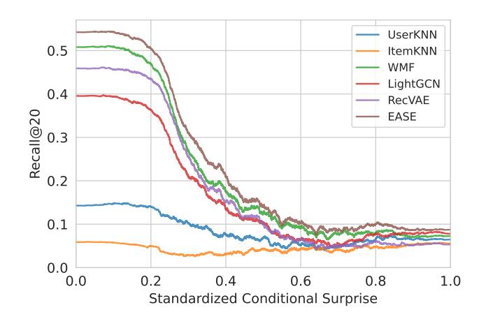
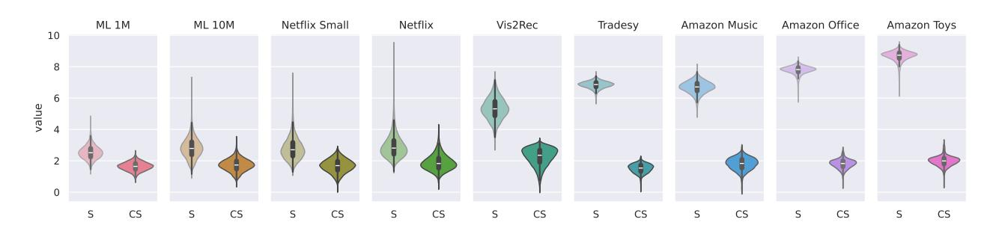
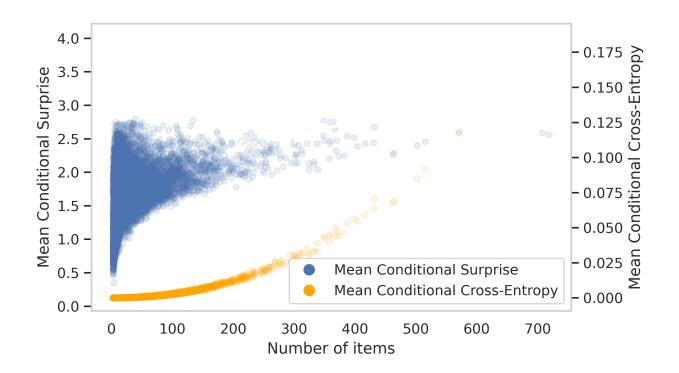
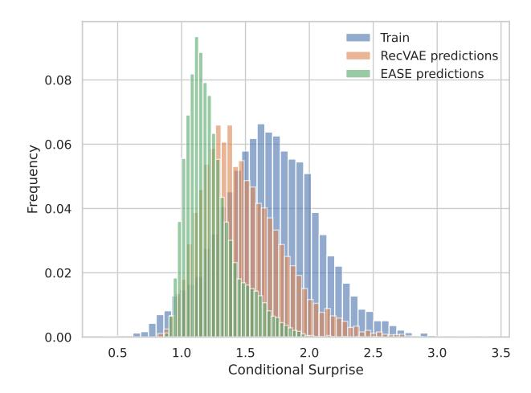
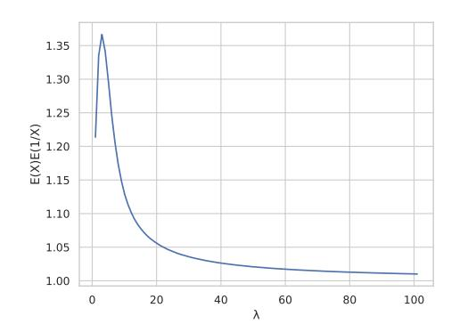
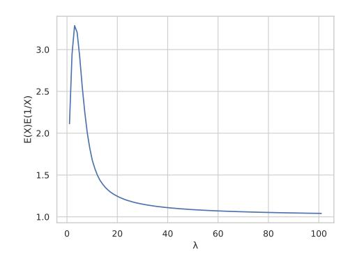
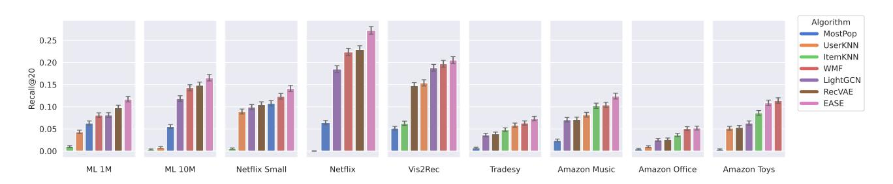

# Quantifying User Coherence: A Unified Framework for Analyzing Recommender Systems Across Domains

[Michaël Soumm](https://orcid.org/1234-5678-9012)∗ soumm@telecom-paris.fr Télécom Paris Palaiseau, France

Alexandre Fournier Montgieux∗ alexandre.fourniermontgieux@cea.fr CEA List Palaiseau, France

Adrian Popescu adrian.popescu@cea.fr CEA List Palaiseau, France

Bertrand Delezoide bertrand.delezoide@amanda.com Amanda.com Paris, France

# Abstract

The performance of Recommender Systems (RS) varies significantly across users, yet the underlying reasons for this variance remain poorly understood. This paper introduces a unified framework to analyze and explain this performance gap by quantifying user profile characteristics. We propose two novel, information-theoretic measures: Mean Surprise (�� (��)), which captures a user's deviation from popular items and is closely related to popularity bias, and Mean Conditional Surprise (���� (��)), which measures the internal coherence of a user's interactions in a domain-agnostic manner. Through extensive experiments on 7 algorithms and 9 datasets, we demonstrate that these measures are strong predictors of recommendation performance. Our analysis reveals that performance gains from complex models are concentrated on "coherent" users, while all algorithms perform poorly on "incoherent" users. We show how these measures provide practical utility for the Web community by: (1) enabling robust, stratified evaluation to identify model weaknesses; (2) facilitating a novel analysis of the behavioral alignment of recommendations; and (3) guiding targeted system design, which we validate by training a specialized model on a segment of "coherent" users that achieves superior performance for that group with significantly less data. This work provides a new lens for understanding user behavior and offers practical tools for building more robust and efficient large-scale recommender systems.

# CCS Concepts

• Information systems → Personalization; Recommender systems.

# Keywords

Recommender Systems, Explainability, User profile quality, Metrics, Algorithm performance

∗Both authors contributed equally to this research.

[This work is licensed under a Creative Commons Attribution-NonCommercial-](https://creativecommons.org/licenses/by-nc-nd/4.0)[NoDerivatives 4.0 International License.](https://creativecommons.org/licenses/by-nc-nd/4.0)

WWW '26, Dubai, United Arab Emirates © 2026 Copyright held by the owner/author(s). ACM ISBN 979-8-4007-2307-0/2026/04 <https://doi.org/10.1145/3774904.3792563>

### ACM Reference Format:

Michaël Soumm, Alexandre Fournier Montgieux, Adrian Popescu, and Bertrand Delezoide. 2026. Quantifying User Coherence: A Unified Framework for Analyzing Recommender Systems Across Domains. In Proceedings of the ACM Web Conference 2026 (WWW '26), April 13–17, 2026, Dubai, United Arab Emirates. ACM, New York, NY, USA, [12](#page-11-0) pages. [https://doi.org/10.1145/](https://doi.org/10.1145/3774904.3792563) [3774904.3792563](https://doi.org/10.1145/3774904.3792563)

# 1 Introduction

With the rapid development of digital connectivity and the explosion in the amount of information, recommender systems (RS) have emerged as essential tools, offering personalized suggestions adapted to individual preferences and behaviors [\[38,](#page-8-0) [39\]](#page-8-1). These systems play an essential role in filtering and personalizing content across various domains, from e-commerce to entertainment and news consumption [\[31,](#page-8-2) [38\]](#page-8-0).

RS can be categorized into three main types: content-based (CB), knowledge-based (KB), and in our study scope, collaborative filtering (CF) approaches [\[10\]](#page-8-3). We concentrate on CF approaches since they have dominated the research landscape in recent years [\[8,](#page-8-4) [36,](#page-8-5) [54\]](#page-9-0): Their ability to aggregate user preferences and make recommendations based on similarities in user behavior patterns [\[31\]](#page-8-2) despite minimal information allows analyzing only user-item interactions without the need for additional content or knowledge-based features [\[1,](#page-8-6) [18\]](#page-8-7).

In the context of deep learning, inconsistency within data appears to be a central issue for both training and model evaluation [\[53\]](#page-9-1). Where some applications seek to eliminate these parasitic components [\[23,](#page-8-8) [51\]](#page-9-2), others seek to better deal with them, or even propose evaluation frameworks dedicated to these more "difficult" scenarios [\[20,](#page-8-9) [41\]](#page-8-10). However, in both cases, introducing effective metrics or measures to analyze and characterize the data is essential. In particular, selecting the right measures is required for ensuring that an RS delivers recommendations that are not only accurate but also align well with users' overall preferences and consumption patterns, ultimately enhancing user satisfaction. Despite the emergence of many new measures like diversity and novelty [\[29\]](#page-8-11) that describe predicted items, and despite existing research on users' profiles classification [\[13,](#page-8-12) [21\]](#page-8-13), the field lacks measures that accurately model the diversity of user consumption.

We thus propose two coherence measures, Mean Surprise and Mean Conditional Surprise, that quantify how "unusual" user profiles are. The former describes how surprising (uncommon) a

Figure 1: Performance in **Recall@20** of different RS, averaged over datasets, w.r. to our proposed Conditional Surprise (���� (��)) measure, which represents how much a user's interactions are coherent, standardized between 0 and 1. All RS performance collapse for high values of ���� (��), showing that most model gains stem from learning only on "easy" data points.

user's consumption is, while the latter describes the consumption's internal coherence, independently of its uncommonness. Both measures are strongly linked with the models' prediction quality, especially the conditional surprise as summarized in Figure [1.](#page-1-0) Specifically, our main contributions are:

- We introduce a framework based on two robust, informationtheoretic measures, Mean Surprise �� (��) and Mean Conditional Surprise ���� (��), to quantify user taste and profile coherence across diverse domains.
- We use these measures to perform a stratified evaluation of recommender systems, revealing a key insight that aggregate metrics hide: performance gains from complex models are concentrated on "coherent" users, while all algorithms universally fail on "incoherent" users.
- We demonstrate the practical utility of our framework for deeper algorithmic analysis and system design by: (a) proposing a novel method to measure the behavioral alignment of algorithms, and (b) validating user segmentation with a proof-of-concept where a specialized model improves performance on coherent users with less data.

The anonymized version of the code can be found at [https://github.](https://github.com/MSoumm/coherence-measures) [com/MSoumm/coherence-measures.](https://github.com/MSoumm/coherence-measures)

# 2 Related Work

The evaluation of Recommender Systems (RS) has matured significantly, with a growing emphasis on reproducibility and rigor [\[42,](#page-8-14) [52\]](#page-9-3). This has been driven by challenges in offline evaluation [\[49,](#page-8-15) [50\]](#page-9-4) and replicability [\[17\]](#page-8-16), motivating the need for more rigorous evaluation approaches.

The data processing pipeline is also known to have an important impact on performance. Some works [\[37\]](#page-8-17) examined data splitting strategies and their impact on evaluation outcomes, while others [\[28\]](#page-8-18) addressed data leakage in offline evaluation, highlighting the issue of evaluating on too few sets [\[19\]](#page-8-19). These concerns lead to the development of standardized frameworks like Elliot [\[6\]](#page-8-20) and ReChorus2.0 [\[35\]](#page-8-21). While essential, these frameworks have primarily centered on traditional accuracy metrics.

Recognizing the limitations of accuracy-only evaluation, the community developed metrics that assess the quality of the recommendation list (the system's output). These include measures of diversity, novelty, serendipity, and user satisfaction [\[29,](#page-8-11) [32,](#page-8-22) [44\]](#page-8-23). The use of satisfaction metrics was democratized to evaluate model predictions in the following works [\[3,](#page-8-24) [44\]](#page-8-23). Additional research has highlighted the importance of considering these newer metrics in order to better match users' behavior and find better recommendations [\[30,](#page-8-25) [40\]](#page-8-26). Such metrics are useful for analyzing system behavior and group disparities [\[16,](#page-8-27) [17\]](#page-8-16). However, they primarily evaluate the outcome of a recommendation without fully explaining why performance varies across users. Some model-based surprise approaches, such as Unexp-DIN[\[56\]](#page-9-5), focus on unexpectedness relative to a specific architecture's predictions, our measures are modelagnostic. They characterize the intrinsic properties of the input data itself, serving as a complementary tool to analyze why certain architectures may fail to capture specific user behavior patterns

Explaining this variance requires characterizing the input data: the user profiles themselves. A notable line of work is the identification of "grey sheep" users, whose preferences are hard to model as they do not align with any discernible group [\[13\]](#page-8-12). Existing methods for identifying such users often rely on inter-user similarity clustering or density-based techniques [\[21,](#page-8-13) [22,](#page-8-28) [55\]](#page-9-6). While insightful, these approaches can be sensitive to profile density and often require dataset-specific hyperparameter tuning, limiting their generalizability.

In addition, concerns about domain-specific evaluation methodologies have emerged, highlighting the need for more nuanced and versatile evaluation approaches.

Recent findings [\[15,](#page-8-29) [34\]](#page-8-30) underscore the importance of considering domain-specific features in evaluation methodologies. Building on these insights, Sun [\[50\]](#page-9-4) questioned the applicability of current evaluation practices across domains, arguing that metrics and evaluation protocols optimized for one domain may not translate effectively to others. They highlighted the need for more generalizable evaluation frameworks that can account for domain-specific nuances while still enabling meaningful cross-domain comparisons.

Collectively, these studies depict a field in transition, showing the need for better evaluation practices to match the increasing sophistication and real-world impact of recommender systems.

# 3 Proposed Approach

# 3.1 Notations and Problem Formulation for Binary Collaborative Filtering

We denote the set of users as U and the set of items as I. Let �� = |U| be the number of users and �� = |I| the number of items. We place ourselves in a binary setting where each user �� ∈ U can either interact (������ = 1) or not interact (������ = 0) with an item �� ∈ I, leading to the binary interaction matrix �� ∈ {0, 1} ��×��. We identify each user to its item set so that "��" refers equivalently to a user id and to their item set.

A set of test users U�������� is randomly sampled. For each test user,

�� E�� [|��|] ≤ E�� [�� (��)] �� ∗ (��) ≤ E�� ≥1 �� |��| (5)

��2 E�� ≥1 [|��| ≤ E�� �� [���� (��)] ����∗ (��) ≤ E�� ≥1 ��2 |��| (6)

In particular, we see that the lower bound for the scaling depends only on the expected value of the number of items. The upper bound, however, can theoretically get bigger than ��/E�� ≥1 [|��|]. Since |��| is the number of items consumed by ��, we can model it as a Poisson variable with parameter �� [\(A.3\)](#page-9-8). We have the following bound (Proof in [A.4\)](#page-9-9):

Proposition 3.2. If �� is a Poisson variable of parameter �� &gt; 0 , we have:

E≥1 1 �� ≤ 2 E≥1 [��] (7)

Empirically, we find a tighter upper bound for Equation [7](#page-3-0) with a numerator equal to 1.37 instead of 2. This upper bound is met for �������� ≈ 2.9. For smaller and larger values of ��, the numerator quickly drops to 1. This means that for surprising users, on average, the empirical estimation should not be too far from�� ∗ (��)×��/E�� [|��|], which is indeed the classical estimator expectancy re-scaled by the mean proportion of items that a user will consume. The same bound effects apply to ���� (��).

Implications of Theoretical Guarantees. These propositions provide the main theoretical link between our practical, user-level measures and the ideal cross-entropy we aim to approximate (�� ∗ (��) and ����∗ (��)). The core challenge is that the naive estimators are poorly suited for sparse binary data. Our proposed measures resolve this by normalizing only over a user's consumed items. Propositions 1 and 2 together demonstrate the consequence of this choice: on average, our proposed estimator is a stable, well-behaved rescaling of the ideal cross-entropy we wish to target. The bounds show that this rescaling factor is tightly controlled by the inverse of the user base's average consumption rate (proportional to ��/E[|��|]). This result provides confidence that our measures are not ad-hoc heuristics; they are principled estimators that effectively magnify the relevant behavioral signal from sparse interactions in a theoretically justified manner.

### 3.3 Regression Model as an Analytical tool

To accurately quantify the impact of our measures on RS performance, we employ logistic regression [\[7\]](#page-8-34), a statistical method for modeling the relation between attributes and binary outcomes, as proposed by Soumm [\[47\]](#page-8-35). The logistic regression model is defined as:

ln P[�� = 1|��] P[�� = 0|��] = ��0 + ��1��1 + ... + �������� (8)

where �� is the binary target variable, ��1, ...���� are the explanatory variables, and ��0, ..., ���� are the fitted coefficients. This model is denoted in a condensed form as �� ∼ ��(��1 + ... + ���� ). The model provides coefficient estimates ( ˆ�� values) for each variable, from which we compute average marginal effects (AME), quantifying how changes in each variable affect the outcome probability while holding other variables constant [\[7\]](#page-8-34). The choice of the considered

Table 2: Description of the datasets after processing (see [B.1](#page-10-0) for details about the processing)

| Dataset |        | Items | Users | Inter. | Density |    |     |
|---------|--------|-------|-------|--------|---------|----|-----|
| ML      | 1M     | 3.1K  | 6K    | 562K   | 3       | 10 | − 2 |
| ML      | 10M    | 9.4K  | 69K   | 5.7M   | 9       | 10 | − 3 |
| Netflix | Small  | 2.7K  | 8.3K  | 320K   | 1       | 10 | − 2 |
| Netflix |        | 18K   | 463K  | 59.9M  | 7       | 10 | − 4 |
| Vis2Rec |        | 9.3K  | 9.1K  | 200K   | 2       | 10 | − 3 |
| Tradesy |        | 12K   | 6.6K  | 73K    | 9       | 10 | − 4 |
| Amazon  | Music  | 11K   | 8.6K  | 87K    | 9       | 10 | − 4 |
| Amazon  | Office | 62K   | 20K   | 468K   | 4       | 10 | − 4 |
| Amazon  | Toys   | 143K  | 61K   | 1.2M   | 1       | 10 | − 4 |

variables is motivated by modeling considerations and regression quality metrics such as McFadden �� [\[4\]](#page-8-36) and the AIC [\[2\]](#page-8-37). To capture the interactions between variables, we use product terms. For example, the notation �� × �� expands to �� + �� + ����, including the main effects and their interaction. This allows for the modeling of complex relationships while retaining individual variable effects.

When �� is a variable estimating �� ∗ with a certain variance �� , the plain regression on �� becomes imprecise, as the regression data becomes noisy. We the SIMEX (Simulation-Extrapolation) method [\[14\]](#page-8-38), which simulates many regressions with the added noise �� , and extrapolates to the case of no noise, providing more robust coefficient estimates.

### 4 Experimental Setup

### 4.1 Datasets

We perform our analysis on 9 datasets of various sizes and domains: MovieLens 1M and MovieLens 10M [\[24\]](#page-8-39): movie ratings recommendation datasets, commonly used for benchmarking recommendation algorithms; Netflix Small and Netflix [\[9\]](#page-8-40): two versions of the Netflix Prize dataset, consisting of movie ratings; Amazon Music, Amazon Office, and Amazon Toys [\[33\]](#page-8-41): part of the Amazon product reviews collection, focusing on different product categories; Tradesy [\[33\]](#page-8-41): interactions on the Tradesy platform, which specializes in the resale of designer fashion; Vis2Rec [\[46\]](#page-8-42): tourism recommendation dataset, with visits identified from photos.

We used different sizes from the same dataset, and datasets from the same domain but different sources, specifically to study the effects of dataset size and domain. This allows us to analyze recommender systems across a wide range of real-world applications.

### 4.2 Recommender Algorithms

We benchmark 7 recommendation algorithms on the formated datasets presented in Table [2](#page-3-1) : **MostPop** is the baseline algorithm that recommends the most popular items to every user; **UserKNN** is a neighborhood-based approach that relies on a similarity between pairs of users. **ItemKNN** is a neighborhood-based approach that relies on a similarity between pairs of items; **WMF** is a weighted matrix factorization approach that learns user and item embeddings with gradient descent, minimizing a reconstruction loss; **EASE** [\[48\]](#page-8-43) is a matrix factorization approach that computes an item-item weight matrix with a closed-form formula; **LightGCN** [\[43\]](#page-8-44) is an approach that learns user and item embeddings by aggregating information

Figure 2: Distribution of the measures across datasets. S denotes the Surprise measure, and CS the Conditional Surprise measure. CS shows remarkable stability across all datasets.

from the user-item interaction graph using a light graph convolution; **RecVAE** [\[43\]](#page-8-44) is a variational auto-encoder approach inspired by ��-VAE [\[26\]](#page-8-45) and denoising-VAE [\[27\]](#page-8-46). These algorithms have been chosen to represent a wide range of possible usages, depending on how well they scale with the number of users, the number of items, training times, or flexibility.

### 4.3 Training

In the leave-one-out protocol, as there is only 1 relevant test item per user, the two reference metrics Recall@K and Precision@K [\[25\]](#page-8-47) are equivalent, up to a constant, since they are proportional to the number of relevant items. Therefore, we only use Recall@K, which corresponds in this case to a binary variable 0/1. For each experiment (i.e. algorithm trained on a dataset or a dataset segment), we perform a hyperparameter search using optuna with 50 rounds maximizing the Recall@20 on the validation set.The models are trained on 256 AMD EPYC 9554 64-Core CPUs and 1.4TB of RAM for the algorithms that run on CPU, while others are run on a single NVIDIA A100 GPU with 40GB of VRAM.

## 5 Results and Analysis

# 5.1 Experimental Properties of the Measures

Measure Distribution. Figure [2](#page-4-0) presents the distribution of our proposed measures across the datasets. A key observation is that the distribution of �� (��) characterizes the domain: the movie-related datasets exhibit comparable Mean Surprise values. This suggests a uniformity in user behavior patterns within the movie recommendation domain, even if they come from different sources and collection processes. In contrast, all e-commerce datasets demonstrate higher �� (��) values, indicating higher diversity in user consumptions. Vis2Rec, designed for tourism recommendation, falls between the movie and e-commerce clusters, highlighting its distinct nature.

Interestingly, despite the variations in the distribution of �� (��) across domains, we observe consistency in the distribution of���� (��) across all datasets. This suggests that the ���� (��) measure is a good candidate for a domain-agnostic coherence measure.

Comparison with naive measures. We start by verifying that our measures behave better than existing ones, such as the mean-cross entropies ��e(��) and ����f(��) defined in Eq. [\(3\)](#page-2-2).

We graphically inspect the relationship between candidate measures and |��|. Figure [3](#page-4-1) shows that ����f(��) quadratically increases

Figure 3: Comparison of ���� (��) and ����f(��) against |��| on the Netflix dataset

with the number of items, whereas ���� (��) tends to stabilize as |��| increases.

A closer inspection reveals that���� (��) still increases with |��|, but with a constant asymptotic behavior. This is consistent with the idea that users with fewer consumptions can either have very diverse consumptions or, on the contrary, exhibit narrow preferences. In contrast, users with more items, on average, tend to have more similar item coherence levels.

A potential concern is that the high variance of ���� (��) for users with small profiles ('cold-start' users) could be a statistical artifact rather than a true behavioral signal. We performed a Signal-to-Noise Ratio (SNR) analysis (see Appendix [C.2\)](#page-11-1), which confirms that this is not the case. Even for the sparsest users, the true behavioral signal is much stronger than the measurement noise, confirming that our measure captures a genuine phenomenon even in challenging, data-scarce scenarios.

Correlation between measures. Table [3](#page-5-0) presents the linear dependence between ���� (��) and �� (��) across the tested datasets. As before, we see a clear distinction between the different domains. For movie datasets, we observe positive correlation coefficients ranging from 0.49 to 0.6, suggesting that in this domain, unsurprising users also happen to be coherent. The higher �� 2 value for these datasets indicates that this relationship is quite significant and consistent.

In contrast, e-commerce datasets demonstrate strong negative correlations, with coefficients consistently between -0.66 and -0.68. This negative relationship implies that in online shopping contexts, the coherent users are also the most surprising ones. The moderate

| Dataset ML 1M ML 10M Netflix Small | Coefficient 0.58 0.55 0.49 | 2 �� 0.79 0.86 0.67 |
|------------------------------------|----------------------------|---------------------|
| Netflix                            | 0.6                        | 0.84                |
| Vis2Rec                            | -0.12                      | 0.02                |
| Tradesy                            | -0.66                      | 0.28                |
| Amazon Music                       | -0.66                      | 0.43                |
| Amazon Office                      | -0.68                      | 0.44                |
| Amazon Toys                        | -0.66                      | 0.51                |

Table 5: Average marginal effect of the variables on the performance. Each value corresponds to the causal variation in **Recall@20** when the variable goes up by 1 unit of standard deviation.

# 5.4 Applications in Algorithmic Analysis

Stratified evaluation. A key application of our measures is to enable a more granular and insightful form of algorithm assessment. Instead of relying on a single, aggregate performance metric, practitioners can report scores across user segments defined by their coherence. Figure [1](#page-1-0) is a clear example of this methodology, revealing an insight that an overall average would hide: all tested algorithms universally fail for incoherent users. This stratified view not only deepens our understanding but also motivates treating these user segments differently in a production environment — for instance, by routing them to bespoke models to optimize systemwide performance and efficiency. The following subsections explore such applications in detail.

This approach moves the evaluation beyond simply asking "which model is better?" to asking "which model is better, for whom, and why?". It allows for the creation of more challenging benchmarks focused on specific user types (e.g., incoherent users) and provides a deeper understanding of model strengths and weaknesses. This methodology is the foundation for the more advanced analytical and system design applications discussed below.

Coherence Reproduction as an Analytical Tool. A good recommendation system should not only predict relevant items but also generate a set of suggestions that align with a user's intrinsic consumption patterns. While traditional metrics like Recall@K measure item-level correctness, they do not capture this "behavioral alignment." We propose evaluating this alignment by measuring how well a model's predictions reproduce the coherence and surprise levels of a user's input profile.

At an aggregate level, we can visualize this alignment by comparing distributions. Figure [4](#page-6-1) provides an illustrative example, comparing the distribution of ���� (��) from the ML-10M training set against the distributions from the recommendation sets of EASE and RecVAE. We observe that EASE, despite its higher recall, tends to recommend item sets that are, on average, more coherent (lower ����) than the user's actual history. In contrast, RecVAE's output distribution more closely matches the input, suggesting it is better at capturing the diversity of user coherence patterns, despite lower recall.

To quantify this phenomenon at a user level, we compute the Pearson correlation between the coherence measures of a user's input profile �� and their recommended set ��ˆ. Table [6](#page-7-0) presents these

Figure 4: Distributions of ���� (��) for ML 10M (Train) set and predictions of both RecVAE and EASE

correlations across all datasets and algorithms. The results reveal that most algorithms are reasonably effective at reproducing a user's general preference for popular versus niche items (strong positive correlation for �� (��)). However, they are far less successful at preserving the internal consistency of a user's choices (much weaker correlation for ���� (��)). While models can capture first-order popularity, they struggle to replicate the more complex, second-order relationships. Deep learning methods like LightGCN and RecVAE show a slightly stronger correlation for���� (��), suggesting they may better model these complex interactions.

These findings suggest that Coherence Preservation, measured as the user-wise correlation between input and output ���� (��), should be considered a complementary metric for RS analysis. It reveals algorithmic strengths that accuracy metrics miss and provides a valuable tool for practitioners. For example, it can help identify models that are better suited for tasks where preserving user diversity and avoiding taste homogenization are key objectives, such as in discovery-oriented or long-tail recommendation scenarios.

User Segmentation for Specialized Models. Beyond analysis, our measures provide a practical tool for system design. We highlight their utility by investigating whether segmenting users by their coherence can enable specialized models to improve performance on targeted user groups. We conduct a proof-of-concept experiment

Table 6: Correlation between �� (��) and �� (��ˆ); and ���� (��) and ���� (��ˆ), where ��ˆ is the predicted item set for ��. The higher the correlation, the better the RS can reproduce the coherence level of its inputs.

|          | 1M ML | 10M ML | S Netflix | Netflix | Surprise Vis2rec | Tradesy | correlation Music A. | Office A. | Toys A. | Mean | 1M ML | 10M ML | S Netflix | Conditional Netflix | Vis2rec | Surprise Tradesy | Music A. | correlation Office A. | Toys A. | Mean |
|----------|-------|--------|-----------|---------|------------------|---------|----------------------|-----------|---------|------|-------|--------|-----------|---------------------|---------|------------------|----------|-----------------------|---------|------|
| MostPop  | -.02  | .0     | -.04      | -.05    | -.38             | -.24    | -.34                 | -.28      | -.41    | -.2  | .15   | .18    | .15       | .05                 | .3      | -.01             | -.44     | -.11                  | .02     | .03  |
| UserKNN  | -.21  | -.07   | -.08      | .0      | .44              | .39     | .57                  | .44       | .44     | .21  | .02   | .04    | .15       | .0                  | -.06    | .05              | .65      | .57                   | .53     | .22  |
| ItemKNN  | -.32  | -.5    | -.69      | -.49    | -.12             | .33     | .44                  | .36       | .41     | -.07 | -.3   | -.39   | -.23      | .03                 | .27     | .18              | .55      | .57                   | .51     | .13  |
| WMF      | .54   | .52    | .65       | .69     | .75              | .43     | .61                  | .56       | .49     | .58  | .26   | .23    | .19       | .46                 | .46     | -.29             | .25      | .23                   | .37     | .24  |
| LightGCN | .74   | .68    | .43       | .78     | .65              | .24     | .4                   | .55       | .54     | .56  | .62   | .47    | .02       | .63                 | .58     | .14              | .46      | .53                   | .47     | .43  |
| RecVAE   | .55   | .75    | .67       | .77     | .62              | .5      | .46                  | .52       | .54     | .60  | .57   | .62    | .53       | .72                 | .27     | .07              | .27      | .34                   | .4      | .42  |
| EASE     | .56   | .46    | .61       | .69     | .6               | .43     | .47                  | .44       | .47     | .53  | .4    | .23    | .28       | .54                 | .54     | .06              | .51      | .41                   | .48     | .38  |

Table 7: **Recall@20** on the coherent users of Netflix, for the Vanilla models and the specialized ones, trained on a small coherent subset.

on the large-scale Netflix dataset, which is sufficiently large to allow for meaningful segmentation. We first identify a train and a test set composed of the most coherent users (those in the lowest decile of the ���� (��) distribution). We then train and test our algorithms on these new "coherent" subsets.

Table [7](#page-7-1) compares the Recall@20 of these specialized models against the vanilla models (trained on all data) when evaluated on this specific coherent segment. Despite using significantly less training data, the specialized models consistently achieve better performance across all tested algorithms.

The results in Table [7](#page-7-1) provide a valuable insight into modeling coherent users. The consistent, albeit modest, performance improvement suggests that for this predictable user segment, the noise introduced by incoherent user data in a large training set can be more detrimental than the benefit of sheer data volume. This validates ���� (��) as an effective tool for identifying high-signal user segments where data quality—in the sense of behavioral consistency—is a critical factor for achieving optimal performance.

### 6 Practical Implications and Future Work

Our study focuses on foundational CF models with implicit feedback, which opens several avenues for future work. First, while we provide the tools to identify incoherent users, designing novel architectures that effectively serve this challenging segment remains an open problem. Second, extending this framework to other data modalities, such as explicit ratings or session-based data, is a valuable next step. Finally, applying our coherence analysis to the new generation of LLM-based recommenders could yield important insights into their behavioral patterns and failure modes.

The �� (��) and ���� (��) measures are not just analytical tools for future and past works; they can be integrated into production systems to inform strategy and improve user experience. We suggest the following high-level applications:

Robust Evaluation and Benchmarking. Go beyond aggregate metrics by adopting stratified evaluation. Reporting performance on distinct segments of coherent and incoherent users should become standard practice for A/B testing and model selection, as it uncovers critical failure modes that overall averages can hide.

Adaptive Personalization Strategies. Use user coherence as a signal to dynamically switch recommendation modes. For highly coherent users (low ���� (��)), an "exploit" strategy focused on deep personalization may be optimal. Conversely, for incoherent users (high ���� (��)), where prediction is likely to fail, the system could switch to a robust "explore" strategy, recommending diverse and popular items to help the user build a more established taste profile. Informing the Cold-Start Experience. Use a user's initial coherence score after their first few interactions as a feature. A new user exhibiting highly incoherent behavior might be a candidate for a different onboarding experience, such as an explicit preference elicitation step, to help the system learn their interests more quickly and effectively.

# 7 Conclusion

We introduced two information-theoretic measures, Mean Surprise (�� (��)) and Mean Conditional Surprise (���� (��)), to provide a new framework for analyzing recommender systems. Our extensive experiments show that these measures effectively quantify distinct aspects of user behavior: �� (��) characterizes a user's preference for popular versus niche items, while the domain-agnostic ���� (��) measures a user's internal profile coherence.

Our central finding is that recommendation performance is strongly tied to user coherence, with performance gains from complex models largely concentrated on "coherent" users. As demonstrated, this insight enables several practical applications. Our measures can be used for more robust, stratified evaluation; to analyze behavioral alignment by measuring "Coherence Preservation"; and to inform system design through user segmentation, for which we provided a successful proof-of-concept with specialized models. This work highlights the importance of user coherence modeling, providing practical tools to develop more efficient, adaptive, and comprehensible recommender systems.

Acknowledegments: This work was partly supported by the SHARP ANR project ANR-23-PEIA-0008 in the context of the France 2030 program.It was made possible by the use of the FactoryIA supercomputer, financially supported by the Ile-DeFrance Regional Council.

### References

- [1] Afoudi et al. Collaborative filtering recommender system. Advances in intelligent systems and computing, 2018. doi: 10.1007/978-3-030-11928-7\_30. [2] Hirotogu Akaike. Information theory and an extension of the maximum likelihood principle. In Selected papers of hirotugu akaike, pages 199–213. Springer, 1998. [3] Bushra Alhijawi, A. Awajan, and Salam Fraihat. Survey on the objectives of recommender systems: Measures, solutions, evaluation methodology, and new perspectives. ACM Computing Surveys, 2022. doi: 10.1145/3527449. [4] Paul D Allison. Measures of Fit for Logistic Regression. 2014. [5] Xavier Amatriain, Josep M. Pujol, and Nuria Oliver. I like it... i like it not: Evaluating user ratings noise in recommender systems. In Geert-Jan Houben, Gord McCalla, Fabio Pianesi, and Massimo Zancanaro, editors, User Modeling, Adaptation, and Personalization, pages 247–258, Berlin, Heidelberg, 2009. Springer Berlin Heidelberg. ISBN 978-3-642-02247-0. [6] Vito Walter Anelli, Alejandro Bellogín, Antonio Ferrara, Daniele Malitesta, Felice Antonio Merra, Claudio Pomo, Francesco Maria Donini, and Tommaso Di Noia. Elliot: A comprehensive and rigorous framework for reproducible recommender systems evaluation. 2021. doi: 10.1145/3404835.3463245. [7] Joshua D. Angrist and Jörn-Steffen Pischke. Mostly Harmless Econometrics: An Empiricist's Companion. Princeton University Press, 2009. ISBN 9780691120348. URL [http://www.jstor.org/stable/j.ctvcm4j72.](http://www.jstor.org/stable/j.ctvcm4j72) [8] Zeynep Batmaz, Ali Yurekli, Alper Bilge, and Cihan Kaleli. A review on deep learning for recommender systems: challenges and remedies. Artificial Intelligence Review, 52:1–37, 2019. [9] Bennett et al. The netflix prize. In Proceedings of KDD cup and workshop, volume 2007, page 35, 2007. [10] Robin Burke. Knowledge-based recommender systems. Encyclopedia of library and information systems, 69, 05 2000. [11] Lucien Le Cam. An approximation theorem for the Poisson binomial distribution. Pacific Journal of Mathematics, 10(4):1181 – 1197, 1960. [12] Pablo Castells, Saúl Vargas, Jun Wang, et al. Novelty and diversity metrics for recommender systems: choice, discovery and relevance. In International Workshop on Diversity in Document Retrieval (DDR 2011) at the 33rd European Conference on Information Retrieval (ECIR 2011), pages 29–36. Citeseer, 2011. [13] Mark Claypool, Anuja Gokhale, Tim Miranda, Paul Murnikov, Dmitry Netes, and
- M. Sartin. Combining content-based and collaborative filters in an online newspaper. Annual International ACM SIGIR Conference on Research and Development in Information Retrieval, 1999. [14] J. R. Cook and L. A. Stefanski. Simulation-Extrapolation Estimation in Parametric Measurement Error Models. Journal of the American Statistical Association, 89 (428):1314–1328, December 1994. ISSN 0162-1459. doi: 10.1080/01621459.1994. 10476871. URL [https://doi.org/10.1080/01621459.1994.10476871.](https://doi.org/10.1080/01621459.1994.10476871) Publisher: ASA Website \_eprint: https://doi.org/10.1080/01621459.1994.10476871. [15] Dietz et al. Understanding the influence of data characteristics on the performance of point-of-interest recommendation algorithms. arXiv.org, 2023. doi: 10.48550/ ARXIV.2311.07229. [16] Tomislav Diricic, Dominik Kowald, Emanuel Lacic, and Elisabeth Lex. Beyondaccuracy: a review on diversity, serendipity, and fairness in recommender systems based on graph neural networks. Frontiers in big data, 2023. doi: 10.3389/FDATA. 2023.1251072. [17] Dong et al. When newer is not better: Does deep learning really benefit recommendation from implicit feedback? 2023. doi: 10.1145/3539618.3591785. [18] Ekstrand et al. Collaborative filtering recommender systems. Found. Trends Hum. Comput. Interact., 2011. doi: 10.1561/1100000009. [19] Yuqian Fan, YM Ji, Jie Zhang, and Aixin Sun. Our model achieves excellent performance on movielens: What does it mean? ACM transactions on office information systems, 2024. doi: 10.1145/3675163. [20] Jonathan Gale, Godfrey Aldington, Harriet Thistlewood, Thomas Tattershall, Basil Wentworth, and Vincent Enoasmo. Statistical coherence alignment for large language model representation learning through tensor field convergence, 2025. URL [https://arxiv.org/abs/2502.09815.](https://arxiv.org/abs/2502.09815) [21] M. Ghazanfar and A. Prügel-Bennett. Fulfilling the needs of gray-sheep users in recommender systems, a clustering solution. 2011. [22] Benjamin Gras, Armelle Brun, and Anne Boyer. Identifying grey sheep users in collaborative filtering: A distribution-based technique. pages 17–26, 07 2016. doi: 10.1145/2930238.2930242. [23] Shivani Gupta and Atul Gupta. Dealing with noise problem in machine learning data-sets: A systematic review. Procedia Computer Science, 161:466–474, 2019. ISSN 1877-0509. doi: https://doi.org/10.1016/j.procs.2019.11.146. URL [https://www.sciencedirect.com/science/article/pii/S1877050919318575.](https://www.sciencedirect.com/science/article/pii/S1877050919318575) The Fifth Information Systems International Conference, 23-24 July 2019, Surabaya, Indonesia. [24] F. M. Harper and J. Konstan. The movielens datasets: History and context. TIIS, 2016. doi: 10.1145/2827872. [25] Jonathan L. Herlocker, Joseph A. Konstan, Loren G. Terveen, and John T. Riedl. Evaluating collaborative filtering recommender systems. ACM Trans. Inf. Syst., 22(1):5–53, jan 2004. ISSN 1046-8188. doi: 10.1145/963770.963772. URL [https:](https://doi.org/10.1145/963770.963772) [//doi.org/10.1145/963770.963772.](https://doi.org/10.1145/963770.963772) [26] Irina Higgins, Loic Matthey, Arka Pal, Christopher Burgess, Xavier Glorot, Matthew Botvinick, Shakir Mohamed, and Alexander Lerchner. beta-VAE: Learning basic visual concepts with a constrained variational framework. In International Conference on Learning Representations, 2017. URL [https://openreview.net/](https://openreview.net/forum?id=Sy2fzU9gl) [forum?id=Sy2fzU9gl.](https://openreview.net/forum?id=Sy2fzU9gl) [27] Daniel Jiwoong Im, Sungjin Ahn, Roland Memisevic, and Yoshua Bengio. Denoising criterion for variational auto-encoding framework, 2016. URL [https:](https://arxiv.org/abs/1511.06406) [//arxiv.org/abs/1511.06406.](https://arxiv.org/abs/1511.06406) [28] Yitong Ji, Aixin Sun, Jie Zhang, and Chenliang Li. A critical study on data leakage in recommender system offline evaluation. ACM Transactions on Information Systems, 2020. doi: 10.1145/3569930. [29] Marius Kaminskas and D. Bridge. Diversity, serendipity, novelty, and coverage. ACM Trans. Interact. Intell. Syst., 2016. doi: 10.1145/2926720. [30] Jae-Kyeong Kim, I. Choi, and Qinglong Li. Customer satisfaction of recommender system: Examining accuracy and diversity in several types of recommendation approaches. Sustainability, 2021. doi: 10.3390/SU13116165. [31] J. Konstan. Introduction to recommender systems: Algorithms and evaluation. TOIS, 2004. doi: 10.1145/963770.963771. [32] Joseph A. Konstan and John Riedl. Recommender systems: from algorithms to user experience. User Modeling and User-adapted Interaction, 2012. doi: 10.1007/S11257- 011-9112-X. [33] Lakkaraju et al. What's in a name? understanding the interplay between titles, content, and communities in social media. ICWSM, 2013. doi: 10.1609/ICWSM. V7I1.14408. [34] Latifi et al. Streaming session-based recommendation: When graph neural networks meet the neighborhood. ACM Conference on Recommender Systems, 2022. doi: 10.1145/3523227.3548485. [35] Jiayu Li, Hanyu Li, Zhiyu He, Weizhi Ma, Peijie Sun, Min Zhang, and Shaoping Ma. Rechorus2.0: A modular and task-flexible recommendation library. arXiv.org, 2024. doi: 10.48550/ARXIV.2405.18058. [36] P. Lops, D. Jannach, C. Musto, T. Bogers, and M. Koolen. Trends in contentbased recommendation. User Modeling and User-Adapted Interaction, 2019. doi: 10.1007/S11257-019-09231-W. [37] Zaiqiao Meng, Richard McCreadie, Craig Macdonald, and Iadh Ounis. Exploring data splitting strategies for the evaluation of recommendation models. 2020. doi: 10.1145/3383313.3418479. [38] Mehrbakhsh Nilashi, Karamollah Bagherifard, Othman Ibrahim, Hamid Alizadeh, Lasisi Ayodele Nojeem, and Nazanin Roozegar. Collaborative filtering recommender systems. Research Journal of Applied Sciences, Engineering and Technology, 5:4168–4182, 2013. URL [https://api.semanticscholar.org/CorpusID:9525761.](https://api.semanticscholar.org/CorpusID:9525761) [39] George Pavlidis. Recommender systems, cultural heritage applications, and the way forward. Journal of Cultural Heritage, 2019. doi: 10.1016/J.CULHER.2018.06.
  - 003. [40] Yanni Ping, Yang Li, and Jiaxin Zhu. Beyond accuracy measures: the effect of diversity, novelty and serendipity in recommender systems on user engagement. Electronic Commerce Research, 2024. doi: 10.1007/S10660-024-09813-W. [41] Adrian Popescu, Liviu-Daniel S,tefan, Jérôme Deshayes-Chossart, and Bogdan Ionescu. Face verification with challenging imposters and diversified demographics. In Proceedings of the IEEE/CVF Winter Conference on Applications of Computer Vision (WACV), pages 3357–3366, January 2022. [42] Deepjyoti Roy, Mala Dutta, Deepjyoti Roy, and Mala Dutta. A systematic review and research perspective on recommender systems. 2022. doi: 10.1186/S40537- 022-00592-5. [43] Ilya Shenbin, Anton Alekseev, Elena Tutubalina, Valentin Malykh, and Sergey I. Nikolenko. Recvae: A new variational autoencoder for top-n recommendations with implicit feedback. In Proceedings of the 13th International Conference on Web Search and Data Mining, WSDM '20. ACM, January 2020. doi: 10.1145/3336191. 3371831. URL [http://dx.doi.org/10.1145/3336191.3371831.](http://dx.doi.org/10.1145/3336191.3371831) [44] Thiago Silveira, Min Zhang, Xiao Lin, Yiqun Liu, and Shaoping Ma. How good your recommender system is? a survey on evaluations in recommendation. International Journal of Machine Learning and Cybernetics, 2019. doi: 10.1007/S13042-017-0762-9. [45] Thiago Silveira, Min Zhang, Xiao Lin, Yiqun Liu, and Shaoping Ma. How good your recommender system is? a survey on evaluations in recommendation. International Journal of Machine Learning and Cybernetics, 10:813–831, 2019. [46] Soumm et al. Vis2rec: A large-scale visual dataset for visit recommendation. IEEE Workshop/Winter Conference on Applications of Computer Vision, 2023. doi: 10.1109/WACV56688.2023.00300. [47] Michaël Soumm. Causal inference tools for a better evaluation of machine learning, 2024. URL [https://arxiv.org/abs/2410.01392.](https://arxiv.org/abs/2410.01392) [48] Harald Steck. Embarrassingly shallow autoencoders for sparse data. In The World Wide Web Conference, WWW '19. ACM, May 2019. doi: 10.1145/3308558.3313710. URL [http://dx.doi.org/10.1145/3308558.3313710.](http://dx.doi.org/10.1145/3308558.3313710) [49] Aixin Sun. On challenges of evaluating recommender systems in an offline setting. 2023. doi: 10.1145/3604915.3609495.

Figure 7: Overall algorithms performance across datasets, measured in **Recall@20** with confidence intervals at 95%.

| Dataset       | 5     | 6     | 7     | 8     | 9     | 10    | 11    | 12    | 13    | 14    | 15    |
|---------------|-------|-------|-------|-------|-------|-------|-------|-------|-------|-------|-------|
| Netflix       | 14.36 | 17.51 | 20.88 | 24.43 | 28.18 | 32.17 | 36.36 | 40.48 | 44.80 | 49.48 | 54.03 |
| Netflix Small | 7.56  | 9.26  | 11.51 | 13.15 | 14.70 | 17.11 | 19.27 | 21.84 | 23.52 | 25.75 | 27.91 |
| ML-1m         | 7.42  | 8.24  | 9.65  | 10.96 | 12.06 | 13.08 | 14.55 | 15.69 | 16.66 | 17.82 | 19.31 |
| ML-10m        | 13.61 | 15.71 | 17.68 | 19.58 | 21.76 | 23.74 | 26.08 | 28.03 | 30.36 | 32.46 | 34.72 |
| Tradesy       | 3.27  | 3.73  | 4.29  | 5.10  | 5.84  | 6.45  | 6.89  | 7.47  | 8.52  | 9.41  | 9.81  |
| Vis2Rec       | 2.63  | 2.98  | 3.39  | 3.68  | 3.91  | 4.24  | 4.52  | 4.99  | 5.41  | 5.77  | 6.03  |
| A. Music      | 3.50  | 4.16  | 4.84  | 5.36  | 5.96  | 6.72  | 7.07  | 7.85  | 8.66  | 9.80  | 10.55 |
| A. Toys       | 2.57  | 3.41  | 4.34  | 5.32  | 6.49  | 7.68  | 8.83  | 10.26 | 11.78 | 13.42 | 15.23 |
| A. Office     | 6.56  | 7.96  | 9.51  | 10.89 | 12.44 | 14.17 | 15.71 | 17.41 | 19.69 | 21.60 | 24.06 |

Table 8: Signal-to-noise (SNR) values of the mean conditional surprise across different datasets, for varying profile sizes ��. All ratios are >1, indicating that even for cold start users, the estimation of their conditional surprise is reasonable.

a deep approach. However RecVAE and ItemKNN are more sensitive to the number of items and users. In particular, RecVAE performs better when the number of items is below the number of users. Conversely, ItemKNN performs better when the number of users is below the number of items.

## C.2 Signal-to-Noise Ratio (SNR) Analysis for Cold-Start Users

As mentioned in the main paper, we conducted an analysis to verify that the high variance of ���� (��) observed for users with few interactions (i.e., cold-start users) reflects a true behavioral signal rather than a statistical artifact of noisy estimation.

Methodology. We compute a Signal-to-Noise Ratio (SNR) as the ratio of inter-user signal variance to intra-user noise variance. For each profile size ��, we define:

- Signal Variance Varsignal(��): The variance of ���� (��) scores across all users with |��| = ��.
- Noise Variance Varnoise (��): The average squared standard error of the ���� (��) estimate for users with |��| = ��.

The SNR is then SNR(��) = Varsignal(��)/Varnoise (��).

Results. The results are conclusive: for all datasets, the SNR is substantially greater than 1, even for the sparsest users with only 5 items. For example, on the Netflix dataset, the SNR for users with 5 items is 14.36, meaning the true behavioral signal is over 14 times stronger than the measurement noise. This provides direct, quantitative evidence that our measure is a reliable tool for analyzing user coherence, even in the most challenging, data-scarce scenarios.

### C.3 Impact on Performance

All regression are run in R, using the glm function, with a binomial law with logit link. The simex package is used to incorporate the variance of the variables, and margins to get the marginal effects.

The choice of the regression to make, in particular which dependencies between variables (such as �� (��) × ���� (��)), was motivated primarily by the model with the lowest AIC score. Consistently, the model with all the product variables met our criterion.

We also found an important aspect in modeling these logit regressions was to put a threshold on the variable |��|. In accordance with what we stated in the main paper for the impact of our measures on performances, this can be justified by the fact that up until a certain point, adding more items to the item set of a user can only help us to cover all their tastes. Once all the interests of a user are well represented in their item set, then we expect |��| to have less importance. Indeed, thresholding |��| led to models with a lower AIC but also removed the heteroscedasticity of the residuals, i.e., the dependence between the variance of the errors and the predictor variables.