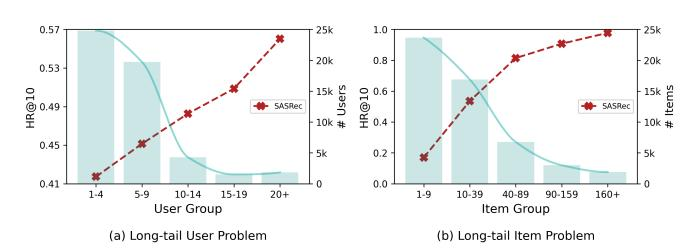
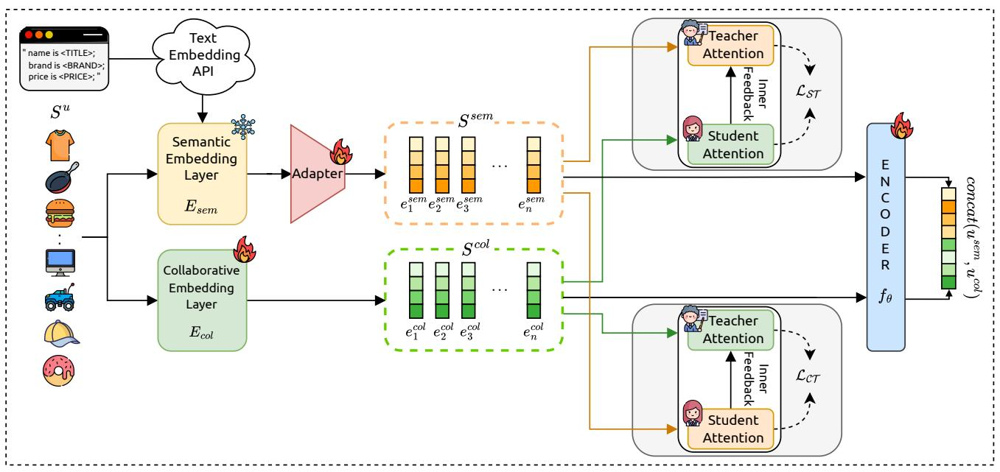
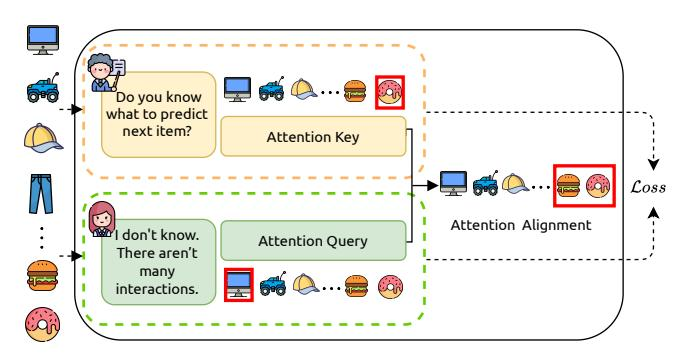
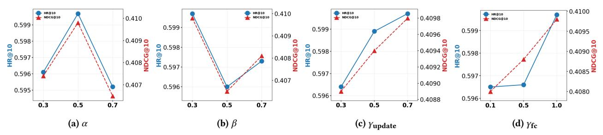
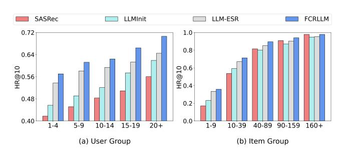
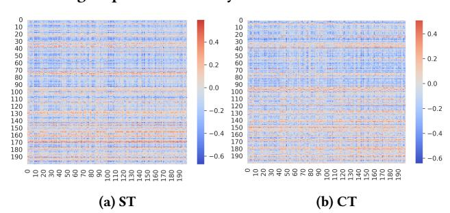
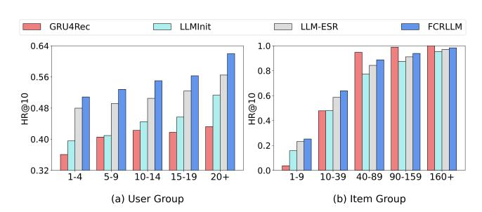

# FCRLLM: Aligning LLM with Collaborative Filtering for Long-tailed Sequential Recommendation

[Byungmoon Heo](https://orcid.org/0009-0009-9453-1841) Department of Applied Artificial Intelligence Sungkyunkwan University Seoul, Republic of Korea ssiass@skku.edu

[Namjun Lee](https://orcid.org/0009-0006-6545-6422) Convergence Program for Social Innovation Sungkyunkwan University Seoul, Republic of Korea namejun12000@g.skku.edu

[Seonah Kim](https://orcid.org/0009-0005-6171-9099) Department of Computer Science and Engineering Sungkyunkwan University Suwon, Republic of Korea rlatjsdk2025@skku.edu

[Jaekwang Kim](https://orcid.org/0000-0001-5174-0074)∗ Convergence Program for Social Innovation Sungkyunkwan University Seoul, Republic of Korea linux@skku.edu

## Abstract

In real-world scenarios, users tend to engage with a small set of popular items, while a large number of long-tail items receive little to no interaction. This long-tail phenomenon substantially impairs recommendation quality. Although prior approaches have attempted to address this issue, the absence of sufficient collaborative signals remains a major obstacle. With the advent of Large Language Models (LLMs), recent studies have explored leveraging LLM-derived semantics to enrich recommendation models. These approaches aim to incorporate textual or contextual knowledge to compensate for limited user-item interactions. A key challenge, however, lies in effectively integrating semantic signals with collaborative representations, which originate from different modalities and learning dynamics. To tackle this, We propose a novel framework, called FCRLLM (the Flipped Classroom with LLM), for long-tail sequential recommendation that aligns collaborative and LLM-based semantic representations. The flipped classroom mechanism dynamically updates the teacher representation to align with the student's attention, enabling more effective integration of semantic and collaborative information. This alignment is implemented via an energy-based formulation inspired by Hopfield networks. To validate its effectiveness, we conduct extensive experiments on three real-world datasets and demonstrate that FCRLLM consistently improves recommendation performance regardless of item popularity or user activity.

## CCS Concepts

• Information systems → Recommender systems.

## Keywords

Sequential Recommendation, Large Language Model, Long-tail Problem, Energy-based Alignment

#### ACM Reference Format:

Byungmoon Heo, Namjun Lee, Seonah Kim, and Jaekwang Kim. 2026. FCR-LLM: Aligning LLM with Collaborative Filtering for Long-tailed Sequential Recommendation. In Proceedings of the ACM Web Conference 2026 (WWW

∗Corresponding author

© 2026 Copyright held by the owner/author(s). ACM ISBN 979-8-4007-2307-0/2026/04 <https://doi.org/10.1145/3774904.3792565>

'26), April 13–17, 2026, Dubai, United Arab Emirates. ACM, New York, NY, USA, [12](#page-11-0) pages.<https://doi.org/10.1145/3774904.3792565>

## 1 Introduction

Recommender systems are essential to modern online services, mitigating information overload and benefiting both users and providers across domains such as e-commerce platforms (e.g., Amazon), video sites (e.g., TikTok, YouTube), and social networks (e.g., Instagram, Facebook) [\[20,](#page-8-0) [30\]](#page-8-1). Collaborative filtering (CF) has long been a dominant approach in the field of recommender systems, leveraging collaborative knowledge from similar users or items to predict preferences [\[10,](#page-8-2) [17,](#page-8-3) [36,](#page-8-4) [39\]](#page-8-5). However, this reliance on observed interactions makes it difficult for CF methods to perform well when user-item interactions are sparse. In particular, items and users with limited activity, commonly referred to as the long-tail and cold-start problems, provide insufficient signals to capture meaningful correlations. These sparsity issues have posed long-standing challenges for CF and continue to hinder the overall performance of recommender systems [\[14,](#page-8-6) [22,](#page-8-7) [51\]](#page-9-0).

The long-tail problem can be viewed from both the user and item perspectives. On the user side, a large portion of users have only a few interactions (i.e., tail users), and they significantly outnumber users with many interactions (i.e., head users) [\[18,](#page-8-8) [29\]](#page-8-9). We observe in Figure [1](#page-1-0) that despite their large presence, tail users receive much lower recommendation performance compared to head users. This highlights the importance of improving recommendation quality for tail users, as doing so can have a meaningful impact on overall system performance. On the item side, the long-tailed item problem refers to the situation in which users mainly consume a small number of popular items (i.e., head items), while the majority of items are unpopular and rarely interacted with (i.e., tail items). This leads recommender models to become biased toward head items. Improving the recommendation of tail items plays a key role in enhancing user satisfaction, promoting content diversity, and driving long-term value for both users and service providers [\[28,](#page-8-10) [51\]](#page-9-0).

Prior work has attempted to address long-tail challenges in recommendation by focusing on either the user or item perspective. For the long-tail user problem, some approaches aim to augment users' interaction histories by generating pseudo items or leveraging information from other users to enrich tail user representations [\[16,](#page-8-11) [27,](#page-8-12) [29\]](#page-8-9). Others employ adversarial training to align the latent spaces of head and tail users [\[52\]](#page-9-1). However, these methods largely rely on collaborative signals, which can be unreliable due to the sparsity of user interactions and inaccurate user similarities.

[This work is licensed under a Creative Commons Attribution 4.0 International License.](https://creativecommons.org/licenses/by/4.0) WWW '26, Dubai, United Arab Emirates

Figure 1: Performance of SASRec on Beauty, highlighting long-tail distribution challenges. The x-axis in (a) indicates the number of items in each user's interaction sequence and the x-axis in (b) represents the number of times each item has been consumed.

Meanwhile, item-side approaches enhance tail item representations by leveraging co-occurrence patterns with popular items or by adjusting attention weights according to item popularity [\[14,](#page-8-6) [18,](#page-8-8) [28\]](#page-8-10). While these strategies help surface underrepresented items, they often overlook user-side sparsity, resulting in limited effectiveness in long-tail scenarios. This highlights the need for a more holistic solution that can jointly address both long-tail users and items, by aligning collaborative and semantic signals in a unified framework.

With the success of Transformer in natural language processing [\[45\]](#page-8-13), recent years have witnessed a growing interest in applying these models to recommendation tasks. In particular, the emergence of Large Language Models (LLMs), known for their powerful semantic understanding and rich pre-trained knowledge, has brought new opportunities to the field of recommendation [\[21,](#page-8-14) [23,](#page-8-15) [38,](#page-8-16) [48\]](#page-9-2). Numerous studies have explored leveraging LLMs in both in-context learning settings and fine-tuning scenarios, demonstrating their strong performance, especially in cold-start and cross-domain settings [\[1,](#page-8-17) [5,](#page-8-18) [9,](#page-8-19) [46\]](#page-9-3). These models can incorporate external knowledge and semantic signals that are difficult to capture through CF alone, making them a promising solution to long-tail challenges. Motivated by this potential, recent research has focused on combining CF with LLMs to alleviate the sparsity issues associated with tail users and items. However, integrating these two types of models presents a fundamental challenge, as CF and LLMs operate in inherently different representation spaces. This gap in modality introduces difficulty in aligning the representations of collaborative signals with those of language models. To address this alignment challenge, A-LLMRec [\[19\]](#page-8-20) proposes an encoder–decoder architecture that transforms CF representations into the LLM's semantic space, while LLM-ESR [\[26\]](#page-8-21) introduces a dual-view framework that jointly learns from both collaborative and semantic information. These approaches underscore the critical importance of effective alignment between heterogeneous modalities in CF–LLM hybrid recommendation models.

In this paper, we propose a novel alignment-aware model for long-tail sequential recommendation, called FCRLLM (Flipped Classroom with LLM for Sequential Recommendation). Our model integrates collaborative signals with semantic knowledge from LLM through a teacher–student framework, where one modality guides the representation learning of the other. Unlike conventional approaches that fix the teacher and student roles, FCRLLM introduces a bidirectional Flipped Classroom mechanism that allows both collaborative and semantic representations to serve as teacher

or student depending on the context. To enable effective alignment between the two modalities, we formulate an energy-based attention mechanism inspired by Hopfield networks [\[25,](#page-8-22) [34\]](#page-8-23). This mechanism minimizes the discrepancy between attention patterns of the two modalities by iteratively updating the teacher's attention to better align with the student's. We design two complementary alignment strategies: in the first, the semantic representation guides the collaborative representation; in the second, the collaborative representation influences the semantic representation. This bidirectional design encourages mutual adaptation and narrows the modality gap. By jointly optimizing these alignment strategies, FCRLLM effectively fuses semantic knowledge and collaborative patterns, improving representation quality for both head and tail entities.

- We propose FCRLLM, an alignment-aware framework that integrates collaborative and semantic representations for long-tail sequential recommendation.
- To bridge the modality gap, we introduce a bidirectional teacherstudent architecture based on an energy-driven attention alignment inspired by Hopfield networks.
- Extensive experiments on three real-world datasets and multiple sequence models demonstrate the effectiveness and generality of our approach across both tail users and items.

#### 2 Preliminaries

## 2.1 Problem Definition

The goal of sequential recommendation is to predict the next item that a user is likely to interact with, given their historical interaction sequence. Let U and I denote the sets of users and items, respectively, where |U| and |I| represent the number of users and items. For each user �� ∈ U, let the chronological sequence of interactions be represented as S �� = (�� �� 1 ,���� 2 , . . . ,���� |S�� | ), where each �� �� ∈ I denotes the ��-th interacted item. The task is to estimate the probability ��(�� |S�� |+1 | S�� ) for each candidate item �� ∈ I, which can be used to generate a ranked list of recommendations.

## 2.2 Splitting Users and Items into Head and Tail

Following previous studies on long-tailed sequential recommendation [\[14,](#page-8-6) [18,](#page-8-8) [28\]](#page-8-10), we divide both users and items into head and tail groups based on the Pareto principle [\[2\]](#page-8-24). We first sort all users by the length of their interaction sequences and all items by their total number of interactions in descending order. Then, according to the Pareto principle (i.e., taking the top 20%), we designate the top users and items as head users and head items, respectively, denoted as Uhead and I head. The remaining users and items are categorized as tail users and tail items, denoted as Utail and I tail . By construction, the entire user and item sets can be decomposed as:

U = Uhead ∪ Utail , I = I head ∪ Itail , (1)

where Uhead ∩ Utail = ∅ and I head ∩ Itail = ∅. Intuitively, head users Uhead and head items I head represent the active users and popular items that dominate most interactions, while tail users Utail and tail items I tail suffer from data sparsity, presenting a major challenge in sequential recommendation systems.

Figure 2: The architecture of our proposed FCRLLM framework.

#### 3 Methods

The overview of the proposed method is shown in Figure [2.](#page-2-0) Our approach builds on a sequence encoder framework to predict users' next interactions based on their historical behaviors. Specifically, we leverage two types of representation streams: a semantic representation stream derived from LLM, and a collaborative representation stream learned directly from user-item interactions. This dual-stream architecture enables the model to capture both rich semantic information from item texts and collaborative patterns from historical interactions. In addition to the basic sequence modeling, our method introduces a Flipped Classroom alignment framework (FlipClass) to bridge the gap between the two representation streams. Unlike conventional methods that statically fuse multi-modal signals [\[11,](#page-8-25) [37\]](#page-8-26), we dynamically align the semantic and collaborative spaces through a bidirectional teacher-student mechanism. Concretely, we construct two complementary alignment modules. Semantic-to-Collaborative Alignment: Treating the semantic representations as the teacher and the collaborative representations as the student to guide collaborative modeling with semantic knowledge. Collaborative-to-Semantic Alignment: Conversely, treating the collaborative representations as the teacher and the semantic representations as the student to enhance semantic modeling with interaction patterns. By jointly training these two FlipClass modules alongside the main recommendation objective, the model learns more robust and transferable representations, particularly benefiting long-tail users and items.

#### 3.1 Modeling User Preferences with Text and Collaborative Embeddings

We model user preferences through two parallel representation streams: the semantic representation stream and the collaborative representation stream. The semantic representation stream

is derived from LLM by processing item textual information, while the collaborative representation stream is learned directly from user-item interactions.

Semantic Representation Stream. Item attributes and textual descriptions often convey rich semantic information that is valuable for recommendation. To exploit such semantics, we first organize the available textual information into structured prompts, which serve as inputs to a pretrained LLM (see Appendix [A](#page-9-4) for the prompt templates). In our case, instead of extracting embeddings from open-source LLMs such as LLaMA [\[44\]](#page-8-27) or OPT [\[54\]](#page-9-5), we obtain item representations using a public embedding API, text-embedding-ada-002. To avoid redundant inference costs during training, we precompute and cache the item embeddings. Let Esem ∈ R | I |×��llm denote the cached semantic embedding matrix, where ��llm is the dimensionality of the LLM output. Instead of directly fine-tuning these cached embeddings, which could distort their original semantic structure [\[7,](#page-8-28) [13\]](#page-8-29), we freeze Esem and introduce a 2-layer multilayer perceptron (MLP) to project each embedding e llm �� (i.e., the ��-th row of Esem) into a recommendation-specific embedding space while simultaneously reducing its dimensionality:

e sem = W2 W1e llm �� + b1 + b2, (2)

where W1, W2, b1, and b2 are trainable parameters. Given a user's historical interaction sequence consisting of ���� interactions, we retrieve the adapted semantic embeddings of the interacted items to form a sequence S sem = [e sem 1 , . . . , e sem ���� ]. This sequence is then processed by a shared sequence encoder ���� , which can be instantiated as sequence models such as self-attention-based SASRec [\[17\]](#page-8-3) or recurrent-based GRU4Rec [\[10\]](#page-8-2), to obtain the user's semantic preference representation:

u sem = ���� (Ssem), (3)

Figure 3: Framework of FlipClass demonstrating teacherstudent interaction, where the teacher's and student's attention is aligned by Eq. [12.](#page-4-0)

where ��(Q�� | K��) and ��(K��) are energy-based probability models derived from ��(Q�� ;K��) and ��(K��), respectively. The gradient of the log-posterior is approximated as:

∇K�� log ��(K�� | Q�� ) = − ∇K�� ��(Q�� ; K��) + ∇K�� ��(K��) = sm(��Q��K ⊤ �� )Q�� − ��I + D sm 1 2 diag(K��K ⊤ ) K�� , (11)

where sm(v) := exp (v − lse(v, 1)) denotes the softmax operator applied and D (·) denotes a vector-to-diagonal-matrix operator. The teacher keys are then updated as:

K update = K�� + ��update " sm ��KQ⊤ QW⊤ �� − ��I + D sm 1 2 diag KK⊤ KW⊤ �� , (12)

where ��update is a hyperparameter. This update rule softly adjusts the teacher attention patterns toward the student queries, facilitating dynamic alignment between the semantic and collaborative representation spaces. Through this iterative refinement, the teacher not only imparts semantic knowledge to the student but also adapts based on the student's evolving representation, fostering a more coherent and robust learning process.

Bidirectional Teacher-Student Alignment. Rather than relying on a single fixed teacher-student direction, our framework incorporates two complementary alignment paths to enable more robust interaction between the semantic and collaborative streams. Specifically, we construct two parallel modules: one where the semantic representation acts as the teacher and the collaborative representation serves as the student, which we refer to as ST (Semantic Teacher); and another where the collaborative representation acts as the teacher and the semantic representation serves as the student, referred to as CT (Collaborative Teacher). Each module independently optimizes a combination of ranking loss and alignment loss between the corresponding teacher and student representations. An overview of the FlipClass framework is illustrated in Figure [3.](#page-4-1) Summary. Intuitively, our FlipClass performs three operations. It first measures attention misalignment to capture how differently the teacher and student attend to the data. It then adapts the teacher to the student by nudging the teacher's attention toward the student's focus areas. Finally, it regularizes to preserve prior

knowledge, preventing the teacher from over-correcting or collapsing onto limited patterns. Taken together, these steps establish a bidirectional learning loop where the teacher guides the student, while the student's feedback simultaneously refines the teacher.

#### 3.3 Training and Inference

Training. We update the collaborative embedding layer, sequence encoder, and adapter during training, while freezing the semantic embedding layer to preserve the pretrained knowledge from LLMs. The overall training objective combines the pairwise ranking loss and the alignment losses from both teacher-student directions, formulated as:

Ltotal = LRank + L���� + L���� , (13)

where L���� and L���� denote the alignment losses for the two directions of the FlipClass mechanism.

Inference. During inference, the FlipClass alignment modules are bypassed, and the final recommendation is made solely based on the dual-stream modeling of the semantic and collaborative representations. Moreover, as the semantic embeddings are precomputed and cached, inference can be performed efficiently without querying the LLM.

#### 4 Experiments

#### 4.1 Experimental Setup

Datasets. We conduct experiments on three widely used realworld datasets: Yelp, Amazon Fashion and Beauty. Following prior work in sequential recommendation [\[17,](#page-8-3) [26\]](#page-8-21), we preprocess the datasets and split the interaction sequences accordingly. The statistics of the preprocessed datasets are summarized in Table [1.](#page-4-2) Further dataset statistics and preprocessing details are provided in Appendix [B.1.](#page-9-6)

Table 1: Statistics of the datasets after preprocessing.

| Dataset | # Users | # Items | Interactions | Avg. length |
|---------|---------|---------|--------------|-------------|
| Yelp    | 15,720  | 11,383  | 192,214      | 12.23       |
| Fashion | 9,094   | 4,722   | 34,759       | 3.82        |
| Beauty  | 52,204  | 57,289  | 394,908      | 7.56        |

Baselines. To evaluate the effectiveness of our approach, we compare against a variety of representative baselines built upon two widely used backbone models for sequential recommendation: GRU4Rec [\[10\]](#page-8-2) and SASRec [\[17\]](#page-8-3). We consider two groups of comparison methods. The first group includes traditional long-tail enhancement frameworks such as CITIES [\[14\]](#page-8-6) and MELT [\[18\]](#page-8-8). The second group consists of recent LLM-based frameworks, including RLMRec [\[35\]](#page-8-32), LLMInit [\[7,](#page-8-28) [13\]](#page-8-29), and LLM-ESR [\[26\]](#page-8-21). Further implementation details of the baselines are provided in Appendix [B.2.](#page-9-7)

Implementation Details. Our model is implemented in PyTorch, and all experiments are conducted on an NVIDIA A100 GPU with 40GB memory. For the FlipClass alignment module, we search ��, �� and ��update from the set {0.3, 0.5, 0.7}, and ��fc from {0.1, 0.5, 1.0}. Additional implementation details are provided in Appendix [B.3.](#page-10-0) The implementation code is available [here](https://github.com/Byungmoon-Heo/FCRLLM).

Table 2: The overall results of competing baselines and our FCRLLM. The boldface refers to the best score and the underline indicates the next best result of the models. Statistical significance at �� < 0.05 compared to the best baseline method.

| Dataset Model  | H@10   | Overall N@10 | H@10   | Tail Item N@10 | H@10   | Head Item N@10 | H@10   | Tail User N@10 | H@10   | Head User N@10 |
|----------------|--------|--------------|--------|----------------|--------|----------------|--------|----------------|--------|----------------|
| GRU4Rec        | 0.4879 | 0.2751       | 0.0171 | 0.0059         | 0.6265 | 0.3544         | 0.4919 | 0.2777         | 0.4726 | 0.2653         |
| CITIES         | 0.4898 | 0.2749       | 0.0134 | 0.0051         | 0.6301 | 0.3543         | 0.4936 | 0.2783         | 0.4756 | 0.2618         |
| MELT           | 0.4985 | 0.2825       | 0.0201 | 0.0079         | 0.6393 | 0.3633         | 0.5046 | 0.2865         | 0.4750 | 0.2671         |
| RLMRec         | 0.4886 | 0.2777       | 0.0188 | 0.0067         | 0.6269 | 0.3574         | 0.4920 | 0.2804         | 0.4756 | 0.2671         |
| LLMInit        | 0.4872 | 0.2749       | 0.0201 | 0.0072         | 0.6246 | 0.3537         | 0.4908 | 0.2775         | 0.4732 | 0.2647         |
| LLM-ESR        | 0.5724 | 0.3413       | 0.0763 | 0.0318         | 0.7184 | 0.4324         | 0.5782 | 0.3456         | 0.5501 | 0.3247         |
| FCRLLM Yelp    | 0.5955 | 0.3622       | 0.0942 | 0.0387         | 0.7430 | 0.4574         | 0.5967 | 0.3635         | 0.5907 | 0.3573         |
| Improvement    | 4.04%  | 6.12%        | 23.46% | 21.70%         | 3.42%  | 5.78%          | 3.20%  | 5.18%          | 7.38%  | 10.04%         |
| SASRec         | 0.5940 | 0.3597       | 0.1142 | 0.0495         | 0.7353 | 0.4511         | 0.5893 | 0.3578         | 0.6122 | 0.3672         |
| CITIES         | 0.5828 | 0.3540       | 0.1532 | 0.0700         | 0.7093 | 0.4376         | 0.5785 | 0.3511         | 0.5994 | 0.3649         |
| MELT           | 0.6257 | 0.3791       | 0.1015 | 0.0371         | 0.7801 | 0.4799         | 0.6246 | 0.3804         | 0.6299 | 0.3744         |
| RLMRec         | 0.5990 | 0.3623       | 0.0953 | 0.0412         | 0.7474 | 0.4568         | 0.5966 | 0.3613         | 0.6084 | 0.3658         |
| LLMInit        | 0.6415 | 0.3997       | 0.1760 | 0.0789         | 0.7785 | 0.4941         | 0.6403 | 0.4010         | 0.6462 | 0.3948         |
| LLM-ESR        | 0.6673 | 0.4208       | 0.1893 | 0.0845         | 0.8080 | 0.5199         | 0.6685 | 0.4229         | 0.6627 | 0.4128         |
| FCRLLM         | 0.6748 | 0.4262       | 0.2136 | 0.0977         | 0.8105 | 0.5229         | 0.6736 | 0.4268         | 0.6793 | 0.4237         |
| Improvement    | 1.12%  | 1.28%        | 12.84% | 15.62%         | 0.31%  | 0.58%          | 0.76%  | 0.92%          | 2.50%  | 2.64%          |
| GRU4Rec        | 0.4798 | 0.3809       | 0.0257 | 0.0101         | 0.6606 | 0.5285         | 0.3781 | 0.2577         | 0.6118 | 0.5408         |
| CITIES         | 0.4762 | 0.3743       | 0.0252 | 0.0103         | 0.6557 | 0.5191         | 0.3729 | 0.2501         | 0.6103 | 0.5354         |
| MELT           | 0.4884 | 0.3975       | 0.0291 | 0.0112         | 0.6712 | 0.5513         | 0.3890 | 0.2770         | 0.6173 | 0.5538         |
| RLMRec         | 0.4795 | 0.3808       | 0.0253 | 0.0105         | 0.6603 | 0.5282         | 0.3773 | 0.2577         | 0.6120 | 0.5405         |
| LLMInit        | 0.4864 | 0.4095       | 0.0250 | 0.0104         | 0.6702 | 0.5684         | 0.3852 | 0.2973         | 0.6177 | 0.5550         |
| LLM-ESR        | 0.5409 | 0.4567       | 0.0807 | 0.0384         | 0.7242 | 0.6233         | 0.4560 | 0.3568         | 0.6512 | 0.5864         |
| FCRLLM Fashion | 0.5587 | 0.4666       | 0.0907 | 0.0397         | 0.7450 | 0.6365         | 0.4746 | 0.3624         | 0.6678 | 0.6017         |
| Improvement    | 3.29%  | 2.17%        | 12.39% | 3.39%          | 2.87%  | 2.12%          | 4.08%  | 1.57%          | 2.55%  | 2.61%          |
| SASRec         | 0.4956 | 0.4429       | 0.0454 | 0.0235         | 0.6748 | 0.6099         | 0.3967 | 0.3390         | 0.6239 | 0.5777         |
| CITIES         | 0.4923 | 0.4423       | 0.0407 | 0.0214         | 0.6721 | 0.6098         | 0.3936 | 0.3392         | 0.6203 | 0.5760         |
| MELT           | 0.4875 | 0.4150       | 0.0368 | 0.0144         | 0.6670 | 0.5745         | 0.3792 | 0.2933         | 0.6280 | 0.5729         |
| RLMRec         | 0.4982 | 0.4457       | 0.0410 | 0.0223         | 0.6803 | 0.6143         | 0.3990 | 0.3415         | 0.6270 | 0.5808         |
| LLMInit        | 0.5119 | 0.4492       | 0.0596 | 0.0305         | 0.6920 | 0.6159         | 0.4184 | 0.3501         | 0.6332 | 0.5777         |
| LLM-ESR        | 0.5619 | 0.4743       | 0.1095 | 0.0520         | 0.7420 | 0.6424         | 0.4811 | 0.3769         | 0.6668 | 0.6005         |
| FCRLLM         | 0.5814 | 0.4881       | 0.1312 | 0.0649         | 0.7606 | 0.6565         | 0.5044 | 0.3920         | 0.6812 | 0.6127         |
| Improvement    | 3.47%  | 2.91%        | 19.82% | 24.81%         | 2.51%  | 2.19%          | 4.84%  | 4.01%          | 2.16%  | 2.03%          |
| GRU4Rec        | 0.3683 | 0.2276       | 0.0796 | 0.0567         | 0.4371 | 0.2683         | 0.3584 | 0.2191         | 0.4135 | 0.2663         |
| CITIES         | 0.2456 | 0.1400       | 0.1122 | 0.0760         | 0.2774 | 0.1552         | 0.2382 | 0.1346         | 0.2795 | 0.1645         |
| MELT           | 0.3702 | 0.2161       | 0.0009 | 0.0003         | 0.4582 | 0.2675         | 0.3637 | 0.2116         | 0.3997 | 0.2365         |
| RLMRec         | 0.3668 | 0.2278       | 0.0780 | 0.0560         | 0.4357 | 0.2688         | 0.3576 | 0.2202         | 0.4089 | 0.2626         |
| LLMInit        | 0.4151 | 0.2713       | 0.0896 | 0.0637         | 0.4928 | 0.3208         | 0.4059 | 0.2621         | 0.4571 | 0.3133         |
| LLM-ESR        | 0.4917 | 0.3140       | 0.1547 | 0.0801         | 0.5721 | 0.3698         | 0.4851 | 0.3079         | 0.5220 | 0.3420         |
| FCRLLM Beauty  | 0.5253 | 0.3509       | 0.1623 | 0.0940         | 0.6118 | 0.4121         | 0.5169 | 0.3418         | 0.5634 | 0.3923         |
| Improvement    | 6.83%  | 11.75%       | 4.91%  | 17.35%         | 6.94%  | 11.44%         | 6.56%  | 11.01%         | 7.93%  | 14.71%         |
| SASRec         | 0.4388 | 0.3030       | 0.0870 | 0.0649         | 0.5227 | 0.3598         | 0.4270 | 0.2941         | 0.4926 | 0.3438         |
| CITIES         | 0.2256 | 0.1413       | 0.1363 | 0.0897         | 0.2468 | 0.1536         | 0.2215 | 0.1406         | 0.2441 | 0.1444         |
| MELT           | 0.4334 | 0.2775       | 0.0460 | 0.0172         | 0.5258 | 0.3995         | 0.4233 | 0.2673         | 0.4796 | 0.3241         |
| RLMRec         | 0.4460 | 0.3075       | 0.0924 | 0.0658         | 0.5303 | 0.3652         | 0.4365 | 0.3016         | 0.4892 | 0.3345         |
| LLMInit        | 0.5455 | 0.3656       | 0.1714 | 0.0965         | 0.6347 | 0.4298         | 0.5359 | 0.3592         | 0.5893 | 0.3948         |
| LLM-ESR        | 0.5672 | 0.3713       | 0.2257 | 0.1108         | 0.6486 | 0.4334         | 0.5581 | 0.3643         | 0.6087 | 0.4032         |
| FCRLLM         | 0.5997 | 0.4098       | 0.2467 | 0.1350         | 0.6838 | 0.4753         | 0.5885 | 0.4023         | 0.6508 | 0.4442         |
| Improvement    | 5.73%  | 10.37%       | 9.30%  | 21.84%         | 5.43%  | 9.67%          | 5.45%  | 10.43%         | 6.92%  | 10.17%         |

Evaluation Metrics. We evaluate model performance based on top-10 recommendation results, using two standard metrics: Hit Rate (H@10) and Normalized Discounted Cumulative Gain (N@10). Following [\[17\]](#page-8-3), we randomly sample 100 negative items for each user that they have not interacted with, and evaluate the model by ranking these along with the ground-truth item.

## 4.2 Overall Performance

Overall Comparison. Table [2](#page-5-0) presents the overall, tail, and head performance across three real-world datasets. Our proposed FCR-LLM achieves the best accuracy across all evaluation metrics and datasets, outperforming all baseline methods regardless of the backbone model. This demonstrates the effectiveness of our alignmentaware design in jointly leveraging both semantic and collaborative signals. LLM-ESR ranks second overall, demonstrating the

Figure 4: Hyperparameter sensitivity on the Beauty dataset with SASRec backbone.

Table 3: The ablation study on the Beauty dataset with GRU4Rec as the backbone model.

|     | Model     | H@10   | Overall N@10 | H@10   | Tail Item N@10 | H@10   | Head Item N@10 | H@10   | Tail User N@10 | H@10   | Head User N@10 |
|-----|-----------|--------|--------------|--------|----------------|--------|----------------|--------|----------------|--------|----------------|
|     | FCRLLM    | 0.5253 | 0.3509       | 0.1623 | 0.0940         | 0.6118 | 0.4121         | 0.5169 | 0.3418         | 0.5634 | 0.3923         |
| w/o | FlipClass | 0.5081 | 0.3397       | 0.1447 | 0.0880         | 0.5948 | 0.3998         | 0.5001 | 0.3308         | 0.5448 | 0.3807         |
| w/o | ST        | 0.5115 | 0.3368       | 0.1545 | 0.0828         | 0.5966 | 0.3973         | 0.5034 | 0.3276         | 0.5487 | 0.3787         |
| w/o | CT        | 0.5151 | 0.3382       | 0.1636 | 0.0859         | 0.5989 | 0.3984         | 0.5066 | 0.3292         | 0.5541 | 0.3797         |

effectiveness of its dual-view architecture combined with retrievalaugmented self-distillation in enhancing recommendation performance. LLMInit often follows closely, highlighting the benefit of injecting semantic knowledge from large language models into sequential recommendation. Non-LLM baselines such as MELT show moderate improvements by addressing both user- and item-side sparsity, while CITIES performs inconsistently across datasets and settings.

Long-tail Item and User Comparison. As presented in Table [2,](#page-5-0) we report performance separately for head and tail groups of both users and items. Our proposed FCRLLM consistently achieves strong results across all groups, demonstrating its robustness. In particular, it yields substantial improvements on tail items, achieving on average a 13.7% gain in H@10 and a 17.2% gain in N@10 across all datasets and backbones. These results highlight the strength of our FlipClass in effectively leveraging semantic information from LLMs to complement collaborative signals. For tail users, FCRLLM again shows the best performance, while MELT and LLMInit offer moderate improvements, each limited by their reliance on collaborative signals or the lack of explicit user-side semantics.

#### 4.3 Ablation Study

Table [3](#page-6-0) shows the ablation results when using GRU4Rec as the backbone sequential model. When the entire FlipClass module is removed (w/o FlipClass), performance consistently drops across all user and item groups, confirming its critical role. Excluding either ST (w/o ST) or CT (w/o CT) alignment also leads to degraded performance, which demonstrates the effectiveness of jointly leveraging both alignment directions. Overall, incorporating both ST and CT enables FCRLLM to achieve the most balanced and robust performance across all groups. These findings further validate that FlipClass provides a reliable alignment mechanism that consistently enhances recommendation performance.

#### 4.4 Hyperparameter Sensitivity

To investigate the effects of the core hyperparameters in FCRLLM, we present their performance trends in Figure [4.](#page-6-1) Each of the four hyperparameters corresponds to a distinct part of the FlipClass mechanism in Eq. [12.](#page-4-0) Specifically, �� controls the strength of the L2 penalty on the teacher keys in the energy term ��(Q�� ;K��), and �� adjusts the softmax temperature that governs attention sharpness in both the energy and the update rule. ��update scales the magnitude of the teacher attention update, determining how strongly the teacher aligns to the student. Lastly, ��fc controls the weight of the FlipClass alignment loss in the overall training objective. The optimal hyperparameter configurations for each dataset are summarized in Table [4.](#page-10-1)

#### 4.5 Group Analysis

To conduct a more fine-grained analysis, we divide users and items into five groups based on sequence length and popularity. The results are presented in Figure [5.](#page-7-0) Based on the results, FCRLLM consistently achieves the best performance across all user and item groups, outperforming all baselines. Meanwhile, SASRec, as a CF model, updates item representations more frequently for popular items, since it relies solely on past interaction data. Consequently, SASRec yields strong performance in high-frequency regions. Specifically, it outperforms LLMInit and LLM-ESR in the head item groups (e.g., item groups 90–159 and ≥ 160). Nevertheless, FCRLLM consistently outperforms all baselines across the entire range, demonstrating superiority in long-tail groups, while also maintaining competitive performance in head groups. This robustness stems from the bidirectional alignment mechanism, which enables mutual adaptation between semantic and collaborative signals, particularly under sparse conditions. In addition, by better capturing underrepresented items, FCRLLM implicitly promotes diversity in the generated recommendations. Additional analysis is provided in Appendix [C.1.](#page-10-2)

#### 4.6 Analysis of Alignment Behavior in ST and CT Classroom

To better understand how the two alignment modules behave, we visualize the cosine similarity between the queries and keys in the ST and CT modules based on a validation sequence. Specifically, for each alignment block, we extract the query matrix Q from the student stream and the key matrix K from the teacher stream after the final update. We then compute the cosine similarity matrix S, where S��,�� = cos(q�� , k��). In Figure [6,](#page-7-1) each heatmap illustrates the similarity pattern between query positions (rows) and key positions

Figure 5: Performance comparison across fine-grained user and item groups on the Beauty dataset with SASRec.

Figure 6: Cosine similarity between query and key embeddings from the student and teacher in the ST and CT after training on the Yelp dataset using SASRec.

(columns) within a sequence of length �� = 200. We observe notably different structural patterns in the resulting similarity maps. This divergence supports our design goal: the ST and CT modules are independently parameterized and trained to reflect distinct alignment objectives. Although both modules receive the same input, they learn to encode different interaction patterns. These complementary behaviors are essential for our ensemble-based architecture, enabling it to integrate asymmetric signals from semantic and collaborative perspectives.

## 5 Related Work

## 5.1 Sequential Recommendation

Sequential recommendation (SR) focuses on modeling user behavior sequences to predict the next item. Early efforts, such as FPMC [\[36\]](#page-8-4) and Fossil [\[8\]](#page-8-33), adopt Markov chains to model item transitions. With deep learning, SR models have evolved from RNN-based GRU4Rec [\[10\]](#page-8-2) and CNN-based Caser [\[43\]](#page-8-34) to Transformer-based SASRec [\[17\]](#page-8-3) and BERT4Rec [\[42\]](#page-8-35). Recently, MLP-based [\[58\]](#page-9-8) and contrastive learning-based approaches [\[49\]](#page-9-9) have shown promise in boosting performance. While most works focus on enhancing the model's ability to represent complex user-item interactions, fewer tackle long-tail issues. CITIES [\[14\]](#page-8-6) infers representations for tail items, and MELT [\[18\]](#page-8-8) jointly addresses long-tail users and items, though from a purely collaborative perspective.

## 5.2 LLMs for Recommendation

Large language models demonstrate strong semantic understanding, and their success in NLP has led to increasing efforts to adapt them for recommendation tasks [\[56,](#page-9-10) [57\]](#page-9-11). Early approaches primarily explored prompt engineering and in-context learning [\[3\]](#page-8-36) to

repurpose LLMs for recommendation scenarios. For instance, ChatRec [\[5\]](#page-8-18) formulates the recommendation task as a step-by-step dialogue, while DRDT [\[47\]](#page-9-12) integrates a retrieval-enhanced context to guide item prediction. LLMRerank [\[4\]](#page-8-37) and UniLLMRec [\[55\]](#page-9-13) introduce reasoning-style prompting (e.g., chain-of-thought) tailored to reranking or full-pipeline recommendation. Despite their flexibility, prompt-based methods often fall short of specialized recommendation models, primarily due to the gap between the natural language objectives of LLM pretraining and the goals of recommendation. To bridge this gap, recent works have focused on aligning LLMs to recommendation tasks via fine-tuning. Models such as P5 [\[6\]](#page-8-38) and InstructRec [\[53\]](#page-9-14) employ instruction tuning on domain-specific corpora, while TALLRec [\[1\]](#page-8-17) and GenRec [\[15\]](#page-8-39) leverage parameter-efficient fine-tuning (e.g., LoRA [\[12\]](#page-8-40)) to adapt LLaMA for recommendation. Further, methods like E4SRec [\[23\]](#page-8-15) and RecInterpreter [\[50\]](#page-9-15) explore fusing collaborative signals into LLMs through architectural modifications such as tokenizer-level alignment and hybrid embedding design. CALRec [\[24\]](#page-8-41) further adapts generative LLMs to sequential recommendation via contrastive alignment, improving robustness under sparse interactions. Another promising research direction leverages LLMs to mitigate data sparsity issues in recommendation. A-LLMRec [\[19\]](#page-8-20) proposes a model-agnostic framework that aligns collaborative filtering models with LLMs by projecting their embeddings into the token space of LLMs, achieving robust performance in both cold and warm scenarios without additional fine-tuning. In parallel, LLM-ESR [\[26\]](#page-8-21) introduces a dual-view sequential recommendation framework that combines frozen LLM-derived semantic embeddings with collaborative signals, and enhances long-tail user modeling via retrievalaugmented self-distillation from semantically similar users. These efforts highlight the importance of aligning the semantic knowledge of LLMs with collaborative signals to exploit their potential under sparse interaction scenarios. In this line, FCRLLM introduces a unique bidirectional alignment with an energy-based teacherupdate mechanism to more effectively bridge semantic and collaborative representations.

## 6 Conclusion

In this paper, we propose FCRLLM, a novel framework for longtail sequential recommendation that integrates collaborative and semantic representations through bidirectional teacher–student alignment. By introducing the FlipClass, our model dynamically adjusts teacher attention to better reflect student queries, thereby maintaining consistency between the semantic and collaborative streams. Experimental results on multiple datasets and backbones validate that FCRLLM consistently improves performance, offering robust gains across both head and tail users and items. For future work, we plan to extend FlipClass to other modalities and explore its potential in broader recommendation scenarios.

## Acknowledgments

This work was supported by the Institute of Information & Communications Technology Planning Evaluation and the National Research Foundation of South Korea (IITP-2025-RS-2023-00254129; IITP-2025-RS-2024-00346737).

#### References

[1] Keqin Bao, Jizhi Zhang, Yang Zhang, Wenjie Wang, Fuli Feng, and Xiangnan He. 2023. Tallrec: An effective and efficient tuning framework to align large language model with recommendation. In Proceedings of the 17th ACM Conference on Recommender Systems. 1007–1014. [2] George EP Box and R Daniel Meyer. 1986. An analysis for unreplicated fractional factorials. Technometrics 28, 1 (1986), 11–18. [3] Qingxiu Dong, Lei Li, Damai Dai, Ce Zheng, Zhiyong Wu, Baobao Chang, Xu Sun, Jingjing Xu, and Zhifang Sui. 2022. A survey on in-context learning. arXiv preprint arXiv:2301.00234 (2022). [4] Jingtong Gao, Bo Chen, Xiangyu Zhao, Weiwen Liu, Xiangyang Li, Yichao Wang, Zijian Zhang, Wanyu Wang, Yuyang Ye, Shanru Lin, et al. 2024. LLM-enhanced Reranking in Recommender Systems. arXiv preprint arXiv:2406.12433 (2024). [5] Yunfan Gao, Tao Sheng, Youlin Xiang, Yun Xiong, Haofen Wang, and Jiawei Zhang. 2023. Chat-rec: Towards interactive and explainable llms-augmented recommender system. arXiv preprint arXiv:2303.14524 (2023). [6] Shijie Geng, Shuchang Liu, Zuohui Fu, Yingqiang Ge, and Yongfeng Zhang. 2022. Recommendation as language processing (rlp): A unified pretrain, personalized prompt & predict paradigm (p5). In Proceedings of the 16th ACM conference on recommender systems. 299–315. [7] Jesse Harte, Wouter Zorgdrager, Panos Louridas, Asterios Katsifodimos, Dietmar Jannach, and Marios Fragkoulis. 2023. Leveraging large language models for sequential recommendation. In Proceedings of the 17th ACM Conference on Recommender Systems. 1096–1102. [8] Ruining He and Julian McAuley. 2016. Fusing similarity models with markov chains for sparse sequential recommendation. In 2016 IEEE 16th international conference on data mining (ICDM). IEEE, 191–200. [9] Zhankui He, Zhouhang Xie, Rahul Jha, Harald Steck, Dawen Liang, Yesu Feng, Bodhisattwa Prasad Majumder, Nathan Kallus, and Julian McAuley. 2023. Large language models as zero-shot conversational recommenders. In Proceedings of the 32nd ACM international conference on information and knowledge management. 720–730. [10] Balázs Hidasi, Alexandros Karatzoglou, Linas Baltrunas, and Domonkos Tikk. 2016. Session-based recommendations with recurrent neural networks. In The International Conference on Learning Representations. [11] Geoffrey Hinton, Oriol Vinyals, and Jeff Dean. 2015. Distilling the knowledge in a neural network. arXiv preprint arXiv:1503.02531 (2015). [12] Edward J Hu, Phillip Wallis, Zeyuan Allen-Zhu, Yuanzhi Li, Shean Wang, Lu Wang, Weizhu Chen, et al. 2021. LoRA: Low-Rank Adaptation of Large Language Models. In International Conference on Learning Representations. [13] Jun Hu, Wenwen Xia, Xiaolu Zhang, Chilin Fu, Weichang Wu, Zhaoxin Huan, Ang Li, Zuoli Tang, and Jun Zhou. 2024. Enhancing Sequential Recommendation via LLM-based Semantic Embedding Learning. In Companion Proceedings of the ACM on Web Conference 2024. 103–111. [14] Seongwon Jang, Hoyeop Lee, Hyunsouk Cho, and Sehee Chung. 2020. Cities: Contextual inference of tail-item embeddings for sequential recommendation. In 2020 IEEE International Conference on Data Mining (ICDM). IEEE, 202–211. [15] Jianchao Ji, Zelong Li, Shuyuan Xu, Wenyue Hua, Yingqiang Ge, Juntao Tan, and Yongfeng Zhang. 2024. Genrec: Large language model for generative recommendation. In European Conference on Information Retrieval. Springer, 494–502. [16] Juyong Jiang, Yingtao Luo, Jae Boum Kim, Kai Zhang, and Sunghun Kim. 2021. Sequential recommendation with bidirectional chronological augmentation of transformer. arXiv preprint arXiv:2112.06460 90 (2021). [17] Wang-Cheng Kang and Julian McAuley. 2018. Self-attentive sequential recommendation. In 2018 IEEE international conference on data mining (ICDM). IEEE, 197–206. [18] Kibum Kim, Dongmin Hyun, Sukwon Yun, and Chanyoung Park. 2023. MELT: Mutual Enhancement of Long-Tailed User and Item for Sequential Recommendation. In Proceedings of the 46th international ACM SIGIR conference on Research and development in information retrieval. 68–77. [19] Sein Kim, Hongseok Kang, Seungyoon Choi, Donghyun Kim, Minchul Yang, and Chanyoung Park. 2024. Large language models meet collaborative filtering: An efficient all-round llm-based recommender system. In Proceedings of the 30th ACM SIGKDD Conference on Knowledge Discovery and Data Mining. 1395–1406. [20] Hyeyoung Ko, Suyeon Lee, Yoonseo Park, and Anna Choi. 2022. A survey of recommendation systems: recommendation models, techniques, and application fields. Electronics 11, 1 (2022), 141. [21] Takeshi Kojima, Shixiang Shane Gu, Machel Reid, Yutaka Matsuo, and Yusuke Iwasawa. 2022. Large language models are zero-shot reasoners. Advances in neural information processing systems 35 (2022), 22199–22213. [22] Yehuda Koren, Robert Bell, and Chris Volinsky. 2009. Matrix factorization techniques for recommender systems. Computer 42, 8 (2009), 30–37. [23] Xinhang Li, Chong Chen, Xiangyu Zhao, Yong Zhang, and Chunxiao Xing. 2023. E4SRec: An elegant effective efficient extensible solution of large language models for sequential recommendation. arXiv preprint arXiv:2312.02443 (2023). [24] Yaoyiran Li, Xiang Zhai, Moustafa Alzantot, Keyi Yu, Ivan Vulić, Anna Korhonen, and Mohamed Hammad. 2024. Calrec: Contrastive alignment of generative llms for sequential recommendation. In Proceedings of the 18th ACM Conference on Recommender Systems. 422–432. [25] Haonan Lin, Wenbin An, Jiahao Wang, Yan Chen, Feng Tian, Mengmeng Wang, QianYing Wang, Guang Dai, and Jingdong Wang. 2024. Flipped classroom: Aligning teacher attention with student in generalized category discovery. Advances in Neural Information Processing Systems 37 (2024), 60897–60935. [26] Qidong Liu, Xian Wu, Yejing Wang, Zijian Zhang, Feng Tian, Yefeng Zheng, and Xiangyu Zhao. 2024. Llm-esr: Large language models enhancement for longtailed sequential recommendation. Advances in Neural Information Processing Systems 37 (2024), 26701–26727. [27] Qidong Liu, Fan Yan, Xiangyu Zhao, Zhaocheng Du, Huifeng Guo, Ruiming Tang, and Feng Tian. 2023. Diffusion augmentation for sequential recommendation. In Proceedings of the 32nd ACM International Conference on Information and Knowledge Management. 1576–1586. [28] Siyi Liu and Yujia Zheng. 2020. Long-tail session-based recommendation. In Proceedings of the 14th ACM Conference on Recommender Systems. 509–514. [29] Zhiwei Liu, Ziwei Fan, Yu Wang, and Philip S Yu. 2021. Augmenting sequential recommendation with pseudo-prior items via reversely pre-training transformer. In Proceedings of the 44th international ACM SIGIR conference on Research and development in information retrieval. 1608–1612. [30] Khushhall Chandra Mahajan, Amey Porobo Dharwadker, Saurabh Gupta, and Brad Schumitsch. 2023. VideoRecSys 2023: First Workshop on Large-Scale Video Recommender Systems. In Proceedings of the 17th ACM Conference on Recommender Systems. 1269–1271. [31] Julian McAuley, Christopher Targett, Qinfeng Shi, and Anton Van Den Hengel. 2015. Image-based recommendations on styles and substitutes. In Proceedings of the 38th international ACM SIGIR conference on research and development in information retrieval. 43–52. [32] Jianmo Ni, Gustavo Hernandez Abrego, Noah Constant, Ji Ma, Keith Hall, Daniel Cer, and Yinfei Yang. 2022. Sentence-t5: Scalable sentence encoders from pretrained text-to-text models. In Findings of the association for computational linguistics: ACL 2022. 1864–1874. [33] Karl Pearson. 1901. LIII. On lines and planes of closest fit to systems of points in space. The London, Edinburgh, and Dublin philosophical magazine and journal of science 2, 11 (1901), 559–572. [34] Hubert Ramsauer, Bernhard Schäfl, Johannes Lehner, Philipp Seidl, Michael Widrich, Thomas Adler, Lukas Gruber, Markus Holzleitner, Milena Pavlović, Geir Kjetil Sandve, et al. 2020. Hopfield networks is all you need. arXiv preprint arXiv:2008.02217 (2020). [35] Xubin Ren, Wei Wei, Lianghao Xia, Lixin Su, Suqi Cheng, Junfeng Wang, Dawei Yin, and Chao Huang. 2024. Representation learning with large language models for recommendation. In Proceedings of the ACM on Web Conference 2024. 3464–3475. [36] Steffen Rendle, Christoph Freudenthaler, and Lars Schmidt-Thieme. 2010. Factorizing personalized markov chains for next-basket recommendation. In Proceedings of the 19th international conference on World wide web. 811–820. [37] Adriana Romero, Nicolas Ballas, Samira Ebrahimi Kahou, Antoine Chassang, Carlo Gatta, and Yoshua Bengio. 2015. FitNets: Hints for Thin Deep Nets. arXiv[:1412.6550](https://arxiv.org/abs/1412.6550) [cs.LG]<https://arxiv.org/abs/1412.6550> [38] Scott Sanner, Krisztian Balog, Filip Radlinski, Ben Wedin, and Lucas Dixon. 2023. Large language models are competitive near cold-start recommenders for language-and item-based preferences. In Proceedings of the 17th ACM conference on recommender systems. 890–896. [39] Badrul Sarwar, George Karypis, Joseph Konstan, and John Riedl. 2001. Item-based collaborative filtering recommendation algorithms. In Proceedings of the 10th international conference on World Wide Web. 285–295. [40] Junyuan Shang, Tengfei Ma, Cao Xiao, and Jimeng Sun. 2019. Pre-training of graph augmented transformers for medication recommendation. In 28th International Joint Conference on Artificial Intelligence, IJCAI 2019. International Joint Conferences on Artificial Intelligence, 5953–5959. [41] Kaitao Song, Xu Tan, Tao Qin, Jianfeng Lu, and Tie-Yan Liu. 2020. Mpnet: Masked and permuted pre-training for language understanding. Advances in neural information processing systems 33 (2020), 16857–16867. [42] Fei Sun, Jun Liu, Jian Wu, Changhua Pei, Xiao Lin, Wenwu Ou, and Peng Jiang. 2019. BERT4Rec: Sequential recommendation with bidirectional encoder representations from transformer. In Proceedings of the 28th ACM international conference on information and knowledge management. 1441–1450. [43] Jiaxi Tang and Ke Wang. 2018. Personalized top-n sequential recommendation via convolutional sequence embedding. In Proceedings of the eleventh ACM international conference on web search and data mining. 565–573. [44] Hugo Touvron, Thibaut Lavril, Gautier Izacard, Xavier Martinet, Marie-Anne Lachaux, Timothée Lacroix, Baptiste Rozière, Naman Goyal, Eric Hambro, Faisal Azhar, Aurelien Rodriguez, Armand Joulin, Edouard Grave, and Guillaume Lample. 2023. LLaMA: Open and Efficient Foundation Language Models. arXiv preprint arXiv:2302.13971 (2023). [45] Ashish Vaswani, Noam Shazeer, Niki Parmar, Jakob Uszkoreit, Llion Jones, Aidan N Gomez, Łukasz Kaiser, and Illia Polosukhin. 2017. Attention is all you need. Advances in neural information processing systems 30 (2017).

[46] Lei Wang and Ee-Peng Lim. 2023. Zero-shot next-item recommendation using large pretrained language models. arXiv preprint arXiv:2304.03153 (2023). [47] Yu Wang, Zhiwei Liu, Jianguo Zhang, Weiran Yao, Shelby Heinecke, and Philip S Yu. 2023. Drdt: Dynamic reflection with divergent thinking for llm-based sequential recommendation. arXiv preprint arXiv:2312.11336 (2023). [48] Likang Wu, Zhi Zheng, Zhaopeng Qiu, Hao Wang, Hongchao Gu, Tingjia Shen, Chuan Qin, Chen Zhu, Hengshu Zhu, Qi Liu, et al. 2024. A survey on large language models for recommendation. World Wide Web 27, 5 (2024), 60. [49] Xu Xie, Fei Sun, Zhaoyang Liu, Shiwen Wu, Jinyang Gao, Jiandong Zhang, Bolin Ding, and Bin Cui. 2022. Contrastive learning for sequential recommendation. In 2022 IEEE 38th international conference on data engineering (ICDE). IEEE, 1259– 1273. [50] Zhengyi Yang, Jiancan Wu, Yanchen Luo, Jizhi Zhang, Yancheng Yuan, An Zhang, Xiang Wang, and Xiangnan He. 2023. Large language model can interpret latent space of sequential recommender. arXiv preprint arXiv:2310.20487 (2023). [51] Hongzhi Yin, Bin Cui, Jing Li, Junjie Yao, and Chen Chen. 2012. Challenging the long tail recommendation. arXiv preprint arXiv:1205.6700 (2012). [52] Jianwen Yin, Chenghao Liu, Weiqing Wang, Jianling Sun, and Steven CH Hoi. 2020. Learning transferrable parameters for long-tailed sequential user behavior modeling. In Proceedings of the 26th ACM SIGKDD International Conference on Knowledge Discovery & Data Mining. 359–367. [53] Junjie Zhang, Ruobing Xie, Yupeng Hou, Xin Zhao, Leyu Lin, and Ji-Rong Wen. 2023. Recommendation as instruction following: A large language model empowered recommendation approach. ACM Transactions on Information Systems (2023). [54] Susan Zhang, Stephen Roller, Naman Goyal, Mikel Artetxe, Moya Chen, Shuohui Chen, Christopher Dewan, Mona Diab, Xian Li, Xi Victoria Lin, et al. 2022. Opt: Open pre-trained transformer language models. arXiv preprint arXiv:2205.01068 (2022). [55] Wenlin Zhang, Xiangyang Li, Yuhao Wang, Kuicai Dong, Yichao Wang, Xinyi Dai, Xiangyu Zhao, Huifeng Guo, Ruiming Tang, et al. 2024. Tired of Plugins? Large Language Models Can Be End-To-End Recommenders. arXiv preprint arXiv:2404.00702 (2024). [56] Wayne Xin Zhao, Kun Zhou, Junyi Li, Tianyi Tang, Xiaolei Wang, Yupeng Hou, Yingqian Min, Beichen Zhang, Junjie Zhang, Zican Dong, et al. 2023. A survey of large language models. arXiv preprint arXiv:2303.18223 (2023). [57] Zihuai Zhao, Wenqi Fan, Jiatong Li, Yunqing Liu, Xiaowei Mei, Yiqi Wang, Zhen Wen, Fei Wang, Xiangyu Zhao, Jiliang Tang, et al. 2024. Recommender systems in the era of large language models (llms). IEEE Transactions on Knowledge and Data Engineering (2024). [58] Kun Zhou, Hui Yu, Wayne Xin Zhao, and Ji-Rong Wen. 2022. Filter-enhanced MLP is all you need for sequential recommendation. In Proceedings of the ACM web conference 2022. 2388–2399.

## A Prompt Design

In Section [3.1,](#page-2-1) item attributes are transformed into textual prompts, which are then used to generate semantic embeddings through a text embedding API. These prompts are constructed using predefined templates that help ensure consistency across items. Figure [7](#page-9-16) presents the templates adapted for each dataset with different attribute sets. In these templates, boldfaced tokens indicate placeholder fields replaced with actual attribute values.

## B Experimental Settings

This section provides additional details regarding the experimental setup.

## B.1 Dataset and Preprocessing

To validate the proposed method, we conduct comprehensive experiments on three widely used benchmark datasets: Yelp, Fashion, and Beauty. Yelp [1](#page-9-17) comprises user check-in records and corresponding reviews. In this work, we utilize only the check-in interactions and attribute metadata of points of interest. The Amazon dataset [2](#page-9-18) [\[31\]](#page-8-42), a large-scale e-commerce corpus containing user reviews across

The point of interest has the following attributes: name is <NAME>; category is <CATEGORY>; type is <TYPE>; open status is <OPEN>; review count is <COUNT>; city is <CITY>; average score is <STARS>.

#### Item Prompt Template (Yelp)

The fashion item has the following attributes:

name is <TITLE>; brand is <BRAND>; date is <DATE>; price is <PRICE>.

The item has the following features: <FEATURE>. The item has the following descriptions: <DESCRIPTION>.

#### Item Prompt Template (Fashion)

The beauty item has the following attributes: name is <TITLE>; brand is <BRAND>; price is <PRICE>. The item has the following features: <CATEGORIES>. The item has the following descriptions: <DESCRIPTION>.

#### Item Prompt Template (Beauty)

Figure 7: Prompt templates used for encoding item attributes in each dataset.

various product domains, from which we employ the Fashion and Beauty subsets.

For data preprocessing, we adopt the strategy proposed in [\[26\]](#page-8-21). Users with fewer than three interactions are excluded, as the cold start problem is outside the scope of this study. For data partitioning, we follow a standard protocol by assigning the final item in each user's interaction sequence as the test instance and the second-tolast item as the validation instance.

## B.2 Backbone and Baseline

Backbone Models. To demonstrate the generalizability of our framework, we evaluate it on two well-established sequential recommendation models.

- GRU4Rec [\[10\]](#page-8-2). It employs gated recurrent units to model user behavior sequences, capturing temporal dependencies in implicit feedback data. It generates a single user representation from the sequence and applies a pairwise ranking loss to optimize recommendation accuracy.
- SASRec [\[17\]](#page-8-3). It employs causal self-attention layers to model user interaction sequences, effectively capturing both local and global dependencies while preserving the temporal order of items. To train the model, a sequence-to-sequence pairwise ranking loss is used, encouraging higher relevance scores for ground-truth items over negative samples.

Traditional Baselines. These methods first divide users and items into head and long-tail groups and then apply targeted training strategies to improve the performance of the long-tail group. It is important to note that these approaches rely solely on collaborative signals without incorporating any semantic information.

- CITIES [\[14\]](#page-8-6). This method proposes an embedding inference function specifically aimed at refining the representations of long-tail items. The function is trained on head item embeddings and applied to long-tail items at inference time.

1<https://www.yelp.com/dataset>

2[https://cseweb.ucsd.edu/~jmcauley/datasets.html#amazon\\_reviews](https://cseweb.ucsd.edu/~jmcauley/datasets.html#amazon_reviews)

Table 4: Best hyperparameters of FCRLLM on all datasets.

- MELT [\[18\]](#page-8-8). It introduces a bilateral branch architecture to address the representation gap for long-tail users and items. One branch learns head user representations and transfers them to tail users during inference. The other reconstructs head item embeddings during training and updates those of tail items at inference time.

LLM-based Baselines. These methods are designed to incorporate semantic representations generated by LLMs to improve the performance of recommender systems.

- RLMRec [\[35\]](#page-8-32). This method represents one of the earliest attempts to leverage semantic embeddings produced by LLMs. Although it was originally designed for collaborative filtering, we adapt it to sequential recommendation by removing the profile generation process.
- LLMInit [\[7,](#page-8-28) [13\]](#page-8-29). Following the setup introduced in [\[26\]](#page-8-21), we adopt the approach of initializing item embeddings with LLM-derived representations, as employed in LLM2Bert4Rec [\[7\]](#page-8-28) and SAID [\[13\]](#page-8-29). We refer to this approach as LLMInit.
- LLM-ESR [\[26\]](#page-8-21). It is a dual-view sequential recommendation framework that integrates semantic information derived from LLMs with collaborative signals. A dual-branch architecture models both semantic and collaborative user representations, optimized jointly via a combination of ranking loss and selfdistillation loss.

## B.3 Implementation Details

We conduct experiments on an AMD EPYC 7763 platform equipped with an NVIDIA A100 GPU with 40GB of memory. The model is implemented using Python 3.10.12 and PyTorch 2.5.0. For all datasets, the maximum sequence length is fixed at 200, and the embedding dimension is set to 64. During training, we use a batch size of 128 and a learning rate of 0.001. The model is optimized using the Adam optimizer. Regarding hyperparameters, ��, ��, and ��update are selected from {0.3, 0.5, 0.7}, while ��fc is searched from {0.1, 0.5, 1.0}. It is worth noting that FlipClass uses only a single attention layer. The backbone configuration includes one GRU layer for GRU4Rec and two self-attention layers for SASRec. Lastly, the semantic embeddings from LLMs are derived from the API model, namely text-embedding-ada-002[3](#page-10-3) . For reproducibility, we introduce the best hyperparameter configurations for each dataset in Table [4.](#page-10-1)

Figure 8: Performance comparison of the proposed FCRLLM and baselines across fine-grained user and item groups on the Beauty dataset using the GRU4Rec backbone.

## C More Experimental Results

#### C.1 Group Analysis

For further analysis, we investigate how effectively the proposed FCRLLM mitigates the long-tail problem by dividing users and items into five groups based on sequence length and item popularity, respectively. The group-wise performance with GRU4Rec as the backbone is presented in Figure [8.](#page-10-4) In the user group analysis, all models exhibit lower performance for users with fewer interactions (e.g., groups 1–4 and 5–9), highlighting the challenges posed by long-tail user distributions. Among them, FCRLLM consistently achieves the best performance across all user groups, with particularly notable improvements in long-tail segments. These results suggest that our FlipClass enhances representation learning under data sparsity by effectively leveraging semantic information from LLMs to complement collaborative signals. In the item group analysis, GRU4Rec demonstrates relatively strong performance in head item groups, such as 40–89, 90–159, and ≥ 160, but shows a significant performance drop in the long-tail item group 1–9. This reflects the structural nature of CF models, which benefit from frequent parameter updates for popular items while struggling to learn reliable representations for infrequent ones due to limited interaction data. Consequently, GRU4Rec tends to perform well on head items but remains vulnerable to long-tail items. In contrast, FCRLLM achieves substantial gains in the long-tail item groups 1–9 and 10–39, outperforming both LLMInit and LLM-ESR, while maintaining competitive performance in the head item groups. This indicates that FCRLLM generalizes well even to infrequent items and mitigates the head–tail trade-off commonly observed in other models, thereby achieving balanced performance across the entire popularity spectrum. Overall, these results demonstrate that FCR-LLM effectively mitigates both long-tail user and item challenges, while simultaneously preserving strong performance for popular cases, thereby improving the overall recommendation accuracy.

### C.2 Comparison with Alternative Alignment Methods

We additionally compare our FlipClass module with two representative alignment approaches: Cosine similarity and KL-divergence. These methods are widely used in representation learning as strategies for measuring agreement between two views, and thus serve as natural baselines for teacher-student interaction. As shown in

3https://platform.openai.com/docs/guides/embeddings

Table 5: Comparison of alignment methods on the Beauty dataset with the SASRec backbone.

| Model     | H@10   | Overall N@10 | H@10   | Tail Item N@10 | H@10   | Head Item N@10 | H@10   | Tail User N@10 | H@10   | Head User N@10 |
|-----------|--------|--------------|--------|----------------|--------|----------------|--------|----------------|--------|----------------|
| Cosine    | 0.5716 | 0.3892       | 0.2306 | 0.1280         | 0.6528 | 0.4515         | 0.5606 | 0.3811         | 0.6217 | 0.4261         |
| KL        | 0.5720 | 0.3740       | 0.2344 | 0.1243         | 0.6526 | 0.4335         | 0.5627 | 0.3670         | 0.6147 | 0.4058         |
| FlipClass | 0.5997 | 0.4098       | 0.2467 | 0.1350         | 0.6838 | 0.4753         | 0.5885 | 0.4023         | 0.6508 | 0.4442         |

Table [5,](#page-11-1) our energy-based FlipClass consistently outperforms these alternatives. This demonstrates that our FlipClass provides a more effective alignment mechanism, leading to superior performance in practice.

## C.3 Comparison of Semantic Embedding Models

In our main experiments, we use text-embedding-ada-002 to obtain semantic item representations. Since the semantic stream in FCRLLM is built upon a frozen text embedding model, the choice of the embedding model can affect overall performance. To assess

the sensitivity of FCRLLM to this choice and to understand potential performance variations as embedding models evolve, we conduct an additional comparative study by replacing the semantic embedding model while keeping the rest of the pipeline unchanged. Specifically, we compare text-embedding-ada-002 (Ada) with two widely used sentence embedding models, sentence-t5 (T5) [\[32\]](#page-8-43) and all-mpnet-base-v2 (Mpnet) [\[41\]](#page-8-44).

As shown in Table [6,](#page-11-2) text-embedding-ada-002 achieves the best performance consistently across overall, head/tail items, and head/tail users.

Table 6: Comparison of different semantic embedding models used in the semantic representation stream on the Beauty dataset with the SASRec backbone.

| Model | H@10   | Overall N@10 | H@10   | Tail Item N@10 | H@10   | Head Item N@10 | H@10   | Tail User N@10 | H@10   | Head User N@10 |
|-------|--------|--------------|--------|----------------|--------|----------------|--------|----------------|--------|----------------|
| T5    | 0.5631 | 0.3953       | 0.1977 | 0.1127         | 0.6502 | 0.4503         | 0.5515 | 0.3766         | 0.6158 | 0.4252         |
| Mpnet | 0.5767 | 0.4000       | 0.2275 | 0.1340         | 0.6600 | 0.4635         | 0.5668 | 0.3923         | 0.6220 | 0.4335         |
| Ada   | 0.5997 | 0.4098       | 0.2467 | 0.1350         | 0.6838 | 0.4753         | 0.5885 | 0.4023         | 0.6508 | 0.4442         |