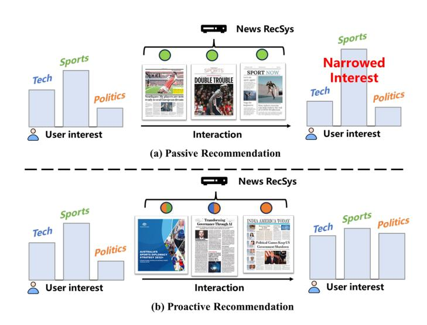
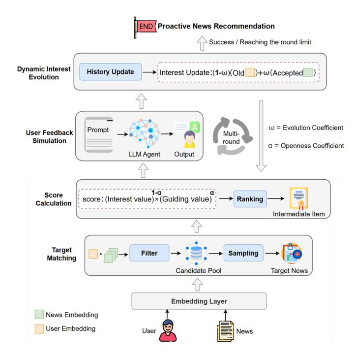

# ONeRec: Towards Openness-Aware and Adaptive Proactive News Recommendation

[Jie Li](https://orcid.org/0000-0003-0339-9144) Beijing University of Posts and Telecommunications Beijing, China jli@bupt.edu.cn

[Zhen Cui](https://orcid.org/0009-0003-9653-5252) Beijing University of Posts and Telecommunications Beijing, China 2024140732@bupt.cn

[Linmei Hu](https://orcid.org/0000-0003-0993-8495)∗ Beijing Institute of Technology Beijing, China hulinmei@bit.edu.cn

### Abstract

Proactive news recommendation seeks to guide users over extended interaction sessions towards a cultivated interest in targeted news, thereby shaping public opinion and contributing to social stability. Conventional news recommendation algorithms, by contrast, are largely passive: they rely solely on a user's historical preferences, a practice that exacerbates filter-bubble effects and opinion polarization. To mitigate these drawbacks, proactive news recommendation strategically adjusts the sequence of suggested articles so that users gradually cultivate an interest in a target. This paradigm, however, presents three central challenges: (i) accurately modeling a user's receptiveness to novelty; (ii) tracking evolving interests across multiple rounds of proactive recommendation; and (iii) selecting intermediary articles that balance immediate relevance with long-term target guidance. To tackle these challenges, we introduce ONeRec, a novel framework towards user Openness-aware and adaptive proactive News Recommendation. ONeRec steers users towards target news by adaptively recommending target-relevant intermediate news items according to the user's openness and current interest. ONeRec incorporates two personalized mechanisms: an openness coefficient, derived from reading history, that models a user's tolerance for novelty and balances interest matching with target guidance; and an evolutionary coefficient, which dynamically updates user interest as they engage with recommended news. To support offline training and evaluation, we further employ a Large Language Model agent to simulate user feedback. Extensive experiments on the public MIND dataset demonstrate that ONeRec consistently outperforms strong baselines in proactive news recommendation scenarios.

### CCS Concepts

• Information systems → Recommender systems.

## Keywords

Proactive News Recommendation, User Openness, Large Language Model

∗Corresponding author

WWW '26, Dubai, United Arab Emirates © 2026 Copyright held by the owner/author(s). ACM ISBN 979-8-4007-2307-0/2026/04 <https://doi.org/10.1145/3774904.3792571>

### ACM Reference Format:

Jie Li, Zhen Cui, and Linmei Hu. 2026. ONeRec: Towards Openness-Aware and Adaptive Proactive News Recommendation. In Proceedings of the ACM Web Conference 2026 (WWW '26), April 13–17, 2026, Dubai, United Arab Emirates. ACM, New York, NY, USA, [11](#page-10-0) pages. [https://doi.org/10.1145/3774904.](https://doi.org/10.1145/3774904.3792571) [3792571](https://doi.org/10.1145/3774904.3792571)

## 1 Introduction

Over the past decade, personalized recommendation systems have become integral to navigating the vast and diverse content landscape of online news platforms. By learning from users' historical interaction logs, conventional sequence-based models aim to predict future clicks by reflecting a user's past preferences. However, this approach often traps users in "filter bubbles [\[1,](#page-8-0) [46\]](#page-8-1)," progressively narrowing their exposure to diverse information [\[40\]](#page-8-2) and heightening the risks of ideological polarization [\[18,](#page-8-3) [19,](#page-8-4) [55\]](#page-9-0).

Figure 1: Illustration of Passive and Proactive News Recommendation. The color of the circle above each news item indicates the topic.

To mitigate the limitations of traditional models, a proactive recommendation paradigm is crucial. Instead of passively predicting user behavior, proactive recommendation seeks to actively shape a user's future interests by delivering a strategically curated sequence of news items. By progressively guiding users towards a predefined target news [\[53\]](#page-9-1), proactive recommendation systems have the potential to broaden users' information horizons and contribute to a

[This work is licensed under a Creative Commons Attribution 4.0 International License.](https://creativecommons.org/licenses/by/4.0)

healthier content ecosystem [\[8\]](#page-8-5). This process can, therefore, help in shaping public opinion [\[10\]](#page-8-6) while maintaining social stability.

Nevertheless, designing an effective proactive recommendation system presents three main challenges. First, it must model each user's receptiveness [\[4,](#page-8-7) [11,](#page-8-8) [56\]](#page-9-2) to novel news content that diverges from their usual preferences. Second, it needs to track users' evolving interests [\[39\]](#page-8-9) throughout the multi-round interaction cycle. Finally, the system must balance immediate relevance with longterm target guidance when selecting intermediary news items.

To address these challenges, we introduce ONeRec, a novel framework for Openness-aware and adaptive proactive News Recommendation. The core idea behind ONeRec is to guide a user's interest towards a selected target news item over multiple recommendation rounds. ONeRec adapts to the user's openness and current interests, progressively recommending news items that balance immediate relevance with long-term guidance. ONeRec integrates two personalized mechanisms to effectively guide users. The first is an openness coefficient, derived from the user's historical reading patterns. This coefficient quantifies the user's openness to novel news content [\[11,](#page-8-8) [43,](#page-8-10) [56\]](#page-9-2) by evaluating the diversity of topics they engage with and their frequency of category transitions. It helps to balance immediate interest matching with the longer-term goal of guiding the user towards new, relevant news items. The second mechanism is the evolutionary coefficient, which adapts the user's interest profile dynamically [\[54\]](#page-9-3) as they interact with recommended news items. This coefficient, derived from the dissimilarity between adjacent news items in the user's history, controls the rate at which the user's interests evolve, ensuring a personalized and adaptive recommendation flow. Furthermore, to facilitate offline evaluation among multiple rounds, we incorporate a Large Language Model (LLM) agent to simulate user feedback [\[2,](#page-8-11) [12,](#page-8-12) [32,](#page-8-13) [36\]](#page-8-14).

The main contributions of this paper are summarized as follows:

- (1) To our best knowledge, this is the first effort to address the proactive news recommendation task. We introduce ONeRec, a novel framework towards Openness-aware and adaptive proactive News Recommendation, which gradually cultivates a user's interest in a predefined target news article.
- (2) In ONeRec, we propose two key personalization mechanisms: an openness coefficient to evaluate a user's novelty tolerance and tailor the recommendation process, and an evolutionary coefficient to dynamically track short-term user interest shifts over multiple recommendation rounds.
- (3) We conduct comprehensive experiments on the public MIND dataset, and the results demonstrate that our model consistently outperforms state-of-the-art baselines across a range of proactive recommendation metrics, confirming its effectiveness.

The rest of this paper is structured as follows. We briefly review related work in Section [2.](#page-1-0) In Section [3,](#page-2-0) we introduce the preliminaries and formally define the problem. In Section [4,](#page-2-1) we detail our methodology. In Section [5,](#page-4-0) we present the experimental settings and results. Finally, we summarize our work and suggest future research directions in Section [6.](#page-7-0)

### 2 Related Work

We review two main strands of research that are pertinent to our work: personalized news recommendation and proactive recommendation.

### 2.1 Personalized News Recommendation

Personalized news recommendation aims to match users with articles that align with their interests [\[51\]](#page-9-4), a field that has seen significant evolution.

Traditional Methods. Early approaches were dominated by conventional models. Collaborative Filtering [\[20\]](#page-8-15) leverages useritem interaction matrices but struggles in the news domain due to the rapid content turnover and resulting data sparsity. Content-Based methods analyze textual content to model user interests, but their reliance on surface-level features often fails to capture deeper semantic nuances [\[33,](#page-8-16) [42\]](#page-8-17).

Deep Learning-Based Sequential Models. More recently, the field has shifted towards deep learning-based methods, particularly those that model the sequential nature of user behavior [\[6\]](#page-8-18). These models have become the standard for news recommendation, employing architectures like Recurrent Neural Networks and Transformers [\[21,](#page-8-19) [49\]](#page-9-5) to capture dynamic user interests from their chronological click histories [\[14,](#page-8-20) [58\]](#page-9-6). SASRec [\[26,](#page-8-21) [47\]](#page-8-22), for example, successfully applied the self-attention mechanism to model sequential patterns [\[45\]](#page-8-23). Others have explored enhancing these models with contrastive learning [\[41\]](#page-8-24), such as ICLRec [\[9\]](#page-8-25), to better understand latent user intentions [\[30\]](#page-8-26). Graph-based methods have also been extensively explored to capture high-order structural information and disentangle user preferences[\[22,](#page-8-27) [23\]](#page-8-28). More recently, researchers have focused on integrating richer contextual signals to refine recommendation precision. For instance, DIVAN [\[15\]](#page-8-29) introduces a virality-aware network to capture the complex temporal dynamics of news consumption, while SJORS [\[17\]](#page-8-30) leverages semantic reasoning to tailor recommendations for specific professional domains.

Despite their increasing sophistication in matching users with relevant content, all the above methods are fundamentally passive. By design, they are optimized to predict the next click based on a user's established preferences [\[9,](#page-8-25) [26\]](#page-8-21). This user-centric focus can inadvertently confine users within "filter bubbles" or "information cocoons [\[18,](#page-8-3) [48\]](#page-9-7)" by creating self-reinforcing feedback loops. Crucially, these systems lack any mechanism to expand user interests or proactively guide them towards predefined topical goals.

# 2.2 Proactive Recommendation

Proactive recommendation is an emerging research field that aims to actively and strategically steer user interests over multiple interaction rounds [\[44\]](#page-8-31). This area can be broadly categorized into two main directions.

Preference Evolution Modeling. This line of research primarily investigates how user preferences evolve through interactions with a recommender system [\[7\]](#page-8-32), often using simulation techniques [\[12,](#page-8-12) [37\]](#page-8-33). The goal is typically to optimize for long-term user engagement and satisfaction [\[13,](#page-8-34) [50\]](#page-9-8), rather than focusing on myopic, next-click prediction.

Table 2: The overall experiment results on MIND dataset. The bold is the best performance and the underline is the second-best.

| Methods    | Hit@5  | IOI@5   | IOR@5     | Hit@10 | IOI@10  | IOR@10    | Hit@15 | IOI@15  | IOR@15    | Hit@20 | IOI@20 | IOR@20    |
|------------|--------|---------|-----------|--------|---------|-----------|--------|---------|-----------|--------|--------|-----------|
| ICLRec     | 0.4184 | 0.0021  | -3.0020   | 0.4300 | 0.0035  | -3.0020   | 0.4328 | 0.0043  | 1.1720    | 0.4391 | 0.0049 | -87.9960  |
| SASRec     | 0.4212 | -0.0030 | -158.8780 | 0.4298 | -0.0022 | -203.4040 | 0.4170 | -0.0072 | -35.1050  | 0.4239 | 0.0061 | 150.7950  |
| SASRec-IPG | 0.3781 | 0.2454  | 1084.3470 | 0.3781 | 0.2454  | 1084.3470 | 0.3804 | 0.6736  | 3276.0600 | 0.3805 | 0.8694 | 3083.5413 |
| ITMPRec    | 0.4065 | 0.3339  | 1747.3200 | 0.3968 | 0.6566  | 2925.9857 | 0.4062 | 0.7762  | 3829.1980 | 0.4001 | 0.8799 | 4752.3150 |
| ONeRec     | 0.4152 | 0.4128  | 2471.1980 | 0.4186 | 0.6573  | 3539.6175 | 0.4184 | 0.9863  | 5402.6475 | 0.4181 | 1.2665 | 6965.2288 |

is calculated as the ratio of accepted recommendations to the total recommendations made up to round ��. Formally:

Hit@k = 1 |U| · �� ∑︁ ��∈U ∑︁ �� ��=1 �� �� (22)

where �� �� ∈ {0, 1} is the simulated feedback for user �� in round ��.

- Increase of Interest (IOI@k): This metric quantifies the effectiveness of the guidance process by measuring the change in a user's affinity for the target item ��. It is defined as the average increase in the user-target similarity score after �� rounds.

IOI@k = 1 |U| ∑︁ ��∈U (�� �� ) �� ���� − (�� 0 ) �� ���� (23)

where �� 0 and �� �� are the user embeddings at the initial state and after round ��, respectively.

- Increase of Ranking (IOR@k): This metric measures the improvement in the target item's relevance from the user's perspective. It is calculated as the average improvement in the rank of the target item �� within a candidate pool.

IOR@k = 1 |U| ∑︁ ��∈U Rank(���� |�� 0 ) − Rank(���� |�� �� ) (24)

where Rank(���� |�� ∗ ) denotes the rank of the target item �� based on its similarity to the user embedding �� ∗ at a given round.

5.1.3 Baselines. We compare ONeRec against two categories of strong baseline models:

- Sequential Recommendation Models: These models are designed to predict the next item a user will interact with but lack an explicit guidance mechanism.
  - SASRec [\[26\]](#page-8-21): A classic self-attention-based model that captures sequential patterns in user behavior.
  - ICLRec [\[9\]](#page-8-25): An intent-aware model that uses contrastive learning to better understand user intentions in sequential recommendation.
- Proactive Recommendation Models: These models are explicitly designed for target-oriented guidance.
  - SASRec-IPG [\[5\]](#page-8-35): This baseline combines the SASRec model with IPG, a post-processing framework that reranks recommendations to balance relevance and guiding value.
  - ITMPRec [\[35\]](#page-8-36): A proactive method that incorporates user intention modeling and an arousal coefficient to guide users towards a target.

5.1.4 Implementation Details. We implement our model and all baselines using PyTorch. User and news embeddings are generated as described in Section 4. Specifically, news titles are encoded using the all-MiniLM-L6-v2 SentenceTransformer model, and categories are embedded using a Word2Vec model. User embeddings are produced by a sequence encoder trained on historical interactions. To evaluate performance at different interaction depths, we conduct experiments where the maximum number of proactive recommendation rounds is set to �� ∈ {5, 10, 15, 20}, and report results at each of these intervals. In line with our methodology, the user's openness coefficient is computed once at the beginning of the process, while the target item for each user is selected from a candidate pool of items with a predicted acceptance probability below 50%. User feedback in all experiments is simulated using an LLM agent to ensure a realistic and dynamic interaction environment.

### 5.2 RQ1: Overall Performance Comparison

The main experimental results are presented in Table [2.](#page-5-0) From the results, we can draw several key observations.

First, a clear distinction exists between proactive and conventional sequential models. The sequential baselines, SASRec [\[26\]](#page-8-21) and ICLRec [\[9\]](#page-8-25), achieve high Hit Rates because they are optimized to recommend items that align with users' past preferences. However, they exhibit negligible or even negative performance on the IOI and IOR metrics. This is expected, as these models lack any mechanism for guidance; their recommendations may drift away from a predefined target, confirming that high immediate relevance does not translate to effective long-term guidance.

Second, among the models designed for proactive recommendation, our ONeRec framework consistently and significantly outperforms all baselines on the core guidance metrics, IOI and IOR. Specifically, we observe that the baseline SASRec-IPG, which employs a post-processing re-ranking strategy to inject guidance, manages to improve IOI and IOR compared to the passive SASRec. However, this comes at a significant cost to user engagement, as evidenced by its Hit Rate being the lowest among all methods (e.g., 0.3805 at round 20). This suggests that a rigid re-ranking strategy tends to sacrifice user acceptance for guidance. In contrast, ONeRec achieves the highest scores for IOI and IOR across all evaluation intervals (�� = 5, 10, 15, 20) while maintaining a competitive Hit Rate. The performance gap widens as the number of rounds increases, demonstrating the superiority of our model in sustained, multi-round guidance scenarios. For instance, at 20 rounds, ONeRec achieves an IOI@20 of 1.2665 and an IOR@20 of 6965.2288, substantially surpassing the next-best proactive model, ITMPRec [\[35\]](#page-8-36).

The superior performance of ONeRec can be attributed to its unique design. The openness-aware scoring mechanism allows for personalized guidance—making bolder, guidance-focused recommendations for users identified as open to novelty, while adopting a more cautious, interest-focused approach for others. This tailored strategy creates a more efficient path towards the target. Furthermore, the dynamic interest evolution module, controlled by a personalized coefficient, enables the model to adapt realistically to user feedback, making the multi-round updates more effective. Finally, ONeRec maintains a competitive Hit Rate, comparable to other proactive models and only slightly lower than purely sequential ones. This indicates a well-calibrated balance between achieving long-term guidance objectives and maintaining user engagement through relevant intermediary recommendations.

# 5.3 RQ2: Ablation Study

To rigorously evaluate the individual contributions of the core components within our ONeRec framework, we conduct a comprehensive ablation study. The objective is to understand the impact of removing or simplifying each key mechanism on the model's overall performance, particularly its guidance capabilities. We create four variants of the full ONeRec model and compare their performance against the complete version after 20 recommendation rounds on the MIND dataset, using Hit@20, IOI@20, and IOR@20 as our primary evaluation metrics.

The variants are systematically designed as follows:

- ONeRec w/o Openness: This variant ablates the personalized openness coefficient (��). Instead of computing a unique �� based on user history, we assign a fixed, non-personalized hyperparameter (�� = 0.5) for all users. This configuration gives equal weight to interest matching and guiding value, irrespective of individual user traits, thereby testing the importance of a personalized guidance strategy.
- ONeRec w/o Evolution: This variant removes the personalized evolution coefficient (��). The personalized ��, which dictates the rate of user interest updates, is replaced with a small, fixed learning rate (e.g., �� = 0.1) for all users. This experiment is designed to isolate the contribution of a dynamic, user-specific update mechanism versus a static one.
- ONeRec w/o Guidance: In this variant, the core guidance mechanism is removed from the scoring function. The composite score is based solely on the interest value (��������), completely ignoring the guiding value (��������). This effectively transforms the model into a passive recommender operating within a proactive loop, aiming to directly validate the necessity of the explicit guidance component.
- ONeRec w/o Pre-Matching: This variant eliminates the target pre-matching module. Instead of filtering the candidate pool to select targets with an acceptance probability below 50%, we select target items completely at random from the entire news corpus. This experiment will demonstrate the importance of initializing the guidance process with a suitable target.

The results of our ablation study are presented in Table [3.](#page-6-0) Our analysis of these results leads to several key insights.

First, removing the personalized openness coefficient (ONeRec w/o Openness) causes a significant degradation in guidance performance, with IOI@20 dropping from 1.2665 to 0.9341 and IOR@20

Table 3: Ablation study results on the MIND dataset, evaluated at 20 recommendation rounds. Performance drops in all variants confirm the effectiveness of each component.

| Method |       |              | Hit@20 | IOI@20 | IOR@20    |
|--------|-------|--------------|--------|--------|-----------|
| ONeRec | (Full | Model)       | 0.4181 | 1.2665 | 6965.2288 |
| ONeRec | w/o   | Openness     | 0.4095 | 0.9341 | 5102.7314 |
| ONeRec | w/o   | Evolution    | 0.4132 | 1.0872 | 6251.4890 |
| ONeRec | w/o   | Guidance     | 0.4255 | 0.0053 | 142.3017  |
| ONeRec | w/o   | Pre-Matching | 0.3978 | 0.8116 | 4588.1923 |

decreasing by over 26%. This confirms our hypothesis that a uniform guidance strategy is suboptimal. For users with narrow interests, a fixed strategy may be too aggressive, leading to rejections, while for users open to novelty, it may be too conservative, resulting in an inefficient guidance path.

Second, replacing the personalized evolution coefficient with a fixed learning rate (ONeRec w/o Evolution) also leads to a clear decline in IOI and IOR scores. A fixed update rate fails to capture the nuances of how different users internalize new information, leading to less accurate user representations over the multi-round process and consequently affecting the efficacy of intermediate item selection.

Third, the most dramatic performance change is observed in the ONeRec w/o Guidance variant. As anticipated, the guidancespecific metrics collapse, with IOI@20 and IOR@20 plummeting to near-zero values (0.0053 and 142.3017, respectively), which is analogous to the performance of the sequential baselines. Conversely, its Hit@20 score (0.4255) is the highest among all variants, as it exclusively recommends items that match users' existing preferences. This result strongly validates that the explicit guiding component is indispensable for achieving the objectives of proactive recommendation.

Finally, the ONeRec w/o Pre-Matching variant shows a substantial drop in guidance effectiveness. Randomly selecting targets can lead to a failure mode: choosing a target the user already likes, which makes the guidance trivial (near-zero IOI). This underscores the criticality of the pre-matching module for defining a meaningful guidance problem for each user.

In summary, the ablation results collectively verify that each of our components—personalized openness, dynamic evolution, a dedicated guiding score, and target matching—is a crucial and integral part of the ONeRec framework's success.

## 5.4 RQ3: Case Study

To illustrate ONeRec's adaptive guidance, we analyze a specific user whose history is dominated by Politics and Finance, resulting in a low Openness Coefficient (��). This indicates a preference for familiarity over novelty. The objective is to guide this user toward a target in the Sports category. Table [4](#page-7-1) details the recommendation paths generated by ONeRec and the passive baseline SASRec [\[26\]](#page-8-21) over ten rounds.

ONeRec adopts a "bridging" strategy, initially recommending articles that connect the user's existing interests with the target domain (e.g., political or financial aspects of sports). This respects

Table 4: A case study illustrating the recommendation paths of ONeRec and a passive baseline (SASRec) over ten rounds.

| Target News Article in Sports : Data-Driven                   | Strategies in Modern Sports                                         |
|---------------------------------------------------------------|---------------------------------------------------------------------|
| User’s Recent History (Categories)                            | : Politics → Finance → Politics → Health → Finance                  |
| ONeRec’s Recommendation Path                                  | Passive Baseline’s (SASRec) Path                                    |
| 1. Pol. Influence on Sports Funding (Politics/Finance/Sports) | 1. Recent Election Updates (Politics)                               |
| ↓                                                             | ↓                                                                   |
| 2. Fin. Impacts of Olympic Events (Finance/Sports)            | 2. Stock Market Trends (Finance)                                    |
| ↓                                                             | ↓                                                                   |
| 3. Health Policies in Pro Athletics (Health/Sports)           | 3. Global Health Initiatives (Health)                               |
| ↓                                                             | ↓                                                                   |
| 4. Econ. Aspects of Team Management                           | (Finance/Sports) 4. Pol. Debates on Econ. Reform (Politics/Finance) |
| ↓                                                             | ↓                                                                   |
| 5. Athlete Wellness Programs (Health/Sports)                  | 5. Fin. News Roundup (Finance)                                      |
| ↓                                                             | ↓                                                                   |
| 6. Sports League Governance (Politics/Sports)                 | 6. Health Policy Analysis (Health/Politics)                         |
| ↓                                                             | ↓                                                                   |
| 7. Investing in Sports Franchises (Finance/Sports)            | 7. Pol. Scandals Update (Politics)                                  |
| ↓                                                             | ↓                                                                   |
| 8. Physical Fitness in Competitive Sports                     | (Health/Sports) 8. Econ. Indicators Report (Finance)                |
| ↓                                                             | ↓                                                                   |
| 9. Strategic Planning in Pro Teams (Sports)                   | 9. Intl. Health Challenges (Health)                                 |
| ↓                                                             | ↓                                                                   |
| 10. Modern Coaching Techniques (Sports)                       | 10. Pol. Campaign Strategies (Politics)                             |
| Target Category Reached ✓                                     | Fails to Reach Target ×                                             |

the user's low �� by balancing immediate relevance with guidance. As the user accepts these items, the Evolutionary Coefficient (��) dynamically updates their interest profile, allowing the model to progressively emphasize the guiding value. Consequently, ONeRec successfully transitions the user to pure Sports content, raising the user-target similarity score from 0.32 to 0.78.

In contrast, SASRec remains confined to the user's historical preferences, cycling through Politics and Finance without making progress toward the target. This comparison highlights ONeRec's superiority in mitigating filter bubbles: by integrating opennessaware scoring and dynamic interest evolution, it effectively broadens the user's information horizon in a personalized, user-centric manner.

# 6 Conclusion

In this paper, we introduced ONeRec, a proactive news recommendation framework designed to mitigate filter bubbles by strategically guiding users toward new topics. We proposed two personalized mechanisms—the Openness Coefficient and the Evolutionary Coefficient—to model user receptiveness and dynamic interest shifts. Extensive experiments on the MIND dataset demonstrate that ONeRec significantly outperforms baselines in achieving long-term guidance objectives while maintaining user engagement.Future work may explore the integration of causal inference [\[16,](#page-8-42) [38\]](#page-8-43) to further enhance the model's explainability and robustness.

Crucially, we must emphasize the limitations regarding evaluation and ethics. First, our validation relies on offline LLM simulations; thus, the results may not fully reflect complex real-world behaviors, necessitating future human-in-the-loop studies. Second, ONeRec represents a methodological contribution rather than a

deployment-ready system. The capability to steer interests carries inherent risks of misuse, such as opinion manipulation or creating artificial "filter bubbles." Therefore, any real-world application must be governed by strict transparency and user consent protocols. We provide a comprehensive discussion on these ethical implications and abuse prevention strategies in the Ethics Statement (see Appendix [A.1\)](#page-9-11).

# Acknowledgments

This work was supported by the National Science Foundation of China (No. 62276029), Beijing Institute of Technology Research Fund Program for Young Scholars (No.6120220261), CIPSC-SMP-Zhipu Large Model Cross-Disciplinary Fund (No. ZPCG20241111371).

- References [1] Md Sanzeed Anwar, Grant Schoenebeck, and Paramveer S. Dhillon. 2024. Filter Bubble or Homogenization? Disentangling the Long-Term Effects of Recommendations on User Consumption Patterns. In Proceedings of the ACM Web Conference 2024 (WWW '24). 123–134. [2] Keqin Bao, Jizhi Zhang, Yang Zhang, Wenjie Wang, Fuli Feng, and Xiangnan He. 2023. TALLRec: An Effective and Efficient Tuning Framework to Align Large Language Model with Recommendation. In Proceedings of the 17th ACM Conference on Recommender Systems (RecSys '23). 1007–1014. [3] Oren Barkan and Noam Koenigstein. 2016. Item2vec: neural item embedding for collaborative filtering. In Proceedings of the 2016 IEEE 26th International Workshop on Machine Learning for Signal Processing (MLSP). 1–6. [4] Daniel E. Berlyne. 1960. Conflict, Arousal, and Curiosity. McGraw-Hill, New York. [5] Shuxian Bi, Wenjie Wang, Hang Pan, et al. 2024. Proactive Recommendation with Iterative Preference Guidance. In Companion Proceedings of the ACM Web Conference 2024 (WWW '24). [6] Tesfaye Fenta Boka, Zhendong Niu, and Rama Bastola Neupane. 2024. A survey of sequential recommendation systems: Techniques, evaluation, and future directions. Information Systems 125 (2024), 102427. [7] Arun Tejasvi Chaganty, Megan Leszczynski, Shu Zhang, et al. 2023. Beyond Single Items: Exploring User Preferences in Item Sets with the Conversational Playlist Curation Dataset. In Proceedings of the 46th International ACM SIGIR Conference on Research and Development in Information Retrieval (SIGIR '23). 2754–2764. [8] Minmin Chen, Alex Beutel, Paul Covington, Sagar Jain, Francois Belletti, and Ed H. Chi. 2019. Top-K Off-Policy Correction for a REINFORCE Recommender System. In Proceedings of the 12th ACM International Conference on Web Search and Data Mining (WSDM '19). 456–464. [9] Yongjun Chen, Zhiwei Liu, Jia Li, Julian J. McAuley, and Caiming Xiong. 2022. Intent Contrastive Learning for Sequential Recommendation. In Proceedings of the ACM Web Conference 2022 (WWW '22). 2592–2602. [10] Dan Cosley, Shyong K. Lam, István Albert, Joseph A. Konstan, and John Riedl. 2003. Is seeing believing? How recommender system interfaces affect users' opinions. In Proceedings of the SIGCHI Conference on Human Factors in Computing Systems (CHI '03). 585–592. [11] Mihaela Curmei, Andreas A. Haupt, Benjamin Recht, and Dylan Hadfield-Menell. 2022. Towards Psychologically-Grounded Dynamic Preference Models. In Proceedings of the 16th ACM Conference on Recommender Systems (RecSys '22). 35–48. [12] Romain Deffayet, Thibaut Thonet, Dongyoon Hwang, et al. 2024. SARDINE: Simulator for Automated Recommendation in Dynamic and Interactive Environments. Transactions on Recommender Systems 2, 3 (2024), 25:1–25:34. [13] Yang Deng, Wenqiang Lei, Wai Lam, and Tat-Seng Chua. 2023. A Survey on Proactive Dialogue Systems: Problems, Methods, and Prospects. In Proceedings of the 32nd International Joint Conference on Artificial Intelligence (IJCAI '23). 6583–6591. [14] Ziwei Fan, Zhiwei Liu, Hao Peng, and Philip S. Yu. 2023. Mutual Wasserstein Discrepancy Minimization for Sequential Recommendation. In Proceedings of the ACM Web Conference 2023 (WWW '23). 1375–1385. [15] Antonio Ferrara et al. 2024. DIVAN: Deep-Interest Virality-Aware Network to Exploit Temporal Dynamics in News Recommendation. In Proceedings of the Recommender Systems Challenge 2024. 12–16. [16] Chen Gao, Yu Zheng, Wenjie Wang, et al. 2024. Causal Inference in Recommender Systems: A Survey and Future Directions. ACM Transactions on Information Systems 42, 4 (2024), 88:1–88:32. [17] A. L. Garrido, M. S. Pera, and C. Bobed. 2024. SJORS: A Semantic Recommender System for Journalists. Business & Information Systems Engineering 66, 6 (2024), 691–708. [18] Ming Gu, Tian-Fang Zhao, Liang Yang, et al. 2024. Modeling Information Cocoons in Networked Populations: Insights From Backgrounds and Preferences. IEEE Transactions on Computational Social Systems 11, 3 (2024), 4497–4510. [19] Jan Hazla, Yan Jin, Elchanan Mossel, and Govind Ramnarayan. 2019. A Geometric Model of Opinion Polarization. arXiv preprint arXiv:1910.05274 (2019). [20] Xiangnan He, Lizi Liao, Hanwang Zhang, Liqiang Nie, Xia Hu, and Tat-Seng Chua. 2017. Neural Collaborative Filtering. In Proceedings of the 26th International Conference on World Wide Web (WWW '17). 173–182. [21] Balázs Hidasi, Alexandros Karatzoglou, Linas Baltrunas, and Domonkos Tikk. 2015. Session-based Recommendations with Recurrent Neural Networks. arXiv preprint arXiv:1511.06939 (2015). [22] Linmei Hu, Chen Li, Chuan Shi, Cheng Yang, and Chao Shao. 2020. Graph Neural News Recommendation with Long-term and Short-term Interest Modeling. Information Processing & Management 57, 2 (2020), 102142. [23] Linmei Hu, Siyong Xu, Chen Li, et al. 2020. Graph Neural News Recommendation with Unsupervised Preference Disentanglement. In Proceedings of the 58th Annual Meeting of the Association for Computational Linguistics (ACL '20). 4255–4264. [24] Jin Huang, Harrie Oosterhuis, Maarten de Rijke, and Herke van Hoof. 2020. Keeping Dataset Biases out of the Simulation: A Debiased Simulator for Reinforcement Learning Based Recommender Systems. In Proceedings of the 14th ACM Conference on Recommender Systems (RecSys '20). 190–199. [25] Dietmar Jannach and Markus Zanker. 2024. A Survey on Intent-aware Recommender Systems. arXiv preprint arXiv:2406.16350 (2024). [26] Wang-Cheng Kang and Julian J. McAuley. 2018. Self-Attentive Sequential Recommendation. In Proceedings of the IEEE International Conference on Data Mining (ICDM). 197–206. [27] Ignasi Labastida and Thomas Margoni. 2020. Licensing FAIR Data for Reuse. Data Intelligence 2, 1-2 (2020), 199–207. [28] Annalisa Landi, Mark Thompson, Viviana Giannuzzi, Fedele Bonifazi, Ignasi Labastida, Luiz Olavo Bonino da Silva Santos, and Marco Roos. 2020. The "A" of FAIR – As Open as Possible, as Closed as Necessary. Data Intelligence 2, 1-2 (2020), 47–55. [29] Houzhi Li, Jinyu Wang, Zixin Jiang, Guorui Su, Chaowen Yan, Hao Su, and Zhichun Wang. 2025. EVCharging-GPT: Predicting Electric Vehicle User Charging Behavior Using Large Language Models. Data Intelligence (2025). [doi:10.3724/](https://doi.org/10.3724/2096-7004.di.2025.0002) [2096-7004.di.2025.0002](https://doi.org/10.3724/2096-7004.di.2025.0002) Online First. [30] Haoyang Li, Xin Wang, Ziwei Zhang, et al. 2022. Intention-Aware Sequential Recommendation With Structured Intent Transition. IEEE Transactions on Knowledge and Data Engineering 34, 11 (2022), 5403–5414. [31] Jie Li, Yuqiu Deng, Simin Yang, Jinrui Wang, and Yunbo Rao. 2024. CRC: Knowledge-Enhanced Caption Reconstruction and Comparison for Detecting Out-of-Context Misinformation. Data Intelligence (2024). [32] Jie Li, Zeyi Liu, Linmei Hu, Yunbo Rao, Bo Liu, Bo Fang, and Liqiang Nie. 2025. Personalized News Recommendation Towards the Era of LLMs: Review and Prospect. IEEE Transactions on Knowledge and Data Engineering 37, 9 (2025), 5551–5566. [33] Xuewei Li, Aitong Sun, Mankun Zhao, et al. 2023. Multi-Intention Oriented Contrastive Learning for Sequential Recommendation. In Proceedings of the 16th ACM International Conference on Web Search and Data Mining (WSDM '23). 411–
  - 419. [34] Yuanchun Li, Hao Wen, Weijun Wang, et al. 2024. Personal LLM Agents: Insights and Survey about the Capability, Efficiency and Security. arXiv preprint arXiv:2401.05459 (2024). [35] Yahong Lian, Chunyao Song, and Tingjian Ge. 2025. ITMPRec: Intention-based Targeted Multi-round Proactive Recommendation. In Proceedings of the ACM Web Conference 2025 (WWW '25). To appear. [36] Xinyu Lin, Wenjie Wang, Yongqi Li, Fuli Feng, See-Kiong Ng, and Tat-Seng Chua. 2023. A multi-facet paradigm to bridge large language model and recommendation. arXiv preprint arXiv:2310.06491 (2023). [37] Huafeng Liu, Liping Jing, Jian Yu, and Michael K. Ng. 2024. Learning Hierarchical Preferences for Recommendation With Mixture Intention Neural Stochastic Processes. IEEE Transactions on Knowledge and Data Engineering 36, 7 (2024), 3237–3251. [38] Xu Liu, Tong Yu, Kaige Xie, et al. 2024. Interact with the Explanations: Causal Debiased Explainable Recommendation System. In Proceedings of the 17th ACM International Conference on Web Search and Data Mining (WSDM '24). 472–481. [39] Francesco Sanna Passino, Lucas Maystre, Dmitrii Moor, Ashton Anderson, and Mounia Lalmas. 2021. Where To Next? A Dynamic Model of User Preferences. In Proceedings of the Web Conference 2021 (WWW '21). 3210–3220. [40] Jinghua Piao, Jiazhen Liu, Fang Zhang, et al. 2023. Human-AI adaptive dynamics drives the emergence of information cocoons. Nature Machine Intelligence 5, 11 (2023), 1214–1224. [41] Xiuyuan Qin, Huanhuan Yuan, Pengpeng Zhao, et al. 2024. Intent Contrastive Learning with Cross Subsequences for Sequential Recommendation. In Proceedings of the 17th ACM International Conference on Web Search and Data Mining (WSDM '24). 548–556. [42] Steffen Rendle, Christoph Freudenthaler, and Lars Schmidt-Thieme. 2010. Factorizing Personalized Markov Chains for Next-Basket Recommendation. In Proceedings of the 19th International Conference on World Wide Web (WWW '10). 811–820. [43] Patricia Romero Verdugo, Lieke L.F. van Lieshout, Floris P. de Lange, and Roshan Cools. 2023. Choice boosts curiosity. Psychological Science 34, 1 (2023), 99–110. [44] Eden Saig and Nir Rosenfeld. 2023. Learning to Suggest Breaks: Sustainable Optimization of Long-Term User Engagement. In Proceedings of the 40th International Conference on Machine Learning (ICML '23). 29671–29696. [45] Yehjin Shin, Jeongwhan Choi, Hyowon Wi, and Noseong Park. 2024. An Attentive Inductive Bias for Sequential Recommendation beyond the Self-Attention. In Proceedings of the 38th AAAI Conference on Artificial Intelligence (AAAI '24). 8984–8992. [46] Nicholas Sukiennik, Chen Gao, and Nian Li. 2024. Uncovering the Deep Filter Bubble: Narrow Exposure in Short-Video Recommendation. In Proceedings of the ACM Web Conference 2024 (WWW '24). 4727–4735. [47] Fei Sun, Jun Liu, Jian Wu, Changhua Pei, Xiao Lin, Wenwu Ou, and Peng Jiang. 2019. BERT4Rec: Sequential Recommendation with Bidirectional Encoder Representations from Transformer. In Proceedings of the 28th ACM International

Conference on Information and Knowledge Management (CIKM '19). 1441–1450. [48] Cass R. Sunstein. 2007. Republic.com 2.0. Princeton University Press, Princeton, NJ. [49] Jiaxi Tang and Ke Wang. 2018. Personalized Top-N Sequential Recommendation via Convolutional Sequence Embedding. In Proceedings of the 11th ACM International Conference on Web Search and Data Mining (WSDM '18). 565–573. [50] Jian Wang, Dongding Lin, and Wenjie Li. 2024. Target-constrained Bidirectional Planning for Generation of Target-oriented Proactive Dialogue. ACM Transactions on Information Systems 42, 5 (2024), 124:1–124:27. [51] Chuhan Wu, Fangzhao Wu, Yongfeng Huang, and Xing Xie. 2023. Personalized News Recommendation: Methods and Challenges. ACM Transactions on Information Systems 41, 1 (2023), 24:1–24:50. [52] Fangzhao Wu, Ying Qiao, Jiun-Hung Chen, Chuhan Wu, Tao Qi, Jianxun Lian, Danyang Liu, Xing Xie, Jianfeng Gao, Winnie Wu, and Ming Zhou. 2020. MIND: A Large-scale Dataset for News Recommendation. In Proceedings of the 58th Annual Meeting of the Association for Computational Linguistics (ACL '20). 3597–3606. [53] Yaxiong Wu, Craig Macdonald, and Iadh Ounis. 2023. Goal-Oriented Multi-Modal Interactive Recommendation with Verbal and Non-Verbal Relevance Feedback. In Proceedings of the 17th ACM Conference on Recommender Systems (RecSys '23). 362–373. [54] Chen Yang, Jin Chen, Qian Yu, et al. 2023. An Incremental Update Framework for Online Recommenders with Data-Driven Prior. In Proceedings of the 32nd ACM International Conference on Information and Knowledge Management (CIKM '23). 4894–4900. [55] Yang Zhang, Fuli Feng, Xiangnan He, Tianxin Wei, Chonggang Song, Guohui Ling, and Yongdong Zhang. 2021. Causal Intervention for Leveraging Popularity Bias in Recommendation. In Proceedings of the 44th International ACM SIGIR Conference on Research and Development in Information Retrieval (SIGIR '21). 11–20. [56] Peilin Zhao and Dik Lun Lee. 2016. How Much Novelty is Relevant? It Depends on Your Curiosity. In Proceedings of the 39th International ACM SIGIR Conference on Research and Development in Information Retrieval (SIGIR '16). 315–324. [57] Haoren Zhu, Hao Ge, Xiaodong Gu, et al. 2023. Influential Recommender System. In Proceedings of the IEEE International Conference on Data Engineering (ICDE '23). 1406–1419. [58] Nana Zhu, Zixian Feng, Hang Wang, Xing Gao, Xinyi Wang, and Yuanxing Liu. 2025. Clarifying user Preference with Maximum Entropy Based Recommendation. Data Intelligence 7, 2 (2025), 527–548. [doi:10.3724/2096-7004.di.2025.0040](https://doi.org/10.3724/2096-7004.di.2025.0040)

### A Appendix

# A.1 Ethics Statement

We acknowledge that the proactive news recommendation paradigm proposed in ONeRec—which actively steers user interests toward specific target content—raises important ethical considerations regarding user autonomy, potential manipulation, and transparency. While our primary research motivation is to mitigate the "filter bubble" effect and broaden users' information horizons, we recognize the dual-use nature of such technology. To address the concerns regarding potential misuse for opinion manipulation or guiding users against their best interests, we outline the following ethical principles and safeguards integral to the proposed framework:

### Respecting User Autonomy via Design.

Unlike coercive steering mechanisms, ONeRec is explicitly designed to respect user autonomy through the Openness Coefficient (��). This mechanism acts as an inherent safeguard: it quantifies a user's natural willingness to explore new topics based on their historical behavior. For users who prefer familiarity (low openness), the model automatically reduces the weight of the guiding value, thereby preventing "forced" steering or aggressive content pushing. The system is designed to nudge only when the user exhibits a propensity for exploration, ensuring that the guidance aligns with the user's psychological receptiveness.

### Transparency and Informed Consent.

In any real-world deployment or online A/B testing of ONeRec,

strict transparency mechanisms must be implemented. Users should be:

- Explicitly informed that the recommendation system may proactively suggest diverse content to broaden their interests (Informed Consent).
- Provided with interface-level explanations (e.g., labels such as "To broaden your view") when a recommendation is made primarily for guidance purposes rather than immediate relevance (Explainability).
- Granted the ability to opt-out of proactive guidance features or reset their interest evolution profile (User Control).

### Prevention of Misuse and Content Safety.

To prevent the system from being used to amplify harmful propaganda or misinformation, the selection of "target items" must be rigorously controlled. The candidate pool for target news must undergo strict safety filtering. Advanced techniques for misinformation identification and fake news detection [\[31\]](#page-8-44) should be integrated to ensure compliance with community guidelines and legal standards. We strictly condemn the use of proactive recommendation for political manipulation or the promotion of extremist content. The proposed method is intended solely for benevolent purposes, such as educational guidance or diversifying news consumption to foster a healthier public discourse.

### Data Privacy.

Our experiments were conducted on the public MIND dataset with anonymized user IDs. No personally identifiable information (PII) was processed or stored. Future applications of this framework must adhere to relevant data protection regulations (e.g., GDPR) [\[28\]](#page-8-45) and adopt clear data licensing frameworks [\[27\]](#page-8-46) to ensure user privacy and data reusability are properly managed during the interest modeling process.

# A.2 Complexity Analysis

To demonstrate the feasibility of ONeRec in production environments [45], we analyze the time complexity of its offline preprocessing and online inference phases. Let |�� | and |�� | denote the total number of users and news items, respectively. Let �� be the embedding dimension, �� be the maximum length of a user's interaction history (e.g., �� = 30), and �� be the number of candidate items to be ranked in each round.

### Offline Preprocessing Cost.

The initialization of the Openness Coefficient (��) and the Evolution Coefficient (��) is performed offline or asynchronously.

- Computing �� involves calculating the Category Transition Frequency (��(��)) and Historical Content Diversity. The latter requires pairwise cosine similarity calculations within the user history, leading to a complexity of ��(�� 2 · ��). Since �� is a small constant (typically �� ≪ |�� |), this overhead is negligible.
- The Target Matching process filters the candidate pool based on dot-product similarity, with a complexity of ��(|���� | · ��). As this is a one-time operation per session setup, it does not impact real-time serving latency.

