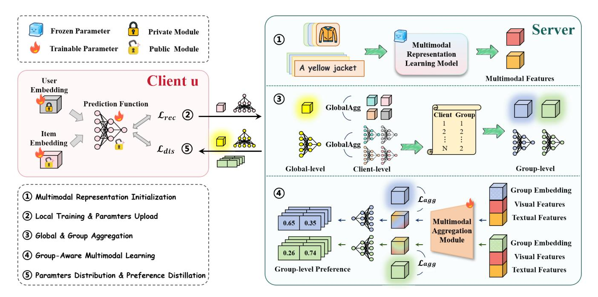
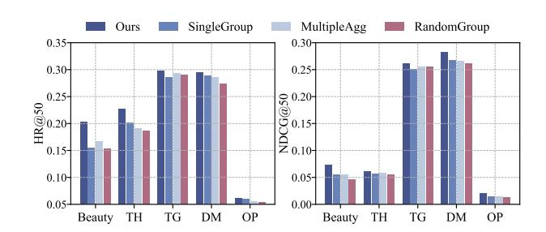
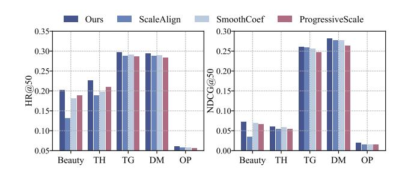
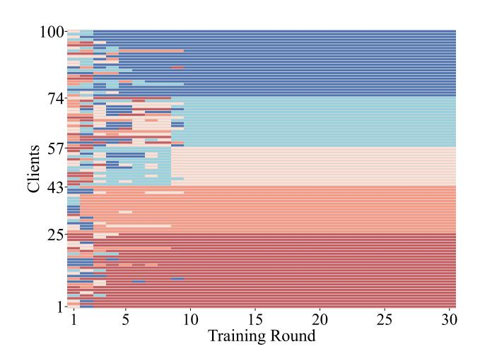
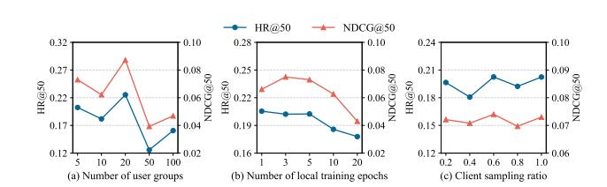
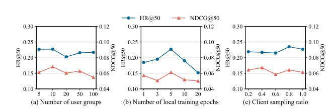
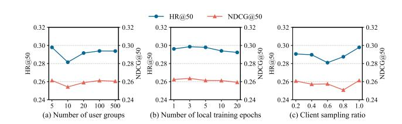
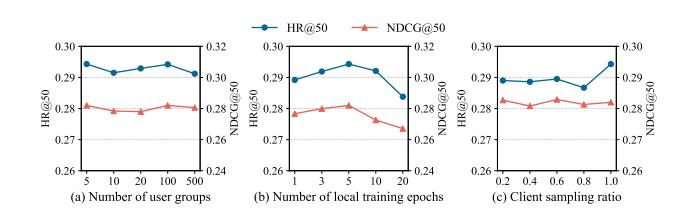
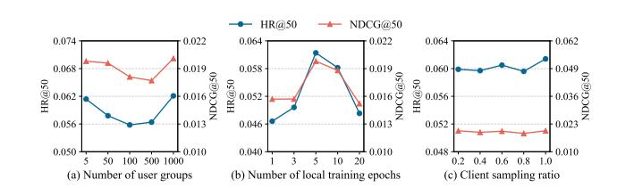

# Multimodal-enhanced Federated Recommendation: A Group-wise Fusion Approach

Chunxu Zhang∗ College of Computer Science and Technology, Jilin University Key Laboratory of Symbolic Computation and Knowledge Engineering of Ministry of Education, Jilin University Changchun, China PolyU Academy for Artificial Intelligence, Hong Kong Polytechnic University Hong Kong, China zhangchunxu@jlu.edu.cn

Weipeng Zhang∗ College of Computer Science and Technology, Jilin University Key Laboratory of Symbolic Computation and Knowledge Engineering of Ministry of Education, Jilin University Changchun, China zhangwp24@mails.jlu.edu.cn

Guodong Long Australian Artificial Intelligence Institute, FEIT, University of Technology Sydney Sydney, Australia Guodong.Long@uts.edu.au

Zhiheng Xue College of Computer Science and Technology, Jilin University Key Laboratory of Symbolic Computation and Knowledge Engineering of Ministry of Education, Jilin University Changchun, China xuezh24@mails.jlu.edu.cn

Riting Xia College of Computer Science, Inner Mongolia University Hohhot, China xiart@imu.edu.cn

Bo Yang† College of Computer Science and Technology, Jilin University Key Laboratory of Symbolic Computation and Knowledge Engineering of Ministry of Education, Jilin University Changchun, China ybo@jlu.edu.cn

### Abstract

Federated Recommendation (FR) has emerged as a promising paradigm for addressing the learn-to-rank problem in a privacy-preserving manner. However, effectively incorporating multimodal item features into FR remains an open challenge, due to efficiency constraints, distribution heterogeneity, and feature utilization alignment with the recommendation objective. To tackle these issues, we propose GFMFR, a novel multimodal fusion framework for federated recommendation. Specifically, multimodal representation learning is offloaded to the server, which stores item content and employs a high-capacity encoder to generate expressive representations, thereby alleviating the computational burden on clients. In addition, a group-aware multimodal aggregation mechanism learns shared representations for users with similar interests, enabling knowledge sharing while alleviating distribution heterogeneity. Finally, GFMFR adopts a preference-guided distillation strategy that leverages multimodal information in a way directly aligned with recommendation objectives. The proposed framework can be

© 2026 Copyright held by the owner/author(s). ACM ISBN 979-8-4007-2307-0/2026/04 <https://doi.org/10.1145/3774904.3792573>

seamlessly integrated into existing federated recommender systems, enhancing their effectiveness by incorporating multimodal features. Extensive experiments on five benchmark datasets demonstrate that GFMFR consistently outperforms state-of-the-art multimodal FR baselines. The implementation code is available[1](#page-0-0) .

## CCS Concepts

- Information systems → Personalization; Recommender systems.

## Keywords

Federated Learning, Multimodal Recommender Systems, User Personalization Modeling

### ACM Reference Format:

Chunxu Zhang, Weipeng Zhang, Guodong Long, Zhiheng Xue, Riting Xia, and Bo Yang. 2026. Multimodal-enhanced Federated Recommendation: A Group-wise Fusion Approach. In Proceedings of the ACM Web Conference 2026 (WWW '26), April 13–17, 2026, Dubai, United Arab Emirates. ACM, New York, NY, USA, [12](#page-11-0) pages.<https://doi.org/10.1145/3774904.3792573>

## 1 Introduction

Driven by rising privacy concerns, Federated Recommendation (FR) has emerged as a prominent paradigm that enables collaborative model training without accessing raw user data, drawing increasing attention [\[19,](#page-8-0) [43,](#page-8-1) [46\]](#page-9-0). Despite this momentum, most existing FR

1<https://github.com/Zhangwp2420/GFMFR>

∗Both authors contributed equally to this research.

†Corresponding author.

[This work is licensed under a Creative Commons Attribution 4.0 International License.](https://creativecommons.org/licenses/by/4.0) WWW '26, Dubai, United Arab Emirates.

methods still depend heavily on structured item identifiers, such as unique IDs or tabular attributes, to represent user preferences. This limitation becomes particularly pronounced in web-based commerce platforms, where user–item interactions are mediated by multimodal product content such as textual descriptions and images [\[27,](#page-8-2) [31,](#page-8-3) [52\]](#page-9-1). Product multimodality is indispensable for capturing fine-grained semantics of items and reflecting user intent at scale, yet it has received limited attention in the FR literature. This gap substantially weakens the applicability of current FR models to realistic Web scenarios [\[26,](#page-8-4) [28,](#page-8-5) [32\]](#page-8-6).

However, the effective integration of multimodal information into FR remains underexplored, primarily due to several inherent challenges. First, multimodal item attributes often have large raw data sizes and require complex processing for semantic extraction. This imposes substantial storage and computation burdens on resource-constrained client devices. Second, heterogeneous data distributions, particularly differences in modality preferences across clients, make it difficult to learn a unified multimodal representations that generalize well while preserving personalization. Third, aligning multimodal features with recommendation objectives remains a difficult task. Basic fusion methods often introduce redundancy and noise, making it challenging to preserve semantics that are directly relevant for modeling user preferences. These considerations highlight the need for a systematic framework to exploit multimodal knowledge in FR models.

To this end, we introduce a new framework, Group-wise Fusion for Multimodal-enhanced Federated Recommendation (GFMFR). The framework proposes a reallocation of learning responsibilities: Multimodal representation learning takes place centrally on the server side, where comprehensive item content and sufficient computational capacity are accessible. Clients then operate on compact, distilled representations that encapsulate both semantic content and user preference relevance. This design reduces client-side burdens and aligns well with commonly adopted system architectures in real-world deployments (Solution for challenge 1). In addition to improving system efficiency, GFMFR incorporates a groupaware multimodal aggregation mechanism, which enables shared multimodal representation among users in a group with similar preferences. By coordinating learning across users within a group, the mechanism mitigates cross-client heterogeneity while enabling collaborative knowledge propagation (Solution for challenge 2). Moreover, a preference-guided distillation strategy is introduced. It maps multimodal representations into the user preference space and incorporates them into client model optimization via a distillation loss. This approach ensures that multimodal information is utilized in a way that directly aligns with the recommendation objective (Solution for challenge 3). Extensive experiments demonstrate that our method achieves state-of-the-art performance on multimodal recommendation benchmark datasets. Our main contributions are summarized as follows,

- We propose GFMFR, a novel conceptual framework that systematically integrates multimodal content into federated recommendation, providing a flexible and effective approach to leverage diverse item modalities.

- We design a group-aware multimodal aggregation mechanism to enable fine-grained integration of multimodal representations among users with similar preferences. Additionally, we incorporate a preference-guided distillation loss to align multimodal features with recommendation objectives, balancing knowledge sharing and personalization.
- Extensive experiments demonstrate the superior performance of GFMFR compared to competitive baselines. In addition, comprehensive analyses further validate its compatibility, effectiveness and practical applicability.

## 2 Related Work

## 2.1 Multimodal Recommender System

With the proliferation of multimedia platforms and diverse content (e.g., short videos, images, news), incorporating multimodal information into recommender systems has become crucial for capturing user preferences and item characteristics. Such integration not only enriches representations but also alleviates data sparsity issues [\[27,](#page-8-2) [64,](#page-9-2) [65\]](#page-9-3), making multimodal recommendation a prominent research direction [\[53,](#page-9-4) [66,](#page-9-5) [68\]](#page-9-6). The typical pipeline involves three stages: raw feature representation [\[9,](#page-8-7) [18\]](#page-8-8), feature fusion [\[44,](#page-8-9) [47,](#page-9-7) [51\]](#page-9-8), and recommendation prediction [\[20,](#page-8-10) [35\]](#page-8-11). Raw feature extraction aims to obtain informative modality-specific representations [\[6,](#page-8-12) [13\]](#page-8-13); fusion methods [\[30,](#page-8-14) [67\]](#page-9-9) integrate them into a unified space; and prediction models [\[14,](#page-8-15) [50\]](#page-9-10) generate personalized recommendations. Despite their effectiveness, existing centralized approaches raise privacy concerns, limiting their applicability. To address this, we propose a multimodal recommendation framework under federated learning, ensuring privacy protection while retaining recommendation quality.

## 2.2 Federated Recommender System

Federated recommendation (FR) offers personalized services while safeguarding user privacy, making it well-suited for privacy-sensitive scenarios [\[2,](#page-8-16) [8,](#page-8-17) [12,](#page-8-18) [23,](#page-8-19) [56\]](#page-9-11). Existing FR research spans two major perspectives: recommender systems and federated learning. From the recommender perspective, studies have explored diverse model architectures, including MF [\[4,](#page-8-20) [5\]](#page-8-21), MLP [\[36,](#page-8-22) [39\]](#page-8-23), GNN [\[49,](#page-9-12) [58\]](#page-9-13), and Transformer [\[48,](#page-9-14) [55\]](#page-9-15), as well as application scenarios such as cross-domain [\[34,](#page-8-24) [61\]](#page-9-16), cold-start [\[22,](#page-8-25) [59\]](#page-9-17), and news recommendation [\[40,](#page-8-26) [54\]](#page-9-18). From the federated learning perspective, efforts have addressed core challenges in security [\[29,](#page-8-27) [38\]](#page-8-28), robustness [\[3,](#page-8-29) [62\]](#page-9-19), and efficiency [\[37,](#page-8-30) [60\]](#page-9-20). However, most FR methods still rely on IDbased item representations, overlooking rich multimodal content (e.g., text, images), which can offer valuable semantic cues.

Research on multimodal FR remains limited. Existing methods such as AMMFRS [\[11\]](#page-8-31) and FedMR [\[24\]](#page-8-32) adopt client-side fusion strategies, integrating multimodal features locally: AMMFRS via attention-based weighting and FedMR via interaction-aware fusion modules. However, these approaches assume clients can store and process large-scale multimodal data, which is impractical for resource-constrained devices. FedMMR [\[21\]](#page-8-33) shifts fusion to the server and aligns modalities using a contrastive loss, but focuses primarily on cross-modal alignment while overlooking inter-modal semantic dependencies. To address these limitations, we propose a novel server-side multimodal fusion framework that offloads both

storage and representation learning. By performing semantic fusion across modalities and further leveraging collaboration among users with similar preferences, our approach enables more coherent representation learning and fosters collaborative knowledge sharing in FR systems.

#### 3 Preliminary

General FR framework. Let U and I denote the user set and item set in the recommender system, and �� = |U| and �� = |I| are the total number of users and items respectively. For a recommendation model F parameterized by ��, it is generally composed of three modules, i.e., user embedding ��U, item embedding ��I and prediction function ��. Given user �� and item ��, the recommendation model makes rating predictions as Rˆ ���� = F (��,��|��). In the federated recommender system, each user �� acts as a client who holds the personal data R��, including all the historically rated items. To implement a FR model, the system alternates between the clients and server and performs the following steps:

(1) Client-side model training: The client �� trains the locally maintained recommendation model F�� with personal data R��. (2) Serverside model aggregation: A server collects the updated models from clients and performs a global aggregation operation to achieve a unified model. (3) Global model synchronization: The unified model would be sent to the clients to improve their models' training in the next round. Formally, the optimization objective of FR can be formulated as follows,

min {�� ��=1 ,��I,�� ∑︁�� ��=1 ����L������ (��; R��) (1)

where L������ is local recommendation model loss of the ��-th client, and ���� is the weight of the ��-th client during global aggregation. For example, ���� is usually proportional to the client's personal data volume and the total system data volume [\[33\]](#page-8-34). In existing FR research, the user embedding module ��U is typically treated as a private component and retained locally on each client, while the item embedding ��I and prediction function �� are shared with the server for global collaborative training.

### 4 Group-wise Fusion for Multimodal-enhanced FR (GFMFR)

In this section, we introduce the proposed Group-wise Fusion for Multimodal-enhanced FR (GFMFR). The framework delegates multimodal representation learning to the server, aligning with practical deployments where intensive computations are handled centrally. To enhance cross-client knowledge sharing, we design a group-aware aggregation mechanism enabling shared representation among users with similar preferences. A preference-guided distillation strategy further maps multimodal features into the preference space and distills them into local models, enabling effective integration of multimodal signals into FR. The following subsections detail the framework's components.

### 4.1 Multimodal Representation Initialization

In multimodal recommendation, item profiles are enriched with various signals such as textual descriptions and product images. To make these diverse sources usable, raw inputs from each modality should first be processed by modality-specific encoders, ensuring that their distinct characteristics are preserved in model-compatible form. Handling these inputs on clients is often infeasible due to limited computational and storage resources, whereas the server is equipped with abundant computational capacity and can leverage large-scale pre-trained backbones to generate semantically rich and well-structured representations. To utilize these signals effectively, this work relies on the server to learn initial embeddings directly from the raw data using a multimodal representation learning model, producing initial embeddings E�� ∈ R ��×��1 for �� = 1, . . . , ��, where �� is the number of item modalities and ��1 denotes the embedding dimension, thereby forming a solid foundation for subsequent multimodal fusion and integration of the representations in FR systems.

### 4.2 Group-Aware Multimodal Aggregation

In FR systems, users exhibit substantial heterogeneity in how they rely on different modalities. For instance, younger users may focus more on visual cues, whereas older users may place greater emphasis on textual descriptions. This diversity means that a single global multimodal representation cannot accommodate all users, while learning fully user-specific fusion quickly becomes inefficient and unstable. To better balance generalization and personalization, we propose a group-aware multimodal aggregation mechanism that learns shared representations for preference-aligned user groups, capturing intra-group regularities and enabling more effective multimodal knowledge transfer.

4.2.1 Cluster clients into groups. To effectively capture shared patterns among users with similar preferences, we begin by organizing clients into groups, which forms the basis for learning group-level representations. This grouping is based on clients' prediction functions, which reflect how users make decisions over items and thus implicitly encode their preference patterns. Instead of directly sharing raw interaction or feature data, each client transmits its learned prediction function {���� } �� ��=1 , preserving privacy while still providing meaningful signals for grouping. The server then collects the set of functions {���� } �� ��=1 and applies a clustering algorithm to partition users into groups with similar decision behaviors, formally expressed as

��1,��2, ...,���� = ClusterAlgorithm({���� } �� ��=1 ) (2)

where �� denotes the total number of user groups. Standard clustering methods such as K-Means or hierarchical clustering can be applied, and the resulting groups serve as the basis for learning shared group-level multimodal representations.

4.2.2 Learn group-level multimodal features. Once the user groups {��1, ...,���� } have been identified, we learn shared multimodal representations within each group. Given the initial item representations {E�� } �� ��=1 produced by the server, a multimodal aggregation module integrates these features for each group, producing group-level embeddings that consolidate the multimodal signals of items with respect to the user cluster.

The aggregation module consists of a learnable group embedding ���� ∈ R ��×��2 , which assigns a unique vector representation to each user group, and an aggregation function ���� that combines itemlevel multimodal embeddings with the group embedding. Formally,

Table 1: Overall performance comparison of our proposed GFMFR and baselines integrated into three representative FR backbone models. "H@50" and "N@50" are abbreviations for HR@50 and NDCG@50. Bold indicates the best result, underline marks the second best result, and "\*" denotes a statistically significant improvement over the best baseline (two-sided t-test, p < 0.05).

|         | Model  | H@50    | Beauty N@50 | H@50    | Tools_and_Home N@50 | H@50    | Toys_and_Games N@50 | H@50    | Digital_Music N@50 | H@50    | Office_Products N@50 |
|---------|--------|---------|-------------|---------|---------------------|---------|---------------------|---------|--------------------|---------|----------------------|
| FedNCF  |        | 0.1450  | 0.0407      | 0.1893  | 0.0483              | 0.2858  | 0.2436              | 0.2249  | 0.1822             | 0.0015  | 0.0004               |
| w/      | FedMMR | 0.1331  | 0.0358      | 0.1198  | 0.0287              | 0.0354  | 0.0089              | 0.0200  | 0.0052             | 0.0130  | 0.0035               |
| w/      | AMMFRS | 0.1549  | 0.0449      | 0.1947  | 0.0503              | 0.0733  | 0.0221              | 0.0417  | 0.0098             | 0.0145  | 0.0039               |
| w/      | FedMR  | 0.1601  | 0.0378      | 0.1777  | 0.0405              | 0.0565  | 0.0141              | 0.0267  | 0.0074             | 0.0142  | 0.0036               |
| w/      | FedMLP | 0.1537  | 0.0364      | 0.1653  | 0.0444              | 0.0558  | 0.0120              | 0.0222  | 0.0053             | 0.0039  | 0.0011               |
| w/      | GFMFR  | 0.2067* | 0.0552*     | 0.2062* | 0.0527*             | 0.3072* | 0.2624*             | 0.2521* | 0.2238*            | 0.0255* | 0.0070*              |
| PFedRec |        | 0.1427  | 0.0320      | 0.1596  | 0.0443              | 0.1412  | 0.0626              | 0.1287  | 0.0728             | 0.0111  | 0.0027               |
| w/      | FedMMR | 0.1383  | 0.0351      | 0.1212  | 0.0301              | 0.0401  | 0.0097              | 0.0228  | 0.0054             | 0.0118  | 0.0031               |
| w/      | AMMFRS | 0.1594  | 0.0418      | 0.1791  | 0.0451              | 0.0829  | 0.0258              | 0.0455  | 0.0142             | 0.0139  | 0.0036               |
| w/      | FedMR  | 0.2022  | 0.0545      | 0.1756  | 0.0600              | 0.0524  | 0.0205              | 0.0612  | 0.0321             | 0.0164  | 0.0046               |
| w/      | FedMLP | 0.1537  | 0.0361      | 0.1645  | 0.0417              | 0.1207  | 0.0516              | 0.0875  | 0.0361             | 0.0266  | 0.0074               |
| w/      | GFMFR  | 0.2024* | 0.0730*     | 0.2269* | 0.0612*             | 0.2979* | 0.2613*             | 0.2943* | 0.2820*            | 0.0614* | 0.0198*              |
| FedRAP  |        | 0.1423  | 0.0363      | 0.1641  | 0.0560              | 0.0616  | 0.0226              | 0.0531  | 0.0273             | 0.0118  | 0.0033               |
| w/      | FedMMR | 0.1331  | 0.0374      | 0.1291  | 0.0324              | 0.0397  | 0.0099              | 0.0224  | 0.0057             | 0.0103  | 0.0028               |
| w/      | AMMFRS | 0.1522  | 0.0421      | 0.1384  | 0.0342              | 0.0414  | 0.0102              | 0.0182  | 0.0043             | 0.0160  | 0.0040               |
| w/      | FedMR  | 0.1568  | 0.0366      | 0.1896  | 0.0578              | 0.0480  | 0.0123              | 0.0280  | 0.0075             | 0.0112  | 0.0028               |
| w/      | FedMLP | 0.1771  | 0.0479      | 0.1624  | 0.0562              | 0.0547  | 0.0225              | 0.0555  | 0.0298             | 0.0178  | 0.0051               |
| w/      | GFMFR  | 0.1949* | 0.0525*     | 0.2587* | 0.0606*             | 0.2730* | 0.1978*             | 0.2852* | 0.1845*            | 0.0647* | 0.0208*              |

## 4.5 Discussion about Practical Applicability

4.5.1 Usage guideline. The proposed multimodal-enhanced FR framework emphasizes modularity and compatibility for seamless integration into existing FR pipelines. The multimodal representation learning is decomposed into three stages for practical deployment and customization. First, initial modality-specific representations can be obtained by using powerful pre-trained models on the server or trained from scratch, supporting flexible domain adaptation. Second, the group-aware multimodal aggregation module supports flexible grouping strategies (e.g., behavior, geography) and aggregation mechanisms (e.g., MLP [\[42\]](#page-8-35), self-attention [\[45\]](#page-8-36), mixture-of-experts [\[17\]](#page-8-37)), with adjustable aggregation frequency balancing personalization and efficiency. Third, the preferenceguided distillation can be replaced by alternative integration methods (e.g., adapter modules, attention fusion) to align multimodal knowledge with local objectives. These design choices ensure adaptability across diverse system constraints and scenarios.

4.5.2 Efficiency analysis. Multimodal item attributes, derived from raw data such as images, text, and audio, require high-capacity models for effective encoding. In GFMFR, storing and encoding these attributes is fully offloaded to the server, leveraging its superior computational and storage resources. This eliminates the burden on resource-limited clients from handling large multimodal data or complex models. The server further compresses rich multimodal semantics into low-dimensional preference representations (e.g., dimension 2 in implicit feedback tasks), which are then transmitted to clients to enhance local training. This approach preserves taskrelevant semantics while significantly reducing communication overhead in federated optimization.

4.5.3 Security analysis. Unlike conventional ID-based representations, multimodal features are semantically rich but may inadvertently encode sensitive user attributes when learned locally, increasing the risk of privacy breaches via gradient inversion or attribute inference. In our framework, representation learning is entirely server-side, and clients receive only compact item preference vectors derived from multimodal features, which are less informative and more resilient to such attacks. This design mitigates privacy risks associated with multimodal signals in FR while remaining compatible with ID-based architectures, and amenable to integration with techniques like Differential Privacy [\[7\]](#page-8-38) and Homomorphic Encryption [\[1\]](#page-8-39). See experiments for further analysis.

## 5 Experiment

## 5.1 Experimental Setup

Dataset. We evaluate our method on five multimodal recommendation datasets from Amazon [\[16\]](#page-8-40), including Beauty, Tools\_and\_Home (TH), Toys\_and\_Games(TG), Digital\_Music(DM), Office\_Products(OP). Detailed data descriptions are summarized in Appendix [A.1.](#page-9-21)

Baselines. Our proposed GFMFR is a general multimodal FR framework that can be seamlessly integrated with existing ID-based

Figure 2: Ablation Study of Group-aware Multimodal Aggregation Mechanism.

Figure 3: Ablation Study of Preference-guided Distillation Strategy.

FR models. To verify its versatility, we select three advanced IDbased FR models as the backbones, including FedNCF [\[39\]](#page-8-23), PFedRec [\[57\]](#page-9-22) and FedRAP [\[25\]](#page-8-41). In addition, we include three existing multimodal FR models as baselines for comparison, including FedMMR[\[21\]](#page-8-33), AMMFRS[\[11\]](#page-8-31) and FedMR[\[24\]](#page-8-32). We also extend a centralized multimodal recommendation model [\[63\]](#page-9-23) to the federated setting (named FedMLP) by employing an MLP-based fusion strategy on the client side, thereby enriching the comparison pool with a comprehensive coverage of commonly used multimodal fusion techniques. More details can be found in Appendix [A.2.](#page-9-24)

Evaluation protocol and implementation details. We evaluate the performance using two ranking-based metrics for top-k recommendation, i.e., Hit Rate (HR@k) and Normalized Discounted Cumulative Gain (NDCG@k). Details can be found in Appendix [A.3.](#page-9-25)

### 5.2 Overall Comparison

Overall performance. Table [1](#page-5-0) reports HR@50 and NDCG@50 comparisons across five datasets. Key insights from the results are as follows: (1) Integrating multimodal information into FR models can typically enhance system performance. Effective integration of semantic cues in multimodal data is crucial for the system to achieve a deeper understanding of items. This deeper understanding allows for a more accurate characterization of items, which in turn enhances system performance. (2) Our method demonstrates superior performance compared to baselines. Existing multimodal FR methods primarily generate a unified item representation by leveraging specific fusion strategies to enhance

features. In contrast, our method leverages multimodal information to learn preference representations that are more aligned with the optimization objectives of recommendation models, leading to improved performance. (3) Our method showcases exceptional compatibility across various FR backbones. GFMFR serves as a general multimodal FR framework that can be seamlessly integrated with existing ID-based methods. Experimental results demonstrate that incorporating our model into three different FR backbones consistently yields the best performance across all datasets, highlighting its strong compatibility.

Efficiency comparison. We further evaluate and compare the efficiency of our method and baselines from three aspects: (1) clientside storage overhead, including multimodal data representations (preferences) and recommendation model parameters; (2) communication overhead, covering the initial distribution of multimodal representations and the per-round transmission cost; and (3) perepoch training time of the client-side recommendation model. Our method consistently achieves lower storage and communication costs as well as faster per-epoch training, demonstrating superior overall efficiency. More details can be found in Appendix [B.1.](#page-10-0)

### 5.3 Ablation Study

This subsection examines the impact of the group-aware multimodal aggregation mechanism and the preference-guided distillation strategy on model performance. The analysis clarifies their individual contributions and demonstrates how each component enhances overall effectiveness. We evaluate our method by incorporating it into PFedRec and report the HR@50 and NDCG@50 results across all datasets.

Group-aware multimodal aggregation mechanism. We perform a step-wise ablation study with three key variants: replace preferencebased clustering with random grouping to assess grouping quality (RandomGroup); treat all users as one group to examine the need for group differentiation (SingleGroup); and use group-specific aggregation modules instead of a shared one to evaluate the benefit of shared representation learning (MultipleAgg). As shown in Figure [2,](#page-6-0) random grouping notably degrades performance, highlighting the importance of behavior-aware user partitioning. Treating all users as a single group also impairs results, as it overlooks individual preferences. Furthermore, using multiple aggregation modules reduces performance due to increased complexity and the absence of shared representation learning, compromising generalization.

Preference-guided distillation strategy. The preference-guided distillation strategy leverages group-level preference representations to refine client training. To examine the effect of preference signal utilization, we compare four scheduling strategies for the coefficient �� (as defined in Eq. [7\)](#page-4-3) of the distillation loss: (1) match the scale of recommendation loss (ScaleAlign), (2) smooth with the previous round's coefficient (SmoothCoef), (3) progressively increase the coefficient (ProgressiveScale), and (4) our strategy combines (2) and (3) (Ours). As shown in Figure [3,](#page-6-1) our method achieves the best performance by effectively balancing training stability and the progressive integration of user preferences.

Figure 4: Visualization of client grouping dynamics during training on dataset Tools\_and\_Home. Each color indicates a distinct group.

### 5.4 Hyper-Parameter Analysis

This subsection investigates the impact of several key hyperparameters on model performance, including the number of user groups ��, the number of local training epochs per client ��, and the client sampling ratio per round ��. For the number of user groups ��, experimental results reveal that model performance is sensitive to the number of user groups, with the best performance varying across datasets. An appropriate group number enables effective user partitioning and better captures preference diversity. For the number of local training epochs ��, setting local epochs to 5 generally yields the best performance. Too few local epochs result in underfitted and noisy updates, whereas excessive training can induce overfitting and escalate computational costs. For the client sampling ratio ��, model performance remains generally comparable across different sampling ratios. Lower ratios may lead to slower convergence, whereas higher ratios help accelerate training and improve resource efficiency. Complete results and analysis on all datasets can be found in Appendix [B.2.](#page-10-1)

## 5.5 Visualization Analysis

To better understand how our model organizes users into groups, we visualize the grouping dynamics during training on dataset Tools\_and\_Home. We randomly sample 100 users and track their group assignments across training rounds, with different colors indicating different groups. As shown in Figure [4,](#page-7-0) user groupings fluctuate frequently in early stages but gradually stabilize as training progresses. This indicates that the model captures latent user affinities, clustering users with similar characteristics into consistent groups. These results align with real-world scenarios, where different user cohorts exhibit distinct multimodal preferences, and support our motivation of leveraging group-level preferences to enhance the role of multimodal signals in recommendation.

Table 2: Performance of integrating LDP into our proposed GFMFR under different noise scales ��.

#### 5.6 Privacy Protection-Enhanced GFMFR

To further enhance the privacy protection of the proposed model, we integrate local differential privacy (LDP) by perturbing all shared parameters with Laplacian noise prior to transmission to the server. Specifically, we experiment with five levels of noise intensity by setting the noise scale �� ∈ {1, 2, 3, 4, 5} under unit sensitivity, which corresponds to privacy budgets �� ∈ {1.0, 0.5, 0.33, 0.25, 0.2}. As shown in Table [2,](#page-7-1) increasing the noise intensity improves privacy protection but leads to a gradual decline in model accuracy. In practical deployments, a moderate noise level can serve as a balanced trade-off, providing sufficient privacy without significantly sacrificing recommendation quality.

#### 6 Conclusion

To address the limitations of existing federated recommender systems in handling rich multimodal content, we propose GFMFR, a flexible and efficient framework that systematically integrates multimodal information into the FR pipeline. By offloading the heavy multimodal representation learning to the server side and equipping clients with compact, distilled representations, GFMFR effectively alleviates client-side computation and communication burdens. The introduction of group-aware multimodal aggregation allows for adaptive knowledge sharing among users with similar preferences, while the preference-guided distillation ensures that multimodal signals are aligned with personalized recommendation objectives. Extensive empirical studies demonstrate the consistent superiority of GFMFR in both recommendation performance and system efficiency across multiple datasets.

### Acknowledgments

Chunxu Zhang, Weipeng Zhang, Zhiheng Xue and Bo Yang are supported by the National Natural Science Foundation of China under Grant Nos. U22A2098, 62172185, 62206105 and 62202200; the Major Science and Technology Development Plan of Jilin Province under Grant No.20240212003GX, the Major Science and Technology Development Plan of Changchun under Grant No.2024WX05. Riting Xia is supported by the National Natural Science Foundation of China under Grant Nos. 62506177; the Inner Mongolia Autonomous Region Natural Science Foundation under Grant No.2025QN06010.

- References [1] Abbas Acar, Hidayet Aksu, A Selcuk Uluagac, and Mauro Conti. 2018. A survey on homomorphic encryption schemes: Theory and implementation. ACM Computing Surveys (Csur) 51, 4 (2018), 1–35. [2] Zareen Alamgir, Farwa K Khan, and Saira Karim. 2022. Federated recommenders: methods, challenges and future. Cluster Computing 25, 6 (2022), 4075–4096. [3] Waqar Ali, Khalid Umer, Xiangmin Zhou, and Jie Shao. 2024. HidAttack: An Effective and Undetectable Model Poisoning Attack to Federated Recommenders. IEEE Transactions on Knowledge and Data Engineering (2024). [4] Muhammad Ammad-Ud-Din, Elena Ivannikova, Suleiman A Khan, Were Oyomno, Qiang Fu, Kuan Eeik Tan, and Adrian Flanagan. 2019. Federated collaborative filtering for privacy-preserving personalized recommendation system. arXiv preprint arXiv:1901.09888 (2019). [5] Di Chai, Leye Wang, Kai Chen, and Qiang Yang. 2020. Secure federated matrix factorization. IEEE Intelligent Systems 36, 5 (2020), 11–20. [6] Xiang Chen, Ningyu Zhang, Lei Li, Shumin Deng, Chuanqi Tan, Changliang Xu, Fei Huang, Luo Si, and Huajun Chen. 2022. Hybrid transformer with multi-level fusion for multimodal knowledge graph completion. In Proceedings of the 45th international ACM SIGIR conference on research and development in information retrieval. 904–915. [7] Woo-Seok Choi, Matthew Tomei, Jose Rodrigo Sanchez Vicarte, Pavan Kumar Hanumolu, and Rakesh Kumar. 2018. Guaranteeing local differential privacy on ultra-low-power systems. In 2018 ACM/IEEE 45th Annual International Symposium on Computer Architecture (ISCA). IEEE, 561–574. [8] Christos Chronis, Iraklis Varlamis, Yassine Himeur, Aya N Sayed, Tamim M Al-Hasan, Armstrong Nhlabatsi, Faycal Bensaali, and George Dimitrakopoulos. 2024. A survey on the use of Federated Learning in Privacy-Preserving Recommender Systems. IEEE Open Journal of the Computer Society (2024). [9] Jacob Devlin, Ming-Wei Chang, Kenton Lee, and Kristina Toutanova. 2019. Bert: Pre-training of deep bidirectional transformers for language understanding. In Proceedings of the 2019 conference of the North American chapter of the association for computational linguistics: human language technologies, volume 1 (long and short papers). 4171–4186. [10] Alexey Dosovitskiy, Lucas Beyer, Alexander Kolesnikov, Dirk Weissenborn, Xiaohua Zhai, Thomas Unterthiner, Mostafa Dehghani, Matthias Minderer, Georg Heigold, Sylvain Gelly, et al. 2020. An image is worth 16x16 words: Transformers for image recognition at scale. arXiv preprint arXiv:2010.11929 (2020). [11] Chenyuan Feng, Daquan Feng, Guanxin Huang, Zuozhu Liu, Zhenzhong Wang, and Xiang-Gen Xia. 2024. Robust privacy-preserving recommendation systems driven by multimodal federated learning. IEEE Transactions on Neural Networks and Learning Systems (2024). [12] Marko Harasic, Felix-Sebastian Keese, Denny Mattern, and Adrian Paschke. 2024. Recent advances and future challenges in federated recommender systems. International Journal of Data Science and Analytics 17, 4 (2024), 337–357. [13] Kaiming He, Xiangyu Zhang, Shaoqing Ren, and Jian Sun. 2016. Deep residual learning for image recognition. In Proceedings of the IEEE conference on computer vision and pattern recognition. 770–778. [14] Ruining He and Julian McAuley. 2016. VBPR: visual bayesian personalized ranking from implicit feedback. In Proceedings of the AAAI conference on artificial intelligence, Vol. 30. [15] Xiangnan He, Lizi Liao, Hanwang Zhang, Liqiang Nie, Xia Hu, and Tat-Seng Chua. 2017. Neural collaborative filtering. In Proceedings of the 26th international conference on world wide web. 173–182. [16] Yupeng Hou, Jiacheng Li, Zhankui He, An Yan, Xiusi Chen, and Julian McAuley. 2024. Bridging Language and Items for Retrieval and Recommendation. arXiv preprint arXiv:2403.03952 (2024). [17] Robert A Jacobs, Michael I Jordan, Steven J Nowlan, and Geoffrey E Hinton. 1991. Adaptive mixtures of local experts. Neural computation 3, 1 (1991), 79–87. [18] Umair Javed, Kamran Shaukat, Ibrahim A Hameed, Farhat Iqbal, Talha Mahboob Alam, and Suhuai Luo. 2021. A review of content-based and context-based recommendation systems. International Journal of Emerging Technologies in Learning (iJET) 16, 3 (2021), 274–306. [19] Danish Javeed, Muhammad Shahid Saeed, Prabhat Kumar, Alireza Jolfaei, Shareeful Islam, and AKM Najmul Islam. 2023. Federated learning-based personalized recommendation systems: An overview on security and privacy challenges. IEEE Transactions on Consumer Electronics (2023). [20] Yehuda Koren, Robert Bell, and Chris Volinsky. 2009. Matrix factorization techniques for recommender systems. Computer 42, 8 (2009), 30–37. [21] Guohui Li, Xuanang Ding, Ling Yuan, Lu Zhang, and Qian Rong. 2024. Towards Resource-Efficient and Secure Federated Multimedia Recommendation. In ICASSP 2024-2024 IEEE International Conference on Acoustics, Speech and Signal Processing (ICASSP). IEEE, 5515–5519. [22] Yichen Li, Yijing Shan, Yi Liu, Haozhao Wang, Wei Wang, Yi Wang, and Ruixuan
  - Li. 2025. Personalized Federated Recommendation for Cold-Start Users via Adaptive Knowledge Fusion. In Proceedings of the ACM on Web Conference 2025. 2700–2709. [23] Zhiwei Li and Guodong Long. 2024. Navigating the Future of Federated Recommendation Systems with Foundation Models. arXiv preprint arXiv:2406.00004 (2024). [24] Zhiwei Li, Guodong Long, Jing Jiang, and Chengqi Zhang. 2024. Dynamic Fusion Strategies for Federated Multimodal Recommendations. arXiv preprint arXiv:2410.08478 (2024). [25] Z Li, G Long, and T Zhou. 2024. Federated Recommendation with Additive Personalization. In The Twelfth International Conference on Learning Representations. [26] Fan Liu, Huilin Chen, Zhiyong Cheng, Liqiang Nie, and Mohan Kankanhalli. 2023. Semantic-guided feature distillation for multimodal recommendation. In Proceedings of the 31st ACM International Conference on Multimedia. 6567–6575. [27] Qidong Liu, Jiaxi Hu, Yutian Xiao, Xiangyu Zhao, Jingtong Gao, Wanyu Wang, Qing Li, and Jiliang Tang. 2024. Multimodal recommender systems: A survey. Comput. Surveys 57, 2 (2024), 1–17. [28] Yifan Liu, Kangning Zhang, Xiangyuan Ren, Yanhua Huang, Jiarui Jin, Yingjie Qin, Ruilong Su, Ruiwen Xu, Yong Yu, and Weinan Zhang. 2024. AlignRec: Aligning and Training in Multimodal Recommendations. In Proceedings of the 33rd ACM International Conference on Information and Knowledge Management. 1503–1512. [29] Zhiwei Liu, Liangwei Yang, Ziwei Fan, Hao Peng, and Philip S Yu. 2022. Federated social recommendation with graph neural network. ACM Transactions on Intelligent Systems and Technology (TIST) 13, 4 (2022), 1–24. [30] Yunshan Ma, Yingzhi He, An Zhang, Xiang Wang, and Tat-Seng Chua. 2022. CrossCBR: cross-view contrastive learning for bundle recommendation. In Proceedings of the 28th ACM SIGKDD conference on knowledge discovery and data mining. 1233–1241. [31] Daniele Malitesta, Giandomenico Cornacchia, Claudio Pomo, Felice Antonio Merra, Tommaso Di Noia, and Eugenio Di Sciascio. 2025. Formalizing multimedia recommendation through multimodal deep learning. ACM Transactions on Recommender Systems 3, 3 (2025), 1–33. [32] Daniele Malitesta, Emanuele Rossi, Claudio Pomo, Tommaso Di Noia, and Fragkiskos D Malliaros. 2024. Do We Really Need to Drop Items with Missing Modalities in Multimodal Recommendation?. In Proceedings of the 33rd ACM International Conference on Information and Knowledge Management. 3943–3948. [33] Brendan McMahan, Eider Moore, Daniel Ramage, Seth Hampson, and Blaise Aguera y Arcas. 2017. Communication-efficient learning of deep networks from decentralized data. In Artificial intelligence and statistics. PMLR, 1273–1282. [34] Wu Meihan, Li Li, Chang Tao, Eric Rigall, Wang Xiaodong, and Xu Cheng-Zhong. 2022. Fedcdr: federated cross-domain recommendation for privacy-preserving rating prediction. In Proceedings of the 31st ACM International Conference on Information & Knowledge Management. 2179–2188. [35] Fanshen Meng, Zhenhua Meng, Ru Jin, Rongheng Lin, and Budan Wu. 2025. DOGE: LLMs-Enhanced Hyper-Knowledge Graph Recommender for Multimodal Recommendation. In Proceedings of the AAAI Conference on Artificial Intelligence, Vol. 39. 12399–12407. [36] Khalil Muhammad, Qinqin Wang, Diarmuid O'Reilly-Morgan, Elias Tragos, Barry Smyth, Neil Hurley, James Geraci, and Aonghus Lawlor. 2020. Fedfast: Going beyond average for faster training of federated recommender systems. In Proceedings of the 26th ACM SIGKDD international conference on knowledge discovery & data mining. 1234–1242. [37] Ngoc-Hieu Nguyen, Tuan-Anh Nguyen, Tuan Nguyen, Vu Tien Hoang, Dung D. Le, and Kok-Seng Wong. 2024. Towards Efficient Communication and Secure Federated Recommendation System via Low-rank Training. In Proceedings of the ACM on Web Conference 2024, WWW 2024, Singapore, May 13-17, 2024. 3940–3951. [38] Vasileios Perifanis, George Drosatos, Giorgos Stamatelatos, and Pavlos S Efraimidis. 2023. FedPOIRec: Privacy-preserving federated poi recommendation with social influence. Information Sciences 623 (2023), 767–790. [39] Vasileios Perifanis and Pavlos S Efraimidis. 2022. Federated neural collaborative filtering. Knowledge-Based Systems 242 (2022), 108441. [40] Tao Qi, Fangzhao Wu, Chuhan Wu, Yongfeng Huang, and Xing Xie. 2020. Privacy-Preserving News Recommendation Model Learning. In Findings of the Association for Computational Linguistics: EMNLP 2020. 1423–1432. [41] Alec Radford, Jong Wook Kim, Chris Hallacy, Aditya Ramesh, Gabriel Goh, Sandhini Agarwal, Girish Sastry, Amanda Askell, Pamela Mishkin, Jack Clark, et al. 2021. Learning transferable visual models from natural language supervision. In International conference on machine learning. PmLR, 8748–8763. [42] Frank Rosenblatt. 1958. The perceptron: a probabilistic model for information storage and organization in the brain. Psychological review 65, 6 (1958), 386. [43] Zehua Sun, Yonghui Xu, Yong Liu, Wei He, Lanju Kong, Fangzhao Wu, Yali Jiang, and Lizhen Cui. 2024. A Survey on Federated Recommendation Systems. IEEE Transactions on Neural Networks and Learning Systems (2024). [44] Zhulin Tao, Xiaohao Liu, Yewei Xia, Xiang Wang, Lifang Yang, Xianglin Huang, and Tat-Seng Chua. 2022. Self-supervised learning for multimedia recommendation. IEEE Transactions on Multimedia 25 (2022), 5107–5116. [45] Ashish Vaswani, Noam Shazeer, Niki Parmar, Jakob Uszkoreit, Llion Jones, Aidan N Gomez, Łukasz Kaiser, and Illia Polosukhin. 2017. Attention is all you need. Advances in neural information processing systems 30 (2017).

[46] Lingyun Wang, Hanlin Zhou, Yinwei Bao, Xiaoran Yan, Guojiang Shen, and Xiangjie Kong. 2024. Horizontal Federated Recommender System: A Survey. Comput. Surveys 56, 9 (2024), 1–42. [47] Qifan Wang, Yinwei Wei, Jianhua Yin, Jianlong Wu, Xuemeng Song, and Liqiang Nie. 2021. Dualgnn: Dual graph neural network for multimedia recommendation. IEEE Transactions on Multimedia 25 (2021), 1074–1084. [48] Shanming Wei, Shunmei Meng, Qianmu Li, Xiaokang Zhou, Lianyong Qi, and Xiaolong Xu. 2023. Edge-enabled federated sequential recommendation with knowledge-aware Transformer. Future Generation Computer Systems 148 (2023), 610–622. [49] Chuhan Wu, Fangzhao Wu, Lingjuan Lyu, Tao Qi, Yongfeng Huang, and Xing Xie. 2022. A federated graph neural network framework for privacy-preserving personalization. Nature Communications 13, 1 (2022), 1–10. [50] Jinfeng Xu, Zheyu Chen, Shuo Yang, Jinze Li, Hewei Wang, and Edith CH Ngai. 2025. Mentor: multi-level self-supervised learning for multimodal recommendation. In Proceedings of the AAAI Conference on Artificial Intelligence, Vol. 39. 12908–12917. [51] Shenghao Yang, Weizhi Ma, Zhiqiang Guo, Min Zhang, Haiyang Wu, Junjie Zhai, Chunhui Zhang, and Yuekui Yang. 2025. Explainable Multi-Modality Alignment for Transferable Recommendation. In Proceedings of the ACM on Web Conference 2025. 2076–2084. [52] Yimeng Yang, Haokai Ma, Lei Meng, Shuo Xu, Ruobing Xie, and Xiangxu Meng. 2025. Curriculum Conditioned Diffusion for Multimodal Recommendation. In Proceedings of the AAAI Conference on Artificial Intelligence, Vol. 39. 13035–13043. [53] Yuyang Ye, Zhi Zheng, Yishan Shen, Tianshu Wang, Hengruo Zhang, Peijun Zhu, Runlong Yu, Kai Zhang, and Hui Xiong. 2025. Harnessing multimodal large language models for multimodal sequential recommendation. In Proceedings of the AAAI Conference on Artificial Intelligence, Vol. 39. 13069–13077. [54] Jingwei Yi, Fangzhao Wu, Chuhan Wu, Ruixuan Liu, Guangzhong Sun, and Xing Xie. 2021. Efficient-FedRec: Efficient Federated Learning Framework for Privacy-Preserving News Recommendation. In Proceedings of the 2021 Conference on Empirical Methods in Natural Language Processing. 2814–2824. [55] Chunxu Zhang, Guodong Long, Hongkuan Guo, Zhaojie Liu, Guorui Zhou, Zijian Zhang, Yang Liu, and Bo Yang. 2025. Multifaceted user modeling in recommendation: A federated foundation models approach. In Proceedings of the AAAI Conference on Artificial Intelligence, Vol. 39. 13197–13205. [56] Chunxu Zhang, Guodong Long, Zijian Zhang, Zhiwei Li, Honglei Zhang, Qiang Yang, and Bo Yang. 2025. Personalized recommendation models in federated settings: A survey. IEEE Transactions on Knowledge and Data Engineering (2025). [57] Chunxu Zhang, Guodong Long, Tianyi Zhou, Peng Yan, Zijian Zhang, Chengqi Zhang, and Bo Yang. 2023. Dual personalization on federated recommendation. In Proceedings of the Thirty-Second International Joint Conference on Artificial Intelligence. 4558–4566. [58] Chunxu Zhang, Guodong Long, Tianyi Zhou, Zijian Zhang, Peng Yan, and Bo Yang. 2024. GPFedRec: Graph-guided personalization for federated recommendation. In Proceedings of the 30th ACM SIGKDD Conference on Knowledge Discovery and Data Mining. 4131–4142. [59] Chunxu Zhang, Guodong Long, Tianyi Zhou, Zijian Zhang, Peng Yan, and Bo Yang. 2024. When federated recommendation meets cold-start problem: Separating item attributes and user interactions. In Proceedings of the ACM Web Conference 2024. 3632–3642. [60] Honglei Zhang, Fangyuan Luo, Jun Wu, Xiangnan He, and Yidong Li. 2023. LightFR: Lightweight federated recommendation with privacy-preserving matrix factorization. ACM Transactions on Information Systems 41, 4 (2023), 1–28. [61] Hongyu Zhang, Dongyi Zheng, Xu Yang, Jiyuan Feng, and Qing Liao. 2024. FedDCSR: Federated cross-domain sequential recommendation via disentangled representation learning. In Proceedings of the 2024 SIAM International Conference on Data Mining (SDM). SIAM, 535–543. [62] Shijie Zhang, Hongzhi Yin, Tong Chen, Zi Huang, Quoc Viet Hung Nguyen, and Lizhen Cui. 2022. Pipattack: Poisoning federated recommender systems for manipulating item promotion. In Proceedings of the Fifteenth ACM International Conference on Web Search and Data Mining. 1415–1423. [63] Yongfeng Zhang, Qingyao Ai, Xu Chen, and W Bruce Croft. 2017. Joint representation learning for top-n recommendation with heterogeneous information sources. In Proceedings of the 2017 ACM on Conference on Information and Knowledge Management. 1449–1458. [64] Zijian Zhang, Shuchang Liu, Jiaao Yu, Qingpeng Cai, Xiangyu Zhao, Chunxu Zhang, Ziru Liu, Qidong Liu, Hongwei Zhao, Lantao Hu, et al. 2024. M3oe: Multi-domain multi-task mixture-of experts recommendation framework. In Proceedings of the 47th International ACM SIGIR Conference on Research and Development in Information Retrieval. 893–902. [65] Wenkuan Zhao, Shanshan Zhong, Yifan Liu, Wushao Wen, Jinghui Qin, Mingfu Liang, and Zhongzhan Huang. 2025. DVIB: Towards Robust Multimodal Recommender Systems via Variational Information Bottleneck Distillation. In Proceedings of the ACM on Web Conference 2025. 2549–2561. [66] Peilin Zhou, Chao Liu, Jing Ren, Xinfeng Zhou, Yueqi Xie, Meng Cao, Zhongtao Rao, You-Liang Huang, Dading Chong, Junling Liu, et al. 2025. When Large Vision Language Models Meet Multimodal Sequential Recommendation: An Empirical Study. In Proceedings of the ACM on Web Conference 2025. 275–292. [67] Xin Zhou, Hongyu Zhou, Yong Liu, Zhiwei Zeng, Chunyan Miao, Pengwei Wang, Yuan You, and Feijun Jiang. 2023. Bootstrap latent representations for multimodal recommendation. In Proceedings of the ACM web conference 2023. 845–854. [68] Ziyi Zhuang, Hanwen Du, Hui Han, Youhua Li, Junchen Fu, Joemon M Jose, and Yongxin Ni. 2025. Bridging the Gap: Teacher-Assisted Wasserstein Knowledge Distillation for Efficient Multi-Modal Recommendation. In Proceedings of the ACM on Web Conference 2025. 2464–2475. A Experimental Setup A.1 Dataset Summary These datasets, spanning diverse domains, sparsity levels, and scales, provide users' interaction records as well as item metadata (e.g., titles and images) that constitute the raw multimodal signals for our study. Following the data preprocessing strategy in [\[57\]](#page-9-22), we exclude users and items with fewer than 10 interactions. For the dataset split, we adopt the prevalent leave-one-out evaluation setting [\[15,](#page-8-42) [25,](#page-8-41) [57\]](#page-9-22). The statistics are summarized in Table [4.](#page-10-2) A.2 Baseline Details We first introduce the three representative ID-based FR backbone models. Specifically, FedNCF is one of the most representative FR models, it deploys a neural collaborative filtering recommendation model [\[15\]](#page-8-42) on each client and learns the shared item embedding and prediction function for all clients. PFedRec[\[57\]](#page-9-22) and FedRAP[\[25\]](#page-8-41) are two state-of-the-art FR models that advocate learning personalized item embeddings for each client to better capture individual user preferences. Then, we give a brief summary of three existing multimodal-based FR baselines. FedMMR [\[21\]](#page-8-33) introduces multimodal information into FR by incorporating a server-side step that aligns various modality representations with global item embeddings. AMMFRS [\[11\]](#page-8-31) and FedMR [\[24\]](#page-8-32) enhance local item representation by integrating multimodal features, using self-attention and mixture-of-experts mechanisms, respectively. A.3 Implementation details Specifically, we predict over the full item set and calculate the metrics based on the rank of the test item within the top-50 recommendation list. We report the average results over five independent runs. All experiments are implemented in PyTorch and conducted on a machine with three NVIDIA GeForce RTX 3090 GPUs. For multimodal representation learning, we employ CLIP based on the Vision Transformer Base (ViT-B/32) architecture [\[10,](#page-8-43) [41\]](#page-8-44). Missing visual features are imputed with the average values from available items, while missing titles are replaced with a placeholder string "There is no title." To ensure a fair comparison, we set the latent dimension to 512, the batch size to 256, and the number of communication rounds to 100, which we empirically find sufficient for convergence. We additionally conduct an exhaustive hyperparameter search for all baseline methods, grid-searching the learning rate over {0.1, 0.01, 0.001, 0.0001} and the weight decay over {1e-3, 1e-4, 1e-5}. For other method-specific hyperparameters, we either retain the values from their original publications or optimize them on our validation set until performance plateaued. Consistent with prior work [\[15,](#page-8-42) [57\]](#page-9-22), we adopt a negative sampling strategy with four negative instances per positive instance during training.

Table 3: Efficiency comparison results.

| Dataset Model | Client_Storage_Overhead | (M)   | Communication_Overhead | (M)   | Client_Epoch_Time (ms) |
|---------------|-------------------------|-------|------------------------|-------|------------------------|
| FedMMR        | (0,                     | 1.76) | (0,                    | 1.23) | 7.00                   |
| AMMFRS        | (0.36,                  | 0.74) | (0.36,                 | 0.74) | 3.60                   |
| FedMR         | (0.36,                  | 0.88) | (0.36,                 | 0.86) | 9.10                   |
| FedMLP        | (0.36,                  | 0.84) | (0.36,                 | 0.84) | 4.00                   |
| Ours          | (0,                     | 0.03) | (0,                    | 0.03) | 2.60                   |
| FedMMR        | (0,                     | 1.78) | (0,                    | 1.25) | 6.80                   |
| AMMFRS        | (0.41,                  | 0.76) | (0.41,                 | 0.76) | 4.50                   |
| FedMR         | (0.41,                  | 0.90) | (0.41,                 | 0.88) | 9.05                   |
| FedMLP        | (0.41,                  | 0.86) | (0.41,                 | 0.86) | 4.20                   |
| Ours          | (0,                     | 0.03) | (0,                    | 0.03) | 2.30                   |
| FedMMR        | (0,                     | 2.29) | (0,                    | 1.77) | 6.90                   |
| AMMFRS        | (1.44,                  | 1.28) | (1.44,                 | 1.28) | 3.30                   |
| FedMR         | (1.44,                  | 1.41) | (1.44,                 | 1.40) | 8.65                   |
| FedMLP        | (1.44,                  | 1.38) | (1.44,                 | 1.37) | 3.70                   |
| Ours          | (0,                     | 0.10) | (0,                    | 0.10) | 2.30                   |
| FedMMR        | (0,                     | 2.76) | (0,                    | 2.23) | 7.50                   |
| AMMFRS        | (2.36,                  | 1.74) | (2.36,                 | 1.74) | 3.95                   |
| FedMR         | (2.36,                  | 1.87) | (2.36,                 | 1.86) | 9.40                   |
| FedMLP        | (2.36,                  | 1.84) | (2.36,                 | 1.84) | 4.40                   |
| Ours          | (0,                     | 0.16) | (0,                    | 0.16) | 2.50                   |
| FedMMR        | (0,                     | 3.86) | (0,                    | 3.33) | 7.50                   |
| AMMFRS        | (4.57,                  | 2.84) | (4.57,                 | 2.84) | 5.00                   |
| FedMR         | (4.57,                  | 2.98) | (4.57,                 | 2.97) | 8.30                   |
| FedMLP        | (4.57,                  | 2.94) | (4.57,                 | 2.94) | 5.30                   |
| Ours          | (0,                     | 0.29) | (0,                    | 0.30) | 3.50                   |

Table 4: Dataset statistics.

| Dataset         | #Users | #Items | #Interactions | Sparsity |
|-----------------|--------|--------|---------------|----------|
| Beauty          | 253    | 356    | 2,535         | 97.19%   |
| Tools_and_Home  | 242    | 398    | 3,606         | 96.26%   |
| Toys_and_Games  | 1,146  | 1,403  | 23,820        | 98.52%   |
| Digital_Music   | 1,517  | 2,306  | 35,395        | 98.99%   |
| Office_Products | 6,338  | 4,461  | 97,227        | 99.65%   |

## B Additional Experiments

## B.1 Efficiency Comparison Results

In real-world deployments of FR systems, efficiency is as critical as performance, particularly given the limited storage and computation resources on client devices and the frequent communication required between clients and the server during federated optimization. The efficiency comparison results are summarized in Table [3.](#page-10-3) The Client\_Storage\_Overhead column includes two metrics: (1) the size of multimodal representations stored on the client, and (2) the parameter count of the local recommendation model. The Communication\_Overhead column reports: (1) the initial distribution cost of the multimodal representations, and (2) the per-round transmission cost between clients and the server. The Client\_Epoch\_Time column denotes the per-epoch training time of the client-side recommendation model.

For baselines AMMFRS, FedMR, and FedMLP, storing item multimodal features locally and designing complex fusion modules increase client storage burden; FedMMR's storage overhead stems from its architecture integrating an elaborate contrastive loss. The complexity of these local models lengthens client training and enlarges per-round transmission cost between clients and server. Additionly, AMMFRS, FedMR, and FedMLP need to transmit full initial multimodal representations to all clients before training, incurring substantial communication overhead. In contrast, our method keeps item multimodal content on the server and employs a high-capacity encoder to generate representations, alleviating client computational and storage burden; only low-dimensional group-preference vectors (e.g., 2 vs. 512) are exchanged, introducing minimal communication overhead. Consequently, our method demonstrates superior efficiency, making it a more practical solution for real-world deployment under resource constraints.

## B.2 Further Hyper-Parameter Analysis Results

Number of user groups ��. Based on the user scale of each dataset, we vary the number of user groups to investigate its impact on recommendation performance. Specifically, we test group numbers of {5, 10, 20, 50, 100} for Beauty and Tools\_and\_Home, {5, 10, 20, 100, 500} for Toys\_and\_Games and Digital\_Music, and {5, 50, 100, 500, 1000} for Office\_Products. As shown in Figure [5,](#page-11-1) [6,](#page-11-2) [7,](#page-11-3) [8,](#page-11-4) [9](#page-11-5) (a), experimental results across five datasets demonstrate that the number of user

Figure 5: Hyper-parameter analysis results on dataset Beauty.

Figure 6: Hyper-parameter analysis results on dataset Tools\_and\_Home

Figure 7: Hyper-parameter analysis results on dataset Toys\_and\_Game.

Figure 8: Hyper-parameter analysis results on dataset Digital\_Music

Figure 9: Hyper-parameter analysis results on dataset Office\_Products

groups significantly influences performance, with the optimal value strongly depending on dataset-specific characteristics. This finding suggests that our method effectively adapts to the unique properties of each dataset by partitioning users into groups, thereby capturing diverse item preferences across these groups.

Number of local training epochs ��. We evaluate the impact of the number of local training epochs from the set {1, 3, 5, 10, 20} across all datasets. As shown in Figure [5,](#page-11-1) [6,](#page-11-2) [7,](#page-11-3) [8,](#page-11-4) [9](#page-11-5) (b), experimental results indicate that setting the number of local epochs to 5 yields optimal or near-optimal performance in all cases. Too few local epochs result in underfitted and noisy updates, whereas an excessive number induces overfitting to local data and escalates computational costs, ultimately degrading model performance.

Client sampling ratio ��. We examine the impact of the client sampling ratio across all datasets by testing values in {0.2, 0.4, 0.6, 0.8, 1.0}. As shown in Figure [5,](#page-11-1) [6,](#page-11-2) [7,](#page-11-3) [8,](#page-11-4) [9\(](#page-11-5)c), different sampling ratios generally yield comparable final performance. While a lower sampling ratio involves fewer clients per communication round, this can be offset by increasing the number of rounds to achieve convergence. In contrast, higher sampling ratios accelerate convergence and improve computational efficiency.