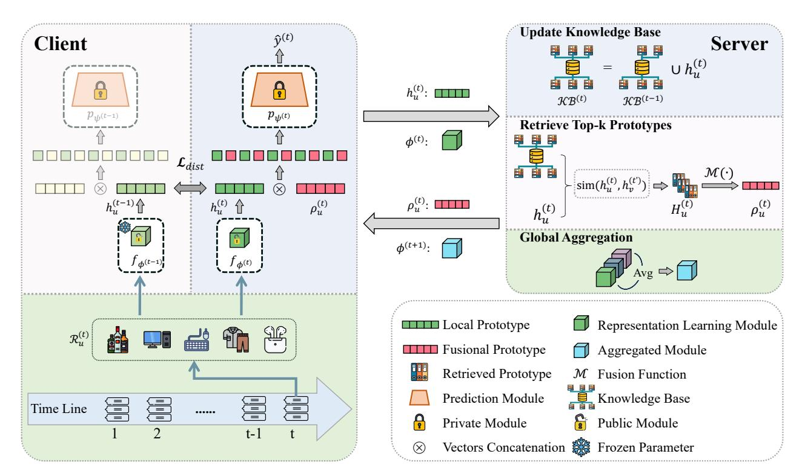
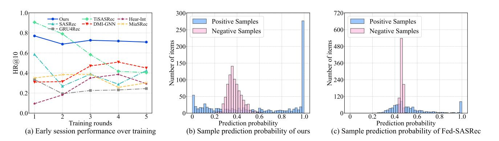
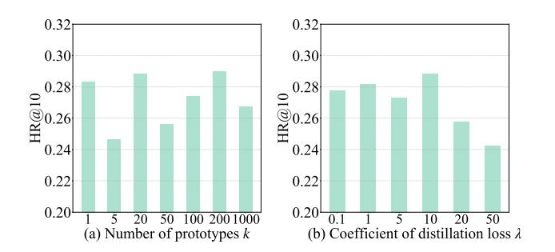
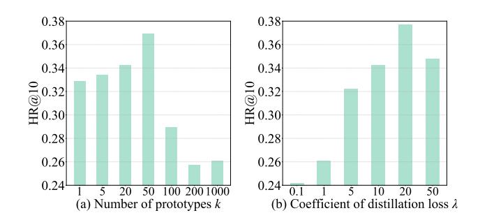
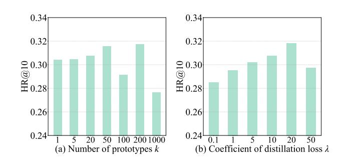
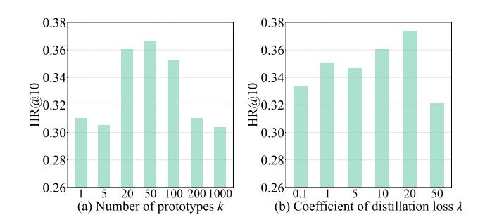
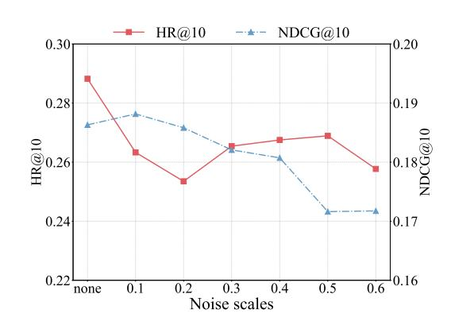
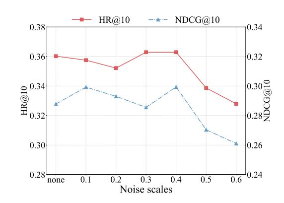
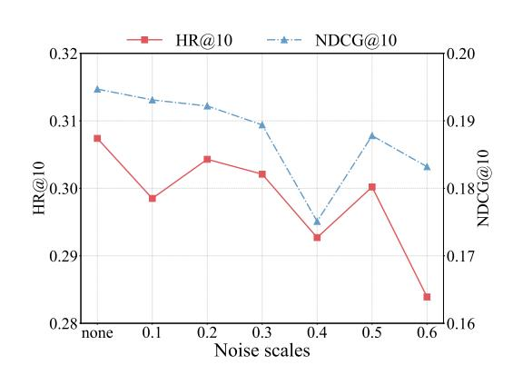
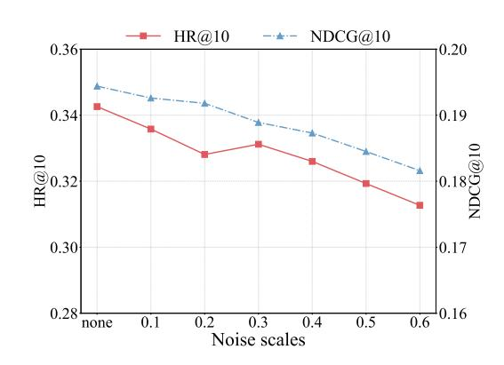

# Learning Evolving Preferences: A Federated Continual Framework for User-Centric Recommendation

Chunxu Zhang∗ College of Computer Science and Technology, Jilin University Key Laboratory of Symbolic Computation and Knowledge Engineering of Ministry of Education, Jilin University Changchun, China PolyU Academy for Artificial Intelligence, Hong Kong Polytechnic University Hong Kong, China zhangchunxu@jlu.edu.cn

Zhiheng Xue∗ College of Computer Science and Technology, Jilin University Key Laboratory of Symbolic Computation and Knowledge Engineering of Ministry of Education, Jilin University Changchun, China xuezh24@mails.jlu.edu.cn

Guodong Long Australian Artificial Intelligence Institute, FEIT, University of Technology Sydney Sydney, Australia Guodong.Long@uts.edu.au

Weipeng Zhang

College of Computer Science and Technology, Jilin University Key Laboratory of Symbolic Computation and Knowledge Engineering of Ministry of Education, Jilin University Changchun, China zhangwp24@mails.jlu.edu.cn

Bo Yang†

College of Computer Science and Technology, Jilin University Key Laboratory of Symbolic Computation and Knowledge Engineering of Ministry of Education, Jilin University Changchun, China ybo@jlu.edu.cn

## Abstract

User-centric recommendation has become essential for delivering personalized services, as it enables systems to adapt to users' evolving behaviors while respecting their long-term preferences and privacy constraints. Although federated learning offers a promising alternative to centralized training, existing approaches largely overlook user behavior dynamics, leading to temporal forgetting and weakened collaborative personalization. In this work, we propose FCUCR, a federated continual recommendation framework designed to support long-term personalization in a privacy-preserving manner. To address temporal forgetting, we introduce a time-aware self-distillation strategy that implicitly retains historical preferences during local model updates. To tackle collaborative personalization under heterogeneous user data, we design an inter-user prototype transfer mechanism that enriches each client's representation using knowledge from similar users while preserving individual decision logic. Extensive experiments on four public benchmarks demonstrate the superior effectiveness of our approach, along with

© 2026 Copyright held by the owner/author(s). ACM ISBN 979-8-4007-2307-0/2026/04 <https://doi.org/10.1145/3774904.3792575>

strong compatibility and practical applicability. Code is available at [https://github.com/Poizoner/code4FCUCR\\_www2026.](https://github.com/Poizoner/code4FCUCR_www2026)

## CCS Concepts

#### • Information systems → Personalization; Recommender systems.

## Keywords

Federated Learning, Recommender systems, Continual Learning

#### ACM Reference Format:

Chunxu Zhang, Zhiheng Xue, Guodong Long, Weipeng Zhang, and Bo Yang. 2026. Learning Evolving Preferences: A Federated Continual Framework for User-Centric Recommendation. In Proceedings of the ACM Web Conference 2026 (WWW '26), April 13–17, 2026, Dubai, United Arab Emirates. ACM, New York, NY, USA, [12](#page-11-0) pages.<https://doi.org/10.1145/3774904.3792575>

## 1 Introduction

Modern recommender systems have become deeply embedded in our daily lives, shaping how users engage and make consumption decisions [\[8,](#page-8-0) [9,](#page-8-1) [15,](#page-8-2) [21\]](#page-8-3). However, existing cloud-based methods rely on periodic retraining using globally collected data. This strategy often fails to capture shifting user preferences in time. As a result, it leads to outdated models, forgetting past behaviors, and insufficient personalization. These limitations call for a user-centric recommendation framework [\[35\]](#page-8-4) that can continually adapt to evolving behaviors while retaining prior preferences, and doing so under resource and privacy constraints.

∗Both authors contributed equally to this research.

†Corresponding author.

[This work is licensed under a Creative Commons Attribution 4.0 International License.](https://creativecommons.org/licenses/by/4.0) WWW '26, Dubai, United Arab Emirates.

Federated Learning (FL) [\[10,](#page-8-5) [23,](#page-8-6) [34\]](#page-8-7) enables decentralized model training without exposing raw data, aligning with user-centric recommendation goals. However, most existing methods [\[29,](#page-8-8) [37,](#page-8-9) [41\]](#page-8-10) assume static user behavior and rely on fixed data snapshots, overlooking the continuous evolution of user preferences and limiting long-term personalization. To address this, Continual Learning (CL) [\[7,](#page-8-11) [28\]](#page-8-12) is needed to support incremental model updates while preserving previously acquired knowledge. Despite its importance, how to achieve continual personalization within federated recommendation remains an open question.

However, developing continual recommendations in federated settings presents two fundamental and tightly intertwined challenges. First, temporal forgetting arises as user behaviors evolve and local models are incrementally updated with limited storage and replay. Without access to complete interaction histories, each client gradually loses historical preference signals, weakening its ability to retain evolving user interests. Second, collaborative personalization becomes challenging because recommendation relies on learning from user relationships, yet the large differences in client data make it hard to combine this information without weakening each user's personalized model. These two challenges are mutually coupled and exacerbate each other, ultimately impairing the system's ability to adapt to users' dynamic interest changes.

To fill the gap, this paper presents a novel Federated Continual framework for User-Centric Recommendation (FCUCR). In the framework, each user acts as a client to learn the local recommendation model, and a centralized server orchestrates the system's collaboration to transmit common knowledge. To solve the temporal forgetting challenge on the client side, we develop a time-aware self-distillation strategy that encourages the local model to align with its own historical models. This implicit temporal regularization enables the model to preserve long-term user interests while continuously adapting to evolving behaviors, without relying on external memory or replay buffers. Furthermore, we design an inter-user prototype transfer mechanism that leverages similar prototypes from a shared latent space to enrich local user representations. Integrated with client-specific decision logic, this mechanism simultaneously fosters more tailored recommendations and enhances collaborative personalization. We summarize the main contributions of this paper as follows:

- We present a novel federated framework tailored for continuous recommendation, capturing evolving user preferences while preserving privacy. It lays the groundwork for building user-centric personalization systems.
- We develop a time-aware self-distillation strategy to mitigate temporal forgetting and preserve long-term user interests. Additionally, we design an inter-user prototype transfer mechanism that bridges knowledge across users, enabling effective collaborative personalization.
- Extensive experiments on four benchmark datasets demonstrate the superior performance of our model compared to the baselines. Further analysis confirms its compatibility and practical applicability.

### 2 Related Work

### 2.1 Continual Recommendation

In real-world applications, users' interests change over time due to various factors such as seasonal trends or shifting personal tastes. To address this limitation, continual recommendation aims to adapt to user behavior shifts [\[36\]](#page-8-13) and learn from new interactions while preserving past knowledge [\[3,](#page-8-14) [12\]](#page-8-15). By incorporating strategies in continual learning, such as replay-based approaches [\[2,](#page-8-16) [5\]](#page-8-17) and regularization-based approaches [\[16,](#page-8-18) [25\]](#page-8-19), continual recommender systems can maintain long-term user preferences while adapting to emerging trends, making them suitable for real-world deployment. These methods have demonstrated effectiveness in sequential [\[13,](#page-8-20) [20\]](#page-8-21) and session-based [\[24\]](#page-8-22) recommendation scenarios. However, existing methods are typically designed under cloud-based settings and rely on storing all user data. Such centralized paradigms overlook the growing need for user-centric solutions and pose serious user privacy leakage risks.

## 2.2 Federated Recommender System

Federated recommender systems [\[27,](#page-8-23) [29,](#page-8-8) [38,](#page-8-24) [41\]](#page-8-10) are designed to train models in a distributed manner without collecting users' private data, which has been widely recognized as an effective approach to preserving user privacy while enabling personalized recommendations. Early works like MetaMF [\[19\]](#page-8-25) and FedMF [\[4\]](#page-8-26) focus on adapting traditional recommendation models to the federated setting, while recent methods such as PFedRec [\[39\]](#page-8-27) and FedRAP [\[17\]](#page-8-28) incorporate client-specific adaptations to enhance personalization modeling. Graph-based methods like FedPerGNN [\[31\]](#page-8-29) and FedSage [\[42\]](#page-8-30) further enable cross-client collaboration via subgraph expansion and aggregation. Despite the progress in federated recommendation, most existing approaches still rely on static user data and lack the ability to adapt to users' evolving preferences over time. Recent work F3CRC [\[18\]](#page-8-31) concentrates on mitigating temporal forgetting under incremental data updates, while neglecting both the streaming nature inherent to practical session-based recommendations and the phenomenon of spatial forgetting across heterogeneous clients. In this paper, we propose a novel federated continuous recommendation framework that captures both temporal continuity and inter-client collaboration. Our method leverages each client's historical behavioral patterns while enabling knowledge sharing across users, thereby enhancing the personalization and adaptability of recommendations in dynamic environments.

## 3 Preliminary

This section provides a formal description of the user-centric federated recommendation framework. Let U represent the set of users in the recommender system, with �� = |U| denoting the total number of users. Under the federated learning framework, each user �� ∈ U operates as a client and learns a recommendation model F�� with personal interaction data R�� preserved on their own device.

The training proceeds in multiple iterative rounds between the centralized server and distributed clients, where each user locally updates the model with personal data and uploads the parameters to the server for aggregation into a global model, which is then redistributed for the next round. We formulate the training procedure

Algorithm 1 Federated Continual Framework for User-Centric

Recommendation

- ServerProcedure: 1: Initialize globally shared representation learning module parameter ��
- (1) 2: Initialize knowledge base KB ← ∅ 3: for each round �� = 1, 2, . . . ,�� do 4: for client �� ∈ U in parallel do 5: ℎ (��) �� ← ClientPrototypeCalculation(��, ��, �� (��) ) 6: Update knowledge base KB(��) with Eq. [\(4\)](#page-2-2) 7: Retrieve top-�� semantically aligned prototypes �� (��) �� for each client �� with Eq. [\(5\)](#page-2-3) 8: Compute fused prototype �� (��) �� for each client �� with Eq. [\(6\)](#page-3-2) 9: end for 10: for client �� ∈ U in parallel do 11: �� (��) �� ← ClientUpdate(��, ��, �� (��) �� ) 12: end for 13: �� (��+1) ← GlobalAgg(�� (��) �� ) 14: end for ClientPrototypeCalculation(��, ��, �� (��) ): 1: Initialize �� with �� (��) 2: Calculate prototype at time step �� with ℎ (��) = ���� (R(��) �� ) 3: Return the ��-th time step prototype ℎ (��) ClientUpdate(��, ��, �� (��) �� ): 1: if �� = 1 then 2: Initialize prediction module parameter �� 3: else 4: Load �� from the last round 5: end if 6: for �� = 1, 2, . . . , �� do 7: Perform prediction on R (��) �� at time step �� using the prototypeenhanced formulation in Eq. [\(7\)](#page-3-3) 8: Update ��,�� with recommendation loss L������ and distillation loss L�������� 9: end for 10: Return representation learning module parameter ��

### 4.4 Discussion on Practical Adaptability

Deployment Versatility. Our framework adopts a modular design that separates recommendation model into representation learning and personalized prediction. This decoupling enables flexible integration with various model backbones, such as different Transformer-based encoders used in our experiments. The temporal forgetting mitigation and collaborative personalization mechanisms are implemented as independent modules, making them easily plugand-play across different federated or continual recommendation setups. Such modularity ensures adaptability to diverse deployment environments with minimal changes to the underlying architecture. Efficiency and Privacy Considerations. The proposed framework is well-positioned for practical deployment, with inherent support for efficiency improvement and privacy protection. The server-side prototype knowledge base facilitates collaborative personalization modeling without requiring the exchange of raw data or full model parameters. To further adapt to real-world deployment

Table 1: Datasets statistics.

| Dataset      | Users | Items   | Sessions | Averaged Length |
|--------------|-------|---------|----------|-----------------|
| XING         | 877   | 29,366  | 6,165    | 15.10           |
| RetailRocket | 391   | 14,051  | 4,183    | 7.93            |
| LastFM       | 940   | 145,469 | 468,297  | 18.50           |
| Tmall        | 1,746 | 123,405 | 12,594   | 37.78           |

environments, the framework allows additional refinement such as constraining the size of the knowledge base and reducing prototype transfer frequency. Meanwhile, it is compatible with mainstream privacy-preserving techniques such as differential privacy and secure aggregation, making it extensible to scenarios with stricter regulatory or infrastructural constraints.

### 5 Experiment

## 5.1 Experimental Setup

Dataset. We evaluate our method on four real-world benchmark datasets: XING[1](#page-4-1) [\[1\]](#page-8-32), RetailRocket[2](#page-4-2) , Tmall[3](#page-4-3) , and LastFM[4](#page-4-4) .

XING and Tmall contain anonymized user-job and user-shopping interactions, respectively. RetailRocket includes six months of ecommerce browsing logs from a Kaggle competition, while LastFM records detailed user listening behavior for music recommendation. For each dataset, we segment users' interaction histories into multiple sessions based on timestamps to simulate a sequential recommendation setting, following the preprocessing procedure of HRNN [\[26\]](#page-8-33) to ensure consistency and fair comparison. Taking the XING dataset as an example, user interactions are segmented into sessions based on a 30-minute inactivity threshold, and interactions labeled as 'DELETE' are removed. The test set is constructed from each user's last session, while the second-to-last session forms the validation set. The remaining sessions comprise the training set. Additionally, items in the test and validation sets that do not appear in the training set are filtered out. All datasets are preprocessed by dividing continuous interaction sequences into sessions using an inactivity threshold, following the standard protocol in sessionbased recommendation [\[11,](#page-8-34) [22,](#page-8-35) [26\]](#page-8-33). Each session thus represents a temporally coherent sequence of user interactions, enabling the construction of session-level recommendation tasks. The statistics of the processed datasets are summarized in Table [1.](#page-4-5)

Baselines. Since there are no existing methods tailored for continual recommendation under the federated setting, we select three state-of-the-art federated recommendation models as baselines. Additionally, we adapt two categories of relevant centralized recommendation approaches to the federated setting, in order to enrich the baseline set and provide a broader evaluation perspective. To distinguish these adapted methods, we prepend 'Fed-' to their names in the experimental tables. The specific methods in each category are as follows:

1<https://www.recsyschallenge.com/2017/#dataset>

2<https://www.kaggle.com/datasets/retailrocket/ecommerce-dataset>

3<https://tianchi.aliyun.com/dataset/42>

4<http://ocelma.net/MusicRecommendationDataset/lastfm-1K.html>

(1) Federated recommendation methods: PFedRec [\[39\]](#page-8-27) incorporates client-specific adaptations to enhance personalization modeling, allowing each client to maintain a personalized model. FedRAP [\[17\]](#page-8-28) learns a global view of items via federated learning while simultaneously maintaining a personalized view locally on each user. GPFedRec [\[40\]](#page-8-36) constructs a user-relation graph on the server from user-specific personalized item embeddings, enabling effective modeling of cross-user relations and improving recommendation accuracy under heterogeneity.

(2) Recent state-of-the-art session-based methods: DMI-GNN [\[22\]](#page-8-35) introduces a multi-interest learning framework into session-based recommendation.The framework is optimized by a multi-position pattern (MPP) learning method and a dynamic multi-interest (DMI) regularization method. HearInt [\[30\]](#page-8-37) designs a Temporal Intent Disentanglement (TID) module and a cross-scale contrastive learning task to capture both short-term and long-term user intents, mitigating mutual interference between them and improving intent representation. MiaSRec [\[6\]](#page-8-38) dynamically constructs multiple session representations centered around each item and selects key features to model user's diverse intents, enabling intent-aware recommendations in session scenarios.

(3) Representative sequential methods: GRU4Rec [\[32\]](#page-8-39) is one of the RNN-based sequential recommendation models. It employs gated recurrent units (GRU) to capture sequential dependencies in user behavior within sessions. SASRec [\[11\]](#page-8-34) adopts a self-attention mechanism to model user behavior sequences, enabling the model to learn both short and long range dependencies. TiSASRec [\[14\]](#page-8-40) extends SASRec by incorporating time intervals and item positions into the attention mechanism, thereby enhancing the model's ability to capture temporal dynamics and position-aware preferences in user interactions.

Implementation details. We adopt two widely used evaluation metrics in recommender systems: Hit Rate (HR@n) and Normalized Discounted Cumulative Gain(NDCG@n) [\[22,](#page-8-35) [33\]](#page-8-41). We implement our proposed method on three representative sequential recommendation backbones. All analytical experiments are conducted on dataset XING using SASRec as the unified backbone architecture to ensure consistency. More implementation details can be found in Appendix A.1.

## 5.2 Overall Comparison

We implement our proposed method on three representative sequential recommendation backbones and compare with three categories of baselines across four benchmark datasets. The results are presented in Table [2.](#page-6-0) The experimental outcomes suggest the following key points:

(1) Our method outperforms existing federated recommendation methods. While existing federated recommendation methods primarily focus on client-side personalization, they often overlook temporal dependencies within each user. This limits their ability to model evolving preferences, which are crucial in continual recommendation tasks. In contrast, our method integrates a time-aware self-distillation strategy that captures temporal signals from past sessions. This enables the model to preserve sequential patterns over time, thereby enhancing its ability to model user dynamics in federated environments.

(2) Our method outperforms session-based recommendation models. Existing session-based methods typically leverage multiple user interests or graph-based modeling to capture local user continual behaviors. However, they lack mechanisms for inter-client collaboration when extended to federated environments, limiting global information sharing. In contrast, our approach incorporates an inter-user prototype transfer mechanism that propagates intent patterns across clients. By leveraging globally consistent behavioral cues beyond local data, each client can refine its representations, resulting in consistently improved performance.

(3) Our method exhibits strong compatibility across diverse backbones. The proposed framework is model-agnostic and can be seamlessly integrated with existing sequential recommendation models. Applied to three representative backbones, it consistently improves performance across all datasets, demonstrating broad applicability and robust adaptability to different architectures.

## 5.3 Component Effectiveness Analysis

We propose a time-aware self-distillation strategy and an inter-user prototype transfer mechanism to address temporal forgetting and enhance collaborative personalization modeling. To comprehensively validate their contributions, we conduct both quantitative (ablation study) and qualitative (visualization-based) analyses.

Ablation results. To assess the individual contributions of key components in our method, we conduct ablation studies by removing each component from FCUCR. As shown in Table [3,](#page-6-1) we observe that removing either the time-aware self-distillation strategy or the inter-user prototype transfer mechanism leads to noticeable performance degradation. These results are attributed to the fact that the former helps preserve long-term user interests by encouraging alignment with historical models, while the latter enhances local representations through collaborative personalization by leveraging similar user prototypes. This highlights the complementary roles of the two components in addressing continual recommendations under federated setting.

Visualization-based interpretations. To gain deeper insights into the roles of the key components beyond numerical results, we conduct visualization-based analyses to better evaluate the effectiveness of these two modules.

We propose the time-aware self-distillation strategy to address the issue of temporal forgetting in continual client recommendation. To evaluate its effectiveness, we assess the model's resistance to forgetting by re-evaluating each client's first session after every communication round. Tracking performance changes on this initial session over time allows us to examine how well the model retains early session preferences throughout training.

To provide an intuitive comparison, we track the performance trajectories of baseline methods with temporal modeling capabilities and our approach by evaluating the initial session throughout training. As shown in Figure [2\(](#page-6-2)a), most baseline methods suffer from performance degradation in early sessions as new sessions accumulate, indicating a tendency toward temporal forgetting. The only exceptions are the graph-based methods DMI-GNN and HearInt, whose use of graph structures allows them to incorporate information from earlier sessions, sometimes leading to gradual improvement in early-session metrics. In contrast, our method consistently

Table 2: Overall performance comparison between our proposed FCUCR and baseline methods. Bold numbers indicate the best results, underlined values represent the second-best, and "\*" marks statistically significant improvements over the backbone baseline (two-sided t-test, �� &lt; 0.05).

| Type Model                | HR@10    | XING NDCG@10 | HR@10    | RetailRocket NDCG@10 | HR@10    | LastFM NDCG@10 | HR@10    | Tmall NDCG@10 |
|---------------------------|----------|--------------|----------|----------------------|----------|----------------|----------|---------------|
| PFedRec Federated         | 0.1852   | 0.0898       | 0.2603   | 0.1706               | 0.1596   | 0.0835         | 0.2669   | 0.1451        |
| FedRAP                    | 0.2013   | 0.1318       | 0.3183   | 0.2198               | 0.2191   | 0.1198         | 0.2411   | 0.1309        |
| GPFedRec                  | 0.1804   | 0.0839       | 0.2303   | 0.1322               | 0.1532   | 0.0777         | 0.2216   | 0.1208        |
| Fed-DMI-GNN Session-based | 0.2561   | 0.1584       | 0.2876   | 0.1983               | 0.3216   | 0.2060         | 0.2068   | 0.1145        |
| Fed-HearInt               | 0.1387   | 0.0708       | 0.2305   | 0.1293               | 0.2404   | 0.1302         | 0.2027   | 0.1182        |
| Fed-MiaSRec               | 0.1692   | 0.0910       | 0.2473   | 0.1439               | 0.2894   | 0.1756         | 0.2451   | 0.1385        |
| Fed-GRU4REC               | 0.1765   | 0.0939       | 0.2392   | 0.1432               | 0.3291   | 0.1918         | 0.2274   | 0.1248        |
| w/ FCUCR                  | 0.2311*  | 0.1563*      | 0.3454*  | 0.2687*              | 0.3362*  | 0.1946*        | 0.2394*  | 0.1420*       |
| Fed-SASRec Sequential     | 0.1800   | 0.0954       | 0.2574   | 0.1527               | 0.3271   | 0.1907         | 0.2898   | 0.1571        |
| w/ FCUCR                  | 0.2882*  | 0.1863*      | 0.3602*  | 0.2879*              | 0.3426*  | 0.1944*        | 0.3074 * | 0.1947 *      |
| Fed-TiSASRec              | 0.2375   | 0.1549       | 0.2608   | 0.1602               | 0.3359   | 0.1964         | 0.2718   | 0.1507        |
| w/ FCUCR                  | 0.2983 * | 0.1891 *     | 0.3750 * | 0.2996 *             | 0.3553 * | 0.2187 *       | 0.2967*  | 0.1593*       |

Table 3: Ablation results by removing two key components from our proposed FCUCR, denoted as w/o TASD (time-aware self-distillation) and w/o IUPR (inter-user prototype transfer) respectively.

| Model    | HR@10  | XING NDCG@10 | HR@10  | RetailRocket NDCG@10 | HR@10  | LastFM NDCG@10 | HR@10  | Tmall NDCG@10 |
|----------|--------|--------------|--------|----------------------|--------|----------------|--------|---------------|
| FCUCR    | 0.2882 | 0.1863       | 0.3602 | 0.2879               | 0.3426 | 0.1944         | 0.3074 | 0.1947        |
| w/o TASD | 0.2731 | 0.1795       | 0.3360 | 0.2590               | 0.3309 | 0.1967         | 0.2926 | 0.1860        |
| w/o IUPR | 0.2556 | 0.1754       | 0.3324 | 0.2692               | 0.3287 | 0.1912         | 0.2520 | 0.1412        |

Figure 2: Component effectiveness analysis on XING dataset.

maintains high accuracy across training rounds, demonstrating strong resistance to temporal forgetting.

To enhance collaborative personalization, we design an interuser prototype transfer mechanism that improves behavior modeling by enriching each client's local features through transferring semantically similar prototypes across clients. Our experiments focus on the implicit recommendation setting, where each interaction is either a positive or negative sample. To evaluate the effectiveness

of the prototype transfer, we analyze the distribution of predicted probabilities on test samples after model convergence. For intuitive comparison, we also present results from the baseline Fed-SASRec without prototype transfer.

As shown in Figure [2\(](#page-6-2)b), by leveraging similar prototypes to enhance local features, our method achieves a clear separation

Figure 3: Effect of two hyper-parameters on model performance (HR@10) on the XING dataset.

between positive and negative samples: most positive samples receive higher prediction probability, and the class distributions become more distinct. In contrast, Figure [2\(](#page-6-2)c) shows that Fed-SASRec without prototype enhancement produces fewer high-confidence positive predictions, with negative probabilities largely clustered around 0.5, reflecting weaker discriminative power. These results demonstrate that the proposed mechanism effectively widens the prediction probability gap between positive and negative samples, resulting in improved recommendation performance.

### 5.4 Hyper-Parameter Analysis

This subsection investigates the impact of two key hyperparameters on model performance.

The number of semantically aligned prototypes ��. To comprehensively evaluate its impact on model performance, we set the values of �� among {1, 5, 20, 100, 200, 1000}. As shown in Figure [3\(](#page-7-0)a), model performance initially improves as �� increases, but starts to decline when �� becomes too large. This trend suggests that a small �� may lead to insufficient auxiliary information, limiting the benefit of prototype transfer. In contrast, overly large �� values can introduce noisy or less relevant prototypes, which may impair model learning. Therefore, a moderate number of transferred prototypes helps strike a better balance between diversity and consistency in collaborative personalization modeling. Full experimental results and detailed analysis for all datasets are provided in the Appendix C. The coefficient of distillation loss ��. We set �� in {0.1, 1, 5, 10, 20, 50} to assess its impact on performance. As shown in Figure [3\(](#page-7-0)b), the best results are achieved when �� = 10. A smaller �� emphasizes adaptability to new data, while a larger �� favors stability by preserving historical knowledge. This confirms that moderate temporal regularization offers a better balance between plasticity and stability. Full experimental results and detailed analysis for all datasets are provided in the Appendix C.

## 5.5 Practical Viability Analysis

Efficiency improvement.As discussed earlier, our proposed FCUCR can be further refined to improve system efficiency. Here, we integrate two lightweight mechanisms to achieve this goal.

(1) Limiting the size of the knowledge base. Instead of retaining all client prototypes across communication rounds, we adopt a sliding-window strategy that retains only the client prototypes from the most recent communication rounds ��. Once the number

of rounds exceeds ��, client prototypes from earlier rounds are discarded and replaced with those from newer ones. As shown in the Appendix D.1 Table [4,](#page-10-0) reducing the size of the prototype knowledge base maintains stable performance and in some cases even improves it, while significantly lowering computational overhead. (2) Reducing the frequency of prototype transfer. We explore the effect of varying the transfer interval, where prototype transfer is performed once every few rounds. Specifically, we set the interval to {1, 2, 3, 4, 5}, indicating the number of rounds between each transfer. As shown in Appendix D.1 Table [5,](#page-10-1) choosing an appropriate interval (e.g., 3) maintains comparable performance while significantly reducing computational overhead (measured as the total cost within each interval divided by the number of rounds it spans). This demonstrates that less frequent transfers can effectively balance recommendation quality and system efficiency.

## 5.6 Privacy considerations.

FCUCR is inherently privacy-friendly, as each client transmits a single session-level representation and representation module parameters without user-identifiable information. This design allows easy integration with privacy-preserving techniques. We apply local differential privacy by injecting Laplacian noise into client parameters, using varying noise scales ������ = {0.1, . . . , 0.6}. These correspond to approximately (��, ��)-LDP with �� = 10−5 and �� ranging from 48.5 (weaker privacy) to 8.1 (stronger privacy), as calculated by the Gaussian mechanism. As shown in Appendix D.2, FCUCR remains robust under different noise levels, maintaining competitive performance while enhancing privacy protection.

## 6 Conclusion

This paper introduces FCUCR, a federated continual recommendation framework that supports long-term personalization in a privacy-preserving manner. Unlike existing methods that rely on static data and overlook the evolving nature of user behavior, FCUCR is explicitly designed to address the dual challenges of temporal forgetting and collaborative personalization in federated settings. By introducing a time-aware self-distillation strategy, the framework enables each client to retain historical preferences without external memory or data replay. Furthermore, the inter-user prototype transfer mechanism allows knowledge sharing across clients while preserving individual decision logic. Extensive experiments on four public datasets demonstrate that FCUCR consistently outperforms existing baselines, providing a robust, efficient, and privacy-aware solution for dynamic user-centric recommendation.

## Acknowledgments

Chunxu Zhang, Zhiheng Xue, Weipeng Zhang and Bo Yang are supported by the National Natural Science Foundation of China under Grant Nos.U22A2098, 62172185, 62206105 and 62202200; the Major Science and Technology Development Plan of Jilin Province under Grant No.20240212003GX, the Major Science and Technology Development Plan of Changchun under Grant No.2024WX05.

### References

[1] Fabian Abel, Yashar Deldjoo, Mehdi Elahi, and Daniel Kohlsdorf. 2017. Recsys challenge 2017: Offline and online evaluation. In Proceedings of the eleventh acm conference on recommender systems. 372–373. [2] Lucas Caccia, Eugene Belilovsky, Massimo Caccia, and Joelle Pineau. 2020. Online learned continual compression with adaptive quantization modules. In International conference on machine learning. PMLR, 1240–1250. [3] Guohao Cai, Jieming Zhu, Quanyu Dai, Zhenhua Dong, Xiuqiang He, Ruiming Tang, and Rui Zhang. 2022. Reloop: A self-correction continual learning loop for recommender systems. In Proceedings of the 45th International ACM SIGIR Conference on Research and Development in Information Retrieval. 2692–2697. [4] Di Chai, Leye Wang, Kai Chen, and Qiang Yang. 2020. Secure federated matrix factorization. IEEE Intelligent Systems 36, 5 (2020), 11–20. [5] Arslan Chaudhry, Ranzato Marc'Aurelio, Marcus Rohrbach, and Mohamed Elhoseiny. 2019. Efficient lifelong learning with A-GEM. In 7th International Conference on Learning Representations, ICLR 2019. International Conference on Learning Representations, ICLR. [6] Minjin Choi, Hye-young Kim, Hyunsouk Cho, and Jongwuk Lee. 2024. Multiintent-aware session-based recommendation. In Proceedings of the 47th international ACM SIGIR conference on research and development in information retrieval. 2532–2536. [7] Matthias De Lange, Rahaf Aljundi, Marc Masana, Sarah Parisot, Xu Jia, Aleš Leonardis, Gregory Slabaugh, and Tinne Tuytelaars. 2021. A continual learning survey: Defying forgetting in classification tasks. IEEE transactions on pattern analysis and machine intelligence 44, 7 (2021), 3366–3385. [8] Yingqiang Ge, Shuchang Liu, Zuohui Fu, Juntao Tan, Zelong Li, Shuyuan Xu, Yunqi Li, Yikun Xian, and Yongfeng Zhang. 2024. A survey on trustworthy recommender systems. ACM Transactions on Recommender Systems 3, 2 (2024), 1–68. [9] Emrul Hasan, Mizanur Rahman, Chen Ding, Jimmy Huang, and Shaina Raza. 2024. Review-based recommender systems: a survey of approaches, challenges and future perspectives. Comput. Surveys (2024). [10] Peter Kairouz, H Brendan McMahan, Brendan Avent, Aurélien Bellet, Mehdi Bennis, Arjun Nitin Bhagoji, Kallista Bonawitz, Zachary Charles, Graham Cormode, Rachel Cummings, et al. 2021. Advances and open problems in federated learning. Foundations and trends® in machine learning 14, 1–2 (2021), 1–210. [11] Wang-Cheng Kang and Julian McAuley. 2018. Self-attentive sequential recommendation. In 2018 IEEE international conference on data mining (ICDM). IEEE, 197–206. [12] Gyuseok Lee, SeongKu Kang, Wonbin Kweon, and Hwanjo Yu. 2024. Continual collaborative distillation for recommender system. In Proceedings of the 30th ACM SIGKDD Conference on Knowledge Discovery and Data Mining. 1495–1505. [13] Gyuseok Lee, Hyunsik Yoo, Junyoung Hwang, SeongKu Kang, and Hwanjo Yu. 2025. Leveraging Historical and Current Interests for Continual Sequential Recommendation. arXiv preprint arXiv:2506.07466 (2025). [14] Jiacheng Li, Yujie Wang, and Julian McAuley. 2020. Time interval aware selfattention for sequential recommendation. In Proceedings of the 13th international conference on web search and data mining. 322–330. [15] Yang Li, Kangbo Liu, Ranjan Satapathy, Suhang Wang, and Erik Cambria. 2024. Recent developments in recommender systems: A survey. IEEE Computational Intelligence Magazine 19, 2 (2024), 78–95. [16] Zhizhong Li and Derek Hoiem. 2017. Learning without forgetting. IEEE transactions on pattern analysis and machine intelligence 40, 12 (2017), 2935–2947. [17] Z Li, G Long, and T Zhou. 2024. Federated Recommendation with Additive Personalization. In The Twelfth International Conference on Learning Representations. [18] Jaehyung Lim, Wonbin Kweon, Woojoo Kim, Junyoung Kim, Seongjin Choi, Dongha Kim, and Hwanjo Yu. 2025. Federated Continual Recommendation. In Proceedings of the 34th ACM International Conference on Information and Knowledge Management. 1798–1808. [19] Yujie Lin, Pengjie Ren, Zhumin Chen, Zhaochun Ren, Dongxiao Yu, Jun Ma, Maarten de Rijke, and Xiuzhen Cheng. 2020. Meta matrix factorization for federated rating predictions. In Proceedings of the 43rd International ACM SIGIR Conference on Research and Development in Information Retrieval. 981–990. [20] Langming Liu, Liu Cai, Chi Zhang, Xiangyu Zhao, Jingtong Gao, Wanyu Wang, Yifu Lv, Wenqi Fan, Yiqi Wang, Ming He, et al. 2023. Linrec: Linear attention mechanism for long-term sequential recommender systems. In Proceedings of the 46th International ACM SIGIR Conference on Research and Development in Information Retrieval. 289–299. [21] Qidong Liu, Jiaxi Hu, Yutian Xiao, Xiangyu Zhao, Jingtong Gao, Wanyu Wang, Qing Li, and Jiliang Tang. 2024. Multimodal recommender systems: A survey. Comput. Surveys 57, 2 (2024), 1–17. [22] Mingyang Lv, Xiangfeng Liu, and Yuanbo Xu. 2025. Dynamic Multi-Interest Graph Neural Network for Session-Based Recommendation. In Proceedings of the AAAI Conference on Artificial Intelligence, Vol. 39. 12328–12336. [23] Brendan McMahan, Eider Moore, Daniel Ramage, Seth Hampson, and Blaise Aguera y Arcas. 2017. Communication-efficient learning of deep networks from decentralized data. In Artificial intelligence and statistics. PMLR, 1273–1282. [24] Fei Mi, Xiaoyu Lin, and Boi Faltings. 2020. Ader: Adaptively distilled exemplar replay towards continual learning for session-based recommendation. In Proceedings of the 14th ACM Conference on Recommender Systems. 408–413. [25] Cuong V Nguyen, Yingzhen Li, Thang D Bui, and Richard E Turner. 2018. Variational Continual Learning. In International Conference on Learning Representations. [26] Massimo Quadrana, Alexandros Karatzoglou, Balázs Hidasi, and Paolo Cremonesi. 2017. Personalizing session-based recommendations with hierarchical recurrent neural networks. In proceedings of the Eleventh ACM Conference on Recommender Systems. 130–137. [27] Zehua Sun, Yonghui Xu, Yong Liu, Wei He, Lanju Kong, Fangzhao Wu, Yali Jiang, and Lizhen Cui. 2024. A survey on federated recommendation systems. IEEE Transactions on Neural Networks and Learning Systems 36, 1 (2024), 6–20. [28] Liyuan Wang, Xingxing Zhang, Hang Su, and Jun Zhu. 2024. A comprehensive survey of continual learning: Theory, method and application. IEEE transactions on pattern analysis and machine intelligence 46, 8 (2024), 5362–5383. [29] Lingyun Wang, Hanlin Zhou, Yinwei Bao, Xiaoran Yan, Guojiang Shen, and Xiangjie Kong. 2024. Horizontal federated recommender system: A survey. Comput. Surveys 56, 9 (2024), 1–42. [30] Xiao Wang, Tingting Dai, Qiao Liu, and Shuang Liang. 2024. Spatial-temporal perceiving: deciphering user hierarchical intent in session-based recommendation. In Proceedings of the Thirty-Third International Joint Conference on Artificial Intelligence. 2415–2423. [31] Chuhan Wu, Fangzhao Wu, Lingjuan Lyu, Tao Qi, Yongfeng Huang, and Xing Xie. 2022. A federated graph neural network framework for privacy-preserving personalization. Nature Communications 13, 1 (2022), 3091. [32] Shu Wu, Yuyuan Tang, Yanqiao Zhu, Liang Wang, Xing Xie, and Tieniu Tan. 2019. Session-based recommendation with graph neural networks. In Proceedings of the AAAI conference on artificial intelligence, Vol. 33. 346–353. [33] Xu Xie, Fei Sun, Zhaoyang Liu, Shiwen Wu, Jinyang Gao, Jiandong Zhang, Bolin Ding, and Bin Cui. 2022. Contrastive learning for sequential recommendation. In 2022 IEEE 38th international conference on data engineering (ICDE). IEEE, 1259– 1273. [34] Qiang Yang, Yang Liu, Tianjian Chen, and Yongxin Tong. 2019. Federated machine learning: Concept and applications. ACM Transactions on Intelligent Systems and Technology (TIST) 10, 2 (2019), 1–19. [35] Hongzhi Yin, Liang Qu, Tong Chen, Wei Yuan, Ruiqi Zheng, Jing Long, Xin Xia, Yuhui Shi, and Chengqi Zhang. 2024. On-device recommender systems: A comprehensive survey. arXiv preprint arXiv:2401.11441 (2024). [36] Hyunsik Yoo, SeongKu Kang, and Hanghang Tong. 2025. Continual Recommender Systems. arXiv preprint arXiv:2507.03861 (2025). [37] Chunxu Zhang, Guodong Long, Hongkuan Guo, Zhaojie Liu, Guorui Zhou, Zijian Zhang, Yang Liu, and Bo Yang. 2025. Multifaceted user modeling in recommendation: A federated foundation models approach. In Proceedings of the AAAI Conference on Artificial Intelligence, Vol. 39. 13197–13205. [38] Chunxu Zhang, Guodong Long, Zijian Zhang, Zhiwei Li, Honglei Zhang, Qiang Yang, and Bo Yang. 2025. Personalized recommendation models in federated settings: A survey. IEEE Transactions on Knowledge and Data Engineering (2025). [39] Chunxu Zhang, Guodong Long, Tianyi Zhou, Peng Yan, Zijian Zhang, Chengqi Zhang, and Bo Yang. 2023. Dual personalization on federated recommendation. In Proceedings of the Thirty-Second International Joint Conference on Artificial Intelligence. 4558–4566. [40] Chunxu Zhang, Guodong Long, Tianyi Zhou, Zijian Zhang, Peng Yan, and Bo Yang. 2024. Gpfedrec: Graph-guided personalization for federated recommendation. In Proceedings of the 30th ACM SIGKDD Conference on Knowledge Discovery and Data Mining. 4131–4142. [41] Chunxu Zhang, Guodong Long, Tianyi Zhou, Zijian Zhang, Peng Yan, and Bo Yang. 2024. When federated recommendation meets cold-start problem: Separating item attributes and user interactions. In Proceedings of the ACM Web Conference 2024. 3632–3642. [42] Ke Zhang, Carl Yang, Xiaoxiao Li, Lichao Sun, and Siu Ming Yiu. 2021. Subgraph federated learning with missing neighbor generation. Advances in neural information processing systems 34 (2021), 6671–6682. A Experimental Setup A.1 More Details about Implementation We adopt two widely used evaluation metrics in recommender systems: Hit Rate (HR@n) and Normalized Discounted Cumulative Gain(NDCG@n) [\[22,](#page-8-35) [33\]](#page-8-41). These metrics assess both the accuracy and the ranking quality of the recommendations, reflecting how well the model can surface target items among the top-n positions.

In this work, we fix n=10 for evaluation across all experiments.

Figure 5: Effect of two hyper-parameters on model performance (HR@10) on the LastFM dataset.

Figure 6: Effect of two hyper-parameters on model performance (HR@10) on the Tmall dataset.

Figure 4: Effect of two hyper-parameters on model performance (HR@10) on the RetailRocket dataset.

We implement our proposed method on three representative sequential recommendation backbones. To ensure consistency in the analytical experiments, SASRec is adopted as the unified backbone architecture and evaluated on XING dataset. We adapt two categories of representative centralized recommendation approaches to a federated setting by applying the standard FedAvg algorithm, ensuring a fair comparison under distributed learning conditions. For graph-based models in the second category, each client constructs a local subgraph using only its own interaction data, adhering to the privacy constraints and data isolation principles inherent in FL.

The model involves several key hyperparameters, including the learning rate, embedding size, number of local training epochs, total communication rounds, etc. We tune key hyperparameters such as the learning rate and embedding size based on validation performance to ensure optimal model behavior. Specifically, we use the Adam optimizer with a learning rate of 0.1 and set the embedding size to 50. The number of local training epochs is fixed to 4 per communication round and the total number of communication rounds is limited to 40, with an early stopping strategy triggered if no improvement is observed for 5 consecutive rounds. Empirical results show that the model converges reliably under these settings.

Experiments are conducted using six NVIDIA A800 GPUs and three NVIDIA RTX 3090 GPUs with PyTorch 2.4.0 + cu115. All results are averaged over five independent runs to ensure robustness.

### B Code Availability

The implementation of our proposed method is publicly available to ensure reproducibility and facilitate further research. All relevant code files and running instructions are accessible at the repository: [https://github.com/Poizoner/code4FCUCR\\_www2026.](https://github.com/Poizoner/code4FCUCR_www2026) Please refer to the README file in the repository for details on environment setup and result reproduction.

## C Hyper-Parameter Analysis

To complement the main text in Section 5.4, we provide a detailed analysis of the impact of two key hyperparameters �� and �� on the remaining datasets.

The number of semantically aligned prototypes ��. We vary �� among {1, 5, 20, 100, 200, 1000} to evaluate its influence on model performance across RetailRocket, LastFM, and Tmall. Figures [4\(](#page-9-0)a) to [6\(](#page-9-1)a) show consistent yet dataset-specific trends. While all datasets exhibit the same non-monotonic pattern as in the XING dataset performance. But there are subtle differences in the turning points. For instance, the optimal �� for RetailRocket and LastFM occurs at smaller values (around 20–50), whereas Tmall benefits from a slightly larger �� (around 200). This suggests that datasets with higher user diversity tend to favor a broader prototype set, reflecting the trade-off between representational diversity and overfitting risk. The coefficient of distillation loss ��. We further analyze �� ∈ {0.1, 1, 5, 10, 20, 50} to assess its influence on performance stability. As shown in Figures [4\(](#page-9-0)b) to [6\(](#page-9-1)b), the optimal �� values across datasets consistently fall within the range of 10–20, aligning with the findings on the XING dataset in the main text. However, the sensitivity to �� varies across datasets. Tmall shows a more gradual performance drop as �� increases, while RetailRocket exhibits a sharper decline when �� &gt; 20. These observations imply that datasets with more dynamic user behavior may require stronger temporal regularization to stabilize the learning process.

## D Results of Practical Viability Analysis

## D.1 Efficiency Improvement

To complement the analysis presented in Section 5.5, we further evaluate the proposed efficiency refinement mechanisms on the remaining three datasets, including RetailRocket, LastFM, and Tmall. (1) Limiting the size of the knowledge base.

We apply the same sliding-window strategy described in the main text, where only client prototypes from the most recent ��

Table 4: Model performance and time cost under various knowledge base sizes on other datasets.

| Dataset Metric       | Recent 1 round | Recent 2 round | Recent 3 round | Recent 5 round | All round |
|----------------------|----------------|----------------|----------------|----------------|-----------|
| HR@10                | 0.2528         | 0.2857         | 0.2801         | 0.2829         | 0.2882    |
| NDCG@10 XING         | 0.1696         | 0.1985         | 0.1949         | 0.1858         | 0.1863    |
| Time per round       | 622s           | 640s           | 649s           | 668s           | 672s      |
| HR@10                | 0.3360         | 0.3427         | 0.3817         | 0.3737         | 0.3602    |
| NDCG@10 RetailRocket | 0.2767         | 0.2744         | 0.2974         | 0.2936         | 0.2879    |
| Time per round       | 41s            | 44s            | 48s            | 50s            | 62s       |
| HR@10                | 0.2894         | 0.3383         | 0.3596         | 0.3777         | 0.3426    |
| NDCG@10 LastFM       | 0.1723         | 0.2102         | 0.2213         | 0.2397         | 0.1944    |
| Time per round       | 41min          | 44min          | 48min          | 52min          | 1h8min    |
| HR@10                | 0.2921         | 0.3144         | 0.2961         | 0.3007         | 0.3074    |
| NDCG@10 Tmall        | 0.1821         | 0.2034         | 0.1883         | 0.1931         | 0.1947    |
| Time per round       | 1h30min        | 1h41min        | 1h48min        | 1h52min        | 2h13min   |

Table 5: Model performance and time cost under various prototype transfer frequencies on other datasets.

| Dataset Metric          | Interval=1 | Interval=2 | Interval=3 | Interval=4 | Interval=5 |
|-------------------------|------------|------------|------------|------------|------------|
| HR@10                   | 0.2882     | 0.2563     | 0.2689     | 0.2423     | 0.2493     |
| NDCG@10 XING            | 0.1863     | 0.1786     | 0.1844     | 0.1936     | 0.2031     |
| Averaged time per round | 672s       | 643s       | 634s       | 619s       | 598s       |
| HR@10                   | 0.3602     | 0.3562     | 0.3360     | 0.3199     | 0.3118     |
| NDCG@10 RetailRocket    | 0.2879     | 0.2781     | 0.2654     | 0.2648     | 0.2524     |
| Averaged time per round | 62s        | 58s        | 54s        | 48s        | 40s        |
| HR@10                   | 0.3426     | 0.3121     | 0.2867     | 0.2731     | 0.2658     |
| NDCG@10 LastFM          | 0.1944     | 0.1890     | 0.1838     | 0.1782     | 0.1825     |
| Averaged time per round | 1h8min     | 1h3min     | 0h50min    | 0h48min    | 0h46min    |
| HR@10                   | 0.3074     | 0.3008     | 0.2965     | 0.2889     | 0.2915     |
| NDCG@10 Tmall           | 0.1947     | 0.1921     | 0.1884     | 0.1850     | 0.1873     |
| Averaged time per round | 2h13min    | 1h58min    | 1h42min    | 1h30min    | 1h19min    |

Figure 7: Performance of integrating LDP into our FCUCR on XING dataset.

Figure 8: Performance of integrating LDP into our FCUCR on RetailRocket dataset.

communication rounds are retained. As shown in Table [4,](#page-10-0) model performance remains stable even when the knowledge base size is substantially reduced. In LastFM dataset, moderate window sizes yield slightly better performance, suggesting that pruning outdated

Figure 10: Performance of integrating LDP into our FCUCR on Tmall dataset.

Figure 9: Performance of integrating LDP into our FCUCR on LastFM dataset.

prototypes can effectively mitigate noise accumulation and enhance prototype relevance.

### (2) Reducing the frequency of prototype transfer.

To validate the generality of the findings reported, table [5](#page-10-1) confirm that the same trend holds: increasing the transfer interval within a moderate range preserves model performance while notably reducing communication and computation overhead. This consistency across datasets substantiates the robustness and scalability of the proposed mechanism.

## D.2 Privacy Considerations

To complement the main results reported in Section 5.6, we further evaluate the privacy robustness of our FCUCR on all datasets. Following the same local differential privacy (LDP) setup as in the main text, we inject Laplacian noise with different standard deviations (������ = {0.1, . . . , 0.6}) into client parameters before aggregation. As illustrated in Figure [7](#page-10-2) to Figure [10,](#page-11-1) the performance degradation under increasing noise levels remains moderate across all datasets. In particular, when ������ ≤ 0.3, FCUCR maintains more than 95% of its original accuracy while ensuring a reasonable privacy guarantee. These consistent trends across datasets verify that our framework achieves a robust trade-off between privacy preservation and recommendation quality.