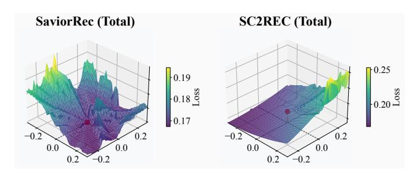
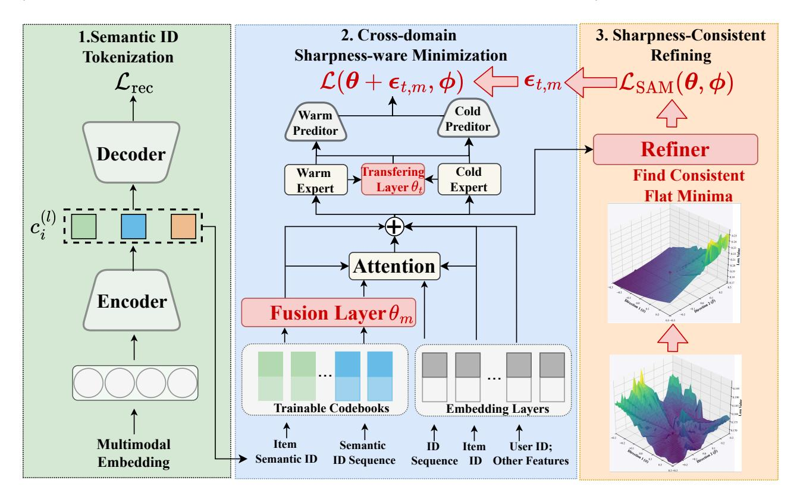
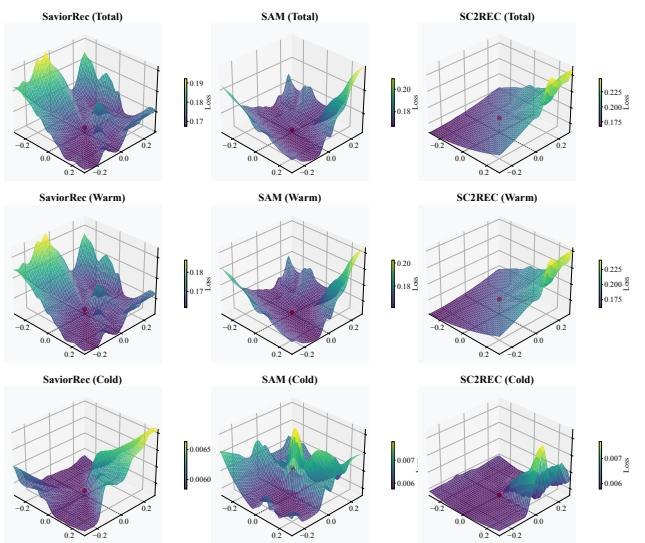
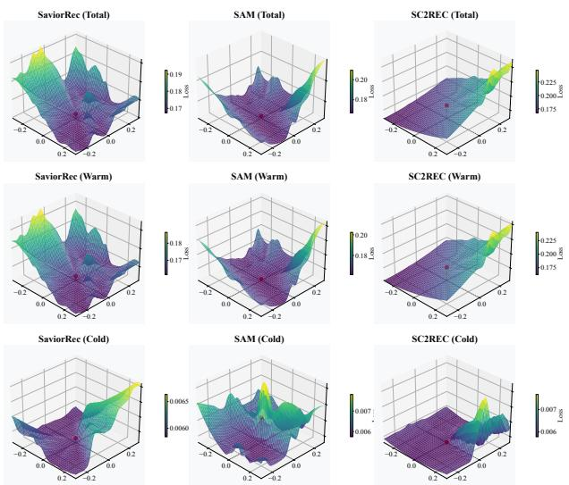
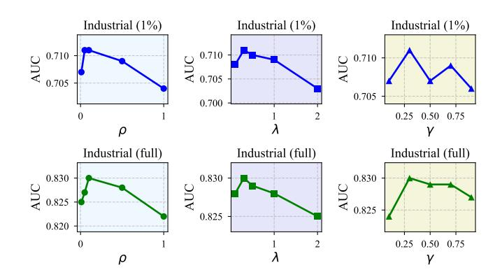

# Sharpness-Consistent Cross-Domain Recommendation for Cold-Start Items

Ke Fei

q191106702@gmail.com

University of Electronic Science and Technology of China Chengdu, Sichuan, China

Jingjing Li∗

lijin117@yeah.net

University of Electronic Science and Technology of China Chengdu, Sichuan, China Yangtze Delta Region Institute (Huzhou), University of Electronic Science and Technology of China, Huzhou, Zhejiang, China

Zhekai Du

dzk1996411@163.com

University of Electronic Science and Technology of China Chengdu, Sichuan, China

Hongbo Chen

jayus8643@gmail.com

University of Electronic Science and Technology of China Chengdu, Sichuan, China

# Abstract

Cold-start remains a fundamental challenge in recommendation systems due to the scarcity of interaction data. Recent methods address this issue by leveraging semantic ID embeddings and cross-domain transfer techniques, achieving notable progress. However, the common practice of learning semantic ID embeddings and training the recommendation model in separate stages hinders the generalization capability of semantic IDs throughout the training process. In this work, we propose Sharpness-Consistent Cross-Domain Recommendation (SC2Rec), a novel framework designed to enhance the generalization of semantic ID-based models in cold-start scenarios. SC2Rec alternately optimizes the sharpness of the loss landscape and enforces landscape consistency between warm and cold domains, leading to unified and flatter minima and improved generalization. Extensive experiments on industrial datasets demonstrate the effectiveness of SC2Rec. Furthermore, we release a highquality dataset to facilitate further research in this area.

# CCS Concepts

### • Information systems → Recommender systems.

# Keywords

Recommender Systems; Cold-Start; Cross-Domain Recommendation

### ACM Reference Format:

Ke Fei, Jingjing Li, Zhekai Du, and Hongbo Chen. 2026. Sharpness-Consistent Cross-Domain Recommendation for Cold-Start Items. In Proceedings of the ACM Web Conference 2026 (WWW '26), April 13–17, 2026, Dubai, United Arab Emirates. ACM, New York, NY, USA, [9](#page-8-0) pages. [https://doi.org/10.1145/](https://doi.org/10.1145/3774904.3792576) [3774904.3792576](https://doi.org/10.1145/3774904.3792576)

∗Corresponding Author

[This work is licensed under a Creative Commons Attribution-NonCommercial-](https://creativecommons.org/licenses/by-nc-nd/4.0)[NoDerivatives 4.0 International License.](https://creativecommons.org/licenses/by-nc-nd/4.0)

WWW '26, Dubai, United Arab Emirates © 2026 Copyright held by the owner/author(s).

ACM ISBN 979-8-4007-2307-0/2026/04 <https://doi.org/10.1145/3774904.3792576>

# 1 Introduction

The ever-expanding digital landscape has made Recommender Systems (RS) central to guiding users toward relevant content. A persistent challenge, especially for industrial deployment, is the cold-start item problem—where newly introduced items lack sufficient interaction data, hampering effective personalization [\[37\]](#page-8-1). Cross-domain recommendation (CDR) offers a potential remedy by transferring knowledge from data-rich (warm) domains to data-sparse (cold) domains [\[3,](#page-8-2) [36\]](#page-8-3). Classical CDR approaches have explored featureor embedding-level transfer, notably through adversarial alignment methods [\[28,](#page-8-4) [29\]](#page-8-5). These techniques align feature distributions between domains, thereby enhancing the transferability of both sparse (e.g., user or item attributes) and dense (e.g., semantic embeddings) features. However, while distributional alignment can reduce domain discrepancies, it fails to transfer collaborative filtering signals, as traditional ID embeddings are unique and inherently non-transferable.

Recently, large language models (LLMs) and multimodal encoders have been leveraged to distill items into semantic ID codes via vector quantization [\[10,](#page-8-6) [26\]](#page-8-7). These semantic ID codes preserve both collaborative memorization ability and representational transferability, leading to substantial improvements in cold item recommendation.

Despite these advances, prevailing industrial RS systems typically adopt decoupled pipelines: semantic ID encoders are trained independently of real-time ranking modules for scalability, resulting in increasing misalignment between semantic ID features and evolving user behavior patterns. SaviorRec [\[33\]](#page-8-8) partially addresses this gap by making codebooks learnable within the ranking model, yet continual adaptation risks overfitting to the dominant (warm) domain, diminishing generalization to cold items—as confirmed by pronounced sharp minima in their loss landscape (Figure [1\)](#page-1-0).

Loss sharpness has emerged as a crucial factor in model generalization: sharp optima indicate parameter sensitivity to small perturbations, often linked to poor transferability [\[6,](#page-8-9) [9\]](#page-8-10). While sharpness-aware minimization (SAM) [\[7,](#page-8-11) [35\]](#page-8-12) can regularize towards flatter minima, naïvely combining warm and cold losses is suboptimal; warm-domain data dominates sharpness regularization, leaving cold-domain parameters insufficiently regularized. Our key

Figure 1: Loss landscape visualization. We adopt the visualization technique from Li et al. [\[16\]](#page-8-13), which perturbs model parameters along two randomly selected directions to generate a three-dimensional loss surface.

insight is that effective cross-domain transfer not only requires flat minima for each domain, but also consistency in loss landscape geometry across domains for shared parameters—otherwise, the model may occupy a region that generalizes well in one domain but remains brittle in the other.

To overcome this limitation, we propose Sharpness-Consistent Cross-Domain Recommendation (SC2Rec), a unified framework that alleviates domain overfitting by explicitly promoting flat, consistent minima in the loss landscape for both warm and cold domains. Specifically, SC2Rec applies sharpness-aware minimization to key transferable parameters within the cross-domain model and introduces a refiner network that directly enforces landscape flatness in both domains, fostering balanced generalization and improved cross-domain transfer. Our main contributions are summarized as follows:

- We propose SC2Rec, a framework that jointly optimizes for flat and consistent loss landscapes across domains to tackle cold-start recommendation.
- We release a novel benchmark dataset with over 500 realworld features and semantic IDs.
- Extensive experiments validate our method, showing significant AUC improvements of 1.51% and 0.61% on industrial datasets.

### 2 Related Work

### 2.1 Cross-Domain Recommendation

Cross-domain recommendation (CDR) mitigates data sparsity by transferring knowledge from a data-rich auxiliary domain. Early models like CoNet [\[11\]](#page-8-14) and SARNET [\[24\]](#page-8-15) rely on overlapping users or items to facilitate knowledge transfer through shared parameters. However, their effectiveness is limited in practical cold-start scenarios where such overlap is scarce [\[40\]](#page-8-16).

To address limited overlap, feature-based alignment methods such as RecSys-DAN [\[29\]](#page-8-5) and AA [\[28\]](#page-8-4) employ adversarial learning to align feature distributions across domains. While promoting domain invariance, these methods often underutilize personalized ID information, potentially harming recommendation accuracy.

The rise of LLMs and multimodal learning has shifted focus to semantic item representations. MoRec [\[34\]](#page-8-17) and Recformer [\[17\]](#page-8-18) create universal encodings from multimodal or textual data, improving

generalizability at the risk of homogenized recommendations. Subsequent works like VQ-Rec [\[10\]](#page-8-6) introduce discrete semantic IDs to better balance generalization with the memorization of collaborative patterns.

In practice, the decoupling of embedding and ranking pipelines for scalability introduces temporal misalignment, degrading coldstart performance. SaviorRec [\[33\]](#page-8-8) addresses this with a learnable codebook but risks overfitting to the warm domain over time.

In summary, prior work highlights a core trade-off: balancing generalization for cold items with strong personalized memorization. This underscores the need for frameworks that achieve robust feature alignment while adapting to dynamic user behavior.

### 2.2 Sharpness-aware Minimization (SAM) in Recommendation

Recent advances in domain generalization emphasize the impact of the loss landscape's geometry—specifically, solution sharpness—on model generalization [\[4,](#page-8-19) [6,](#page-8-9) [9\]](#page-8-10). Sharpness-Aware Minimization (SAM) introduces an explicit penalty for loss sharpness during optimization, guiding models toward flatter minima associated with improved out-of-distribution robustness [\[7\]](#page-8-11).

Subsequent research has investigated SAM's theoretical foundations, analyzing generalization bounds, convergence [\[22,](#page-8-20) [31\]](#page-8-21), and computational strategies [\[5,](#page-8-22) [19,](#page-8-23) [21\]](#page-8-24). In recommendation contexts, SAM has been applied to sequential models [\[14\]](#page-8-25), graph-based approaches [\[2\]](#page-8-26), and cold user recommendation [\[35\]](#page-8-12). Most relevant work SCDR [\[35\]](#page-8-12) employs SAM to user representations in matrix factorization frameworks [\[13\]](#page-8-27). However, these approaches focus on intra-domain scenarios and do not fully address sharpness discrepancies between domains—particularly in deep neural networks utilizing semantic IDs.

In our work, we pioneer the integration of sharpness-aware minimization with deep neural ranking models for semantic cold item recommendation. By enforcing sharpness consistency across warm and cold domains, our framework continually optimizes transferable parameters and semantic ID representations. This directly addresses the generalization decline induced by ongoing adaptation to behavior-rich warm domain data, establishing a principled pathway for robust cross-domain transfer.

### 3 Methodology

# 3.1 Problem Definition

The cold-start item problem in recommender systems refers to the challenge of making accurate recommendations for items (or users) with limited or no historical interaction data. Formally, let ����,�� denote the concatenation of sparse and dense feature embeddings representing a user-item pair. We define the source domain Dwarm as the collection of abundant user-item interactions, while the target domain Dcold consists of new items with scarce interaction data. In our business scenario, items with fewer than 30 page views (pv) are considered cold items. Our objective is to leverage the abundant data in the warm domain to enhance Click-Through Rate (CTR) estimation accuracy for cold items. Let D = Dwarm ∪ Dcold denote the entire training set, and |D | its size.

|           | Method | Warm AUC | Industrial Cold AUC | (1%) Warm | LL Cold LL | Warm AUC | Industrial Cold AUC | (Full) Warm | LL Cold LL |
|-----------|--------|----------|---------------------|-----------|------------|----------|---------------------|-------------|------------|
| Shbot     | [1]    | 0.6787   | 0.6946              | 0.1631    | 0.1234     | 0.7942   | 0.8193              | 0.1719      | 0.1332     |
| MMOE      | [20]   | 0.6765   | 0.6929              | 0.1627    | 0.1239     | 0.7946   | 0.8195              | 0.1716      | 0.1330     |
| STAR      | [25]   | 0.6788   | 0.6906              | 0.1626    | 0.1240     | 0.7938   | 0.8156              | 0.1721      | 0.1336     |
| SARNet    | [24]   | 0.6789   | 0.6938              | 0.1631    | 0.1235     | 0.7939   | 0.8188              | 0.1721      | 0.1327     |
| Hamur     | [18]   | 0.6792   | 0.6957              | 0.1627    | 0.1224     | 0.7942   | 0.8207              | 0.1717      | 0.1314     |
| DAA       | [27]   | 0.6771   | 0.6627              | 0.1635    | 0.1274     | 0.7804   | 0.8028              | 0.1767      | 0.1364     |
| Diff-MSR  | [30]   | 0.6769   | 0.6762              | 0.1636    | 0.1251     | 0.7919   | 0.8012              | 0.1726      | 0.1351     |
| SaviorRec | [33]   | 0.6751   | 0.6948              | 0.1627    | 0.1226     | 0.7901   | 0.8198              | 0.1725      | 0.1316     |
| SCDR      | [35]   | 0.6794   | 0.6999              | 0.1628    | 0.1220     | 0.7944   | 0.8249              | 0.1715      | 0.1310     |
| SC        | 2 Rec  | 0.6807*  | 0.7105*             | 0.1621*   | 0.1214*    | 0.7949*  | 0.8299*             | 0.1711*     | 0.1304*    |

Figure 3: Loss landscape visualization. We adopt the visualization technique from Li et al. [\[16\]](#page-8-13), which perturbs model parameters along two randomly selected directions to generate a three-dimensional loss surface.

where �� is balancing ratio, and �� and �� denote the backbone and Refiner parameters, respectively. Here, �� (��, ��) encourages alignment of loss landscape sharpness between the warm and cold domains.

During Refiner training, we update only the Refiner parameters �� while keeping the backbone parameters �� fixed. This scheme ensures that the Refiner consistently guides the warm domain toward flat minima—thus enhancing generalization—while maintaining high fidelity between the generated soft labels and the true labels. The complete training procedure is detailed in Algorithm [1.](#page-4-3)

### 4 Experiment

# 4.1 Dataset

To address the critical scarcity of realistic, semantic ID enriched datasets for cold-start industrial recommendation scenarios [\[37\]](#page-8-1), we publicly release a large-scale benchmark dataset derived from one of the world's largest social media platforms. Our benchmark focuses on recommending truly new items—specifically, content such as articles and images with fewer than 30 page views, a threshold adopted from platform production practices to indicate cold-start status.

The dataset is temporally partitioned, using the interactions from three consecutive days for training and the following day for testing. For public accessibility and privacy, 1% of daily data instances are sampled; stratified sampling is performed to preserve the original distribution of key attributes, and results are reported for both the sampled and complete data. We construct both a warm domain (frequent user-item interactions) and a cold domain (new items with fewer than 30 page views), each drawn from the same platform. A key feature of our dataset is the provision of semantic ID codes for all items and user behavioral sequences. These codes are

Table 2: Dataset statistics.

| Dataset     | Industrial | (1%)  | Industrial | (Full) |
|-------------|------------|-------|------------|--------|
| Domains     | Warm       | Cold  | Warm       | Cold   |
| Impressions | 8.93M      | 0.41M | 900M       | 42M    |
| Clicks      | 0.36M      | 10.8K | 36M        | 1.1M   |

generated in two stages: (1) large language models (LLMs), such as CLIP and GPT, which are finetuned on our dataset to produce multimodal item embeddings, and (2) a Residual Quantized Variational Autoencoder (RQ-VAE), which is subsequently trained to generate compact semantic IDs and sequence codes. By offering real-world cold-start splits, comprehensive semantic ID codes, and 500+ sparse and dense features, our dataset enables new directions in semantic ID-based, cross-domain, and cold-start recommendation research. Table [2](#page-5-0) shows the data statistics.

### 4.2 Baselines

We compare our proposed method against nine representative baselines encompassing parameter sharing, transfer learning, and attention-based approaches, all pertinent to cross-domain and coldstart recommendation. For a fair comparison within our semantic ID-based recommendation framework, we adapt each baseline to utilize semantic ID representations as input features. This unified protocol enables systematic assessment of each cross-domain method's efficiency under consistent conditions.

- Shared Bottom (Shbot) [\[1\]](#page-8-29). Shbot employs a shared feature extraction layer across all domains and tasks, facilitating knowledge transfer. Independent task-specific prediction towers are subsequently applied to each domain.
- MMOE [\[20\]](#page-8-30). MMOE incorporates multiple shared expert subnetworks with task-specific gating mechanisms that dynamically select experts for each domain, enhancing crossdomain transfer while mitigating negative transfer.
- STAR [\[25\]](#page-8-31). STAR combines shared networks for extracting general domain information with domain-specific subnetworks that use partition normalization to capture distinctive features.
- SARNet[\[24\]](#page-8-15). SARNet integrates scenario-specific and scenarioshared expert layers, augmented by an attention mechanism, to enable effective cross-domain knowledge transfer and adaptive feature extraction.
- Hamur [\[18\]](#page-8-32). Hamur introduces a weight generator and adapter module to inject domain information into the intermediate layers of prediction towers.
- DAA [\[27\]](#page-8-33). DAA employs dual discriminators and adversarial objectives to minimize domain shift and alleviate negative transfer in cross-domain scenarios.
- Diff-MSR [\[30\]](#page-8-34). Diff-MSR leverages diffusion-based representation generation to extract useful features from the warm domain, which are then transferred to improve recommendations in the cold domain.

Table 3: Ablation study results of SC2Rec on the Industrial (1% for release) and Industrial (Full) datasets. We report the CTR AUC and Logloss (LL). Bold values with "\*" indicate statistically significant improvements over the ablation variants, as determined by a two-sided t-test (�� &lt; 0.05).

| Dataset Backbone     | Warm,AUC | Industrial Cold,AUC | (1%) Warm,LL | Cold,LL | Warm,AUC | Industrial Cold,AUC | (Full) Warm,LL | Cold,LL |
|----------------------|----------|---------------------|--------------|---------|----------|---------------------|----------------|---------|
| SC 2 Rec w/o all     | 0.6793   | 0.6949              | 0.1627       | 0.1233  | 0.7925   | 0.8200              | 0.1712         | 0.1328  |
| SC 2 Rec w/o Refiner | 0.6791   | 0.7001              | 0.1629       | 0.1220  | 0.7923   | 0.8244              | 0.1714         | 0.1319  |
| SC 2 Rec             | 0.6827*  | 0.7105*             | 0.1621*      | 0.1214* | 0.7959*  | 0.8299*             | 0.1711*        | 0.1304* |

- SaviorRec [\[33\]](#page-8-8). SaviorRec introduces a semantic ID codebook within the ranking module for improved alignment between semantic IDs and utilizes a Bi-directional Target Attention Mechanism to fuse information from both semantic and unique ID sources.
- SCDR [\[35\]](#page-8-12). SCDR employ standard SAM to improve the generalization of user embedding. For fair comparison, we enhance SCDR and employ standard SAM to sharing paratermeters in Shbot.

### 4.3 Experiment Setups

We evaluate ranking performance and prediction error using the Area Under the Receiver Operating Characteristic Curve (AUC) [\[12\]](#page-8-38) and Logloss [\[38\]](#page-8-39). Each model is trained and tested over five independent runs with randomly chosen seeds; for each metric, we report the mean across all runs. Statistical significance between models is assessed using paired ��-tests. Baseline implementations adhere to protocols from their respective original papers, with corrections and enhancements applied as necessary. For the sampled dataset, all embedding vectors are set to dimension 32, while those for the full dataset use dimension 64. Neural predictors for the warm and cold domains are implemented as multilayer perceptrons (MLPs) with layer sizes [128, 64, 1]. Expert networks are constructed as MLPs with a single layer of size [512] for the sampled data and two layers [512, 256] for the full dataset. We utilize three residual quantization layers with progressively increasing codebook sizes: (��1, ��2, ��3) = (1,000, 60,000, 1,200,000). All models are trained with a batch size of 8,096 and optimized using Adam with a learning rate of 1 × 10−3 . Experiments are conducted using PyTorch 2.0 in deterministic mode on NVIDIA A10 GPUs.

## 4.4 Overall Performance Comparison

Table [1](#page-3-0) presents a comprehensive comparison of SC2Rec with nine competitive baselines on both the released 1% industrial datasets and the full-scale industrial datasets. On the 1% released dataset, SC2Rec consistently outperforms all baselines, achieving an AUC of 0.6807/0.7105 and a LogLoss of 0.1621/0.1214 for the warm and cold domains, respectively. Notably, in the cold-start setting, SC2Rec surpasses the second-best method, SCDR, by 1.51% in AUC and by 0.0006 in LogLoss, with all improvements being statistically significant (�� &lt; 0.05). A similar pattern is observed for the full dataset, where SC2Rec attains AUCs of 0.7949/0.8299 and LogLoss values

of 0.1711/0.1304 in the warm and cold domains, respectively, outperforming SCDR by 0.61% in AUC and 0.0006 in LogLoss. Given the industrial-scale feature space (over 500 dimensions), such performance improvements are notable, even if absolute gains tend to be modest in full-scale settings—a common phenomenon in industrial recommendation due to extensive feature diversity and sample abundance.

In the warm domain, the performance gap between advanced methods such as Shbot, MMOE, SARNet, and Hamur is comparatively small. This is largely attributable to the abundance of user interactions and key semantic IDs, which allow most models to effectively capture and generalize user preferences. As a result, the benefits of complex architectures or sharpness-aware optimization are less pronounced, since the available data sufficiently supports robust representation learning. Although SC2Rec still achieves the strongest results, its margin of improvement over baselines is naturally reduced relative to the cold domain, owing to better generalization facilitated by sharpness-aware minimization.

In contrast, the cold domain poses substantial challenges due to data sparsity. Baselines like Shbot and MMOE leverage semantic IDs for knowledge transfer, yielding performance similar to SaviorRec. SCDR further incorporates sharpness-aware minimization (SAM), producing the second-best results in all metrics. Building on this foundation, SC2Rec introduces a Refiner module designed to explicitly align the loss landscapes of the warm and cold domains, enforcing greater consistency in loss sharpness. This approach mitigates shortcomings of standard SAM-based methods, wherein the loss landscape is dominated by warm domain samples and sharpness optimization for the cold domain remains insufficient. Consequently, SC2Rec achieves significantly higher AUC and lower LogLoss in cold-start scenarios, thus validating the effectiveness of our sharpness-consistent refinement strategy.

In terms of scalability and computational efficiency, although SC2Rec results in a moderate increase in training time, we adopt the parallel gradient computation strategy from [\[32\]](#page-8-40) to effectively mitigate this overhead. Consequently, SC2Rec only incurs moderate additional resource requirements (5% increase in training time and memory usage), which is entirely acceptable for training cost in practical scenarios. Importantly, since the sharpness-consistent objectives and refiner network are exclusively applied during training, our framework does not impose any extra cost at inference time—a crucial consideration for the scalability of recommender systems in real-world applications.

### 4.5 Visualization

To further analyze the optimization dynamics of different crossdomain recommendation methods, we visualize the 3D loss landscapes of SaviorRec, SCDR, and our proposed SC2Rec in both the warm and cold domains (see Figure [3\)](#page-5-1). Following the approach of Li et al. [\[16\]](#page-8-13), we perturb model parameters along two randomly selected directions and evaluate loss values on the test dataset, thus constructing 3D loss surfaces from the high-dimensional parameter space.

SaviorRec (left column) presents a sharply curved loss landscape across all domains (average curvature: 0.0166 in the overall model, 0.0164 in the warm domain, and 0.0013 in the cold domain). Reflecting this, Table [1](#page-3-0) shows SaviorRec's performance is suboptimal, especially under cold-start conditions (1% data: AUC 0.6948, LogLoss 0.1226), indicating more pronounced generalization bottlenecks associated with sharp minima.

In contrast, SCDR (middle column) applies Sharpness-Aware Minimization (SAM), yielding a flatter loss landscape in the warm domain (curvature: 0.0087 overall, 0.0085 warm). However, the cold domain landscape remains relatively steep (curvature: 0.0015), likely due to sample imbalance that prioritizes warm domain optimization. Curvature is estimated via the second derivative at the parameter space center. Correspondingly, SCDR achieves strong but not optimal cold-start performance (AUC 0.6999, LogLoss 0.1220), the second best among all baselines.

SC2Rec (right column), equipped with the Refiner module, attains the flattest and most consistent loss surfaces (curvature: 0.0054 for both overall and warm domains, and a notably low 0.0004 in the cold domain). This sharpness consistency is closely reflected in its superior quantitative metrics (AUC 0.7105, LogLoss 0.1214 on the cold domain of the 1% dataset), as reported in Table [1,](#page-3-0) where SC2Rec achieves the best results across all metrics and domains. Notably, the visualization corroborates these empirical findings: smoother loss landscapes correspond to improved generalization and elevated performance, especially under cold-start settings, thus validating the impact of SC2Rec's sharpness-consistent refinement approach.

### 4.6 Ablation Study

We evaluate the impact of each SC2Rec component via ablation studies on Industrial (1%) and Industrial (Full) datasets. We compare the full model to (i) w/o all (removing Sharpness-Aware Minimization and Refiner) and (ii) w/o Refiner (removing only the Refiner).

As shown in Table [3,](#page-6-0) the full SC2Rec consistently outperforms both variants across all metrics. On Industrial (1%), it achieves a colddomain AUC/LogLoss of 0.7105/0.1214, versus 0.6949/0.1233 (w/o all) and 0.7001/0.1220 (w/o Refiner). Similar significant gains (�� &lt; 0.05) are observed on the full dataset. Results show that Sharpness-Aware Minimization substantially improves performance, while the Refiner provides additional benefits—especially for cold-start. Both Sharpness-Aware Minimization and Refiner are essential for SC2Rec's superior generalization.

# 4.7 Hyper-Parameter Sensitivity Analysis

We evaluate SC2Rec's sensitivity to key hyper-parameters on the industrial dataset, using both 1% and full training splits (Figure [4\)](#page-7-0).

Figure 4: Hyper-parameter sensitivity analysis of SC2Rec. AUC performance is reported on the industrial dataset with 1% and full training data. We vary (a) the perturbation ratio ��, (b) sharpness inconsistency loss ratio ��, and (c) the sparsity radio ��.

We report AUC while varying the perturbation ratio (��), sharpness inconsistency loss ratio (��), and sparsity ratio (��).

Perturbation ratio ��. AUC is relatively stable as �� varies, peaking for moderate perturbation levels �� ∈ [0.05, 0.1] (AUC: 0.711 for 1%, 0.827–0.830 for full). Larger �� slightly degrades performance, indicating that excessive perturbation introduces harmful noise. We therefore set �� = 0.1 in subsequent experiments.

Sharpness inconsistency loss ratio ��. Performance improves as �� increases up to 0.3–0.5 (AUC: 0.711 for 1%, 0.830 for full), with higher �� leading to marginal declines. We set �� = 0.5 for final model training.

Sparsity ratio ��. AUC is maximized for �� = 0.3–0.7 (0.711 for 1%, 0.829–0.830 for full), while overly large �� hinders performance. We choose �� = 0.7.

### 5 Conclusion

In this work, we addressed the persistent cold-start challenge in recommendation systems by introducing SC2Rec, a novel sharpnessconsistent cross-domain recommendation framework. By applying sharpness-aware minimization to transfer parameters and incorporating a Refiner network that enforces landscape flatness in both domains, SC2Rec effectively fosters balanced generalization and improved cross-domain transfer. Extensive experiments on industrial datasets demonstrate that SC2Rec significantly outperforms existing state-of-the-art approaches in cold-start scenarios. To further advance research in this field, we also released a large-scale, real-world cold-start benchmark with truly unseen items and rich semantic information.

# Acknowledgments

This work was supported in part by the National Natural Science Foundation of China under Grant 52441801, in part by the Fundamental Research Funds for the Central Universities (UESTC) under Grant ZYGX2024J023, in part by Science and Technology Plan Program of Huzhou City 2024GZ06.

- References [1] Rich Caruana. 1997. Multitask learning. Machine learning 28 (1997), 41–75. [2] Huiyuan Chen, Chin-Chia Michael Yeh, Yujie Fan, Yan Zheng, Junpeng Wang, Vivian Lai, Mahashweta Das, and Hao Yang. 2023. Sharpness-aware graph collaborative filtering. In Proceedings of the 46th International ACM SIGIR Conference on Research and Development in Information Retrieval. 2369–2373. [3] Paolo Cremonesi, Antonio Tripodi, and Roberto Turrin. 2011. Cross-domain recommender systems. In 2011 IEEE 11th International Conference on Data Mining Workshops. Ieee, 496–503. [4] Laurent Dinh, Razvan Pascanu, Samy Bengio, and Yoshua Bengio. 2017. Sharp minima can generalize for deep nets. In International Conference on Machine Learning. PMLR, 1019–1028. [5] Jiawei Du, Daquan Zhou, Jiashi Feng, Vincent Tan, and Joey Tianyi Zhou. 2022. Sharpness-aware training for free. Advances in Neural Information Processing Systems 35 (2022), 23439–23451. [6] Gintare Karolina Dziugaite and Daniel M Roy. 2017. Computing nonvacuous generalization bounds for deep (stochastic) neural networks with many more parameters than training data. arXiv preprint arXiv:1703.11008 (2017). [7] Pierre Foret, Ariel Kleiner, Hossein Mobahi, and Behnam Neyshabur. 2020. Sharpness-aware minimization for efficiently improving generalization. arXiv preprint arXiv:2010.01412 (2020). [8] Pierre Foret, Ariel Kleiner, Hossein Mobahi, and Behnam Neyshabur. 2021. Sharpness-Aware Minimization for Efficiently Improving Generalization. In ICLR 2021: International Conference on Learning Representations. [9] Sepp Hochreiter and Jürgen Schmidhuber. 1997. Flat minima. Neural computation 9, 1 (1997), 1–42. [10] Yupeng Hou, Zhankui He, Julian McAuley, and Wayne Xin Zhao. 2023. Learning vector-quantized item representation for transferable sequential recommenders. In Proceedings of the ACM Web Conference 2023. 1162–1171. [11] Guangneng Hu, Yu Zhang, and Qiang Yang. 2018. Conet: Collaborative cross networks for cross-domain recommendation. In Proceedings of the 27th ACM international conference on information and knowledge management. 667–676. [12] Jin Huang and Charles X Ling. 2005. Using AUC and accuracy in evaluating learning algorithms. IEEE Transactions on knowledge and Data Engineering 17, 3 (2005), 299–310. [13] Mohsen Jamali and Martin Ester. 2010. A matrix factorization technique with trust propagation for recommendation in social networks. In Proceedings of the fourth ACM conference on Recommender systems. 135–142. [14] Vivian Lai, Huiyuan Chen, Chin-Chia Michael Yeh, Minghua Xu, Yiwei Cai, and Hao Yang. 2023. Enhancing transformers without self-supervised learning: A loss landscape perspective in sequential recommendation. In Proceedings of the 17th ACM Conference on Recommender Systems. 791–797. [15] Aodi Li, Liansheng Zhuang, Xiao Long, Minghong Yao, and Shafei Wang. 2025. Seeking consistent flat minima for better domain generalization via refining loss landscapes. In Proceedings of the Computer Vision and Pattern Recognition Conference. 15349–15359. [16] Hao Li, Zheng Xu, Gavin Taylor, Christoph Studer, and Tom Goldstein. 2018. Visualizing the loss landscape of neural nets. Advances in neural information processing systems 31 (2018). [17] Jiacheng Li, Ming Wang, Jin Li, Jinmiao Fu, Xin Shen, Jingbo Shang, and Julian McAuley. 2023. Text is all you need: Learning language representations for sequential recommendation. In Proceedings of the 29th ACM SIGKDD Conference on Knowledge Discovery and Data Mining. 1258–1267. [18] Xiaopeng Li, Fan Yan, Xiangyu Zhao, Yichao Wang, Bo Chen, Huifeng Guo, and Ruiming Tang. 2023. Hamur: Hyper adapter for multi-domain recommendation. In Proceedings of the 32nd ACM International Conference on Information and Knowledge Management. 1268–1277. [19] Yong Liu, Siqi Mai, Xiangning Chen, Cho-Jui Hsieh, and Yang You. 2022. Towards efficient and scalable sharpness-aware minimization. In Proceedings of the IEEE/CVF Conference on Computer Vision and Pattern Recognition. 12360–12370. [20] Jiaqi Ma, Zhe Zhao, Xinyang Yi, Jilin Chen, Lichan Hong, and Ed H Chi. 2018. Modeling task relationships in multi-task learning with multi-gate mixture-ofexperts. In Proceedings of the 24th ACM SIGKDD international conference on knowledge discovery & data mining. 1930–1939. [21] Peng Mi, Li Shen, Tianhe Ren, Yiyi Zhou, Xiaoshuai Sun, Rongrong Ji, and Dacheng Tao. 2022. Make sharpness-aware minimization stronger: A sparsified perturbation approach. Advances in Neural Information Processing Systems 35 (2022), 30950–30962. [22] Dimitris Oikonomou and Nicolas Loizou. 2025. Sharpness-Aware Minimization: General Analysis and Improved Rates. arXiv preprint arXiv:2503.02225 (2025). [23] Shashank Rajput, Nikhil Mehta, Anima Singh, Raghunandan Hulikal Keshavan, Trung Vu, Lukasz Heldt, Lichan Hong, Yi Tay, Vinh Tran, Jonah Samost, et al. 2023. Recommender systems with generative retrieval. Advances in Neural Information Processing Systems 36 (2023), 10299–10315. [24] Qijie Shen, Wanjie Tao, Jing Zhang, Hong Wen, Zulong Chen, and Quan Lu. 2021. SAR-Net: A scenario-aware ranking network for personalized fair recommendation in hundreds of travel scenarios. In Proceedings of the 30th ACM International Conference on Information & Knowledge Management. 4094–4103. [25] Xiang-Rong Sheng, Liqin Zhao, Guorui Zhou, Xinyao Ding, Binding Dai, Qiang Luo, Siran Yang, Jingshan Lv, Chi Zhang, Hongbo Deng, et al. 2021. One model to serve all: Star topology adaptive recommender for multi-domain ctr prediction. In Proceedings of the 30th ACM International Conference on Information & Knowledge Management. 4104–4113. [26] Anima Singh, Trung Vu, Nikhil Mehta, Raghunandan Keshavan, Maheswaran Sathiamoorthy, Yilin Zheng, Lichan Hong, Lukasz Heldt, Li Wei, Devansh Tandon, et al. 2024. Better generalization with semantic ids: A case study in ranking for recommendations. In Proceedings of the 18th ACM Conference on Recommender Systems. 1039–1044. [27] Hongzu Su, Jingjing Li, Zhekai Du, Lei Zhu, Ke Lu, and Heng Tao Shen. 2024. Cross-domain recommendation via dual adversarial adaptation. ACM Transactions on Information Systems 42, 3 (2024), 1–26. [28] Hongzu Su, Yifei Zhang, Xuejiao Yang, Hua Hua, Shuangyang Wang, and Jingjing
  - Li. 2022. Cross-domain recommendation via adversarial adaptation. In Proceedings of the 31st ACM international conference on information & knowledge management. 1808–1817. [29] Cheng Wang, Mathias Niepert, and Hui Li. 2019. Recsys-dan: discriminative adversarial networks for cross-domain recommender systems. IEEE transactions on neural networks and learning systems 31, 8 (2019), 2731–2740. [30] Yuhao Wang, Ziru Liu, Yichao Wang, Xiangyu Zhao, Bo Chen, Huifeng Guo, and Ruiming Tang. 2024. Diff-MSR: A diffusion model enhanced paradigm for cold-start multi-scenario recommendation. In Proceedings of the 17th ACM International Conference on Web Search and Data Mining. 779–787. [31] Kaiyue Wen, Tengyu Ma, and Zhiyuan Li. 2022. How sharpness-aware minimization minimizes sharpness?. In The Eleventh International Conference on Learning Representations. [32] Wanyun Xie, Thomas Pethick, and Volkan Cevher. 2024. Sampa: Sharpness-aware minimization parallelized. Advances in Neural Information Processing Systems 37 (2024), 51333–51357. [33] Yining Yao, Ziwei Li, Shuwen Xiao, Boya Du, Jialin Zhu, Junjun Zheng, Xiangheng Kong, and Yuning Jiang. 2025. SaviorRec: Semantic-Behavior Alignment for Cold-Start Recommendation. arXiv preprint arXiv:2508.01375 (2025). [34] Zheng Yuan, Fajie Yuan, Yu Song, Youhua Li, Junchen Fu, Fei Yang, Yunzhu Pan, and Yongxin Ni. 2023. Where to go next for recommender systems? idvs. modality-based recommender models revisited. In Proceedings of the 46th International ACM SIGIR Conference on Research and Development in Information Retrieval. 2639–2649. [35] Guohang Zeng, Qian Zhang, Guangquan Zhang, and Jie Lu. 2025. Sharpnessaware cross-domain recommendation to cold-start users. IEEE Transactions on Systems, Man, and Cybernetics: Systems (2025). [36] Qian Zhang, Wenhui Liao, Guangquan Zhang, Bo Yuan, and Jie Lu. 2021. A deep dual adversarial network for cross-domain recommendation. IEEE Transactions on Knowledge and Data Engineering 35, 4 (2021), 3266–3278. [37] Weizhi Zhang, Yuanchen Bei, Liangwei Yang, Henry Peng Zou, Peilin Zhou, Aiwei Liu, Yinghui Li, Hao Chen, Jianling Wang, Yu Wang, et al. 2025. Cold-start recommendation towards the era of large language models (llms): A comprehensive survey and roadmap. arXiv preprint arXiv:2501.01945 (2025). [38] Zijian Zhang, Shuchang Liu, Jiaao Yu, Qingpeng Cai, Xiangyu Zhao, Chunxu Zhang, Ziru Liu, Qidong Liu, Hongwei Zhao, Lantao Hu, et al. 2024. M3oe: Multi-domain multi-task mixture-of experts recommendation framework. In Proceedings of the 47th International ACM SIGIR Conference on Research and Development in Information Retrieval. 893–902. [39] Guorui Zhou, Xiaoqiang Zhu, Chenru Song, Ying Fan, Han Zhu, Xiao Ma, Yanghui Yan, Junqi Jin, Han Li, and Kun Gai. 2018. Deep interest network for click-through rate prediction. In Proceedings of the 24th ACM SIGKDD international conference on knowledge discovery & data mining. 1059–1068. [40] Feng Zhu, Yan Wang, Chaochao Chen, Jun Zhou, Longfei Li, and Guanfeng Liu. 2021. Cross-domain recommendation: challenges, progress, and prospects. arXiv

preprint arXiv:2103.01696 (2021).